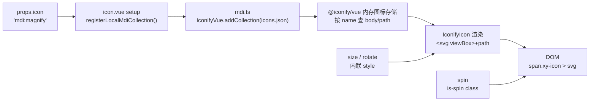
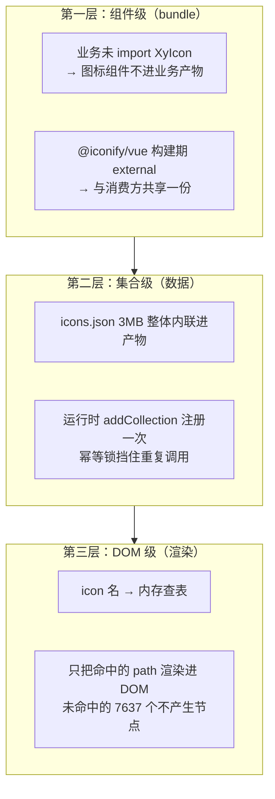
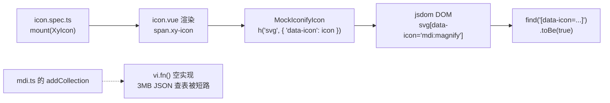

# 5-01 · Icon：全库图标基座

> 本篇是「组件解剖」章节的第一篇，回答一个贯穿全库的问题：**图标如何做到按需加载且测试可断言？** 选 `icon` 做标本，不是因为它复杂——它恰恰是全仓库源码最少的组件，`packages/components/icon/` 目录下只有四个文件、合计不足八十行——而是因为它的"小"是假象：对外它是 42 个组件源文件共同消费的视觉原子，对内它压着三笔不翻开源码就看不真的账——7638 个图标怎么进的产物、`vitest.setup.ts` 里 20 行 mock 怎么撑起全库图标断言、以及一段 `@keyframes` 怎么跨组件文件"借住"在 button 的样式里。所有路径、行号均在当前工作区逐一核对；文中三张 mermaid 图，第一张就是"图标数据到 DOM"的完整渲染链。

---

## 一、全库最小的组件，凭什么单开一篇

先看标本的全部家当：

```text
packages/components/icon/
├── index.ts                  # 8 行：withInstall 出口
├── src/
│   ├── icon.vue              # 37 行：组件本体
│   └── mdi.ts                # 15 行：图标集合注册器
└── __tests__/
    └── icon.spec.ts          # 35 行：两个用例
```

四十八行源码 + 八行出口，是全库 72 个组件里最轻的一个。但账不能只算自己头上——用 `rg -l 'XyIcon' packages/components/*/src/*.vue` 扫一遍，**42 个源文件**在消费它：`button` 的 loading 图标、`select` 的下拉箭头与清除叉、`alert` 的类型图标与关闭叉、`message`/`notification` 的状态图标、`tree`/`cascader`/`date-picker` 的展开箭头……图标是全库复用面最宽的原子组件，它的每一个设计决策都会被乘以 42。

动笔前先做两处勘误，这是读源码的价值所在：

**勘误一**：早前考据里提过的 `heading` prop，在当前源码中确认不存在——`icon.vue:7-12` 的 `IconProps` 只有 `icon / size / rotate / spin` 四个字段，没有 `heading`，也没有 `color`。

**勘误二**："icon 是 basic 组第一个组件"的说法与当前工作区不符。以 `packages/components/component-manifest.json` 为准，basic 组共 23 个组件，第一个是 `button`（manifest 第 3 行），`icon` 排在第 20 位（`component-manifest.json:180-187`）；`packages/components/exports.ts` 按字母序聚合，`export * from "./icon"` 在第 31 行。"第一个组件"是它早期提交史里的身份，不是清单里的位置——这份清单的排序故事，4-01 已经讲过，不重复。

## 二、渲染链：从 `"mdi:magnify"` 字符串到 DOM 上的 path

看组件本体全文。`packages/components/icon/src/icon.vue:1-37`：

```vue
<script setup lang="ts">
import { computed } from "vue"
import { Icon as IconifyIcon } from "@iconify/vue"
import { useNamespace } from "xiaoye-primitives"
import { registerLocalMdiCollection } from "./mdi"

export interface IconProps {
  icon: string
  size?: number | string
  rotate?: number
  spin?: boolean
}

const props = withDefaults(defineProps<IconProps>(), {
  size: 16,
  rotate: 0,
  spin: false
})

registerLocalMdiCollection()

const ns = useNamespace("icon")
const pixelSize = computed(() =>
  typeof props.size === "number" ? `${props.size}px` : props.size
)
const style = computed(() => ({
  width: pixelSize.value,
  height: pixelSize.value,
  transform: `rotate(${props.rotate}deg)`
}))
</script>

<template>
  <span :class="[ns.base.value, ns.is('spin', props.spin)]" aria-hidden="true">
    <IconifyIcon :icon="props.icon" :style="style" focusable="false" />
  </span>
</template>
```

这个组件的渲染模型一句话就能说完：**本库不渲染 SVG，`@iconify/vue` 渲染**。`icon.vue` 自己只做三件事——声明契约、注册数据源、包一层语义 span。展开成链路是这样：



逐段拆开看。

**第一段，`icon` 是必填的裸字符串**（`icon.vue:8`）。没有枚举、没有联合类型、没有组件注册表——这就是本库图标的"协议"：一个 Iconify 图标名。协议有多松，责任就有多清晰地分出去：名字对不对，由 Iconify 的数据集说了算；渲染不出来，是字符串写错了，而不是组件的 bug。这个选择的代价与收益，第三节用一整节算。

**第二段，`registerLocalMdiCollection()` 出现在组件 `setup` 里**（`icon.vue:20`）。这是一处"防御性 redundant"的设计：注册函数内部有模块级幂等锁（见下节），理论上在入口处调一次就够。但把它放进每个实例的 setup，意味着**任何组件只要 import 了 XyIcon 并挂载，图标数据就一定就位**——消费方永远不需要知道"要先注册集合"这件内部事。幂等锁让重复调用退化成一次布尔判断，开销可以忽略；换来的是零配置的正确性。这是"库作者多担一点，使用方少知道一点"的典型落点。

**第三段，尺寸与旋转走内联 style，动画走 class**（`icon.vue:23-30, 33-37`）。`pixelSize` 对 `number` 补 `px`、对 `string` 原样直通——这个细节在第五节的 alert 里有戏剧性的用法。`rotate` 拼进 `transform`，`spin` 不进 style，而是变成 `is-spin` class（`useNamespace` 的 `is` 方法，`packages/xiaoye-primitives/src/composables/use-namespace.ts:8`：`active ? \`is-${state}\` : ""`），让动画完全由样式层接管：

```ts
export function useNamespace(block: string) {
  const { namespace } = useConfig();
  const base = computed(() => `${namespace.value}-${block}`);

  const is = (state: string, active?: boolean) => (active ? `is-${state}` : "");
```

**第四段，`aria-hidden="true"` 打头**（`icon.vue:34`）。包装层 span 对无障碍树隐身，文档的使用建议（`apps/docs/components/icon.md:34`）随之而来："用在按钮里的纯图标场景时，应补上 `aria-label`"。也就是说本库的立场是：**图标默认是装饰品，语义由消费场景补**——这比"图标组件自带 role=img"的方案更能防止双重朗读。

四段合起来，业务方的使用面就是这个形状——`apps/docs/examples/icon/basic.vue:15-21`，一行字符串一枚图标，`spin` 一个布尔开动画：

```vue
      <xy-space wrap>
        <xy-icon icon="mdi:magnify" />
        <xy-icon icon="mdi:information-outline" />
        <xy-icon icon="mdi:close" />
        <xy-icon icon="mdi:chevron-down" />
        <xy-icon icon="mdi:loading" spin />
      </xy-space>
```

## 三、数据源：mdi.ts，15 行注册器的三层职责

`packages/components/icon/src/mdi.ts:1-15`，全文如下：

```ts
import * as IconifyVue from "@iconify/vue";
import mdiCollection from "@iconify-json/mdi/icons.json";

let mdiCollectionRegistered = false;

export const LOCAL_MDI_COLLECTION = mdiCollection;

export function registerLocalMdiCollection() {
  if (mdiCollectionRegistered || typeof IconifyVue.addCollection !== "function") {
    return;
  }

  IconifyVue.addCollection(LOCAL_MDI_COLLECTION);
  mdiCollectionRegistered = true;
}
```

十五行代码干了三层事：**导入一整个图标数据集、给注册动作加幂等锁、把集合灌进 Iconify 的运行时存储**。对 `node_modules/@iconify-json/mdi/icons.json` 实测：`prefix: "mdi"`，**7638 个图标 + 6363 个别名，文件 3,096,165 字节**（约 3MB）。每个图标的形态是紧凑 JSON，比如 `magnify`：

```json
{ "body": "<path fill=\"currentColor\" d=\"M9.5 3A6.5 6.5 0 0 1 16 9.5c0 1.61-.59 3.09-1.56 4.23l.27.27h.79l5 5l-1.5 1.5l-5-5v-.79l-.27-.27A6.52 6.52 0 0 1 9.5 16A6.5 6.5 0 0 1 3 9.5A6.5 6.5 0 0 1 9.5 3Z\"/>", "width": 24, "height": 24 }
```

注意 `fill="currentColor"`——后面第五节讲"为什么没有 color prop"时它是主角。`addCollection` 之后，这 3MB 数据常驻 Iconify 的内存存储；`icon.vue:35` 的 `IconifyIcon :icon="props.icon"` 每次渲染都是一次**内存按名查表**，查到就把 `body` 里的 path 组装进 `<svg>`。

### 权衡一：逐图标摇树 vs 集合注册（含 EP 对比）

这是本篇最核心的权衡，先摆出 Element Plus 的方案作为参照系（口径：EP 2.x 的公开架构，以官方仓库与文档为准）。EP 的图标是**独立发包**：`@element-plus/icons-vue` 单独维护，里面**每个图标是一个独立的 Vue 组件**（`<Search />`、`<Close />`），业务按需 import 具名组件，靠 ESM tree-shaking 把没 import 的图标从产物里摇掉；组件层的 `<el-icon>` 则是个不渲染 path 的"壳"，用 `size`/`color` props 控制视觉，图标组件作为插槽内容传进去。本库的选择几乎在每一步都反着来：

| 维度 | EP：`@element-plus/icons-vue` | 本库：Iconify 集合注册 |
| --- | --- | --- |
| 发布形态 | 独立 npm 包，与组件包分离 | 图标数据内联进组件包产物 |
| 按需单位 | 逐图标组件，tree-shaking 摇掉未用 | 集合一次性注册，运行时按名查表 |
| API 形态 | 具名组件 `<Search />`，TS 类型天然锁定 | 字符串 `"mdi:magnify"`，无编译期校验 |
| 数据规模 | 内置集合有限（数百个），超出要自己画 | MDI 7638 个起步，Iconify 生态全量可接 |
| 新增图标成本 | 等包更新或自己封装组件 | 改一个字符串 |

两条路线没有绝对优劣，实质是**把成本记在哪本账上**。EP 的逐图标摇树把"产物体积"责任交给了打包器和业务方的自律——每个用到的图标都要显式 import；换来的是产物里只有用到的图标。本库的集合注册把"体积"一次性吃下（产物里躺着全量 7638 个图标，无论业务用几个），换来的是：字符串即协议、零注册成本、离线可用、以及一份数据源同时喂饱 42 个内部消费点。对一个组件库而言，**内部 42 处消费若走 EP 路线，就得维护 42 处具名 import 的依赖图；走集合路线，只需保证一个字符串拼写正确**。3MB 体积是明码标价的账，第四节算给看。

### 权衡二：主入口带 API 回退，是口子还是保险

一个容易忽略的事实：`icon.vue:3` 导入的是 `@iconify/vue` 主入口。这个包有两组入口——主入口 `.`（实测 node_modules 内 `dist/iconify.mjs`）自带 Iconify 公共 API 的运行时加载能力，子入口 `./offline` 才是纯本地渲染。也就是说，当前源码下，**一个未注册进本地集合的名字（比如 `logos:vue`）在浏览器里默认会尝试走网络从 Iconify API 拉取**。本库没有关闭这个能力，同时用全量 MDI 集合把"文档示例与内置组件的常用名"全部钉在离线侧。效果是双层的：常用路径完全离线确定（测试、SSR、内网环境零网络依赖）；长尾需求留了运行时口子，不必为冷门图标重新发包。把口子留给消费方，把确定性留给自己——这是我认为本库在这件事上最划算的站位。

## 四、"按需"的真实口径：三层按需，没有一层是"逐图标摇树"

上一节的对比里反复出现"按需"这个词，现在给出本库的精确口径。**本库的按需加载不是图标级的 tree-shaking**——`mdi.ts:2` 把整份 icons.json 作为单个模块导入，Rollup 不可能从一个 JSON 里摇掉没被引用的图标。真实的"按需"发生在三个不同层：



第三层才是 Iconify 模式的灵魂：**数据常驻内存、渲染按需发生**。全量数据为"任意名字随时可用"付费，DOM 只为"实际用到的那个"付费。配套的构建事实链如下。

`scripts/config/library-build.ts:16-35` 的外置清单（`@iconify/vue` 在列，`@iconify-json/mdi` 不在列）：

```ts
export const libraryExternal = [
  "vue",
  "vue-router",
  "xiaoye-primitives",
  "@iconify/vue",
  "@floating-ui/dom",
  "async-validator",
  "dayjs",
  /^echarts(?:\/.+)?$/,
  "@fullcalendar/core",
  "@fullcalendar/core/locales/zh-cn",
  "@fullcalendar/daygrid",
  "@fullcalendar/interaction",
  "@fullcalendar/timegrid",
  "@fullcalendar/vue3",
  "howler",
  "sortablejs",
  "vditor",
  "video.js"
];
```

不在 external 清单里的 import 会被 Rollup 内联进产物。实测 `packages/components/dist/index.js`：**3.7MB，其中 `"magnify"` 出现 37 次**——icons.json 的数据确实躺在产物里；而文件头部保留着 `import { Icon as Me } from "@iconify/vue"`——运行时依赖保持外置。

依赖声明也和这个事实严格对齐：`packages/components/package.json:60` 把 `@iconify/vue` 列入 `dependencies`（消费方安装组件包时自动带上运行时依赖）；而 `@iconify-json/mdi` **只出现在仓库根 `package.json:48` 的 `devDependencies`**——因为构建后 JSON 已经内联，发布包根本不需要这个依赖，声明成运行时依赖反而是错的。这条"构建期内联 + devDependencies 声明"的配合，是 2-02 讲过的 `createLibraryConfig` 工厂在 icon 上的一个具体战果。

### 权衡三：3MB 内联的代价账

把代价摆上台面：哪怕业务只用一个 `mdi:magnify`，产物里也躺着全量 MDI。这在"首屏字节敏感"的场景是真实成本（gzip 后会有明显缩水，但终究不是零）。本库接受这笔账的理由有三：其一，组件库的图标消费是"复利型"的——42 个内部消费点加上业务自定义场景，实际项目几乎不可能只用到一两个图标，摊薄后单价极低；其二，离线确定性是硬需求——测试、SSR、内网部署都不该被一张图标网卡住；其三，Iconify 生态的全量图标名即取即用，省掉的是"每次要新图标都要动组件库"的发布成本。若某天体积成为真问题，退路也是现成的：换成 Iconify 官方的按需产物管线，或收缩注册集合——届时只需要改 `mdi.ts` 一个文件，42 个消费点一行不动。**把变化面收在一个 15 行文件里，正是这个设计最值钱的地方。**

## 五、消费面：42 处内置消费怎么喂图标

先看 select 的证据段。图标常量与默认值定义在 `packages/components/select/src/select.ts:70-71`：

```ts
export const DEFAULT_CLEAR_ICON = "mdi:close-circle";
export const DEFAULT_SUFFIX_ICON = "mdi:chevron-down";
```

模板侧的四处消费。`packages/components/select/src/select.vue:659-667`（前缀图标）：

```vue
      <span v-if="$slots.prefix || props.prefixIcon" class="xy-select__prefix">
        <slot name="prefix" />
        <XyIcon
          v-if="props.prefixIcon"
          class="xy-select__icon"
          :icon="props.prefixIcon"
          :size="16"
        />
      </span>
```

`select.vue:702-717`（清除叉与下拉箭头；同一个 `clearIcon` 在多选标签里是 `:size="12"`——`select.vue:684`，在输入框清除按钮里是 `:size="16"`，同一份数据两种密度）：

```vue
      <span class="xy-select__actions" :class="{ 'has-clear': props.clearable && selectedValues.length && !selectDisabled }">
        <button
          v-if="props.clearable && selectedValues.length && !selectDisabled"
          type="button"
          class="xy-select__clear"
          aria-label="clear"
          @click="clearValue"
        >
          <XyIcon :icon="props.clearIcon" :size="16" />
        </button>
        <span class="xy-select__caret">
          <slot name="suffix">
            <XyIcon class="xy-select__icon" :icon="props.suffixIcon" :size="16" />
          </slot>
        </span>
      </span>
```

再看 alert 的证据段。类型图标映射是**数据不是模板**——五种状态对应五个名字，收在常量表里，`packages/components/alert/src/alert.ts:74-82`：

```ts
export const ALERT_TYPE_ICON_MAP: Record<AlertType, string> = {
  primary: "mdi:information-outline",
  success: "mdi:check-circle-outline",
  info: "mdi:information-outline",
  warning: "mdi:alert-circle-outline",
  error: "mdi:close-circle-outline"
};

export const ALERT_CLOSE_ICON = "mdi:close";
```

`packages/components/alert/src/alert.vue:401-412` 用一个 computed 把状态翻成图标名（`alert.vue:82`：`const iconName = computed(() => ALERT_TYPE_ICON_MAP[props.type])`）：

```vue
      <span
        v-if="props.showIcon"
        :class="[
          `${ns.base.value}__icon`,
          ns.is('big', hasDescription)
        ]"
        aria-hidden="true"
      >
        <slot name="icon">
          <XyIcon :icon="iconName" :size="iconSize" />
        </slot>
      </span>
```

这两段合起来能读出本库"喂图标"的三条纪律：

**纪律一，字符串常量收口在 `*.ts`，模板只消费常量或 prop。** select 的默认箭头、alert 的五状态映射都是导出常量，好处有两个：业务覆盖时传的是同构的 `string` prop（`suffixIcon`/`clearIcon` 声明在 `select.ts:49-50`，`withDefaults` 的默认值在 `select.vue:50-51`），不存在"组件内置图标"和"业务自定义图标"两套 API；同时这批 `mdi:*` 名字天然被 42 处消费共享同一份集合数据，不存在重复打包。

**纪律二，尺寸优先交 CSS 变量。** alert 的图标尺寸不是写死的数字，`alert.vue:99-101`：

```ts
const iconSize = computed(() =>
  `var(${hasDescription.value ? "--xy-alert-icon-large-size" : "--xy-alert-icon-size"})`
);
```

一个 `var(...)` 字符串被直接传进 `size` prop——这正是第二节说"`pixelSize` 对 string 原样直通"的用武之地：`icon.vue` 的 size 既能吃 `16`，也能吃 `var(--xy-alert-close-font-size)`（见 `alert.vue:481` 的关闭叉）。尺寸语义被上交到主题层，组件层只负责透传。双主题下 alert 大小图标随令牌缩放，靠的就是这条通道。

**纪律三，颜色不进 API。** 42 处消费点没有任何一处给图标传过颜色——因为 Iconify 的 path 数据统一 `fill="currentColor"`（第三节看过 magnify 的 body），而 `packages/theme/src/components/icon.css:6` 给包装层定了 `color: currentColor`。图标永远继承所在环境的文字色：alert 的 warning 色染图标，button 的 hover 态染 loading 图标，一行 CSS 都不用多写。

### 权衡四：不给 color prop（对比 `el-icon` 的 `color`）

EP 的 `<el-icon>` 提供独立的 `color` prop，图标色可以在组件实例上单独指定。本库没有这个 prop——这是一个有意的减法。带 color prop 的方案把"图标色"变成组件作用域的局部决定，42 个消费点就可能写出 42 种上色姿势，主题切换时每一处都是漏网点；`currentColor` 协议把颜色决定权归还给排版层（谁的文字色，图标就是谁的色），语义色由 alert/status 这类"拥有语义的容器"统一给。代价是"图标想脱离文字色单独变色"需要多写一行 CSS——本库认为这笔代价远小于 42 处消费点的颜色失治。**图标是文字的附属品，这个立场写进了 API 的形状里。**

## 六、测试可断言：一个全局 mock 立起的契约

现在回答核心问题的后半句。先看 icon 自己的测试全文，`packages/components/icon/__tests__/icon.spec.ts:1-35`：

```ts
import { mount } from "@vue/test-utils";
import { defineComponent, h } from "vue";
import { describe, expect, it, vi } from "vitest";
import { XyIcon } from "@xiaoye/components";

describe("XyIcon", () => {
  it("透传 icon 并保留包装层样式", () => {
    const wrapper = mount(XyIcon, {
      props: {
        icon: "mdi:magnify"
      }
    });

    expect(wrapper.classes()).toContain("xy-icon");
    expect(wrapper.find('[data-icon="mdi:magnify"]').exists()).toBe(true);
  });

  it("支持 size、rotate 和 spin", () => {
    const wrapper = mount(XyIcon, {
      props: {
        icon: "mdi:loading",
        size: 20,
        rotate: 90,
        spin: true
      }
    });

    const svg = wrapper.find('[data-icon="mdi:loading"]');

    expect(wrapper.classes()).toContain("is-spin");
    expect(svg.attributes("style")).toContain("width: 20px");
    expect(svg.attributes("style")).toContain("height: 20px");
    expect(svg.attributes("style")).toContain("rotate(90deg)");
  });
});
```

疑点立刻浮现：测试在找 `[data-icon="mdi:magnify"]`，但 `icon.vue` 的模板里**根本没有** `data-icon` 这个属性。这个属性从哪来？答案在仓库根的测试环境配置里——`vitest.config.ts:13` 声明 `setupFiles: ["./vitest.setup.ts"]`，而 `vitest.setup.ts:1-20` 全文只有一件事：

```ts
import { defineComponent, h } from "vue";
import { vi } from "vitest";

// 全局 mock @iconify/vue，解决 mdi.ts 使用 addCollection 的问题
vi.mock("@iconify/vue", () => ({
  Icon: defineComponent({
    name: "MockIconifyIcon",
    inheritAttrs: false,
    props: {
      icon: {
        type: String,
        required: true
      }
    },
    setup(props, { attrs }) {
      return () => h("svg", { ...attrs, "data-icon": props.icon });
    }
  }),
  addCollection: vi.fn()
}));
```

这套 mock 的机制值得逐行读。`vi.mock("@iconify/vue", ...)` 对**全仓库所有测试文件**生效（setupFiles 全局加载），把真实的 Iconify Icon 组件替换成一个 12 行的替身：接受 `icon` prop，渲染一个 `<svg>`，并把 `icon` 的值写进 `data-icon` 属性。于是"图标渲染对不对"被转译成"**这个 svg 带没带正确的 `data-icon` 名字**"——一个 jsdom 里完全可断言的 DOM 事实。断言链完整走一遍：



为什么必须 mock，而不是让真实 Iconify 在 jsdom 里渲染？两个硬理由。其一，真实的 `@iconify/vue` Icon 是**异步水合**的组件——它先渲染占位，等图标数据就位（本地集合同步、API 异步）后再补全 DOM，测试里要额外等待微任务甚至网络，断言变得又慢又脆。其二，测试关注点本来就不该是"path 数据画得对不对"——那是 Iconify 数据集的事——而是"**名字有没有被正确传递、尺寸旋转有没有被正确应用、spin class 有没有被正确挂上**"。mock 恰好把前者整个屏蔽，把后者完整保留：`icon.spec.ts:31-33` 对 style 的三段断言，断的全是 icon.vue 自己产出的内联样式。

这个契约的成本被全库均摊后近乎为零，而收益是复利的：`rg -l 'data-icon' packages/components/*/__tests__/*.spec.ts` 命中 **19 个测试文件**，覆盖 alert、select、button、tag、breadcrumb、result、steps、progress 等消费组件——比如 `button.spec.ts:125` 的 `find('[data-icon="mdi:magnify"]')`、`button.spec.ts:146` 的 `.not` 断言（loading 插槽存在时内置 loading 图标不渲染）。**42 个消费组件的图标行为，全部共享同一条 20 行 mock 立起来的断言协议。**协议本身也被类型层反向锁了一道——`tests/types/fixtures/icon.ts:14-17` 用 `@ts-expect-error` 保证 `icon` 必填，`icon.spec.ts` 的两个用例则保证运行时契约不漂移。

顺带记录一处小瑕疵：`icon.spec.ts:2` 引入的 `defineComponent` 和 `h` 在该文件内并未使用——mock 的真实实现住在 `vitest.setup.ts`，这两行是搬家后留下的空引入，无功能影响。

### 权衡五：mock 断言 vs 真渲染快照

另一种做法是让真实 Iconify 渲染、对 svg 做 snapshot 或 `innerHTML` 断言。没有选它的理由：快照会把 3MB 数据集里 path 的任何一次上游更新（`@iconify-json/mdi` 升级）都变成测试红——而 path 形状的变化与本库无关；`data-icon` 契约则把断言锚在**本库真正拥有的东西**（名字的传递）上，上游数据怎么变都不影响。视觉层面的最终确认交给 `pnpm audit:visual` 的双主题像素巡检，那才是"画得对不对"的正确法庭。**单测断行为契约，像素巡检断视觉事实，两层各管各的。**

## 七、样式：22 行 CSS 与一个跨文件借住的 keyframes

`packages/theme/src/components/icon.css:1-22`，全文：

```css
.xy-icon {
  display: inline-flex;
  align-items: center;
  justify-content: center;
  flex-shrink: 0;
  color: currentColor;
  line-height: 1;
  vertical-align: -0.125em;
  transition:
    color var(--xy-transition-duration-fast) var(--xy-transition-timing),
    opacity var(--xy-transition-duration-fast) var(--xy-transition-timing),
    transform var(--xy-transition-duration-fast) var(--xy-transition-timing);
}

.xy-icon > * {
  display: block;
}

.xy-icon.is-spin > * {
  transform-origin: center;
  animation: xy-spin 0.9s linear infinite;
}
```

几处值得停笔的细节：`vertical-align: -0.125em` 是图标与文字基线对齐的经典手法（让图标跟着字号下沉一点，视觉居中于 x-height）；`line-height: 1` 与 `inline-flex` 一起把包装层压成纯容器；`transition` 挂在 `color` 上，让主题切换或状态变化时图标颜色平滑跟随。动画本体不在这里——`@keyframes xy-spin` **定义在 `packages/theme/src/components/button.css:429-433`**：

```css
@keyframes xy-spin {
  to {
    transform: rotate(360deg);
  }
}
```

这是本次核对发现的**隐藏耦合**：icon 的 spin 动画依赖 keyframes，keyframes 却住在 button 的样式文件里（全 theme 包 `rg 'xy-spin'` 仅这两个文件命中）。在 `packages/theme/index.css:7` 的聚合入口（`@import "./src/components/icon.css"`）下，`style.css` 全量引入，两者同页共存，一切正常；但若消费方按 manifest 的 `styleImports: ["icon"]` 只引 icon 一份样式，`xy-spin` 不存在，图标会静默地静止——不报错、不丢图标，只是不转。这是一个"聚合入口兜底了脆弱性"的案例：功能成立依赖引入方式，而引入方式在主路径上恰好总是对的。稳妥的修法是把 keyframes 上提到 base 层或让 icon.css 自持一份；本篇如实记下现状，不越权代改。

## 八、类型契约：从 BuiltinIconName 到 string 的迁移史

用 git 考古收尾类型这章。仓库初始版本（`ff2024b`）的 icon 是**自绘方案**：`src/icons.ts` 维护一个内置 path 映射：

```ts
export const builtinIcons = {
  search:
    "M11 4a7 7 0 1 0 4.95 11.95l4.55 4.55 1.5-1.5-4.55-4.55A7 7 0 0 0 11 4Zm0 2a5 5 0 1 1 0 10a5 5 0 0 1 0-10Z",
  close:
    "M6.97 5.53 12 10.56l5.03-5.03 1.44 1.44L13.44 12l5.03 5.03-1.44 1.44L12 13.44l-5.03 5.03-1.44-1.44L10.56 12 5.53 6.97l1.44-1.44Z",
  chevronDown: "m7 10 5 5 5-5 1.5 1.5L12 18 5.5 11.5 7 10Z",
  info:
    "M12 2a10 10 0 1 0 10 10A10.01 10.01 0 0 0 12 2Zm1 15h-2v-6h2Zm0-8h-2V7h2Z",
  spinner:
    "M12 2a1 1 0 0 1 1 1v3.06a1 1 0 1 1-2 0V3a1 1 0 0 1 1-1Zm0 14.94a1 1 0 0 1 1 1V21a1 1 0 1 1-2 0v-3.06a1 1 0 0 1 1-1Zm10-4.94a1 1 0 0 1-1 1h-3.06a1 1 0 1 1 0-2H21a1 1 0 0 1 1 1ZM7.06 12a1 1 0 0 1-1 1H3a1 1 0 1 1 0-2h3.06a1 1 0 0 1 1 1Zm10.6 7.02a1 1 0 0 1-1.42 0l-2.17-2.16a1 1 0 1 1 1.42-1.42l2.17 2.17a1 1 0 0 1 0 1.41ZM9.35 8.77a1 1 0 0 1-1.42 0L5.77 6.6a1 1 0 1 1 1.42-1.42l2.16 2.17a1 1 0 0 1 0 1.42Zm8.31-1.58L15.5 9.35a1 1 0 0 1-1.42-1.42l2.17-2.16a1 1 0 0 1 1.41 1.42ZM9.35 15.23a1 1 0 0 1 0 1.42L7.19 18.8a1 1 0 1 1-1.42-1.42l2.16-2.16a1 1 0 0 1 1.42.01Z"
} as const;

export type BuiltinIconName = keyof typeof builtinIcons;
```

五枚手绘 path，`name` prop 是 `keyof typeof builtinIcons` 联合类型，模板里自己写 `<svg viewBox="0 0 24 24" fill="currentColor"><path :d="path" /></svg>`。这条路很快走到了头：五个图标不够 42 个消费点分，手绘 path 又不可扩展。随后的提交把方案整个换成了 Iconify——`name` prop 变成 `icon` 字符串，`BuiltinIconName` 类型删除，`src/icons.ts` 消失，取而代之的是 `src/mdi.ts`。**API 的断裂被类型夹具永久存档**，`tests/types/fixtures/icon.ts:1-29` 全文：

```ts
import type { IconProps } from "xiaoye-components";
// @ts-expect-error BuiltinIconName has been removed after switching to Iconify
import type { BuiltinIconName } from "xiaoye-components";

const props: IconProps = {
  icon: "mdi:magnify",
  size: 16,
  rotate: 90,
  spin: true
};

void props;

// @ts-expect-error icon is required
const invalidMissingIcon: IconProps = {
  size: 16
};

void invalidMissingIcon;

const invalidLegacyName: IconProps = {
  icon: "mdi:magnify",
  // @ts-expect-error legacy name prop has been removed
  name: "search"
};

void invalidLegacyName;

void (0 as unknown as BuiltinIconName);
```

三十行夹具立了三道反向锁：`icon` 必填（缺了要编译报错）、旧 `name` prop 已死（用了要编译报错）、`BuiltinIconName` 类型已死（导不进来）。旧世界的痕迹被刻意留在报错信息里，任何人试图回退都会在 `pnpm typecheck:types` 处撞墙——这比 CHANGELOG 里的一行字有力得多。

出口层则薄到极致，`packages/components/icon/index.ts:1-8` 全文：

```ts
import Icon from "./src/icon.vue";
import type { IconProps } from "./src/icon.vue";
import { withInstall } from "xiaoye-primitives";

export type { IconProps };

export const XyIcon = withInstall(Icon, "xy-icon");
export default XyIcon;
```

`withInstall` 的细节 4-02 讲过，不重复；`IconProps` 是本组件唯一对外类型——对比第四节说的"字符串协议"，类型面小到只剩契约本身。

## 九、复盘与勘误表

把全篇收拢成四句话。**其一**，本库的"图标按需"是三层结构：组件级 tree-shaking（bundle）、集合级一次性内联（3MB 换离线确定性）、DOM 级按名渲染（Iconify 模式灵魂）——唯独没有图标级摇树，这与 EP 的 `@element-plus/icons-vue` 路线是两条完整的、各自自洽的路线。**其二**，测试可断言靠的是 `vitest.setup.ts` 的 20 行全局 mock：真实渲染被短路，`data-icon` 成为全库共享的断言协议，42 个消费组件的测试免费搭车。**其三**，API 上做减法（无 color、无枚举名、单必填字符串）的前提是样式协议做加法（`currentColor` + CSS 变量尺寸直通），减掉的每个 prop 都有协议兜底。**其四**，两处现状值得记账：`xy-spin` keyframes 借住在 button.css 的跨文件依赖，以及 spec 里两行未使用的引入。

勘误与修正清单（对既有叙述的核对结果）：

| 既有叙述 | 核对结果 |
| --- | --- |
| icon 有 `heading` prop | 不存在，`IconProps` 仅 `icon/size/rotate/spin`（`icon.vue:7-12`） |
| icon 是 basic 组第一个组件 | 不是，manifest 中 basic 第一个是 `button`，`icon` 排第 20（`component-manifest.json:180-187`） |
| 图标集合是"单文件映射 or 逐图标文件" | 都不是：第三方全量 JSON（`@iconify-json/mdi`，7638 图标），仓库内仅 15 行注册器（`mdi.ts`） |
| （新增发现）icon 的 spin 动画自足 | 不自足：`xy-spin` 定义于 `button.css:429`，icon.css 跨文件引用 |

## 十、下一篇

这篇里 icon 反复以配角身份出场：`button.spec.ts:125` 断言 `data-icon="mdi:magnify"`，`button.css:429` 收留着 icon 的 spin keyframes，而 button 自己也在 `button.vue:136` 用 `<XyIcon :icon="props.loadingIcon" spin />` 画 loading 态。下一篇回到主语本身——**5-02《Button：最标准的解剖样本》**。虽然 4-03 已经用 button 走过一遍"类型层/视图层/逻辑层"的目录解剖，但那次 focus 在结构模板上；5-02 要回答的是大纲里的原始问题：**一个"简单"按钮里到底藏了多少防御？**——`loading` 态如何冻结交互、双击节流与 `form` 原生提交的边界、`xy-button-group` 的依附形态、以及那个被 42 处消费的图标在按钮里如何与文字排版共处。我们从 `packages/components/button/` 的完整防御工事开始拆。
