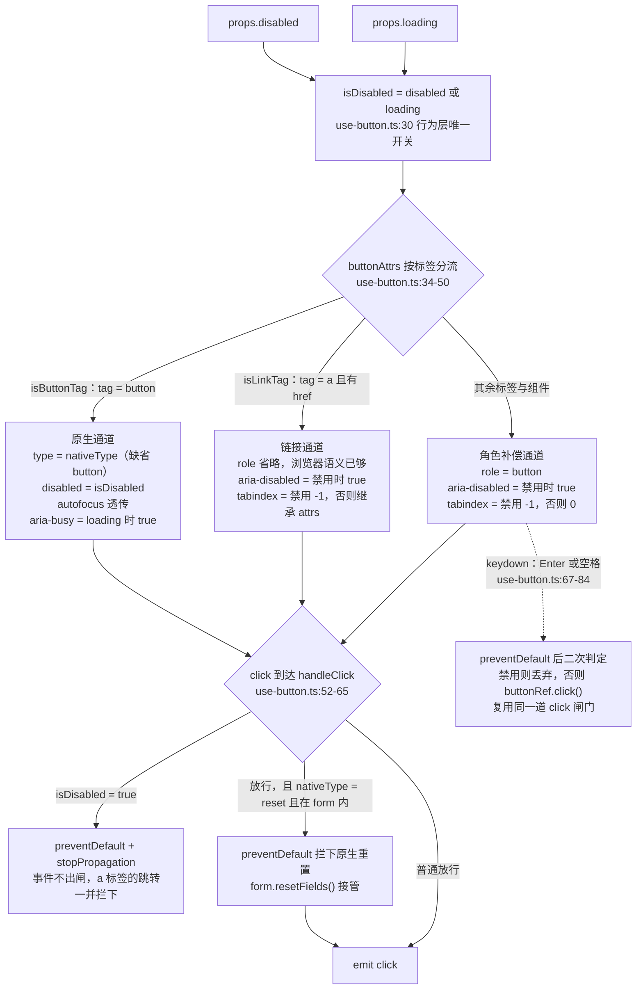
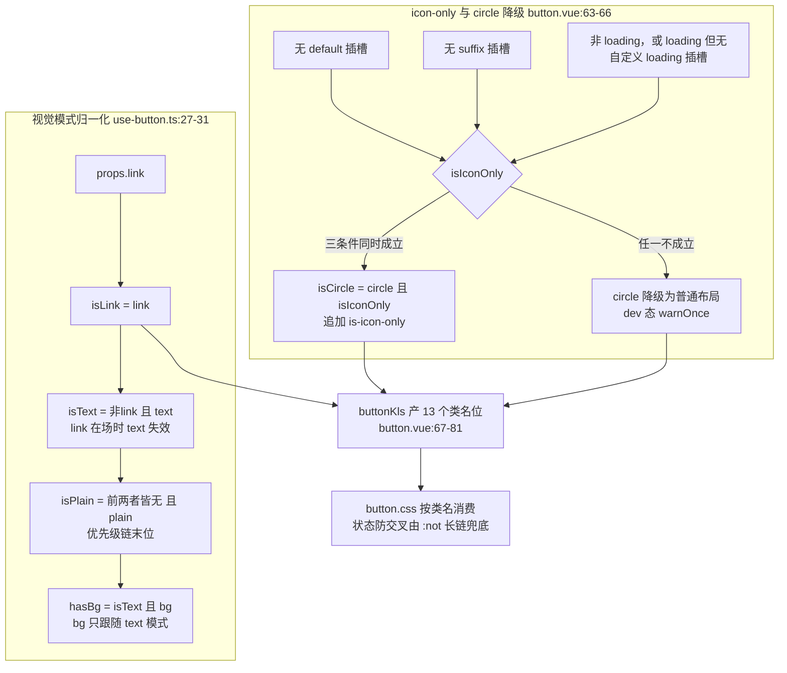

# 5-02 · Button：最标准的解剖样本

> 4-03 已经拿 button 把"三件套结构模式"解剖过一遍：`index.ts` 安装出口、`src/button.ts` 类型层、`button.vue` 视图层、`use-button.ts` 逻辑层各归其位。结构那一课本篇不再重复，只在做完结构判断之后追问一句——**一个"简单"按钮里，到底藏了多少防御？** 我们把 loading 禁点、aria 分流、标签归一、上下文级联、事件闸门、CSS 状态防交叉、按钮组拼缝、开发态警告和类型夹具逐一翻出来看。所有代码均摘自当前工作区实态，行号逐一核对过。

## 一、先把"防御"数出来

在动手分析之前，先做一次盘点。把 `packages/components/button/` 加上样式侧 `packages/theme/src/components/button.css` 摊开，这个"最简单的组件"身上能数出至少十道防御：

1. **loading 态禁点**：`loading` 不只是转圈动画，它直接并入禁用判定（`use-button.ts:30`），`click` 事件在闸门处被拦截；
2. **disabled 与 aria-disabled 分流**：原生 `button` 用 `disabled` 属性，非按钮标签改用 `aria-disabled` + `tabindex=-1` 表达同一语义（`use-button.ts:34-50`）；
3. **native type 归一**：`nativeType` 的合法值被 `buttonNativeTypes` 数组收敛为三值，缺省归一为 `"button"`，且只在真 `button` 标签上渲染（`button.ts:13`、`button.vue:11`、`use-button.ts:37`）；
4. **autofocus 处理**：仅在原生 button 分支透传，非按钮标签不透传也不模拟（`use-button.ts:39`）；
5. **tag 渲染归一**：根标签可以是 `button` / `a` / `div` / 任意组件，三条渲染通道各自补齐缺失的语义（`use-button.ts:23-32`）；
6. **group 上下文继承**：`size` 与 `type` 走 self → group → global 三级回退（`use-button.ts:17-22`）；
7. **form 联动防御**：`native-type="reset"` 在表单内不依赖浏览器默认行为，而是拦下事件后显式调 `form.resetFields()`（`use-button.ts:59-62`）；
8. **视觉模式归一化**：`plain` / `text` / `link` 三个互斥 prop 按 `link > text > plain` 静默归一，`bg` 只跟随 `text`（`use-button.ts:27-31`）；
9. **icon-only 误判防御**：`circle` 只在"纯图标按钮"上生效，带文本、suffix 或自定义 loading 内容时降级并警告（`button.vue:63-66、98-103`）；
10. **CSS 状态防交叉**：实色态的 hover/active 选择器挂了五个 `:not()`，防止 plain/text/link 形态吃进实色态的悬浮样式（`button.css:87-100`）。

这还只是运行时行为层。加上 CSS 侧的状态色六件套消费、focus-visible 双层光圈、按钮组的 `-1px` 拼缝与 `z-index` 管理，再算上测试侧为每道防御逐一立的回归用例——防御的总面积已经超过了"功能"本身的面积。**这就是本篇的核心论点：一个成熟组件库里，按钮的代码量花在"什么时候不许响应"上的，比花在"怎么响应"上的多。**

先看契约面。`packages/components/button/src/button.ts` 全文 40 行，Props 接口里的每一个可选字段，几乎都对应上面清单里的一道防御：

```ts
// packages/components/button/src/button.ts（全文，共 40 行）
import type Button from "./button.vue";
import type { Component } from "vue";
import type { ComponentSize } from "xiaoye-primitives";

export const buttonTypes = [
  "default",
  "primary",
  "success",
  "warning",
  "danger"
] as const;

export const buttonNativeTypes = ["button", "submit", "reset"] as const;

export type ButtonType = (typeof buttonTypes)[number];
export type ButtonNativeType = (typeof buttonNativeTypes)[number];
export type ButtonClickHandler = (event: MouseEvent) => void;

export const DEFAULT_LOADING_ICON = "mdi:loading";

export interface ButtonProps {
  size?: ComponentSize;
  disabled?: boolean;
  type?: ButtonType;
  icon?: string;
  nativeType?: ButtonNativeType;
  loading?: boolean;
  loadingIcon?: string;
  plain?: boolean;
  text?: boolean;
  link?: boolean;
  bg?: boolean;
  autofocus?: boolean;
  round?: boolean;
  circle?: boolean;
  block?: boolean;
  tag?: string | Component;
}

export type ButtonInstance = InstanceType<typeof Button>;
```

`plain` / `text` / `link` / `bg` 四个布尔字段是互斥组，`circle` 有生效前置条件，`tag` 打开了标签不确定性的口子——类型层的"可选"越多，运行时要防的组合就越多。类型层把这些自由度如实声明出来，防御的担子就落到了逻辑层。

## 二、逻辑层：101 行里的四条防线

防御的主战场是 `use-button.ts`。全文 101 行，无模板、无 DOM 操作，只接收 `props` 和 `attrs`，吐出一组 computed 和两个 handler：

```ts
// packages/components/button/src/use-button.ts（全文，共 101 行）
import { computed, inject, ref } from "vue";
import { useConfig } from "xiaoye-primitives";
import { formKey } from "../../form/src/context";
import type { ButtonProps, ButtonType } from "./button";
import { buttonGroupContextKey } from "./constants";

export function useButton(
  props: ButtonProps,
  attrs: Record<string, unknown>,
  emit: (event: "click", payload: MouseEvent) => void
) {
  const { size: globalSize } = useConfig();
  const form = inject(formKey, null);
  const buttonGroup = inject(buttonGroupContextKey, null);
  const buttonRef = ref<HTMLElement | null>(null);

  const resolvedSize = computed(
    () => props.size ?? buttonGroup?.size.value ?? globalSize.value
  );
  const resolvedType = computed<ButtonType>(
    () => props.type ?? buttonGroup?.type.value ?? "default"
  );
  const isButtonTag = computed(() => props.tag === "button");
  const isLinkTag = computed(
    () => props.tag === "a" && typeof attrs.href === "string" && attrs.href.length > 0
  );
  const isLink = computed(() => props.link);
  const isText = computed(() => !isLink.value && props.text);
  const isPlain = computed(() => !isLink.value && !isText.value && props.plain);
  const isDisabled = computed(() => props.disabled || props.loading);
  const hasBg = computed(() => isText.value && props.bg);
  const needsButtonRole = computed(() => !isButtonTag.value && !isLinkTag.value);

  const buttonAttrs = computed(() => {
    if (isButtonTag.value) {
      return {
        type: props.nativeType,
        disabled: isDisabled.value,
        autofocus: props.autofocus,
        "aria-busy": props.loading ? "true" : undefined
      };
    }

    return {
      role: needsButtonRole.value ? "button" : undefined,
      "aria-disabled": isDisabled.value ? "true" : undefined,
      "aria-busy": props.loading ? "true" : undefined,
      tabindex: isDisabled.value ? -1 : (needsButtonRole.value ? 0 : attrs.tabindex)
    };
  });

  function handleClick(event: MouseEvent) {
    if (isDisabled.value) {
      event.preventDefault();
      event.stopPropagation();
      return;
    }

    if (isButtonTag.value && props.nativeType === "reset" && form) {
      event.preventDefault();
      form.resetFields();
    }

    emit("click", event);
  }

  function handleKeydown(event: KeyboardEvent) {
    if (!needsButtonRole.value) {
      return;
    }

    if (event.key !== "Enter" && event.key !== " ") {
      return;
    }

    event.preventDefault();

    if (isDisabled.value) {
      event.stopPropagation();
      return;
    }

    buttonRef.value?.click();
  }

  return {
    buttonRef,
    buttonAttrs,
    handleClick,
    handleKeydown,
    hasBg,
    isLink,
    isPlain,
    isText,
    isButtonTag,
    isDisabled,
    needsButtonRole,
    resolvedSize,
    resolvedType
  };
}
```

### 2.1 第一道防线：loading 即禁用，行为一个开关

第 30 行是全文件最浓缩的一行：

```ts
const isDisabled = computed(() => props.disabled || props.loading);
```

`loading` 与 `disabled` 在**行为层**被合并成同一个开关，但在**视觉层**保持分离——类名上二者各走各的：`button.vue:71-72` 里 `ns.is("disabled", isDisabled.value)` 与 `ns.is("loading", props.loading)` 是两个独立的类。于是出现一个很有意思的分工：`is-loading` 在 433 行的 `button.css` 里**没有任何一条规则**（`.xy-button__icon--loading` 修饰符同样没有）——"转圈"由图标组件自身的 `spin` 动画承担，"不可点"由 `:disabled` / `.is-disabled` 承担，`is-loading` 类只作为状态钩子留给测试和业务方做样式挂载点。类名协议的纪律性在这里体现得很清楚：**类名是契约，不是样式的逐字镜像**。

合并的价值在哪？防御上，"重复提交"是按钮最经典的事故场景：用户在请求返回前连点三次。如果 `loading` 与 `disabled` 是两个独立状态，业务方就必须记得写 `:disabled="submitting"`；一旦忘了，按钮在转圈时照样可点。合并之后，`loading` 天然携带禁用语义，业务方想犯错都没有入口。文档侧 `apps/docs/components/button.md:51` 把这条约定写了出来（"`loading` 为 `true` 时也会走同一套禁用逻辑"），实现与文档互为印证。

### 2.2 第二道防线：互斥 prop 的静默归一化

第 27-31 行是一条由取反串起来的优先级链：

```ts
const isLink = computed(() => props.link);
const isText = computed(() => !isLink.value && props.text);
const isPlain = computed(() => !isLink.value && !isText.value && props.plain);
const isDisabled = computed(() => props.disabled || props.loading);
const hasBg = computed(() => isText.value && props.bg);
```

`link > text > plain` 的次序被编码进取反结构里：`link` 在场时 `text` 与 `plain` 全部失效，`text` 在场时 `plain` 失效；`bg` 只允许跟随 `text` 模式（`hasBg`），传给实色按钮或 link 按钮都不生效。归一化放在 computed 而不是 props 入口，有两个直接收益：用户传入的 props 原值不被篡改（`defineExpose` 与 dev 警告仍能读到原值）；归一结果是响应式的，`link` 动态变 `false` 时 `text` 立刻"复活"。

### 2.3 第三道防线：size 与 type 的上下文级联

第 17-22 行实现两条回退链：

- `resolvedSize`：props 显式传入 → 按钮组继承（`buttonGroupContextKey`）→ ConfigProvider 全局尺寸（`useConfig()`，缺省 `DEFAULT_SIZE = "md"`，见 `packages/xiaoye-primitives/src/composables/shared-context.ts:28`）；
- `resolvedType`：props 显式传入 → 按钮组继承 → 字面量 `"default"`。

注意第二条链的终点不是某个全局配置，而是写死的 `"default"`。这不是偷懒：**全局配置管的是密度（size），不管语义色（type）**——"全库默认按钮都是 primary"这种需求不该由 ConfigProvider 承载，那是业务主题层的决定。级联的每一跳都用 `??`，意味着 `undefined` 才能穿透，`false`、`""` 这类假值不会误穿透——这与 4-08 讲过的表单级联是同一套 `??` 语义。

### 2.4 第四道防线，也是一个反直觉的事实：button 不继承 form 的 disabled

这是本篇核对源码时最值得标记的一个发现。`use-button.ts:13` 确实注入了 `formKey`，但通读全文，form 上下文**只有一个消费者**——第 59-62 行的 `resetFields` 调用。表单级联链（config-provider → form → form-item → 控件，见 4-08）在 button 这里**没有 disabled 落点**：`isDisabled` 止步于 `props.disabled || props.loading`，`resolvedSize` 的级联也绕开了 form 层。4-09 讲 group 复合模式时提到过 checkbox-group 里"必须在 group 层插入 form 兜底"的修复——同样面对 form，checkbox 选择接住 `form.disabled`，button 却刻意不接。

这个分野在 Element Plus 上正好相反。EP 的 `useFormItem` 会把 form 与 form-item 的上下文同时注入 ElButton，`buttonDisabled` 的计算链是 `props.disabled || form.disabled || formItem.disabled`，size 也走 `props.size || formItem.size || form.size || global` 一路回退——在 EP 里，`<el-form disabled>` 一开，表单内所有按钮（包括"提交"按钮）一起变灰。本库 button 的选择意味着：`xy-form` 设 `disabled` 时，表单内的 `xy-button` **不会**被禁用，业务方要自己逐个传。

**权衡一：button 该不该继承 form 的 disabled？** 两边都有硬道理。继承派认为"表单禁用"是用户心智里的整体概念，漏掉按钮会造成"输入都灰了、提交还能点"的割裂体验；EP 的做法对表单场景更省心。不继承派的理由则是：**按钮是动作的发起者，不是表单的数据输入件**——"禁用整表单"最常见的语义是"这份数据此刻不可编辑"，而"取消""关闭""导出"这类与数据编辑无关的动作按钮被连带禁用反而是过度拦截；把决定权留在调用点，粒度更准。代价同样真实：业务方必须记住 button 不吃 form 级联，否则就会出现灰输入框配活按钮的界面。这是一笔没有标准答案的账，本库把它记在了"不继承"一侧，并且用测试把这个形态锁住——`button.spec.ts` 里没有任何"form disabled 禁用按钮"的用例，形态即契约。

把 2.1 到 2.4 的判定汇成一张流图，这就是 button 每次渲染、每次点击都要走一遍的级联判定：



两个容易漏看的细节。其一，`handleClick` 的禁用分支对 `a` 标签同样生效——`preventDefault` 拦的不只是事件，还有带 `href` 的链接跳转，测试 `button.spec.ts:162-182` 专门验证了这一点。其二，`handleKeydown` 只服务 `needsButtonRole` 的标签，而且它的禁用分支**不调 `preventDefault` 之外的任何事**——先 `preventDefault`（第 76 行）阻止页面滚动等默认行为，再 `stopPropagation` 后静默返回；键盘与鼠标最终汇入同一个 `click` 入口，闸门只需修一处。

## 三、tag 渲染归一与按钮组：上下文的两端

### 3.1 三条渲染通道

`buttonAttrs`（34-50 行）按标签分成三条通道，归一的判据是两个 computed：`isButtonTag`（23 行）看 `tag === "button"`；`isLinkTag`（24-26 行）要求 `tag === "a"` **且** `attrs.href` 是非空字符串——`<xy-button tag="a">` 不带 `href` 时会被判回"普通标签"，补 `role="button"`。这很严谨：无 `href` 的 `a` 在 HTML 语义里就是"占位链接"，不获得键盘焦点、不承诺跳转，把它当链接放行等于留了一个死链接。

三条通道各自的防御补齐：

- **原生通道**：`type`（nativeType）、`disabled`、`autofocus`、`aria-busy`。注意 `autofocus` **只在这一支透传**——原生 button 的自动聚焦是浏览器行为，非按钮标签上这个属性没有意义，组件也不去模拟它（没有 `onMounted` 里补 `focus()` 的代码）。防御策略是"不透传也不伪造"：与其给一个似是而非的跨标签行为，不如让语义跟随标签本体。
- **链接通道**：禁用时用 `aria-disabled="true"` 替代 `disabled` 属性——HTML 的 `a`/`div` 不认 `disabled`，硬输出一个无效属性只会污染 DOM；`tabindex` 在禁用时给 `-1` 把节点移出 Tab 焦点序，可用时透传 `attrs.tabindex`。
- **角色补偿通道**：`role="button"` + `tabindex="0"`，把任意标签升格为按钮语义，键盘协议由 `handleKeydown` 补齐。

`v-bind="buttonAttrs"` 的对象里，值为 `undefined` 的成员不会被渲染成属性（Vue 的属性绑定约定），所以 `aria-busy`、`aria-disabled`、`role` 在不需要时是"缺席"而不是"空值"——DOM 干净，读屏器也不会收到空字符串信号。

### 3.2 按钮组：11 行上下文 + 23 行容器

级联的另一端是提供方。`packages/components/button/src/constants.ts` 全文 11 行：

```ts
// packages/components/button/src/constants.ts（全文，共 11 行）
import type { InjectionKey, Ref } from "vue";
import type { ComponentSize } from "xiaoye-primitives";
import type { ButtonType } from "./button";

export interface ButtonGroupContext {
  size: Ref<ComponentSize | undefined>;
  type: Ref<ButtonType | undefined>;
}

export const buttonGroupContextKey: InjectionKey<ButtonGroupContext> =
  Symbol("xiaoye-button-group");
```

`button-group.vue` 全文 23 行，`provide` 的两个值都用 `toRef(props, ...)` 包装——组级属性天然响应式，组上的 `size` 动态变化时，组内按钮不用任何额外代码就会跟随：

```vue
<!-- packages/components/button/src/button-group.vue（全文，共 23 行） -->
<script setup lang="ts">
import { provide, toRef } from "vue";
import { useNamespace } from "xiaoye-primitives";
import type { ButtonGroupProps } from "./button-group";
import { buttonGroupContextKey } from "./constants";

const props = withDefaults(defineProps<ButtonGroupProps>(), {
  direction: "horizontal"
});

const ns = useNamespace("button");

provide(buttonGroupContextKey, {
  size: toRef(props, "size"),
  type: toRef(props, "type")
});
</script>

<template>
  <div :class="[`${ns.base.value}-group`, `${ns.base.value}-group--${props.direction}`]">
    <slot />
  </div>
</template>
```

值得留意的是 group **只下发 `size` 和 `type`，不下发 `disabled`**。提供与消费两端对照着看，button 的上下文消费边界就完整了：它从 group 接视觉档位，从 form 接重置动作，从 config-provider 接全局密度——唯独"能不能点"这件事，只听 props 和 loading 的。这与 2.4 的结论互为表里，是同一个设计决定的两半。

## 四、视图层防御：button.vue 的两个半场

### 4.1 script：icon-only 判定与开发态警告

`button.vue` 的 script 部分（1-114 行）：

```vue
<!-- packages/components/button/src/button.vue（1-114 行） -->
<script setup lang="ts">
import { computed, useAttrs, watchEffect } from "vue"
import { useNamespace } from "xiaoye-primitives"
import { isDev, warnOnce } from "xiaoye-primitives"
import XyIcon from "../../icon"
import { DEFAULT_LOADING_ICON } from "./button"
import type { ButtonProps } from "./button"
import { useButton } from "./use-button"

const props = withDefaults(defineProps<ButtonProps>(), {
  nativeType: "button",
  loading: false,
  disabled: false,
  loadingIcon: DEFAULT_LOADING_ICON,
  plain: false,
  text: false,
  link: false,
  bg: false,
  autofocus: false,
  round: false,
  circle: false,
  block: false,
  tag: "button"
})

const emit = defineEmits<{
  click: [event: MouseEvent]
}>()

const slots = defineSlots<{
  default?: () => unknown
  icon?: () => unknown
  loading?: () => unknown
  prefix?: () => unknown
  suffix?: () => unknown
}>()
const attrs = useAttrs()
const ns = useNamespace("button")
const {
  buttonRef,
  buttonAttrs,
  handleClick,
  handleKeydown,
  hasBg,
  isLink,
  isPlain,
  isText,
  isDisabled,
  resolvedSize,
  resolvedType
} = useButton(props, attrs, (event, payload) => emit(event, payload))

const iconSizeMap = Object.freeze({
  sm: 14,
  md: 16,
  lg: 18
}) as Readonly<Record<string, number>>

const hasDefaultSlot = computed(() => Boolean(slots.default))
const hasSuffixSlot = computed(() => Boolean(slots.suffix))
const hasCustomLoadingSlot = computed(() => Boolean(slots.loading))
const iconSize = computed(() => iconSizeMap[resolvedSize.value] ?? 16)
const isIconOnly = computed(
  () => !hasDefaultSlot.value && !hasSuffixSlot.value && (!props.loading || !hasCustomLoadingSlot.value)
)
const isCircle = computed(() => props.circle && isIconOnly.value)
const buttonKls = computed(() => [
  ns.base.value,
  `${ns.base.value}--${resolvedType.value}`,
  `${ns.base.value}--${resolvedSize.value}`,
  ns.is("disabled", isDisabled.value),
  ns.is("loading", props.loading),
  ns.is("plain", isPlain.value),
  ns.is("text", isText.value),
  ns.is("link", isLink.value),
  ns.is("round", props.round),
  ns.is("circle", isCircle.value),
  ns.is("block", props.block),
  ns.is("has-bg", hasBg.value),
  ns.is("icon-only", isIconOnly.value)
])
const showLeadingIcon = computed<boolean>(
  () => !props.loading && (Boolean(props.icon) || Boolean(slots.icon) || Boolean(slots.prefix))
)

if (isDev()) {
  watchEffect(() => {
    const requestedVisualModes = [props.plain, props.text, props.link].filter(Boolean).length

    if (requestedVisualModes > 1) {
      warnOnce("XyButton", "`plain`、`text`、`link` 同时传入时会按 `link > text > plain` 归一化。")
    }

    if (props.bg && !isText.value) {
      warnOnce("XyButton", "`bg` 仅在 `text` 模式下生效。")
    }

    if (props.circle && !isIconOnly.value) {
      warnOnce(
        "XyButton",
        "只有纯图标按钮才会应用 `circle` 布局；带文本、suffix 或自定义 loading 内容时会退回普通布局。"
      )
    }

    const hasAccessibleName =
      hasDefaultSlot.value ||
      typeof attrs["aria-label"] === "string" ||
      typeof attrs["aria-labelledby"] === "string"

    if (isIconOnly.value && !hasAccessibleName) {
      warnOnce("XyButton", "纯图标按钮需要提供 `aria-label` 或 `aria-labelledby`。")
    }
  })
}
```

`isIconOnly`（63-65 行）是视图层最讲究的一个判定：无 default 插槽、无 suffix 插槽、且"不在 loading 或 loading 但没给自定义 loading 插槽"——三个条件缺一不可。第三条尤其反直觉却完全正确：loading 态按钮的内容是转圈图标，若业务方用 `loading` 插槽塞了"处理中…"文案，按钮就不是纯图标，此时套 `circle` 布局会把文字挤成圆形灾难。`isCircle`（66 行）因此是 `circle && isIconOnly` 的合取，而不是 props 的复读。

script 的最后一整块（86-114 行）包在 `if (isDev())` 里，四条 `warnOnce` 对应四类"能跑但写错了"的用法。警告基础设施在 `packages/xiaoye-primitives/src/utils/vue/dev.ts:27-40`：

```ts
// packages/xiaoye-primitives/src/utils/vue/dev.ts（27-40 行）
export function warnOnce(scope: string, message: string) {
  if (!isDev()) {
    return;
  }

  const key = `${scope}:${message}`;

  if (warnedMessages.has(key)) {
    return;
  }

  warnedMessages.add(key);
  console.warn(`[${scope}] ${message}`);
}
```

**权衡二：开发态提示，还是运行时纠错？** 面对互斥 prop，组件库有三种姿态：直接抛错（严格但脆，迁移期成本高）、静默归一（宽容但错误被吞）、归一加提示（本库的选择）。这套姿态的工程细节有三层：`watchEffect` 让判定跟随 props 动态重跑，`warnOnce` 的 `Set` 去重让同一条警告只刷一次屏，`isDev()` 让生产构建里 `watchEffect` 连注册都不会发生——**防御逻辑本身的零开销，也是防御设计的一部分**。而第四条警告（纯图标按钮缺可访问名）与前三条性质不同：它防的不是"视觉写错"，而是读屏用户拿不到按钮名称的无障碍缺陷，把它做成警告而非静默，是因为组件无从替业务方编一个名字。

### 4.2 模板：插槽优先级与暴露面

script 收尾与模板（116-153 行）：

```vue
<!-- packages/components/button/src/button.vue（116-153 行） -->
defineExpose({
  ref: buttonRef,
  size: resolvedSize,
  type: resolvedType,
  disabled: isDisabled
})
</script>

<template>
  <component
    :is="props.tag"
    ref="buttonRef"
    v-bind="buttonAttrs"
    :class="buttonKls"
    @click="handleClick"
    @keydown="handleKeydown"
  >
    <template v-if="props.loading">
      <slot v-if="$slots.loading" name="loading" />
      <span v-else class="xy-button__icon xy-button__icon--loading">
        <XyIcon :icon="props.loadingIcon" :size="iconSize" spin />
      </span>
    </template>
    <template v-else-if="showLeadingIcon">
      <span class="xy-button__icon">
        <XyIcon v-if="props.icon" :icon="props.icon" :size="iconSize" />
        <slot v-else-if="$slots.icon" name="icon" />
        <slot v-else name="prefix" />
      </span>
    </template>
    <span v-if="hasDefaultSlot" class="xy-button__label">
      <slot />
    </span>
    <span v-if="$slots.suffix" class="xy-button__icon xy-button__icon--suffix">
      <slot name="suffix" />
    </span>
  </component>
</template>
```

模板的插槽优先级链条：loading 插槽压过 `loading-icon`（133-137 行）；前导图标依次是 `icon` prop → `icon` 插槽 → `prefix` 插槽（139-145 行），三者在 CSS 上共用一个 `xy-button__icon` 容器，布局规则不因来源而变。`defineExpose`（116-121 行）暴露的 `size` / `type` / `disabled` 全是**解析后**的 computed——业务方拿到的是"级联算完的实况"，不是 props 原值，这让 `ref` 调试上下文问题时不用反推级联链。

把视觉归一化与 icon-only 判定汇成第二张图：



## 五、CSS 防御：433 行没有一行是白给的

### 5.1 基座：字重、光圈与禁用视觉

`packages/theme/src/components/button.css` 全文 433 行，头 59 行是整个组件的视觉地基：

```css
/* packages/theme/src/components/button.css（1-59 行） */
.xy-button {
  display: inline-flex;
  align-items: center;
  justify-content: center;
  gap: var(--xy-space-2);
  border: 1px solid transparent;
  border-radius: var(--xy-radius-md);
  background: color-mix(in srgb, var(--xy-bg-floating) 98%, var(--xy-bg-subtle));
  color: var(--xy-text-primary);
  cursor: pointer;
  transition:
    background-color var(--xy-transition-duration-fast) var(--xy-transition-timing),
    border-color var(--xy-transition-duration-fast) var(--xy-transition-timing),
    transform var(--xy-transition-duration-fast) var(--xy-transition-timing),
    box-shadow var(--xy-transition-duration-fast) var(--xy-transition-timing);
  white-space: nowrap;
  position: relative;
  font-weight: var(--xy-font-weight-560);
  user-select: none;
  text-decoration: none;
}

.xy-button:hover:not(:disabled):not(.is-disabled) {
  transform: translateY(-1px);
}

.xy-button:active:not(:disabled):not(.is-disabled) {
  transform: translateY(0);
}

.xy-button:focus-visible {
  outline: 2px solid color-mix(in srgb, var(--xy-brand) 58%, var(--xy-mix-light));
  outline-offset: 2px;
  box-shadow: 0 0 0 1px color-mix(in srgb, var(--xy-brand) 16%, transparent);
}

.xy-button:disabled,
.xy-button.is-disabled {
  cursor: not-allowed;
  opacity: 0.56;
}

.xy-button--sm {
  min-height: 32px;
  padding: 0 12px;
  font-size: var(--xy-font-size-sm);
}

.xy-button--md {
  min-height: 40px;
  padding: 0 16px;
  font-size: var(--xy-font-size-md);
}

.xy-button--lg {
  min-height: 46px;
  padding: 0 20px;
  font-size: var(--xy-font-size-lg);
}
```

四段都值得停留。第 18 行的 `--xy-font-weight-560`，是 3-06 整篇的主角：一个不在 CSS 标准百位档上的实测字重，从按钮上的一行字面量走完"写死 → 沉淀 → 转正"三步进了令牌层，button 是它的出生地和第一个消费者。第 31-35 行的 focus-visible 是**双层光圈**：外圈 2px outline（58% 品牌色与 `--xy-mix-light` 调和，暗色主题下 `mix-light` 反转使同一套公式双主题成立），内圈 1px box-shadow 垫底——只用 outline 的方案在浅色背景上对比度不够，两层叠加才把键盘焦点的可见性做实。第 37-41 行禁用态写成 `:disabled` 与 `.is-disabled` 双选择器，对应 2.1 说的两条来源（原生 button 的属性通道、非按钮标签的类名通道），一个出口收敛出同样的 `opacity: 0.56` 与 `not-allowed` 光标。第 23-29 行的悬浮位移也挂着 `:not(:disabled):not(.is-disabled)`——**禁用按钮连"浮起来"这种纯装饰反馈都不给**，视觉与行为在"死"这件事上口径一致。

### 5.2 状态色六件套：实色态与 ：not() 长链

实色四兄弟（primary/success/warning/danger）的 hover/active 选择器是全文件防御密度最高的地方。以 primary 为例（75-100 行）：

```css
/* packages/theme/src/components/button.css（75-100 行） */
.xy-button--primary,
.xy-button--success,
.xy-button--warning,
.xy-button--danger {
  color: var(--xy-text-on-fill);
}

.xy-button--primary {
  background: var(--xy-brand);
  border-color: var(--xy-brand);
}

.xy-button--primary:hover:not(:disabled):not(.is-disabled):not(.is-plain):not(.is-text):not(
    .is-link
  ) {
  background: var(--xy-brand-hover);
  border-color: var(--xy-brand-hover);
  box-shadow: var(--xy-shadow-0);
}

.xy-button--primary:active:not(:disabled):not(.is-disabled):not(.is-plain):not(.is-text):not(
    .is-link
  ) {
  background: var(--xy-brand-active);
  border-color: var(--xy-brand-active);
}
```

一个 hover 选择器挂了五个 `:not()`。这些否定条件不是装饰：类名是**叠加**的（`buttonKls` 会同时产出 `--primary` 与 `is-plain`），如果实色 hover 规则不排除 plain 形态，朴素按钮悬浮时会突然"填充实色"。TS 层明明已经用 computed 保证了 `plain` 与实色 hover 的语义互斥，CSS 为什么还要防一遍？

**权衡三：信任归一化，还是选择器双保险？** 归一化 computed 保证的是"行为语义"互斥——`isPlain` 为真时组件表现朴素；但类名层面 `--primary` 与 `is-plain` **共存于同一个 class 列表**，CSS 的层叠只认选择器匹配，不认语义互斥。假如下掉 `:not(.is-plain)`，`.xy-button--primary:hover` 与 `.xy-button.is-plain` 两条规则的胜负将取决于源码顺序与特异性，任何一次样式文件的段落调整都可能翻盘。五连 `:not()` 用选择器把互斥关系显式固化，宁可让选择器变长、可读性打折，也不把视觉正确性押在"两条规则恰好不冲突"的隐式前提上。这是防御性 CSS 的典型取舍：**代码的冗余换来层叠的确定性**。

plain（朴素）形态是状态色六件套最密集的消费现场，162-241 行整段都是它：

```css
/* packages/theme/src/components/button.css（162-241 行） */
.xy-button.is-plain {
  background: var(--xy-bg-container);
}

.xy-button.is-plain.xy-button--default {
  background: color-mix(in srgb, var(--xy-bg-subtle) 78%, var(--xy-bg-floating));
  border-color: color-mix(in srgb, var(--xy-border-subtle) 84%, var(--xy-border));
}

.xy-button.is-plain:hover:not(:disabled):not(.is-disabled) {
  box-shadow: 0 1px 4px color-mix(in srgb, var(--xy-text-heading) 4%, transparent);
}

.xy-button.is-plain.xy-button--primary {
  color: var(--xy-brand);
  background: var(--xy-brand-soft);
  border-color: color-mix(in srgb, var(--xy-brand) 16%, var(--xy-border-subtle));
}

.xy-button.is-plain.xy-button--success {
  color: var(--xy-success);
  background: var(--xy-success-soft);
  border-color: color-mix(in srgb, var(--xy-success) 16%, var(--xy-border-subtle));
}

.xy-button.is-plain.xy-button--warning {
  color: var(--xy-warning);
  background: var(--xy-warning-soft);
  border-color: color-mix(in srgb, var(--xy-warning) 18%, var(--xy-border-subtle));
}

.xy-button.is-plain.xy-button--danger {
  color: var(--xy-danger);
  background: var(--xy-danger-soft);
  border-color: color-mix(in srgb, var(--xy-danger) 16%, var(--xy-border-subtle));
}

.xy-button.is-plain.xy-button--primary:hover:not(:disabled):not(.is-disabled) {
  background: var(--xy-brand-soft-hover);
  border-color: color-mix(in srgb, var(--xy-brand) 22%, var(--xy-border));
}

.xy-button.is-plain.xy-button--primary:active:not(:disabled):not(.is-disabled) {
  color: var(--xy-brand-active);
  background: color-mix(in srgb, var(--xy-brand-soft-hover) 72%, var(--xy-mix-light));
  border-color: color-mix(in srgb, var(--xy-brand) 28%, var(--xy-border));
}

.xy-button.is-plain.xy-button--success:hover:not(:disabled):not(.is-disabled) {
  background: var(--xy-success-soft-hover);
  border-color: color-mix(in srgb, var(--xy-success) 22%, var(--xy-border));
}

.xy-button.is-plain.xy-button--success:active:not(:disabled):not(.is-disabled) {
  color: var(--xy-success-active);
  background: color-mix(in srgb, var(--xy-success-soft-hover) 72%, var(--xy-mix-light));
  border-color: color-mix(in srgb, var(--xy-success) 28%, var(--xy-border));
}

.xy-button.is-plain.xy-button--warning:hover:not(:disabled):not(.is-disabled) {
  background: var(--xy-warning-soft-hover);
  border-color: color-mix(in srgb, var(--xy-warning) 24%, var(--xy-border));
}

.xy-button.is-plain.xy-button--warning:active:not(:disabled):not(.is-disabled) {
  color: var(--xy-warning-active);
  background: color-mix(in srgb, var(--xy-warning-soft-hover) 72%, var(--xy-mix-light));
  border-color: color-mix(in srgb, var(--xy-warning) 30%, var(--xy-border));
}

.xy-button.is-plain.xy-button--danger:hover:not(:disabled):not(.is-disabled) {
  background: var(--xy-danger-soft-hover);
  border-color: color-mix(in srgb, var(--xy-danger) 22%, var(--xy-border));
}

.xy-button.is-plain.xy-button--danger:active:not(:disabled):not(.is-disabled) {
  color: var(--xy-danger-active);
  background: color-mix(in srgb, var(--xy-danger-soft-hover) 72%, var(--xy-mix-light));
  border-color: color-mix(in srgb, var(--xy-danger) 28%, var(--xy-border));
}
```

先看令牌侧的出货源。`packages/xiaoye-primitives/src/theme/tokens.css:129-156` 把每路状态色定义为**六件套**：

```css
/* packages/xiaoye-primitives/src/theme/tokens.css（129-156 行） */
  /* ---- 状态色：{base, hover, active, soft, soft-hover, text} 六件套 ---- */
  --xy-success: var(--xy-green-500);
  --xy-success-hover: var(--xy-green-600);
  --xy-success-active: var(--xy-green-700);
  --xy-success-soft: rgba(21, 190, 83, 0.12);
  --xy-success-soft-hover: rgba(21, 190, 83, 0.2);
  --xy-success-text: var(--xy-green-600);

  --xy-warning: var(--xy-amber-500);
  --xy-warning-hover: var(--xy-amber-600);
  --xy-warning-active: var(--xy-amber-700);
  --xy-warning-soft: rgba(155, 104, 41, 0.12);
  --xy-warning-soft-hover: rgba(155, 104, 41, 0.2);
  --xy-warning-text: var(--xy-amber-700);

  --xy-danger: var(--xy-red-500);
  --xy-danger-hover: var(--xy-red-600);
  --xy-danger-active: var(--xy-red-700);
  --xy-danger-soft: rgba(234, 34, 97, 0.12);
  --xy-danger-soft-hover: rgba(234, 34, 97, 0.2);
  --xy-danger-text: var(--xy-red-600);

  --xy-info: var(--xy-blue-500);
  --xy-info-hover: var(--xy-blue-600);
  --xy-info-active: var(--xy-blue-700);
  --xy-info-soft: rgba(43, 145, 223, 0.12);
  --xy-info-soft-hover: rgba(43, 145, 223, 0.2);
  --xy-info-text: var(--xy-blue-600);
```

对照这段定义读 button.css 的消费面，能画出一张精确的"消费矩阵"：实色态吃 `base / hover / active`（75-160 行），plain 态吃 `soft / soft-hover` 并用 `color-mix` 从 base 现场派生边框色（16% → hover 22% → active 28%，与 soft 的透明度同步加深，形成同一条渐进曲线）；text/link 形态只吃 `base`（243-298 行）。五件各就各位。但注意 **`-text` 槽（`--xy-success-text` 等四个）在全库是零消费的**——我们扫过 `packages/` 与 `apps/` 的全部源码，这四个变量只出现在 tokens.css 的定义处。这不是遗留垃圾，而是契约预留：按钮的语义文字色目前直接复用 `base`（比如 plain 的 `color: var(--xy-brand)`），如果哪天浅色背景上的文字需要比 base 更深一档的可读性色，`-text` 槽随时接得住，且不需要动任何组件 CSS。

**权衡四：零消费的令牌槽，是预留还是 YAGNI 违例？** 六件套作为"每路状态色的完备词汇表"被一次性定义，好处是所有组件面对同一张菜单点菜，不会各自发明 `--xy-danger-deep`、`--xy-danger-pale` 这类平行词汇；代价是六个槽里有五个消费、一个悬空。本库选择保留悬空槽，本质是把"令牌词汇表的完备性"看得比"令牌表的零冗余"更重——令牌层是契约文档，契约允许预留条款。

这段 CSS 里还藏着一个不对称：warning 的边框派生比例是 18% / 24% / 30%，比其他三路的 16% / 22% / 28% 整体高一档。琥珀色在浅色背景上的感知亮度最高、同比例调和后边框最容易"隐形"，这 2 个百分点的补贴是逐色校准的结果——**六件套给了统一的句法，值层保留了逐色微调的自由**，句法统一与取值自由分属两层，互不妨碍。

### 5.3 按钮组拼缝：-1px、z-index 与半径的增量覆盖

339 行起是按钮组的战场。组内按钮要拼成"一根分段的控制条"，拼缝处理全是细节：

```css
/* packages/theme/src/components/button.css（339-385 行） */
.xy-button-group {
  display: inline-flex;
  align-items: stretch;
  position: relative;
  isolation: isolate;
}

.xy-button-group--vertical {
  flex-direction: column;
}

.xy-button-group > .xy-button {
  border-radius: 0;
  position: relative;
  flex: none;
}

.xy-button-group > .xy-button:first-child {
  border-top-left-radius: var(--xy-radius-md);
  border-bottom-left-radius: var(--xy-radius-md);
}

.xy-button-group > .xy-button:last-child {
  border-top-right-radius: var(--xy-radius-md);
  border-bottom-right-radius: var(--xy-radius-md);
}

.xy-button-group > .xy-button + .xy-button {
  margin-left: -1px;
}

.xy-button-group > .xy-button:hover:not(.is-disabled),
.xy-button-group > .xy-button:focus-visible,
.xy-button-group > .xy-button:active:not(.is-disabled) {
  z-index: 2;
}

.xy-button-group > .xy-button:focus-visible {
  outline-offset: -1px;
}

.xy-button-group > .xy-button.is-link + .xy-button,
.xy-button-group > .xy-button.is-text + .xy-button,
.xy-button-group > .xy-button + .xy-button.is-link,
.xy-button-group > .xy-button + .xy-button.is-text {
  margin-left: 0;
}
```

六手防御各有分工。`isolation: isolate`（343 行）把 z-index 战场圈在组内，子按钮的 `z-index: 2` 不会逃出去污染页面其他浮层。`flex: none`（353 行）禁止按钮被压缩——拼缝按钮一旦被 flex 压缩变形，边框错位比按钮变窄难看得多。`margin-left: -1px`（366-368 行）让相邻按钮的 1px 边框重叠成一条共享缝，这是分段控件的经典手法。悬浮与聚焦时 `z-index: 2`（370-374 行）保证自己的完整边框压住邻居的重叠边——否则 hover 时按钮的一侧边框会"缺一条"。`outline-offset: -1px`（376-378 行）把焦点光圈向内收，避免 outline 画到邻居身下被裁。最后四条（380-385 行）把 text/link 按钮从拼缝体系里豁免——无边框按钮不需要也不应该有负边距，而且写满了双向（`is-link + 兄弟` 与 `兄弟 + is-link`）。

垂直方向（387-427 行，未全文摘录）是另一处精彩的**增量覆盖**：`.xy-button-group--vertical > .xy-button:first-child` 只改写两个值——`border-top-right-radius` 补上、`border-bottom-left-radius` 归零——水平段规则里的 `border-top-left-radius` 保留复用，四角净效果恰好是"上侧两角圆、下侧两角方"。垂直层不重抄一遍完整圆角，只补差量，吃的是层叠顺序的确定性（相同特异性下后声明者胜）。402-420 行还有一组 `:focus-visible` 状态下对端点圆角的重复声明，效果上与常驻规则重叠，更像刻意保留的防回退保险：无论将来谁调整规则顺序、或新增聚焦态改写圆角的规则，端点按钮的圆角都不会在聚焦瞬间塌成直角。

## 六、测试：给每道防御立一块回归碑

`packages/components/button/__tests__/button.spec.ts` 全文 346 行、17 个用例，几乎每一道前文数过的防御都能找到对应的碑。文件头部的模块 mock（6-16 行）是开发态用例的实验条件——`isDev` 强制为真、`warnOnce` 改写为可断言的 `console.warn`，这一点 4-03 已详述，此处不赘。逐类看防御用例。

**归一化用例**（59-73 行）：四个互斥 prop 全给，断言只剩 `is-link`：

```ts
// packages/components/button/__tests__/button.spec.ts（59-73 行）
it("会归一化互斥的视觉 props，并只保留 link 语义", () => {
  const wrapper = mount(XyButton, {
    props: {
      plain: true,
      text: true,
      link: true,
      bg: true
    }
  });

  expect(wrapper.classes()).toContain("is-link");
  expect(wrapper.classes()).not.toContain("is-plain");
  expect(wrapper.classes()).not.toContain("is-text");
  expect(wrapper.classes()).not.toContain("is-has-bg");
});
```

注意最后一个断言：`bg: true` 也被顺手断言为**不生效**——`hasBg` 只跟随 `text` 模式，而 `text` 已被 `link` 压制，归一化的连带效应一并锁死。

**loading 禁点与 aria-busy**（102-116 行）：事件不出闸、类名照常打上：

```ts
// packages/components/button/__tests__/button.spec.ts（102-116 行）
it("在 loading 时阻止点击事件", async () => {
  const wrapper = mount(XyButton, {
    props: {
      loading: true
    },
    slots: {
      default: "保存"
    }
  });

  await wrapper.trigger("click");

  expect(wrapper.emitted("click")).toBeUndefined();
  expect(wrapper.classes()).toContain("is-loading");
});
```

**aria 分流双联用例**（149-182 行）：原生通道补 `aria-busy`，链接通道用 `aria-disabled` 且不输出无效的 `disabled` 属性：

```ts
// packages/components/button/__tests__/button.spec.ts（149-182 行）
it("在 loading 时补充 aria-busy", () => {
  const wrapper = mount(XyButton, {
    props: {
      loading: true
    },
    slots: {
      default: "加载中"
    }
  });

  expect(wrapper.attributes("aria-busy")).toBe("true");
});

it("支持非 button 标签的 aria-disabled 分流", async () => {
  const wrapper = mount(XyButton, {
    props: {
      tag: "a",
      disabled: true
    },
    attrs: {
      href: "#demo"
    },
    slots: {
      default: "只读链接"
    }
  });

  await wrapper.trigger("click");

  expect(wrapper.element.tagName).toBe("A");
  expect(wrapper.attributes("aria-disabled")).toBe("true");
  expect(wrapper.attributes("disabled")).toBeUndefined();
  expect(wrapper.emitted("click")).toBeUndefined();
});
```

这条用例断言 `emitted("click")` 为 undefined——事件闸门拦住了 emit。至于 `preventDefault` 拦下的链接跳转，那是浏览器侧行为，单测环境观察不到；但跳转拦截与事件拦截共用 `handleClick` 的同一段闸门代码（53-57 行），行为层已经同时锁死。链接通道的两重防御，逻辑上一次覆盖。

**键盘语义**（184-204 行）：`div` 角色按钮对 Enter 与空格各响应一次，`role` 与 `tabindex` 同时到位。**circle 降级三连**（227-254 行）是最能体现"防御用例怎么写"的一组——不是测"circle 生效"，而是专测三种**不生效**的边界：只有 suffix 插槽时不算 icon-only；loading 且带自定义 loading 插槽时不算；（206-225 行）带文本时降级并触发警告。**form 重置联动**（256-289 行）用真实 `xy-form` 包裹验证 `resetFields` 接管：模型改值、点击 reset 按钮、断言回到初始值——浏览器默认重置行为被 `preventDefault` 拦下后，防御路径成了唯一路径。**group 继承**（291-311 行）：组上 `type="primary" size="lg"`，组内两个按钮零 props 断言类名到位。

这套用例的断言对象与 4-03 的结论一致：类名、属性、事件，全是公共契约面。但对本篇的主题来说还要补一句——**防御用例的本质是"事故剧本"**：重复提交、无效 DOM 属性、圆形按钮里塞文字、表单重置穿透……每条用例对应一个真实世界出过的（或极易出的）事故。17 个用例里没有一条是纯粹"挂个按钮点一下、断言 click 触发"的正路冒烟——最接近正路的键盘用例（184-204 行），断言重心也在 `role` 与 `tabindex` 的语义补齐上。**功能太简单以至于不需要测，防御太密以至于全都需要测**，这本身就是对本篇核心问题的回答。

## 七、类型夹具与文档守卫：防御的最后一米

运行时行为有两道锁之后，类型面由 `tests/types/fixtures/button.ts` 全文 58 行锁死：

```ts
// tests/types/fixtures/button.ts（全文，共 58 行）
import type {
  ButtonGroupProps,
  ButtonProps
} from "xiaoye-components";

const buttonProps: ButtonProps = {
  type: "primary",
  size: "md",
  plain: true,
  icon: "mdi:magnify",
  loadingIcon: "mdi:loading",
  tag: "a"
};

void buttonProps;

const invalidButton: ButtonProps = {
  // @ts-expect-error invalid type should be rejected
  type: "filled"
};

void invalidButton;

const invalidVariantButton: ButtonProps = {
  // @ts-expect-error legacy variant has been removed
  variant: "outline"
};

void invalidVariantButton;

const invalidStatusButton: ButtonProps = {
  // @ts-expect-error legacy status has been removed
  status: "primary"
};

void invalidStatusButton;

const invalidIconButton: ButtonProps = {
  // @ts-expect-error icon should be a string
  icon: 1
};

void invalidIconButton;

const groupProps: ButtonGroupProps = {
  type: "success",
  size: "lg",
  direction: "vertical"
};

void groupProps;

const invalidGroupProps: ButtonGroupProps = {
  // @ts-expect-error invalid direction should be rejected
  direction: "stacked"
};

void invalidGroupProps;
```

五条 `@ts-expect-error` 反向断言（`ButtonProps` 上四条、`ButtonGroupProps` 的 `direction` 上一条）里，`variant` 与 `status` 两条是**废弃 API 的墓碑**——谁把旧字段悄悄加回 `ButtonProps`，`pnpm typecheck:types` 当场报错。类型面与 4-03 所述一致，不重复。

最后一米是文档。`apps/docs/components/button.md` 的 Attributes 表（141-158 行）逐行誊写 Props 契约，但第 144 行的 `size` 行是全表唯一一处"类型列没写开"的残片：

```text
| `size` | 按钮尺寸 | `ButtonProps["size"]` | 跟随全局配置 |
```

同一张表里，`type` 行写的是 `ButtonType`、`disabled` 行写的是 `boolean`，唯独 `size` 行保留了索引访问形态 `ButtonProps["size"]`——读者需要自己去源码里解一次引用才知道它是 `"sm" | "md" | "lg"` 的子集（严格说是 `ComponentSize`，还含 `xs`/`xl`/空串）。这类"文档类型列漂移"在纯手工维护的 API 表里很难根治，而且目前的守卫体系对它有个精确的盲区：`scripts/check-components.mjs:99-104` 只校验**文档页与 manifest 的存在性一致**（每个组件有没有对应 `.md`），不校验表格内容；真正把这类残片"洗白"的是 llms 生成管线——`scripts/generate-llm-files.mjs:61-72` 维护着一张正则白名单，`ButtonProps["..."]`、`ButtonInstance["..."]` 这类索引形态在生成 llms 文档时被剥壳成字段名。也就是说：**AI 读到的 llms 文档是干净的，人读的 API 表是漂移的**。守卫思路的下一步也顺理成章——把"文档类型列不得含 `XxxProps[\"...\"]` 残片"做成一条静态检查，塞进现成的 `check-components.mjs` 校验清单里，让人的文档和 AI 的文档共享同一条卫生标准。button 的这一行残片，恰好是这套守卫缺口的活标本。

## 八、收束：防御的层数，就是组件的年龄

现在可以回答标题的问题了。一个"简单"的按钮，防御至少有五层：

- **行为层**（`use-button.ts`）：loading 禁点、事件闸门、键盘协议、级联回退、reset 接管；
- **语义层**（`buttonAttrs`）：三条标签通道的 role / aria-disabled / tabindex / aria-busy 补齐；
- **视觉层**（`button.css`）：`:not()` 长链的状态防交叉、禁用态双通道归一、focus-visible 双层光圈、拼缝与 z-index 管理；
- **开发层**（`isDev + warnOnce`）：四类误用提示，生产零开销；
- **契约层**（spec + 夹具 + manifest）：17 个事故剧本用例、五条 `@ts-expect-error` 墓碑、文档一致性检查。

这五层没有一层是"按钮功能"本身，但缺任何一层，按钮都会在某个真实场景里漏风。4-03 说三件套结构是为"接下来的 72 个组件"立规矩；本篇补上另一半——**防御密度才是组件库与 demo 代码的分界线**。结构是让 AI 能填的语法，防御是让 AI 填出来敢用的语义；前者可复制，后者只能一个组件一个组件地攒。button 之所以是"最标准的解剖样本"，正因为它攒得最早、也攒得最全——后面每个新组件的防御清单，几乎都能在这里找到原型。

下一篇我们看 button 的近邻与分身：**5-03《Link：链接与按钮的边界》**——`xy-link` 的 `linkTypes` 里多了一个 button 没有的 `info`，`underline` 有 `always / never / hover` 三态加布尔兼容，`target` 的类型写成了 `"_blank" | ... | (string & NonNullable<unknown>)` 的保字面量技巧；更根本的问题是：什么时候该是 `a` 标签，什么时候该是 `button`，以及 button 的 `tag="a"` 通道与独立的 Link 组件之间，那条边界画在哪里。

---

**附：本篇引用源码索引**（均在当前工作区实态核对）

| 文件 | 引用区间 |
| --- | --- |
| `packages/components/button/src/button.ts` | 全文 1-40 |
| `packages/components/button/src/use-button.ts` | 全文 1-101（另聚焦 17-22、23-32、34-50、52-65、67-84） |
| `packages/components/button/src/button.vue` | 1-114、116-153（全文分两段） |
| `packages/components/button/src/constants.ts` | 全文 1-11 |
| `packages/components/button/src/button-group.vue` | 全文 1-23 |
| `packages/components/button/src/button-group.ts` | 4-12（提及） |
| `packages/theme/src/components/button.css` | 1-59、75-100、162-241、339-385（全文 433 行，另提及 243-298、387-427） |
| `packages/components/button/__tests__/button.spec.ts` | 59-73、102-116、149-182（另提及 6-16、184-204、206-254、256-289、291-311，全文 346 行） |
| `tests/types/fixtures/button.ts` | 全文 1-58 |
| `packages/xiaoye-primitives/src/theme/tokens.css` | 129-156（另提及 211-222 的 560 字重档） |
| `packages/xiaoye-primitives/src/utils/vue/dev.ts` | 27-40 |
| `packages/xiaoye-primitives/src/composables/shared-context.ts` | 6、28 |
| `apps/docs/components/button.md` | 51、141-158（残片在 144）、201-208（提及） |
| `scripts/check-components.mjs` | 99-104 |
| `scripts/generate-llm-files.mjs` | 61-72 |
