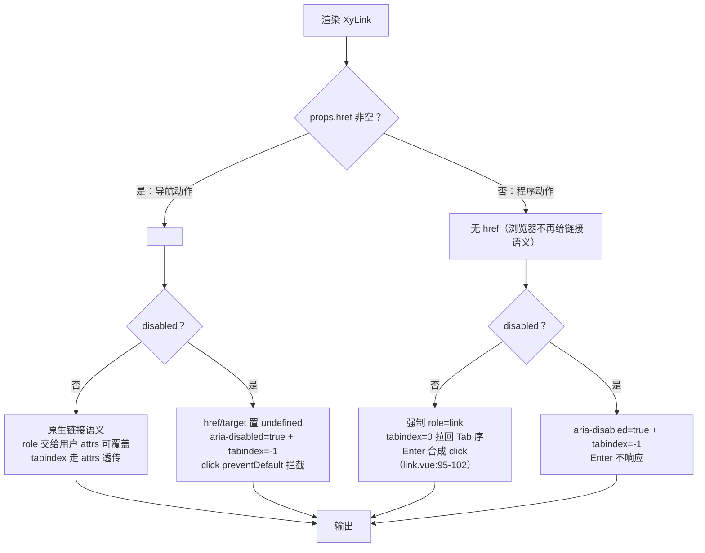
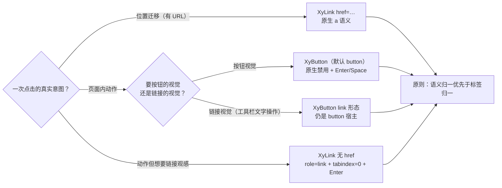

# 5-03 · Link：链接与按钮的边界

> 什么时候该是 `a` 标签，什么时候该是 `button`？这是组件库里最古老的问题之一，答案却远没有看起来那么显然。本篇解剖 `XyLink`（约 120 行实现 + 111 行 CSS），并把它和上一篇的 `XyButton` 放回同一张桌面上对照——你会发现，这两个组件的边界不是靠"运行时换标签"划出来的，而是靠**契约分工**和**语义归一**划出来的。所有代码均摘自当前工作区实态，行号逐一核对过。

## 引子：一道每个组件库都答过的题

HTML 规范给的答案很干净：`a` 承担**导航**——它的本质是"带 URL 的引用"，有 `href` 才有链接语义；`button` 承担**动作**——点击之后发生的事情发生在页面内部，不发生位置迁移。WAI-ARIA 的实践指南把这句话进一步工程化：一个看起来像链接、点下去却执行程序动作的元素，应该渲染成 `button`（或至少 `role="button"`），因为屏幕阅读器会按角色播报交互方式——念成 link，用户就会期待导航；念成 button，用户就知道按下后停留原地。

但如果照本宣科，`XyLink` 的实现就应该是这样：有 `href` 渲染 `<a>`，无 `href` 渲染 `<button>`。很多组件库的 Link/TextButton 类组件确实这么做过。可是当你打开 `packages/components/link/src/link.vue`，看到的第一眼会推翻这个预期——

```text
$ wc -l packages/components/link/src/link.vue packages/components/link/src/link.ts
      117 packages/components/link/src/link.vue
       18 packages/components/link/src/link.ts
```

117 行的 SFC 里，模板只有一个节点：`<a>`（`link.vue:106`）。没有任何 `component :is` 的动态标签，没有"无 href 换 button"的分支。无 `href` 的 `XyLink` 依然是 `<a>`，只是被补上了一组属性，让它重新"像"一个链接。

这不是疏忽，是本库对那道古老问题给出的**另一个答案**：边界不划在宿主标签上，划在组件契约上——`XyLink` 的契约就是"链接语言的视觉与语义"，它永远输出 `<a>`；而"动作语言"归 `XyButton`，后者反而拿着 `tag` prop 可以把自己渲染成 `<a>`。两个组件在各自越界的场景里，用的是同一条底层原则：**当宿主标签无法自然表达语义时，用 ARIA 把语义补回来，而不是换标签**。

本篇按这条线索展开：先看接口面（一个刻意贫瘠的 Props 集），再进渲染归一（永远 `<a>` 但把 `<a>` 丢掉的语义捡回来），然后是 disabled 的四层防御（`a` 没有原生禁用），接着是视觉层（type 复用的是令牌不是分档），最后用测试、类型夹具和库内消费实证收口，并和 Element Plus 的 `el-link` 做一次对照。

## 一、接口面：一个刻意"贫瘠"的 Props 集

先看类型层全文。`packages/components/link/src/link.ts` 一共只有 18 行：

```ts
// packages/components/link/src/link.ts:1-18（全文）
export const linkTypes = ["default", "primary", "success", "warning", "info", "danger"] as const;

export const linkUnderlineModes = ["always", "never", "hover"] as const;

export type LinkType = (typeof linkTypes)[number];
export type LinkUnderlineMode = (typeof linkUnderlineModes)[number];
export type LinkUnderline = boolean | LinkUnderlineMode;
export type LinkTarget = "_blank" | "_parent" | "_self" | "_top" | (string & NonNullable<unknown>);
export type LinkClickHandler = (event: MouseEvent) => void;

export interface LinkProps {
  type?: LinkType;
  underline?: LinkUnderline;
  disabled?: boolean;
  href?: string;
  target?: LinkTarget;
  icon?: string;
}
```

六个 props：`type`、`underline`、`disabled`、`href`、`target`、`icon`。对照上一篇 Button 的接口面——`size`、`nativeType`、`loading`、`loadingIcon`、`plain`、`text`、`link`、`bg`、`autofocus`、`round`、`circle`、`block`、`tag`，再加五个插槽（`button.vue:30-36` 的 `defineSlots` 列了 `default/icon/loading/prefix/suffix`）——`XyLink` 只有两个插槽（`link.vue:20-23` 的 `default` 和 `icon`）。这份"贫瘠"是刻意的。

**权衡一：链接不设 size、不设形态档。** 链接的典型语境是正文内联（"查看详情"）、操作列（"编辑 / 删除"）、附件名——它天然是文本流的一部分，字号钉在正文档就够了（`link.css:11` 的 `font-size: var(--xy-font-size-md)`），不需要 `sm/md/lg` 三档。同理，链接没有 `plain/text/link` 的形态分档——形态分档是"按钮语言"的东西：按钮要在背景、边框、填充之间切换视觉重量；链接的语言只有一档"文字色 + 下划线"。如果某个场景需要一个"长得像链接的按钮"（比如工具栏里的文字操作），本库的答案不是给 Link 加形态，而是 Button 自己的 `link` 形态——这个互文我们放到第五节细说。同样地，链接没有 `loading` 态：加载是动作语义（按下后有异步过程），链接不承载异步动作，自然不需要 `aria-busy`。

Props 里唯一值得停下来的是 `underline` 的类型：`boolean | "always" | "never" | "hover"`。为什么一个三态枚举还要兼容 boolean？这要结合运行时归一来看。

## 二、渲染归一：永远 `<a>`，但把 `<a>` 丢掉的语义捡回来

先把整个归一决策画出来——这是本篇的第一张图：



### 2.1 归一的入口：三个 computed

`link.vue:29-43` 是归一的地基：

```ts
// packages/components/link/src/link.vue:29-43
const hasHref = computed(() => Boolean(props.href));
const isFocusableAction = computed(() => !props.disabled && !hasHref.value);
const hasDefaultSlot = computed(() => Boolean(slots.default));

const underline = computed<LinkUnderlineMode>(() => {
  if (props.underline === true) {
    return "hover";
  }

  if (props.underline === false) {
    return "never";
  }

  return props.underline;
});
```

`hasHref` 和 `isFocusableAction` 把"这是不是一个活的交互体"归结为两个正交维度：有没有导航目标、有没有被禁用。`isFocusableAction` 的语义是"一个无 href 且未禁用的动作链接"——注意它只在无 `href` 时为真，因为有 `href` 的 `<a>` 原生就可聚焦，不需要任何辅助。

`underline` 的归一是第一处值得品味的设计（**权衡二**）：`underline: true` 映射到 `"hover"` 而不是 `"always"`。也就是说，boolean 写法 `:underline="true"` 的含义是"启用下划线（按现代交互，即悬停出现）"，而不是"永久显示下划线"。这与 Element Plus 的迁移路径不同——EP 在 2.4.0 给 `el-link` 补上 `"always" | "hover" | "never"` 三档字符串时，把 boolean 标记为废弃，官方迁移指引是 `:underline="true"` 改写为 `underline="always"`，即 EP 的 boolean `true` 语义接近 `"always"`。本库反其道而行：字符串三态是一等 API，boolean 只是快捷方式，且 `true` 对齐默认值 `"hover"`（`link.vue:10`）。这个选择的背后是视觉语言的站队——"默认无线、悬停现线"是 Stripe 式的现代链接语言（第三节的 CSS 会印证），`"always"` 反而是需要显式声明的例外。boolean 作为糖，自然对齐糖的默认语义，而不是历史包袱的语义。

### 2.2 role 与 tabindex：语义的恢复与优先级

接下来是全组件最精妙的两段，`link.vue:45-65`：

```ts
// packages/components/link/src/link.vue:45-65
const resolvedRole = computed(() => {
  if (!hasHref.value) {
    return "link";
  }

  return typeof attrs.role === "string" ? attrs.role : undefined;
});

const resolvedTabindex = computed(() => {
  if (props.disabled) {
    return -1;
  }

  const tabindex = attrs.tabindex;

  if (typeof tabindex === "string" || typeof tabindex === "number") {
    return tabindex;
  }

  return isFocusableAction.value ? 0 : undefined;
});
```

先看 `resolvedRole`。浏览器给 `<a href>` 的默认 ARIA 角色是 `link`，给**无 `href` 的 `<a>`** 的角色是……什么都没有。这不是冷知识，是规范行为：无 `href` 的锚点不被视为链接、不可聚焦、不进 Tab 序，语义上退化成一个普通 `span`。所以无 `href` 时必须手工补 `role="link"`。有趣的是补的方式：**强制返回 `"link"`，连用户通过 attrs 传进来的 `role` 都不给覆盖**；而一旦有 `href`，反而把 `role` 的决定权完全交还给用户（`attrs.role` 是字符串就透传，否则 `undefined` 走原生语义）。

这个不对称是**权衡三**：无 `href` 的 `<a>` 语义为空，此时"被覆盖成错误角色"的代价是整个可访问性坍塌——用户手滑传了 `role="listitem"`，键盘用户和屏幕阅读器就再也找不到这个交互体。库在这里选择守住底线：组件契约就是链接，role 必须是 link，宁可牺牲透传自由。而 `href` 存在时原生语义已经在，用户的自定义 role 是在"有基础"上做特化（比如往 `role="menuitem"` 特化），覆盖的风险可控，自由度就还回去。代价也要说清楚：真有"无 href 但想自定义 role"的需求（这需求本身就可疑），当前实现下只能改源码。

`resolvedTabindex` 是一条三级优先级链：`disabled → -1`（把禁用体摘出 Tab 序，无论其他条件）；用户显式传入的 `attrs.tabindex`（string 或 number 都接受，对应模板里写死和绑定的两种写法）次之；最后才是自动值——`isFocusableAction` 时补 `0` 拉回 Tab 序，其余场景 `undefined` 不输出属性。三级链的排序本身就是设计文档：**不可用性 > 用户显式意图 > 库的自动补偿**。注意 `-1` 与 `0` 的分工：`-1` 是"从 Tab 序移除但仍可程序聚焦"，`0` 是"进入自然 Tab 流"，禁用链接用 `-1` 而非移除 `tabindex` 属性，是为了让测试工具和脚本能稳定定位它。

### 2.3 属性的合成顺序：透传与归一的博弈

三份 computed 最终在 `linkAttrs` 里合成，`link.vue:67-83`：

```ts
// packages/components/link/src/link.vue:67-83
const linkKls = computed(() => [
  ns.base.value,
  `${ns.base.value}--${props.type}`,
  ns.is("disabled", props.disabled),
  ns.is("underline", underline.value === "always"),
  ns.is("hover-underline", underline.value === "hover" && !props.disabled),
  ns.is("icon-only", !hasDefaultSlot.value)
]);

const linkAttrs = computed<AnchorHTMLAttributes & Record<string, unknown>>(() => ({
  ...attrs,
  href: props.disabled || !hasHref.value ? undefined : props.href,
  target: props.disabled || !hasHref.value ? undefined : props.target,
  role: resolvedRole.value,
  tabindex: resolvedTabindex.value,
  "aria-disabled": props.disabled ? "true" : undefined
}));
```

`linkKls` 里有一个双保险：`is-hover-underline` 类在 `disabled` 时直接不加（`link.vue:72` 的 `&& !props.disabled`）——后面 CSS 里还会再挡一次，两层防御针对同一条"禁用链接不该有 hover 反馈"的规则。

`linkAttrs` 的键序是语义的：`...attrs` 展开在**前**，五个归一键在**后**。Vue 对象展开的同名键后者胜，所以 `href/target/role/tabindex/aria-disabled` 这五个键永远以归一结果为准——透传进来的同名属性会被静默压过。这不是写法习惯，是归一组件的通用范式：**归一键必须压过透传键，否则归一失效**。反过来，`title`、`download`、`rel`、`aria-label` 这些库不关心的属性，从 `...attrs` 原样透传，`XyLink` 的对外行为因此和原生 `<a>` 保持同构。

`tabindex` 有个值得点名的细节：`resolvedTabindex` 接受 `string | number`，是因为模板里 `:tabindex="1"` 传 number、`tabindex="1"` 传 string，两种写法都要认。归一层为类型擦除的透传多写两行判断，是透传组件的日常。

### 2.4 键盘语义：Enter 与 Space 的分野

最后看两个 handler，`link.vue:85-102`：

```ts
// packages/components/link/src/link.vue:85-102
function handleClick(event: MouseEvent) {
  if (props.disabled) {
    event.preventDefault();
    event.stopPropagation();
    return;
  }

  emit("click", event);
}

function handleKeydown(event: KeyboardEvent) {
  if (!isFocusableAction.value || event.key !== "Enter") {
    return;
  }

  event.preventDefault();
  (event.currentTarget as HTMLAnchorElement | null)?.click();
}
```

`handleClick` 的 disabled 拦截平平无奇，先按下不表（第四节展开）。真正有嚼头的是 `handleKeydown`：它**只认 Enter，不认 Space**。

对照上一篇 Button 的 `use-button.ts:67-84`：

```ts
// packages/components/button/src/use-button.ts:67-84
function handleKeydown(event: KeyboardEvent) {
  if (!needsButtonRole.value) {
    return;
  }

  if (event.key !== "Enter" && event.key !== " ") {
    return;
  }

  event.preventDefault();

  if (isDisabled.value) {
    event.stopPropagation();
    return;
  }

  buttonRef.value?.click();
}
```

同样的"合成点击"逻辑，Button 侧响应 **Enter + Space** 两键，Link 侧只响应 **Enter**。这不是实现差异，是**语义差异的直接投影**：原生 `button` 的激活键就是 Enter 和 Space 两个（所以用 `role="button"` 补语义时必须把两个键都模拟掉）；原生 `<a href>` 的激活键只有 Enter（Space 在链接上是滚动页面）。`XyLink` 无 href 时补的是 `role="link"`，所以键盘行为必须跟着 link 角色走——只认 Enter。如果这里"好心"地把 Space 也加上，屏幕阅读器用户按 Space 期待滚动页面却触发了动作，反而是 bug。键位表即角色表，这一对实现对照是我读这对组件时最喜欢的一处细节。

## 三、disabled：`a` 没有原生禁用，所以要做四层防御

`button` 有原生 `disabled` 属性（`use-button.ts:38`），浏览器会接管一切：不响应点击、移出 Tab 序、播报禁用态。`a` **没有对应物**——规范里锚点没有 disabled，写了也是无效属性。所以 `XyLink` 的禁用要自己搭完整的防御工事，而且是有纵深的四层：

1. **第一层：拔掉导航属性**（`link.vue:78-79`）。`disabled` 时 `href` 和 `target` 都置 `undefined`，DOM 上根本不存在这两个属性。这是最关键的一层——右键菜单的"在新标签页打开"、中键点击、拖拽到地址栏，这些**不经过 click 事件**的导航路径全部被掐断。
2. **第二层：click 拦截**（`link.vue:86-89`）。`preventDefault()` 加 `stopPropagation()`，防的是事件委托场景——外层容器如果监听了点击做路由，`stopPropagation` 保证禁用链接的点击不会"冒泡激活"上游逻辑。
3. **第三层：`aria-disabled="true"`**（`link.vue:82`）。屏幕阅读器的感知通道。原生 button 的 `disabled` 自带播报，`a` 只能靠这个 ARIA 态补。
4. **第四层：`tabindex: -1`**（`link.vue:54-56`）。键盘用户 Tab 不进来，禁用体不占据 Tab 停留点。

CSS 侧再补视觉反馈的三笔（`packages/theme/src/components/link.css:36-40`）：`color: var(--xy-text-muted)`、`cursor: not-allowed`、`opacity: 0.72`。加上前文说的类名侧双保险——`is-hover-underline` 在 disabled 时不加（`link.vue:72`）、CSS 再挡一次 `is-disabled:hover`（`link.css:95-97`）——禁用链接在 hover 时既不变色也不出下划线。

测试把这些断言全部锁死（`packages/components/link/__tests__/link.spec.ts:50-69`）：

```ts
// packages/components/link/__tests__/link.spec.ts:50-69
it("禁用时移除跳转属性并阻止 click", async () => {
  const wrapper = mount(XyLink, {
    props: {
      disabled: true,
      href: "https://example.com",
      target: "_blank"
    },
    slots: {
      default: "禁用链接"
    }
  });

  await wrapper.trigger("click");

  expect(wrapper.classes()).toContain("is-disabled");
  expect(wrapper.attributes("href")).toBeUndefined();
  expect(wrapper.attributes("target")).toBeUndefined();
  expect(wrapper.attributes("aria-disabled")).toBe("true");
  expect(wrapper.emitted("click")).toBeUndefined();
});
```

**权衡四**藏在第一层的写法里：为什么选择"href 置 undefined"而不是"留着 href 靠 preventDefault 拦"？因为 `preventDefault` 只能拦 `click` 这一条路径，而"禁用"的业务语义是**绝对不可达**——把不可能编码进 DOM 结构（属性不存在），比编码进运行时拦截（事件处理器里判断）更彻底。这也是 EP 的共识做法，`el-link` 的模板同样是 `disabled || !href ? undefined : href`。两种写法在"左键点击"这一条路上行为相同，在其余三四条路上分出高下。

顺带一提 Button 侧的对应物：`isDisabled = disabled || loading`（`use-button.ts:30`），加载态自动合并进禁用。`XyLink` 没有 loading，所以它的 disabled 就是纯 disabled——接口面的贫瘠，反过来简化了状态机。

## 四、视觉：type 复用的是令牌，不是分档

`packages/theme/src/components/link.css` 全文 111 行，先看基础段：

```css
/* packages/theme/src/components/link.css:1-34（节选） */
.xy-link.xy-link {
  display: inline-flex;
  align-items: center;
  gap: 6px;
  position: relative;
  padding: 0;
  border: 0;
  border-radius: 0;
  background: transparent;
  color: var(--xy-text-secondary);
  font-size: var(--xy-font-size-md);
  font-weight: var(--xy-font-weight-560);
  line-height: var(--xy-line-height);
  text-decoration: none;
  text-decoration-thickness: 1px;
  text-underline-offset: 3px;
  text-decoration-color: color-mix(in srgb, currentColor 18%, transparent);
  cursor: pointer;
  transition:
    color var(--xy-transition-duration-fast) var(--xy-transition-timing),
    opacity var(--xy-transition-duration-fast) var(--xy-transition-timing),
    background-color var(--xy-transition-duration-fast) var(--xy-transition-timing),
    border-color var(--xy-transition-duration-fast) var(--xy-transition-timing),
    text-decoration-color var(--xy-transition-duration-fast) var(--xy-transition-timing),
    box-shadow var(--xy-transition-duration-fast) var(--xy-transition-timing);
  text-decoration-line: none;
}

.xy-link.xy-link:focus-visible {
  outline: 2px solid color-mix(in srgb, var(--xy-brand) 65%, var(--xy-mix-light));
  outline-offset: 2px;
  box-shadow: 0 0 0 1px color-mix(in srgb, var(--xy-brand) 12%, transparent);
  border-radius: var(--xy-radius-sm);
}
```

第一行 `.xy-link.xy-link` 的双写是提升特异性的惯用手法（两个同类选择器，特异性 0-2-0 压过单类），保证链接的基础样式能稳定盖掉宿主环境里可能存在的全局 `a` 样式——组件库的 CSS 活在别人的页面里，这种防御不是洁癖。紧跟着的一串 `padding: 0; border: 0; border-radius: 0; background: transparent` 是"把浏览器默认 a 样式清零"的声明：链接的盒模型是**纯文本流**，什么盒子都不留。

下划线三件套是这段 CSS的灵魂：`text-decoration-thickness: 1px`（细线）、`text-underline-offset: 3px`（线离字远一点，不糊住下伸部）、`text-decoration-color: color-mix(in srgb, currentColor 18%, transparent)`（**用当前文字色的 18% 透明度做一条淡线**）。注意此刻 `text-decoration-line: none`——线是预置好的，只是没打开。打开的动作在状态段：

```css
/* packages/theme/src/components/link.css:42-45, 95-101 */
.xy-link.is-hover-underline:hover:not(.is-disabled),
.xy-link.is-underline {
  text-decoration-line: underline;
}

.xy-link.is-disabled:hover {
  text-decoration: none;
}

.xy-link.is-icon-only {
  gap: 0;
}
```

hover 时只翻一个开关 `text-decoration-line`，线的粗细、偏移、颜色全部沿用基础段——而那条线的颜色是 `currentColor` 的 18%，意味着它**自动跟随 type 色和 hover 色**，六种 type 下划线全都免费获得正确的颜色，一行都不用多写。这就是"淡线悬停"的实现论：Stripe 式链接语言的标志不是"有下划线"，而是"下划线是文字色的低透明度投影"。

再看六色 type 段的写法（`link.css:47-93`），以两色为例：

```css
/* packages/theme/src/components/link.css:47-61（节选） */
.xy-link.xy-link--default {
  color: var(--xy-text-secondary);
}

.xy-link.xy-link--default:hover:not(.is-disabled) {
  color: var(--xy-text-heading);
}

.xy-link.xy-link--primary {
  color: var(--xy-brand);
}

.xy-link.xy-link--primary:hover:not(.is-disabled) {
  color: var(--xy-brand-hover);
}
```

**权衡五：与 Button 的视觉关系是"复用令牌，不复用分档"。** `--xy-brand`、`--xy-brand-hover`、`--xy-success-hover`……这些语义令牌与 `button.css` 完全同源（`button.css:83-91` 的 primary 按钮背景色就是同一组 `--xy-brand` 系），六色 type 在两个组件里指向同一套色板语义——这是"全家桶组件库"的色彩一致性根基。但表达层各走各的：Button 的 `--primary` 有 `background` / `border-color` / hover 深化的三层分档，`plain` 形态还有 `--xy-brand-soft` 的软底色档（`button.css:175-178`）；Link 的 `--primary` 只写 `color` 一行。没有填充、没有边框、没有 soft 档——链接的语言就是文字色一档。所以那句"link 无 fill/soft 形态"在实码层面的准确表述是：**LinkProps 里根本没有形态参数，Link 的视觉档位天生只有文字色**，不是"实现了但没暴露"。

这里正好回收前文埋的互文：本库里"长得像链接的按钮"是 `XyButton` 的 `link` 形态（`button.vue:75` 的 `ns.is("link", isLink.value)`），且 `plain`、`text`、`link` 三形态同时传入时按 `link > text > plain` 归一（`button.vue:88-92` 的 dev 警告）。也就是说，Button 向链接语言伸手的通道是存在的，但它是 **Button 的形态**，不是 Link 的能力——两个组件各自守着单向的桥。焦点环也能看到这对关系的细节：Link 的 `:focus-visible` 用 brand 65% 混色（`link.css:30`），Button 用 58%（`button.css:32`）——同一套混色公式的不同配比，链接的焦点环略更强调，补偿它视觉重量轻的先天劣势。

## 五、测试与类型夹具：边界的三重锁

运行时契约的另一半锁在测试里。第一重锁是"默认形态"，它保证 `XyLink` 的出厂状态就是"文本链接"而不是别的什么（`link.spec.ts:7-19`）：

```ts
// packages/components/link/__tests__/link.spec.ts:7-19
it("默认渲染为文本链接", () => {
  const wrapper = mount(XyLink, {
    slots: {
      default: "查看详情"
    }
  });

  expect(wrapper.element.tagName).toBe("A");
  expect(wrapper.classes()).toContain("xy-link");
  expect(wrapper.classes()).toContain("xy-link--default");
  expect(wrapper.classes()).toContain("is-hover-underline");
  expect(wrapper.text()).toContain("查看详情");
});
```

五个断言按"宿主标签 → 基类 → type 类 → 下划线态 → 内容"的顺序排布，第一条 `tagName` 是 `"A"` 就是本篇全部讨论的锚点：不管内部怎么归一，出口永远是大写的 `A`。

第二重锁是禁用语义（第三节已引用 `link.spec.ts:50-69`）。第三重锁针对无 href 语义，即全篇最关键的一条（`link.spec.ts:109-123`）：

```ts
// packages/components/link/__tests__/link.spec.ts:109-123
it("在没有 href 时提供可聚焦的 link 语义", async () => {
  const wrapper = mount(XyLink, {
    slots: {
      default: "触发动作"
    }
  });

  await wrapper.trigger("keydown", {
    key: "Enter"
  });

  expect(wrapper.attributes("role")).toBe("link");
  expect(wrapper.attributes("tabindex")).toBe("0");
  expect(wrapper.emitted("click")).toHaveLength(1);
});
```

注意这条测试的名字——"提供可聚焦的 link 语义"，而不是"渲染为按钮"。它把 2.2 节的设计决策写成了回归防线：`role="link"`、`tabindex="0"`、Enter 合成点击，三个断言任何一条退化（比如某次重构顺手把 role 改成 `button`，或者删了 keydown），测试立刻红。

underline 的归一表也有一条对称的锁（`link.spec.ts:71-92`）：

```ts
// packages/components/link/__tests__/link.spec.ts:71-92
it("支持 underline 的 boolean 和字符串映射", () => {
  const hoverWrapper = mount(XyLink, {
    props: {
      underline: true
    }
  });
  const neverWrapper = mount(XyLink, {
    props: {
      underline: false
    }
  });
  const alwaysWrapper = mount(XyLink, {
    props: {
      underline: "always"
    }
  });

  expect(hoverWrapper.classes()).toContain("is-hover-underline");
  expect(neverWrapper.classes()).not.toContain("is-hover-underline");
  expect(neverWrapper.classes()).not.toContain("is-underline");
  expect(alwaysWrapper.classes()).toContain("is-underline");
});
```

`true → is-hover-underline`、`false → 两个下划线类都没有`、`"always" → is-underline`，2.1 节那张归一表被逐格钉死，特别是 `true` 的落点——它锁的是"`true` 等于 hover 而非 always"这个本库自有的语义主张。

类型层则由 `tests/types/fixtures/link.ts` 锁边界：

```ts
// tests/types/fixtures/link.ts:1-38（全文）
import type { LinkProps } from "xiaoye-components";

const linkProps: LinkProps = {
  type: "info",
  underline: "always",
  href: "https://example.com",
  target: "_blank",
  icon: "mdi:open-in-new"
};

void linkProps;

const booleanUnderline: LinkProps = {
  underline: true
};

void booleanUnderline;

const invalidType: LinkProps = {
  // @ts-expect-error invalid type should be rejected
  type: "filled"
};

void invalidType;

const invalidUnderline: LinkProps = {
  // @ts-expect-error invalid underline mode should be rejected
  underline: "focus"
};

void invalidUnderline;

const invalidIcon: LinkProps = {
  // @ts-expect-error icon should be a string
  icon: 1
};

void invalidIcon;
```

正负两向：合法用法（含 boolean 快捷方式）必须通过编译，非法字面量（`"filled"`、`underline: "focus"`、`icon: 1`）必须被 `@ts-expect-error` 确认报错。`underline: true` 单独占一个夹具变量，说明 boolean 兼容是**契约的一部分**而非实现巧合——运行时归一（`link.vue:33-43`）和类型层联合（`LinkUnderline = boolean | LinkUnderlineMode`）在同一处语义上会师。

一处诚实的观察：`Button` 对纯图标形态有 dev 警告（`button.vue:105-112`，缺 `aria-label` 时 `warnOnce`），`XyLink` 的 `is-icon-only`（无默认插槽时，`link.vue:73`）**没有**对应的 dev 提醒——测试里是靠使用方自觉传 `aria-label` 的（`link.spec.ts:125-138`）。这是两个组件在防御完备度上的真实差距，算得上 Link 侧已知的技术债。

## 六、消费实证：库内谁在用 XyLink，用的是哪一面

`rg 'xy-link|XyLink'` 扫过源码区，生产消费点有三处，全部指向同一个用法画像。最典型的是 `descriptions` 描述列表——它把 Link 注册进了展示组件映射表：

```ts
// packages/components/shared/display-component-map.ts:3, 8-15（节选）
import { XyLink } from "../link";
// ……（avatar / image / progress / tag / text 的导入）

export const displayComponentMap = {
  avatar: XyAvatar,
  image: XyImage,
  link: XyLink,
  progress: XyProgress,
  tag: XyTag,
  text: XyText
} as const;
```

然后在 schema 驱动的渲染分支里按需点亮（`packages/components/descriptions/src/descriptions.vue:157-162`）：

```vue
<!-- packages/components/descriptions/src/descriptions.vue:157-162 -->
<xy-tag v-else-if="item.tag" v-bind="resolveTagProps(item)">
  {{ resolveTagText(item) }}
</xy-tag>
<xy-link v-else-if="item.link" v-bind="item.link">
  {{ item.value }}
</xy-link>
```

`v-bind="item.link"` 整包下透 schema 配置——描述列表的消费方声明"这个字段是个链接"时，type/underline/href/target 全部由配置决定，`XyLink` 在这里扮演的角色是**"值的链接化"**：一个纯展示位。增强层 `detail-page` 的附件区是第二个实证（`packages/pro-components/detail-page/src/detail-page.vue:153-160`），文件名渲染成 `type="primary" underline="hover"` 的外链，`href` 指向附件 URL、`target` 随 URL 有无动态给 `_blank` 或 `undefined`——注意到没有，`target` 的条件恰好复刻了 `linkAttrs` 里"无 href 不输出 target"的归一逻辑，消费方在 schema 层就把语义对齐了。第三处是 `audit-timeline`（`packages/pro-components/audit-timeline/src/audit-timeline.vue:147-155`），同样是带 `href` 的跳转链接。

三个实证合起来给出一个耐人寻味的观察：**库内没有任何生产路径在用"无 href 的动作链接"**。所有真实消费都是"值的链接化"或"导航跳转"。这不是浪费——无 href 场景的可聚焦语义（第二节那一整套 role/tabindex/Enter 机器）依然值得全价实现，因为公共组件库的 API 面向的是未知的使用方，搜索结果页的"可点击标题"（路由由外层处理）就是它的标准应用场景。但它确实印证了边界的存在：这个库里高频的"程序动作"全部流向了 `XyButton`，Link 的动作语义是低频兜底，而非主通道。

## 七、对照 Element Plus：同一个选择，两种完成度

把 `el-link` 拉进来对照，最有意思的不是差异，是**相同点**：Element Plus 的 `el-link` 也永远渲染 `<a>`，也没有"无 href 换 button"的分支，disabled 时同样把 `href` 置 `undefined`。两个库在"边界划在契约上"这个根本判断上是同盟。

分歧在完成度。`el-link` 无 `href` 时输出的就是一个裸 `<a>`：没有 `role`、没有 `tabindex`、没有键盘合成——语义空洞原样暴露给使用方，键盘用户根本到不了这个"链接"。本库用 `resolvedRole` / `resolvedTabindex` / `handleKeydown` 三件套把这个洞补上了（测试 `link.spec.ts:109-123` 锁死）。第二处是 `underline` 的 API 演化路线：EP 从 boolean 起家，2.4.0 补字符串三档并废弃 boolean（迁移指引 `true → "always"`）；本库一步到位用 `boolean | "always" | "never" | "hover"` 联合类型，且 boolean 映射自有主张（`true → "hover"`，第二节详述）。第三处是节奏：EP 的 `hover` 模式是后补的补丁语义，本库的 `hover` 是默认值的立国纲领。对照的结论不是"EP 不如本库"——EP 承载的历史包袱和用户基数完全不同——而是同一个架构判断在不同约束下会落出不同的完成度，读源码时值得把"选择"和"选择的执行质量"分开评价。

## 八、回到那道题：判定清单

现在可以正面回答核心问题了。本库的答案浓缩成一张选型图：



三条使用守则：**其一**，有 URL（含 SPA 路由的 href 形态）就用 `href`，别用无 href 的 Link 加 click 模拟导航——白白丢掉中键、右键、`rel` 等原生能力。**其二**，按下后不发生位置迁移的动作，默认交给 `XyButton`；只有当视觉必须是"文字链接"时才用无 href 的 `XyLink`，并清楚它的键盘语义是 Enter-only。**其三**，禁用的链接是四层防御的产物，别指望它像 button 一样"原生"——如果某个动作频繁在启用/禁用间切换（表格操作列），用 `XyButton` 的文字形态可能比 `XyLink` 更省心，因为原生 `disabled` 的语义零成本。

把这对组件放在一起看，最终的设计心法只有一句话：**好的组件边界不靠互斥实现，靠共享同一条原则**。`XyLink` 永远 `<a>`、`XyButton` 默认 `<button>` 且 `tag` 可换，两个组件在各自"标签与语义不符"的角落里，做着同一件事——用 ARIA 和键盘合成把语义补回来，而不是换掉标签。标签是实现细节，语义才是契约。

下一篇预告：5-04《Breadcrumb：父收集子的注册模式》。`XyLink` 是独行者，而 `Breadcrumb` 背后站着 `BreadcrumbItem`——父组件怎么通过 `provide` 挂出注册表、子组件怎么在 `onMounted` 把自己"登记"进 `registerItem`、又在 `onBeforeUnmount` 反注册（`breadcrumb.vue:36-54` 已经埋好了 `registerItem` / `unregisterItem` 的伏笔）？下一篇我们拆"子组件如何把自己交付给父组件"这套全库复用了至少四次的注册协议。

---

*本篇代码引用核对于当前工作区实态：`packages/components/link/src/link.vue`（117 行）、`link.ts`（18 行）、`packages/theme/src/components/link.css`（111 行）、`packages/components/button/src/button.vue`（153 行）、`use-button.ts`（101 行）、`packages/components/link/__tests__/link.spec.ts`（139 行）、`tests/types/fixtures/link.ts`（38 行）。*
