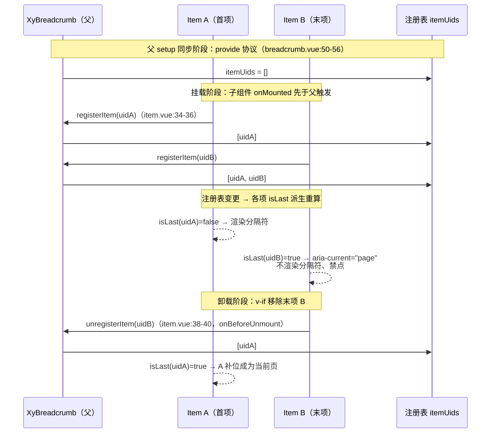
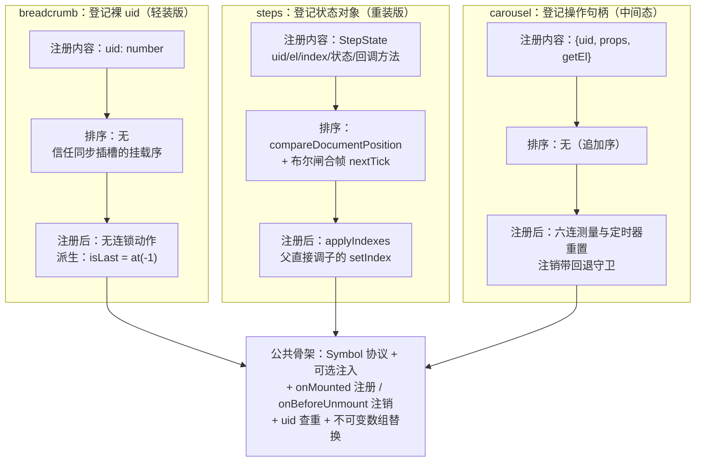

# 5-04 · Breadcrumb：父收集子的注册模式

> 本篇精读（行号逐一核对于当前工作区实态）：
> - `packages/components/breadcrumb/src/breadcrumb.vue`（provide 端，83 行）
> - `packages/components/breadcrumb/src/breadcrumb-item.vue`（inject 消费端，155 行）
> - `packages/components/breadcrumb/src/context.ts`（协议定义，12 行）
> - 对照组一：`packages/components/steps/src/`（`steps.vue` 144 行 / `step.vue` 231 行）
> - 对照组二：`packages/components/carousel/src/`（`carousel.vue` 注册段 L848-892 / `carousel-item.vue` 注册段）
> - `packages/components/breadcrumb/__tests__/breadcrumb.spec.ts`（272 行）、`tests/types/fixtures/breadcrumb.ts`（63 行）、`packages/theme/src/components/breadcrumb.css`（122 行）

## 引子：一个只有父组件才能回答的问题

面包屑大概是组件库里长得最朴素的组件了——一行文字、几个分隔符、末一项加粗。但把它拆开看，你会撞上所有"父管子"组件都躲不开的那个问题：**子组件如何把自己"登记"进父组件？**

问题的根源在于：面包屑的每一项都不是平等的。最后一项享有四处特殊待遇——它不渲染分隔符、它挂 `aria-current="page"`、它加 `is-current` 类、它必须禁点（用户不该从"当前页"跳去"当前页"）。这四件事有一个共同的前置条件：**每一项都必须知道"我是不是最后一项"**。

而"最后一项"这个知识，恰恰是任何单个 `BreadcrumbItem` 自己无法拥有的。你把 `xy-breadcrumb-item` 单独拎出来，它连兄弟是谁都不知道，更遑论自己排在第几。这个知识只可能存在于两个地方：父组件 `XyBreadcrumb`，或者 DOM 树本身。

所以真正的设计问题是：父组件怎么知道子列表的顺序与数量？这一篇我们就沿着 `packages/components/breadcrumb/src/` 的三份文件，把这个全库至少复用了三次的模式（breadcrumb、steps、carousel）拆到实现层，并和 4-09 讲过的 group 模式放回同一张桌子——那篇的结论是"group 不维护子项实例注册表、不感知子项数量与身份"，本篇的主角恰好是它的反面：**一个货真价实的注册表**。

## 一、需求面：isLast 的五张面孔

先看消费端有多少地方在等这个答案。`breadcrumb-item.vue` 里，`isLast` 是一条五岔路口：

```ts
// packages/components/breadcrumb/src/breadcrumb-item.vue:49-65
const rootTag = computed(() => (breadcrumbContext ? "li" : "span"));
const isLast = computed(() => breadcrumbContext?.isLast(uid) ?? false);
const hasRouter = computed(
  () => Boolean(router && typeof router.push === "function" && typeof router.replace === "function")
);
const hasTo = computed(() => props.to !== "" && props.to !== undefined);
const hasHref = computed(() => Boolean(props.href));
const usesRouterNavigation = computed(() => hasTo.value && hasRouter.value);
const usesHrefNavigation = computed(
  () => !usesRouterNavigation.value && hasHref.value && !props.disabled && !isLast.value
);
const hasActionIntent = computed(
  () => !props.disabled && !isLast.value && (hasHref.value || hasTo.value)
);
const isClickable = computed(
  () => !props.disabled && !isLast.value && (usesRouterNavigation.value || usesHrefNavigation.value)
);
```

逐条数过来：第一，`usesHrefNavigation`——末项即使带了 `href` 也不按链接渲染（不输出 `<a>`，只渲染 `span`），从源头掐掉"点击当前页"的可能；第二，`hasActionIntent`——末项不吃 `is-link` 样式，视觉上不暗示可点；第三，`isClickable`——点击与键盘事件的总闸，末项一律短路。再看模板里的另外两处：

```vue
<!-- packages/components/breadcrumb/src/breadcrumb-item.vue:119-154 -->
<template>
  <component
    :is="rootTag"
    :class="rootClasses"
    :style="attrs.style"
    :aria-current="isLast ? 'page' : undefined"
    v-bind="nativeAttrs"
  >
    <component
      :is="innerTag"
      :class="innerClasses"
      v-bind="innerAttrs"
      @click="handleClick"
      @keydown="handleKeydown"
    >
      <slot />
    </component>

    <span
      v-if="breadcrumbContext && !isLast"
      class="xy-breadcrumb__separator"
      role="presentation"
      aria-hidden="true"
    >
      <XyIcon
        v-if="breadcrumbContext.separatorIcon.value"
        class="xy-breadcrumb__separator-icon"
        :icon="breadcrumbContext.separatorIcon.value"
        :size="14"
      />
      <template v-else>
        {{ breadcrumbContext.separator.value }}
      </template>
    </span>
  </component>
</template>
```

第四处：`aria-current="page"` 只挂在末项上，屏幕阅读器靠它播报"你在这里"；第五处：分隔符的 `v-if="breadcrumbContext && !isLast"`——这个条件还藏着一个彩蛋，它同时检查了 `breadcrumbContext` 是否存在。也就是说**分隔符是 item 自己渲染的**，渲染与否取决于两个运行时事实：有没有父上下文、自己是不是末项。

这里先回答本篇的一个考据问题：分隔符是 CSS 伪元素还是组件？答案是**组件**——一个真实的 `<span role="presentation" aria-hidden="true">`，图标分支里还会渲染 `XyIcon`。CSS 层（`packages/theme/src/components/breadcrumb.css:90-97`）只负责它的排版与配色，不负责它的生死：

```css
/* packages/theme/src/components/breadcrumb.css:90-113 */
.xy-breadcrumb__separator {
  display: inline-flex;
  align-items: center;
  justify-content: center;
  margin: 0 var(--xy-breadcrumb-separator-gap);
  color: var(--xy-breadcrumb-separator-color);
  font-size: 13px;
}

.xy-breadcrumb__separator-icon,
.xy-breadcrumb__separator-icon svg {
  color: var(--xy-breadcrumb-separator-color);
}

.xy-breadcrumb__item.is-current .xy-breadcrumb__inner,
.xy-breadcrumb__item.is-current .xy-breadcrumb__inner:hover {
  color: var(--xy-breadcrumb-current-color);
  background: color-mix(in srgb, var(--xy-bg-subtle) 58%, var(--xy-bg-floating));
  border-color: transparent;
  outline: none;
  outline-width: 0px;
  font-weight: var(--xy-font-weight-560);
  cursor: default;
}
```

选择"组件渲染分隔符"而不是 CSS `::after` 伪元素，本身就是一个语义决定：伪元素对屏幕阅读器不可见还得手动 `speak: none`，而组件分支天然挂上了 `aria-hidden="true"` 与 `role="presentation"`；同时图标分隔符（`separatorIcon`）要渲染一个真实的图标组件，伪元素里塞不进 `XyIcon`。**结构复杂度一旦越过"纯文本"，就必须从 CSS 搬进组件树——搬进组件树之后，"渲不渲染"就从样式问题变成了状态问题，于是注册表登场了。**

## 二、协议层：12 行 context.ts 定下合同

注册模式的图纸和 4-09 的 group 模式一样，第一块拼图都是协议文件。`context.ts` 全文只有 12 行：

```ts
// packages/components/breadcrumb/src/context.ts:1-12（全文）
import type { ComputedRef, InjectionKey } from "vue";

export interface BreadcrumbContext {
  separator: ComputedRef<string>;
  separatorIcon: ComputedRef<string>;
  registerItem: (uid: number) => void;
  unregisterItem: (uid: number) => void;
  isLast: (uid: number) => boolean;
}

export const breadcrumbContextKey: InjectionKey<BreadcrumbContext> = Symbol("xy-breadcrumb");
```

五个成员恰好分成两组。前两个是**下行通道**：`separator` 与 `separatorIcon` 作为 `ComputedRef` 下发——注意下发的是引用而不是快照，父组件的 `separator` prop 变更时，所有 item 无需任何通知自动跟随，这与 4-09 里 radio-group 用 `toRef(props, ...)` 下发模型值是同一个手法。后三个是**上行通道**：`registerItem` / `unregisterItem` / `isLast`，其中前两个是"写"，最后一个反过来是"读"。

和 radio-group 的协议对比一下，结构性差异一眼可见。radio-group 的协议是"状态 + 行为"：`modelValue` 是组内的共享状态，`changeValue` 是子项委托意图的行为，协议里**没有任何一个方法用于登记子项身份**——group 压根不关心有几个 radio、谁排第几，互斥逻辑靠值比较就能完成，天然不需要注册表。而 breadcrumb 的协议里，`separator` 只是顺路捎带的外观配置，真正的灵魂是那三个方法：**这个父组件的核心职责不是"下发规则"，而是"维持一份准确的成员名单"**。

`InjectionKey<BreadcrumbContext>` 的泛型包装也与 4-09 所述一致：`inject(breadcrumbContextKey)` 自动推导为 `BreadcrumbContext | undefined`，Symbol 字面量由定义方与消费方共享，杜绝字符串 key 拼错导致的静默注入失败。这套"Symbol + InjectionKey + 可选注入"的三件套，是全库所有父子协议的统一开场。

## 三、provide 端：一份 83 行的注册表

看父组件全文。这个 SFC 一共 83 行，注册表相关的代码只占 20 行左右：

```vue
<!-- packages/components/breadcrumb/src/breadcrumb.vue:1-83（全文） -->
<script setup lang="ts">
defineOptions({
  name: "XyBreadcrumb",
  inheritAttrs: false
});

import { computed, provide, ref, useAttrs } from "vue";
import { useNamespace } from "xiaoye-primitives";
import BreadcrumbItem from "./breadcrumb-item.vue";
import type { BreadcrumbProps } from "./breadcrumb";
import { breadcrumbContextKey } from "./context";

const props = withDefaults(defineProps<BreadcrumbProps>(), {
  separator: "/",
  separatorIcon: "",
  ariaLabel: "面包屑",
  items: () => []
});

const attrs = useAttrs();
const ns = useNamespace("breadcrumb");
const itemUids = ref<number[]>([]);

const nativeAttrs = computed<Record<string, unknown>>(() => {
  const rest = { ...attrs };
  delete rest.class;
  delete rest.style;
  return rest;
});

const rootClasses = computed(() => [ns.base.value, attrs.class]);
const separator = computed(() => props.separator);
const separatorIcon = computed(() => props.separatorIcon);
const normalizedItems = computed(() => props.items ?? []);

function registerItem(uid: number) {
  if (!itemUids.value.includes(uid)) {
    itemUids.value = [...itemUids.value, uid];
  }
}

function unregisterItem(uid: number) {
  itemUids.value = itemUids.value.filter((current) => current !== uid);
}

function isLast(uid: number) {
  return itemUids.value.at(-1) === uid;
}

provide(breadcrumbContextKey, {
  separator,
  separatorIcon,
  registerItem,
  unregisterItem,
  isLast
});
</script>

<template>
  <nav
    :class="rootClasses"
    :style="attrs.style"
    role="navigation"
    :aria-label="props.ariaLabel"
    v-bind="nativeAttrs"
  >
    <ol class="xy-breadcrumb__list">
      <slot v-if="normalizedItems.length === 0" />
      <breadcrumb-item
        v-for="item in normalizedItems"
        v-else
        :key="`${item.label}-${item.href ?? ''}-${String(item.to ?? '')}`"
        :to="item.to"
        :replace="item.replace"
        :href="item.href"
        :target="item.target"
        :disabled="item.disabled"
      >
        {{ item.label }}
      </breadcrumb-item>
    </ol>
  </nav>
</template>
```

注册表的全部状态就是第 22 行的一个 `ref<number[]>`：`itemUids`。三个方法各司其职：`registerItem` 先查重再追加，追加用的是不可变替换（`[...itemUids.value, uid]`）而不是 `push`；`unregisterItem` 用 `filter` 无差别剔除；`isLast` 更简单粗暴——`itemUids.value.at(-1) === uid`，**数组最后一个 uid 的主人就是当前页**。

**权衡一：注册表 vs provide 协议。** 把 4-09 的论断搬过来对照会更清楚。group 模式（radio-group / checkbox-group）选择"只立规矩、不点名"：父下发协议，子自取所需，父对子的数量、身份、顺序全然无知。这个方案的好处是协调面与子项来源彻底解耦——插槽手写也好、`options` 批量渲染也罢，协议一模一样，而且**不存在任何注册/注销时序问题**（4-09 原文的说法是：相比"父遍历子 + 逐个传 props"，provide 协议不需要维护一整套注册时序）。但它的适用边界同样明确：只要父需要回答"我有几个子、谁在第几"这类**序数问题**，协议就不够用了。breadcrumb 的末项判定、steps 的序号分配、carousel 的滑片索引，全都是序数问题——这就是注册表模式的领地。两种模式不是优劣关系，是问题类型的关系：**值问题用协议，序数问题用注册表**。

**权衡二：数组 vs Map。** `itemUids` 是 `number[]`，而不是 `Map<number, SomeRecord>`。理论上 Map 的读写都是 O(1)，数组的 `includes` / `filter` 是 O(n)；但选数组有三个站得住脚的理由。其一，**顺序即语义**：注册表的核心产出是"谁在末尾"，数组天然维护插入序，`at(-1)` 一发命中；Map 若要回答同样的问题还得额外维护序数字段或依赖插入序遍历。其二，**面包屑的 n 个头部项，n 通常是 3~5**，O(n) 与 O(1) 在这个量级上没有可测量的差异，为它引入 Map 的键管理反而是过度设计。其三，**存的只是裸 uid**——没有附带状态需要按 key 存取，Map 的"按 key 取值"优势无从发挥。真正需要 Map 的场景是"子项带一堆状态、父要按身份反复读写"，本篇第七节的 carousel 就介于两者之间：它存的不是裸 uid 而是注册对象数组，但依然保序为数组。另外注意不可变替换的细节：`itemUids.value = [...]` 换掉整个数组引用，让所有依赖它的 computed（包括每个 item 的 `isLast`）确定性地收到一次触发，比原位 `push` 的依赖追踪语义更直白。

还有一个容易被略过的模板细节：`breadcrumb.vue` 同时支持两种渲染来源——`items` prop 声明式批量渲染（v-for 分支），或默认插槽手写 `<xy-breadcrumb-item>`。**注册表对两种来源一视同仁**：声明式分支里渲染的也是真正的 `BreadcrumbItem`，它们各自走同一条 `onMounted` 注册路径。这与 4-09 里 options fallback 的设计原则同构——"批量渲染的永远是真正的子组件，保证两条路走同一套协议"。

## 四、inject 消费端：onMounted 登记，onBeforeUnmount 销号

子组件的注册动作只有 6 行核心代码，但每行都有讲究：

```ts
// packages/components/breadcrumb/src/breadcrumb-item.vue:27-65
const attrs = useAttrs();
const ns = useNamespace("breadcrumb");
const instance = getCurrentInstance();
const uid = instance?.uid ?? Math.random();
const breadcrumbContext = inject(breadcrumbContextKey, null);
const router = instance?.appContext.config.globalProperties.$router as RouterLike | undefined;

onMounted(() => {
  breadcrumbContext?.registerItem(uid);
});

onBeforeUnmount(() => {
  breadcrumbContext?.unregisterItem(uid);
});

const nativeAttrs = computed<Record<string, unknown>>(() => {
  const rest = { ...attrs };
  delete rest.class;
  delete rest.style;
  return rest;
});

const rootTag = computed(() => (breadcrumbContext ? "li" : "span"));
const isLast = computed(() => breadcrumbContext?.isLast(uid) ?? false);
const hasRouter = computed(
  () => Boolean(router && typeof router.push === "function" && typeof router.replace === "function")
);
const hasTo = computed(() => props.to !== "" && props.to !== undefined);
const hasHref = computed(() => Boolean(props.href));
const usesRouterNavigation = computed(() => hasTo.value && hasRouter.value);
const usesHrefNavigation = computed(
  () => !usesRouterNavigation.value && hasHref.value && !props.disabled && !isLast.value
);
const hasActionIntent = computed(
  () => !props.disabled && !isLast.value && (hasHref.value || hasTo.value)
);
const isClickable = computed(
  () => !props.disabled && !isLast.value && (usesRouterNavigation.value || usesHrefNavigation.value)
);
```

四个值得驻留的细节。

**第一，身份凭证是 Vue 实例 uid。** `getCurrentInstance()?.uid` 是 Vue 内部分配的自增实例编号，组件树内唯一且稳定。兜底的 `Math.random()` 看着戏谑，实则严谨：`getCurrentInstance()` 只在 setup 同步上下文里非空，若某种非常规用法下拿不到实例，用一个随机数当占位身份，至少保证注册/注销配对时不误伤别人。对照组的 carousel-item 用了完全相同的写法（`carousel-item.vue:16`：`const uid = getCurrentInstance()?.uid ?? Math.random()`）——这不是巧合，是注册模式的标准起手式：**用框架发的身份证，不用自己造的名字**。子组件不需要 `name` prop，也不需要父组件回传编号，身份问题在源头就消解了。

**第二，可选注入的优雅降级。** `inject(key, null)` 之后，`breadcrumbContext` 可能为空——`xy-breadcrumb-item` 单独渲染时（某些使用方只想借它的样式），`rootTag` 降级为 `span`（不再占据 `<ol>` 里 `li` 的语义位）、`isLast` 恒为 `false`、分隔符永远不渲染、导航判定退化为纯 prop 驱动。整个组件没有一处对上下文的强断言，也没有一行 `throw`。**注册模式天然是"有父则受管，无父则自治"的双模结构**，这一点和 4-09 里 radio 的自治/受管双模完全同款。

**第三，为什么是 onMounted / onBeforeUnmount 这对钩子。** 注册必须等 `onMounted`：虽然 `provide` 在父的 setup 同步阶段就完成了（子组件 inject 一定拿得到），但注册表影响的是渲染输出，而 setup 阶段 DOM 还没成形，真正的挂载顺序——子先父后、兄弟按文档序——保证了同步插槽场景下，`registerItem` 的调用顺序天然等于 DOM 顺序。注销选 `onBeforeUnmount` 而不是 `onUnmounted`，是"销号要趁人还在"的语义：卸载钩子里绝不能再碰 DOM 或触发会波及子组件的重渲染，`onBeforeUnmount` 在组件还没拆掉时同步执行，`filter` 完成后，剩余项的 `isLast` 会在同一轮更新里重算——末项被 `v-if` 移除时，前一项立刻补位成为新的当前页，衔接没有空窗。

**第四，isLast 的响应式是怎么接上的。** `computed(() => breadcrumbContext?.isLast(uid) ?? false)`——`isLast` 是父侧的普通函数，但它在 computed 求值时内部读取了 `itemUids.value`，依赖收集发生在 computed 的求值现场，所以 `itemUids` 的每次替换都会让每个 item 的 `isLast` 重算。**注册表是共享状态，消费方式是派生计算**——子组件从不缓存"我是不是末项"的快照，每一帧都问父组件要最新答案。这也是注册表模式区别于"注册时父把 index 发给子"（一次性快照）的关键：快照会过期，派生不会。

## 五、注册与注销的完整时序

把两端拼起来，一次完整的生命周期如下图。请特别注意"子先父后"的挂载顺序，以及注销后剩余项的补位重算：



时序跑通了，但注册模式有三个出了名容易翻车的坑，逐个对照本库的实现。

**坑一：条件渲染的配对问题。** `v-for` + `v-if` 或动态插槽里，item 随时可能被插入或移除。注册模式的安全性完全押在"每个 `registerItem` 必有恰好一次配对的 `unregisterItem`"上。Vue 的保证是：组件因 `v-if` 变 false、key 变化、父级卸载而离开组件树时，`onBeforeUnmount` 一定同步触发——所以只要注册与注销写在同一对生命周期钩子里，配对就闭合。真正的反例是**把注册写在 setup 主体里**（不进 `onMounted`）：SSR 下 setup 会在服务端执行，服务端永远等不来对应的卸载钩子，注册表在请求间被污染（如果父组件是模块级单例的话）；即便纯客户端，setup 里注册也会把"尚未渲染的子组件"算进 DOM 序判定。本库把注册严格锁进 `onMounted`，就是这个原因。

**坑二：SSR 的注册时序。** `onMounted` / `onBeforeUnmount` 在服务端都不执行，于是 SSR 渲染出的 HTML 里 `itemUids` 恒为空数组——每一项的 `isLast` 都是 `false`：每项都带分隔符，没有 `aria-current`。妙的是这不会引发 hydration 告警：客户端 hydrate 的首帧，`onMounted` 尚未触发，客户端首渲染与 SSR 输出**处于同一个"注册表为空"的状态**，两边一致；随后子组件的 `onMounted` 依次触发、注册表填充、响应式更新修正 DOM——末项的分隔符消失、`aria-current` 出现。代价是服务端渲染的首屏 HTML 语义不完整（多出的分隔符只是视觉冗余，`aria-hidden` 兜住了无障碍），要等一轮 hydration 才修正。这是注册表模式为"运行时序数"付出的 SSR 税：**凡依赖客户端注册得出的结论，服务端一律不知道**。

**坑三：KeepAlive 与异步组件的顺序失真。** 被 `KeepAlive` 缓存的组件失活/激活走 `deactivated` / `activated`，不走 `unmounted` / `mounted`，所以缓存切换不注销、不重注册——若整个面包屑一起被缓存，注册表与视图始终一致，相安无事；若只有个别 item 被缓存而父不在同一缓存内，注册表里会留下"看不见的成员"。异步组件（`defineAsyncComponent`）则是另一类失真：resolve 先后决定 `onMounted` 先后，**挂载顺序不再等于 DOM 顺序**，此时 `at(-1)` 判出的"末项"可能是 DOM 上排中间的项。这是本库 breadcrumb 注册表的真实边界——它没有排序兜底。对照组的 steps 就为这个问题专门付了成本，下一节看它怎么付。

## 六、对照一：steps——注册的不是 uid，是整个状态机

同样的注册模式，`steps` 把"登记什么"推到了另一个极端：子组件注册的不是身份号，而是**完整的可变状态对象**。先看父组件的注册表与排序机制：

```ts
// packages/components/steps/src/steps.vue:45-107
let sortScheduled = false;

function compareSteps(left: StepState, right: StepState) {
  const leftEl = left.el.value;
  const rightEl = right.el.value;

  if (leftEl && rightEl && leftEl !== rightEl && typeof Node !== "undefined") {
    const position = leftEl.compareDocumentPosition(rightEl);

    if (position & Node.DOCUMENT_POSITION_FOLLOWING) {
      return -1;
    }

    if (position & Node.DOCUMENT_POSITION_PRECEDING) {
      return 1;
    }
  }

  return left.uid - right.uid;
}

function applyIndexes(list: StepState[]) {
  list.forEach((step, index) => {
    step.setIndex(index);
  });
}

function sortSteps() {
  const ordered = [...steps.value].sort(compareSteps);

  if (ordered.some((step, index) => steps.value[index]?.uid !== step.uid)) {
    steps.value = ordered;
  }

  applyIndexes(ordered);
}

function queueSortSteps() {
  if (sortScheduled) {
    return;
  }

  sortScheduled = true;

  void nextTick(() => {
    sortScheduled = false;
    sortSteps();
  });
}

function addStep(step: StepState) {
  if (steps.value.some((item) => item.uid === step.uid)) {
    return;
  }

  steps.value = [...steps.value, step];
  sortSteps();
}

function removeStep(uid: number) {
  steps.value = steps.value.filter((item) => item.uid !== uid);
  sortSteps();
}
```

注册表从 `ref<number[]>` 变成了 `shallowRef<StepState[]>`（`steps.vue:31`），协议里登记的凭证也升级了——`StepState`（`steps/src/context.ts:5-14`）携带 `uid`、`el`（根元素引用）、`index`、`internalStatus`、`lineStyle`，甚至两个**回调方法** `setIndex` / `calcProgress`：父排序后不是把 index "发给"子组件，而是**直接调用子组件注册上来的方法**，让子自己更新自己的序号与状态。这是注册模式的重装形态：注册时交付的不只是"我在"，而是"我的全部操作面"。子组件端的交付物长这样：

```ts
// packages/components/steps/src/step.vue:150-190
const stepState: StepState | null = currentInstance
  ? {
      uid: currentInstance.uid,
      el: itemRef,
      index,
      internalStatus,
      currentStatus,
      lineStyle,
      setIndex,
      calcProgress
    }
  : null;

watch(
  [
    () => parent?.active.value ?? 0,
    () => parent?.processStatus.value ?? "process",
    () => parent?.finishStatus.value ?? "finish",
    () => parent?.direction.value ?? "horizontal",
    () => parent?.simple.value ?? false
  ],
  ([active], previousValues) => {
    const previousActive = typeof previousValues?.[0] === "number" ? previousValues[0] : active;
    syncStatus(active, previousActive);
  },
  {
    immediate: true
  }
);

onMounted(() => {
  if (parent && stepState) {
    parent.addStep(stepState);
  }
});

onBeforeUnmount(() => {
  if (parent && currentInstance) {
    parent.removeStep(currentInstance.uid);
  }
});
```

注册/注销的钩子配对与 breadcrumb 一模一样，差异全在两处。**其一，登记内容**：裸 uid 换成了状态对象。**其二，多了排序层**。steps 为什么必须排序而 breadcrumb 不用？因为 steps 的 `index` 是状态机的驱动轴（`active` 与 `index` 的比较决定每步是 finish 还是 process），对序数正确性的要求是硬性的；而异步 step、条件 step 都会让"挂载顺序 ≠ DOM 顺序"。`compareSteps` 的兜底方案相当漂亮：注册时交付了 `el` 引用，排序时用原生 `compareDocumentPosition` 直接**问 DOM 谁在前**，DOM 不可用时才退回 uid 比较；`queueSortSteps` 再用 `sortScheduled` 布尔闸把同一 tick 内的多次排序请求合并成一次 `nextTick` 批处理（`onUpdated` 里也挂了一道，`steps.vue:134-136`，防布局变更后的次序漂移）。顺带一提，step 的 `isLast`（`step.vue:38-44`）与 breadcrumb 同构：`parent.steps.value.at(-1)?.uid === currentInstance.uid`——排序保证 `at(-1)` 是真正的 DOM 末项，末项判定再次复用。

## 七、对照二：carousel——注册的是句柄，父拿到子的操作面

第三个变体来自 carousel。它登记的内容介于前两者之间：不是裸 uid，也不是全量状态，而是一个**按需暴露的句柄**：

```ts
// packages/components/carousel/src/carousel.vue:848-892
function registerItem(item: import("./context").CarouselItemRegistration) {
  if (items.value.some((current) => current.uid === item.uid)) {
    return;
  }

  items.value = [...items.value, item];

  nextTick(() => {
    updateViewportSize();
    if (initialized.value && !isControlled.value && internalActiveIndex.value < 0 && items.value.length) {
      internalActiveIndex.value = resolveTargetIndex(props.initialIndex);
    }
    updateAutoHeight();
    observeVisibleItems();
    scrollActiveThumbIntoView();
    resetTimer();
  });
}

function unregisterItem(uid: number) {
  const nextItems = items.value.filter((item) => item.uid !== uid);
  if (nextItems.length === items.value.length) {
    return;
  }

  items.value = nextItems;

  if (!nextItems.length) {
    internalActiveIndex.value = -1;
    pauseTimer();
    return;
  }

  if (!isControlled.value && resolvedActiveIndex.value >= nextItems.length) {
    internalActiveIndex.value = resolveTargetIndex(nextItems.length - 1);
  }

  nextTick(() => {
    updateViewportSize();
    updateAutoHeight();
    observeVisibleItems();
    scrollActiveThumbIntoView();
    resetTimer();
  });
}
```

句柄的定义在 `carousel/src/context.ts:4-8`：`CarouselItemRegistration { uid, props, getEl }`——身份、声明配置、根元素取值器，三样都是父组件后续要用的：uid 用于注销与索引定位，`props` 里有 `name`（`setActiveItem` 支持按名字跳转），`getEl` 用于测量与滚动定位。子组件端的注册动作（`carousel-item.vue:222-232`）与 breadcrumb 完全同款：`onMounted` 里 `carousel?.registerItem({ uid, props, getEl: () => itemRef.value })`，`onBeforeUnmount` 里按 uid 注销。

carousel 版注册表最值得注意的是**注册之后的连锁反应**：`registerItem` 不是记一笔了事，它在 `nextTick` 里排了六个后续动作——测量视口、初始化激活索引、更新自适应高度、挂 IntersectionObserver、滚动缩略图、重启定时器。注销同理，且多了一层守卫逻辑：清空时归位索引并暂停定时器；剩余项不足时把越界的激活索引收回来。对比之下，breadcrumb 的 `registerItem` 只改一个数组就结束——**注册之后父要做什么，取决于序数在各自领域里的"杀伤力"**：面包屑的序数只影响类名与属性，轮播的序数直接驱动几何布局与自动播放，所以后者必须在每次成员变动后重算全局。

三个变体放在一起，注册模式的骨架与变体一目了然：



公共骨架五件套：Symbol `InjectionKey` 协议、`inject(key, null)` 可选注入、`onMounted` 注册 / `onBeforeUnmount` 注销配对、注册前 uid 查重、注册表不可变替换。变体维度三个：**登记什么**（uid / 状态对象 / 句柄）、**要不要排序**（不排 / DOM 序 / 不排）、**注册后父做什么**（无 / 分配 index / 全局重算）。按需取用即可，不必见到"父管子"就上重装版。

## 八、与 Element Plus 对照：不注册的代价与不注册的省心

把 Element Plus 的 `el-breadcrumb` 拉进来，对比立刻尖锐起来：**EP 的 breadcrumb 没有注册表**。`el-breadcrumb-item` 不向父组件登记任何东西，父子之间没有 `registerItem` / `isLast` 这样的运行时契约。"最后一项"的区分主要交给了 CSS 的 `:last-child` 伪类——末项的视觉强调（颜色、字重）靠样式选择器完成；每个 item 都静态渲染分隔符，末项的分隔符同样交给伪类层级去隐藏。`is-link` 的判定只看自身 `to` 与 router 是否存在，**item 根本不需要知道自己是不是末项**——EP 的末项即使带着 `to` 依然可以点击，交互上不做拦截。

这两种路线没有绝对高下，是两组代价的交换。EP 的 CSS 路线换来的是**零时序负担**：没有注册就没有注销，SSR 首屏即最终形态，没有 hydration 后的"分隔符闪烁"，异步插入的项也天然正确（`:last-child` 永远指向 DOM 事实）。但它付出去的东西在本库的需求清单面前不够用了：**纯 CSS 拿不到"序数"这个运行时事实**——`aria-current="page"` 无法用样式选择器输出，"末项禁点"无法用样式实现，`is-current` 的可点击语义联动（`isClickable` 那条三连短路）更是无从谈起。本库选择注册表，本质上是为**语义与交互的末项联动**支付注册时序的复杂度：换来的是末项在结构（不渲染分隔符）、视觉（`is-current`）、无障碍（`aria-current`）、交互（禁点）四个层面的一致收敛，全部由同一个事实驱动。

有意思的是折中空间其实存在：分隔符的隐藏本可以留给 CSS `:last-child`（反正它纯视觉），注册表只管语义与交互——但本库没有这样做，而是让一个事实驱动全部四处行为。我倾向认为这是对的：**同一个"末项"概念如果由两套机制（CSS 管视觉、JS 管语义）分别判定，两套机制迟早在不同步的边界场景里打架**（比如 SSR 首屏：CSS 判定立即可用，注册表尚未就绪，首屏就会出现"末项无分隔符但也没有 aria-current"的中间态）。单一事实源的纪律性，在这里压过了"能省一行是一行"的实惠。

## 九、测试与类型夹具：注册表被锁住了哪些面

`breadcrumb.spec.ts`（272 行）里与注册模式直接相关的断言，最核心的是"最后一项语义"这条：

```ts
// packages/components/breadcrumb/__tests__/breadcrumb.spec.ts:28-44
it("支持默认字符分隔符和最后一项当前页语义", async () => {
  const wrapper = createWrapper(() =>
    h(XyBreadcrumb, null, () => [
      h(XyBreadcrumbItem, null, () => "订单中心"),
      h(XyBreadcrumbItem, null, () => "退款详情")
    ])
  );

  await nextTick();

  expect(wrapper.classes()).toContain("xy-breadcrumb");
  expect(wrapper.findAll(".xy-breadcrumb__separator")).toHaveLength(1);
  expect(wrapper.get(".xy-breadcrumb__separator").text()).toBe("/");

  const items = wrapper.findAll(".xy-breadcrumb__item");
  expect(items[1]?.attributes("aria-current")).toBe("page");
});
```

这一条用例同时锁住了注册模式的两个产出：分隔符数量（两项渲染一个分隔符 = 末项判定生效）与 `aria-current` 的落点。另一条用例从交互侧兜底——"disabled 和最后一项都不会触发导航"（`breadcrumb.spec.ts:196-238`）断言末项即使带 `to` 且点击，`push` 也未被调用。还有一个务实的细节：注册依赖 `nextTick` 后才稳定（`onMounted` 注册 → 触发重渲染 → `isLast` 重算），所以所有断言前都有一行 `await nextTick()`，这本身就是注册模式"结论是异步就绪"的测试层投影。类型夹具 `tests/types/fixtures/breadcrumb.ts` 则从静态侧锁住导出面，包括 `XyBreadcrumb.Item` 的静态挂载用法与两处 `@ts-expect-error`：

```ts
// tests/types/fixtures/breadcrumb.ts:43-59
const breadcrumbVNode = h(XyBreadcrumb, breadcrumbProps, () => [
  h(XyBreadcrumbItem, breadcrumbItemProps, () => "订单中心"),
  h(XyBreadcrumb.Item, breadcrumbRouteProps, () => "退款详情"),
  h(XyBreadcrumbItem, null, () => "当前页")
]);

void breadcrumbVNode;

const invalidBreadcrumbProps: BreadcrumbProps = {
  // @ts-expect-error separatorIcon should be string
  separatorIcon: 1
};

const invalidBreadcrumbItemProps: BreadcrumbItemProps = {
  // @ts-expect-error invalid target should be rejected
  target: 1
};
```

需要如实指出一个测试空白：**当前的 spec 没有显式的注销用例**——没有 `v-if` 切走末项后断言前一项补位成为 `aria-current` 的用例，也没有卸载后断言注册表回收的用例。注销路径目前的正确性靠的是 Vue 生命周期配对的框架保证与代码评审，而非测试锁定。对照第五节的时序图，"注销后 A 补位成为当前页"正是注册模式里最具时序敏感性的行为（`onBeforeUnmount` 触发、响应式补位），恰恰是值得一条用例的地方。若要补，骨架已经现成：渲染三项 → `nextTick` → 断言 `aria-current` 在末项 → 动态移除末项 → 再 `nextTick` → 断言 `aria-current` 落到新的末项、分隔符数量减一。这也算是本篇源码精读送回仓库的一张欠条。

## 十、收束：注册模式的选用清单

回到核心问题——子组件如何把自己"登记"进父组件？本库的答案可以压缩成一张选用清单：

- **值问题（选中了谁、禁用层级）**：用 4-09 的 provide 协议，父不点名、不注册，radio-group 是范本；
- **序数问题（谁在第几、谁是最后一个）且只影响修饰与语义**：用 breadcrumb 的轻装注册表——登记裸 uid、不排序、派生 `isLast`，二十行解决；
- **序数问题且驱动状态机 / 几何布局**：上重装版——steps 登记状态对象外加 DOM 序排序兜底，carousel 登记句柄外加注册后全局重算；
- **纯视觉的序数区分**：连注册都不用，CSS `:last-child` 就够——但要清楚它买不到语义与交互。

最后把三条通用纪律留在这页纸上：其一，注册与注销必须写进 `onMounted` / `onBeforeUnmount` 这对钩子，配对闭合是模式的生命线；其二，注册表一律不可变替换（`[...old, x]` / `filter`），让派生方确定性地感知变更；其三，身份用框架发的 `uid`，派生结论用 computed 现算，不缓存快照。三句话背下来，这套模式就能安全地抄到任何"父需要点名"的场景。

下一篇预告：5-05《Text：排版令牌的消费范本》。面包屑的样式里我们已经瞥见了 `--xy-font-size-md`、`--xy-text-secondary`、`--xy-font-weight-560` 这些令牌的消费方式，而 `XyText` 是全库把这些刻度层与语义层令牌消费得最系统的排版组件——`text` 组件如何用一组 prop 映射到令牌变量、字重十二档（3-06 的扩档战争）如何在消费端落地、`as` 语义标签又如何与样式解耦？下一篇我们从"父子协议"回到"组件与令牌的协议"。

---

*本篇代码引用核对于当前工作区实态：`packages/components/breadcrumb/src/breadcrumb.vue`（83 行）、`breadcrumb-item.vue`（155 行）、`context.ts`（12 行）、`breadcrumb.ts`（18 行）、`breadcrumb-item.ts`（11 行）、`__tests__/breadcrumb.spec.ts`（272 行）、`packages/components/steps/src/steps.vue`（144 行）、`step.vue`（231 行）、`packages/components/carousel/src/carousel.vue`（注册段 L848-892）、`carousel-item.vue`（注册段 L222-232）、`packages/theme/src/components/breadcrumb.css`（122 行）、`tests/types/fixtures/breadcrumb.ts`（63 行）。*
