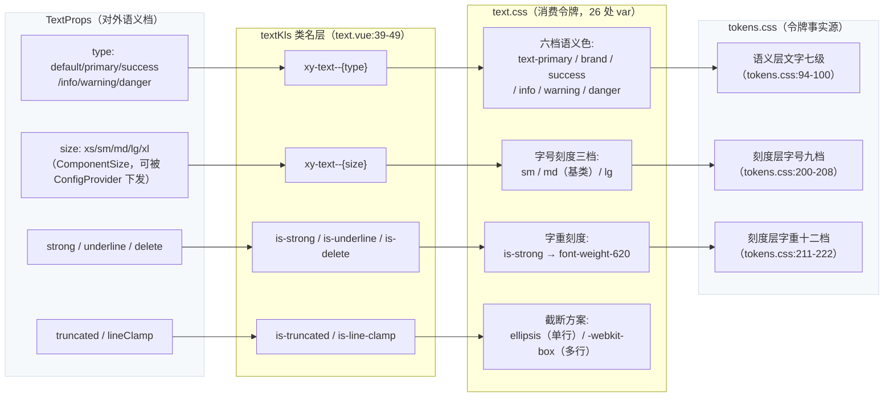
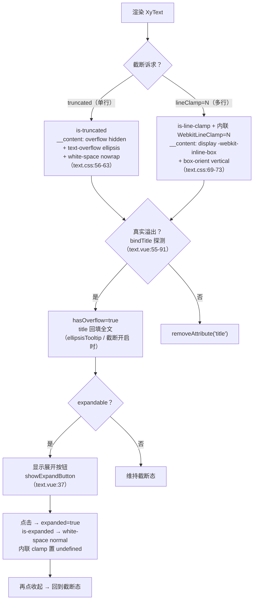

# 5-05 · Text：排版令牌的消费范本

> 一个文本组件能有多复杂？本篇解剖 `XyText`（163 行实现 + 128 行 CSS），它的真正身份不是"排版系统"，而是**排版令牌的消费范本**——全库刻度令牌消费密度最高的样式文件之一就在它身上：128 行 CSS 里埋了 26 处 `var(--xy-*)`，字号、字重、行高、语义色、圆角、动效六个刻度族一个不落。更值得琢磨的是它的"减法"：字号九档刻度只对外暴露三档、字重十二档一档都不对外暴露、语义分层七级只透出六档颜色。所有代码均摘自当前工作区实态，行号逐一核对过。

## 引子：最普通的组件，最密集的令牌账本

每个组件库都有一个 Text。Element Plus 叫 `el-text`，Ant Design 叫 `Typography.Text`，它们共同的宿命是：看起来毫无技术含量——不就是个带颜色的 `span` 吗？

但当你打开 `packages/components/text/src/text.vue` 和 `packages/theme/src/components/text.css`，把 163 行 SFC 和 128 行 CSS 对照着第三章令牌篇读一遍，会发现这个"最普通"的组件是全库**设计令牌体系的第一验收现场**。第三章我们讲过令牌的三层架构（`packages/xiaoye-primitives/src/theme/tokens.css:1-12` 的文件头注释就是架构声明）：基元层色板、语义层角色、刻度层档位。令牌写得再漂亮，如果组件不去消费，它就只是一份 JSON 化的审美偏好。Text 是那个把三层令牌全部接上电的组件：

```text
$ wc -l packages/components/text/src/text.vue packages/components/text/src/text.ts packages/theme/src/components/text.css
     163 packages/components/text/src/text.vue
      19 packages/components/text/src/text.ts
     128 packages/theme/src/components/text.css
```

先交代本篇要回答的核心问题：**文本的语义分层——标题（heading）、正文（body）、辅助（muted）——在这套体系里如何映射到令牌？** 预告一下答案的方向，因为它和直觉相反：分层不在 Text 的 API 里，而在令牌层；Text 刻意只承接其中"正文 + 语义色"一截，把标题和辅助的分层语言留给令牌与消费方组合。这个设计选择的对错，读到第八节你会有自己的判断。

路线图：先看接口面（一个做尽减法的 Props 集），再画 props→令牌的完整映射流，然后是渲染标签的归一策略、截断的三种 CSS 口径与一次 JS 兜底、字重十二档的收编位点，最后用测试、类型夹具和 pro 层消费实证收口，和 Element Plus 的 `el-text` 做一次对照。

## 一、接口面：十一 props 的收缩哲学

类型层全文只有 19 行，`packages/components/text/src/text.ts:1-19`：

```ts
// packages/components/text/src/text.ts:1-19（全文）
import type { ComponentSize } from "xiaoye-primitives";

export const textTypes = ["default", "primary", "success", "info", "warning", "danger"] as const;

export type TextType = (typeof textTypes)[number];

export interface TextProps {
  type?: TextType;
  size?: ComponentSize;
  truncated?: boolean;
  lineClamp?: number | string;
  tag?: string;
  copyable?: boolean;
  ellipsisTooltip?: boolean;
  expandable?: boolean;
  strong?: boolean;
  underline?: boolean;
  delete?: boolean;
}
```

十一个 props，可以分成四组：**语义色**（`type` 六档）、**尺寸**（`size`，直接借用全局 `ComponentSize`）、**截断族**（`truncated` / `lineClamp` / `ellipsisTooltip` / `expandable`）、**行内修饰族**（`strong` / `underline` / `delete` / `copyable` / `tag`）。

先看它**没有什么**，这比看它有什么更重要。

**没有 weight prop。** 你找不到 `weight="600"` 这种接口。全库刻度层明明有十二档字重（`tokens.css:211-222`，第三章 3-06 篇专门写过这场"扩档战争"），Text 却一档都不对外暴露——字重对外只有 `strong?: boolean` 一个布尔开关，内部钉死映射到 `--xy-font-weight-620`（`text.css:76`）。数值直读档（460/520/550/560/620/650/680）是给组件 CSS 内部消费的，不是给使用方的。

**没有字号刻度 prop。** `size` 的类型是 `ComponentSize`，来自 `xiaoye-primitives/src/composables/shared-context.ts:6`：

```ts
// packages/xiaoye-primitives/src/composables/shared-context.ts:6
export type ComponentSize = "" | "xs" | "sm" | "md" | "lg" | "xl";
```

注意这不是 EP 那套 `large / default / small`，而是本库自己的五档命名加一个空串，默认值 `DEFAULT_SIZE = "md"`（`shared-context.ts:28`）。刻度层的字号明明有九档（2xs 11px 到 4xl 48px，`tokens.css:200-208`），Text 只借了 size 体系里的 `sm / md / lg` 三个档位——而且 CSS 里真正写规则的是 `sm` 和 `lg` 两档，`md` 就是基类默认值（`text.css:8`）。

**没有 heading 档。** `type` 不是 `title | body | caption` 这种排版分层，而是 `default | primary | success | info | warning | danger` 六档**语义色**。h1-h6 的结构语义、字重、字号都不在 Text 的管辖范围。

这三条"没有"合起来，是本篇第一个设计权衡。

**权衡一：语义档 vs 数值档的对外 API。** 刻度令牌的本质是数值档——`--xy-font-size-sm: 13px`、`--xy-font-weight-620: 620`，它们精确、可组合，但直接暴露成 props 有两个代价：其一是**联动断裂**，`size="lg"` 若映射字号刻度，就必须自己重造一遍 ConfigProvider 的全局尺寸下发链路（4-08 篇讲过的 `useConfig` 协议），而借用 `ComponentSize` 后，`xy-config-provider size="sm"` 的全局配置对 Text 自动生效；其二是**升级锁定**，一旦 `weight="650"` 成为公开 API，650 这档就永远不能删——本库字重从八档扩到十二档的那场战争（3-06 篇）已经证明长尾档位是会漂移的，把漂移关在 CSS 内部、只对外暴露语义开关（`strong`），漂移就不再是破坏性变更。Text 的答案是：**对外收缩成语义档，对内直连数值档**。

## 二、props→令牌：一条完整的映射流水线

看运行时怎么把这十一个 props 翻译成类名。`text.vue:8-53`：

```ts
// packages/components/text/src/text.vue:8-53
const props = withDefaults(defineProps<TextProps>(), {
  type: "default",
  size: undefined,
  truncated: false,
  lineClamp: undefined,
  tag: "span",
  copyable: false,
  ellipsisTooltip: false,
  expandable: false,
  strong: false,
  underline: false,
  delete: false
});

const attrs = useAttrs();
const { size: globalSize } = useConfig();
const ns = useNamespace("text");
const rootRef = ref<HTMLElement | null>(null);
const textRef = ref<HTMLElement | null>(null);
const hasOverflow = ref(false);
const expanded = ref(false);
const copied = ref(false);
let copiedTimer: number | null = null;

const mergedSize = computed(() => props.size ?? globalSize.value);
const hasLineClamp = computed(
  () => props.lineClamp !== undefined && props.lineClamp !== null && `${props.lineClamp}` !== ""
);
const isEllipsisEnabled = computed(() => !expanded.value && (props.truncated || hasLineClamp.value));
const showExpandButton = computed(() => props.expandable && (hasOverflow.value || expanded.value));

const textKls = computed(() => [
  ns.base.value,
  `${ns.base.value}--${props.type}`,
  `${ns.base.value}--${mergedSize.value}`,
  ns.is("truncated", props.truncated && !expanded.value),
  ns.is("line-clamp", hasLineClamp.value && !expanded.value),
  ns.is("strong", props.strong),
  ns.is("underline", props.underline),
  ns.is("delete", props.delete),
  ns.is("expanded", expanded.value)
]);

const style = computed<CSSProperties>(() => ({
  WebkitLineClamp: hasLineClamp.value && !expanded.value ? String(props.lineClamp) : undefined
}));
```

三个值得停留的细节。其一，`mergedSize`（`text.vue:32`）：局部 prop 优先于全局配置——`props.size ?? globalSize.value`，这是 4-08 篇"全局配置链"协议的最小实现样本。其二，`hasLineClamp`（`text.vue:33-35`）对 `lineClamp` 做了三连判：非 `undefined`、非 `null`、字符串化后非空串——因为 prop 类型是 `number | string`，模板里写 `line-clamp=""` 也会被识别为开启。其三，`ns.is(...)` 是 `use-namespace.ts:8` 的工具方法：`(state, active) => (active ? \`is-${state}\` : "")`，激活才产出类名，所以关闭态的 Text 根节点上不会挂一堆 `is-*` 尸体类。

把这些翻译动作画成流水线，这是本篇第一张图——props 到令牌的完整映射：



现在把流水线终点——CSS 侧——的全文上半段摆出来，`packages/theme/src/components/text.css:1-63`：

```css
/* packages/theme/src/components/text.css:1-63 */
.xy-text {
  display: inline-flex;
  align-items: center;
  gap: 6px;
  max-width: 100%;
  margin: 0;
  padding: 0;
  font-size: var(--xy-font-size-md);
  line-height: var(--xy-line-height);
  color: var(--xy-text-primary);
  overflow-wrap: break-word;
  border-radius: var(--xy-radius-sm);
}

.xy-text__content {
  min-width: 0;
  line-height: inherit;
}

.xy-text--sm {
  font-size: var(--xy-font-size-sm);
}

.xy-text--lg {
  font-size: var(--xy-font-size-lg);
}

.xy-text--default {
  color: var(--xy-text-primary);
}

.xy-text--primary {
  color: var(--xy-brand);
}

.xy-text--success {
  color: var(--xy-success);
}

.xy-text--info {
  color: var(--xy-info);
}

.xy-text--warning {
  color: var(--xy-warning);
}

.xy-text--danger {
  color: var(--xy-danger);
}

.xy-text.is-truncated {
  max-width: 100%;
}

.xy-text.is-truncated .xy-text__content {
  display: inline-block;
  max-width: 100%;
  overflow: hidden;
  text-overflow: ellipsis;
  white-space: nowrap;
  vertical-align: bottom;
}
```

基类（`text.css:1-13`）就是一张微缩令牌映射表：`font-size` 挂刻度层 `--xy-font-size-md`（L8），`line-height` 挂 `--xy-line-height`（L9），`color` 挂语义层 `--xy-text-primary`（L10），连不太起眼的 `border-radius` 都挂了 `--xy-radius-sm`（L12）。128 行 CSS 共 26 处 `var(--xy-*)`，除了 `gap: 6px` 和一处 `line-height: 1.4`（第五节会说它是全文件唯一的"漏网魔法数"），没有任何裸值。

两个容易看走眼的细节。第一，**`xy-text--default` 一符两义**：type 和 size 的修饰类共用 `xy-text--{value}` 这一个命名空间，当 `type="default"` 与 `size="default"`（或全局未配置）同时成立时，产出的都是 `xy-text--default`——恰好 `text.css:28-30` 给它的是 `color: var(--xy-text-primary)`，与基类重复但无害；而 size 侧的 `default` 本来就不需要字号规则（基类已是 md）。两个维度的取值域只在 "default" 上相交，这是类型系统没有拦住、CSS 用"巧合的一致性"兜住的一个接缝——严格说 `xs` 和 `xl` 两档目前没有专属字号规则（回落基类 md），这也算这份映射表上留白的两格。第二，`--xy-text-default` 不存在——语义色直接落 `--xy-text-primary`，而刻度层语义里另有 `--xy-text-secondary`（gray-700）与 `--xy-text-muted`（gray-500），Text **没有**为它们开 prop 档。辅助文本的分层去哪了？答案是：留在令牌层，由消费方用 class 落——第七节的 pro 层实证会展示这个用法。

## 三、渲染标签：归一给使用方，还是补齐给自己

看完映射流水线，看渲染出口。模板全文只有 24 行，`text.vue:140-163`：

```html
<!-- packages/components/text/src/text.vue:140-163 -->
<template>
  <component :is="props.tag" ref="rootRef" :class="textKls" :style="style">
    <span ref="textRef" class="xy-text__content">
      <slot />
    </span>
    <button
      v-if="props.copyable"
      type="button"
      class="xy-text__action"
      :aria-label="copied ? '已复制' : '复制内容'"
      @click="handleCopy"
    >
      <XyIcon :icon="copied ? 'mdi:check' : 'mdi:content-copy'" />
    </button>
    <button
      v-if="showExpandButton"
      type="button"
      class="xy-text__toggle"
      @click="toggleExpanded"
    >
      {{ expanded ? "收起" : "展开" }}
    </button>
  </component>
</template>
```

根节点是 `<component :is="props.tag">`，默认 `span`（`text.vue:13` 的 withDefaults 默认值）。这和上一篇 `XyLink` 的"永远 `<a>`"形成一对镜像：Link 把宿主标签钉死，缺的语义（role、tabindex、键盘合成）由组件自己**补齐**；Text 把宿主标签**外放**给使用方——`tag="p"` 变段落、`tag="del"` 变删除语义、`tag="h1"` 变一级标题，组件只保证不管你换成什么标签，令牌驱动的视觉一致性不丢。

这里正面回答考据里那个问题：**Text 的 `type` 渲染 h1-h6 吗？** 不渲染。实码里 `type` 是六档语义色（`text.ts:3`），整个 SFC 没有任何 `role` 补齐逻辑，也没有 heading 分支。标题语义的达成路径是消费方显式声明：`<xy-text tag="h1" strong>`——结构语义（h1）、强调语义（strong→620 字重）、视觉字号（使用方自己挂 `--xy-font-size-xl` 级别的排版类）三件事各归其主。文档示例 `apps/docs/examples/text/tag.vue:3-13` 展示的正是这个方向：`tag="del"`、`tag="strong"`、`tag="p"`，示例文案自己写着"自定义 tag 适合在不打断排版语义的前提下接入 Text 的颜色、尺寸和截断能力"。

**权衡二：标签归一 vs role 补齐。** EP 的 `el-text` 同样提供 `tag` prop（默认 span），但 EP 的 typography 家族另一头养了 `el-typography` 的 title 变体——组件内部按层级渲染 h1-h6 并绑定字号字重，排版分层被收编进组件 API。两条路线的取舍在于：标题到底算"内容语义"还是"组件档位"？本库的判断是前者——h1-h6 是文档大纲（document outline）的事，一个组件库替使用方决定"哪里该有 h2"，在 SSR/SEO 和无障碍审查里反而添乱；所以 Text 只做行内修饰器，把大纲让给页面作者。代价是本库没有一个"开箱即标题"的组件，页面标题的排版类要自己写——文档站的标题样式就是例证，`apps/docs/examples/text/basic.vue:40-41` 里示例自身的说明文字用的是 `color: var(--xy-text-secondary); font-size: 13px`，辅助分层靠消费方落令牌完成（顺带一提，那处 `font-size: 13px` 是值直写而没引 `var(--xy-font-size-sm)`，属于文档示例里的一处小瑕疵，令牌消费纪律在自家示例里也没有 100% 贯彻）。方向相反的另一面在复制按钮上：Text 对**交互语义**却是自己补齐的——`xy-text__action` 渲染真 `<button type="button">` 并挂 `aria-label`（`text.vue:145-153`），而不是丢一个可点击的 span 给使用方。同一个组件，结构语义外放、交互语义自持，这条分界线和 Link 篇的结论互为注脚：**语义治理的方向，取决于该语义的归属方是谁。**

## 四、截断：三种 CSS 口径与一次 JS 兜底

截断族是 Text 里逻辑最重的部分，值得单独一节。先把状态机画出来——本篇第二张图：



先看多行段的 CSS，`text.css:65-110`：

```css
/* packages/theme/src/components/text.css:65-110 */
.xy-text.is-line-clamp {
  align-items: flex-start;
}

.xy-text.is-line-clamp .xy-text__content {
  display: -webkit-inline-box;
  -webkit-box-orient: vertical;
  overflow: hidden;
}

.xy-text.is-strong {
  font-weight: var(--xy-font-weight-620);
}

.xy-text.is-underline {
  text-decoration: underline;
  text-underline-offset: 3px;
  text-decoration-color: color-mix(in srgb, currentColor 18%, transparent);
}

.xy-text.is-delete {
  text-decoration: line-through;
}

.xy-text.is-expanded {
  white-space: normal;
}

.xy-text__action,
.xy-text__toggle {
  border: 0;
  background: transparent;
  padding: 4px 8px;
  border-radius: var(--xy-radius-md);
  color: var(--xy-text-muted);
  cursor: pointer;
  font-size: var(--xy-font-size-sm);
  font-weight: var(--xy-font-weight-560);
  line-height: 1.4;
  transition:
    color var(--xy-transition-duration-fast) var(--xy-transition-timing),
    background-color var(--xy-transition-duration-fast) var(--xy-transition-timing),
    border-color var(--xy-transition-duration-fast) var(--xy-transition-timing),
    box-shadow var(--xy-transition-duration-fast) var(--xy-transition-timing);
  border: 1px solid transparent;
}
```

**权衡三：truncated 的 CSS 方案。** 实码的口径是**单行、多行双方案并存**，而且作用位置很讲究。单行方案（`text.css:52-63`）是经典三件套 `overflow: hidden + text-overflow: ellipsis + white-space: nowrap`，但它不落在根节点上——落在 `.xy-text__content` 子元素上。原因是基类把根设成了 `display: inline-flex`（`text.css:2`）：`text-overflow: ellipsis` 只对块级/行内块容器生效，flex 容器本身不裁文本，所以必须有一个行内块化的文本载体，`__content` 就是这个载体（`display: inline-block`，`text.css:57`）。多行方案（`text.css:69-73`）用 `-webkit-inline-box + box-orient: vertical`，行数 `N` 由运行时内联样式注入——`text.vue:51-53` 的 `style` computed 输出 `WebkitLineClamp`，这就是为什么 `lineClamp` 是动态值而类名只负责形态：**可变数值走内联样式，固定形态走类名**，这和 4-05 篇浮层定位管道里"定位值内联、形态类名"是同一条工程纪律。行高也在多行下被照顾了：`is-line-clamp` 时根切到 `align-items: flex-start`（`text.css:65-67`），避免展开按钮和首行垂直居中错位。

CSS 方案有个天生的盲区：**它不知道自己有没有真的截断**。`white-space: nowrap` 挂上去，短文本安然无恙，长文本悄悄剪掉——浏览器不会告诉你。于是有了那次 JS 兜底，`text.vue:55-101`：

```ts
// packages/components/text/src/text.vue:55-101
function bindTitle() {
  if (typeof attrs.title === "string" && attrs.title.length > 0) {
    hasOverflow.value = false;
    return;
  }

  const element = rootRef.value;
  const root = rootRef.value;
  const content = textRef.value;

  if (!element || !root || !content) {
    return;
  }

  let shouldAddTitle = false;
  const text = content.textContent?.trim() ?? "";

  if (props.truncated && !expanded.value) {
    shouldAddTitle = element.offsetWidth > 0 && element.scrollWidth > element.offsetWidth;
  } else if (hasLineClamp.value && !expanded.value) {
    shouldAddTitle = element.offsetHeight > 0 && element.scrollHeight > element.offsetHeight;
  }

  hasOverflow.value = shouldAddTitle;

  if (!isEllipsisEnabled.value && !props.ellipsisTooltip) {
    root.removeAttribute("title");
    return;
  }

  if (shouldAddTitle && text) {
    root.setAttribute("title", text);
    return;
  }

  root.removeAttribute("title");
}

onMounted(bindTitle);
onUpdated(bindTitle);

watch(
  () => [props.truncated, props.lineClamp, props.expandable, expanded.value],
  () => {
    bindTitle();
  }
);
```

这段有三个精细处。第一，**用户显式 `title` 永远优先**（`text.vue:56-59`）：只要 attrs 里有非空 title，组件直接让路且不探测——这是"透传属性是用户主权"的约定，测试 `text.spec.ts:190-217` 专门锁死（`attrs: { title: "自定义标题" }` 时断言不被覆盖）。第二，探测的度量轴跟着截断方案走：单行比宽度（`scrollWidth > offsetWidth`，L73），多行比高度（`scrollHeight > offsetHeight`，L75）。第三，回填时机是三重的：`onMounted` + `onUpdated` 兜住渲染周期，`watch` 兜住截断配置与展开态的变化——`onUpdated` 管内容变，`watch` 管配置变，两者职责不重叠。

展开交互则是一组精确的联动：`showExpandButton`（`text.vue:37`）要求 `expandable && (hasOverflow || expanded)`——没溢出就不显示按钮（没东西可展开），展开后要保留按钮（还能收起）；点击后 `expanded = true`，`textKls` 里 `is-truncated`/`is-line-clamp` 因 `!expanded` 条件而摘除，`is-expanded` 挂上，CSS 侧 `white-space: normal`（`text.css:89-91`）恢复换行，内联 `WebkitLineClamp` 也因 `!expanded` 条件变回 `undefined`。一个布尔值同时驱动三个出口的收敛，这是把"展开"当**一等状态**而不是"样式开关"来建模。

## 五、字重：十二档刻度的收编位点

第五节回到令牌账本里最有故事的一页。刻度层的字重段全文，`tokens.css:210-226`：

```css
/* packages/xiaoye-primitives/src/theme/tokens.css:210-226 */
  /* 字重：Stripe 双轨制 —— 展示 300 / 控件 400；数值档直读命名，与主题无关 */
  --xy-font-weight-light: 300;
  --xy-font-weight-regular: 400;
  --xy-font-weight-medium: 500;
  --xy-font-weight-semibold: 600;
  --xy-font-weight-bold: 700;
  --xy-font-weight-460: 460;
  --xy-font-weight-520: 520;
  --xy-font-weight-550: 550;
  --xy-font-weight-560: 560;
  --xy-font-weight-620: 620;
  --xy-font-weight-650: 650;
  --xy-font-weight-680: 680;

  /* 行高 */
  --xy-line-height-tight: 1.2;
  --xy-line-height: 1.5;
```

十二档里前五档是语义命名（light/regular/medium/semibold/bold），后七档是**数值直读命名**——`--xy-font-weight-620` 的值就是 620，变量名即文档。3-06 篇讲过这批 460~680 长尾档的来历：可变字体时代字重是连续轴，语义五档不够用时，与其造 `semibold-plus` 这种新形容词，不如直接把数值升格为档名。Text 恰好是这批长尾档在组件层的**收编位点**：`text.css:75-77` 的 `is-strong` 消费 620——注意不是 semibold 的 600，强调查强调落在了 600 和 650 之间的第三个刻度上；`text.css:102` 的 `__action/__toggle` 按钮文字消费 560——一个比 medium 重、比 semibold 轻的"次强调"位置。这两个档位如果哪天要微调（比如 620→610），改令牌一处、全库生效，而 `strong` 这个对外布尔 API 纹丝不动——这就是第一节权衡一说的"把漂移关在 CSS 内部"的具体兑现。

这个位点对下一篇还有特殊意义：`text.css:76` 的 620 正是 5-06 篇 Badge 话题（长尾字重档收编位点）的证据之一，先在这里立此存照。

行高段（`tokens.css:224-226`）只有两档：tight 1.2 和标准 1.5。Text 基类消费 `--xy-line-height`（`text.css:9`），`__content` 再 `line-height: inherit`（`text.css:17`）——继承而非重复声明，保证子元素与根永远同步。但账本要诚实：`text.css:103` 的 `line-height: 1.4` 是全文件唯一一处裸值刻度，不在两档行高令牌的覆盖范围内。它是展开/复制按钮的行高压缩（让小按钮视觉更紧），严格说该进刻度层（比如 `--xy-line-height-compact`）或复用 tight。单处例外不影响"全令牌化"的结论，但它是这份"消费范本"里唯一的出格样本，值得点名。

## 六、测试与类型夹具：把令牌契约锁进断言

令牌契约怎么防回归？看测试。`packages/components/text/__tests__/text.spec.ts` 共 218 行、九个用例。先看两条与令牌映射直接相关的断言：

```ts
// packages/components/text/__tests__/text.spec.ts:11-34
  it("默认渲染为文本组件", () => {
    const wrapper = mount(XyText, {
      slots: {
        default: "文本内容"
      }
    });

    expect(wrapper.classes()).toContain("xy-text");
    expect(wrapper.classes()).toContain("xy-text--default");
    expect(wrapper.classes()).toContain("xy-text--md");
    expect(wrapper.text()).toContain("文本内容");
  });

  it("支持类型和尺寸", () => {
    const wrapper = mount(XyText, {
      props: {
        type: "success",
        size: "lg"
      }
    });

    expect(wrapper.classes()).toContain("xy-text--success");
    expect(wrapper.classes()).toContain("xy-text--lg");
  });
```

默认渲染断言 `xy-text--default` + `xy-text--md`（L19-20）——注意 `--md` 不来自 props（`size` 默认是 `undefined`），而是 `useConfig` 未注入时的 `DEFAULT_SIZE = "md"` 走通了 `mergedSize` 链路。测试名起得很克制："默认渲染为文本组件"，断言的其实是**映射流水线的默认输出**。

全局尺寸继承的用例（`text.spec.ts:36-52`）用 `xy-config-provider size="sm"` 包裹后断言 `xy-text--sm`（L51），把权衡一里"借用 ComponentSize 换全局联动"的收益钉进了回归网。截断族的两个用例最见功力——JS 溢出探测依赖真实布局，单测环境没有布局引擎，测试用 `Object.defineProperty` 直接劫持 `offsetWidth/scrollWidth`：

```ts
// packages/components/text/__tests__/text.spec.ts:54-111
  it("支持单行截断和 title 回填", async () => {
    const wrapper = mount(XyText, {
      props: {
        truncated: true
      },
      slots: {
        default: "这是一段会被截断的长文本"
      }
    });

    const element = wrapper.element as HTMLElement;

    Object.defineProperty(element, "offsetWidth", {
      configurable: true,
      get: () => 80
    });
    Object.defineProperty(element, "scrollWidth", {
      configurable: true,
      get: () => 160
    });

    await wrapper.setProps({
      type: "primary"
    });

    expect(wrapper.classes()).toContain("is-truncated");
    expect(wrapper.attributes("title")).toBe("这是一段会被截断的长文本");
  });

  it("支持多行截断和 line-clamp 样式", async () => {
    const wrapper = mount(XyText, {
      props: {
        lineClamp: 2
      },
      slots: {
        default: "第一行 第二行 第三行"
      }
    });

    const element = wrapper.element as HTMLElement;

    Object.defineProperty(element, "offsetHeight", {
      configurable: true,
      get: () => 40
    });
    Object.defineProperty(element, "scrollHeight", {
      configurable: true,
      get: () => 90
    });

    await wrapper.setProps({
      lineClamp: 3
    });

    expect(wrapper.classes()).toContain("is-line-clamp");
    expect(element.style.webkitLineClamp).toBe("3");
    expect(wrapper.attributes("title")).toBe("第一行 第二行 第三行");
  });
```

细节在 `setProps`：探测发生在 `onUpdated`，而劫持发生在挂载后——`setProps` 制造一次更新，把 `bindTitle` 重新拉起来，溢出判定才能读到被劫持的度量值。多行用例还断言了 `element.style.webkitLineClamp`（L109），把"行数走内联样式"的口径也锁住了。

类型侧的契约在 `tests/types/fixtures/text.ts`（38 行全文参与 `pnpm typecheck:types`），三条 `@ts-expect-error` 各守一扇门：`type: "neutral"` 拒绝语义色六档之外的取值（L19-23）、`size: "large"` 拒绝 EP 风格命名（L26-30）、`lineClamp: true` 拒绝非 number/string（L33-37）。第二条尤其值得玩味——`"large"` 在 EP 是合法 size，在本库是类型错误，五档命名（`xs/sm/md/lg/xl`）的差异被夹具固化成了一条跨库迁移的显式路标。

## 七、消费实证与 EP 对照：范本的成色

**库内消费。** 在 pro 层（`packages/pro-components`）用 `rg '<xy-text'` 检索，命中三处。第一处是审核时间线，`packages/pro-components/audit-timeline/src/audit-timeline.vue:105-110`：

```html
<!-- packages/pro-components/audit-timeline/src/audit-timeline.vue:105-110 -->
              <xy-text
                v-if="item.operator"
                class="xy-audit-timeline__operator"
                type="default"
                size="sm"
              >
                {{ item.operator }}
              </xy-text>
```

这就是第二节埋的那个伏笔的答案：操作人这类"辅助元数据"，组件没有开 `muted` 档，pro 组件在自己的类 `xy-audit-timeline__operator` 里落语义令牌（该类在组件私有样式里消费 `--xy-text-muted` 一级的语义色），Text 负责字号档（`size="sm"`）与语义色的基线，分层微调由消费方 class 补完——**组件给档，令牌给语言，消费方做组合**。另外两处同理：`async-state-container.vue:33` 用 `<xy-text type="danger">` 承载错误信息（语义色六档的正向用例），`approval-flow-panel.vue:46-47` 用 `type="default"` 渲染办理人、`size="sm"` 渲染时间。顺带记一笔为 5-06 埋的线：`apps/docs/examples/badge/dot.vue:4` 里 `<xy-text>即时消息</xy-text>` 正是 Badge 圆点依附的宿主文本——依附与独立双形态的铺垫已经在示例层就位。

**EP 对照。** 把 `el-text` 拉上同一张桌：接口面惊人地相似——`type` 六档同色系、`truncated`/`line-clamp` 截断双方案、`tag` 标签归一，EP 2.x 后期补的 line-clamp 与本库连 API 形状都接近。分歧在令牌的"深度"。EP 的字号走 `useFormSize` 的 `large/default/small` 三档，编译期由 SCSS map 直写像素值，字重则交给 `el-typography` 家族按 h1-h6 标签分档——**排版三要素（字号/字重/行高）没有一层统一的刻度令牌**，颜色虽有 `--el-text-color-*` 五级，但与字号体系互不相通。本库这边，Text 的 128 行 CSS 是 26 处 `var()` 的全令牌化消费：字号直连刻度层九档中的三档、字重重直连十二档中的两档数值档、行高直连刻度层、颜色直连语义层七级中的八处引用（`--xy-text-primary` 与状态六色），双主题切换只需语义层覆写、组件 CSS 零改动。对照的结论不是"EP 做得不对"——EP 的令牌体系要兼容 2.x 十年的历史包袱——而是同一份 API 设计在不同令牌基建上会落出不同的**可维护性上限**：API 相似时，决定长期成本的是底下那张令牌网。这也是标题里"消费范本"四个字的分量：Text 之于本库令牌体系，正如 canary 之于矿井。

## 八、回到核心问题：分层的答案

现在正面收束核心问题——heading、正文、辅助的语义分层如何映射令牌。本库的答案是一份三层分工表：

```text
┌─────────────┬────────────────────────────────┬──────────────────────────┐
│ 分层         │ 落点                            │ 实证                      │
├─────────────┼────────────────────────────────┼──────────────────────────┤
│ heading     │ 令牌层 --xy-text-heading        │ text.css 不消费它；        │
│ （标题）     │ + tag="h1~h6" 结构语义           │ tag.vue 示例外放给使用方    │
│             │ + 字号刻度 xl~4xl 由排版类消费    │                          │
├─────────────┼────────────────────────────────┼──────────────────────────┤
│ body       │ type 默认 → --xy-text-primary    │ 基类 text.css:10          │
│ （正文）     │ + --xy-font-size-md             │ strong → 620（text.css:76）│
├─────────────┼────────────────────────────────┼──────────────────────────┤
│ muted      │ 令牌层 --xy-text-secondary/muted │ pro 层消费方 class 落色；  │
│ （辅助）     │ Text 只给 size="sm" 字号档       │ Text 不开 prop 档         │
└─────────────┴────────────────────────────────┴──────────────────────────┘
```

三条使用守则：**其一**，正文与状态语义直接用 `type` 六档，别绕开组件手写 `color: var(--xy-danger)`——Text 档位走的是语义层正门，双主题切换时自动跟随。**其二**，标题别指望 Text 开箱即得：`tag="h1"` 给结构、`strong` 给字重、字号刻度类自己挂——如果页面里标题模式重复出现，正确动作是封装业务排版类消费 `--xy-font-size-*`/`--xy-text-heading`，而不是给 Text 提需求加 `title` 档。**其三**，辅助文本用 `size="sm"` + 消费方落 `--xy-text-muted`/`--xy-text-secondary`，保持"组件给档、令牌给语言"的组合纪律。

收束成一句话：Text 的语义分层不是一个组件的功能清单，而是一张**令牌网上的分工协议**——刻度层管"多大、多粗、多密"，语义层管"什么角色"，Text 自己只管把这些接进一个 `span`（或任何你 `tag` 给它的标签），并顺手做好截断、复制、展开这些行内文本的真实家务事。组件做得越"薄"，令牌网就织得越密——这就是消费范本的意义。

下一篇预告：5-06《Badge：依附与独立双形态》。`text.css:76` 那个 620 字重档在 Badge 里还会再遇到，而真正的问题是形态的：依附在宿主（`dot.vue` 里 `<xy-text>即时消息</xy-text>` 旁边那颗圆点）与独立存在的 Badge，状态色六件套（`--xy-{status}` 及其 soft 变体，`tokens.css:129-156`）怎么在两种形态间复用？圆点、角标、胶囊三种视觉形态共享一套令牌时，边界又划在哪里？

---

*本篇代码引用核对于当前工作区实态：`packages/components/text/src/text.vue`（163 行）、`text.ts`（19 行）、`packages/theme/src/components/text.css`（128 行）、`packages/xiaoye-primitives/src/theme/tokens.css`（409 行）、`packages/components/text/__tests__/text.spec.ts`（218 行）、`tests/types/fixtures/text.ts`（38 行）、`packages/pro-components/audit-timeline/src/audit-timeline.vue`、`async-state-container/src/async-state-container.vue`、`approval-flow-panel/src/approval-flow-panel.vue`。*
