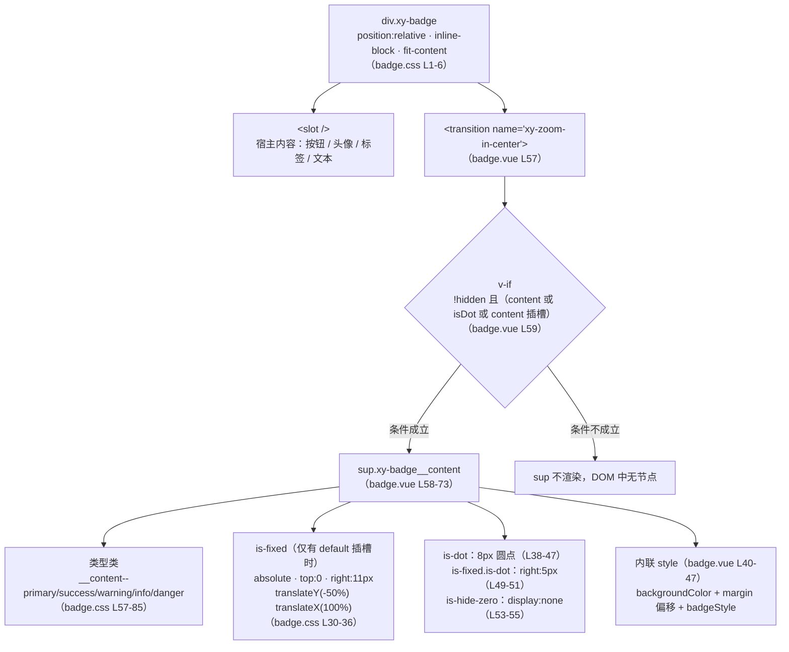

# 5-06 · Badge：依附与独立双形态

> 本篇回答一个看起来很小、其实处处是坑的问题：**徽标的位置协商怎么实现？** 一个 `99+` 的小胶囊要精准压在按钮右上角，既不能遮住内容、不能被父元素裁剪、还要允许用户微调——这背后是"CSS 锚点、transform 推出、margin 微调"三层机制的叠加协作。我们把 `badge.vue`、`badge.ts`、`badge.css` 逐行读完，把这个协商协议完整拆开，顺手把 3-05 留下的 `right: 11px` 考据欠账还上。

## 一、问题复述与解题路线

接到这篇时我的理解是：Badge 徽标在本库中是一个"寄生型"组件——它自己几乎没有独立的生命周期，价值全在"贴在谁身上、贴得准不准"。所以本篇的核心不是"徽标怎么显示数字"（那是 4-03 标准解剖已覆盖的常规操作），而是**位置协商**：组件与宿主元素之间、CSS 类与内联样式之间、静态锚点与用户偏移之间，三层如何分工、如何叠加、如何互不踩踏。

解题路线按四步走：先看双形态的判定机制（有 default 插槽走依附、没有走独立）；再看依附形态下徽标的几何推演（`right: 11px` + `translateY(-50%) translateX(100%)` 到底把徽标推到了哪里）；然后拆 `offset` 的选型——为什么走 margin 通道而不是 top/right；最后用 message 内置徽标做反向实证——什么时候"复用样式语言但不复用实现"。

## 二、双形态判定：一个插槽决定两套布局语义

先立住结论：**同一个 `xy-badge`，有 default 插槽就是依附形态（徽标绝对定位悬在宿主角上），没有就是独立形态（徽标作为行内元素常规排列）**。判定发生在两个地方。

第一处在视图层，`packages/components/badge/src/badge.vue:26`：

```ts
const hasDefaultSlot = computed(() => Boolean(slots.default));
```

第二处在类名组合上，`badge.vue:59-67`：

```ts
v-if="!props.hidden && (content || props.isDot || slots.content)"
:class="[
  `${ns.base.value}__content`,
  `${ns.base.value}__content--${props.type}`,
  ns.is('fixed', hasDefaultSlot),
  ns.is('dot', props.isDot),
  ns.is('hide-zero', !props.showZero && props.value === 0),
  props.badgeClass
]"
```

`ns.is('fixed', hasDefaultSlot)` 是全篇的枢纽：`useNamespace` 的 `is` 方法（`packages/xiaoye-primitives/src/composables/use-namespace.ts:8`）极其克制——

```ts
const is = (state: string, active?: boolean) => (active ? `is-${state}` : "");
```

第二个参数为真返回 `is-fixed`，为假返回空串，连"不加类"这件事都没有第三种表达。整条链路是：插槽有无 → 布尔值 → 类名有无 → CSS 里 `position: absolute` 是否生效。**形态切换没有 JS 布局代码，全部交给一个类名开关**，这是本库一贯的"类名即状态机"风格（4-05 浮层三态、4-11 message 的 is-paused 都是这个模式的变体）。

依附形态的完整渲染结构如下：



这张图里有两个值得驻足的细节。

**细节一：外壳是收缩包裹，不是块级铺满。** `badge.css:1-6`：

```css
.xy-badge {
  position: relative;
  display: inline-block;
  width: fit-content;
  vertical-align: middle;
}
```

`position: relative` 是依附形态的包含块来源——`sup` 的 `absolute` 就近锚定在这个外壳上，而不是锚在宿主按钮上。外壳用 `inline-block` + `fit-content` 收缩到恰好裹住宿主内容，于是"外壳右上角"就是"宿主右上角"，徽标锚外壳等于锚宿主。`vertical-align: middle` 则保证这个外壳混在文本行里时不破坏基线。注意这里的取巧：**徽标从来没有定位到宿主元素上，它定位到的是一个恰好和宿主一样大的隐形盒子上**。宿主自己不需要任何配合（不用加 `position: relative`，不用加类），零侵入——这是 slot 包裹方案相对"纯定位方案"的根本优势，第五节展开。

**细节二：`sup` 不是随便选的标签。** 依附形态下 `sup` 被绝对定位，脱离文档流，浏览器的上标默认样式不起作用；但独立形态下 `sup` 作为 `inline-flex` 参与行内布局，HTML 规范建议的 UA 默认样式 `vertical-align: super` 会生效——徽标相对基线自然上浮，恰好是"上标"的视觉语义。组件显式设置了 `font-size: var(--xy-font-size-xs)`（badge.css L22）覆盖了 UA 的字号缩小，但保留 `vertical-align: super` 不覆盖：独立形态的白送位移和 `sup` 的语义（上标 = 补充性角注）是对齐的。语义标签的默认样式被用成了设计的一部分，这是少见的"正向消费 UA 样式"。

## 三、content 计算：数字、上限与点的三分支

显示什么由 `badge.vue:28-38` 的 `content` computed 决定，全文如下：

```ts
const content = computed<string>(() => {
  if (props.isDot) {
    return "";
  }

  if (typeof props.value === "number" && typeof props.max === "number") {
    return props.max < props.value ? `${props.max}+` : `${props.value}`;
  }

  return `${props.value}`;
});
```

三个分支的优先级是刻意排的：**dot 优先于一切**（圆点模式下根本不产生文本，连插槽回退都不给内容）；**溢出判断其次**，且要求 `value` 和 `max` 双双是 `number` 才启用——`max: 99` 与 `value: "200"`（字符串）组合不会溢出，会原样显示 `"200"`。这是防御式设计：字符串值的徽标（`"new"`、`"hot"`、`"Beta"`）语义上不存在"上限"概念，宁可放过不可错杀。**最后才是模板串兜底**，任何值都转成字符串显示。

`max` 溢出策略本身值得单独权衡。`99+` 的截断放在哪里做，业界有三种做法：服务端截断（接口直接返回 `99+` 字符串）、CSS 截断（容器定宽 + `overflow` 裁剪）、组件层截断（本库的做法，`badge.vue:34`）。第三种的成本收益比最好：服务端截断把展示逻辑泄漏给了数据层，客户端拿不到真实数值（想做"点击查看全部 137 条"就抓瞎）；CSS 截断能保住数值但需要定宽容器，`137+` 和 `9` 用同一宽度要么前者被裁要么后者太空。组件层截断保留了 `value` 的原始数值（`props.value` 不被改写，`defineExpose` 暴露的 `content` 与原始值分离，`badge.vue:49-51`），展示形态和业务数据解耦。顺带一提边界：`value: 100, max: 99` 显示 `99+`，而 `value: 99` 显示 `99`——判断条件是严格小于（`max < value`），恰好等于上限不加上标。另一个隐藏分支是 `max: Infinity`：`typeof Infinity === 'number'` 成立，`Infinity < value` 恒假，等于"不设上限"，类型层不需要额外的开关。

渲染条件 `badge.vue:59` 里还有一个隐性三分支：`content || props.isDot || slots.content`。独立形态下 `value: ""`（默认值）时 `content` 为空串、非 dot、无 content 插槽——三个条件全假，`sup` 根本不渲染。**空值徽标不是"显示空胶囊"，是 DOM 里没有这个节点**。这对无障碍是白赚的：读屏器不会遇到一个没有可访问名称的空上标。

## 四、位置协商三层：CSS 锚点、transform 推出、margin 微调

现在进入本篇核心。依附形态下徽标落点由三层机制叠加决定，各司其职：

```mermaid
flowchart LR
    subgraph L1["第一层 · CSS 类静态锚点<br/>badge.css L30-36"]
        A1["is-fixed<br/>position: absolute<br/>top: 0<br/>right: 11px"]
    end
    subgraph L2["第二层 · transform 几何推出<br/>badge.css L34"]
        B1["translateY(-50%)<br/>徽标中心压到宿主顶边"]
        B2["translateX(100%)<br/>徽标整体推出右缘"]
    end
    subgraph L3["第三层 · 内联 margin 微调<br/>badge.vue L43-44"]
        C1["marginRight: -offset&#91;0&#93;px<br/>marginTop: offset&#91;1&#93;px"]
    end
    L1 -->|"先定基准：右上角"| L2
    L2 -->|"再推几何：圆心对角"| L3
    L3 -->|"最后用户微调"| D["最终落点"]
```



第一层的 `badge.css:30-36` 是静态基准：

```css
.xy-badge__content.is-fixed {
  position: absolute;
  top: 0;
  right: 11px;
  transform: translateY(-50%) translateX(100%);
  z-index: var(--xy-z-normal, 1);
}
```

把几何算清楚（宿主右上角为原点，向右为正 x、向下为正 y）：

- `top: 0; right: 11px`：徽标（默认宽 20px）的**右边缘**放在宿主右缘向内 11px 处，**上边缘**与宿主顶边平齐；
- `translateY(-50%)`：垂直上移自身半高 10px，徽标**垂直中心**恰好落在宿主顶边上；
- `translateX(100%)`：水平右移自身全宽 20px，徽标区间从 `[-11, +9]` 平移到……等等，先别急，注意 `right: 11px` 时徽标已经横跨宿主右缘（`[-11, +9]` 中 `+9` 已在缘外），再右移 20px 后区间变为 `[-11, +9]`？不对——transform 是在定位结果上叠加的，`right: 11px` 把徽标右缘放在 `-11`，`translateX(100%)` 右移 20px 后区间是 `[-11, +9]`，即徽标左缘在宿主内 11px、右缘伸出宿主外 9px，**徽标水平中心在宿主右缘向内 1px**。

合并结果：**徽标圆心落在（右缘向内 1px，顶边）这个点上——正是宿主右上角的角点，1px 恰好是 1px 边框的补偿**。再验证 dot 模式：宽 8px，`is-fixed.is-dot` 覆盖 `right: 5px`（badge.css L49-51），同样推出后中心 = 右缘向内 `5 - 8/2`……直接套公式：`right = size/2 + 1`，size=20 得 11，size=8 得 5。**两个数字满足同一个公式：`right = 徽标尺寸的一半 + 1px 边框补偿`**。圆心对角点，就是徽标位置协商的最终答案——所有复杂性都在服务这一个几何目标。

公式有了，剩下的是"公式放在哪"的表达问题。这正好接上 3-05 第六节的考据欠账。3-05 把 `right: 11px` 和 `right: 5px` 归为"光学对齐的视觉残差"，结论是"网格管布局，眼睛管贴角"。把 EP 的实码摆出来后，这个叙述需要深化一层。Element Plus 的 `badge.scss`（dev 分支）是这么写的：

```scss
/* element-plus: packages/theme-chalk/src/badge.scss（dev 分支） */
.el-badge__content.is-fixed {
  position: absolute;
  top: 0;
  right: calc(1px + #{getCssVar('badge', 'size')} / 2);
  transform: translateY(-50%) translateX(100%);
  z-index: getCssVar('index', 'normal');
}

.el-badge__content.is-dot {
  height: 8px;
  width: 8px;
  padding: 0;
  border-radius: 50%;
}

/* is-fixed.is-dot 时 right 覆盖为 5px */
```

EP 把公式**活在 CSS 里**：`calc(1px + badge-size / 2)`，尺寸变了偏移自动跟随（dot 覆盖回 5px 是它的第二处展开）。本库 `badge.css:33` 的 `11px` 本质上是这个公式在 `size = 20px` 下的**手工展开定值**——因为本库徽标尺寸（`height: 20px`，badge.css L16）本身就是写死的，没有 `--xy-badge-size` 这样的变量可供 calc 引用，公式便退化成两个孤立的魔法数字。所以 11 与 5 的准确身世不是"眼睛调出来的残差"，而是**确定性几何公式未被表达的两个实例**。按 3-05 自己给出的判据——"光学越界要有名字，没有名字的越界才是真越界"——card 用 `calc(var(--xy-card-padding) - 2px)` 表达了修正关系所以合格，badge 的 11/5 两者皆无、属于同一判据下的待表达债。修复路径也现成：立 `--xy-badge-size: 20px` 组件变量，两处写 `calc(1px + var(--xy-badge-size) / 2)`，dot 分支的 `right: 5px` 随 `is-dot` 的尺寸覆盖自动成立，两个魔法数字一起消失。这是本篇给 3-05 的落点交代。

第二、三层的协作是另一个精妙处。`badge.vue:40-47` 的内联样式：

```ts
const style = computed<StyleValue>(() => [
  {
    backgroundColor: props.color || undefined,
    marginRight: `${-props.offset[0]}px`,
    marginTop: `${props.offset[1]}px`
  },
  props.badgeStyle ?? {}
]);
```

用户级 `offset` 走的是 **margin 通道**：`offset[0]` 转`负的右外边距`（负 margin 把盒子向右顶出），`offset[1]` 转正的上外边距（把盒子向下推）。方向语义是"向右 x、向下 y"的正坐标——示例 `apps/docs/examples/badge/offset.vue:6-8` 里 `xy-avatar` 上的圆点用 `[14, 2]`，即向右推出 14px、下压 2px，把 dot 从头像角上挪到头像外侧。为什么不把 offset 编进 `top/right`？三个理由层层递进：

1. **职责混淆**：`is-fixed` 类里的 `top: 0; right: 11px` 是协议基准，用户 offset 是个性微调，若同写一个属性就要做加法合成，基准和微调耦合在一处，任何一方改动都要理解另一方；
2. **动画正交**：依附徽标包在 `<transition name="xy-zoom-in-center">` 里（badge.vue L57），过渡动画作用于 `transform`（scale 0.8 起缩）与 `opacity`（badge.css L94-97）。若 offset 也写进 transform，就要与 `translateY(-50%) translateX(100%)` 链式拼接，进出场插值的起点会被用户 offset 污染；margin 是常规布局属性，动画期间纹丝不动，二者天然正交；
3. **形态无关**：margin 在绝对定位和常规流里都合法（独立形态下就是普通外边距），同一套 style 代码两种形态通用，不需要按 `hasDefaultSlot` 分叉。

顺带一提 `backgroundColor: props.color || undefined` 的 `|| undefined`：`color` 默认空串，若直接写入 `background-color: ;` 是非法值会污染内联样式，转 `undefined` 让 Vue 跳过该属性、把舞台还给 CSS 类里五套类型变量（badge.css L57-85 的 `--xy-badge-bg/--xy-badge-color/--xy-badge-border` 三件套）。`props.badgeStyle` 排在数组末位，优先级最高，可以覆盖前两项——类型夹具 `tests/types/fixtures/badge.ts:13-15` 里那个 `badgeStyle: { top: "2px" }` 正是暗示这条逃生通道的存在：offset 管不到的场景（比如想动 `top` 基准）走 `badgeStyle` 兜底。

还有一个 EP 对照：本库 `marginRight: \`${-props.offset[0]}px\`` 与 EP 的 `marginRight: addUnit(-props.offset[0])` 语义逐字符同构，差异只在单位处理——EP 用 `addUnit` 兼容数字与字符串单位，本库因为 `offset` 类型锁死为 `[number, number]` 元组（badge.ts L21），直接模板串拼 `px` 即可，把运行时判断换成了编译期约束。

## 五、三套隐藏语义与一个插槽响应式盲区

徽标的"不显示"在代码里有三条互不相同的通道，这是读源码前完全想不到的细节密度：

1. **`hidden: true` → v-if 卸载**。`badge.vue:59` 的 `v-if` 让 `sup` 从 DOM 消失，测试断言的是 `expect(wrapper.find(".xy-badge__content").exists()).toBe(false)`（badge.spec.ts L70）。语义是"这个徽标不存在"，读屏器、选择器、布局三方面彻底干净，且因包着 `<transition>`，卸载走 zoom-out 动画而非闪断；
2. **`showZero: false` 且值为 0 → display:none**。`ns.is('hide-zero', ...)` 生成 `is-hide-zero` 类，`badge.css:53-55` 一行 `display: none`。节点还在 DOM 里，只是不占布局。测试断言的是 classes 包含 `is-hide-zero`（badge.spec.ts L81）而非 exists 为 false——同一份测试代码里两种断言风格的差异，正是两条通道差异的镜像；
3. **空值 → 不渲染**。`content || props.isDot || slots.content` 全假时 `sup` 压根不出现，这是第三条通道，与 `hidden` 的 v-if 同机制但触发源不同（数据为空 vs 用户显式隐藏）。

为什么 `show-zero` 不复用 v-if？可以反推设计意图：零值隐藏是高频轻量开关（购物车清空又加购），`display: none` 不销毁节点、不触发 transition 卸载动画、数字从 1 变 0 再变 1 时无进出场开销；`hidden` 则是低频重开关（权限切换、页面态变更），值得一次真正的卸载。两条通道成本结构互补，各自匹配自己的使用频率。代价是心智负担：文档必须讲清"隐藏"有两个入口，`apps/docs/components/badge.md` 的 API 表把 `hidden` 与 `show-zero` 并列两行，算是诚实的处理。

真正值得存疑的是插槽响应式。`badge.vue:26` 的 `computed(() => Boolean(slots.default))` 依赖的是 `slots` 对象的属性访问，而 Vue 的 `instance.slots` 不是响应式对象——computed 收集不到"插槽从无到有"的信号，理论上只在首次求值后永远缓存。对照 EP 的同位置代码，它是在模板里直读 `$slots.default`（`ns.is('fixed', !!$slots.default)`），每次重渲染重新求值，无此盲区。需要说明的是：本库的写法在"插槽集合终生不变"的常规场景下与 EP 行为完全一致（首次求值即终值），仅"动态增删 default 插槽"这一边界场景理论上有 stale 风险，现有测试（badge.spec.ts 全部 10 个用例）未覆盖该边界，我也未实测复现——如实记为读码存疑点，而非已验证缺陷。若要收口，把判断移回模板直读即可与 EP 对齐。

## 六、slot 包裹 vs 纯定位：依附方案的选型权衡

把第五节的权衡数一下，加上本节的正主，设计权衡已经四处了，但依附形态的方案选型值得一节正席。

徽标贴宿主，业界还有一条路：**纯定位方案**——不做包裹组件，提供一个独立的徽标元素，让宿主自己加 `position: relative`，再用全局工具类（如 `.has-badge`）把徽标吸上去。TDesign 的部分用法、以及大量"CSS only badge"走这条路。对比本库的 slot 包裹方案：

- **宿主成本**：纯定位要求每个宿主（可能几十处业务代码）记得加 relative 与类名，漏一处徽标就飞到页面右上角——错误发生在用户代码里，排查成本高；slot 包裹把 relative 收进 `.xy-badge` 外壳，宿主零改动、零配合，错误面收敛在组件内部；
- **语义成本**：slot 包裹后宿主被包进 `.xy-badge` 这个 `inline-block` 盒子，按钮不再是"裸按钮"，flex/grid 布局里它以徽标外壳的身份参与排列（`vertical-align: middle` 缓解了行内场景，弹性布局场景要靠外壳自己的对齐属性）；纯定位没有这层壳，宿主布局身份不变。这是包裹方案付出的真实代价，也是 `fit-content`（badge.css L4）必须显式声明的原因——inline-block 本身收缩包裹，但 `width: fit-content` 把意图写成显式契约，防的是宿主内部出现 `width: 100%` 子元素时的意外撑开；
- **偏移协商成本**：包裹方案里徽标与宿主天然同处一个包含块，offset 的参照系（外壳角点）稳定明确；纯定位方案里徽标的参照系是宿主的定位上下文，若宿主本身已在别的 positioned 祖先之下，偏移语义就散了。

本库选 slot 包裹（EP 同款），本质是用"外壳多一层盒子"换"宿主零配合 + 偏移参照系稳定"。徽标是全库渗透率最高的寄生组件，宿主成本在它的场景里权重远大于布局身份成本——这个优先级判断放在 dialog、drawer 这类"自己是布局主体"的组件上就会反转，它们绝不接受被包一层。

## 七、测试解剖：断言的就是协议本身

`packages/components/badge/__tests__/badge.spec.ts` 共 10 个用例、147 行，其中位置协商相关的两段最能说明测试哲学。先是依附渲染结构（L28-40）：

```ts
it("有默认插槽时会固定定位", () => {
  const wrapper = mount(XyBadge, {
    props: {
      value: 1
    },
    slots: {
      default: () => h(XyButton, null, () => "消息")
    }
  });

  expect(wrapper.find(".xy-badge__content").classes()).toContain("is-fixed");
  expect(wrapper.text()).toContain("消息");
});
```

它断言的不是视觉位置，而是**协议符号**：有插槽 → 类名里有 `is-fixed`。位置几何交给 CSS 层背书，JS 测试只锁"类名开关被正确扳动"这一环。再看数值与偏移（L55-71、L91-110）：

```ts
it("支持 hidden 和 max", async () => {
  const wrapper = mount(XyBadge, {
    props: {
      hidden: false,
      value: 200,
      max: 99
    }
  });

  expect(wrapper.find(".xy-badge__content").text()).toBe("99+");

  await wrapper.setProps({
    hidden: true
  });

  expect(wrapper.find(".xy-badge__content").exists()).toBe(false);
});

it("支持 color、badgeStyle、badgeClass 和 offset", () => {
  const wrapper = mount(XyBadge, {
    props: {
      value: 20,
      color: "blue",
      badgeStyle: {
        borderWidth: "2px"
      },
      badgeClass: "custom-badge",
      offset: [10, 5]
    }
  });

  const content = wrapper.find(".xy-badge__content");
  expect(content.classes()).toContain("custom-badge");
  expect(content.attributes("style")).toContain("background-color: blue");
  expect(content.attributes("style")).toContain("margin-right: -10px");
  expect(content.attributes("style")).toContain("margin-top: 5px");
  expect(content.attributes("style")).toContain("border-width: 2px");
});
```

`offset: [10, 5]` 的断言落在 `margin-right: -10px` 与 `margin-top: 5px` 两个字符串上——margin 通道被测试钉死，任何人把 offset 改写到 top/right 通道，这条测试会第一时间翻脸。`max` 溢出测的是 `99+` 文本产物而非截断过程，`hidden` 测的是节点消失而非样式隐藏——每个用例都在断言"协商结果"而非"实现细节"，测试与源码的抽象层级对得很齐。用例池里还有两条"克制度"回归测试（L126-146），命名里带着"保持克制"字样，是第一轮样式收口战役留下的哨兵（本库多个组件都有同款哨兵，5-02 的 Button 篇提过）。

类型层契约在 `tests/types/fixtures/badge.ts`，全文 34 行：

```ts
import type { BadgeProps, BadgeType } from "xiaoye-components";

const type: BadgeType = "primary";

const badgeProps: BadgeProps = {
  value: 12,
  max: 99,
  isDot: false,
  hidden: false,
  type,
  showZero: true,
  color: "blue",
  badgeStyle: {
    top: "2px"
  },
  offset: [10, 5],
  badgeClass: "custom-badge"
};

void badgeProps;

const invalidType: BadgeProps = {
  // @ts-expect-error invalid type should be rejected
  type: "neutral"
};

void invalidType;

const invalidOffset: BadgeProps = {
  // @ts-expect-error offset should be a tuple of numbers
  offset: ["10", 5]
};

void invalidOffset;
```

两条 `@ts-expect-error` 分别守住类型联合（`badgeTypes` 五值之外的 `"neutral"` 必须被拒）与元组（`offset` 的第一槽塞字符串必须被拒）。`badge.ts:21` 的 `offset?: [number, number]` 用元组而非 `number[]`，长度约束在编译期生效——位置协商的接口契约连"必须是两个数"都不留给运行时。

## 八、消费实证：message 徽标为何"像而不抄"

系列里反复强调"以实码为准"，这里就有一个现成的实证题：4-11 讲过的 message 服务，连续消息会显示重复计数徽标，它复用 badge 的实现了吗？答案是没有。`packages/components/message/src/message.vue:471-473`：

```html
      <span v-if="props.repeatNum > 1" class="xy-message__badge">
        {{ props.repeatNum }}
      </span>
      <XyIcon
        v-if="props.showIcon && iconName"
        :icon="iconName"
        class="xy-message__icon"
        :size="18"
      />
```

样式在 `packages/theme/src/components/message.css:82-102`，独立成段：

```css
.xy-message__badge {
  position: absolute;
  top: -8px;
  right: -8px;
  display: inline-flex;
  align-items: center;
  justify-content: center;
  min-width: 20px;
  height: 20px;
  padding: 0 6px;
  border-radius: var(--xy-radius-pill);
  /* 徽标底色取主文字色：currentColor 会解析为自身 color 导致"白底白字"，
     而 --xy-text-heading 亮色主题近黑、暗色主题近白，可自动反转 */
  background: var(--xy-text-heading);
  /* 文字用浮层背景色，双主题下与徽标底色的对比度均大于 13:1 */
  color: var(--xy-bg-floating);
  font-size: 11px;
  font-weight: var(--xy-font-weight-semibold);
  line-height: 1;
  box-shadow: 0 8px 18px color-mix(in srgb, var(--xy-text-heading) 24%, transparent);
}
```

逐项对照就能看出"复用样式语言但不复用实现"的边界划在哪：**尺寸语言全盘复用**——`min-width: 20px / height: 20px / padding: 0 6px / radius-pill / semibold / line-height: 1`，与 badge.css L15-24 一字不差；**锚点与配色策略完全另起**。锚点上，message 徽标用 `top: -8px; right: -8px` 直接骑在浮层容器外角（badge 的"圆心对角点"协议在这里不适用——浮层不是徽标的宿主内容物，徽标是浮层的"角饰"，语义是提醒而非计数锚点，压角外飘 8px 的张扬感是故意的）；配色上，badge 走五类型语义色（默认 danger 红系），message 徽标却用 `--xy-text-heading` 做底、`--xy-bg-floating` 做字——源码注释把理由写透了：message 有五种主题色变体（message.css L161-209），徽标若绑任何一个语义色都会在相邻主题的浮层上失谐，而"主文字色底 + 浮层底色字"这对反色组合在亮暗双主题下自动反转、对比度均超 13:1，与宿主主题色解耦。这是消费实证给出的结论：**徽标的"样式语言"（尺寸、圆角、字重）是可复用的公共词汇，而"位置协议"与"配色策略"是场景私有的语法**——badge 组件化的是前者加依附场景的协商协议，message 这种宿主即浮层、配色需反色的场景，独立实现是正确选择而非重复建设。

顺带补全证据链的最后一环：badge 样式经 `packages/theme/index.css:6` 的 `@import "./src/components/badge.css"` 进入全量样式，`component-manifest.json:41-46` 中 badge 条目声明 `styleImports: ["badge"]`，按需样式与聚合样式两条通道都通。

## 九、文档一致性核查

任务规格提到第一轮修复战役曾涉及 badge 的文档漂移，我拿 `apps/docs/components/badge.md` 与实码逐项对表：API 表十个属性（value/max/is-dot/hidden/type/show-zero/color/badge-style/offset/badge-class）的默认值与 `badge.vue:7-18` 的 `withDefaults` 逐一相符；`max` 的"`{max}+`"行为与 `badge.vue:34` 严格小于判断相符；插槽表 `content` 声明接收 `BadgeContentSlotProps`，与 `badge.ts:8-10`（`{ value: string }`）及 `badge.vue:70` 的 `:value="content"` 作用域传参相符；Exposes 的 `content` 与 `badge.vue:49-51` 相符。**结论：当前 badge.md 与实码无漂移**，第一轮修复的成果保住了。叙述缺口倒有一处：文档对 `offset` 只写了"徽章偏移量 `[x, y]`"，未说明方向语义（x 正向右、y 正向下）与"独立形态下表现为普通外边距"的边界——这是后续可以补的一句实话。

## 十、收束：徽标虽小，协议俱全

回顾全篇，"位置协商怎么实现"的完整答案是三层协议：**CSS 类定基准**（`is-fixed` 的 top:0/right:11px，由 default 插槽的有无开关）、**transform 定几何**（`translateY(-50%) translateX(100%)` 把徽标圆心推到宿主角点，1px 是边框补偿，11 与 5 是同一公式 `size/2 + 1` 的两个未表达实例）、**margin 留接口**（offset 以负右外边距/正上外边距做用户微调，与 transform 动画正交、与形态切换无关）。三套隐藏语义（v-if 卸载、display:none、空值不渲染）各配各的使用频率，slot 包裹方案用一层隐形盒子换宿主零配合，message 徽标则示范了何时该在组件之外独立成段。

下一篇 5-07《Avatar 与头像组》，主角是徽标最亲密的邻居——offset 示例里被 dot 圆点骑过的那个头像。头像组要把 N 个圆形收进一列重叠排布，重叠量、层叠顺序与溢出折断又是一套新的协商协议，到时候接着拆。
