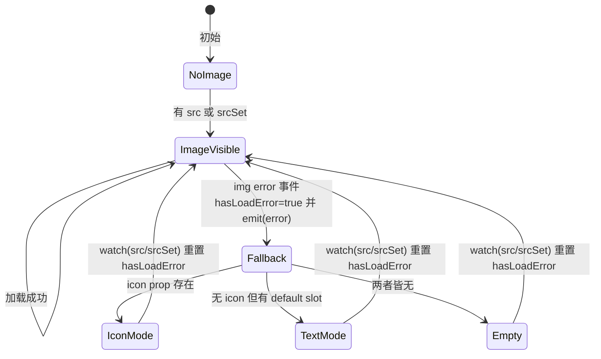
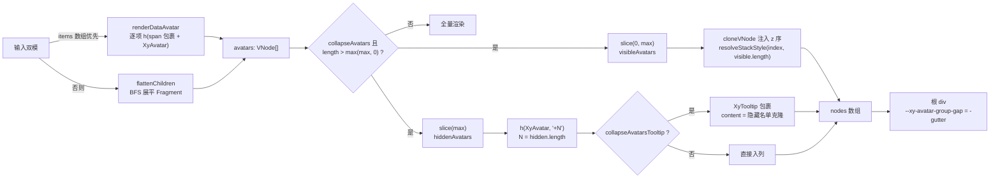

# 5-07 · Avatar 与头像组：溢出折叠（+N）的计数策略

> 本篇回答一个所有协作类界面都躲不开的问题：**"+N" 里的 N 是怎么数出来的？** 一排头像叠在一起，容器装不下时折叠成一个计数徽标——这个交互看起来是"测量布局"问题，本库的解法却是一行 `slice` 的纯数学。与之配套的还有另一台更隐蔽的状态机：图片头像加载失败后的回退链（onerror → 图标 → 文字）。我们把 `avatar.vue`、`avatar-group.vue` 和两份 CSS 逐行读完，把"计数"与"回退"两条链路全部拆开，顺手把 4-09 留下的一桩考据悬案定案：avatar-group 到底是"注册/协调"还是"纯 slot 截断"。

## 一、问题复述与解题路线

接到这篇时我的理解是：avatar 表面上是个"小"组件——4-03 已经拿它举过结构解剖的例子（`avatar.vue:50-71` 的类名与 CSS 变量双通道），本篇不再重复那些结构叙述。它真正值得单独成篇的，是两个"计数"问题：

1. **回退链的计数**：一张头像图从"可见"到"失败"到"重试"，组件内部靠一个布尔 ref 驱动三分支互斥渲染——这是一个完整的资源失败状态机，转移条件、重置时机、事件旁路都值得逐行看。
2. **折叠的计数**：`+N` 徽标的 N、谁被折叠、折叠后 z 序怎么重排——这考验的是"渲染前数学截断"与"渲染后 DOM 测量"两条技术路线的选型。

先还 4-09 的考据欠账。4-09 曾把 avatar-group 归入"纯样式 group（space / avatar-group），零 provide、零遍历"，并画进了它的三分法图里。本轮逐行核对实码后可以定论：**这个归类错了**。`avatar-group.vue:115-118` 明确写着 `provide(avatarGroupContextKey, ...)`，`avatar.vue:25` 对应 `inject`；`avatar-group.vue:20-50` 的 `flattenChildren` 更是对 slot vnode 的完整 BFS 遍历。avatar-group 的真实身份是**"父渲染子"（与 timeline-group 同族）叠加"provide 外观下发"（与 button-group 同族）的合体**，再额外加一层数学截断。4-09 的三分法应该扩成四象限，这是本篇的第一个产出。

解题路线四步走：先看 size 的三态回退链（它是 provide 通道存在意义的最好注脚）；再拆 error 回退状态机；然后进入本篇主菜——`+N` 的纯数学截断推演；最后看重叠布局的 z 序几何，以及 CSS 里那条负 margin 通道。

## 二、size 三态：props → group 上下文 → 全局配置

先看单头像这一侧的"三态写法"。`packages/components/avatar/src/avatar.vue:26-48`：

```ts
// packages/components/avatar/src/avatar.vue:26-48
const hasLoadError = ref(false);

const effectiveSize = computed(() => props.size ?? avatarGroup?.size?.value ?? globalSize.value);
const mergedSize = computed(() =>
  typeof effectiveSize.value === "number" ? undefined : effectiveSize.value
);
const isImageVisible = computed(() => Boolean(props.src || props.srcSet) && !hasLoadError.value);
const showIcon = computed(() => !isImageVisible.value && Boolean(props.icon));
const numericSize = computed(() =>
  typeof effectiveSize.value === "number" ? effectiveSize.value : null
);
const mergedShape = computed(() => props.shape ?? avatarGroup?.shape?.value ?? "circle");
const iconSize = computed(() => {
  if (numericSize.value !== null) {
    return Math.max(Math.round(numericSize.value * 0.45), 14);
  }

  return (Object.freeze({
    sm: 12,
    md: 18,
    lg: 24
  }) as Readonly<Record<string, number>>)[mergedSize.value ?? "md"] ?? 18;
});
```

第 28 行是全段的枢纽：`props.size ?? avatarGroup?.size?.value ?? globalSize.value`——组件自己 → 所在头像组 → `ConfigProvider` 全局配置（`useConfig` 返回的 `size: ComputedRef<ComponentSize>`，见 `packages/xiaoye-primitives/src/composables/use-config.ts:19`），三级回退一气呵成。这正是 4-09 所说"外观 group"的价值实证：**group 的 provide 通道只下发 `size` 和 `shape` 两个外观属性**（`avatar-group.vue:115-118`），不下发模型、不下发事件收口——头像之间不存在"选中互斥"这类业务协调，所以协议薄到只有两个外观字段。

```ts
// packages/components/avatar/src/avatar-group.vue:115-118
provide(avatarGroupContextKey, {
  size: toRef(props, "size"),
  shape: toRef(props, "shape")
});
```

`context.ts` 是 4-03 说过的"第四小件"——跨组件注入的 key 独立成文件，避免 Provider → Consumer 的反向依赖：

```ts
// packages/components/avatar/src/context.ts（全文，共 12 行）
import type { InjectionKey, Ref } from "vue";
import type { ComponentSize } from "xiaoye-primitives";
import type { AvatarShape } from "./avatar";

export interface AvatarGroupContext {
  size: Ref<number | ComponentSize | undefined>;
  shape: Ref<AvatarShape | undefined>;
}

export const avatarGroupContextKey: InjectionKey<AvatarGroupContext> = Symbol(
  "xiaoye-avatar-group"
);
```

回到三态本身，最有讲头的是第 29-31 与 34-36 行的**分流**：`effectiveSize` 解析完之后，字符串档位（`sm/md/lg`）与数字像素走上两条完全不同的输出通道——字符串进 `mergedSize` 变成 BEM 修饰类（`xy-avatar--lg`），数字进 `numericSize` 变成行内 CSS 变量（4-03 已拆过 `sizeStyle`，此处不重复）。`iconSize` 也跟着分流：数字尺寸走公式 `Math.max(Math.round(size * 0.45), 14)`，档位尺寸走查表 `sm: 12 / md: 18 / lg: 24`。这张表与 `avatar.css:34-50` 里的 `--xy-avatar-icon-size` 预设值逐一对应——JS 查表层与 CSS 预设层是**双源同值**，改任何一边都必须记得另一边，这是无生成器约定下的一处手工同步点（同类的还有 `sizeStyle` 里的文字比例 `0.4` 与下限 `12`）。

还有一个容易被扫过的细节：第 43 行的 `Object.freeze({ ... }) as Readonly<Record<string, number>>`。冻结防运行时篡改，类型断言补上索引签名——一个七行的档位表用上了两个防御手段，这是"表驱动"写法的标准防呆。

```mermaid
flowchart TD
    P["props.size"] -->|有值| E["effectiveSize"]
    P|无值| G["avatarGroup 上下文<br/>（provide 注入）"]
    G -->|有值| E
    G|无值| C["useConfig 全局配置"]
    E -->|number| N["numericSize<br/>→ CSS 变量三件套<br/>icon=round(n*0.45) 下限 14"]
    E -->|string| S["mergedSize<br/>→ xy-avatar--sm/md/lg 类名<br/>icon 走冻结查表"]
```

## 三、error 回退链：一台资源失败状态机

头像与普通图片组件的区别在于：它太小了，小到"裂图"不可接受——一个 40px 的圆圈里出现浏览器默认裂图图标，是任何设计规范都无法容忍的。所以 avatar 必须内建"资源失败状态机"。状态本体只有一行：

```ts
// packages/components/avatar/src/avatar.vue:32
const isImageVisible = computed(() => Boolean(props.src || props.srcSet) && !hasLoadError.value);
```

两个条件与一个非：有资源（`src` **或** `srcSet`——注意 `srcSet` 单独出现也算图片头像）且没有失败记录，图片才可见。渲染层据此做三分支**互斥**渲染：

```vue
<!-- packages/components/avatar/src/avatar.vue:90-106 -->
<template>
  <span :class="avatarClasses" :style="sizeStyle">
    
    <XyIcon v-else-if="showIcon" class="xy-avatar__icon" :icon="props.icon" :size="iconSize" />
    <span v-else class="xy-avatar__text">
      <slot />
    </span>
  </span>
</template>
```

优先级链条是 `img > icon > default slot`：图片可见期，icon 和文字**都不渲染**——不是"图片垫底文字浮在上面"的叠加布局，而是三选一。单测把它钉死了（`avatar.spec.ts:43`）：`expect(wrapper.text()).not.toContain("叶")`——有图时插槽文字必须消失。

状态机的转移逻辑在脚本最后两段：

```ts
// packages/components/avatar/src/avatar.vue:77-87
watch(
  () => [props.src, props.srcSet],
  () => {
    hasLoadError.value = false;
  }
);

function handleError(event: Event) {
  hasLoadError.value = true;
  emit("error", event);
}
```

三个设计决策都浓缩在这 11 行里。

**第一，`watch` 的重置语义就是"重试语义"。** `hasLoadError` 一旦置真，只有 `src` 或 `srcSet` 变化才能拉回——换一个头像地址自然要重新给图片一次机会。注意监听的是**二元组** `[props.src, props.srcSet]`：只换 srcSet 也触发重试。单测的完整闭环（`avatar.spec.ts:46-66`）：触发 `error` → img 消失、icon 出现、`error` 事件恰好一次 → `setProps` 换 src → img 复活。

```ts
// packages/components/avatar/__tests__/avatar.spec.ts:46-66
it("图片加载失败后会回退到 icon，并在 src 变化后重新尝试图片", async () => {
  const wrapper = mountAvatar(XyAvatar, {
    props: {
      src: "https://example.com/broken.png",
      icon: "mdi:account-outline"
    }
  });

  await wrapper.get("img").trigger("error");

  expect(wrapper.emitted("error")).toHaveLength(1);
  expect(wrapper.find("img").exists()).toBe(false);
  expect(wrapper.find('[data-icon="mdi:account-outline"]').exists()).toBe(true);

  await wrapper.setProps({
    src: "https://example.com/next.png"
  });
  await nextTick();

  expect(wrapper.find("img").exists()).toBe(true);
});
```

**第二，`handleError` 先置状态、后发事件。** `emit` 是同步的，父组件的 `@error` 回调执行时，子组件的 `hasLoadError` 已经为真——如果父组件在此处读取子组件状态（或依赖同一渲染 tick 的下游 computed），读到的是回退态而非旧态。"先改状态后发事件"是 4-05 浮层栈、4-11 message 队列反复出现过的同一纪律，这里是最小样本。

**第三，`error` 事件是旁路通知，不是回退否决权。** 组件没有提供"监听 error 后返回 false 阻止回退"的钩子——回退是组件内建职责，父组件只能**追加**反应（上报埋点、计数、换地址），不能**改写**回退行为。文档示例 `apps/docs/examples/avatar/fallback.vue` 演示的正是这种旁路消费：两个头像各自挂 `@error="handleError"`，外层用一枚 `xy-tag` 统计失败次数。

```vue
<!-- apps/docs/examples/avatar/fallback.vue（全文，共 28 行） -->
<script setup lang="ts">
import { ref } from "vue";

const errorCount = ref(0);

function handleError() {
  errorCount.value += 1;
}
</script>

<template>
  <div class="xy-doc-stack">
    <xy-space wrap align="center">
      <xy-avatar
        src="https://example.com/not-found-avatar.png"
        icon="mdi:account-outline"
        @error="handleError"
      />
      <xy-avatar src="https://example.com/not-found-avatar.png" @error="handleError">
        访客
      </xy-avatar>
    </xy-space>

    <xy-space>
      <xy-tag status="warning">图片加载失败次数：{{ errorCount }}</xy-tag>
    </xy-space>
  </div>
</template>
```

回退链的**顺序本身**也是一个权衡。本库的链条是 `img → icon（icon prop 存在时）→ default slot`：icon 压过插槽文字。理由是 icon 是显式声明的"机器可懂的通用回退"，插槽文字往往是业务定制文案（人名首字、机构缩写），前者语义上更适合表达"未知用户"，后者表达"特定的人"。对照 Element Plus 的 `el-avatar`：EP 没有走 icon prop 优先，而是提供了**专属的 `error` 具名插槽**——加载失败且传了 `error` 插槽时渲染它，icon 排在其后。两种设计的分歧点在于"回退分支要不要独立声明位"：EP 的 error 插槽让回退内容可以完全脱离 icon/文字体系（比如放一张兜底占位图），表达力更强，但多了一个插槽位；本库把回退收敛进既有声明（icon prop 与 default slot），API 面更小，代价是"想要一张兜底占位图"只能用 `src` 换地址或借 item 插槽间接实现。另外 EP 至今没有官方的 AvatarGroup 组件——社区常年以 issue 求而不得；本库直接把 group 做成了正式组件，这在下一节展开。

顺手记一个状态机的外部观察窗口：`avatarClasses`（`avatar.vue:50-56`）会按当前分支挂 `is-icon` 或 `is-image` 状态类，但翻遍 `avatar.css` 与 `avatar-group.css`，**没有任何一条规则消费这两个类名**。它们不是死代码，而是留给测试与业务选择器的语义钩子——单测里 `expect(wrapper.classes()).toContain("is-icon")`（`avatar.spec.ts:94`）就用它断言回退结果，业务侧也可以写 `.my-member-card .xy-avatar.is-image` 这类定向覆盖。类名先行于样式存在，这是 BEM 状态位（`is-*`）与"按需消费"之间的一次干净解耦。



## 四、+N 的计数：一行 slice 的纯数学

进入主菜。先给考据定论：**本库的溢出折叠是纯 max 数学截断，不是 DOM 测量折叠。** 整个 `avatar-group.vue` 里没有 `ResizeObserver`、没有 `getBoundingClientRect`、没有任何对容器宽度的引用；`+N` 的 N 就是一个数组长度差。核心推演只有 8 行：

```ts
// packages/components/avatar/src/avatar-group.vue:161-179
return () => {
  const avatars =
    props.items.length > 0
      ? props.items.map((item, index) => renderDataAvatar(item, index, props.items.length))
      : flattenChildren(slots.default?.());
  const shouldCollapse =
    props.collapseAvatars && avatars.length > Math.max(props.maxCollapseAvatars, 0);

  const visibleAvatars = shouldCollapse
    ? avatars.slice(0, Math.max(props.maxCollapseAvatars, 0))
    : avatars;
  const hiddenAvatars = shouldCollapse ? avatars.slice(Math.max(props.maxCollapseAvatars, 0)) : [];

  const nodes = visibleAvatars.map((node, index) =>
    cloneVNode(node, {
      key: node.key ?? `avatar-${index}`,
      style: [node.props?.style, resolveStackStyle(index, visibleAvatars.length)]
    })
  );
```

逐行拆解这段"计数策略"：

- **输入双模**：`items` 数据数组优先，没有 `items` 才走 `flattenChildren(slots.default?.())` 拿插槽 vnode。单测（`avatar.spec.ts:217`）断言了优先级：同时给 `items` 和默认插槽时，插槽里的头像**根本不渲染**。
- **折叠门槛是严格大于**：`avatars.length > Math.max(maxCollapseAvatars, 0)`。恰好等于 max 时不折叠——保证永远不会出现 `+0`。`Math.max(..., 0)` 双双防负：`maxCollapseAvatars: 0` 是合法输入，语义是"一个都不显示，全员折进 +N"。
- **切片即判定**："谁被折叠"的答案就是数组下标——前 `max` 个可见，其余全隐藏。**没有任何测量参与**，第 170 行的 `slice(0, max)` 就是判定书的全部。
- **N 的来源**：折叠徽标的文字是 `` `+${hiddenAvatars.length}` ``（190 行），`hiddenAvatars.length === avatars.length - max`，纯减法。

文档示例 `apps/docs/examples/avatar/collapse.vue` 是这套数学的消费样本：5 个成员、`max-collapse-avatars: 2`，渲染结果必然是 2 个头像 + "+3"：

```vue
<!-- apps/docs/examples/avatar/collapse.vue（全文，共 18 行） -->
<template>
  <xy-avatar-group
    size="lg"
    :items="[
      { key: 'xiaoye', text: '叶' },
      { key: 'mavis', icon: 'mdi:account-outline' },
      { key: 'abby', text: 'AB' },
      { key: 'luna', text: '露' },
      { key: 'kai', icon: 'mdi:briefcase-account-outline' }
    ]"
    collapse-avatars
    collapse-avatars-tooltip
    :max-collapse-avatars="2"
  />
</template>
```

单测对计数做了三层断言。第一层是基本计数（`avatar.spec.ts:129-153`）：

```ts
// packages/components/avatar/__tests__/avatar.spec.ts:129-153
it("支持折叠显示多余头像", () => {
  const wrapper = mountAvatar(XyAvatarGroup, {
    props: {
      collapseAvatars: true,
      maxCollapseAvatars: 2
    },
    slots: {
      default: `
        <xy-avatar>甲</xy-avatar>
        <xy-avatar>乙</xy-avatar>
        <xy-avatar>丙</xy-avatar>
        <xy-avatar>丁</xy-avatar>
      `
    },
    global: {
      components: {
        XyAvatar
      }
    }
  });

  const avatars = wrapper.findAll(".xy-avatar");
  expect(avatars).toHaveLength(3);
  expect(avatars[2]?.text()).toBe("+2");
});
```

第二层是折叠徽标的 tooltip 展开（`avatar.spec.ts:155-186`）：`collapseAvatarsTooltip` 开启后，折叠徽标整体被包进 `XyTooltip`，hover 时 body 下出现 `.xy-avatar-group__collapse-avatars` 容器，其中 `querySelectorAll('.xy-avatar')` 恰好是被隐藏的那 2 个。第三层是 items 模式的同构验证（`avatar.spec.ts:289-315`）：3 项 max 1 → 2 个 `.xy-avatar`，第二个文本 `+2`，tooltip 展开后同样 2 个。

实现侧，折叠徽标与 tooltip 的组装在 `avatar-group.vue:181-217`：

```ts
// packages/components/avatar/src/avatar-group.vue:181-217
if (hiddenAvatars.length) {
  const collapseAvatar = h(
    XyAvatar,
    {
      size: props.size,
      shape: props.shape,
      class: props.collapseClass,
      style: props.collapseStyle
    },
    () => `+${hiddenAvatars.length}`
  );

  const collapseNode = props.collapseAvatarsTooltip
    ? h(
        XyTooltip,
        {
          placement: props.placement
        },
        {
          default: () => collapseAvatar,
          content: () =>
            h(
              "div",
              {
                class: `${ns.base.value}__collapse-avatars`
              },
              hiddenAvatars.map((node, index) =>
                cloneVNode(node, {
                  key: node.key ?? `hidden-avatar-${index}`
                })
              )
            )
        }
      )
    : collapseAvatar;

  nodes.push(collapseNode);
}
```

这里有两个值得停一停的点。

**其一，折叠徽标自己就是一个真头像。** 它不是画出来的 CSS 徽标，而是 `h(XyAvatar, ..., () => '+N')`——继承 group 的 size/shape，接受用户通过 `collapseClass`/`collapseStyle` 的定制，走的是和普通头像完全相同的样式与回退链。"+N"以默认插槽文字的身份进入 `xy-avatar__text` 渲染。这让折叠徽标天然参与第三节的回退状态机——虽然它没有 src，永远走文字分支，但结构上它是平等的一员。

**其二，tooltip 里的"隐藏名单"是原始 vnode 的克隆。** `hiddenAvatars` 切片保存的是展平后的**原始** vnode（未经 174-179 行的 z 序克隆改写），进 tooltip 时用 `cloneVNode` 只补 key。于是出现一个巧妙的副产品：**隐藏头像在 tooltip 里不带重叠样式**——它们回到普通文档流，由 `avatar-group.css` 的面板样式（正 4px 间距）铺开成名单，而不是继续叠罗汉。同时由于这些 vnode 仍渲染在 group 的组件树内（tooltip 的 content 经 Teleport 出去的是 DOM，注入链按 vnode 父子关系解析），group 的 provide 上下文对它们依然生效——隐藏成员在名单里保持与可见成员一致的 size/shape。

**为什么不选测量折叠？** 这是本篇最大的设计权衡，值得正面论证。测量方案（ResizeObserver 监听容器宽度、动态计算能放下几个头像）的诱惑在于"自适应"：容器变窄自动多折几个。但它的成本清单很长：ResizeObserver 回调里改渲染 → 触发再次测量 → 需要防循环抖动；SSR 首屏无测量值，必然闪一次；测试里要 mock 布局，单测成本陡增；而最根本的是，它把"显示几个"的决定权交给了像素，**丢了语义**——`maxCollapseAvatars: 3` 在测量方案下退化成"上限 3 的预算建议"，业务方无法表达"前 3 位是决策人必须可见"这种产品语义。本库选择数学截断，等于把布局责任还给 CSS（容器装不下时调用方自己调 max 或换方向），把语义责任留给 props。Ant Design 的 `<Avatar.Group maxCount>` 走的也是同一条纯截断路线——`children.slice(0, maxCount)` 加计数头像，与本库殊途同归；EP 无官方实现，无从对照。



## 五、谁压住谁：重叠的 z 序几何与负 margin 通道

头像组的视觉签名是"叠罗汉"——相邻头像重叠约 8px，每个头像带一圈背景色描边环。几何上有三个问题要回答：重叠量从哪来、层叠方向由谁定、折叠徽标排在哪层。

先看重叠量。`avatar-group.vue:229-231` 往根节点挂一个负值 CSS 变量：

```ts
// packages/components/avatar/src/avatar-group.vue:229-231
style: {
  "--xy-avatar-group-gap": `${Math.max(props.gutter, 0) * -1}px`
}
```

CSS 侧（`packages/theme/src/components/avatar-group.css:22-28`）把它消费成兄弟负 margin：

```css
/* packages/theme/src/components/avatar-group.css:1-28 */
.xy-avatar-group {
  --xy-avatar-group-gap: -8px;
  --xy-avatar-group-collapse-gap: 4px;
  display: inline-flex;
  align-items: center;
}

.xy-avatar-group.is-block {
  display: flex;
}

.xy-avatar-group.is-vertical {
  flex-direction: column;
  align-items: flex-start;
}

.xy-avatar-group > * {
  position: relative;
  display: inline-flex;
}

.xy-avatar-group.is-horizontal > *:not(:first-child) {
  margin-left: var(--xy-avatar-group-gap);
}

.xy-avatar-group.is-vertical > *:not(:first-child) {
  margin-top: var(--xy-avatar-group-gap);
}
```

注意几个选型细节：`gutter` 的语义是**设计稿上的间距**（默认 8，示例里有 10、12），组件在挂变量时才取负——`Math.max(gutter, 0) * -1` 保证调用方传 0 时不至于出现 `0 * -1` 之外的意外（负数 gutter 会被钳到 0）。消费端用 `:not(:first-child)` 而非 `gap` 属性——`gap` 无法做负值，负重叠只能走 margin 通道，这条"正 prop、负变量"的换算协议与 3-05 讲过的间距刻度体系互不影响。`> * { position: relative }`（第 17-20 行）则是给每个直接子元素建立定位上下文，z 序的前提条件。

层叠方向由 `resolveStackStyle` 决定（`avatar-group.vue:120-124`）：

```ts
// packages/components/avatar/src/avatar-group.vue:120-124
function resolveStackStyle(index: number, total: number) {
  return {
    zIndex: props.reverse ? total - index : index + 1
  };
}
```

默认（非 reverse）：`zIndex = index + 1`，**序号越大层级越高**——视觉上是"右边压左边"，第 N 个头像的描边环压住第 N-1 个的右缘，符合"列表向右生长、新者在上"的直觉。`reverse` 翻转成 `total - index`：**序号越小层级越高**——"左边压右边"。测试（`avatar.spec.ts:244-245`）钉住了这个公式：两项 + `reverse: true` → 第一项 `z-index: 2`、第二项 `z-index: 1`。

值得强调的是 `reverse` **只改 z 序、不改 DOM 顺序**：`avatar-group.css` 里没有任何 `.is-reverse` 规则，类名只是语义标记。也就是说 reverse 不改变"谁是第一个"，只改变"谁盖住谁"——这与 `flex-direction: row-reverse` 那种连布局一起反转的做法是刻意区分的。

`vertical` 方向则是同一套几何的纵向复刻：`is-vertical` 把容器转为 `flex-direction: column`（`avatar-group.css:12-15`），负 margin 换到 `margin-top`（26-28 行），z 序公式原样不变——纵向叠放时默认仍是"序号大者在上"，即下方的头像压住上方头像的下缘。文档示例给出了两种形态的最小消费：`vertical.vue` 是 3 人纵向组、`gutter: 10`；`reverse.vue` 是 4 人横排、`gutter: 12` 加 `reverse` 的"左压右"形态。两个示例都未开折叠——但折叠与 vertical 并不互斥：`+N` 徽标会排在列尾，继承上一段分析的同一套 z 序逻辑，毛边也一并带过去。

最妙的一手在第四节引用过的 174-179 行：`cloneVNode` 时以 `resolveStackStyle(index, visibleAvatars.length)` **重新计算 z 序**——注意 total 用的是**折叠后的可见数**，不是全量数。若沿用全量 total，`reverse` 模式下隐藏成员也会拉高分母，可见头像的 z 值整体偏移；以 `visibleAvatars.length` 为基准，z 序永远在"当前画面"内自洽。这是"数学截断"路线的红利：折叠是渲染前的数组运算，z 序可以顺手在同一趟 map 里重排，测量方案反而做不到这么干净。

```css
/* packages/theme/src/components/avatar-group.css:30-50 */
.xy-avatar-group .xy-avatar {
  box-shadow:
    0 0 0 2px var(--xy-bg-floating),
    0 2px 6px color-mix(in srgb, var(--xy-text-heading) 6%, transparent);
}

.xy-avatar-group__collapse-avatars {
  display: inline-flex;
  align-items: center;
  padding: 4px 8px;
  border: 1px solid var(--xy-border-subtle);
  border-radius: var(--xy-radius-pill);
  background: var(--xy-bg-raised);
  box-shadow:
    0 0 0 1px color-mix(in srgb, var(--xy-bg-floating) 18%, transparent),
    0 2px 6px color-mix(in srgb, var(--xy-text-heading) 6%, transparent);
}

.xy-avatar-group__collapse-avatars > *:not(:first-child) {
  margin-left: var(--xy-avatar-group-collapse-gap);
}
```

第 30-34 行是描边环的实体：`0 0 0 2px var(--xy-bg-floating)` 用背景浮色画出 2px 实环，把重叠头像彼此"切开"——没有这圈环，叠在一起的头像会融成一坨色块。而这里暴露出一个可以称为"毛边"的细节：**折叠徽标没有 z-index**。回看 181-191 行，`collapseAvatar` 的 props 里只有 size/shape/class/style，没有走 `resolveStackStyle`；它以 `z-index: auto` 参与层叠，画在所有正 z-index 兄弟之下。在 reverse 模式（左压右）下这恰好延续语义——最右的徽标垫底；但在默认模式（右压左）下，语义本应是"+N 作为最后一位压住前一位"，实际却是**最后一个可见头像的 2px 描边环压在 +N 徽标的左缘上**。由于环色与背景同色、且重叠区只有 8px，肉眼几乎无感，所以它更像一处未收口的毛边而非缺陷；若要收口，给 `collapseNode` 也套一层 `resolveStackStyle(visibleAvatars.length, visibleAvatars.length)`（即 `index + 1` 取可见数）即可。把这段写出来不是挑刺，而是想说明：**纯数学截断的管线里，每一个视觉属性都是某次数组运算的产物，z 序也不会自动正确——它需要被显式地"算"给折叠徽标。**

## 六、类型层、slot 展平与消费实证

group 的类型层在 `packages/components/avatar/src/avatar-group.ts:27-41`，除外观与折叠 props 外，`placement?: TooltipProps["placement"]`（38 行）直接从 tooltip 的类型层借字段——4-03 已以此为例讲过"类型组合复用"，这里只补一句：这种借用让折叠面板的弹出方向永远与 tooltip 的真实能力同步，tooltip 加新方向，group 的类型自动跟上。

slot 模式的展平器 `flattenChildren`（`avatar-group.vue:20-50`）是"父渲染子"模式的标准基建，与 4-09 提到的 `flattenTimelineChildren` 同族：

```ts
// packages/components/avatar/src/avatar-group.vue:20-50
function flattenChildren(children?: VNodeArrayChildren) {
  const queue: VNode[] = [];

  (children ?? []).forEach((child) => {
    if (isVNode(child)) {
      queue.push(child);
    }
  });

  const result: VNode[] = [];

  while (queue.length) {
    const vnode = queue.shift();
    if (!vnode) {
      continue;
    }

    if (vnode.type === Fragment && Array.isArray(vnode.children)) {
      vnode.children.forEach((child) => {
        if (isVNode(child)) {
          queue.push(child);
        }
      });
      continue;
    }

    result.push(vnode);
  }

  return result;
}
```

三个边界：文本与注释节点被 `isVNode` 过滤；`v-for`/`template` 产生的 Fragment 被展开——否则切片会把一整个 v-for 当"一个头像"折叠，计数直接错乱；但**组件边界不透视**——若某个子组件自己返回多根 fragment，group 不会拆开它，展平只到第一层 Fragment 为止。这是"展平"与"透视"的边界划法：展开编译期确定的静态结构，不猜运行时组件的渲染意图。

items 模式的渲染器 `renderDataAvatar`（`avatar-group.vue:126-159`）则展示了数据驱动的另一面：`item.className`/`item.style` 拼进包裹 span，`key` 有四级回退链 `item.key ?? item.src ?? item.text ?? \`avatar-item-${index}\``，`onClick` 统一 emit `item-click` 携带 `(item, index)`——注意这是 items 模式专属的事件收口，slot 模式下的头像 click 不经 group 转发，直接是头像自己的原生事件。`slots.item` 作用域插槽（入参形状 `AvatarGroupItemSlotProps`）允许整项替换渲染，`satisfies` 关键字把插槽返回值钉在 vnode 数组上。

类型夹具（`tests/types/fixtures/avatar.ts`）对计数相关 API 的约束做了双向钉死：`maxCollapseAvatars: 2`、`collapseAvatars: true` 合法（36-55 行），`placement: "center"` 被显式 `@ts-expect-error` 拒绝（69-74 行）——tooltip 的 placement 联合类型是消费边界，不是开放字符串。

最后看库内消费实证。增强层 `avatar-menu` 把 `xy-avatar` 与 `xy-dropdown` 组合成用户菜单（`packages/pro-components/avatar-menu/src/avatar-menu.vue:4,46-48`），`notice-center` 在通知列表里用 `size="sm"` 的头像做行首标识（`packages/pro-components/notice-center/src/notice-center.vue:83`）；基础层内部，`check-card` 直接内嵌 `XyAvatar` 作为人物卡片的封面元素（`packages/components/check-card/src/check-card.vue:192-204`）。三处消费无一使用折叠 API——`+N` 的主战场始终是协作成员条这类页面级区块（文档示例 `page-collaboration.vue` 演示了 `xy-page-container` 中的用法：4 人 max 3，永远只会折出 "+1"）。这也侧面印证了数学截断的适配逻辑：调用方知道自己的语义（谁是负责人、展示几个），组件只负责把语义无损地变成 2 个头像 + 1 个徽标。

## 七、收束：两台计数器，一种哲学

回头看，本篇拆的两台"计数器"共享同一种哲学——**把不确定性关在组件里，把确定性交给声明**。

回退链是一台状态机，但状态只有一个布尔：`hasLoadError`。所有转移（失败置位、换源复位）都由组件内部消化，父组件拿到的只是旁路的 `error` 事件——回退行为的确定性不依赖任何外部配合。折叠是一台截断器，但算法只有一次 `slice`：没有测量、没有观察器、没有异步抖动，`maxCollapseAvatars` 这个数字从声明那一刻起就是渲染结果的完整决定因素——单测里三段断言（计数、名单、双模同构）全部是确定性输出，不需要 mock 任何布局。

而 4-09 的考据悬案也在此收口：avatar-group 既不是它归类的"纯样式 group"，也不是 radio-group 那样的"受管 group"——它是 **"provide 外观下发"（button-group 血统）+ "父渲染子"（timeline 血统）+ "数学截断"（本组件独有的第三层）** 的三合体。本库的 group 三分法至此应扩为四象限：纯样式（space）、外观下发（button-group）、受管协议（radio/checkbox-group）、父渲染子（timeline-group、avatar-group）。分类的意义在于复用决策——下次要写 check-card-group 或新的复合组件时，先问一句：子项之间有没有**模型协调**？没有就别上注册模式，provide 两个外观字段、渲染期截断 slot，50 行 CSS 就能收工。

下一篇 5-08《Image 与图片预览：从懒加载占位到全屏 viewer 的完整链路》，我们继续在"图片"这个母题上深挖：`XyImage` 怎么在原生 `loading="lazy"` 之外手写 IntersectionObserver 占位，点击之后 `XyImageViewer` 又怎么用 808 行把缩放、旋转、拖拽与浮层栈一次性焊死——同样是"资源加载"，同样是"状态机"，但那台机器的规模是本篇的八倍。到时见。
