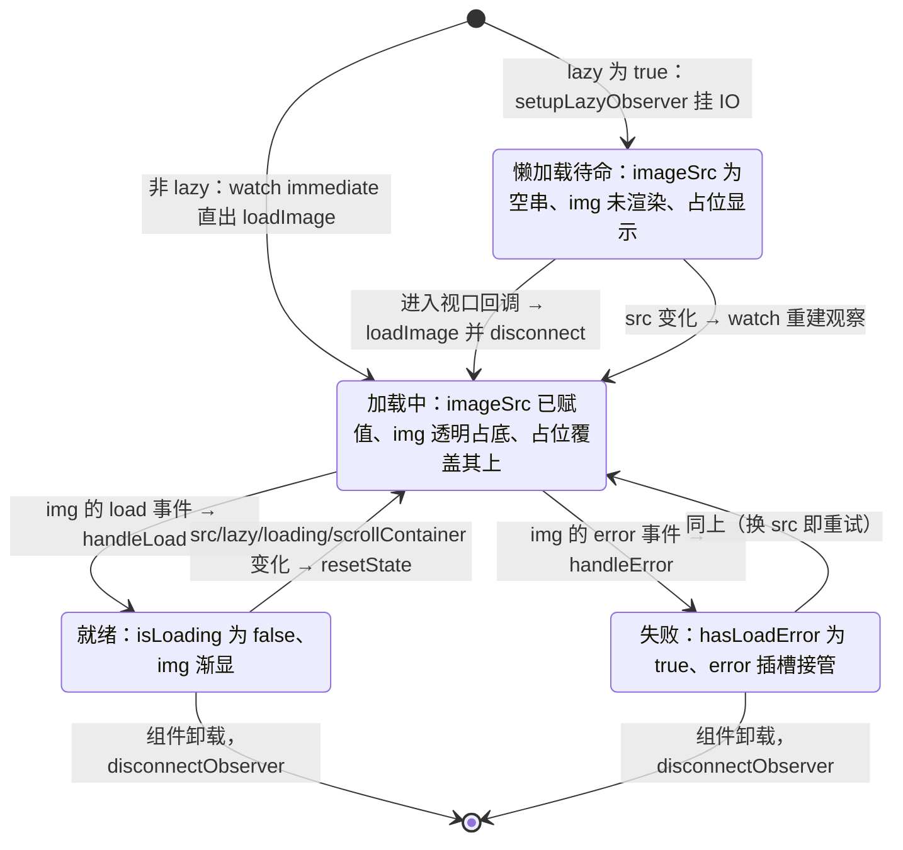
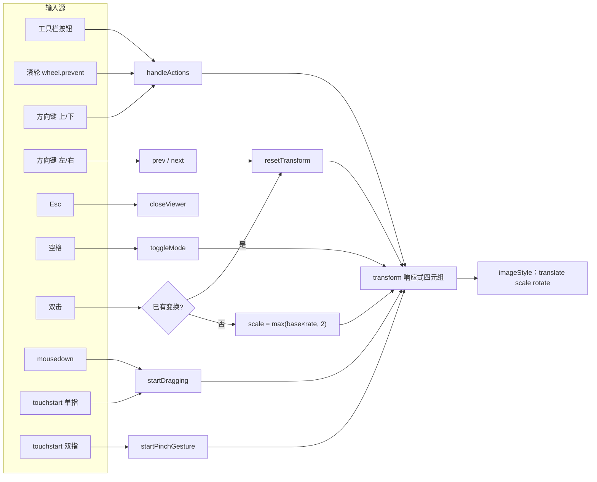
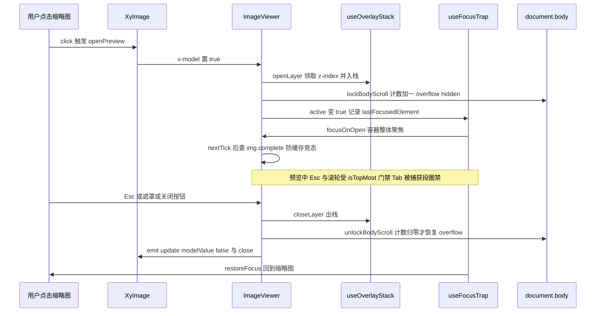

# 5-08 · Image 与图片预览：从懒加载占位到全屏 viewer 的完整链路

> 一张图片在组件库里的一生只有两段：第一段是"等"——等网络、等滚动、等一个占位符退场；第二段是"看"——点开之后全屏铺开，能缩放、能旋转、能拖拽、能左右切换。这两段在大多数库里是两个组件的事（`el-image` 与 `el-image-viewer`），在本库也一样：`XyImage`（312 行）管"等"，`XyImageViewer`（808 行）管"看"，两者由一条 v-model 链路焊在一起。本篇沿这条链路从上往下走：懒加载为什么在原生 `loading="lazy"` 之外还要手写 IntersectionObserver；点击缩略图之后 viewer 怎么被唤醒、teleport 与否怎么选；808 行的 viewer 里，`translate → scale → rotate` 这个字符串顺序背后的几何选型是什么；以及 viewer 作为浮层基建的重消费样本，怎么把 4-05 的浮层栈和 4-07 的焦点陷阱一次性用满。所有代码摘自当前工作区实态，行号逐一核对过。

## 引子：一个目录，两种产品形态

先给体量一个直观感受：

```text
$ wc -l packages/components/image/src/* packages/components/image/__tests__/*.spec.ts \
        packages/theme/src/components/image.css tests/types/fixtures/image.ts
     312 image.vue
     808 image-viewer.vue
      65 image.ts
      18 image-viewer-types.ts
     639 image.spec.ts
     382 image.css
      75 image.ts（类型夹具）
```

639 行的测试比组件本体（312 + 808 = 1120 行）的一半还多，这不是巧合——Image 是全库少数"状态机 + 手势 + 浮层"三重身份叠加的组件，三块逻辑都得靠测试钉死。入口处两个组件同时导出（`packages/components/image/index.ts:36-37`）：

```ts
export const XyImage = withInstall(Image, "xy-image");
export const XyImageViewer = withInstall(ImageViewer, "xy-image-viewer");
export default XyImage;
```

`XyImage` 是主角，`XyImageViewer` 既可以被 `XyImage` 内部持有，也可以独立使用——这个"独立可用"不是随手为之，它是后文"viewer 独立组件 vs 内嵌"这组权衡的物质基础。

## 一、契约层：image.ts 的 65 行把两条协议都定死了

先看类型层全文。`packages/components/image/src/image.ts` 一共 65 行：

```ts
// packages/components/image/src/image.ts:1-65（全文）
import type Image from "./image.vue";

export const imageFits = ["fill", "contain", "cover", "none", "scale-down"] as const;
export const imageLoadingTypes = ["eager", "lazy"] as const;

export type ImageFit = (typeof imageFits)[number];
export type ImageLoading = (typeof imageLoadingTypes)[number];
export type ImageViewerAction =
  | "zoomIn"
  | "zoomOut"
  | "clockwise"
  | "anticlockwise"
  | "toggleMode";
export type ImageLoadHandler = (event: Event) => void;
export type ImageErrorHandler = (event: Event) => void;
export type ImageSwitchHandler = (index: number) => void;

export interface ImageViewerErrorSlotProps {
  activeIndex: number;
  src: string;
  retry: () => void;
}

export interface ImageViewerProgressSlotProps {
  activeIndex: number;
  total: number;
}

export interface ImageViewerToolbarSlotProps {
  actions: (action: ImageViewerAction) => void;
  prev: () => void;
  next: () => void;
  reset: () => void;
  activeIndex: number;
  setActiveItem: (index: number) => void;
}

export interface ImageProps {
  src?: string;
  alt?: string;
  fit?: ImageFit;
  loading?: ImageLoading;
  lazy?: boolean;
  scrollContainer?: string | HTMLElement;
  previewSrcList?: string[];
  previewTeleported?: boolean;
  zIndex?: number;
  initialIndex?: number;
  infinite?: boolean;
  hideOnClickModal?: boolean;
  closeOnPressEscape?: boolean;
  zoomRate?: number;
  scale?: number;
  minScale?: number;
  maxScale?: number;
  showProgress?: boolean;
  crossorigin?: "anonymous" | "use-credentials" | "";
}

export type ImageInstance = InstanceType<typeof Image>;

export type ImageViewerInstance = InstanceType<typeof import("./image-viewer.vue").default>;

export type { ImageViewerProps } from "./image-viewer-types";
export type { ImageCrossorigin } from "./image-viewer-types";
```

这份契约有三个值得停下来的地方。

**其一，`ImageViewerAction` 的五个动作就是 viewer 工具栏的插槽协议。** 注意它比 EP 的同名类型多一个 `toggleMode`——EP 的 toolbar 插槽 `actions` 只收 `'zoomIn' | 'zoomOut' | 'clockwise' | 'anticlockwise'` 四个值，本库把"原始尺寸/适应窗口的模式切换"也提升为一个动作，空格键、工具栏插槽走的是同一枚举。类型先于实现把"工具栏能下发的指令集"钉死，后面 viewer 的 `handleActions`（`image-viewer.vue:459-522`）就只是这五个字符串的 switch 事故现场清理员。

**其二，三个 slot props 接口定义在 `image.ts` 而不是 viewer 的源码里。** `viewer-error` 要 `{ activeIndex, src, retry }`，`progress` 要 `{ activeIndex, total }`，`toolbar` 要 `{ actions, prev, next, reset, activeIndex, setActiveItem }`。放这里的原因很实际：`XyImage` 要把这三个作用域插槽**转发**给内部的 viewer（`image.vue:10-15` 的类型导入、`image.vue:301-309` 的模板转发），类型层必须让两端共享同一份签名。viewer 自己的 `defineSlots`（`image-viewer.vue:35-46`）写的是等价的内联字面量——一份协议，两处标注，源头上同源。

**其三，viewer 的 props 被抽到独立的 `image-viewer-types.ts`（18 行全文）：**

```ts
// packages/components/image/src/image-viewer-types.ts:1-18（全文）
export type ImageCrossorigin = "anonymous" | "use-credentials" | "";

export interface ImageViewerProps {
  modelValue?: boolean;
  urlList?: string[];
  initialIndex?: number;
  infinite?: boolean;
  hideOnClickModal?: boolean;
  teleported?: boolean;
  closeOnPressEscape?: boolean;
  zIndex?: number;
  zoomRate?: number;
  scale?: number;
  minScale?: number;
  maxScale?: number;
  showProgress?: boolean;
  crossorigin?: ImageCrossorigin;
}
```

`ImageProps` 与 `ImageViewerProps` 是"包一层"的关系：前者把后者除 `modelValue` / `urlList` / `teleported` 之外的字段全部镜像（换成 `previewSrcList` / `previewTeleported` 的命名），这就是后文模板里十几个 `:xxx="props.xxx"` 透传的类型基础。对照 EP：`zoomRate: 1.2`、`minScale: 0.2`、`maxScale: 7`、`scale: 1`、`infinite: true`、`closeOnPressEscape: true`、`hideOnClickModal: false`、`teleported: false`——本库的默认值与 EP 逐项一致，连 toolbar 插槽的参数名都一字不差。这是刻意的：API 面对齐 EP，迁移成本趋近于零；差异全部沉到实现层，那才是这套自研值得写专栏的部分。

## 二、懒加载：三种加载剖面与一张状态机

### 2.1 状态五件套

`image.vue` 的 script 骨架先把状态摆出来（`image.vue:57-66`）：

```ts
const containerRef = ref<HTMLElement | null>(null);
const imageSrc = ref("");
const isLoading = ref(false);
const hasLoadError = ref(false);
const showViewer = ref(false);
const observer = ref<IntersectionObserver | null>(null);

const previewEnabled = computed(
  () => Array.isArray(props.previewSrcList) && props.previewSrcList.length > 0
);
```

懒加载故事的主角是前四个 ref：`imageSrc` 决定 `` 节点**存不存在**（模板里 `v-if="imageSrc"`），`isLoading` 决定占位显不显示，`hasLoadError` 决定 error 插槽是否接管整块区域。注意三者不是互斥的三态枚举，而是可以组合的正交位——加载中时 `imageSrc` 已经有值、`` 已经插入，只是被 CSS 压成透明，占位浮在它上面。

### 2.2 双轨方案的判定与降级

`isManualLazy` 这个 computed 只有三行有效逻辑（`image.vue:108-114`）：

```ts
const isManualLazy = computed(() => {
  if (props.loading === "eager") {
    return false;
  }

  return props.lazy;
});
```

`loading="eager"` 是 `lazy` 的**否决权**：即使两个 prop 同时给出，也以 eager 为准直出图片。反过来 `loading="lazy"`（原生）并不会关闭手动懒加载——两者可以叠加。接下来的加载核心（`image.vue:116-147`）：

```ts
// packages/components/image/src/image.vue:116-147
function resetState() {
  hasLoadError.value = false;
  isLoading.value = Boolean(props.src);
}

function resolveScrollRoot() {
  if (typeof window === "undefined") {
    return null;
  }

  const { scrollContainer } = props;

  if (typeof HTMLElement !== "undefined" && scrollContainer instanceof HTMLElement) {
    return scrollContainer;
  }

  if (typeof scrollContainer === "string" && scrollContainer) {
    return document.querySelector(scrollContainer);
  }

  return null;
}

function disconnectObserver() {
  observer.value?.disconnect();
  observer.value = null;
}

function loadImage() {
  resetState();
  imageSrc.value = props.src;
}

function handleLoad(event: Event) {
  isLoading.value = false;
  hasLoadError.value = false;
  emit("load", event);
}

function handleError(event: Event) {
  isLoading.value = false;
  hasLoadError.value = true;
  emit("error", event);
}
```

`resolveScrollRoot` 把 `scrollContainer` 归一成 IntersectionObserver 的 `root`：不传就是 `null`（视口），传选择器字符串就 `querySelector`，传 DOM 元素直接用。而真正的懒加载装配在 `setupLazyObserver`（`image.vue:161-198`）：

```ts
// packages/components/image/src/image.vue:161-198
function setupLazyObserver() {
  if (typeof window === "undefined") {
    loadImage();
    return;
  }

  disconnectObserver();
  resetState();
  imageSrc.value = "";

  if (!props.src) {
    isLoading.value = false;
    return;
  }

  if (!("IntersectionObserver" in window)) {
    loadImage();
    return;
  }

  observer.value = new IntersectionObserver(
    (entries) => {
      if (!entries.some((entry) => entry.isIntersecting)) {
        return;
      }

      loadImage();
      disconnectObserver();
    },
    {
      root: resolveScrollRoot()
    }
  );

  if (containerRef.value) {
    observer.value.observe(containerRef.value);
  }
}
```

这里有两条降级路径和两处细节。降级一：SSR（`typeof window === "undefined"`）直接 `loadImage()` 直出——服务端没有"视口"概念， hydration 前宁可让浏览器先请求；降级二：宿主没有 `IntersectionObserver`（老 WebView）同样直出，懒加载是体验增强，不是正确性依赖。细节一：回调里用 `entries.some(e => e.isIntersecting)` 而不是 `entries[0]`——IO 的一次回调可能携带多个 entry，取首项在阈值抖动时可能读到 `isIntersecting: false`。细节二：触发后立即 `disconnectObserver()`，一次性门禁，观察器用完即焚，不留驻内存。

### 2.3 状态机

把上述流转画成状态机——这是本篇的第一张图，也是整个"等"阶段的心脏：



值得强调的是 **Error 不是终点站**：`watch` 监听 `[src, lazy, loading, scrollContainer]`（`image.vue:218-237`），任何一个变化都会 `resetState()` 把 `hasLoadError` 清回 false——外层图片的"重试"不需要专门按钮，换一个 src 就自动回到加载中。这与 viewer 里显式的 `retry` 按钮（第五节）形成对照：内嵌图的错误恢复走声明式数据流，viewer 的错误恢复走命令式重试，各自贴合各自的交互形态。

### 2.4 生命周期缝隙：immediate watch 与 onMounted 的两次尝试

`watch` 是 `immediate: true` 的（`image.vue:218-237`），这意味着它在 `setup` 阶段就执行——而那时 `containerRef.value` 还是 `null`，模板没挂载，观察器没有目标可观察。所以 lazy 分支里有一个防御：

```ts
if (isManualLazy.value) {
  resetState();
  imageSrc.value = "";

  if (containerRef.value) {
    setupLazyObserver();
  }

  return;
}
```

真正兜底的是 `onMounted`（`image.vue:239-243`）：

```ts
onMounted(() => {
  if (isManualLazy.value && !observer.value) {
    setupLazyObserver();
  }
});

onBeforeUnmount(() => {
  disconnectObserver();
});
```

"immediate watch 尝试一次 → onMounted 补挂一次"，`!observer.value` 保证不会双重挂载；`onBeforeUnmount` 统一回收。这是一个把 Vue 生命周期时序（setup 早于 DOM 存在）写进代码结构里的典型防御，测试里 Mock 掉 IO 之后 `observedTargets` 恰好收集到一个目标（`image.spec.ts:112`），就是这条两次尝试路径的验收。

### 2.5 权衡一：为什么原生 `loading="lazy"` 之外还要手写 IO

把三种加载剖面并排放齐：

| 剖面 | img 节点 | src 赋值时机 | 请求触发者 | 占位行为 |
| --- | --- | --- | --- | --- |
| 默认（都不传） | 立即插入 | 立即 | 浏览器（尽快） | 占位显示到 load |
| `loading="lazy"` | 立即插入 | 立即 | 浏览器（临近视口） | 占位一直挂到 load——原生懒加载的加载完成时机被推迟，占位天然同步 |
| `lazy: true` | **入视口前不存在** | 入视口后 | IO 门禁 | 占位从挂载即显示，入视口才换真图 |

原生的 `loading="lazy"` 有两个盲区：**触发时机不可编程**（浏览器说了算，无法指定 root、无法提前或推迟一个余量），以及**对"未请求"状态无感知**——img 节点带着 src 挂在 DOM 上，浏览器只是推迟 fetch，组件侧拿不到"还没轮到它"的确定性信号。手写 IO 把门禁上移到**节点级**：`imageSrc` 为空时 `` 压根不在 DOM 里，不存在的节点不产生任何请求、任何解码、任何布局占位争议。代价是要自己处理降级（SSR、无 IO）和生命周期缝隙（2.4 节），这三段防御代码就是买"确定性"的价格。

对照 EP：`el-image` 同样用 IntersectionObserver 实现懒加载，但 `scroll-container` 缺省时会**自动向上查找**最近的 `overflow: auto/scroll` 祖先，找不到才落到视口；本库不做自动探测，`scrollContainer` 缺省即视口，要自定义就显式传选择器或元素（类型层 `string | HTMLElement` 二选一）。自动探测对使用者更"聪明"，显式传 root 对行为更可预测——长列表里几十张图各自向上爬 DOM 找滚动容器，与统一传一个 root 比起来，后者调试时心智负担更小。本库选了后者。

## 三、触发链：从一次 click 到全屏 viewer

### 3.1 attrs 分家：inheritAttrs false 的容器/图片拆分

在进入模板之前，先解决一个前置问题：`xy-image` 上写的属性该落到容器 div 还是 `` 上？`image.vue` 开头就 `defineOptions({ inheritAttrs: false })`（`image.vue:2-4`），然后用两个 computed 手工分家（`image.vue:68-96`）：`style` / `id` / `role` / `data-*` / `aria-*` 归容器，其余（如 `referrerpolicy`）归 ``，`class` 单独归容器。分家规则写在测试里（`image.spec.ts:53-72`）：`referrerpolicy` 断言在 img 上，`object-fit: contain` 断言在 img 的 style 上。这个设计的含义是：**尺寸与语义修饰给容器，图片原生能力给图片**——用户给 `xy-image` 写 `style="width: 320px; height: 196px"`，控制的是占位与裁剪框，`` 以 `width/height: 100%` + `object-fit` 铺满容器（`image.css:24-31` 与 `image.vue:104-106`）。

### 3.2 模板全文：一条链路的全部接线

现在可以整段读模板了（`image.vue:255-312`）：

```html
<!-- packages/components/image/src/image.vue:255-312 -->
<template>
  <div ref="containerRef" v-bind="containerAttrs" :class="[ns.base.value, attrs.class]">
    <slot v-if="hasLoadError" name="error">
      <div class="xy-image__error">图片加载失败</div>
    </slot>
    <template v-else>
      

      <div v-if="isLoading" class="xy-image__wrapper">
        <slot name="placeholder">
          <div class="xy-image__placeholder" />
        </slot>
      </div>
    </template>

    <ImageViewer
      v-if="previewEnabled"
      v-model="showViewer"
      :url-list="props.previewSrcList"
      :initial-index="props.initialIndex"
      :infinite="props.infinite"
      :hide-on-click-modal="props.hideOnClickModal"
      :teleported="props.previewTeleported"
      :close-on-press-escape="props.closeOnPressEscape"
      :zoom-rate="props.zoomRate"
      :scale="props.scale"
      :min-scale="props.minScale"
      :max-scale="props.maxScale"
      :z-index="props.zIndex"
      :show-progress="props.showProgress"
      :crossorigin="props.crossorigin"
      @close="closePreview"
      @switch="handleSwitch"
    >
      <template v-if="slots['viewer-error']" #viewer-error="slotProps">
        <slot name="viewer-error" v-bind="slotProps" />
      </template>
      <template v-if="slots.progress" #progress="slotProps">
        <slot name="progress" v-bind="slotProps" />
      </template>
      <template v-if="slots.toolbar" #toolbar="slotProps">
        <slot name="toolbar" v-bind="slotProps" />
      </template>
    </ImageViewer>
  </div>
</template>
```

触发链的每个环节都在这 58 行里：

1. **门禁**：`previewSrcList` 非空数组才有 viewer（`v-if="previewEnabled"`）。没有预览列表时点击图片什么都不发生，`cursor` 也不会变成放大镜（`image.css:37-39` 的 `.xy-image__preview { cursor: zoom-in }` 由同一个 `previewEnabled` 控制）。
2. **唤醒**：`@click="openPreview"`（`image.vue:200-207`）只做两件事——`showViewer.value = true`、`emit("show")`。预览的全部重活都在 viewer 内部的 `watch(modelValue)` 里，image 侧只负责扳开关。
3. **挂载形态**：注意 viewer 是 `v-if="previewEnabled"` **常驻子组件**，而不是 `v-if="showViewer"` 的按需挂载。开关状态由 `v-model` 承载，viewer 内部模板用自己的 `v-if="props.modelValue"`（`image-viewer.vue:624`）控制显隐。这样组件实例常在、浮层状态（激活索引、transform、z-index）随关闭保留、随下次打开在 `openViewer` 里重置——"组件活着，界面不在"。
4. **插槽接力**：三个作用域插槽必须显式转发（`image.vue:301-309`）。Vue 的插槽不是自由穿透的，`XyImage` 的用户写的 `#toolbar` 模板落在 image 的插槽容器里，要拿到 viewer 现场派发的 `actions` / `activeIndex` 等参数，只能由 image 一层 `v-bind="slotProps"` 接力递进去——每多一层封装组件，作用域插槽就要多接一次力，这是复合组件逃不掉的税。

### 3.3 权衡二：viewer 独立组件 vs 内嵌渲染，teleport 与否

viewer 的根节点是一个可能被禁用的 teleport（`image-viewer.vue:621`）：

```html
<teleport to="body" :disabled="!props.teleported">
```

默认**不传送**，viewer 就渲染在 `xy-image` 容器 div 内部——而容器有 `overflow: hidden`（`image.css:20`，用于裁剪圆角）。fixed 定位元素不参与祖先的 overflow 裁剪（它的包含块是视口），所以默认形态是安全的：DOM 留在原地，视觉铺满全屏。那为什么还要 `previewTeleported`？因为"fixed 逃逸 overflow"有一个著名例外：**任何祖先存在 `transform` / `filter` / `backdrop-filter` / `will-change` 时，它就成了 fixed 的包含块**，viewer 会被关进那张卡片里。页面里动画容器、`filter` 美化卡片随处可见，`previewTeleported: true` 就是给这个场景的逃生门——传送去 body，物理隔离一切祖先干扰。

这个选择与 EP 完全同构（EP 的 `preview-teleported` 同样默认 `false`），说明这基本是行业共识解。而"独立导出 `XyImageViewer`"提供的第三条路是：预览交互复杂到一定程度（自定义水印校验、批量审核场景），干脆自己管理 `urlList` 与 `v-model`，完全绕开 `XyImage` 的缩略图形态。三个消费层次——纯缩略图、带预览的 image、裸 viewer——由同一份 `ImageViewerProps` 契约支撑，这是"独立组件 vs 内嵌"这组权衡的完整答案：**不是二选一，是让内嵌成为独立的一种特例**。

## 四、viewer 几何：一个 transform 字符串的数学

### 4.1 状态核心与那个字符串顺序

进入 808 行的 `image-viewer.vue`。几何状态只有四个数字（`image-viewer.vue:57-65`）：

```ts
const activeIndex = ref(0);
const isDragging = ref(false);
const mode = ref<"contain" | "original">("contain");
const transform = ref({
  scale: props.scale,
  deg: 0,
  offsetX: 0,
  offsetY: 0
});
```

它们汇入一行样式（`image-viewer.vue:99-103`）：

```ts
const imageStyle = computed(() => ({
  transform: `translate(${transform.value.offsetX}px, ${transform.value.offsetY}px) scale(${transform.value.scale}) rotate(${transform.value.deg}deg)`,
  maxWidth: mode.value === "contain" ? "100%" : "none",
  maxHeight: mode.value === "contain" ? "100%" : "none"
}));
```

`translate(...) scale(...) rotate(...)`——这个顺序是本节的核心。CSS transform 是右结合的：最右侧的变换先作用于元素，最左侧的最后作用。所以这里 `rotate` 先转图、`scale` 再缩、`translate` 最后把结果搬到屏幕坐标系的目标位置——**translate 位于字符串最外层，意味着拖拽位移完全活在屏幕坐标系里，与图片自身的旋转角无关**。

对照 EP 的选择：EP 的 `imgStyle` 是 `scale → rotate → translate`，translate 处在旋转坐标系**内侧**，同一个"向右拖 48px"的意图会被旋转矩阵扭曲（旋转 90° 后向右拖会变成视觉向上），于是 EP 不得不在计算位移时做三角函数补偿——`translateX * cos(rad) + translateY * sin(rad)`，把屏幕向量预先旋进图片坐标系。两条路殊途同归：EP 补偿向量，本库调换顺序。后者的好处是**几何直觉零成本**：offset 永远就是屏幕像素差，`clampOffsets`、pinch 的中心点平移全部不需要任何三角函数；测试也直接验证了这一点——放大 1.2 倍后拖拽 (48, 36) 像素，样式里就是 `translate(48px, 36px)`，1:1 映射，无缩放无旋转畸变（`image.spec.ts:391`）。

### 4.2 clampOffsets：把图片摁在窗口里的不等式

缩放与平移的边界控制全在两个函数里（`image-viewer.vue:107-152`）：

```ts
// packages/components/image/src/image-viewer.vue:107-152
function clampScale(value: number) {
  return Math.min(props.maxScale, Math.max(props.minScale, value));
}

function clampOffsets(nextScale: number, nextOffsetX: number, nextOffsetY: number) {
  const canvas = canvasRef.value;
  const image = viewerImageRef.value;

  if (!canvas || !image) {
    return {
      offsetX: nextOffsetX,
      offsetY: nextOffsetY
    };
  }

  const canvasWidth = canvas.clientWidth;
  const canvasHeight = canvas.clientHeight;
  const imageWidth = image.offsetWidth;
  const imageHeight = image.offsetHeight;

  if (!canvasWidth || !canvasHeight || !imageWidth || !imageHeight) {
    return {
      offsetX: nextOffsetX,
      offsetY: nextOffsetY
    };
  }

  const maxOffsetX = Math.max((imageWidth * nextScale - canvasWidth) / 2, 0);
  const maxOffsetY = Math.max((imageHeight * nextScale - canvasHeight) / 2, 0);

  return {
    offsetX: Math.min(maxOffsetX, Math.max(-maxOffsetX, nextOffsetX)),
    offsetY: Math.min(maxOffsetY, Math.max(-maxOffsetY, nextOffsetY))
  };
}

function resetTransform() {
  stopInteraction();
  transform.value = {
    scale: clampScale(props.scale),
    deg: 0,
    offsetX: 0,
    offsetY: 0
  };
  mode.value = "contain";
}
```

`clampOffsets` 的数学是一个对称双边不等式：图片变换后的可视半宽是 `imageWidth × scale / 2`，画布半宽是 `canvasWidth / 2`，要让图片至少盖住画布，位移的绝对值不得超过两者之差：

```text
maxOffset = (image × scale − canvas) / 2，下限 0
offset ∈ [−maxOffset, +maxOffset]
```

分母上的 `Math.max(…, 0)` 保证**图片没超出画布时位移恒为零**——没放大就拖不动，`isMovable` 的判定（`image-viewer.vue:90-92`：`scale > 1 || mode === "original"`）与之呼应。值得注意 `offsetWidth` 读的是**未变换的布局尺寸**，所以这里乘 `nextScale` 手工补上缩放因子。这带来一个诚实的局限：旋转 90° 后图片的视觉宽高互换，而钳制仍按未旋转的宽高计算，极端长图旋转后可能被推出边界一角。EP 干脆不做任何位移钳制（`offsetX + pageX − startX` 直接累加，图片可以被拖出视野），本库选择"在 99% 的场景正确、在旋转场景近似"而非"永不正确"。数学上完备的方案要把 `scale`、`deg` 全部纳入矩阵求 bounding box，复杂度陡增而收益只覆盖旋转+拖拽的组合态——这是一道清晰的性价比题。

### 4.3 三条缩放路径：步进、连续、跳档

缩放有三条入口，全部收敛到 `transform.scale`。

**入口一：工具栏与滚轮、方向键的步进缩放**（`image-viewer.vue:464-492`）：

```ts
// packages/components/image/src/image-viewer.vue:464-492
  switch (action) {
    case "zoomIn":
      {
        const nextScale = clampScale(transform.value.scale * props.zoomRate);
        const nextOffsets = clampOffsets(
          nextScale,
          transform.value.offsetX,
          transform.value.offsetY
        );

        transform.value = {
          ...transform.value,
          scale: nextScale,
          offsetX: nextOffsets.offsetX,
          offsetY: nextOffsets.offsetY
        };
      }
      break;
    case "zoomOut":
      transform.value = {
        ...transform.value,
        ...clampOffsets(
          clampScale(transform.value.scale / props.zoomRate),
          transform.value.offsetX,
          transform.value.offsetY
        ),
        scale: clampScale(transform.value.scale / props.zoomRate)
      };
      break;
```

zoomRate 乘除法是"步进缩放"——每档 ×1.2（默认），配 `clampScale` 的 `[minScale, maxScale]` 夹逼（默认 `[0.2, 7]`，与 EP 同款数值）。注意每次改 scale 都**同步重算 clampOffsets**：先放大、再按新尺寸收紧位移，否则缩小时图片已经小于画布、位移却还挂在旧值上，图片会悬在半空。工具栏的 `canZoomIn` / `canZoomOut`（`image-viewer.vue:88-89`）读同一个 clamp 结果决定按钮 disabled。

**入口二：双指捏合的连续缩放**（`image-viewer.vue:357-407`）：

```ts
// packages/components/image/src/image-viewer.vue:357-407
function startPinchGesture(touches: TouchList) {
  stopInteraction();

  const initialDistance = getTouchDistance(touches);
  const initialCenter = getTouchCenter(touches);
  const initialScale = transform.value.scale;
  const initialOffsetX = transform.value.offsetX;
  const initialOffsetY = transform.value.offsetY;

  const handleTouchMove = (event: TouchEvent) => {
    if (event.touches.length < 2) {
      return;
    }

    event.preventDefault();

    const nextDistance = getTouchDistance(event.touches);
    const nextCenter = getTouchCenter(event.touches);
    const nextScale = clampScale(
      initialDistance > 0 ? (initialScale * nextDistance) / initialDistance : initialScale
    );
    const nextOffsets = clampOffsets(
      nextScale,
      initialOffsetX + nextCenter.x - initialCenter.x,
      initialOffsetY + nextCenter.y - initialCenter.y
    );

    transform.value = {
      ...transform.value,
      scale: nextScale,
      offsetX: nextOffsets.offsetX,
      offsetY: nextOffsets.offsetY
    };
  };

  const handleTouchEnd = () => {
    stopPinching();
  };

  document.addEventListener("touchmove", handleTouchMove, {
    passive: false
  });
  document.addEventListener("touchend", handleTouchEnd);
  document.addEventListener("touchcancel", handleTouchEnd);

  clearPinchListeners = () => {
    document.removeEventListener("touchmove", handleTouchMove);
    document.removeEventListener("touchend", handleTouchEnd);
    document.removeEventListener("touchcancel", handleTouchEnd);
  };
}
```

捏合的缩放因子是**距离比值** `initialScale × nextDistance / initialDistance`——两指从 100px 拉到 160px，缩放正好乘 1.6（`image.spec.ts:394-426` 钉死了这个数），连续、可逆、跟手。同时捏合中心点的位移差叠加到 offset 上，实现"以两指为中心缩放并平移"的复合手势。`touchmove` 监听必须 `passive: false` 才有权 `preventDefault` 阻断页面滚动的浏览器默认接管——这行配置丢了，移动端捏合会变成页面缩放。所有监听挂在 `document` 而非图片元素上（手指滑出图片边界手势不断线），清理函数收进 `clearPinchListeners` 闭包，与拖拽侧的 `clearDragListeners` 同款配方。

**入口三：双击跳档**（`image-viewer.vue:435-457`）：

```ts
// packages/components/image/src/image-viewer.vue:435-457
function handleDoubleClick() {
  if (loading.value || loadError.value) {
    return;
  }

  const baseScale = clampScale(props.scale);

  if (
    transform.value.scale !== baseScale ||
    transform.value.deg !== 0 ||
    transform.value.offsetX !== 0 ||
    transform.value.offsetY !== 0 ||
    mode.value !== "contain"
  ) {
    resetTransform();
    return;
  }

  transform.value = {
    ...transform.value,
    scale: clampScale(Math.max(baseScale * props.zoomRate, 2))
  };
}
```

双击是一个二态开关：任何非初始态（缩放/旋转/位移/模式任一偏离）就整体重置，否则跳到 `max(base × zoomRate, 2)`——`Math.max` 保证默认 zoomRate 1.2 时双击也至少放大到 2 倍，不会出现"双击只放大 20%"的鸡肋档位。测试（`image.spec.ts:324-348`）验证了 `scale(2)` 与二次双击回 `scale(1)` 的往返。

### 4.4 拖拽：document 级监听与清理闭包

拖拽是所有手势里最长的一段（`image-viewer.vue:262-325`）：

```ts
// packages/components/image/src/image-viewer.vue:262-325
function startDragging(startX: number, startY: number) {
  if (!isMovable.value) {
    return;
  }

  stopDragging();

  const initialOffsetX = transform.value.offsetX;
  const initialOffsetY = transform.value.offsetY;
  isDragging.value = true;

  const updateOffset = (pageX: number, pageY: number) => {
    const nextOffsets = clampOffsets(
      transform.value.scale,
      initialOffsetX + pageX - startX,
      initialOffsetY + pageY - startY
    );

    transform.value = {
      ...transform.value,
      offsetX: nextOffsets.offsetX,
      offsetY: nextOffsets.offsetY
    };
  };

  const handleMouseMove = (event: MouseEvent) => {
    updateOffset(event.clientX, event.clientY);
  };

  const handleMouseUp = () => {
    stopDragging();
  };

  const handleTouchMove = (event: TouchEvent) => {
    const touch = event.touches[0];

    if (!touch) {
      return;
    }

    event.preventDefault();
    updateOffset(touch.clientX, touch.clientY);
  };

  const handleTouchEnd = () => {
    stopDragging();
  };

  document.addEventListener("mousemove", handleMouseMove);
  document.addEventListener("mouseup", handleMouseUp);
  document.addEventListener("touchmove", handleTouchMove, {
    passive: false
  });
  document.addEventListener("touchend", handleTouchEnd);
  document.addEventListener("touchcancel", handleTouchEnd);

  clearDragListeners = () => {
    document.removeEventListener("mousemove", handleMouseMove);
    document.removeEventListener("mouseup", handleMouseUp);
    document.removeEventListener("touchmove", handleTouchMove);
    document.removeEventListener("touchend", handleTouchEnd);
    document.removeEventListener("touchcancel", handleTouchEnd);
  };
}
```

结构上是经典的"按下捕获起点 → 移动累加差值 → 抬起清理"三段式，位移经 `clampOffsets` 钳制。两处细节：触摸侧用 `event.touches[0]`（不是 `changedTouches`）——持续拖拽要的是"还在屏幕上的那根手指"；`isDragging` 驱动 CSS 类 `is-dragging`，而该类的样式是 `transition: none`（`image.css:131-134`）——拖拽期间必须关掉 transform 过渡，否则每帧位移都在追赶上一帧的补间，拖拽会"漂"。松手后过渡恢复，工具栏缩放才有顺滑的补间动画。

### 4.5 输入路由总图

把 viewer 的全部输入画成一张路由图——本篇的第二张 mermaid：



守门逻辑统一在两个事件处理器里（`image-viewer.vue:524-568`）：

```ts
// packages/components/image/src/image-viewer.vue:524-568
function handleKeydown(event: KeyboardEvent) {
  if (!props.modelValue || !isTopMost()) {
    return;
  }

  switch (event.key) {
    case "Escape":
      if (props.closeOnPressEscape) {
        event.preventDefault();
        event.stopPropagation();
        closeViewer();
      }
      break;
    case "ArrowLeft":
      event.preventDefault();
      handlePrev();
      break;
    case "ArrowRight":
      event.preventDefault();
      handleNext();
      break;
    case "ArrowUp":
      event.preventDefault();
      handleActions("zoomIn");
      break;
    case "ArrowDown":
      event.preventDefault();
      handleActions("zoomOut");
      break;
    case " ":
    case "Spacebar":
      event.preventDefault();
      handleActions("toggleMode");
      break;
  }
}

function handleWheel(event: WheelEvent) {
  if (!props.modelValue || !isTopMost()) {
    return;
  }

  event.preventDefault();
  handleActions(event.deltaY < 0 ? "zoomIn" : "zoomOut");
}
```

两个处理器开头的 `isTopMost()` 是浮层栈的门禁（下一节展开）：页面上同时开着 dialog + viewer 时，只有栈顶那层有权消费 Esc 和滚轮。`handleWheel` 直接在根节点 `@wheel.prevent`（`image-viewer.vue:635`）兜住浏览器默认行为——查看大图时滚轮的语义被整个组件征用为缩放。

## 五、浮层秩序：viewer 是浮层基建的浓缩消费样本

### 5.1 打开一次，秩序链走三步

`openViewer` 与 `closeViewer`（`image-viewer.vue:181-197`）加起来只有 17 行，却是一整套浮层秩序的点火器：

```ts
// packages/components/image/src/image-viewer.vue:181-197
function openViewer() {
  activeIndex.value = normalizeIndex(props.initialIndex);
  imageRequestVersion.value += 1;
  loading.value = true;
  loadError.value = false;
  resetTransform();
  openLayer();
  lockBodyScroll();
}

function closeViewer() {
  stopInteraction();
  closeLayer();
  unlockBodyScroll();
  emit("update:modelValue", false);
  emit("close");
}
```

打开时做两件秩序之事：`openLayer()` 入浮层栈并领取 z-index，`lockBodyScroll()` 锁背景滚动。4-07 已经引用过这两行（`image-viewer.vue:187-188`）作为"绕开 `useOverlayDialog`、手工编排浮层基建"的消费实证，本篇把这层消费拆开看。先看 `openLayer` 背后的全局栈（`packages/xiaoye-primitives/src/composables/use-overlay-stack.ts:37-73`）：

```ts
// packages/xiaoye-primitives/src/composables/use-overlay-stack.ts:37-73
function createOverlayEntry(): OverlayEntry {
  const id = Symbol("overlay");
  let opened = false;
  const disposed = false;

  const entry: OverlayEntry = {
    id,
    zIndex: ref(-1),
    isTopMost: () => {
      if (disposed || !opened) return false;
      const top = getTopEntry();
      return top?.id === id;
    },
    openLayer: () => {
      if (disposed) return;
      entry.zIndex.value = ++zIndexCounter.value;
      if (!opened) {
        stack.value.add(entry);
        opened = true;
      }
      notifyStackChange();
    },
    closeLayer: () => {
      if (disposed || !opened) return;
      opened = false;
      entry.zIndex.value = -1;
      if (stack.value.delete(entry)) {
        notifyStackChange();
      }
    }
  };

  return entry;
}
```

每次 `openLayer` 从全局计数器（起点 2000）`++` 领一个新 z-index，后开的浮层永远压住先开的；`isTopMost` 实时比较自己与栈内最高 z-index 的归属。这就是 4.5 节那两个 `isTopMost()` 门禁的地基——**键盘与滚轮事件的处理权跟着栈顶走**。对照 EP：`el-image-viewer` 的 z-index 来自 `useZIndex` 的全局自增，同样保证层压秩序，但 EP 没有可查询的"我是不是栈顶"语义，Esc 的消费权靠 focus-trap 的 `release-requested` 事件逐层接力；本库把这层判定做成了显式的栈 API。

### 5.2 焦点陷阱消费段：4-07 的落地现场

4-07 引用的三段接线，本篇给足上下文（`image-viewer.vue:607-617`）：

```ts
// packages/components/image/src/image-viewer.vue:607-617
const focusTrap = useFocusTrap(wrapperRef, {
  active: () => props.modelValue,
  autoFocus: "container",
  restoreFocus: true
});

onBeforeUnmount(() => {
  stopInteraction();
  unlockBodyScroll();
  closeLayer();
});
```

`autoFocus: "container"` 是 4-07 重点解释过的选择：viewer 是"纯看图面板"，打开时焦点落在整个 wrapper 上（`tabindex="-1"` 的根节点，`image-viewer.vue:628-629`）而不是某个按钮——若聚焦第一个可交互元素，屏幕阅读器会先念"关闭按钮"，用户错过的是"这是图片预览"的语境。wrapper 自带 `role="dialog"`、`aria-modal="true"` 和一条动态 `aria-label`（`图片预览，第 1 张，共 3 张`，`image-viewer.vue:71-73`），面板打开的瞬间语义完整。

Tab 键的圈禁走的是**捕获段**。根节点上挂了两个 keydown（`image-viewer.vue:633-634`）：

```html
@keydown.capture="focusTrap.handleKeydown"
@keydown="handleKeydown"
```

捕获段的 `focusTrap.handleKeydown` 只关心 Tab：命中就调 `trapFocus`（`packages/xiaoye-primitives/src/utils/dom/focus.ts:25-55`），在首尾焦点元素处折返（Shift+Tab 在第一个元素上 → 跳到最后一个；Tab 在最后一个元素上 → 跳回第一个）；焦点若因点击外部而漏出去，`handleFocusOut` 的 `setTimeout(0)` 会把它拉回容器。冒泡段的 `handleKeydown` 才是 4.5 节那套业务键（Esc/方向键/空格）。分工干净：**陷阱管秩序，业务键管功能，互不掺和**。4-07 还提到 viewer 是"打开态直接卸载"风险的典型场景——`onBeforeUnmount` 里的 `unlockBodyScroll()` + `closeLayer()` 就是给"viewer 开着时组件被路由切走"这种情况兜底偿还，防止滚动锁计数器与浮层栈的永久泄漏。

`restoreFocus: true` 让关闭时焦点回到触发点击的缩略图上——键盘用户关闭预览后，落点还在原来的位置，Tab 连续性不断。

### 5.3 打开/关闭的完整时序

把 image 与 viewer、浮层栈、焦点陷阱、滚动锁的协作画成时序——本篇第三张 mermaid：



时序里那句"防缓存竞态"值得展开：`watch(modelValue)` 在打开分支（`image-viewer.vue:570-591`）有这四行——

```ts
if (value) {
  openViewer();
  await nextTick();
  if (viewerImageRef.value?.complete) {
    loading.value = false;
  }
  wrapperRef.value?.focus();
  return;
}
```

`` 的 load 事件在图片命中缓存时可能**早于** Vue 挂载事件监听就触发完毕，`loading` 会永远卡在 true。所以打开后 `nextTick` 再探一次 `img.complete`，命中就手动收尾。同款处理还在 `retryLoad`（`image-viewer.vue:233-244`）里出现了一次。`retryLoad` 的重试机制也别有味道：同 src 的失败图片，浏览器不会再发请求，直接改 src 无法重试——代码用 `imageRequestVersion` 递增拼进 `:key`（`image-viewer.vue:81` 的 `viewerImageKey`），**换 key 强制 Vue 重建 img 节点**，新节点新请求，这才是"重新加载"四个字的真实实现。

### 5.4 关闭的三条路径与幂等性

关闭有三个入口：关闭按钮、遮罩点击（仅 `hideOnClickModal` 时生效，`image-viewer.vue:199-205`）、Esc（`closeOnPressEscape` 可关）。三条路都汇入 `closeViewer`，随后 `v-model` 回流触发 watch 的 false 分支再补一次 `closeLayer()` + `unlockBodyScroll()`——**同一层会被关闭两次**，却不会出错，靠的是两道幂等防线：`closeLayer` 里的 `opened` 标记（重复调用直接返回），`unlockBodyScroll` 里的 `lockCount` 计数（归零即拒绝，`packages/xiaoye-primitives/src/utils/dom/scroll-lock.ts:17-27`）。多个浮层叠加时滚动锁也只锁一次、全解才恢复——"谁上的锁谁解"升级成"计数归零才还锁"，这是 4-07 配对式修复后的最终形态。

## 六、样式层：占位、渐显与工具栏的浮沉

样式上最有信息量的是浮层段（`packages/theme/src/components/image.css:71-134`）：

```css
/* packages/theme/src/components/image.css:71-134 */
.xy-image-viewer {
  position: fixed;
  inset: 0;
}

.xy-image-viewer__mask {
  position: absolute;
  inset: 0;
  background: var(--xy-image-viewer-mask);
}

.xy-image-viewer__canvas {
  position: absolute;
  inset: 0;
  display: flex;
  align-items: center;
  justify-content: center;
  padding: 56px 88px 108px;
  box-sizing: border-box;
}

.xy-image-viewer__loading {
  position: absolute;
  inset: 0;
  display: flex;
  align-items: center;
  justify-content: center;
  color: var(--xy-bg-container);
  font-size: var(--xy-font-size-sm);
  background: color-mix(in srgb, var(--xy-overlay-color) 18%, transparent);
  pointer-events: none;
}

.xy-image-viewer__image,
.xy-image-viewer__error {
  max-width: 100%;
  max-height: 100%;
}

.xy-image-viewer__image {
  display: block;
  object-fit: contain;
  box-shadow:
    0 0 0 1px color-mix(in srgb, var(--xy-bg-floating) 18%, transparent),
    0 2px 8px color-mix(in srgb, var(--xy-text-heading) 6%, transparent);
  transform-origin: center center;
  transition:
    transform var(--xy-transition-duration-fast) var(--xy-transition-timing),
    opacity var(--xy-transition-duration-fast) var(--xy-transition-timing);
}

.xy-image-viewer__image.is-loading {
  opacity: 0;
}

.xy-image-viewer__image.is-draggable {
  cursor: grab;
  touch-action: none;
}

.xy-image-viewer__image.is-dragging {
  cursor: grabbing;
  transition: none;
}
```

三处和几何直接相关：`transform-origin: center center` 锚定了 4.2 节整个钳制数学的坐标系（缩放绕中心，`maxOffset` 公式里的"/2"才成立）；`is-draggable` 上的 `touch-action: none` 把触摸手势的决定权从浏览器挪给组件的 JS 手势管线（与 `passive: false` 的 `preventDefault` 双保险）；`is-dragging` 的 `transition: none` 是 4.4 节说过的"拖拽时关补间"。`contain` 模式的物理载体是 `max-width/max-height: 100%` + `object-fit: contain`——切到 `original` 模式时 `imageStyle` 把两个 max 换成 `none`（`image-viewer.vue:101-102`），图片以原始像素尺寸撑开，`isMovable` 随之放行拖拽。

缩略图侧的占位同样是"覆盖而非替换"（`image.css:24-59`）：`__inner.is-loading` 压到 `opacity: 0`（带 fast 过渡），`__wrapper` 绝对定位 `inset: 0` 把占位浮在不可见的 img 上，load 的一瞬占位退场、img 从透明渐显——用户看到的是"占位溶解成图片"而不是"白屏闪一下出图"。

底部控制区的"浮沉"编排（`image.css:271-273` 与 `324-328`）：加载中或加载失败时 `showToolbar` 为 false，工具栏加 `is-hidden`（透明 + `pointer-events: none` + 下移 8px），进度条则切换 `is-floating` 从 `bottom: 82px` 降到 `bottom: 24px` 单独补位——**工具栏沉下去，进度条浮上来**，一个 `computed`（`showToolbar`）驱动两处联动，失败态还有默认的 `重新加载` 按钮兜底（`image-viewer.vue:714-724`，测试 `image.spec.ts:587-610` 验收）。整块 viewer 的配色全部走 `color-mix` 现调（遮罩 92% 叠加、按钮 18% 透明底），令牌消费纪律与第 3 卷的设计令牌体系一脉相承。

## 七、EP 对照：API 面逐 prop 对齐，实现层各自表述

把两库并排放在一张桌上：

| 维度 | EP `el-image` / `el-image-viewer` | 本库 `XyImage` / `XyImageViewer` |
| --- | --- | --- |
| props / 默认值 | zoomRate 1.2、minScale 0.2、maxScale 7、scale 1、infinite、hide-on-click-modal、teleported=false、close-on-press-escape | **逐项一致**，命名 previewSrcList/previewTeleported 对齐 EP |
| toolbar 插槽签名 | `{ actions, prev, next, reset, activeIndex, setActiveItem }`，actions 四值 | 完全一致，`ImageViewerAction` **多一个 `toggleMode`** |
| 懒加载 | IntersectionObserver，scroll-container 自动上溯最近滚动祖先 | IntersectionObserver，scrollContainer 显式传 root，缺省视口 |
| 几何 | `scale → rotate → translate`，拖拽向量做三角函数补偿，**位移无钳制** | `translate → scale → rotate`，拖拽零三角函数，位移 `clampOffsets` 钳制 |
| z-index | `useZIndex` 全局自增计数 | `useOverlayStack` 栈 + `isTopMost()` 键盘/滚轮门禁 |
| 焦点陷阱 | `el-focus-trap` 组件包裹（声明式） | `useFocusTrap` 组合式 + `autoFocus: "container"` |
| 键盘 | Esc/左右/上下/空格 + 滚轮，keydown 节流；拦截 Ctrl+滚轮防页面缩放 | 同一套键位 + 滚轮；无节流；说明文本走 sr-only + `aria-describedby` |
| 失败重试 | `viewer-error` 插槽（2.11.3 起） | 同名插槽 + 默认重试按钮 + **换 key 重挂载的真实重试** |

这张表值得读出两层意思。第一层：**API 表面的高度一致是战略选择**——从 EP 迁移过来的用户，`preview-src-list`、`zoom-rate`、`#toolbar` 的自定义代码可以原样粘贴，学习成本归零；本库连 `showPreview` 的 expose（`image.vue:249-252`）都对齐了 EP 2.9.4 的同名 API。第二层：**实现面的每一处分歧都是一次再设计**——几何顺序的调换买来了无三角函数的简单数学（代价是钳制不含旋转，4.2 节）；`isTopMost` 门禁买来了多层浮叠加时的确定性键盘路由（EP 的接力事件链也能做到，但语义藏在 focus-trap 的协议里）；sr-only 的键盘操作说明（`image-viewer.vue:637-639`，"使用左右方向键切换图片……"）买来了屏幕阅读器用户对这套丰富键位的可发现性——EP 键位同样齐全，但键盘能力不写进 DOM 的话，非视觉用户无从得知。也有本库暂缺的：EP 2.13 给 viewer 加了 `rotate` 事件、keydown 做了节流、还拦截 Ctrl+滚轮防浏览器页面缩放，这些属于"下一个小版本可以补"的差距，不是架构分歧。

## 八、收束：一条链路的设计守则

从懒加载占位到全屏 viewer，这条链路走完了"等"与"看"两段。收束成三条使用守则：

- **长列表一律 `lazy`，滚动容器显式传 `scrollContainer`**——节点级门禁是最彻底的懒加载；自定义占位交给 `#placeholder`，错误兜底交给 `#error`，两者的显示时机已由状态机钉死。
- **页面有 transform/filter 祖先时（动画卡片、毛玻璃容器）预览必传 `previewTeleported`**，否则全屏 viewer 会被关进那张卡片；能预料的都不可怕，不可预料的才要 teleport。
- **viewer 的键位是给键盘用户的完整替代品**（左右切换、上下缩放、空格换模式、Esc 关闭），自定义 `#toolbar` 时通过插槽参数 `actions` / `prev` / `next` / `reset` 驱动行为，不要绕过它们直接改内部状态——那套输入路由（4.5 节的图）是所有变换的唯一合法入口。

而设计心法可以用一句话收拢：**这条链路上每个"看起来复杂"的地方，最后都收敛成了一个更简单的原语**——懒加载收敛为"img 节点存不存在"，几何收敛为一个 transform 字符串的顺序，浮层收敛为一张全局栈的 `isTopMost`，焦点收敛为容器整体聚焦。复杂度没有被消灭，但被搬进了唯一的位置。

下一篇预告：5-09《Watermark：canvas 水印》。viewer 里我们用 CSS transform 搬运像素，下一篇换个战场——`XyWatermark` 直接在 canvas 上画字：防篡改的 MutationObserver 哨兵、随机倾斜角与防覆盖的间距抖动、`toDataURL` 生成平铺背景图的全过程，以及水印这种"反用户"组件在无障碍与性能上的特殊取舍。从"看图"到"护图"，/Image 的像素故事还有下半场。

---

*本篇代码引用核对于当前工作区实态：`packages/components/image/src/image.vue`（312 行）、`image-viewer.vue`（808 行）、`image.ts`（65 行）、`image-viewer-types.ts`（18 行）、`packages/components/image/index.ts`、`packages/components/image/__tests__/image.spec.ts`（639 行）、`packages/theme/src/components/image.css`（382 行）、`tests/types/fixtures/image.ts`（75 行）、`packages/xiaoye-primitives/src/composables/use-overlay-stack.ts`（99 行）、`use-focus-trap.ts`（255 行）、`packages/xiaoye-primitives/src/utils/dom/scroll-lock.ts`（28 行）、`packages/xiaoye-primitives/src/utils/dom/focus.ts`（55 行）。EP 侧事实核对自 element-plus 官方文档与 dev 分支 image-viewer 源码。*
