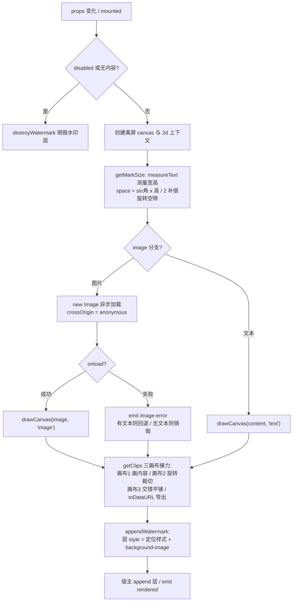
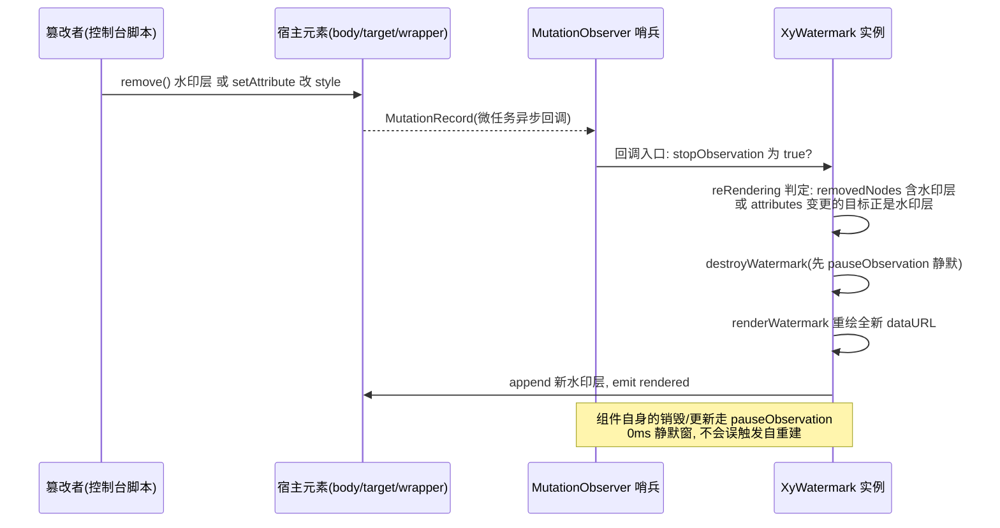
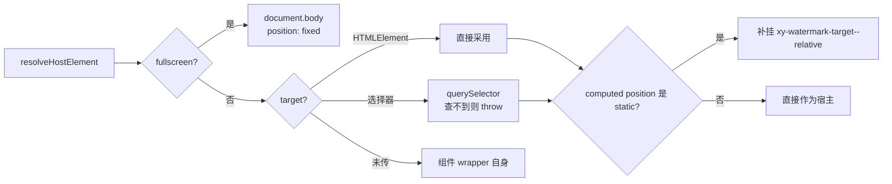

# 5-09 · Watermark：canvas 水印与防删除哨兵

水印是这个组件库里最"拧巴"的一个组件：它的存在感越低越好，但它又必须顽强到删不掉。今天这篇我们就围绕这一个核心问题展开——**水印如何铺满且抗删除**。它其实是两个独立的技术问题：

1. **铺满**：怎么把一段文字或一个 Logo 高效地铺满任意尺寸的容器，还要带上旋转角、间隙、偏移这些排版参数；
2. **抗删除**：怎么让用户（或者内部测试同学按 F12）删掉、改坏这层水印之后，它自己"复活"。

第一个问题的答案是 canvas + `toDataURL` + `background-repeat` 平铺；第二个问题的答案是挂在宿主上的 `MutationObserver` 哨兵。本篇逐行拆解 `packages/components/watermark/src/` 下的三个文件、`packages/theme/src/components/watermark.css` 的全部样式、四百余行单测，以及类型夹具与七个文档示例，最后和 Element Plus 的同名组件做一次逐点对比。

先把主角文件列出来，后面所有行号均以当前工作区实态为准：

- `packages/components/watermark/src/watermark.vue`（543 行）
- `packages/components/watermark/src/use-clips.ts`（177 行）
- `packages/components/watermark/src/utils.ts`（65 行）
- `packages/components/watermark/src/watermark.ts`（54 行）
- `packages/components/watermark/__tests__/watermark.spec.ts`（446 行）
- `packages/theme/src/components/watermark.css`（23 行）

---

## 一、一张背景图，胜过一千个 DOM 节点

实现"铺满"有两条经典路线：**DOM 平铺**（把水印文字渲染成成百上千个绝对定位的 span）和 **canvas 平铺**（把水印画成一张小图，导出 dataURL，交给 `background-repeat` 去无限复制）。

**权衡一：canvas 平铺 vs DOM 平铺。** DOM 平铺的好处是文字天然清晰、可以用 CSS 变量和字体；坏处是致命的——节点数随容器面积线性膨胀，一个全屏水印动辄几百个 span，滚动、重排、内存全遭殃，而且这些节点本身就是篡改入口，防删除要逐个守护。canvas 平铺把整个水印矩阵压缩成**一个 div + 一张背景图**：无论容器多大，DOM 成本恒定为一个节点；`background-repeat` 由浏览器合成器在绘制层面平铺，不参与布局；而"防删除"的守护面也从 N 个文字节点坍缩成 1 个图层节点。代价是：文字被栅格化，缩放会糊（所以要用 devicePixelRatio 画高清图，见后文），字体信息烧死在图片里，想改一个字就得重画整张图。本库和 Element Plus、Ant Design 一样选择了 canvas 路线——这在防篡改场景里是"一箭双雕"的架构决策。

组件的模板外壳简单得出奇（watermark.vue:534-543）：

```html
<template>
  <div
    ref="wrapperRef"
    :class="containerClass"
    :style="containerStyle"
    v-bind="passthroughAttrs"
  >
    <slot />
  </div>
</template>
```

注意一个关键细节：**水印层根本不在模板里**。它是在运行时用 `document.createElement("div")` 动态创建的（watermark.vue:240-244）。原因很直接——水印层的挂载点可能是组件自己的 wrapper、`document.body`（fullscreen 模式）、或者任意外部 `target` 容器，一个声明在模板里的节点没法随宿主迁移；同时，一个不属于 Vue 渲染树的"野节点"反而更好做哨兵：它的存亡完全由组件自己管控，不会被 Vue 的 diff 意外回收。

`inheritAttrs: false` 加上 `passthroughAttrs`（watermark.vue:66-81）做了极窄的属性白名单——只有 `id`、`role`、`data-*`、`aria-*` 会透传到 wrapper，`class` 与 `style` 单独合并，其余业务属性一概不落到根节点上。水印是覆盖在业务内容之上的层，根节点上堆满来路不明的属性，样式污染和选择器误伤的风险都会放大。

默认参数也值得读一遍（watermark.vue:25-36）：

```ts
const props = withDefaults(defineProps<WatermarkProps>(), {
  zIndex: 9,
  rotate: -22,
  content: "Xiaoye Components",
  gap: () => [100, 100],
  disabled: false,
  opacity: 1,
  repeat: "repeat",
  autoObserve: true,
  fullscreen: false,
  target: undefined
});
```

`rotate: -22` 是业界水印的"祖传角度"——左倾 22 度既能覆盖版面又不太干扰阅读，Ant Design 与 Element Plus 的默认值同样是 -22。`zIndex: 9` 是一个刻意"不高不低"的层位：盖住普通内容，但一般盖不住 dialog、dropdown 这类弹层。配套的样式入口在 `packages/theme/src/components/watermark.css:1-23`，全文如下：

```css
.xy-watermark {
  position: relative;
  display: block;
  isolation: isolate;
}

.xy-watermark-target--relative {
  position: relative !important;
  isolation: isolate;
}

.xy-watermark__layer {
  position: absolute;
  inset: 0;
  border-radius: inherit;
  pointer-events: none;
  user-select: none;
  background-repeat: repeat;
  background-origin: border-box;
  background-clip: padding-box;
  opacity: 0.9;
  transition: opacity var(--xy-transition-duration-fast) var(--xy-transition-timing);
}
```

这里有一个本文要诚实指出的**叙述与源码不符点**：`.xy-watermark__layer` 里写的 `opacity: 0.9` 实际是无效规则——`appendWatermark` 每次都会往层上写完整的 inline style，其中必然包含 `opacity`（默认为 1，见 watermark.vue:207 的 `opacity: normalizedOpacity.value`），inline 样式永远压过类样式。真正生效的是那条 `transition`：当 `props.opacity` 变化触发重绘时，inline opacity 的跳变会被缓动过渡，水印获得一个柔和的淡入淡出。`isolation: isolate` 则是层叠上下文的保险丝：把水印层的 `z-index: 9` 关在容器自己的层叠上下文里，防止它在极端样式环境下逃逸出去盖住页面级弹层。

---

## 二、绘制管线：三张 canvas 的一趟旅程

把整个渲染过程画成一张管线图，它就是三张离屏 canvas 的接力：



### 2.1 渲染总控：renderWatermark

先看总控函数全文（watermark.vue:327-417），这是理解整条管线的主干：

```ts
function renderWatermark() {
  renderToken += 1;
  const token = renderToken;

  if (!hostRef.value) {
    return;
  }

  if (props.disabled || !hasWatermarkContent(props.image, props.content)) {
    destroyWatermark();
    clearRenderedState();
    return;
  }

  const canvas = document.createElement("canvas");
  const ctx = canvas.getContext("2d");

  if (!ctx) {
    return;
  }

  const ratio = getPixelRatio();
  const [markWidth, markHeight, space] = getMarkSize(ctx);

  const drawCanvas = (
    drawContent: NonNullable<WatermarkProps["content"]> | HTMLImageElement,
    source: WatermarkRenderSource
  ) => {
    if (token !== renderToken) {
      return;
    }

    const [textClips, clipWidth, clipHeight] = getClips(
      drawContent ?? "",
      props.rotate,
      ratio,
      markWidth,
      markHeight,
      {
        color: color.value,
        fontSize: fontSize.value,
        fontStyle: fontStyle.value,
        fontWeight: fontWeight.value,
        fontFamily: fontFamily.value,
        fontGap: fontGap.value,
        textAlign: textAlign.value,
        textBaseline: textBaseline.value
      },
      gapX.value,
      gapY.value,
      space
    );

    appendWatermark(textClips, clipWidth, clipHeight, source);
  };

  destroyWatermark();

  if (props.image) {
    const image = new Image();

    image.onload = () => {
      drawCanvas(image as unknown as HTMLImageElement, "image");
    };
    image.onerror = (event) => {
      emit("image-error", event instanceof Event ? event : new Event("error"));

      if (!hasWatermarkContent(undefined, props.content)) {
        destroyWatermark();
        clearRenderedState();
        return;
      }

      drawCanvas(props.content ?? "", "text");
    };

    if ("crossOrigin" in image) {
      (image as HTMLImageElement).crossOrigin = "anonymous";
    }

    if ("referrerPolicy" in image) {
      (image as HTMLImageElement).referrerPolicy = "no-referrer";
    }

    image.src = props.image;

    return;
  }

  drawCanvas(props.content ?? "", "text");
}
```

四个细节值得驻足：

**其一，renderToken 竞态闸门。** 函数第一行 `renderToken += 1`，闭包里的 `drawCanvas` 每次执行前都校验 `token !== renderToken` 就放弃落层。这是 Element Plus 没有的防线：图片水印是异步的，`onload` 回调返回时用户可能已经改了 content、切了 disabled、甚至换了宿主——没有闸门的话，一张"过期"的水印图会在 props 变更之后异步糊上来。EP 的 `renderWatermark`（element-plus dev 分支 `packages/components/watermark/src/watermark.vue:163-220`）对图片 onload 没有任何竞态防护，改 props 后旧图片回调依然会 `appendWatermark`，这是一处本库实打实补掉的坑。

**其二，先销毁再绘制的"空白窗口"。** `destroyWatermark()`（383 行）在 image 分支之前执行：旧层立刻移除，新层要等图片 onload 之后才 append。图片慢时这段时间容器没有水印。EP 同样如此。对截图防泄密这种强一致场景，这是一个可以感知的窗口期，但它换来了样式更新的原子性——不会出现新旧两层叠加的脏帧。

**其三，crossOrigin 与 referrerPolicy。** 图片模式必须设置 `crossOrigin = "anonymous"`：一旦画布被跨域图片污染，`toDataURL` 会直接抛 SecurityError，整个水印链路报废。`referrerPolicy = "no-referrer"` 则避免防盗链图床因 Referer 校验拒绝加载。这两个属性都用 `"crossOrigin" in image` 探测后再赋值，对 jsdom 环境里的 mock Image 做了兼容——单测里的 `MockImage` 并不继承 HTMLImageElement。

**其四，image-error 的降级语义。** 图片加载失败时不是无条件回退文本：只有当 `content` 非空时才回退绘制文本，否则销毁水印层清空状态（394-398 行）。同时 `emit("image-error", ...)` 把失败上报给业务，让调用方决定要不要换图。EP 的 onerror 是静默回退，业务侧对失败无感知。

### 2.2 测量：getMarkSize 与旋转空隙补偿

画图前要先知道"这一格"有多大（watermark.vue:278-325）：

```ts
function getMarkSize(ctx: CanvasRenderingContext2D) {
  let defaultWidth = 120;
  let defaultHeight = 64;
  let space = 0;

  const { image, width, height, rotate } = props;

  if (!image && ctx.measureText) {
    ctx.font = `${normalizeFontStyle(fontStyle.value)} normal ${fontWeight.value} ${numericFontSize.value}px/${numericFontSize.value}px ${fontFamily.value}`;

    const contents = getContentLines();
    let maxWidth = 0;
    let maxHeight = 0;

    contents.forEach((item) => {
      const {
        width: measuredWidth,
        fontBoundingBoxAscent,
        fontBoundingBoxDescent,
        actualBoundingBoxAscent,
        actualBoundingBoxDescent
      } = ctx.measureText(item);
      const measuredHeight =
        fontBoundingBoxAscent === undefined || fontBoundingBoxDescent === undefined
          ? actualBoundingBoxAscent + actualBoundingBoxDescent || numericFontSize.value
          : fontBoundingBoxAscent + fontBoundingBoxDescent;

      if (measuredWidth > maxWidth) {
        maxWidth = Math.ceil(measuredWidth);
      }

      if (measuredHeight > maxHeight) {
        maxHeight = Math.ceil(measuredHeight);
      }
    });

    if (contents.length > 0) {
      defaultWidth = maxWidth;
      defaultHeight = maxHeight * contents.length + (contents.length - 1) * fontGap.value;

      const angle = (Math.PI / 180) * Number(rotate);
      space = Math.ceil(Math.abs(Math.sin(angle) * defaultHeight) / 2);
      defaultWidth += space;
    }
  }

  return [width ?? defaultWidth, height ?? defaultHeight, space] as const;
}
```

这里的考据点要如实交代：**关于"防覆盖的间距抖动"，本库并未实现任何随机抖动**。文字旋转之后，矩形的对角会探出格子、上下边缘会留出三角空隙，相邻平铺格之间容易出现肉眼可见的"覆盖"或"空洞"。本库的对策是纯确定性的两件事：一是用 `space = |sin(角度)| × 高度 / 2` 把旋转探出量补进宽度（318-320 行），二是靠下一节的"交错平铺"让相邻格错开半个周期。没有随机量意味着：同样的 props 永远产出同一张水印图——这对视觉回归测试和 `rendered` 事件的幂等消费是好事，但理论上对手工攻击者也少了点干扰。这是实现取舍，不是遗漏，antd 系的血统（EP 同款公式，见 `element-plus/packages/components/watermark/src/watermark.vue:152-155`）都是这么做的。

另一个考据点是高度测量：优先用 `fontBoundingBoxAscent/Descent`（字体的理论上下沿，行高稳定），取不到时退回 `actualBoundingBoxAscent/Descent`（实际墨迹边界），再兜底到字号——注释化的处理与 EP 相同，是为了兼容 Firefox < 116 不支持 fontBoundingBox 的时代遗留。多行文本的总高是 `行高 × 行数 + (行数 - 1) × fontGap`，即行间距由 `font.fontGap` 控制（默认 3px）。

**关于"canvas 逐字符绘制"的考据结论：本库不是逐字符绘制，而是逐行绘制。** 后文 use-clips 源码里可以看到，`fillText` 对每个 content 行只调用一次，整行一次性画上去。Ant Design 早期实现是逐字符绘制（每字符单独 fillText 以精确控制字符间距），本库与现行 EP 都放弃了逐字符路线——字符间距不可控，但省掉了 N 次 measureText 与 fillText 的开销，多行场景下绘制成本从"字符数"降为"行数"。

**关于字体令牌的考据结论：字重 12 档存在，但水印没有消费。** 设计令牌唯一事实源 `packages/xiaoye-primitives/src/theme/tokens.css:210-222` 定义了 12 档字重（`--xy-font-weight-light: 300` 到 `--xy-font-weight-680: 680`），而水印的 `fontWeight` 类型是 `"normal" | "bold" | "lighter" | "bolder" | number`（watermark.ts:3），被原样拼接进 `ctx.font` 短语法字符串。这不是偷懒，是 canvas 的物理限制：**`ctx.font` 不解析 `var()`**，CSS 变量在 canvas 里就是非法字符串，整条 font 声明会被静默忽略。想让水印吃令牌，得先 `getComputedStyle(el).fontWeight` 读出计算值再喂给 canvas——本库选择了让业务直接传数值的务实路线。有意思的是颜色反而是通的：`fillStyle` 走的是 CSS Color 解析，现代浏览器支持 CSS Color 4 全语法，所以文档示例（`apps/docs/examples/watermark/multi-line.vue:8-12`）可以直接写 `color-mix(in srgb, var(--xy-text-primary) 12%, transparent)` 让水印文字颜色跟随主题令牌。

### 2.3 getClips：画布三接力与交错平铺

`use-clips.ts` 是绘制算法的心脏。第一段：内容画布（use-clips.ts:59-101）：

```ts
    const [ctx, canvas, contentWidth, contentHeight] = prepareCanvas(width, height, ratio);
    let baselineOffset = 0;

    if (isImageLike(content)) {
      ctx.drawImage(content, 0, 0, contentWidth, contentHeight);
    } else {
      const {
        color,
        fontSize,
        fontStyle,
        fontWeight,
        fontFamily,
        textAlign,
        textBaseline
      } = font;
      const mergedFontSize = normalizeFontSize(fontSize, 16) * ratio;

      ctx.font = `${normalizeFontStyle(fontStyle)} normal ${fontWeight} ${mergedFontSize}px/${height}px ${fontFamily}`;
      ctx.fillStyle = color;
      ctx.textAlign = textAlign;
      ctx.textBaseline = textBaseline;

      const contents = Array.isArray(content) ? content : [content];

      if (textBaseline !== "top" && contents[0]) {
        const argumentMetrics = ctx.measureText(contents[0]);
        ctx.textBaseline = "top";
        const topMetrics = ctx.measureText(contents[0]);

        baselineOffset =
          argumentMetrics.actualBoundingBoxAscent - topMetrics.actualBoundingBoxAscent;
      }

      contents.forEach((item, index) => {
        const [alignRatio, spaceRatio] = TEXT_ALIGN_RATIO_MAP[textAlign];

        ctx.fillText(
          item ?? "",
          contentWidth * alignRatio + space * spaceRatio,
          index * (mergedFontSize + font.fontGap * ratio)
        );
      });
    }
```

如前所述：`contents.forEach` 里每个元素只 `fillText` 一次——**逐行绘制**，第 index 行的 y 坐标是 `index × (字号 × ratio + fontGap × ratio)`。单测里那条精确断言（watermark.spec.ts:130-131）验证的正是这个公式：默认字号 16 + 默认 fontGap 3，第二行 y = 19。`baselineOffset` 的计算是一个容易被误读的细节：canvas 的 textBaseline 各取值在不同浏览器里对"基线如何锚定"实现不一，这里对非 top 基线做了一次"换算"——先用业务基线测一次墨迹上沿，再切到 top 基线测一次，两者差值就是补偿量，后文旋转裁切落图时统一加上（use-clips.ts:159-166 的 `targetY + baselineOffset`），保证不同 textBaseline 配置下文字都落在格子的正确位置。

`TEXT_ALIGN_RATIO_MAP`（use-clips.ts:4-10）把五个 textAlign 取值映射成 `[x 锚点比例, space 分摊比例]`：`left/start` 锚在左缘并吃掉一半旋转补偿，`center` 居中不吃补偿，`right/end` 锚在右缘并反向吃补偿。`normalizeFontStyle`（utils.ts:32-34）把非法的 `"none"` 归一成 `"normal"`——这个归一化 EP 是缺失的，EP 的 useClips 直接把 `fontStyle` 拼进 ctx.font，传 `"none"` 会导致整条 font 短语法非法、被浏览器静默忽略，字号字体全部失效。这是对比的第二处差异。

第二段：旋转画布与交错平铺画布（use-clips.ts:103-173）：

```ts
    const angle = (Math.PI / 180) * Number(rotate);
    const maxSize = Math.max(width, height);
    const [rotatedCtx, rotatedCanvas, realMaxSize] = prepareCanvas(maxSize, maxSize, ratio);

    rotatedCtx.translate(realMaxSize / 2, realMaxSize / 2);
    rotatedCtx.rotate(angle);

    if (contentWidth > 0 && contentHeight > 0) {
      rotatedCtx.drawImage(canvas, -contentWidth / 2, -contentHeight / 2);
    }

    function getRotatePos(x: number, y: number) {
      const targetX = x * Math.cos(angle) - y * Math.sin(angle);
      const targetY = x * Math.sin(angle) + y * Math.cos(angle);

      return [targetX, targetY];
    }

    let left = 0;
    let right = 0;
    let top = 0;
    let bottom = 0;

    const halfWidth = contentWidth / 2;
    const halfHeight = contentHeight / 2;
    const points = [
      [0 - halfWidth, 0 - halfHeight],
      [0 + halfWidth, 0 - halfHeight],
      [0 + halfWidth, 0 + halfHeight],
      [0 - halfWidth, 0 + halfHeight]
    ] as const;

    points.forEach(([x, y]) => {
      const [targetX, targetY] = getRotatePos(x, y);

      left = Math.min(left, targetX);
      right = Math.max(right, targetX);
      top = Math.min(top, targetY);
      bottom = Math.max(bottom, targetY);
    });

    const cutLeft = left + realMaxSize / 2;
    const cutTop = top + realMaxSize / 2;
    const cutWidth = right - left;
    const cutHeight = bottom - top;

    const realGapX = gapX * ratio;
    const realGapY = gapY * ratio;
    const filledWidth = (cutWidth + realGapX) * 2;
    const filledHeight = cutHeight + realGapY;
    const [filledCtx, filledCanvas] = prepareCanvas(filledWidth, filledHeight);

    function drawImg(targetX = 0, targetY = 0) {
      filledCtx.drawImage(
        rotatedCanvas,
        cutLeft,
        cutTop,
        cutWidth,
        cutHeight,
        targetX,
        targetY + baselineOffset,
        cutWidth,
        cutHeight
      );
    }

    drawImg();
    drawImg(cutWidth + realGapX, -cutHeight / 2 - realGapY / 2);
    drawImg(cutWidth + realGapX, cutHeight / 2 + realGapY / 2);

    return [filledCanvas.toDataURL(), filledWidth / ratio, filledHeight / ratio];
```

这段代码干了三件事，对应三张 canvas：

1. **旋转画布**：新建一张 `max(width, height)` 见方的正方形画布，中心平移 + 旋转，再把内容画布贴到中心。旋转画布之所以取正方形，是保证任意角度下内容都不会被画布边缘裁掉。
2. **旋转包围盒裁切**：把内容的四个角点用旋转矩阵转一遍（`getRotatePos` 是标准的二维旋转公式），取四角的 min/max 得到旋转后文字的紧致包围盒（cutLeft/cutTop/cutWidth/cutHeight），后续只搬这个盒子，避免把旋转画布里的大片空白带进平铺图。
3. **交错平铺（Fill Alternate）**：最终导出的图是 `(cutWidth + gapX) × 2` 宽、`(cutHeight + gapY)` 高的"双格图"——主格贴一份，右上、右下以半个高度为错位再各贴一份。这张图交给 `background-repeat` 平铺后，视觉上形成蜂窝状的交错矩阵：相邻两列水印上下错开半个周期，旋转文字的三角空隙被相邻列"补位"，同一行内不再出现规律性的空带。这就是本库对"旋转角与防覆盖"的完整答案——**确定性交错，零随机抖动**。

`toDataURL` 导出后，返回的宽高都除了以 `ratio`（use-clips.ts:173）——canvas 的物理像素是 CSS 尺寸 × devicePixelRatio，而 `background-size` 要用 CSS 像素声明，否则在 2x 屏上水印会被放大一倍变得模糊。`getPixelRatio()`（utils.ts:14-16）读 `window.devicePixelRatio`，高清屏上一张图物理像素翻倍、CSS 占位不变，文字边缘保持锐利。

---

## 三、防删除哨兵：MutationObserver 在观察什么

铺满的问题解决之后，就是后半程：抗删除。整条响应流如下：



### 3.1 观察范围：宿主 + subtree + 两类变化

哨兵的连接逻辑全文如下（watermark.vue:419-446）：

```ts
function connectObserver() {
  disconnectObserver();

  if (typeof MutationObserver === "undefined" || !hostRef.value || !props.autoObserve) {
    return;
  }

  const observedHost = hostRef.value;

  observerRef.value = new MutationObserver((mutations) => {
    if (stopObservation.value) {
      return;
    }

    mutations.forEach((mutation) => {
      if (reRendering(mutation, watermarkRef.value)) {
        destroyWatermark();
        renderWatermark();
      }
    });
  });

  observerRef.value.observe(observedHost, {
    attributes: true,
    subtree: true,
    childList: true
  });
}
```

观察目标不是水印层自己——水印层如果被删了，观察它自己的 observer 也随之失效，这是所有防删除实现的第一课。**观察的是宿主元素**（`observedHost = hostRef.value`），配 `subtree: true` 覆盖整个子树。三类配置里开了两类：`childList`（节点增删）与 `attributes`（属性变更）；`characterData` 没开——水印层 `aria-hidden` 且无文本子节点，文本变更通道对它没有意义。

判定"这次 mutation 是否值得重建"的逻辑在 utils.ts:18-30：

```ts
export function reRendering(mutation: MutationRecord, watermarkElement?: HTMLElement) {
  let shouldRerender = false;

  if (mutation.removedNodes.length > 0 && watermarkElement) {
    shouldRerender = Array.from(mutation.removedNodes).includes(watermarkElement);
  }

  if (mutation.type === "attributes" && mutation.target === watermarkElement) {
    shouldRerender = true;
  }

  return shouldRerender;
}
```

这就是任务规格里"防篡改三通道"的实码答案。**通道一：DOM 删除**——`removedNodes` 里包含水印层节点；**通道二：属性修改**——`mutation.type === "attributes"` 且目标正是水印层；**通道三：样式篡改**——在本库里它与通道二是同一条路，因为水印层的全部样式都写在 inline `style` 属性上（`getStyleStr` 生成，watermark.vue:247-254），改样式必然走 `setAttribute("style", ...)`，必然触发 attributes mutation。`class` 被 `getElementById` 拿去改、`removeAttribute("style")` 清空样式，通通落在同一张网里。需要强调两个"没做"：mutation 记录里**新增**节点（比如有人往宿主里塞了个同名层）不触发重建；水印层子树之外的业务节点属性变化虽然会进入回调，但被 `mutation.target === watermarkElement` 这个窄判断直接过滤，不产生任何实际开销。

重建策略也不是"打补丁式恢复"，而是**完整重绘**：`destroyWatermark()` 移除旧层，`renderWatermark()` 从测量到导出 dataURL 全部重来，产出一个全新的节点与全新的背景图。对比"把被改的属性逐个改回去"的镜像恢复策略，完整重绘更笨但更稳——你不需要枚举所有可能被篡改的属性，任何破坏的最终形态都是"层没了"，那就让它重新生成一遍。

### 3.2 自触发静默窗：别抓住自己

哨兵最大的工程难点不是"抓住别人"，而是**不抓住自己**。组件自身的每次销毁重建（props 变化、宿主切换、甚至水印层 remove 后的响应式更新）都会产生 mutation 记录，如果不做隔离，`destroyWatermark → renderWatermark` 会再次触发 observer，形成无限重建循环。解法是一个 0ms 的静默窗（watermark.vue:109-135）：

```ts
function pauseObservation() {
  stopObservation.value = true;

  if (observationTimer) {
    clearTimeout(observationTimer);
  }

  observationTimer = setTimeout(() => {
    stopObservation.value = false;
    observationTimer = null;
  }, 0);
}

function disconnectObserver() {
  observerRef.value?.disconnect();
  observerRef.value = null;
}

function destroyWatermark() {
  if (!watermarkRef.value) {
    return;
  }

  pauseObservation();
  watermarkRef.value.remove();
  watermarkRef.value = undefined;
}
```

时序上这个窗口设计得很讲究：MutationObserver 的回调是**微任务**，而 `setTimeout(..., 0)` 恢复开关是**宏任务**。`destroyWatermark` 同步执行 `remove()`，mutation 记录入队，微任务里的 observer 回调跑在宏任务之前——此刻 `stopObservation` 必然还是 `true`，自删除被静默；下一个宏任务恢复开关，外界的下一次篡改照常捕获。`pauseObservation` 里还有一个 `clearTimeout` 防抖细节：短时间内连续 destroy（比如 props 连续变化）时，多次 pause 不会互相推挤导致开关状态错乱。

**权衡二：MutationObserver 的粒度与性能。** `subtree: true` 在大型应用里意味着：宿主是 body 时，页面上任何一处 DOM 增删、任何元素的属性变更，都会把一条记录送进这个回调。本库的防御是"宽收集、窄判定"——收集端不做 `attributeFilter` 过滤（因为篡改者可能改任何属性，用 filter 反而留后门），判定端用 `target === watermarkElement` 和 `removedNodes.includes(...)` 两个 O(变更数) 的引用比较把噪音全部放行。真正昂贵的重建操作只在命中时发生一次。即便如此，这仍是一个值得写进 PR 描述的取舍：对一个处于 body 子树下的全屏水印来说，页面上每次 DOM 抖动都要跑一遍窄判定，这是用一点恒定的检查成本换取"任何通道的篡改都无法漏网"。`autoObserve: false` 则是给性能敏感场景（比如宿主是高频更新的虚拟滚动容器）留的官方逃生门。

### 3.3 诚实出口：autoObserve 与 removeWatermark

防删除组件有个天然的伦理问题：它在对抗它的使用者。本库的态度是"硬防篡改 + 软出口"并存——哨兵默认开启（`autoObserve: true`），但任何人都可显式声明 `autoObserve=false` 关闭自愈，或通过 expose 的 `removeWatermark()` 主动拆除（watermark.vue:468-470）。对比把删除逻辑藏在私有作用域、只能靠改源码关闭的"硬对抗"方案，这是更健康的工程立场：**水印防的是无意识破坏和顺手 F12 的普通用户，不是决心对抗的工程师**——真要对抗，浏览器里没有拦得住的路（拆掉 observer、hook MutationObserver、禁用 JS 都能做到），所以组件库的正确姿势是把"普通删除必然失败"做到位，同时给正当场景一个不用 hack 的开关。这也是下文要展开的第三个权衡。

---

## 四、宿主解析：wrapper、fullscreen 与 target 补位

水印层挂在哪，决定了它保护谁。解析逻辑（watermark.vue:150-174）：

```ts
function resolveHostElement() {
  if (typeof window === "undefined") {
    return wrapperRef.value;
  }

  if (props.fullscreen) {
    return document.body;
  }

  if (isElementTarget(props.target)) {
    return props.target;
  }

  if (typeof props.target === "string" && props.target) {
    const resolvedTarget = document.querySelector<HTMLElement>(props.target);

    if (!resolvedTarget) {
      throw new Error(`[XyWatermark] target does not exist: ${props.target}`);
    }

    return resolvedTarget;
  }

  return wrapperRef.value;
}
```

三分支：`fullscreen` 挂 body 且水印层切 `position: fixed`（watermark.vue:200）；`target` 支持选择器或 HTMLElement，选择器查不到直接抛 `[XyWatermark] target does not exist`——一个编译期查不出来的配置错误，宁可炸在挂载期也不静默吞掉；都没有则回落到组件自身 wrapper。模式全景如下：



`syncHostTarget`（watermark.vue:176-195）里有个精细的补位：外部 target 若是 `position: static`（CSS 默认值），absolute 定位的水印层会去锚更外层的定位祖先，水印就"漏"到了别人的容器里。组件会检查 `getComputedStyle(host).position`，为 static 宿主补挂 `xy-watermark-target--relative` 类（`position: relative !important; isolation: isolate`，watermark.css:7-10），并把宿主记进 `patchedHostRef`，卸载或切换 target 时 `cleanupPatchedHost` 摘掉类名还原现场——**对外部 DOM 的每一处修改都有配对的回滚**，这是第三方组件洁癖的底线。

**权衡三：水印的"反用户"取舍。** 把本组件所有的"反用户"设计摆在一起看：`pointer-events: none`（inline + css 双保险）保证水印层不吞任何点击，交互零感知；`user-select: none` 让用户框选复制内容时不会顺手把水印文字带进剪贴板；`aria-hidden="true"` 让读屏软件跳过这层视觉噪音；`isolation: isolate` 防层叠逃逸；哨兵防删除。每一项都在强化同一个立场：水印是给"看"的，不是给"用"的，更不是给"改"的。但反用户必须有边界——`opacity` 可调、`disabled` 可关、`autoObserve` 可退、`removeWatermark` 可拆，组件把"防误触"做满，把"防故意的正当需求"留成显式 API。这套取舍放在团队协作语境里尤其重要：一个没有出口的防删除水印，迟早会在某个联调现场被业务同学用 `debugger` + 手动改源码的方式绕过，那才是防线崩塌的开始。

宿主与绘制这两类 props 的响应式也被拆成了两组 watch（watermark.vue:476-509）：`[target, fullscreen, autoObserve]` 变化走 `refreshHostAndWatermark`——完整五步 `disconnectObserver → destroyWatermark → syncHostTarget → renderWatermark → connectObserver`，因为宿主变了，哨兵的观察目标也要跟着搬家；而 `[disabled, opacity, repeat, zIndex, rotate, width, height, image, content, font, gap, offset]` 这组纯绘制参数只走 `renderWatermark`，不折腾哨兵。两组都是 `deep: true, flush: "post"`——flush 到 DOM 更新之后，保证宿主解析时读到的 `wrapperRef` 与计算样式是新鲜的。EP 在这里是一个全 props 的 deep watch 统一重绘（element-plus dev 分支 watermark.vue:226-235），宿主参数与绘制参数不分离——因为 EP 根本没有宿主切换能力。

---

## 五、和 Element Plus 摆在一起看

把两份实现并排放，血缘关系一目了然：本库的 `getStyleStr / getPixelRatio / reRendering / getClips / TEXT_ALIGN_RATIO_MAP / baselineOffset` 全套与 EP 同名同构，显然同出 antd 系源流。差异集中在工程化加固上。EP 的落层与哨兵（element-plus dev 分支 `packages/components/watermark/src/watermark.vue:94-111` 与 `241-257`）：

```ts
const appendWatermark = (base64Url: string, markWidth: number) => {
  if (containerRef.value && watermarkRef.value) {
    stopObservation.value = true
    watermarkRef.value.setAttribute(
      'style',
      getStyleStr({
        ...getMarkStyle(),
        backgroundImage: `url('${base64Url}')`,
        backgroundSize: `${Math.floor(markWidth)}px`,
      })
    )
    containerRef.value?.append(watermarkRef.value)
    // Delayed execution
    setTimeout(() => {
      stopObservation.value = false
    })
  }
}
```

```ts
const onMutate = (mutations: MutationRecord[]) => {
  if (stopObservation.value) {
    return
  }
  mutations.forEach((mutation) => {
    if (reRendering(mutation, watermarkRef.value)) {
      destroyWatermark()
      renderWatermark()
    }
  })
}

useMutationObserver(containerRef, onMutate, {
  attributes: true,
  subtree: true,
  childList: true,
})
```

逐点对比：

| 维度 | Element Plus | 本库 XyWatermark |
| --- | --- | --- |
| 哨兵观察目标 | 固定为组件自身 `containerRef` | 解析后的宿主（body / target / wrapper），随宿主切换 disconnect 重连 |
| 挂载目标 | 仅自身 wrapper | wrapper / body(fixed) / 外部 target，static 宿主自动补 relative 类并回滚 |
| 图片加载竞态 | 无防护，过期 onload 会覆盖新水印 | renderToken 闸门，token 过期直接丢弃 |
| 图片失败 | 静默回退文本 | emit `image-error` 上报，有文本才回退，无文本销毁层 |
| 静默窗 | `setTimeout` 恢复（同宏任务思路） | 同思路，但显式 0ms + timer 清理防抖 |
| backgroundSize | 单值（宽度，高度自动） | 双值（宽高都显式 floor） |
| fontStyle="none" | 直接拼入 ctx.font，整条字体声明失效 | normalizeFontStyle 归一为 normal |
| 控制面 | 无 disabled/opacity/repeat/autoObserve | 全量提供，repeat 支持四向平铺 |
| 实例 API | 无 | rerender / getDataUrl / getTarget / removeWatermark |
| 事件 | 无 | rendered（含 dataUrl/宽高/来源/宿主）/ image-error |

最有含金量的两处差距：一是 **renderToken**——异步图片回调与新 props 的竞态在 EP 是真实存在的 bug 温床；二是**哨兵目标可迁移**——EP 的 observer 终身盯着自己的 wrapper，本库的哨兵要跟着 fullscreen/target 迁移，因此多了 `refreshHostAndWatermark` 的五步重建编排和 `connectObserver` 里的 `disconnectObserver` 前置清理。EP 的 reRendering（element-plus `packages/components/watermark/src/utils.ts:23-37`）与本库 utils.ts:18-30 逐字级相似，这一层判定逻辑是行业共识，本库没有标新立异。

---

## 六、测试：一个像素都不画，怎么测 canvas

canvas 在 jsdom 里是个空壳——`getContext("2d")` 返回 null，`toDataURL` 不存在。本库单测的思路是**不验证像素、只验证协议**：mock 掉 canvas 上下文与 Image 构造器，断言"绘制指令以正确的参数发出"（watermark.spec.ts:9-90）：

```ts
const fillTextMock = vi.fn();
const drawImageMock = vi.fn();
const measureTextMock = vi.fn((text: string) => ({
  width: text.length * 8,
  fontBoundingBoxAscent: 12,
  fontBoundingBoxDescent: 4,
  actualBoundingBoxAscent: 12,
  actualBoundingBoxDescent: 4
}));

let dataUrlSeed = 0;
let imageBehaviors: Array<"load" | "error"> = [];

class MockImage {
  crossOrigin = "";
  referrerPolicy = "";
  onload: ((event: Event) => void) | null = null;
  onerror: ((event: Event) => void) | null = null;
  private _src = "";

  set src(value: string) {
    this._src = value;
    const behavior = imageBehaviors.shift() ?? "load";

    setTimeout(() => {
      if (behavior === "load") {
        this.onload?.(new Event("load"));
        return;
      }

      this.onerror?.(new Event("error"));
    }, 0);
  }

  get src() {
    return this._src;
  }
}
```

```ts
beforeEach(() => {
  dataUrlSeed = 0;
  imageBehaviors = [];
  fillTextMock.mockReset();
  drawImageMock.mockReset();
  measureTextMock.mockClear();

  vi.stubGlobal("Image", MockImage);
  vi
    .spyOn(HTMLCanvasElement.prototype, "getContext")
    .mockImplementation((contextId) => (contextId === "2d" ? createMockContext() : null));
  vi
    .spyOn(HTMLCanvasElement.prototype, "toDataURL")
    .mockImplementation(() => `data:image/mock-${++dataUrlSeed}`);
});
```

三个设计点：`MockImage` 用 setter 劫持 `src` 赋值，通过 `imageBehaviors` 队列精确编排"第几张图加载失败"，配合 `setTimeout(0)` 模拟真实异步；`toDataURL` 返回递增 seed 的假 dataURL，于是"重绘是否发生"可以退化为 `dataUrlSeed` 是否增长（watermark.spec.ts:267 的 `expect(dataUrlSeed).toBeGreaterThan(initialSeed)`）——这是个以量代质的聪明转换；`measureText` 的 mock 返回 `width = 字符数 × 8` 与固定的上下沿值，让所有几何断言可手算。`flushWatermark` 辅助函数（watermark.spec.ts:63-70）反复 `nextTick + setTimeout(0)`，就是在给"微任务 observer 回调 + 宏任务静默窗恢复"这两级时序留足空间——写 MutationObserver 的测试，本质是在写时序。

防篡改三测是最能体现哨兵行为的（watermark.spec.ts:272-307）：

```ts
  it("删除水印层后会自动恢复", async () => {
    const wrapper = mount(XyWatermark, {
      attachTo: document.body,
      props: {
        content: "自动恢复"
      }
    });

    await flushWatermark();

    const removedLayer = getLayer(wrapper.element);
    removedLayer?.remove();

    await flushWatermark(3);

    expect(getLayer(wrapper.element)).not.toBeNull();
    expect(getLayer(wrapper.element)).not.toBe(removedLayer);
  });

  it("篡改水印层样式后会自动恢复", async () => {
    const wrapper = mount(XyWatermark, {
      attachTo: document.body,
      props: {
        content: "样式恢复"
      }
    });

    await flushWatermark();

    const layer = getLayer(wrapper.element);
    layer?.setAttribute("style", "background-image: none;");

    await flushWatermark(3);

    expect(getLayer(wrapper.element)?.getAttribute("style")).toContain("background-image: url(");
  });
```

第一个用例断言的不只是"层回来了"，还有 `not.toBe(removedLayer)`——回来的是**全新节点**，对应完整重绘而非补挂旧节点的实现语义；第二个用例模拟的正是通道三（样式篡改 = style 属性篡改），断言恢复后的 style 里有背景图。配套还有 `autoObserve=false` 时删除不恢复（watermark.spec.ts:309-324），证明逃生门是真实生效的开关而非摆设。其余覆盖面：fullscreen 挂 body 与卸载清理（369-387）、target 选择器 + static 补位类 + 卸载还原（389-414）、target 不存在抛错（435-445）、expose 四 API（343-367）、多行 y=19 坐标断言（119-132），全部可复算。

类型侧的守门在 `tests/types/fixtures/watermark.ts`：正面用例覆盖全部 props 与 `WatermarkInstance` 的三个 expose 方法（10-37、54-60 行），负面用例用六个 `@ts-expect-error` 钉死边界——content 只能是 string/string[]、gap 必须二元数值元组、textAlign 拒绝 "justify"、repeat 拒绝 "tile"、opacity 拒绝字符串（62-102 行）。`WatermarkInstance` 这类型让 `ref<WatermarkInstance>` 拿到的是组件实例类型而非 Vue 通用实例，文档示例 `apps/docs/examples/watermark/control.vue:5` 与 `events.vue:5` 正是这么消费的。

---

## 七、收束

回顾全篇，水印组件的回答可以压缩成三句话：

1. **铺满靠"一张图"**：三张离屏 canvas 接力（内容 → 旋转裁切 → 交错平铺），`toDataURL` 导出，`background-repeat` 免费获得无限平铺与尺寸自适应，DOM 成本恒为一个节点。
2. **抗删除靠"看门不看贼"**：哨兵盯宿主子树而非水印层本身，删除与属性篡改两通道命中即完整重绘，自操作走 0ms 微任务静默窗，`reRendering` 的窄判定把全子树监听的噪音成本压到 O(变更数) 的引用比较。
3. **反用户有边界**：pointer-events、aria-hidden、isolation 全部做满，但 autoObserve、disabled、removeWatermark 是留给正当需求的显式出口——防误触不防人权。

最后的勘误汇总（任务预设与实码的出入，均已在上文展开）：其一，"间距抖动"并未实现，防覆盖靠旋转补偿量与确定性交错平铺；其二，canvas 绘制是逐行而非逐字符；其三，字重 12 档令牌在 tokens.css:210-222 存在但水印未消费（ctx.font 不解析 CSS 变量），颜色反而可以通过 CSS Color 4 语法吃到主题令牌；其四，watermark.css 里 `.xy-watermark__layer` 的 `opacity: 0.9` 是被 inline style 永久覆盖的死规则，实际生效的只有同块里的 transition。

下一篇是 5-10《Card：容器类组件的 slot 约定》——水印是"叠在内容上"的组件，Card 则是"包住内容"的组件。容器类组件没有复杂交互，真正的设计难点全在 slot 约定上：header 放什么、extra 与 header 的布局关系、body 的留白谁说了算、footer 什么时候该有边框。我们到时候把 `packages/components/card` 的 slot 协议逐个拆开看。
