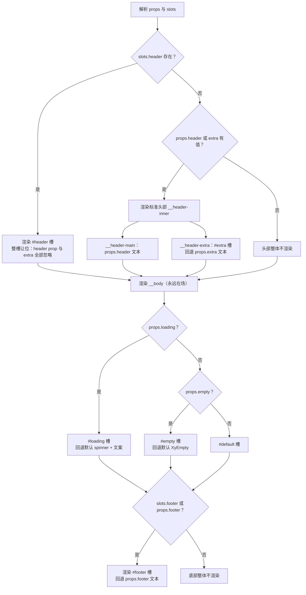
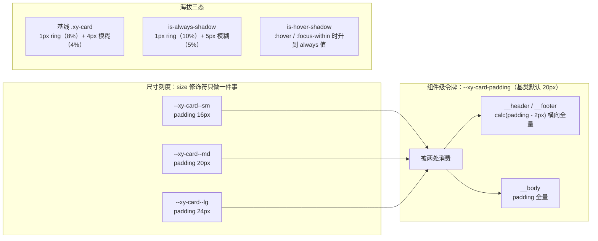

# 5-10 · Card：容器类组件的 slot 约定

> 容器类组件是组件库里最"没有故事"的一类：不收发事件、不管理状态机、不做几何计算，看起来只是把三块 DOM 叠在一起。但也正因为它太普通，每一个组件库都会在此处做出完全不同的契约选择——标题走 prop 还是插槽、footer 在没有内容时渲染不渲染、样式定制给到什么粒度。这些选择一旦发布就再难收回，因为容器组件是所有业务页面的地基，地基上的每个字节都会被模仿和依赖。本篇以 `XyCard` 为解剖样本，逐行拆解它的 header / body / footer 三段式插槽约定：header 的"标准布局与整槽让位"双入口设计、footer 的"有内容才渲染"条件结构、body 的"永远在场 + 样式透传"接口，以及 card.css 全文里的海拔阴影、padding 刻度与 3-05 篇埋下的那个 `calc(-2px)` 越界补偿。所有代码摘自当前工作区实态，行号逐一核对过。

## 引子：168 行的"普通"组件，74 行是 props

先给体量一个直观感受：

```text
$ wc -l packages/components/card/src/card.vue packages/components/card/src/card.ts \
        packages/components/card/__tests__/card.spec.ts \
        packages/theme/src/components/card.css tests/types/fixtures/card.ts \
        packages/components/card/index.ts
     168 card.vue
      29 card.ts
     286 card.spec.ts
     118 card.css
      51 card.ts（类型夹具）
       8 index.ts
     660 total
```

660 行，是至今为止 5-0x 系列里最小的一个组件——连 5-05 的 Text 都比它大。但测试（286 行）几乎与本体（168 + 29 = 197 行）等长，这个比例透露了 Card 的真实身份：它的逻辑浅到几乎没有（一个 computed 都掰不出分支嵌套），它的价值全部沉淀在**契约**里——props 的形状、插槽的优先级、类名的落点、空态的渲染时机。这些契约每一条都有测试钉着，因为它们是"改一行就破坏无数业务页面"的高危区。

入口照例是三行式的 withInstall 标准件（`packages/components/card/index.ts:1-8` 全文）：

```ts
import Card from "./src/card.vue";
import type { CardProps, CardShadow, CardVariant } from "./src/card";
import { withInstall } from "xiaoye-primitives";

export type { CardProps, CardShadow, CardVariant };

export const XyCard = withInstall(Card, "xy-card");
export default XyCard;
```

类型导出只有三件：`CardProps`、`CardShadow`、`CardVariant`。没有 `CardInstance`——Card 没有任何 expose，一个纯展示容器不需要 ref 句柄，这也是一种契约表态。

## 一、契约层：card.ts 的 29 行，档位常量外置

类型层全文只有 29 行（`packages/components/card/src/card.ts:1-29`）：

```ts
import type { ComponentSize } from "xiaoye-primitives";
import type { StyleValue } from "vue";

export const cardShadows = ["always", "hover", "never"] as const;
export const cardVariants = ["default", "muted"] as const;

export type CardShadow = (typeof cardShadows)[number];
export type CardVariant = (typeof cardVariants)[number];

export interface CardProps {
  size?: ComponentSize;
  variant?: CardVariant;
  bordered?: boolean;
  header?: string;
  footer?: string;
  extra?: string;
  bodyStyle?: StyleValue;
  headerClass?: string;
  bodyClass?: string;
  footerClass?: string;
  headerDivider?: boolean;
  footerDivider?: boolean;
  shadow?: CardShadow;
  loading?: boolean;
  loadingText?: string;
  empty?: boolean;
  emptyTitle?: string;
  emptyDescription?: string;
}
```

两个细节值得停下来。第一，`cardShadows` 和 `cardVariants` 没有写成纯类型联合（`"always" | "hover" | "never"`），而是**运行时数组 + as const**：数组既是类型的来源，又在 card.vue 里被 `PropType<(typeof cardShadows)[number]>` 二次消费（`card.vue:59-62`）。一份常量，类型层和运行时各取所需——如果未来 shadow 需要校验函数或文档生成器要枚举合法值，数组直接可用。第二，17 个 props 按功能分组排布：结构（size/variant/bordered）、三段内容（header/footer/extra）、透传（bodyStyle + 三个 *-Class + 两个 divider）、海拔（shadow）、状态（loading/empty 五件套）。这个分组的顺序和后文模板的三段式渲染顺序完全同构，props 声明本身就是一份渲染顺序文档。

类型夹具把每个档位的边界都钉了一遍（`tests/types/fixtures/card.ts:31-51`）：

```ts
const invalidShadow: CardProps = {
  // @ts-expect-error invalid shadow should be rejected
  shadow: "focus"
};

void invalidShadow;

const invalidVariant: CardProps = {
  // @ts-expect-error invalid variant should be rejected
  variant: "plain"
};

void invalidVariant;


const invalidSize: CardProps = {
  // @ts-expect-error invalid size should be rejected
  size: "xxl"
};

void invalidSize;
```

`shadow: "focus"`、`variant: "plain"`、`size: "xxl"` 三条负样本，配合三条 `@ts-expect-error`——夹具的语义是反向的：**如果哪天有人把档位放宽成 string，这三处"预期报错"会因为没有报错而让 typecheck 失败**。契约不仅被正向用例覆盖，还被"不允许什么"反向锁死。

## 二、六个插槽，一棵渲染决策树

card.vue 的脚本层声明了六个插槽（`card.vue:85-92`）：

```ts
const slots = defineSlots<{
  default?: () => unknown;
  header?: () => unknown;
  footer?: () => unknown;
  extra?: () => unknown;
  loading?: () => unknown;
  empty?: () => unknown;
}>();
```

注意这里没有 `title`。Card 的头部词汇表是 `header`（整槽）、`header` prop（纯文本标题）、`extra`（标题右侧操作区），而 `title` 这个词被刻意排除——后文 3.2 节会看到文档里专门有一段"Contract 提醒"在否认它。`defineSlots` 的返回值在这里不只是类型标注：`slots` 被当作运行时对象消费，`Boolean(slots.header)` 就是"调用方是否传了头部插槽"的判定依据。

六个插槽的渲染关系构成一棵决策树，先给全景：



这棵树里有三组判定，对应三段结构的三种存在策略：

- **header：三或渲染**——header 槽、header prop、extra 三者任一有值就渲染头部，三者全空则整个 `__header` 节点从 DOM 里消失（`card.vue:100-102`）；
- **body：永远在场**——`__body` 没有任何 v-if，哪怕卡片一个字都不写，带 padding 的主体容器照样渲染（`card.vue:143`）；
- **footer：二或渲染**——footer 槽或 footer prop 任一有值才渲染（`card.vue:103`）。

支撑这棵树的 computed 与类名拼装逻辑集中在 `card.vue:94-126`：

```ts
const ns = useNamespace("card");
const { size: globalSize } = useConfig();

const mergedSize = computed(() => props.size ?? globalSize.value);
const hasHeaderSlot = computed(() => Boolean(slots.header));
const hasExtra = computed(() => Boolean(slots.extra) || Boolean(props.extra));
const hasStructuredHeader = computed(() =>
  hasHeaderSlot.value ? true : Boolean(props.header) || hasExtra.value
);
const hasFooter = computed(() => Boolean(slots.footer) || Boolean(props.footer));

const cardClasses = computed(() => [
  ns.base.value,
  `${ns.base.value}--${mergedSize.value}`,
  `${ns.base.value}--${props.variant}`,
  ns.is("borderless", !props.bordered),
  ns.is("always-shadow", props.shadow === "always"),
  ns.is("hover-shadow", props.shadow === "hover")
]);

const headerClasses = computed(() => [
  `${ns.base.value}__header`,
  props.headerClass,
  ns.is("no-divider", !props.headerDivider)
]);

const bodyClasses = computed(() => [`${ns.base.value}__body`, props.bodyClass]);

const footerClasses = computed(() => [
  `${ns.base.value}__footer`,
  props.footerClass,
  ns.is("no-divider", !props.footerDivider)
]);
```

`mergedSize = props.size ?? globalSize.value` 这一行值得单独点名：Card 不是表单组件，却同样接入了 4-08 篇的全局配置链——应用级 `size` 配置会一路传导到卡片这种"最底层"的容器上。全局密度配置要成立，就必须让容器组件和表单组件消费同一份 size 语义，否则"全局调小一号"只能调小输入框而调小不了卡片，密度就密不起来。

然后是模板全文（`card.vue:129-168`），这 40 行是本篇的主角，建议整段读：

```vue
<template>
  <div :class="cardClasses">
    <div v-if="hasStructuredHeader" :class="headerClasses">
      <slot v-if="slots.header" name="header" />
      <div v-else class="xy-card__header-inner">
        <div v-if="props.header" class="xy-card__header-main">
          {{ props.header }}
        </div>
        <div v-if="hasExtra" class="xy-card__header-extra">
          <slot name="extra">{{ props.extra }}</slot>
        </div>
      </div>
    </div>

    <div :class="bodyClasses" :style="props.bodyStyle">
      <template v-if="props.loading">
        <slot name="loading">
          <div class="xy-card__state xy-card__loading">
            <XyIcon icon="mdi:loading" :size="18" spin />
            <span>{{ props.loadingText }}</span>
          </div>
        </slot>
      </template>
      <template v-else-if="props.empty">
        <slot name="empty">
          <div class="xy-card__state xy-card__empty">
            <XyEmpty :title="props.emptyTitle" :description="props.emptyDescription" />
          </div>
        </slot>
      </template>
      <template v-else>
        <slot />
      </template>
    </div>

    <div v-if="hasFooter" :class="footerClasses">
      <slot name="footer">{{ props.footer }}</slot>
    </div>
  </div>
</template>
```

三个插槽写法上的微差全是信息量：header 槽是 `<slot v-if="slots.header" name="header" />`——**没有 fallback**，回退逻辑走的是 v-else 的另一条 DOM 分支；footer 槽是 `<slot name="footer">{{ props.footer }}</slot>`——**槽内回退**，prop 文本直接当默认槽内容；extra 槽同款槽内回退。为什么 header 不用槽内回退？因为 header 的回退不是"换个内容"，而是"换一套 DOM 结构"（`__header-inner` 的两栏布局 vs 槽内容的原样输出），槽内回退只能换内容换不了结构，所以必须分流成两条渲染路径。而 footer 的回退恰好只是"文本 vs 节点"，一条 DOM 路径就能容纳，槽内回退就够了。

## 三、header：标准布局与整槽让位（权衡一：具名插槽 vs props 配置化）

### 3.1 双入口的分工

header 是 Card 契约里最精巧的一段：它同时提供了 **props 配置化**（`header` + `extra` 两个字符串 prop）和**具名插槽**（`#header` 整槽、`#extra` 节点槽）两套入口，并且用一条明确的优先级规则缝合——**header 槽存在时，整个标准布局让位，header prop 和 extra 一并被忽略**。测试把这条规则钉得非常死（`card.spec.ts:174-190`）：

```ts
  it("header 插槽优先于 header 和 extra", () => {
    const wrapper = mount(XyCard, {
      props: {
        header: "旧标题",
        extra: "旧操作"
      },
      slots: {
        header: "<div class='custom-header'>自定义头部</div>",
        default: "主体"
      }
    });

    expect(wrapper.find(".custom-header").exists()).toBe(true);
    expect(wrapper.find(".xy-card__header-inner").exists()).toBe(false);
    expect(wrapper.text()).not.toContain("旧标题");
    expect(wrapper.text()).not.toContain("旧操作");
  });
```

注意第三个断言的狠度：不仅 `header-inner` 结构不存在，连 props 里明明传了的"旧标题""旧操作"文本都不在 DOM 里。**让位是整槽让位，不是叠加**——想"自定义标题 + 保留标准右侧操作区"的混搭是不存在的。为什么这么设计？因为 `__header-inner` 的 flex 布局（左标题右操作、space-between）是为"标题 + 操作区"这个特定意图定制的；一旦调用方接管 header 槽，库已经无法揣测你的布局意图，此时强行再把 extra 塞进你的布局里，只会产出两套对不齐的结构。让位的代价是：想要"自绘标题 + 标准操作区"的用户必须整槽自绘并在槽内自己拼操作区——这不是缺陷，这是一次把模糊地带砍掉的契约决策。

这条决策还有一个副产品：header 槽存在与否决定了 `headerClass` 的生效位置不变（类挂在 `__header` 容器上，`card.vue:114-118`），但 `__header-main`/`__header-extra` 这两个内部结构在槽模式下根本不渲染。也就是说 **props 配置化路径拥有结构，插槽路径拥有自由，两者共享同一个外层容器契约**。

### 3.2 被拒绝的词：title

`apps/docs/components/card.md:11-21` 有一段少见的"Contract 提醒"，直接用否定句式写进文档：

> - `xy-card` 的标准头部 contract 是：`header`、`extra`、`header-class / body-class / footer-class`
> - 不是：`title`、`#header-extra`
> - 如果页面仍然写 `<xy-card title="...">` 或 `<template #header-extra>`，问题通常不是"样式没挂上"，而是头部结构根本不会渲染。

为什么要在文档里专门"否认"两个不存在的 API？因为这两个词在本库的**近亲组件**里真实存在：`xy-dialog` 就有 `title` 插槽，而且 header 槽、title 槽是并存的两个入口（`dialog.vue:211-225`）。用户从 Dialog 走到 Card，肌肉记忆会带着 `title` 过来。文档把"从哪里来但不适用于这里"写明，比让用户对着静默的空白头部排错便宜得多——这也是 AI 协作研发场景下的特殊考量：文档里的否定性契约条款，是模型检索时最高价值的锚点之一。

这里正好引出一个对照：**同为头部插槽，Card 的 header 槽和 Dialog 的 header 槽是两种东西**。Dialog 的 header 是"行为槽"——关闭按钮、焦点管理、titleId 都是浮层的公共职责，必须以作用域参数的形式交还给调用方（`dialog.vue:212-218` 传出了 `close`、`titleId`、`title-class` 三个参数）；Card 的 header 是"布局槽"——卡片头部没有任何全局行为需要回传，所以它是零参数的纯内容槽。插槽要不要带作用域参数，判据不是"插槽复杂不复杂"，而是"容器有没有必须托付给槽内容的行为"。

### 3.3 EP 对照：extra 是本库的增量

以 Element Plus dev 分支的 `el-card` 为参照（2026-09 核对其源码）：EP 的头部是 `v-if="$slots.header || header"` 加 `<slot name="header">{{ header }}</slot>`——同样是"槽优先、prop 回退"，但 EP 把回退收敛在槽内，本库把回退分流成结构分支；EP **没有 `extra` 概念**，"标题右侧的操作区"需要用户在 `#header` 里自己搭 flex，而本库把"标题 + 右侧轻操作"这个中后台最高频的头部形态标准化成了 `header-main` / `header-extra` 结构和 `header` + `#extra` 双入口。`apps/docs/examples/card/panel.vue:40-44` 的示例展示了 extra 槽的典型用法——塞一个带状态点的徽标：

```vue
      <template #extra>
        <xy-badge is-dot type="success">
          <xy-text type="info" size="sm">已同步</xy-text>
        </xy-badge>
      </template>
```

同时 `extra` prop 只有 string 类型，`#extra` 槽才收节点——字符串 prop 与节点槽的能力差，正是"80% 场景给 prop、20% 场景给槽"分工的具象化。

## 四、footer：有内容才渲染（权衡二：条件渲染的结构红利）

`hasFooter = Boolean(slots.footer) || Boolean(props.footer)`（`card.vue:103`）这行 computed 的产物是模板里的一句 v-if（`card.vue:164`），它换来的是一条**结构性红利**：没有底部内容的卡片，`__footer` 节点连同它的浅色背景（`card.css:57`）和顶部内嵌分隔线（`card.css:86-88`）一起从 DOM 里消失，卡片的下边缘干干净净地收在 body 的圆角与边框上。如果 footer 恒渲染、靠 CSS 隐藏空态，用户会得到一条只有分隔线和 padding 的"空底栏"——视觉上像卡片没画完。

测试从两面钉住了这条契约。正面是 footer prop 文本渲染进底部容器（`card.spec.ts:17-30`，header 同款断言），另一条则在 loading 与 empty 同时开启的极端场景下，确认 header/footer 的渲染决策不受 body 状态影响（`card.spec.ts:192-211`）：

```ts
  it("loading 优先级高于 empty，且不影响 header/footer", () => {
    const wrapper = mount(XyCard, {
      props: {
        header: "头部",
        footer: "底部",
        loading: true,
        empty: true,
        loadingText: "正在同步"
      },
      slots: {
        default: "主体",
        empty: "<div class='custom-empty'>空态</div>"
      }
    });

    expect(wrapper.find(".xy-card__header").exists()).toBe(true);
    expect(wrapper.find(".xy-card__footer").exists()).toBe(true);
    expect(wrapper.find(".xy-card__loading").text()).toContain("正在同步");
    expect(wrapper.find(".custom-empty").exists()).toBe(false);
  });
```

这条测试其实同时钉了三件事：loading 与 empty 同时为真时 **loading 赢**（v-if / v-else-if 链的顺序即优先级，`card.vue:144-158`）；body 的状态切换**不触碰** header 和 footer 的渲染决策——三段的存在性判定彼此独立；以及空态插槽传了但没被消费（`custom-empty` 不存在），证明优先级不是"都渲染靠 CSS 盖"，而是**渲染层短路**。

这条"有内容才渲染"的约定在本库容器族里是通行的，但实现位置有个有趣的分层差异。Dialog 的 footer 存在性判定放在**浮层基础组件**里（`dialog.vue:226-229`）：

```vue
          <slot />
          <template v-if="$slots.footer" #footer>
            <slot name="footer" />
          </template>
```

`DialogContent`（overlay 层）只会在外部传入 footer 槽时才渲染底部区——判定权在消费方，承接方按需渲染。而 pro 层的 `FilterPanel` 则把这个约定又往上抬了一层：它站在 XyCard 的肩膀上重组三段式，自己的 actions 区还要再判一次 `$slots.actions`（`filter-panel.vue:61-63`）：

```vue
<div v-if="$slots.actions" class="xy-filter-panel__footer">
  <slot name="actions" />
</div>
```

基础组件、浮层组件、业务复合组件三个层级，各自对自己"拥有"的 footer 做存在性判定——判定逻辑不共享，但**判定姿势一致**，这就是约定的力量：它不需要 import，只需要模仿。

当然，条件渲染也有自己的边界值得点名：如果调用方写了 `<template #footer></template>`——一个空槽——`Boolean(slots.footer)` 依然为真，一张带着完整背景和分隔线的**空 footer 条**照样渲染。约定保护的是"没写槽"的人，不是"写了空槽"的人。这也顺便解释了为什么 `footer` prop 的默认值是空字符串而不是 undefined 之外的把戏：`Boolean("")` 为假，prop 路径和槽路径在同一个布尔判定里汇合。

## 五、body：永远在场的容器与样式透传接口（权衡三）

### 5.1 为什么不用 attrs 透传

`__body` 没有任何条件渲染，哪怕整张卡片不写一个字。这不是疏忽，而是三段式的支点：header 和 footer 的存在性可以波动，body 作为"卡片之所以是卡片"的那一段必须恒定——否则"一张没有任何 body 的卡片"会退化成一个纯边框，卡片的语义就漏了。

body 上的样式透传接口分两类。第一类是 `bodyStyle`，类型 `StyleValue`——Vue 官方的 `string | CSSProperties | (CSSProperties | string)[]` 三态联合。为什么不用 attrs？因为 Vue 的 fallthrough attrs 会落到**根元素**上，而卡片的根元素是 `.xy-card` 外壳，不是 body：用户写 `<xy-card style="min-height: 300px">`，本意是给内容区最小高度，attrs 透传会让这个约束落在外壳上，配合 flex 布局产生完全不同的效果。所以 Card 显式声明 `bodyStyle` 并亲手挂到 body 上（`card.vue:143` 的 `:style="props.bodyStyle"`）。测试把三种形态逐一过堂（`card.spec.ts:45-71`）：

```ts
  it("支持 bodyStyle 的字符串、对象和数组", async () => {
    const wrapper = mount(XyCard, {
      props: {
        bodyStyle: "font-size: 14px;"
      },
      slots: {
        default: "主体内容"
      }
    });

    expect(wrapper.find(".xy-card__body").attributes("style")).toContain("font-size: 14px");

    await wrapper.setProps({
      bodyStyle: {
        color: "blue"
      }
    });

    expect(wrapper.find(".xy-card__body").attributes("style")).toContain("color: blue");

    await wrapper.setProps({
      bodyStyle: [{ color: "blue" }, { fontSize: "12px" }]
    });

    expect(wrapper.find(".xy-card__body").attributes("style")).toContain("color: blue");
    expect(wrapper.find(".xy-card__body").attributes("style")).toContain("font-size: 12px");
  });
```

字符串、对象、数组三态 + `setProps` 的响应式切换，说明 `bodyStyle` 不是初始化时烧进去的，而是每次渲染都重新合并的活接口。

第二类是 `headerClass` / `bodyClass` / `footerClass` 三个字符串 prop，分别汇入三段的 class 数组（`card.vue:114-126`）。Class 与 Style 的分工在这里有一条隐性纪律：**Class 管结构调整（挂钩子、接第三方样式），Style 管一次性数值（高度、间距微调）**。三个 *-Class 的存在还回答了另一个问题——为什么不给每段都配 bodyStyle 那样的 *-Style？因为头部与底部的数值调整几乎总能被 `--xy-card-padding` 与 divider 开关覆盖，而 body 的内容形态千奇百怪，只有它需要开放到任意 CSS 值。接口的开放粒度按"该段的实际定制频率"分配，而不是机械对称。

### 5.2 槽可替换，容器不可替换

透传接口最容易在状态切换时破功：loading 或 empty 接管 body 内容时，bodyClass 和 bodyStyle 还挂不挂？Card 的回答是挂——`__body` 容器在三种状态间共享，切走的只是容器**里面**的内容。测试专门验证了这条（`card.spec.ts:263-285`）：

```ts
  it("bodyClass 和 bodyStyle 在 loading 与 empty 状态下仍然挂到 body 容器", async () => {
    const wrapper = mount(XyCard, {
      props: {
        bodyClass: "custom-body",
        bodyStyle: {
          minHeight: "200px"
        },
        loading: true
      }
    });

    const body = wrapper.find(".xy-card__body");
    expect(body.classes()).toContain("custom-body");
    expect(body.attributes("style")).toContain("min-height: 200px");

    await wrapper.setProps({
      loading: false,
      empty: true
    });

    expect(wrapper.find(".xy-card__body").classes()).toContain("custom-body");
    expect(wrapper.find(".xy-card__body").attributes("style")).toContain("min-height: 200px");
  });
```

loading 切 empty 的两次断言都过了——调用方基于 body 建立的布局契约（比如"卡片最小 200px 高"）在数据态切换时保持稳定。这句话可以提炼成容器类组件的第二条约定：**状态插槽（loading/empty）替换的是内容，永远不替换容器**。默认的 loading 态与空态也各有一条回退链：loading 回退到 XyIcon 的旋转 spinner 加 `loadingText` 文案，empty 回退到完整的 `XyEmpty` 组件（`card.vue:145-157`），`emptyTitle` / `emptyDescription` 两个 prop 一路透传给它（`card.spec.ts:249-261` 验证了这条透传链）。状态态不是 Card 自己画的占位图，而是复用了对应的状态组件——容器组件不重复造状态件，这是 5-0x 系列反复出现的分工原则。

## 六、card.css 全文：海拔、呼吸与 calc(-2px) 的上下文

本库样式层的每个组件文件在 3-05 篇都被当过"切片"，本篇把 card.css 的 118 行完整摊开。先给这张样式图的骨架：



然后是前半文件（`packages/theme/src/components/card.css:1-58`）：

```css
.xy-card {
  --xy-card-padding: 20px;
  display: flex;
  flex-direction: column;
  overflow: hidden;
  border: 1px solid color-mix(in srgb, var(--xy-border-subtle) 92%, var(--xy-border));
  border-radius: var(--xy-radius-lg);
  background: color-mix(in srgb, var(--xy-bg-floating) 99%, var(--xy-bg-subtle));
  box-shadow:
    0 0 0 1px color-mix(in srgb, var(--xy-bg-floating) 8%, transparent),
    0 1px 4px color-mix(in srgb, var(--xy-text-heading) 4%, transparent);
  color: var(--xy-text-primary);
  transition:
    box-shadow var(--xy-transition-duration-fast) var(--xy-transition-timing),
    border-color var(--xy-transition-duration-fast) var(--xy-transition-timing),
    transform var(--xy-transition-duration-fast) var(--xy-transition-timing);
}

.xy-card--sm {
  --xy-card-padding: 16px;
}

.xy-card--md {
  --xy-card-padding: 20px;
}

.xy-card--lg {
  --xy-card-padding: 24px;
}

.xy-card--muted {
  background: color-mix(in srgb, var(--xy-bg-subtle) 94%, var(--xy-bg-floating));
  border-color: color-mix(in srgb, var(--xy-border-subtle) 92%, var(--xy-border));
}

.xy-card.is-borderless {
  border-color: transparent;
}

.xy-card.is-always-shadow {
  box-shadow:
    0 0 0 1px color-mix(in srgb, var(--xy-bg-floating) 10%, transparent),
    0 1px 5px color-mix(in srgb, var(--xy-text-heading) 5%, transparent);
}

.xy-card.is-hover-shadow:hover,
.xy-card.is-hover-shadow:focus-within {
  box-shadow:
    0 0 0 1px color-mix(in srgb, var(--xy-bg-floating) 10%, transparent),
    0 1px 5px color-mix(in srgb, var(--xy-text-heading) 5%, transparent);
}

.xy-card__header,
.xy-card__footer {
  padding: calc(var(--xy-card-padding) - 2px) var(--xy-card-padding);
  box-sizing: border-box;
  background: color-mix(in srgb, var(--xy-bg-subtle) 80%, var(--xy-bg-floating));
}
```

三段信息密度都很高。**密度刻度**：`--xy-card-padding` 是一个组件级私有令牌——注意它不在全局刻度层（`--xy-space-*`）里，而是 Card 自己的局部变量，基类定 20px，三个 size 修饰符各覆写一次（16 / 20 / 24）。size 修饰符在 Card 上的全部职责就是这一个变量的取值——密度即内边距，别无他物，这是"刻度层收敛"在容器组件上的典型落法。**表面变体**：`muted` 把背景从"浮起"（bg-floating 99%）翻成"嵌入"（bg-subtle 94%），只动 background 和 border-color 两个声明；`is-borderless` 只透明边框色，不动阴影——无边框卡片在深色主题里靠那圈 1px ring 保持轮廓，把阴影一起去掉会让卡片"融化"进背景。**海拔**：基线自带一层极弱阴影（8% 的 1px ring + 4% 的 4px 模糊），`is-always-shadow` 升到 10% / 5px / 5%，hover 态在 `:hover` 之外还挂了 `:focus-within`——键盘焦点进入卡片内部（Tab 到卡片里的按钮或链接）时同样升档，对"卡片本体没有 tabindex"的现实更友好；EP 同位置用的是 `:hover, :focus`，要求卡片自身可聚焦才生效，这一处是本库做了可达性加强的地方。

后半文件（`card.css:60-118`）：

```css
.xy-card__header {
  box-shadow: inset 0 -1px 0 0 color-mix(in srgb, var(--xy-border-subtle) 96%, var(--xy-border));
}

.xy-card__header-inner {
  display: flex;
  align-items: center;
  justify-content: space-between;
  gap: 12px;
}

.xy-card__header-main {
  min-width: 0;
  color: var(--xy-text-heading);
  font-weight: var(--xy-font-weight-semibold);
}

.xy-card__header-extra {
  display: inline-flex;
  align-items: center;
  gap: 8px;
  margin-left: auto;
  color: var(--xy-text-secondary);
  flex-shrink: 0;
}

.xy-card__footer {
  box-shadow: inset 0 1px 0 0 color-mix(in srgb, var(--xy-border-subtle) 96%, var(--xy-border));
}

.xy-card__header.is-no-divider {
  box-shadow: none;
}

.xy-card__footer.is-no-divider {
  box-shadow: none;
}

.xy-card__body {
  flex-grow: 1;
  overflow: auto;
  padding: var(--xy-card-padding);
  box-sizing: border-box;
}

.xy-card__state {
  min-height: 120px;
}

.xy-card__loading {
  display: inline-flex;
  align-items: center;
  gap: 10px;
  color: var(--xy-text-secondary);
}

.xy-card__empty .xy-empty {
  padding: 16px 0;
}
```

五处考据点，逐一展开：

**其一，`calc(-2px)` 的完整上下文。** 3-05 篇在"越界考据"里引过 L53-58 这一段：头尾的垂直内边距比主体少 2px，因为头尾各带 1px 的内嵌分隔线与浅色底，视觉重量偏重，等量 padding 会显得"上下更胖"。本篇补上它的两个横向事实：第一，这个写法**不是本库独创**——EP 的 `card.scss` 里 header 与 footer 用的是一模一样的 `calc(#{getCssVar('card', 'padding')} - 2px)`，两库在同一个光学判断上各自落了同一个算式；第二，本库用 `calc(var(--xy-card-padding) - 2px)` 而不是把三档 padding 各写一份 14/18/22 的字面量，让修正量以"对令牌的偏移"的形式存在，将来把局部令牌调到 24px，头尾自动跟到 22px，修正关系不散——这与 3-05 的结论（插值可以，但必须挂在令牌上）完全一致。

**其二，分隔线为什么是 inset box-shadow 而不是 border。** header 的分隔线朝下（`inset 0 -1px`），footer 的朝上（`inset 0 1px`），用的是 box-shadow 而非 border-top/bottom。三个理由：内嵌阴影不占盒模型空间，padding 算式不用为 1px 边线再做减法；它不被 `overflow: hidden` 与圆角交叉影响（卡片根上的 overflow:hidden 会裁掉贴边的伪元素方案）；以及最重要的——`is-no-divider` 只需一条 `box-shadow: none` 就能精确抹除（L90-96），divider 开关因此成为一个纯 CSS 状态类，不需要模板层做任何分支。

**其三，`header-main` 上的 `min-width: 0`。** 这一行是 flex 布局里"长标题让位"的前置条件：flex 子项默认 `min-width: auto`，内容再长也不会收缩到内容宽度以下，后面的文字省略就会把 extra 挤出容器。`min-width: 0` 打开收缩通道，`header-extra` 的 `margin-left: auto` + `flex-shrink: 0` 锁住右侧操作区不被压缩——一对互补声明，保住"标题截断、操作常驻"的中后台头部范式。

**其四，body 的 `flex-grow: 1` + `overflow: auto`。** 卡片根是 `flex-direction: column`（L3），body 既是弹性增长项（把 footer 恒定压在卡片底部，哪怕内容不足一屏）又是独立滚动容器（内容超高时只在 body 内滚动，header/footer 保持可见）。这是"卡片面板化"的关键一步：卡片不再只是视觉分组，而是自带滚动语义的布局单元。EP 的 body 同样是这两个声明，源码里还挂着 issue 号注释（`// #23538`）——两库连"为哪个问题修的"都同源。

**其五，shadow="never" 的命名落差。** 仔细看 `cardClasses`（`card.vue:110-111`）：Card 只会渲染 `is-always-shadow` 和 `is-hover-shadow` 两个状态类，`shadow="never"` 不添加任何类。而 CSS 里也没有任何 `.is-never-shadow` 规则——于是 never 的实际效果是**回到基线的 8% ring + 4% 微阴影**，而不是"无阴影"。对照 EP：EP 的模板会老老实实渲染出 `is-never-shadow` 类名，只是样式表里没有对应规则，而它的基线本来就没有阴影，所以 never 语义完整成立。本库的 shadow 三态实际是"两级静态海拔 + 一级 hover 升档"，`never` 的语义是"最低海拔"而非"无海拔"。要真正去掉全部海拔，得 `bordered=false` 加 borderless——但那也只是透明了边框，ring 仍在。这是一个值得记入"命名与实态差距"清单的点：文档 demo（`apps/docs/examples/card/shadow.vue`）把三张卡并排陈列，读者若不读 CSS 很难发现 Never 那张并非零阴影。

## 七、对照组：dialog/drawer 的头体三段与消费实证

Card 的三段式不是孤例，把 `dialog.css` 与 `drawer.css` 的头体段拉出来并排看（`packages/theme/src/components/dialog.css:53-64`）：

```css
  --xy-dialog-header-padding-y: 10px;
  --xy-dialog-header-padding-x: 16px;
  --xy-dialog-body-padding-y: 10px;
  --xy-dialog-body-padding-x: 16px;
  --xy-dialog-footer-padding-y: 10px;
  --xy-dialog-footer-padding-x: 16px;
  --xy-dialog-panel-shadow:
    0 0 0 1px color-mix(in srgb, var(--xy-bg-floating) 6%, transparent),
    0 12px 32px color-mix(in srgb, var(--xy-text-heading) 7%, transparent);
  --xy-dialog-header-bg: var(--xy-dialog-section-bg);
  --xy-dialog-body-bg: var(--xy-dialog-panel-bg);
  --xy-dialog-footer-bg: var(--xy-dialog-section-bg);
```

同为"头-体-底"三段，浮层族走的是另一条路：每段六个独立变量（padding 的 y/x 各一、背景各一），全部以 `--xy-dialog-*` 形式暴露为可覆盖的定制 API。对比 Card 的"一个局部变量 + calc 推导"，差异的根源是**定制面的定位不同**：弹窗在各家业务里被魔改的频率极高（密度、分段背景、沉浸式头图），所以浮层族把每个分段都做成显式变量；卡片是页面地基，地基要的是稳定与克制，变量只服务于内部推导。同构的部分则更根本：BEM 元素命名同为 `__header` / `__body` / `__footer`，根容器同为 `flex-direction: column`，footer 同样按"有没有内容"决定渲染（Dialog 在 `dialog.vue:227` 判 `$slots.footer`，Card 判槽或 prop）。drawer.css 的分段结构（L110-134 的 header/body/footer padding 与背景）与 dialog 逐行同构，不赘引。

pro 层的两个消费样本，恰好分别站在 header 双入口的两端。`FilterPanel` 是"整槽让位"的典型——标准布局装不下"标题 + 描述 + meta + 折叠按钮"的四元头部，于是整槽自绘（`filter-panel.vue:41-55`）：

```vue
  <xy-card :class="ns.base.value">
    <template #header>
      <div class="xy-filter-panel__header">
        <div class="xy-filter-panel__heading">
          <div v-if="props.title" class="xy-filter-panel__title">{{ props.title }}</div>
          <p v-if="props.description" class="xy-filter-panel__description">{{ props.description }}</p>
        </div>
        <div class="xy-filter-panel__meta">
          <slot name="meta" />
          <xy-button v-if="props.collapsible" text @click="toggleCollapse">
            {{ collapsedBridge ? "展开筛选" : "收起筛选" }}
          </xy-button>
        </div>
      </div>
    </template>
```

而 `DetailPage` 是"props 配置化"的一端——三个区块卡片全部用 `header` 纯文本 prop（`detail-page.vue:141-145`）：

```vue
      <xy-card
        v-if="props.attachments.length > 0"
        class="xy-detail-page__attachments"
        header="附件信息"
      >
```

L168 的 `header="变更对比"`、L187 的 `header="操作日志"` 同款。一个包内生态同时存在这两种用法，本身就说明了双入口设计的必要：**增强组件重组头部结构时用整槽，业务页面贴标题文本时用 prop**。最后给两库的容器契约一张总表（EP 事实核对自其 dev 分支 card.vue 与 card.scss）：

| 维度 | EP `el-card`（dev 分支） | 本库 `XyCard` |
| --- | --- | --- |
| header 双入口 | `$slots.header \|\| header`，槽内回退 `{{ header }}` | 槽与 prop 在模板层分流（`card.vue:132-140`），槽接管时 extra 一并让位 |
| extra 右侧操作区 | 无此概念，`#header` 里自拼 | `header-main`/`header-extra` 标准布局 + `#extra` 槽/prop 双入口 |
| footer | dev 分支已补 footer 槽（`$slots.footer \|\| footer`） | 首发即三段式契约，另配 `footer-divider` 开关 |
| 分段 Class | `headerClass/bodyClass/footerClass`（后期补齐） | 首发即有，另有 `headerDivider/footerDivider` |
| bodyStyle | `StyleValue` | 同名同型，三态由测试钉死 |
| shadow 三态 | 三态类名全渲染，基线无阴影，`never` 语义完整 | 只渲染 always/hover 两类，基线自带微阴影，`never` = 最低海拔 |
| hover 升档选择器 | `:hover, :focus` | `:hover, :focus-within`（键盘焦点入内也升档） |
| 头尾 padding | `calc(card padding - 2px)` | 同款 calc，跨库同构 |
| body 滚动 | `flex-grow: 1` + `overflow: auto`（注释 #23538） | 同款组合（`card.css:98-103`） |
| 数据态 | 无 | `loading`/`empty` prop + 双状态插槽 + 状态区样式 |

这张表里最值得咀嚼的是"同构"与"分歧"的比例：头尾 padding 的 calc、body 的滚动方案、槽优先于 prop 的头部渲染、Class/Style 透传的粒度——两库在容器组件上做出了大量**独立但相同**的选择。这不是抄袭，是同一个问题域的最优解区域本来就窄：三段式 + 光学补偿 + 面板化滚动，几乎是卡片这类组件的"物理常数"。真正的分歧集中在增量能力上：extra 标准布局、divider 开关、loading/empty 状态插槽——这些是中后台场景淬炼出来的需求，EP 作为通用库没有义务内置，本库作为面向中后台的组件库则把它们纳入了首发契约。

## 八、收束：容器类组件的 slot 约定三条

Card 的 168 行拆完，把可以带走的东西收拢成三条约定：

- **头部双入口，让位要彻底。** "标题 + 右侧操作"用 `header` + `#extra` 标准布局；要重组结构就整槽 `#header` 接管，接受 extra 一并让位的代价——不要在槽内再模仿标准布局，那会让两套结构在同一张卡里打架。永远不要写 `title` 和 `#header-extra`，它们在 Card 的词汇表里被显式否认（文档 Contract 提醒），但在 Dialog 里 `title` 真实存在——换组件先对词汇表。
- **footer 靠存在性驱动，空槽不是无痕。** footer（以及 header）由"槽或 prop 有值"决定渲染，没内容的卡片下边缘自然收拢；但写了空槽照样渲染空条——想占位撑高就传空槽，想无痕就别写。body 永远在场，`bodyClass`/`bodyStyle` 的布局契约在 loading/empty 状态切换中保持稳定，定高度请定在 body 上而不是卡片根上。
- **样式定制分层走。** 结构调整走三个 *-Class，一次性数值走 `bodyStyle`，密度走 `size`（它只改 `--xy-card-padding` 一个变量），分隔线走两个 divider 开关，海拔走 `shadow`——并记住 `never` 是"最低海拔"而非"无海拔"，要无框无影的"纸面"效果得自己叠 `bordered=false` 与背景覆盖。

而三条约定背后是同一条设计心法：**容器组件的 slot 约定，本质是把"渲染决策权"在库与用户之间划界**——标准布局、条件渲染、状态回退这些高频决策库全包，让位规则（槽一来全让）清晰到不需要读源码；用户接手的只有内容本身。Card 之所有敢把 74 行 props 铺开，正因为它的模板只有 40 行：props 越多，说明库替用户做的决定越多，模板才越短。

下一篇预告：5-11《CheckCard：卡片化选择》。Card 解决"内容怎么摆"，CheckCard 解决"卡片怎么选"——当卡片本身成为表单控件，多选的受控模型、选中态的视觉约定、以及它和 Card / Checkbox 两个近亲的边界在哪里。从容器到控件，卡片的家族故事才刚过半。

---

*本篇代码引用核对于当前工作区实态：`packages/components/card/src/card.vue`（168 行）、`card.ts`（29 行）、`packages/components/card/index.ts`（8 行）、`packages/components/card/__tests__/card.spec.ts`（286 行）、`packages/theme/src/components/card.css`（118 行）、`tests/types/fixtures/card.ts`（51 行）、`apps/docs/components/card.md`、`apps/docs/examples/card/`（basic / simple / image / panel / states / shadow 六例）、`packages/pro-components/filter-panel/src/filter-panel.vue`、`packages/pro-components/detail-page/src/detail-page.vue`、`packages/components/dialog/src/dialog.vue`、`packages/theme/src/components/dialog.css`、`packages/xiaoye-primitives/src/composables/use-namespace.ts`、`use-config.ts`、`shared-context.ts`。EP 侧事实核对自 element-plus dev 分支 `packages/components/card/src/card.vue` 与 `packages/theme-chalk/src/card.scss`。*
