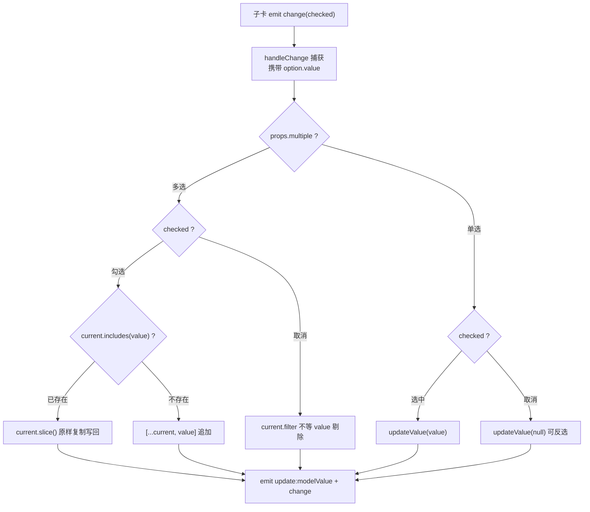

# 5-11 · CheckCard：卡片视觉与受控语义的合体

> 本篇源码坐标（均为当前工作区实态）：
> - `packages/components/check-card/src/check-card.vue`（单卡，257 行）
> - `packages/components/check-card/src/check-card.ts`（类型层，45 行）
> - `packages/components/check-card/src/check-card-group.vue`（组，149 行）+ `check-card-group.ts`（33 行）
> - 样式：`packages/theme/src/components/check-card.css`（180 行）、`check-card-group.css`（5 行）
> - 测试与夹具：`packages/components/check-card/__tests__/check-card.spec.ts`（233 行）、`tests/types/fixtures/check-card.ts`（84 行）
> - 对照组：`packages/components/checkbox/src/checkbox.vue`、`packages/theme/src/components/card.css`

上一篇 5-10 拆完 Card 的结构化插槽约定，本篇回到"卡片"这个词——但这次它要承担语义了。本篇回答的核心问题只有一句：**卡片视觉与受控语义如何合体？**

先复述我对这个问题的理解。CheckCard 是 Card 与 Checkbox 两个世界的杂交：它长着一张卡的脸（边框、留白、hover 抬升、阴影层次），却有一颗 checkbox 的心（checked 状态、v-model 契约、禁用语义、可访问性角色）。"合体"的难点不在两边各自怎么做——Card 的视觉 5-10 已经拆过，checkbox 的受控语义 4-04 已经拆过——而在**冲突消解**：卡片自身的 hover/click 反馈（视觉自洽的世界）与受控 checked 状态（props 派生的世界）会在同一条边框、同一次点击上短兵相接。谁说了算？点击之后视觉能不能先动？hover 的强调会不会冲掉选中的强调？整卡可点与卡内嵌套交互（卡角上一个"查看详情"按钮）怎么分流？单卡用得好好的 v-model，凑成一组后值形态还要从布尔变单值再变数组。

本库的答案是四个字：**纯受控消化**。`check-card.vue` 全文没有一个内部状态 ref，选中与否永远是 `props.modelValue` 的镜像；点击只是"申请"，批准权在父组件；视觉三档（静默/hover/选中）用 color-mix 配方排好优先级；嵌套交互用事件分流隔离。group 则不提供协议、不注册子项，做一个纯粹的"值翻译器"。我们把两个 vue、两个 ts、两份 CSS、一份 233 行的测试逐段读完，顺手把 5-07 留下的那句预言兑现——它当时说："下次要写 check-card-group 或新的复合组件时，先问一句：子项之间有没有模型协调？"

## 一、先把"合体"拆成四对冲突

动手读码前，把"合体难"具体化成四对可验证的冲突，后文逐一对账：

1. **点击反馈 vs 状态归属**。卡片是视觉动物，点击要有反馈；受控组件是纪律动物，视图状态必须来自 props。如果组件内部偷偷翻一个布尔"先让 UI 动起来"，受控契约就破了。实码答案在第三节：`check-card.vue` 零内部状态，`handleToggle` 只 emit。
2. **hover 强调 vs 选中强调**。两者的视觉武器是同一个——边框。实码答案在第五节：三档 color-mix 配方 + 一处值得如实记录的级联细节。
3. **整卡可点 vs 卡内交互**。卡片右上有真实的 `<button>`（extra），点它不能触发选中。实码答案在第四节：`@click.stop` + 双轨事件；但键盘侧有一处未收口的毛边，也会如实记下。
4. **单卡布尔 vs 组值形态**。单卡 `modelValue: boolean`；组里要么是单值（可反选，`null` 表示没选），要么是数组。实码答案在第六节：group 做值的翻译器，卡片对组零感知。

还有一个背景板要交代：本库表单控件的惯用法是"纯受控 + 副作用 emit 链"（4-04 的地层结论——`input` 连"非受控半边"都没实现，真正的双模活在浮层体系里）。CheckCard 站在纯受控阵营，这与"状态必须可由外部完全推导"的卡片选择场景严丝合缝：选中态几乎总要进表单数据流或业务状态库，内部兜底反而制造两个事实源。

## 二、类型层：45 行声明里的两个世界

先读 `packages/components/check-card/src/check-card.ts` 全文。45 行里能同时看到 Card 世界（外观碎片）与 Checkbox 世界（值语义）的成分：

```typescript
// packages/components/check-card/src/check-card.ts:1-45（全文）
import type { ComponentSize } from "xiaoye-primitives";
import type { AvatarFit, AvatarShape } from "../../avatar";
import type { TagProps } from "../../tag";

export interface CheckCardAvatar {
  text?: string;
  icon?: string;
  src?: string;
  alt?: string;
  srcSet?: string;
  fit?: AvatarFit;
  shape?: AvatarShape;
  size?: number | ComponentSize;
}

export interface CheckCardTag {
  text: string;
  props?: TagProps;
}

export interface CheckCardProps {
  modelValue?: boolean;
  size?: ComponentSize;
  disabled?: boolean;
  title?: string;
  description?: string;
  extra?: string;
  avatar?: CheckCardAvatar;
  tag?: string | CheckCardTag;
  ariaLabel?: string;
}

export interface CheckCardSlotProps {
  checked: boolean;
  disabled: boolean;
  title: string;
  description: string;
  extra: string;
  avatar?: CheckCardAvatar;
  tag?: string | CheckCardTag;
}

export type CheckCardChangeHandler = (checked: boolean) => void;
export type CheckCardExtraHandler = () => void;
```

三个观察点。

**第一，`CheckCardProps` 是"值语义 3 件 + 外观碎片 5 件 + 可达性 1 件"。** `modelValue`/`disabled`/`size` 是 checkbox 世界的成员（`size` 是全库统一的 `ComponentSize` 档位）；`title`/`description`/`extra`/`avatar`/`tag` 是 Card 世界的成员——注意 `avatar` 的形状（`CheckCardAvatar`）直接从 `../../avatar` 借了 `AvatarFit`/`AvatarShape` 两个字段类型，`tag` 则允许"纯字符串"或"文字 + TagProps"两态。**跨组件借字段是本库类型层的惯用法**（5-07 拆过 avatar-group 借 tooltip 的 `placement`），借来的类型让组合组件的内嵌物与被嵌组件的真实能力永远同步：avatar 组件哪天给 `fit` 加新枚举值，check-card 的类型面零改动跟上。

**第二，`modelValue?: boolean` 是可选的，但组件没有给"未绑定"留任何逃生门。** 类型上可缺省（配合 `withDefaults` 的 `false`），运行时却是纯受控：不绑 `v-model` 时点击卡片只会让事件飞出去，视图纹丝不动。这符合 4-04 的 taxonomy——浮层组件的 `modelValue` 可选是因为有内部状态源兜底（`use-floating-visibility` 的哨兵协议），而 check-card 没有状态源，可选缺省只是 TypeScript 礼貌，不是双模承诺。

**第三，一处诚实的双源账目：`CheckCardSlotProps` 导出了，但全仓零消费。** `check-card.vue:32-78` 的 `defineSlots` 把同一个作用域形状**手写了五遍**（avatar/title/tag/description/extra 五个插槽各来一份 10 行的对象类型），而不是引用 `CheckCardSlotProps` 收敛；这个类型走到包根导出链上（`packages/components/check-card/index.ts:34` 导出、`packages/components/exports.ts:15` 抬进 `xiaoye-components`）之后，搜遍仓库连类型夹具 `tests/types/fixtures/check-card.ts` 都没有取用它——导出面比消费面宽了一格。五遍手写与一份导出形状当前逐字段一致，但它们是两份需要人工同步的账——将来给插槽作用域加字段时，要么记得改六处，要么把 `defineSlots` 收敛成 `Record<string, (scope: CheckCardSlotProps) => unknown>` 的映射写法。如实记账，留待重构。

## 三、单卡引擎：纯受控的三行切换链

进入 `check-card.vue` 的 script 主体。257 行的 SFC，script 占前 170 行，没有任何 `ref`——全部状态都是 props 的派生。先看派生层与类名层（80-118 行），这是视觉与语义合体的第一现场：

```vue
<!-- packages/components/check-card/src/check-card.vue:80-126 -->
const ns = useNamespace("check-card");
const { size: globalSize } = useConfig();
const mergedSize = computed(() => props.size ?? globalSize.value);

const scope = computed(() => ({
  checked: props.modelValue,
  disabled: props.disabled,
  title: props.title,
  description: props.description,
  extra: props.extra,
  avatar: props.avatar,
  tag: props.tag
}));

const hasAvatar = computed(
  () =>
    Boolean(slots.avatar) ||
    Boolean(
      props.avatar &&
        (props.avatar.text ||
          props.avatar.icon ||
          props.avatar.src ||
          props.avatar.srcSet)
    )
);
const hasTitle = computed(() => Boolean(slots.title) || Boolean(props.title));
const hasTag = computed(() => Boolean(slots.tag) || Boolean(props.tag));
const hasDescription = computed(() => Boolean(slots.description) || Boolean(props.description));
const hasExtra = computed(() => Boolean(slots.extra) || Boolean(props.extra));
const hasHeader = computed(() => hasTitle.value || hasTag.value || hasExtra.value);

const cardClasses = computed(() => [
  ns.base.value,
  mergedSize.value ? `${ns.base.value}--${mergedSize.value}` : "",
  ns.is("checked", props.modelValue),
  ns.is("disabled", props.disabled),
  ns.is("with-avatar", hasAvatar.value),
  ns.is("with-description", hasDescription.value)
]);

const indicatorIconSizeMap = Object.freeze({
  sm: 14,
  md: 16,
  lg: 18
}) as Readonly<Record<string, number>>;

const indicatorIconSize = computed(() => indicatorIconSizeMap[mergedSize.value] ?? 16);
```

**`cardClasses`（111-118 行）就是"合体"的类名层落点。** 六个类名各司其职：基名、尺寸修饰、`is-checked`（checkbox 语义）、`is-disabled`、`is-with-avatar`/`is-with-description`（布局派生，通知 CSS 内容形状变化）。注意 `is-checked` 的判据是 `props.modelValue` 本身，不是任何内部镜像——**选中态是派生计算而非本地状态**，这正是 4-04 说"本库表单控件的视图状态永远从 props 派生"的标准姿势。

`hasAvatar`（94-104 行）值得停一停：它判断的不是"props.avatar 存在"，而是"插槽存在 **或** avatar 对象带了至少一个实际渲染源（text/icon/src/srcSet）"。防的是 `{}` 这种空对象——传了 `:avatar="{}"` 时 `hasAvatar` 为假，布局不预留头像位。而 `hasTitle` 等四个都是"插槽或 prop"的二元或：**插槽的存在本身就是一种内容声明**，哪怕插槽渲染出空字符串，布局也会按"有标题"处理。这是结构化插槽组件的通用取舍（5-10 的主题）：检测粒度停在"声明了没有"，不深入"渲染出了什么"——后者要么侵入 vnode，要么引入测量，两头都不划算。

`indicatorIconSizeMap`（120-124 行）是 5-07 见过的老朋友：`Object.freeze` 防运行时篡改 + `as Readonly<Record<...>>` 补索引签名的"冻结查表"防呆，与 avatar 的图标尺寸表同款写法。查表落空时 `?? 16` 兜底（`mergedSize` 可能是组件没覆盖的档位）。

再看合体的第二现场——切换链。三个事件处理器（128-169 行）连同两个 tag 解析器全部贴出：

```vue
<!-- packages/components/check-card/src/check-card.vue:128-169 -->
function resolveTagText(tag: string | CheckCardTag | undefined) {
  if (!tag) {
    return "";
  }

  return typeof tag === "string" ? tag : tag.text;
}

function resolveTagProps(tag: string | CheckCardTag | undefined) {
  if (!tag || typeof tag === "string") {
    return undefined;
  }

  return tag.props as Partial<TagProps> | undefined;
}

function handleToggle() {
  if (props.disabled) {
    return;
  }

  const nextValue = !props.modelValue;
  emit("update:modelValue", nextValue);
  emit("change", nextValue);
}

function handleKeydown(event: KeyboardEvent) {
  if (event.key !== "Enter" && event.key !== " ") {
    return;
  }

  event.preventDefault();
  handleToggle();
}

function handleExtraClick() {
  if (props.disabled) {
    return;
  }

  emit("extra");
}
```

`handleToggle`（144-152 行）是全组件的心脏，**9 行里浓缩了纯受控的全部纪律**：

1. **守卫只有 `disabled` 一条。** 没有"值未变"守卫——toggle 语义下翻转值永远"有变化"；没有 radio 那种"已选中则吞掉"——toggle 的意义就是翻转已选中的卡。守卫越少，语义越纯。
2. **`const nextValue = !props.modelValue`——计算目标值，然后只做一件事：emit。** 没有内部 ref 落库，没有"先翻 UI 再说"的乐观更新。如果父组件不接 `update:modelValue`，这次点击在视图上什么都不留。这是把 4-09 说过的"子项的选中态永远是对当前值的派生"推到了极限：**连"值变更"本身也只是请求，不是结果**。
3. **`update:modelValue` 与 `change` 同步连发，中间没有 `await nextTick()`。** 对照 radio-group 的 `changeValue`（update → nextTick → change，4-09 第三节的五步纪律），这里是刻意的简化：radio 的 change 监听者经常是表单校验器，要等渲染落定再校验；而 check-card 的 `change` 载荷自带目标布尔，监听者读载荷即可自洽，**不需要回读渲染态**——"载荷自洽"替代了"时序保证"。纪律没有丢，是换了承载方式。

`handleKeydown`（154-161 行）与 `handleExtraClick`（163-169 行）分别服务第四节的可达性协议与事件分流，先按下，两个 `resolveTag*`（128-142 行）则是 `tag?: string | CheckCardTag` 两态类型的运行时拆解：字符串走纯文字，对象走 `text + props` 展开给内嵌的 `XyTag`。

现在把受控切换的完整数据流画出来——单卡与 group 两条泳道并排，这是本篇的主图：

```mermaid
flowchart TD
    subgraph S["单卡模式：自治受控"]
        U1["用户 click / Enter / Space"] --> T1["handleToggle<br/>守卫: disabled?"]
        T1 -->|"nextValue = !modelValue"| E1["emit update:modelValue + change<br/>同步双发, 零内部状态"]
        E1 --> P1["父组件 v-model 写回"]
        P1 -->|"props.modelValue 回流"| C1["cardClasses 重算<br/>is-checked 类名"]
        C1 --> V1["check-card.css 选中态视觉<br/>brand 52% 边框 + soft 32% 底"]
    end
    subgraph G["group 模式: 受管翻译"]
        U2["用户点击某张卡"] --> T2["子卡 handleToggle<br/>emit change(checked)"]
        T2 --> H["group handleChange<br/>multiple ? 数组归并 : 值或 null"]
        H --> E2["group emit update:modelValue + change"]
        E2 --> P2["页面 v-model"]
        P2 -->|"modelValue 回流"| GC["getChecked(option.value)<br/>逐卡派生布尔"]
        GC -->|"model-value 下发"| C2["对应子卡 is-checked"]
    end
```



两条泳道的形状差就是第六节的预告：单卡泳道里"翻译"发生在父组件（v-model 写回布尔）；group 泳道里翻译上移到 group（布尔流转成单值/数组），**子卡对 group 的存在零感知**。

## 四、可达性：role="checkbox" 的手写协议

卡片视觉与表单语义合体，最棘手的一块是可达性。看模板根节点（172-185 行）：

```vue
<!-- packages/components/check-card/src/check-card.vue:172-185 -->
<template>
  <div
    :class="cardClasses"
    :tabindex="props.disabled ? -1 : 0"
    role="checkbox"
    :aria-checked="props.modelValue"
    :aria-disabled="props.disabled || undefined"
    :aria-label="props.ariaLabel || props.title || 'check-card'"
    @click="handleToggle"
    @keydown="handleKeydown"
  >
    <div class="xy-check-card__indicator" aria-hidden="true">
      <XyIcon icon="mdi:check" :size="indicatorIconSize" />
    </div>
```

一个 `div` 承担了完整的 checkbox 语义：`role="checkbox"` 声明角色，`aria-checked` 直绑 `props.modelValue`（状态语义与视觉类名同源），`aria-disabled` 用 `|| undefined` 的技巧做到"未禁用时不输出属性"（`aria-disabled="false"` 与"无此属性"对读屏器不等价，前者反而画蛇添足），`tabindex` 在禁用时归 `-1` 把卡片摘出 Tab 序列。`aria-label` 有三级兜底链：显式 `ariaLabel` → `title` → 字面量 `'check-card'`——永远不给读屏器留空白。右上角的勾选指示器 `aria-hidden="true"`（183 行）：勾图标是纯装饰，选中语义全权由根节点的 `aria-checked` 表达，**视觉状态与语义状态是两套通道、一个数据源**。

这和本库 checkbox 的做法是两条路。对照 `packages/components/checkbox/src/checkbox.vue:123-141`：

```vue
<!-- packages/components/checkbox/src/checkbox.vue:123-141 -->
<template>
  <label :class="compKls">
    <span :class="spanKls">
      <input
        :id="inputId"
        class="xy-checkbox__original"
        type="checkbox"
        :name="currentName"
        :checked="isChecked"
        :value="actualValue"
        :disabled="mergedDisabled"
        :tabindex="tabIndex"
        :indeterminate="props.indeterminate"
        :aria-label="props.ariaLabel"
        :aria-controls="props.ariaControls"
        :aria-checked="props.indeterminate ? 'mixed' : isChecked"
        @focus="isFocused = true"
        @blur="isFocused = false"
        @change="handleChange"
      />
      <span class="xy-checkbox__inner" />
```

原生 `<input type="checkbox">` 的可达性是浏览器白送的：聚焦、键盘、`aria-checked`（还支持 `mixed` 半选态）全部内建，组件只管把自定义视觉画在 `__inner` 上、把原生 input 藏起来。**check-card 为什么不走这条路？** 因为卡片是富内容容器：头像、标签、描述、五个作用域插槽，还有一个真实的 `<button>`（extra）。原生 input 覆盖层的方案（EP checkbox 的路数：input 平铺 + `__inner` 画皮）在富内容上会撞墙——覆盖层挡住 extra 按钮的点击，或者 z-index 治理变成玄学。于是本库选择了"div + 手写协议"：角色、状态、键盘三样全手工。

手写的代价立刻可见。看 `handleKeydown`（154-161 行）：Enter 与 Space 都要自己接，`event.preventDefault()` 防止 Space 滚动页面。**但这里有一处必须如实记录的毛边**：监听器挂在根 div 上，没有过滤事件来源。卡内的 extra 按钮是真实可聚焦元素——当焦点在按钮上按下 Enter（或 Space）时，keydown 会冒泡到根节点，`handleKeydown` 照样 `preventDefault()` 并 `handleToggle()`。而 `preventDefault` 在冒泡阶段取消的是**事件目标（按钮）的默认行为**——按钮的 Enter 激活（keydown 触发 click）与 Space 激活（keyup 触发 click，keydown 被取消后连带失效）都会被吞掉。结果是：**键盘用户聚焦 extra 按钮后按 Enter，触发的是卡片翻转而不是 extra 事件，extra 在纯键盘路径下不可达**。单测锁定的是鼠标路径（`check-card.spec.ts:66-78` 用 `trigger("click")`），键盘侧无用例覆盖。收口方式也简单：`handleKeydown` 加一句 `if (event.target !== event.currentTarget) return;`（或模板改 `@keydown.self`）。这不是致命伤——extra 的核心交互在鼠标与触屏路径完好——但它是"手写可达性"要交的税的实例：原生 input 白送的东西，手工协议每一项都要自己防漏。

在毛边之外，这个选型有一个反直觉的正确性：**`role="checkbox"` 在 group 的单选模式下依然是对的**。直觉上"单选"该用 `role="radio"`，但 WAI-ARIA 的 radio 语义不允许取消选中（选中项不可再点掉），而 check-card-group 的单选恰恰支持反选（点已选中的卡 → 值变 `null`，第六节实证）——**可反选的单选，语义上就是一组互斥约束下的 checkbox**。角色跟着行为走而不是跟着"单选/多选"的标签走，这是 ARIA 选型的正确姿势。

事件分流也在这段模板里。extra 按钮（246-254 行）是真实 `<button type="button">`，`@click.stop="handleExtraClick"`——`.stop` 截断了冒泡，根节点的 `@click="handleToggle"` 收不到这次点击，于是"点 extra 不选中"有了结构保证。`handleExtraClick` 里还有一道 `disabled` 守卫（163-169 行），与按钮自身的 `:disabled` 属性双保险：属性拦鼠标，守卫拦程序化触发。`extra` 事件与 `update:modelValue`/`change` 并列为第三条对外通道——**选中语义与动作语义分流**，父组件可以"查看详情"而不惊动选中状态。

## 五、视觉层：check-card.css 的三档推进与六件套账单

视觉合体的另一半在 `packages/theme/src/components/check-card.css`。先看基座与前两个交互态（1-35 行）：

```css
/* packages/theme/src/components/check-card.css:1-35 */
.xy-check-card {
  position: relative;
  display: flex;
  gap: 16px;
  width: 100%;
  min-width: 0;
  padding: 18px;
  border: 1px solid color-mix(in srgb, var(--xy-border-subtle) 84%, var(--xy-border));
  border-radius: var(--xy-radius-lg);
  background: color-mix(in srgb, var(--xy-bg-floating) 98%, var(--xy-bg-subtle));
  box-shadow: 0 0 0 1px color-mix(in srgb, var(--xy-bg-floating) 16%, transparent);
  cursor: pointer;
  transition:
    border-color var(--xy-transition-duration-fast) var(--xy-transition-timing),
    box-shadow var(--xy-transition-duration-fast) var(--xy-transition-timing),
    background-color var(--xy-transition-duration-fast) var(--xy-transition-timing),
    transform var(--xy-transition-duration-fast) var(--xy-transition-timing);
}

.xy-check-card:focus-visible {
  outline: none;
  border-color: color-mix(in srgb, var(--xy-brand) 36%, var(--xy-mix-light));
  box-shadow:
    0 0 0 1px color-mix(in srgb, var(--xy-brand) 18%, transparent),
    0 4px 10px color-mix(in srgb, var(--xy-text-heading) 5%, transparent);
}

.xy-check-card:hover:not(.is-disabled),
.xy-check-card:focus-visible:not(.is-disabled) {
  border-color: color-mix(in srgb, var(--xy-brand) 16%, var(--xy-border));
  box-shadow:
    0 0 0 1px color-mix(in srgb, var(--xy-brand) 12%, transparent),
    0 4px 10px color-mix(in srgb, var(--xy-text-heading) 5%, transparent);
  transform: translateY(-1px);
}
```

基座与 `card.css` 的血缘一眼可辨：`card.css:6-8` 的边框是 `border-subtle 92% + border`、底色 `bg-floating 99% + bg-subtle`，这里是 84% 与 98%——**同一套 color-mix 配方、更浅的配比**，"卡片视觉"的血脉就是这几行配比差。而基座里加进来的第一笔"表单语义"是 `cursor: pointer`（12 行）——一张卡从"可看"变成"可点"，最先动手的往往不是 JS 而是这一行。

然后是本篇考据的正面回答：**选中态视觉消费状态色六件套了吗？** 消费了，但只消费三件。看选中与禁用段（52-64 行）：

```css
/* packages/theme/src/components/check-card.css:37-64 */
.xy-check-card--sm {
  gap: 12px;
  padding: 14px;
}

.xy-check-card--md {
  gap: 16px;
  padding: 18px;
}

.xy-check-card--lg {
  gap: 18px;
  padding: 22px;
}

.xy-check-card.is-checked {
  border-color: color-mix(in srgb, var(--xy-brand) 52%, var(--xy-border));
  background: color-mix(in srgb, var(--xy-brand-soft) 32%, var(--xy-bg-floating));
  box-shadow:
    0 0 0 1px color-mix(in srgb, var(--xy-brand) 14%, transparent),
    0 4px 10px color-mix(in srgb, var(--xy-text-heading) 5%, transparent);
}

.xy-check-card.is-disabled {
  opacity: 0.62;
  cursor: not-allowed;
  transform: none;
}
```

选中态的配方是"**soft 底 + 边框强调**"：边框走 `--xy-brand` 52% 混 `--xy-border`，底色走 `--xy-brand-soft` 再稀释到 32% 混 `--xy-bg-floating`。对照 3-02 第四节定下的六件套契约（`{base, hover, active, soft, soft-hover, text}`），这个文件消费了品牌族的 **base（边框 52%/14%、指示器实底）、hover（extra 悬停色，171-175 行）、soft（选中底色原料）** 三件；`active`、`soft-hover`、`brand-border`、`brand-contrast` 四个槽零消费（全文件 token 清单：`border-subtle`、`border`、`radius-lg`、`bg-floating`、`bg-subtle`、`brand`、`brand-soft`、`brand-hover`、`mix-light`、`text-heading`、`text-secondary`、`radius-pill`、`font-weight-semibold`、`transition-duration-fast`、`transition-timing`）。这符合六件套的使用说明书——soft 自带"浅色衬底"语义，正是卡片选中态的用料；active 槽的"按下瞬间变色"对卡片这种大面积按压不适用（按下不该比选中更显眼）。注意 soft 到成品的距离：`soft 32% + bg-floating` 是**配方的配方**——令牌给出原料色，组件记录自己的稀释比，两层数值都留在各自该在的层，可追溯性没有断（这正是 3-02 强调的纪律：比例补偿留在派生环节，不回灌令牌）。双主题下这层二次配方也是自动适配的：`--xy-brand-soft` 亮值为 `rgba(83, 58, 253, 0.07)`、暗值为 `rgba(102, 94, 253, 0.15)`（`packages/xiaoye-primitives/src/theme/tokens.css:124,294`），data-theme 切换时选中底色的强度差由令牌层扛，组件配方一字不改。

边框的**三档推进**值得单独立一条：静默档 `border-subtle 84%`（8 行）→ hover 档 `brand 16%`（30 行）→ 选中档 `brand 52%`（53 行）。与 3-02 拆过的 `button.css` plain 形态"16% → 22% → 28%"三档推进是同一只手笔——用 color-mix 在交互维度上做**同族渐强**，而不是三套硬编码色值。focus 档（22 行）混的对手是 `--xy-mix-light` 而非 `--xy-border`，比 hover 档（36%）更亮又比选中档含蓄，是键盘焦点的专属配方。

**级联细节（如实记录）：hover 排除了 `is-disabled`，没排除 `is-checked`。** `:hover:not(.is-disabled)` 的特异性（0,3,0）高于 `.is-checked`（0,2,0），所以选中卡被 hover 时，边框会从选中档（brand 52%）回落到 hover 档（brand 16%）——单看边框，"强调"被稀释了；但 hover 未声明 `background`，soft 32% 的选中底色保持不变，`translateY(-1px)` 的抬升照常。两种解读都成立：可以读作刻意——hover 的职责是统一表达"可点"，不该被选中态劫持；也可以读作毛边——选中的边框强调理应压过 hover。要收口的话，给 hover 选择器追加 `:not(.is-checked)`，或为 `.is-checked:hover` 补一档不低于 52% 的配方即可。本篇把它记为"有待产品拍板的开放细节"，不代作结论——这正是逐行读 CSS 的价值：级联的每一档都有作者，也都要有人负责。

指示器（66-89 行）是选中语义的视觉锚点：

```css
/* packages/theme/src/components/check-card.css:66-89 */
.xy-check-card__indicator {
  position: absolute;
  top: 14px;
  right: 14px;
  display: inline-flex;
  align-items: center;
  justify-content: center;
  width: 24px;
  height: 24px;
  border: 1px solid color-mix(in srgb, var(--xy-border-subtle) 84%, var(--xy-border));
  border-radius: var(--xy-radius-pill);
  color: transparent;
  background: color-mix(in srgb, var(--xy-bg-floating) 99%, var(--xy-bg-subtle));
  transition:
    border-color var(--xy-transition-duration-fast) var(--xy-transition-timing),
    background-color var(--xy-transition-duration-fast) var(--xy-transition-timing),
    color var(--xy-transition-duration-fast) var(--xy-transition-timing);
}

.xy-check-card.is-checked .xy-check-card__indicator {
  border-color: var(--xy-brand);
  color: white;
  background: var(--xy-brand);
}
```

未选中时 `color: transparent`——勾图标的字形**隐身但占位**，24px 的圆形轮廓始终在那里预告"这里可以被选中"；选中时边框与底色同步转正为 `--xy-brand`，勾以反白色浮现。一次 transition 驱动三个属性（边框、底色、字色），翻转是三线同步的。但这里藏着本篇第二处如实账目：**87 行的 `color: white` 是硬编码**，而令牌层明明有 `--xy-brand-contrast: #ffffff`（`tokens.css:127` 亮、`:297` 暗）——只是搜遍 `packages/theme` 没有任何组件消费它（3-02 复核时发现的 `-text` 槽零消费是同款故事：契约预留位先于消费存在）。对单色白底勾而言 `white` 与 `brand-contrast` 当前同值，视觉零差异；可一旦暗色主题想给品牌色上的反白字调一点色温，这个字面量就是漏网之鱼。毛边等级：低。账要记在令牌消费清单上。

最后是布局工艺的三处细节，一并贴出（123-134 与 149-179 行）：

```css
/* packages/theme/src/components/check-card.css:117-134 */
.xy-check-card__header-main {
  display: flex;
  gap: 12px;
  align-items: flex-start;
  min-width: 0;
  flex: 1;
  /* 右侧预留 extra + gap，不要撑满导致挤压 extra 到 indicator 区域 */
  max-width: 65%;
}

.xy-check-card__header-text {
  display: flex;
  flex-wrap: wrap;
  gap: 8px 10px;
  align-items: center;
  min-width: 0;
  flex: 1;
}
```

```css
/* packages/theme/src/components/check-card.css:155-179 */
.xy-check-card__extra {
  position: absolute;
  top: 14px;
  right: 46px;
  display: inline-flex;
  gap: 6px;
  align-items: center;
  padding: 0;
  border: none;
  color: var(--xy-brand);
  font: inherit;
  line-height: 1;
  background: transparent;
  cursor: pointer;
}

.xy-check-card__extra:hover:not(:disabled),
.xy-check-card__extra:focus-visible:not(:disabled) {
  color: var(--xy-brand-hover);
  outline: none;
}

.xy-check-card__extra:disabled {
  cursor: not-allowed;
}
```

`header-main` 的 `max-width: 65%` 配着一行罕见的设计注释（123 行）：右侧要给 indicator（right 14px 处 24px 宽）和 extra（right 46px）留出绝对定位的席位，header 文本若撑满就会把 extra 挤进 indicator 的领地。`__extra` 的 `right: 46px` 正是与 indicator 的 14 + 24 + 8 对齐的算术。`font: inherit` 让按钮文字继承卡片的字号字重——一个 `<button>` 想在富文本容器里"隐形"，这行是标配。hover 色走 `--xy-brand-hover`——六件套三件消费里的最后一件在这里兑现。

## 六、group：受管的父渲染子

现在把镜头拉远。单卡是"一个值 + 一张脸"，但 check-card 的主战场是选项网格——group 才是这个组件的完整形态。先读 `check-card-group.ts` 全文（33 行）：

```typescript
// packages/components/check-card/src/check-card-group.ts:1-33（全文）
import type { ComponentSize } from "xiaoye-primitives";
import type { CheckCardProps } from "./check-card";

export type CheckCardValue = string | number;
export type CheckCardSingleValue = CheckCardValue | null;

export interface CheckCardGroupOption
  extends Omit<CheckCardProps, "modelValue" | "size" | "disabled" | "ariaLabel"> {
  value: CheckCardValue;
  size?: ComponentSize;
  disabled?: boolean;
}

export interface CheckCardGroupProps {
  modelValue?: CheckCardSingleValue | CheckCardValue[];
  options?: CheckCardGroupOption[];
  size?: ComponentSize;
  disabled?: boolean;
  multiple?: boolean;
  ariaLabel?: string;
}

export interface CheckCardGroupSlotProps {
  option: CheckCardGroupOption;
  checked: boolean;
  disabled: boolean;
}

export type CheckCardGroupChangeHandler = (
  value: CheckCardSingleValue | CheckCardValue[]
) => void;
export type CheckCardGroupExtraHandler = (option: CheckCardGroupOption) => void;
```

类型层最讲究的一手是 `CheckCardGroupOption`（7-12 行）：**从 `CheckCardProps` 上 Omit 掉四个字段再继承**——`modelValue`（选项的值由组管，改叫 `value`）、`size`/`disabled`（组级与选项级要区分，重新以更窄的语义加回）、`ariaLabel`（组的 `aria-label` 统一兜）。选项形状不是另起炉灶，而是"单卡形状减去值语义再加一个身份字段"——单卡每加一个展示 prop，选项自动获得，两份 API 面不会漂移。

`CheckCardGroupProps.modelValue` 的类型（15 行）是全组件最锋利的联合：`CheckCardSingleValue | CheckCardValue[]`——**同一个 prop，两种值形态**，由 `multiple` 布尔决定解释方式。这不是优雅的设计，而是诚实的妥协：单选要表达"没选"（`null`），多选要表达"选了哪些"（数组），硬统一成"恒为数组"会让单选用户写 `value[0]`，硬统一成标量又装不下多选。类型联合 + 运行时分支是这类"一 prop 两形态"的标准解。

再看 group 的运行时（`check-card-group.vue:29-73`）：

```vue
<!-- packages/components/check-card/src/check-card-group.vue:29-73 -->
function hasSlot(prefix: string, value: CheckCardValue) {
  return Boolean(slots[`${prefix}-${String(value)}`] || slots[prefix]);
}

function resolveSlotName(prefix: string, value: CheckCardValue) {
  const specific = `${prefix}-${String(value)}`;
  return slots[specific] ? specific : prefix;
}

function getChecked(value: CheckCardValue) {
  if (props.multiple) {
    return Array.isArray(props.modelValue) ? props.modelValue.includes(value) : false;
  }

  return props.modelValue === value;
}

function updateValue(nextValue: CheckCardValue | null | CheckCardValue[]) {
  emit("update:modelValue", nextValue);
  emit("change", nextValue);
}

function handleChange(checked: boolean, value: CheckCardValue) {
  if (props.multiple) {
    const current = Array.isArray(props.modelValue) ? props.modelValue : [];

    if (checked) {
      updateValue(current.includes(value) ? current.slice() : [...current, value]);
      return;
    }

    updateValue(current.filter((item) => item !== value));
    return;
  }

  updateValue(checked ? value : null);
}

function handleExtra(option: CheckCardGroupOption) {
  if (props.disabled || option.disabled) {
    return;
  }

  emit("extra", option);
}
```

**`getChecked`（38-44 行）与 `handleChange`（51-65 行）就是本组件版的"provide 协议"——只是它不用 provide。** 对照 4-09 的受管 group 三件套（context.ts 协议、provide 下发、子项 inject 双模），check-card-group 的对应物是：没有协议文件、没有 `provide`/`inject`、没有子项双模分支。替代品是四个纯函数：

- **下行（值 → 选中态）**：`getChecked` 把组值翻译成每张卡的布尔。多选是 `includes`（带 `Array.isArray` 防御——用户可能违背 `multiple` 传了标量），单选是 `===`。翻译发生在**渲染期的 props 绑定里**，而非子项的 computed 里。
- **上行（选中态 → 值）**：`handleChange` 把子卡发来的布尔翻转翻译回组值。多选走数组归并：`includes ? current.slice() : [...current, value]`——注意选中已存在的值时用 `slice()` 复制原样写回（防御重复输入，且保持新引用驱动响应式），未选中时 `filter` 剔除，全程不改 props、不改旧数组引用，是 4-09 总结过的"构造新数组整体写回"的标准单向数据流姿势。单选走 `checked ? value : null`——**反选成 `null`**。
- **收口**：`updateValue` 双 emit 同步连发，与单卡 `handleToggle` 同款时序纪律（载荷自洽，不要 nextTick）。
- **旁路**：`handleExtra` 做双层禁用守卫（组禁用或该选项禁用）后把**整个 option 对象**作为载荷发出——父组件拿到的不是干巴巴的 value，而是连 title/avatar 一起的完整上下文。

归并决策全图：



**单选可反选是这个 group 与 radio-group 的语义分水岭。** radio-group 的 `changeValue` 里有 `props.modelValue === value` 的重复选中守卫——点已选中的 radio 什么都不发生（4-09 第三节）；check-card-group 单选模式下点已选中的卡，值翻成 `null`。radio 的心智是"必有一个答案"，check-card 单选的心智是"可以不选"——同一个"单选"皮，两种业务语义。测试把这条分水岭钉死了（`check-card.spec.ts:133-137`）：第一次点 `cards[0]` 断言 `value` 为 `"dashboard"`，第二次点同一张卡断言 `value` 为 `null`。

然后是本篇最重要的结构事实：**group 的模板里没有 `<slot>`。** 看渲染段（76-96 行）：

```vue
<!-- packages/components/check-card/src/check-card-group.vue:76-96 -->
<template>
  <div
    :class="ns.base.value"
    role="group"
    :aria-label="props.ariaLabel || 'check-card-group'"
  >
    <XyCheckCard
      v-for="option in props.options"
      :key="String(option.value)"
      :model-value="getChecked(option.value)"
      :size="option.size ?? props.size"
      :disabled="props.disabled || option.disabled"
      :title="option.title"
      :description="option.description"
      :extra="option.extra"
      :avatar="option.avatar"
      :tag="option.tag"
      :aria-label="String(option.title || option.value)"
      @change="handleChange($event, option.value)"
      @extra="handleExtra(option)"
    >
```

对照 radio-group 的模板（`<slot>` 是子项主来源，options 只是 fallback，4-09 第 3.5 节），这里是彻底的反转：**options 是唯一来源**。组内不能手写 `<xy-check-card>` 混排——想加一张自定义卡，只能把它做成 options 里的一项，再靠插槽定制外观。每张子卡都是真 `XyCheckCard` 实例，`model-value` 被 group 算好后逐卡下发、`change` 被逐卡回收翻译——子卡保持纯受控身份，对 group **零 inject、零感知**，单独 mount 与组内 mount 走同一条代码路径。aria 侧根节点是 `role="group"`（79 行），子卡各自的 `role="checkbox"` 已在单卡层备好——组不重复声明语义，只提供可命名（80 行）的容器。子卡级 `aria-label` 由组代填为 `String(option.title || option.value)`（93 行）——options 模式的用户没有机会给单卡传 ariaLabel（类型层 Omit 掉了），组兜住这个责任。

定制子卡外观的通道是**两级插槽协议**（97-145 行）：

```vue
<!-- packages/components/check-card/src/check-card-group.vue:97-121 -->
      <template
        v-if="hasSlot('avatar', option.value)"
        #avatar="slotScope"
      >
        <slot
          :name="resolveSlotName('avatar', option.value)"
          v-bind="{ ...slotScope, option }"
        />
      </template>

      <template
        v-if="hasSlot('title', option.value)"
        #title="slotScope"
      >
        <slot
          :name="resolveSlotName('title', option.value)"
          v-bind="{ ...slotScope, option }"
        />
      </template>

      <template
        v-if="hasSlot('tag', option.value)"
        #tag="slotScope"
      >
        <slot
          :name="resolveSlotName('tag', option.value)"
          v-bind="{ ...slotScope, option }"
        />
      </template>
```

五个插槽位（avatar/title/tag/description/extra）每个都走同一套协议：`hasSlot('title', value)` 探测"通用名 `title` 或按值名 `title-vip`"是否声明；`resolveSlotName` 返回**按值名优先**的生效名。于是使用方可以"给所有卡配通用标题渲染，再给 VIP 那张单独覆盖"——两个名字、两级粒度，转发时把子卡的 `slotScope`（checked/disabled/title 等七件，见第三节 `scope` computed）展开再追加 `option`。单测的优先级断言（`check-card.spec.ts:205-232`）：通用 `title` 插槽渲染出 1 个 `.generic-title`，按值 `title-vip` 插槽同时存在——`value` 为 `vip` 的那张吃按值版，其余吃通用版。

最后是 group 的视觉贡献，全部家当 5 行（`packages/theme/src/components/check-card-group.css:1-5`）：

```css
/* packages/theme/src/components/check-card-group.css:1-5（全文） */
.xy-check-card-group {
  display: grid;
  grid-template-columns: repeat(auto-fit, minmax(240px, 1fr));
  gap: 16px;
}
```

`auto-fit` + `minmax(240px, 1fr)` 的响应式网格：空间够就平铺，不够自动换行——**布局接管是 group 存在的视觉理由**。零 provide、零协议、5 行 CSS、一个 options 循环加一套插槽转发，这个 group 的全部实现就是这些。

现在兑现 5-07 的预言并升级判据。5-07 把本库的 group 形态扩成了四象限：纯样式（space）、外观下发（button-group）、受管协议（radio/checkbox-group）、父渲染子（timeline-group、avatar-group），并留下一句判据："子项之间有没有模型协调？没有就别上注册模式。" check-card-group 的答案超出了这个判据的分辨率——**它有模型协调，却既不是受管协议也不是注册模式，而是"父渲染子 + props 直达 + 渲染期翻译"**。它为什么不用 radio-group 的 provide 协议？因为 provide 协议的核心红利是"子项来源开放"（插槽里手写任意结构也能吃协议），代价是子组件要写 inject 双模分支、协议要有独立文件与维护责任；而 check-card 的子项形态被刻意收窄为 options（富卡片手写成本高、组内必须结构统一），来源一旦收窄，**一层 props 直达就是最短路径**，inject 的"穿透任意嵌套"能力完全用不上。判据因此升级为两问：**先问子项来源是否开放——开放走 provide 协议（radio 族），收窄走父渲染子（check-card 族）；再问有没有模型协调——没有就退化成外观下发或纯样式（avatar/button/space 族）。** 四象限变决策树，check-card-group 补上了"有协调的父渲染子"这一格。

## 七、测试与类型夹具：把语义钉进 CI

233 行的 spec 用例群是这套语义的第三方证人。单卡侧四段（`check-card.spec.ts:36-95`）：

```typescript
// packages/components/check-card/__tests__/check-card.spec.ts:36-95
  it("点击卡片会派发 update:modelValue 和 change", async () => {
    const wrapper = mount(XyCheckCard, {
      props: {
        title: "成员门户"
      }
    });

    await wrapper.trigger("click");

    expect(wrapper.emitted("update:modelValue")?.[0]?.[0]).toBe(true);
    expect(wrapper.emitted("change")?.[0]?.[0]).toBe(true);
  });

  it("disabled 时不会触发切换和 extra 事件", async () => {
    const wrapper = mount(XyCheckCard, {
      props: {
        disabled: true,
        title: "只读卡片",
        extra: "查看"
      }
    });

    await wrapper.trigger("click");
    await wrapper.get(".xy-check-card__extra").trigger("click");

    expect(wrapper.classes()).toContain("is-disabled");
    expect(wrapper.emitted("update:modelValue")).toBeUndefined();
    expect(wrapper.emitted("extra")).toBeUndefined();
  });

  it("点击 extra 只派发 extra，不切换 checked", async () => {
    const wrapper = mount(XyCheckCard, {
      props: {
        title: "高级选项",
        extra: "详情"
      }
    });

    await wrapper.get(".xy-check-card__extra").trigger("click");

    expect(wrapper.emitted("extra")).toHaveLength(1);
    expect(wrapper.emitted("update:modelValue")).toBeUndefined();
  });

  it("支持键盘 Enter 和 Space 切换", async () => {
    const wrapper = mount(XyCheckCard, {
      props: {
        title: "键盘可达"
      }
    });

    await wrapper.trigger("keydown", {
      key: "Enter"
    });
    await wrapper.trigger("keydown", {
      key: " "
    });

    expect(wrapper.emitted("update:modelValue")?.map((item) => item[0])).toEqual([true, true]);
  });
```

四个用例正好对应第三、四节的三条纪律：点击双发（载荷 `true`）、禁用全吞（`update:modelValue` 与 `extra` 都 `toBeUndefined`）、extra 与选中互不串扰（"点 extra 只派发 extra"）。注意最后一个键盘用例断言的是 `[true, true]`——**不绑 v-model 连按两次，载荷都是 `true`**，因为组件无状态，每次都以 `false` 为基线取反；这条断言反过来验证了"无内部状态"：有内部状态的实现第二次会发出 `false`。

group 侧先看单选反选（99-138 行）：

```typescript
// packages/components/check-card/__tests__/check-card.spec.ts:99-138
  it("支持单选模式和取消选中", async () => {
    const value = ref<string | number | null>(null);

    const wrapper = mount(
      defineComponent({
        components: {
          XyCheckCardGroup
        },
        setup() {
          return {
            value,
            options: [
              {
                value: "dashboard",
                title: "工作台"
              },
              {
                value: "report",
                title: "报表中心"
              }
            ]
          };
        },
        template: `
          <xy-check-card-group
            v-model="value"
            :options="options"
          />
        `
      })
    );

    const cards = wrapper.findAll(".xy-check-card");

    await cards[0]?.trigger("click");
    expect(value.value).toBe("dashboard");

    await cards[0]?.trigger("click");
    expect(value.value).toBeNull();
  });
```

两次点击同一张卡、`null` 收尾——单选可反选的分水岭（对照 radio 不允许）被显式锁定。多选用例（140-182 行）走完"勾两张得 `['table', 'detail']`、勾掉一张剩 `['detail']`"的归并全程；extra 转发用例（184-203 行）断言载荷 `toMatchObject({ value: "audit", title: "审计中心" })`——收的是整个 option；插槽用例（205-232 行）钉住按值插槽优先。加上开场第一个用例（8-34 行）锁渲染完整性（尺寸类、`is-checked`、头像内嵌、tag 文案），这套 spec 把第六节归并图的每条边都走了一遍。

类型侧的守卫在 `tests/types/fixtures/check-card.ts:61-84`：

```typescript
// tests/types/fixtures/check-card.ts:61-84
const checkCardGroupProps: CheckCardGroupProps = {
  modelValue: ["dashboard"],
  options: [groupOption],
  size: "sm",
  disabled: false,
  multiple: true,
  ariaLabel: "入口选择"
};

void checkCardGroupProps;

const invalidValue: CheckCardGroupOption = {
  // @ts-expect-error value should only accept string or number
  value: true
};

void invalidValue;

const invalidSize: CheckCardProps = {
  // @ts-expect-error invalid size should be rejected
  size: "xxl"
};

void invalidSize;
```

两个 `@ts-expect-error` 把边界焊在编译期：`value: true` 被拒——`CheckCardValue` 是 `string | number`，布尔不是合法身份标识（对象身份做 key 会把 `WeakMap`、`includes` 的引用比较全带进沟里）；`size: "xxl"` 被拒——`ComponentSize` 字面量联合挡住越档。整份夹具随 `pnpm typecheck:types` 参与 CI 门禁。

## 八、EP 对比：没有 CheckCard 的世界

以 Element Plus 主线为参照，第一个事实是：**EP 没有官方 CheckCard 组件**——组件列表里查无此名，社区 issue 里有诉求，官方给的临时答案是"el-card 包 el-checkbox 自行封装"。它最接近的既有件是 `el-check-tag`（CheckTag 标签选项）：`v-model:checked` + `type` 五族状态色 + `change` 事件，语义骨架与本库 check-card 的"视觉载体 + 选中态"同源，但载体是行内标签而非卡片——没有尺寸档位、没有内容结构（title/description/avatar/tag）、没有组形态，可达性上也只是一个带点击的 span，没有 role 与键盘协议。而卡片化选择这个能力，Ant Design（ProComponents 的 CheckCard/CheckCard.Group，支持 `multiple` 与 `size`，并给出 `checked` + `defaultChecked` 的双模入口）、TDesign、Semi Design 都有正式组件——**"卡片化选择"已是中后台组件库的事实标配，EP 的缺位是生态现状**。

本库的姿态有三点差异值得记下：

1. **正式组件而非业务封装**。check-card 与 check-card-group 双双列入基础层 manifest（`packages/components/component-manifest.json:83-93`，`installExports: ["XyCheckCard", "XyCheckCardGroup"]`），走标准三入口（`index.ts` 挂 `XyCheckCard.Group` 复合引用、`exports.ts:15` 抬包根、`theme/index.css:13-14` 双样式），享有安装断言与一致性校验。
2. **纯受控而非双模**。Ant Design 的 `defaultChecked` 给了"不绑状态也能用"的兜底；本库不给——理由与 4-04 一脉相承：双模的完整实现要"内部状态源 + 哨兵判定 + 迁越协议"，为一个选择卡片引入两套事实源不值当，选择场景几乎必然进数据流。省下的是状态机，付出的是"不绑 v-model 点击无反馈"的硬约束。
3. **组形态选了 options-only**。Ant Design 的 CheckCard.Group 允许子元素式用法（`<CheckCard>` 平铺在组内）；本库收窄为 options + 两级插槽。代价是放弃了手写混排的自由，收益是值翻译逻辑（getChecked/handleChange）不必面对"来源开放"的复杂度，实现停在 149 行。

## 九、收束：合体的一页纸

把全篇压回最初的问题——卡片视觉与受控语义如何合体：

1. **语义层：纯受控零状态。** `check-card.vue` 无一个内部 ref，`handleToggle` 九行——守卫、取反、双 emit；选中态是 `props.modelValue` 的派生（`is-checked` 类名直绑），点击是请求不是结果（`check-card.vue:144-152`）。与 4-04 的"纯受控"阵营对齐，双 emit 同步连发以"载荷自洽"替代 nextTick 时序。
2. **可达性：div + 手写协议。** `role="checkbox"` + `aria-checked` 直绑 + 三级 label 兜底 + Enter/Space 键盘（`check-card.vue:173-181,154-161`）。不用原生 input 是为 extra 嵌套交互让路；代价是两处如实账目——keydown 冒泡会劫持 extra 按钮的键盘激活（测试未覆盖键盘侧），以及"可反选的单选"恰好证明 checkbox 角色比 radio 角色更正确。
3. **视觉层：三档推进 + 三件消费。** 边框 `border-subtle 84% → brand 16% → brand 52%` 的 color-mix 渐强，选中底 `brand-soft` 二次稀释 32%；六件套消费 base/hover/soft 三件；`color: white` 硬编码对上令牌层零消费的 `--xy-brand-contrast`——毛边与契约预留位都如实入账（`check-card.css:8,30,53-54,87`）。
4. **group：有协调的父渲染子。** 不 provide、不注册，`getChecked` 下行翻译、`handleChange` 上行归并（单选可反选成 `null`、多选新数组写回），options 是唯一子项来源，两级插槽协议（通用名/按值名）补定制面（`check-card-group.vue:38-96`）。4-09 的四象限扩成两问决策树。
5. **测试锁语义**：双发、禁用全吞、extra 隔离、键盘、反选、归并、插槽优先级、两个编译期拒绝——每条纪律一颗钉子。

回头看，CheckCard 的"合体"没有发明任何新机制：纯受控是 4-04 的遗产，事件分流是 `@click.stop` 的基本功，color-mix 三档是 3-02 的手笔，组归并是 4-09 的数组写回。**合体的本质是让两套既有纪律在同一张卡上互不越界**——视觉管反馈的"形"，受控管状态的"实"，边界就画在那行 `ns.is("checked", props.modelValue)` 上。

下一篇 5-12《Carousel：轮播状态机》，我们换个更热闹的舞台：轮播的 item 注册、循环索引的取模几何、自动播放定时器与用户交互的竞争——同样是"视觉之下藏着状态机"，但那一台的状态转移图会复杂得多，hover 暂停、循环边界与定时器清理的每一步都要对齐。到时见。
