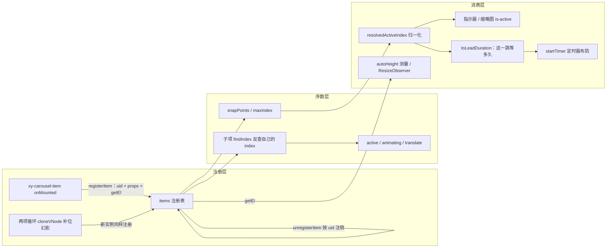
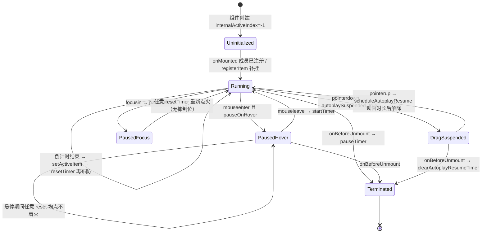

# 5-12 · Carousel：轮播状态机与定时器治理

> 本篇是"组件深潜"卷的第十二篇，也是目前为止最长的一篇深潜。核心问题只有一个：**item 注册、循环与自动播放的定时器治理**。5-04 讲注册模式时，我们曾把 carousel 当作"登记操作句柄"的对照组匆匆一瞥——那篇只引了 `carousel.vue:848-892` 的注册段和 `carousel-item.vue:222-232` 的注册动作，留了一句"注册之后的连锁反应"没有展开。本篇把这笔账还上：注册表如何驱动切换动画、循环的边界语义到底走的是位移还是幻影、以及一个 autoplay 定时器从生到死的完整治理链。

接到题目先复述一遍目标，防止写偏：carousel 是全库状态最密的组件（`carousel.vue` 1355 行、39 个 props、6 个插槽、双 emit），但它的复杂度不是均匀分布的——几何布局（slidesPerView / gap / align / peek）是"算术题"，懒加载与虚拟渲染是"窗口题"，而真正需要**状态机思维**的是三件事：一是成员的进出场（注册/注销，及其触发的全局重算）；二是激活索引的归一化管道（从 `internalActiveIndex = -1` 的初始态，到对外暴露的逻辑索引）；三是自动播放定时器的三问治理——何时启动、何时暂停、何时清理。本篇沿这三条线走，几何与虚拟渲染只在与主线交叉时带一笔，它们值得单独一篇。

## 一、先看全景：一个轮播要同时管几件事

打开 `packages/components/carousel/src/carousel.vue`，第一屏 script setup 声明了将近二十个响应式状态和六个模块级变量。这份清单本身就是组件的"体检报告"，值得整段读一遍：

```ts
// packages/components/carousel/src/carousel.vue:199-224
const ns = useNamespace("carousel");
const root = ref<HTMLElement | null>(null);
const viewport = ref<HTMLElement | null>(null);
const viewportSize = ref(0);
const internalActiveIndex = ref(-1);
const previousIndex = ref(-1);
const items = ref<import("./context").CarouselItemRegistration[]>([]);
const hover = ref(false);
const initialized = ref(false);
const dragging = ref(false);
const autoplaySuspended = ref(false);
const dragOffset = ref(0);
const dragMoved = ref(false);
const dragPointerId = ref<number | null>(null);
const dragStart = ref(0);
const heightObserver = ref<ResizeObserver | null>(null);
const progressFrame = ref<number | null>(null);
const progressPercent = ref(0);
const autoHeight = ref(0);
const thumbRefs = new Map<number, HTMLElement>();
let timer: ReturnType<typeof setTimeout> | null = null;
let autoplayResumeTimer: ReturnType<typeof setTimeout> | null = null;
let resizeObserver: ResizeObserver | null = null;
let progressStart = 0;
let progressDuration = 0;
let timerToken = 0;
```

这份清单里有几个值得停留的细节。

**第一，`items` 是注册表，从名字就看得出来它不是"插槽 children"。** 它的类型是 `CarouselItemRegistration[]`——注册对象数组，不是 vnode 数组。5-04 已经给过结论：carousel 的序数问题（谁在第几位）直接驱动几何布局与自动播放，所以它必须走"父持有成员名册"的重装路线。本篇第二节展开全貌。

**第二，`internalActiveIndex` 的初值是 `-1` 而不是 `0`。** 这不是随手写的哨兵：`-1` 表达的是"还没有任何成员注册"这个物理上不可达的状态。组件挂载时子项尚未完成注册（子组件的 `onMounted` 晚于父组件的 setup），`resolvedActiveIndex` 这个下游 computed 要靠 `-1` 来判断"现在还没有激活页"，所有的指示器高亮、动画类名、定时器节拍都在等它变成非负数。状态机的"未初始化"态，就是用这个 `-1` 表达的。

**第三，定时器句柄是普通 `let`，不是 `ref`。** `timer`、`autoplayResumeTimer`、`timerToken` 都活在响应式系统之外。这是刻意的：定时器句柄不参与任何渲染依赖——没有任何模板或 computed 需要观察"当前定时器的 id 是多少"，把它包成 ref 只会让每次赋值白白触发一轮依赖收集。Vue 社区常说的"不是所有状态都该是响应式的"，这里是全库最典型的一处注脚。真正需要被渲染层观察的是它的**结果**（`progressPercent`、`internalActiveIndex`），结果用 ref，过程用普通变量。

**第四，`dragMoved` 在当前实码中是"只写不读"的。** 我们会在后文指出这一点，先把全景看完。

这个组件对外还有两套 emit（`change: [current, previous]` 和 `update:activeIndex`）与一组 `defineExpose`（`activeIndex`、`setActiveItem`、`prev`、`next`），加上 39 个 props——其中 `duration`（动画时长，默认 400）与子项的 `duration`（该页停留时长）同名不同义，是这套 API 里最容易踩的命名坑，第五节会正面处理。

## 二、注册全貌：从 5-04 的一瞥到完整闭环

### 2.1 子侧：一句注册，一句注销

子组件端的动作 5-04 引过，本篇贴全：

```ts
// packages/components/carousel/src/carousel-item.vue:222-232
onMounted(() => {
  carousel?.registerItem({
    uid,
    props,
    getEl: () => itemRef.value
  });
});

onBeforeUnmount(() => {
  carousel?.unregisterItem(uid);
});
```

登记的三样东西定义在 `carousel/src/context.ts:4-8`：`CarouselItemRegistration { uid, props, getEl }`。uid 是 Vue 实例编号（`carousel-item.vue:16` 的 `getCurrentInstance()?.uid ?? Math.random()`，与 breadcrumb 完全同款的标准起手式）；`props` 是子项的响应式 props 对象——注意登记的是**活对象引用**，子项后来改了 `duration` 或 `autoplayDisabled`，父组件下一次读取拿到的就是新值；`getEl` 是根元素取值器，供测量（autoHeight）、观察（ResizeObserver）、滚动定位（缩略图）使用。

子侧还有一个反向依赖值得点出：**子项自己的序数不是父组件下发的，是子组件拿着 uid 去注册表反查的**：

```ts
// packages/components/carousel/src/carousel-item.vue:48-51
const index = computed(() =>
  carousel ? carousel.items.value.findIndex((item) => item.uid === uid) : -1
);
const ready = computed(() => index.value >= 0);
```

`index` 是个 computed，注册表每变化一次（不可变替换整个数组引用，5-04 讲过这个细节），所有子项的 `findIndex` 会重跑一遍。n 个子项的轮播在这里是 O(n²) 的重算，但轮播的 n 是个位数到十位数，这个量级换来的好处是**序数永远单一事实源**——父不需要在增删成员时逐个通知子项"你现在是第几位了"，子项自己看名册。模板上 `v-show="ready"`（而不是 `v-if`）则保证注册前的首帧子项就位但不可见，避免布局抖动。

### 2.2 父侧：注册不是记一笔，是六件事的触发器

父组件的 `registerItem` / `unregisterItem` 是 5-04 引过的 L848-892，本篇贴全文逐段读：

```ts
// packages/components/carousel/src/carousel.vue:848-892
function registerItem(item: import("./context").CarouselItemRegistration) {
  if (items.value.some((current) => current.uid === item.uid)) {
    return;
  }

  items.value = [...items.value, item];

  nextTick(() => {
    updateViewportSize();
    if (initialized.value && !isControlled.value && internalActiveIndex.value < 0 && items.value.length) {
      internalActiveIndex.value = resolveTargetIndex(props.initialIndex);
    }
    updateAutoHeight();
    observeVisibleItems();
    scrollActiveThumbIntoView();
    resetTimer();
  });
}

function unregisterItem(uid: number) {
  const nextItems = items.value.filter((item) => item.uid !== uid);
  if (nextItems.length === items.value.length) {
    return;
  }

  items.value = nextItems;

  if (!nextItems.length) {
    internalActiveIndex.value = -1;
    pauseTimer();
    return;
  }

  if (!isControlled.value && resolvedActiveIndex.value >= nextItems.length) {
    internalActiveIndex.value = resolveTargetIndex(nextItems.length - 1);
  }

  nextTick(() => {
    updateViewportSize();
    updateAutoHeight();
    observeVisibleItems();
    scrollActiveThumbIntoView();
    resetTimer();
  });
}
```

`registerItem` 有三处容易忽略的考究：

1. **uid 去重守卫。** 同一个实例重复注册直接返回。这在常规渲染下不会发生，但热更新（HMR）时组件可能重挂而旧实例尚未注销、或在非常规的强制重渲染下出现重复——注册表对所有"重复笔迹"免疫，靠的就是这道门。
2. **`nextTick` 推迟全部连锁反应。** 注册发生时，子项的 DOM 还没挂稳（父的 `registerItem` 在子的 `onMounted` 里被调用，但此刻同批其他子项可能尚未完成挂载），测量视口、读 offsetHeight 这类 DOM 操作必须等本轮渲染结束。六个后续动作整体排进 nextTick，是"注册时序治理"的第一层。
3. **初始索引的补挂。** `onMounted` 时如果插槽内容还没注册进来（v-if 延迟渲染、异步组件等场景），`internalActiveIndex` 停在 `-1`；`registerItem` 里的这段判断保证了"第一个成员到场时，若仍未初始化激活索引且非受控，就按 `initialIndex` 补挂"。`initialized` 标志在父组件 `onMounted`（L1132）置真，防止这行代码抢在父初始化之前跑。

`unregisterItem` 的守卫分三层：名册无此人直接返回（注销比注册多见误伤——比如两项循环的幻影实例销毁时序）；名册清空时把激活索引归位 `-1` 并**立即暂停定时器**（没有任何成员可播，定时器必须当场死掉，而不是等下一次 tick 发现没目标）；名册非空但当前激活索引越界时（非受控模式），把索引收回到"最后一个可停位"。

把"一次注册如何波及全组件"画成数据流图，后文反复引用它：



读图的要点：注册表 `items` 是唯一事实源，序数层与消费层的所有输出都是它的下游 computed；`registerItem`/`unregisterItem` 里的六个连锁动作（nextTick 中的测量、索引修正、高度、观察器、缩略图、resetTimer）就是这张图里几条边被重新求值的触发点。

### 2.3 幻影也会注册：两项循环的补位真相

这里有一个本篇要首次揭开的真相：**两项循环（`two-items-loop`）场景下，注册表里有一半是幻影。**

当 `loop` 开启、非 card、非 fade、单页视口、成员恰好只有两个时，`isTwoLengthLoop`（L254-263）为真，carousel 会用 `cloneVNode` 把两个逻辑页克隆成两个"补位幻影"，渲染在真实页之前：

```ts
// packages/components/carousel/src/carousel.vue:254-274
const isTwoLengthLoop = computed(
  () =>
    props.loop &&
    !isCardType.value &&
    !isFadeEffect.value &&
    slidesPerViewValue.value === 1 &&
    slidesPerGroupValue.value === 1 &&
    !props.centered &&
    logicalSlideCount.value === 2
);
const placeholderSlideNodes = computed(() => {
  if (!isTwoLengthLoop.value) {
    return [];
  }

  return logicalSlideNodes.value.map((node, index) =>
    cloneVNode(node, {
      key: `xy-carousel-placeholder-${index}`
    })
  );
});
```

模板里 `<PlaceholderItems />`（L1172 定义的功能组件，L1266 渲染在 `<slot />` 之前）。关键在于：这些 `cloneVNode` 出来的 vnode 是**全新的组件实例**——它们会各自走一遍 `onMounted`、各自调用 `registerItem`、各自领到新 uid。所以注册表里躺着 4 个成员：2 真 2 幻。状态机对此毫无感知，也不需要有感知——它只是把"环"从 2 扩到了 4，再用 `toLogicalIndex`（`index % logicalSlideCount`）把对外索引拉回 0/1 的逻辑域，用 `isTwoLengthVisible`（L548-554）把幻影对应的指示器藏起来。测试 `carousel.spec.ts:221-260` 钉住了这套语义：DOM 里 4 个 item、4 个指示器但只有 2 个可见、`activeIndex` 永远在 0/1 之间打转。

这给出注册模式的一个深刻注脚：**注册表的成员资格不等于"用户写下的那几行 `<xy-carousel-item>`"**。框架在渲染层做的任何手脚（克隆、补位、复用），只要最终以组件实例的形式挂载，就会进入注册表。好处是状态机可以完全无视这些手脚；代价是父组件的"成员数"语义要靠一层逻辑索引映射来修复。两项循环是全库唯一动用幻影的场景，也是这个代价的精确买单。

### 2.4 权衡一：注册模式 vs vnode 遍历——carousel 为什么不能学 timeline

上一轮考据留下的对比题：timeline 与 carousel 同为"列表型"组件，为什么 timeline 走了非注册路线？把 timeline 的实现拉出来对照就清楚了。timeline 在渲染函数里直接遍历插槽 vnode、`cloneVNode` 注入序号：

```ts
// packages/components/timeline/src/render.ts:12-43
export function flattenTimelineChildren(children?: VNodeArrayChildren) {
  const result: VNode[] = [];

  const traverse = (nodes?: VNodeArrayChildren) => {
    (nodes ?? []).forEach((child) => {
      if (Array.isArray(child)) {
        traverse(child);
        return;
      }

      if (typeof child === "string" || typeof child === "number") {
        result.push(createTextVNode(String(child)));
        return;
      }

      if (!isVNode(child)) {
        return;
      }

      if (child.type === Fragment && Array.isArray(child.children)) {
        traverse(child.children as VNodeArrayChildren);
        return;
      }

      result.push(child);
    });
  };

  traverse(children);

  return result;
}
```

vnode 遍历的好处是零时序问题：每次渲染重新数一遍 children，没有注册/注销的配对负担，没有 HMR 的重复风险，也没有"父持有子实例"的心智负担。那 carousel 为什么不用？三个硬性理由，每一个都对应注册表里的一件行李：

- **carousel 需要子项的 DOM**：autoHeight 要读 `offsetHeight`，ResizeObserver 要观察元素，缩略图要 `scrollIntoView`。vnode 拿不到已挂载的元素——`getEl` 这个行李 vnode 遍历带不了。
- **carousel 需要子项 props 的运行时值**：`toLeadDuration` 读当前页的 `duration` 决定这一跳等多久，`getNextAutoplayIndex` 读 `autoplayDisabled` 决定跳不跳。这些值在 vnode 里有，但 vnode 的 props 是"声明态"（可能是响应式对象、可能是函数调用结果），而注册表里的 `props` 是**活对象引用**，读取语义干净且可响应。
- **carousel 的序数驱动全局状态机**：成员增删要触发索引回收、几何重算、定时器重排（2.2 的六个连锁动作）。vnode 遍历的产出是"渲染这一次的快照"，没有"成员变动"这个事件边界——你很难在渲染函数里说"有成员被删了，先把越界的激活索引收回来"。

timeline 的序数只影响"点在哪条线上、是不是最后一项"这类展示语义，渲染快照够了；carousel 的序数驱动几何与定时器，需要持久的、可反查的、带 DOM 句柄的名册。**同一类问题（列表父子），序数的"杀伤力"不同，方案就不同。** 这是 5-04 的结论在两个极端样本上的落点。

## 三、激活索引的归一化管道

有了注册表，"激活索引"才有意义。这条管道从 `internalActiveIndex` 出发，到对外的 `activeIndex` 收尾，中间有两道关键的归一化闸门。先看第一道：

```ts
// packages/components/carousel/src/carousel.vue:349-377
const resolvedActiveIndex = computed(() => {
  const raw = isControlled.value ? props.activeIndex ?? -1 : internalActiveIndex.value;
  if (!items.value.length) {
    return -1;
  }

  if (props.loop && snapPoints.value.length) {
    const normalized = (raw % items.value.length + items.value.length) % items.value.length;
    return snapPoints.value.includes(normalized) ? normalized : snapPoints.value[0];
  }

  return Math.min(Math.max(raw, 0), maxIndex.value);
});

const activeIndicatorIndex = computed(() => {
  const current = resolvedActiveIndex.value;
  if (current < 0 || !snapPoints.value.length) {
    return -1;
  }

  return snapPoints.value.findIndex((point) => point === current);
});
const exposedActiveIndex = computed(() => {
  if (resolvedActiveIndex.value < 0) {
    return resolvedActiveIndex.value;
  }

  return isTwoLengthLoop.value ? resolvedActiveIndex.value % logicalSlideCount.value : resolvedActiveIndex.value;
});
```

三段各自管一件事。`resolvedActiveIndex`：受控模式直接采信 `props.activeIndex`，非受控采信内部值；loop 模式下先做**双保险取模**（`raw % len + len) % len`，负数也能正确回绕——`prev()` 从 0 跳 `-1` 时就靠它），再把取模结果对齐到 snap 点；非 loop 则 clamp 到 `[0, maxIndex]`。`activeIndicatorIndex`：物理索引 → 指示器序号的映射（多页视口下两者不同）。`exposedActiveIndex`：对外逻辑索引，唯一的作用是把两项循环的物理 0-3 折回逻辑 0-1——对使用者而言，轮播里就只有两页。

`setActiveItem` 是状态机唯一合法的迁移入口（指示器、键盘、拖拽、定时器、对外 API 全部汇到这里）：

```ts
// packages/components/carousel/src/carousel.vue:797-822
function setActiveItem(index: number | string) {
  const nextIndex = resolveTargetIndex(index);

  if (nextIndex < 0) {
    return;
  }

  const currentIndex = resolvedActiveIndex.value;
  if (nextIndex === currentIndex) {
    previousIndex.value = currentIndex;
    resetTimer();
    return;
  }

  const previous = currentIndex;
  previousIndex.value = previous;

  if (isControlled.value) {
    emit("update:activeIndex", toLogicalIndex(nextIndex));
  } else {
    internalActiveIndex.value = nextIndex;
  }

  resetTimer();
  emitChange(nextIndex, previous);
}
```

两个细节值得圈出来。其一，**同名跳转（`nextIndex === currentIndex`）不空转**：不发 change、不动索引，但会 `resetTimer`——用户点了一下"当前页"的指示器，等价于"这一页重新计时"。自动播放的节拍因此获得了一个人工同步点。其二，受控模式下状态机只**提议**（emit `update:activeIndex`），真正落库要等父组件把 prop 传回来——这是 4-04 讲过的受控/非受控双模在 carousel 里的标准落地，`resolveTargetIndex`（L760-795）则负责把"数字/名字/越界值"三种输入统一折算成合法的物理索引。

`previousIndex` 是动画层的重要输入：`carousel-item.vue:84-94` 的 `animating` computed 判定"我是活动页，或我是刚离开的上一页"——切换动画需要**两端**同时持有过渡类名，位移才会成对发生，这就是它存在的理由。

## 四、循环语义：以实码作答——位移重排，而非 clone 幻影（两项除外）

上轮考据留了一个二选一：尾→头是"回滚"（index 重置导致反向长距离滑动）还是"clone 幻影"（首尾各补一张假页）？实码的答案是第三个选项：**processIndex 位置重排**。核心在子项侧：

```ts
// packages/components/carousel/src/carousel-item.vue:19-46
function processIndex(index: number, activeIndex: number, length: number) {
  if (length <= 2) {
    return index;
  }

  const lastItemIndex = length - 1;
  const prevItemIndex = activeIndex - 1;
  const nextItemIndex = activeIndex + 1;
  const halfItemIndex = length / 2;

  if (activeIndex === 0 && index === lastItemIndex) {
    return -1;
  }

  if (activeIndex === lastItemIndex && index === 0) {
    return length;
  }

  if (index < prevItemIndex && activeIndex - index >= halfItemIndex) {
    return length + 1;
  }

  if (index > nextItemIndex && index - activeIndex >= halfItemIndex) {
    return -2;
  }

  return index;
}
```

这个函数把每个子项的"名义序数"翻译成"舞台位置序数"。逻辑是：距离激活页超过半圈的成员，被移到舞台的"另一侧"（`-1`、`length`、`+1`、`-2` 四个越界位）。效果是：当激活页在 0 时，最后一项的舞台位置是 `-1`——它就站在第一项的左边，等 `next()` 触发时，整个舞台**向左滑一格**就完成了"尾→头"，而不是反向滑过整个走廊。位移方向永远与操作方向一致，边界处没有回滚。这段算法与 Element Plus carousel-item 的 `processIndex` 明显同源（同样的 `-1 / length / +1 / -2` 四个越界位、同样的半圈阈值），属于社区反复验证过的经典解。

位置序数如何变成像素？看 `translate` computed：

```ts
// packages/components/carousel/src/carousel-item.vue:109-144
const translate = computed(() => {
  if (!carousel) {
    return 0;
  }

  if (carousel.isCardType.value) {
    const parentSize = carousel.viewportSize.value || 0;
    const delta = processedIndex.value - carousel.resolvedActiveIndex.value;

    if (inStage.value) {
      return (parentSize * ((2 - carousel.cardScale.value) * delta + 1)) / 4 + carousel.dragOffset.value;
    }

    if (processedIndex.value < carousel.resolvedActiveIndex.value) {
      return -(parentSize / 2 + 24) + carousel.dragOffset.value;
    }

    return parentSize + 24 + carousel.dragOffset.value;
  }

  if (carousel.isFadeEffect.value) {
    return 0;
  }

  const viewportSize = carousel.viewportSize.value || 0;
  const step = viewportSize > 0 ? (viewportSize - carousel.gapPx.value * (carousel.slidesPerView.value - 1)) / carousel.slidesPerView.value + carousel.gapPx.value : 0;
  const baseOffset = carousel.centered.value && viewportSize > 0
    ? (viewportSize - (viewportSize - carousel.gapPx.value * (carousel.slidesPerView.value - 1)) / carousel.slidesPerView.value) / 2
    : 0;
  const baseIndex = carousel.resolvedActiveIndex.value;
const logicalIndex = seamlessLoop.value
    ? processIndex(index.value, carousel.resolvedActiveIndex.value, carousel.items.value.length)
    : index.value;

  return baseOffset + (logicalIndex - baseIndex) * step + carousel.dragOffset.value;
});
```

最后一行是循环语义的落点：slide 模式下每个子项的位移是 `(舞台位置 - 激活位置) × 步长`，舞台位置来自 `processIndex` 的重排结果（`seamlessLoop` 为真时），所以"尾→头"只是一次普通的 +1/-1 位移，外加两个受影响成员的**瞬移重排**。测试 `carousel.spec.ts:262-303` 精确钉住了这个行为：初始索引 2 时，`translateX(600px)` 的是第 0 项（被重排到 `length` 位）、`translateX(-600px)` 的是第 1 项；`next()` 之后 `activeIndex` 变 0、第 0 项归位 `translateX(0px)`、第 2 项跳到 `-600px`，且 0 和 2 都带 `is-animating`——首尾两个成员在这一跳里各移动一格，中段成员原地不动。（顺带一提，L139 的 `const logicalIndex` 缩进明显脱轨，属排版瑕疵不影响语义，如实记录。）

**权衡二：transform 位移动画 vs 重排 vs v-if 重挂。** 这套方案的成立，依赖样式层的三个配合，来自 `packages/theme/src/components/carousel.css`：

```css
/* packages/theme/src/components/carousel.css:473-505 */
.xy-carousel__item {
  position: absolute;
  inset: 0;
  width: 100%;
  height: 100%;
  overflow: hidden;
  border-radius: var(--xy-carousel-radius);
  z-index: 1;
  backface-visibility: hidden;
  will-change: transform;
}

.xy-carousel__item.is-active {
  z-index: 2;
}

.xy-carousel__item.is-dragging,
.xy-carousel__item--card.is-dragging {
  transition: none !important;
}

.xy-carousel__item.is-animating {
  transition: transform var(--xy-transition-duration-slow) cubic-bezier(0.22, 0.61, 0.36, 1);
}

.xy-carousel__item--fade {
  transition-property: opacity;
}

.xy-carousel__item--card {
  width: 50%;
  transition: transform var(--xy-transition-duration-slow) cubic-bezier(0.22, 0.61, 0.36, 1);
}
```

三件事：`position: absolute + inset: 0` 让所有成员**叠在同一个舞台原点**，位移是纯粹的 transform 合成，不触发重排；`will-change: transform` 提前把成员提升到合成层；`is-animating` 只给动画两端挂 transition（`previousIndex` 的作用就在这），其余成员重排时**瞬移不动画**——这正是"幻影般"的重排得以隐藏的关键。对照另一条路线：首尾 clone 幻影（Swiper 的 loop 模式）实现更直观，但要处理克隆节点的交互穿透、动态增删成员时的克隆同步；而纯 index 重置方案最省事，代价是边界处一整条走廊的反向滚动。processIndex 重排是三者里工程平衡最好的：零克隆、零回滚，代价只是每帧多算几个成员的舞台位置。fade 效果则完全脱离位移通道（`translate` 恒为 0），切到 opacity/zIndex 二维博弈——同一套状态机，两条动画通道。

## 五、定时器治理三问（本篇题眼）

现在进入题眼。autoplay 定时器的治理，本库实码给出的答案可以压成三问三答。先看主循环：

```ts
// packages/components/carousel/src/carousel.vue:660-700
function startTimer() {
  if (!props.autoplay || items.value.length <= 1 || timer || dragging.value || autoplaySuspended.value) {
    return;
  }

  const delay = toLeadDuration(resolvedActiveIndex.value < 0 ? 0 : resolvedActiveIndex.value);
  if (delay <= 0) {
    return;
  }

  const runToken = ++timerToken;

  if (props.showProgress) {
    progressDuration = delay;
    progressStart = performance.now();
    progressPercent.value = 0;
    progressFrame.value = requestAnimationFrame(updateProgressFrame);
  }

  timer = setTimeout(() => {
    timer = null;

    if (runToken !== timerToken || dragging.value) {
      return;
    }

    const target = getNextAutoplayIndex();
    if (target !== resolvedActiveIndex.value) {
      setActiveItem(target);
    } else {
      resetTimer();
    }
  }, delay);
}

function resetTimer() {
  pauseTimer();
  if ((!props.pauseOnHover || !hover.value) && !dragging.value && !autoplaySuspended.value) {
    startTimer();
  }
}
```

### 5.1 何时启动：五重守卫 + 一跳一时长

`startTimer` 的守卫清单是理解整个治理体系的钥匙：`props.autoplay`（总开关）、`items.value.length <= 1`（单页不播）、`timer`（已有定时器在场就不叠加——这保证了 startTimer 幂等）、`dragging`（拖拽中）、`autoplaySuspended`（拖拽后挂起期）。加上 `delay <= 0` 的退出（子项可以把自己的 `duration` 设为 0 来实现"这一页永不自动离开"），一共六道门。**所有想"点火"的调用方（挂载、成员变动、鼠标离开、焦点离开、切换完成、watch 联动）都汇入同一个入口，由入口统一裁决**——而不是每个调用点自己判断"现在能不能播"。这是定时器治理的第一原则：点火权收敛。

延时不是全局 `interval` 一杆尺，而是"当前页的停留时长"：

```ts
// packages/components/carousel/src/carousel.vue:521-523
function toLeadDuration(index: number) {
  return items.value[index]?.props.duration ?? props.interval;
}
```

当前激活页自己声明了 `duration` 就听它的，否则落到轮播的 `interval`。这就是 2.4 说的"子项 props 活引用"的红利：每个成员可以有不同的停留节奏（文档示例 `apps/docs/examples/carousel/per-item-duration.vue` 演示了第一页 5 秒、其余 2 秒、末页 `autoplay-disabled` 的组合）。这里也暴露了那个命名坑：轮播级 `duration` 是**动画时长**（400ms，切换过渡用），子项级 `duration` 是**停留时长**（自动播放计时用）——同名不同义，使用者第一次都会看岔。

另一个架构选择藏在 `setTimeout` 与 `setInterval` 之间。Element Plus 的经典实现用 `setInterval` 周期触发、靠 `interval` 全局配速；本库用 **one-shot setTimeout，每跳重新布防**。理由和 `toLeadDuration` 直接相关：一旦"每一跳的等待时长可能不同"，interval 的固定周期就成了负担（要么放弃 per-item 时长，要么不停地 clear/set）；one-shot 天然表达"这一跳该等多久"，而且每跳之间有天然的状态重估点（resetTimer → 重新过全部守卫），不会被 interval 的既定节拍推着走。代价是每次切换都要重新创建定时器——对于秒级节拍的场景，这个开销可以忽略。

`runToken` 是双保险：`pauseTimer` 先 `timerToken += 1` 再 `clearTimeout`，回调里先验 `runToken !== timerToken`。在 JS 单线程模型下 clearTimeout 理论上已经足够，但"回调已出队、暂停代码排队等待执行"的窗口里，clearTimeout 救不回一个已经开跑的回调——令牌让这种窗口里的陈旧回调变成空操作。**清定时器从来不是 clearTimeout 一句话，是"令牌作废 + 句柄清理 + 动画通道清理"的组合拳。**

### 5.2 何时暂停：hover、focus、拖拽——以及没有的"页面隐藏"

暂停事件源有三个，代码都不长，但语义有微妙的差别：

```ts
// packages/components/carousel/src/carousel.vue:894-906
function handleMouseEnter() {
  hover.value = true;
  if (props.pauseOnHover) {
    pauseTimer();
  }
}

function handleMouseLeave() {
  hover.value = false;
  if (!dragging.value) {
    startTimer();
  }
}

// packages/components/carousel/src/carousel.vue:1036-1044
function handleFocusIn() {
  pauseTimer();
}

function handleFocusOut() {
  if (!dragging.value) {
    startTimer();
  }
}
```

hover 是唯一有 `pauseOnHover` 开关的暂停源，且 `hover` 标志会参与 `resetTimer` 的裁决（悬停期间任何 reset 都点不着火）——它是**带抑制位的暂停**。focusin/focusout 没有标志位：focusin 只暂停当前这一跳，而任何后续的 `resetTimer`（比如键盘切换触发的）都会立刻重新点火——它是**不带抑制位的暂停**。测试 `carousel.spec.ts:622-646` 验证了前半段（focusin 后 80ms 内不切页），后半段（键盘切换后计时继续）则是从实码推导出的行为。两者不对称的原因可以理解：hover 是"用户正在浏览"的强信号，需要稳定抑制；focus 是"用户可能正在操作"的弱信号，键盘切页后继续播放反而是合理预期。但这个不对称没有任何注释说明，属于"读码才能发现"的隐式契约。

拖拽是最强的暂停源，它走的是第三条路——**挂起（suspend）**：

```ts
// packages/components/carousel/src/carousel.vue:986-1002
function handlePointerDown(event: PointerEvent) {
  if (!shouldStartDrag(event)) {
    return;
  }

  dragging.value = true;
  autoplaySuspended.value = true;
  dragMoved.value = false;
  dragPointerId.value = event.pointerId;
  dragStart.value = getAxisValue(event);
  dragOffset.value = 0;
  pauseTimer();

  window.addEventListener("pointermove", handlePointerMove);
  window.addEventListener("pointerup", finishDrag);
  window.addEventListener("pointercancel", finishDrag);
}

// packages/components/carousel/src/carousel.vue:955-984（finishDrag 全函数）
function finishDrag(event: PointerEvent) {
  if (dragPointerId.value !== event.pointerId) {
    return;
  }

  const delta = dragOffset.value;
  const threshold = Math.max(24, viewportSize.value * 0.1);

  dragging.value = false;
  dragPointerId.value = null;
  dragOffset.value = 0;

  window.removeEventListener("pointermove", handlePointerMove);
  window.removeEventListener("pointerup", finishDrag);
  window.removeEventListener("pointercancel", finishDrag);

  if (Math.abs(delta) >= threshold) {
    if (delta < 0) {
      next();
    } else {
      prev();
    }
  }

  scheduleAutoplayResume(props.duration);

  window.setTimeout(() => {
    dragMoved.value = false;
  }, 0);
}
```

`autoplaySuspended` 与 `dragging` 双标志并用：前者参与 `startTimer` 守卫与 `resetTimer` 裁决，后者控制渲染层（`is-dragging` 类名让 transition 全部熄火）。pointerup 之后不是立即恢复播放，而是 `scheduleAutoplayResume(props.duration)`——等切换动画播完（默认 400ms）再解除挂起。否则会出现"动画还在飞，进度条已经开始走"的打架。恢复延迟的定时器 `autoplayResumeTimer` 与主定时器 `timer` 是**两个独立句柄**，清理也分开治理。

那么考据清单上的第三个暂停源——**页面隐藏（visibilitychange）呢？答案是没有。** 全文检索 `carousel.vue`，不存在任何 `visibilitychange` 监听。也就是说，用户把标签页切到后台，autoplay 仍按既定节拍推进（现代浏览器会把后台页的 setTimeout 节流到至少 1s/次，实际表现为慢速空转）。这是一个可以列为 TODO 的缺口：对含视频/重图的轮播，后台页继续消耗资源并堆积 timer 回调不算致命，但 `document.visibilityState` 监听是补齐该缺口的自然位置——鉴于任务考据明确要求"以实码为准"，这里如实记录：**实码的暂停面是 hover/focus/拖拽三源，页面隐藏未覆盖。**

### 5.3 何时清理：pauseTimer 的三件套与卸载全家桶

```ts
// packages/components/carousel/src/carousel.vue:597-633
function pauseTimer(options?: {
  preserveProgress?: boolean;
  progressPercent?: number | null;
}) {
  timerToken += 1;
  if (timer) {
    clearTimeout(timer);
    timer = null;
  }
  clearProgress(!options?.preserveProgress);

  if (options?.preserveProgress && options.progressPercent !== undefined && options.progressPercent !== null) {
    progressPercent.value = options.progressPercent;
  }
}

function clearAutoplayResumeTimer() {
  if (autoplayResumeTimer) {
    clearTimeout(autoplayResumeTimer);
    autoplayResumeTimer = null;
  }
}

function scheduleAutoplayResume(delay = 0) {
  clearAutoplayResumeTimer();

  if (!autoplaySuspended.value) {
    resetTimer();
    return;
  }

  autoplayResumeTimer = setTimeout(() => {
    autoplayResumeTimer = null;
    autoplaySuspended.value = false;
    resetTimer();
  }, Math.max(delay, 0));
}
```

`pauseTimer` 每次都做三件事：令牌作废（`timerToken += 1`）、主定时器清除、进度条 rAF 通道清除。注意 `clearProgress` 里那个 `cancelAnimationFrame`——进度条是第二条时间通道：

```ts
// packages/components/carousel/src/carousel.vue:583-595
function updateProgressFrame(timestamp: number) {
  if (!props.showProgress || progressDuration <= 0) {
    progressPercent.value = 0;
    return;
  }

  const elapsed = timestamp - progressStart;
  progressPercent.value = Math.min((elapsed / progressDuration) * 100, 100);

  if (progressPercent.value < 100) {
    progressFrame.value = requestAnimationFrame(updateProgressFrame);
  }
}
```

主通道（setTimeout，决定"何时切换"）与进度通道（rAF，决定"进度条画多满"）**并行计时、同源起跑**（同一个 `delay`、同一个 `performance.now()` 锚点），暂停时一起清。测试 `carousel.spec.ts:345-374` 钉住了双通道的同步语义：自动播放跨过循环边界切回首项时，自定义进度条插槽收到的 `percent` 恰好归零——切换即重置进度，两条通道同生共死。至于 `pauseTimer` 的 `preserveProgress` 选项，当前实码中没有任何调用点传入它，属于预留的 API 面（设计上支持"暂停但保留进度条刻度"的暂停语义），如实记录。

组件卸载是定时器生命的终点：

```ts
// packages/components/carousel/src/carousel.vue:1155-1163
onBeforeUnmount(() => {
  pauseTimer();
  clearAutoplayResumeTimer();
  resizeObserver?.disconnect();
  heightObserver.value?.disconnect();
  window.removeEventListener("pointermove", handlePointerMove);
  window.removeEventListener("pointerup", finishDrag);
  window.removeEventListener("pointercancel", finishDrag);
});
```

五个清理对象一网打尽：主定时器（含 rAF）、恢复延迟定时器、两个 ResizeObserver、三个挂在 window 上的指针监听。这里要修正考据清单里的一处表述：清理的主语是 `onBeforeUnmount` 的显式全家桶，**不是 "watch stop"**——组件里没有任何手动 `watch` 返回的 stop 函数被调用，三个 watch（L1090-1130）的生命周期完全依赖 Vue 在组件卸载时的自动回收。watch 的角色是**联动重置**而非清理：`[autoplay, interval, pauseOnHover, items.length, resolvedActiveIndex]` 任一变化都触发 `resetTimer`，即"配置改了、成员变了、页切了，节拍全部重新校准"。这条 watch 是自动播放心跳的隐性再布防机制——每次切换完成后 `resolvedActiveIndex` 变化，resetTimer 会重新过一遍全部守卫再决定是否点火，与 `setActiveItem` 内部的 resetTimer 互为冗余。这种冗余是故意的：定时器治理最难的不是"少点火"，是"该点火的时刻一个都不能漏"，双保险的代价只是几次幂等的空转。

`getNextAutoplayIndex` 是节拍的最后一环——它决定"下一跳去哪"：

```ts
// packages/components/carousel/src/carousel.vue:635-658
function getNextAutoplayIndex() {
  if (!snapPoints.value.length) {
    return resolvedActiveIndex.value;
  }

  const currentIndicator = activeIndicatorIndex.value < 0 ? 0 : activeIndicatorIndex.value;

  for (let step = 1; step <= snapPoints.value.length; step += 1) {
    const nextIndicator = props.loop
      ? (currentIndicator + step) % snapPoints.value.length
      : Math.min(currentIndicator + step, snapPoints.value.length - 1);
    const nextIndex = snapPoints.value[nextIndicator] ?? resolvedActiveIndex.value;

    if (!items.value[nextIndex]?.props.autoplayDisabled) {
      return nextIndex;
    }

    if (!props.loop && nextIndicator === snapPoints.value.length - 1) {
      break;
    }
  }

  return resolvedActiveIndex.value;
}
```

循环模式下它会越过声明了 `autoplayDisabled` 的成员继续找下一个可停位（全部被禁时原地重计时）；非循环模式则只向后找、到尾即停。测试 `carousel.spec.ts:701-727` 钉住了这条链：第一页 `duration: 120`、第二页 `autoplayDisabled: true`，自动播放从第一页直接跳到第三页，第二页被完整跳过。

### 5.4 状态机全景

把三问的结论画成一张状态图（本篇的题眼图）：



读这张图要带着两条注记：其一，`PausedFocus` 没有独立的挂起标志，任何一次 `resetTimer` 都会把它拉回 `Running`——它在图里是"最弱的暂停态"；其二，`Running → Running` 的自环是整个心跳的物理形态：**one-shot 定时器 + 每跳再布防**，没有"常驻 interval"这个概念，也就没有 interval 方案里"暂停后相位漂移"的经典难题——每次点火都是从零开始的一跳。

### 5.5 权衡三：定时器属主——父独占，子递条子

定时器为什么由父组件独占，而不是每个子项自治（比如子项自己 setTimeout 申请"该轮到我了"）？三个理由：

1. **节拍必须全局唯一。** 多个属主必然产生竞争条件（子项定时器与用户手动切换打架），5.2 的拖拽测试（`carousel.spec.ts:467-516`）演示了本库如何保证"拖拽过程中自动播放不抢切换"——如果节拍分散在各子项手里，这种保证要在每个子项里重复实现一遍。
2. **暂停面是轮播级的。** hover/focus/拖拽都发生在父的根元素上，暂停信号天然属于父；子项自治的话，父要把暂停广播给每个子项，反而多出一条下行信道。
3. **子项的影响力被精确限定在"递条子"。** 子项通过注册的 props 递上两个参数——`duration`（这一跳等多久）与 `autoplayDisabled`（跳过我）——父在 `toLeadDuration` 和 `getNextAutoplayIndex` 两处消费。子项可以**调整节奏**，但不能**持有节拍器**。这与 4-09 group 模式的"父立规矩、子自取"正好相反：轮播这里父连节拍器都攥在手里，子只有建议权。

EP 对照在这里顺理成章：Element Plus 的 carousel 同样是父持节拍器（hover 暂停 + interval 配速），同样是子项注册进父的有序名册——注册模式这一层两者同源。分野在配速方式与暂停面：EP 用 `setInterval` 固定周期，无 per-item 时长、无子项级禁播、无焦点暂停；本库用 one-shot 重布防支持了每页不同停留时长、子项禁播与 focusin 暂停，代价是多出 `timerToken`、`autoplayResumeTimer`、`autoplaySuspended` 三样治理设施。**功能面每扩一圈，治理设施就得跟一圈——定时器治理的复杂度是功能面的函数，不是定时器本身的函数。**

## 六、测试如何钉住状态机

最后看这套治理如何被测试钉住。定时器类测试全部用 vitest 的 fake timers 驱动，配合 `offsetWidth` 的原型 mock 解决 jsdom 无布局的问题。自动播放主链路：

```ts
// packages/components/carousel/__tests__/carousel.spec.ts:84-105
  it("支持自动播放和 change 事件", async () => {
    vi.useFakeTimers();
    const wrapper = mountCarousel(() =>
      h(
        XyCarousel,
        {
          interval: 50
        },
        () => createSlides(3)
      )
    );

    await nextTick();
    vi.advanceTimersByTime(60);
    await nextTick();

    const items = wrapper.findAll(".xy-carousel__item");
    expect(items[1]?.classes()).toContain("is-active");
    expect(items[1]?.classes()).toContain("is-animating");
    expect(items[0]?.classes()).toContain("is-animating");
    expect(wrapper.findComponent(XyCarousel).emitted("change")?.[0]).toEqual([1, 0]);
  });
```

注意断言的颗粒度：不止断"谁激活了"，还断**两端成员同时带 `is-animating`**（动画成对发生），以及 change 事件的载荷顺序 `[current, previous]`。hover 暂停链路：

```ts
// packages/components/carousel/__tests__/carousel.spec.ts:107-132
  it("支持 pauseOnHover", async () => {
    vi.useFakeTimers();
    const wrapper = mountCarousel(() =>
      h(
        XyCarousel,
        {
          interval: 50,
          pauseOnHover: true
        },
        () => createSlides(3)
      )
    );

    await nextTick();
    await wrapper.get(".xy-carousel").trigger("mouseenter");
    vi.advanceTimersByTime(80);
    await nextTick();

    expect(wrapper.findAll(".xy-carousel__item")[0]?.classes()).toContain("is-active");

    await wrapper.get(".xy-carousel").trigger("mouseleave");
    vi.advanceTimersByTime(60);
    await nextTick();

    expect(wrapper.findAll(".xy-carousel__item")[1]?.classes()).toContain("is-active");
  });
```

悬停 80ms 不切（守卫生效），离开后 60ms 切到第二页（恢复点火）。最精巧的是拖拽与自动播放的竞争测试（`carousel.spec.ts:467-516`）：pointerdown 后推进 80ms 断言不切页、pointerup 后立即推进 120ms 仍不切（挂起期内）、再推进 120ms 才切——把 `autoplaySuspended` 与 `scheduleAutoplayResume` 的时序一格一格钉死。循环边界与 per-item duration 的测试前文已引（L262-303、L701-727），不重复。

类型层的钉子在 `tests/types/fixtures/carousel.ts:104-117`：`CarouselItemProps` 夹具显式钉住 `duration` 与 `autoplayDisabled` 两个子项字段，配合该文件后段的十余个 `@ts-expect-error`（非法 trigger、direction、effect 等会被编译期拒绝），把"节奏建议权"的 API 面固化在类型上。文档示例 `apps/docs/examples/carousel/per-item-duration.vue` 则把同一能力翻译成用户视角：

```vue
<!-- apps/docs/examples/carousel/per-item-duration.vue:1-14 -->
<template>
  <xy-carousel show-progress height="220px">
    <xy-carousel-item
      v-for="item in 3"
      :key="`duration-${item}`"
      :duration="item === 1 ? 5000 : 2000"
    >
      <div class="demo-carousel-duration">Duration {{ item }}</div>
    </xy-carousel-item>
    <xy-carousel-item autoplay-disabled>
      <div class="demo-carousel-duration demo-carousel-duration--disabled">手动切换页</div>
    </xy-carousel-item>
  </xy-carousel>
</template>
```

类型夹具、单元测试、文档示例三方说的是同一件事：**子项的两根"节奏建议权"杠杆是正式公开的 API，不是实现细节。**

## 七、两条注册路线的收束与遗留问题

把本篇与 5-04 合起来看，注册模式在全库有三个变体：breadcrumb 存裸 uid（序数只影响类名）、steps 存状态对象（序数决定序号分配）、carousel 存操作句柄（序数驱动几何与节拍）。本篇把最重的这个变体拆完了，注册表的每一次增删都会引发"测量 → 索引修正 → 高度重算 → 观察器重挂 → 缩略图滚动 → 定时器重布防"的连锁反应——**注册之后父要做什么，取决于序数在领域内的杀伤力**，carousel 是杀伤力天花板。

本篇核源时顺手记下的三个遗留，如实归档：

1. **`dragMoved` 只写不读**（声明 L211、置真 L951、复位 L982/L993，无任何消费点）。从命名与置位时机（拖拽位移超过 3px）推测，它的预期用途是"拖拽后抑制误触 click"（比如 card 模式拖完松手触发侧卡点击），但当前 `handleItemClick` 没有接这根线。
2. **页面隐藏未纳入暂停面**：无 `visibilitychange` 监听，后台标签页的 autoplay 空转问题存在（浏览器节流缓解但不根治）。
3. **`pauseTimer` 的 `preserveProgress` 选项无调用方**：预留能力未接线，暂停即清零进度。

三处都不影响行为正确性，属于"下一个 patch 可以顺手收掉"的清单。

回到本篇的核心问题的最终答案：**item 注册**给状态机提供了成员名册与序数事实源，**循环**不是数据结构问题而是几何问题（processIndex 用四个越界位把环形翻译成线性位移，两项循环才动用 clone 幻影补位），**定时器治理**的完整形态是"一个属主、两个通道（setTimeout 主通道 + rAF 进度通道）、三类暂停源（hover 带抑制位、focus 不带、拖拽走挂起）、一个终点（onBeforeUnmount 全家桶）"。下一跳什么时候来、来了之后停在哪、被谁打断后还能不能优雅续上——这些问题的答案全部收敛在 carousel.vue 的三百行 script 里，而可读性靠的是"点火权收敛、暂停分等级、清理讲配对"这三条纪律。

下一篇预告：5-13《Affix：固钉的几何计算》。轮播的几何是"自己量自己"（viewportSize 驱动 translate），固钉的几何是"和窗口讨价还价"——占位元素何时触发、钉住偏移如何换算、滚动容器与视口两个参照系怎么选，`getBoundingClientRect` 与 scroll 事件在这一篇里正面相遇。如果你还没读 5-08 的懒加载与 observer 体系，不妨先去补个课。

---

*本篇代码引用核对于当前工作区实态：`packages/components/carousel/src/carousel.vue`（1355 行；状态段 L199-224、两项循环 L254-274、索引管道 L349-377、toLeadDuration L521-523、进度通道 L583-595、定时器治理 L597-700、getNextAutoplayIndex L635-658、setActiveItem L797-822、注册段 L848-892、hover/focus L894-906 与 L1036-1044、拖拽 L955-1002、watch L1090-1130、onMounted L1131-1153、onBeforeUnmount L1155-1163、PlaceholderItems L1172/L1266）、`carousel-item.vue`（241 行；processIndex L19-46、index L48-51、translate L109-144、注册段 L222-232）、`context.ts`（42 行；CarouselItemRegistration L4-8）、`carousel-item.ts`（7 行）、`carousel.ts`（98 行）、`__tests__/carousel.spec.ts`（802 行；L84-105、L107-132、L221-260、L262-303、L345-374、L467-516、L622-646、L701-727）、`packages/theme/src/components/carousel.css`（552 行；L473-505）、`tests/types/fixtures/carousel.ts`（181 行；L104-117）、`apps/docs/examples/carousel/per-item-duration.vue`（43 行）、`packages/components/timeline/src/render.ts`（L12-43）。*
