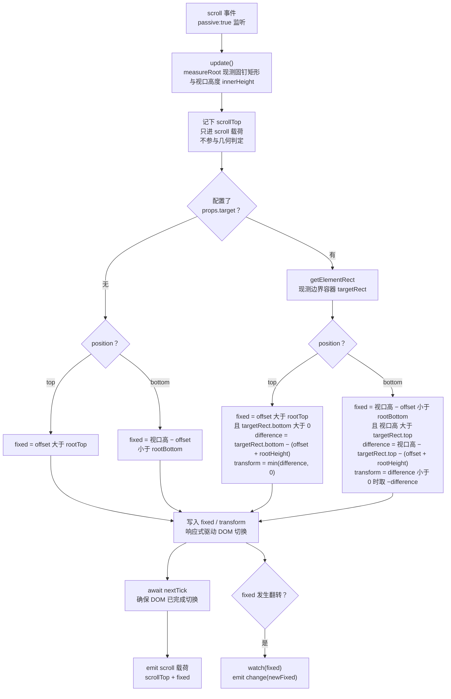
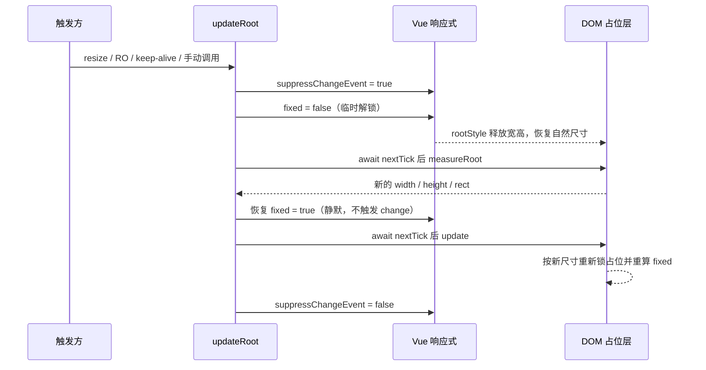

# 5-13 · Affix：固钉的几何计算

> 滚动页面时有一类元素很"黏"：工具条、筛选摘要、批量操作栏，滚到某个位置就钉在视口上不动了，滚回去又乖乖回到原位。这就是 Affix（固钉）。它看起来只是给元素加了个 `position: fixed`，真正的难点全在一个词上——**时机**：什么时候从文档流切换到固定定位，切换瞬间怎么做到肉眼零跳动，滚到容器边界时怎么优雅退场。本篇围绕这条主线拆解 `XyAffix`（394 行）的全部几何决策：两层 DOM 的占位方案与 `display: flow-root` 的防塌陷细节、向上探测最近可滚动祖先的双路径监听、`update()` 四分支判定式与 `translateY` 退让、`updateRoot` 临时解锁再测量的"舞步"，以及与 Backtop、Anchor 这对滚动同族的监听方式对比。所有代码摘自当前工作区实态，行号逐一核对过；下一篇 5-14 讲 Anchor 时会反复回来引用本篇的滚动监听基建。

## 引子：一个"小"组件的完整解剖

先给体量一个直观感受：

```text
$ wc -l packages/components/affix/src/* packages/components/affix/__tests__/*.spec.ts \
        packages/theme/src/components/affix.css tests/types/fixtures/affix.ts
     394 affix.vue
      24 affix.ts
     272 affix.spec.ts
      11 affix.css
      44 affix.ts（类型夹具）
```

394 行的实现换来 272 行的测试，比例接近 0.7:1——对一个"看起来没几行逻辑"的组件来说这个投入相当重，原因只有一个：Affix 的全部风险都集中在**几何状态切换**上，切换早一帧晚一帧、占位差一像素、边界退让差一次 transform，用户都能直接看见。这类"视觉上零容错"的逻辑，只能靠测试钉死。

按 5-02 立下的"类型层—视图层—逻辑层"解剖框架看，Affix 的类型层薄得出奇（`packages/components/affix/src/affix.ts:1-24` 全文）：

```ts
// packages/components/affix/src/affix.ts:1-24（全文）
import type Affix from "./affix.vue";

export const affixPositions = ["top", "bottom"] as const;

export type AffixPosition = (typeof affixPositions)[number];
export type AffixZIndex = number | string;
export type AffixChangeHandler = (fixed: boolean) => void;
export type AffixScrollHandler = (payload: AffixScrollPayload) => void;

export interface AffixScrollPayload {
  scrollTop: number;
  fixed: boolean;
}

export interface AffixProps {
  zIndex?: AffixZIndex;
  target?: string;
  offset?: number;
  position?: AffixPosition;
  teleported?: boolean;
  appendTo?: string | HTMLElement;
}

export type AffixInstance = InstanceType<typeof Affix>;
```

六个 props 里，`offset`、`position`、`zIndex` 是纯几何参数；`target` 是固定边界（注意：不是滚动监听目标，这个语义反转后文细说）；`teleported` / `appendTo` 是本库在 EP 基础上补的逃生舱。事件只有两个：`change`（fixed 状态翻转）和 `scroll`（每次滚动的位置快照）。类型层越薄，说明逻辑层把戏都藏在 `affix.vue` 里——下面按"占位、监听、判定、重测量、传送"五步拆。

## 一、切换时机为什么难：fixed 一切，布局就跳

先把物理问题摆清楚。元素在文档流里时，它的位置由排版决定，随页面滚动而向上移动；切成 `position: fixed` 后，它脱离文档流，钉死在视口坐标上。这两种定位方式的**视觉位置**可以在切换瞬间对齐，但**布局影响**完全不同：脱离文档流的那一刻，它原来占着的空间被释放，下方的所有内容会向上弹一格——这就是俗称的"跳动"（layout jump）。

跳动的消除思路有两种。一种是插入一个同尺寸的占位节点（placeholder），原元素固定后由占位节点顶替它撑住布局；另一种是**让原元素自己就是占位**——外层容器常驻文档流并锁住尺寸，只有内层内容切 fixed。本库选的是后者，模板结构（`packages/components/affix/src/affix.vue:373-394`）一目了然：

```html
<!-- packages/components/affix/src/affix.vue:373-394 -->
<template>
  <div ref="rootRef" :class="ns.base.value" :style="rootStyle">
    <div
      v-if="!teleportActive"
      ref="contentRef"
      :class="{ [`${ns.base.value}--fixed`]: fixed }"
      :style="affixStyle"
    >
      <slot />
    </div>

    <teleport v-else :to="teleportTarget">
      <div
        ref="contentRef"
        :class="{ [`${ns.base.value}--fixed`]: fixed }"
        :style="affixStyle"
      >
        <slot />
      </div>
    </teleport>
  </div>
</template>
```

两层 DOM：外层 `rootRef` 是占位层，永远留在文档流里；内层是内容层，`fixed` 为真时挂上 `xy-affix--fixed` 修饰类并应用 `affixStyle`。占位与固定靠两个 computed 协同（`packages/components/affix/src/affix.vue:55-78`）：

```ts
// packages/components/affix/src/affix.vue:55-78
let resizeObserver: ResizeObserver | null = null;
let removeScrollListener: (() => void) | null = null;

const teleportActive = computed(() => props.teleported && fixed.value);
const teleportTarget = computed(() => props.appendTo ?? "body");
const rootStyle = computed<CSSProperties>(() => ({
  display: "flow-root",
  height: fixed.value && rootHeight.value ? `${rootHeight.value}px` : undefined,
  width: fixed.value && rootWidth.value ? `${rootWidth.value}px` : undefined
}));
const affixStyle = computed<CSSProperties>(() => {
  if (!fixed.value) {
    return {};
  }

  return {
    height: rootHeight.value ? `${rootHeight.value}px` : undefined,
    width: rootWidth.value ? `${rootWidth.value}px` : undefined,
    left: `${rootLeft.value}px`,
    top: props.position === "top" ? addUnit(props.offset) : undefined,
    bottom: props.position === "bottom" ? addUnit(props.offset) : undefined,
    transform: transform.value ? `translateY(${transform.value}px)` : undefined,
    zIndex: props.zIndex
  };
});
```

`rootStyle` 是占位方案的全部秘密：`fixed` 为真时，外层容器把**切换前最后一次测量到的宽高**锁成内联样式，内层内容虽然脱离了文档流，外层依然撑着原来那一格，下方内容纹丝不动。这里有个极易被忽略的细节——`display: "flow-root"` 是**无条件**设置的，不只 fixed 时才有。为什么？块级格式化上下文（BFC）会阻止子元素的 margin 向外塌陷：假如固钉内容是一个带 `margin-top` 的标题，没有 BFC 的话这个 margin 会"穿出"外层容器，作用到外层与相邻元素的间距上；等内容切 fixed 后 margin 消失，外层高度瞬间少了一截——又是一次跳动。`flow-root` 把 margin 关在容器里，保证锁住的高度始终精确。本库和 EP 在这一点上逐字相同（EP 的 `rootStyle` 同样无条件写 `display: 'flow-root'`），属于两代实现共同踩出来的共识。

样式层的配合很短，全文如下（`packages/theme/src/components/affix.css:1-11`）：

```css
/* packages/theme/src/components/affix.css:1-11（全文） */
.xy-affix {
  position: relative;
  z-index: var(--xy-z-sticky, 10);
}

.xy-affix--fixed {
  position: fixed;
  box-sizing: border-box;
  will-change: transform;
  z-index: var(--xy-z-sticky, 10);
}
```

三处都值得停留一下。`.xy-affix` 的 `position: relative` 是内层 fixed 的定位参照兜底（内层实际由 fixed 语义直接相对视口，relative 保证未固定态下 `z-index` 能建立层叠上下文）；`box-sizing: border-box` 很关键——`rootStyle` 锁的宽高来自 `getBoundingClientRect()`，这是**边盒尺寸**，若内层用默认 `content-box`，一旦有 border/padding 就会比占位大出一圈；`will-change: transform` 是给退让动画准备的合成层提示，让 `translateY` 变化走 GPU 而不触发重绘。`z-index` 双轨：CSS 里给令牌默认值 `var(--xy-z-sticky, 10)`，`affixStyle` 里内联 `props.zIndex`（默认 100），内联永远赢——组件默认值只在该库主题未加载时兜底。这份样式通过 `packages/theme/index.css:16` 聚合进全库样式，组件注册则由 `packages/components/component-manifest.json:105-112` 驱动（`installExports: ["XyAffix"]`、`installChecks` 校验 `xy-affix`、`styleImports: ["affix"]` 三处挂钩）。

**权衡一：占位方案选"外层锁尺寸"还是"插入占位节点"？** 插入节点方案（切换时动态 append 一个同级 div）的好处是占位与内容彻底解耦，坏处是多一个 DOM 节点、多一对挂载/卸载时序、占位尺寸还得从内容测量后再同步——两步操作之间任何一次渲染插入都可能露馅。外层锁尺寸方案把"占位"与"容器"合一，切换只是改两个 computed，时序天然原子；代价是占位尺寸**自指**：锁住的宽高来自上次测量，内容在固定期间自己变了（图片加载完、卡片被收窄），外层不会跟着变——这个坑在第五节的 `updateRoot` 里专门填。顺带一提，EP 的模板是 `<div ref="root" :style="rootStyle"><teleport :disabled="..." :to="appendTo"><div :class="{'el-affix--fixed': fixed}">`，用 teleport 的 `disabled` 属性原地切换，本库用的是 `v-if / v-else` 双分支——两种写法等价，双分支版本每个分支持有独立的 `ref="contentRef"`，可读性更好，代价是模板重复了一次内层结构。

## 二、滚动从哪来：向上探测最近可滚动祖先

占位问题解决后，第二个问题是：**监听谁的 scroll 事件？** 直觉答案是 `window`，但那只对整页滚动成立。管理后台里固钉经常被放进一个 `overflow: auto` 的侧栏或卡片里滚动，此时 window 根本不滚，监听它等于听个寂寞。

本库的解法是**不配置、靠探测**：从固钉的父节点一路向上走，找到第一个"真的能滚"的祖先，走到头都没找到就回退 window（`packages/components/affix/src/affix.vue:114-151`）：

```ts
// packages/components/affix/src/affix.vue:114-151
function isScrollable(element: HTMLElement) {
  const { overflow, overflowX, overflowY } = window.getComputedStyle(element);
  const allowsScroll = /(auto|scroll|overlay)/.test(`${overflow}${overflowX}${overflowY}`);
  const hasScrollableArea =
    element.scrollHeight > element.clientHeight || element.scrollWidth > element.clientWidth;

  return allowsScroll && hasScrollableArea;
}

function getScrollContainer(element: HTMLElement | null) {
  let current = element?.parentElement ?? null;

  while (current) {
    if (current === document.body || current === document.documentElement) {
      return window;
    }

    if (isScrollable(current)) {
      return current;
    }

    current = current.parentElement;
  }

  return window;
}

function getScrollTop(container: ScrollContainer | null) {
  if (!container) {
    return 0;
  }

  if (isElementContainer(container)) {
    return container.scrollTop;
  }

  return window.pageYOffset || document.documentElement.scrollTop || document.body.scrollTop || 0;
}
```

`isScrollable` 的两个条件缺一不可：`overflow` 计算值匹配 `auto | scroll | overlay` 只说明**允许**滚动，`scrollHeight > clientHeight` 才说明**确实有**内容可滚。测试里专门有一条钉这个行为（`packages/components/affix/__tests__/affix.spec.ts:225-261`）：

```ts
// packages/components/affix/__tests__/affix.spec.ts:225-261
it("会忽略不实际滚动的 overflow 容器并回退监听 window", async () => {
  const wrapper = mount(
    {
      components: { XyAffix },
      template: `
        <div class="outer-shell" style="overflow: auto;">
          <xy-affix :offset="24">回退到 window</xy-affix>
        </div>
      `
    },
    {
      attachTo: document.body
    }
  );

  const affix = wrapper.findComponent(XyAffix);
  const shell = wrapper.find(".outer-shell").element as HTMLDivElement;

  Object.defineProperty(shell, "clientHeight", {
    configurable: true,
    get: () => 200
  });
  Object.defineProperty(shell, "scrollHeight", {
    configurable: true,
    get: () => 200
  });

  const rootRect = vi
    .spyOn(affix.find(".xy-affix").element, "getBoundingClientRect")
    .mockReturnValue(createRect({ top: -120, bottom: -80 }));

  await triggerWindowScroll(180);

  expect(affix.find(".xy-affix--fixed").exists()).toBe(true);

  rootRect.mockRestore();
});
```

外壳声明了 `overflow: auto` 但内容不超高（`clientHeight === scrollHeight === 200`），探测函数判定它"不会真滚"，跳过它继续向上直到 window——于是 window 的 scroll 事件照样能把固钉钉住。反过来想，如果探测只看 overflow 声明，这个用例里监听器会挂在一个永远不发事件的死容器上，固钉失效且没有任何报错，是典型的"静默失败"。

**权衡二：scroll 监听还是 IntersectionObserver？** 这是滚动感知组件绕不开的选型。IO 的优点是回调由浏览器合帧调度、不占每帧主线程，`rootMargin` 还能直接表达 offset 阈值。但 Affix 的三个需求让它在这个场景下不划算：第一，**判定需要两个矩形**——固钉自己的 rect 加边界容器的 rect，target 模式下还要求两个矩形的相对关系（`targetRect.bottom` 与 `offset + rootHeight` 的差值）参与连续计算并直接产出退让用的 `translateY`，IO 只给"进没进阈值区"的布尔事实，差值还是要自己再读一次 `getBoundingClientRect`，省不掉几何读取；第二，**时机精度**——IO 回调是异步合帧的，触发点与真实滚动帧之间有不确定延迟，切换瞬间占位与内容的位置对齐靠的就是"这一帧内完成读、判、写"的同步链路，延迟一帧就是肉眼可见的跳动；第三，**测试成本**——jsdom 没有 IntersectionObserver，mock 一个行为正确的假 IO 远比派发一个 `Event("scroll")` 复杂（测试基建见第五节）。scroll 方案的代价同样真实：每次滚动都强制读取布局（`getBoundingClientRect` 是同步 layout 触发点），理论上有性能上限——所以两个事件监听都挂了 `passive: true`（`affix.vue:246`），声明"绝不 preventDefault"，让浏览器敢于立即合成滚动帧而不等监听器跑完。

注册逻辑本身极薄（`packages/components/affix/src/affix.vue:225-250`）：`syncScrollContainer` 探测一次存进 `scrollContainer`，`reconnectScrollListener` 负责断开旧监听、往新目标（`HTMLElement` 或 `window`）挂 `{ passive: true }` 的 scroll 监听，并返回解绑函数存进 `removeScrollListener` 供卸载与重连时调用。`target` prop 变化、挂载时都会走一遍 `reconnectObservers`（`affix.vue:277-281`）保证监听与 DOM 现状一致。这套"探测 + 手写绑定 + 返回解绑器"的组合，与 EP 的 `getScrollContainer(root.value!, true)` 工具函数加 VueUse 的 `useEventListener(scrollContainer, 'scroll', handleScroll)` 在行为上等价——EP 把绑定生命周期外包给 VueUse 的自动清理，本库选择不引依赖、自己管理 `removeEventListener`，多出来的 20 行代码换的是零外部耦合。

**权衡三：`target` 的语义归属。** 这里有一个本库组件族内部的"同名不同义"陷阱：Affix 的 `target` 是**固定边界容器**（选择器，约束固钉只在它内部活动），与 EP 一致；而 Backtop 的 `target` 是**滚动监听目标**（`packages/components/backtop/src/backtop.ts:7-11` 里 `target?: string` 直接决定往谁身上挂 scroll）。同一族滚动组件、同一个 prop 名、两种语义，API 文档里必须显式区分——本库把 Affix 的文档行为约定写成"`target` 容器首版不支持自身再带滚动条，推荐把它作为普通边界容器使用"（`apps/docs/components/affix.md` 行为约定一节），就是在给这个歧义打补丁。

## 三、几何核心：update() 的四个分支与一次退让

一切滚动事件最终汇入同一个函数 `update()`（`packages/components/affix/src/affix.vue:179-223`）。先看全文，再逐分支拆：

```ts
// packages/components/affix/src/affix.vue:179-223
function update() {
  if (!rootRef.value) {
    return;
  }

  measureRoot();
  scrollTop.value = getScrollTop(scrollContainer.value);

  const targetRect = props.target ? getElementRect(targetRef.value) : null;
  const rootHeightOffset = props.offset + rootHeight.value;
  let nextFixed = false;
  let nextTransform = 0;

  if (props.position === "top") {
    if (targetRect) {
      const difference = targetRect.bottom - rootHeightOffset;

      nextFixed = props.offset > rootTop.value && targetRect.bottom > 0;
      nextTransform = difference < 0 ? difference : 0;
    } else {
      nextFixed = props.offset > rootTop.value;
    }
  } else if (targetRect) {
    const difference = viewportHeight.value - targetRect.top - rootHeightOffset;

    nextFixed =
      viewportHeight.value - props.offset < rootBottom.value && viewportHeight.value > targetRect.top;
    nextTransform = difference < 0 ? -difference : 0;
  } else {
    nextFixed = viewportHeight.value - props.offset < rootBottom.value;
  }

  transform.value = nextFixed ? nextTransform : 0;
  fixed.value = nextFixed;
}

async function handleScroll() {
  update();
  await nextTick();

  emit("scroll", {
    scrollTop: scrollTop.value,
    fixed: fixed.value
  });
}
```

整个判定只用两个输入：`measureRoot()` 现测的固钉矩形（`affix.vue:168-177`，读 `top/bottom/left/width/height` 外加视口高度 `window.innerHeight`）和可选的边界容器矩形。注意第一行 `scrollTop.value = getScrollTop(...)` 读出来的滚动距离**不参与任何几何计算**——它只进 `scroll` 事件的载荷。这是一个容易误读的设计：常见手写实现是"记下初始 `offsetTop`，每次滚动用 `scrollTop` 推算当前应在的位置"；本库反其道而行，每次滚动都重新 `getBoundingClientRect` 读实时矩形。两种哲学各有拥趸：缓存方案省读但怕布局变化（图片加载、折叠展开都会让缓存的初始位置失效），现测方案每帧多一次布局读取但**天然免疫一切 DOM 变化**——矩形是浏览器刚排版完的事实，永远新鲜。对一个尺寸随时可能被外部改动的通用组件来说，现测是更稳的默认值，代价由 `passive` 监听和廉价的两次矩形读取共同摊薄。

四个分支按 `position × target` 展开。**top 且无 target**（最简分支）：`nextFixed = offset > rootTop`。用具体数字过一遍：`offset = 48`，工具条初始 `rect.top = 300`。向下滚动，`rect.top` 线性减小；当它降到 `48` 时条件仍是假（严格大于），再多滚 1px、`rect.top = 47 < 48`，条件翻真——切换瞬间，元素顶边恰好距离视口顶 47px，而切换后 `top: 48px` 把它钉在 48px 处，视觉位移只有这 1px 的滚动量本身，**没有额外跳变**。反向滚回同理：`rootTop` 回升到 `48` 时取消固定，内层回到文档流，占位层顶部此刻正好在视口顶下方 48px，内容归位严丝合缝。判定式里那个"严格大于"加上样式里的 `top: offset`，构成了进出两个方向都连续的对称设计——这就是"切换时机"这道题的标准答案：**在视觉位置与目标钉住位置重合的那一刻切换**。

**top 且有 target**：边界容器加入后多两个量。`difference = targetRect.bottom − (offset + rootHeight)` 是"固定态下元素底边到边界底边的余量"：为正说明还压得住边界，`transform` 取 0；为负说明钉住的元素会**探出**边界底边，`translateY(difference)`（负值向上移）把元素上提，让它的底边始终贴着边界底边一起上移——这就是"退让"：元素不再死钉在 `offset` 处，而是被边界的底边"推着"一起滚出。`nextFixed` 同时要求 `offset > rootTop`（过了进入阈值）且 `targetRect.bottom > 0`（边界还没完全滚出视口顶部）。退出时机的选择有讲究：不是"元素顶到边界就取消固定"，而是等边界整体滚出视口（`bottom ≤ 0`）才退——此刻退让中的元素底边贴着 `targetRect.bottom ≤ 0`，说明整个元素已在视口上沿之外；而元素在文档流里的原位（占位层）在边界容器内部、必然也高于视口顶，退出瞬间两个状态都不可见，肉眼零跳动。测试对这条链路做了精确断言（`packages/components/affix/__tests__/affix.spec.ts:125-161`）：

```ts
// packages/components/affix/__tests__/affix.spec.ts:125-161
it("支持 target 边界和 transform 退让", async () => {
  const wrapper = mount(
    {
      components: { XyAffix },
      template: `
        <div class="target-zone">
          <xy-affix target=".target-zone" :offset="20">容器边界</xy-affix>
        </div>
      `
    },
    {
      attachTo: document.body
    }
  );

  const affix = wrapper.findComponent(XyAffix);
  const rootRect = vi
    .spyOn(affix.find(".xy-affix").element, "getBoundingClientRect")
    .mockReturnValue(createRect({ top: -100, bottom: -60 }));
  const targetRect = vi
    .spyOn(wrapper.find(".target-zone").element, "getBoundingClientRect")
    .mockReturnValue(createRect({ top: -80, bottom: 40, width: 400, height: 120 }));

  await triggerWindowScroll(100);

  expect(affix.find(".xy-affix--fixed").exists()).toBe(true);
  expect(affix.find(".xy-affix--fixed").attributes("style")).toContain("translateY(-20px)");

  targetRect.mockReturnValue(createRect({ top: -200, bottom: -10, width: 400, height: 120 }));
  await triggerWindowScroll(260);

  expect(affix.find(".xy-affix--fixed").exists()).toBe(false);
  expect(affix.emitted("change")?.at(-1)).toEqual([false]);

  rootRect.mockRestore();
  targetRect.mockRestore();
});
```

数字完全对得上判定式：`difference = targetRect.bottom(40) − (offset 20 + rootHeight 40) = −20`，所以断言 `translateY(-20px)`；第二轮把边界滚到 `bottom = −10 ≤ 0`，固钉退出，`change` 收到 `false`。**bottom 两个分支**是 top 的镜像：无 target 时 `nextFixed = 视口高 − offset < rootBottom`，即元素底边越过"距视口底 offset"这条线就钉住，`bottom: offset` 同样保证切换瞬间视觉连续；有 target 时多一条 `视口高 > targetRect.top`（边界顶部还在视口内才钉），退让方向反转——`difference = 视口高 − targetRect.top − rootHeightOffset`，为负时 `nextTransform = −difference`（正值向下压），让元素从边界顶部"浮现"而不是从底部"缩走"。top 的 transform 取 `difference` 原值、bottom 取相反数，一个符号之差正是"顶边贴边"与"底边贴边"的几何镜像。

把整条链路画成图，就是 Affix 一次 scroll 心跳的完整旅程：



**EP 对比：判定式逐行同构，管道各有取舍。** 对照 EP dev 分支的 affix 源码，`update()` 的判定式几乎是逐行翻译：同样的 `rootHeightOffset = offset + rootHeight`、同样的 top 分支 `fixed = offset > rootTop && targetRect.bottom > 0` 加 `difference` 退让、同样的 bottom 分支与符号翻转、同样在 `rootStyle` 里无条件 `display: 'flow-root'` 并锁宽高。差异集中在管道层三处：其一，EP 的 `affixStyle` 里 `left: props.teleported ? \`${rootLeft}px\` : ''`——本库无条件下 `left`（`affix.vue:72`），因为本库把 `left` 视为固定态的必要坐标而非传送态的补丁；其二，EP 用 `watchEffect(update)` 让响应式依赖自动触发重算，本库用两条显式 watch（`affix.vue:320-339`：target 变化走 `resolveTarget + reconnectObservers + update` 全量重连，offset/position 变化只走 `update`）——显式声明的代价是多几行代码，收益是"重连"与"重算"两个动作的边界清清楚楚；其三，EP 的模板用 `teleport :disabled` 原地切换，本库用 `v-if/v-else` 双分支（第一节已述）。API 表面两者几乎可以无缝迁移，实现面每一处分歧都是一次自主决策。

## 四、事件与重测量：suppress 机制与 updateRoot 的舞步

`fixed` 是唯一的全局状态，`change` 事件由一条 watch 派生（`packages/components/affix/src/affix.vue:309-318`）：

```ts
// packages/components/affix/src/affix.vue:309-318
watch(
  fixed,
  (value, oldValue) => {
    if (oldValue === undefined || suppressChangeEvent.value) {
      return;
    }

    emit("change", value);
  }
);
```

`oldValue === undefined` 是防御性判断（该 watch 未开 `immediate`，正常永远有旧值），真正干活的是 `suppressChangeEvent`——一个"静默开关"。它存在的理由藏在 `updateRoot` 里（`packages/components/affix/src/affix.vue:283-307`）：

```ts
// packages/components/affix/src/affix.vue:283-307
function handleWindowResize() {
  void updateRoot();
}

async function updateRoot() {
  if (!rootRef.value) {
    return;
  }

  if (!fixed.value) {
    update();
    return;
  }

  const previousFixed = fixed.value;

  suppressChangeEvent.value = true;
  fixed.value = false;
  await nextTick();
  measureRoot();
  fixed.value = previousFixed;
  suppressChangeEvent.value = false;
  await nextTick();
  update();
}
```

先回答"为什么需要它"。第一节埋过一个坑：占位尺寸是**自指**的——`fixed` 为真时 `rootStyle` 锁住了上次测量的宽高，此时再对 `rootRef` 测 `getBoundingClientRect`，读回来的是**锁死的旧尺寸**，不是内容的自然尺寸。要拿到新尺寸，必须先把锁打开：临时把 `fixed` 置 false（`rootStyle` 释放宽高，外层回归内容自然尺寸），等一帧 `nextTick` 让 DOM 真正重排后再 `measureRoot()`，然后恢复 `fixed`、再等一帧、跑一遍 `update()` 重新做几何判定。整个过程 `fixed` 经历了 `true → false → true` 两个来回，如果不加抑制，`change` 会发出 `false、true` 两次假信号——消费者（比如依赖 `change` 显示/隐藏别的元素的页面）就会跟着闪两下。`suppressChangeEvent` 就是给这场内部舞蹈拉的静音闸：起舞前置 true，谢幕后置 false，观众全程只看见真实的状态翻转。

触发 `updateRoot` 的入口有四个：暴露给用户的手动调用（`defineExpose`，`affix.vue:367-370`）、`window resize`（`handleWindowResize`）、`onActivated`（keep-alive 场景，`affix.vue:348-350`），以及 `ResizeObserver`。RO 的观察对象有三个（`reconnectResizeObserver`，`affix.vue:252-275`）：固钉根节点、边界容器（`target` 且不是 `documentElement` 时）、以及元素型滚动容器——三者任何一个尺寸变化都可能改变几何关系。但这里有个 RO 覆盖不到的盲区，文档示例里专门做了演示（`apps/docs/examples/affix/teleported.vue:11-15`）：

```ts
// apps/docs/examples/affix/teleported.vue:11-15
async function toggleCardWidth() {
  compact.value = !compact.value;
  await nextTick();
  await affixRef.value?.updateRoot();
}
```

固定期间内容卡片从 360px 收窄到 240px——变化发生在**内层内容**上，而外层占位被锁死，RO 观察的是外层根节点，尺寸没变，回调永远不会触发。这就是"外层锁尺寸"方案的结构性代价：内容在固定态下自发变化时，组件**无法感知**，只能靠用户在业务代码里手动调 `updateRoot()` 收口。示例把按钮、收窄动画与 `updateRoot` 调用串成完整动线，等于把这条边界写成了教学材料。keep-alive 的处理则简单直接：`onDeactivated` 时把 `fixed` 和 `transform` 归零（此时不抑制，`change` 正常发出——组件不可见了，退出固定是正确语义）；`onActivated` 回来时走一遍 `updateRoot` 重新对齐几何。生命周期兜底还有一条容易漏的：`onBeforeUnmount`（`affix.vue:357-365`）解绑 scroll 监听器、断开 RO、摘掉 window resize——三个外部订阅一一归还，不留悬挂监听。

把 `updateRoot` 的舞步画成时序图：



## 五、传送分支：固定态才搬家

第一节模板里那个 `teleport` 分支还有一个隐藏约束：`teleportActive = props.teleported && fixed.value`（`affix.vue:57`）——**只有固定态才传送**。未固定时内容留在原位，滚过阈值的一瞬，内层节点从文档流位置被摘下、挂到 `appendTo` 指定的宿主上，同时套上 fixed 样式；退回时再搬回来。传送期间外层占位原地不动，布局依旧稳如老狗。

为什么需要这个逃生舱？`position: fixed` 的定位参照是视口，但有一个著名例外：**祖先链上出现 `transform`、`filter`、`perspective` 或 `will-change` 非 none 的元素时，fixed 退化为相对该祖先定位**（CSS 规范里 fixed 的 containing block 规则）。动画卡片、毛玻璃容器、做过 `will-change` 优化的列表项都可能是这种"fixed 陷阱"。`teleported` 把固定节点搬到 `body` 或任意宿主下，绕开整个祖先链的污染。代价是内容脱离了原来的样式上下文（scoped 样式、CSS 变量继承都会断），所以它必须是 opt-in 的开关而非默认行为。测试验证了"只有固定态才搬"的精确语义（`packages/components/affix/__tests__/affix.spec.ts:163-190`）：挂载后内容还在原地（`document.querySelector(".teleport-host .xy-affix--fixed")` 为 null），滚动触发固定后才出现在 `.teleport-host` 里——`teleportActive` 的两个条件缺一不可。

## 六、同族对比：Backtop 的极简与 Anchor 的节流

滚动位置感知是组件库里一个隐形的小家族。把 Affix 放回家族里看，能同时看清它的重与别人的轻。

**Backtop（180 行）是家族里的极简样本。** 它只做一件事：滚过 `visibilityHeight` 就显示"回到顶部"按钮。监听基建与 Affix 高度同构——同样的 `resolveTarget`、同样的 `reconnectScrollListener`（连 `removeScrollListener` 的返回解绑器模式都一模一样）、同样的 `getScrollTop` 三级兜底（`packages/components/backtop/src/backtop.vue:52-97`）：

```ts
// packages/components/backtop/src/backtop.vue:52-97
function updateVisible() {
  visible.value = getScrollTop(targetRef.value ?? listenerTarget.value) >= props.visibilityHeight;
}

function disconnectScrollListener() {
  removeScrollListener?.();
  removeScrollListener = null;
}

function resolveTarget() {
  if (props.target) {
    const element = document.querySelector<HTMLElement>(props.target);

    if (!element) {
      throw new Error(`[XyBacktop] target does not exist: ${props.target}`);
    }

    targetRef.value = element;
    listenerTarget.value = element;
    return;
  }

  targetRef.value = document.documentElement;
  listenerTarget.value = window;
}

function reconnectScrollListener() {
  disconnectScrollListener();

  if (!listenerTarget.value) {
    return;
  }

  const target = listenerTarget.value;
  const handler = () => {
    updateVisible();
  };

  target.addEventListener("scroll", handler, {
    passive: true
  });

  removeScrollListener = () => {
    target.removeEventListener("scroll", handler);
  };
}
```

对比之下语义差异立现：Backtop 的 `target` 直接成为监听目标（`listenerTarget.value = element`），而 Affix 的监听目标靠 DOM 探测、`target` 只做边界——这正是第二节"同名不同义"的实锤。Backtop 也没有几何：判定只消费一个标量 `scrollTop`，不需要 `getBoundingClientRect`，不需要占位（按钮本来就 `position: fixed` 常驻视口），所以它 180 行就写完了。Affix 的 394 行里，多出来的部分几乎全是"连续几何"的代价——矩形测量、四分支判定、退让 transform、占位锁尺寸、重测量舞步。滚动感知的复杂度不在"监听"，而在"监听之后要算多细的几何"。

**Anchor（508 行）展示了同族里的第三种监听姿势——rAF 节流**（`packages/components/anchor/src/anchor.vue:306-343`）：

```ts
// packages/components/anchor/src/anchor.vue:306-343
function handleScroll() {
  if (scrollTicking) {
    return;
  }

  scrollTicking = true;

  window.requestAnimationFrame(() => {
    scrollTicking = false;

    if (isScrolling) {
      return;
    }

    const nextHref = getCurrentHref();

    if (nextHref) {
      updateCurrentAnchor(nextHref);
    }
  });
}

function connectScrollListener() {
  removeScrollListener?.();
  removeScrollListener = null;

  const target = isElementContainer(containerRef.value) ? containerRef.value : window;
  const listener = () => {
    handleScroll();
  };

  target.addEventListener("scroll", listener, {
    passive: true
  });
  removeScrollListener = () => {
    target.removeEventListener("scroll", listener);
  };
}
```

`scrollTicking` 标志把高频 scroll 事件收敛到每帧最多一次 rAF 回调，这是滚动监听的标准节流术。Anchor 需要它，因为 `getCurrentHref()` 每次要遍历所有锚点目标、逐个测距再排序（`anchor.vue:266-304`），单次成本远高于 Affix 的两次矩形读取；Affix 不节流，因为 `update()` 够便宜、且**节流会在边界上引入一帧的判定延迟**——切换时机是它的命根子，宁可每帧都算，不可晚一帧再算。同一个家族，三种成本模型对应三种节流策略：Backtop 无所谓（一个比较）、Affix 同步全量（判定必须即时）、Anchor rAF 合帧（批量计算必须收敛）。此外 Anchor 还有 `isScrolling` 抑制——程序化滚动动画期间不响应 scroll 事件，防止动画与高亮判定互相打架，这是家族里第三种"静默开关"，与 Affix 的 `suppressChangeEvent` 遥相呼应。

**Affix 与 Anchor 的组合是官方钦定的用法**：`packages/components/anchor/__tests__/anchor.spec.ts:579-608` 有专门的"可以与 Affix 组合渲染"用例，把 `xy-anchor` 包进 `xy-affix :offset="12"`——锚点导航栏常驻视口，正是文档站侧边目录的标准形态。但要说清楚：两个组件**源码层零依赖**，Anchor 不 import Affix，组合纯粹发生在消费侧；5-14 讲 Anchor 的"高亮当前章节判定算法"时，本篇的滚动监听基建（探测、passive、解绑器模式）会作为共同底座反复出现。顺带一个诚实的观察：`getScrollTop`、`isElementContainer`、"返回解绑函数的监听器"这套模式在 Affix、Backtop、Anchor 三处各自复制了一份，并没有抽进 `packages/xiaoye-primitives/src/composables`——三个组件的监听语义差异足够大（探测式/指定式/容器式），过早抽象反而会造出一个参数面巨宽的"万能 scroll composable"。这个判断留给 7-04《Backtop：滚动目标解析》再回头验证。

## 七、类型与文档收口

类型夹具把六件套 props 和两个事件的用法钉进类型检查（`tests/types/fixtures/affix.ts:25-44`）：`position: "left"` 触发 `@ts-expect-error`（联合类型只收 top/bottom）、`offset: "24px"` 报错（必须是 number——想在模板里传字符串的冲动被类型层直接掐掉）、`appendTo: 200` 报错（`string | HTMLElement` 联合收口）。五个文档示例（`apps/docs/examples/affix/`）恰好覆盖五个能力面：basic 演示默认吸附、change 把 `change/scroll` 事件可视化成状态面板、fixed 演示底部固钉、target 演示边界退让、teleported 演示传送与手动 `updateRoot`——示例即验收清单。

**权衡四（收束）：现测几何的哲学边界。** 本篇反复出现同一个选择：Affix 相信"每一帧的 `getBoundingClientRect`"，不相信任何缓存——不信初始 offsetTop，不信 scrollTop 推算，不信 RO 能覆盖内容自发变化。这套哲学买到的免疫性是：布局怎么变都不出错；付出的代价是每帧两次布局读取、以及"内容固定态自发变化需要用户手动 `updateRoot`"这个漏出来的口子。什么时候该破例？当你确知布局完全静态、滚动频率极高时，缓存初始位置加 scrollTop 推算值得考虑——但那是特定页面的优化，不是通用组件的默认值。

使用守则收成三条：

- **页面有 transform/filter/will-change 祖先时必开 `teleported`**，否则 fixed 会被关进那张"污染"的卡片里；`appendTo` 默认 `body`，需要跟随某个容器时显式指定。
- **内容尺寸可能在固定期间变化的场景，把 `updateRoot` 接进变化回调**（ref 拿实例直接调），RO 管不到锁死的占位层；`change` 只在状态翻转时发，`scroll` 每帧都发，高频逻辑挂 `scroll` 时自行节流。
- **`target` 只做边界、不做滚动容器**；想让固钉跟随某个内滚容器，把它作为 Affix 的滚动祖先自然被探测到即可，无需配置。

下一篇预告：5-14《Anchor：锚点与滚动联动》。固钉解决的是"把一块内容钉在视口上"，Anchor 解决的是"滚动到哪了"——`getCurrentHref` 如何把全部锚点按 `offset + bound` 平移后排序、用一次线性扫描定位当前章节；高亮判定为什么不像 Affix 那样每帧现测，而是配合 `scrollTicking` 的 rAF 合帧；点击链接后的 `animateScrollTo` 怎么用三次缓出把滚动动画与高亮抑制（`isScrolling`）编排成一支不打架的双人舞；以及 `syncHash` 用 `history.replaceState` 同步 URL 而不触发导航的细节。从"钉住一块内容"到"追上一次滚动"，滚动家族的下一位成员，讲的是另一种几何——排序与区间的几何。

---

*本篇代码引用核对于当前工作区实态：`packages/components/affix/src/affix.vue`（394 行）、`src/affix.ts`（24 行）、`packages/components/affix/index.ts`（24 行）、`packages/components/affix/__tests__/affix.spec.ts`（272 行）、`packages/theme/src/components/affix.css`（11 行）、`tests/types/fixtures/affix.ts`（44 行）、`packages/components/backtop/src/backtop.vue`（180 行）、`packages/components/anchor/src/anchor.vue`（508 行）、`apps/docs/examples/affix/` 五例、`packages/components/component-manifest.json:105-112`、`packages/theme/index.css:16`。EP 侧事实核对自 element-plus dev 分支 affix 源码。*
