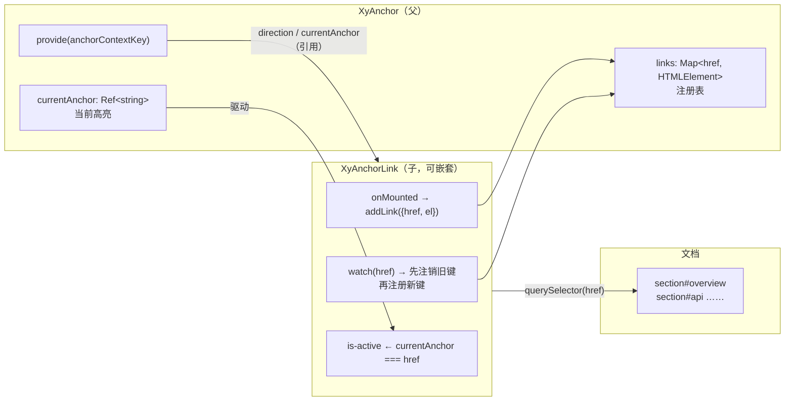
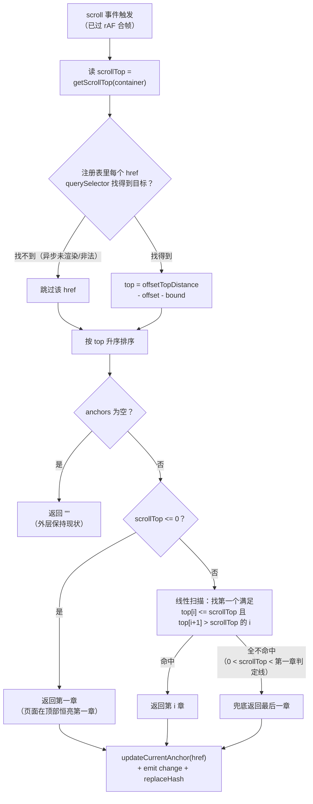
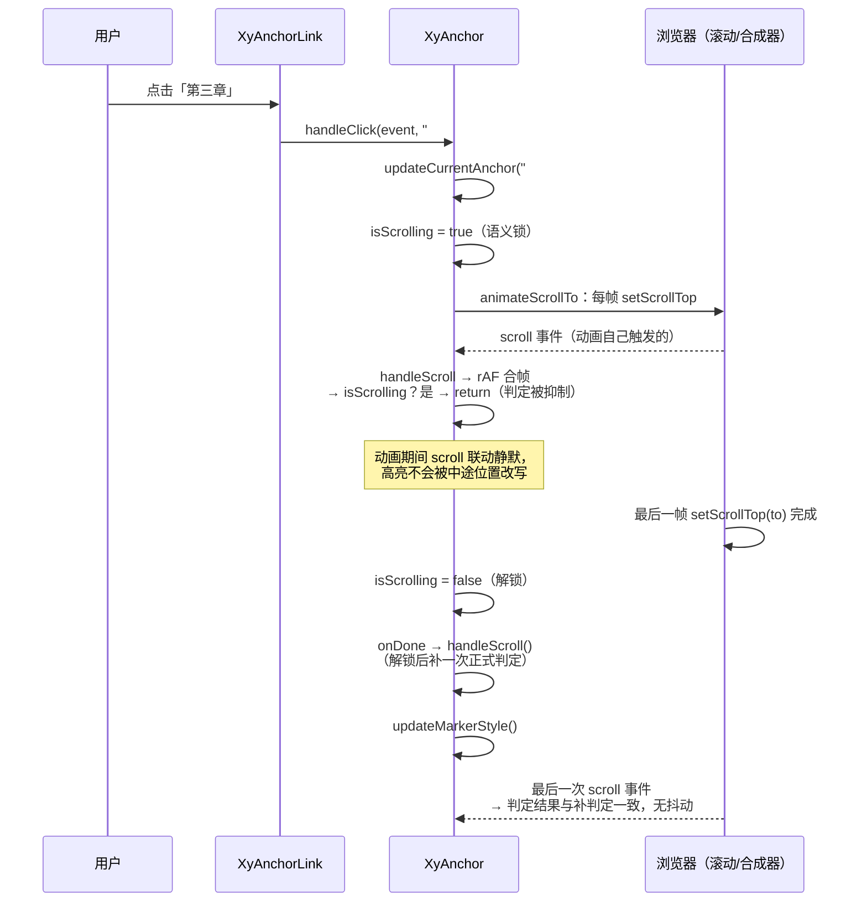

# 5-14 · Anchor：锚点与滚动联动

> 长文档页的右侧目录都有一个共同的行为：你滚到哪一章，目录里对应的那一项就亮起来。这个"看起来只是加个 `is-active`"的功能，背后是一个完整的几何判定问题——**页面滚动到任意位置时，究竟哪一个锚点有资格宣称"当前章节是我"**。这就是本篇的核心问题：高亮当前章节的判定算法。5-13 讲 Affix 时已经从同族视角引过 Anchor 的滚动监听段（`anchor.vue:306-343`），本篇把它当作正戏展开：`getCurrentHref` 的"阈值平移 + 排序 + 区间扫描"三步法、测距为什么用 `getBoundingClientRect` 合成而不用 `offsetTop` 累加、`scrollTicking` 与 `isScrolling` 双开关如何治理滚动联动与点击滚动的竞态、`animateScrollTo` 的三次缓出与解锁后补判定、marker 指示条的测量与 CSS 过渡分工，以及 `syncHash` 用 `history.replaceState` 静默同步 URL 的细节。所有代码摘自当前工作区实态，行号逐一核对过。

## 引子：一个算法密度很高的"目录"

先给体量一个直观感受：

```text
$ wc -l packages/components/anchor/src/* packages/components/anchor/index.ts \
        packages/components/anchor/__tests__/*.spec.ts \
        packages/theme/src/components/anchor.css tests/types/fixtures/anchor.ts
     508 anchor.vue
      20 anchor.ts
     108 anchor-link.vue
       4 anchor-link.ts
      17 context.ts
      33 index.ts
     609 anchor.spec.ts
     152 anchor.css
      79 anchor.ts（类型夹具）
```

508 行的实现换来 609 行的测试——测试比实现还长。对一个"目录组件"来说这个比例乍看奢侈，但回看 5-13 给 Affix 的 394:272 就能理解：**滚动家族的组件，逻辑全是几何，几何全是边界**。Affix 的边界是"切换时机"，Anchor 的边界更多——页面顶部滚不滚出高亮、最后一章滚不滚得到、点击后的程序滚动会不会把高亮带跳、目录项被删掉的一瞬间高亮落到谁头上。每一个都是测试必须钉死的判定分支。

按 5-02 立下的"类型层—视图层—逻辑层"框架看，Anchor 的类型层同样很薄。`anchor.ts` 全文 20 行：

```ts
// packages/components/anchor/src/anchor.ts:1-20（全文）
import type Anchor from "./anchor.vue";

export const anchorDirections = ["vertical", "horizontal"] as const;

export type AnchorDirection = (typeof anchorDirections)[number];
export type AnchorContainer = string | HTMLElement | Window | null;
export type AnchorChangeHandler = (href: string) => void;
export type AnchorClickHandler = (event: MouseEvent, href?: string) => void;

export interface AnchorProps {
  container?: AnchorContainer;
  offset?: number;
  bound?: number;
  duration?: number;
  marker?: boolean;
  direction?: AnchorDirection;
  syncHash?: boolean;
}

export type AnchorInstance = InstanceType<typeof Anchor>;
```

七个 props 可以分成三组：`container` / `offset` / `bound` 是**判定组**——滚动监听谁、判定线怎么平移；`duration` / `marker` / `direction` 是**表现组**——点击后的滚动动画与指示条形态；`syncHash` 是本库独有的**URL 组**。`AnchorContainer` 收编了 `string | HTMLElement | Window | null` 四种形态，对应"选择器字符串、直接给 DOM、整页滚动、未传"四种接法。`anchor-link.ts` 更短，全文 4 行，只有 `title` 和 `href` 两个可选 props——Link 的全部行为都从注入里来。

`AnchorLinkProps` 之外，真正承载父子协议的是 `context.ts`，全文 17 行——与 5-04 一样是父子协议的图纸文件：

```ts
// packages/components/anchor/src/context.ts:1-17（全文）
import type { ComputedRef, InjectionKey, Ref } from "vue";
import type { AnchorDirection } from "./anchor";

export interface AnchorLinkState {
  href: string;
  el: HTMLElement;
}

export interface AnchorContext {
  direction: ComputedRef<AnchorDirection>;
  currentAnchor: Ref<string>;
  addLink: (state: AnchorLinkState) => void;
  removeLink: (href: string) => void;
  handleClick: (event: MouseEvent, href?: string) => void;
}

export const anchorContextKey: InjectionKey<AnchorContext> = Symbol("xiaoye-anchor");
```

和 4-09 / 5-04 的协议一脉相承：`Symbol` 字面量 + `InjectionKey<T>` 泛型 + 可选注入。协议五个成员，一眼能看出 Anchor 与 breadcrumb 的血缘——`addLink` / `removeLink` 就是 `registerItem` / `unregisterItem` 的换名。但差异藏在细节里，第一节专门说它。

## 一、注册表：Map 对 href 的第二次引用

先看父组件 provide 了什么（`packages/components/anchor/src/anchor.vue:419-425`）：

```ts
// packages/components/anchor/src/anchor.vue:419-425
provide(anchorContextKey, {
  direction,
  currentAnchor,
  addLink,
  removeLink,
  handleClick
});
```

`direction` 下发的是 `computed` 引用（第 55 行定义 `const direction = computed<AnchorDirection>(() => props.direction)`），`currentAnchor` 下发的是 `Ref<string>` 引用——**下行通道给引用不给快照**，这是 5-04 总结过的纪律：父组件的 prop 变更时，所有 link 无需任何通知自动跟随。这个纪律在 Anchor 里有实际收益：`direction` 从 `vertical` 动态切成 `horizontal` 时，每个 link 的模板类名（`${ns.base.value}__item--${direction}`）直接重算，父组件甚至不用额外 watch 它。

上行通道是注册表。子组件 `anchor-link.vue` 的注册动作（`packages/components/anchor/src/anchor-link.vue:28-49`）：

```ts
// packages/components/anchor/src/anchor-link.vue:28-49
function registerLink(href: string) {
  if (!href || !linkRef.value) {
    return;
  }

  anchorContext?.addLink({
    href,
    el: linkRef.value
  });
}

function unregisterLink(href: string) {
  if (!href) {
    return;
  }

  anchorContext?.removeLink(href);
}

function handleClick(event: MouseEvent) {
  anchorContext?.handleClick(event, props.href || undefined);
}
```

注册的内容不是一个 uid，而是 `{ href, el }` 二元组——**href 是键，el 是值**。父组件的注册表因此是一张 Map（`anchor.vue:46`）：

```ts
// packages/components/anchor/src/anchor.vue:44-53
const currentAnchor = ref("");
const markerStyle = ref<CSSProperties>({});
const links = new Map<string, HTMLElement>();

let isScrolling = false;
let currentTargetHref = "";
let clearAnimate: (() => void) | null = null;
let removeScrollListener: (() => void) | null = null;
let resizeHandler: (() => void) | null = null;
let scrollTicking = false;
```

**权衡一：Map\<href, el\> 还是 breadcrumb 式的 uid 数组？** 把 5-04 的结论搬来对照。breadcrumb 的注册表是 `ref<number[]>`，选数组的核心理由是"顺序即语义"——末项判定只需要 `at(-1)`。Anchor 恰恰相反：**它的判定算法根本不在乎注册顺序**（后面会看到 `getCurrentHref` 拿到键后立刻按几何位置重排序），它在乎的是"按 href 反查 link 元素"——marker 定位时要拿 `currentAnchor` 对应的 `<a>` 的矩形，`links.get(currentAnchor.value)` 一发命中。href 同时还是查询目标章节的 `querySelector` 选择器，一张 Map 让"目录项 → 目录 DOM → 章节元素"三个身份共用一把钥匙。另外注入的 `anchorContext?.addLink(...)` 用了可选链——`xy-anchor-link` 脱离 `xy-anchor` 单独渲染时不会炸，只是静默不注册。

注册的时机与销号也有讲究（`anchor-link.vue:51-76`）：

```ts
// packages/components/anchor/src/anchor-link.vue:51-76
watch(
  () => props.href,
  (value, oldValue) => {
    void nextTick(() => {
      if (oldValue) {
        unregisterLink(oldValue);
      }

      if (value) {
        registerLink(value);
      }
    });
  }
);

onMounted(() => {
  if (props.href) {
    registerLink(props.href);
  }
});

onBeforeUnmount(() => {
  if (props.href) {
    unregisterLink(props.href);
  }
});
```

`onMounted` 登记、`onBeforeUnmount` 销号，与 breadcrumb-item 的时序完全同族；多出来的是 `watch(href)`——href 动态变更时先注销旧键再注册新键，且整个动作包在 `nextTick` 里等 DOM 提交后再执行（保证 `linkRef` 与新 href 对得上）。测试里"href 变更后会注销旧值并注册新值"用例（`anchor.spec.ts:480-515`）锁的就是这条路径。

三个组件的协作关系一张图说清：



还有一处注册语义的差异值得点一句：`Map.set` 对重复 href 是**覆盖**而非拒绝——两个 link 指向同一个 target 时，注册表只留后注册者的 el（两个 link 仍会同时 `is-active`，因为 `currentAnchor` 相同）。breadcrumb 的数组则是 `includes` 查重后跳过。一个"后者赢"，一个"先到先得"，都是对"重复成员"这个非常态的选择，Anchor 选覆盖的理由是注册表的本质用途是**反查工具**，键的唯一性由 DOM 的 id 唯一性背书，册上留谁只是 marker 贴给谁的差别。

## 二、高亮判定的核心：getCurrentHref 的区间几何

现在是本篇的主菜。先铺垫，看判定所依赖的测距工具组（`anchor.vue:90-148`）：

```ts
// packages/components/anchor/src/anchor.vue:90-148
function getScrollTop(container: ScrollContainer) {
  if (isElementContainer(container)) {
    return container.scrollTop;
  }

  return window.pageYOffset || document.documentElement.scrollTop || document.body.scrollTop || 0;
}

function getMaxScrollTop(container: ScrollContainer) {
  if (isElementContainer(container)) {
    return Math.max(container.scrollHeight - container.clientHeight, 0);
  }

  const doc = document.documentElement;
  const body = document.body;

  return Math.max(Math.max(doc.scrollHeight, body.scrollHeight) - window.innerHeight, 0);
}

function setScrollTop(container: ScrollContainer, top: number) {
  if (isElementContainer(container)) {
    if (typeof container.scrollTo === "function") {
      container.scrollTo({
        top
      });
    } else {
      container.scrollTop = top;
    }

    return;
  }

  window.scrollTo({
    top
  });
}

function getElementByHref(href?: string) {
  if (!href) {
    return null;
  }

  try {
    return document.querySelector<HTMLElement>(decodeURIComponent(href));
  } catch {
    return null;
  }
}

function getOffsetTopDistance(target: HTMLElement, container: ScrollContainer) {
  const targetRect = target.getBoundingClientRect();

  if (isElementContainer(container)) {
    const containerRect = container.getBoundingClientRect();
    return targetRect.top - containerRect.top + container.scrollTop;
  }

  return targetRect.top + getScrollTop(window);
}
```

这组函数全部围绕一个双态分发：`ScrollContainer = HTMLElement | Window`，每个操作都有元素分支与 window 分支。`getScrollTop` 的 window 分支那条 `pageYOffset || documentElement.scrollTop || body.scrollTop || 0` 兜底链是老派写法（`pageYOffset` 已标记 deprecated、`body.scrollTop` 是 quirks 模式遗产），但作为防御性兜底无害——真实现代浏览器永远在第一项命中。真正值得停住的是 `getOffsetTopDistance`：它回答"目标章节在滚动内容坐标系里的绝对 top 是多少"。

**权衡二：getBoundingClientRect 合成，还是 offsetTop 沿链累加？** 这是测距层的一个路线分歧，而且分歧的另一半恰好在 Element Plus。EP 的同名工具是这么写的（`packages/utils/dom/position.ts`，dev 分支）：

```ts
// element-plus: packages/utils/dom/position.ts（dev 分支，节选）
export const getOffsetTop = (el: HTMLElement) => {
  let offset = 0
  let parent = el

  while (parent) {
    offset += parent.offsetTop
    parent = parent.offsetParent as HTMLElement
  }

  return offset
}

export const getOffsetTopDistance = (
  el: HTMLElement,
  containerEl: HTMLElement
) => {
  return Math.abs(getOffsetTop(el) - getOffsetTop(containerEl))
}
```

EP 沿 `offsetParent` 链把 `offsetTop` 累加到文档顶端，再用"目标与容器的布局坐标差"得到相对距离。这条路的坑在 DOM 教科书里都有记载：`offsetTop` 是相对 `offsetParent` 的布局值，`position: fixed` 的祖先会让链条提前断掉，跨嵌套定位容器相减的隐含假设（两个元素的 offsetParent 链可以交换相减）在复杂布局下会算错。本库换成了 `getBoundingClientRect` 合成法：**视口视觉坐标 + 已滚动距离 = 内容坐标**。`getBoundingClientRect` 是排版流水线吐出的最终视觉事实，transform、flex、sticky、负 margin 一切影响都已含在 rect 里，加回当前 `scrollTop` 就还原为与滚动无关的内容坐标。代价是每次判定多读两次 rect（目标一个、容器一个），而 rect 读取在有待布局脏标记时会强制 reflow——所以它必须与后面的 rAF 合帧配合使用（第三节），不能放任每次 scroll 事件裸调。这一换，就是"以 EP 的算法骨架为蓝本、换掉测量层"的典型样本：判定骨架两边同构（后文对照），测量层本库选了更鲁棒的那条路。

垫子铺完，主角登场。`getCurrentHref` 全文（`anchor.vue:266-304`）：

```ts
// packages/components/anchor/src/anchor.vue:266-304
function getCurrentHref() {
  const container = containerRef.value ?? window;
  const scrollTop = getScrollTop(container);
  const anchors: Array<{ top: number; href: string }> = [];

  for (const href of links.keys()) {
    const target = getElementByHref(href);

    if (!target) {
      continue;
    }

    anchors.push({
      href,
      top: getOffsetTopDistance(target, container) - props.offset - props.bound
    });
  }

  anchors.sort((left, right) => left.top - right.top);

  if (!anchors.length) {
    return "";
  }

  if (scrollTop <= 0) {
    return anchors[0]?.href ?? "";
  }

  for (let index = 0; index < anchors.length; index += 1) {
    const current = anchors[index];
    const next = anchors[index + 1];

    if (current && current.top <= scrollTop && (!next || next.top > scrollTop)) {
      return current.href;
    }
  }

  return anchors.at(-1)?.href ?? "";
}
```

算法一共四步，逐行拆开：

**第一步，收集阈值。** 遍历注册表的每一个 href，`getElementByHref` 用 `querySelector(decodeURIComponent(href))` 找到目标章节元素——注意 `decodeURIComponent`，中文标题的锚点（`#安装` 这类）经 URL 编码后存在这里要解回来；`querySelector` 对非法选择器会抛异常，所以包了 try/catch，找不到或非法的 href 直接跳过（异步渲染还没出现的章节就属于这类）。每个目标算出 `top = getOffsetTopDistance(...) - offset - bound`。这个减法是整个算法的灵魂：**判定线不是章节的顶部，而是章节顶部向上平移 `offset + bound` 像素的那条线**。两个参数的语义分工——`offset` 补偿"吸顶物"：页面顶部有一条 48px 高的 sticky 工具栏时，章节滚到视口顶其实被工具栏盖住，把判定线上移 48px，章节碰到工具栏下沿就算"到达"；`bound` 是"提前量"：还没滚到就提前切高亮，消灭"章节都过去半屏了目录才亮"的迟滞感。文档示例 `apps/docs/examples/anchor/scroll.vue` 的参数就是这对语义的活教材（`:offset="48" :bound="8"`，示例文案直接写着"bound 可以提前切换高亮，避免目录反馈明显滞后"）。

**第二步，按几何排序。** `anchors.sort((left, right) => left.top - right.top)` 把阈值升序排列。注册序（DOM 序）在这里被彻底丢弃——注册表用 Map 还是数组、link 声明的先后，都不影响判定结果。这是"注册表只做反查、序数交给几何"的设计的直接后果，也是它和 5-04 breadcrumb（顺序即语义）最本质的分野。JS 的 `sort` 自 ES2019 起稳定，同 top 的两项保持注册序，但这种情况通常意味着两个 href 指向同一位置，谁赢都无感。

**第三步，顶部短路。** `scrollTop <= 0` 时直接返回第一个锚点——页面在顶上，第一章就是当前章节。用 `<= 0` 而不是 `=== 0` 是为了覆盖 iOS 橡皮筋回弹产生的负 scrollTop。这个分支让 Anchor 成了"永远有高亮"的组件：只要目录非空，页面任何位置都有答案。

**第四步，区间扫描。** 排好序的阈值数组本质上是把滚动轴切成了若干区间：`scrollTop` 落在 `[top[i], top[i+1])` 里，第 i 章就是当前章节。线性扫描找第一个满足 `current.top <= scrollTop && (!next || next.top > scrollTop)` 的项——条件前半句"判定线已越过"，后半句"还没越过下一章的判定线"。最后一章没有 next，`!next` 恒真，只要越过就命中。

整个判定流程画成图：



**一个值得对表的边界：`anchors.at(-1)` 兜底到底服务谁？** 把扫描条件做一次穷举就能发现：只要 `scrollTop >= anchors[0].top`，扫描**必然**命中某一项（最后一项没有 next，条件后半句恒真）。也就是说，兜底分支唯一的执行窗口是 `0 < scrollTop < anchors[0].top`——滚过了顶部短路、但还没够到第一章的判定线。在这个窗口里，兜底给出的答案是**最后一章**。推演一个具体数字：页面顶部有一条 100px 高的横幅（占文档流），第一章判定线为 `top - 0 - 15 ≈ 85`；用户从 `scrollTop = 0` 滚到 1px 的一瞬间，高亮从第一章直接跳到最后一章，直到滚过 85px 才落回正轨。若内容顶格（第一章判定线 ≤ 0，文档站常见形态），这个窗口不存在，行为无恙。对照 EP 的同款扫描（`ep-anchor.vue:165-176`）：EP 在扫描不命中时让 `getCurrentHref` 返回 `undefined`，外层 `handleScroll` 以 `isUndefined(currentHref)` 拦下——**保持现状**，等价于本库把兜底删掉、靠 `handleScroll` 里 `if (nextHref)` 的保护语义。所以这一行兜底的真实效果，是把"未及任何章节"区间的语义从 EP 的"维持原高亮"改成了"高亮最后一章"。它大概率是"扫描没结果时别返回空"的善意兜底，但在 `(0, 首判定线)` 这个窗口里答案值得商榷；现有测试的滚动点位是 0 与 430（`anchor.spec.ts:511、541`），恰好都没踩进这个区间。把它如实写在这里，供使用 `offset`/`bound` 较大值、页面顶部有 banner 的接法对表自查——顺带这也解释了为什么"永远有高亮"的组件反而需要一次格外仔细的边界盘点。

## 三、滚动从哪来：passive 监听与 rAF 合帧

判定函数写好了，谁来调它？5-13 从同族对比的角度引过这一段，本篇正式展开（`anchor.vue:306-343`）：

```ts
// packages/components/anchor/src/anchor.vue:306-343
function handleScroll() {
  if (scrollTicking) {
    return;
  }

  scrollTicking = true;

  window.requestAnimationFrame(() => {
    scrollTicking = false;

    if (isScrolling) {
      return;
    }

    const nextHref = getCurrentHref();

    if (nextHref) {
      updateCurrentAnchor(nextHref);
    }
  });
}

function connectScrollListener() {
  removeScrollListener?.();
  removeScrollListener = null;

  const target = isElementContainer(containerRef.value) ? containerRef.value : window;
  const listener = () => {
    handleScroll();
  };

  target.addEventListener("scroll", listener, {
    passive: true
  });
  removeScrollListener = () => {
    target.removeEventListener("scroll", listener);
  };
}
```

`connectScrollListener` 是 5-13 讲过的"返回解绑函数的监听器"模式的又一实例：先把旧的解绑（container 动态切换时旧监听还挂在原容器上，不先解就泄漏），再挂新的，解绑器存进模块级 `removeScrollListener`。监听目标二选一——元素容器听元素，其余听 window。`passive: true` 是滚动监听的礼节：监听器保证不调 `preventDefault`，浏览器合成器线程就不用等 JS 执行完才敢滚动。

`handleScroll` 里叠着**两层开关**，语义完全不同，必须分开看：

- `scrollTicking` 是**性能开关**：rAF 合帧。scroll 事件在快速滚动时每秒能来上百次，而 `getCurrentHref` 每次要遍历注册表、逐个 `querySelector` + 读矩形 + 排序，单次成本是滚动家族里最贵的（5-13 的原话：远高于 Affix 的两次矩形读取）。标志位把高频事件收敛为"每帧最多一次全量判定"，回调第一行先复位标志，保证下一帧还能接。
- `isScrolling` 是**语义开关**：点击触发的程序滚动动画进行中，判定被抑制。它是本篇核心问题的另一半答案——**滚动联动与点击滚动的竞态治理**，第四节专讲。

rAF 回调里 `if (nextHref)` 这个条件也值得圈出来：`getCurrentHref` 返回空串（注册表空、目标全找不到）时**不清空** `currentAnchor`，维持现状。这和 EP 用 `isUndefined` 拦截是同一个保守语义——"没有证据表明章节变了，就不动高亮"。

监听器的挂载与迁移由 `syncContainer` 收口（`anchor.vue:345-348`）：

```ts
// packages/components/anchor/src/anchor.vue:345-348
function syncContainer() {
  containerRef.value = resolveContainer(props.container);
  connectScrollListener();
}
```

`resolveContainer`（`anchor.vue:74-88`）把四种 `AnchorContainer` 形态归一：字符串走 `querySelector`（找不到回退 window），`window` 与 `HTMLElement` 直接采用，其余回退 window。`watch(() => props.container)`（`anchor.vue:427-433`）在容器变更时重跑 `syncContainer` + `handleScroll`——监听器随容器搬家、判定按新容器立即重算。对照 EP：监听器用的是 VueUse 的 `useEventListener(containerEl, 'scroll', handleScroll)`（`ep-anchor.vue:187`），ref 换值时自动解绑重绑，父组件的 `watch(container)` 只需更新 ref。本库不引 VueUse，同样的迁移语义用手写解绑器实现——基建多十行，依赖少一个，这与全库"零第三方运行时依赖"的取向一致。

## 四、点击滚动的编排：animateScrollTo 与竞态治理

用户点目录项之后发生什么？入口在 `handleClick`（`anchor.vue:408-417`）：

```ts
// packages/components/anchor/src/anchor.vue:408-417
function handleClick(event: MouseEvent, href?: string) {
  emit("click", event, href);

  if (!href) {
    return;
  }

  event.preventDefault();
  scrollTo(href);
}
```

先 emit 后拦截：`click` 事件永远对外可听（埋点、日志），原生跳转行为用 `preventDefault` 吃掉——顺带一提，anchor-link 的模板上还挂着 `@click.prevent`（`anchor-link.vue:92`），加上这一处的 `event.preventDefault()` 是双保险，`preventDefault` 幂等，重复调用无害。`scrollTo` 是核心编排（`anchor.vue:350-380`）：

```ts
// packages/components/anchor/src/anchor.vue:350-380
function scrollTo(href?: string) {
  if (!href) {
    return;
  }

  updateCurrentAnchor(href);

  const target = getElementByHref(href);

  if (!target) {
    return;
  }

  if (clearAnimate && currentTargetHref === href) {
    return;
  }

  const container = containerRef.value ?? window;
  const from = getScrollTop(container);
  const distance = getOffsetTopDistance(target, container);
  const unclampedTop = Math.max(distance - props.offset, 0);
  const maxScrollTop = getMaxScrollTop(container);
  const to = maxScrollTop > 0 ? Math.min(unclampedTop, maxScrollTop) : unclampedTop;

  currentTargetHref = href;
  isScrolling = true;
  animateScrollTo(container, from, to, props.duration, () => {
    handleScroll();
    updateMarkerStyle();
  });
}
```

第一行 `updateCurrentAnchor(href)` 是**乐观更新**：高亮与 change 事件在滚动开始前就发出，用户点击的瞬间目录亮起目标项、marker 开始滑动，滚动动画随后进行。`change` 的语义因此是"当前章节判定结果"与"点击意图"的合体——点击时它代表意图，滚动时它代表判定。这符合直觉，但消费方要知道：点击后的 300ms 里，高亮与实际视口位置是暂时脱钩的。

第二个细节是**去重短路**：`if (clearAnimate && currentTargetHref === href) return`——同一个目标的动画进行中重复点击，直接忽略，不重启动画（否则连点五次目标滚五遍）。点击**不同**目标时不短路，交给 `animateScrollTo` 开头去打断旧动画。

第三个细节是**双重钳制**：`Math.max(distance - offset, 0)` 钳下限——目标就在眼前时 `distance - offset` 可能为负，不允许程序滚动滚出负值；`Math.min(unclampedTop, maxScrollTop)` 钳上限——接近页底时目标位置可能超出最大可滚动距离。对照 EP 的 `scrollToAnchor`（`ep-anchor.vue:111-112`）：`const max = scrollEle.scrollHeight - scrollEle.clientHeight; const to = Math.min(distance - props.offset, max)`——没有 0 下限，`max` 也没有 `Math.max(..., 0)` 保护，不可滚容器（scrollHeight < clientHeight）时 `max` 为负，靠浏览器对非法 scrollTop 的自动钳制兜底。本库把两个边界都显式写死，这是"以实码为准"可以核对出的防御密度差异。

动画本体 `animateScrollTo`（`anchor.vue:179-229`）：

```ts
// packages/components/anchor/src/anchor.vue:179-229
function animateScrollTo(
  container: ScrollContainer,
  from: number,
  to: number,
  duration: number,
  onDone?: () => void
) {
  if (clearAnimate) {
    clearAnimate();
  }

  if (duration <= 0 || Math.abs(to - from) < 1) {
    setScrollTop(container, to);
    isScrolling = false;
    currentTargetHref = "";
    clearAnimate = null;
    onDone?.();
    return;
  }

  const startTime = performance.now();
  let frameId = 0;

  const step = (timestamp: number) => {
    const elapsed = timestamp - startTime;
    const progress = Math.min(elapsed / duration, 1);
    const eased = 1 - Math.pow(1 - progress, 3);
    const nextValue = from + (to - from) * eased;

    setScrollTop(container, nextValue);

    if (progress < 1) {
      frameId = window.requestAnimationFrame(step);
      return;
    }

    isScrolling = false;
    currentTargetHref = "";
    clearAnimate = null;
    onDone?.();
  };

  frameId = window.requestAnimationFrame(step);

  clearAnimate = () => {
    window.cancelAnimationFrame(frameId);
    isScrolling = false;
    currentTargetHref = "";
    clearAnimate = null;
  };
}
```

逐段看。开头 `if (clearAnimate) clearAnimate()`——**打断上一个动画**，这就是"点不同目标"时的竞态出口：旧动画的 rAF 被 `cancelAnimationFrame` 掐掉，四个状态变量全部复位，然后新动画从头开始。快速连点 A → B → C，每次点击都干净地接管，不会出现两个动画互相拉扯 scroll 位置的鬼畜画面。`duration <= 0 || Math.abs(to - from) < 1` 是直达分支：时长为零（测试全用 `duration: 0` 让滚动同步完成，好断言最终态）或距离不足 1 像素（微距不值得开动画），一步到位后**同步**执行 `onDone`。动画分支用的是 `1 - Math.pow(1 - progress, 3)`——三次缓出（ease-out-cubic），起步快、收尾慢，符合"点了目录想立刻看到动"的预期；EP 用的是 `easeInOutCubic`（两端都缓，`packages/utils/easings.ts`），且以 `Date.now()` 取时，本库以 rAF 回调自带的 `timestamp` 取时——后者与帧节奏同源，不会在掉帧时算出跳变。

竞态的全景用一张时序图收拢：



这张图里藏着本篇最重要的权衡。

**权衡三：解锁后"主动补判定"，还是 EP 式的"延迟解锁"？** 两边都要回答同一个问题：动画最后一帧之后，滚动联动何时恢复？EP 的做法是在动画回调里用 `setTimeout(() => { isScrolling = false; currentTargetHref = '' }, 20)` 延迟 20ms 解锁（`ep-anchor.vue:118-124`），注释写着"make sure it is executed after throttleByRaf's handleScroll"——它在等节流回调先跑完，用一个魔法数去赌两个异步任务的先后。本库把顺序倒了过来：`animateScrollTo` 的收尾先把 `isScrolling` 置 false，**同步调用** `onDone`，`onDone` 里第一件事就是 `handleScroll()`——用最终 scrollTop 补一次正式判定，把高亮钉死在到达位置；此后浏览器为最后一次 `setScrollTop` 派发的真实 scroll 事件再触发一次判定，两次结果必然一致，无抖动窗口。没有魔法数，没有对节流实现的隐式耦合，确定性由调用顺序直接保证。这是"竞态治理"四个字最干净的一课：**与其赌异步的先后，不如把异步编排成确定的顺序**。

## 五、marker 指示条：测量与动画的分工

高亮落定后，视觉上"动"的不只是文字颜色——左侧还有一条会滑动的 marker 指示条。它的定位逻辑在 `updateMarkerStyle`（`anchor.vue:231-264`）：

```ts
// packages/components/anchor/src/anchor.vue:231-264
function updateMarkerStyle() {
  void nextTick(() => {
    if (!props.marker || !anchorRef.value || !markerRef.value || !currentAnchor.value) {
      markerStyle.value = {};
      return;
    }

    const activeLink = links.get(currentAnchor.value);

    if (!activeLink) {
      markerStyle.value = {};
      return;
    }

    const anchorRect = anchorRef.value.getBoundingClientRect();
    const markerRect = markerRef.value.getBoundingClientRect();
    const linkRect = activeLink.getBoundingClientRect();

    if (props.direction === "horizontal") {
      markerStyle.value = {
        left: `${linkRect.left - anchorRect.left}px`,
        width: `${linkRect.width}px`,
        opacity: 1
      };

      return;
    }

    markerStyle.value = {
      top: `${linkRect.top - anchorRect.top + (linkRect.height - markerRect.height) / 2}px`,
      opacity: 1
    };
  });
}
```

三个矩形一次取齐（根元素、marker、当前 link），算出 marker 相对根元素的偏移——又是 `getBoundingClientRect` 合成，与判定算法同一套测量哲学。垂直模式算 `top`，且带一个 `(linkRect.height - markerRect.height) / 2` 把 14px 高的指示条**垂直居中**于 link；水平模式算 `left` 和 `width`，宽度随 link 文字自适应。JS 与 CSS 有一道清晰的分工：**CSS 管轴向之外的全部维度，JS 只管轴向位置**——垂直模式下 JS 只写 `top`，`left/-2px、width/2px、height/14px` 全在 CSS（`packages/theme/src/components/anchor.css:25-42`）；水平模式 JS 只写 `left/width`，`bottom: 5px; height: 2px` 在 CSS（`anchor.css:44-50`）：

```css
/* packages/theme/src/components/anchor.css:25-50 */
.xy-anchor__marker {
  position: absolute;
  top: 3px;
  left: -2px;
  width: var(--xy-anchor-marker-thickness);
  height: var(--xy-anchor-marker-size);
  border-radius: var(--xy-radius-pill);
  background: var(--xy-anchor-brand-color);
  opacity: 0;
  transition:
    top var(--xy-transition-duration-fast) var(--xy-transition-timing),
    left var(--xy-transition-duration-fast) var(--xy-transition-timing),
    width var(--xy-transition-duration-fast) var(--xy-transition-timing),
    opacity var(--xy-transition-duration-fast) var(--xy-transition-timing),
    box-shadow var(--xy-transition-duration-fast) var(--xy-transition-timing);
  box-shadow: 0 0 0 4px color-mix(in srgb, var(--xy-anchor-brand-color) 12%, transparent);
  pointer-events: none;
}

.xy-anchor--horizontal .xy-anchor__marker {
  top: auto;
  bottom: 5px;
  left: 0;
  width: 28px;
  height: var(--xy-anchor-marker-thickness);
}
```

marker 的"动画"完全不在 JS 里——`transition` 声明了 `top / left / width / opacity / box-shadow` 五个属性的 fast 档过渡（全部走令牌 `--xy-transition-duration-fast` 与统一缓动），JS 每次只负责把目标位置算出来写进内联样式，滑过去的每一段补间交给合成器。`opacity: 0` 的初始值配合 JS 首次定位后才写 `opacity: 1`，保证指示条**第一次出现时已经站在正确位置**，不会从默认 `top: 3px` 滑过来穿帮；`box-shadow` 的 12% `color-mix` 光晕让 2px 的细条在暗色主题下也够醒目。CSS 里水平模式的 `width: 28px` 只是 JS 未介入时的占位，JS 一旦写入内联样式即覆盖。激活文字本身的样式（`anchor.css:124-129`）给 `.is-active` 加了 `font-weight: var(--xy-font-weight-560)` 与 `--xy-brand-soft` 背景胶囊——记住这个字重，下面马上有用。

`updateMarkerStyle` 整体包在 `nextTick` 里，这个细节是全组件最容易被略过、却最见功力的地方：`currentAnchor` 变化 → `is-active` class 切换 → **激活项字重从常规变 560，文字宽度当场改变**，link 的矩形随之变化。如果不等 Vue 完成 DOM 提交就测量，marker 会对位到切换前的旧宽度，差出几像素。`nextTick` 等 class 落地后再量，量到的就是最终形态。同类推演还有两处配套：`watch(currentAnchor)`（`anchor.vue:442-444`）驱动 marker 跟随高亮；`window` 上还挂了一个 `resize` 监听（`anchor.vue:458-463`）——视口宽度一变，所有 link 换行重排，marker 必须重测。EP 没有这个 resize 补偿（`ep-anchor.vue:224-225` 只 watch `currentAnchor` 与 `slots.default`），窄屏拖拽窗口时 EP 的 marker 会停在旧位置。

## 六、hash 同步：replaceState 的静默选择

本库独有的 `syncHash`（EP 没有，EP 的 props 面是 `type`/`selectScrollTop`，本库用 `syncHash` 替换）负责把高亮写回 URL。核心是 `replaceHash`（`anchor.vue:150-164`）：

```ts
// packages/components/anchor/src/anchor.vue:150-164
function replaceHash(href: string) {
  if (!props.syncHash) {
    return;
  }

  const url = new URL(window.location.href);
  url.hash = href.startsWith("#") ? href : `#${href}`;
  const nextUrl = `${url.pathname}${url.search}${url.hash}`;

  if (`${window.location.pathname}${window.location.search}${window.location.hash}` === nextUrl) {
    return;
  }

  window.history.replaceState(window.history.state, "", nextUrl);
}
```

**权衡四：`history.replaceState`，还是 `location.hash = href`？** 直写 `location.hash` 有三个副作用：往浏览历史栈里压一条记录（用户按返回键会沿着目录项逐个倒退，而不是离开页面）、触发 `hashchange` 事件（可能误伤页面上其他监听者）、以及在部分场景引发浏览器对目标 id 的原生滚动抢跑。`replaceState` 三者全无——静默替换当前记录，不产生导航。两个防御细节：先拼出 `nextUrl` 与当前 URL 逐段比对，相同就提前返回（避免无意义的 history 写入）；`window.history.state` 原样透传，不抹掉页面上其他代码存进 history 的状态。`replaceHash` 的调用点有二：`updateCurrentAnchor` 里高亮变化时（`anchor.vue:174-176`），以及 `watch(syncHash)` 运行中把开关从 false 拨回 true 时补写一次（`anchor.vue:446-453`）。

反方向的读取在挂载时（`anchor.vue:455-478`）：

```ts
// packages/components/anchor/src/anchor.vue:455-478
onMounted(() => {
  syncContainer();

  const onResize = () => {
    updateMarkerStyle();
  };

  resizeHandler = onResize;
  window.addEventListener("resize", onResize);

  void nextTick(() => {
    if (props.syncHash) {
      const hash = decodeURIComponent(window.location.hash);
      const target = getElementByHref(hash);

      if (hash && target) {
        scrollTo(hash);
        return;
      }
    }

    handleScroll();
  });
});
```

页面带着 `#anchor-hash-2` 刷新时，组件挂载后解析 hash、找到目标就 `scrollTo(hash)`——复用点击滚动的全套编排（动画、钳制、竞态锁），URL 恢复与高亮一步到位。测试"挂载时会读取初始 hash 并高亮对应 link"（`anchor.spec.ts:411-438`）锁住这条路径。`nextTick` 的理由与 5-04 讲注册时机时同源：Vue 的挂载顺序是子先父后，父 `onMounted` 执行时所有 link 已注册完毕，再等一拍是给动态插槽内容留的余量。

## 七、动态成员与卸载：一处值得注意的不对称

目录不是静态的：Tab 切换、异步内容、权限过滤都会增删 link。`addLink` 与 `removeLink`（`anchor.vue:382-406`）：

```ts
// packages/components/anchor/src/anchor.vue:382-406
function addLink(state: { href: string; el: HTMLElement }) {
  links.set(state.href, state.el);

  if (!currentAnchor.value) {
    const nextHref = getCurrentHref() || state.href;

    if (nextHref) {
      updateCurrentAnchor(nextHref);
    }
  }

  handleScroll();
  updateMarkerStyle();
}

function removeLink(href: string) {
  links.delete(href);

  if (currentAnchor.value === href) {
    const nextHref = getCurrentHref();
    currentAnchor.value = nextHref;
  }

  updateMarkerStyle();
}
```

`addLink` 处理的是"动态插入第一个 link"的时序问题：父组件早已挂载、常规判定已跑过，此时新 link 进来如果 `currentAnchor` 还是空，立即补算一次初始高亮；`getCurrentHref() || state.href` 的兜底意味着——目标章节还没渲染出来（`querySelector` 扑空）时，至少让新注册的 link 自己先亮起来，等目标出现后滚动判定自然接管。注册后顺手 `handleScroll()` + `updateMarkerStyle()`，让"异步内容插入"这个动作在滚动位置不变的情况下也能触发一次正确的重判定（新章节可能恰好插在当前视口位置之前）。

`removeLink` 则有一处**诚实的观察**：当被移除的正是当前高亮项时，它用 `getCurrentHref()` 重算出接替者，然后**直接给 `currentAnchor.value` 赋值**——绕过了 `updateCurrentAnchor`，意味着这次高亮转移**不 emit `change`、不改 hash**。对比 `addLink` 里走的是 `updateCurrentAnchor`（会 emit）。这个不对称可以被解释成一种语义立场："成员注销导致的高亮转移不是用户可感知的章节变化，不应打扰 URL"；但如果消费方依赖 `change` 回写外部状态（`apps/docs/examples/anchor/change.vue` 正是这种接法），Tab 切走目录的瞬间面板上的"当前章节"会停留在旧值，直到下一次滚动才补发。两可之间，值得在使用侧知情。

卸载侧的清理在 `onBeforeUnmount`（`anchor.vue:480-488`）：

```ts
// packages/components/anchor/src/anchor.vue:480-492
onBeforeUnmount(() => {
  clearAnimate?.();
  removeScrollListener?.();

  if (resizeHandler) {
    window.removeEventListener("resize", resizeHandler);
    resizeHandler = null;
  }
});

defineExpose({
  scrollTo
});
```

三路清理对应三路注册：动画的 rAF（`clearAnimate`）、scroll 监听（`removeScrollListener`）、resize 监听（`resizeHandler`）。正在播放的滚动动画必须掐掉——组件没了，rAF 回调还在写 scroll 位置就是僵尸动画。对外只暴露一个 `scrollTo`（`defineExpose`），与 EP 对齐；测试里 `(wrapper.vm as { scrollTo }).scrollTo(...)` 直接驱动它做断言。

## 八、测试与类型夹具：几何算法怎么锁

609 行测试最见功夫的不是断言，而是**几何模拟基建**——在 jsdom 里凭空造出一份可信的滚动几何（`anchor.spec.ts:36-50`）：

```ts
// packages/components/anchor/__tests__/anchor.spec.ts:36-50
function mockWindowTarget(selector: string, absoluteTop: number, height = 120) {
  const element = document.createElement("section");
  element.id = selector.replace(/^#/, "");
  document.body.appendChild(element);

  vi.spyOn(element, "getBoundingClientRect").mockImplementation(() => {
    return createRect({
      top: absoluteTop - windowScrollTop,
      width: 640,
      height
    });
  });

  return element;
}
```

`getBoundingClientRect` 被 mock 成 `absoluteTop - windowScrollTop`——**文档绝对坐标减去当前滚动量 = 视口坐标**，正是真实浏览器 rect 的定义。它与被测代码 `getOffsetTopDistance` 的合成公式（`rect.top + scrollTop = absoluteTop`）严丝合缝地互逆，测试给的 `absoluteTop` 就是判定算法眼里的文档事实。滚动本身也是 mock（`anchor.spec.ts:121-135`）：

```ts
// packages/components/anchor/__tests__/anchor.spec.ts:121-135
async function triggerWindowScroll(top: number) {
  windowScrollTop = top;
  Object.defineProperty(window, "pageYOffset", {
    configurable: true,
    value: top
  });
  Object.defineProperty(document.documentElement, "scrollTop", {
    configurable: true,
    value: top
  });

  window.dispatchEvent(new Event("scroll"));
  await nextTick();
  await nextTick();
}
```

改掉 `pageYOffset`，派发一个真实的 `scroll` 事件，让组件走完整的"事件 → rAF → 判定 → 高亮"链路。rAF 用 `vi.stubGlobal` 换成同步执行、时间每次 +16ms 的桩（`anchor.spec.ts:155-159`），测试无需等待动画；元素滚动容器则用 `Object.defineProperty` 伪造 `scrollTop / scrollHeight / clientHeight` 三件套（`anchor.spec.ts:57-95`）。这套基建的投入解释了 609:508 的比例从何而来——**测几何，先得造一个几何可信的世界**。

核心用例挑两条。其一，局部滚动容器的高亮切换（`anchor.spec.ts:306-336`）：

```ts
  // packages/components/anchor/__tests__/anchor.spec.ts:306-336
  it("支持 selector 形式的自定义滚动容器", async () => {
    const container = createScrollContainer(".anchor-demo-scroll");

    mockContainerTarget(container, "#anchor-scroll-1", 80);
    mockContainerTarget(container, "#anchor-scroll-2", 360);

    const wrapper = mount(XyAnchor, {
      attachTo: document.body,
      props: {
        container: ".anchor-demo-scroll",
        syncHash: false,
        duration: 0,
        bound: 0
      },
      slots: {
        default: `
          <xy-anchor-link title="介绍" href="#anchor-scroll-1" />
          <xy-anchor-link title="用法" href="#anchor-scroll-2" />
        `
      },
      global: {
        components: {
          XyAnchorLink
        }
      }
    });

    await triggerContainerScroll(container, 380);

    expect(wrapper.findAll(".xy-anchor__link")[1]?.classes()).toContain("is-active");
  });
```

selector 字符串容器、`triggerContainerScroll(380)` 触发元素级 scroll、断言第二项 `is-active`——`container` 的三种形态（selector / HTMLElement / 缺省 window）各有专属用例。其二，点击事件的完整链路（`anchor.spec.ts:372-409`）：

```ts
// packages/components/anchor/__tests__/anchor.spec.ts:397-409
    const event = new MouseEvent("click", {
      bubbles: true,
      cancelable: true
    });

    wrapper.findAll(".xy-anchor__link")[1]?.element.dispatchEvent(event);
    await nextTick();

    expect(event.defaultPrevented).toBe(true);
    expect(replaceSpy).toHaveBeenCalled();
    expect(wrapper.emitted("click")?.[0]?.[1]).toBe("#anchor-click-2");
    expect(wrapper.emitted("change")?.at(-1)?.[0]).toBe("#anchor-click-2");
  });
```

一条断言链锁四个事实：默认行为被拦截、`replaceState` 被调用、`click` 载荷带 href、`change` 落在目标项。其余用例覆盖初始 hash 恢复（411-438）、`syncHash=false` 不读写 URL（440-478）、href 动态变更的注销重注册（480-515）、垂直与水平双模的嵌套命中（517-577）——`syncHash: false` 与 `duration: 0` 出现在几乎每个用例的 props 里，前者隔离 URL 副作用，后者让滚动同步完成，两个测试友好的参数设计反哺了可测性。

类型夹具 `tests/types/fixtures/anchor.ts`（79 行）守类型面：`AnchorProps` 七个字段逐一赋值（15-23），`h(XyAnchor, …)` 嵌套 `XyAnchor.Link` 的复合渲染（34-56），以及三个 `@ts-expect-error` 反例——`direction: "diagonal"`、`container: 200`、`syncHash: "yes"`（60-79），把 `anchorDirections` 字面量联合与 `AnchorContainer` 联合的边界各钉一枚钉子。`index.ts:25-31` 的复合导出也值得一瞥：`XyAnchor.Link = XyAnchorLink` 挂载复合属性，让 `XyAnchor.Link` 与 `XyAnchorLink` 两种写法并存，夹具里两条路径都渲染过。

最后如实交代 Anchor 与 Affix 的关系：**源码层零依赖**。`anchor.vue` 的 import 只有 vue、`xiaoye-primitives` 与本目录两个文件，没有一行指向 affix；两者的组合只发生在消费侧——文档示例 `apps/docs/examples/anchor/affix.vue` 用 `xy-affix` 包住 `xy-anchor` 实现目录常驻，测试 `anchor.spec.ts:579-608` 的"可以与 Affix 组合渲染"用例把两个组件挂进同一棵树断言共存。5-13 说过组合是"官方钦定的用法"，钦定的载体就是示例与测试，不是源码耦合。

## 九、收束：高亮判定算法的完整答卷

回到本篇的核心问题——高亮当前章节的判定算法，可以用三句话交卷：

1. **判定是"区间几何"而非"命中测试"**：把每个锚点的判定线上移 `offset + bound` 像素、按几何排序，一次线性扫描回答"scrollTop 落在谁的区间"。它不是每帧对各锚点做 `getBoundingClientRect` 找"第一个越过视口阈值者"，也不是朴素地拿 scrollTop 与 `offsetTop` 逐个比较，而是两者的杂交取优——**测量用 rect 合成（鲁棒），判定用 scrollTop 区间扫描（一次算清，O(n log n) 排序 + O(n) 扫描，n 是章节数）**。
2. **测量与判定分层**：rect 合成法每次读矩形，成本贵在"读"，所以外面包 rAF 合帧（`scrollTicking`）；点击滚动的程序动画会污染判定输入，所以包语义锁（`isScrolling`），解锁顺序由 `onDone` 显式编排，不赌异步时序。
3. **边界即语义**：页面顶部恒亮第一章（`scrollTop <= 0` 短路）、空注册表保持现状（`if (nextHref)` 保护）、滚动目标双重钳制（0 下限 + maxScrollTop 上限）——每个边界都是一次产品决策，而 `(0, 首判定线)` 区间落入"最后一章"的兜底行为（第二节末尾）是全部边界里唯一值得拿着放大镜对表的一处。

从组件家族看，Anchor 是滚动家族（Backtop、Affix、Anchor）里算法密度最高的一个：Backtop 回答"滚过了没有"（一个比较），Affix 回答"该不该钉住"（两次矩形读取的即时判定），Anchor 回答"滚到哪一章了"（全量测距、排序、扫描，外加点击滚动的编排）。三者的监听姿势、节流策略、静默开关在 5-13 第六节已列成对照表，本篇补齐了 Anchor 这一格的全部细节。

下一篇预告：5-15《Menu：层级注册与子菜单浮层》。目录组件管的是"平铺与两层嵌套"的章节定位，菜单要管的则是任意深度的层级树：`xy-menu` 与 `xy-menu-item` / `xy-sub-menu` 之间如何沿用并升级本篇与 5-04 的注册模式（注册的不再是 el，而是带层级深度的路径信息），子菜单浮层如何接入 4-05/4-06 打下的浮层体系，以及 `default-active` 的受控高亮如何与路由联动。滚动家族收官，导航家族开场——从"追着滚动跑"到"沿着层级走"，注册模式的第三种形态，见。

---

*本篇代码引用核对于当前工作区实态：`packages/components/anchor/src/anchor.vue`（508 行）、`src/anchor.ts`（20 行）、`src/anchor-link.vue`（108 行）、`src/anchor-link.ts`（4 行）、`src/context.ts`（17 行）、`packages/components/anchor/index.ts`（33 行）、`packages/components/anchor/__tests__/anchor.spec.ts`（609 行）、`packages/theme/src/components/anchor.css`（152 行）、`tests/types/fixtures/anchor.ts`（79 行）、`apps/docs/examples/anchor/` 六例、`packages/components/component-manifest.json:114-122`、`packages/theme/index.css:20`。EP 侧事实核对自 element-plus dev 分支：`packages/components/anchor/src/anchor.vue`（257 行）、`packages/components/anchor/src/anchor.ts`、`packages/utils/dom/position.ts`、`packages/utils/dom/scroll.ts`、`packages/utils/easings.ts`。*
