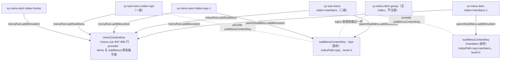
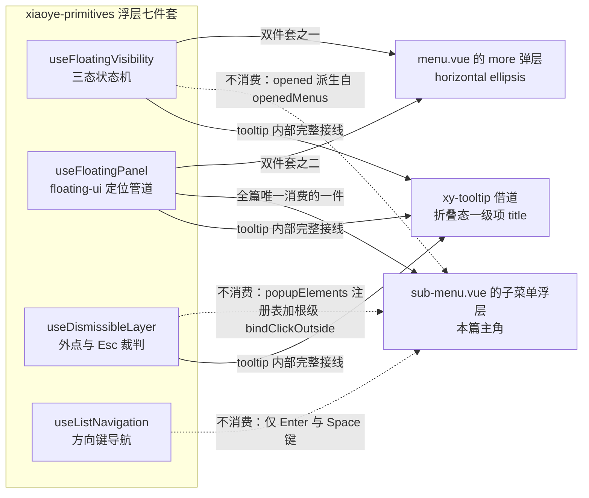
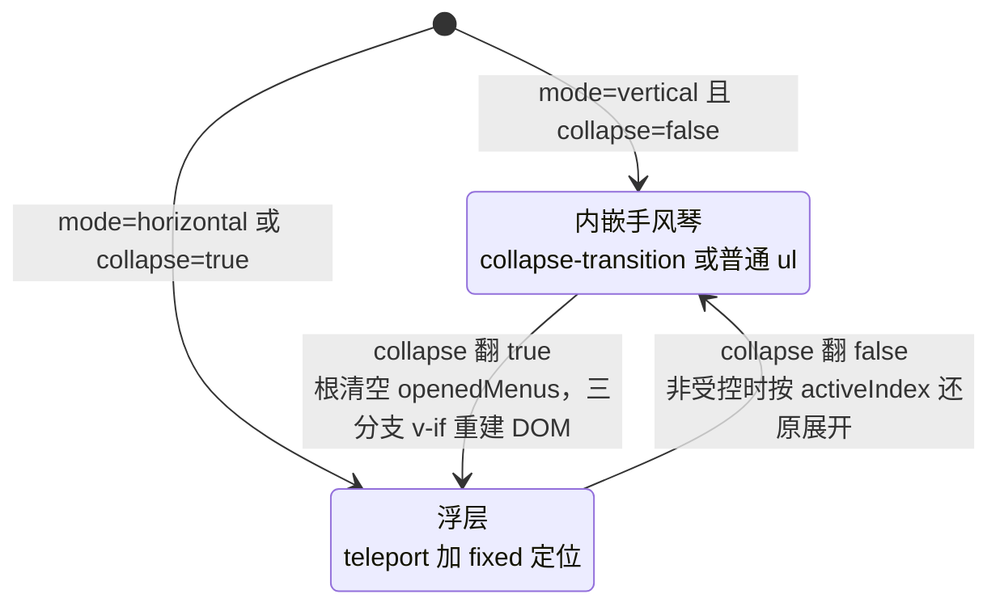

# 5-15 · Menu：层级注册与子菜单浮层

> 本篇是"组件深潜"卷的第十五篇。核心问题在分卷大纲里只有一句话：**SubMenu 如何复用通用浮层体系？** 4-05、4-06 两篇把浮层七件套的"标准接线"讲透了——4-06 以 dropdown 为样本给出过"领 z 序 → 管开合 → 管定位 → 管键盘 → 管关闭"的接线顺序。Menu 是这套标准接线的第一个"反例"：它的子菜单浮层只借了七件套里的一件，开合状态机、延迟定时器、外点关闭全部自己动手，而这个"反例"恰恰是合理的。本篇把两件事讲清楚：一是 menu 的层级注册为什么是全库唯一的"嵌套注册"变体（5-04 的父收集子、4-09 的 group 复合、5-12 的句柄登记之后，第四种形态）；二是SubMenu 的浮层接线在"借"与"不借"之间的取舍逻辑。

接到题目先复述一遍目标，防止写偏：menu 不是一篇能讲完的组件，它身上的话题至少有四个——`items` 数据驱动渲染、受控/非受控双模、横向 ellipsis 溢出收纳、router 模式。本篇只沿两条主线走：**层级注册**（多级 sub-menu 如何把自己挂进一棵可查询的树）和**子菜单浮层**（popup 模式的定位、开合、关闭语义各借了通用体系哪一块）。collapse 折叠作为"第三种展开形态"单独一节，因为它同时压在这两条主线的交点上。其余话题只在与主线交叉时带一笔。

涉及源码（本篇引用的全部行号均以当前工作区实态逐一核对）：

- `packages/components/menu/src/menu.vue`（1000 行，提供端：active index、openedMenus、注册表、ellipsis）
- `packages/components/menu/src/sub-menu.vue`（395 行，浮层接线端：本篇主角）
- `packages/components/menu/src/menu-item.vue`（139 行，叶子节点与折叠态 tooltip）
- `packages/components/menu/src/menu-item-group.vue`（27 行）与 `menu-item-group.ts`（10 行）
- `packages/components/menu/src/use-menu.ts`（26 行，链路拼接）、`types.ts`（52 行）、`tokens.ts`（5 行）
- `packages/components/menu/src/menu.ts`（199 行，props/emits/数据契约）
- `packages/components/menu/index.ts`（68 行）、`packages/components/menu/__tests__/menu.spec.ts`（734 行）
- `packages/theme/src/components/menu.css`（524 行）、`tests/types/fixtures/menu.ts`（201 行）
- 对照：`packages/xiaoye-primitives/src/composables/use-floating-panel.ts`（161 行）、`use-floating-visibility.ts`（249 行）
- 示例：`apps/docs/examples/menu/`（basic、vertical、collapse、controlled、items、left-and-right、overflow-offset 七例）

---

## 一、先看全景：四个文件的角色分工

menu 的目录结构在全库组件里属于"文件多而单个短"的形态：`src/` 下十三个文件加起来不到两千行，最大的 `menu.vue` 1000 行。分工比行数更值得看——这是一套典型的"提供端 / 接线端"拆法：

- **`menu.vue` 是唯一的提供端**：持有 `activeIndex`、`openedMenus` 两块全局状态（各自支持受控/非受控双轨）、两张注册表、ellipsis 测量逻辑和 more 弹层。所有跨层级的状态都从这里出发。
- **`sub-menu.vue` 是接线端**：向上消费根菜单的 context，向下再 provide 一层自己的 context；浮层模式下负责定位接线、延迟开合、注册弹层元素。
- **`menu-item.vue` 是叶子**：只做"注册自己 + 上报点击"两件事，外加折叠态的 title tooltip。
- **`menu-item-group.vue` 是旁观者**：纯展示组件，不注册、不提供 context、不参与状态——这个"什么都不做"本身是个设计决策，2.4 节展开。

先看根菜单开头那几行状态声明，这是后面一切故事的起点（`menu.vue:78-82`）：

```ts
// packages/components/menu/src/menu.vue:78-82
const sliceIndex = ref(-1);
const measuredItemWidths = ref<number[]>([]);
const items = shallowRef<Record<string, InternalMenuNode>>({});
const subMenus = shallowRef<Record<string, InternalMenuNode>>({});
const popupElements = new Set<HTMLElement>();
```

五行声明里有三样东西：两张注册表（`items`、`subMenus`，键是 `index` 字符串）、一个弹层元素集合（`popupElements`，给外点关闭用，3.5 节讲）、一对 ellipsis 测量缓存。注意两张注册表用的是 `shallowRef` 而不是 `ref`——4-05 提过浅层响应式的坑，这里写入时永远整表替换（450-474 行的 add/remove 都是 `{ ...旧表, ... }` 生成新对象），依赖的是"换表引用"触发更新，而不是深层代理。

## 二、层级注册：两把 InjectionKey 撑起的嵌套注册表

### 2.1 第四种注册变体

注册模式在这个专栏里已经出现过三次：5-04 的 breadcrumb 是"父收集子"——子组件挂载时把自己报给最近的收集者；4-09 的 group 复合模式是"属性下发与汇总收口"——group 单向广播，子组件回传汇总；5-12 的 carousel 是"登记操作句柄"——item 注册的不是数据而是能被命令式调用的方法。menu 是第四种：**嵌套注册**——注册中心本身是一层套一层的，每个 sub-menu 既是"根菜单注册表的被注册者"，又是"自己子树的注册中心"。

支撑这件事的只有两把钥匙（`tokens.ts:1-5` 全文）：

```ts
// packages/components/menu/src/tokens.ts:1-5
import type { InjectionKey } from "vue";
import type { MenuProvider, SubMenuProvider } from "./types";

export const menuContextKey = Symbol("xiaoye-menu") as InjectionKey<MenuProvider>;
export const subMenuContextKey = Symbol("xiaoye-sub-menu") as InjectionKey<SubMenuProvider | null>;
```

`menuContextKey` 全组件树只有一份，由 `menu.vue:847-865` provide；`subMenuContextKey` 可以有任意多份，每层 sub-menu provide 一份。两把钥匙的 provider 契约定义在 `types.ts`（`types.ts:17-52`）：

```ts
// packages/components/menu/src/types.ts:17-52
export interface InternalMenuNode {
  index: string;
  indexPath: ComputedRef<string[]>;
  active: ComputedRef<boolean>;
  disabled?: boolean;
}

export interface MenuProvider {
  openedMenus: Readonly<Ref<string[]>>;
  items: Ref<Record<string, InternalMenuNode>>;
  subMenus: Ref<Record<string, InternalMenuNode>>;
  activeIndex: Readonly<Ref<string>>;
  isMenuPopup: ComputedRef<boolean>;
  props: Readonly<MenuProps>;
  addMenuItem: (item: InternalMenuNode) => void;
  removeMenuItem: (index: string) => void;
  addSubMenu: (item: InternalMenuNode) => void;
  removeSubMenu: (index: string) => void;
  openMenu: (index: string, indexPath: string[]) => void;
  closeMenu: (index: string, indexPath: string[]) => void;
  handleMenuItemClick: (item: MenuItemClicked) => void;
  handleSubMenuClick: (subMenu: MenuItemClicked) => void;
  registerPopupElement: (element: HTMLElement) => void;
  unregisterPopupElement: (element: HTMLElement) => void;
  closeAllMenus: () => void;
}

export interface SubMenuProvider {
  indexPath: ComputedRef<string[]>;
  level: number;
  addMenuItem: (item: InternalMenuNode) => void;
  removeMenuItem: (index: string) => void;
  addSubMenu: (item: InternalMenuNode) => void;
  removeSubMenu: (index: string) => void;
  keepAlive: () => void;
}
```

`MenuProvider` 的成员清单就是根菜单的公共 API 面：注册四件（add/remove × item/subMenu）、开合两件、点击两件、弹层注册两件、外加 `closeAllMenus`。特别注意 `props` 原样下发这一项——所有后代都能直接读 `menuRoot.props.mode`、`menuRoot.props.collapse`、`menuRoot.props.persistent`，这个做法在 `sub-menu.vue` 里每几行就出现一次。`SubMenuProvider` 则是每层 sub-menu 对自己子树下发的"迷你版根契约"，多出一个 `keepAlive`。

真正让"嵌套"成立的是 `use-menu.ts`——全库最短的 composable 之一，26 行干完了层级定位的全部工作（`use-menu.ts:1-26` 全文）：

```ts
// packages/components/menu/src/use-menu.ts:1-26
import { computed, inject } from "vue";
import { menuContextKey, subMenuContextKey } from "./tokens";

export function useMenu(index: () => string) {
  const rootMenu = inject(menuContextKey, null);
  const parentSubMenu = inject(subMenuContextKey, null);

  const indexPath = computed(() => {
    const value = index();

    if (!value) {
      return parentSubMenu?.indexPath.value ?? [];
    }

    return [...(parentSubMenu?.indexPath.value ?? []), value];
  });

  const level = computed(() => parentSubMenu?.level ?? 0);

  return {
    rootMenu,
    parentSubMenu,
    indexPath,
    level
  };
}
```

`indexPath` 是整棵树的"身份证号生成器"：一级 `sub-menu index="ops"` 的 indexPath 是 `["ops"]`，它内部的 `sub-menu index="members"` 是 `["ops", "members"]`，再里面的 `menu-item index="logs"` 是 `["ops", "members", "logs"]`。链是怎么拼出来的？每个节点的 indexPath 都是"父 sub-menu 的 indexPath + 自己的 index"，而"父 sub-menu 的 indexPath"来自 inject——**上一层的计算结果成为下一层的输入原料**。`level` 同理：`parentSubMenu?.level ?? 0`，加一的操作发生在 sub-menu provide 的时候（`sub-menu.vue:314` 的 `level: level.value + 1`）。

注册表里存的节点是"活引用"：`InternalMenuNode.indexPath` 和 `active` 都是 `ComputedRef` 而非快照值。这意味着注册动作只在 `onMounted` 发生一次，之后 indexPath 永远自动最新（父级 index 改了，所有后代的 indexPath 跟着变），active 也永远反映当前激活态。注册表存的不是死数据，是"指向活体计算属性的指针"。

### 2.2 注册动作：一次挂载，两处登记

嵌套注册的关键动作在 sub-menu 的生命周期钩子里（`sub-menu.vue:322-338`）：

```ts
// packages/components/menu/src/sub-menu.vue:322-338
onMounted(() => {
  parentSubMenu?.addSubMenu(subMenuState);
  menuRoot.addSubMenu(subMenuState);
});

onBeforeUnmount(() => {
  clearOpenTimer();
  clearCloseTimer();

  if (popupRef.value) {
    menuRoot.unregisterPopupElement(popupRef.value);
  }

  stopAutoUpdate();
  parentSubMenu?.removeSubMenu(props.index);
  menuRoot.removeSubMenu(props.index);
});
```

一个 sub-menu 挂载时**同时向两个注册中心登记**：向最近的祖先 sub-menu 登记一次（`parentSubMenu?.addSubMenu`），再向根菜单的全局表登记一次（`menuRoot.addSubMenu`）。menu-item 的对应动作一模一样（`menu-item.vue:93-101`）：`parentSubMenu?.addMenuItem(itemState)` 加 `menuRoot.addMenuItem(itemState)`。

为什么两边都要登记？因为两张表的查询需求不同：

- **根菜单的全局表**服务"按 index 直查"场景：`syncOpenedMenusByActive` 要按激活项的 index 反查它的 indexPath（`menu.vue:534` 的 `items.value[targetIndex]`）、`exposes.open/close` 要按 index 找到目标 sub-menu 并拿到它的 indexPath 去开合（`menu.vue:923-940`）。扁平 map 让这些查询都是 O(1)。
- **父 sub-menu 的局部表**服务"子树内部聚合"场景：sub-menu 的 `active` 计算（`sub-menu.vue:61-65`）要遍历"自己直接的 children"看有没有激活的——注意是**直接** children：sub-menu 的局部 `items`/`subMenus` 只收录了 inject 到自己 context 的那一层节点，孙级不会混进来（孙级 inject 到的是中间那层 sub-menu 的 context）。这让"激活态沿层级冒泡"成为一次 shallow 遍历而不是深搜。

冒泡的实现就是两行 computed（`sub-menu.vue:61-65`）：

```ts
// packages/components/menu/src/sub-menu.vue:61-65
const active = computed(
  () =>
    Object.values(items.value).some((item) => item.active.value) ||
    Object.values(subMenus.value).some((item) => item.active.value)
);
```

二级 sub-menu 的 active 是"我的叶子有激活的"；一级 sub-menu 的 active 是"我的直接子节点（可能是二级 sub-menu）有 active 的"——而二级的 active 又是它自己子树的聚合结果。active 就这样沿着局部注册表一层层向上"或"了出去，最终一级 sub-menu 的 title 拿到高亮（样式侧 `.xy-sub-menu.is-active > .xy-menu__item-surface`，`menu.css:187-192`）。嵌套注册的"注册中心即节点、节点即注册中心"在这个冒泡链里体现得最完整。

### 2.3 注册表结构的完整链路图



图上能读出嵌套注册的全部要点：实线是注册动作（每个节点两处登记），虚线是 context 注入关系（每层 sub-menu 一次 provide），group 是唯一的"透明层"。

### 2.4 menu-item-group 的旁路

group 的实现只有 27 行，一个 `li` 加一个标题加一个 `ul`，没有 script 逻辑（除了 `useNamespace`）。它不 provide 任何 context，也没有 index。后果是：group 内部的 menu-item 调用 `useMenu()` 时，inject 到的 `subMenuContextKey` 是 **group 外面最近那层 sub-menu 的**——group 在注册链路上是透明的。

这个设计解释了两个现象。其一，indexPath 天然跳过 group：`["ops", "members", "logs"]` 里永远不会出现 group 的位置，因为 group 没有可注入的 indexPath。其二，group 内的激活项能把 active 正确冒泡到祖先 sub-menu——冒泡路径是"item → 最近 sub-menu 的局部表"，group 只是个 DOM 容器，不在逻辑链上。对比 4-09 的 group 复合模式（checkbox-group/radio-group 是真正的逻辑节点，承担属性下发与汇总收口），menu-item-group 是"视觉 group"而不是"逻辑 group"：菜单的层级语义由 sub-menu 承担，group 只负责一块带标题的视觉分区。两种 group 在同一个库里并存，分界线就是"要不要参与状态链"。

### 2.5 权衡一：扁平表加注入链，而不是树形注册表

把上面的结构推到抽象层：menu 的注册表形态是"**每层一张扁平 map + inject 链拼装路径**"，而不是"根节点持有一棵树、子节点递归挂载"。这个选择有明确的收益，也有一个隐式约束。

收益有三条。第一，全局查询 O(1)：`syncOpenedMenusByActive`、`exposes.open/close`、`handleResize` 后的测量都直接查表，不用遍历树。第二，注册动作零协调：节点挂载时向"能 inject 到的所有注册中心"各登记一次，注册中心之间不需要互相感知层级关系——对比 5-04 breadcrumb 的单点收集，menu 的双登记多了一次成本，但换来了"局部聚合"与"全局直查"两套查询各自最优。第三，`shallowRef` 换表写入让"注册表变化触发重算"的粒度可控（比如 `menu.vue:793-805` 那个 watch 依赖了 `Object.keys(items.value).length`）。

隐式约束是：**index 必须全局唯一**。根菜单的两张表都以裸 index 为键，两个不同子树里如果各有一个 `index="list"`，后挂载的会覆盖先挂载的（`menu.vue:450-455` 的 `addMenuItem` 直接按键覆写）。注入链不受影响（indexPath 来自 inject，与表无关），但全局直查会命中"最后注册的那个"。源码里没有对重复 index 的告警，这是文档需要交代而代码没兜住的一处——嵌套注册表把"树形唯一性"压缩成了"扁平键唯一性"，约束被悄悄收紧了。

## 三、核心问题：SubMenu 到底借了浮层体系的哪几件？

现在到本篇的核心问题。先把七件套的清单从 4-06 搬过来作参照：`useFloatingVisibility`（三态状态机）、`useOverlayStack`（全局浮层栈与 z 序）、`useOverlayDialog`（模态层接线）、`useFocusTrap`（焦点陷阱）、`useFloatingPanel`（定位管道）、`useDismissibleLayer`（关闭裁判）、`useListNavigation`（键盘导航）。tooltip 和 dropdown 是"全件套"或"五件套"的接线样本。SubMenu 借了几件？

**实码定论：一件。** `sub-menu.vue:18` 的 import 是唯一的判据：

```ts
// packages/components/menu/src/sub-menu.vue:18
import { useFloatingPanel, useNamespace } from "xiaoye-primitives";
```

整个 `sub-menu.vue` 里没有 `useFloatingVisibility`、没有 `useDismissibleLayer`、没有 `useListNavigation`、没有 `useOverlayStack`。`useFloatingPanel` 的接线在 107-116 行（`sub-menu.vue:107-116`）：

```ts
// packages/components/menu/src/sub-menu.vue:107-116
const { floatingStyle, updatePosition, startAutoUpdate, stopAutoUpdate } = useFloatingPanel(
  triggerRef,
  popupRef,
  {
    placement: () => popupPlacement.value,
    strategy: "fixed",
    offset: () => popupOffset.value ?? 0,
    zIndex: 2000
  }
);
```

四个选项全部传 getter，这正是 4-06 讲过的"定位管道的响应性入口不在选项上，而在何时调用 updatePosition"——SubMenu 严格遵守了这个契约。`zIndex: 2000` 是硬编码而不是 `useOverlayStack` 发放的序号，这是第二个"不借"：菜单浮层不参与全局浮层栈的争顶，层级预期就是"比页面内容高、浮层之间靠打开顺序"，一个常数够用。

placement 的取值逻辑藏在 74-76 行（`sub-menu.vue:74-76`）：

```ts
// packages/components/menu/src/sub-menu.vue:74-76
const popupPlacement = computed(() =>
  menuRoot.props.mode === "horizontal" && isFirstLevel.value ? "bottom-start" : "right-start"
);
```

一级水平菜单向下弹（`bottom-start`），其余一律向右弹（`right-start`）——包括垂直折叠态的一级、水平二级、以及折叠态里的嵌套浮层。向右弹是菜单族谱的"遗传"：浮层的参考元素是标题条，子菜单从右侧展开才符合"层级向深处生长"的空间直觉。

### 3.1 不借开合状态机：因为 visible 不是菜单的私有状态

那么开合为什么不借 `useFloatingVisibility`？答案要从"visible 属于谁"说起。

tooltip 的 visible 是组件私有布尔：开与关都是这个浮层实例自己的事，`useFloatingVisibility` 内部持有 `visible`/`rendered`/`isAnimating` 三个 ref，组件外围只是触发它。menu 完全不同——**"这个 sub-menu 开着吗"是根菜单全局状态的一个投影**。看 60 行（`sub-menu.vue:60`）：

```ts
// packages/components/menu/src/sub-menu.vue:60
const opened = computed(() => menuRoot.openedMenus.value.includes(props.index));
```

`openedMenus` 是根菜单的一维字符串数组（垂直展开模式的"手风琴状态"、popup 模式的"哪些浮层在屏上"，共用同一份数据），并且它有四重对外承诺：受控模式（`openedMenus` prop 优先）、`update:openedMenus` 同步、`open/close` 事件（`menu.ts:189-190`）、以及 `exposes.open/close` 命令式入口。如果 SubMenu 再从 `useFloatingVisibility` 里持有一份私有 `visible`，就得维护"私有 visible ⇄ 全局 openedMenus"的双向同步——两个状态源互踩，比不用还糟。

正确的做法是让全局状态当唯一事实源，浮层的显隐纯派生：模板里 `v-show="opened"`（`sub-menu.vue:370`），`v-if="rendered"` 控制首次挂载（369 行）。而 `rendered` + persistent 的语义恰好是 `useFloatingVisibility` 处理过的那套"persistent 为 true 时关闭后保留 DOM"——SubMenu 把它手写复刻了一遍（`sub-menu.vue:43` 的 `rendered` ref 与 294-296 行的 watch 分支）。这是"不借"的代价：三态状态机里的两个态被手工重写了。省掉的那个态是 `isAnimating`——`useFloatingVisibility` 里它服务于 toggle 守卫（防止关闭动画没播完时 toggle 又把浮层打开，4-06 引过它的 toggle 守卫段），而菜单里**不存在对单个浮层的 toggle**：所有开合请求都落在根菜单的 `openMenu/closeMenu` 上，状态单向流动，动画竞态的天花板不存在。手写反而更短。

### 3.2 延迟开合：手写定时器与差异化的默认值

popup 模式下的 hover 延迟开合是 SubMenu 手写的另一块（`sub-menu.vue:198-233`）：

```ts
// packages/components/menu/src/sub-menu.vue:198-233
function openMenuWithDelay() {
  clearOpenTimer();
  clearCloseTimer();

  if (props.disabled) {
    return;
  }

  if (!popupMode.value) {
    menuRoot.openMenu(props.index, indexPath.value);
    return;
  }

  const delay =
    props.showTimeout ?? (menuRoot.props.mode === "horizontal" ? menuRoot.props.showTimeout : 80);

  openTimer.value = window.setTimeout(() => {
    menuRoot.openMenu(props.index, indexPath.value);
  }, delay);
}

function closeMenuWithDelay() {
  clearOpenTimer();
  clearCloseTimer();

  if (!popupMode.value) {
    return;
  }

  const delay =
    props.hideTimeout ?? (menuRoot.props.mode === "horizontal" ? menuRoot.props.hideTimeout : 120);

  closeTimer.value = window.setTimeout(() => {
    menuRoot.closeMenu(props.index, indexPath.value);
  }, delay);
}
```

三处细节值得停留。第一，**非 popup 模式根本不进这套定时器**：模板 345 行的 mouseenter 只在 popupMode 为真时才调用 `openMenuWithDelay`（函数体内 206-208 行的非 popup 即时分支只是防御性兜底），hover 不触发展开，click 走 `handleClick` 即时开合，手风琴模式不需要防抖。第二，**延迟默认值分档**：水平模式沿用根菜单的 `showTimeout/hideTimeout`（默认各 300ms，`menu.ts:166-173`），垂直折叠态的浮层则硬编码 80ms 开、120ms 关——折叠菜单图标小、用户预期是"蹭到就弹"，300ms 的礼貌延迟在这里反而是钝感；关闭比打开慢 40ms，给鼠标从标题斜移到浮层留出容错（sub-menu 自身的同名 prop 优先于以上两者，77 行的 popupOffset 与 211-212、227-228 行的 timeout 是同一个 `props.xxx ?? 根默认` 模式）。同一对 props 在两种形态下给出两种体感，这个差异化没有写进文档，是读代码才看得见的调校。第三，**每次先双向清定时器**：open 前清 close、close 前清 open，"悬停/移出"的抖动在这对互斥清理里天然抵消，不需要 `useFloatingVisibility` 的 toggle 守卫。

定时器还有一条跨层级的联动：`keepAlive`（`sub-menu.vue:167-170`）：

```ts
// packages/components/menu/src/sub-menu.vue:167-170
function keepAlive() {
  clearCloseTimer();
  parentSubMenu?.keepAlive();
}
```

鼠标从一级浮层移进二级浮层的路上，会先后穿过两个 `mouseenter`：一级浮层的 `@mouseenter="keepAlive"`（模板 376 行）清掉一级的 close 定时器，二级标题区域的 keepAlive 沿注入链向上递归清掉所有祖先的 close 定时器。递归的终点是 `parentSubMenu?.keepAlive()` 遇到 null（一级 sub-menu 的 parentSubMenu 为 null）。一条 4 行的递归，托住了"N 级菜单之间移动浮层不闪断"的体感——这是浮层族组件里少见的"链式行为"，也是嵌套注册表（确切说是嵌套 context）送的红利：每层 SubMenu 都天然知道自己的父级是谁。

### 3.3 关闭语义：一个根裁决者，而不是每层一个裁判

外点关闭也"不借"。`useDismissibleLayer` 的模型是"每个浮层在 document 层架一个自己的裁判"（4-06 的 82 行关闭裁判），tooltip 单实例单裁判没问题；menu 若照搬，一级浮层、二级浮层、more 弹层会各架一个，而且菜单的关闭语义不是"关掉触发外点的那一层"而是"关掉整棵树"（点击菜单外部，所有浮层应全部收起）。所以 menu 把关闭裁决上收到根菜单一处（`menu.vue:885-905`）：

```ts
// packages/components/menu/src/menu.vue:885-905
if (props.closeOnClickOutside && menuRef.value) {
  unbindClickOutside = bindClickOutside(menuRef.value, (event) => {
    const target = event.target as Node | null;

    if (!target) {
      return;
    }

    if (morePopupRef.value?.contains(target) || moreTriggerRef.value?.contains(target)) {
      return;
    }

    for (const element of Array.from(popupElements)) {
      if (element.contains(target)) {
        return;
      }
    }

    closeAllMenus();
  });
}
```

逻辑是一条单行道：点在菜单根、more 触发器、more 弹层之外，且不在任何已注册弹层元素之内，就 `closeAllMenus()`（清空 openedMenus 并关掉 more 弹层，`menu.vue:524-527`）。"任何已注册弹层"就是开头见过的 `popupElements` 集合，注册与反注册发生在 sub-menu 的 watch 里（`sub-menu.vue:274-290`）：

```ts
// packages/components/menu/src/sub-menu.vue:265-301
watch(
  opened,
  async (value) => {
    clearOpenTimer();
    clearCloseTimer();

    if (value) {
      rendered.value = true;

      if (popupMode.value) {
        await nextTick();

        if (popupRef.value) {
          menuRoot.registerPopupElement(popupRef.value);
        }

        await updatePosition();
        startAutoUpdate();
      }

      return;
    }

    if (popupRef.value) {
      menuRoot.unregisterPopupElement(popupRef.value);
    }

    stopAutoUpdate();

    if (!menuRoot.props.persistent) {
      rendered.value = false;
    }
  },
  {
    immediate: true
  }
);
```

这个 watch 是浮层接线的总枢纽，一次读全：开时置 `rendered`、等一个 `nextTick`（等 `v-if` 把 ul 渲染出来）→ 注册进 `popupElements` → `updatePosition()` 首算 → `startAutoUpdate()` 挂 floating-ui 的 `autoUpdate` 循环（滚动、resize、布局变化时持续重定位，这是 `useFloatingPanel` 尾段的能力，`use-floating-panel.ts:126-151`）；关时反注册、停循环、非 persistent 则卸载 DOM。**开合状态由根派生，定位生命周期由 watch 驱动，关闭豁免由注册表支撑**——三件事在一个 watch 里串成线，每一件都只用了七件套的一角。

### 3.4 对照组：more 弹层与折叠 tooltip 的"标准接线"

要确认"SubMenu 只借一件"是选择而不是能力缺失，最好的办法是看同一个组件目录里两处"标准接线"。

第一处在 `menu.vue` 自己身上——横向 ellipsis 的 more 弹层（`menu.vue:185-205`）：

```ts
// packages/components/menu/src/menu.vue:185-207
const {
  visible: moreVisible,
  rendered: moreRendered,
  open: openMoreFloating,
  close: closeMoreFloating,
  clearTimers: clearMoreTimers,
  handleAfterLeave: handleMoreAfterLeave
} = useFloatingVisibility({
  persistent: () => props.persistent
});
const {
  floatingStyle: moreFloatingStyle,
  updatePosition: updateMorePosition,
  startMoreAutoUpdate,
  stopMoreAutoUpdate
} = useFloatingPanel(moreTriggerRef, morePopupRef, {
  placement: () => "bottom-start",
  strategy: "fixed",
  offset: () => props.popperOffset,
  zIndex: 2000
});
```

more 弹层是"双件套"消费：`useFloatingVisibility` 管开合加 `useFloatingPanel` 管定位。为什么它就能借状态机？因为 more 弹层**没有全局状态语义**——它不在 `openedMenus` 的管辖范围（溢出收纳是纯视觉行为，不受控、不发 open/close 事件、不参与 uniqueOpened），visible 就是它自己的私有布尔，和 tooltip 的形状一模一样。同一个 `menu.vue` 文件里，"有全局语义的浮层"手写、"无全局语义的浮层"借 composable，边界清晰得像一句注释。

第二处在 `menu-item.vue`——折叠态的一级菜单项用 `xy-tooltip` 展示被隐藏的 title（`menu-item.vue:113-128`）：

```vue
<!-- packages/components/menu/src/menu-item.vue:113-128 -->
<xy-tooltip
  v-if="showCollapsedTitleTooltip"
  placement="right"
  :offset="menuRoot.props.popperOffset"
  :persistent="menuRoot.props.persistent"
  :popper-class="collapsedTitleTooltipClass"
  :popper-style="menuRoot.props.popperStyle"
>
  <template #content>
    <slot name="title" />
  </template>

  <span :class="`${nsMenu.base.value}__tooltip-trigger`">
    <slot />
  </span>
</xy-tooltip>
```

这是第三条路径：**组件级复用**。tooltip 是七件套的完整消费者（4-05/4-06 的接线样本），menu-item 不自己接浮层，直接把 title 塞进 tooltip 的 content 槽。触发条件也讲究（`menu-item.vue:30-36`）：`level === 0 && mode === "vertical" && collapse && 有 title 插槽`——只有折叠态的一级项才需要 tooltip，嵌套层的 title 由父级浮层自己解决。测试专门验证了这个 tooltip 会透传 `popper-class` 与 `popperStyle`（`menu.spec.ts:281-319`），保证折叠态提示与子菜单浮层的皮肤一致。

三条路径摆在一张图里，本篇核心问题的答案就齐了：



### 3.5 权衡二：浮层复用的"半身"哲学

把 3.1 到 3.4 的观察收成一个设计判断：**menu 对浮层体系的复用是"按语义边界裁开的半身复用"**——凡"浮层作为组件私有 UI 状态"的部分（more 弹层、tooltip 借道）全盘复用七件套；凡"浮层作为全局业务状态投影"的部分（子菜单开合）只复用与状态无关的定位管道，状态机、延迟、关闭语义全部收归根菜单。这个裁法的判断标准不是"技术能不能"，而是"状态属不属于业务协议"：`openedMenus` 一旦进了受控/事件/命令式三重承诺，它就不能再是 composable 里的私有 ref。

代价也要如实记账。SubMenu 手写的部分（rendered/persistent 语义、open/close 定时器对）约 60 行，与 `useFloatingVisibility` 的对应能力存在语义重叠；如果未来 menu 要支持"单个 sub-menu 的受控开合"（类似 `:opened` per-item），这套手写状态就要扩一层。另一个小缺口在键盘侧：`useListNavigation` 没有消费，方向键导航缺失，现有键盘支持只有 Enter/Space 触发（`menu-item.vue:80-91`、`sub-menu.vue:252-263` 的 `handleKeydown`）加 `tabindex="-1"` 的聚焦语义，与 `role="menubar"/"menu"`（`menu.vue:118`）声明的 ARIA 模式之间还有距离——这是当前实现明确的未竟之地，不是"刻意从简"能完全开脱的。

## 四、collapse：一个组件的三种展开形态

### 4.1 isMenuPopup：一切分支的总开关

collapse 之所以能单独成一节，是因为它把 sub-menu 的渲染形态从"内嵌手风琴"整体切换成"浮层"。形态判定只有一行推导（`menu.vue:106-108`）：

```ts
// packages/components/menu/src/menu.vue:106-108
const isMenuPopup = computed(
  () => props.mode === "horizontal" || (props.mode === "vertical" && props.collapse)
);
```

根菜单的 `isMenuPopup` 作为 `MenuProvider` 成员下发（847-865 行的 provide 清单里有它），但 sub-menu 实际使用时又按自己拿到的 `menuRoot.props` 重推了一遍（`sub-menu.vue:57-59`）：

```ts
// packages/components/menu/src/sub-menu.vue:57-60
const popupMode = computed(
  () => menuRoot.props.mode === "horizontal" || (menuRoot.props.mode === "vertical" && menuRoot.props.collapse)
);
const opened = computed(() => menuRoot.openedMenus.value.includes(props.index));
```

（`popupMode` 与 `isMenuPopup` 表达式等价，前者是局部重推——顺带一提，这是 provider 下发 computed 与下发原始 props 并存的冗余：`MenuProvider` 里同时有 `isMenuPopup` 和 `props`，sub-menu 选了后者。两种读法都对，但"同一判定写两处"意味着将来改形态规则要改两个地方。）

popup 模式下，模板走三分支的第一支（`sub-menu.vue:365-383`）：

```vue
<!-- packages/components/menu/src/sub-menu.vue:365-393（省略两处空行） -->
<template v-if="popupMode">
  <teleport to="body" :disabled="!appendToBody">
    <transition name="xy-fade">
      <ul
        v-if="rendered"
        v-show="opened"
        ref="popupRef"
        :class="menuClasses"
        :style="[floatingStyle, popupStyle]"
        role="menu"
        data-menu-popup="true"
        @mouseenter="keepAlive"
        @mouseleave="closeMenuWithDelay"
      >
        <slot />
      </ul>
    </transition>
  </teleport>
</template>

<xy-menu-collapse-transition v-else-if="menuRoot.props.collapseTransition">
  <ul v-show="opened" :class="[`${nsSubMenu.base.value}__wrap`, 'xy-menu__sub-list']" role="menu">
    <slot />
  </ul>
</xy-menu-collapse-transition>

<ul v-else v-show="opened" :class="[`${nsSubMenu.base.value}__wrap`, 'xy-menu__sub-list']" role="menu">
  <slot />
</ul>
```

非 popup 的两支是"带过渡的手风琴"与"无过渡的手风琴"（`collapseTransition` 默认 true，过渡的 CSS 在 `menu.css:512-524` 的 `xy-menu-collapse` 命名 transition，scaleY 0.96 加淡入淡出）。三分支的 DOM 语义差异不只是样式：popup 支有 `teleport`、fixed 定位样式、`mouseenter/mouseleave` 接线；手风琴支什么都没有——一个 `ul` 承担不了三种身份，所以是 `v-if` 三选一。

`appendToBody` 的推导在 67-73 行（`sub-menu.vue:67-73`）：

```ts
// packages/components/menu/src/sub-menu.vue:66-73
const isFirstLevel = computed(() => level.value === 0);
const appendToBody = computed(() => {
  if (props.teleported !== undefined) {
    return props.teleported;
  }

  return isFirstLevel.value;
});
```

**默认只有一级浮层 teleport 到 body，二级及以上的浮层渲染在原地**（teleport 的 `disabled` 让内容留在文档原位）。这带来一个交互上的连锁收益：inline 渲染的二级浮层是 `li` 的 DOM 后代，鼠标移进去不会触发 `li` 的 `mouseleave`（mouseleave 不因进入后代而触发），`keepAlive/closeMenuWithDelay` 的时序天然宽松；而一级浮层 teleported 出去了，才需要在 `ul` 上显式接 `@mouseenter="keepAlive"`、`@mouseleave="closeMenuWithDelay"`（376-377 行）补回这条链。teleport 与否不只是层级上下文问题，直接改写了事件路径——测试 `menu.spec.ts:167-194` 验证的水平 hover 开合、`menu.spec.ts:196-210` 验证的 collapse 浮层，都依赖这条链路的正确性。

### 4.2 切换瞬间的状态编排

collapse 翻转时，根与子各做一次清理（`menu.vue:807-820`）：

```ts
// packages/components/menu/src/menu.vue:807-820
watch(
  () => props.collapse,
  (value) => {
    if (value) {
      commitOpenedMenus([]);
      closeMore(true);
      return;
    }

    if (!hasOpenedMenusProp.value) {
      syncOpenedMenusByActive(activeIndex.value, false);
    }
  }
);
```

折叠时清空所有展开（手风琴状态对浮层无意义）、顺手关掉 more 弹层；展开回去时若非受控，按当前激活项把祖先 sub-menu 重新展开（`syncOpenedMenusByActive` 的逻辑见第五节）。sub-menu 自己还有一个补刀（`sub-menu.vue:303-310`）：

```ts
// packages/components/menu/src/sub-menu.vue:303-310
watch(
  () => menuRoot.props.collapse,
  (value) => {
    if (value) {
      menuRoot.closeMenu(props.index, indexPath.value);
    }
  }
);
```

根已经 `commitOpenedMenus([])`，每个 sub-menu 又各自 `closeMenu` 一次——后者走的是 `closeMenu` 全流程（filter 后 commit，若数组没变则不发事件，`menu.vue:567-575`），在根已清空的情况下是幂等空转。这层冗余更像是"子组件不依赖根替自己收拾"的自洽防御：万一根的 watch 时序变化，子级仍能保证自己收起。

整个形态切换的有限状态机如下：



### 4.3 权衡三：三分支重建，而不是一个 ul 伺候三态

浮层支和手风琴支完全可以共用同一个 `ul`：把 teleport 拆出去、事件接线用条件绑定、样式类动态拼——一些库是这么做的。menu 选择了 `v-if` 三分支，代价是**collapse 翻转时整棵子树 DOM 销毁重建**：slot 里的 menu-item、嵌套 sub-menu 全部 unmount 再 mount，注册表经历一轮 remove/add 抖动（2.2 节的 onBeforeUnmount/onMounted 各跑一遍）。收益是三支模板各自纯粹：popup 支的 `role="menu"`、`data-menu-popup` 标记、事件接线、fixed 定位样式，与手风琴支的 `__sub-list` 缩进样式互不污染。对一个"折叠切换是低频操作、子树规模有限、注册表重建是纯内存操作"的场景，这个交换是划算的——menu 把"少一份状态胶水"看得比"省一次重建"重。反例是 5-12 carousel 的幻影 slide：那边选择复制 DOM 换循环语义，这边选择重建 DOM 换模板纯粹性，两处的共同点是**宁可动 DOM，不写两份状态**。

## 五、active 联动：注册表的第二个用途

注册表的第一节讲了"结构与登记"，这一节讲"它如何被消费"。激活联动是全组件状态密度最高的一段，核心是三个函数。

**第一段：激活项如何反推展开项。** `syncOpenedMenusByActive`（`menu.vue:529-547`）：

```ts
// packages/components/menu/src/menu.vue:529-547
function syncOpenedMenusByActive(targetIndex: string, emitUpdate = false) {
  if (!targetIndex || props.mode === "horizontal" || props.collapse) {
    return;
  }

  const activeItem = items.value[targetIndex];

  if (!activeItem) {
    return;
  }

  const path = activeItem.indexPath.value.slice(0, -1).filter((index) => Boolean(subMenus.value[index]));
  const currentOpened = openedMenus.value;
  const nextOpened = props.uniqueOpened
    ? path
    : Array.from(new Set([...currentOpened, ...path]));

  commitOpenedMenus(nextOpened, emitUpdate);
}
```

用户点了一个深层 item，根菜单从全局注册表里 O(1) 取到它的节点，拿 `indexPath` 掐头去尾（去掉自己，只留祖先），再 filter 掉非 sub-menu 的键——剩下的就是要展开的祖先链。`default-active="2-2"` 之所以能让 `sub-menu index="2"` 自动展开（`menu.spec.ts:79-95` 的用例），靠的就是这条链。这里能看到注册表存"活引用"的红利：`activeItem.indexPath.value` 是**当下**的路径，注册之后无论层级怎么变化，反推永远用最新值。

**第二段：开合的提交与互斥。** `openMenu`（`menu.vue:549-565`）：

```ts
// packages/components/menu/src/menu.vue:549-565
function openMenu(index: string, indexPath: string[]) {
  const currentOpened = openedMenus.value;

  if (currentOpened.includes(index)) {
    return;
  }

  const nextOpened = props.uniqueOpened
    ? [...currentOpened.filter((menuIndex) => indexPath.includes(menuIndex)), index]
    : [...currentOpened, index];

  if (!commitOpenedMenus(nextOpened)) {
    return;
  }

  emit("open", index, indexPath);
}
```

`uniqueOpened` 的互斥语义藏在 filter 谓词里：保留所有"在目标路径上"的祖先，其余全关——同层级互斥、祖先链保持，本质是用 indexPath 的公共前缀定义"合法留存集"。

**第三段：受控/非受控的提交双轨。** `commitActiveIndex/commitOpenedMenus`（`menu.vue:484-522`）是 4-04"双模考古"在 menu 落地的样子：非受控写 `innerXxx`，受控加写 `xxxOverride` 并在 prop watch 时以 prop 为准（`menu.vue:436-448` 的 `syncControlledXxxFromProp`）。`update:openedMenus` 事件在受控模式下成为"建议值"的上行通道，测试 `menu.spec.ts:360-406` 完整验证了"受控优先级与 update:* 同步"。

点击事件的汇聚点 `handleMenuItemClick`（`menu.vue:586-617`）把前面所有件串成一单：

```ts
// packages/components/menu/src/menu.vue:586-617
function handleMenuItemClick(item: MenuItemClicked) {
  if (props.mode === "horizontal" || props.collapse) {
    commitOpenedMenus([]);
  }

  closeMore(true);

  const { index, indexPath } = item;

  if (!index || !indexPath.length) {
    return;
  }

  if (props.router && router && typeof router.push === "function") {
    const route = item.route ?? (index as RouteLocationRaw);
    const routerResult = Promise.resolve(router.push(route)).then((result) => {
      if (!result) {
        commitActiveIndex(index);
        syncOpenedMenusByActive(index, true);
      }

      return result as void | NavigationFailure;
    }) as RouterResult;

    emit("select", index, indexPath, { index, indexPath, route }, routerResult);
    return;
  }

  commitActiveIndex(index);
  syncOpenedMenusByActive(index, true);
  emit("select", index, indexPath, { index, indexPath, route: item.route });
}
```

popup 模式点中叶子项，先清空全部展开并关 more——浮层用完即收；router 模式把 `NavigationFailure` 的判定权交给调用方（导航失败才落地 active，第 602-605 行的 `if (!result)`），`select` 事件第四参把这个 Promise 递出去（`menu.ts:27-32` 的事件签名里它是可选参）。一单点击，牵动注册表查询、双轨提交、浮层收尾、路由协作四条线，而每条线的入口都收敛在这一个函数里。

## 六、样式侧：一份 CSS 同时伺候三种容器

menu.css 的 524 行里，浮层相关的段落值得整段读（`menu.css:338-380`）：

```css
/* packages/theme/src/components/menu.css:338-380 */
.xy-menu__popup {
  position: relative;
  min-width: var(--xy-menu-popup-min-width);
  margin: 0;
  padding: var(--xy-menu-popup-padding);
  list-style: none;
  border: none;
  border-radius: var(--xy-menu-popup-radius);
  background: var(--xy-menu-popup-bg);
  color: var(--xy-menu-popup-text);
  box-shadow:
    0 0 0 1px color-mix(in srgb, var(--xy-border-subtle) 60%, transparent),
    0 4px 6px -1px rgba(0, 0, 0, 0.05),
    0 10px 20px -5px rgba(0, 0, 0, 0.08),
    0 25px 50px -12px rgba(0, 0, 0, 0.15);
}

/* 弹出菜单顶部高光效果 */
.xy-menu__popup::before {
  content: "";
  position: absolute;
  top: 0;
  left: 8px;
  right: 8px;
  height: 1px;
  background: linear-gradient(
    90deg,
    transparent,
    color-mix(in srgb, white 40%, transparent),
    transparent
  );
  pointer-events: none;
  z-index: 1;
}

.xy-menu__popup--dark {
  --xy-menu-popup-bg: color-mix(in srgb, var(--xy-text-heading) 94%, black);
  --xy-menu-popup-text: color-mix(in srgb, var(--xy-bg-floating) 92%, var(--xy-mix-light));
  --xy-menu-hover-bg: color-mix(in srgb, var(--xy-bg-container) 12%, transparent);
  --xy-menu-active-bg: color-mix(in srgb, var(--xy-brand) 18%, transparent);
  --xy-menu-active-shadow: inset 0 0 0 1px
    color-mix(in srgb, var(--xy-brand) 24%, transparent);
}
```

注意 `.xy-menu__popup--dark` 的写法：它**不新增任何规则**，只重绑定五个组件私有变量——hover 底色、激活底色、激活阴影在弹层内部自动切换成深色系（shadow 从 `inset` 描边改成品牌色描边），下游的 `.xy-menu__item-surface:hover`（181-185 行）、`.is-active`（187-192 行）规则一行不改就在两种肤质下各自成立。这是 3-01 令牌三层架构里"组件私有变量"的一次标准发挥：**皮肤切换靠变量翻转，不靠规则复制**。测试 `menu.spec.ts:337-358` 用一句"popup 默认风格保持克制但仍可正常展示"钉住了默认肤质的存在性。

同一套 hover/active 规则要伺候的容器其实有三种：根列表（`__root-list`）、手风琴子列表（`__sub-list`，左侧 1px 缩进线，331-336 行）、浮层（`__popup`）。浮层内 item 的激活态还有一处细节差异（`menu.css:417-436`）：

```css
/* packages/theme/src/components/menu.css:417-436 */
.xy-menu__popup .xy-menu__item-surface.is-active,
.xy-menu__popup .xy-sub-menu.is-active > .xy-menu__item-surface {
  color: var(--xy-menu-active-color);
  background: var(--xy-menu-active-bg);
  box-shadow: var(--xy-menu-active-shadow);
  font-weight: var(--xy-font-weight-semibold);
}

/* 弹出菜单 Active 左侧强调线 */
.xy-menu__popup .xy-menu__item-surface.is-active::before,
.xy-menu__popup .xy-sub-menu.is-active > .xy-menu__item-surface::before {
  content: "";
  position: absolute;
  left: 6px;
  top: 20%;
  bottom: 20%;
  width: 3px;
  background: var(--xy-brand);
  border-radius: 0 var(--xy-radius-sm) var(--xy-radius-sm) 0;
}
```

强调线在根列表里 `left: 0`（195-205 行，贴住容器左缘），在浮层里 `left: 6px`（浮层有 10px 内边距，线要退到内容区左缘）。同一个视觉语言在两种容器里的参数微调，全部走的是"容器选择器 + 同一组件私有变量"的组合，没有第二套 active 规则。

字重档消费是 3-06 埋的伏笔，本篇回收：`menu.css` 的 46 行（`--xy-menu-item-font-weight: var(--xy-font-weight-regular)`）、56 行（组标题 semibold）、77 行（extra 文本 regular）三处组件私有变量在定义侧转发全局档；139 行（item surface）、238 行（组标题）、487 行（extra）三处在消费侧引用；另外 210 行（垂直激活加粗）、422 行（浮层激活加粗）、480 行（badge）是直接引用全局档的位点。扩档战争里沉淀出的"组件私有默认值"模式，menu 是三个样本组件之一。

## 七、对照 Element Plus：组件级复用与组合式级复用

EP 的 menu 同样把开合状态收在根（`openedMenus`），但浮层载体的复用层次不同：popper 模式下的 ElSubMenu 把内容包进 ElTooltip/ElPopper——可见性状态机、teleport、关闭语义都由 tooltip/popper 组件内化，menu 层只负责在触发器上接 hover/click、把 `openedMenus` 与 popper 的 visible 做同步；内嵌展开则交给 ElCollapseTransition。可以把两种取向概括为：**EP 是"组件级复用"——借一个现成的浮层组件，再在其上做状态桥接；本库是"组合式级复用"——只借与状态无关的定位管道，状态从根到叶自管**。前者省掉了手写 rendered/persistent 与定时器（EP 复用了 tooltip 那套成熟语义），但要付"两份可见状态互相同步"的桥接成本；后者把同步成本归零，代价是本文 3.1、3.2 节那几十行手写。注册结构两边也高度同构：EP 的 sub-menu 同样有"向最近的 parent 与 rootMenu 登记"的双头动作，indexPath 同样沿组件链逐级拼接——嵌套注册这个形态，两边独立演化到了同一个答案。形态判定的表达式两边几乎一致，都是"horizontal，或 vertical 且 collapse"即浮层；差异在 teleport 策略：本库默认仅一级 teleport 到 body（`appendToBody = teleported ?? isFirstLevel`，`sub-menu.vue:67-73`），二级起 inline 渲染以收紧 mouseleave 链路（4.1 节）。EP 侧事实核对自 element-plus dev 分支 menu 源码，行号不一一列出。

## 八、使用守则与收束

三条守则收尾：

- **index 全局唯一是硬约束**：嵌套注册的扁平表以 index 为键，跨子树撞键会静默覆盖全局直查（indexPath 与激活冒泡不受影响）。用业务 id（`"ops-alerts"` 这类）而非裸序号，撞键概率趋近于零。
- **浮层形态的 props 有一致的透传链**：`popperOffset/popperClass/popperStyle/persistent` 在根菜单上配置会下发到所有 sub-menu 浮层与折叠 tooltip；sub-menu 级的 `popperOffset/popperClass/teleported` 可单点覆盖（`sub-menu.vue:77-79` 的 `props.xxx ?? menuRoot.props.xxx` 模式）。要让某个子菜单"不飞出去"，`teleported: false` 而不是改样式。
- **键盘可达性现状要心里有数**：Enter/Space 可触发、`tabindex` 为 -1 可聚焦，但没有方向键导航；对键盘用户是"可达但不好用"，有强诉求的场景暂需自行补 roving tabindex 或等后续版本。

最后把本篇的结论收进一句话：menu 的层级注册是"每层一张扁平表加注入链拼路径"的嵌套变体——局部聚合与全局直查两头讨好，代价是 index 唯一性约束从树形收紧到扁平；而 SubMenu 的浮层答案是"半身复用"——定位管道借七件套，开合与关闭语义因 `openedMenus` 的业务协议身份而自管，more 弹层与折叠 tooltip 则是同一目录里"全盘复用"的对照组。借不借、借哪件，判据只有一条：这个状态是组件的，还是业务的。

下一篇预告：5-16《Row：栅格的 provide 侧》。从 menu 的"provide 出去一张注册表"转到 Row 的"provide 出去一组 gutter 变量"——栅格系统里，`xy-row` 如何把自己算出来的间距以 CSS 变量与注入两种形态下发给不认识自己的 `xy-col`，`gutter` 在响应式断点下如何从数组退化成单值、又是谁在窗口缩放时驱动重算。同样是 provide 侧的学问，menu 提供的是"可查询的层级事实"，Row 提供的是"可继承的布局参数"，5-16 拆后者。

---

*本篇代码引用核对于当前工作区实态：`packages/components/menu/src/menu.vue`（1000 行）、`src/sub-menu.vue`（395 行）、`src/menu-item.vue`（139 行）、`src/menu-item-group.vue`（27 行）、`src/menu.ts`（199 行）、`src/sub-menu.ts`（69 行）、`src/types.ts`（52 行）、`src/tokens.ts`（5 行）、`src/use-menu.ts`（26 行）、`packages/components/menu/index.ts`（68 行）、`packages/components/menu/__tests__/menu.spec.ts`（734 行）、`packages/theme/src/components/menu.css`（524 行）、`tests/types/fixtures/menu.ts`（201 行）、`packages/xiaoye-primitives/src/composables/use-floating-panel.ts`（161 行）、`use-floating-visibility.ts`（249 行）、`apps/docs/examples/menu/` 七例。浮层七件套的清单与接线顺序引自本专栏 4-05、4-06；字重档位点引自 3-06。EP 侧事实核对自 element-plus dev 分支 menu 源码。*
