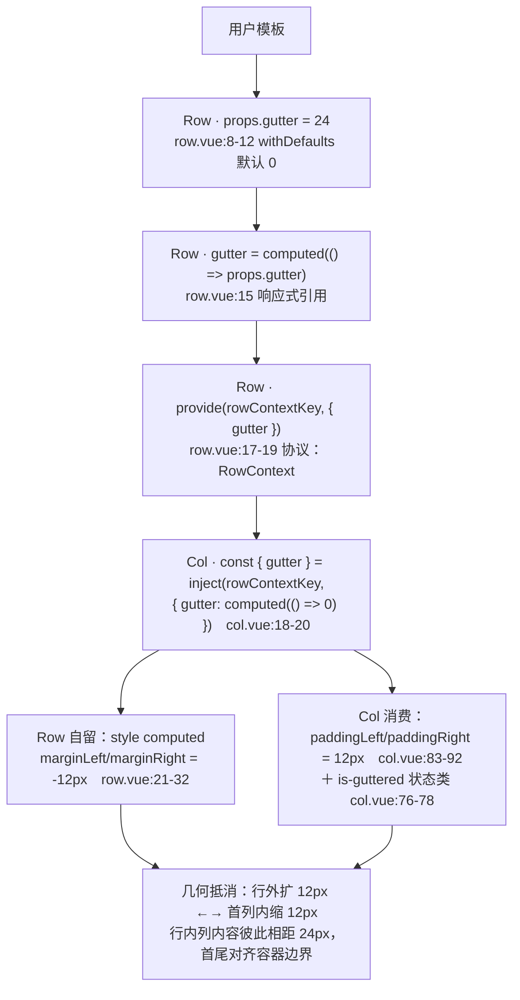
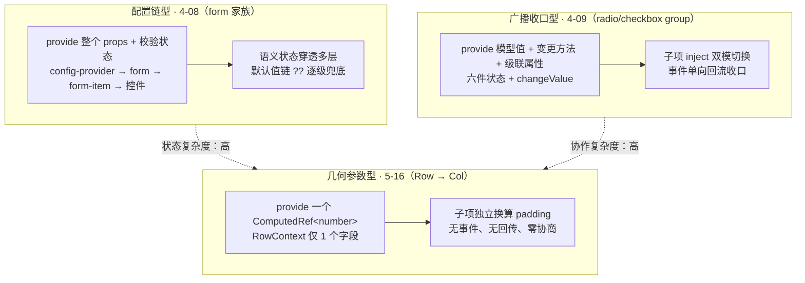

# 5-16 · Row：栅格的 provide 侧与 gutter 下发

> 本篇源码坐标（均为当前工作区实态）：
> - provide 端：`packages/components/row/src/row.vue`（45 行）、`packages/components/row/src/row.ts`（28 行）
> - inject 端消费段：`packages/components/col/src/col.vue`（99 行，只抽 gutter 相关段，Col 全貌留给 5-17）
> - 样式：`packages/theme/src/components/row.css`（39 行）、`packages/theme/src/components/col.css`（3020 行，本篇只看 1-10 行）
> - 测试：`packages/components/row/__tests__/row.spec.ts`（46 行）、`packages/components/col/__tests__/col.spec.ts`（140 行）
> - 类型夹具与示例：`tests/types/fixtures/row.ts`（57 行）、`apps/docs/examples/row/`（basic / alignment / gutter / responsive 四例）

栅格是前端组件库里最老的一类基础设施：把一行切成 24 等份，列凭 `span` 占位、凭 `offset` 让位、凭断点类在视口变化时改占位。但栅格系统真正难写的从来不是"24 等分"——那只是一组百分比宽度——而是**列与列之间的间距（gutter）怎么跨组件边界下发**。列宽是每个 Col 自己的私事，间距却是整行的公共契约：Row 知道 gutter 的值，却不是间距的落点；Col 是间距的落点，却不知道 gutter 的值。本篇要拆的，就是这对组件之间那根最细、也最典型的 provide 水管。

按 5-02 立下的"类型层—视图层—逻辑层"框架看，Row 的三层薄到近乎透明：`row.ts` 28 行、`row.vue` 45 行、`row.css` 39 行，测试 46 行——五个文件加起来不到 160 行。但正因为薄，它才是一份完美的"provide 侧"解剖样本：没有模型值、没有事件收口、没有级联逻辑，上下文对象里只有一个字段。把它和 4-08 的表单配置链、4-09 的 group 广播收口摆在一起，provide/inject 这门技术的三种用法就齐了。本篇的核心问题只有一句话：**gutter 这个数字，是怎么从 Row 的 props 走到每一个 Col 的 padding 上，又能被 Row 自己的负 margin 精确抵消的？**

## 一、类型层：28 行里的四个决定

先看类型层全文，`packages/components/row/src/row.ts:1-28`：

```ts
// packages/components/row/src/row.ts:1-28（全文）
import type { ComputedRef, InjectionKey } from "vue";

export const rowJustifies = [
  "start",
  "center",
  "end",
  "space-around",
  "space-between",
  "space-evenly"
] as const;

export const rowAligns = ["top", "middle", "bottom"] as const;

export type RowJustify = (typeof rowJustifies)[number];
export type RowAlign = (typeof rowAligns)[number];

export interface RowProps {
  tag?: string;
  gutter?: number;
  justify?: RowJustify;
  align?: RowAlign;
}

export interface RowContext {
  gutter: ComputedRef<number>;
}

export const rowContextKey: InjectionKey<RowContext> = Symbol("xiaoye-row");
```

28 行里做了四个决定，每一个都值得单独说。

**决定一：联合类型从常量数组派生，而不是手写。** `rowJustifies` 和 `rowAligns` 是两个 `as const` 数组，`RowJustify` 和 `RowAlign` 用 `(typeof rowJustifies)[number]` 从数组元素类型反推联合。这个写法的价值在第 34-38 行（row.vue 的类名拼接）兑现时才显现：运行时数组与编译时联合同源，CSS 里每加一个对齐类，这里改一行数组就同时更新了类型、文档和运行时——三处不会漂移。EP 的同位置文件用的是大写常量名 `RowJustify`、`RowAlign`（element-plus `row.ts` 里 `RowJustify = ['start', ...] as const`），xy 把运行时数组命名为小写复数 `rowJustifies`、把类型命名为单数 `RowJustify`，运行时值与类型名各占一个命名空间，这是仓库里 `alertPlacements`、`dialogPlacement` 等一系列组件沿用的同一套命名纪律。

**决定二：`gutter?: number`——单形态。** 这个类型签名本身就是一次收敛，第五节展开，这里只立事实：xy 的 gutter 只接受一个数字，不支持对象（按断点映射）也不支持数组（水平垂直各一），与 EP 当前 dev 分支的 `gutter?: number` 完全一致；三形态是 Ant Design 系的玩法。

**决定三：上下文里包的是 `ComputedRef`，不是裸值。** `RowContext` 接口写的是 `gutter: ComputedRef<number>`。如果只看类型，你会觉得直接下发 `props.gutter`（一个 number）也够用——但那是把响应性拦腰斩断的写法，第二节用测试证明它错在哪。

**决定四：`InjectionKey<RowContext>` + 运行时 `Symbol`。** `InjectionKey` 是 Vue 的幻影类型，`inject(rowContextKey)` 的返回值自动推成 `RowContext | undefined`，调用方不需要手工断言。key 本体是 `Symbol("xiaoye-row")`——每次模块加载生成的新 Symbol，严格限定"同一个 Row 实例家族内部"父子才能对上。4-08 拆表单配置链时对比过两种取法：config-provider 用 `Symbol.for("xiaoye-config-provider")` 注册表式全局 Symbol，是为了让配置穿透多份组件库实例；Row 用一次性 `Symbol`，是因为 gutter 恰恰**不能**穿透——文档页外层某个无关的 `xy-row` 不该给嵌套在它里面的另一个栅格行喂 gutter，尽管 Vue 的 provide 机制允许子组件沿祖先链一路向上找。一次性 Symbol 让"找不到就落地到 inject 默认值"成为唯一的错误路径。

## 二、provide 端：45 行里的三件事

视图层全文，`packages/components/row/src/row.vue:1-45`：

```vue
<!-- packages/components/row/src/row.vue:1-45（全文） -->
<script setup lang="ts">
import { computed, provide } from "vue";
import type { CSSProperties } from "vue";
import { useNamespace } from "xiaoye-primitives";
import type { RowProps } from "./row";
import { rowContextKey } from "./row";

const props = withDefaults(defineProps<RowProps>(), {
  tag: "div",
  gutter: 0,
  justify: "start"
});

const ns = useNamespace("row");
const gutter = computed(() => props.gutter);

provide(rowContextKey, {
  gutter
});

const style = computed<CSSProperties>(() => {
  if (!props.gutter) {
    return {};
  }

  const halfGutter = props.gutter / 2;

  return {
    marginLeft: `-${halfGutter}px`,
    marginRight: `-${halfGutter}px`
  };
});

const rowClasses = computed(() => [
  ns.base.value,
  props.justify !== "start" ? ns.is(`justify-${props.justify}`, true) : "",
  props.align ? ns.is(`align-${props.align}`, true) : ""
]);
</script>

<template>
  <component :is="props.tag" :class="rowClasses" :style="style">
    <slot />
  </component>
</template>
```

45 行的组件做了三件事：**把 gutter 装进水管**、**用自己的负 margin 抵消 gutter**、**把 justify/align 归一成状态类**。第三件事第六节单独讲，先看前两件。

第一件是第 15-19 行：

```ts
const gutter = computed(() => props.gutter);

provide(rowContextKey, {
  gutter
});
```

注意下发的不是 `props.gutter` 这个数字，而是一个 `ComputedRef<number>`。两者的差别在"用户动态改 gutter"这个场景里见分晓：`props.gutter` 是 props 对象上的一个属性，`provide` 时如果把裸值取出来塞进 context，context 里存的就是 provide 那一刻的快照——之后用户把 `:gutter="20"` 改成 `:gutter="40"`，Row 自己的负 margin 会跟着变（`props` 是响应式的，`style` computed 会重算），但下游 Col 拿到的还是 20，整行布局就此错裂：Row 的负 margin 是 -20px，Col 的 padding 却还是 10px，首尾列向内缩进的量与行的外扩量对不上，视觉上整行"悬"在容器外面。包一层 `computed` 再下发，下游读的是 `gutter.value`，依赖追踪链从 Col 的 style computed 一路通到 Row 的 props——`col.spec.ts` 第 83-114 行专门有一个用例钉死这个行为，第三节贴全文。

顺带一提 `computed(() => props.gutter)` 这层看似多余的包装：直接 `provide(rowContextKey, { gutter: props })` 也行（4-08 里 form 就是下发整个 props 对象），但那样 Col 就得写成 `row.props.gutter`——协议从"一个数字的引用"膨胀成"对父组件整个 props 的访问权"。Row 选了最小表面积：context 里只有 gutter 这一个字段、这一个引用。协议越窄，子组件对父组件的耦合面越小，这是 provide 协议设计里比"传什么"更重要的"不传什么"。

第二件是第 21-32 行的负 margin。这段代码是全篇的几何核心，先把它的行为说透：`gutter` 为 0（或未传，默认 0）时返回空对象，根节点上不出现任何 style；非零时左右各加 `-${gutter / 2}px` 的负 margin。它和 Col 端的 padding 是同一枚硬币的两面——第四节用几何图把这笔账算清。

对比 EP 的同名实现（element-plus dev 分支 `row.vue`）可以确认这份方案的同构性：

```ts
// element-plus packages/components/row/src/row.vue（dev 分支，节选）
const gutter = computed(() => props.gutter)
provide(rowContextKey, { gutter })

const style = computed(() => {
  const styles: CSSProperties = {}
  if (!props.gutter) {
    return styles
  }
  styles.marginRight = styles.marginLeft = `-${props.gutter / 2}px`
  return styles
})
```

EP 用连等赋值把两条 margin 写在一行，xy 分成 `marginLeft`/`marginRight` 两个键——纯风格差异；`if (!props.gutter)` 的短路条件、`/2` 的对折逻辑、computed 包装再 provide 的管道，逐行同构。差别在细节取舍上：EP 的 `style` computed 没有显式标注 `CSSProperties` 返回类型（靠推导），xy 标了；EP 的 `RowProps` 里 `gutter` 同样是 `number` 单形态。xy 这份实现可以视为 EP 方案的忠实收敛版——收敛掉了什么，第五节讲。

## 三、gutter 数据流全图

把两端的代码拼起来，gutter 从用户手指到像素之间一共走了五站：



五站里有三站值得驻足。**第一站是 inject 的默认值**（`col.vue:18-20`）：

```ts
const { gutter } = inject(rowContextKey, {
  gutter: computed(() => 0)
});
```

这个默认值让 Col 脱离 Row 也能独立工作：找不到上游时拿到一个恒为 0 的 computed，`if (gutter.value)` 恒假，padding 和 `is-guttered` 类都不加。`col.spec.ts:116-128` 的"脱离 Row 使用时不会注入内边距"用例验证的就是这条路——`paddingLeft` 是空串、类名里没有 `is-guttered`。同样值得注意默认值的形状：它不是一个裸 `0`，而是与真实协议同形的 `{ gutter: computed(() => 0) }`。这保证了 Col 里的 `gutter.value` 写法在"有上游"和"没上游"两种世界里完全一致，消费端代码不需要为缺省情形写任何分支。这和 4-09 里 radio 拿 `inject(radioGroupKey, null)` 做双模开关是同一门手艺的两种用法：radio 用"有没有 context"切换自治/受管两种行为，Col 用"context 兜底成零值"把缺省情形折算进同一条算式。

**第二站是 Col 的消费段**（`col.vue:64-92`，Col 的断点矩阵部分留给 5-17，这里看 gutter 相关的两段）：

```ts
// packages/components/col/src/col.vue:64-92
const colClasses = computed(() => {
  const classes = [ns.base.value];

  appendBaseClass(classes, "span", props.span);
  appendBaseClass(classes, "offset", props.offset);
  appendBaseClass(classes, "pull", props.pull);
  appendBaseClass(classes, "push", props.push);

  colBreakpoints.forEach((breakpoint) => {
    appendResponsiveClass(classes, breakpoint, props[breakpoint]);
  });

  if (gutter.value) {
    classes.push(ns.is("guttered", true));
  }

  return classes;
});

const style = computed<CSSProperties>(() => {
  const nextStyle: CSSProperties = {};

  if (gutter.value) {
    nextStyle.paddingLeft = `${gutter.value / 2}px`;
    nextStyle.paddingRight = `${gutter.value / 2}px`;
  }

  return nextStyle;
});
```

两个 computed 各管一件事：类名侧在 `gutter` 非零时追加 `is-guttered` 状态类，样式侧在 `gutter` 非零时写左右各 `gutter / 2` 的 padding。注意左右 padding 恰好各是 gutter 的一半——两列相邻时，左列的右 padding（12px）加上右列的左 padding（12px），列与列内容之间的实际距离是 24px，等于用户写的 gutter。**gutter 的语义是"列间空隙"，落到 CSS 上却是"每列左右各让一半"**，这个换算发生在 Col 端；Row 端的负 margin 也是同样的一半，两边用同一个 `gutter / 2` 才能严丝合缝。假如某天有人把 Row 端改成整份 gutter、Col 端保持一半，页面不会报任何错，只是每一行都比容器宽出 gutter 的一半——这种"数学不对但没有人报错"的耦合，正是跨组件几何契约最阴险的地方，也是 `is-guttered` 这个小类存在的第一个理由：它把"我参与了 gutter 协作"这件事写进了 DOM，测试和用户样式都有据可查。

`is-guttered` 还有第二个理由，落在 `col.css:8-10`：

```css
/* packages/theme/src/components/col.css:1-10（节选） */
.xy-col {
  position: relative;
  box-sizing: border-box;
  min-width: 0;
  max-width: 100%;
}

.xy-col.is-guttered {
  min-height: 1px;
}
```

`.xy-col` 本体是 `position: relative`（给 push/pull 的绝对定位留锚点）、`border-box`（让 padding 挤占内容区而不是撑大列宽，这是第四节数学成立的前提）和 `min-width: 0`（flex 子项允许收缩到内容以下）。而 `is-guttered` 的 `min-height: 1px` 是一条防御性规则：源码里没有注释解释它，从行为推断——一个没有内容的空列（比如用 `span` 占位等异步内容、或被 `xy-col-0` 隐藏后的极端情况）高度会塌成 0，在 `flex-wrap` 换行与对齐计算里，0 高盒子与 1px 盒子的边界行为不同；给参与 gutter 协作的列垫上 1px，保证空列至少有一个可参与布局的盒模型。这条规则可上溯到 bootstrap 3 的栅格（所有 `.col-*` 一律带 `min-height: 1px`），xy 的变体是把它从"所有列都加"收敛成"只有 `is-guttered` 列才加"——EP 的 col 样式里并无此规则，这是 xy 自己补的一层防御——空列防御只对真正参与间距协作的列生效。

**第三站是动态更新**。`col.spec.ts:83-114` 是全篇最值钱的 30 行测试：

```ts
// packages/components/col/__tests__/col.spec.ts:83-114
  it("在 gutter 变化时同步更新内边距", async () => {
    const gutter = ref(20);

    const wrapper = mount({
      components: {
        XyRow,
        XyCol
      },
      setup() {
        return {
          gutter
        };
      },
      template: `
        <xy-row :gutter="gutter">
          <xy-col ref="col" :span="12" />
        </xy-row>
      `
    });

    const col = wrapper.findComponent({ ref: "col" });
    const element = col.element as HTMLElement;

    expect(element.style.paddingLeft).toBe("10px");
    expect(element.style.paddingRight).toBe("10px");

    gutter.value = 40;
    await nextTick();

    expect(element.style.paddingLeft).toBe("20px");
    expect(element.style.paddingRight).toBe("20px");
  });
```

用户在父组件里把 `gutter` ref 从 20 改到 40，断言 Col 的 padding 从 10px 同步到 20px。这条链路跨了两个组件、一次 provide/inject、两层 computed，任何一环用了裸值快照，第二个断言就会失败。第二节警告的"响应性拦腰斩断"不是理论风险，是有测试守着的现实风险——这类跨组件响应性用例在组件库测试里经常被漏掉，因为单组件视角下它不存在；`col.spec.ts` 把 Row-Col 当作一个整体来测（mount 的模板同时引入两个组件），恰好补上了这个视角。

## 四、负 margin + padding 的几何学（权衡一）

现在把这笔几何账算清。设容器宽度 W、gutter 24、一行排满 24 列（`span=1`）：

- **Col 端**：每列 `flex: 0 0 4.1667%`、`max-width: 4.1667%`（`col.css` 里 24 个宽度类，`xy-col-1` 即 100%/24），`box-sizing: border-box` 使总宽严格等于 4.1667% · W，内部左右各 12px 的 padding 挤占内容区——**列宽不变，内容变窄**。
- **Row 端**：负 margin 左右各 -12px，行的实际占宽变成 W + 24px，行内所有列随之整体外扩 12px。
- **抵消**：第一列的左 padding 12px 与行的左负 margin 12px 正好抵消——第一列的内容仍然对齐容器左边界；最后一列同理对齐右边界；中间列与列的内容间距 = 12 + 12 = 24px。

一句话总结这套方案的本质：**用负 margin 把"行内空间"人为加宽 gutter，再用每列的 padding 把多出来的空间原路还给"列间空隙"**。列宽的 24 等分数学从头到尾没有被触碰。

理解了这套几何，就知道为什么不用现代 CSS 的 `gap`：

```text
若 Row 用 display: flex; gap: 24px，Col 保持百分比宽度：
  24 列总宽 = 24 × (W/24) + 23 × 24px = W + 552px → 溢出换行
若等分改为 W - 23 × 24px 的 24 份 → 百分比体系作废，
  offset/pull/push 的 margin-left/right %、left/right % 全部失去基准
```

`gap` 的问题不是"不能用"，而是它与这套栅格的**百分比坐标系不兼容**：Col 的 span/offset/pull/push 四件套全部以父容器宽度的百分比为基准（`col.css` 里 `margin-left: 8.33%`、`left: 8.33%` 这类取值），而 `gap` 会在百分比空间之外插入固定像素的额外空间——24 等分一旦掺进 23 条固定缝隙，`span=24` 的行必然溢出，等分体系整体作废。要让 gap 方案成立，就得把列宽从"父容器百分比"改成"剩余空间 flex-grow 比例"，那是另一套完全不同的栅格（且 offset/pull/push 语义要重新设计）。负 margin + padding 方案的全部聪明之处在于：**它对百分比坐标系完全透明**——gutter 只通过 padding 挤占内容区、通过负 margin 加宽行空间，从不参与列宽计算。这也是它从 bootstrap 一路传到 EP、再传到 xy 的原因：不是历史惯性，是这套方案与"24 等分百分比栅格"在数学上严丝合缝。

当然要如实列出这套方案的代价，免得它看起来像免费午餐：其一，Row 和 Col 必须**成对出现**，负 margin 依赖 Col 的 padding 抵消，单独用一个加了 gutter 的 Row（里面装普通 div）会让内容外溢到容器两侧之外；其二，`border-box` 是隐式前提，若有全局样式把列改回 `content-box`，padding 会撑大列宽，24 等分同样作废；其三，负 margin 让行的盒模型略超出父容器 1 个 gutter 的宽度，在父容器恰好有 `overflow: hidden` 时首尾列的内容不会被裁（因为被 padding 挡住了），但极端嵌套场景需要开发者理解这层几何才能排查问题。现代浏览器里 `gap` 的兼容性早已不是障碍，选择负 margin 方案的理由只剩一条却足够硬：**保住百分比坐标系**。

## 五、gutter 形态的收敛（权衡二）

任务考据里留了一个悬念："gutter 数值/对象/数组三形态？"——当前工作区实态是：**只有 number 单形态**。`row.ts:19` 的 `gutter?: number` 没有任何联合，`row.vue` 全文没有 `isObject`/`Array.isArray` 分支，测试里也只有数字形态。三形态的说法来自 Ant Design 系：antd 的 Row 支持 `gutter: number | Partial<Record<Breakpoint, number>> | [number, number]`——对象形态按视口断点取 gutter（如 `{ xs: 8, lg: 24 }`），数组形态分别指定水平/垂直间距。

EP 的态度与 xy 一致：element-plus 从 buildProps 时代的 `rowProps`（已标注 deprecated、"Removed after 3.0.0"）到现行 `RowProps`，`gutter` 一直是 `Number` 类型，从未实现对象/数组形态。xy 对齐 EP，放弃的是什么呢？把两个被放弃的形态拆开看，放弃得都有道理。

**对象形态（断点映射 gutter）**需要 Row 自己监听视口宽度、按 `colBreakpoints` 的断点表解析出当前生效的数字再下发。这引入三样东西：一个 resize 监听（以及它对应的清理逻辑、SSR 安全处理）、一份断点常量的跨组件共享（Row 与 Col 的断点口径必须严格一致）、以及"gutter 随断点跳变"时整行布局的级联重排。而它的用户价值可以被消费侧一行代码替代：`:gutter="isMobile ? 8 : 24"`——用户自己的 `isMobile` 组合式函数通常已经存在（做响应式页面的人手里都有），组件库把复杂度留在用户层，自己保持零监听、零状态。这是组件库设计里反复出现的一类取舍：**为高频需求做内建，为低频需求留通道**。响应式 gutter 属于后者——多数中后台页面的 gutter 全程恒定，会随断点变间距的页面少到不值得让每个 Row 都背上监听。

**数组形态（水平/垂直双 gutter）**在这套单行栅格里更没有落点：xy 的 Row 没有垂直方向的间距语义（行内换行靠 `flex-wrap`，换行后行距是普通 margin 的事），"水平 24、垂直 12"这种诉求在语义上就不存在。至于 antd 数组形态的另一种读法——给每个 Col 分配不同 gutter——那需要 Col 登记自己在 Row 中的序号（或由 Row 遍历 children 分发），provide 协议从"一个数字"膨胀成"一个数组 + 一套列序号协商"，第二节刚夸过的"最窄协议"就破了。收敛到 number 单形态的最大红利恰恰在这里：**Col 不需要知道自己排第几**。每个 Col 独立读 `gutter.value / 2` 写自己的 padding，列与列之间零协商——增删列、换顺序、条件渲染，都不影响间距的正确性。

代价是诚实要认的：从 antd 或 EP 旧文档迁移过来的用户，期待 `:gutter="{ xs: 8, lg: 24 }"` 能用，而它会被类型层直接拒绝（`tests/types/fixtures/row.ts` 的夹具体系保证了这种拒绝发生在编译期）。缓解手段就是上面那行三元表达式——通道在，只是要用户自己走。

## 六、justify/align 的渲染归一（权衡三）

回到 `row.vue:34-38` 的类名归一：

```ts
const rowClasses = computed(() => [
  ns.base.value,
  props.justify !== "start" ? ns.is(`justify-${props.justify}`, true) : "",
  props.align ? ns.is(`align-${props.align}`, true) : ""
]);
```

三段式：基础类恒在；justify 仅在非默认值时输出 `is-justify-*`；align 仅在非空时输出 `is-align-*`。两个"仅"字是刻意的。justify 的默认值是 `"start"`（`row.vue:11`），而 flex 容器的浏览器默认 `justify-content` 就是 `flex-start`——默认语义与浏览器默认重合，这个类就**不需要存在**：CSS 侧（`row.css`）只定义了五个 justify 类，没有 `is-justify-start`。align 则干脆没有默认值（`RowProps` 里它是可选属性），不传时不输出任何类，浏览器默认的 `align-items: stretch` 原样生效——**这正是栅格"等高列"的来源**：一行里三列内容高矮不齐时，不设 align，所有 Col 被拉伸到行高对齐；设了 `align="middle"` 才输出 `is-align-middle`（对应 `align-items: center`），恢复成各自按内容高度垂直居中。4-08 里那句"props 默认值是一堵墙"的教训在这里反着用了一回：Row 敢给 justify 设默认值，因为 start 就是浏览器默认，不给下游（这里是 CSS）任何覆盖机会；不敢给 align 设默认值，因为 stretch 不是 `rowAligns` 里的成员，设了任何一个具名默认值都会永久剥夺用户的等高行为。

CSS 侧全文（`packages/theme/src/components/row.css:1-39`）：

```css
/* packages/theme/src/components/row.css:1-39（全文） */
.xy-row {
  display: flex;
  flex-wrap: wrap;
  position: relative;
  box-sizing: border-box;
  min-width: 0;
}

.xy-row.is-justify-center {
  justify-content: center;
}

.xy-row.is-justify-end {
  justify-content: flex-end;
}

.xy-row.is-justify-space-between {
  justify-content: space-between;
}

.xy-row.is-justify-space-around {
  justify-content: space-around;
}

.xy-row.is-justify-space-evenly {
  justify-content: space-evenly;
}

.xy-row.is-align-top {
  align-items: flex-start;
}

.xy-row.is-align-middle {
  align-items: center;
}

.xy-row.is-align-bottom {
  align-items: flex-end;
}
```

`.xy-row` 本体五条声明里，`display: flex; flex-wrap: wrap` 是栅格的骨架（允许换行才有响应式栅格），`box-sizing: border-box` 是负 margin 数学的前提，`min-width: 0` 与 Col 同款。之后是五个 justify 类与三个 align 类——注意 CSS 里没有 `is-justify-start`、`is-align-stretch`，与 JS 侧的"缺省不出类"精确互补。

这里埋着本篇的第三处权衡：**为什么用状态类而不是内联 style？** 明明 `:style="{ justifyContent: props.justify }"` 一行就能写完，连 CSS 文件都省了。选择状态类的理由有三层。其一，**覆盖成本**：内联 style 的优先级高于一切选择器，用户想在某处微调对齐就得动用 `!important`；类名方案里 `is-justify-*` 是普通类，用户样式、主题样式都能按常规优先级覆盖。其二，**可观测性**：DevTools 里 `is-justify-space-between` 是可读的状态快照，`style="justify-content: space-between"` 虽然也可读，但类名能在 CSS 层做组合与派生（比如将来想给 space-between 行加统一的列间距微调，一条 `.xy-row.is-justify-space-between` 选择器就够）。其三，**一致性**：`useNamespace` 的 `is()` 产出与全库状态类（`is-error`、`is-disabled`、4-09 的 `is-guttered` 同款机制）共用同一套 BEM 风格纪律，Row 没有理由自成一体。代价同样存在：`rowJustifies` 数组与 `row.css` 的六个类名块是两处手工同步的映射，数组里加一个值而忘了加 CSS，输出一个无样式的死类——好在测试用例（`row.spec.ts:25-35`）钉住了至少一组映射，而 justify 的枚举几乎不会再扩员。

## 七、tag 归一（权衡四）

`row.vue:42` 的模板只有三行，全部信息量在一处：

```vue
<template>
  <component :is="props.tag" :class="rowClasses" :style="style">
    <slot />
  </component>
</template>
```

`tag` 默认 `"div"`，类型是全开放的 `string`（`row.ts:18`）——`section`、`ul`、`header`、`footer` 都合法。`row.spec.ts:37-45` 用 `tag: "section"` 钉了行为，`tests/types/fixtures/row.ts:3-8` 在类型层也钉了一遍。

这里的权衡在"开放"与"收窄"之间。可以收窄成字面量联合：`tag?: "div" | "section" | "ul" | ...`——把候选集定死，杜绝用户写出 `tag="table"` 这种怪东西。但栅格的语义化场景恰恰需要开放：用 `ul` + `li`（`<xy-row tag="ul"><xy-col tag="li">`）做图片墙时，`div` 里的 `ul` 会引入不合法的 HTML 嵌套，而 `ul` 直接当行容器才是语义正确的写法；同理，`header`/`footer`/`aside` 直接当行容器，对可访问性树和无障碍阅读器都有实际意义。**候选集不可能枚举穷尽 HTML 的所有合法容器标签，收窄只能徒劳地拦截一小部分、放走全部语义化收益**，于是 xy 与 EP 一样选择了 `string` 全开——把 HTML 合法性的责任交还给使用者，类型层只保证"是个字符串"。这也解释了为什么这里不需要比 `<component :is>` 更复杂的"归一"：Vue 的动态组件机制本身就完成了 DOM 标签的归一，组件要做的只是把决定权透传出去。有一个边界值得知道：`tag` 只接受字符串标签名，不接受组件对象——想要"Row 里嵌自定义容器组件"的场景，`xy-row` 包一层自定义组件即可，`<component :is>` 的这个限制对 Row 无伤。

## 八、测试、夹具与文档收口

Row 自己的测试 46 行全文如下（`packages/components/row/__tests__/row.spec.ts:1-46`）：

```ts
// packages/components/row/__tests__/row.spec.ts:1-46（全文）
import { mount } from "@vue/test-utils";
import { describe, expect, it } from "vitest";
import { XyRow } from "@xiaoye/components";

describe("XyRow", () => {
  it("默认渲染为 flex 容器", () => {
    const wrapper = mount(XyRow);

    expect(wrapper.classes()).toContain("xy-row");
  });

  it("支持通过 gutter 生成负外边距", () => {
    const wrapper = mount(XyRow, {
      props: {
        gutter: 24
      }
    });

    const element = wrapper.element as HTMLElement;

    expect(element.style.marginLeft).toBe("-12px");
    expect(element.style.marginRight).toBe("-12px");
  });

  it("支持 justify 与 align 状态类", () => {
    const wrapper = mount(XyRow, {
      props: {
        justify: "space-between",
        align: "middle"
      }
    });

    expect(wrapper.classes()).toContain("is-justify-space-between");
    expect(wrapper.classes()).toContain("is-align-middle");
  });

  it("支持自定义根标签", () => {
    const wrapper = mount(XyRow, {
      props: {
        tag: "section"
      }
    });

    expect(wrapper.element.tagName).toBe("SECTION");
  });
});
```

四个用例各守一个行为面：基础类、负 margin（`-12px` 恰好是 `gutter/2` 的换算断言）、状态类、tag 归一。如实指出覆盖面上的两个空档：其一，测试里没有"gutter 三形态"——因为单形态根本不存在其他形态，这个空档是设计使然而非遗漏；其二，Row 自身的测试没有动态 gutter 用例（那是 Col 侧 `col.spec.ts:83-114` 的职责，跨组件响应性放在消费端测），也没有 justify= "start" 不输出类的负向断言。对一个 45 行的组件，46 行测试的性价比已经合格，深水区交给 Col 侧的协作测试。

类型夹具 57 行（`tests/types/fixtures/row.ts:1-57`）同时覆盖 Row 和 Col 的正向与负向类型：

```ts
// tests/types/fixtures/row.ts:1-57（全文）
import type { ColProps, RowProps } from "xiaoye-components";

const rowProps: RowProps = {
  tag: "section",
  gutter: 24,
  justify: "space-between",
  align: "middle"
};

void rowProps;

const invalidRowProps: RowProps = {
  // @ts-expect-error invalid justify should be rejected
  justify: "between"
};

void invalidRowProps;

const colProps: ColProps = {
  span: 12,
  offset: 2,
  pull: 1,
  push: 3,
  xs: 24,
  sm: {
    span: 12,
    offset: 2
  },
  md: 8,
  lg: {
    span: 6,
    offset: 3,
    pull: 1
  },
  xl: {
    span: 4,
    push: 2
  }
};

void colProps;

const invalidResponsiveType: ColProps = {
  // @ts-expect-error responsive value should be a number or object
  sm: "12"
};

void invalidResponsiveType;

const invalidResponsiveKey: ColProps = {
  lg: {
    // @ts-expect-error unsupported key should be rejected
    order: 1
  }
};

void invalidResponsiveKey;
```

Row 部分只有 17 行，两条腿：第 3-8 行构造全字段合法值（`tag: "section"` 与运行时测试互为印证），第 12-17 行用 `@ts-expect-error` 断言 `justify: "between"` 必须被拒绝——`rowJustifies` 里只有 `space-between`，没有 `between`；`justify-content` 的 CSS 语法总诱惑人写缩写，字符串联合把这类想当然的取值挡在编译期。Col 部分的断点矩阵（`sm` 收对象、`lg` 收三字段、非法 key `order` 被拒）是 5-17 的主菜，这里只借它说明一件事：栅格的类型协议是 Row-Col 一起进夹具、一起过 `pnpm typecheck:types` 门禁的，两个组件的类型边界从来是当作一个契约维护的。

对外装配收口在四处：`packages/components/row/index.ts:1-8` 用 `withInstall(Row, "xy-row")` 导出 `XyRow` 并抬出 `RowAlign`/`RowJustify`/`RowProps` 三个类型；`packages/components/exports.ts:48` 的 `export * from "./row"` 把它们送进包根；`packages/components/component-manifest.json:138-143` 登记清单（`installExports: ["XyRow"]`、`styleImports: ["row"]`，安装断言与样式聚合由此驱动）；`packages/theme/index.css:24` 的 `@import "./src/components/row.css"` 把 39 行样式纳入全量产物。文档侧，`apps/docs/examples/row/` 四个示例各占一个能力面——basic 演示等分栅格、alignment 演示 `justify="space-between"` + `align="bottom"` 的对角组合、gutter 演示 `:gutter="24"` 配四张卡片、responsive 演示 Col 的断点属性——其中 gutter 示例的模板是本篇机制的直接展示（`apps/docs/examples/row/gutter.vue:1-8`）：

```vue
<!-- apps/docs/examples/row/gutter.vue:1-8（节选） -->
<template>
  <xy-row :gutter="24">
    <xy-col :span="6">
      <xy-card shadow="hover">
        <div class="demo-card-content">
          <strong class="demo-card-content__value">6</strong>
```

用户只写了一个数字 24，四张卡片之间自然出现了 24px 的间距，首尾卡片对齐容器——`xy-row` 与 `xy-col` 之间那根水管对用户完全不可见。文档页文案（`apps/docs/components/row.md:21`）也点明了这个契约："gutter 由 xy-row 统一控制，内部 xy-col 会自动拿到等分内边距，不需要每列自己补左右 padding"。

## 九、三种 provide 的谱系

最后把 Row 的 provide 放回这个仓库 provide/inject 用法的全景里。4-08 拆过配置链型，4-09 拆过广播收口型，本篇是第三种，一张图看全：



三种形态的差异可以用三个维度量出来。**字段数**：form 的 context 是校验状态、消息、ID 一大串，group 的 context 是六件状态加一个方法，Row 的 context 只有一个字段。**方向性**：配置链和广播收口都有回流（form 的 change 冒泡、group 的 `changeValue` 收口），Row-Col 是纯单向——gutter 流下去，什么都不流回来，Col 的一切变化（span、offset、断点）Row 既不知道也不需要知道。**协商量**：group 型免登记子项名单（4-09 的结论），但事件要回流、子项要在自治/受管双模间切换；Row-Col 则连事件回流都没有——Col 消费完 `gutter.value` 即告终，Row 对下游列的一切一无所知，Col 甚至不需要登记自己在行内的序号。给这类新形态起个名字——**几何参数下发**：父组件把一个纯数值（将来可能是别的几何量，如统一的内边距、统一的列基数）装进最窄的响应式引用里，子组件各自换算成自己的 CSS，全程无语义、无行为、无回传。

这个谱系的价值在于给出一条组件库的实践准则：**provide 协议的宽度应该恰好等于协作的宽度**。form 需要宽协议，因为表单控件的协作面本来就宽（值、禁用、尺寸、校验、错误态）；Row 需要窄协议，因为栅格的协作面只有"间距"这一个数字。把 Row 写成 group 那样（比如顺手把 `span` 默认值也 provide 下去）是过度设计——Col 的 span 有自己的默认 24，与 Row 无关；把 Row 写成 space 那样（纯 CSS gap，零 provide）则是降级——gutter 的跨层下发就没了着落。45 行的 Row 停在正好该停的地方。

## 收束：一行数字的完整旅程

把全篇压回最初的问题——gutter 如何跨层下发：

1. **协议在类型层定型**：`RowContext` 只有一个 `ComputedRef<number>` 字段，`InjectionKey` + 一次性 `Symbol` 保证类型安全与家族隔离（`row.ts:24-28`）。
2. **下发的是引用不是快照**：`computed(() => props.gutter)` 让动态 gutter 穿透组件边界，`col.spec.ts:83-114` 用一次 20→40 的变更钉死这条响应链。
3. **几何靠两端对账**：Row 负 margin 外扩 `gutter/2`，Col padding 内缩 `gutter/2`，`border-box` 保证列宽百分比数学分毫不动——负 margin + padding 而非 gap，本质是保住 24 等分的百分比坐标系。
4. **形态收敛到 number**：放弃 antd 式对象/数组形态，Col 免于登记列序号，响应式 gutter 留了消费侧通道。
5. **外观归一成状态类**：justify 缺省不出类、align 缺省留给浏览器 stretch（等高栅格），状态类与全库 BEM 纪律同款；tag 用 `<component :is>` 全开放，语义化收益优先于候选集防御。

下一篇预告：5-17《Col：响应式断点矩阵》。Row 这篇里被我们按住不表的 Col 另一半——`colBreakpoints` 五档断点、`appendResponsiveClass` 的类名矩阵、`col.css` 里 3000 余行媒体查询的生成逻辑——将在下一篇展开：`xs/sm/md/lg/xl` 为什么对应 767/768/992/1200/1920 这组断点、`ColSize` 的"数字或对象"双形态如何折叠成类名、以及 `pull/push` 这对绝对定位偏移与 `offset` 的 margin 偏移在换行时的行为差异。从"行怎么下发"到"列怎么占位"，栅格家族还有最后一块拼图。

---

*本篇代码引用核对于当前工作区实态：`packages/components/row/src/row.ts`（28 行）、`src/row.vue`（45 行）、`packages/components/col/src/col.vue`（99 行）、`packages/theme/src/components/row.css`（39 行）、`packages/theme/src/components/col.css:1-10`、`packages/components/row/__tests__/row.spec.ts`（46 行）、`packages/components/col/__tests__/col.spec.ts`（140 行）、`tests/types/fixtures/row.ts`（57 行）、`packages/components/row/index.ts`（8 行）、`packages/components/exports.ts:48`、`packages/components/component-manifest.json:138-143`、`packages/theme/index.css:24`、`apps/docs/examples/row/` 四例、`apps/docs/components/row.md:21`。EP 侧事实核对自 element-plus dev 分支 `row.vue` 与 `row.ts`（`RowProps.gutter?: number`、`provide(rowContextKey, { gutter })`、连等赋值负 margin；历史 buildProps 版 `rowProps` 已标注 deprecated）。*
