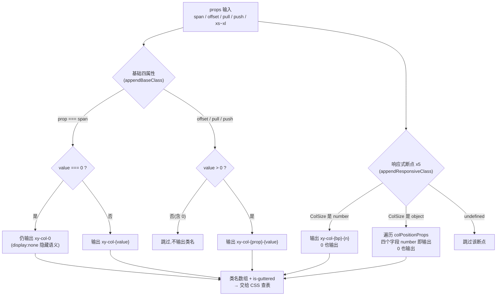
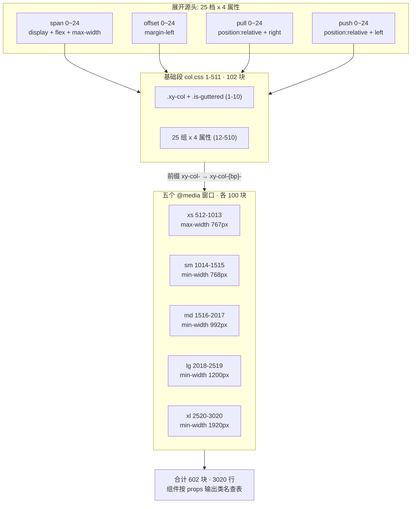

# 5-17 · Col：响应式断点矩阵

> 栅格系统里，Row 是协调者，Col 才是那个被写进每一行布局里的主角。`XyCol` 的视图层只有 99 行——拼几个类名、注入两段 padding，几乎没有逻辑；但它身后站着一份 **3020 行的纯 CSS**（`packages/theme/src/components/col.css`），是全库最大的单组件样式文件。这 3020 行不是手写出来的，也不是运行时算出来的，而是"24 栅格 × 6 档断点 × 4 个定位属性"的乘积被**预先展开成实码**提交进仓库的。本篇就围绕核心问题展开：这 3020 行是怎么来的、值不值、该不该这么来？我们会先解剖 99 行组件的类名生成器，再给 3020 行 CSS 记一笔精确到选择器个数的账，最后把"全静态展开 / SCSS 循环 / 运行时注入"三条路线的真实代价摆上台面逐一权衡。所有代码摘自当前工作区实态，行号逐一核对过。

## 引子：99 行组件背后的 3020 行样式

先给体量一个直观感受：

```text
$ wc -l packages/components/col/src/* packages/components/col/__tests__/*.spec.ts \
        packages/theme/src/components/col.css tests/types/fixtures/col.ts
      27 col.ts
      99 col.vue
     140 col.spec.ts
    3020 col.css
      41 col.ts（类型夹具）
```

组件源码 126 行（类型层 27 + 视图层 99），样式层却是它的 24 倍。这个悬殊比例在 5-02 到 5-16 的所有篇目里从没出现过——其他组件是"逻辑复杂、样式收敛"，Col 恰好反过来：**逻辑薄到近乎透明，样式厚到需要专门记一本账**。

为什么？因为栅格列的全部职责就是把"占几格、偏几格、移几格"翻译成 CSS，而翻译的答案只有有限多种：24 栅格制下，span/offset/push/pull 四个属性各取 0～24 共 25 档，再乘上 xs/sm/md/lg/xl 五个响应式断点和 1 个无断点的基础档。全部组合数是有限、可枚举、且**与用户输入无关**的——既然如此，就存在一个根本性的架构选择：这些组合的 CSS 是**预先全部写死**，还是**按需现场生成**？

本库选了前者，并且把展开结果作为实码直接提交。要评价这个选择，得先看清两端：一端是 99 行的类名生成器，另一端是 3020 行的查表手册。

## 一、类型层：ColSize 联合类型，"数字或对象"的断点声明

按 5-02 立下的解剖框架，先看类型层。`packages/components/col/src/col.ts:1-27` 全文只有 27 行：

```ts
// packages/components/col/src/col.ts:1-27（全文）
export const colPositionProps = ["span", "offset", "pull", "push"] as const;
export const colBreakpoints = ["xs", "sm", "md", "lg", "xl"] as const;

export type ColPositionProp = (typeof colPositionProps)[number];
export type ColBreakpoint = (typeof colBreakpoints)[number];

export interface ColSizeObject {
  span?: number;
  offset?: number;
  pull?: number;
  push?: number;
}

export type ColSize = number | ColSizeObject;

export interface ColProps {
  tag?: string;
  span?: number;
  offset?: number;
  pull?: number;
  push?: number;
  xs?: ColSize;
  sm?: ColSize;
  md?: ColSize;
  lg?: ColSize;
  xl?: ColSize;
}
```

两个常量数组是整篇故事的纲：`colPositionProps` 是四个定位属性，`colBreakpoints` 是五个响应式断点。后面你会看到，col.vue 的类名生成器和 3020 行 CSS 的分段结构，都是这两张清单的投影。

类型设计的核心是 `ColSize = number | ColSizeObject` 这个联合：

- **数字形态** `sm={8}`：语义是"该断点下占 8 格"，是 8 个栅格场景里 90% 的日常写法；
- **对象形态** `sm={span: 8, offset: 2}`：语义是"该断点下占 8 格、偏移 2 格"，只在需要精细控制时展开。

这是一个典型的"渐进披露"接口：简单场景一行写完，复杂场景才付出对象字面量的代价。注意 `ColSizeObject` 的四个字段全部可选且**没有断点嵌套**——对象只描述"这一个断点"下的定位，不允许多写 `xs` 混进来，类型层面就封死了歧义。

组件入口 `packages/components/col/index.ts:1-9` 的导出边界也值得看一眼：

```ts
// packages/components/col/index.ts:1-9（全文）
import Col from "./src/col.vue";
import type { ColBreakpoint, ColProps, ColSize, ColSizeObject } from "./src/col";
import { withInstall } from "xiaoye-primitives";

export type { ColBreakpoint, ColProps, ColSize, ColSizeObject };

export const XyCol = withInstall(Col, "xy-col");
export default XyCol;
```

`ColBreakpoint`（断点名单）和 `ColSize`（值形态）作为主类型跟着组件走出去；`colPositionProps` 这个运行时常量则留在源码内部——它是实现细节，不是公共 API。这个"类型出门、常量留守"的分寸与 4-03 讲过的导出纪律一致。

## 二、视图层：把 props 翻译成 CSS 类名的生成器

`packages/components/col/src/col.vue:1-99` 全文 99 行，我们分两段读。先是 script 段（1-93 行）：

```ts
// packages/components/col/src/col.vue:1-93
<script setup lang="ts">
import { computed, inject } from "vue";
import type { CSSProperties } from "vue";
import { useNamespace } from "xiaoye-primitives";
import { rowContextKey } from "../../row/src/row";
import { colBreakpoints, colPositionProps } from "./col";
import type { ColBreakpoint, ColProps, ColSize, ColSizeObject, ColPositionProp } from "./col";

const props = withDefaults(defineProps<ColProps>(), {
  tag: "div",
  span: 24,
  offset: 0,
  pull: 0,
  push: 0
});

const ns = useNamespace("col");
const { gutter } = inject(rowContextKey, {
  gutter: computed(() => 0)
});

function isColSizeObject(value: ColSize | undefined): value is ColSizeObject {
  return value !== null && typeof value === "object";
}

function appendBaseClass(classes: string[], prop: ColPositionProp, value: number) {
  if (prop === "span") {
    classes.push(`${ns.base.value}-${value}`);
    return;
  }

  if (value > 0) {
    classes.push(`${ns.base.value}-${prop}-${value}`);
  }
}

function appendResponsiveClass(
  classes: string[],
  breakpoint: ColBreakpoint,
  size: ColSize | undefined
) {
  if (typeof size === "number") {
    classes.push(`${ns.base.value}-${breakpoint}-${size}`);
    return;
  }

  if (!isColSizeObject(size)) {
    return;
  }

  colPositionProps.forEach((prop) => {
    const value = size[prop];

    if (typeof value === "number") {
      classes.push(
        prop === "span"
          ? `${ns.base.value}-${breakpoint}-${value}`
          : `${ns.base.value}-${breakpoint}-${prop}-${value}`
      );
    }
  });
}

const colClasses = computed(() => {
  const classes = [ns.base.value];

  appendBaseClass(classes, "span", props.span);
  appendBaseClass(classes, "offset", props.offset);
  appendBaseClass(classes, "pull", props.pull);
  appendBaseClass(classes, "push", props.push);

  colBreakpoints.forEach((breakpoint) => {
    appendResponsiveClass(classes, breakpoint, props[breakpoint]);
  });

  if (gutter.value) {
    classes.push(ns.is("guttered", true));
  }

  return classes;
});

const style = computed<CSSProperties>(() => {
  const nextStyle: CSSProperties = {};

  if (gutter.value) {
    nextStyle.paddingLeft = `${gutter.value / 2}px`;
    nextStyle.paddingRight = `${gutter.value / 2}px`;
  }

  return nextStyle;
});
</script>
```

模板段只有 5 行（95-99 行）：`<component :is="props.tag" :class="colClasses" :style="style">` 加一个默认插槽。Col 没有任何自有状态、没有任何事件——它是纯粹的"props 进、类名出"的转换器。

### 2.1 类名生成器的三条规则

整个生成逻辑浓缩在两个 append 函数里，规则只有三条：

**规则一：基础 span 无条件输出。** `appendBaseClass`（26-35 行）对 span 特殊对待——即使 `span: 0` 也照样拼出 `xy-col-0`。这不是疏忽，是语义：`xy-col-0` 在 CSS 里对应 `display: none`（后文细讲），"占 0 格"就是"隐藏"，用户显式传 0 是有效意图。

**规则二：基础 offset/pull/push 的 0 不输出。** 同一个函数里，非 span 属性走 `value > 0` 才拼接。因为"不偏移"就是默认态，`xy-col-offset-0` 与"什么类名都不加"效果完全等价，没必要挂到 DOM 上。

**规则三：响应式段恢复"0 可输出"。** `appendResponsiveClass`（37-62 行）里，数字形态直接拼 `xy-col-{bp}-{size}`——包括 0（`xs: 0` 同样是隐藏语义）；对象形态则对每个字段只要 `typeof value === "number"` 就输出，**包括 0**。也就是说 `xs={offset: 0}` 会真的在 DOM 上留下 `xy-col-xs-offset-0`。

把三条规则摆在一起，会发现一个细读才看得到的**不对称**：CSS 里每一档断点都为 0 准备了全套四个类（`xy-col-xs-0`、`xy-col-xs-offset-0`、`xy-col-xs-pull-0`、`xy-col-xs-push-0`，见 col.css 513-531 行），基础段也有 `xy-col-offset-0` / `xy-col-pull-0` / `xy-col-push-0`（col.css 18-30 行）——但基础段这三个类名**在组件的正常输出里永远不可达**：基础 offset/pull/push 传 0 时生成器直接跳过，DOM 上不会出现它们。它们是"给手写 class 的人准备的规则"，组件自己永远不会走到。响应式段就没有这个死区，因为对象形态把 0 视为有效值。这处不对称是"CSS 全量展开"路线的典型副作用：表被完整造出来了，但某些格子没人查。它的代价约 24 行 CSS，谈不上伤筋动骨，却精确暴露了静态展开方案"宁可多备、不可缺货"的性格。

### 2.2 gutter 消费：与 Row 的半格交接

gutter 的消费段（18-20、76-78、83-92 行）是 5-16《Row：栅格的 provide 侧》那套下发协议的接收端，这里简要回指。Row 侧把 `gutter` 这个 `ComputedRef<number>` 通过 `rowContextKey` provide 下来（`packages/components/row/src/row.ts:28`），并在自己身上挂**负 margin**抵消首尾列的内边距（`packages/components/row/src/row.vue:21-32`）：

```ts
// packages/components/row/src/row.vue:15-32（回指 5-16 的下发端）
const gutter = computed(() => props.gutter);

provide(rowContextKey, {
  gutter
});

const style = computed<CSSProperties>(() => {
  if (!props.gutter) {
    return {};
  }

  const halfGutter = props.gutter / 2;

  return {
    marginLeft: `-${halfGutter}px`,
    marginRight: `-${halfGutter}px`
  };
});
```

Col 侧则做对称的另一半：`inject(rowContextKey, { gutter: computed(() => 0) })`（col.vue:18-20）拿到 gutter，然后给每列加**正的半格 padding**（col.vue:86-89）。一负一正相抵，列间距出现而两端不破版。注意 Col 对 inject 的第三个细节：

1. **带默认值 inject**——脱离 Row 单独使用时不报错，退化为 `gutter = 0`，无 padding 无 `is-guttered` 类（col.spec.ts:116-128 专门钉住了这个行为）；
2. **inject 的是 ComputedRef 而非数值**——gutter 响应式变化时，colClasses 里的 `is-guttered` 和 style 里的 padding 会随依赖追踪自动重算（col.spec.ts:83-114 用 `ref` 改值 + `nextTick` 验证了这条链路）；
3. **间距走 style、栅格走 class**——gutter 是任意整数，枚举不动，只能内联样式；span/offset 是 0-24 的有限档位，才配得上查表。**"有限走 class、无限走 style"** 这条分界线，正是理解 3020 行 CSS 的钥匙，第四章还会回到它。

### 2.3 类名生成的决策流

把三条规则画成决策流，一条 props 输入要经历两轮分派——先按"是不是 span"分，再按"是不是数字"分：



生成器的输出只是一串名字，真正的布局力量全部躺在 CSS 里。接下来是本篇的主菜：那本 3020 行的查表手册。

## 三、CSS 侧：3020 行的精确账本

### 3.1 宏观剖面：五段式结构

`wc -l` 给出的 3020 行，按五个 `@media` 切面（512、1014、1516、2018、2520 行）剖开，是一段几乎完美周期性的结构：

| 段位 | 行号区间 | 行数 | 选择器块数 | 媒体查询 |
| --- | --- | --- | --- | --- |
| 基础段 | col.css 1-511 | 511 | 102 | 无（全视口生效） |
| xs 段 | col.css 512-1013 | 502 | 100 | `max-width: 767px`（512 行） |
| sm 段 | col.css 1014-1515 | 502 | 100 | `min-width: 768px`（1014 行） |
| md 段 | col.css 1516-2017 | 502 | 100 | `min-width: 992px`（1516 行） |
| lg 段 | col.css 2018-2519 | 502 | 100 | `min-width: 1200px`（2018 行） |
| xl 段 | col.css 2520-3020 | 501 | 100 | `min-width: 1920px`（2520 行） |

`grep -c '^\s*\.xy-col' col.css` 实测 602 个选择器块，与分段之和（102 + 100×5）严丝合缝；601 个空行把 602 个块一一隔开，唯一的"不完美"是 xl 段 501 行而非 502——不是段内缺了什么，而是它是文件末段，3020 行的收尾 `}` 后没有尾随空行。这个 1 行的微差反而佐证了这份文件是"展开成实码后人工提交"的：机器生成的产物连尾随换行都会更"圆"。

结构剖面画成图更直观——六档断点不是六个平行世界，而是**同一条 25 档流水线在六个生效窗口的六次复印**：



### 3.2 基础段：一份账本的"母版"

基础段的开头（col.css 1-50 行）定义了全部四类规则的形状——这段是后面五段的母版，值得整段精读：

```css
/* packages/theme/src/components/col.css:1-50 */
.xy-col {
  position: relative;
  box-sizing: border-box;
  min-width: 0;
  max-width: 100%;
}

.xy-col.is-guttered {
  min-height: 1px;
}

.xy-col-0 {
  display: none;
  flex: 0 0 0%;
  max-width: 0%;
}

.xy-col-offset-0 {
  margin-left: 0%;
}

.xy-col-pull-0 {
  position: relative;
  right: 0%;
}

.xy-col-push-0 {
  position: relative;
  left: 0%;
}

.xy-col-1 {
  display: block;
  flex: 0 0 4.1666666667%;
  max-width: 4.1666666667%;
}

.xy-col-offset-1 {
  margin-left: 4.1666666667%;
}

.xy-col-pull-1 {
  position: relative;
  right: 4.1666666667%;
}

.xy-col-push-1 {
  position: relative;
  left: 4.1666666667%;
}
```

每一段声明都在回答一个布局问题，逐条过：

- `.xy-col`（1-6 行）是所有列的公共底座：`position: relative` 是给 push/pull 的相对位移**预留定位上下文**（哪怕这一列从不用 push/pull）；`min-width: 0` 是 flex 子项的经典解药，允许列内容收缩到比内容窄，防止长文本把栅格撑爆；`box-sizing: border-box` 保证 gutter 的 padding 计入宽度而不是叠加在宽度外。
- `.xy-col.is-guttered`（8-10 行）的 `min-height: 1px` 是个老牌 hack：空列在 flex 容器里高度塌陷为 0，列与列的基线对齐会乱，1px 把它撑住。
- `.xy-col-0`（12-16 行）是"占 0 格"的语义落点：不是 `width: 0`，而是 `display: none`——连同 margin、padding 一起从布局里消失。这就是 2.1 节"span=0 即隐藏"的兑现处。
- `.xy-col-1`（32-36 行）的 `4.1666666667%` 是 1/24 的十位小数舍入值。24 栅格的每一档宽度都带着循环小数，这份 CSS 里的所有百分比都统一保留 10 位（如 `8.3333333333%`、`12.5%`、`91.6666666667%`）。10 位小数在任何一个视口下的累计误差都远小于 1 物理像素——24 列排满时的最坏误差也在 1e-7% 量级，这是"手写展开"里对精度与可读性的折中定格。
- span 用 `flex: 0 0 N%` + `max-width: N%` **双保险**：前者定理想宽度（flex-basis），后者封顶（防止 flex-grow 场景越权扩张）。只写 flex 不写 max-width，列在容器有多余空间时会被拉伸；只写 width 又丢掉 flex 收缩语义。
- offset（38-40 行）用 `margin-left` 挤出空位；push/pull（42-50 行）用 `position: relative` + `left/right` 做视觉位移——注意这组位移**不改变文档流占位**，列依然"占着自己原来的格子"，只是画到了别处，所以 push 会与相邻列**重叠**而不是把它们挤走。这是与 offset 的本质区别，也是第四章权衡三的主角。

### 3.3 响应式段：母版的五次复印

跳到 xs 段（col.css 512-571 行），可以验证"复印"的说法——除了前缀多了 `xs-`、整体缩进两格、外面包了层 `@media`，内容与基础段逐字一致：

```css
/* packages/theme/src/components/col.css:512-571 */
@media (max-width: 767px) {
  .xy-col-xs-0 {
    display: none;
    flex: 0 0 0%;
    max-width: 0%;
  }

  .xy-col-xs-offset-0 {
    margin-left: 0%;
  }

  .xy-col-xs-pull-0 {
    position: relative;
    right: 0%;
  }

  .xy-col-xs-push-0 {
    position: relative;
    left: 0%;
  }

  .xy-col-xs-1 {
    display: block;
    flex: 0 0 4.1666666667%;
    max-width: 4.1666666667%;
  }

  .xy-col-xs-offset-1 {
    margin-left: 4.1666666667%;
  }

  .xy-col-xs-pull-1 {
    position: relative;
    right: 4.1666666667%;
  }

  .xy-col-xs-push-1 {
    position: relative;
    left: 4.1666666667%;
  }

  .xy-col-xs-2 {
    display: block;
    flex: 0 0 8.3333333333%;
    max-width: 8.3333333333%;
  }
}
```

注意 xs 段的媒体查询是六档中唯一的 `max-width: 767px`——**xs 是"以下"语义，其余四档都是"以上"语义**。这个不对称是移动优先（mobile-first）的写法倒影：基础段和 xs 段共同覆盖小屏（基础段规则不带条件、xs 段在 767px 以下额外提供 xs 前缀规则），sm/md/lg/xl 则逐级向上叠加。列同时命中多档时靠**源顺序**取胜——`@media (min-width: 1200px)` 的 lg 段物理位置在 sm/md 段之后，同特异性下后写的赢，所以"大屏规则覆盖小屏规则"不靠 `!important`、不靠选择器加权，纯靠 3020 行文件内的**段位排序**。这解释了为什么五段必须严格按 xs→sm→md→lg→xl 排列：调换两段，断点覆盖关系就反转。

再看 lg 段开头（col.css 2018-2077 行），确认中断点依然是同一张表：

```css
/* packages/theme/src/components/col.css:2018-2077 */
@media (min-width: 1200px) {
  .xy-col-lg-0 {
    display: none;
    flex: 0 0 0%;
    max-width: 0%;
  }

  .xy-col-lg-offset-0 {
    margin-left: 0%;
  }

  .xy-col-lg-pull-0 {
    position: relative;
    right: 0%;
  }

  .xy-col-lg-push-0 {
    position: relative;
    left: 0%;
  }

  .xy-col-lg-1 {
    display: block;
    flex: 0 0 4.1666666667%;
    max-width: 4.1666666667%;
  }

  .xy-col-lg-offset-1 {
    margin-left: 4.1666666667%;
  }

  .xy-col-lg-pull-1 {
    position: relative;
    right: 4.1666666667%;
  }

  .xy-col-lg-push-1 {
    position: relative;
    left: 4.1666666667%;
  }

  .xy-col-lg-2 {
    display: block;
    flex: 0 0 8.3333333333%;
    max-width: 8.3333333333%;
  }
}
```

以及文件最末的 xl 段收尾（col.css 3001-3020 行），25 档的最后一组与 3020 行的句号：

```css
/* packages/theme/src/components/col.css:3001-3020（文件尾） */
  .xy-col-xl-24 {
    display: block;
    flex: 0 0 100%;
    max-width: 100%;
  }

  .xy-col-xl-offset-24 {
    margin-left: 100%;
  }

  .xy-col-xl-pull-24 {
    position: relative;
    right: 100%;
  }

  .xy-col-xl-push-24 {
    position: relative;
    left: 100%;
  }
}
```

三段看完，"3020 行怎么来的"已经可以给出精确答案——**它是一笔乘加账**：

- 每档断点下有 25 组（0～24），每组 4 块（span/offset/pull/push），共 **100 块**；
- 基础档同样是 100 块，再加 `.xy-col` 与 `.xy-col.is-guttered` 两块公共底座，共 **102 块**；
- 总块数 = 102 + 100 × 5 = **602 块**，合计 3020 行（含 601 个分隔空行）。

需要修正一个常见口误（包括本篇任务稿里的提法）：乘法不发生在 span × offset × push/pull 之间——四属性是**并列相加**进同一组的（一个类名只携带一个属性）；真正的乘法发生在"**6 档生效层 × 25 档取值 × 每档 4 个属性类**"上。另外每维是 **25 档而非 24**：0 是合法取值且承担隐藏语义。账算清了，才能进入真正的判决庭：这么展开，值不值？

## 四、该不该这么来：三条路线的真实代价

### 4.1 本库路线：展开成实码，直接提交

先给结论的实证基础：这份 col.css **不是构建产物**。三个证据：

1. `packages/theme/package.json` 全文只有 `"name"`、`"private": true`、`"type": "module"` 三个字段——没有 sass 依赖、没有 build 脚本，`packages/theme/index.css` 用原生 `@import "./src/components/col.css"`（24-25 行）直连；
2. 仓库脚本目录里没有任何生成 col.css 的工具（scripts/ 下只有 token 生成与校验脚本，与组件样式无关）；
3. git 历史上 col.css 只有两笔提交，均为组件批量入库时的整文件新增，没有"重新生成"的痕迹。

也就是说，3020 行是一次性展开后**当作源码维护**的。很多人看到这个数字的第一反应是"太浪费了"，但先看实测体积：

```text
$ wc -c packages/theme/src/components/col.css
   44755 col.css（原始 43.7 KB）
$ gzip -c col.css | wc -c
    3427（gzip 后 3.3 KB，压缩率 92.3%）
```

44.7KB 原始体积经过 gzip 只剩 **3.3KB**。原因不难理解：602 个块高度模式化，`display: block`、`position: relative`、`margin-left: N%` 这类短语重复出现上千次，deflate 算法对这种重复的压缩效率极高。**静态展开的真实传输代价是 3.3KB**——作为对比，一张缩略图都不止这个体积。而它换来的运行时收益是零成本的：没有样式注入时序、没有 SSR 水合闪动、没有运行时计算，浏览器拿到 CSS 文件后所有栅格决策都是查表完成的。

### 4.2 EP 路线：SCSS 循环，"生成期展开"

Element Plus 面对同一道题选了另一条实现路径：theme-chalk 里的 `col.scss`（dev 分支）源码只有约百行，用 SCSS 的 `@for` 循环生成 0～24 的全部类：

```scss
// element-plus theme-chalk/src/col.scss（dev 分支，结构示意）
@for $i from 0 through 24 {
  .#{$namespace}-col-#{$i} {
    @if $i == 0 {
      display: none;
    } @else {
      display: block;
    }
    max-width: (math.div(1, 24) * $i * 100) * 1%;
    flex: 0 0 (math.div(1, 24) * $i * 100) * 1%;
  }
  .#{$namespace}-col-offset-#{$i} {
    margin-left: (math.div(1, 24) * $i * 100) * 1%;
  }
  /* pull / push 同理,position: relative + right/left */
}

/* 断点通过 col-size(x) mixin 复印五次 */
@include col-size(xs);
@include col-size(sm);
@include col-size(md);
@include col-size(lg);
@include col-size(xl);
```

断点数值定义在 `common/var.scss` 里：`$sm: 768px`、`$md: 992px`、`$lg: 1200px`、`$xl: 1920px`，xs 用 `max-width: #{$sm - 1}` 即 767px——**与本库 512/1014/1516/2018/2520 行的六档边界逐值相同**。这不是巧合：两库的断点系谱同源于 Bootstrap 传统（768/992/1200），而 1920 这一档是中文社区大屏生态的惯例（对照 antd 的 6 档系谱：576/768/992/1200/1600，尾档是 1600 而非 1920，且粒度更密）。

关键认知是：**EP 的"源码短"是假象，编译后的 `el-col.css` 同样是全量展开的几百行静态规则**——SCSS 的 `@for` 只是把展开动作从"提交前的人手/脚本"挪到了"构建时的编译器"。运行时层面，两条路线的产物**完全等价**：都是 602 块级别的静态规则、都零 JS 参与、都被 gzip 压到几 KB。真正的差别全在**维护面**：

- EP 改断点：动 `var.scss` 一处，重新编译，产物自动重算——但前提是接受 sass 工具链、接受"源码里看到的不是用户拿到的"这层间接；
- 本库改断点：要动 col.css 里 5 处 `@media` 行加对应段的类名前缀——是 5 次定位替换而非 1 次变量修改——但换来的是 theme 包零构建依赖、CSS 即最终产物、`rg 'xy-col-lg-'` 一步命中真实规则。

对一个强调"AI 协作可读性"的仓库（2-09 篇的 llms 文档、MCP Server 都在强化这一点），后者的价值不该被低估：**任何工具 grep 这份 CSS，看到的就是浏览器执行的**，不存在"再找一份 scss 源码"的间接层。代价则是 3020 行的仓库体积与人工改段的繁琐——本库显然判断"改断点"是低频事件（入库以来零次），可读性是高频事件。

### 4.3 第三条路：运行时生成，为什么没人选

把可能性补全，还有一条理论上的路：**运行时按需生成**。既然 col.vue 已经在拼类名字符串，为什么不直接拼 style 呢：

```ts
// 假想的运行时方案（本库未采用）
function colStyle(p: ColProps, bp: Breakpoint): CSSProperties {
  const size = p[bp] ?? p.span;          // 按当前生效断点取值
  const width = `${(size.span / 24) * 100}%`;
  return {
    flex: `0 0 ${width}`,
    maxWidth: width,
    marginLeft: size.offset ? `${(size.offset / 24) * 100}%` : undefined,
    left: size.push ? `${(size.push / 24) * 100}%` : undefined,
    right: size.pull ? `${(size.pull / 24) * 100}%` : undefined,
    display: size.span === 0 ? "none" : "block"
  };
}
```

这方案 CSS 体积趋近于零（一份 `.xy-col` 底座都不需要），但它要面对三个致命问题：

1. **断点监听**：style 是即时的，而断点切换是浏览器的媒体查询行为。要走 style 就必须用 `matchMedia` 在 JS 里复刻六档断点的监听、在窗口跨越边界时重算每一列的 style——本库在 5-13（Affix）已经体会过"JS 复刻浏览器能力"的维护成本，这里要复刻的是整套响应式系统；
2. **SSR 首帧**：服务端渲染时不知道视口宽度，只能按一个假设断点输出，客户端水合后跳变——FOUC（无样式内容闪烁）在栅格这种"全页骨架"级别的问题上不可接受；
3. **丢失级联**：CSS 媒体查询的天然优势是"六档规则同时在场、由浏览器择优"，源顺序即优先级；JS 方案里这套语义要自己用状态机重建。

于是答案浮出水面：**"有限枚举走静态 CSS、连续取值走运行时 style"不是妥协，而是各取所长的正确分工**——gutter（任意数）走了 style，span/offset/push/pull × 六档断点（有限枚举）走了静态表。3020 行是这个分工在"全量预展开"策略下的自然体积。

### 4.4 三处权衡的收拢

**权衡一：静态展开 vs 运行时生成。** 展开的代价是一次性的 3.3KB gzip 传输和 3020 行的仓库维护面；收益是零运行时、SSR 天然正确、断点级联交给浏览器。反向方案省下的体积不足 3KB，付出的却是 matchMedia 状态机 + 水合闪烁风险。对组件库这种"产物被成千上万页面复用"的场景，**把复杂度从每个使用方挪进库内一份静态文件**，是摊薄成本的正确方向。真正该警惕的是反向的浪费——如果这个库还有暗黑主题切换、CSS 变量注入这类运行时机制，再叠加断点状态机就是双重复杂度；本库 col.css 里没有一个 CSS 变量、一处 `var()`，全部是字面量，这份"笨"是自觉选择的。

**权衡二：断点单位与边界值。** 六档边界全部用 px 且是**整数 magic number**：`max-width: 767px` 而非 `max-width: 767.98px`（Bootstrap 4+ 用小数防亚像素抖动，本库与 EP 用整数，赌的是 767 与 768 之间不存在 0.5 设备像素的实际设备）。px 意味着断点不随用户根字号缩放——对以布局密度为目标的栅格，px 是合理选择（rem 断点会让"占 6 格"的物理宽度随字号漂移，排版场景反而失控）；代价是无障碍场景下大字号用户的每屏内容量不会随字号自动调整。767/768/992/1200 四档沿袭 Bootstrap 系谱保证与社区直觉对齐，1920 尾档服务大屏运营后台——这是中文组件库生态的现实约束（antd 走 1600，本库与 EP 走 1920），选边没有对错，只有目标用户画像。

**权衡三：push/pull 的现代替代。** `position: relative` + `left/right` 的位移不参与文档流：push 过的列与被压过的列**重叠**，视觉顺序与 DOM 顺序脱钩——屏幕阅读器读到的顺序是 DOM 序，用户看到的顺序是位移序，可访问性裂缝由此产生。现代替代方案明确存在：flex 下用 `order` 调整真实排布序（Bootstrap 4 起就用 order 取代了 push/pull），简单右移用 `margin-left: auto`，更复杂的二维布局直接上 CSS Grid 的 `grid-column`。那本库为什么还保留？兼容心智与低成本：push/pull 的实现就是基础段里现成的 `position: relative` 底座加两行 left/right，维护成本趋近于零；而 `order` 方案要求 Row 显式声明为 flex 容器并管理全列 order 序，交互成本反而更高。**"便宜的旧方案 + 明确的文档警示"优于"昂贵的废弃迁移"**——本库文档页（`apps/docs/components/col.md`）对 offset 与 push/pull 的分工给出的指引是"offset 适合留白占位、push/pull 适合调整视觉顺序"，把重叠语义的知情权交给使用者，而不是替使用者做迁移决定。

### 4.5 一个遗留的张力：可配置 namespace 与硬编码前缀

还有一处值得记录的边界。类名生成器的起点是 `useNamespace("col")`（col.vue:17），而 `useNamespace` 的实现（`packages/xiaoye-primitives/src/composables/use-namespace.ts:1-17`）是这样的：

```ts
// packages/xiaoye-primitives/src/composables/use-namespace.ts:1-17（全文）
import { computed } from "vue";
import { useConfig } from "./use-config";

export function useNamespace(block: string) {
  const { namespace } = useConfig();
  const base = computed(() => `${namespace.value}-${block}`);

  const is = (state: string, active?: boolean) => (active ? `is-${state}` : "");
  const cssVarBlock = (name: string) => `--${namespace.value}-${block}-${name}`;

  return {
    namespace,
    base,
    is,
    cssVarBlock
  };
}
```

`namespace` 来自 `useConfig()`（`packages/xiaoye-primitives/src/composables/use-config.ts:46`），默认值定义在 `shared-context.ts:26`：`DEFAULT_NAMESPACE = "xy"`。也就是说**类名前缀在架构上是可配置的**——但 col.css 里 602 个选择器全部硬编码 `xy-` 前缀。若真有使用方改掉 namespace，Col 输出的类名将集体与静态表失配，栅格静默失效。这是"静态展开"路线的一个隐含代价：**CSS 表的键（类名）被冻结在了展开那一刻**，JS 侧保留的配置自由度对这 602 个键是无效的。EP 同样硬编码（SCSS 里 `$namespace` 变量构建期定型，改它同样要重编全部样式），所以这不是本库独有的问题，而是"预展开类名查表"范式的共性约束。诚实的结论是：namespace 目前是"架构预留、实践冻结"的配置项，栅格类组件的样式定制应走覆盖 CSS 而非改前缀。

## 五、测试与类型夹具：为"字符串拼出来的样式"设防

### 5.1 组件测试：钉住生成器的每条规则

`packages/components/col/__tests__/col.spec.ts` 共 140 行、7 个用例，覆盖面正好对应第二章的三条生成规则加 gutter 协议。最核心的响应式用例（30-60 行）：

```ts
// packages/components/col/__tests__/col.spec.ts:30-60
  it("支持响应式布局 class", () => {
    const wrapper = mount(XyCol, {
      props: {
        xs: 24,
        sm: {
          span: 12,
          offset: 2
        },
        md: 8,
        lg: {
          span: 6,
          offset: 3,
          pull: 1
        },
        xl: {
          span: 4,
          push: 2
        }
      }
    });

    expect(wrapper.classes()).toContain("xy-col-xs-24");
    expect(wrapper.classes()).toContain("xy-col-sm-12");
    expect(wrapper.classes()).toContain("xy-col-sm-offset-2");
    expect(wrapper.classes()).toContain("xy-col-md-8");
    expect(wrapper.classes()).toContain("xy-col-lg-6");
    expect(wrapper.classes()).toContain("xy-col-lg-offset-3");
    expect(wrapper.classes()).toContain("xy-col-lg-pull-1");
    expect(wrapper.classes()).toContain("xy-col-xl-4");
    expect(wrapper.classes()).toContain("xy-col-xl-push-2");
  });
```

这个用例精心覆盖了 `ColSize` 联合的两个形态在五个断点上的组合：xs/md 走数字形态，sm/lg/xl 走对象形态，且对象里各带了不同的属性子集（sm 无 pull/push、lg 无 push、xl 无 offset/pull）。断言逐个类名核对——对"拼字符串"型生成器，这种逐名断言比快照更抗漂移。其余用例分别钉住：默认 `xy-col-24`（7-12 行）、基础四属性（14-28 行）、gutter 的 padding 与 `is-guttered`（62-81 行）、gutter 响应式更新（83-114 行）、脱离 Row 的退化（116-128 行）、`tag` 自定义根元素（130-139 行）。

测试也有明确的空白：**没有任何用例覆盖 0 值路径**——`span: 0` 输出 `xy-col-0`、基础 `offset: 0` 不输出类名、`xs: { offset: 0 }` 输出 `xy-col-xs-offset-0`，这三条 2.1 节考据出的不对称规则目前都靠实现自觉而非测试保证。如果未来有人"顺手统一"两条路径的 0 值行为（比如让基础 offset 的 0 也输出类名），现有测试一条都不会红。这是本篇读下来最值得补的一组用例。

### 5.2 类型夹具：把"对象或数字"钉进编译期

`tests/types/fixtures/col.ts` 共 41 行，正例完整复刻测试用例的 props 组合，负例则用 `@ts-expect-error` 把两类非法输入钉死在编译期：

```ts
// tests/types/fixtures/col.ts:1-41（全文）
import type { ColProps } from "xiaoye-components";

const colProps: ColProps = {
  span: 12,
  offset: 2,
  pull: 1,
  push: 3,
  xs: 24,
  sm: {
    span: 12,
    offset: 2
  },
  md: 8,
  lg: {
    span: 6,
    offset: 3,
    pull: 1
  },
  xl: {
    span: 4,
    push: 2
  }
};

void colProps;

const invalidResponsiveType: ColProps = {
  // @ts-expect-error responsive value should be a number or object
  sm: "12"
};

void invalidResponsiveType;

const invalidResponsiveKey: ColProps = {
  lg: {
    // @ts-expect-error unsupported key should be rejected
    order: 1
  }
};

void invalidResponsiveKey;
```

两条负例的针对性很强：`sm: "12"`（字符串不是合法 ColSize）守住联合类型的值域；`lg: { order: 1 }`（对象里出现五个定位属性之外的字段）守住 ColSizeObject 的键域——后者正是靠 `ColSizeObject` 接口**不带走索引签名**实现的，一旦有人图方便加上 `[key: string]: number`，这条负例立刻失守。类型夹具跑在独立的 `tests/types` tsconfig 里（`pnpm typecheck:types`），运行时测试管"输出什么"，类型夹具管"还能不能传错"，两道防线互不替代。

## 收束：一份"笨文件"的聪明之处

回到篇首的问题：3020 行 CSS 是怎么来的？——是"6 档生效层 × 25 档取值 × 每档 4 个定位属性"的乘加账（102 + 100 × 5 = 602 块），一次性展开成实码提交进仓库的；它不是手写更不是运行时生成，theme 包零构建，CSS 即产物。该不该这么来？账面给了答案：44.7KB 的原始体积 gzip 后 3.3KB，换来零运行时、SSR 天然正确、`rg` 一步可达的真实规则；替代方案里，SCSS 循环（EP 路线）只是把展开挪进编译期、运行时产物完全等价，运行时生成则要为 matchMedia 状态机与水合闪烁支付远超 3KB 的复杂度。

这篇解剖还有一层更普适的方法论：**当输出空间是有限可枚举的，"查表"永远优于"计算"**——前提是你算得清那张表有多少格、哪些格子没人查（基础段三个不可达的 0 档类）、表的键被什么冻结（namespace 张力）。3020 行的 col.css 看起来是全库最"笨"的文件，但它的每一行都在做最确定的事。

下一篇 5-18《Scrollbar：原生能力的封装度》，我们转向一个方向完全相反的组件：滚动条的全部能力浏览器原生就有，封装的分数要花在"什么时候信任原生、什么时候自己接管"——与 Col 这种"把枚举焊死在 CSS 里"的思路恰成对照。

---

**附：本篇引用清单**

- `packages/components/col/src/col.ts:1-27`（全文）
- `packages/components/col/src/col.vue:1-93`（script 全段）、`95-99`（template）
- `packages/components/col/index.ts:1-9`（全文）
- `packages/components/col/__tests__/col.spec.ts:7-12、14-28、30-60、62-81、83-114、116-128、130-139`
- `packages/theme/src/components/col.css:1-50`（基础段头）、`512-571`（xs 段头）、`2018-2077`（lg 段头）、`3001-3020`（xl 尾）；断点行 `512、1014、1516、2018、2520`；`1677`（xy-col-md-8 抽查点）
- `packages/components/row/src/row.vue:15-32`、`packages/components/row/src/row.ts:28`（rowContextKey）
- `packages/xiaoye-primitives/src/composables/use-namespace.ts:1-17`（全文）、`use-config.ts:46`、`shared-context.ts:26`
- `tests/types/fixtures/col.ts:1-41`（全文）
- `packages/theme/index.css:24-25`、`packages/components/component-manifest.json:146-153`
- `apps/docs/components/col.md`（文档页指引）
- EP 对照：element-plus `theme-chalk/src/col.scss` 与 `common/var.scss`（dev 分支，断点 767/768/992/1200/1920 与本库逐值一致）
