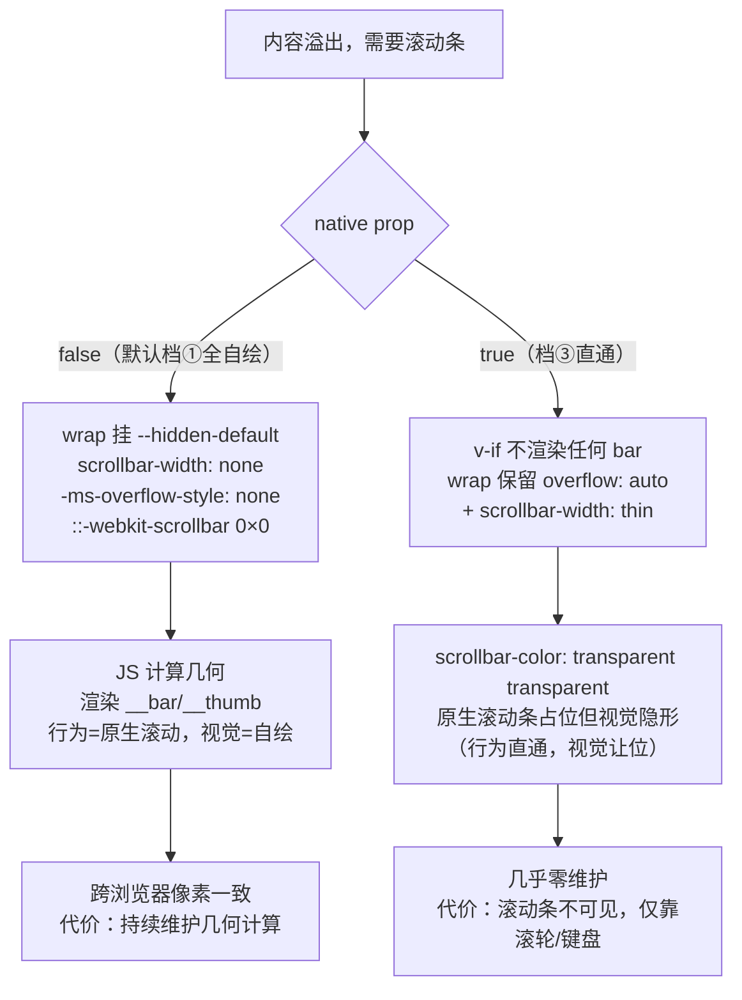
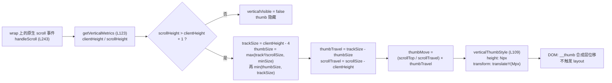

# 5-18 · Scrollbar：原生能力的封装度

浏览器早就把滚动做好了：滚轮、惯性、键盘、触控板双指，全部免调试。那为什么组件库里还要写一个 600 行的 Scrollbar？因为浏览器把滚动**行为**做好了，却从没把滚动**外观**的跨浏览器一致性做好——Chrome 的渐变阴影、Firefox 的细灰条、Safari 的悬浮胶囊，三副面孔；更麻烦的是，一个深色的侧边栏面板里嵌一条系统级的白色滚动条，怎么调 `color-scheme` 都别扭。于是业界演化出了滚动条自定义的**三档封装度**：①全自绘——CSS 隐藏原生滚动条，JS 监听滚动、计算滑块几何、渲染自己的 thumb；②半自绘——保留原生滚动行为，只用 `::-webkit-scrollbar` 系列伪元素把外观美化到接近自定义；③native 直通——什么都不做，`overflow: auto` 交出去。三档是三个不同的维护承诺：第一档买一致性与可控性，付出持续维护几何计算的代价；第二档几乎免费，但 Firefox 至今不支持 `::-webkit-scrollbar`，一档美化在 Firefox 直接失效；第三档最省，外观彻底失控。

本篇解剖 `xy-scrollbar`（`packages/components/scrollbar/src/scrollbar.vue`，608 行），回答一个被封装度三档框住的问题：**什么时候自己写滚动条，什么时候交给浏览器？** 先给实码定论，再逐层拆几何。

## 一、三档封装度在本库的实态：两档，没有中间档

先看结论。`native` 开关（`packages/components/scrollbar/src/scrollbar.vue:581` 的 `v-if="!props.native"`）把组件劈成两档，而"半自绘美化档"在整个主题包里**根本不存在**——`packages/theme/src` 全域搜索 `::-webkit-scrollbar` 只有两处命中，且都是**隐藏**语义而非美化语义：一处是本组件的 `scrollbar.css:27-30`（`width: 0; height: 0`），另一处是轮播指示条的 `carousel.css:131-133`（`display: none`，横向指示条溢出时藏掉原生滚动条）。没有任何一处 `::-webkit-scrollbar-thumb` 的美化代码。

也就是说，本库的选型是"要么全自绘，要么直通"的二元结构，跳过了中间档。这个跳过是有时代背景的：`::-webkit-scrollbar` 是 WebKit 私有伪元素，Firefox 从未支持（Firefox 的等价物只有 `scrollbar-width` / `scrollbar-color` 两个标准属性，且只能控制粗细与配色、改不了形状与圆角）；Chrome 从 121 版起也把滚动条样式引向标准的 `scrollbar-width` / `scrollbar-color`，私有伪元素进入规范层的"劝退"通道。在这种浏览器格局下，"美化档"注定做出两副样子：WebKit 一副、Firefox 一副——恰好违背做这一档的初衷。于是本库把预算全部押在第一档（默认 `native: false`，全自绘），留一个 `native: true` 作为逃生门。



注意直通档的实码细节，这里藏着本篇第一处"叙述与源码不符"的发现。按三档模型的直觉，`native: true` 应该意味着"浏览器画什么就是什么"，但 `scrollbar.css:7-13` 的 wrap 基础样式是：

```css
.xy-scrollbar__wrap {
  width: 100%;
  height: 100%;
  overflow: auto;
  scrollbar-width: thin;
  scrollbar-color: transparent transparent;
}
```

`scrollbar-color` 的两个值分别是 thumb 颜色与轨道颜色，`transparent transparent` 意味着**在 native 档，Firefox 与新版 Chrome 里原生滚动条仍然占着 gutter 的位置，但完全不可见**（`scrollbar-width: thin` 保证它占的宽度比默认窄）。git 历史显示这两行从组件首次落库（`323e9a7`）就是如此，不是重构遗留——这是一个刻意但隐晦的决策：连"直通档"也不信任原生滚动条的视觉，把它压成透明，让组件的宿主界面保持纯净，滚动行为却完全交给浏览器。这个决策在深色面板里是优点（不会突然冒出一条白色系统滚动条），但对依赖"看得见的滚动条"来建立空间感的用户是一种可用性损失——你在 native 档失去了滚动位置的视觉反馈。消费方如果真要 native 档的可见滚动条，只能自己在业务侧覆盖 `scrollbar-color`。

另一个源码实态要与读者校准：本篇任务书里提到的 `thumb.vue` / `bar.vue` 独立文件**在本库并不存在**。EP 把 Bar 拆成 `bar.vue` + `thumb.vue` + `util.ts`（BAR_MAP 参数表）三个文件，本库则是单文件内联——纵向、横向两组 bar/thumb 直接写在 `scrollbar.vue` 的 template 里（`scrollbar.vue:581-606`），两套几乎相同的度量函数 `getVerticalMetrics` / `getHorizontalMetrics`（`scrollbar.vue:123-197`）也是平铺复制，不做轴参数化。608 行单文件换来的是"从上读到下不用跳转"的直白，代价是纵向横向各复制一遍逻辑——这是全文反复出现的第一个权衡：**复制换直白，还是参数表换收敛**。EP 选了后者，本库选了前者，两个选择都活得很好，因为滚动条的"两轴"是有限且稳定的枚举，复制不会腐烂。

## 二、thumb 的几何学：从滚动比例到 translate 像素

全自绘档的核心数学只有一个：**滚动位置 → thumb 位移**。先看产出这个数学的度量函数（`packages/components/scrollbar/src/scrollbar.vue:123-159`，纵向版；横向版 161-197 行逐行同构）：

```ts
function getVerticalMetrics() {
  const wrap = wrapRef.value;

  if (!wrap) {
    return null;
  }

  const clientSize = wrap.clientHeight;
  const scrollSize = wrap.scrollHeight;
  const trackSize = Math.max(clientSize - BAR_GAP, 0);
  const overflow = scrollSize > clientSize + 1;

  if (!overflow || trackSize <= 0) {
    return {
      overflow: false,
      clientSize,
      scrollSize,
      trackSize,
      thumbSize: 0,
      thumbTravel: 0,
      scrollTravel: Math.max(scrollSize - clientSize, 0)
    };
  }

  const thumbSize = Math.max((trackSize * trackSize) / scrollSize, props.minSize);
  const resolvedThumbSize = Math.min(thumbSize, trackSize);

  return {
    overflow: true,
    clientSize,
    scrollSize,
    trackSize,
    thumbSize: resolvedThumbSize,
    thumbTravel: Math.max(trackSize - resolvedThumbSize, 0),
    scrollTravel: Math.max(scrollSize - clientSize, 0)
  };
}
```

六个量，三个设计决策藏在里面。

**决策一：轨道长度要减去 `BAR_GAP`（`scrollbar.vue:7` 的 `const BAR_GAP = 4`）。** 轨道不是整个 wrap 的高度，而是"可视高度减去上下各 2px 的内缩"——对应 `scrollbar.css:50-55` 里轨道的 `top: 2px; right: 2px; bottom: 2px`。EP 的 `util.ts` 里有同一个常量 `GAP = 4`，注释原话是 "top 2 + bottom 2 of bar instance"，两库同源。不减这 4px 的后果是 thumb 与轨道端点齐平，视觉上像被裁掉一截。

**决策二：溢出判定带 1px 容差（`scrollSize > clientSize + 1`）。** 亚像素渲染下 `scrollHeight` 与 `clientHeight` 会因四舍五入出现 0.5px 级别的虚差，内容明明没溢出却弹出一根 thumb，是自绘滚动条最经典的报表 bug。加 1px 容差把"伪溢出"判成不溢出。代价同样诚实：真实溢出量 ≤1px 的场景 thumb 不出现——但那种"滚动 1px"本来也没有任何视觉意义。

**决策三：thumb 长度按面积比例算，再用 `minSize` 兜底。** `thumbSize = trackSize² / scrollSize` 是"可视区占比"的经典公式：内容是可视区的 2 倍，thumb 就是轨道的一半——与 macOS 原生滚动条同构。但内容是可视区的 100 倍时，thumb 只剩 4px，抓不住，于是 `props.minSize`（默认 20，`scrollbar.ts:16`）把它托底。托底之后 thumb 与内容的比例关系被破坏了，这正是两库算法分叉的起点，第三篇细说。

消费这些量的位移计算在 `updateThumbState`（`packages/components/scrollbar/src/scrollbar.vue:199-230`）：

```ts
function updateThumbState() {
  const wrap = wrapRef.value;

  if (!wrap || props.native) {
    verticalVisible.value = false;
    horizontalVisible.value = false;
    verticalThumbMove.value = 0;
    horizontalThumbMove.value = 0;
    return;
  }

  const verticalMetrics = getVerticalMetrics();
  const horizontalMetrics = getHorizontalMetrics();

  if (verticalMetrics) {
    verticalVisible.value = verticalMetrics.overflow;
    verticalThumbSize.value = verticalMetrics.thumbSize;
    verticalThumbMove.value =
      verticalMetrics.scrollTravel > 0
        ? (wrap.scrollTop / verticalMetrics.scrollTravel) * verticalMetrics.thumbTravel
        : 0;
  }

  if (horizontalMetrics) {
    horizontalVisible.value = horizontalMetrics.overflow;
    horizontalThumbSize.value = horizontalMetrics.thumbSize;
    horizontalThumbMove.value =
      horizontalMetrics.scrollTravel > 0
        ? (wrap.scrollLeft / horizontalMetrics.scrollTravel) * horizontalMetrics.thumbTravel
        : 0;
  }
}
```

核心一行是 `thumbMove = (scrollTop / scrollTravel) × thumbTravel`，即 **thumb 在自己可行区里的位置 = 滚动位置在滚动可行区里的位置**。两个"可行区"同比例对齐，天然保证 thumb 走到行程末端时滚动也走到末端。native 早退分支把可见性归零是个双保险：template 层 `v-if="!native"` 已经不渲染 bar 了，状态层再清一次，保证暴露在实例上的 `verticalThumbMove` 等状态在两档间切换不留脏值（`watch` 里 `[props.height, props.maxHeight, props.native]` 变化会触发重测，`scrollbar.vue:506-515`）。

整个几何闭环用一张图收拢：



产物样式（`scrollbar.vue:109-117`）值得注意：thumb 的**长度**走 `height`，**位移**走 `transform: translateY(px)`。位移用 transform 而不是改 `top`，是为了把每帧的变更压在合成层——滚动事件最高每帧一次，`top` 变更会在主线程触发 layout，transform 只做合成；这是全自绘滚动条性能模型的第一课。

## 三、与 EP 的算法分叉：px 直算 vs 百分比 + ratio 修正

同一个"thumb 可行区对齐滚动可行区"的数学，EP 走了另一条路。摘 element-plus dev 分支 `packages/components/scrollbar/src/bar.vue` 的关键段：

```ts
const handleScroll = (wrap: HTMLDivElement) => {
  if (wrap) {
    const offsetHeight = wrap.offsetHeight - GAP
    const offsetWidth = wrap.offsetWidth - GAP

    moveY.value = ((wrap.scrollTop * 100) / offsetHeight) * ratioY.value
    moveX.value = ((wrap.scrollLeft * 100) / offsetWidth) * ratioX.value
  }
}

const update = () => {
  const wrap = scrollbar?.wrapElement
  if (!wrap) return
  const offsetHeight = wrap.offsetHeight - GAP
  const offsetWidth = wrap.offsetWidth - GAP

  const originalHeight = offsetHeight ** 2 / wrap.scrollHeight
  const originalWidth = offsetWidth ** 2 / wrap.scrollWidth
  const height = Math.max(originalHeight, props.minSize)
  const width = Math.max(originalWidth, props.minSize)

  ratioY.value =
    originalHeight /
    (offsetHeight - originalHeight) /
    (height / (offsetHeight - height))
  ratioX.value =
    originalWidth /
    (offsetWidth - originalWidth) /
    (width / (offsetWidth - width))

  sizeHeight.value = height + GAP < offsetHeight ? `${height}px` : ''
  sizeWidth.value = width + GAP < offsetWidth ? `${width}px` : ''
}
```

EP 的位移是**百分比**：`transform: translateY(${move}%)`（`util.ts` 的 `renderThumbStyle`），`move = (scrollTop × 100 / offsetHeight) × ratioY`。这个基础式 `scrollTop × 100 / offsetHeight` 是一个快速近似——它假设 thumb 在满长轨道上按"可视占比"滑动。当 `minSize` 没有生效（thumb 没被托底抬高）时近似成立；一旦 `minSize` 把 thumb 抬高，thumb 的真实可行区从 `offsetHeight − originalHeight` 缩成了 `offsetHeight − height`，同一个 `scrollTop` 应该映射到**更小的**位移，于是 EP 引入 `ratioY` 修正系数——`originalHeight/(offsetHeight−originalHeight)` 与 `height/(offsetHeight−height)` 两个"行程比"再相除，把 minSize 造成的行程偏差折算回去。三个 ref（`moveY`、`sizeHeight`、`ratioY`）、三步计算、一个修正系数，共同兜住一个本来两行就能写对的等式。

本库的做法是直接写定义式。`thumbTravel` 在度量阶段就已经用**托底后的** `resolvedThumbSize` 算出（`scrollbar.vue:156` 的 `thumbTravel: Math.max(trackSize - resolvedThumbSize, 0)`），位移阶段再乘 `scrollTop / scrollTravel`——minSize 的偏差在"可行区"这个量里被一次性吸收，位移公式不需要任何修正系数，也没有百分比换算。对比表：

| 维度 | EP（bar.vue 方案） | 本库（scrollbar.vue 方案） |
| --- | --- | --- |
| 位移单位 | `translateY(%)`，百分比 | `translateY(px)`，像素 |
| minSize 处理 | 渲染尺寸托底 + `ratio` 修正位移 | 托底直接进入 `thumbTravel`，无修正 |
| 两轴抽象 | `BAR_MAP` 参数表 + 独立 `thumb.vue` | 纵横两份同构函数平铺复制 |
| 度量基准 | `offsetHeight − GAP` | `clientHeight − BAR_GAP` |

一行差异值得单独说：EP 用 `offsetHeight`（含 border），本库用 `clientHeight`（不含 border）。wrap 在本库的 CSS 里没有 border，两者实际等价；但语义上 clientHeight 与 `scrollHeight` 的口径更一致（都是内容盒），本库的选择更"对"，EP 的选择兼容它 wrap 上可能存在的边框。这是移植代码时最容易踩的暗坑——两个"高度"在无 border 时相等，一旦有人给 wrap 加边框，EP 方案的轨道就比可视区长了 border 的两倍。

**权衡一（收束）：** 本库放弃百分比方案的理由不是"更正确"这么简单——百分比方案有一个真实优势：thumb 尺寸与位移都用相对量表达，容器尺寸突变时百分比自动跟随，而 px 方案必须依赖重测来刷新 px 值。本库敢用 px，是因为它的重测机制足够激进（第五节的三重保险），每一次度量都是即时现测，px 缓存的生命周期被压到一个事件循环之内。几何精度和状态新鲜度是一对必须一起买的保险——只学 px 直算、不抄重测密度，会在容器 resize 时出现 thumb 卡死的 bug。

## 四、拖拽与轨道点击：一次反向映射

滚动条是双向控件：滚动改 thumb（正向），拖 thumb 改滚动（反向）。反向映射的实现是拖拽系统里最小的闭环——记录起点、监听 window、按缩放比换算（`packages/components/scrollbar/src/scrollbar.vue:436-455` 与 `390-422`）：

```ts
function handleThumbMouseDown(axis: "vertical" | "horizontal", event: MouseEvent) {
  const wrap = wrapRef.value;

  if (!wrap) {
    return;
  }

  originalUserSelect = document.body.style.userSelect;
  document.body.style.userSelect = "none";

  draggingAxis.value = axis;
  dragState.value = {
    axis,
    startClient: axis === "vertical" ? event.clientY : event.clientX,
    startScroll: axis === "vertical" ? wrap.scrollTop : wrap.scrollLeft
  };

  window.addEventListener("mousemove", handleDocumentMouseMove);
  window.addEventListener("mouseup", handleDocumentMouseUp);
}
```

```ts
function handleDocumentMouseMove(event: MouseEvent) {
  const wrap = wrapRef.value;
  const axis = dragState.value.axis;

  if (!wrap || !axis) {
    return;
  }

  const metrics = axis === "vertical" ? getVerticalMetrics() : getHorizontalMetrics();

  if (!metrics?.overflow || metrics.thumbTravel <= 0 || metrics.scrollTravel <= 0) {
    return;
  }

  const delta =
    axis === "vertical"
      ? event.clientY - dragState.value.startClient
      : event.clientX - dragState.value.startClient;

  const nextScroll = clamp(
    dragState.value.startScroll + (delta * metrics.scrollTravel) / metrics.thumbTravel,
    0,
    metrics.scrollTravel
  );

  if (axis === "vertical") {
    wrap.scrollTop = nextScroll;
  } else {
    wrap.scrollLeft = nextScroll;
  }

  handleScroll();
}
```

注意缩放比的方向：拖拽是"thumb 动了 δ 像素，内容该滚多少"——`delta × scrollTravel / thumbTravel`，恰好是第二节正向映射的倒数。`scrollTravel / thumbTravel` 这个比值就是**滚动的杠杆率**：内容越长，同样的拇指位移撬动越多的滚动量。`clamp` 把结果压回 `[0, scrollTravel]`，防止快速甩动时越界。

三个治理细节比数学更能看出功力。**其一，`user-select` 的保存与恢复**：拖拽过程中鼠标划过文本会触发原生选择，`document.body.style.userSelect = "none"` 全局压制（`scrollbar.vue:443-444`），但先存下原值，`mouseup`（以及 `onBeforeUnmount` 兜底，`scrollbar.vue:540`）恢复——组件不该替用户决定"拖完之后 body 的 userSelect 是什么"。EP 处理同一问题用的是在 document 上监听 `selectstart` 并 `preventDefault`，思路是"拦事件"，本库是"改样式"——后者更粗暴但更彻底，且不会在嵌套滚动条时形成事件监听堆积。**其二，监听器挂 window 而非 thumb**：鼠标拖快了会脱离 thumb 元素，只有 window 级监听能持续收到 mousemove，`mouseup` 同理；卸载钩子里再解一次 window 监听（`scrollbar.vue:532-541`），防组件在拖拽中途被卸载后监听器泄漏。**其三，`draggingAxis` 参与显隐**（`scrollbar.vue:101-107` 的 `showVerticalBar = verticalVisible && (always || hover || dragging)`）：默认档的 bar 是 hover 才显示的，鼠标按住 thumb 拖到容器外时 `hover` 变 false，若没有 dragging 条件，正在被拖的滚动条会当场消失——这是自绘滚动条抄原生交互时最容易漏的边角。

轨道点击（track click）是反向映射的另一半（`packages/components/scrollbar/src/scrollbar.vue:341-380`）：

```ts
function handleTrackClick(axis: "vertical" | "horizontal", event: MouseEvent) {
  const wrap = wrapRef.value;

  if (!wrap) {
    return;
  }

  const metrics = axis === "vertical" ? getVerticalMetrics() : getHorizontalMetrics();

  if (!metrics?.overflow) {
    return;
  }

  const target = event.currentTarget as HTMLElement | null;

  if (!target) {
    return;
  }

  const rect = target.getBoundingClientRect();
  const offset = axis === "vertical" ? event.clientY - rect.top : event.clientX - rect.left;
  const thumbSize = metrics.thumbSize;
  const thumbTravel = metrics.thumbTravel;
  const scrollTravel = metrics.scrollTravel;

  if (thumbTravel <= 0 || scrollTravel <= 0) {
    return;
  }

  const nextThumbOffset = clamp(offset - thumbSize / 2, 0, thumbTravel);
  const nextScroll = (nextThumbOffset / thumbTravel) * scrollTravel;

  if (axis === "vertical") {
    wrap.scrollTop = nextScroll;
  } else {
    wrap.scrollLeft = nextScroll;
  }

  handleScroll();
}
```

点击轨道的语义是"**让 thumb 的中心跳到点击点**"（`offset - thumbSize / 2`），不是"跳到点击位置"——与 macOS / Chrome 原生轨道点击一致。这里能再次看到 px 直算方案的省力：下一位置与下一滚动量都是同一个线性比例的正反两用，没有百分比与 px 的换算层。

## 五、什么时候重测：ResizeObserver、window resize 与 onUpdated 的三重保险

px 缓存的生命周期依赖重测密度。重测入口集中在这段（`packages/components/scrollbar/src/scrollbar.vue:457-515`）：

```ts
function cleanupResizeWatchers() {
  resizeObserver?.disconnect();
  resizeObserver = null;

  if (resizeListener) {
    window.removeEventListener("resize", resizeListener);
    resizeListener = null;
  }
}

function initResizeWatchers() {
  cleanupResizeWatchers();

  if (props.noresize || typeof window === "undefined") {
    return;
  }

  const handler = () => {
    update();
    handleScroll();
  };

  resizeListener = handler;
  window.addEventListener("resize", handler);

  if ("ResizeObserver" in window) {
    resizeObserver = new window.ResizeObserver(handler);

    if (wrapRef.value) {
      resizeObserver.observe(wrapRef.value);
    }

    if (viewRef.value) {
      resizeObserver.observe(viewRef.value);
    }
  }
}

watch(
  () => props.noresize,
  () => {
    nextTick(() => {
      initResizeWatchers();
      update();
      handleScroll();
    });
  }
);

watch(
  () => [props.height, props.maxHeight, props.native],
  () => {
    nextTick(() => {
      initResizeWatchers();
      update();
      handleScroll();
    });
  }
);
```

三个层次，各管一种内容变化：

1. **`ResizeObserver` 观察 wrap + view 两个元素**（`scrollbar.vue:482-492`）。这是覆盖面最关键的一步：只观察 wrap（容器）是不够的——容器尺寸没变、**内容**变了（表格翻页、列表加载），`scrollHeight` 照样变化，而 wrap 的 border-box 没动。view 是内容的直接包裹层，绝大多数内容变化都会表现为 view 的尺寸变化，于是 wrap 管容器、view 管内容，两观察点合起来覆盖"外框变了"与"里面变了"两类事件。RO 的回调在布局完成后异步派发，浏览器会在同一帧内合并多次尺寸变化——天然免抖。
2. **`window resize` 兜底**（`scrollbar.vue:479-480`）。RO 覆盖不了的场景只剩一类：RO 本身不可用（老环境的 `"ResizeObserver" in window` 探测分支，`scrollbar.vue:482`）。窗口缩放是最古老、最通用的重测信号，一行代码买齐兼容性。
3. **`onUpdated` 无条件重测**（`scrollbar.vue:525-530`）。组件任何一次重渲染后 `nextTick` 里跑一遍 `update() + handleScroll()`。这是最粗粒度也最昂贵的保险：内容若通过"替换子组件但尺寸恰好不变"的方式变化，RO 可能不派发，onUpdated 一定能追上。代价是每次渲染多两次布局量测——对滚动条这种"测量本身极轻"（两次几何属性读取）的组件，值得。

`noresize` 开关是三重保险的总闸（`scrollbar.ts:13`，类型夹具 `tests/types/fixtures/scrollbar.ts:10` 有 `noresize: true` 用例）：消费方确知内容静态、容器固定时关掉所有观察器，省掉 RO 的常驻开销。这个 prop 是"封装度"的另一种表达——组件把"我需不需要替你盯着布局"的决定权交还使用方。卸载侧的对称性同样完整：`onBeforeUnmount` 里 RO disconnect、window resize/mousemove/mouseup 三组监听全部解绑、`userSelect` 恢复（`scrollbar.vue:532-541`）——三重保险对应的**三重清理**，一行不缺。

## 六、CSS 侧：隐藏原生滚动条的"三件套"与 Firefox 的 scrollbar-width

自绘档的前提是先把原生滚动条藏干净。本库的隐藏手段是标准三元组，全数挂在 `--hidden-default` 修饰类下（`packages/theme/src/components/scrollbar.css:22-30`）：

```css
.xy-scrollbar__wrap--hidden-default {
  scrollbar-width: none;
  -ms-overflow-style: none;
}

.xy-scrollbar__wrap--hidden-default::-webkit-scrollbar {
  width: 0;
  height: 0;
}
```

这三行各管一拨浏览器：`scrollbar-width: none` 管Firefox 与 121+ 的 Chrome/Edge（标准属性，最新一拨）；`-ms-overflow-style: none` 管旧 Edge/IE（ Legacy 一拨）；`::-webkit-scrollbar { width: 0; height: 0 }` 管旧 Chromium 与 Safari（WebKit 私有一拨）。**三行缺一不可**，因为"隐藏滚动条"这个需求横跨三代渲染引擎，任何一行单独存在都留死角。这三行也精确对应着前文"为什么不做美化档"的浏览器分裂图：隐藏是三档里唯一能用三元组跨浏览器做到**视觉完全一致**的事情——"没有"在所有浏览器里长得一样，而"美化"做不到。

自绘层（bar/thumb）的完整视觉定义在 `packages/theme/src/components/scrollbar.css:37-97`：

```css
.xy-scrollbar__bar {
  position: absolute;
  z-index: 1;
  border-radius: var(--xy-radius-pill);
  background: color-mix(in srgb, var(--xy-bg-subtle) 72%, transparent);
  user-select: none;
  opacity: 0.84;
  transition:
    background-color var(--xy-transition-duration-fast) var(--xy-transition-timing),
    opacity var(--xy-transition-duration-fast) var(--xy-transition-timing),
    box-shadow var(--xy-transition-duration-fast) var(--xy-transition-timing);
}

.xy-scrollbar__bar.is-vertical {
  top: 2px;
  right: 2px;
  bottom: 2px;
  width: 8px;
}

.xy-scrollbar__bar.is-horizontal {
  right: 2px;
  bottom: 2px;
  left: 2px;
  height: 8px;
}

.xy-scrollbar__thumb {
  position: relative;
  display: block;
  border-radius: var(--xy-radius-pill);
  background: color-mix(in srgb, var(--xy-text-muted) 30%, transparent);
  box-shadow: inset 0 0 0 1px color-mix(in srgb, var(--xy-bg-floating) 48%, transparent);
  cursor: pointer;
  transition:
    background-color var(--xy-transition-duration-fast) var(--xy-transition-timing),
    box-shadow var(--xy-transition-duration-fast) var(--xy-transition-timing),
    opacity var(--xy-transition-duration-fast) var(--xy-transition-timing);
}

.xy-scrollbar__thumb:hover {
  background: color-mix(in srgb, var(--xy-text-secondary) 40%, transparent);
}

.xy-scrollbar__thumb:active {
  background: color-mix(in srgb, var(--xy-text-secondary) 52%, transparent);
}

.xy-scrollbar:hover .xy-scrollbar__bar,
.xy-scrollbar:focus-within .xy-scrollbar__bar {
  background: color-mix(in srgb, var(--xy-bg-subtle) 86%, transparent);
  box-shadow: inset 0 0 0 1px color-mix(in srgb, var(--xy-border-subtle) 80%, transparent);
}

.xy-scrollbar__bar.is-vertical .xy-scrollbar__thumb {
  width: 100%;
}

.xy-scrollbar__bar.is-horizontal .xy-scrollbar__thumb {
  height: 100%;
}
```

**权衡二（Firefox 的 scrollbar-width）：** 上面这组自绘样式对两档都生效，但两档的"读者"不同。全自绘档里它定义一切视觉；native 档里它只定义轨道容器的幽灵占位（bar 根本不渲染）。而 native 档真正的视觉控制权在 `scrollbar.css:11-12` 的 `scrollbar-width: thin; scrollbar-color: transparent transparent` 手里——这两个标准属性恰好是 Firefox 唯一支持的滚动条定制面。注意这个组合拳的攻击方向：**本库用 Firefox 唯一支持的属性去做的不是美化，而是隐藏**。`::-webkit-scrollbar` 系在 Firefox 完全无效，若只写 WebKit 私有隐藏，Firefox 用户会看到"自绘 thumb + 原生滚动条"双滚动条叠加——这是全自绘方案移植到 Firefox 最常见的翻车现场，`scrollbar-width: none` 就是那道防线。反过来，Firefox 的标准属性只有粗细与配色两维、改不了形状，所以"在 Firefox 做半自绘美化"理论上限极低，这从另一个方向坐实了第一节"跳过中间档"的决策。

CSS 里还有两处容易被忽略的收尾。根容器 `.xy-scrollbar { border-radius: inherit }`（`scrollbar.css:4`）让组件跟随宿主容器的圆角，嵌进圆角卡片不破相；`.xy-scrollbar__view { min-width: 100%; min-height: 100% }`（`scrollbar.css:32-35`）保证内容不足一屏时 view 仍撑满轨道——没有这两行，横向内容较短时 view 会收缩，视觉上"内容短了一块"。

## 七、消费实证：table 的深集成与 select 的"不用"

全库检索 `XyScrollbar` 的组件内消费，命中只有 table 一个（其余是清单与测试）。这不是"生态薄弱"，而是本篇核心问题的答案另一半：**多数内部滚动场景，正确选择就是不用它**。先看深度集成的 table（`packages/components/table/src/table.vue:1001-1013`）：

```vue
      <xy-scrollbar
        ref="bodyScrollbarRef"
        class="xy-table__body-scrollbar"
        wrap-class="xy-table__body-scroll-wrap"
        view-class="xy-table__body-scroll-view"
        :style="bodyScrollbarStyle"
        :native="props.nativeScrollbar"
        :always="props.scrollbarAlwaysOn"
        :tabindex="props.scrollbarTabindex"
        @scroll="handleBodyScroll"
      >
        <div
          v-if="props.loading"
          class="xy-table__loading"
          :class="{ 'is-overview': props.overview }"
          :style="resolvedLoading.background ? { background: resolvedLoading.background } : undefined"
        >
```

table 把自己的三个 props（`nativeScrollbar`、`scrollbarAlwaysOn`、`scrollbarTabindex`，`table.vue:93-96`）原样转发给 scrollbar，`@scroll` 接住滚动位置驱动表头同步与虚拟滚动（`layout.scrollTop`）。为什么 table 必须用全自绘？因为表格的视觉是"横平竖直"的——原生滚动条在 macOS 上是悬浮胶囊、在 Windows 上占 17px 布局宽，表头列宽与表体列宽会被这 17px 撕裂出水平错位。全自绘 thumb 用 `position: absolute` 悬浮在内容上（不占布局），列对齐问题从根上消失。配套的布局细节在 `packages/theme/src/components/table.css:174-188`：

```css
.xy-table__body-scrollbar {
  width: 100%;
}

.xy-table__body-scroll-wrap {
  width: 100%;
}

.xy-table__body-scroll-view {
  min-width: 100%;
}

.xy-table.is-scrollbar-stable .xy-table__body-wrapper {
  scrollbar-gutter: stable both-edges;
}
```

最后一行是 native 档的救生索：当消费方打开 `nativeScrollbar`（`scrollbar-always-on`/`native-scrollbar` 透传给 table 的 `is` 类，`table.vue:595`），wrap 里会退回原生滚动条，滚动条出现/消失会造成内容区宽度跳变——`scrollbar-gutter: stable both-edges` 让浏览器恒久预留 gutter，两侧对称，表头不跳。消费方在两个档位间切换时，CSS 层各有一条配套策略：全自绘档靠悬浮 thumb 不占布局，native 档靠 gutter 预留——**换档的不是滚动条一个组件，而是一整套布局补偿**。

与之对照，select 的下拉面板选择了"不用"（`packages/theme/src/components/select.css:241-244`）：

```css
.xy-select__content {
  max-height: 274px;
  overflow-y: auto;
  overflow-x: hidden;
}
```

下拉选项列表没有包 xy-scrollbar，`overflow-y: auto` 裸奔。这是权衡三的正面现场：下拉面板是**短生命周期**的浮层——每次展开重建、几秒内关闭，自绘滚动条的三重保险（RO、window 监听、onUpdated 重测）在一开一关之间连热身都完不成；而原生滚动条的行为（惯性、拖拽、键盘、无障碍语义）由浏览器白送。一个 max-height 加一行 overflow，就是"交给浏览器"的最优解。滚动条组件的正确使用半径，恰恰由"你愿意为它付多少重测与监听"圈定：**长驻、视觉敏感、列对齐敏感的容器（table、侧栏、页面主体）用全自绘；转瞬即逝的浮层（下拉、tooltip 内列表）交浏览器。**

## 八、包裹层 div 的 a11y 代价：焦点与语义要"穿透"一层

全自绘方案有一个先天的可访问性税：组件为了挂自绘 bar，在"真实可滚动的元素"外面套了一层又一层——根 div → wrap div → view div → 你的内容。而屏幕阅读器与键盘用户真正关心的是那个 `overflow: auto` 的 wrap。滚动内容本身不是天然可聚焦的：没有 tabindex 的滚动容器，键盘用户按 Tab 根本停不进来，更别提方向键滚动。本库把这笔税拆成了 props 逐项返还（`packages/components/scrollbar/src/scrollbar.ts:4-22`）：

```ts
export interface ScrollbarProps {
  distance?: number;
  height?: number | string;
  maxHeight?: number | string;
  native?: boolean;
  wrapStyle?: StyleValue;
  wrapClass?: string | string[];
  viewClass?: string | string[];
  viewStyle?: StyleValue;
  noresize?: boolean;
  tag?: string;
  always?: boolean;
  minSize?: number;
  tabindex?: number | string;
  id?: string;
  role?: string;
  ariaLabel?: string;
  ariaOrientation?: "horizontal" | "vertical" | "undefined";
}
```

五个透传 props 的落点分两层：`tabindex` 绑在 wrap 上（`scrollbar.vue:564`）——它是真正可滚动的元素，键盘焦点必须落到滚动行为发生的地方；`id` / `role` / `ariaLabel` / `ariaOrientation` 则绑在 view 上（`scrollbar.vue:569-575`），语义属于内容层而非滚动层，屏幕阅读器念出的是"region：结果列表"这块内容本身。焦点与语义分离，各归其位。配套的焦点视觉也在 wrap 上（`scrollbar.css:15-20`）：

```css
.xy-scrollbar__wrap:focus-visible {
  outline: 2px solid color-mix(in srgb, var(--xy-brand) 58%, var(--xy-mix-light));
  outline-offset: 2px;
  border-radius: var(--xy-radius-md);
  box-shadow: 0 0 0 1px color-mix(in srgb, var(--xy-brand) 16%, transparent);
}
```

键盘焦点圈画在 wrap 的 focus-visible 上，而不是根容器——因为焦点真的在 wrap。类型夹具把这套约定钉进编译期检查（`tests/types/fixtures/scrollbar.ts:1-19`）：

```ts
import type { ScrollbarProps } from "xiaoye-components";

const scrollbarProps: ScrollbarProps = {
  distance: 8,
  height: 240,
  maxHeight: "50vh",
  native: false,
  wrapClass: "custom-wrap",
  viewClass: ["view", "view--card"],
  noresize: true,
  tag: "section",
  always: true,
  minSize: 24,
  tabindex: 0,
  id: "demo-scroll",
  role: "region",
  ariaLabel: "结果列表",
  ariaOrientation: "vertical"
};
```

反面断言也在（`tests/types/fixtures/scrollbar.ts:23-42`）：`distance: "8"`（必须 number）、`ariaOrientation: "both"`（只收 horizontal/vertical/undefined）两处 `@ts-expect-error`，把 a11y 属性的合法性从运行时提前到类型层。**权衡三（收束）：包裹层的 a11y 代价，是"视觉自定义"向"语义完整性"支付的过路费。** 组件能做的是把过路费明码标价（五个透传 props + 焦点样式），但**无法代缴**——消费方不传 `role="region"` 和 `ariaLabel`，屏幕阅读器眼里的滚动容器就还是无名之地。对比原生方案：`overflow: auto` 的裸 div 至少在多数浏览器里获得"可滚动区域"的隐式语义与键盘滚动（Firefox 对无 tabindex 滚动容器有默认键盘支持）。自绘方案买视觉一致性的同时，必须靠消费方的 a11y 素养补回这段语义——这是三档封装度里最容易被忽略的一档账本。

## 九、测试即规格：mock 出来的几何

自绘滚动条的几何逻辑依赖 `clientHeight` / `scrollHeight` 这些只读布局属性，jsdom 里全是 0。测试用属性劫持伪造几何（`packages/components/scrollbar/__tests__/scrollbar.spec.ts:5-10`）：

```ts
function defineDimension(element: Element, key: string, value: number) {
  Object.defineProperty(element, key, {
    configurable: true,
    get: () => value
  });
}
```

核心用例"在内容溢出时计算纵向滚动条"（`packages/components/scrollbar/__tests__/scrollbar.spec.ts:44-70`）：

```ts
  it("在内容溢出时计算纵向滚动条", async () => {
    const wrapper = mount(XyScrollbar, {
      props: {
        height: 204,
        always: true
      },
      slots: {
        default: "<div style='height: 404px;'>content</div>"
      }
    });

    const wrap = wrapper.find(".xy-scrollbar__wrap").element as HTMLDivElement;

    defineDimension(wrap, "clientHeight", 204);
    defineDimension(wrap, "scrollHeight", 404);
    defineDimension(wrap, "clientWidth", 120);
    defineDimension(wrap, "scrollWidth", 120);

    (wrapper.vm as unknown as { update: () => void }).update();
    await wrapper.vm.$nextTick();

    const bar = wrapper.find(".xy-scrollbar__bar.is-vertical");

    expect(bar.exists()).toBe(true);
    expect(bar.attributes("style")).not.toContain("display: none");
    expect(wrapper.find(".xy-scrollbar__thumb").attributes("style")).toContain("height:");
  });
```

用例选 `height: 204` 与内容 `404px` 不是随手取的：204 − 4（BAR_GAP）= 200 是轨道长，`200² / 404 ≈ 99` 是理论 thumb 高——fake 几何让 `defineDimension` 劫持的读数与真实 DOM 完全解耦，测试的对象是"度量函数对输入的反应"，不是 jsdom 的布局引擎。断言克制得恰到好处：只验证"bar 存在、可见、thumb 有高度"，不断言具体像素——公式细节属于实现，测试锁的是"溢出时自绘档工作"这个契约。

native 档与 endReached 的合测（`packages/components/scrollbar/__tests__/scrollbar.spec.ts:135-157`）：

```ts
  it("支持 endReached 事件和 native 模式", async () => {
    const wrapper = mount(XyScrollbar, {
      props: {
        height: 200,
        distance: 8,
        native: true
      },
      slots: {
        default: "<div style='height: 400px;'>content</div>"
      }
    });

    const wrap = wrapper.find(".xy-scrollbar__wrap").element as HTMLDivElement;

    defineDimension(wrap, "clientHeight", 200);
    defineDimension(wrap, "scrollHeight", 400);
    wrap.scrollTop = 192;

    (wrapper.vm as unknown as { handleScroll: () => void }).handleScroll();

    expect(wrapper.emitted("endReached")?.[0]?.[0]).toBe("bottom");
    expect(wrapper.find(".xy-scrollbar__bar").exists()).toBe(false);
  });
```

这个用例同时钉住两件事：native 档 bar 完全不渲染（`v-if` 而非 `v-show`，DOM 层面不存在）；`endReached` 在 `scrollTop=192 ≥ 400−200−8` 时沿"bottom"方向触发。`endReached` 的实现（`scrollbar.vue:232-241` 的 `updateReachedState`）是**边沿触发**——只有上一帧未到达、这一帧到达才 emit，连续滚动在触底区停留不会重复发事件；而方向判定靠 `handleScroll` 里的差分（`scrollbar.vue:267-271`，用 `lastScrollTop` 与新值的比较得出 top/bottom/left/right）。这对 combo 是"无限滚动加载"场景的完整地基：`scroll` 事件管节流加载、`endReached` 管触发信号、`distance` 管提前量。

另一个测试视角的细节是 scroll 事件的**双发**现实：`scrollTo` / `setScrollTop` 在赋值后手动调 `handleScroll()`（`scrollbar.vue:320, 329`）——因为程序化赋值 `scrollTop` 触发的原生 scroll 事件是异步派发的，手动补一次才能同步拿到 `scroll` 事件；随后原生事件到达还会再触发一次 `handleScroll`，两次 emit 的 payload 相同（幂等但重复）。本库选择"同步可见性优先"，让 `setScrollTop(120)` 之后同步读 `emitted()` 就有值（测试 `scrollbar.spec.ts:114-121` 依赖这一点）；消费方若对 scroll 事件次数敏感（如分页加载），需要自行按值去重。这是"手动补发"策略的隐含契约，测试没有明说，代码里也没有注释——是本组件文档值得补的一句。

## 十、什么时候自己写，什么时候交给浏览器

回到核心问题。本库给出的答案由一个 prop 和六个场景构成：

- **自己写（全自绘，默认档）**：滚动容器长驻页面且视觉敏感（table 表体、侧栏、页面主体区）；滚动条必须悬浮不占布局（列对齐、绝对定位内容）；需要基于滚动位置编程（虚拟滚动、表头同步、无限加载——`scroll` / `endReached` / `setScrollTop` 这套 API 只有自绘档值得配）。你支付的是三重保险的常驻开销与 a11y 透传义务。
- **交给浏览器（native 档或不包组件）**：短生命周期浮层（select 下拉的 `max-height + overflow-y: auto`）；内容形状由浏览器全权的文档流主体；对滚动条外观零要求的内部工具。注意本库 native 档连原生滚动条视觉都压成了透明（`scrollbar-color: transparent transparent`），要可见的系统滚动条需自行覆盖这一行。
- **永不选半自绘美化档**：本库连内部都没有做过一次 `::-webkit-scrollbar` 美化，因为 Firefox 不支持、Chrome 已转向标准属性——美化档是跨浏览器一致性的伪解。

使用守则收成三条：**表格类消费方开 `scrollbar-always-on` 时记得 `is-scrollbar-stable` 的 gutter 配套**（`table.css:187`），native 档的宽度跳变要靠 `scrollbar-gutter: stable both-edges` 压住；**高频逻辑挂 `scroll`、触发型逻辑挂 `endReached`**，后者是边沿触发、自带去重，不要再用 scroll 事件手写 `scrollTop + clientHeight >= scrollHeight` 的触底判断；**键盘可达性别忘透传**——`tabindex="0"` + `role="region"` + `ariaLabel` 三件套不加，自绘滚动条在无障碍树里就是无主之地。

下一篇预告：5-19《Splitter：拖拽分栏》。Scrollbar 的拖拽是"thumb 位移反推滚动量"，Splitter 的拖拽是"指针位移反推分栏宽度"——同一个反向映射的数学，换了一组约束：分栏要处理 min/max 夹逼、折叠阈值、百分比与像素双单位，以及拖拽期间用 `pointer capture` 还是 window 监听的选择（Scrollbar 选了后者，Splitter 为什么换）。从"滚动的几何"到"分栏的几何"，拖拽家族的下一位成员，讲的是宽度分配的博弈。

---

*本篇代码引用核对于当前工作区实态：`packages/components/scrollbar/src/scrollbar.vue`（608 行）、`src/scrollbar.ts`（31 行）、`packages/components/scrollbar/index.ts`（13 行）、`packages/components/scrollbar/__tests__/scrollbar.spec.ts`（158 行）、`packages/theme/src/components/scrollbar.css`（98 行）、`packages/theme/index.css:26`、`packages/components/table/src/table.vue`（消费段 1001-1084，props 93-94）、`packages/theme/src/components/table.css`（174-188）、`packages/theme/src/components/select.css`（241-244）、`packages/theme/src/components/carousel.css`（131-133）、`tests/types/fixtures/scrollbar.ts`（43 行）、`apps/docs/examples/scrollbar/` 六例、`packages/components/component-manifest.json:154-159`。EP 侧事实核对自 element-plus dev 分支 `packages/components/scrollbar/src/bar.vue` 与 `src/util.ts` 真实源码（GAP=4 注释原文 "top 2 + bottom 2 of bar instance"）。*
