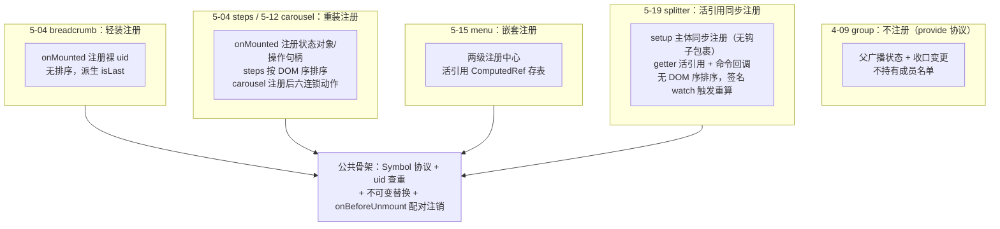
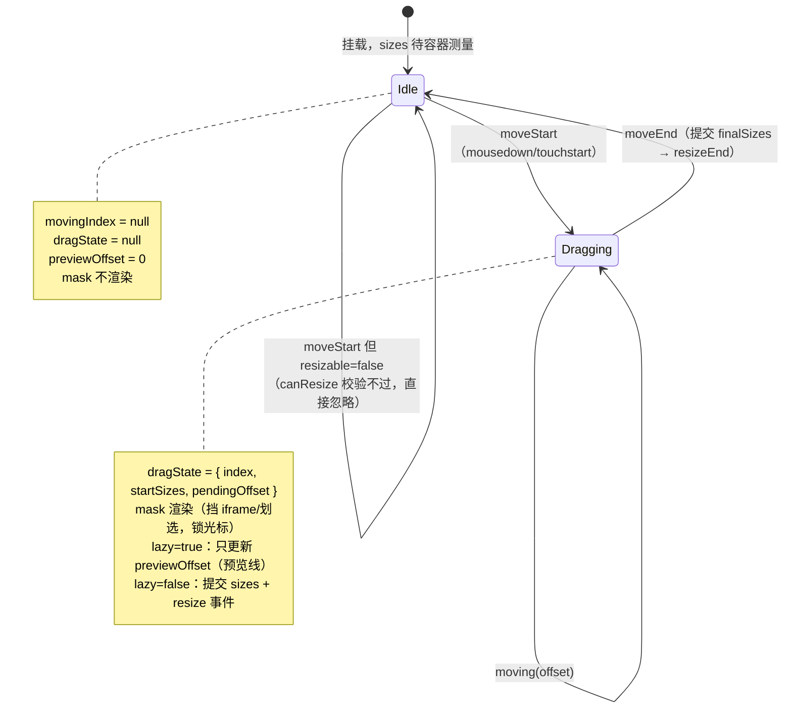
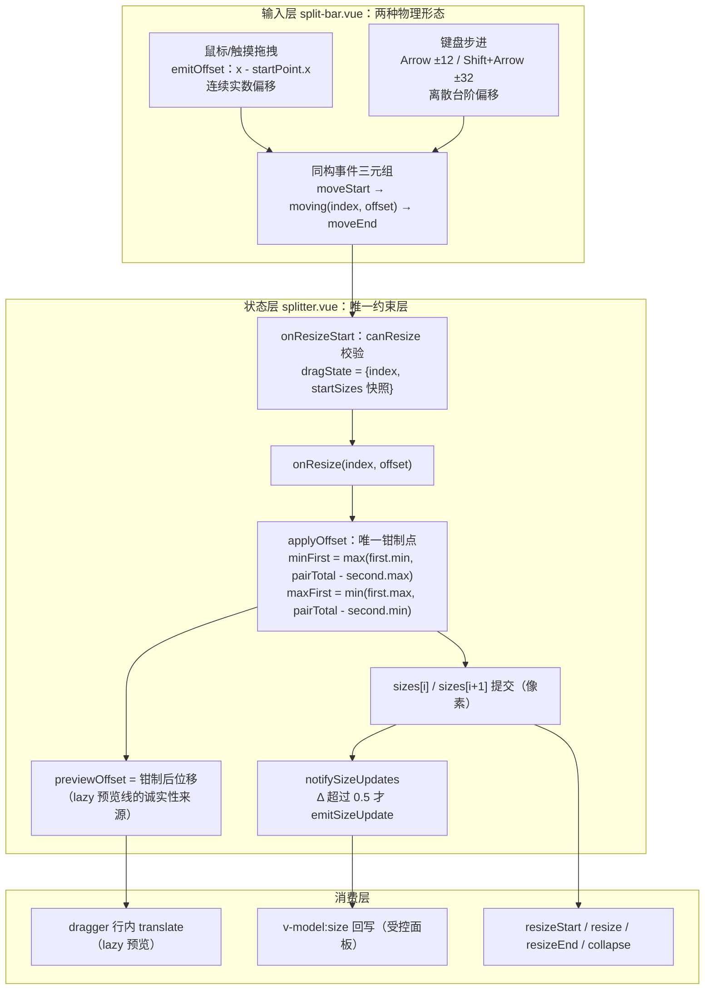

# 5-19 · Splitter：拖拽分栏

> 本篇是"组件深潜"卷的第十九篇。核心问题在分卷大纲里只有一句话：**拖拽几何与键盘可达的双输入**。前两篇的拖拽家族成员里，5-13 的 Affix 是"读几何"（滚动位置反推固定态），5-18 的 Scrollbar 是"滚动的几何"（thumb 位移反推滚动量），Splitter 则是"分配的几何"——指针位移反推面板宽度，而且要在一组 min/max 约束下做零和博弈。更特殊的是，它是全库唯一一个**同时接受连续输入（指针拖拽）与离散输入（键盘步进）**的布局组件：鼠标给出的是任意实数偏移，键盘给出的是 ±12px 的台阶，两种物理形态完全不同的输入必须汇入同一份状态、同一套约束、同一个事件协议。

接到题目先复述一遍目标，防止写偏：Splitter 由 `xy-splitter` 与 `xy-splitter-panel` 两个组件构成（`packages/components/component-manifest.json:162-170`，一个条目带两个组件名与一份样式导入），文档页只写了三个属性、四个事件、五个面板属性（`apps/docs/components/splitter.md`，全文 73 行），看上去是"深潜卷"里最轻的一位。但源码不轻：`splitter.vue` 507 行、`split-bar.vue` 243 行、`split-panel.vue` 87 行、`context.ts` 37 行、`splitter.css` 315 行，还有一套迭代式的空间分配算法和一条贯穿鼠标与键盘的统一约束管线。本篇沿四条线走：**注册**（第五种注册变体，5-04 至 5-15 的谱系上再添一笔）、**拖拽几何**（从 pageX 到 flexBasis 的完整换算链与钳制数学）、**双输入汇流**（键盘与鼠标如何在同一层状态上会师）、**可达性**（role="separator" 之下做对了什么、还欠什么）。EP 对照单独成节——Splitter 是 EP 在 2025 年 6 月才补齐的组件（PR #20145），两边几乎同期设计，可比性极强。

---

## 一、三文件一协议：布局模型的三个事实

先立好布局模型，后面所有几何讨论都建立在它的三个事实之上。

**事实一：容器是 flex，分隔条是零宽的。** `.xy-splitter` 是 `display: flex`（`packages/theme/src/components/splitter.css:1-9`），horizontal 时 `flex-direction: row`，vertical 时 `column`。而分隔条的宿主元素 `.xy-splitter-bar` 在水平布局下 **width 是 0**（`splitter.css:62-64`，垂直布局下 height 是 0）。也就是说，几何模型里分隔条不占任何空间，面板尺寸之和恒等于容器尺寸——这是整个换算链的守恒前提。

**事实二：可视线、手柄、热区是三层叠加。** 零宽的 bar 上画一条 1px 的视觉线（`bar::before`，`splitter.css:66-72`），hover 时浮出 12×52 的胶囊手柄（`dragger::before`，`splitter.css:136-139`），而真正接事件的是一个 20px 宽、撑满容器高的 `<button>`（`split-bar.vue:56-59` 用行内样式定位，绝对居中 translate(-50%)）。视觉只有 1px，命中区却有 20px——这是经典的"视觉细、命中宽"热区设计，第九节还会回到 CSS。

**事实三：面板宽度走 flexBasis 像素值。** 每个 panel 的根元素用 `flexBasis: ${panelSize}px` 驱动（`split-panel.vue:61-63`），配 `.xy-splitter-panel { flex: 0 0 auto; min-width: 0 }`（`splitter.css:33-39`）。注意本库的布局状态是**像素数组**，这个选择的代价与收益在第七节权衡里专门展开。

组件拆分是标准的"三文件一协议"：`splitter.ts` 是 14 行的类型层（`SplitterLayout`/`SplitterSize`/`SplitterCollapseDirection` 加两个事件签名），`context.ts` 是协议层，`splitter.vue` 是状态与算法层，`split-panel.vue` 是注册与渲染层，`split-bar.vue` 是输入层——注意 bar **不是**公开组件，它是 split-panel 按需渲染的内部件，使用者永远不写 `<xy-split-bar>`。索引 `index.ts` 把 Panel 挂成 Splitter 的静态属性（`packages/components/splitter/index.ts:28-34`），这是 4-02 讲过的 `withInstall` 体系里"父子组件静态挂载"的标准姿势：

```ts
// packages/components/splitter/index.ts:26-36
export const XySplitterPanel = withInstall(SplitterPanel, "xy-splitter-panel");

export const XySplitter = withInstall(Splitter, "xy-splitter") as SFCWithInstall<
  typeof Splitter
> & {
  Panel: typeof XySplitterPanel;
};

XySplitter.Panel = XySplitterPanel;

export default XySplitter;
```

协议层全文不长，值得整段读——尤其是注册对象携带了两个**回调方法**，这个细节是第二节的主角：

```ts
// packages/components/splitter/src/context.ts:8-37
export interface SplitterPanelRegistration {
  uid: number;
  size?: SplitterSize;
  min?: SplitterSize;
  max?: SplitterSize;
  resizable: boolean;
  collapsible: boolean;
  emitSizeUpdate: (value: number) => void;
  setIndex: (value: number) => void;
}

export interface SplitterRootContext {
  layout: Ref<SplitterLayout>;
  lazy: Ref<boolean>;
  panels: Ref<SplitterPanelRegistration[]>;
  movingIndex: Ref<number | null>;
  previewOffset: Ref<number>;
  registerPanel: (panel: SplitterPanelRegistration) => void;
  unregisterPanel: (uid: number) => void;
  getPanel: (index: number) => SplitterPanelRegistration | undefined;
  getPanelSize: (index: number) => number;
  onResizeStart: (index: number) => void;
  onResize: (index: number, offset: number) => void;
  onResizeEnd: (index: number) => void;
  onCollapse: (index: number, direction: SplitterCollapseDirection) => void;
}

export const splitterContextKey: InjectionKey<SplitterRootContext> = Symbol(
  "splitterContextKey"
);
```

还有一个输入无关但影响布局的部件：**拖拽遮罩**。`splitter.vue:502-507` 的模板里，`movingIndex !== null` 时渲染一个覆盖全容器的 `__mask`（`splitter.css:19-31`，`inset: 0; z-index: 10`，cursor 锁定为 col/row-resize）。它把拖拽期间的整块容器罩住：面板内容里的 iframe 不再吞事件、文本不再被划选、光标全程保持 resize 形态。EP 的模板里有一行注释原话 "Prevent iframe touch events from breaking"——同一个问题，同一个解法。

---

## 二、第五种注册变体：setup 主体里的活引用注册

这个专栏已经给注册模式建过谱系：4-09 的 group 是"provide 协议、不注册实例"；5-04 的 breadcrumb 是"父收集子"的轻装版（onMounted 注册裸 uid）；同篇给出 steps 的重装版（注册状态对象+回调，DOM 序排序）与 carousel 的中间态（注册操作句柄）；5-15 的 menu 是第四种——嵌套注册。Splitter 的 panel 注册**四不像**，它是第五种：**setup 主体同步注册 + getter 活引用 + 命令回调**。

先看子侧的注册动作全文：

```ts
// packages/components/splitter/src/split-panel.vue:17-63
const ns = useNamespace("splitter-panel");
const splitter = inject(splitterContextKey, null);

if (!splitter) {
  throw new Error("xy-splitter-panel 必须在 xy-splitter 内使用");
}

const index = ref(-1);
const uid = getCurrentInstance()?.uid ?? Date.now();

splitter.registerPanel({
  uid,
  get size() {
    return props.size;
  },
  get min() {
    return props.min;
  },
  get max() {
    return props.max;
  },
  get resizable() {
    return props.resizable;
  },
  get collapsible() {
    return props.collapsible;
  },
  emitSizeUpdate(value) {
    emit("update:size", value);
  },
  setIndex(value) {
    index.value = value;
  }
});

onBeforeUnmount(() => {
  splitter.unregisterPanel(uid);
});

const panelSize = computed(() => splitter.getPanelSize(index.value));
const nextPanel = computed(() => splitter.getPanel(index.value + 1));
const showBar = computed(() => Boolean(nextPanel.value));
const canResize = computed(() => Boolean(props.resizable && nextPanel.value?.resizable));
const isActiveBar = computed(() => splitter.movingIndex.value === index.value);
const panelStyle = computed(() => ({
  flexBasis: `${panelSize.value}px`
}));
```

三个特征把它和前四种变体区分开。

**特征一：注册发生在 setup 主体里，不在 onMounted 里。** 5-04 曾把"注册必须锁进 onMounted"列为注册模式的纪律（原话是"本库把注册严格锁进 `onMounted`，就是这个原因"），理由有二：SSR 下服务端等不来卸载钩子会污染注册表；纯客户端下 setup 注册会把"尚未渲染的子组件"算进 DOM 序判定。Splitter 恰恰违反了这条纪律——`splitter.registerPanel({...})` 裸写在 setup 主体（`split-panel.vue:27`），没有钩子包裹。这不是疏忽，是一组条件恰好都换了：其一，父的注册表是**实例级 `ref`**（`splitter.vue:32`），不是模块级单例，SSR 请求间污染的前提不成立；其二，Splitter 的序数判定**不做任何 DOM 测量**——index 就是 setup 执行序（同步插槽下 setup 序即挂载序即 DOM 序），"未渲染子组件混入序判定"的顾虑不成立；其三，收益明确：子组件首帧渲染就拿到真实 index，`panelSize`、bar 的显隐、resizable 判定全部一次到位，不需要 carousel 那种 `internalActiveIndex = -1` 的未初始化态和 `v-show="ready"` 的防抖动补丁。对比 carousel 注册时要在 nextTick 里排六个连锁测量动作（5-12 第二节），splitter 注册后**什么都不立刻做**——尺寸重算挂在 `watch([containerSize, panelSignature])` 上（`splitter.vue:458-462`），等容器测量就绪才发生。注册时序的轻重，取决于注册的信息在各自领域里的"杀伤力"：轮播的序数直接驱动几何与播放，分栏的序数只是渲染层的取值键。

**特征二：props 以 getter 形式登记，注册表存的是活引用。** `get size() { return props.size }` 意味着父侧每次读 `panel.size` 拿到的都是**当前值**，不是注册瞬间的快照。这直接消解了一类同步问题——EP 的同位置实现（第八节实码）用的是 `...props` 展开快照，然后被迫补了两条 watch 手工回写 `panel.value.size` / `panel.value.resizable` 来追 props 变化，还要用 `isSizeUpdating` 布尔闸防止双向回环。本库的 getter 方案没有回写、没有闸门：props 变了，注册表里的值自动就是新的。父侧还有一个巧妙的消费方式——`panelSignature`（`splitter.vue:39-47`）把每个 panel 的五个属性拼成字符串签名：

```ts
// packages/components/splitter/src/splitter.vue:39-47
const panelSignature = computed(() =>
  panels.value
    .map((panel) =>
      [panel.size ?? "", panel.min ?? "", panel.max ?? "", panel.resizable, panel.collapsible].join(
        ":"
      )
    )
    .join("|")
);
```

这个 computed 在求值时读取了 getter，依赖收集穿透 getter 落在子组件的 props 上——**任何面板的 size/min/max/resizable/collapsible 变化都会改变签名字符串**，从而触发整表重算。一行字符串拼接，同时充当了"注册表内容变更"的订阅器。代价是签名变化会整体重建 sizes（受控场景下的语义是"声明优先"），这个语义取向在第九节测试部分会再确认。

**特征三：注册对象携带命令回调，父可以直接命令子。** `setIndex` 与 `emitSizeUpdate` 是注册时上交的操作面：前者是父在注册/注销后调用 `syncPanelIndexes()`（`splitter.vue:275-279`）逐个下发新序号——这是 5-04 里 steps 重装版"父直接调子的方法"的直系后代；后者是父在拖拽时把钳制后的像素值推给受控面板，转成 `update:size` 事件（`split-panel.vue:44-46`）。对比 breadcrumb 只登记裸 uid，Splitter 的注册对象是"身份 + 活引用配置 + 两个命令接口"的三合一。

父侧的注册表操作则完全遵循公共骨架，注册与注销一对函数全文如下——uid 查重（`splitter.vue:318-320`）、不可变替换（`[...panels.value, panel]`）、注销时 filter（`splitter.vue:327-333`），并且注销时有针对拖拽中状态的清理守卫：

```ts
// packages/components/splitter/src/splitter.vue:317-342
function registerPanel(panel: SplitterPanelRegistration) {
  if (panels.value.some((item) => item.uid === panel.uid)) {
    return;
  }

  panels.value = [...panels.value, panel];
  syncPanelIndexes();
}

function unregisterPanel(uid: number) {
  const nextPanels = panels.value.filter((panel) => panel.uid !== uid);

  if (nextPanels.length === panels.value.length) {
    return;
  }

  panels.value = nextPanels;
  sizes.value = [];
  syncPanelIndexes();

  if (movingIndex.value !== null && movingIndex.value >= nextPanels.length) {
    movingIndex.value = null;
    previewOffset.value = 0;
    dragState = null;
  }
}
```

注销还会把 `sizes.value` 清空，靠签名 watch 重新走一遍声明式分配：**删除面板 = 回到 props 声明的布局**，而不是把剩余面板按比例拉伸。对正在拖拽中被删除的越界分隔条，`dragState`、`movingIndex`、`previewOffset` 一起复位——状态机不会因为成员变动而停在拖拽态。

把第五种变体画进谱系图：



当然要如实指出这个变体的边界：因为不做 DOM 序排序（steps 用 `compareDocumentPosition` 兜底，splitter 没有），它的序数正确性完全押在"同层兄弟按文档序初始化"这条 Vue 保证上。常规用法（直接子面板、v-if 切换）都安全；若未来支持异步组件面板，注册序可能与视觉序脱节，届时要么补排序，要么像 EP 那样引入 vnode 排序器（第八节）。这是第五种变体买"首帧零闪烁"时签下的期票。

---

## 三、拖拽几何：从 pageX 到 flexBasis 的换算链

现在进入本篇的主线。拖拽几何是一条四级换算链：**指针坐标 → 相对偏移 → 钳制换算 → flexBasis 落地**。逐级看实码。

第一级在 `split-bar.vue`：mousedown/touchstart 记录起点，mousemove/touchmove 计算偏移——

```ts
// packages/components/splitter/src/split-bar.vue:69-105
let startPoint: { x: number; y: number } | null = null;

function cleanupListeners() {
  window.removeEventListener("mousemove", handleMouseMove);
  window.removeEventListener("mouseup", handleMouseUp);
  window.removeEventListener("touchmove", handleTouchMove);
  window.removeEventListener("touchend", handleTouchEnd);
}

function startDrag(x: number, y: number) {
  if (!props.resizable) {
    return;
  }

  startPoint = { x, y };
  emit("moveStart", props.index);
}

function emitOffset(x: number, y: number) {
  if (!startPoint) {
    return;
  }

  const offset = isHorizontal.value ? x - startPoint.x : y - startPoint.y;
  emit("moving", props.index, offset);
}

function endDrag() {
  if (!startPoint) {
    cleanupListeners();
    return;
  }

  startPoint = null;
  cleanupListeners();
  emit("moveEnd", props.index);
}
```

注意 bar 层**只算差值，不算布局**：`offset = x - startPoint.x`（`split-bar.vue:92`），单位是像素，方向带符号。bar 不知道 min/max、不知道 total、不知道 lazy——它是个纯粹的"位移传感器"。这个分层是理解双输入汇流的伏笔：键盘步进也是以"像素偏移"的形态进入这条链的，后面会看到。

第二级是约束解析。`resolveSize`（`splitter.vue:69-96`）把 `SplitterSize`（number | string）归一化为像素——数字直接用（`Math.max(value, 0)` 兜负数），字符串认 `%` 与 `px` 后缀，其余尝试 parseFloat：

```ts
// packages/components/splitter/src/splitter.vue:69-96
function resolveSize(value: SplitterSize | undefined, total: number) {
  if (value === undefined || value === null || value === "") {
    return undefined;
  }

  if (typeof value === "number") {
    return Number.isFinite(value) ? Math.max(value, 0) : undefined;
  }

  const normalized = value.trim();

  if (!normalized) {
    return undefined;
  }

  if (normalized.endsWith("%")) {
    const percent = Number.parseFloat(normalized.slice(0, -1));
    return Number.isFinite(percent) ? Math.max((percent / 100) * total, 0) : undefined;
  }

  if (normalized.endsWith("px")) {
    const pixels = Number.parseFloat(normalized.slice(0, -2));
    return Number.isFinite(pixels) ? Math.max(pixels, 0) : undefined;
  }

  const fallback = Number.parseFloat(normalized);
  return Number.isFinite(fallback) ? Math.max(fallback, 0) : undefined;
}
```

`getPanelBounds`（`splitter.vue:98-107`）为每个面板算出 `{min, max}` 数对，未声明 max 时取正无穷，并且 `max = Math.max(resolvedMax, min)` 防止声明出 min > max 的死区间。

第三级是全篇最核心的 24 行——`applyOffset`（`splitter.vue:232-255`），鼠标偏移在这里变成新尺寸：

```ts
// packages/components/splitter/src/splitter.vue:232-255
function applyOffset(startSizes: number[], index: number, offset: number) {
  const pair = getBarPair(index);
  if (!pair) {
    return [...startSizes];
  }

  const total = containerSize.value;
  const bounds = getPanelBounds(total);
  const nextSizes = [...startSizes];
  const firstIndex = index;
  const secondIndex = index + 1;
  const pairTotal = startSizes[firstIndex] + startSizes[secondIndex];
  const firstBounds = bounds[firstIndex];
  const secondBounds = bounds[secondIndex];

  const minFirst = Math.max(firstBounds.min, pairTotal - secondBounds.max);
  const maxFirst = Math.min(firstBounds.max, pairTotal - secondBounds.min);
  const nextFirst = clamp(startSizes[firstIndex] + offset, minFirst, maxFirst);

  nextSizes[firstIndex] = roundSize(nextFirst);
  nextSizes[secondIndex] = roundSize(pairTotal - nextFirst);

  return nextSizes;
}
```

这段代码有两个值得逐字读的细节。**第一，钳制区间是两个面板约束的交集。** 光把 `nextFirst` 夹在 `[firstBounds.min, firstBounds.max]` 是不够的——第一个面板受自己 max 限制的同时，第二个面板也不能跌破它自己的 min。由于 `pairTotal` 守恒（第二个面板的尺寸 = pairTotal - nextFirst），第二个面板的 min/max 会翻译成对 nextFirst 的反向约束：`nextFirst ≤ pairTotal - secondBounds.min`（保证第二个面板不小于它的 min），`nextFirst ≥ pairTotal - secondBounds.max`（保证它不大于 max）。两个区间取交，就是 `minFirst` 与 `maxFirst` 的两个表达式（`splitter.vue:247-248`）。**一对面板的零和博弈，被两行 Math.max/Math.min 收成了单个 clamp。**

**第二，只有这对面板参与运算，其余面板的尺寸原样保留。** 这决定了拖拽的语义是"局部重分配"：拖 0 号分隔条只动 0、1 两块，2 号面板纹丝不动。全局守恒由零宽分隔条保证（所有 flexBasis 之和仍等于容器宽），局部性由 `pairTotal = startSizes[first] + startSizes[second]` 锁定。

第四级是落地：`split-panel.vue:61-63` 的 `panelStyle` 把 `getPanelSize(index)` 转成 `flexBasis`，CSS 的 `flex: 0 0 auto` 保证它是硬约束。浏览器布局引擎接手最后一步。

这里还埋着一个反直觉的事实：**分隔条拖动时，bar 本身的位置从不变**。因为 bar 宿主宽度是 0、跟着前一个面板的右边缘走，而前一个面板的 flexBasis 在变——所以"分隔条移动"在视觉上是面板边缘在动，bar 永远贴着那个边缘。几何模型里没有"分隔条位置"这个状态，只有"面板尺寸"。

### 空间分配：fitSizes 的迭代均摊

拖拽只是尺寸的局部再分配；**初始布局**要解决另一个问题：props 声明的尺寸（可能含百分比、可能总和溢出、可能留空）如何铺满容器且人人满足 min/max。这是 `buildInitialSizes`（`splitter.vue:177-214`）+ `fitSizes`（`splitter.vue:109-175`）的职责。前者做算术：把显式声明的尺寸解析出来，剩余空间平摊给未声明的面板（`fallbackSize = (total - explicitTotal) / autoCount`），全部显式时差额记到最后一个面板头上（`splitter.vue:200-203`），然后声明的 size 有最高优先级回填（`splitter.vue:206-211`）。后者做物理：把这份"理想尺寸"迭代挤进所有约束里。核心循环全文：

```ts
// packages/components/splitter/src/splitter.vue:109-175
function fitSizes(initialSizes: number[], total: number, bounds: PanelBounds[]) {
  const nextSizes = initialSizes.map((size, index) =>
    clamp(Number.isFinite(size) ? size : 0, bounds[index]?.min ?? 0, bounds[index]?.max ?? Infinity)
  );

  let guard = 0;

  while (guard < 60) {
    guard += 1;
    const sum = nextSizes.reduce((acc, size) => acc + size, 0);
    const diff = total - sum;

    if (Math.abs(diff) < 0.5) {
      break;
    }

    const grow = diff > 0;
    const candidates = nextSizes
      .map((size, index) => ({ index, size, bounds: bounds[index] }))
      .filter(({ size, bounds }) =>
        grow ? size < bounds.max - 0.5 : size > bounds.min + 0.5
      );

    if (!candidates.length) {
      break;
    }

    const share = diff / candidates.length;
    let consumed = 0;

    candidates.forEach(({ index, bounds }) => {
      if (grow) {
        const delta = Math.min(bounds.max - nextSizes[index], share);
        nextSizes[index] += delta;
        consumed += delta;
      } else {
        const delta = Math.min(nextSizes[index] - bounds.min, Math.abs(share));
        nextSizes[index] -= delta;
        consumed += delta;
      }
    });

    if (consumed < 0.5) {
      break;
    }
  }

  const finalDiff = total - nextSizes.reduce((acc, size) => acc + size, 0);
  if (Math.abs(finalDiff) >= 0.5) {
    const candidates = nextSizes
      .map((size, index) => ({ index, size, bounds: bounds[index] }))
      .filter(({ size, bounds }) =>
        finalDiff > 0 ? size < bounds.max - 0.5 : size > bounds.min + 0.5
      );

    if (candidates.length) {
      const target = candidates[candidates.length - 1];
      nextSizes[target.index] = clamp(
        nextSizes[target.index] + finalDiff,
        target.bounds.min,
        target.bounds.max
      );
    }
  }

  return nextSizes.map(roundSize);
}
```

算法骨架是"**均摊 + 收敛**"：每轮把差额 `diff` 平均分给所有还有余量的候选面板（grow 时未到 max、shrink 时未到 min），单个面板吃不完的量（`Math.min(bounds.max - size, share)`）留在下一轮继续摊，直到总差额进入 0.5px 容差、或没有候选者、或单轮消费量低于容差、或撞上 60 轮保险丝。循环外的收尾段（`splitter.vue:156-172`）处理最后一丝尾差：把 finalDiff 一次性塞给**最后一个**还有余量的候选者。0.5px 的容差贯穿始终，与 `roundSize`（保留三位小数，`splitter.vue:65-67`）、`notifySizeUpdates` 的 0.5 阈值（`splitter.vue:269`）构成同一套精度纪律——低于半像素的变化不传播、不触发事件、不进渲染。这套均摊算法与 EP 的做法是两个流派（EP 用一次性的比例归一化，见第八节），均摊的长处是**逐面板尊重 min/max**：先到先得但每轮受边界约束，极端声明（三个面板都声明了互斥的 min）下能给出"有界最优解"而不是无限循环。

容器尺寸变化时的行为也在这条线上：`buildInitialSizes` 的 `currentSizesAvailable` 分支（`splitter.vue:183-189`）把现有像素尺寸按 `total / lastContainerSize` 的比例整体缩放后再过一遍 fitSizes——**像素存储**意味着容器变化需要显式重算，这个代价正是第七节权衡二的论据之一。

---

## 四、拖拽状态机：dragState、previewOffset 与 lazy 双通道

把第三节的三级换算装进时间轴，就是一个三态状态机。状态本体有三个：`movingIndex`（正在拖哪条分隔条，对外决定 mask 与 bar 高亮）、`dragState`（一次拖拽会话的会话数据：起点尺寸快照与待提交偏移）、`previewOffset`（lazy 模式的预览位移）。bar 层还有一个 `startPoint`，是状态机的输入侧凭证。



状态机的三条迁移对应三个上下行事件（`splitter.vue:352-410`）。`onResizeStart` 校验 `canResize`（相邻两面板都 resizable，`splitter.vue:227-230`）后开档：记录 index、把当前 sizes 拷贝成 `startSizes` 快照、清零 pendingOffset，发出 `resizeStart`。快照是这台状态机的关键设计——**每次 moving 都从起点快照出发计算**（`applyOffset(dragState.startSizes, ...)`），而不是在上一次结果上累加，这样任何一次 moving 丢失或乱序都不会让状态漂移，偏移量天然幂等。

`onResize` 是拖拽中的心跳。逐行看：

```ts
// packages/components/splitter/src/splitter.vue:368-386
function onResize(index: number, offset: number) {
  if (!dragState || dragState.index !== index) {
    return;
  }

  const nextSizes = applyOffset(dragState.startSizes, index, offset);
  const resolvedOffset = nextSizes[index] - dragState.startSizes[index];

  dragState.pendingOffset = resolvedOffset;
  previewOffset.value = resolvedOffset;

  if (props.lazy) {
    return;
  }

  sizes.value = nextSizes;
  notifySizeUpdates(nextSizes, [index, index + 1]);
  emit("resize", index, [...nextSizes]);
}
```

`resolvedOffset = nextSizes[index] - dragState.startSizes[index]` 是一个极易被略过但分量很重的小设计：它是**钳制后的真实位移**。指针走了 300px 但 min 把面板挡在 80px 处时，指针位移是 300、resolvedOffset 是 80。lazy 模式的预览线用它（拖到一半被 min 挡住时，预览线贴在边界上不再跟随指针——所见即所得，预览的位置就是松手后面板真正会到的位置）；`pendingOffset` 也存它，moveEnd 时 lazy 补提交直接复用。**预览层的诚实性**来自在唯一的钳制层取值，而不是在输入层自己再猜一遍边界。

`onResizeEnd`（`splitter.vue:388-410`）收档：lazy 时按 pendingOffset 算出 finalSizes 补提交（sizes + notifySizeUpdates），非 lazy 时直接采用当前 sizes；清空 dragState 与 movingIndex、归零 previewOffset，然后在 `nextTick` 里发 `resizeEnd`——延后一拍发出，保证消费方在事件回调里读到的 DOM 已经是最终布局。

lazy 的预览通道在视图层有对应的第二种形态：bar 的 dragger 在 lazy 且激活时把 `activeOffset` 拼进行内 transform（`split-bar.vue:51-67`），横纵两个方向各一条模板串。同时根节点把同一个值写进了 CSS 变量 `--xy-splitter-offset`（`splitter.vue:50-52` 的 `rootStyles`，经 `useNamespace` 的 `cssVarBlock` 生成，`packages/xiaoye-primitives/src/composables/use-namespace.ts:9`）——但这里有一个本篇要如实记录的**实码瑕疵**：全库检索 `--xy-splitter-offset`，只有 `splitter.css:2` 的声明与根节点的写入，**没有任何消费点**。dragger 的预览位移走的是行内样式，不走这个变量。它是全篇唯一一个"被写入却无人读取"的通道（EP 的同名机制是变量被样式消费的，见第八节），更像是给未来样式化预览留的桩，但目前它是死代码。删掉或接上，二选一，不该停在半空。

---

## 五、键盘可达：把一次按键合成一次完整拖拽

现在请出本篇的另一位主角。分隔条在 DOM 里是一个 `<button>`，带 `role="separator"`、`aria-orientation`、`aria-label` 三件套（`split-bar.vue:215-227`）：

```html
<!-- packages/components/splitter/src/split-bar.vue:215-227 -->
    <button
      type="button"
      :class="draggerClasses"
      :style="draggerStyles"
      :aria-orientation="isHorizontal ? 'vertical' : 'horizontal'"
      aria-label="调整面板尺寸"
      role="separator"
      @mousedown="handleMouseDown"
      @touchstart="handleTouchStart"
      @keydown="handleKeydown"
    >
      <span :class="`${ns.base.value}__grip`" aria-hidden="true" />
    </button>
```

三个属性各有一说。`role="separator"`：WAI-ARIA 里 separator 是"分隔可区内容且允许调整尺寸"的语义角色，可聚焦的 separator 应当支持方向键调整——本库照此办理。`aria-orientation` 有个容易吓到人的**反转**：horizontal 布局（左右分栏）时传的是 `'vertical'`——因为 orientation 描述的是**分隔条本身**的朝向，左右两栏之间立着的是一条竖线。这个反转是对的，也恰好是EP完全没做的（EP 的分隔条是裸 div，没有任何 role 与 aria 属性，第八节展开）。`aria-label="调整面板尺寸"` 给屏幕阅读器一个可念的名字。

键盘处理全文如下，它是本篇核心问题的另一半答案：

```ts
// packages/components/splitter/src/split-bar.vue:148-176
function handleKeydown(event: KeyboardEvent) {
  if (!props.resizable) {
    return;
  }

  const step = event.shiftKey ? 32 : 12;
  let offset = 0;

  if (isHorizontal.value) {
    if (event.key === "ArrowLeft") {
      offset = -step;
    } else if (event.key === "ArrowRight") {
      offset = step;
    }
  } else if (event.key === "ArrowUp") {
    offset = -step;
  } else if (event.key === "ArrowDown") {
    offset = step;
  }

  if (!offset) {
    return;
  }

  event.preventDefault();
  emit("moveStart", props.index);
  emit("moving", props.index, offset);
  emit("moveEnd", props.index);
}
```

设计要点有四。**第一，步进量 12px，Shift 加速到 32px**（`split-bar.vue:153`）——12px 在 600px 容器上约 2% 一格，精确模式够细；Shift 的大步长是拖拽界面键盘化的通用惯例。**第二，方向键按布局轴映射**：horizontal 认左右，vertical 认上下，其余按键零处理，不越界揽权。**第三，也是最关键的：一次按键被合成为一次完整的拖拽会话**——`moveStart → moving → moveEnd` 三发连射（`split-bar.vue:173-175`），同步执行。这意味着键盘按键在状态机眼里与"极快地拖了一下"无法区分：dragState 建档、applyOffset 钳制、sizes 提交、事件三连、清档，全部走同一条管线。**第四，`event.preventDefault()` 阻止方向键滚动页面**——分隔条聚焦时按方向键，意图只能是调宽，滚动是干扰。

这个"合成会话"的妙处在连续按键时的复利：每次按键都从当前 sizes 重新开档（startSizes 是最新快照），钳制后的值就是下一档的起点，于是**连按十次 ArrowRight 就是十次受约束的 12px 步进**，到边界后自动吸在 min/max 上，多余的按键被钳制层静默吸收（resolvedOffset 为 0，事件照发但尺寸不再变化）。键盘用户不需要知道边界在哪——边界会来找他。

还有一处交互层的诚实：`resizable=false` 时 keydown 直接 return（`split-bar.vue:149-151`），CSS 同步降级光标与配色（`.is-disabled`，`splitter.css:220-247`）。但要注意实现细节：这里的"禁用"是语义与视觉上的，dragger 的 `<button>` **没有**挂原生 `disabled` 属性——它仍然可聚焦，只是按了没反应。这是有意的取舍还是疏漏，代码里没有注释可考；按可达性的标准衡量，更严格的做法是让不可调尺寸的分隔条退化为不可聚焦（或至少在 aria 上声明禁用态），目前它聚焦后是个"安静的黑洞"。

---

## 六、双输入汇流：约束钳制在哪一层统一

把第五、六节拼起来，本篇的核心问题可以正面回答了：**两种物理形态的输入如何汇入同一份状态？答案是：约束钳制不在任何一个输入层，而在汇合点之后的唯一一层——`applyOffset`。**

鼠标路径：指针连续位移 → bar 算出连续偏移 `x - startPoint.x` → `moving` 事件。键盘路径：离散按键 → bar 直接生成 `±12` / `±32` 的偏移 → 同一个 `moving` 事件。两条路径在 bar 层的产物**同构**——都是一个 `(index, offset: number)` 二元组——于是从 `onResize` 开始的一切（钳制、快照、提交、事件、回写）对两者完全透明。约束收口在 `applyOffset` 的单个 clamp 里，任何输入形态都不可能绕过它：不存在"鼠标能拖到但键盘走不到"或反之的中间态。这正是"双输入同状态"的工程含义——**不是两个输入通道各自维护一套约束逻辑，而是把输入差异压缩在管线最上游的 3 行代码里**（emitOffset 的连续值 vs handleKeydown 的台阶值），下游永不分支。



汇流图上有三个值得点名的支线。**其一，`notifySizeUpdates` 只通知受控面板**：`panel.size === undefined` 的直接跳过（`splitter.vue:260-263`）——非受控面板的尺寸由父组件全权管理，不打扰；受控面板才需要 `update:size` 维持 `v-model:size` 的闭环。**其二，回写不会与拖拽打架**：钳制后的值回写给 props，props 变化改变 panelSignature，签名 watch 触发 recalculateSizes 重算——但重算的输入已经是同一个值，收敛回自身，环路闭合而不振荡。**其三，collapse 事件不走拖拽管线**，它是一段独立的状态迁移：`toggleCollapsed`（`splitter.vue:412-439`）以 0.5px 为界判断"当前是折叠还是展开"，折叠时把目标面板尺寸记进 `collapseMemory`（一个 `Map<number, number>`，`splitter.vue:37`）再清零、把 pairTotal 全给邻居；展开时按"记忆值 → props.size → 对半分"的优先级恢复，并钳制在交集区间内。

collapse 这段实码值得整段读——折叠/恢复的对称性全在里面：

```ts
// packages/components/splitter/src/splitter.vue:412-439
function toggleCollapsed(index: number, direction: SplitterCollapseDirection) {
  const targetIndex = direction === "start" ? index : index + 1;
  const siblingIndex = direction === "start" ? index + 1 : index;
  const total = containerSize.value;
  const bounds = getPanelBounds(total);
  const nextSizes = [...sizes.value];
  const pairTotal = nextSizes[targetIndex] + nextSizes[siblingIndex];
  const targetSize = nextSizes[targetIndex];

  if (targetSize > 0.5) {
    collapseMemory.set(targetIndex, targetSize);
    nextSizes[targetIndex] = 0;
    nextSizes[siblingIndex] = roundSize(pairTotal);
    return nextSizes;
  }

  const remembered = collapseMemory.get(targetIndex);
  const preferred = resolveSize(panels.value[targetIndex]?.size, total);
  const desired = remembered ?? preferred ?? Math.max(pairTotal / 2, bounds[targetIndex].min);

  const minTarget = Math.max(bounds[targetIndex].min, pairTotal - bounds[siblingIndex].max);
  const maxTarget = Math.min(bounds[targetIndex].max, pairTotal - bounds[siblingIndex].min);
  const restored = clamp(desired, minTarget, maxTarget);

  nextSizes[targetIndex] = roundSize(restored);
  nextSizes[siblingIndex] = roundSize(pairTotal - restored);
  return nextSizes;
}
```

这段里有一个与 applyOffset 严格对称的结构：`minTarget/maxTarget` 的交集算式与拖拽的 `minFirst/maxFirst` 同构——折叠恢复本质上就是"一次目标尺寸由记忆值决定的微型拖拽"。记忆的键是**面板序号**而非 uid，这带来一个真实的边界风险：删除面板后（unregisterPanel 不清理 collapseMemory），原 0 号面板的记忆值可能被新顶替上来的 0 号面板恢复出来——"记住的宽度"跟着座位走而不是跟人走。常规用法（面板集合稳定）无感，动态增删面板的场景里这是一个待还的欠条，第九节一并记账。

---

## 七、三个设计权衡

### 权衡一：pointer capture 与 window 监听——5-18 预告的正面回答

5-18 的预告里留了一个问题："拖拽期间用 pointer capture 还是 window 监听的选择（Scrollbar 选了后者，Splitter 为什么换）"。先把实码定论摆出来：**Splitter 没有换**。它的输入体系是 mousedown/mousemove/mouseup 加 touchstart/touchmove/touchend 双轨（`split-bar.vue:129-146`），drag 期间的监听挂在 `window` 上，靠 `cleanupListeners` 成对拆卸（`split-bar.vue:71-76`），组件卸载时兜底清理（`split-bar.vue:194-196`）。全库检索没有 `pointerdown`，没有 `setPointerCapture`。

先把两条技术路线的账算清。`setPointerCapture` 的好处是事件重定向：capture 之后的 pointermove 全部发给拖拽元素本身，指针划出窗口、划进 iframe 都不会丢事件，也天然免去 window 层的挂拆。mouse+touch + window 监听则要自己管挂拆时序（好在配对纪律已经写进了同一对函数），并且在 touch 侧必须显式 `{ passive: false }`（`split-bar.vue:144`）才能 preventDefault 掉页面滚动，还要配 `touch-action: none`（`splitter.css:103`）压住浏览器手势。单看工程优雅度，pointer events 是更现代的答案。

那为什么实码不换？三个实打实的理由。**理由一：对齐先例。** EP 的 split-bar 逐行对照是一模一样的选型——`onMousedown`/`onTouchStart` 双轨 + window 挂监听（EP `split-bar.vue` 实码，mousedown 里 `window.addEventListener('mouseup'/'mousemove')`），两个几乎同期的实现独立收敛到同一答案，这至少说明 mouse+touch 是该交互形态的"行业收敛解"。**理由二：touch 双轨的复杂度增量其实很小。** 本库的 touch 分支只有 18 行（`split-bar.vue:115-127, 136-146`），逻辑与 mouse 分支同构（取 `touches[0]` 换算 pageX/pageY）；换 pointer events 能省下这 18 行与一条 passive 声明，但需要处理 pointerId 生命周期与 capture 异常，省与增大致相抵。**理由三：历史与兼容惯性**——pointer events 在旧版 Safari 上有已知补丁史，组件库的选型天然偏保守。要说这个选型的真实代价，看 `emitOffset` 的调用处（`split-bar.vue:108`）：`emitOffset(event.pageX || event.clientX, event.pageY || event.clientY)`——这个 `||` 兜底在 pageX 恰好为 0（指针贴着视口左缘）时会错误回落到 clientX。小到几乎不会触发的边界瑕疵，但它暴露了双轨方案在数值语义上的松散；pointer events 的单一坐标体系不会有这行代码。结论：**可以换，收益是删除 18 行重复与一个边界瑕疵；没换，先例对齐与保守惯性是主因**。5-18 预告里"Splitter 为什么换"的预设在此收卷：没换，且不换的理由成立。

### 权衡二：像素存储与百分比存储

`SplitterSize` 的**输入**是 `number | string`（`splitter.ts:2`），字符串可以是 `"320px"` 也可以是 `"40%"`（类型夹具 `tests/types/fixtures/splitter.ts:11,27` 各钉了一例）。但**存储**是像素：`sizes: number[]`（`splitter.vue:33`），百分比在 `resolveSize` 处一次性换算成像素落库。EP 是另一极：`percentSizes` 以百分比为一等公民存储，`pxSizes` 只是 `ptg2px` 的派生 computed。EP 侧的完整换算器（dev 分支 `packages/components/splitter/src/hooks/useSize.ts` 实码，2026-09 核对）：

```ts
// element-plus dev 分支 packages/components/splitter/src/hooks/useSize.ts
export function useSize(
  panels: Ref<PanelItemState[]>,
  containerSize: ComputedRef<number>
) {
  const propSizes = computed(() => panels.value.map((i) => i.size))

  const panelCounts = computed(() => panels.value.length)

  const percentSizes = ref<number[]>([])

  watch([propSizes, panelCounts, containerSize], () => {
    let ptgList: (number | undefined)[] = []
    let emptyCount = 0

    // Convert the passed props size to a percentage
    for (let i = 0; i < panelCounts.value; i += 1) {
      const itemSize = panels.value[i]?.size

      if (isPct(itemSize)) {
        ptgList[i] = getPct(itemSize)
      } else if (isPx(itemSize)) {
        ptgList[i] = getPx(itemSize) / containerSize.value
      } else if (itemSize || itemSize === 0) {
        const num = Number(itemSize)

        if (!Number.isNaN(num)) {
          ptgList[i] = num / containerSize.value
        }
      } else {
        emptyCount += 1
        ptgList[i] = undefined
      }
    }

    const totalPtg = ptgList.reduce<number>((acc, ptg) => acc + (ptg || 0), 0)

    if (totalPtg > 1 || !emptyCount) {
      // If it is greater than 1, the scaling ratio
      const scale = 1 / totalPtg
      ptgList = ptgList.map((ptg) => (ptg === undefined ? 0 : ptg * scale))
    } else {
      // If it is less than 1, the filling ratio
      const avgRest = (1 - totalPtg) / emptyCount
      ptgList = ptgList.map((ptg) => (ptg === undefined ? avgRest : ptg))
    }

    percentSizes.value = ptgList as number[]
  })

  const ptg2px = (ptg: number) => ptg * containerSize.value
  const pxSizes = computed(() => percentSizes.value.map(ptg2px))

  return { percentSizes, pxSizes }
}
```

两种存储的账本分开记。**百分比存储的免费午餐是容器自适应**：容器变了，百分比自动生效，不需要重算；代价是**每次渲染都要乘一次并取整**，拖拽中每帧的像素偏移要除回百分比再存，往返换算带来累积舍入的护理成本；且"面板 A 固定 260px 侧栏"这类真实需求要表达成 `260 / containerSize` 的动态百分比，语义反而绕。**像素存储的免费午餐是拖拽与渲染的直接性**：偏移即像素、flexBasis 即像素、lazy 预览位移即像素，三级换算零往返；代价是**容器 resize 必须显式重算**——这就是 `buildInitialSizes` 里 scale 分支（`splitter.vue:187-189`）与 ResizeObserver（`splitter.vue:298-310`）+ window resize 双保险存在的原因。jsdom 里 ResizeObserver 缺席，window resize 监听（`splitter.vue:477`）恰好兼任了测试注入口——测试里的 `mockSplitterSize` + `window.dispatchEvent(new Event("resize"))`（`splitter.spec.ts:41-43`）走的就是这条路。本库选像素还有一个隐性论据：**collapse 记忆、fitSizes 容差、notify 阈值全部以像素为单位定义**（0.5px 贯穿全库），百分比存储下这些常数都要换成比例并处理量纲，精度语义会含混得多。存储单位选什么，下游一整套常数的量纲就定了——这是"单位即架构"的一个小样本。

### 权衡三：键盘步进的单位与事件突发

12/32 这组数字值得单独审。替代方案一：**百分比步进**（如每按一次 2%），容器越大步子越大，理论上更"成比例"；但它与像素存储的单位相反（又要往返换算），且小容器里 2% 可能低于 fitSizes 的 0.5px 容差造成"按了没反应"的观感。替代方案二：**自适应步长**（剩余可调空间的 1/N 之类），智能但不可预期——键盘用户对"每按一次走多远"的心理模型是恒定的，步长漂移会破坏肌肉记忆。固定像素步在两者之间取了可预期性，代价是大容器上 12px 显得保守——这正是 Shift 加速挡存在的意义：常速微调、加速粗调，两挡覆盖了键盘操作的实际频谱。

更深的代价在**事件突发**上：合成会话意味着每次按键发出 resizeStart、resize、resizeEnd 各一次（`split-bar.vue:173-175`），连按十次就是三十个事件。对消费方（比如根据 resizeEnd 持久化布局的场景）这不是问题——resizeEnd 语义就是"一次调整结束"；但对想在 resize 中做重活的消费方，键盘连按会造成十次高频回调，而拖拽场景的 resize 频率被 rAF 与指针移动节奏天然平滑了。键盘路径没有节流。更优雅的变体是"按住方向键保持会话、松键才 moveEnd"（keydown 开档、keyup 收档），但那需要 bar 维护跨事件的按键状态，还要处理失焦时的收档兜底——复杂度换的是事件数量的优化，对当前的事件面（每次会话只带一个 sizes 数组）而言， bursts 是可接受的诚实成本。另外要重申第五节的缺口：**分隔条没有 aria-valuenow / aria-valuemin / aria-valuemax**。按 WAI-ARIA 对可聚焦 separator 的要求，当前尺寸应当以百分比暴露给辅助技术，让屏幕阅读器能播报"左栏 45%"——这是本组件可达性清单上欠账最明确的一项（键盘能走、边界会钳，但"现在在哪"不可感知），修复路径也现成：在 split-panel computed 出百分比，`:aria-valuenow` 绑上去即可。

---

## 八、EP 对照：迟到的官方答案

Element Plus 直到 2025 年 6 月才合入 Splitter（PR #20145，`packages/components/splitter/` 首个提交 2025-06-03），晚于本库的实现。两边几乎同期、各自独立设计，恰好构成一组干净的对照实验。把关键差异摆到一张表上：

| 维度 | 本库 XySplitter | EP ElSplitter（dev 分支实码） |
| --- | --- | --- |
| 面板注册 | setup 主体同步注册，getter 活引用 | 同为 setup 主体注册（`registerPanel(_panel)`），但 `{...props}` 展开快照 + 两条 watch 手工回写 + `isSizeUpdating` 防回环闸 |
| 成员排序 | 无，setup 序即序数 | `useOrderedChildren` + `PanelsSorter` 组件按 vnode 位排序 |
| 尺寸存储 | 像素数组 + 容器变化按比例重算（fitSizes 迭代均摊） | `percentSizes` 百分比存储 + `pxSizes` 派生，超 1 时整体归一化 |
| 拖拽事件 | mouse + touch 双轨，window 监听 | 同选型（mousedown/touchstart + window 挂拆） |
| 钳制 | `applyOffset` 单 clamp（交集区间） | useResize 里四段 if 逐边合并 offset，效果等价 |
| lazy | previewOffset 行内 transform；`--xy-splitter-offset` 声明未消费 | `--el-splitter-bar-offset` 写入根节点且被样式消费（`splitter.scss:93/97` 的 dragger transform） |
| 键盘可达 | button + role="separator" + aria-orientation/label + 方向键 12/32 步进 | **无**——dragger 是裸 div，无 role、无 tabindex、无 keydown |
| 折叠 | per-index collapseMemory 单面板记忆 | `cacheCollapsedSize` 全量数组缓存，恢复时整体取回 |

四组差异值得展开。**第一组是注册表的新鲜度治理**。EP 面板注册对象是 `reactive({ uid, getVnode, setIndex, ...props, collapsible: computed(...) })`——`...props` 是注册瞬间的快照，props 后续变化不会反映到表里，于是 EP 在 panel 里补了两条 watch：`watch(() => props.resizable, (val) => { panel.value.resizable = val })`，size 同理且外带 `isSizeUpdating` 布尔闸防止 `update:size` 回环。本库的 getter 方案（`get size() { return props.size }`）从结构上消掉了这组补丁：没有快照就没有同步。这是"活引用 vs 快照+回写"的直接对照，注册对象的形态决定了治理成本。**第二组是排序兜底**。EP 因为同样在 setup 主体注册，它选择再加一道 vnode 排序器（`PanelsSorter`，注册对象里的 `getVnode: () => instance.vnode` 就是给排序器用的）来保证任何情况下序数与视觉一致——这正是第二节末尾说的"要么补排序"路线：EP 补了，本库押在 Vue 的兄弟初始化顺序上。**第三组是可达性**，差距最大的一组：EP 的分隔条在无障碍树上是个不可聚焦、无名无分的装饰 div，纯鼠标交互；本库至少把"键盘可达"做完了主链路（聚焦、语义、步进、钳制），只欠 aria-valuenow 的数值播报。**第四组是折叠语义**：EP 的 `cacheCollapsedSize` 是全量快照（第一次折叠时记下所有面板尺寸），恢复走全局；本库是 per-index 记忆 + `collapse` 事件携带 sizes，粒度更细但继承了第二节说的 index 键位风险。两边各有取舍，但本库的 `collapseMemory` 至少应该补上 unregister 时的清理。

还有一处反向的"本库之过"：EP 的 lazy 偏移走 CSS 变量且**真被消费**（dragger 的 transform 引用 `getCssVar('splitter-bar-offset')`），本库的同名机制（`--xy-splitter-offset`）写而不读（第四节已述）。对照之下这不是"两种设计"，而是本库实现停在半途的证据——EP 的样式消费路径就是现成的完工图纸。

---

## 九、测试、夹具与三张欠条

`splitter.spec.ts`（165 行）四条用例，每条都压在一个核心行为上。第一条锁渲染与布局（`splitter.spec.ts:26-48`）：vertical 布局类名、两块面板、首块 flexBasis 180px（360 高的一半）。第二条锁拖拽主线（`splitter.spec.ts:50-84`），是全文件最重的一条：

```ts
// packages/components/splitter/__tests__/splitter.spec.ts:66-83
    const dragger = wrapper.find(".xy-splitter-bar__dragger");
    dragger.element.dispatchEvent(
      new MouseEvent("mousedown", { bubbles: true, clientX: 220, clientY: 0 })
    );
    window.dispatchEvent(new MouseEvent("mousemove", { bubbles: true, clientX: 300, clientY: 0 }));
    await nextTick();

    expect(dragger.attributes("style")).toContain("translate(calc(-50% + 0px), -50%)");

    window.dispatchEvent(new MouseEvent("mouseup"));
    await nextTick();

    const panels = wrapper.findAll(".xy-splitter-panel");
    expect(panels[0].attributes("style")).toContain("300px");
    expect(panels[1].attributes("style")).toContain("300px");
    expect(wrapper.emitted("resizeStart")?.[0]).toEqual([0, [220, 380]]);
    expect(wrapper.emitted("resize")?.at(-1)).toEqual([0, [300, 300]]);
    expect(wrapper.emitted("resizeEnd")?.[0]).toEqual([0, [300, 300]]);
```

这条用例的信息密度很高：`resizeStart` 的载荷 `[0, [220, 380]]` 钉住了初始分配语义（声明的 size: 220 生效，右侧未声明面板吃满剩余 380）；mousemove 到 300px 处，非 lazy 模式下 dragger 的行内 transform **仍是 +0px**（预览位移只在 lazy 下非零——`split-bar.vue:52` 的 `props.active && props.lazy` 条件被这条断言钉死）；mouseup 后两面板各 300px，三个事件的载荷数组一一核对。测试的事件派发方式（dragger 上 mousedown、window 上 mousemove/mouseup）本身就是对"监听挂在 window"这一实现的镜像——实现换成 pointer capture，这条测试就得重写，测试与实现在这里是绑定的。第三条锁 lazy 预览（`splitter.spec.ts:86-116`）：同样的拖拽，断言 transform 里出现 `+ 80px`——预览线跟随钳制后偏移。第四条锁折叠与双向绑定（`splitter.spec.ts:118-164`）：`v-model:size` 的 ref 在折叠时变 0、再点恢复 180——collapseMemory 与 notifySizeUpdates 的闭环被端到端验证。

类型夹具 `tests/types/fixtures/splitter.ts`（39 行）锁导出面：两个事件签名的函数类型、`SplitterProps`/`SplitterPanelProps` 的字段类型、`"40%"` 与 `"320px"` 的字符串形态，以及一条 `@ts-expect-error` 钉死 `layout: "grid"` 非法（`splitter.spec` 之外的类型层防线）。文档示例三件（`apps/docs/examples/splitter/`：basic 247 行、collapsible 278 行、vertical 221 行）分别演示 IDE 式双栏、lazy + v-model:size + collapsible 的桌面级交互、垂直终端分区——其中 collapsible 例子顶部的 `Sidebar: {{ Math.round(sidebarSize) }}px` 实时读数，就是 `update:size` 事件的消费范本。

如实记下三张欠条。**欠条一：键盘路径零测试覆盖。** 四条用例里没有一条派发 keydown——12/32 步进、方向键映射、合成会话、边界吸收，全部没有断言。可达性是本篇的核心问题之一，而它的正确性目前只靠代码评审悬空支撑。补法现成：找到 dragger、`trigger("keydown", { key: "ArrowRight" })`、断言 resizeStart/resize/resizeEnd 三连与面板尺寸增量。**欠条二：collapseMemory 不随面板注销清理**（`splitter.vue:326-342` 的 unregisterPanel 全文无 memory 操作），且以 index 为键，动态面板场景下记忆会错位——一条"注销后折叠恢复不串位"的用例也该有。**欠条三：文档示例的文案撒了谎**——collapsible 例子第 39 行写着 "Drag the divider or double-click to collapse"，但分隔条上没有任何 dblclick 处理器（`split-bar.vue` 全文只有 mousedown/touchstart/keydown 三种输入），双击折叠并不存在；要么补 dblclick 折叠，要么改文案，现状是文档在承诺一个不存在的交互。

---

## 十、收束：把几何交给指针，把边界留给所有人

回到核心问题——拖拽几何与键盘可达的双输入，本库的答案可以压成三句话。**几何上**，零宽分隔条保证了"面板尺寸之和 = 容器尺寸"的守恒律，拖拽被建模为"一对面板间的零和再分配"，min/max 约束经交集运算收进单个 clamp，四个 0.5px 容差与三位小数取整构成全库统一的精度纪律。**输入上**，连续的指针位移与离散的键盘台阶被压缩成同构的 `(index, offset)` 二元组，在唯一的约束层（applyOffset）汇合——钳制收口在哪一层，双输入的一致性就到哪一层。**可达性上**，`<button role="separator">` 的语义骨架、方向键的合成会话、Shift 加速挡构成了主链路，aria-valuenow 的数值播报与键盘测试覆盖是明码标价的两笔欠账。

Splitter 还有一个下游值得留名：增强层的 `xy-split-layout-page`（`packages/pro-components/component-manifest.json:219-224`）是它在页面级的封装，类型夹具 `tests/types/fixtures/split-layout-page.ts` 里 `layout: "aside-main"`、`primarySize: "30%"` 的声明，就是本篇这套 size/min/max 协议的消费端续篇。

下一篇预告：5-20《Divider：最小组件的完整规范》。Splitter 是"分栏的几何"——面板宽度在指针与键盘之间博弈；Divider 则是"分隔的极限"——一条 1px 的线，几乎没有状态、没有事件、没有几何。但恰恰是这种最小组件，最能检验一个组件库的规范密度：`divider` 的 props 如何用枚举而不是字符串约束方向与样式、内容文案的排版如何与分隔线对齐、CSS 上 `1px` 为什么不用 transform 缩放来实现、以及一个 50 行的组件该有怎样的文档与测试规格？从"拖拽分栏的博弈"回到"一条线的完整规范"，下一篇我们用全库最小的组件，检验全库最严的规范。

---

*本篇代码引用核对于当前工作区实态：`packages/components/splitter/src/splitter.vue`（507 行）、`src/split-bar.vue`（243 行）、`src/split-panel.vue`（87 行）、`src/split-panel.ts`（11 行）、`src/splitter.ts`（14 行）、`src/context.ts`（37 行）、`packages/components/splitter/index.ts`（36 行）、`__tests__/splitter.spec.ts`（165 行）、`packages/theme/src/components/splitter.css`（315 行）、`packages/theme/index.css:27`、`packages/components/component-manifest.json:162-170`、`packages/xiaoye-primitives/src/composables/use-namespace.ts`（17 行）、`tests/types/fixtures/splitter.ts`（39 行）、`tests/types/fixtures/split-layout-page.ts`、`apps/docs/components/splitter.md`（73 行）、`apps/docs/examples/splitter/`（basic 247 行 / collapsible 278 行 / vertical 221 行）。EP 侧事实核对自 element-plus dev 分支真实源码：`packages/components/splitter/src/splitter.vue`、`src/split-bar.vue`、`src/split-panel.vue`、`src/hooks/useSize.ts`、`src/hooks/useResize.ts`、`packages/theme-chalk/src/splitter.scss`（bar-offset 消费点 93/97 行），组件由 PR #20145 于 2025-06-03 合入。*
