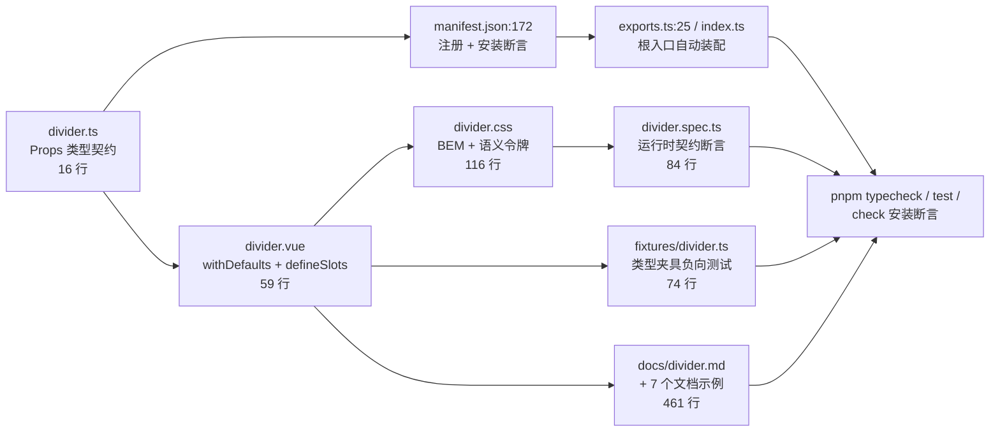
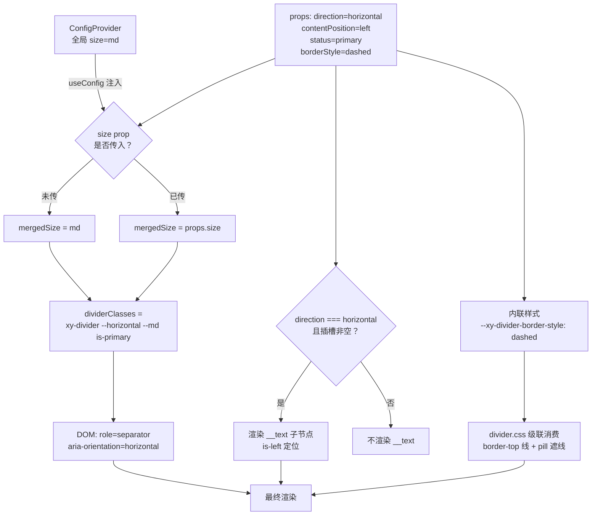

# 5-20 · Divider：最小组件的完整规范

## 一只值得解剖的麻雀

写组件库的人都绕不开一个心结：大组件有足够的篇幅把架构讲清楚——`Table` 有列模型，`Form` 有校验协议，`Dialog` 有焦点管理。真正考验一个组件库"底子"的，反而是那些小到没有借口做不好的组件。`Divider` 就是其中最极端的一个：它没有任何交互状态，没有异步，没有浮层，唯一的功能就是在两个内容块之间画一条线。

本系列的前几篇都在讲"复杂度如何被架构吸收"，这一篇反着来：以 `Divider` 为解剖样本，把一个组件从源码到文档的**完整规范链**逐环拆开——Props 类型层 → `withDefaults` 与 `defineSlots` → BEM 命名 → 样式令牌 → 单元测试 → 类型夹具 → 文档与 manifest 注册。每个环节只占几十行代码，但每一环都有一个"教科书姿势"值得讲。

先说结论性的数据。标题里说"50 行组件"，我按当前工作区实码重新数了一遍：`divider.vue` 实际是 59 行（空行与注释一行不留的话更少），加上 16 行的 props 定义文件和 13 行的安装入口，三个源码文件合计 88 行。这 88 行源码背后，挂着 116 行 CSS、84 行单测、74 行类型夹具、124 行文档页和 337 行文档示例——**测试与文档的体量是源码的 6.6 倍**。这个比例本身就是本篇的论点：小组件的价值不在行数，而在它把整条规范链走完的示范意义。

| 文件 | 行数 |
| --- | --- |
| `packages/components/divider/src/divider.vue` | 59 |
| `packages/components/divider/src/divider.ts` | 16 |
| `packages/components/divider/index.ts` | 13 |
| `packages/theme/src/components/divider.css` | 116 |
| `packages/components/divider/__tests__/divider.spec.ts` | 84 |
| `tests/types/fixtures/divider.ts` | 74 |
| `apps/docs/components/divider.md` | 124 |
| `apps/docs/examples/divider/`（7 个示例） | 337 |
| **合计** | **823** |

## 规范链条路：一个组件要过多少道关口

先看全景。`Divider` 从一个 16 行的类型文件出发，最终抵达用户的浏览器，中间要经过七道关口，每一道都有独立的校验机制兜底：



这张图里最值得注意的是：**测试与夹具不是"源码写完后补的"，而是各自守住契约的不同侧面**——`spec` 断言运行时行为（类名、属性、CSS 变量），`fixture` 断言编译期行为（非法 props 必须报类型错误），两者合起来才是完整覆盖。下面逐环展开。

## 第一环：Props 类型——封闭集与开放集的分野

`divider.ts` 全文只有 16 行，却是整条规范链的地基：

```ts
// packages/components/divider/src/divider.ts（全文 16 行）
import type { ComponentSize, ComponentStatus } from "xiaoye-primitives";

export const dividerDirections = ["horizontal", "vertical"] as const;
export const dividerContentPositions = ["left", "center", "right"] as const;

export type DividerDirection = (typeof dividerDirections)[number];
export type DividerContentPosition = (typeof dividerContentPositions)[number];
export type DividerBorderStyle = CSSStyleDeclaration["borderStyle"];

export interface DividerProps {
  direction?: DividerDirection;
  contentPosition?: DividerContentPosition;
  borderStyle?: DividerBorderStyle;
  size?: ComponentSize;
  status?: ComponentStatus;
}
```

第一个教科书姿势是**值与类型的单一来源**：`dividerDirections` 先以 `as const` 定义运行时数组，类型再用 `(typeof dividerDirections)[number]` 反查推导。这样"合法值集合"只写了一遍——运行时想做参数校验（比如未来加 `usePropsValidator`）时直接消费这个数组，类型层自动同步，不存在"类型加了 `diagonal`、运行时数组忘了加"的分叉。

第二个姿势更隐蔽，也更能体现设计功力：**封闭集走联合类型，开放集走 CSS 原生类型**。`direction` 和 `contentPosition` 是封闭集，用字面量联合锁死；而 `borderStyle` 直接写成 `CSSStyleDeclaration["borderStyle"]`——因为 CSS 的 `border-style` 本身就是一个开放词汇表（`solid / dashed / dotted / double / groove / ridge / inset / outset / hidden`，还会随 CSS 规范扩张）。把它枚举进 TypeScript 联合类型，等于替 CSS 标准做一版会过期的抄写。文档页（`apps/docs/components/divider.md:101`）的措辞也精确对齐了这个设计："分割线样式，兼容 CSS `border-style`"。

第三个姿势是**共享协议类型的克制复用**。`size` 与 `status` 没有在组件里各自定义，而是直接引用 `xiaoye-primitives` 的协议类型：`ComponentSize` 是 `"" | "xs" | "sm" | "md" | "lg" | "xl"`（`packages/xiaoye-primitives/src/composables/shared-context.ts:6`），`ComponentStatus` 是 `"neutral" | "primary" | "success" | "warning" | "danger"`（`packages/xiaoye-primitives/src/utils/types/common.ts:1`）。这正是 72 个组件的组件库里"全局配置协议"的意义所在——`ConfigProvider` 注入什么，`Divider` 就消费什么，两者的类型天然同源。下一篇要讲的 `Tag`，同样是这套 `ComponentStatus` 的消费方，这里先埋个伏笔。

## 第二环：withDefaults 与 defineSlots——script 的三段式骨架

`divider.vue` 的 script 部分（`divider.vue:1-43`）是全组件的决策中枢：

```vue
<!-- packages/components/divider/src/divider.vue:1-43 -->
<script setup lang="ts">
import { computed } from "vue";
import type { CSSProperties } from "vue";
import type { ComponentSize } from "xiaoye-primitives";
import { useConfig, useNamespace } from "xiaoye-primitives";
import type { DividerProps } from "./divider";

defineOptions({
  name: "XyDivider"
});

const props = withDefaults(defineProps<DividerProps>(), {
  direction: "horizontal",
  contentPosition: "center",
  borderStyle: "solid",
  size: undefined,
  status: "neutral"
});

const slots = defineSlots<{
  default?: () => unknown;
}>();

const { size: globalSize } = useConfig();
const ns = useNamespace("divider");

const mergedSize = computed<ComponentSize>(() => props.size ?? globalSize.value);
const hasContent = computed(() => props.direction === "horizontal" && Boolean(slots.default));

const dividerClasses = computed(() => [
  ns.base.value,
  `${ns.base.value}--${props.direction}`,
  `${ns.base.value}--${mergedSize.value}`,
  ns.is(props.status, true)
]);

const dividerStyle = computed<CSSProperties>(
  () =>
    ({
      [ns.cssVarBlock("border-style")]: props.borderStyle
    }) as CSSProperties
);
</script>
```

逐段看。**默认值层**：`withDefaults` 把全部默认值集中在一处（`divider.vue:12-18`），而不是散落在模板的三元表达式里。注意 `size: undefined` 这一行——它是刻意的显式声明而非省略，语义是"这个 prop 的默认行为不是某个值，而是**退让给全局配置**"。这就是 `mergedSize`（`divider.vue:27`）里 `props.size ?? globalSize.value` 的前置条件：局部覆盖优先，未传则继承 `ConfigProvider` 注入的全局 `size`。尺寸合并策略在最小组件里就有了完整实现。

**插槽层**：`defineSlots<{ default?: () => unknown }>()`（`divider.vue:20-22`）把插槽纳入类型系统。对比 Element Plus 的同名组件——我核对了其 dev 分支源码，EP 用的是运行时判断 `v-if="$slots.default && direction !== 'vertical'"`——本库把"有没有默认插槽"这件事变成了可被 `tsc` 检查的契约，消费者在模板里写 `<template #default>` 时能获得拼写检查与 IDE 提示。小组件层面看是锦上添花，放大到 72 个组件就是文档站自动生成插槽表的基础。

**语义裁剪层**：`hasContent`（`divider.vue:28`）是本组件最有意思的一行业务逻辑——`direction === "horizontal" && Boolean(slots.default)`。它把"竖向分割线忽略默认插槽"实现为**渲染前的语义裁决**，而不是渲染后再用 CSS 藏起来。单测 `divider.spec.ts:41-55` 专门验证了这一点：竖向模式下传入插槽文本，断言 `__text` 节点不存在、组件文本为空。一个负责任的组件库应该在 DOM 层面就不渲染无效内容，而不是靠 `display: none` 留一个"尸体节点"。

**输出层**：`dividerClasses` 与 `dividerStyle` 两个 computed 把全部决策折叠成两份纯数据——类名数组和内联样式对象。模板因此薄到没有任何逻辑，只剩绑定。

## 第三环：模板、BEM 与 role="separator" 的 a11y 完整性

模板只有 15 行（`divider.vue:45-59`）：

```vue
<!-- packages/components/divider/src/divider.vue:45-59 -->
<template>
  <div
    :class="dividerClasses"
    :style="dividerStyle"
    role="separator"
    :aria-orientation="props.direction"
  >
    <div
      v-if="hasContent"
      :class="[`${ns.base.value}__text`, ns.is(props.contentPosition, true)]"
    >
      <slot />
    </div>
  </div>
</template>
```

先讲 BEM 基础设施。`useNamespace("divider")`（`packages/xiaoye-primitives/src/composables/use-namespace.ts:4-17`）返回三件套：`base` 产出 `xy-divider`（命名空间前缀可由 `ConfigProvider` 换肤时整体替换）、`is(state, active)` 产出状态类、`cssVarBlock(name)` 产出块级 CSS 变量名 `--xy-divider-{name}`。组件源码里**没有任何一处手写 `xy-divider` 字符串**——这是 BEM 规范的正确打开方式：命名约定不该是散落在代码里的魔法字符串，而该是集中的、可参数化的基础设施。对比 Element Plus 的 `useNamespace`（带 `b/m/e/em/bem` 等完整 BEM 词法），本库做了极简裁剪——只留三件套，够用且不可误用。

再讲 a11y，这是本组件最容易被忽略、却做得最完整的一环。ARIA 规范中 `role="separator"` 的语义是"分隔内容的边界，且不影响内容分组的可读性"；规范同时规定该角色的 `aria-orientation` 默认值为 `horizontal`——但"浏览器有默认"和"组件显式声明"是两回事：显式声明让辅助技术与自动化测试工具不必依赖默认值推断，也让"语义上是什么"在 DOM 里自证。本组件把 `props.direction` 的 `"horizontal" / "vertical"` 一对一映射到 `aria-orientation`（`divider.vue:50`），两个值恰好都是 ARIA 的合法词汇，不需要任何翻译层——这是 props 命名与 ARIA 词汇表对齐的意外红利，也是设计 props 时值得参考的取向。

这里有一个经过核实的 EP 对比：Element Plus 的 Divider 模板写了 `role="separator"`，但**没有声明 `aria-orientation`**（其 dev 分支 `divider.vue` 的 template 仅有 `:class`、`:style`、`role` 三个绑定）。竖向分割线在 EP 中依赖 ARIA 默认值兜底，语义上是"用户碰巧没踩坑"，而非规范保证。本库补上了这一属性，配合 `divider.spec.ts:17-18` 与 `52` 行的两处断言，把 a11y 承诺固化进了测试。50 行的组件，a11y 也能做到可测试——这正是"规范链"的含义。

再补一层语义参照：原生 HTML 的 `<hr>` 元素自带隐式的 separator 角色，似乎一行 `<hr>` 就能替代整个组件。但 `<hr>` 携带"主题转换（thematic break）"的强语义——屏幕阅读器通常会播报为段落终结，且其样式定制需要先抹掉 UA 默认样式；而 `role="separator"` 的 div 是中性的"边界"，不表达任何主题判断，允许组件自由决定视觉权重。此外 ARIA 为可聚焦的 separator（某些应用里用于调节两侧窗格大小的分割柄）定义了额外的键盘交互语义，本组件不可聚焦，恰好落在"纯静态边界"这一最简单的分支上——用 15 行模板，把语义分支选对，比写一百行样式更接近"规范"二字。

## 第四环：样式令牌——CSS 变量的三层落地

`divider.css` 共 116 行，看前 48 行：

```css
/* packages/theme/src/components/divider.css:1-48 */
.xy-divider {
  --xy-divider-border-style: solid;
  --xy-divider-thickness: 1px;
  --xy-divider-spacing: 24px;
  --xy-divider-color: color-mix(in srgb, var(--xy-border-subtle) 78%, transparent);
  --xy-divider-text-color: var(--xy-text-muted);
  --xy-divider-font-size: var(--xy-font-size-md);
  --xy-divider-text-padding: 18px;
  --xy-divider-content-offset: 24px;
  --xy-divider-vertical-gap: 12px;
  --xy-divider-vertical-height: 1em;

  position: relative;
  box-sizing: border-box;
}

.xy-divider--horizontal {
  display: block;
  width: 100%;
  height: var(--xy-divider-thickness);
  margin: var(--xy-divider-spacing) 0;
  border-top: var(--xy-divider-thickness) var(--xy-divider-border-style) var(--xy-divider-color);
}

.xy-divider--vertical {
  display: inline-block;
  width: var(--xy-divider-thickness);
  height: var(--xy-divider-vertical-height);
  margin: 0 var(--xy-divider-vertical-gap);
  vertical-align: middle;
  border-left: var(--xy-divider-thickness) var(--xy-divider-border-style) var(--xy-divider-color);
}

.xy-divider--sm {
  --xy-divider-spacing: 16px;
  --xy-divider-font-size: var(--xy-font-size-sm);
  --xy-divider-text-padding: 12px;
  --xy-divider-content-offset: 16px;
  --xy-divider-vertical-gap: 8px;
}

.xy-divider--lg {
  --xy-divider-spacing: 32px;
  --xy-divider-font-size: var(--xy-font-size-lg);
  --xy-divider-text-padding: 24px;
  --xy-divider-content-offset: 28px;
  --xy-divider-vertical-gap: 16px;
}
```

这段 CSS 的骨架是**"变量声明在块层，规则只消费变量"**：`.xy-divider` 块声明 10 个组件级变量（全部以 `--xy-divider-` 前缀，正是 `cssVarBlock` 的产物），方向、尺寸、状态三个维度的修饰类只做变量的重新赋值。注意 `--sm` 和 `--lg` 里没有一个"属性"，只有变量——`--md` 甚至没有对应规则，因为默认值就是 md 档。这就引出第一个设计权衡：

**权衡一：`xy-divider--md` 类没有 CSS 规则，却始终输出在 DOM 上。** `ComponentSize` 协议含六种值，组件只为 `sm / lg` 写了规则，`md` 走默认，`xs / xl` 与空串则静默降级到默认档。类名照常输出换来了两样东西：BEM 契约的稳定性（DOM 形态对所有合法 props 可预期，测试 `divider.spec.ts:15` 能直接断言 `--md`）；以及优雅降级——未来补 `xs` 档只需加 CSS，不改组件一行。用"无操作规则"的缺失换 API 表面的完整，是刻意的。

**权衡二：颜色的令牌分层。** 线色不是写死的色值，而是 `color-mix(in srgb, var(--xy-border-subtle) 78%, transparent)`——消费语义层令牌 `--xy-border-subtle`（`tokens.css:115` 亮色映射自 `--xy-gray-100`，暗色主题 `tokens.css:285` 映射为半透明白）。组件样式只消费语义层与刻度层，这是仓库设计令牌约定的硬性规则；`Divider` 一行 CSS 都没有感知亮暗主题，主题能力由令牌层托底。文字色 `--xy-text-muted`、字号 `--xy-font-size-md`、字重 `--xy-font-weight-560`、圆角 `--xy-radius-pill` 同理，全部可在 `tokens.css:97-234` 找到锚点。

再看带文案部分的实现（`divider.css:50-79`）：

```css
/* packages/theme/src/components/divider.css:50-79 */
.xy-divider__text {
  position: absolute;
  top: 0;
  display: inline-flex;
  align-items: center;
  min-height: 28px;
  padding: 0 var(--xy-divider-text-padding);
  border: 1px solid transparent;
  border-radius: var(--xy-radius-pill);
  color: var(--xy-divider-text-color);
  font-size: var(--xy-divider-font-size);
  font-weight: var(--xy-font-weight-560);
  line-height: 1;
  white-space: nowrap;
  background: color-mix(in srgb, var(--xy-bg-subtle) 50%, var(--xy-bg-floating));
  transform: translateY(-50%);
}

.xy-divider__text.is-left {
  left: var(--xy-divider-content-offset);
}

.xy-divider__text.is-center {
  left: 50%;
  transform: translate(-50%, -50%);
}

.xy-divider__text.is-right {
  right: var(--xy-divider-content-offset);
}
```

**权衡三（本篇核心）：带文案的分割线，为什么选"绝对定位 pill 遮线"而不是伪元素线或 flex gap？** 三种方案摆在一起看：

```css
/* 方案 A（示意）：伪元素画线——线与文字天然分离，但横向文字要居中遮挡时，
   必须用背景色"挖断"伪元素，或用两个伪元素各画半条线，两端对齐逻辑复杂 */
.xy-divider--horizontal::before,
.xy-divider--horizontal::after {
  content: "";
  flex: 1;
  border-top: 1px solid var(--xy-divider-color);
}

/* 方案 B（示意）：flex gap 布局——文字插在两段线中间，结构最简单，
   但线的总宽受内容挤压，"右对齐文字 + 两侧不等长线"几乎无法表达，
   且没有文字时容器退化需要额外分支 */
.xy-divider--horizontal {
  display: flex;
  align-items: center;
  gap: var(--xy-divider-text-padding);
}

/* 方案 C（实码）：容器自身 border-top 画线，文字绝对定位悬浮在线上，
   背景色遮线。一行文字有无皆可，左右中三态只是 left/right/50% 之差 */
```

实码选了方案 C：容器高度只有 `--xy-divider-thickness`（1px），线就是它自己的 `border-top`；文字 pill 以 `top: 0` 加 `translateY(-50%)` 悬浮在线上，用 `color-mix(in srgb, var(--xy-bg-subtle) 50%, var(--xy-bg-floating))` 的实底背景把线"遮断"。代价是绝对定位脱离文档流、需要容器 `position: relative`，以及遮线背景必须与页面底色足够接近——所以背景用了两个背景令牌的混合，在亮暗两套主题下都能贴近真实底色。收益则是：**没有文字时组件退化为纯 border，零额外节点；有文字时三态定位只是三个各一行的修饰类**（`divider.css:68-79`），不存在方案 A 的半线拼接，也没有方案 B 的挤压问题。另外那个容易被当成冗余的 `border: 1px solid transparent`（`divider.css:57`）其实是占位——用户通过 `--xy-divider-border-style` 或自定义样式给文字加边框时，不会引起布局位移。一行透明边框，换扩展时的零位移，典型的"预留型"书写。

最后看状态色（`divider.css:81-116`）：

```css
/* packages/theme/src/components/divider.css:81-116（节选三条，余同构） */
.xy-divider.is-neutral {
  --xy-divider-color: color-mix(in srgb, var(--xy-border-subtle) 78%, transparent);
  --xy-divider-text-color: var(--xy-text-muted);
}

.xy-divider.is-primary {
  --xy-divider-color: color-mix(
    in srgb,
    var(--xy-brand) 12%,
    var(--xy-border-subtle)
  );
  --xy-divider-text-color: var(--xy-brand);
}

.xy-divider.is-danger {
  --xy-divider-color: color-mix(in srgb, var(--xy-danger) 12%, var(--xy-border-subtle));
  --xy-divider-text-color: var(--xy-danger);
}
```

五个状态类全部只重赋两个变量：线色用 12%~14% 的语义色混入 `--xy-border-subtle` 做出"带倾向但仍克制"的分隔线，文字直接用纯语义色。**权衡四：status 走 `is-*` 类，borderStyle 却走内联 CSS 变量**——同是视觉属性，分流标准是"封闭枚举进类名，开放词汇进变量"。`status` 五值封闭，类名可被主题文件枚举覆盖，也可被用户 CSS 选择器命中；`borderStyle` 开放，若做成类名则类名空间不可收敛。于是 `divider.vue:37-42` 把它作为 `--xy-divider-border-style` 注入内联样式，覆盖块层默认值（`divider.css:2`），CSS 的级联机制天然完成了"用户 > 内联 > 块默认"三层覆盖。

## 第五环：测试——84 行守住运行时契约

单测全文 84 行、5 个用例，覆盖了上面所有权衡的"运行时侧"：

```ts
// packages/components/divider/__tests__/divider.spec.ts:6-39（用例一、二）
it("默认渲染为横向分割线，并支持内容插槽", () => {
  const wrapper = mount(XyDivider, {
    slots: {
      default: "基础分段"
    }
  });

  expect(wrapper.classes()).toContain("xy-divider");
  expect(wrapper.classes()).toContain("xy-divider--horizontal");
  expect(wrapper.classes()).toContain("xy-divider--md");
  expect(wrapper.classes()).toContain("is-neutral");
  expect(wrapper.attributes("role")).toBe("separator");
  expect(wrapper.attributes("aria-orientation")).toBe("horizontal");
  expect(wrapper.find(".xy-divider__text").classes()).toContain("is-center");
  expect(wrapper.text()).toContain("基础分段");
  expect(wrapper.element.style.getPropertyValue("--xy-divider-border-style")).toBe("solid");
});

it("支持内容位置、状态和边框线型", () => {
  const wrapper = mount(XyDivider, {
    props: {
      contentPosition: "right",
      status: "primary",
      borderStyle: "dashed"
    },
    slots: {
      default: "审批节点"
    }
  });

  expect(wrapper.classes()).toContain("is-primary");
  expect(wrapper.find(".xy-divider__text").classes()).toContain("is-right");
  expect(wrapper.element.style.getPropertyValue("--xy-divider-border-style")).toBe("dashed");
});
```

用例一值得逐行看：它断言的不是"渲染成功"，而是**完整类名契约**——`xy-divider`、`--horizontal`、`--md`、`is-neutral` 四个 BEM 位型一个不落，随后是 `role` 与 `aria-orientation` 两项 a11y 承诺，最后连内联 CSS 变量的值都断言到。这是"DOM 即契约"的测试观：类名是文档承诺给用户的样式钩子，改了类名等于 breaking change，必须被测试拦下。用例二把 `borderStyle: "dashed"` 断言到内联变量而非 computed 类名，恰好锁住了第四环"开放词汇走变量"的分流决策。

剩下三个用例同样各有分工，全文照录（`divider.spec.ts:41-83`）：

```ts
// packages/components/divider/__tests__/divider.spec.ts:41-83（用例三、四、五）
it("direction=vertical 时渲染竖向分割线并忽略默认插槽", () => {
  const wrapper = mount(XyDivider, {
    props: {
      direction: "vertical"
    },
    slots: {
      default: "不会显示"
    }
  });

  expect(wrapper.classes()).toContain("xy-divider--vertical");
  expect(wrapper.attributes("aria-orientation")).toBe("vertical");
  expect(wrapper.find(".xy-divider__text").exists()).toBe(false);
  expect(wrapper.text()).toBe("");
});

it("支持局部 size 覆盖", () => {
  const wrapper = mount(XyDivider, {
    props: {
      size: "lg"
    }
  });

  expect(wrapper.classes()).toContain("xy-divider--lg");
});

it("支持全局尺寸继承", () => {
  const wrapper = mount({
    components: {
      XyConfigProvider,
      XyDivider
    },
    template: `
      <xy-config-provider size="sm">
        <xy-divider ref="divider">全局尺寸</xy-divider>
      </xy-config-provider>
    `
  });

  const divider = wrapper.findComponent({ ref: "divider" });

  expect(divider.classes()).toContain("xy-divider--sm");
});
```

用例三是"语义裁剪"的负向证明：传入的插槽文本是"不会显示"，断言的正是它真的不存在——`__text` 节点不存在、组件文本为空。注意 `wrapper.text()` 的空串断言比 `display:none` 类的样式断言更严苛：它验证的是 DOM 层面的不存在，与第二环 `hasContent` 的实现语义严格对齐。用例五则藏着一个测试工程细节：模板刻意用 kebab-case 写 `<xy-config-provider size="sm">` 并通过 `ref` 拿到子组件实例——这一方面验证了 `withInstall` 注册的组件名（`with-install.ts:21` 支持传入全局组件名），另一方面与仓库"测试模板统一使用 kebab-case 标签"的约定保持一致。`useConfig` 在无 `ConfigProvider` 祖先时会回落到 `DEFAULT_SIZE`（`use-config.ts:45-54`、`shared-context.ts:28`），而用例五提供了真实祖先，正好覆盖了注入路径而非回落路径——两条路径，两个用例（用例一隐式覆盖回落，用例五覆盖注入），不打架也不遗漏。

## 第六环：类型夹具——74 行的负向证明

单测守运行时，类型夹具守编译期。`tests/types/fixtures/divider.ts` 的结构是"正向赋值 + 负向 `@ts-expect-error`"：

```ts
// tests/types/fixtures/divider.ts:10-20 与 41-74（节选拼接）
const direction: DividerDirection = "vertical";
const contentPosition: DividerContentPosition = "left";
const borderStyle: DividerBorderStyle = "dashed";

const dividerProps: DividerProps = {
  direction,
  contentPosition,
  borderStyle,
  size: "lg",
  status: "warning"
};

const invalidDirection: DividerProps = {
  // @ts-expect-error invalid direction should be rejected
  direction: "inline"
};

const invalidStatus: DividerProps = {
  // @ts-expect-error invalid status should be rejected
  status: "info"
};

const invalidSize: DividerProps = {
  // @ts-expect-error invalid size should be rejected
  size: "xxl"
};
```

五个 `@ts-expect-error` 分别钉死五条边界：`direction: "inline"`、`contentPosition: "top"`、`status: "info"`（注意 `info` 在本库 `ComponentStatus` 协议里不存在，这是与 EP `type="info"` 的又一处分野）、`borderStyle: 1`（必须是 CSS 字符串）、`size: "xxl"`。`@ts-expect-error` 的巧妙之处在于它是**双向断言**——若某天有人放宽了类型，错误消失，夹具自己会报"未使用的 expect-error"，负向测试不会静默失效。这份夹具经 `pnpm typecheck:types` 纳入检查（`tests/types` 独立 tsconfig），等价于给 props 契约上了一把编译期锁。

## 第七环：文档与 manifest——注册链的自动化

最后一环常被忽略：组件如何"存在"于包里。`Divider` 的注册不是手工散记，而是 manifest 驱动：

```json
// packages/components/component-manifest.json:172-179
{
  "name": "divider",
  "docsGroup": "basic",
  "docsText": "Divider 分割线",
  "installExports": ["XyDivider"],
  "installChecks": [{ "kind": "component", "name": "xy-divider" }],
  "styleImports": ["divider"]
}
```

三个字段各司其职：`installExports` 声明根入口导出值，被 `packages/components/index.ts` 的安装流程消费（按 `installableComponentExportNames` 装配全量 install）；`installChecks` 声明安装断言（全量安装后 `xy-divider` 必须可解析）；`styleImports` 声明样式依赖，对应 `packages/theme/index.css:56` 的 `@import "./src/components/divider.css"`。`packages/components/exports.ts:25` 的 `export * from "./divider"` 负责把 13 行入口文件（`index.ts`，含 `withInstall(Divider, "xy-divider")` 与四个类型导出）接到包根。注意一个容易误读的点：仓库规范说 `component-manifest.ts` 是主源，但它实际只是加载 JSON 的 schema 包装层——`grep divider component-manifest.ts` 为零命中，divider 的注册实体在 `component-manifest.json:172-179`。文档侧边栏由 `docsGroup` 分组自动生成，配置文件里同样没有 divider 的手工条目。

文档页 `apps/docs/components/divider.md`（124 行）则示范了"小组件的文档标准"：7 个可交互示例（`apps/docs/examples/divider/` 下 basic/positions/styles/status/size/vertical/scene 共 337 行）、"何时使用 / 何时不使用"的双清单、行为约定，以及与实码逐项对应的 API 表——其中 CSS Variables 表把 10 个组件级变量连同默认值全部列出（`divider.md:111-124`），把"样式令牌是公共 API"落到纸面。文档不堆话术，`divider.md:49` 甚至直接劝退："如果你已经需要明显容器边界，优先考虑 Card、Collapse 或 Drawer，而不是继续堆更多 Divider。"

示例的编排也有一条隐含的教学序列：`basic.vue` 用一个"发版前检查 / 发版后回收"的场景展示无文案裸线的最简形态（`apps/docs/examples/divider/basic.vue:21`，仅 `<xy-divider />` 五个字符就完成一次调用）；`positions.vue` 用 16 行演示三态文案与"右侧放一枚 Tag"的组合；`vertical.vue` 用 27 行把竖向线嵌进"草稿 · 最近保存时间 · 操作链接"的行内元信息条，顺带演示了 `border-style` 与 `status` 在竖向下的叠加；最重的 `scene.vue`（176 行）把整个"版本发布摘要"卡片拆成横向与竖向混排的完整版面。每个示例都是可独立运行的真实场景，而不是 `<xy-divider />` 的罗列——文档示例的"场景密度"，同样属于组件规范的一部分。

## 运行时全景：一条线是怎么被画出来的

把七环收拢回一次渲染。当用户写下 `<xy-divider content-position="left" status="primary" border-style="dashed">上线范围</xy-divider>` 时：



每个中间产物都是纯 computed，没有一处命令式 DOM 操作；每个分支（size 合并、插槽裁剪、状态类）都有对应测试。这条链路里没有任何一个"只有作者知道"的隐式行为。

## 权衡清单：最小组件教会我们的事

收束全篇，`Divider` 一共示范了五个可迁移的权衡决策：

1. **封闭集与开放集分流**（`divider.ts:8`、`divider.vue:37-42`）：枚举进联合类型与 `is-*` 类，CSS 开放词汇走内联 CSS 变量——类名空间有限，变量空间无限，各归其位。
2. **类名契约优先于 CSS 精简**（`divider.vue:33`、`divider.css` 无 `--md` 规则）：DOM 类名是承诺给用户的 API，宁可输出无规则可挂的 `--md`，也要保持"所有合法 props → 可预期 DOM"的映射。
3. **遮线方案的三选一**（`divider.css:50-79`）：绝对定位 pill + 混合背景遮线，在"无文字退化 / 三态定位 / 主题贴合"三个维度上优于伪元素半线与 flex gap 挤压，代价是接受一层绝对定位。
4. **语义裁剪而非样式隐藏**（`divider.vue:28`、`divider.spec.ts:53-54`）：竖向模式下插槽内容在 DOM 层就不存在，a11y 树与测试断言因此干净。
5. **测试与夹具分层守约**（`divider.spec.ts` 84 行 + `fixtures/divider.ts` 74 行）：运行时行为用 `@vue/test-utils` 断言到类名与内联变量，编译期行为用 `@ts-expect-error` 双向锁死——两层证据合起来才叫"契约被测试覆盖"。

一个 88 行源码的组件，背后是 823 行的完整规范链、五处成文的设计权衡和一条被 manifest 与测试双重固化的注册链路。它没有功能可吹嘘，但它把"一个组件应该怎么被发明出来"演示到了教科书级别——而教科书的意义在于：当下一篇的 `Table` 面前堆满真正的复杂度时，这些姿势依然是同一套。

下一篇，我们看 `Tag`：一个真正把 `ComponentStatus` 这套通用状态类型当"主食"消费的组件——当 `neutral / primary / success / warning / danger` 五种语义色成为组件的第一公民，而不是像 `Divider` 这样作为点缀，类型、样式与测试的链路又会有什么不同。5-21《Tag：通用状态类型的消费》，我们不见不散。
