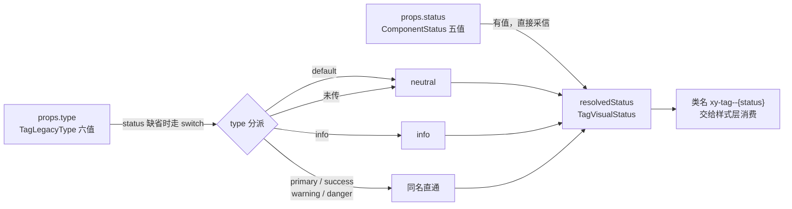
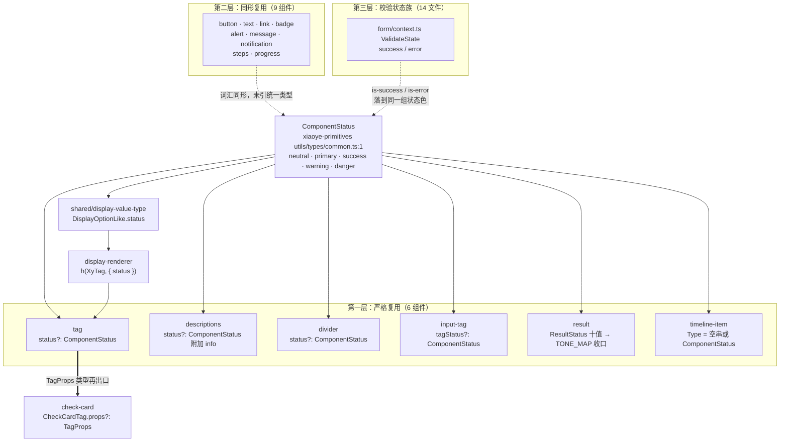

# 5-21 · Tag：通用状态类型的消费

## 核心问题：一个五值联合类型，凭什么养活半个组件库

上一篇解剖 `Divider` 时，我们说它是"最小组件的完整规范"。这一篇的 `Tag` 比 `Divider` 多了一层身份：它是整个组件库里**状态类型体系的终端展示件**。标签这种东西，十有八九的用法是"用一个颜色表达一种业务状态"——进行中、已完成、待确认、已拒绝。也就是说，`Tag` 是 `ComponentStatus` 这个通用状态类型消费链路的最后一站：类型在这里变成类名，类名在这里变成颜色，颜色在这里变成用户眼里的语义。

所以本篇的核心问题不是"Tag 怎么写"，而是：**`ComponentStatus` 如何跨组件复用？** 系列大纲里给的说法是"跨 20 个组件复用"。作为一个坚持"实码定论"的专栏，我照例用 `rg` 把整个 `packages/components` 扫了一遍，结果比大纲的说法更有层次——严格复用、同形复用、间接复用、视觉复用，四层的数字各不相同。先给结论表，后文逐层展开考据过程：

| 复用层级 | 统计口径 | 实码数量 |
| --- | --- | --- |
| 第一层：严格复用 | `import type { ComponentStatus } from "xiaoye-primitives"` 的组件源码 | 6 个组件 + 1 处共享层 + 1 处桶出口 |
| 第二层：同形复用 | 自定义"五色/六色"状态联合、语义等价但未引用统一类型 | 9 个组件 |
| 第二层半：间接复用 | 经 `TagProps` 或共享展示层消费状态类型 | check-card 等 |
| 第三层：校验状态族 | `form` 的 `ValidateState`（success/error）驱动的表单控件 | 14 个源码文件 |
| 第四层：视觉消费 | CSS 中消费 `--xy-success / --xy-warning / --xy-danger` | 29 个样式文件 |

大纲的"20 个"落在第一、二层的合计（15 个组件，加 check-card 间接消费为 16）与全口径（约 30 处）之间。数字本身不重要，重要的是这张分层网揭示了组件库类型体系的一个普遍规律：**统一契约只能覆盖它直接覆盖的地方，剩下的地方靠"同形"和"收口"两种模式兜底**。这也是本篇要讲透的三组设计权衡的第一组。

## 一、ComponentStatus 从哪来：基础设施层的五值契约

先看类型的出生地。它不在 `packages/components`，而在基础设施包的一个 8 行小文件里：

```ts
// packages/xiaoye-primitives/src/utils/types/common.ts（全文 8 行）
export type ComponentStatus = "neutral" | "primary" | "success" | "warning" | "danger";

export interface SelectOption<T = string | number> {
  label: string;
  value: T;
  disabled?: boolean;
  description?: string;
}
```

三个细节值得停下来看。

第一，**五值里没有 `info`，也没有 `error`**。第五个值是 `neutral`（中性），不是 Element Plus 用户熟悉的那种"info 灰蓝"。`error` 也不存在，统一的词是 `danger`。这两个词汇选择在后面的复用网里会反复制造"翻译成本"，是理解整个体系的关键伏笔。

第二，它和 `SelectOption` 住在同一个文件里。这不是随手放置——`common.ts` 的定位是"跨组件的公共数据形状"，凡是"多个组件都要认的词表"都归这里管。类型层没有运行时依赖、没有 Vue 依赖，纯 TS 词表，放在 `src/utils/types/` 下是最轻的安置。

第三，出口链只有两跳。`packages/xiaoye-primitives/src/utils/index.ts:6` 一行 `export * from "./types/common";` 把它抬到 primitives 包出口；`packages/components/index.ts:6` 再做一次显式转发：

```ts
// packages/components/index.ts:6
export type { ComponentSize, ComponentStatus, SelectOption } from "xiaoye-primitives";
```

这条出口链的意义在于：业务侧从 `xiaoye-components` 就能拿到 `ComponentStatus`，不必感知 primitives 包的存在。类型跟着值走同一个门，这是第 4-03 篇讲过的"标准组件解剖"里类型层规范的一部分——只不过 `Tag` 自己的类型层，恰恰是九个解剖样本里最特殊的一个。

## 二、tag.vue 精读：九个变体中的"内联派"

4-03 篇考据过：标准组件的解剖模板是"独立 `.ts` 类型文件 + `.vue` 视图文件"两件套，`result`、`descriptions`、`divider`、`input-tag`、`timeline` 都是这么长的。但文中同时指出，这套模板存在**九个变体**，`tag` 是其中之一——**类型层内联进 `.vue` 文件**，没有独立的 `tag.ts`。

看实码。`packages/components/tag/src/tag.vue` 全文 101 行，script 段 71 行：

```vue
<script setup lang="ts">
import type { ComponentSize, ComponentStatus } from "xiaoye-primitives";
import { useConfig, useNamespace } from "xiaoye-primitives";
import { computed, useSlots } from "vue";
import XyIcon from "../../icon";

type TagLegacyType = "default" | "primary" | "success" | "info" | "warning" | "danger";
type TagVisualStatus = ComponentStatus | "info";

export interface TagProps {
  status?: ComponentStatus;
  type?: TagLegacyType;
  size?: ComponentSize;
  round?: boolean;
  closable?: boolean;
  icon?: string;
}

export type TagCloseHandler = (event: MouseEvent) => void;

const props = withDefaults(defineProps<TagProps>(), {
  status: undefined,
  type: undefined,
  size: undefined,
  round: false,
  closable: false,
  icon: ""
});

const emit = defineEmits<{
  close: [event: MouseEvent];
}>();

const { size: globalSize } = useConfig();
const slots = useSlots();
const ns = useNamespace("tag");
const mergedSize = computed(() => props.size ?? globalSize.value);
```

一个 101 行的组件，开头 17 行里塞了**两个私有类型别名加一个公开 Props 接口**。`TagLegacyType` 是六值联合——`default / primary / success / info / warning / danger`，一眼就能认出这是 Element Plus 时代 `el-tag` 的 `type` 词表；`TagVisualStatus` 则是 `ComponentStatus | "info"`，五值契约再补一个 `info`。两个类型并排放在这里，等于把"新旧两套状态词汇"的翻译问题摆在了组件内部。

再看 script 的后半段，这里藏着本篇最重要的一个 computed：

```ts
const resolvedStatus = computed<TagVisualStatus>(() => {
  if (props.status) {
    return props.status;
  }

  switch (props.type) {
    case "default":
      return "neutral";
    case "info":
      return "info";
    case "primary":
    case "success":
    case "warning":
    case "danger":
      return props.type;
    default:
      return "neutral";
  }
});
const iconSizeMap = Object.freeze({
  sm: 12,
  md: 14,
  lg: 16
}) as Readonly<Record<string, number>>;
const closeIconSizeMap = Object.freeze({
  sm: 10,
  md: 12,
  lg: 12
}) as Readonly<Record<string, number>>;

const hasIcon = computed(() => Boolean(props.icon) || Boolean(slots.icon));
const iconSize = computed(() => iconSizeMap[mergedSize.value] ?? 14);
const closeIconSize = computed(() => closeIconSizeMap[mergedSize.value] ?? 12);
```

`resolvedStatus` 一共承担三重职责，我们画成流程图：



### 权衡一：类型内联 vs 独立类型层

`Tag` 为什么选择内联？把两套方案摆在一起看就清楚了。

内联的收益有三点。其一，`TagProps` 与 `defineProps` 贴身相邻，改一个 prop 不用跨文件跳转，对一个只有六个 prop 的小组件来说，这是实打实的维护便利。其二，`defineProps<TagProps>()` 的泛型参数要求类型在编译期可见，SFC 内联声明让 vue-tsc 的类型提取路径最短，生成的 dts 也最干净。其三，`TagCloseHandler` 这种只有一个事件的小类型，单独开文件反而显得仪式感大于内容。

但内联的代价在生态位上立刻显形。第 4-09 篇讲过 group 复合模式讲究"属性下发"，复合组件想下发标签属性时，需要一个可导入的 `TagProps`。内联方案下，这个导入必须绕道 SFC 文件——看 `packages/components/tag/index.ts` 全文 8 行：

```ts
import Tag from "./src/tag.vue";
import type { TagCloseHandler, TagProps } from "./src/tag.vue";
import { withInstall } from "xiaoye-primitives";

export type { TagCloseHandler, TagProps };

export const XyTag = withInstall(Tag, "xy-tag");
export default XyTag;
```

`import type { TagProps } from "./src/tag.vue"`——从 `.vue` 文件导入 interface，依赖 vue-tsc 对 SFC 的类型提取能力。这条链路是通的，但比起 `result.ts` 那种纯 TS 文件的导入，它把"组件类型"和"组件实现"绑在了同一个编译单元里：任何实现细节的改动都会触碰类型提取的缓存边界。本库把 `Tag` 留在内联派，同时让 `check-card`（一个真正需要下发标签属性的复合组件）从这个入口导入类型——内联与复用在这一点上达成了脆弱的平衡，后文第五节会看到消费端长什么样。

## 三、状态优先级与 info 特例：一个 switch 里的契约分层

`resolvedStatus` 的流程图里有三个分支值得逐个说透。

**分支一，`status` 优先。** 只要 `props.status` 有值，`props.type` 整个被无视。这不是随手写的if——它是"新契约压制旧契约"的迁移策略：组件库从 EP 式 `type` 迁往统一 `status` 的过程中，必须保证两个 prop 同时传入时行为可预期。测试里专门有一个用例钉死这件事，第八节细看。

**分支二，`default → neutral`。** EP 词表里的 `default` 在新体系里对应的不是"无色"，而是 `neutral` 中性色。翻译发生在组件内部，消费方（样式层）永远只见五值加 `info` 的 `TagVisualStatus`，不见 `default`。旧词表在组件边界处被"消化"掉，而不是渗透到样式层——这是迁移期组件的标准姿势。

**分支三，`info` 的特殊通行权。** `TagVisualStatus = ComponentStatus | "info"` 里的 `info` 只能从 `type: "info"` 这一条路进来。公开的 `status` prop 类型是纯 `ComponentStatus`，传 `"info"` 会直接类型报错。这不是实现巧合，而是被类型夹具显式锁死的负向契约——`tests/types/fixtures/tag.ts` 全文 25 行：

```ts
import type { TagProps } from "xiaoye-components";

const tagProps: TagProps = {
  status: "primary",
  size: "md",
  round: true,
  closable: true,
  icon: "mdi:tag-outline"
};

void tagProps;

const invalidStatus: TagProps = {
  // @ts-expect-error invalid status should be rejected
  status: "info"
};

void invalidStatus;

const invalidIcon: TagProps = {
  // @ts-expect-error icon should be a string
  icon: 1
};

void invalidIcon;
```

`status: "info"` 挂着 `@ts-expect-error`——谁要是哪天把 `status` 的类型放宽成 `TagVisualStatus`，这行夹具立刻在 `pnpm typecheck:types` 里翻车。为什么要把 `info` 挡在 `status` 门外？我的解读是词汇纪律：`ComponentStatus` 是全库统一契约，它说什么就是什么，任何组件不得私自扩表；`info` 属于 EP 遗产词汇，只允许以 `type` 的形式在兼容层流通。`Tag` 的视觉层需要消化 `info`（毕竟 `type` 还是合法入参），于是用 `TagVisualStatus` 这个**内部视图类型**承接，公开面维持五值纯净。一句话：对内宽容、对外严格。

## 四、复用面考据：四层复用网的全景统计

现在回答核心问题。先用考据命令本身说话——本篇写作时实际执行的统计命令是：

```bash
rg "ComponentStatus|'success' \| 'warning' \| 'danger'" packages/components --files-with-matches
```

第一层的结果：`packages/components` 下直接引用 `ComponentStatus` 的源码文件共 8 个——6 个组件源码（`tag.vue`、`descriptions.ts`、`divider.ts`、`input-tag.ts`、`result.ts`、`timeline-item.ts`），加 1 处共享展示层（`shared/display-value-type.ts`），加 1 处桶出口（`index.ts:6` 的转发）。严格复用是 6 个组件，不是 20。

但把镜头拉远，第二层立刻浮现：`button.ts:5-11` 的 `buttonTypes`、`text.ts:3` 的 `textTypes`、`link.ts:1` 的 `linkTypes`、`badge.ts:4` 的 `badgeTypes`、`alert.ts:3` 与 `message.ts:3`、`notification.ts:4-10` 的各类 `Types`——九个组件各自维护着一份与 `ComponentStatus` **同形**（词汇重叠度九成以上）的状态联合。它们没有 import 那个类型，但语义上消费的是同一张色板词表。

第三层更隐蔽：`form` 的校验状态协议。`packages/components/form/src/context.ts:7` 定义 `ValidateState = "idle" | "validating" | "success" | "error"`，`rg -l "validateState"` 扫出 14 个消费文件——`input`、`input-number`、`input-tag`、`select`、`tree-select`、`auto-complete`、`date-picker`、`time-picker`、`time-select`、`slider`、`rate`、`switch`、`upload` 加源头 `form-item`。这族状态不叫 `ComponentStatus`，但渲染时落到同一组状态色变量上（`is-success` / `is-error` 类名）。

第四层在 CSS：`rg -l -- "--xy-success|--xy-warning|--xy-danger" packages/theme/src` 命中 29 个样式文件——27 个基础组件样式加 `pro/pro-table.css`、`pro/stat-card.css` 两个增强层文件。

四层叠起来，画成复用网：



图中实线是类型系统的显式依赖，虚线是语义层的隐性对齐，加粗那条是本篇独有的发现——`check-card` 对 `TagProps` 的整包复用，第四节单独展开。

对大纲"20 个"的判定：严格层 6 个、严格加同形 15 个组件（6 + 9，另有 check-card 间接消费凑到 16-17），全口径把校验族与展示层消费方（`table`、`dialog`、`auto-complete` 等经共享渲染层间接触达）算上约 30 处。"20 个"是个落在中间的约数——它的价值不在精确，而在指出"状态语义是跨组件议题"这个事实。专栏的处理方式是把口径分层摆出来，让每个数字都可复现。

## 五、两条间接复用翼：TagProps 下发与共享展示层收口

第一层之外的复用，走的是两条"借道"路线，它们恰好对应组件复用的两种典型形态。

**第一条：类型层下发。** `packages/components/check-card/src/check-card.ts` 的头部和标签段：

```ts
import type { ComponentSize } from "xiaoye-primitives";
import type { AvatarFit, AvatarShape } from "../../avatar";
import type { TagProps } from "../../tag";

export interface CheckCardAvatar {
  text?: string;
  icon?: string;
  src?: string;
  alt?: string;
  srcSet?: string;
  fit?: AvatarFit;
  shape?: AvatarShape;
  size?: number | ComponentSize;
}

export interface CheckCardTag {
  text: string;
  props?: TagProps;
}

export interface CheckCardProps {
  modelValue?: boolean;
  size?: ComponentSize;
  disabled?: boolean;
  title?: string;
  description?: string;
  extra?: string;
  avatar?: CheckCardAvatar;
  tag?: string | CheckCardTag;
  ariaLabel?: string;
}
```

`CheckCardTag.props?: TagProps`——check-card 的"卡片角标标签"能力，整个 props 词表原样借用 Tag 的类型层。这就是第 4-09 篇 group 复合模式里"属性下发"的类型学版本：复合组件不给子能力重新发明一份 `tagStatus / tagSize / tagRound`，而是让调用方拿到与 `<xy-tag>` 完全同构的 props 类型，一次学习处处适用。顺带解开了本篇任务清单里的一个疑问：**`Tag` 本身没有 `checkable` 能力**——实码 `tag.vue` 里不存在任何 checkable 相关的 prop 或状态。可点选的"标签式卡片"语义由 `check-card` 承担，两者以类型复用衔接生态位，而不是让一个组件背上两种职责。

**第二条：运行时收口。** 共享展示层 `packages/components/shared/` 里的 `display-value-type.ts` 定义了：

```ts
import type { SelectOptionGroup } from "../select";
import type { ComponentStatus, SelectOption } from "xiaoye-primitives";

export type DisplayOptionLike = SelectOption & {
  status?: ComponentStatus | "info";
  color?: string;
};
```

而 `display-renderer.ts` 的渲染函数在 157-167 行把它落成真实节点：

```ts
  return h(
    "span",
    { class: "xy-display-value__tag-group" },
    matchedOptions.map((option) =>
      h(
        displayComponentMap.tag as any,
        option.status ? { status: option.status } : undefined,
        () => option.label
      )
    )
  );
```

`displayComponentMap.tag` 就是 `XyTag`（`display-component-map.ts:13`）。这条链路意味着：`table`、`select`、`dialog`、`descriptions`、`auto-complete` 等一切使用共享展示渲染的组件，当列配置声明 `valueType: "tag"` 或选项携带 `status` 时，最终渲染的都是**同一个 Tag 实例**，状态类型经 `DisplayOptionLike` 流入，五值契约原样落在类名上。`Tag` 由此成为状态契约的"终端渲染件"——第一层复用网里它是 6 个叶子之一，而在运行时渲染链上它是所有状态展示的汇合点。

`result` 组件则示范了另一种收口姿势。它的 `status` 词表膨胀到十值（`ResultStatus = ComponentStatus | "info" | "error" | "403" | "404" | "500"`，`result.ts:8`），但通过一张映射表把十值折叠回五值：

```ts
export const RESULT_STATUS_TONE_MAP: Record<ResultStatus, ComponentStatus> = {
  neutral: "neutral",
  primary: "primary",
  success: "success",
  warning: "warning",
  danger: "danger",
  info: "neutral",
  error: "danger",
  "403": "warning",
  "404": "neutral",
  "500": "danger"
};
```

`error → danger`、`info → neutral`、`403 → warning`——业务词表自由膨胀，视觉契约恒定五值。与 `Tag` 的"内部 switch 翻译"相比，`Result` 用声明式映射表做同一件事：**词汇可以各自方言，颜色必须普通话**。

## 六、样式消费：base 加 soft 的双色模式

类型契约的终点是 `packages/theme/src/components/tag.css`，全文 133 行。先看基础段：

```css
.xy-tag {
  display: inline-flex;
  align-items: center;
  gap: 0;
  padding: 0 9px;
  border-radius: var(--xy-radius-xs);
  min-height: 28px;
  font-size: var(--xy-font-size-sm);
  background: color-mix(in srgb, var(--xy-bg-subtle) 84%, var(--xy-bg-floating));
  color: var(--xy-text-muted);
  line-height: 1;
  white-space: nowrap;
}

.xy-tag--sm {
  min-height: 24px;
  padding-inline: 7px;
  border-radius: var(--xy-radius-xs);
}

.xy-tag--lg {
  min-height: 32px;
  padding-inline: 11px;
  border-radius: var(--xy-radius-lg);
}

.xy-tag.is-round,
.xy-tag--sm.is-round,
.xy-tag--lg.is-round {
  border-radius: var(--xy-radius-pill);
  padding-inline: 14px;
}

.xy-tag--sm.is-round {
  padding-inline: 12px;
}

.xy-tag--lg.is-round {
  padding-inline: 16px;
}
```

然后是 3-04 篇引用过的核心段，L42-65 的色彩消费区，这次全文放出：

```css
.xy-tag--primary {
  color: var(--xy-brand);
  background: var(--xy-brand-soft);
}

.xy-tag--success {
  color: var(--xy-success);
  background: var(--xy-success-soft);
}

.xy-tag--info {
  color: var(--xy-info);
  background: color-mix(in srgb, var(--xy-info) 5%, var(--xy-bg-floating));
}

.xy-tag--warning {
  color: var(--xy-warning);
  background: var(--xy-warning-soft);
}

.xy-tag--danger {
  color: var(--xy-danger);
  background: var(--xy-danger-soft);
}
```

五个状态类全部遵循同一个公式：**文字吃 base 档（`--xy-success` 这类 500 阶实色），底色吃 soft 档（12%-16% 透明度的浅底）**。这就是 3-04 篇指出的"base 档文字 + soft 底双色消费"模式。

两个考据细节补充进这个结论。其一，**`-text` 深色档全库零消费**：令牌层其实备了深色档，`packages/xiaoye-primitives/src/theme/tokens.css:135` 有 `--xy-success-text: var(--xy-green-600)`，`--xy-info-text`、`--xy-danger-text` 同理都在；但拿它们去 `rg` 整个 `packages/theme/src`，命中数为零。标签在 soft 浅底上直接用 base 档就能过对比度，深色档成了"备而未用"的冗余供给——按 3-03 篇的令牌纪律，这类供给的存在是给未来"深底浅字"场景预留的，但目前它确实一个消费者都没有。其二，**`info` 是唯一不走 `--xy-info-soft` 的状态**：令牌层明明有 `--xy-info-soft`（`tokens.css:154`），`tag.css:52-55` 却用 `color-mix(in srgb, var(--xy-info) 5%, var(--xy-bg-floating))` 手调了一个 5% 的更浅底。其余四态的 soft 底是 12%-16% 的显性色块，`info` 被刻意压到近乎中性——在"信息"本就不该抢占注意力的设计语言里，这个特例是视觉权重的显式表达，代价是破坏了五行样式的公式对称性。

### 权衡二：状态色统一契约的价值与代价

把镜头从 `tag.css` 拉回全库：29 个样式文件消费着同一组 `--xy-success / --xy-warning / --xy-danger / --xy-brand` 变量。这就是统一契约的红利所在——**改一个令牌值，29 个组件的状态色同时变**；双主题切换时，亮暗两套锚点值（`tokens.css:130-135` 与 `300-303` 两段）驱动全部状态色一次性反转。如果九个"同形复用"组件各自硬编码色值，这套双色模式根本无法集中治理。

代价同样清楚：词汇方言必须有人翻译。`alert/message/notification` 的 `error`、`Tag` 的 `default`、`Result` 的 `403`，每个方言词都要一个 switch 或映射表把它折叠回五值。`Tag` 的 `resolvedStatus`、`Result` 的 `RESULT_STATUS_TONE_MAP`、`form` 校验链的 `is-error → --xy-danger`，本质上是同一个翻译问题的三种实现。统一契约省下的是样式层的一致性成本，付出的是每个组件入口处一层薄薄的翻译代码——这笔账在本库的语境下是划算的，因为翻译层都收敛在组件 TS 层，样式层保持纯净。

## 七、closable：一个关闭按钮的事件语义学

`Tag` 唯一的交互是"可关闭"。模板段（`tag.vue` L73-101）：

```vue
<template>
  <span
    :class="[
      ns.base.value,
      `${ns.base.value}--${resolvedStatus}`,
      `${ns.base.value}--${mergedSize}`,
      ns.is('round', props.round),
      ns.is('closable', props.closable),
      ns.is('with-icon', hasIcon)
    ]"
  >
    <span class="xy-tag__content">
      <span v-if="hasIcon" class="xy-tag__icon" aria-hidden="true">
        <XyIcon v-if="props.icon" :icon="props.icon" :size="iconSize" />
        <slot v-else name="icon" />
      </span>
      <slot />
    </span>
    <button
      v-if="props.closable"
      class="xy-tag__close"
      type="button"
      aria-label="close"
      @click.stop="emit('close', $event)"
    >
      <XyIcon icon="mdi:close" :size="closeIconSize" />
    </button>
  </span>
</template>
```

这个 10 行的按钮段是本篇第三组权衡的落点。

**事件语义：`close` 与 click 的冲突消解。** `defineEmits` 里只有一个 `close`，组件不承诺任何 `click` 事件。但注意 Vue 的属性透传规则：调用方写 `<xy-tag @click="...">` 时，这个原生监听会落到根 `<span>` 上。于是关闭按钮的点击如果不加处理，会冒泡触发外层的 `@click`——"我想删掉这个标签"和"我点开了这个标签"两个语义将在同一次点击里同时发生。`@click.stop` 就是这道闸门：关闭点击在按钮处终止冒泡，只以 `close` 事件的形式向上抛出，根节点上透传的原生 click 不会收到它。有意思的是，这个冲突在 API 层面已经被提前消解了一半——组件没有 `click` emit，冲突只剩原生透传一条战线，`.stop` 守住它就够了。

**元素语义：真按钮。** 关闭控件是 `<button type="button" aria-label="close">`，不是 EP 早期那个 `<i>` 图标。键盘 Tab 可以聚焦它，Enter/Space 可以触发它，读屏器能念出它的用途。配合样式里的焦点环（后文样式段），这是一个完整的可访问性闭环。

**删除语义：受控式不自删。** 组件收到 `close` 事件后**什么都不做**——不隐藏自己、不从 DOM 移除、不发请求。删除与否完全由父组件决定。看文档示例 `apps/docs/examples/tag/closable.vue` 全文：

```vue
<script setup lang="ts">
import { ref } from "vue";

const tags = ref(["Vue 3", "TypeScript", "Vite"]);

function removeTag(tag: string) {
  tags.value = tags.value.filter((item) => item !== tag);
}
</script>

<template>
  <xy-space wrap>
    <xy-tag round>圆角标签</xy-tag>
    <xy-tag
      v-for="tag in tags"
      :key="tag"
      closable
      status="primary"
      @close="removeTag(tag)"
    >
      {{ tag }}
    </xy-tag>
  </xy-space>
</template>
```

数据驱动渲染，`@close` 里过滤数组，标签随重渲染消失。组件自身保持无状态，这让 `close` 可以携带任意自定义逻辑（请求后端、弹确认框、撤销动画）而不被组件内部行为绑架。配套的 `editable.vue` 示例更进一步：用 `xy-input` + `xy-button` 组合出"输入即建标签、点击即删标签"的动态编辑流——再次印证 `Tag` 的定位是纯展示件，编辑能力留在组合层。

样式侧，关闭按钮的 47 行（`tag.css` L87-133）同样值得看：

```css
.xy-tag__close {
  display: inline-flex;
  align-items: center;
  justify-content: center;
  border: 0;
  background: transparent;
  cursor: pointer;
  color: inherit;
  padding: 0;
  margin-left: 6px;
  border-radius: var(--xy-radius-pill);
  flex-shrink: 0;
  transition:
    background-color var(--xy-transition-duration-fast) var(--xy-transition-timing),
    color var(--xy-transition-duration-fast) var(--xy-transition-timing),
    opacity var(--xy-transition-duration-fast) var(--xy-transition-timing);
}

.xy-tag--sm .xy-tag__close {
  margin-left: 4px;
}

.xy-tag--lg .xy-tag__close {
  margin-left: 8px;
}

.xy-tag__close:hover {
  background: color-mix(in srgb, currentColor 10%, transparent);
}

.xy-tag__close:focus-visible {
  outline: 2px solid color-mix(in srgb, currentColor 24%, var(--xy-mix-light));
  outline-offset: 2px;
  box-shadow: 0 0 0 1px color-mix(in srgb, var(--xy-brand) 16%, transparent);
}

.xy-tag.is-closable {
  padding-right: 8px;
}

.xy-tag--sm.is-closable {
  padding-right: 6px;
}

.xy-tag--lg.is-closable {
  padding-right: 10px;
}
```

三处细节都有讲究。`color: inherit` 让关闭按钮继承标签状态色，随 `--{status}` 联动——danger 标签的关闭叉是红的，success 的是绿的，一个 `inherit` 免掉五份状态特判。`hover` 底用 `color-mix(in srgb, currentColor 10%, transparent)` 基于**当前文字色**调 10% 透明度，同一份 CSS 在五个状态色下自动得到五套协调的 hover 效果——这是第六节"双色模式"的连带红利，关闭按钮成了状态色契约的免费受益者。`focus-visible` 焦点环同样基于 `currentColor` 混合，配合 `outline-offset: 2px` 在浅色 soft 底上依然可辨。`is-closable` 时右侧 padding 从 9px 收到 8px（三档尺寸各有一份），是给关闭按钮腾出的呼吸空间。

### 权衡三：close 事件的两难与取舍

把 `close` 的设计选择总结成权衡：**组件自删（EP 部分用法、一些 UI 库的 closable 组件会内部隐藏）对开发者省事，但把"删除是否成功"的裁决权从业务手里拿走了；受控式不自删多写一行示例代码，换来完全的可预测性**。本库选了后者，且用"数据过滤"示例把标准姿势写在文档里。配合无 `click` emit 的克制 API，`Tag` 的事件面只剩一个词——对一个可能出现在表格行、表单回显、通知列表等任意上下文里的通用件，克制是正确的默认值。

## 八、测试与类型夹具：把契约钉死在 CI 里

`packages/components/tag/__tests__/tag.spec.ts` 全文 149 行、10 个用例，按验证目标可以分成四组：

1. **类名契约**（L7-22）：`status: "primary"` → `xy-tag--primary`、`size: "lg"` → `xy-tag--lg`、`round: true` → `is-round`——`resolvedStatus` 与 BEM 拼接的直测。
2. **兼容层契约**（L35-49）：`type: "info"` → `xy-tag--info` 且**不含** `xy-tag--neutral`，顺带断言 `is-closable`——旧词表的翻译结果被精确钉住。
3. **优先级契约**（L92-105）：`status: "success"` 与 `type: "danger"` 同时传入，断言 `xy-tag--success` 存在、`xy-tag--danger` 不存在。

```ts
it("status 优先于 legacy type", () => {
  const wrapper = mount(XyTag, {
    props: {
      status: "success",
      type: "danger"
    },
    slots: {
      default: "优先级"
    }
  });

  expect(wrapper.classes()).toContain("xy-tag--success");
  expect(wrapper.classes()).not.toContain("xy-tag--danger");
});
```

4. **关闭交互契约**（L107-123）：`closable: true` 渲染出 `data-icon="mdi:close"` 的按钮，`trigger("click")` 后 `emitted("close")` 恰好一次——`.stop` 挡冒泡、`close` 单发的完整链路。

```ts
it("支持 closable 并使用关闭图标按钮", async () => {
  const wrapper = mount(XyTag, {
    props: {
      closable: true
    },
    slots: {
      default: "可关闭"
    }
  });

  expect(wrapper.classes()).toContain("is-closable");
  expect(wrapper.find('[data-icon="mdi:close"]').exists()).toBe(true);

  await wrapper.get(".xy-tag__close").trigger("click");

  expect(wrapper.emitted("close")).toHaveLength(1);
});
```

中间还有三段 icon 相关用例（L51-90）验证 `icon` prop 与 `icon` 插槽的互补及优先级。值得记一笔的是另有一个"AI 协作痕迹"：L24-33、L125-137、L139-148 存在三段高度重叠的"默认风格保持克制"用例，断言几乎相同（都只验证 `xy-tag` 基础类名加文本渲染）。这不是 bug——三段用例各自独立成立，跑起来全绿——但它是子代理并行产出测试时的典型冗余形态：同一契约被从不同措辞的角度"再保险"了三次。作为 AI 协作研发的专栏，这类痕迹本身值得留档：**冗余用例无害但不免费**，它们消耗维护注意力，理想状态是合并为参数化用例。

类型侧则由第八节引过的夹具 `tests/types/fixtures/tag.ts` 负责，正向断言（合法 `status` 五值可传）与负向断言（`status: "info"`、`icon: 1` 必须报错）各两个，随 `pnpm typecheck:types` 全量参与检查。运行时 spec 与类型夹具一内一外，把 `resolvedStatus` 的优先级契约从两个方向钉死。

## 九、EP 对照与总账

把 `Tag` 与 Element Plus 的 `el-tag` 摆在同一张表里，差异一目了然：

| 维度 | Element Plus `el-tag` | 本库 `XyTag` |
| --- | --- | --- |
| 状态 prop | `type`，本地六值联合，逐组件自行定义 | `status: ComponentStatus`，全库统一契约（primitives 出口） |
| 视觉形态 | `effect: dark / light / plain` 三态，三套样式体系 | base + soft 双色，一套公式五个状态类 |
| `info` 语义 | 正统成员 | 仅经 `type` 兼容层进入，公开 `status` 拒收（夹具锁死） |
| 关闭控件 | `<i>` 图标，`stopPropagation` 防触发 tag 自身 click | 真 `<button>` + `aria-label`，`.stop` 防透传冒泡 |
| click 事件 | 组件提供 `click` emit | 不提供，事件面只剩 `close` |
| 删除行为 | 事件由业务处理（同受控） | 受控式不自删，契约一致 |

EP 的 `effect` 三态是"同一状态的三种强调程度"，本库用 `color-mix` 与 soft 令牌把强调程度收敛进双色公式；EP 的 `type` 每个组件自定义，本库把词表上提到 primitives 让 6 个组件直接共享、9 个组件同形对齐。两者没有绝对优劣——EP 的 `effect` 在"深色强调标签"场景表达力更强，本库的统一契约在"全库状态色一致性治理"上碾压——但对一个以 AI 协作研发为方法论、把一致性校验写进 CI 的仓库来说，统一契约显然是更对的选择：机器可校验的契约，永远优于散落在三十个文件里的默契。

最后收一笔总账。`Tag` 这个 101 行的 `.vue`、133 行的 CSS、149 行的测试和 25 行的夹具，之所以值得写满一篇，是因为它是**通用状态类型消费链的完整样本**：`ComponentStatus` 在 primitives 定义，经两层出口链广播；`Tag` 在类型内联段做新旧词表的翻译（`TagLegacyType → TagVisualStatus`），在 `resolvedStatus` 里做优先级裁决，在模板里把类型变成类名，在 CSS 里把类名变成双色；`check-card` 借 `TagProps` 下发，共享展示层借 `DisplayOptionLike` 收口，29 个样式文件共享同一组状态令牌。一个五值类型，串起了从基础设施到视觉终端的整条供给线——这就是"通用状态类型的消费"的全部含义。

下一篇进入布局家族：5-22《Space：间距的运行时方案》——当间距不再是纯 CSS 的 `gap`，而需要一个运行时组件来管理时，`Space` 如何在 flex 与 wrap 之间做运行时决策，我们到时候接着拆。
