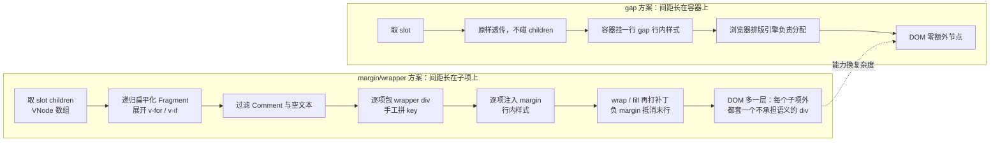

# 5-22 · Space：间距的运行时方案

> 本篇源码坐标（均为当前工作区实态）：
> - 主源码：`packages/components/space/src/space.vue`（42 行，本篇全文展开——注意这个组件没有独立的 `space.ts`，类型层内联在视图层文件里）
> - 安装入口：`packages/components/space/index.ts`（8 行）
> - 样式：`packages/theme/src/components/space.css`（11 行）、`packages/theme/index.css:28`
> - 测试：`packages/components/space/__tests__/space.spec.ts`（40 行）、类型夹具 `tests/types/fixtures/space.ts`（26 行）
> - 令牌参照：`packages/xiaoye-primitives/src/theme/tokens.css:236-243`
> - 示例与文档：`apps/docs/examples/space/`（basic / vertical / wrap 三例）、`apps/docs/components/space.md`
> - EP 对照：element-plus 2.0.5 / 2.4.4 / 2.7.0 / 现行 dev 四个断面的 `packages/components/space/src/`

间距大概是布局系统里最不起眼、也最磨人的问题。CSS 早就给了两个答案：`margin` 和 `gap`。前者 1996 年就进了 CSS1，后者在 flexbox 上迟到——Firefox 63 在 2018 年 10 月率先支持 flex 容器的 `gap`，Chrome/Edge 84 到 2020 年 7 月才跟进，Safari 更是等到 2021 年 4 月的 14.1。这十来年的空窗期，逼出了整整一代"间距组件"：把间距做成运行时组件，用 JavaScript 给每个子项塞 margin。Element Plus 的 Space、Ant Design Vue 的 Space，都是这个时代的产物。

于是每个组件库都要回答同一道选择题：**间距到底应该长在子项上（margin 方案），还是长在容器上（gap 方案）？** 这不是审美问题——两种方案写出来的 DOM 结构、遍历成本、测试面、能力边界全都不同。本库的答案极端到近乎挑衅：`space.vue` 全文 42 行，模板 8 行，一个 `<slot />` 原样透传，对子项 vnode 不看一眼、不碰一根手指。4-09 考据 group 复合模式时把 space 归入"纯样式 group，零遍历、零协议"，并留下了一句"实码见 space.vue:34-41"的存照；本篇把这份考据全文展开，给出定论，然后认真回答那个绕不开的问题——**放弃了 margin 方案的哪些能力，换来了什么？**

## 一、42 行的全部：一个 div 和一张查表

先看主源码全文，`packages/components/space/src/space.vue:1-42`：

```vue
<!-- packages/components/space/src/space.vue:1-42（全文） -->
<script setup lang="ts">
import { computed } from "vue";
import { useNamespace } from "xiaoye-primitives";

export interface SpaceProps {
  size?: number | "sm" | "md" | "lg";
  direction?: "horizontal" | "vertical";
  wrap?: boolean;
  align?: "start" | "center" | "end" | "stretch";
}

const props = withDefaults(defineProps<SpaceProps>(), {
  size: "md",
  direction: "horizontal",
  wrap: false,
  align: "center"
});

const ns = useNamespace("space");

const gap = computed(() => {
  if (typeof props.size === "number") {
    return `${props.size}px`;
  }

  return {
    sm: "8px",
    md: "12px",
    lg: "16px"
  }[props.size];
});
</script>

<template>
  <div
    :class="[ns.base.value, `${ns.base.value}--${props.direction}`, ns.is('wrap', props.wrap)]"
    :style="{ gap, alignItems: props.align, flexWrap: props.wrap ? 'wrap' : 'nowrap' }"
  >
    <slot />
  </div>
</template>
```

先给上轮考据一个正式的定论：**"零遍历"成立，而且成立得比措辞更彻底。** 逐行核对 1-42 行，这个组件对子项 vnode 做的事情是零——没有 `useSlots()`，没有 `slots.default?.()`，没有 `children.forEach`，没有 Fragment 扁平化，没有为任何子项生成过任何间隔节点或 wrapper。子项原样落进 `<slot />`（39 行），间隔完全交给容器行内样式里的 `gap`（37 行）。它不是"遍历得比较少"，而是**物理上不存在遍历这个动作**。4-09 引用的 `space.vue:34-41` 行号在当前工作区依然准确，"42 行里的一个 div"也属实——这份结论经全文核对后维持原判。

三个 `script` 侧的细节值得停一下。其一，`SpaceProps`（5-10 行）是 `export interface` 直接写在 `.vue` 文件里的——4-03 立的"类型层 / 视图层 / 逻辑层三件套"在 space 这里没有独立类型文件，因为四属性的接口实在撑不起一个 `space.ts`。安装入口 `packages/components/space/index.ts:1-8` 也因此薄到极致：

```ts
// packages/components/space/index.ts:1-8（全文）
import Space from "./src/space.vue";
import type { SpaceProps } from "./src/space.vue";
import { withInstall } from "xiaoye-primitives";

export type { SpaceProps };

export const XySpace = withInstall(Space, "xy-space");
export default XySpace;
```

其二，默认值由 `withDefaults` 集中托底（12-17 行）：`size: "md"`、`direction: "horizontal"`、`wrap: false`、`align: "center"`。注意 `align` 的默认是 `center`，这个默认值在本篇第七节会引爆一条 CSS 死规则。其三，`gap` 这个 computed（21-31 行）是组件唯一的"逻辑"：`typeof props.size === "number"` 走模板字符串直通，否则查一张三键小表。整张表没有任何运行时防御——没有 `|| 默认值` 兜底，没有未知档位告警。这在 EP 面前是主动的裸奔，但在本库的类型体系里是理所当然：`props.size` 的类型已被 `withDefaults` 窄化为 `"sm" | "md" | "lg"`（`number` 分支已被 typeof 守卫吃掉），查表索引不可能越界。**运行时不设防，是因为编译期已经设防**——这是 4-03 类型层哲学最干净的执行样本。

模板侧（34-41 行）也只有两件事。类名数组三项：`ns.base.value` 出 `xy-space`，字符串插值出 `xy-space--horizontal/vertical` 修饰符，`ns.is('wrap', props.wrap)` 出条件状态类——`useNamespace` 的 `is` 实现一句话就能读懂，`packages/xiaoye-primitives/src/composables/use-namespace.ts:4-16`：

```ts
// packages/xiaoye-primitives/src/composables/use-namespace.ts:4-16（节选）
export function useNamespace(block: string) {
  const { namespace } = useConfig();
  const base = computed(() => `${namespace.value}-${block}`);

  const is = (state: string, active?: boolean) => (active ? `is-${state}` : "");
  const cssVarBlock = (name: string) => `--${namespace.value}-${block}-${name}`;

  return { namespace, base, is, cssVarBlock };
}
```

`wrap` 为 false 时 `is` 返回空串，测试里那句 `not.toContain("is-wrap")`（`space.spec.ts:15`）钉的就是这个行为。行内样式三项：`gap`、`alignItems`、`flexWrap`——全部是随 props 变化的动态值。**为什么走行内样式而不是 CSS 类**，第五节展开，这里先记下一个伏笔：`useNamespace` 明明提供了 `cssVarBlock`（9 行）这个块级 CSS 变量命名工具，space 一个都没用上。

## 二、margin 方案 vs gap 方案：两条渲染管线

把两种方案各自的完整动作链摆在一起，差异会自己浮现：



margin 方案的本质，是把"间距"降格为**子项的私有属性**：每个子项多带一段 margin，间距随之散落在每个子项身上。这带来一串连锁反应。第一，必须遍历——组件要给"每个"子项塞样式，就得先知道"有哪些"子项，于是 slot children 的展开、扁平化、过滤一个都躲不掉。第二，必须包裹——margin 直接挂在用户写的子项上会污染子项自身的盒模型（比如子项自己也有 margin、或者 `width: 100%` 会被 margin 挤出容器），所以要套一层 wrapper 当"样式载体"。第三，必须处理边界——最后一个子项的 margin 是多余的，要么判断"是否末项"跳过，要么统一加上再用容器的负 margin 抵消；`wrap` 一开，换行边界处的间距语义更含糊。第四，Fragment 与注释节点——`v-for` 产生 Fragment，`v-if` 产生注释占位，不处理就会出现"给注释节点包 margin"的闹剧。

gap 方案的本质，是把"间距"升格为**容器的排版规则**：`gap` 不是任何一个盒子的属性，而是 flex 容器对子项之间空隙的声明。子项不需要知道彼此的存在，DOM 不变形、不多层，遍历失去存在理由——**不遍历不是因为偷懒，而是因为不需要**。子项的 `width: 100%` 依然是完整的 100%，margin 语义完好地留给用户自己用；换行时行间距、列间距由排版引擎统一裁决，不存在"末行多余的 margin"这种边角。

两张 DOM 截图对比一下最直观：

```text
<!-- margin/wrapper 方案的 DOM（EP 2.x margin 时代，示意） -->
<div class="el-space el-space--horizontal" style="...">
  <div class="el-space__item" style="margin-right: 12px; padding-bottom: 0px;">
    <xy-button>保存</xy-button>
  </div>
  <div class="el-space__item" style="margin-right: 12px; padding-bottom: 0px;">
    <xy-button>取消</xy-button>
  </div>
</div>

<!-- gap 方案的 DOM（本库 space.vue 实际输出） -->
<div class="xy-space xy-space--horizontal" style="gap: 12px; align-items: center; flex-wrap: nowrap;">
  <xy-button>保存</xy-button>
  <xy-button>取消</xy-button>
</div>
```

两个子项的差别，wrapper 的有无，行数是表象——**间距的"所有权"换了主人**才是本质。margin 方案里，间距属于每个子项（所以我必须遍历、必须包裹）；gap 方案里，间距属于容器（所以我只需声明）。所有权定了，后面所有工程属性——遍历成本、DOM 层数、key 管理、测试面——都是它的推论。

## 三、EP 对照：margin 遍历的两代补丁，与 gap 遍历的今天

拿 element-plus 的 Space 当对照组是最合适的——它几乎是 margin 方案演化的活化石。本篇核对了四个断面：2.0.5、2.4.4、2.7.0 与现行 dev。

2.0.5 / 2.4.4 时代，EP 的间距载体是 margin + padding。看 `element-plus@2.0.5` 的 `packages/components/space/src/use-space.ts`（节选）：

```ts
// element-plus@2.0.5 packages/components/space/src/use-space.ts（节选）
const SIZE_MAP: Record<ComponentSize, number> = {
  small: 8,
  default: 12,
  large: 16,
}

// 容器侧：wrap 时用负 marginBottom 抵消末行多出的 padding
const containerStyle = computed<StyleValue>(() => {
  const wrapKls: CSSProperties =
    props.wrap || props.fill
      ? { flexWrap: 'wrap', marginBottom: `-${verticalSize.value}px` }
      : {}
  const alignment: CSSProperties = {
    alignItems: props.alignment,
  }
  return [wrapKls, alignment, props.style]
})

// 子项侧：间距长在每个 item 上——margin 管水平，padding 管垂直
const itemStyle = computed<StyleValue>(() => {
  const itemBaseStyle: CSSProperties = {
    paddingBottom: `${verticalSize.value}px`,
    marginRight: `${horizontalSize.value}px`,
  }
  const fillStyle: CSSProperties = props.fill
    ? { flexGrow: 1, minWidth: `${props.fillRatio}%` }
    : {}
  return [itemBaseStyle, fillStyle]
})
```

三个补丁一次看全。补丁一：`SIZE_MAP` 三档 8/12/16——记住这组数字，与本库 `sm/md/lg` 的 8/12/16 完全同值，两家的"语义档位"翻译的是同一张设计字典。补丁二：`itemStyle` 给**每一个**子项统一挂 `marginRight` + `paddingBottom`（不区分末项），水平间距用 margin、垂直间距用 padding——为什么不对称地都用 margin？因为 `wrap` 场景下，容器用负 `marginBottom` 抵消"最后一行子项多出来的垂直间距"时，padding 计入子项高度、随行盒整体起落，抵消的算术更可控。补丁三：容器侧的 `marginBottom: -Npx`，就是这套算术的执行者。这三件事全都源于同一个根源：**间距长在子项上，就得为"子项"这个粒度的一切边角买单。**

而"每个子项都要挂样式"的前提是"每个子项都被找到"，于是 EP 的主组件 `space.ts` 里有一个专门的递归函数。现行 dev 版的 `extractChildren`（节选）：

```ts
// element-plus（现行 dev）packages/components/space/src/space.ts（节选）
function extractChildren(
  children: VNodeArrayChildren,
  parentKey = '',
  extractedChildren: VNode[] = []
) {
  const { prefixCls } = props
  children.forEach((child, loopKey) => {
    if (isFragment(child)) {
      if (isArray(child.children)) {
        child.children.forEach((nested, key) => {
          if (isFragment(nested) && isArray(nested.children)) {
            extractChildren(
              nested.children,
              `${parentKey + key}-`,
              extractedChildren
            )
          } else {
            if (isVNode(nested) && nested?.type === Comment) {
              extractedChildren.push(nested)
            } else {
              extractedChildren.push(
                createVNode(
                  Item,
                  {
                    style: itemStyle.value,
                    prefixCls,
                    key: `nested-${parentKey + key}`,
                  },
                  { default: () => [nested] },
                  PatchFlags.PROPS | PatchFlags.STYLE,
                  ['style', 'prefixCls']
                )
              )
            }
          }
        })
      }
    } else if (isValidElementNode(child)) {
      extractedChildren.push(
        createVNode(
          Item,
          {
            style: itemStyle.value,
            prefixCls,
            key: `LoopKey${parentKey + loopKey}`,
          },
          { default: () => [child] },
          PatchFlags.PROPS | PatchFlags.STYLE,
          ['style', 'prefixCls']
        )
      )
    }
  })

  return extractedChildren
}
```

四十余行只干一件事：把用户随手写的 slot——嵌套 Fragment、`v-for`、`v-if` 的注释占位、空文本——清洗成一个干净的子项列表，再逐个包进 `Item`（一个渲染 `<div class="el-space__item">` 的组件），手工拼出 `nested-`、`LoopKey` 前缀的 key。这段代码没有一行是"错的"，每一行都在堵 margin 方案特有的洞。

有意思的是 EP 自己的演化方向。2.7.0 起，`use-space.ts` 的间距载体已经换成了 gap：

```ts
// element-plus（现行 dev）packages/components/space/src/use-space.ts（节选）
const SIZE_MAP = {
  small: 8,
  default: 12,
  large: 16,
} as const

const containerStyle = computed<StyleValue>(() => {
  const wrapKls: CSSProperties =
    props.wrap || props.fill ? { flexWrap: 'wrap' } : {}
  const alignment: CSSProperties = {
    alignItems: props.alignment,
  }
  const gap: CSSProperties = {
    rowGap: `${verticalSize.value}px`,
    columnGap: `${horizontalSize.value}px`,
  }
  return [wrapKls, alignment, gap, props.style]
})

// watchEffect 内：horizontal 非 wrap 时垂直间距清零，gap 只作用于主轴
if (dir === 'horizontal') {
  horizontalSize.value = val
  verticalSize.value = 0
} else {
  verticalSize.value = val
  horizontalSize.value = 0
}
```

margin 和负 margin 补丁消失了，`rowGap` / `columnGap` 上位，而且比本库更精细：非 wrap 的 horizontal 只在主轴开 gap（垂直清零），wrap / fill 时才双轴同值。但 `extractChildren`、`Item` 包裹、spacer 归并一个都没少——**EP 是"gap + 遍历"的混合方案**，因为 spacer（自定义分隔符 vnode）、fill（子项撑满）这些能力必须以"子项"为操作粒度，wrapper 就撤不掉。时间线也值得记一笔：2.4.4 还是 margin（本篇实测），2.7.0 已是 gap，margin 时代持续了四五年，最后还是在 flex gap 普及的大势里完成了载体迁移。

本库的选择是第三条路：**gap + 零遍历**。它一步跨到了 EP 迁移后的终点，还把 EP 留下的 wrapper 也拆了。代价是第四节要盘点的能力清单，收益是 42 行对 EP 一百多行的渲染函数，以及一份干净到只需断言字符串的测试（第八节）。

## 四、零遍历的边界：gap 方案不能做什么

诚实的方案对比必须把"做不了什么"摆在桌面上。gap 方案的边界清单一共四条：

**其一，spacer 做不了。** EP 允许 `spacer` 属性传入一个 vnode（典型用法是传分隔符 `<el-divider direction="vertical" />`），在每两个子项之间插入——它的实现是在 `extractChildren` 之后对子项列表做一次 `reduce`，逢索引非末位就插一个 span。gap 方案里"间隔"是排版规则不是 DOM 节点，想插分隔符就必须回到遍历。本库的取舍是：这类场景交给业务方自己组合（divider + 布局容器），或者干脆不用 space——"在每两项之间插东西"本来就不再是"统一间距"问题。

**其二，fill 做不了。** EP 的 `fill` 让子项 `flexGrow: 1` 均分容器宽度，`fillRatio` 设定子项的最小宽度百分比。这同样是逐子项注入样式的产物，gap 方案无从下手。

**其三，双轴间距做不了。** EP 的 `size` 接受 `[number, number]` 数组，横纵间距各给一个值；现行实现进一步把它接到 `rowGap` / `columnGap` 上。本库的 `gap` 是单值，`wrap` 打开后**行间距恒等于列间距**——筛选标签流这类场景行距列距同值反而自然，但"横向 8px、纵向 24px"这种诉求只能绕行（比如纵向块间用 margin 或嵌套容器）。

**其四，子项粒度的干预做不了。** 不能跳过某个子项、不能给末项特殊处理、不能按子项类型分流。这条其实是零遍历的镜像表述：不认识子项，也就谈不上升降级。

这份清单看着不短，但注意一个事实：四条全部是"低频能力对高频成本"的交换。spacer / fill / 双轴在真实业务里的出现率，远低于"每个页面都要排版一组按钮"的出现率。组件库的预算应该花在刀刃上——space 把预算全部押给了"最常见路径的零成本"，把长尾需求留给组合与 CSS。还有一个隐性收益容易被漏掉：**空 slot 时 gap 方案什么都不用做**（EP 的渲染函数里有专门的 `children.length === 0` 早退），而 wrapper 方案哪怕 slot 为空也要保证自己不留垃圾节点。

## 五、size 档映射：number 直通与三档查表

`gap` computed 的 11 行（`space.vue:21-31`）是全组件唯一的分支逻辑，值得单独画一张决策图：

```mermaid
flowchart TD
    S["props.size<br/>number | 'sm' | 'md' | 'lg'"] --> Q{"typeof size === 'number'？"}
    Q -- "是：逃生舱" --> N["`${size}px` 直通<br/>space.vue:22-24"]
    Q -- "否：语义档" --> L["查表 { sm: 8, md: 12, lg: 16 }<br/>space.vue:26-30"]
    L --> T["与刻度令牌同值不同源<br/>--xy-space-2/3/4 恰为 8/12/16"]
    N --> V["gap 写入容器行内样式<br/>space.vue:37"]
    T --> V
    V --> W["flex 排版引擎按 gap 分配间距<br/>wrap 时行距 = 列距 = 同一个值"]
```

这里的第一个权衡是 **number 直通与语义档位的双形态设计**。语义档（`sm/md/lg`）是设计系统的"普通话"：三个词对应三档经过校准的密度，业务方在大多数场景只需要选档。number 直通是"逃生舱"：设计稿偏偏标了个 20px 的时候，不需要为了合规去扭曲需求。EP 的 `size` 同样是 `[String, Number, Array]` 三形态（还有 `[h, v]` 双轴数组），本库砍掉数组形态保住两形态——第三节说过，数组是双轴 gap 的接口前提，单值 gap 方案下它没有存在意义。**props 的每个形态都应该有真实的落点，形态的数量由底层能力决定，而不是由"EP 有的我也要有"决定。**

第二个权衡藏得更深：**动态值走行内样式，还是走 CSS 类？** 三档预设完全可以用类承载——`.xy-space--size-md { gap: var(--xy-space-3) }`，`useNamespace` 的 `cssVarBlock`（`use-namespace.ts:9`）就是为块级 CSS 变量准备的工具。但 number 直通永远无法穷举成类，一旦两形态并存，`gap` 就有两条来源：类给预设、行内给数字，优先级互相覆盖，查问题时要在两处找答案。本库选择"全部行走内"：一个 `:style` 对象（`space.vue:37`）同时吃下三档映射和任意数字，**单一优先级路径**，代价只是每次渲染多带几个字节的 style 属性——对一个每实例只渲染一次的布局容器，这是笔划得来的账。EP 现行版把 `gap` 也放进了 `containerStyle` 行内样式，殊途同归。

第三个细节是防御姿态的差异。EP 查表带兜底：`SIZE_MAP[size || 'small'] || SIZE_MAP.small`，未知档位静默降级到 small——因为 EP 的 props 校验是运行时 `buildProps`，挡不住字符串里混进脏值。本库查表不带兜底：类型层已经把 `size` 窄化成三键联合（第五到十行），`{ sm, md, lg }[props.size]` 在类型上不可能 undefined。同样的查表，一个防运行时、一个信编译期——4-03 讲过的"类型层是第一道防线"，在 11 行的 computed 里也能看出两家架构的分野。

## 六、与 3-05 间距令牌的联动：同值不同源

3-05 立过间距刻度的规矩：`tokens.css` 里的七档 `--xy-space-*`。把那一节的内容拉到眼前，`packages/xiaoye-primitives/src/theme/tokens.css:236-243`：

```css
/* packages/xiaoye-primitives/src/theme/tokens.css:236-243 */
/* 间距：8px 基准网格 */
--xy-space-1: 4px;
--xy-space-2: 8px;
--xy-space-3: 12px;
--xy-space-4: 16px;
--xy-space-5: 20px;
--xy-space-6: 24px;
--xy-space-7: 32px;
```

现在把 space 组件的查表和它并排放：`sm: "8px"` 对 `--xy-space-2`、`md: "12px"` 对 `--xy-space-3`、`lg: "16px"` 对 `--xy-space-4`——逐字相等。**同值，不同源**：三档预设是 TS 里的字符串字面量，不是 `var()` 引用。这正是 3-05 在主题 CSS 层讨论过的"字面量而非 var()"问题，在运行时组件的 TS 层重演了一次。

技术上换成 `var()` 毫无障碍——CSS 自定义属性在行内样式里完全合法，`gap: "var(--xy-space-3)"` 浏览器照单全收。那为什么不用？拆开看有三个理由，权重各不相同。其一，**测试断言的确定性**：`space.spec.ts:16` 断言 `style.gap` 严格等于 `"12px"`；若走 `var()`，行内样式的序列化值就是 `"var(--xy-space-3)"`，断言要么绑死令牌名（令牌一改名测试就碎），要么换 `getComputedStyle`（jsdom 不会解析未注入的变量，断言依然落空）。字面量让组件测试对令牌层零依赖。其二，**逻辑形态的统一**：number 分支本来就只能在 JS 里拼 `px`，两个分支统一成"字符串出口"最简——一半 var() 一半拼接，反而制造第二套心智。其三，说到底，**三档预设的身份是"组件 API 的默认档位"，不是"令牌的别名"**——EP 的 `SIZE_MAP` 同样是 TS 字面量，这是行业通行的写法。

但代价也要点名：**令牌改版时，space 预设不会跟。** 假如某天 8px 基准网格调整，`--xy-space-3` 从 12px 改成 10px，主题层所有 `var(--xy-space-3)` 一次生效，而 space 的 `md` 还是 12px——语义档位与刻度体系就此漂移。3-05 统计过主题层的消费分布：`--xy-space-4` 18 次、`-3` 17 次、`-2` 14 次是三大主力，space 组件的三档恰好押在同值的三档上，说明设计时显然对着刻度表选的值；只是这层"对表"关系存在于开发者的脑子里和本篇的文字里，不存在于代码里。如果将来要收口，方向也是现成的：预设档改引 `var(--xy-space-2/3/4)`，测试断言相应改为比对令牌名——一行 computed 与一行断言的事，属于"知道债在哪"之后随时可还的债。

还有一桩命名撞车的趣事必须澄清：`--xy-space-*` 令牌与 `xy-space` 组件**同名不同物**。拿 `rg 'xy-space' packages/theme/src` 扫一遍，命中的几乎全是 `button.css:5` 的 `gap: var(--xy-space-2)`、`tabs.css:4` 的 `gap: var(--xy-space-4)` 这类令牌消费；而 space 组件自己的样式文件里，一个 `var(--xy-space-*)` 都没有——**全库最该消费间距令牌的组件，恰好是间距令牌的零消费者**。这不是讽刺，是 gap 方案下"间距由 props 决定、CSS 无从置喙"的自然结果：CSS 层没有空间容纳动态间距，令牌消费也就无从发生。

## 七、11 行 CSS 与一条死规则

gap 走了行内样式，`space.css` 就只剩"容器自身形态"可写。全文 11 行，`packages/theme/src/components/space.css:1-11`：

```css
/* packages/theme/src/components/space.css:1-11（全文） */
.xy-space {
  display: inline-flex;
  align-items: center;
  max-width: 100%;
  vertical-align: middle;
}

.xy-space--vertical {
  flex-direction: column;
  align-items: flex-start;
}
```

四条基础声明各有一句话要说。`display: inline-flex`：space 的典型用法是嵌在一段行内流里（表单底部一排按钮、标题旁一组操作），inline 让容器与前后文本同行混排，`vertical-align: middle`（第 5 行）让混排时的基线对齐不突兀。`max-width: 100%`：防长内容把容器撑出父级——inline-flex 不会主动收缩到父宽以内，这一行是防御。`align-items: center`（第 3 行）：给未显式指定 align 的场景一个 CSS 层兜底。

然后是本篇考据出的硬货：**第 10 行 `align-items: flex-start` 是一条永远不生效的死规则。** 推理三步：行内样式优先级永远高于类选择器；`space.vue:37` 的 `alignItems: props.align` 因为 `withDefaults` 的存在**恒有值**（默认 `"center"`）；所以 `.xy-space--vertical` 里的 `align-items: flex-start` 无论何时都会被行内样式压制成 `center`。想让纵向列表左对齐，只能显式传 `align="start"`——文档示例的作者显然撞过这堵墙，`apps/docs/examples/space/vertical.vue:2` 写的就是 `<xy-space direction="vertical" align="start">`，显式补上了 CSS 本想默认给的那份左对齐。

值得强调：同一行里的 `flex-direction: column`（第 9 行）**是生效的**——因为行内样式不管 direction，两条声明一个活一个死，正好划出了"行内样式管 props、CSS 管形态"的边界。这条死规则的病根是**同一默认值在两处声明**：align 的默认在 JS 里是 `center`，CSS 却以为自己是 `flex-start`，行内必赢，CSS 那份就成了幻觉。修法有两种且都便宜：删掉第 10 行承认"默认值只归 JS 管"；或者把纵向默认左对齐的语义抬进 `withDefaults`（但那会改变横向的默认，牵连更广）。现状的实质风险几乎为零（行为只是"与 CSS 注释意图不符"，而非视觉故障），但它是所有"CSS 兜底 + JS 默认值"组件的前车之鉴：**兜底值必须与默认值同源，否则兜底就是谎言。**

样式的接线本身倒没有悬念：清单声明 `"styleImports": ["space"]`（`packages/components/component-manifest.json:196-203`），聚合入口 `packages/theme/index.css:28` 一行 `@import "./src/components/space.css"` 收编——4-01 讲过的"一份 JSON 管六处一致性"，space 是其中最薄的一处。

## 八、测试与类型夹具：断言字符串，而不是几何

40 行测试全文，`packages/components/space/__tests__/space.spec.ts:1-40`：

```ts
// packages/components/space/__tests__/space.spec.ts:1-40（全文）
import { mount } from "@vue/test-utils";
import { describe, expect, it } from "vitest";
import { XySpace } from "../index";

describe("XySpace", () => {
  it("默认渲染为横向间距布局", () => {
    const wrapper = mount(XySpace, {
      slots: {
        default: "<span>一</span><span>二</span>"
      }
    });

    expect(wrapper.classes()).toContain("xy-space");
    expect(wrapper.classes()).toContain("xy-space--horizontal");
    expect(wrapper.classes()).not.toContain("is-wrap");
    expect(wrapper.element.style.gap).toBe("12px");
    expect(wrapper.element.style.alignItems).toBe("center");
    expect(wrapper.element.style.flexWrap).toBe("nowrap");
  });

  it("支持自定义尺寸、纵向布局和换行", () => {
    const wrapper = mount(XySpace, {
      props: {
        size: 20,
        direction: "vertical",
        wrap: true,
        align: "stretch"
      },
      slots: {
        default: "<span>甲</span><span>乙</span>"
      }
    });

    expect(wrapper.classes()).toContain("xy-space--vertical");
    expect(wrapper.classes()).toContain("is-wrap");
    expect(wrapper.element.style.gap).toBe("20px");
    expect(wrapper.element.style.alignItems).toBe("stretch");
    expect(wrapper.element.style.flexWrap).toBe("wrap");
  });
});
```

两个用例，分工干净：第一个钉默认值全景——类名两项、状态类缺席一项、行内样式三项，六个断言把 `withDefaults` 的四个默认值全部覆盖（12px 就是查表里 `md` 的值）；第二个钉四 props 联动，`size: 20` 走 number 直通、`wrap: true` 出 `is-wrap` 状态类、`align: "stretch"` 直写行内。注意断言的对象是 `wrapper.element.style.gap`——**行内样式的字符串，不是几何**。这个选择一半是主动一半是被迫：jsdom 不做布局，`getBoundingClientRect` 测不了间距（gap 方案的间距发生在浏览器排版引擎里，测试环境里根本不存在）；margin 方案至少可以退而断言每个 item 的行内 `marginRight`——EP 的 space 测试走的正是这条路。gap 方案把所有动态值收拢到容器一个节点上，测试面相应收缩成六行字符串断言，这可以叫作"零遍历的红利"：**被测对象的表面积，跟着 DOM 复杂度一起变小了。**

类型夹具 26 行，`tests/types/fixtures/space.ts:1-26`：

```ts
// tests/types/fixtures/space.ts:1-26（全文）
import type { SpaceProps } from "xiaoye-components";

const props: SpaceProps = {
  size: 20,
  direction: "vertical",
  wrap: true,
  align: "stretch"
};

void props;

const presetProps: SpaceProps = {
  size: "sm",
  direction: "horizontal",
  wrap: false,
  align: "center"
};

void presetProps;

const invalidProps: SpaceProps = {
  // @ts-expect-error unsupported direction should be rejected
  direction: "grid"
};

void invalidProps;
```

三段式是全库夹具的标准姿势：number 形态全 props 合法、预设形态全 props 合法，然后一段负向断言——`direction: "grid"` 靠 `@ts-expect-error` 钉死"字面量联合之外的值必须报错"。这个小文件与第五节的防御姿态讨论首尾呼应：运行时查表不设防，是因为这一段 `@ts-expect-error` 已经在编译期拦住了所有越界值。`pnpm typecheck:types` 全量跑这些夹具，任何把 props 联合放宽或收窄的改动都会在这里现形。

## 九、消费实证：216 个示例文件，与"何时不该用"的三条边界

空间组件的价值最终要靠使用密度说话。全库 569 个文档示例文件里，216 个包含 `<xy-space` 标签——接近四成的示例在用这个 42 行的组件排版。最典型的形态，`apps/docs/examples/space/basic.vue:15-19`：

```vue
<!-- apps/docs/examples/space/basic.vue:15-19 -->
<xy-space>
  <xy-button type="primary">保存</xy-button>
  <xy-button plain>取消</xy-button>
  <xy-button text>更多设置</xy-button>
</xy-space>
```

三个按钮、零 props、默认 `md` 档 12px——这是 space 的"母语场景"。稍复杂一点的，`apps/docs/examples/badge/basic.vue:15-28` 用 `wrap align="center"` 排一组徽章：

```vue
<!-- apps/docs/examples/badge/basic.vue:15-28 -->
<xy-space wrap align="center">
  <xy-badge :value="12" class="demo-badge-item">
    <xy-button plain>评论</xy-button>
  </xy-badge>
  <xy-badge :value="3" type="primary" class="demo-badge-item">
    <xy-button plain>通知</xy-button>
  </xy-badge>
  <xy-badge :value="1" type="warning" class="demo-badge-item">
    <xy-button plain>审批</xy-button>
  </xy-badge>
  <xy-badge :value="8" color="#0f766e" class="demo-badge-item">
    <xy-button plain>自定义色</xy-button>
  </xy-badge>
</xy-space>
```

有意思的是同文件 51-54 行的收尾——`.demo-badge-item { margin-top: 10px; margin-right: 30px }`。gap 统一了群体间距之后，个别子项要"脱颖而出"（徽章数字外露需要额外呼吸感），还是得回到 margin。这不是 gap 方案的失败，而是分工的显形：**gap 管"群体节奏"，margin 管"个体偏移"**，两套机制从来不是替代关系。顺带一提，这组徽章的 30px margin 与 12px gap 叠加成 42px 实际间距——间距语义分散在两处时，"实际间距"要靠加法算，这也是调试 gap 布局时最常踩的小坑。

正因如此，"何时不该用 space"值得立三条边界。**其一，纯静态布局不需要它。** 示例文件自己的样式就是示范——`basic.vue:29-33` 的 `.demo-space-basic__header { display: flex; gap: 10px }`，一个写死的标题行，直接 CSS gap 即可，套一层组件反而多了运行时成本。space 的价值在于"间距是 props"：props 会变（动态增删筛选项时容器自适应）、间距要跨组件边界统一、或者模板里不想为每组按钮各写一段 CSS——满足其中之一再上组件。**其二，栅格不要用它。** 5-16 的 Row 用负 margin 外扩 `gutter/2`、Col 用 padding 内缩 `gutter/2`（`row.vue:26-31` 的负 margin 实现），不用 gap 的理由在那一篇说过：24 等分的百分比坐标系里，gap 挤占的是"内容之外、子项之外"的公共带，列宽百分比的数学会被它搅乱——同样的"间距放哪"问题，栅格的答案与 space 相反，而且都对。**其三，需要分隔符、撑满、双轴间距时它不够用**——第四节的清单，落到选型上就是这三条红灯。

## 十、小结

复盘本篇的六个要点：

1. **"零遍历"定论成立**：`space.vue:1-42` 无任何 vnode 遍历、无间隔节点、无 wrapper，间距全权交给容器行内样式 `gap`（37 行），4-09 的考据经全文核对维持原判。
2. **gap vs margin 的本质是间距所有权**：margin 方案把间距降格为子项私有属性，代价是遍历、包裹、key、边界补丁；gap 方案把间距升格为容器排版规则，遍历失去存在理由。EP 的 margin 时代（2.0.5-2.4.4 的 `marginRight` + `paddingBottom` + 负 `marginBottom` 抵消）到 gap 时代（2.7.0 起 `rowGap`/`columnGap`）的迁移，本身就是这道选择题的历史判决。
3. **零遍历的代价是四条能力边界**：spacer、fill、双轴间距、子项粒度干预——全部是低频能力，本库选择把预算押给高频路径。
4. **size 双形态对应两种身份**：三档查表是设计系统的普通话（与 `--xy-space-2/3/4` 同值不同源），number 直通是逃生舱；动态 gap 走行内样式保住单一优先级路径，编译期类型收口取代运行时兜底。
5. **一条死规则与一个零消费悖论**：`space.css:10` 的 `align-items: flex-start` 被行内样式永久压制，病根是默认值双处声明；全库最该消费间距令牌的组件恰好是 `var(--xy-space-*)` 的零消费者。
6. **测试面跟着 DOM 复杂度收缩**：40 行测试全部断言行内样式字符串，jsdom 不做布局的限制反而被 gap 方案化解成"断言面最小化"。

下一篇预告：5-23《Tabs：激活态管理》。从"管间距"到"管激活"——`packages/components/tabs/src/` 的三件套（`tabs.ts` / `tabs.vue` / `tab-pane.vue`）要回答的是另一类问题：`modelValue` 与 pane 的 `name` 如何对账、`before-leave` 钩子（`apps/docs/examples/tabs/before-leave.vue` 已经在等）如何拦截切换、激活态指示条的位置信息在父子之间怎么流动。space 证明了一个组件可以不认识自己的孩子；Tabs 则相反——它必须精确知道每个 pane 的名字和位置，激活态管理才能落地。

---

*本篇代码引用核对于当前工作区实态：`packages/components/space/src/space.vue`（42 行）、`packages/components/space/index.ts`（8 行）、`packages/theme/src/components/space.css`（11 行）、`packages/theme/index.css:28`、`packages/components/space/__tests__/space.spec.ts`（40 行，vitest 实跑 2 passed）、`tests/types/fixtures/space.ts`（26 行）、`packages/xiaoye-primitives/src/theme/tokens.css:236-243`、`packages/xiaoye-primitives/src/composables/use-namespace.ts:4-16`、`packages/components/component-manifest.json:196-203`、`apps/docs/examples/space/`（basic.vue 41 行 / vertical.vue 7 行 / wrap.vue 9 行）、`apps/docs/examples/badge/basic.vue:15-28, 51-54`、`apps/docs/components/space.md:31-45`、`packages/components/row/src/row.vue:26-31`、示例引用统计 `rg -l '<xy-space' apps/docs/examples | wc -l` = 216 / 569。EP 侧事实核对自 element-plus 官方仓库四个断面：2.0.5 与 2.4.4 的 `use-space.ts`（`SIZE_MAP` 8/12/16、`itemStyle` 的 `marginRight + paddingBottom`、wrap 时容器负 `marginBottom`）、2.7.0 与现行 dev 的 `use-space.ts`（`rowGap/columnGap`、horizontal 非 wrap 时垂直间距清零）及 dev 的 `space.ts`（`extractChildren` 递归扁平化 / Comment 过滤 / `Item` 包裹 / spacer 归并）。*
