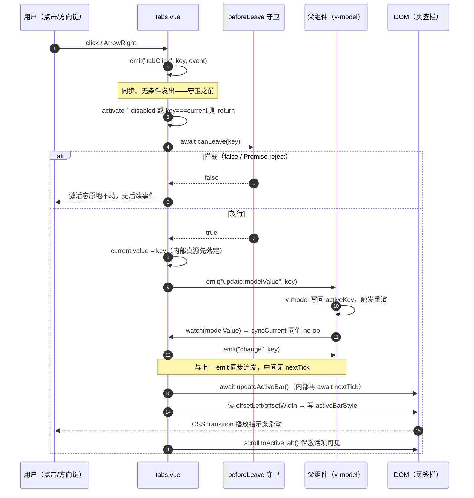

# 5-23 · Tabs：激活态管理与面板联动

> 本篇源码坐标（均为当前工作区实态）：
> - 逻辑层：`packages/components/tabs/src/tabs.vue`（602 行）、`packages/components/tabs/src/tabs.ts`（49 行）、`packages/components/tabs/src/tab-pane.vue`（50 行）
> - 出口：`packages/components/tabs/index.ts`（40 行）
> - 样式：`packages/theme/src/components/tabs.css`（423 行，3-05/3-06 只引过它的消费段，本篇展开动画段）
> - 测试与类型：`packages/components/tabs/__tests__/tabs.spec.ts`（198 行）、`tests/types/fixtures/tabs.ts`（30 行）
> - 示例：`apps/docs/examples/tabs/`（basic / disabled / position / scrollable / before-leave / editable / methods 七例）

Tabs 是这一卷里最像"状态路由"的组件：一个字符串 key 决定页签栏上谁高亮、指示条停在哪、内容区哪个面板可见。它没有 select 那样的泛型链路（4-10 已经用 select 把泛型讲透，本篇不再重复），也不像浮层那样要跟浏览器定位引擎搏斗，它的三个难点全在**时序**上：点击页签之后，`tabClick`、`update:modelValue`、`change` 三个事件以什么顺序发出？激活值变化之后，面板内容以什么方式跟着显隐——是 `v-if` 卸载、`v-show` 隐藏还是 keep-alive 缓存？指示条的滑动动画，在哪个时机去测量 `offsetLeft` 才不会量错？

3-05 和 3-06 都引过 `tabs.css` 的段落——L84-101 的 tab 项、L124-147 的指示条、L315-323 的竖排 tab、L375 的 550 字重档——但都只当它是设计令牌的"消费现场"。本篇要看的，是这些样式背后那台 602 行的状态机器：`tabs.vue` 里一个叫 `current` 的 ref 如何同时服务三套消费者（页签栏、指示条、面板），以及 4-09 在 radio-group 里立下的"受控切换事件纪律"，到了 tabs 这里哪些被沿用、哪些被有意简化。

## 一、类型层：一份契约，两条数据通道

先看类型层全文，`packages/components/tabs/src/tabs.ts:1-49`：

```ts
// packages/components/tabs/src/tabs.ts:1-49（全文）
import type { Ref } from "vue";

export interface TabItem {
  key: string;
  label: string;
  disabled?: boolean;
  closable?: boolean;
}

export interface TabsDefaultSlotProps {
  activeKey: string;
  activeItem?: TabItem;
}

export const tabsTypes = ["", "card", "border-card"] as const;
export const tabsPositions = ["top", "right", "bottom", "left"] as const;

export type TabsType = (typeof tabsTypes)[number];
export type TabsPosition = (typeof tabsPositions)[number];
export type TabsModelValueChangeHandler = (value: string) => void;
export type TabsChangeHandler = (value: string) => void;
export type TabsTabClickHandler = (key: string, event: MouseEvent | KeyboardEvent) => void;
export type TabsEditAction = "remove" | "add";
export type TabsEditHandler = (key: string | undefined, action: TabsEditAction) => void;
export type TabsTabRemoveHandler = (key: string) => void;
export type TabsTabAddHandler = () => void;
export type TabsBeforeLeave = (
  newKey: string,
  oldKey: string
) => boolean | void | Promise<boolean | void>;

export interface TabsProps {
  modelValue?: string;
  defaultValue?: string;
  items: TabItem[];
  type?: TabsType;
  tabPosition?: TabsPosition;
  closable?: boolean;
  addable?: boolean;
  editable?: boolean;
  stretch?: boolean;
  beforeLeave?: TabsBeforeLeave;
  tabindex?: string | number;
}

export interface TabsInstance {
  currentName: Ref<string>;
  scrollToActiveTab: () => Promise<void>;
}
```

49 行里藏着本篇最重要的一个架构决定：**TabItem 是必填的**（`items: TabItem[]` 没有 `?`），而 4-03 立下的"类型层—视图层—逻辑层"框架里，大多数组件的 props 必填项是值本身。这说明 xy-tabs 的主数据通道不是"往默认插槽里塞 `xy-tab-pane` 子组件"，而是**数据驱动**——父组件给一组 `TabItem`，组件自己渲染整个页签栏。这条通道决定了后面的注册机制、渲染机制甚至测试策略。

`TabsDefaultSlotProps`（L10-13）是另一条通道的痕迹：默认插槽被设计成作用域插槽，向面板内容下发 `activeKey` 和 `activeItem`，让"items 驱动页签栏 + 插槽渲染面板"成为完整闭环。这段类型声明现在能不能兑现，第四节有一段必须诚实面对的考古。

`TabsBeforeLeave`（L27-30）的返回值类型值得停一下：`boolean | void | Promise<boolean | void>`。同步返回 `false` 拦截、返回 `void` 放行、返回 Promise 则等待裁决——三种形态都合法。这个签名是组件库里少数把"异步守卫"写进公开类型的例子，`before-leave` 示例里那个 `window.confirm` 就是靠它才成立的。

`TabsInstance`（L46-49）只暴露两样东西：`currentName`（当前 key 的 ref，可读）和 `scrollToActiveTab`（把激活页签滚进可视区）。没有提供 `setCurrent` 之类的命令式写入——激活态的变更入口只有点击、键盘和 `modelValue` 三条，expose 侧刻意保持只读。

## 二、激活态的一元化：current 落在哪里

逻辑层开头的 80 行是全篇的枢纽，`packages/components/tabs/src/tabs.vue:35-114`：

```ts
// packages/components/tabs/src/tabs.vue:35-114
const ns = useNamespace("tabs");
const tabsId = `xy-tabs-${Math.random().toString(36).slice(2, 10)}`;
const tabRefs = ref<Array<HTMLButtonElement | null>>([]);
const navRef = ref<HTMLDivElement | null>(null);
const navScrollRef = ref<HTMLDivElement | null>(null);
const current = ref("");
const activeBarStyle = ref<Record<string, string>>({});
const navStyle = ref<Record<string, string>>({});
const navOffset = ref(0);
const scrollable = ref({
  prev: false,
  next: false
});

const childrenTabPanes = ref<TabItem[]>([])

const tabsContext = {
  currentValue: computed(() => current.value),
  updateActive: (name: string) => {
    void activate({ key: name, label: '' })
  },
  registerTab: (item: TabItem) => {
    if (!childrenTabPanes.value.find(t => t.key === item.key)) {
      childrenTabPanes.value.push(item)
    }
  },
  unregisterTab: (key: string) => {
    childrenTabPanes.value = childrenTabPanes.value.filter(t => t.key !== key)
  }
}

provide('tabsContext', tabsContext)

const allItems = computed(() => {
  if (props.items.length > 0) {
    return props.items
  }
  return childrenTabPanes.value
})

const firstEnabledKey = computed(() => allItems.value.find((item) => !item.disabled)?.key ?? "");
const _activeItem = computed(() => allItems.value.find((item) => item.key === current.value));
const activeIndex = computed(() => allItems.value.findIndex((item) => item.key === current.value));
const isVertical = computed(() => ["left", "right"].includes(props.tabPosition));
const isReverse = computed(() => ["bottom", "right"].includes(props.tabPosition));
const canAdd = computed(() => props.addable || props.editable);
const isScrollable = computed(() => scrollable.value.prev || scrollable.value.next);

let resizeObserver: ResizeObserver | null = null;

function resolveFallbackValue() {
  return props.modelValue ?? props.defaultValue ?? current.value;
}

function syncCurrent(value?: string) {
  const nextValue = value ?? resolveFallbackValue();
  const matched = allItems.value.some((item) => item.key === nextValue && !item.disabled);

  current.value = matched ? nextValue : firstEnabledKey.value;
}

watch(
  () => props.modelValue,
  (value) => {
    syncCurrent(value);
  },
  {
    immediate: true
  }
);

watch(
  () => allItems.value,
  () => {
    syncCurrent(props.modelValue ?? current.value);
  },
  {
    deep: true
  }
);
```

**权衡一：受控 `v-model` 与内部 `current` 的双轨制。** 4-04 讲受控/非受控双模时列过三种实现姿势，tabs 选了其中最传统的一种：内部持有一个真源 `current`，用 `watch(props.modelValue)` 单向同步（L96-104，`immediate: true` 保证挂载时初始化）。它没有用 primitives 里现成的 `useControlled`——那个可写 computed 的方案让"读 props、写 emit"自动发生，但 tabs 的同步多了一步**校验**：`syncCurrent`（L89-94）先检查传入值是否命中某个未禁用的页签（`matched`），未命中就落回 `firstEnabledKey`。这个校验发生在 `current` 落定之前，而不是 computed 的 get 里，意味着**非法值永远不会到达渲染层**——页签栏上不会出现"没有页签高亮但 aria-selected 全 false"的悬空帧。如果换成可写 computed，这层校验就得塞进每个消费者或者 setter，状态机反而碎掉。

注意 `current.value = matched ? nextValue : firstEnabledKey.value` 这行的另一半纪律：**自愈不回写**。当父组件传来的 `modelValue` 是非法值（比如页签被删后 key 失效），组件把内部 `current` 纠正到第一个可用项，但**不会替父组件补发 `update:modelValue`**。父组件的 `activeKey` 仍然是那个过期值，直到父组件自己改。editable 测试把这条纪律钉得很死——`tabs.spec.ts:130-136` 里 `handleRemove` 自己负责在删掉激活项后挑下一个 key：`items.value[index]?.key ?? items.value[index - 1]?.key ?? ""`。组件库选择"我不猜你的意图"，把兜底策略留给业务层。这和 4-09 radio 的"值变更只有一个出口"是同一条哲学的两侧：一个管写入不双写，一个管纠错不代写。

`resolveFallbackValue`（L85-87）的 `modelValue ?? defaultValue ?? current` 三级回落链是双模的接缝：受控时 `modelValue` 永远有值，回落链不生效；非受控时 `defaultValue` 只在初始化阶段参与（测试 `tabs.spec.ts:26-39` 用 `defaultValue: "members"` 验证了第二个页签初始高亮），之后 `current` 自己接管。第三个回落 `current.value` 看似多余——`value ?? ...` 的调用方要么传了明确值要么依赖这条链——但正是它让 `syncCurrent()` 的无参调用在"items 变了但值不用变"的场景里保持现状。

第二个 watch（L106-114，`deep: true` 盯着 `allItems`）处理的是另一类失同步：**items 增删改之后，激活值需要重新校准**。这里有个容易忽略的细节——回调里传的是 `props.modelValue ?? current.value` 而不是无参调用。为什么？无参调用会走 `resolveFallbackValue`，在受控场景下等价；但在"父组件没传 modelValue、也没传 defaultValue、current 还是初始空串"的场景，`resolveFallbackValue` 返回空串，`matched` 为 false，激活态会被强行打到第一个可用项。显式传 `current.value` 则表达了更温和的意图：**items 变化只做"合法再校验"，不主动改写用户的现状**——除非现状本身已经非法（key 不在了或被禁用了）。

`allItems`（L68-73）本身是两条数据通道的汇合口：`props.items` 非空就用它，否则退回 `childrenTabPanes`——后者由 `xy-tab-pane` 子组件通过 `provide('tabsContext', ...)`（L66）注入的 `registerTab` 登记。优先级写死为"props 优先"，意味着两种通道同时使用且 key 不重叠时，插槽注册的页签会整体让位。而 `provide` 用的不是 4-09 radio 那样的 InjectionKey 常量，是裸字符串 `'tabsContext'`——一个值得记一笔的松动：类型安全靠 `tab-pane.vue` 里手工重声明的接口保持，字符串撞名的风险由命名约定兜底。

还有一处"考古级"细节：L76 的 `_activeItem`，一个带下划线前缀的 computed，全文件搜不到第二个引用。它的名字和 `TabsDefaultSlotProps.activeItem` 对上了——它本该是把激活项下发到默认插槽的那根管子，如今是条断头路。这个伏笔在第四节兑现。

## 三、切换的时序：tabClick → update:modelValue → change

激活值的一切变更最终都汇入同一个函数，`packages/components/tabs/src/tabs.vue:116-133` 是守卫，`tabs.vue:325-341` 是主流程：

```ts
// packages/components/tabs/src/tabs.vue:116-133
async function canLeave(nextKey: string) {
  if (!props.beforeLeave || nextKey === current.value) {
    return true;
  }

  const result = props.beforeLeave(nextKey, current.value);

  if (typeof result === "boolean" || result === undefined) {
    return result !== false;
  }

  try {
    const resolved = await result;
    return resolved !== false;
  } catch {
    return false;
  }
}
```

```ts
// packages/components/tabs/src/tabs.vue:325-341
async function activate(item: TabItem) {
  if (item.disabled || item.key === current.value) {
    return;
  }

  const allowed = await canLeave(item.key);

  if (!allowed) {
    return;
  }

  current.value = item.key;
  emit("update:modelValue", item.key);
  emit("change", item.key);
  await updateActiveBar();
  await scrollToActiveTab();
}
```

```ts
// packages/components/tabs/src/tabs.vue:435-438
async function handleTabClick(item: TabItem, event: MouseEvent | KeyboardEvent) {
  emit("tabClick", item.key, event);
  await activate(item);
}
```

先看守卫的三个细节。第一，`canLeave` 对返回值的裁决是 `result !== false`——**只认明确的 false，其余一切（true、undefined、truthy 值）都放行**。这让 `before-leave` 示例里的 `return confirmed` 与"什么都不返回"的守卫可以共存。第二，`try/catch` 把 Promise 的拒绝路径折叠成 `false`：守卫函数抛错等于拦截。这是 fail-closed 设计——`before-leave` 的语义是"除非明确放行，否则留在原地"，异步确认框被用户取消（Promise reject）或代码出错时，**宁可切不动也不误切**。对"未保存草稿提醒"这类场景，宁可保守。第三，`canLeave` 对 `nextKey === current.value` 短路——但这个短路其实到不了，因为 `activate` 的第一行守卫已经把同 key 点击拦下了。两层守卫叠着，读起来冗余，但各自服务的入口不同：`activate` 拦的是"点自己"，`canLeave` 拦的是"守卫被外层 API 复用"的未来可能。

`activate` 的时序是本篇的核心考据点，画成时序图：



对照 4-09 给 radio-group 立下的五步纪律——守卫、写回、`await nextTick`、`change`、表单校验——tabs 的时序有两个有意的偏离，偏离背后是场景差异：

**第一，`change` 不再隔 `await nextTick()`，与 `update:modelValue` 同步连发（L337-338）。** radio 里那个 nextTick 的理由是：`change` 的监听者（表单校验器、业务联动）要读到**已经生效**的新值，包括 DOM 已更新。tabs 的 `change` 监听者绝大多数只消费 key 这个字符串做路由级反应（拉数据、切面包屑），不依赖面板 DOM；而真正依赖 DOM 的动作——指示条测量、滚动保活——组件已经亲自 `await nextTick` 之后才做（`updateActiveBar` 的第一步就是 `await nextTick()`）。**需要等 DOM 的地方自己等，不需要等的事件不虚增延迟**。代价是给业务留了一个坑：如果 `@change` 回调里要测量新面板的尺寸，必须自己 `nextTick`。这是一笔显式转移给调用方的成本，文档示例的 methods 用法刻意绕开了它。

**第二，没有表单校验联动。** radio 的第五步是 `formItem?.validate("change")`，tabs 没有——Tabs 根本不在 form 语境里（没有任何 xy-tabs 的用法会出现在 `xy-form-item` 下当值控件），加校验钩子是给不存在的消费者发工资。

`tabClick` 的位置也值得单独说：它在 `activate` 之前、守卫之前发出（L436）。所以**点击已激活页签或被 `before-leave` 拦下的页签，`tabClick` 照发，`update:modelValue`/`change` 不发**。三者各司其职：`tabClick` 是"用户行为已发生"，`update:modelValue` 是"值已变更"，`change` 是"变更已通知"。EP 的同名分工（`tab-click` 带 pane 与事件对象、`tab-change` 只带 name）与此同构。

`activate` 是 async 函数，模板侧的接入方式是 `@click="void handleTabClick(item, $event)"`（L554）——`void` 显式声明"我知道这是 Promise 且有意不等待"。同一份 async 在键盘路径上却是 `await activateByIndex(targetIndex)`（L431），等待完成后再 `focusTab`。点击不等（鼠标场景无焦点交接诉求），键盘等（要保证守卫放行后焦点落到新页签）。

## 四、面板联动：v-if 的懒渲染定论

页签栏归 tabs.vue 管，面板归谁管？答案在 `packages/components/tabs/src/tab-pane.vue:1-50`（全文）：

```vue
<!-- packages/components/tabs/src/tab-pane.vue:1-50（全文） -->
<script setup lang="ts">
import { computed, inject, type ComputedRef } from 'vue'

interface TabsContext {
  currentValue: ComputedRef<string>
  updateActive: (name: string) => void
  registerTab: (item: { key: string; label: string; disabled?: boolean; closable?: boolean }) => void
  unregisterTab: (key: string) => void
}

const props = withDefaults(defineProps<{
  label?: string
  name: string
  disabled?: boolean
  closable?: boolean
}>(), {
  disabled: false,
  closable: true
})

const tabsContext = inject<TabsContext | null>('tabsContext', null)

if (tabsContext) {
  tabsContext.registerTab({
    key: props.name,
    label: props.label || props.name,
    disabled: props.disabled,
    closable: props.closable
  })
}

const isActive = computed(() => {
  return tabsContext?.currentValue.value === props.name
})
</script>

<template>
  <div
    v-if="isActive"
    class="xy-tab-pane"
  >
    <slot />
  </div>
</template>

<style lang="scss" scoped>
.xy-tab-pane {
  padding: 20px;
}
</style>
```

**懒渲染的实码定论：`v-if`，不是 `v-show`，也没有 keep-alive。** 面板的显隐由模板里唯一的 `v-if="isActive"` 决定——未激活的 xy-tab-pane **不渲染任何 DOM**，激活状态切换的瞬间，旧面板的 DOM 被卸载、新面板的 DOM 从零挂载。组件实例本身还活着（它是父插槽树的一分子，`isActive` 只是控制自己模板根部的 v-if），但插槽内容随 DOM 一起销毁重建。这意味着两件事：**第一，首屏只渲染激活面板**，十个页签只有一个面板的组件树被实例化；**第二，切走再切回，面板内部状态归零**——表单草稿、滚动位置、子组件的局部状态全部丢失，除非业务自己在面板内容里做持久化。

**权衡二：懒渲染策略的三选一。** 把可选策略摆开看：

| 策略 | 首屏成本 | 切换成本 | 状态保留 | DOM 占用 |
| --- | --- | --- | --- | --- |
| `v-if`（xy 现行） | 只渲染激活面板 | 每次切换销毁+重建 | 不保留 | 最小 |
| `v-show`（EP 非 lazy 默认） | 渲染全部面板 | 显隐翻转，零重建 | 保留 | 最大 |
| keep-alive + v-if | 首次渲染后缓存 | 首次后零重建 | 保留 | 中（缓存实例） |

xy 选择 v-if 的理由链条是自洽的：items 主通道下，默认插槽本来就是"一个面板的渲染出口"（业务用 `activeKey` 自己渲染当前内容，见 basic 示例的 `#default="{ activeItem }"`），根本不存在"十个面板同时渲染"的问题；即便走 xy-tab-pane 通道，v-if 的首屏成本优势与"页签内容重、面板多"的后台场景（editable 示例描绘的工作台）更契合，而状态丢失可以用"业务把状态提升到面板外"化解——这套组件库的后台叙事里，状态提升本来就是受控组件的默认姿势。EP 的对照（以 2.x 源码为参照）正相反：el-tab-pane 常驻 DOM，用 `v-show="active"` 翻转可见性，另给 `lazy` 属性做首次激活前不渲染的缓解，切换后 DOM 与组件状态都保留。**EP 押注"切换成本与状态连续性优先"，xy 押注"首屏与 DOM 占用优先，状态交还业务"**——没有对错，只有对目标场景的判断，但迁移组件时必须意识到这是行为差异而不只是 API 差异。

再看注册通道本身，这里有四处"声明了但没闭环"的裂缝，逐一过实码：

**其一，`registerTab` 在 setup 体内同步调用（L23-30），不在 onMounted，也没有任何响应式追踪。** 页签的 `label`、`disabled` 变了，`childrenTabPanes` 里登记的快照不会更新——注册是一次性的、非响应式的。对静态 pane 够用，对动态 pane 是暗坑。**其二，`unregisterTab` 在上下文里声明了（tabs.vue L61-63）、在 pane 的接口类型里声明了（tab-pane.vue L8），但没有任何调用方**——tab-pane 没有 onUnmounted 钩子，pane 被 `v-if` 从插槽里移除后，`childrenTabPanes` 里的残影还在，页签栏会渲染一个点不动的幽灵页签。**其三，`updateActive`（tabs.vue L53-55）同样无人调用**——面板侧没有"点击面板标题反向激活"的通路，它是一个预留了、没接线的插座。**其四，也是最重要的：`TabsDefaultSlotProps` 承诺的作用域槽参数没有兑现。** tabs.vue 的内容区只有一行：

```vue
<!-- packages/components/tabs/src/tabs.vue:598-600 -->
    <div class="xy-tabs__content">
      <slot />
    </div>
```

`<slot />` 不传任何槽参数，而 `defineSlots`（tabs.vue L30-33）声明的也是无参签名 `default?: () => VNode[]`——类型层与模板层一致地"不给"，只有 tabs.ts 的 `TabsDefaultSlotProps` 和文档页的 Slots 表格在承诺 `activeKey`/`activeItem`。七个文档示例里有六个在用 `#default="{ activeItem }"` 或 `#default="{ activeKey }"` 解构一个**永远是 undefined 的对象**——basic 示例标题栏的 `{{ activeItem?.label }}` 实际渲染为空串。第二节那个断头 computed `_activeItem`，就是这根管子在城市规划图上的残留。这是全篇核对中发现的最实质的源码-文档失配：修复方向也很直白——`<slot :active-key="current" :active-item="_activeItem" />` 补上接线，或者降级文档承诺。

两条通道的全貌画成图：

```mermaid
flowchart LR
    subgraph A["通道一：items 数据驱动（主）"]
        A1["props.items : TabItem[]"] --> A2["allItems computed<br/>props 优先"]
    end
    subgraph B["通道二：tab-pane 注册驱动（辅）"]
        B1["xy-tab-pane setup 体内<br/>registerTab 同步登记"] --> B2["childrenTabPanes ref"]
        B2 --> A2
    end
    A2 --> C["syncCurrent：合法值校验<br/>非法则落 firstEnabledKey"]
    C --> D["current（内部真源）"]
    D --> E1["页签栏：is-active 类<br/>aria-selected / roving tabindex"]
    D --> E2["指示条：activeIndex<br/>→ offsetLeft 测量"]
    D --> F["tab-pane：isActive =<br/>currentValue === name"]
    F --> G["v-if：激活面板挂 DOM<br/>未激活面板无 DOM"]
    A1 -.props.items 为空才走.-> B2
```

## 五、指示条：测量的三重时机与 transform 过渡

指示条是激活态的"可视化影子"，它的实现是测量与动画的分工，`packages/components/tabs/src/tabs.vue:135-166`：

```ts
// packages/components/tabs/src/tabs.vue:135-166
async function updateActiveBar() {
  await nextTick();

  const activeTab = tabRefs.value[activeIndex.value];
  const nav = navRef.value;

  if (!activeTab || !nav) {
    activeBarStyle.value = {};
    return;
  }

  if (isVertical.value) {
    const direction = props.tabPosition === "right" ? 1 : 0;
    const indicatorSize = 14;
    const offset = activeTab.offsetTop + Math.max((activeTab.offsetHeight - indicatorSize) / 2, 0);
    activeBarStyle.value = {
      height: `${indicatorSize}px`,
      transform: `translateY(${offset}px)`,
      right: direction ? "0" : "auto",
      left: direction ? "auto" : "0"
    };
    return;
  }

  const direction = props.tabPosition === "bottom" ? 1 : 0;
  activeBarStyle.value = {
    width: `${activeTab.offsetWidth}px`,
    transform: `translateX(${activeTab.offsetLeft}px)`,
    top: direction ? "0" : "auto",
    bottom: direction ? "auto" : "0"
  };
}
```

消费这段样式的 `packages/theme/src/components/tabs.css:128-147`（3-05 引过它的光学对齐，本篇看动画）：

```css
/* packages/theme/src/components/tabs.css:128-147 */
.xy-tabs__active-bar {
  position: absolute;
  z-index: 2;
  left: 0;
  bottom: -7px;
  width: 0;
  height: 3px;
  border-radius: var(--xy-radius-pill);
  background: var(--xy-brand);
  pointer-events: none;
  transition:
    width var(--xy-transition-duration-fast) var(--xy-transition-timing),
    height var(--xy-transition-duration-fast) var(--xy-transition-timing),
    transform var(--xy-transition-duration-fast) var(--xy-transition-timing);
}

.xy-tabs__nav.is-vertical .xy-tabs__active-bar {
  width: 2px;
  height: 0;
}
```

**权衡三：测量值写内联 style + CSS transition，而不是 FLIP，也不是纯 CSS 方案。** 拆开看这条流水线的三次握手。**测量**：`offsetLeft`/`offsetWidth`（以及竖排的 `offsetTop`/`offsetHeight`）——注意不是 `getBoundingClientRect()`。这有一层容易被略过的考量：nav 自身带着 `translateX(-${navOffset}px)` 的滚动位移（L168-173 的 `updateNavTransform`），`getBoundingClientRect` 返回的是**经过 transform 的视口坐标**，滚动容器一动，量出来的"页签在 nav 内的位置"就被污染；而 `offsetLeft` 是**布局值**，transform 不参与布局，量的是页签相对 offsetParent 的"账面位置"——滚动偏移无论怎么变，账面位置不动，指示条的坐标系才是稳定的。**动画**：JS 只写终点值（width、transform），起点的补间完全交给 CSS 的 `transition`（tabs.css L138-141 同时对 width/height/transform 三个属性生效——宽度变化时指示条是"边滑边缩放"的果冻感，EP 同款方案的体验特征）。这比 JS 侧的 FLIP 少一层 rAF 编排，比 `left` 值动画少触发四次布局——`transform` 走合成层，60fps 下不产生重排。**兜底**：`!activeTab || !nav` 时清空 style（L141-144），items 被清空、DOM 未就绪的中间帧不残留幽灵指示条。

`updateActiveBar` 会在三个时机被触发，三重时机覆盖三类失同步：

1. **切换后主动测**：`activate` 的第 339 行 `await updateActiveBar()`——await 是认真的，指示条滑动完成测量后才开始，与 `scrollToActiveTab` 串行，避免两者对 `navOffset` 的读写交错。
2. **布局相关 props 变化后被动测**：L465-472 的 watch 盯着 `[current, tabPosition, type, stretch, allItems.length]` 五元组——方向从 top 切到 left、风格从线型切 card、stretch 开关、页签增删，任何一项都改变页签的几何位置，指示条必须重测。
3. **容器尺寸变化后被动测**：L303-323 的 `reconnectResizeObserver` 把 nav 和 nav-scroll 两个元素交给 ResizeObserver，字体加载晚于首帧、容器被侧栏挤压、窗口缩放，全部走这条路；`onMounted` 里还挂了一个 `window.addEventListener("resize")`（L476）作为老环境双保险——ResizeObserver 不可用时（L306-309 的特性检测）它是唯一兜底。

滚动溢出是同一套测量基建的第二消费者。`updateScrollable`（L199-225）比对 `getContainerSize()`（视口侧 clientWidth/Height）与 `getNavSize()`（内容侧 scrollWidth/Height），得出 prev/next 两个方向的可达性；`scrollToActiveTab`（L227-252）在激活页签越过可视窗口边界时收拢 `navOffset`；`handleWheel`（L278-301）把滚轮增量钳制在 `[0, maxOffset]`。三者和指示条共享同一组测量函数与同一个 `navOffset` 真源——**滚动位移与指示条测量互不污染**的秘密，就是第五节开头说的"账面位置 vs 视口位置"分离。还有一个安静的细节：card 与 border-card 风格下指示条被 `display: none`（tabs.css L403-405）——卡片风格用边框表达激活，滑动指示条退场，`updateActiveBar` 照测不误，只是没人渲染。测量与展示解耦，风格切换才不用挂条件逻辑。

## 六、键盘与可达性：roving tabindex 与悬空的 aria-controls

键盘导航是 tabs 唯一的自绘键盘逻辑，`packages/components/tabs/src/tabs.vue:363-433`：

```ts
// packages/components/tabs/src/tabs.vue:363-433
function findEnabledIndex(startIndex: number, step: 1 | -1) {
  const total = allItems.value.length;

  if (!total) {
    return -1;
  }

  let index = startIndex;

  for (let count = 0; count < total; count += 1) {
    if (index < 0) {
      index = total - 1;
    } else if (index >= total) {
      index = 0;
    }

    if (!allItems.value[index]?.disabled) {
      return index;
    }

    index += step;
  }

  return -1;
}

function focusTab(index: number) {
  tabRefs.value[index]?.focus();
}

async function activateByIndex(index: number) {
  const item = allItems.value[index];

  if (!item || item.disabled) {
    return;
  }

  await activate(item);
  focusTab(index);
}

async function handleKeydown(event: KeyboardEvent, index: number) {
  let targetIndex = -1;

  switch (event.key) {
    case "ArrowRight":
    case "ArrowDown":
      event.preventDefault();
      targetIndex = findEnabledIndex(index + 1, 1);
      break;
    case "ArrowLeft":
    case "ArrowUp":
      event.preventDefault();
      targetIndex = findEnabledIndex(index - 1, -1);
      break;
    case "Home":
      event.preventDefault();
      targetIndex = findEnabledIndex(0, 1);
      break;
    case "End":
      event.preventDefault();
      targetIndex = findEnabledIndex(allItems.value.length - 1, -1);
      break;
    default:
      return;
  }

  if (targetIndex >= 0) {
    await activateByIndex(targetIndex);
  }
}
```

先说与 `use-list-navigation` 的关系，实码定论是**没用**。primitives 里确实有这个组合式（`packages/xiaoye-primitives/src/composables/use-list-navigation.ts`，95 行），内部也有一个 `findEnabledIndex`，但它的环形滚动是可选的（`options.loop`），select、dropdown、auto-complete、time-select 四家都在用；tabs 却在 L363-387 内联复刻了一份，且把环形行为写死为无条件循环。为什么不复用？看差异：列表导航的组合式管的是"焦点在 N 个候选间移动"（激活与焦点分离，select 里方向键只移高亮、Enter 才确认），tabs 的语义是**激活即焦点**（roving tabindex 下方向键直接切换面板并落焦点）——`activateByIndex` 先 `await activate` 再 `focusTab`，激活失败（被守卫拦截）就不动焦点，两个动作有严格的先后依赖。把"移动"和"确认"折叠成一步的组件，套用两步式的组合式反而要写胶水。复刻 25 行换语义直白，这笔账在 tabs 的场景下是划算的——但代价是同一算法在库里出现两份，`use-list-navigation` 将来改禁用跳过逻辑时，tabs 不会跟着变。

**模型是 selection-follows-focus**：方向键的落点立即成为激活项（而 WAI-ARIA 对 tabs 的另一种推荐是 focus-only，方向键只移焦点、Enter 确认）。自动激活对手动确认的取舍在此不再展开，值得记的是 `event.preventDefault()` 的位置——在每个分支内、`activate` 之前，保证 disabled 项被跳到空处时也不触发浏览器默认滚动。

a11y 的另一半在模板上，`packages/components/tabs/src/tabs.vue:532-568`：

```vue
<!-- packages/components/tabs/src/tabs.vue:532-568 -->
            role="tablist"
            :aria-orientation="isVertical ? 'vertical' : 'horizontal'"
            :style="navStyle"
          >
            <span class="xy-tabs__active-bar" :style="activeBarStyle" />
            <button
              v-for="(item, index) in allItems"
              :id="`${tabsId}-tab-${item.key}`"
              :key="item.key"
              :ref="(element) => setTabRef(element, index)"
              type="button"
              role="tab"
              :disabled="item.disabled"
              :tabindex="item.key === current ? Number(props.tabindex) : -1"
              :aria-selected="item.key === current"
              :aria-controls="`${tabsId}-panel-${item.key}`"
              :class="[
                'xy-tabs__tab',
                item.key === current ? 'is-active' : '',
                item.disabled ? 'is-disabled' : '',
                isClosable(item) ? 'is-closable' : ''
              ]"
              @click="void handleTabClick(item, $event)"
              @keydown="void handleKeydown($event, index)"
            >
              <span class="xy-tabs__tab-label">{{ item.label }}</span>
              <span
                v-if="isClosable(item)"
                class="xy-tabs__tab-close"
                role="button"
                aria-label="关闭页签"
                tabindex="-1"
                @click="handleTabRemove(item, $event)"
              >
                <XyIcon icon="mdi:close" :size="12" />
              </span>
            </button>
```

这套模板的达标项很齐整：页签是真按钮（`type="button"`，Enter/Space 由原生接管）、`role="tablist"/"tab"` 成对、`aria-orientation` 随 `tabPosition` 翻转、roving tabindex 只留激活项可 Tab 进入（L545，`props.tabindex` 允许业务把激活项的序位调为 -1 使整个页签栏脱离 Tab 序列）、关闭按钮独立 role 且 `tabindex="-1"` 不抢焦点。**悬空的是 `aria-controls`**：L547 指向 `${tabsId}-panel-${item.key}`，`tabsId` 是 L36 的每实例随机串，但全库没有任何元素渲染 `role="tabpanel"` 或这个 id——tab-pane.vue 的输出是 `class="xy-tab-pane"`，无 role、无 id。屏幕阅读器跟着 aria-controls 找面板会找到空气。同理，`tabs.css` 里 5 处 `.xy-tabs__panel` 选择器（L189、L248-254、L378-381、L420-423）对应的类名没有任何组件输出——面板样式系统（`flex: 1`、边框、圆角算术 `calc(var(--xy-radius-lg) + var(--xy-radius-sm))`）处于待激活状态。这些与第四节的四处裂缝同根：**items 主通道做完了 90%，pane 辅通道的收尾（面板 id/role/样式/卸载清理/槽参数）停在了声明层**。把它们列出来不是苛责，而是给"AI 协作研发"留一份真实的工程账本——类型写了、事件签名定了、CSS 铺了，唯独没人把最后一根线接上。

## 七、测试钉住的时序

时序这种东西，文档说了不算，测试说了算。`packages/components/tabs/__tests__/tabs.spec.ts:84-116` 用两个用例把 `before-leave` 的同步与异步裁决都钉死了：

```ts
// packages/components/tabs/__tests__/tabs.spec.ts:84-116
  it("支持 beforeLeave 阻止切换", async () => {
    const wrapper = mount(XyTabs, {
      props: {
        beforeLeave: () => false,
        items: [
          { key: "overview", label: "概览" },
          { key: "members", label: "成员" }
        ]
      }
    });

    await wrapper.findAll('[role="tab"]')[1].trigger("click");

    expect(wrapper.emitted("update:modelValue")).toBeUndefined();
    expect(wrapper.findAll('[role="tab"]')[0].attributes("aria-selected")).toBe("true");
  });

  it("支持 beforeLeave 返回 Promise", async () => {
    const wrapper = mount(XyTabs, {
      props: {
        beforeLeave: () => Promise.resolve(true),
        items: [
          { key: "overview", label: "概览" },
          { key: "members", label: "成员" }
        ]
      }
    });

    await wrapper.findAll('[role="tab"]')[1].trigger("click");
    await Promise.resolve();

    expect(wrapper.emitted("update:modelValue")?.[0]).toEqual(["members"]);
  });
```

第一个用例断言了两件事：拦截后 `update:modelValue` **从未发出**（`toBeUndefined` 而不是"少了一条"），且 aria-selected 仍停在原页签——守卫把整条事件链短路在 emit 之前。第二个用例的 `await Promise.resolve()` 是对 `canLeave` 内部 await 链的微操：Promise 守卫让 `activate` 变成多跳微任务，测试必须把微任务队列冲干净才能看到 emit。8 个用例里还有两组与本文直接相关：开头的键盘用例（L7-24）用 `ArrowRight` 从第一项跳过 disabled 的"成员"直落"账单"，断言 `update:modelValue` 收到 `"billing"`——激活即焦点模型加上禁用跳过，一条测试全覆盖；editable 用例（L118-174）则以一个 30 行的父组件模板演示了第四节的"自愈不回写"契约该由谁来履行。

类型侧的夹具 `tests/types/fixtures/tabs.ts:1-30`（全文）：

```ts
// tests/types/fixtures/tabs.ts:1-30（全文）
import type { TabItem, TabsProps } from "xiaoye-components";

const items: TabItem[] = [
  { key: "overview", label: "概览" },
  { key: "members", label: "成员", disabled: true, closable: false }
];

const tabsProps: TabsProps = {
  modelValue: "overview",
  defaultValue: "members",
  items,
  type: "card",
  tabPosition: "left",
  closable: true,
  addable: true,
  editable: false,
  stretch: true,
  beforeLeave: (_next, _prev) => true,
  tabindex: 0
};

void tabsProps;

const invalidTabsProps: TabsProps = {
  items,
  // @ts-expect-error invalid type should be rejected
  type: "editable"
};

void invalidTabsProps;
```

夹具的双向断言是全库惯例：正向把全部 props 摆一遍确保赋值合法，反向用 `@ts-expect-error` 钉死字面量联合的边界——`type: "editable"` 是把 `editable` 布尔属性的词错填进 `type` 的真实错误形态，`TabsType` 的三值联合（`"" | "card" | "border-card"`）必须拒绝它。另外两个细节：`tabindex: 0` 喂的是 number（类型同时收 string），与模板里 `Number(props.tabindex)` 的运行时归一对应；`beforeLeave` 的参数名 `_next/_prev` 带下划线前缀，是"参数位置占位但不使用"的 TS 惯例，间接确认了守卫签名是 `(newKey, oldKey)` 序——**新值在前**，与直觉里"从哪切到哪"的叙述顺序相反，业务写守卫时最容易在这里踩反。

示例侧，七个示例完整覆盖了 props 面：basic 是 items + 默认插槽的标准姿势，before-leave 用 `window.confirm` 演示异步守卫，editable 演示父组件维护 items 与激活值兜底，methods 演示 expose 的 `currentName` 读取与外部按钮改 `v-model`，scrollable 用八个页签把容器压出滚动条，position/disabled 验证方向与禁用跳过。

## 收束：一个 key 的完整旅程

把全篇压回最初的问题——受控 tabs 的事件时序与面板联动：

1. **激活态一元化于内部 `current`**：受控走 `watch(modelValue)` 单向同步，非受控走 `defaultValue` 初始回落；`syncCurrent` 把"非法值自愈"挡在渲染层之前，但自愈不回写——组件不替父组件补发事件，兜底责任留在业务侧（editable 测试为证）。
2. **事件三分工，时序有取舍**：`tabClick`（守卫前、无条件）→ `update:modelValue` → `change`（后两者同步连发）。相对 4-09 radio 五步纪律省掉了中间的 nextTick 与表单校验——需要 DOM 的测量动作由组件自己 await nextTick，不需要 DOM 的事件不虚增延迟；代价是 `@change` 里摸 DOM 的业务得自己等。
3. **守卫 fail-closed**：`before-leave` 只认明确的 `false` 之外的"一切非 false 均放行"，Promise 拒绝与异常折叠为拦截——宁可切不动，不误切。
4. **面板联动是 v-if 定论**：未激活面板零 DOM，切换即销毁重建，首屏最小、状态不保留；对照 EP 的 v-show + lazy 是行为级差异，迁移时必须换算状态管理姿势。而 pane 注册通道留了五处声明未闭环（槽参数、面板 id/role、卸载清理、样式类、updateActive），是本篇核对出的最大失配面。
5. **指示条是测量与动画的分工**：`offsetLeft` 布局值测量（免疫 transform 滚动污染）→ 内联 style 写终点 → CSS transition 补间；三重触发时机（切换后、props 变化、ResizeObserver）覆盖三类失同步，滚动溢出与指示条共享同一套测量基建。

下一篇预告：第六卷开篇 6-01《Input：最复杂的受控输入》。Tabs 的受控只有一个字符串、一条事件链，Input 的受控是一整座水电站——`modelValue` 之外还有组合输入法（IME composition）的中间态、`nativeInputValue` 的同步策略、clear 与 password 切换的焦点保持、以及 `form-item` 校验触发点的分布。第五卷里反复出现的"值变更只有一个出口"纪律，将在最复杂的输入控件上接受终极压力测试。

---

*本篇代码引用核对于当前工作区实态：`packages/components/tabs/src/tabs.vue`（602 行，L30-33 / L35-114 / L116-133 / L135-166 / L199-252 / L278-301 / L303-323 / L325-341 / L363-433 / L435-438 / L532-568 / L598-600）、`src/tabs.ts`（49 行全文）、`src/tab-pane.vue`（50 行全文）、`index.ts`（40 行）、`packages/theme/src/components/tabs.css`（423 行，L128-147 / L375 / L403-405 / L248-254）、`packages/components/tabs/__tests__/tabs.spec.ts`（198 行，L7-24 / L84-116 / L118-174）、`tests/types/fixtures/tabs.ts`（30 行全文）、`packages/xiaoye-primitives/src/composables/use-list-navigation.ts`（95 行）、`packages/components/component-manifest.json:205-210`（installExports 仅 `XyTabs`）、`packages/components/exports.ts:61`、`packages/theme/index.css:30`、`apps/docs/examples/tabs/` 七例、`apps/docs/components/tabs.md`（Slots 表格承诺 `TabsDefaultSlotProps`）。单测实跑通过：`pnpm vitest run packages/components/tabs/__tests__/tabs.spec.ts`，8 passed。EP 侧事实（TabPane 的 `lazy` + `loaded` + `v-show` 渲染策略、槽驱动 API、`tab-click`/`tab-change` 事件分工、指示条 offsetLeft/offsetWidth 测量加 transform 过渡）以 element-plus 2.x 源码为参照核对。*
