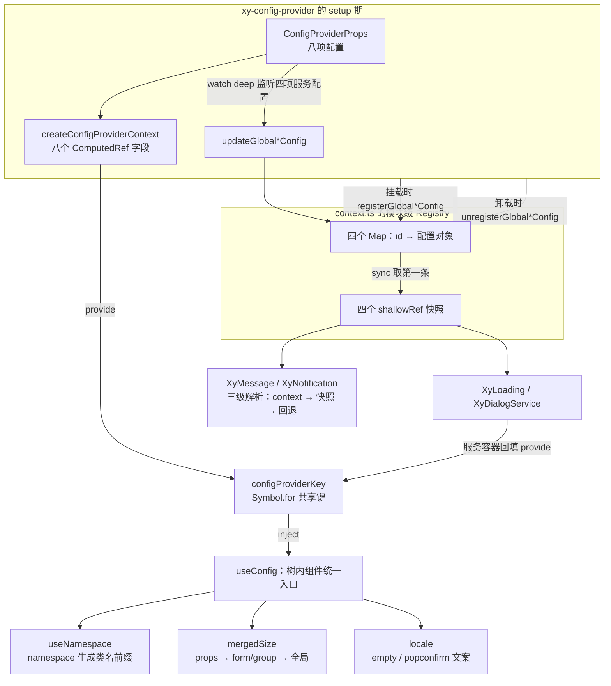
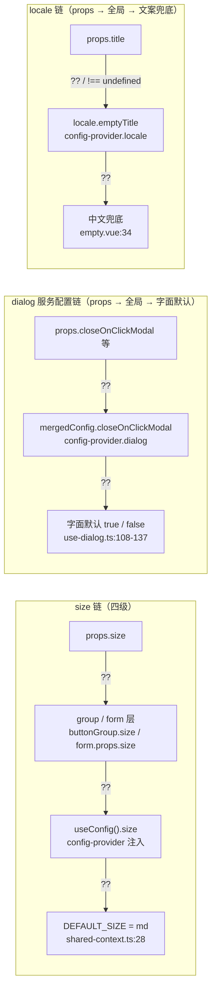
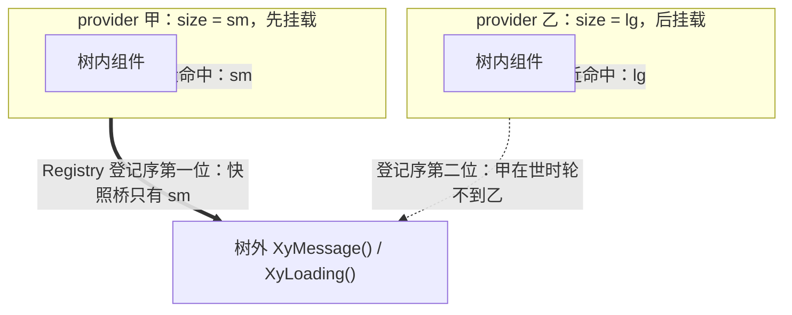

# 6-01 · ConfigProvider：全局配置源头

> 本篇回答第六卷的第一个问题：**组件库里的全局配置，到底是怎么从源头流到每一个组件、每一次服务调用里的？** `<xy-config-provider>` 对外只暴露八个配置项——`namespace`、`size`、`zIndex`、`locale`，加上 `dialog`、`loading`、`message`、`notification` 四项服务配置——但支撑这八个字段的，是一套双通道分发模型：组件树内的 provide/inject，组件树外的模块级 Registry 快照。前情有两处：4-02 从安装器视角讲过快照桥的"桥"是怎么搭起来的，4-08 从表单级联视角讲过 `useConfig` 的降级与 undefined 穿透；本篇把这两处引子展开成**完整的配置模型**——八个字段的类型层、两条通道的实现全文、四条降级链的消费实证，以及与 Element Plus 同类实现的逐点对照。
>
> 涉及源码（行号以当前工作区实态逐一核对）：
>
> - 源头本体：`packages/components/config-provider/src/config-provider.vue`（93 行）、`context.ts`（168 行）、`packages/components/config-provider/index.ts`（23 行）
> - 原语层：`packages/xiaoye-primitives/src/composables/use-config.ts`（55 行）、`shared-context.ts`（29 行）、`use-namespace.ts`（13 行）
> - 消费实证：`packages/components/input/src/input.vue:81,93`、`button/src/use-button.ts:12-22`、`dialog/src/use-dialog.ts:98-137`、`empty/src/empty.vue:29-40`、`popconfirm/src/popconfirm.vue:81,121-126`、`checkbox/src/checkbox-group.vue:33,40`
> - 服务实证：`message/src/method.ts:137-161`、`loading/src/service.ts:140-154`、`notification/src/service.ts:262-267`、`dialog/src/dialog-service-container.vue:54-63`
> - 测试与夹具：`packages/components/config-provider/__tests__/config-provider.spec.ts`（97 行）、`tests/types/fixtures/config-provider.ts`（49 行）

## 一、八项配置：类型层先立规矩

先看清单。ConfigProvider 一共八个配置项，定义在 `packages/components/config-provider/src/context.ts:28-37`，而它们的"共享形态"则下沉在原语层 `packages/xiaoye-primitives/src/composables/shared-context.ts`。这个 29 行的小文件是整篇的地基，值得全文读一遍：

```ts
// packages/xiaoye-primitives/src/composables/shared-context.ts（全文 29 行）
import type { ComputedRef, InjectionKey } from "vue";

export const configProviderKey: InjectionKey<SharedConfigContext> =
  Symbol.for("xiaoye-config-provider") as InjectionKey<SharedConfigContext>;

export type ComponentSize = "" | "xs" | "sm" | "md" | "lg" | "xl";

export interface Locale {
  emptyTitle?: string;
  emptyDescription?: string;
  popconfirmConfirmButtonText?: string;
  popconfirmCancelButtonText?: string;
}

export interface SharedConfigContext {
  namespace: ComputedRef<string>;
  locale: ComputedRef<Locale>;
  zIndex: ComputedRef<number>;
  size: ComputedRef<ComponentSize>;
  dialog: ComputedRef<unknown>;
  loading: ComputedRef<unknown>;
  message: ComputedRef<unknown>;
  notification: ComputedRef<unknown>;
}

export const DEFAULT_NAMESPACE = "xy";
export const DEFAULT_Z_INDEX = 2000;
export const DEFAULT_SIZE: ComponentSize = "md";
```

这 29 行里有四个决定全篇走向的细节，值得在展开实现之前先钉住。

**第一，注入键是 `Symbol.for("xiaoye-config-provider")`。** 普通的 `Symbol()` 每次执行都生成新值，两份组件库副本（monorepo 源码直引 + npm 链接产物并存，是真实会发生的场景）各自 `provide`、各自 `inject`，互不相认；`Symbol.for` 走全局符号注册表，跨副本拿到同一个 symbol 值。全局配置天然希望"跨实例也能对上"，这与 4-08 讲过的 form 键取 `Symbol("xiaoye-form")` 形成一组刻意对照——表单校验绝对不能跨实例串台，全局配置恰恰相反。

**第二，共享层的四个服务配置字段全是 `ComputedRef<unknown>`。** primitives 层如果 import `MessageGlobalConfig`、`DialogGlobalConfig` 这些具体类型，就形成原语层反向依赖组件层的层级倒置——monorepo 的大忌。所以共享层把类型放得极宽（`unknown`），具体类型在 components 侧的 `context.ts:17-26` 里收窄：

```ts
// packages/components/config-provider/src/context.ts L17-37
export interface ConfigProviderContext {
  namespace: ComputedRef<string>;
  locale: ComputedRef<Record<string, string>>;
  zIndex: ComputedRef<number>;
  size: ComputedRef<ComponentSize>;
  dialog: ComputedRef<DialogGlobalConfig>;
  loading: ComputedRef<LoadingGlobalConfig>;
  message: ComputedRef<MessageGlobalConfig>;
  notification: ComputedRef<NotificationGlobalConfig>;
}

export interface ConfigProviderProps {
  namespace?: string;
  locale?: Record<string, string>;
  zIndex?: number;
  size?: ComponentSize;
  dialog?: DialogGlobalConfig;
  loading?: LoadingGlobalConfig;
  message?: MessageGlobalConfig;
  notification?: NotificationGlobalConfig;
}
```

四个具体配置类型（`DialogGlobalConfig` 等）分别从 `../../dialog/src/dialog`、`../../loading/src/types`、`../../message/src/message`、`../../notification/src/notification` import 进来（`context.ts:10-13`）——**类型在消费最深的组件里定义，配置源头只做汇拢**。谁拥有字段，谁定义类型；config-provider 不重复发明任何一份服务配置的形状。

**第三，注意 `locale` 的双层类型差**：props 层是宽的 `Record<string, string>`（`context.ts:30`），共享层是窄的 `Locale` 接口（只有 `emptyTitle`、`emptyDescription`、`popconfirmConfirmButtonText`、`popconfirmCancelButtonText` 四个键）。宽进严出——业务方想塞什么键都行（类型夹具里就塞了一个 `submit` 键，见第八节），组件消费端只按窄接口取值。这个取舍的代价是 props 层放弃了 locale 键名的编译期校验，收益是 locale 表可以随组件演进而不破坏 provider 的公开类型。

**第四，`ComponentSize` 是六档含空串**：`"" | "xs" | "sm" | "md" | "lg" | "xl"`。空串的语义是"未指定"，给没有 group/form 包裹、又不想要任何尺寸修饰类的场景留出口。

把八项配置和它们的消费面放在一起看，分布非常有意思。我对组件侧做了一次全量统计：`rg 'useConfig' packages/components` 命中 37 个文件、37 处调用（其中 `select.vue:88` 与 `auto-complete.vue:71` 各一次解构出 `size` 和 `loading` 两个字段），再加上原语层 `use-namespace.ts:5` 的 1 处。按字段拆开：

| 配置项 | 组件侧直接解构 | 消费方式 |
| --- | --- | --- |
| `size` | 32 处 | `props.size ?? form/group ?? globalSize` 三四级级联的链尾 |
| `loading` | 4 处（auto-complete/dialog/select/table） | 全局 loading 文案等透传 |
| `locale` | 2 处（empty/popconfirm） | 文案三段式：props → locale → 中文兜底 |
| `dialog` | 1 处（use-dialog.ts） | 十余个 `resolved*` 计算属性逐项合并 |
| `namespace` | 0 处直接解构 | 经 `useNamespace` 间接进入**全部组件**的类名 |
| `zIndex` | 0 处 | 消费面在服务侧（`loading/src/service.ts:149`） |

size 是消费之王（32 处），zIndex 是树内的"隐形配置"（0 处直接消费）。这张表本身就是一个设计信号：**配置项的消费面呈长尾分布**，八项配置不是均质的——有的要下沉到每一个 class 字符串，有的只服务一条窄链路。下一篇 6-02 讲 Input 时我们会再碰到 size 链。

双通道分发的全景如下图：左边是组件树内的 provide/inject 标准通路，右边是服务于树外命令式调用的 Registry 快照桥，而服务容器（XyDialogService 的渲染容器）最后又把快照**回填成 provide**——两条通道在服务场景里闭环。



## 二、树内通道：provide 出去的是一束 ComputedRef

现在进入源头本体。`config-provider.vue` 全文 93 行，是这个组件的全部——没有独立的逻辑层文件，逻辑层的重活全在 `context.ts`。任务规格里点名了 21-49 与 61-86 两段（4-02 引过），这次全文展开：

```vue
<!-- packages/components/config-provider/src/config-provider.vue（全文 93 行） -->
<script setup lang="ts">
import { onBeforeUnmount, provide, watch } from "vue";
import type { ConfigProviderProps } from "./context";
import {
  createConfigProviderContext,
  configProviderKey,
  registerGlobalDialogConfig,
  registerGlobalLoadingConfig,
  registerGlobalMessageConfig,
  registerGlobalNotificationConfig,
  unregisterGlobalDialogConfig,
  unregisterGlobalLoadingConfig,
  unregisterGlobalMessageConfig,
  unregisterGlobalNotificationConfig,
  updateGlobalDialogConfig,
  updateGlobalLoadingConfig,
  updateGlobalMessageConfig,
  updateGlobalNotificationConfig
} from "./context";

const props = withDefaults(defineProps<ConfigProviderProps>(), {
  namespace: "xy",
  locale: () => ({}),
  zIndex: 2000,
  size: "md",
  dialog: () => ({}),
  loading: () => ({}),
  message: () => ({}),
  notification: () => ({})
});

const globalConfigId = `xy-config-provider-${Math.random().toString(36).slice(2, 10)}`;

provide(configProviderKey, createConfigProviderContext(props));

registerGlobalDialogConfig(globalConfigId, props.dialog);
registerGlobalLoadingConfig(globalConfigId, props.loading);
registerGlobalMessageConfig(globalConfigId, props.message);
registerGlobalNotificationConfig(globalConfigId, props.notification);

watch(
  () => props.dialog,
  (value) => {
    updateGlobalDialogConfig(globalConfigId, value);
  },
  {
    deep: true
  }
);

watch(
  () => props.loading,
  (value) => {
    updateGlobalLoadingConfig(globalConfigId, value);
  },
  {
    deep: true
  }
);

watch(
  () => props.message,
  (value) => {
    updateGlobalMessageConfig(globalConfigId, value);
  },
  {
    deep: true
  }
);

watch(
  () => props.notification,
  (value) => {
    updateGlobalNotificationConfig(globalConfigId, value);
  },
  {
    deep: true
  }
);

onBeforeUnmount(() => {
  unregisterGlobalDialogConfig(globalConfigId);
  unregisterGlobalLoadingConfig(globalConfigId);
  unregisterGlobalMessageConfig(globalConfigId);
  unregisterGlobalNotificationConfig(globalConfigId);
});
</script>

<template>
  <div :class="`${props.namespace}-provider`">
    <slot />
  </div>
</template>
```

按执行顺序拆。`withDefaults`（L21-30）里藏着两组不同形态的默认值：`namespace`、`zIndex`、`size` 是字面量默认（`"xy"`、`2000`、`"md"`），`locale` 与四项服务配置是工厂默认（`() => ({})`）——后者是 Vue 的规矩，引用类型的默认值必须每次调用生成新对象，否则所有不传 props 的实例共享同一份引用。更重要的是链上位置的语义（4-08 的"undefined 穿透"在这里补上另一半）：**config-provider 是降级链的链尾，链尾写默认值是安全的**；链中间的 form 则必须把默认值让位给 `undefined`，否则会遮蔽链尾。同一个语法，链上位置不同，含义完全两样。

`globalConfigId`（L32）是一个随机串，这份配置在 Registry 里的身份证。用 `Math.random()` 而不是自增计数器，考虑的是 HMR 与多运行时场景：模块热替换后计数器会归零重来，随机串天然防碰撞。注销时凭 id 精确摘除自己的登记，不会误伤其他 provider。

L34 的 `provide(configProviderKey, createConfigProviderContext(props))` 是树内通道的入口。注意 provide 的值**不是 props 本身，也不是一份拷贝**，而是 `createConfigProviderContext` 构造出的"一束 ComputedRef"。看 `context.ts:43-54`：

```ts
// packages/components/config-provider/src/context.ts L43-54
export function createConfigProviderContext(options: ConfigProviderProps = {}): ConfigProviderContext {
  return {
    namespace: computed(() => options.namespace ?? DEFAULT_NAMESPACE),
    locale: computed(() => options.locale ?? {}),
    zIndex: computed(() => options.zIndex ?? DEFAULT_Z_INDEX),
    size: computed(() => options.size ?? DEFAULT_SIZE),
    dialog: computed(() => options.dialog ?? {}),
    loading: computed(() => options.loading ?? {}),
    message: computed(() => options.message ?? {}),
    notification: computed(() => options.notification ?? {})
  };
}
```

八个字段各自是一个 `computed`，getter 直读 props——因为 `defineProps` 的返回值是响应式对象，这些 computed 在用户运行期改 props 时自动重算，provide 出去的引用不变，下游全部跟着变。每个 getter 里还有一次 `??` 兜底：props 传了 `undefined`（没写或显式写 undefined）时回落到默认常量。

L36-39 的四个 `registerGlobal*Config` 是树外通道的入口——把 props 里的**原始配置对象**（不是 ComputedRef）登记进模块级 Registry。接着 L41-79 的四个 `watch(deep: true)` 负责把运行期变更同步过去：用户改 `config.message.showClose = true` 这种深层突变也会被捕获，Registry 里的对象随之更新，树外服务下一次调用就能读到。注意 watch 监听的是 `props.dialog` 这类对象引用，所以分支体里要做的是"重新登记"（`updateGlobal*Config`）而不是逐字段 diff——引用不变时 deep watch 也能触发（深层属性被改），此时重新 set 同一个对象，Registry 侧零成本；引用被整体替换时同样覆盖。

L81-86 的 `onBeforeUnmount` 注销，保证 provider 摘除后快照桥不留幽灵配置。这个注销不是可有可无的礼貌动作——多 provider 场景下"卸载一个，另一个顶上"的语义（第七节）完全建立在"注销后重新 sync"之上。

模板（L89-93）只剩一个包裹 div 和 class 绑定：`${props.namespace}-provider`。这里直接读 `props.namespace` 而不是注入值——它自己就是源头的提供者，没有 inject 的必要。

顺带一提 `context.ts:39-41` 有一个耐人寻味的残留：

```ts
// packages/components/config-provider/src/context.ts L39-41
export function resolveMaybeRef<T>(value: MaybeRef<T>) {
  return value;
}
```

一个身份函数。名字暗示它曾经负责 MaybeRef 的归一化——大概在设计期考虑过"配置既支持静态值也支持 ref"的形态，后来 props 直接走响应式 reactive 对象，归一化不再需要，函数退化为直通。它还在导出面上活着，但已无调用方。这类"语义先于实现留下、实现退化为直通"的残留，是重构演进最诚实的地层学证据。

## 三、消费端 useConfig：降级发生在原语层

树内消费的统一入口是 `useConfig`。4-08 引过它的降级思路，这次读全文，55 行：

```ts
// packages/xiaoye-primitives/src/composables/use-config.ts（全文 55 行）
import { computed, inject } from "vue";
import type { ComputedRef } from "vue";
import {
  configProviderKey,
  DEFAULT_NAMESPACE,
  DEFAULT_SIZE,
  DEFAULT_Z_INDEX,
  type ComponentSize,
  type Locale
} from "./shared-context";

export interface ConfigContext<
  DialogConfig = unknown,
  LoadingConfig = unknown,
  MessageConfig = unknown,
  NotificationConfig = unknown
> {
  namespace: ComputedRef<string>;
  size: ComputedRef<ComponentSize>;
  zIndex: ComputedRef<number>;
  locale: ComputedRef<Locale>;
  dialog: ComputedRef<DialogConfig>;
  loading: ComputedRef<LoadingConfig>;
  message: ComputedRef<MessageConfig>;
  notification: ComputedRef<NotificationConfig>;
}

export function useConfig<
  DialogConfig = unknown,
  LoadingConfig = unknown,
  MessageConfig = unknown,
  NotificationConfig = unknown
>(): ConfigContext<DialogConfig, LoadingConfig, MessageConfig, NotificationConfig> {
  const injectedConfig = inject(configProviderKey, null);

  if (injectedConfig) {
    return injectedConfig as ConfigContext<
      DialogConfig,
      LoadingConfig,
      MessageConfig,
      NotificationConfig
    >;
  }

  return {
    namespace: computed(() => DEFAULT_NAMESPACE),
    size: computed(() => DEFAULT_SIZE),
    zIndex: computed(() => DEFAULT_Z_INDEX),
    locale: computed(() => ({} as Locale)),
    dialog: computed(() => ({}) as DialogConfig),
    loading: computed(() => ({}) as LoadingConfig),
    message: computed(() => ({}) as MessageConfig),
    notification: computed(() => ({}) as NotificationConfig)
  };
}
```

两个设计点，4-08 都点过题，这里从配置源头的视角再看一遍。

**其一，inject 的降级值不是 null 而是一整套"假 context"。** 没有 provider 包裹时返回全默认值的静态 context，每个字段仍是 `computed`——调用方完全不需要写"有没有 provider"的分支。任何组件无条件调用 `useConfig().size.value` 都能拿到 `"md"`。**降级发生在原语层，消费层零感知**：这个 55 行的函数是全库 38 处调用点共同的"最后一道防崩墙"。

**其二，泛型参数只在命中分支里收紧。** `inject` 的默认参数给 `null`，inject 到了就断言成泛型形态。于是 `dialog/src/use-dialog.ts:98` 写 `useConfig<DialogGlobalConfig>()` 把 `dialog` 字段从 `unknown` 收紧，而绝大多数组件只写 `useConfig()` 拿 size——泛型是给需要具体类型的消费方预备的，不是给所有调用方强加的仪式。

还有一个容易被忽视的乘数效应在 `use-namespace.ts`。全文 13 行：

```ts
// packages/xiaoye-primitives/src/composables/use-namespace.ts（全文 13 行）
import { computed } from "vue";
import { useConfig } from "./use-config";

export function useNamespace(block: string) {
  const { namespace } = useConfig();
  const base = computed(() => `${namespace.value}-${block}`);

  const is = (state: string, active?: boolean) => (active ? `is-${state}` : "");
  const cssVarBlock = (name: string) => `--${namespace.value}-${block}-${name}`;

  return {
    namespace,
    base,
    is,
    cssVarBlock
  };
}
```

`useNamespace` 是 `useConfig` 的第一个客户：它把 `namespace` 拼进每个组件的类名前缀与 CSS 变量名。这意味着**改一个 `namespace` 配置，全部 72 个组件的 DOM 类名、CSS 变量名随之改变**——`namespace` 表面上是 0 处直接解构的配置项，实际是消费面最大的一个，只是被 use-namespace 这层薄封装统一吸收了。配置项的"直接消费数"与"实际影响面"是两回事，这张统计表的读法要带着这层折扣。

## 四、树外通道：Registry 快照桥的完整实现

服务配置（dialog/loading/message/notification）有第二位读者：`XyMessage()`、`XyLoading()` 这类命令式服务。它们不在组件树里，`inject` 拿不到任何东西。4-02 从安装器视角讲过这条桥为什么必须存在（`appContext.provides` 只含 app 级 provide，读不到嵌套在模板里的组件级 provide），本篇把 Registry 的**完整实现**读透。核心在 `context.ts:56-102`：

```ts
// packages/components/config-provider/src/context.ts L56-102
const globalDialogConfigRegistry = new Map<string, DialogGlobalConfig>();
const globalDialogConfigState = shallowRef<DialogGlobalConfig>({});
const globalLoadingConfigRegistry = new Map<string, LoadingGlobalConfig>();
const globalLoadingConfigState = shallowRef<LoadingGlobalConfig>({});
const globalMessageConfigRegistry = new Map<string, MessageGlobalConfig>();
const globalMessageConfigState = shallowRef<MessageGlobalConfig>({});
const globalNotificationConfigRegistry = new Map<string, NotificationGlobalConfig>();
const globalNotificationConfigState = shallowRef<NotificationGlobalConfig>({});

function syncGlobalDialogConfigState() {
  const firstEntry = globalDialogConfigRegistry.entries().next();
  globalDialogConfigState.value = firstEntry.done ? {} : firstEntry.value[1];
}

function syncGlobalMessageConfigState() {
  const firstEntry = globalMessageConfigRegistry.entries().next();
  globalMessageConfigState.value = firstEntry.done ? {} : firstEntry.value[1];
}

function syncGlobalLoadingConfigState() {
  const firstEntry = globalLoadingConfigRegistry.entries().next();
  globalLoadingConfigState.value = firstEntry.done ? {} : firstEntry.value[1];
}

function syncGlobalNotificationConfigState() {
  const firstEntry = globalNotificationConfigRegistry.entries().next();
  globalNotificationConfigState.value = firstEntry.done ? {} : firstEntry.value[1];
}

export function registerGlobalDialogConfig(id: string, value: DialogGlobalConfig) {
  globalDialogConfigRegistry.set(id, value);
  syncGlobalDialogConfigState();
}

export function updateGlobalDialogConfig(id: string, value: DialogGlobalConfig) {
  globalDialogConfigRegistry.set(id, value);
  syncGlobalDialogConfigState();
}

export function unregisterGlobalDialogConfig(id: string) {
  globalDialogConfigRegistry.delete(id);
  syncGlobalDialogConfigState();
}

export function getGlobalDialogConfig() {
  return globalDialogConfigState;
}
```

（loading/message/notification 三组各有结构完全相同的 register/update/unregister/get 四件套，`context.ts:104-167`，不再重复。）

这套实现是"双容器"结构：**Map 是登记簿，shallowRef 是快照**。Map 保证每个 provider 的登记可寻址（凭 id 增删），shallowRef 对外暴露响应式读口。每一步增删都触发 `sync`，而 sync 的规则只有一行：**取 Map 的第一条登记**。Map 按 insertion order 迭代，所以语义精确成立——最早登记的 provider 的配置就是树外世界的"全局配置"；它卸载时被摘除，sync 自动顶上第二位。

**权衡一：快照桥 vs 纯 inject。** 这套 Map + shallowRef 的双容器，本质是给"组件树外读组件树内配置"补的通路。理论上的替代方案有两个，都不成立。其一，`app.provide`——把配置挂在 app 级，服务通过 `appContext.provides` 读。但这把配置的使用从"组件树内的就近语义"降格为"每个 app 一份"，`<xy-config-provider>` 作为**组件**存在的意义（嵌套、局部作用域、随组件卸载自动清理）全部丢失；而且 EP 在 issue 2610 里记录过"`ElMessage` 吃不到组件树内 locale"这类诉求，app 级 provide 恰恰解不了。其二，只用一个模块级 ref（EP 的做法，见第九节）——能解决"树外有处可读"，但多 provider 时的**歧义无法显式表达**：ref 只有一个值，"现在有几个 provider 在世"这个信息丢了。本库的 Map 登记簿多付了一个 Map 的内存，换来的是 `getGlobalMessageConfigCount()`（`context.ts:142-144`、`165-167`）——服务端能区分"单 provider 无歧义"与"多 provider 需要裁决"，这个计数器在第五节的 message 三级解析里直接派上用场。快照本身用 `shallowRef` 也有讲究：配置对象是整存整取的，sync 时整体替换 `.value`，不需要 deep 响应式的逐键追踪成本。

三件套里还有一个名字游戏：`register` 与 `update` 的实现**一字不差**（都是 `Map.set` + `sync`），分立两个函数纯粹是语义标注——"首次登记"与"运行期更新"是两种意图，`config-provider.vue` 的 L36-39 与四个 watch 分别对应。实现合流、语义分流，调用侧的可读性比实现侧的去重更值钱。

## 五、服务端消费：message 的三级解析与 loading 的直读

Registry 快照准备好了，看服务怎么吃。最讲究的消费者是 `XyMessage`，`message/src/method.ts:137-161`：

```ts
// packages/components/message/src/method.ts L137-161
function resolveMessageConfig(context?: AppContext | null) {
  if (context) {
    const providedConfig = context.provides?.[configProviderKey as symbol] as
      | ProviderLikeConfig
      | undefined;
    const scopedMessageConfig = providedConfig?.message?.value;

    if (scopedMessageConfig !== undefined) {
      return scopedMessageConfig;
    }
  }

  const globalMessageConfigCount = getGlobalMessageConfigCount();

  if (globalMessageConfigCount <= 1) {
    return getGlobalMessageConfig().value ?? {};
  }

  warnOnce(
    "XyMessage",
    "检测到多个 ConfigProvider.message 同时存在。请改用 $message、XyMessage.withContext(appContext) 或 XyMessage(options, appContext) 来显式指定上下文。当前调用已回退到默认配置。"
  );

  return {};
}
```

三级解析，每一级都是一种"上下文确认"的姿势：

1. **显式 context 优先**：调用方传了 `appContext`（`$message` 模板属性、`XyMessage.withContext(app)`、`XyMessage(options, appContext)` 三种入口，4-02 讲过），就从 `appContext.provides` 里按 `configProviderKey` 查。4-02 讲过的三条 inject 规则在这里是反向适用：组件级 provide 永远不会向上汇聚进 `appContext.provides`，所以这一级**只可能命中 app 级 provide**——`configProviderKey` 与 `createConfigProviderContext` 都从包根导出（`config-provider/index.ts:13-19`），用户可以在 `createApp` 之后手工 `app.provide(configProviderKey, createConfigProviderContext(props))` 造一份 app 级配置，服务调用再携带该 app 的 appContext，查的就是这份。组件树内的 `<xy-config-provider>` 写下的配置到不了这一级，树内的就近语义由第二级之后的通路接手。
2. **单 Provider 快照兜底**：没有显式 context 时，若 Registry 里最多只有一个登记（`count <= 1`），直接取快照——没有歧义，不需要猜。
3. **多 Provider 显式拒绝**：登记数大于 1 且没有显式 context，`warnOnce` 警告并回退空对象。**宁可不给配置，也不猜一个**——消息从错误的 provider 位置弹出，比用默认位置弹出难排查得多。

拿到全局配置之后，`normalizeOptions`（`method.ts:163-256`）把配置逐字段合并进本次调用：`hasOwn(options, "duration")` 判定调用方有没有显式传，没传的才从 `globalMessageConfig.duration` 取，再叠加 `messageDefaults` 的内置默认。这段 90 行的合并逻辑是"配置项逐个 `hasOwn` + 类型守卫 + 取值"的机械重复——不写 `...globalMessageConfig` 一把展开，是因为 options 里可能带着 `undefined` 值的键，一把展开会把"调用方显式传了 undefined"误判成"想用全局配置"。显式键判定 + 类型守卫（`typeof === "boolean"` 等）是啰嗦，但语义精确：**undefined 是"没表态"，不是"清零"**。

`XyNotification` 走同一套三级解析（`notification/src/service.ts:262-267` 的 count 探测与回退，警告文案同款）。而 `XyLoading` 与 `XyDialogService` 是另一个流派——**静默直读快照**。`loading/src/service.ts:140-154`：

```ts
// packages/components/loading/src/service.ts L140-154
function getProvidedConfig(context: AppContext | null) {
  return context?.provides?.[configProviderKey as symbol] as ConfigProviderContextLike | undefined;
}

function resolveNamespace(context: AppContext | null) {
  return getProvidedConfig(context)?.namespace?.value ?? DEFAULT_NAMESPACE;
}

function resolveBaseZIndex(context: AppContext | null) {
  return getProvidedConfig(context)?.zIndex?.value ?? DEFAULT_Z_INDEX;
}

function resolveGlobalLoadingConfig(context: AppContext | null) {
  return getProvidedConfig(context)?.loading?.value ?? getGlobalLoadingConfig().value ?? {};
}
```

loading 服务不数 count——多个 provider 并存时，它拿到的就是快照桥的第一条，静默无警告。这是一个值得记录的**不对称**：message/notification 对多 provider 歧义显式报警，loading/dialog 静默取先登记者。不能说前者对后者错——message 有"弹出位置"这类强歧义感知的字段（甲的 top-right、乙的 bottom-left，弹错一眼可见），loading 的全局遮罩则很难"弹错地方"。歧义处理的严格度，跟着字段的可感知程度走。同样的 `getProvidedConfig` 模式还让 loading 服务顺带消费了 `namespace`（L144-146）和 `zIndex`（L148-150）——注意它读的同样是 app 级 provide（命中前提与 message 第一级相同），读不到就落各自常量。还记得第一节那张表里 zIndex 是"树内 0 处消费"吗？它的全部消费面都在这类服务侧的 provides 读取上，`useConfig().zIndex` 在组件树内反而无人问津。**一个配置项走哪条通道，不由源头决定，由读者的位置决定。**

最后看双通道的闭环点。`XyDialogService` 渲染对话框时需要一个组件树环境，`dialog/src/dialog-service-container.vue:54-63` 把快照**重新 provide 回去**：

```ts
// packages/components/dialog/src/dialog-service-container.vue L54-63
provide(configProviderKey, {
  namespace: computed(() => DEFAULT_NAMESPACE),
  locale: computed(() => ({})),
  zIndex: computed(() => DEFAULT_Z_INDEX),
  size: computed(() => DEFAULT_SIZE),
  dialog: globalDialogConfig,
  loading: globalLoadingConfig,
  message: globalMessageConfig,
  notification: globalNotificationConfig
});
```

这个容器自己成为一棵小配置树的根：快照桥读出的 `globalDialogConfig` 等四个 computed 被包进 context provide 出去，服务渲染的 Dialog 在树内 `useConfig()` 时读到的正是快照——**服务实例里的组件又走回了树内通道**。两条通道不是平行的断头路，而是一个环：provide → Registry 快照 → 服务容器 provide → 树内 inject。细节上有个值得注意的取舍：容器回填的 `namespace/locale/size/zIndex` 用的是默认常量而非用户配置值（用户在 `<xy-config-provider>` 上配的 `zIndex="3200"` 不会传到对话框服务栈）——服务栈的层叠基线由 overlayStack 自己递增管理，这份"不透传"是刻意的隔离，不是遗漏。

## 六、降级链路在源头汇聚

4-08 讲过表单链上 `??` 的级联语义，本篇把镜头拉回源头，看配置如何汇入这些链。四条实证，按链长排列。

**链一：size 的四级链（有 form 与 group 参与）。** `input/src/input.vue:75-95`：

```ts
// packages/components/input/src/input.vue L75-95
const attrs = useAttrs();
const slots = useSlots();
const formItem = inject(formItemKey, null);
const form = inject(formKey, null);
const nsInput = useNamespace("input");
const nsTextarea = useNamespace("textarea");
const { size: globalSize } = useConfig();

const inputRef = shallowRef<HTMLInputElement | null>(null);
const textareaRef = shallowRef<HTMLTextAreaElement | null>(null);
const wrapperRef = ref<HTMLDivElement | null>(null);
const isFocused = ref(false);
const hovering = ref(false);
const passwordVisible = ref(false);
const isComposing = ref(false);
const textareaCalcStyle = ref<CSSProperties>({});
const displayValue = ref("");

const mergedSize = computed(() => props.size ?? form?.props.size ?? globalSize.value);
const isTextarea = computed(() => props.type === "textarea");
const inputDisabled = computed(() => props.disabled || (formItem?.disabled.value ?? false));
```

L81 拿全局值，L93 拼出三级链：`props.size ?? form?.props.size ?? globalSize.value`。每一跳都是 `??`——只有 `null/undefined` 才放行到下一跳。链尾的 `globalSize.value` 永远非空（useConfig 兜底 `"md"`），所以这条链**必然**收敛出一个值。

有 group 形态的组件链更长。`checkbox-group.vue:38-40` 把 form 兜底插进 group 自己的合并式：

```ts
// packages/components/checkbox/src/checkbox-group.vue L38-40
// 必须在 group 层插入 form 兜底：group.size 恒回落 globalSize 非空，
// 若只在子项链路插 form，子项经 group.size 之后永远到不了 form 层（被非空值遮蔽）。
const mergedSize = computed(() => props.size ?? form?.props.size ?? globalSize.value);
```

4-08 的"中间层默认值是墙"教训落在 group 层的姿势：group 必须先消化 form 再把（可能为空的）值交给成员，成员才能继续走完自己的链。

**链二：button 的链（group 参与但无 form 参与）。** `button/src/use-button.ts:7-30`：

```ts
// packages/components/button/src/use-button.ts L7-30
export function useButton(
  props: ButtonProps,
  attrs: Record<string, unknown>,
  emit: (event: "click", payload: MouseEvent) => void
) {
  const { size: globalSize } = useConfig();
  const form = inject(formKey, null);
  const buttonGroup = inject(buttonGroupContextKey, null);
  const buttonRef = ref<HTMLElement | null>(null);

  const resolvedSize = computed(
    () => props.size ?? buttonGroup?.size.value ?? globalSize.value
  );
  const resolvedType = computed<ButtonType>(
    () => props.type ?? buttonGroup?.type.value ?? "default"
  );
  const isButtonTag = computed(() => props.tag === "button");
  const isLinkTag = computed(
    () => props.tag === "a" && typeof attrs.href === "string" && attrs.href.length > 0
  );
  const isLink = computed(() => props.link);
  const isText = computed(() => !isLink.value && props.text);
  const isPlain = computed(() => !isLink.value && !isText.value && props.plain);
  const isDisabled = computed(() => props.disabled || props.loading);
```

`resolvedSize` 是标准的 self → group → global 三跳（button 没有 form 介入 size）。对比 `resolvedType`：type 不在配置系统里，链尾是字面量 `"default"`——**进入配置系统的属性走 useConfig，不走的就地写默认值**，链的形状标记了属性的制度身份。

**链三：dialog 的服务型配置链（最长，十余项）。** `use-dialog.ts:98-137`：

```ts
// packages/components/dialog/src/use-dialog.ts L98-137
  const { dialog: globalDialogConfig } = useConfig<DialogGlobalConfig>();
  const titleId = `xy-dialog-title-${Math.random().toString(36).slice(2, 10)}`;
  const bodyId = `xy-dialog-body-${Math.random().toString(36).slice(2, 10)}`;
  const closing = ref(false);
  const downOnOverlay = ref(false);
  const localFullscreen = ref(false);
  let isClosingByBeforeClose = false;

  const dialogElement = computed(() => options.dialogContentRef.value?.dialogRef ?? null);
  const mergedConfig = computed<DialogGlobalConfig>(() => globalDialogConfig.value ?? {});
  const resolvedCloseOnClickModal = computed(
    () => props.closeOnClickModal ?? mergedConfig.value.closeOnClickModal ?? true
  );
  const resolvedCloseOnPressEscape = computed(
    () => props.closeOnPressEscape ?? mergedConfig.value.closeOnPressEscape ?? true
  );
  const resolvedLockScroll = computed(() => props.lockScroll ?? mergedConfig.value.lockScroll ?? true);
  const resolvedAlignCenter = computed(
    () => props.alignCenter ?? mergedConfig.value.alignCenter ?? false
  );
  const resolvedFullscreen = computed(() => props.fullscreen ?? localFullscreen.value);
  const resolvedDraggable = computed(
    () => (props.draggable ?? mergedConfig.value.draggable ?? false) && !resolvedFullscreen.value
  );
  const resolvedOverflow = computed(() => props.overflow ?? mergedConfig.value.overflow ?? false);
  const resolvedResizable = computed(
    () => (props.resizable ?? mergedConfig.value.resizable ?? false) && !resolvedFullscreen.value
  );
  const resolvedMaximizable = computed(
    () => props.maximizable ?? mergedConfig.value.maximizable ?? false
  );
  const resolvedStickyHeader = computed(
    () => props.stickyHeader ?? mergedConfig.value.stickyHeader ?? false
  );
  const resolvedStickyFooter = computed(
    () => props.stickyFooter ?? mergedConfig.value.stickyFooter ?? false
  );
  const resolvedTransition = computed(
    () => props.transition ?? mergedConfig.value.transition
  );
```

这是"四项服务配置"里消费密度最高的样本：一个 `useConfig<DialogGlobalConfig>()`，派生出十余个 `resolved*` 计算属性，每项都是 `props.x ?? 全局.x ?? 字面默认`。三个值得圈的细节：其一，L107 的 `mergedConfig` 把 `globalDialogConfig.value ?? {}` 收敛一次——useConfig 的 dialog 兜底已是 `{}`，这里的 `??` 是类型层而非运行层的保险；其二，`resolvedDraggable`/`resolvedResizable` 的合并之后再 `&& !resolvedFullscreen.value`——**全局配置表达"偏好"，不是"权限"**，全屏态下拖拽与缩放一律让位；其三，`resolvedFullscreen` 不吃全局配置（`props.fullscreen ?? localFullscreen.value`），受控/非受控双模的值优先级独立于配置链（4-04 的双模语义在这里与配置系统正交）。树内读 dialog 配置的入口其实有两条：Dialog 组件树内走这条 `useConfig` 链；`XyDialogService` 的命令式调用走第五节的服务容器，最终殊途同归到同一份快照。

**链四：locale 的文案链（最短）。** `empty/src/empty.vue:28-41`：

```ts
// packages/components/empty/src/empty.vue L28-41
const ns = useNamespace("empty");
const { locale } = useConfig();
const resolvedTitle = computed(() => {
  if (props.title !== undefined) {
    return props.title;
  }
  return locale.value.emptyTitle ?? "暂无数据";
});
const resolvedDescription = computed(() => {
  if (props.description !== undefined) {
    return props.description;
  }
  return locale.value.emptyDescription ?? "这里还没有可展示的内容";
});
```

与 size 链的 `??` 语法不同，props 一跳用的是**显式的 `!== undefined` 判断**——因为 props 没传时值是 undefined，`??` 也能work，但这里要和"传了空字符串想显示空白"的场景区分开（空串是合法文案，`??` 不会跳过它，语义一致；用 `!== undefined` 是把意图写得更白）。`popconfirm.vue:121-126` 是同款：

```ts
// packages/components/popconfirm/src/popconfirm.vue L121-126
const resolvedConfirmButtonText = computed(
  () => props.confirmButtonText ?? locale.value.popconfirmConfirmButtonText ?? "确定"
);
const resolvedCancelButtonText = computed(
  () => props.cancelButtonText ?? locale.value.popconfirmCancelButtonText ?? "取消"
);
```

props → locale → 中文兜底，三跳，每跳一个 `??`。locale 表目前的全部四个键（`shared-context.ts:8-13`）就是这两处消费的——**locale 的形状由消费端定义，源头只负责搬运**。

四条链的形态差异可以总结成一张图：



## 七、嵌套 provider：两条通道的语义分岔

**权衡二：嵌套 config-provider 的就近优先——树内与树外是两套裁决。** 树内通道的嵌套语义是 Vue provide 原型链白给的：内层 provider 的 provides 对象以 `Object.create(外层.provides)` 建立，后代 inject 沿原型链就近命中内层。树外通道则完全不同：Registry 是全局一份的 Map，"就近"无从谈起，裁决规则是**登记序**——先登记者的配置成为快照，直到它卸载才轮到下一位。于是同一个"两个 provider 并存"的页面，两条通道给出两套答案。文档示例 `apps/docs/examples/config-provider/nested.vue` 用的是两个**并列**的 provider（各自包一段内容），这个示例在树内语义下完全直观；但如果页面上有两个 provider 而某个服务调用发生在树外，命中的永远是先挂载的那个。真嵌套（provider 套 provider）同理：树内叶子读内层，树外服务读外层（先登记）。



这个分岔没有"修好"的可能，只有"显式化"的处理。本库的显式化手段有三层：其一，第五节的 count 探测（message/notification 对多 provider 歧义警告并回退）；其二，`XyMessage.withContext(appContext)` / `XyMessage(options, appContext)` 给服务调用一个指定上下文的出口，把"树外调用"拉回"树内语义"；其三，dialog-service-container 的回填 provide（`dialog-service-container.vue:54-63`），让服务实例内部重新享受树内的就近链。三条路对应三种使用姿势，比发明一个"全局就近算法"诚实得多——**两条通道的语义差异是物理事实，工程能做的是把事实暴露给调用者，而不是伪装成不存在**。

**权衡三：配置合并粒度——直读 props 还是先合并成一份？** `createConfigProviderContext` 的选择是"每个字段一个 computed，getter 直读 props"，任何时刻不存在"合并后的配置对象"这个中间物。替代方案是 EP 的 `mergeConfig`：provider 挂载时把当前配置与上层配置逐键合并成一个新对象再 provide（第九节看源码）。两种粒度的差异在三个维度展开：**响应式开销**——直读方案里每个字段的 computed 各自追踪 props 上自己那个键，粒度最细，任何一个键变了只有消费该字段的组件重算；合并方案在任意键变化时整体重新 merge，消费整份 config 的 computed 全部失效重算。**覆盖语义**——直读方案对嵌套 provider 天然逐字段就近（内层没写的字段自动透出外层，因为 inject 到的内层 context 里，那个字段的 computed 直读的是内层 props，而内层 props 没写就是 undefined……等等，这里要精确：内层 provider 的 context 是 `createConfigProviderContext(内层props)`，内层没写的字段落回**默认常量**而不是外层值——所以本库的嵌套覆盖是"整体切换"而非"逐字段合并"，内层 provider 是一次完整的配置替换，没写的字段回落默认值。EP 的 mergeConfig 才是逐字段继承）。**调试直感**——直读方案在 DevTools 里看到的是八个 ComputedRef，哪个字段是什么值一眼可断；合并方案看到的是一份看起来"什么都对"的大对象，追一个字段值要还原 merge 的输入。本库选直读，代价就是上面这个精确性陷阱：**想在内层 provider 上继承外层的某个字段，必须显式把值再传一遍**——嵌套覆盖是整体切换，不是增量 patch。

## 八、测试与类型夹具：把语义钉死

`packages/components/config-provider/__tests__/config-provider.spec.ts` 全文 97 行，三个用例各管一条语义：

```ts
// packages/components/config-provider/__tests__/config-provider.spec.ts（全文 97 行）
import { enableAutoUnmount, mount } from "@vue/test-utils";
import { afterEach, describe, expect, it } from "vitest";
import { defineComponent, inject, nextTick } from "vue";
import { XyConfigProvider } from "../index";
import {
  configProviderKey,
  createConfigProviderContext,
  DEFAULT_NAMESPACE,
  DEFAULT_SIZE,
  DEFAULT_Z_INDEX,
  getGlobalLoadingConfig,
  getGlobalMessageConfig,
  getGlobalNotificationConfig
} from "../src/context";

enableAutoUnmount(afterEach);

describe("XyConfigProvider", () => {
  it("createConfigProviderContext 提供默认值", () => {
    const context = createConfigProviderContext();

    expect(context.namespace.value).toBe(DEFAULT_NAMESPACE);
    expect(context.zIndex.value).toBe(DEFAULT_Z_INDEX);
    expect(context.size.value).toBe(DEFAULT_SIZE);
    expect(context.locale.value).toEqual({});
    expect(context.message.value).toEqual({});
  });

  it("向子组件提供配置上下文", () => {
    const Probe = defineComponent({
      setup() {
        const context = inject(configProviderKey, null);

        return {
          context
        };
      },
      template: `
        <div class="probe">
          {{ context?.namespace.value }}|{{ context?.size.value }}|{{ context?.zIndex.value }}|{{ context?.message.value.placement }}
        </div>
      `
    });

    const wrapper = mount({
      components: {
        Probe,
        XyConfigProvider
      },
      template: `
        <xy-config-provider namespace="admin" size="lg" :z-index="3200" :message="{ placement: 'top-right' }">
          <Probe />
        </xy-config-provider>
      `
    });

    expect(wrapper.find(".probe").text()).toBe("admin|lg|3200|top-right");
  });

  it("同步注册、更新和清理全局配置", async () => {
    const wrapper = mount(XyConfigProvider, {
      props: {
        loading: {
          text: "加载中"
        },
        message: {
          placement: "top"
        },
        notification: {
          position: "bottom-right"
        }
      },
      slots: {
        default: "<div>content</div>"
      }
    });

    expect(getGlobalLoadingConfig().value.text).toBe("加载中");
    expect(getGlobalMessageConfig().value.placement).toBe("top");
    expect(getGlobalNotificationConfig().value.position).toBe("bottom-right");

    await wrapper.setProps({
      message: {
        placement: "top-right"
      }
    });
    await nextTick();

    expect(getGlobalMessageConfig().value.placement).toBe("top-right");

    wrapper.unmount();

    expect(getGlobalLoadingConfig().value).toEqual({});
    expect(getGlobalMessageConfig().value).toEqual({});
    expect(getGlobalNotificationConfig().value).toEqual({});
  });
});
```

第一个用例钉住默认值协议（createConfigProviderContext 空参调用时八字段全默认）；第二个用例用裸 `inject` 的探针组件证明树内通道成立——注意探针读的是 `context?.namespace.value`，验证的正是"provide 出去的是 ComputedRef 集合"这个形态，而不是某个拍平的快照；第三个用例是快照桥的全生命周期测试：挂载即注册（三个 getGlobal* 立刻可读）、`setProps` 触发 watch 更新（`top` → `top-right`）、卸载即清空（三个断言 `toEqual({})`——Registry 的 sync 在最后一条登记被摘除后回落空对象）。**挂载、更新、卸载三个生命周期点的树外可读性，一条用例全覆盖**，这是快照桥作为"全局可变状态"最该被钉住的三个时刻。

类型夹具 `tests/types/fixtures/config-provider.ts` 则把公开类型面钉死：

```ts
// tests/types/fixtures/config-provider.ts（全文 49 行）
import type { ConfigProviderContext, ConfigProviderProps } from "xiaoye-components";
import {
  DEFAULT_NAMESPACE,
  DEFAULT_SIZE,
  DEFAULT_Z_INDEX,
  createConfigProviderContext
} from "xiaoye-components";

const props: ConfigProviderProps = {
  namespace: "admin",
  locale: {
    submit: "提交"
  },
  zIndex: 3100,
  size: "lg",
  dialog: {
    draggable: true
  },
  loading: {
    text: "加载中",
    fullscreen: true
  },
  message: {
    duration: 2500,
    placement: "top-right"
  },
  notification: {
    duration: 3200,
    position: "bottom-left"
  }
};

void props;

const context: ConfigProviderContext = createConfigProviderContext(props);

void context;
void DEFAULT_NAMESPACE;
void DEFAULT_SIZE;
void DEFAULT_Z_INDEX;


const invalidSize: ConfigProviderProps = {
  // @ts-expect-error invalid size should be rejected
  size: "xxl"
};

void invalidSize;
```

三处细节：夹具从包根 `xiaoye-components` 导入——`config-provider/index.ts:12-19` 把 `ConfigProviderContext`、`ConfigProviderProps`、`configProviderKey`、`createConfigProviderContext` 和三个默认常量全部提到了包根，八个配置项的类型契约属于公开 API 面；`locale` 里塞的 `submit` 键在窄接口 `Locale` 里并不存在，但类型检查通过——props 层的宽 `Record<string, string>` 兑现了"宽进"的承诺；`@ts-expect-error` 断言 `"xxl"` 不是合法 size——`ComponentSize` 的六档枚举是编译期红线，`pnpm typecheck:types` 会拿着这个夹具真刀真枪跑一遍。

## 九、EP 对照：单键八字段 vs 一键一对象加派发键

对照对象是 Element Plus 的 config-provider（取 dev 分支实态）。先看 EP 的 provider 本体：

```ts
// Element Plus packages/components/config-provider/src/config-provider.ts（dev 分支）
import { defineComponent, renderSlot, watch } from 'vue'
import { provideGlobalConfig } from './hooks/use-global-config'
import { configProviderProps } from './config-provider-props'

import type { MessageConfigContext } from '@element-plus/components/message'

export const messageConfig: MessageConfigContext = {
  placement: 'top',
}

const ConfigProvider = defineComponent({
  name: 'ElConfigProvider',
  props: configProviderProps,

  setup(props, { slots }) {
    const config = provideGlobalConfig(props)
    watch(
      () => props.message,
      (val) => {
        Object.assign(messageConfig, config?.value?.message ?? {}, val ?? {})
      },
      { immediate: true, deep: true }
    )
    return () => renderSlot(slots, 'default', { config: config?.value })
  },
})
```

核心差异在 provide 的**形状**。EP 的 `configProviderContextKey` 是一个普通 `Symbol()`，键对应的值是**一个 Ref 包一份完整配置对象**（`Ref<ConfigProviderContext>`，其中 `ConfigProviderContext = Partial<ConfigProviderProps>`）；`provideGlobalConfig` 在挂载时把上下层配置逐键合并（`mergeConfig`，键值为 `undefined` 才继承上层），然后**一口气派发五个专用注入键**——`localeContextKey`、`namespaceContextKey`、`zIndexContextKey`、`SIZE_INJECTION_KEY`、`emptyValuesContextKey`，供 `useLocale`、`useNamespace`、`useZIndex` 等hooks 各取所需。本库则是**单键 + 八个 ComputedRef 字段**：消费方 inject 一次拿全，字段级响应式由每个 computed 自保证。EP 的五键派发让各 hook 只依赖自己关心的键（依赖面更窄，但 provider 要维护五次 provide 与五份 computed 派生）；本库的单键让 provide 侧只有一行，代价是消费方拿到的 context 引用了一整束 computed。两种形状没有优劣，但 EP 的 `Partial<ConfigProviderProps>` 暴露了一个软点：**provide 的值是拍平对象**，嵌套 provider 需要显式 mergeConfig 才能继承——这正好反衬出本库"字段直读 props"的粒度选择（第七节权衡三）。

树外通路上的对照更值得玩。EP 也意识到组件树外的服务（`ElMessage` 等）inject 不到东西，它的解法在 `use-global-config.ts`：

```ts
// Element Plus packages/components/config-provider/src/hooks/use-global-config.ts（dev 分支，节选）
// this is meant to fix global methods like `ElMessage(opts)`, this way we can inject current locale
// into the component as default injection value.
// refer to: https://github.com/element-plus/element-plus/issues/2610#issuecomment-887965266
const globalConfig = ref<ConfigProviderContext>()

export function useGlobalConfig(key?: keyof ConfigProviderContext, defaultValue = undefined) {
  const config = getCurrentInstance()
    ? inject(configProviderContextKey, globalConfig)
    : globalConfig
  if (key) {
    return computed(() => config.value?.[key] ?? defaultValue)
  } else {
    return config
  }
}

export const provideGlobalConfig = (
  config: MaybeRef<ConfigProviderContext>,
  app?: App,
  global = false
) => {
  const inSetup = !!getCurrentInstance()
  const oldConfig = inSetup ? useGlobalConfig() : undefined

  const provideFn = app?.provide ?? (inSetup ? provide : undefined)
  if (!provideFn) {
    debugWarn(
      'provideGlobalConfig',
      'provideGlobalConfig() can only be used inside setup().'
    )
    return
  }

  const context = computed(() => {
    const cfg = unref(config)
    if (!oldConfig?.value) return cfg
    return mergeConfig(oldConfig.value, cfg)
  })
  provideFn(configProviderContextKey, context)
  provideFn(
    localeContextKey,
    computed(() => context.value.locale)
  )
  provideFn(
    namespaceContextKey,
    computed(() => context.value.namespace)
  )
  provideFn(
    zIndexContextKey,
    computed(() => context.value.zIndex)
  )

  provideFn(SIZE_INJECTION_KEY, {
    size: computed(() => context.value.size || ''),
  })

  provideFn(
    emptyValuesContextKey,
    computed(() => ({
      emptyValues: context.value.emptyValues,
      valueOnClear: context.value.valueOnClear,
    }))
  )

  if (global || !globalConfig.value) {
    globalConfig.value = context.value
  }
  return context
}

const mergeConfig = (
  a: ConfigProviderContext,
  b: ConfigProviderContext
): ConfigProviderContext => {
  const keys = [...new Set([...keysOf(a), ...keysOf(b)])]
  const obj: Record<string, any> = {}
  for (const key of keys) {
    obj[key] = b[key] !== undefined ? b[key] : a[key]
  }
  return obj
}
```

逐点对照本库的快照桥：

1. **模块级降级的形态**。EP 用一个模块级 `globalConfig = ref(...)` 作为 inject 的默认值：有组件实例时走 `inject(key, globalConfig)`（inject 不到就回落这个 ref），没有实例时（`ElMessage` 的纯函数环境）直接读 ref。写入规则是"首个 provider 落座"（`global || !globalConfig.value` 才赋值）——**第一个 provider 的配置成为模块级全局值，且不随后续 provider 变化**。本库则是 Map 登记簿 + shallowRef 快照：登记序第一位生效，**但卸载会顶替**（sync 重取第一条），且 count 可查。差异在多 provider 生命周期上：EP 的模块级值"先到先得且得势终身"，本库"先到先得、卸让贤"。后者明显更贴近"provider 是一份活配置"的直觉，代价是多维护四个 Map 与 sync 函数。
2. **桥的覆盖范围**。EP 的模块级 globalConfig 桥住**全部**配置键（service 组件通过 `useGlobalComponentSettings` 拿 ns/locale/zIndex/size 全家），但对 message 另有一个独立的模块对象 `messageConfig`（上面 config-provider.ts 里的 `Object.assign` 那段）——同一份 message 配置同时活在 provide 链和这个模块对象里，靠 watch 深度同步。本库只桥四个服务配置，`namespace/size/locale/zIndex` 树外有需求时（loading service 要 namespace 和 zIndex）走 `appContext.provides` 读 provide 值，读不到再落常量（`loading/src/service.ts:144-150`）。**桥越窄，同步面越小，但每多一个树外消费者就要多设计一条读取路径**——loading 的 resolveBaseZIndex 就是为此存在的。两种覆盖策略各有一笔账。
3. **mergeConfig 的键值合并 vs 本库的整体切换**。EP 嵌套 provider 时逐键继承（内层没写的键值取外层），本库嵌套时内层整体接管、未写字段回落默认常量。要"内层继承外层的 zIndex"，EP 免费送，本库要显式传一遍。这是第七节权衡三在 EP 侧的镜像——EP 用合并粒度换嵌套便利，本库用直读粒度换响应式精度与调试直感。

一句话总结这组对照：**EP 的配置模型是"一份合并对象 + 多键派发 + 模块级单例快照"，本库是"一束字段级 computed + 单键注入 + 登记簿式快照"**。前者为嵌套继承与 hooks 解耦做了更多预处理，后者为多 provider 生命周期与显式歧义保留了更多信息。选型差异的根子在同一个判断上：全局配置到底是"一份全局单例的状态"，还是"一组随组件生命周期生灭的作用域配置"？EP 偏向前者（配套 global || !globalConfig 的先到先得），本库明确选了后者（配套登记/注销/顶替的完整生命周期）。

## 十、小结：配置源头的设计账本

回到标题。`<xy-config-provider>` 作为"全局配置源头"，它的全部工作可以概括为**一次构造、两路分发、逐级降级**：

- **类型层**：八字段清单在共享层以 `ComputedRef<unknown>` 放宽（`shared-context.ts:15-24`），在组件层以具体服务类型收窄（`context.ts:17-26`）——层级不倒置，类型不重复。
- **树内通道**：`createConfigProviderContext` 把 props 变成一束字段级 computed（`context.ts:43-54`），`provide` 一行（`config-provider.vue:34`），`useConfig` 一行注入加一整套假 context 降级（`use-config.ts:34-54`），`useNamespace` 把 namespace 乘数效应放大到全部组件。
- **树外通道**：四个"Map 登记簿 + shallowRef 快照"（`context.ts:56-63`），sync 取登记序第一条（L65-83），register/update/unregister 完整生命周期与 config-provider 的挂载/watch/卸载一一对应（`config-provider.vue:36-86`），count 计数支撑服务端的歧义显式化（`method.ts:149-160`）。
- **降级链路**：`props → form/group → config-provider → 默认常量`的 `??` 链在 input（四级）、button（三级）、dialog（props → 全局 → 字面默认）、locale（props → 全局 → 中文兜底）四个样本上形态各异，但规则同源——链尾才有默认值，链中靠 undefined 保持穿透（4-08 的教训在源头的镜像）。
- **两条通道的边界**：树内就近优先、树外登记序优先，嵌套时二者必然分岔；工程的处理是显式化（count 警告、withContext、服务容器回填 provide）而非掩饰。

有三个"实态痕迹"值得留下观察记录：其一，`useConfig().zIndex` 在组件树内零消费，zIndex 的全部消费面在服务侧的 provides 读取（`loading/src/service.ts:149`）；其二，`register` 与 `update` 同实现不同名，是刻意的语义分流；其三，`context.ts:39-41` 的 `resolveMaybeRef` 是退化为直通的设计残留。它们都不影响正确性，但都是理解这套配置模型"为什么长这样"的入口。

下一篇 **6-02《Input：受控输入的工程化》**，我们把镜头从配置的"源头"移到配置的"最大消费者"——size 级联消费次数最多的那个 597 行组件。本篇埋下的 `mergedSize` 链（`input.vue:93`）会在那里与 IME 组合输入、formatter 格式化、受控/非受控双模正面相遇：一个输入框，到底要处理多少边界才配得上"工程化"三个字。
