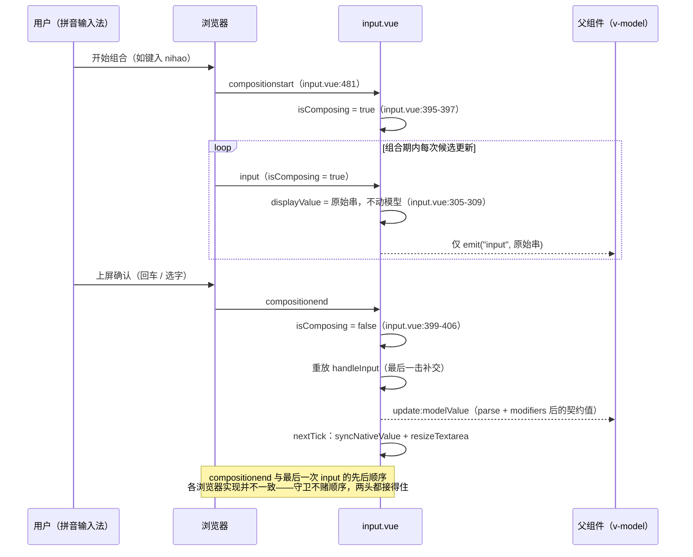

# 6-02 · Input：受控输入的工程化

> 核心问题：**597 行里藏着多少边界（IME / 组合输入 / 格式化）？** 一个"看起来什么都会"的组件，恰恰是全库边界条件密度最高的文件之一。

先校准一个数字。任务口径里的"597 行"，上上一篇 4-08 写的是"599 行"，而当前工作区 `wc -l` 的实测是 **598 行**——三处口径都不一样。这不是谁数错了，而是这类文章的固有宿命：源码在长，文章在追。本篇所有行号以当前实态为准（`packages/components/input/src/input.vue`，598 行），引用区间逐一核对过。

Input 值得单独一篇，是因为它被前两篇"欠"过账：4-04《受控/非受控双模的现状与考古》拿它做了机制判断的标本，结论是"纯受控 + 副作用 emit 链"，`displayValue` 只是显示缓存而非状态源；4-08《表单联动与全局配置链》拆过它消费 form-item 的三条管道（size 级联、disabled 转发、校验态上屏）。两条线都已讲完，本篇不再重复——4-04 里当主角的 `emitModelValue`（`input.vue:286-299`）这里一笔带过，这次展开的是那些机制判断盖不住的**具体边界**：中文输入法的组合期、formatter 与 parser 的双向管道、清除与密码切换的保焦语义、maxlength 的"防用户不防程序"、原生属性的透传白名单。换句话说：4-04 讲的是"这套受控骨架为什么长这样"，本篇讲的是"骨架的每一根肋骨上挂了多少防御工事"。

## 一、先看地图：598 行的四段连续实码

Input 的 script（432 行）加模板（余下 165 行）结构并不复杂，复杂的是密度。我们分四大段把主体源码连续读完，每段配一段解说。第一段是受控骨架的"地基"：props 全集、事件面、注入链、十一个 ref 与十几个派生值。

```ts
// packages/components/input/src/input.vue:28-131
type InputValue = string | number;
type NativeInputElement = HTMLInputElement | HTMLTextAreaElement;

const props = withDefaults(defineProps<InputProps>(), {
  id: undefined,
  size: undefined,
  disabled: false,
  modelValue: "",
  modelModifiers: () => ({}),
  maxlength: undefined,
  minlength: undefined,
  type: "text",
  resize: "vertical",
  autosize: false,
  autocomplete: "off",
  formatter: undefined,
  parser: undefined,
  placeholder: "",
  form: undefined,
  readonly: false,
  clearable: false,
  clearIcon: DEFAULT_CLEAR_ICON,
  showPassword: false,
  showWordLimit: false,
  wordLimitPosition: "inside",
  suffixIcon: "",
  prefixIcon: "",
  containerRole: undefined,
  tabindex: undefined,
  validateEvent: true,
  inputStyle: "",
  autofocus: false,
  rows: 2,
  ariaLabel: undefined,
  inputmode: undefined,
  name: undefined
});

const emit = defineEmits<{
  "update:modelValue": [value: InputValue];
  input: [value: InputValue];
  change: [value: InputValue];
  clear: [];
  focus: [event: FocusEvent];
  blur: [event: FocusEvent];
}>();

const attrs = useAttrs();
const slots = useSlots();
const formItem = inject(formItemKey, null);
const form = inject(formKey, null);
const nsInput = useNamespace("input");
const nsTextarea = useNamespace("textarea");
const { size: globalSize } = useConfig();

const inputRef = shallowRef<HTMLInputElement | null>(null);
const textareaRef = shallowRef<HTMLTextAreaElement | null>(null);
const wrapperRef = ref<HTMLDivElement | null>(null);
const isFocused = ref(false);
const hovering = ref(false);
const passwordVisible = ref(false);
const isComposing = ref(false);
const textareaCalcStyle = ref<CSSProperties>({});
const displayValue = ref("");

const mergedSize = computed(() => props.size ?? form?.props.size ?? globalSize.value);
const isTextarea = computed(() => props.type === "textarea");
const inputDisabled = computed(() => props.disabled || (formItem?.disabled.value ?? false));
const hasPrefix = computed(() => Boolean(slots.prefix) || Boolean(props.prefixIcon));
const hasSuffix = computed(() => Boolean(slots.suffix) || Boolean(props.suffixIcon));
const hasPrepend = computed(() => Boolean(slots.prepend));
const hasAppend = computed(() => Boolean(slots.append));
const hasValue = computed(() => displayValue.value.length > 0);
const inputId = computed(() => props.id ?? formItem?.inputId);
const messageId = computed(() => (formItem?.message.value ? formItem.messageId : undefined));
const validateState = computed(() => formItem?.validateState.value ?? "idle");
const nativeValue = computed(() => (props.modelValue == null ? "" : String(props.modelValue)));

function formatDisplayValue(value: string) {
  return props.formatter ? props.formatter(value) : value;
}

watch(
  () => props.modelValue,
  () => {
    displayValue.value = formatDisplayValue(nativeValue.value);
    nextTick(() => {
      syncNativeValue();
      resizeTextarea();
    });
  },
  {
    immediate: true
  }
);

const showClear = computed(
  () =>
    props.clearable &&
    !inputDisabled.value &&
    !props.readonly &&
    hasValue.value &&
    (hovering.value || isFocused.value)
);
```

这一段里值得停一停的是三个派生值的**身份差异**：

- `nativeValue`（`:104`）是**模型值的字符串化**——`props.modelValue == null ? "" : String(props.modelValue)`。它代表"契约上这个输入框应该是什么"。
- `displayValue`（`:91`）是**最终显示串**——有 formatter 时是 `formatter(nativeValue)`，没有时与 `nativeValue` 相等。它代表"用户眼睛看到的这一帧"。
- `hasValue`（`:100`）偏偏基于 `displayValue` 而不是 `nativeValue`——"框里有没有字"是显示层的判断，清除按钮显不显示看的是它。

三个值，三个语义层：契约值、显示值、可交互性。`modelValue` 允许传 `null`（类型定义里是 `string | number | null | undefined`，见 `input.ts:32`），被 `nativeValue` 兜成空串——这是"输入框没有空状态问题"的第一道防线。

第二段是**交互派生与写路径的预处理层**：清除、密码、字数统计的显示条件，容器 class 的拼装，透传属性的裁剪，modifiers 与 parser 的应用函数，以及后面反复出场的 `syncNativeValue`。

```ts
// packages/components/input/src/input.vue:133-236
const showPasswordVisible = computed(
  () =>
    !isTextarea.value &&
    props.showPassword &&
    !inputDisabled.value &&
    !props.readonly &&
    hasValue.value
);

const isWordLimitVisible = computed(
  () =>
    props.showWordLimit &&
    !props.showPassword &&
    !inputDisabled.value &&
    !props.readonly &&
    props.maxlength !== undefined &&
    props.maxlength !== null
);

const textLength = computed(() => nativeValue.value.length);
const inputExceed = computed(
  () => isWordLimitVisible.value && textLength.value > Number(props.maxlength)
);

const suffixVisible = computed(
  () => hasSuffix.value || showClear.value || showPasswordVisible.value || isWordLimitVisible.value
);

const containerKls = computed(() => [
  isTextarea.value ? nsTextarea.base.value : nsInput.base.value,
  `${(isTextarea.value ? nsTextarea : nsInput).base.value}--${mergedSize.value}`,
  validateState.value === "error" ? "is-error" : "",
  validateState.value === "success" ? "is-success" : "",
  inputDisabled.value ? "is-disabled" : "",
  isFocused.value ? "is-focus" : "",
  inputExceed.value ? "is-exceed" : "",
  hasPrefix.value ? "has-prefix" : "",
  suffixVisible.value ? "has-suffix" : "",
  hasPrepend.value ? "has-prepend" : "",
  hasAppend.value ? "has-append" : "",
  attrs.class
]);

const containerStyle = computed<StyleValue>(() => [attrs.style as StyleValue]);

const wrapperKls = computed(() => [`${nsInput.base.value}__wrapper`]);

const nativeAttrs = computed<Record<string, unknown>>(() => {
  const { class: _class, style: _style, ...rest } = attrs;
  return rest;
});

const currentInputType = computed(() => {
  if (isTextarea.value) {
    return undefined;
  }

  if (props.showPassword) {
    return passwordVisible.value ? "text" : "password";
  }

  return props.type;
});

const inputElementStyle = computed<StyleValue>(() => props.inputStyle);

const textareaStyle = computed<StyleValue>(() => [
  props.inputStyle,
  textareaCalcStyle.value,
  {
    resize: props.autosize ? "none" : props.resize
  }
]);

function applyModelModifiers(value: string): InputValue {
  let nextValue = value;

  if (props.modelModifiers.trim) {
    nextValue = nextValue.trim();
  }

  if (props.modelModifiers.number && nextValue !== "") {
    const parsed = Number(nextValue);
    return Number.isNaN(parsed) ? nextValue : parsed;
  }

  return nextValue;
}

function parseValue(value: string) {
  return props.parser ? props.parser(value) : value;
}

function syncNativeValue() {
  const value = displayValue.value;

  if (inputRef.value && inputRef.value.value !== value) {
    inputRef.value.value = value;
  }

  if (textareaRef.value && textareaRef.value.value !== value) {
    textareaRef.value.value = value;
  }
}
```

第三段是**真正的心脏**：textarea 的自适应高度算法，`emitModelValue`（4-04 的主角，动作序列此处不重复），以及三条写路径分支齐备的 `handleInput`。

```ts
// packages/components/input/src/input.vue:238-328
function resizeTextarea() {
  if (!isTextarea.value || !textareaRef.value) {
    return;
  }

  const textarea = textareaRef.value;

  if (!props.autosize) {
    textareaCalcStyle.value = {};
    return;
  }

  textarea.style.height = "auto";

  const style = window.getComputedStyle(textarea);
  const lineHeight = Number.parseFloat(style.lineHeight) || 22;
  const paddingTop = Number.parseFloat(style.paddingTop) || 0;
  const paddingBottom = Number.parseFloat(style.paddingBottom) || 0;
  const borderTop = Number.parseFloat(style.borderTopWidth) || 0;
  const borderBottom = Number.parseFloat(style.borderBottomWidth) || 0;
  const verticalExtras = paddingTop + paddingBottom + borderTop + borderBottom;

  let height = textarea.scrollHeight;
  let overflowY: CSSProperties["overflowY"] = "hidden";

  if (typeof props.autosize === "object") {
    const { minRows, maxRows } = props.autosize as Exclude<InputAutoSize, boolean>;

    if (minRows) {
      height = Math.max(height, minRows * lineHeight + verticalExtras);
    }

    if (maxRows) {
      const maxHeight = maxRows * lineHeight + verticalExtras;

      if (height > maxHeight) {
        height = maxHeight;
        overflowY = "auto";
      }
    }
  }

  textareaCalcStyle.value = {
    height: `${height}px`,
    overflowY
  };
}

function emitModelValue(value: string, source: "input" | "change") {
  const parsed = parseValue(value);
  const modelValue = applyModelModifiers(parsed);

  emit("update:modelValue", modelValue);

  if (source === "input") {
    emit("input", modelValue);
  } else {
    emit("change", modelValue);
  }

  return modelValue;
}

function handleInput(event: Event) {
  const target = event.target as NativeInputElement;
  const rawValue = target.value;

  if (isComposing.value) {
    displayValue.value = rawValue;
    emit("input", rawValue);
    return;
  }

  if (props.modelModifiers.lazy) {
    displayValue.value = props.formatter ? formatDisplayValue(parseValue(rawValue)) : rawValue;
    syncNativeValue();
    resizeTextarea();
    emit("input", applyModelModifiers(parseValue(rawValue)));
    return;
  }

  const modelValue = emitModelValue(rawValue, "input");
  displayValue.value = props.formatter
    ? formatDisplayValue(String(modelValue))
    : String(modelValue);

  nextTick(() => {
    syncNativeValue();
    resizeTextarea();
  });
}
```

`handleInput` 的三分支就是本篇的目录：组合输入守卫（`:305-309`）、lazy 修饰符（`:311-317`）、常规管道（`:319-327`）。第二节拆第一支，第三节拆后两支。

第四段收尾：change 语义、clear、焦点双雄、组合事件处理器、type 切换兜底与 expose。

```ts
// packages/components/input/src/input.vue:330-432
async function handleChange(event: Event) {
  const value = (event.target as NativeInputElement).value;
  const modelValue = props.modelModifiers.lazy
    ? emitModelValue(value, "change")
    : applyModelModifiers(parseValue(value));

  if (!props.modelModifiers.lazy) {
    emit("change", modelValue);
  }

  if (props.validateEvent) {
    await formItem?.validate("change");
  }
}

function clear() {
  displayValue.value = "";
  emit("update:modelValue", "");
  emit("clear");
  emit("input", "");
  formItem?.clearValidate();

  nextTick(() => {
    syncNativeValue();
    resizeTextarea();
    inputRef.value?.focus();
  });
}

function handleFocus(event: FocusEvent) {
  isFocused.value = true;
  emit("focus", event);
}

async function handleBlur(event: FocusEvent) {
  isFocused.value = false;
  emit("blur", event);

  if (props.validateEvent) {
    await formItem?.validate("blur");
  }
}

function togglePasswordVisible() {
  passwordVisible.value = !passwordVisible.value;
  nextTick(() => {
    inputRef.value?.focus();
  });
}

function focus() {
  inputRef.value?.focus();
  textareaRef.value?.focus();
}

function blur() {
  inputRef.value?.blur();
  textareaRef.value?.blur();
}

function select() {
  inputRef.value?.select();
  textareaRef.value?.select();
}

function handleCompositionStart() {
  isComposing.value = true;
}

function handleCompositionEnd(event: CompositionEvent) {
  if (!isComposing.value) {
    return;
  }

  isComposing.value = false;
  handleInput(event as unknown as Event);
}

watch(
  () => props.type,
  () => {
    nextTick(() => {
      syncNativeValue();
      resizeTextarea();
    });
  }
);

onMounted(() => {
  syncNativeValue();
  resizeTextarea();
});

defineExpose({
  ref: computed(() => inputRef.value ?? textareaRef.value),
  input: inputRef,
  textarea: textareaRef,
  focus,
  blur,
  select,
  clear
});
</script>
```

地图画完。接下来按"藏得最深"到"最表面"的顺序，逐个拆边界。

## 二、IME 组合输入守卫：12 行里最值钱的 if

全库 72 个组件里，只有两个文件的源码出现了 `composition` 关键字：`input.vue` 和 `input-tag.vue`。而输入框恰恰是唯一**必然**遭遇中文输入法的组件——对中文用户来说，"守卫组合输入"不是加分项，是及格线。

先看问题有多真实。拼音输入期间，每一次候选更新都会触发原生 `input` 事件，此时 `target.value` 是 `"ni"`、`"nihao"` 这样的**中间产物**。如果没有守卫，每敲一个字母 `update:modelValue` 就发一次：搜索联想框对着拼音发请求、字数统计疯跳、async-validator 对着 `"nihao"` 报"长度不足"——模型被击键流污染。

Input 的防御由三块拼成：**状态** `isComposing`（`:89`）、**守卫分支**（`:305-309`）、**事件处理器对**（`:395-406`），模板在 input 与 textarea 两处原生元素上挂接（`:481-482`、`:566-567`）。整条链的时序如下：



这张图的重心在"不赌顺序"四个字上。各浏览器对"组合结束时，`compositionend` 与最后一次 `input` 谁先派发"的实现并不一致——这也是 Vue 自家 `v-model` 指令要在原生 input 监听里检查 `event.target.composing`、并在 `compositionend` 里补发一次合成 input 的原因。本组件没有用 `v-model` 指令（它自己管 `:value` 绑定与同步），所以 Vue 那套策略要在组件层重新落地，落点就是 `:399-406`：

```ts
function handleCompositionEnd(event: CompositionEvent) {
  if (!isComposing.value) {
    return;
  }

  isComposing.value = false;
  handleInput(event as unknown as Event);
}
```

无论浏览器把"最后一击"派发在 `compositionend` 之前还是之后，两种到达顺序都被接住：若最后一次 input 先到，它被 `:305-309` 拦下只更新显示；`compositionend` 到达时复位 flag 并**主动重放** `handleInput`，补上提交。若浏览器在 `compositionend` 之后还补发一次普通 input，此时 `isComposing` 已复位，它走 `:319` 的常规路径**再提交一次**——值相同，天然幂等。不丢提交，最坏是重复提交一次等值事件。

两个顺手的细节。其一，重放处的 `event as unknown as Event` 是一次类型体操：`CompositionEvent.target` 就是那个原生输入框，`handleInput` 只取 `target.value`，双重断言只是给 TS 一个交代，运行时零成本。其二，`handleCompositionStart` 只置位、不 emit 任何事件——组合开始这件事本身对父组件不可见，组件也没有把 `compositionstart` / `compositionend` 转发为组件事件（事件面 `:66-73` 里没有它们），这是与 Element Plus 的又一差异，后文对比。

**权衡一：守卫挡 `update:modelValue`，但不挡 `input` 事件。** 看 `:305-309` 的守卫分支：

```ts
if (isComposing.value) {
  displayValue.value = rawValue;
  emit("input", rawValue);
  return;
}
```

它仍然 emit 了 `input`，且 payload 是**未过 parser、未套 modifiers 的原始串**。这是刻意的：`input` 事件被定位为"原始击键流"——实时联想、打字指示器这类消费方需要看到拼音中间态；而 `update:modelValue` 才是"契约值"，只在组合结束后提交。代价也随之而来：**同一个 `input` 事件，组合期 payload 是原始串，组合结束后 payload 是 parse + modifiers 的产物，形状不一致**。消费方如果对 `@input` 的值做严格类型假设，需要自己意识到这条缝。这是 598 行里我认为最值得写进 code review 备注的一条毛边。

**EP 对比**：Element Plus 把这套逻辑抽成了公共 hook `useComposition`（供 input 与数字类输入组件共享），其 `handleInput` 在 `isComposing` 时**直接短路，什么事件都不发**。本库的做法相反：内联在 input.vue 一份，`input-tag.vue` 又复制了一份（`isComposing` ref 在 `input-tag.vue:71`，处理器在 `:307-315`，模板挂接在 `:626-627`），而 `input-number` 则**完全没有组合守卫**——数字输入框恰恰是 IME 高发场景（中文输入法下键入数字同样会经过组合期）。三处分布是"守卫该不该上提到 `xiaoye-primitives`"的现成实证：两份复制加一份缺失，正是 EP 用 hook 解掉的问题，本库还没解。

还有一处文档缺口：`apps/docs/components/input.md` 全文没有出现 composition、输入法或 IME 的任何字样。守卫是行为契约，不写进文档，消费方只能靠猜。

## 三、formatter / parser：双向管道与"原生 value 谁说了算"

formatter 常被理解成"显示的时候加个格式"，但在受控组件里它是**双向管道**：读方向（外部 → 显示）与写方向（显示 → 外部）各走各的净化流程，交汇点是 `displayValue`。

```mermaid
flowchart LR
    subgraph READ["读方向：外部 → 显示（input.vue:110-122）"]
        A["props.modelValue"] --> B["nativeValue<br/>String(modelValue)：104"]
        B --> C["formatDisplayValue<br/>formatter(nativeValue)：106-108"]
        C --> D["displayValue：91"]
        D --> E["nextTick 后 syncNativeValue<br/>强制写 DOM：226-236"]
    end
    subgraph WRITE["写方向：显示 → 外部（input.vue:301-328）"]
        F["DOM 原始串 rawValue"] --> G["parseValue<br/>parser：222-224"]
        G --> H["applyModelModifiers<br/>trim / number：207-220"]
        H --> I["emit update:modelValue + input<br/>emitModelValue：286-299"]
        I --> J["displayValue = formatter(String(modelValue))：320-322"]
    end
    E -. "用户敲键" .-> F
    P["父组件回写 modelValue"] -.-> A
```



读方向由 `:110-122` 的 `watch(modelValue, ..., { immediate: true })` 驱动：模型一变（或挂载时），`displayValue` 立即取 `formatter(nativeValue)`。写方向由 `handleInput` 的常规分支驱动：DOM 原始串先 `parser` 反解析、再套 modifiers、emit 出去，**然后用 emit 的返回值重算显示**——`emitModelValue` 返回 `modelValue`（`:298`），`:320-322` 拿它喂给 formatter。注意这里显示串的原料是**归一化后的模型值**，不是用户敲的原始串：敲 `"1,000,000"`，模型变 `"1000000"`，显示重算为 `"1,000,000"`。测试把这个闭环钉得很死（`input.spec.ts:150-166`）：挂载后 `input.value === "10,000"`（immediate watch 的读方向产物），`setValue("1,000,000")` 后 `update:modelValue[0] === ["1000000"]`（写方向的 parse 产物）。

于是那个老问题有了明确答案：**native input 的 value 谁说了算？** 模板上 `:value="displayValue"`（`:462`，textarea 在 `:547`），声明式绑定说"displayValue 说了算"；但组件并不把"说了算"托付给渲染器的 value-patch 时机——每条写路径的 `nextTick` 里都有 `syncNativeValue`（`:226-236`）强制执法：`el.value !== value` 才写，幂等且廉价。它兜住的是几类渲染器帮不上忙的场景：

- **父组件在 `@input` 里改写值**：比如超长截断，父组件回写短值，DOM 里用户刚敲的长串必须在下一帧被刷掉；
- **type 切换导致 DOM 重建**：text ↔ password 切的是属性，但 text ↔ textarea 是元素替换，新元素的 value 必须手动灌——`:408-416` 的 `watch(type)` 与 `:418-421` 的 `onMounted` 双保险都调了 `syncNativeValue`；
- **lazy 分支的显示同步**（`:313`）：模型不动，但显示要跟上 formatter；
- **管道往返后的显示修正**：formatter 场景下"用户敲的串"与"归一化后的串"几乎总是不同。

**权衡二：不构造环，而不是在环上打补丁。** formatter 组件有个经典死循环风险：input 事件 → emit → 父组件回写 → watch → 改 DOM → 又触发 input 事件。Element Plus 为此专门打过补丁（其仓库 issue #9479）：在 `handleInput` 里加一道 `value === nativeInputValue.value` 的短路，发现"这次 input 的值和模型该显示的值一样"就放弃。本库的 `handleInput` 里没有这道短路——因为架构上**没有环**：写路径只做 emit 和更新本地缓存 `displayValue`，读路径（watch）只把模型投喂给显示，两个方向都不会反向触发对方的事件。EP 的短路是给一个存在的环打补丁，本库是从拓扑上不画那条回边。这是"纯受控 + 显示缓存"架构的隐性红利，4-04 讲机制时没有点透，这里算补一篇注脚。

**lazy 分支的微妙之处**在 `:311-317`：模型不同步，但显示行为分两种。有 formatter 时，`displayValue` 仍然实时走 `formatDisplayValue(parseValue(rawValue))`——**lazy 模式下 formatter 照样整形显示**，只是契约值按住不发；没有 formatter 时保持 raw 原样，一个字符都不动。同一条 lazy 分支，两种姿态，取决于管道是否存在。

**modifiers 的显示副作用**是最容易被误报为 bug 的行为。`number` 模式下敲 `"0123"`：`applyModelModifiers` 把它转成数字 `123`（`:214-217`），`:320-322` 用 `String(modelValue)` 重算显示——下一帧输入框里前导零消失了，变成 `"123"`。`trim` 模式同理：敲两端带空格的串，下一帧空格被吃掉，因为显示串镜像的是**已 trim 的模型值**。这不是缺陷，是"显示值即模型值的镜像"策略的直接代价；想要"显示归显示、提交归提交"，答案是有 formatter 走 formatter，或者用 lazy 把提交时点推到 change。

顺带把 change 的语义钉死（`:330-343`）：非 lazy 时，`change` 只补发一个从 **DOM 当前值**重新 parse + modifiers 得到的 payload，不再发 `update:modelValue`（输入时已发过）；lazy 时，`emitModelValue(value, "change")` 让 `update:modelValue` 与 `change` 一起在失焦/回车时补交。两条路径的 payload 都来自 DOM 值的重新归一化——有 formatter 时 DOM 里是 `"1,000,000"`，change 拿到的仍是 `"1000000"`，契约一致。

管道还有三条沉默的适用边界，文档同样没有记录。第一，**formatter 的替换不会触发重算**：`:110-122` 的 watch 只依赖 `modelValue`，运行时换一个 formatter 函数，已渲染的 `displayValue` 会停在旧格式上，直到模型值下一次变化——"格式是静态配置"这个假设被硬编码进了依赖收集。第二，**formatter 只管显示、不管合法**：管道对返回值不做任何校验，formatter 返回带非法字符的串也会照单显示，格式合法性要交给 form 的 rules 层（6-17 的地界）——管道与校验的职责在架构上就是切开的。第三，**formatter 的入参恒为字符串**：读方向 `nativeValue` 已经 `String()` 化（`:104`），写方向传给 `formatDisplayValue` 的也是 `String(modelValue)`（`:320-322`），所以即便 `number` 修饰符让模型变成了数字类型，formatter 收到的永远是字符串——`formatter: (v: number) => ...` 这样的签名在类型层就会被拒绝（`input.ts:40` 的入参类型是 `string`），三条边界里只有这条有类型关门人。

## 四、clearable 与 show-password：保焦是一次交互契约

后置区（suffix）里住着三个功能件，模板 `:489-532` 一段看全：

```html
<!-- packages/components/input/src/input.vue:489-532 -->
<span v-if="suffixVisible" class="xy-input__suffix">
  <template v-if="$slots.suffix">
    <slot name="suffix" />
  </template>
  <XyIcon
    v-if="props.suffixIcon"
    class="xy-input__icon"
    :icon="props.suffixIcon"
    :size="16"
  />
  <button
    v-if="showClear"
    class="xy-input__icon-button xy-input__clear"
    type="button"
    aria-label="clear"
    @mousedown.prevent
    @click="clear"
  >
    <XyIcon :icon="props.clearIcon" :size="16" />
  </button>
  <button
    v-if="showPasswordVisible"
    class="xy-input__icon-button xy-input__password"
    type="button"
    :aria-label="passwordVisible ? 'hide password' : 'show password'"
    @mousedown.prevent
    @click="togglePasswordVisible"
  >
    <slot name="password-icon" :visible="passwordVisible">
      <XyIcon
        :icon="
          passwordVisible ? DEFAULT_PASSWORD_HIDDEN_ICON : DEFAULT_PASSWORD_VISIBLE_ICON
        "
        :size="16"
      />
    </slot>
  </button>
  <span
    v-if="isWordLimitVisible"
    :class="['xy-input__count', props.wordLimitPosition === 'outside' ? 'is-outside' : '']"
  >
    <span class="xy-input__count-inner">{{ textLength }} / {{ props.maxlength }}</span>
  </span>
</span>
```

清除按钮的显示条件是**五重与**（`:124-131`）：`clearable` 且未禁用、非 readonly、`hasValue`（显示层有字）、且鼠标悬停**或**聚焦。最后一项是用户体验的保守解：只在"用户正看着这个框"的时候出现，避免满屏叉。

真正值得写的边界是 `@mousedown.prevent`（`:504`、`:514`）。清空按钮被点下的瞬间，原生 mousedown 的默认行为是把焦点从输入框抢走，随即触发 blur——如果这个输入框挂在表单里、blur 触发校验（4-08 拆过的 `handleBlur` → `formItem.validate("blur")` 一线，`input.vue:364-371`），错误消息会在"点一下清空"的过程中闪现一次。`.prevent` 把这半次失焦掐死，让"点击清除"在焦点语义上等于"什么都没发生"。密码切换按钮同款处理，`togglePasswordVisible`（`:373-378`）切换后在 `nextTick` 里把焦点还回去。

`clear()`（`:345-357`）的动作序列是四连发加两条尾巴：置空 `displayValue`、`update:modelValue("")`、`clear`、`input("")`，然后 `formItem?.clearValidate()`（顺手把校验错误也擦了），最后 `nextTick` 里同步 DOM、重算高度、**焦点回收**。注意两个细节：其一，clear **绕过了 parser 与 modifiers**，直接 emit 空串——对 `number` 修饰符字段这是安全的（`applyModelModifiers` 对空串有 `!== ""` 守卫，`:214`），但也意味着 clear 的语义是"清空显示与模型"，不走任何管道，是写路径家族里的旁支；其二，它发 `input` 但不发 `change`——"程序化清空"不算用户确认，change 留给原生 change 事件链。与 EP 对照，本库这里还有一处差异：清空与显密按钮用的是**真 `<button type="button">` 元素并带 `aria-label`**（`aria-label="clear"`、显密按钮的 label 随状态切换），EP 的对应物是可点击的 icon 容器——键盘 Tab 焦点可达性上，`button` 是白捡的。

show-password 的显示条件同样五重（`:133-140`：非 textarea、开启、未禁用、非 readonly、有值），type 的实际取值由 `currentInputType`（`:185-195`）仲裁：textarea 恒为 undefined（走 textarea 元素），`showPassword` 开启时在 `text` / `password` 之间横跳，否则用 `props.type`。密码框与字数统计互斥（`isWordLimitVisible` 明确排除了 `showPassword`），后置区因此永远只有一个"功能件"在位，不会挤成一排。

测试把这两个交互态都钉住了（`input.spec.ts:64-95`）：

```ts
// packages/components/input/__tests__/input.spec.ts:64-95
it("支持 clearable 和 clear 事件", async () => {
  const wrapper = mount(XyInput, {
    props: {
      modelValue: "hello",
      clearable: true
    }
  });

  await wrapper.trigger("mouseenter");
  await wrapper.get(".xy-input__clear").trigger("click");

  expect(wrapper.emitted("update:modelValue")?.[0]).toEqual([""]);
  expect(wrapper.emitted("clear")).toHaveLength(1);
});

it("支持 showPassword 切换输入类型", async () => {
  const wrapper = mount(XyInput, {
    props: {
      modelValue: "secret",
      showPassword: true,
      type: "password"
    }
  });

  const input = wrapper.get("input");

  expect(input.attributes("type")).toBe("password");

  await wrapper.get(".xy-input__password").trigger("click");

  expect(input.attributes("type")).toBe("text");
});
```

第一个用例里 `trigger("mouseenter")` 不是仪式——不 hover，`showClear` 就是 false，`.xy-input__clear` 根本不存在。五重条件里的交互条件是真实参与逻辑的，测试必须把它喂进去。

## 五、maxlength 与字数统计：防用户，不防程序

字数统计的可见性条件（`:142-150`）本身就是一个边界清单：`showWordLimit` 开启、非密码模式、未禁用、非 readonly，且 `maxlength` **显式给出**——`undefined` 和 `null` 都不行。计数区域随后是 `{{ textLength }} / {{ props.maxlength }}`（`:530`）。

第一个边界藏在 `textLength` 的数据源里（`:152`）：`nativeValue.value.length`——**模型值的长度，不是显示串的长度**。配上 formatter 就会出现"显示 7 个字符、计数 4"的场面：显示串 `"¥ 1,000"`，模型串 `"1000"`。计数器数的是契约值，不是装饰值。这个选择站得住（字数限制约束的是提交的数据），但 formatter 用户第一次看到时会愣一下——文档同样没有解释。

第二个边界是 `maxlength` 的**双重身份**。它既参与计数逻辑，又被原样透传给原生元素（`:465`、`:550`）。而原生 `maxlength` 只约束键盘与粘贴路径——**程序赋值不受它管**：`el.value = "一段超长文本"` 浏览器不会截断。所以 `inputExceed`（`:153-155`）的真实触发场景从来不是"用户打字超了"（原生层已经物理拦住了），而是**外部把超长 `modelValue` 灌进来**：API 回填、反序列化、跨组件搬数据。`is-exceed` 是给"程序灌入超限"准备的灯，不是给打字准备的。

第三个边界是计数口径：JS 的 `String.prototype.length` 按 UTF-16 码元计数，DOM 的 maxlength 行为同理——一个 emoji 占 2。计数与浏览器行为一致，但与"用户数了 5 个字符"的直觉有出入。这是个全行业无解的老问题，Input 的选择是与原生对齐（一致大于直觉），可以接受，但同样没写进文档。

样式侧，`is-exceed` 与 `is-error` 是**语义分层**的两盏灯：

```css
/* packages/theme/src/components/input.css:160-173 */
.xy-input.is-error .xy-input__wrapper,
.xy-textarea.is-error .xy-textarea__wrapper {
  border-color: var(--xy-danger);
}

.xy-input.is-success .xy-input__wrapper,
.xy-textarea.is-success .xy-textarea__wrapper {
  border-color: var(--xy-success);
}

.xy-input.is-exceed .xy-input__count,
.xy-textarea.is-exceed .xy-input__count {
  color: var(--xy-danger);
}
```

超限只染计数数字的颜色，边框纹丝不动；动边框是 `is-error` 的特权，而那由 form 校验态驱动（4-08 引过这段样式的 160-168）。"超限是提示、错误是判定"的分层，在 CSS 的选择器权重里就能读出来。textarea 侧还有 `inside` / `outside` 两种计数位（`:526-531` 与 `:585-594` 两处模板，`input.css:143-147`、`:221-226` 两处定位），`outside` 把计数挪到容器下方右侧，避免与内容重叠。

顺带一提 textarea 的 autosize 算法（`:238-284`）：先把 `style.height` 置 `"auto"` 让内容撑开、读 `scrollHeight`，再按 `行数 × lineHeight + 垂直 padding/border` 收敛到 minRows/maxRows 区间，超上限时切 `overflow-y: auto`。测试（`input.spec.ts:97-125`）把 `scrollHeight` mock 成 120 后断言 `textarea.style.height === "94px"`——这个 94 的算式是 `4 行 × 22 + 6`：lineHeight 走 `Number.parseFloat("normal") || 22` 的兜底（jsdom 的 computed style 里 `line-height` 是 `normal`），6 来自 jsdom UA 默认样式里 textarea 的垂直 padding（2+2）与 border（1+1），我用 jsdom 实跑验证过。这个断言真正钉的是 maxRows 截断逻辑，而非精确布局值。

## 六、前后置 slot 与容器几何

前置区与组合区（prepend/append）走的是容器几何的路数。四个 slot 探测（`:96-99`）产出四个布尔，`containerKls`（`:161-174`）把它们翻译成 `has-prefix` / `has-suffix` / `has-prepend` / `has-append` 四个容器 class，CSS 拿后两个做圆角裁剪：

```css
/* packages/theme/src/components/input.css:124-132 */
.xy-input.has-prepend .xy-input__wrapper {
  border-top-left-radius: 0;
  border-bottom-left-radius: 0;
}

.xy-input.has-append .xy-input__wrapper {
  border-top-right-radius: 0;
  border-bottom-right-radius: 0;
}
```

"组合区拼在 wrapper 外侧、削掉 wrapper 对应侧的圆角"——`https://` + 输入框 + `.com` 的视觉连续性就是这两段规则 + `input.css:100-122` 的 prepend/append 底色完成的。模板侧，prepend/append 只存在于非 textarea 分支（`:441-444`、`:535-537`），textarea 的 wrapper 结构（`:540-596`）里根本没有这两个插槽位——多行文本没有"域名前缀"的语义，slot 面直接收缩。后置区的可见性由 `suffixVisible`（`:157-159`）汇总四种来源：自定义 suffix slot、suffixIcon、清除按钮、密码按钮、字数统计——任一在位，后置槽位就渲染，`has-suffix` 随之挂上。

这里恰好埋着本篇要报的第一处"无用地层"：**`has-prefix` 与 `has-suffix` 两个 class 目前没有任何 CSS 消费**。全仓检索只有两处生产点（`input.vue:169-170` 与 `input-tag.vue:115-116`），`packages/theme` 里没有对应选择器。前缀/后缀区的样式实际挂在 `.xy-input__prefix` / `.xy-input__suffix`（`input.css:69-76`）这两个内容元素自己的 class 上。这可以是"预留钩子"（将来要做前缀态样式时容器级开关已经就位），也可以就是历史遗留——但从工程叙事的角度，两处生产点成对出现（input 与 input-tag 同款复制）更说明这是"复制过来的地层"。

textarea 分支的核心，把组合事件与同步逻辑的挂接一起看全：

```html
<!-- packages/components/input/src/input.vue:542-572 -->
<textarea
  :id="inputId"
  ref="textareaRef"
  class="xy-textarea__inner"
  v-bind="nativeAttrs"
  :value="displayValue"
  :name="props.name"
  :minlength="props.minlength"
  :maxlength="props.maxlength"
  :disabled="inputDisabled"
  :readonly="props.readonly"
  :autocomplete="props.autocomplete"
  :tabindex="props.tabindex"
  :aria-label="props.ariaLabel"
  :aria-describedby="messageId"
  :aria-invalid="validateState === 'error'"
  :aria-required="formItem?.required.value"
  :placeholder="props.placeholder"
  :style="textareaStyle"
  :form="props.form"
  :autofocus="props.autofocus"
  :rows="props.rows"
  :role="props.containerRole"
  :inputmode="props.inputmode"
  @compositionstart="handleCompositionStart"
  @compositionend="handleCompositionEnd"
  @input="handleInput"
  @change="handleChange"
  @focus="handleFocus"
  @blur="handleBlur"
/>
```

注意 textarea 的事件面与 input 完全同构——组合守卫、写管道、校验触发在两种形态下行为一致，这是"一个组件管两种形态"必须付的对称性成本。CSS 侧还有一处容易漏看：`autosize` 激活时 `textareaStyle` 强制 `resize: none`（`:203`）——自动高度与用户手拉高度是对抗性需求，同时开会把 `textareaCalcStyle` 的计算结果在下一帧覆盖掉，代码里用一行 style 合并终结了这场拉锯。

## 七、原生属性透传：显式声明的代价与 attrs 兜底

第三处权衡在文件的第一行就写好了。`defineOptions({ inheritAttrs: false })`（`:2-4`）宣告：本组件自己决定 attrs 的去向。去向有两路：

一路是**裁剪后的整体透传**。`nativeAttrs`（`:180-183`）把 `class` 与 `style` 从 attrs 里剥掉，剩下的（`data-*`、`min`、`max`、`step`、事件监听器等未声明属性）整体 `v-bind` 到原生元素上（`:461`、`:546`）；被剥掉的 `class` 挂容器（`containerKls` 末位的 `attrs.class`，`:173`），`style` 走 `containerStyle`（`:176`）。单行输入框挂 `data-testid`、数字框塞 `min`/`step`，都靠这条路。

另一路是**显式 props 的手工绑定**。Vue 有一条常被忽略的规则：`defineProps` 声明过的 key 不会再出现在 attrs 里。于是每个"需要到达原生元素"的显式 prop 都必须在模板里逐个手绑——数一下 `:457-487` 的绑定清单：`id`、`name`、`minlength`、`maxlength`、`type`、`disabled`、`readonly`、`autocomplete`、`tabindex`、`aria-label`、`form`、`autofocus`、`role`、`inputmode`，31 行里绑定了 20 个属性加 6 个事件。**类型面与绑定面一一对应**：漏绑一个，这个 prop 就静默失效——它不会像未声明属性那样走 attrs 兜底，因为它"被声明了"。这套设计的账很清楚：白名单方案换来了可审计性（每个到达原生的属性都有明确出处、类型检查全程覆盖），代价是绑定清单长、新增 prop 要记得补绑定，而且这种遗漏测试很难覆盖（属性静默丢失不会报错，只有写针对用例才能逮住）。类型夹具把这层契约也钉了（`tests/types/fixtures/input.ts:40-59`）：

```ts
// tests/types/fixtures/input.ts:40-59
const invalidType: InputProps = {
  // @ts-expect-error invalid type should be rejected
  type: "editor"
};

void invalidType;

const invalidResize: InputProps = {
  // @ts-expect-error invalid resize should be rejected
  resize: "free"
};

void invalidResize;

const invalidWordLimitPosition: InputProps = {
  // @ts-expect-error invalid word limit position should be rejected
  wordLimitPosition: "left"
};

void invalidWordLimitPosition;
```

三个 `@ts-expect-error` 分别钉住 `type`、`resize`、`wordLimitPosition` 的字面量联合——"透传面"上每个需要约束的属性，类型层都有对应的关门人。

无障碍三件套也在这张清单里就位（`:472-474`）：`aria-describedby` 挂 form-item 的 `messageId`（错误消息与输入框的成对关联，4-08 讲过消息侧）、`aria-invalid` 随校验态切换、`aria-required` 读取 `formItem.required`。控件是"显示器"，form-item 是"信源"，aria 属性是最后一根线。

`autofocus` 的处理体现的是"透传而非实现"的克制（`:59`、`:478`、`:562`）：它只是原生 attribute 的转发，语义交给浏览器（现代浏览器对动态插入的元素也会响应 autofocus）。编程式的聚焦需求走另一条路——`defineExpose`（`:423-431`）暴露的 `focus()` / `blur()` / `select()` / `clear()`，文档示例 `apps/docs/examples/input/methods.vue` 演示的就是这套命令式接口。expose 里还有个精巧的小设计：`ref: computed(() => inputRef.value ?? textareaRef.value)`——一个**跟随形态切换的动态原生引用**，外部永远拿到"当前真正生效的那个 DOM 元素"，不用自己判断 `type` 是不是 textarea。

## 八、测试盘点与两处"无用地层"

`input.spec.ts` 共 11 个用例、230 行，全部通过（本篇动笔前实跑验证：11 passed）。4-08 已拆过校验时序（`:168-205`）与 size 级联（`:208-229`），本篇聚焦的输入边界用例是另外五个：v-model 基线（`:7-17`）、clearable（`:64-77`）、password（`:79-95`）、textarea autosize 与字数（`:97-125`），以及两个"提交时点"用例——lazy+trim 与 formatter/parser：

```ts
// packages/components/input/__tests__/input.spec.ts:127-166
it("支持 modelModifiers 和 lazy 更新", async () => {
  const wrapper = mount(XyInput, {
    props: {
      modelValue: "",
      modelModifiers: {
        trim: true,
        lazy: true
      }
    }
  });

  const input = wrapper.get("input");

  (input.element as HTMLInputElement).value = "  hello  ";
  await input.trigger("input");

  expect(wrapper.emitted("update:modelValue")).toBeUndefined();

  await input.trigger("change");

  expect(wrapper.emitted("update:modelValue")?.[0]).toEqual(["hello"]);
});

it("支持 formatter 和 parser", async () => {
  const wrapper = mount(XyInput, {
    props: {
      modelValue: "10000",
      formatter: (value) => value.replace(/\B(?=(\d{3})+(?!\d))/g, ","),
      parser: (value) => value.replace(/,/g, "")
    }
  });

  const input = wrapper.get("input");

  expect((input.element as HTMLInputElement).value).toBe("10,000");

  await input.setValue("1,000,000");

  expect(wrapper.emitted("update:modelValue")?.[0]).toEqual(["1000000"]);
});
```

这两条线在源码里是两套独立的"延迟提交"：lazy+trim 的提交时点由**修饰符声明**（`:311-317` 分支按住 input、`:330-334` 在 change 补交），IME 守卫的提交时点由**输入法状态机驱动**（`:305-309` 按住、compositionend 重放）。测试没有覆盖两者叠加的场景——lazy 模式下打拼音，组合期内 lazy 分支根本不会走到（守卫在它前面短路），组合结束后一次常规 input 又被 lazy 按住，最终在 change 提交。行为正确，但这条叠加路径没有任何用例钉着，属于"逻辑依赖巧合而非测试"的薄弱面。

formatter/parser 用例的前半段（挂载即 `"10,000"`）钉的是 immediate watch 的读方向，后半段（setValue 后模型是 `"1000000"`）钉的是写方向的 parse。文档示例 `apps/docs/examples/input/formatter-parser.vue` 用同一套正则演示了金额场景（`¥ 1,000` 显示、`1000` 契约），是这两条断言的"人类可读版"。

最后盘点本篇实测发现的两处**无用地层**，加上一处守卫分布问题，作为 598 行的"地下考古报告"：

1. **`wrapperRef`（`:85` 声明、`:446` 绑定）全仓无读取**。它被挂到 wrapper div 上，但 script 里没有任何逻辑读它——大概是给未来"点击容器聚焦"之类特性预留的锚点，目前是一根空钉子。
2. **`has-prefix` / `has-suffix` 两个容器 class 无 CSS 消费**（生产点 `input.vue:169-170`，消费点：零）。
3. **组合守卫三处分布失衡**：input.vue 内联一份、input-tag.vue 复制一份（`:71`、`:307-315`、`:626-627`）、input-number 一份都没有。EP 用公共 hook `useComposition` 解过同一道题，上提到 `xiaoye-primitives/src/composables` 是现成的去处。

这三处都不影响正确性，但它们解释了"597 行"的另一种读法：行数不只来自边界防御，也来自复制与预留——地层学和防御工事，在同一个文件里。

## 结尾：597 行里到底藏着什么

回到核心问题。598 行里藏着的边界，按防御对象数一遍：**输入法**（组合期击键流，12 行守卫 + 不赌顺序的重放）、**管道往返**（parser 归一化、modifiers 语义、formatter 回声环的拓扑规避）、**交互瞬间**（mousedown 保焦、清除后的焦点回收与校验清理）、**数据口径**（maxlength 防用户不防程序、计数基于契约值而非显示值、UTF-16 码元）、**属性边界**（显式声明的手工绑定义务、attrs 兜底、aria 关联）。而读路径与写路径从头到尾只有一句总纲：**displayValue 说了算，syncNativeValue 执法**。

工程化受控输入的全部难度，不在"把值存进 v-model"，而在于承认"用户敲的串、框里显示的串、模型里的串"是三个东西，然后为它们之间的每一次转换、每一条旁路、每一个时序错位点修上护栏。

下一篇 6-03《AutoComplete：三合一组合》，主角是 `packages/components/auto-complete` 的 419 行：一个直接内嵌 XyInput 的复合组件——输入控件（复用本篇的管道与守卫）、Teleport 出走的 listbox 浮层（role/listbox 与 option 关联）、异步请求的 loading 态，三件东西要在一个组件里咬合成一个整体。我们会看到：当 Input 的守卫与管道被另一个组件消费时，哪些设计红利被继承了，哪些边界又要在浮层侧重新修一遍。
