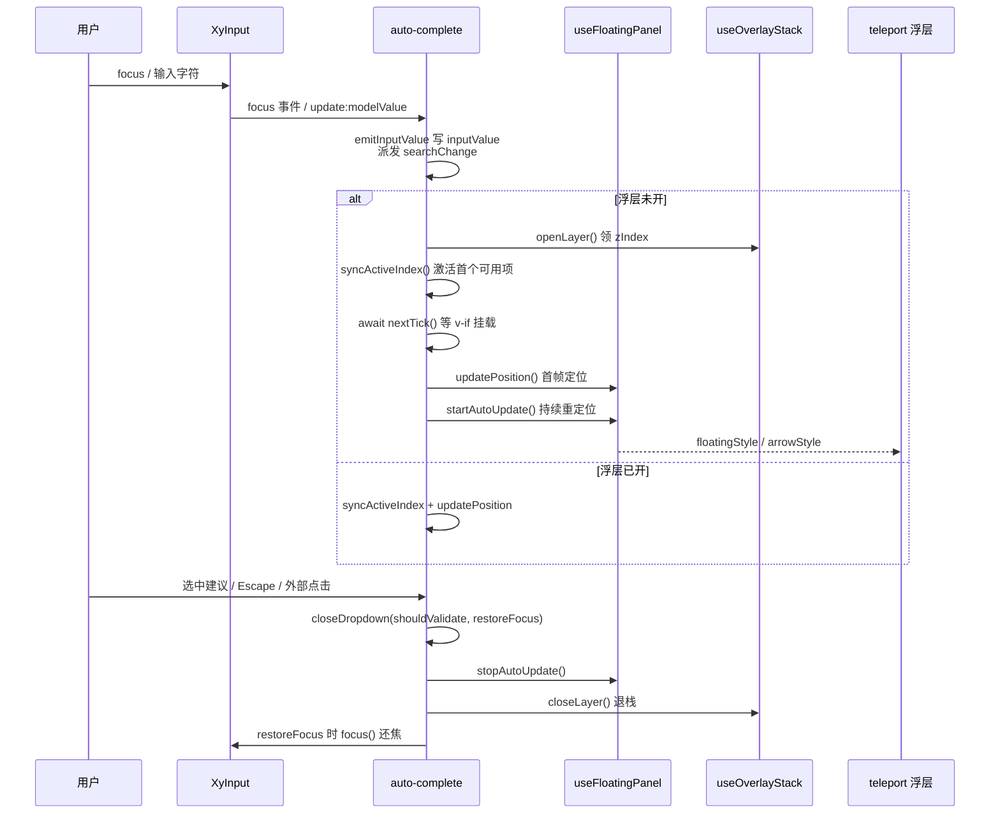
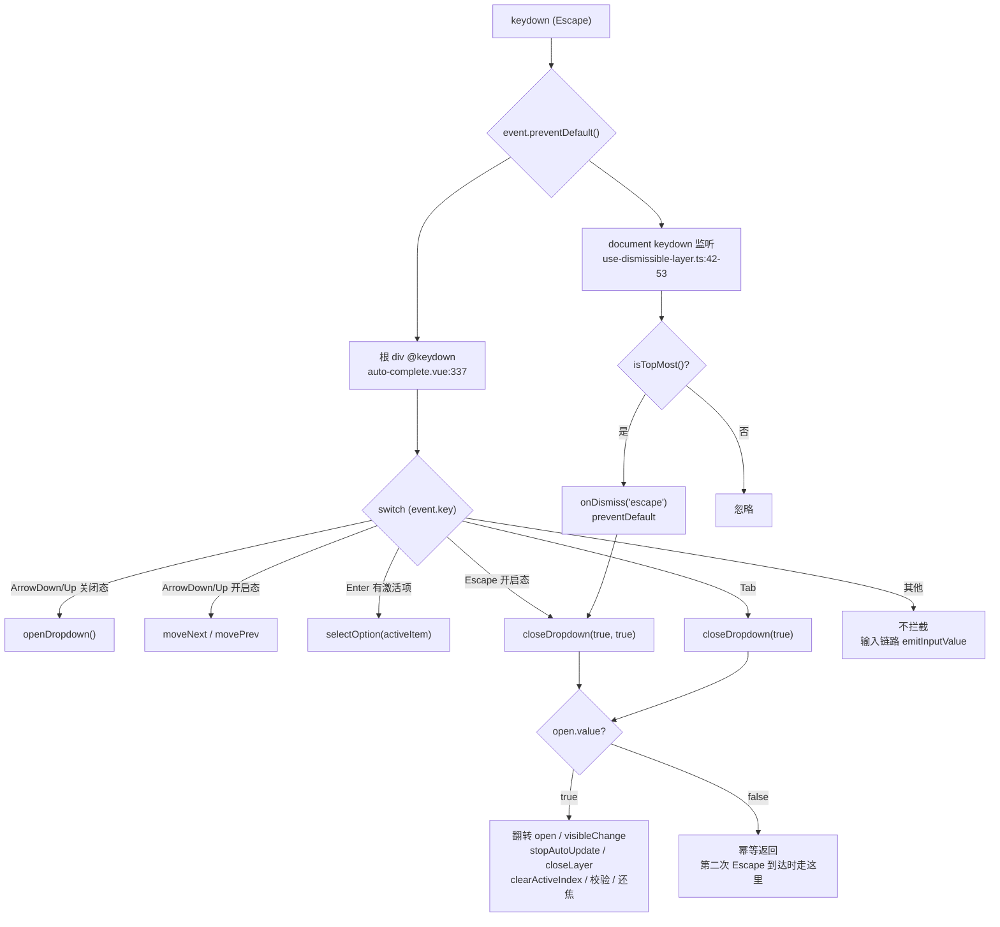

# 6-03 · AutoComplete：三合一组合

> 本篇是「表单组件」章节的第三篇，研究对象是 `auto-complete`——全仓库浮层消费密度最高的组件之一。它的难点不在泛型（4-10 已以 select 为样本讲透泛型全链路，auto-complete 的泛型轴也作为对照出现），而在**编排**：一个文本输入框、一层定位浮层、一套键盘导航，三个子系统要在一个组件里咬合成一台机器。输入框管"值从哪来"，浮层管"建议在哪显示、何时开关"，键盘管"用户不动鼠标时怎么选"。上一篇 6-02《Input：受控输入的工程化》拆了输入框本身，4-05/4-06 两篇拆了浮层体系的七件套，本篇把它们装配起来——看完你会得到一张"浮层七件套消费矩阵"，以及一份完整的键位表和 Escape 双通道路由图。所有路径与行号均在当前工作区逐一核对。

---

## 一、消费矩阵定论：七件套用了哪四件

先给结论。4-06 把浮层逻辑层概括为"七件套"：`useFloatingVisibility`（三态状态机）、`useOverlayStack`（全局栈与 z 序）、`useOverlayDialog`（模态遮罩）、`useFocusTrap`（焦点陷阱）、`useFloatingPanel`（定位）、`useDismissibleLayer`（关闭裁决）、`useListNavigation`（键盘导航）。auto-complete 的实际消费面是**四件**，外加两个外围件。先看它的导入段（`packages/components/auto-complete/src/auto-complete.vue:4-15`）：

```ts
import {
  useConfig,
  useDismissibleLayer,
  useFloatingPanel,
  useListNavigation,
  useNamespace,
  useOverlayStack
} from "xiaoye-primitives";
import XyInput from "../../input";
import { formItemKey, formKey } from "../../form/src/context";
import { XyLoadingIndicator, resolveLoadingVisualConfig } from "../../loading/src/shared";
import type { LoadingGlobalConfig } from "../../loading/src/types";
```

整理成矩阵：

| 七件套 | 是否消费 | 在 auto-complete 中的角色 |
| --- | --- | --- |
| `useFloatingVisibility` | **否** | 显隐由本地 `open` ref 手动驱动（`auto-complete.vue:78`） |
| `useOverlayStack` | 是 | 领 z 序、参与"最顶层"裁决（`auto-complete.vue:81`） |
| `useOverlayDialog` | 否 | 非模态下拉，没有遮罩语义 |
| `useFocusTrap` | 否 | 焦点始终留在输入框内，无需陷阱 |
| `useFloatingPanel` | 是 | 定位 + `matchTriggerWidth`（`auto-complete.vue:115-128`） |
| `useDismissibleLayer` | 是 | 外部点击与 Escape 裁决（`auto-complete.vue:309-318`） |
| `useListNavigation` | 是 | `loop: true` 的方向键导航（`auto-complete.vue:111-113`） |

外围件两件：`useConfig`（读全局 size 与 loading 配置，`auto-complete.vue:71-72`）和 `useNamespace`（BEM 类名）。此外它还跨组件消费了 loading 的共享件 `XyLoadingIndicator` 与 `resolveLoadingVisualConfig`——loading 态直接复用全局 loading 的视觉配置链，而不是自造 spinner。

为什么独独不用 `useFloatingVisibility`？这值得展开。dropdown/tooltip/popover/menu 四家都消费它（用 `rg useFloatingVisibility packages/components` 验证，命中恰好这四个），因为它们有"三态"诉求：`visible`（逻辑开关）、`rendered`（是否渲染）、`isAnimating`（动画中），外加 openDelay/closeDelay 延迟与 `persistent` 保活。auto-complete 没有 hover 触发、没有延迟开合、没有保活诉求，它的显隐就是一个单布尔——`open.value`。为单布尔引入三态状态机，是拿复杂度换不存在的需求。这是消费矩阵给的第一条设计判断：**七件套是工具箱不是清单，按需取用**。dropdown 的接线（`packages/components/dropdown/src/dropdown.vue:161-191`）正好做对照——它把 `useFloatingVisibility` 的 `onOpen/onClose` 当生命周期钩子用：

```ts
const { visible, rendered, open: openFloating, close: closeFloating, toggle, clearTimers, handleAfterLeave } =
  useFloatingVisibility({
    modelValue: () => props.modelValue,
    disabled: () => props.disabled,
    persistent: () => props.persistent,
    openDelay: () => props.showAfter ?? props.openDelay,
    closeDelay: () => props.hideAfter ?? props.closeDelay,
    isLeaveAnimating: () => readFloatingAnimationDuration(menuRef.value) > 0,
    emitModelValue: (value) => {
      emit("update:modelValue", value);
    },
    onOpen: () => {
      emit("visibleChange", true);
      openLayer();
    },
    onClose: () => {
      emit("visibleChange", false);
      stopAutoUpdate();
      closeLayer();
      navigation.clearActiveIndex();
      internalVirtualRef.value = null;

      if (restoreFocusAfterClose.value) {
        focusTrigger();
        restoreFocusAfterClose.value = false;
      }
    }
  });
```

auto-complete 没有这层包装，`openDropdown` / `closeDropdown` 自己就是生命周期钩子。下面的浮层编排链会看到，它把同样的四步（emit visibleChange → 开/关层 → 定位启停 → 导航索引清理）直接写进了这两个 async 函数。

---

## 二、内置 input：为什么是 import 而不是 slot

第一个编排问题是：输入框从哪来？Element Plus 的 `el-autocomplete` 允许整体换掉触发器（默认插槽塞一个自定义 input）。本库的答案是**内置 `XyInput`，不提供触发器插槽**——证据就是导入段的第 12 行 `import XyInput from "../../input"`，以及模板里的固定接线（`auto-complete.vue:339-363`）：

```vue
<div ref="triggerRef" class="xy-auto-complete__trigger">
  <xy-input
    :id="formItem?.inputId"
    ref="inputRef"
    :model-value="inputValue"
    :placeholder="props.placeholder"
    :disabled="mergedDisabled"
    :clearable="props.clearable"
    :size="mergedSize"
    :prefix-icon="props.prefixIcon"
    :suffix-icon="props.suffixIcon"
    :validate-event="false"
    :aria-label="props.placeholder"
    @update:model-value="emitInputValue(String($event ?? ''))"
    @focus="handleFocus"
    @clear="clearValue"
  >
    <template v-if="$slots.prefix" #prefix>
      <slot name="prefix" />
    </template>
    <template v-if="$slots.suffix" #suffix>
      <slot name="suffix" />
    </template>
  </xy-input>
</div>
```

这 25 行里有三个编排决策，逐个拆。

**决策一：`validate-event="false"` 掐掉内层校验。** 6-02 讲过，`XyInput` 在 change/blur 时会按 `validateEvent` 触发表单校验（`packages/components/input/src/input.vue:337-343` 的 `handleChange` 与 `360-369` 的 `handleFocus/handleBlur`，默认值 `input.vue:57` 为 `true`）。auto-complete 是"输入框 + 浮层"的复合控件，校验语义必须收口到自己手里：blur 校验在 `closeDropdown` 里触发，change 校验在 `selectOption`/`clearValue` 里触发。如果放任内层 input 也校验，一次用户操作会打出两份校验请求。所以 350 行的 `:validate-event="false"` 不是可有可无的道具，而是**校验权上收的开关**。这与 4-09《group 复合模式》的"属性下发与汇总收口"是同一思路：复合组件向内层组件下发表观属性，但把"副作用型属性"（校验）收归自己。

**决策二：值通道走单向双轨。** 内层 input 的 `model-value` 绑的是 `inputValue`（组件本地值，`auto-complete.vue:79`），而不是直接绑 `props.modelValue`；用户输入经 `emitInputValue` 写回本地并向上 emit。为什么多这一层？看值的三个来源：用户敲键盘、用户选中建议项（`selectOption` 会把 `option.label` 写入）、外部改 `modelValue`（`auto-complete.vue:292-297` 的 watch 同步回 `inputValue`）。三个来源都先落到 `inputValue` 这个"单点真相"，模板与过滤逻辑统一读它，避免了"props 直绑 + 内部改写"时 Vue 单向数据流的告警与回环。

**决策三：插槽只透 prefix/suffix，不透触发器。** `defineSlots`（`auto-complete.vue:59-65`）声明了五个插槽：`prefix`、`suffix`、`loading`、`empty`、`option`。前两个原样转发给内层 input，后三个属于浮层。**没有 default/trigger 插槽**——换掉触发器意味着换掉焦点宿主，而 `handleKeydown`、`inputRef.focus()`、`useDismissibleLayer` 的 `triggerRef` 全都锚定在这套内置结构上。EP 允许换触发器是因为它的键盘导航挂在 `el-input` 内部且事件体系跟着走；本库选择把触发器焊死，换取键盘与焦点链路的确定性。局限也是真实的：想用 textarea 或按钮触发建议列表的场景，这个组件覆盖不了。

顺带把类型层对齐看一眼。`AutoCompleteProps`（`packages/components/auto-complete/src/auto-complete.ts:21-41`）里 `modelValue` 是 `string` 而泛型 `T` 只流经 `options` 与 `select` 事件——4-10 第六节的定论，这里简要回指：**泛型管辖范围按数据流画**。输入框里的值天然是字符串，`T` 是建议项的值类型，两者不该强行统一：

```ts
export interface AutoCompleteProps<T = string | number> {
  modelValue?: string;
  options: AutoCompleteOption<T>[];
  placeholder?: string;
  disabled?: boolean;
  clearable?: boolean;
  remote?: boolean;
  loading?: boolean;
  loadingText?: string;
  size?: ComponentSize;
  prefixIcon?: string;
  suffixIcon?: string;
  teleported?: boolean;
  appendTo?: string | HTMLElement;
  placement?: Placement;
  offset?: number;
  popperClass?: string;
  popperStyle?: StyleValue;
  dropdownMinWidth?: string | number;
  dropdownMaxWidth?: string | number;
}
```

`AutoCompleteOption<T>`（`auto-complete.ts:5-7`）只是给 primitives 的 `SelectOption<T>` 追加一个可选 `disabled`，与 select 共享同一份最小选项协议。

---

## 三、浮层编排：一对镜像函数管开合

七件套取了四件，怎么接线？auto-complete 的答案是两个 async 函数——`openDropdown`（`auto-complete.vue:158-172`）与 `closeDropdown`（`174-194`）——它们几乎逐条互为镜像：

```ts
function syncActiveIndex() {
  if (!filteredOptions.value.length) {
    navigation.clearActiveIndex();
    return;
  }

  navigation.activateFirst();
}

async function openDropdown() {
  if (mergedDisabled.value || open.value) {
    return;
  }

  open.value = true;
  emit("visibleChange", true);
  emit("focus");
  openLayer();
  syncActiveIndex();

  await nextTick();
  await updatePosition();
  startAutoUpdate();
}

async function closeDropdown(shouldValidate = false, restoreFocus = false) {
  if (!open.value) {
    return;
  }

  open.value = false;
  emit("visibleChange", false);
  emit("blur");
  stopAutoUpdate();
  closeLayer();
  navigation.clearActiveIndex();

  if (restoreFocus) {
    await nextTick();
    inputRef.value?.focus();
  }

  if (shouldValidate) {
    await formItem?.validate("blur");
  }
}
```

开与关各五步，一一对应：`open.value` 翻转对应翻转、`visibleChange` 对应、`openLayer` 对应 `closeLayer`（全局浮层栈的进出）、`syncActiveIndex` 对应 `clearActiveIndex`（导航索引的建立与销毁）、`startAutoUpdate` 对应 `stopAutoUpdate`（floating-ui 的自动重定位启停）。两个幂等卫兵（开时查 `open.value`，关时也查）让这对函数可以被任意多路调用而不会重复记账——这一点在第四节的 Escape 双通道里会成为救命设计。

时序上有三处讲究：

其一，`await nextTick()` 之后才 `updatePosition()`。`open.value = true` 驱动模板里的 `v-if`（`auto-complete.vue:368`）渲染浮层 DOM，但 Vue 的 DOM 更新是异步的；`useFloatingPanel.updatePosition`（`use-floating-panel.ts:37-43`）开头就有 `if (!reference || !floating) return` 的卫兵，浮层 DOM 没挂出来时 `dropdownRef.value` 是 null，直接算会空转。所以 nextTick 不是仪式感，是给 floating-ui 等一个真实节点。

其二，定位与自动更新分两步。`updatePosition` 算一次首帧位置，`startAutoUpdate`（`use-floating-panel.ts:126-146`）再启动 `autoUpdate` 持续监听滚动/缩放。先算后听，保证浮层出现的瞬间位置正确，不等 autoUpdate 的第一次回调。

其三，宽度对齐是 middleware 做的。`matchTriggerWidth: true`（`auto-complete.vue:126`）让 `useFloatingPanel` 注入 floating-ui 的 `size` middleware（`use-floating-panel.ts:60-68`）：

```ts
if (toValue(options.matchTriggerWidth)) {
  middleware.push(
    floatingSize({
      apply({ rects, elements }) {
        elements.floating.style.width = `${rects.reference.width}px`;
      }
    })
  );
}
```

面板宽度直接写成触发器宽度。业务想打破这个对齐时，`dropdownMinWidth` / `dropdownMaxWidth` 两个 prop 通过 `dropdownStyle`（`auto-complete.vue:138-147`）在 floatingStyle 之上追加 `min-width` / `max-width`——`apply` 写的是 `width`，min/max 能约束住它，这就是 popper-class 示例里 `:dropdown-min-width="280"` 能生效的机制（`apps/docs/examples/auto-complete/popper-class.vue:21`）。

### 关闭的三条路径与两个参数

`closeDropdown(shouldValidate, restoreFocus)` 的两个参数，对应三种关闭场景的不同善后：

- **Escape 关闭**：`closeDropdown(true, true)`——校验要触发（用户主动放弃），焦点要还给输入框；
- **外部点击关闭**：`closeDropdown(false, false)`——点击别处意味着用户注意力已经转移，不校验也不抢焦点；
- **Tab/blur 关闭**：`closeDropdown(true)`——Tab 离开是合法的表单流转，校验要触发，焦点本来就走了不用还。

```ts
useDismissibleLayer({
  enabled: open,
  refs: [triggerRef, dropdownRef],
  closeOnEscape: true,
  closeOnOutside: true,
  isTopMost: () => isTopMost(),
  onDismiss: async (reason) => {
    await closeDropdown(reason === "outside", reason === "escape");
  }
});
```

（`auto-complete.vue:309-318`）注意 `reason === "outside"` 作为第一个参数、`reason === "escape"` 作为第二个参数的位恰好对上上表：outside 关闭不校验不还焦点，escape 关闭校验并还焦点。`isTopMost` 把全局浮层栈的裁决权接进来（`use-overlay-stack.ts:45-49`），多层浮层叠放时只有栈顶那个会响应 dismiss。焦点还原的 `restoreFocus` 分支（`closeDropdown:186-189`）是 4-07《焦点治理》"关闭之后焦点去哪"问题的微型实现——不搞陷阱，只做一次 `inputRef.value?.focus()`。

最后看 `filteredOptions`——浮层内容源（`auto-complete.vue:95-107`）：

```ts
const filteredOptions = computed(() => {
  if (props.remote) {
    return props.options;
  }

  const keyword = inputValue.value.trim().toLowerCase();

  if (!keyword) {
    return props.options;
  }

  return props.options.filter((option) => option.label.toLowerCase().includes(keyword));
});
```

`remote` 为真时组件**放弃过滤权**，外部给什么显示什么；为假时本地做大小写不敏感的包含匹配。这个 computed 是第三、六两节的共同主角——键盘导航读它，异步竞态的定论也挂在它上面。

浮层编排链的完整时序，用一张图收拢：



---

## 四、键盘事件路由：一张键位表与 Escape 双通道

键盘是 auto-complete 编排密度最高的地方。完整键位表如下（依据 `handleKeydown`，`auto-complete.vue:237-281`）：

| 按键 | 浮层关闭时 | 浮层开启时 | 是否 preventDefault |
| --- | --- | --- | --- |
| ArrowDown | 打开浮层（激活首项） | `moveNext()`，禁用项自动跳过，环形回绕 | 是 |
| ArrowUp | 打开浮层（激活首项） | `movePrev()`，同上 | 是 |
| Enter | 不拦截（保留默认行为，如表单提交） | 有激活项则选中并关闭 | 仅在选择时 |
| Escape | 无动作 | 关闭 + 校验 + 焦点还原 | 是 |
| Tab | 无动作（blur 链路自然关闭） | 关闭 + 校验，不还焦点 | 否 |
| 其他字符 | 走 input 的输入链路 → `emitInputValue` | 更新过滤结果 → watch 重新激活首项 | 否 |

源码全文（`auto-complete.vue:237-290`，含实例方法）：

```ts
async function handleKeydown(event: KeyboardEvent) {
  if (mergedDisabled.value) {
    return;
  }

  switch (event.key) {
    case "ArrowDown":
      event.preventDefault();
      if (!open.value) {
        await openDropdown();
      } else {
        navigation.moveNext();
      }
      break;
    case "ArrowUp":
      event.preventDefault();
      if (!open.value) {
        await openDropdown();
      } else {
        navigation.movePrev();
      }
      break;
    case "Enter":
      if (!open.value || !navigation.activeItem.value) {
        return;
      }

      event.preventDefault();
      await selectOption(navigation.activeItem.value);
      break;
    case "Escape":
      if (!open.value) {
        return;
      }

      event.preventDefault();
      await closeDropdown(true, true);
      break;
    case "Tab":
      await closeDropdown(true);
      break;
    default:
      break;
  }
}

function focus() {
  inputRef.value?.focus();
}

async function blur() {
  inputRef.value?.blur();
  await closeDropdown(true);
}
```

三个值得停留的细节：

**其一，方向键在关闭态是"打开"，不是"无效"。** 这是 WAI-ARIA combobox 的标准做法：键盘用户第一次按 ArrowDown 应该直接看到建议列表，而不是先点一下鼠标。而且注意，关闭态下按方向键走 `openDropdown`，其中的 `syncActiveIndex` 会激活首个可用项——用户接着按 ArrowDown 是从第一项往下走，不是从 -1 开始两步才到第一项。

**其二，Enter 的拦截是条件性的。** `if (!open.value || !navigation.activeItem.value) return`——浮层没开、或者没有激活项时，Enter **不 preventDefault、不选择**，把默认行为还给浏览器。这一点在 form 场景里是命门：表单里按 Enter 触发提交是原生约定，auto-complete 无权没收。对比 select 的 `handleKeydown`（`packages/components/select/src/select.vue:489-540`）——select 在关闭态按 Enter 是"打开浮层"，因为它没有"输入文本"的语义，Enter 必然属于组件。同一颗键，在两个组件里的主权划分完全跟着数据流走。

**其三，Tab 不 preventDefault。** Escape 要抢（它没有更重要的默认行为），Tab 不能抢（焦点移动是键盘可达性的底线），只在 `closeDropdown(true)` 里做善后。select 还有 Home/End 键（`select.vue:515-530` 的 `activateFirst/activateLast`），auto-complete 没有提供——这是当前实现的取舍，不是七件套的能力缺口（`use-list-navigation.ts:68-74` 的 `activateFirst/activateLast` 都是现成的），属于可补的键位。

### Escape 会触发两次，为什么不出事

这是本组件最容易被问倒的地方。`handleKeydown` 在组件根元素上监听（`auto-complete.vue:337` 的 `@keydown`），Escape 开启时走 `closeDropdown(true, true)`；同时 `useDismissibleLayer` 也在 `document` 上监听 Escape（`use-dismissible-layer.ts:42-53`）：

```ts
const handleKeydown = (event: KeyboardEvent) => {
  if (!toValue(options.closeOnEscape) || !toValue(options.enabled) || event.key !== "Escape") {
    return;
  }

  if (options.isTopMost && !options.isTopMost()) {
    return;
  }

  event.preventDefault();
  void options.onDismiss("escape");
};
```

事件从 input 冒泡到根 div（组件内通道），再冒到 document（dismiss 通道）——**同一次 Escape，两个处理器各执行一次**，两条路最终都汇入 `closeDropdown`。不出事靠的是两层防御：`closeDropdown` 开头的 `if (!open.value) return` 幂等卫兵让第二次调用变成空操作；第一次调用已把 `open.value` 置 false，`useDismissibleLayer` 的 `enabled: open` 也同步失效。完整的路由拓扑如下：



顺带说一个叙述时发现的语义宽点：`openDropdown` 里有一句 `emit("focus")`（`auto-complete.vue:165`），本意是转发 input 的 focus 事件；但键盘按 ArrowDown 打开浮层时也会经过 `openDropdown`，此时并没有真实的 input focus 发生，组件仍会派发 focus。监听方如果拿 focus 事件统计"用户点进来了"，键盘路径会被误计。这是幂等开合函数顺带背负事件语义的代价——事件派发本可以放在 `handleFocus`（`auto-complete.vue:233-235`）里做。

---

## 五、useListNavigation：环形扫描的禁用项跳过

键盘导航的引擎在 primitives（`packages/xiaoye-primitives/src/composables/use-list-navigation.ts:11-49`）：

```ts
export function useListNavigation<T extends ListNavigationItem>(
  items: () => T[],
  options: ListNavigationOptions = {}
) {
  const activeIndex = ref(-1);
  const activeItem = computed(() => items()[activeIndex.value] ?? null);

  function findEnabledIndex(startIndex: number, step: 1 | -1) {
    const currentItems = items();
    const total = currentItems.length;

    if (!total) {
      return -1;
    }

    let index = startIndex;

    for (let count = 0; count < total; count += 1) {
      if (options.loop) {
        if (index < 0) {
          index = total - 1;
        } else if (index >= total) {
          index = 0;
        }
      }

      if (index < 0 || index >= total) {
        return -1;
      }

      if (!currentItems[index]?.disabled) {
        return index;
      }

      index += step;
    }

    return -1;
  }
```

四个要点。第一，`items` 是 getter 而非数组——`auto-complete.vue:111-113` 传入 `() => filteredOptions.value`，**导航天然跟着过滤结果走**，不需要手动通知"列表变了"。第二，环形扫描的上限是 `total` 次：最坏情况下从当前位置绕一圈，把所有禁用项都跳过去；全部禁用时返回 -1（对应"无激活项"，Enter 的条件拦截在这里接住）。第三，`loop: true` 时越界回绕，ArrowDown 在最后一项再往下就回到第一项——搜索建议列表短，环形比撞墙停住顺手。第四，`activeItem` 是 computed，`handleKeydown` 的 Enter 分支直接读它，不需要在 moveNext 后手动"取当前项"。

导航索引与浮层生命周期的咬合点有三处：`openDropdown` 里 `syncActiveIndex`（建）、`closeDropdown` 里 `clearActiveIndex`（毁）、`watch(filteredOptions)`（`auto-complete.vue:299-307`）里重建（列表变了，旧索引可能指向已消失的项，甚至越过新边界）：

```ts
watch(filteredOptions, async () => {
  if (!open.value) {
    return;
  }

  syncActiveIndex();
  await nextTick();
  await updatePosition();
});
```

注意 `syncActiveIndex` 的行为是"每次列表变化都回到首个可用项"（`auto-complete.vue:149-156`）——用户正高亮第 5 项时输入了一个新字符，高亮会被重置到第 1 项。EP 的行为也是回首位（列表刷新后 active 重置），这与"列表语义已变，旧高亮无意义"的直觉一致，代价是连续过滤时高亮始终停在最上面。另一个小差异：`activateFirst` 走的是 `findEnabledIndex(0, 1)`，从头扫描跳过禁用项，所以"首个可用项"是精确的。

渲染侧的接线在 option 上（`auto-complete.vue:392-410`）：

```vue
<ul v-else-if="filteredOptions.length" class="xy-auto-complete__list">
  <li v-for="(option, index) in filteredOptions" :key="`${option.value}-${index}`">
    <button
      :id="`${listboxId}-${index}`"
      type="button"
      class="xy-auto-complete__option"
      :class="[
        navigation.activeIndex.value === index ? 'is-active' : '',
        option.disabled ? 'is-disabled' : ''
      ]"
      :disabled="option.disabled"
      @click="selectOption(option)"
    >
      <slot name="option" :option="option" :active="navigation.activeIndex.value === index">
        {{ option.label }}
      </slot>
    </button>
  </li>
</ul>
```

`activeIndex` 直接换算成 `is-active` 类，`option` 作用域插槽把 `active` 一并交给业务侧。诚实说一处可达性缺口：对比 select 的输入端有 `role="combobox"`、`:aria-expanded="open"`、`:aria-activedescendant`（`select.vue:642-648`），auto-complete 的 input 上只有 `aria-label`（`auto-complete.vue:351`），浮层有 `role="listbox"`（373 行）与稳定的选项 id（395 行）——屏幕阅读器拿不到"当前高亮到哪一项"的播报。零件都在（id 已经生成），接线没接，这是和 select 对齐时最容易补的一块。

---

## 六、异步竞态的定论：组件里没有 fetch-suggestions

现在回答开头埋的问题：fetch-suggestions 的异步竞态，实码定论是什么？

**定论是：本库的 auto-complete 里不存在 fetch-suggestions。** props 里没有回调式的取数协议（`auto-complete.ts:21-41` 全表可见），组件内没有 debounce，没有请求取消，没有"最后一次请求才生效"的序号守卫。它给的是另一套协议：`remote` + `searchChange` 事件 + 受控 `options`。组件的职责边界画在 `filteredOptions`（95-107 行）：`remote` 为真时，"什么数据进来"完全由外部决定，组件只负责"进来的数据好好显示"；`searchChange`（`emitInputValue`，`196-199` 行）把每次输入抛出去，请求编排是业务的事。

文档示例把这条边界演示得很直白（`apps/docs/examples/auto-complete/remote.vue:9-17`）：

```ts
function handleSearchChange(value: string) {
  loading.value = true;
  window.setTimeout(() => {
    options.value = value
      ? [{ label: `远程结果：${value}`, value }]
      : [{ label: "初始化建议", value: "initial" }];
    loading.value = false;
  }, 300);
}
```

注意这个示例**没有做竞态保护**——快速输入"ab"再改成"abc"，两个 300ms 定时器按发起顺序结束，后写的覆盖先写的，结果恰好正确；但如果两个请求耗时不同（第一个慢、第二个快），旧结果会覆盖新结果。示例敢于这么写，恰恰因为竞态防线被明确划到了组件外：业务侧加请求序号或 AbortController 即可，组件不假装替你解决。组件侧唯一承诺的是**数据与视图的一致性**：不管 `options` 何时被谁更新，`watch(filteredOptions)` 都会重激活首项并重定位（299-307 行），浮层显示的永远是当前 props 的忠实投影。

EP 对比在这里最有信息量。`el-autocomplete` 的协议是 `fetch-suggestions(queryString, cb)` 回调：组件持有 suggestions 内部数组，业务异步完成后调 `cb(data)` 写入。这个模式把"取数"搬进组件生命周期，于是 EP 必须内置 `debounce`（默认 300ms）来缓解请求风暴——但 debounce 只是降频，**不取消旧请求**：第一次请求耗时 2s、第二次 200ms，第二次的 cb 先回、第一次的 cb 后到，组件里留下的就是过期建议，这是 EP 用户踩过的经典坑。本库的受控方案把这个问题从"组件内的隐式 bug"变成"业务侧的显式责任"：`options` 是 props，谁更新它谁负责正确性，Vue 的单向数据流让"最后一次写入胜出"的时序问题无处藏身于组件内部。代价是业务侧多写几行（示例里的 loading/options 管理），换到的是组件零请求状态、可测试性（单测不需要 mock fetch 链路）与协议透明。这是本篇第一条核心权衡：**竞态处理的位置——EP 选"组件半管"（debounce 缓解、cb 直写），本库选"组件不管、边界外移"**。

把业务侧的守卫写法说破，只需要一个递增序号：`handleSearchChange` 里 `const seq = ++latest;`，异步回来时 `if (seq !== latest) return;` 再写 `options`——旧请求哪怕后到，也会在序号比对处被丢弃；用 AbortController 的版本则是每次请求前 `controller.abort()` 上一次的。两种写法都是十行以内的业务代码，不需要组件提供任何钩子。反过来想，如果这套守卫长在组件内部（比如组件内置 debounce 加序号），`options` 受控协议下它反而无处安放——组件不可能替一个"props 只读"的数据源做写入裁决。协议选型的自洽性在这里闭环：**正因为写入权在业务手里，竞态守卫也天然属于业务**。

`remote` 与 `loading` 的组合还有一个细节：`emptyText`（`auto-complete.vue:109`）在 loading 时显示 `loadingText`（默认"加载中"，浮层里走 379-390 行的 loading 分支渲染 `XyLoadingIndicator`），否则显示"暂无建议"。loading 的文案与视觉同样接到全局配置链（`useConfig` 读 `LoadingGlobalConfig`，`hasLoadingTextProp` 用 vnode props 探测用户是否显式传了 `loading-text`，`82-93` 行）——这是 4-08 全局配置链在表单组件里的又一次落地。

---

## 七、选中与清空：两条值通道的校验分工

`selectOption` 与 `clearValue`（`auto-complete.vue:211-231`）是值通道的另外两站：

```ts
async function selectOption(option: AutoCompleteOption<T>) {
  if (option.disabled) {
    return;
  }

  inputValue.value = option.label;
  emit("update:modelValue", option.label);
  emit("change", option.label);
  emit("select", option);
  await closeDropdown(false, true);
  await formItem?.validate("change");
}

async function clearValue() {
  inputValue.value = "";
  emit("update:modelValue", "");
  emit("change", "");
  emit("searchChange", "");
  emit("clear");
  await formItem?.validate("change");
}
```

`selectOption` 的善后组合耐人寻味：`closeDropdown(false, true)`——不触发 blur 校验（选中不是失去焦点，触 blur 校验语义不对），但要还焦（点选后焦点回到输入框，键盘流不中断）；紧跟着 `validate("change")`——值真的变了，change 校验才是正确触发器。对比 `closeDropdown` 里 Escape/Tab 路径的 `validate("blur")`，**校验触发器的选择与值的语义严格对齐**，这就是 350 行 `validate-event="false"` 掐掉内层校验后，组件自己接管的完整校验矩阵：

| 用户动作 | 值事件 | 校验触发器 | 焦点 |
| --- | --- | --- | --- |
| 点击/回车选中 | `update:modelValue` + `change` + `select` | change | 还焦到 input |
| Escape 关闭 | 无 | blur | 还焦到 input |
| Tab 关闭 | 无 | blur | 自然移走 |
| 外部点击关闭 | 无 | 无（不校验） | 跟随点击处 |
| 清空按钮 | `update:modelValue` + `change` + `clear` | change | 留在 input |

`clearValue` 里额外派发 `searchChange("")` 值得注意：清空意味着"新的搜索词是空串"，remote 模式下业务侧应该据此重置建议列表——三个事件（`clear` 给 UI 反馈、`change` 给表单、`searchChange` 给搜索链路）各司其职，谁也不兼职。

还有一个 hidden 契约：键盘选中路径（Enter）与鼠标点击路径（`@click="selectOption(option)"`，403 行）汇入同一个函数，所以 disabled 项在两条路径下的行为天然一致——键盘导航由 `findEnabledIndex` 跳过禁用项根本到不了，鼠标点击被 `selectOption` 开头的卫兵拦住。**禁用语义只需要实现一次**，这是把状态收进数据层（`option.disabled`）而不是各自判断的红利。

测试对这套编排的锁定方式（`packages/components/auto-complete/__tests__/auto-complete.spec.ts:11-52`）：

```ts
it("支持输入筛选和选择建议项", async () => {
  const wrapper = mount(XyAutoComplete, {
    props: {
      modelValue: "",
      options: [
        { label: "控制台", value: 1 },
        { label: "账单中心", value: 2 }
      ]
    },
    attachTo: document.body
  });

  await wrapper.find("input").trigger("focus");
  await wrapper.find("input").setValue("账单");

  const options = Array.from(document.body.querySelectorAll(".xy-auto-complete__option"));
  expect(options).toHaveLength(1);

  await (options[0] as HTMLButtonElement).click();

  expect(wrapper.emitted("update:modelValue")?.at(-1)?.[0]).toBe("账单中心");
  expect(wrapper.emitted("select")?.[0]?.[0]).toMatchObject({ value: 2 });
});

it("remote 模式下会保留外部传入结果并派发 search-change", async () => {
  const wrapper = mount(XyAutoComplete, {
    props: {
      modelValue: "",
      remote: true,
      options: [{ label: "外部建议", value: 1 }]
    },
    attachTo: document.body
  });

  await wrapper.find("input").trigger("focus");
  await wrapper.find("input").setValue("abc");

  expect(wrapper.emitted("searchChange")?.at(-1)?.[0]).toBe("abc");
  expect(document.body.querySelector(".xy-auto-complete__option")?.textContent).toContain(
    "外部建议"
  );
});
```

两个用例各占一头：第一个验证本地过滤 + 点选的完整链路（注意 `attachTo: document.body` 是必需的——teleport 的浮层挂在 body 上，`document.body.querySelectorAll` 才找得到）；第二个验证 remote 的"透传不过滤"承诺。另有两个用例锁 teleport 行为（`appendTo` 指定容器、`teleported=false` 保留在组件内，54-97 行），一个锁定 form size 级联（100-122 行，`xy-form size=lg` 下发、显式 `size="sm"` 不被覆盖——mergedSize 的降级链 `props.size ?? form?.props.size ?? globalSize.value` 的行为断言）。

---

## 八、样式：三层 fallback 的浮层皮肤

浮层样式（`packages/theme/src/components/auto-complete.css:5-35`）是主题层"组件变量 → 浮层协议变量 → 兜底值"三层 fallback 的标准样本：

```css
.xy-auto-complete__dropdown {
  --xy-auto-complete-dropdown-bg-resolved: var(
    --xy-auto-complete-dropdown-bg,
    var(
      --xy-popper-bg,
      var(--xy-dialog-bg, color-mix(in srgb, var(--xy-bg-floating) 98%, var(--xy-bg-subtle)))
    )
  );
  --xy-auto-complete-dropdown-border-resolved: var(
    --xy-auto-complete-dropdown-border,
    var(
      --xy-popper-border-color,
      color-mix(in srgb, var(--xy-border-subtle) 72%, var(--xy-border))
    )
  );
  --xy-auto-complete-dropdown-shadow-resolved: var(
    --xy-auto-complete-dropdown-shadow,
    var(
      --xy-popper-shadow,
      0 0 0 1px color-mix(in srgb, var(--xy-bg-floating) 8%, transparent),
      0 2px 8px color-mix(in srgb, var(--xy-text-heading) 7%, transparent)
    )
  );
  min-width: 220px;
  padding: 6px;
  border: 1px solid var(--xy-auto-complete-dropdown-border-resolved);
  border-radius: var(--xy-radius-lg);
  background: var(--xy-auto-complete-dropdown-bg-resolved);
  box-shadow: var(--xy-auto-complete-dropdown-shadow-resolved);
  overflow: visible;
}
```

三个 `*-resolved` 变量给业务留出三级自定义口：组件级（`--xy-auto-complete-dropdown-*`，popper-class 示例用的正是这一级）、浮层家族级（`--xy-popper-*`）、主题兜底。高亮态（61-73 行）用 `color-mix` 把激活项的背景调成"subtle 叠浮层底"的混色，`:focus-visible` 的 outline 是键盘可达性的视觉通道——键盘用户按 Tab 进到选项按钮时能看到与 `is-active` 区分度的焦点环。

---

## 九、类型夹具：18 行锁两条边界

最后回到 4-10 引过的类型夹具，这次全文展开（`tests/types/fixtures/auto-complete.ts`，18 行）：

```ts
import type { AutoCompleteProps } from "xiaoye-components";

const props: AutoCompleteProps<number> = {
  modelValue: "控制台",
  options: [{ label: "控制台", value: 1 }],
  remote: true,
  loading: true
};

void props;

const invalidProps: AutoCompleteProps<number> = {
  // @ts-expect-error modelValue should be string
  modelValue: 1,
  options: [{ label: "控制台", value: 1 }]
};

void invalidProps;
```

正例锁 `T = number` 时 `options` 的值通道、`modelValue` 保持 `string`；反例用 `@ts-expect-error` 断言 `modelValue: 1` 必须报错——第四节键位表里"Enter 不没收表单提交权"、第二节"`modelValue` 不归 `T` 管"，两条设计判断在类型层的最终固化就是这 18 行。组件导出侧（`packages/components/auto-complete/index.ts`）把 `AutoCompleteInstance` 一并抛出——非泛型的实例接口（`auto-complete.ts:44-49`，`focus/blur/open/close` 四个方法），延续 4-10 定下的"泛型组件手写实例接口"纪律。

---

## 收束

回到"三合一"的题眼。input + 浮层 + 键盘导航的编排，本库的答案可以压缩成四条：

1. **消费矩阵按需取用**：七件套取四件（Stack/Panel/Dismissible/ListNavigation），`useFloatingVisibility` 的三态状态机在"单布尔显隐"面前是过度设计——工具箱不是清单。
2. **触发器焊死、校验收口**：内置 `XyInput` 且 `validate-event="false"`，校验触发器与值的语义逐条对齐（选中走 change、Escape/Tab 走 blur、外部点击不校验）。
3. **键盘主权按数据流划分**：方向键在关闭态是"打开"，Enter 只在有激活项时拦截（表单提交权不被没收），Tab 永不拦截，Escape 双通道汇入幂等的 `closeDropdown`。
4. **异步竞态边界外移**：不设 fetch-suggestions、不内置 debounce，`remote + searchChange + 受控 options` 把请求编排的复杂度显式还给业务，组件只承诺"数据与视图最终一致"。

下一篇 6-04《Cascader：级联面板》，我们看多级懒加载如何在一个面板里展开，以及选中路径的回显怎么在"懒加载未完成"的条件下保持正确——浮层消费矩阵的下一个重度用户，键盘导航也会升级成树形导航。
