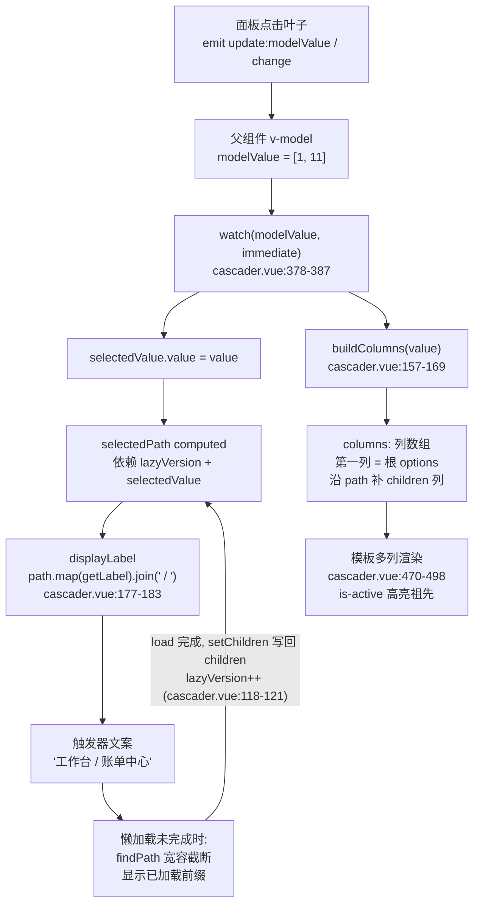
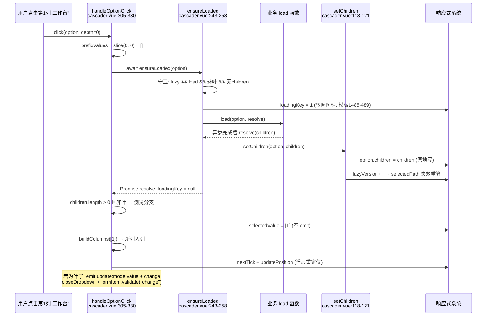

# 6-04 · Cascader：级联面板

> 本篇源码坐标（均为当前工作区实态）：
> - 逻辑层：`packages/components/cascader/src/cascader.vue`（503 行）、`packages/components/cascader/src/cascader.ts`（46 行）——注意：**没有**独立的 `cascader-panel.vue`，也没有 `cascader-node`，多列面板与节点逻辑全部内联在 cascader.vue 一个文件里
> - 出口：`packages/components/cascader/index.ts`（32 行）
> - 样式：`packages/theme/src/components/cascader.css`（248 行）
> - 测试与类型：`packages/components/cascader/__tests__/cascader.spec.ts`（154 行）、`tests/types/fixtures/cascader.ts`（24 行）
> - 示例：`apps/docs/examples/cascader/`（basic / filterable / lazy / popper-class 四例）

分卷大纲给 6-04 的核心问题只有一句话：**多级懒加载与选中路径回显**。这两件事在级联选择器里是同一枚硬币的两面：懒加载意味着"数据不是一开始就全的"，路径回显意味着"拿到一个值要能还原出整条路径"——当数据残缺、逐层补全时，回显还能不能对？这就是本篇要拆解的全部内容。

先给一个可能出乎意料的结论：这个 cascader 没有像 Element Plus 那样把触发器、面板、节点拆成三个组件包（EP 是 `cascader` / `cascader-panel` / `cascader-node` 三包协同，Node 还是一个带方法的类实例），它把所有东西——触发器、浮层、多列面板、懒加载、路径反查——塞进了 503 行的单文件。为什么敢这么做？拆与不拆的边界在哪里？这比逐行念代码更值得说。

## 一、单文件的级联面板：先看目录，再看数据模型

`packages/components/cascader/src/` 下只有两个文件：`cascader.vue` 和 `cascader.ts`。`cascader.ts` 是纯类型层（4-03 的标准三件套里"逻辑层"的最简形态——这里连组合式逻辑都不需要抽），`cascader.vue` 一肩挑起视图与全部状态。先看类型层，因为它定义了这个组件对外承诺的一切：

```ts
// packages/components/cascader/src/cascader.ts
export type CascaderKey = string | number;
export type CascaderValue = CascaderKey[] | null;
export type CascaderOptionData = Record<string, any>;
export type CascaderValueChangeHandler = (value: CascaderValue) => void;
export type CascaderVisibleChangeHandler = (value: boolean) => void;
export type CascaderSearchChangeHandler = (value: string) => void;

export interface CascaderFieldNames {
  label?: string;
  value?: string;
  children?: string;
  disabled?: string;
  leaf?: string;
}

export type CascaderLoadFunction = (
  option: CascaderOptionData,
  resolve: (children: CascaderOptionData[]) => void
) => void;

export interface CascaderProps {
  modelValue?: CascaderValue;
  options: CascaderOptionData[];
  props?: CascaderFieldNames;
  placeholder?: string;
  disabled?: boolean;
  clearable?: boolean;
  filterable?: boolean;
  lazy?: boolean;
  load?: CascaderLoadFunction;
  size?: ComponentSize;
  searchPlaceholder?: string;
  teleported?: boolean;
  appendTo?: string | HTMLElement;
  placement?: Placement;
  offset?: number;
  popperClass?: string;
  popperStyle?: StyleValue;
}
```

这段类型（`cascader.ts:6-44`）里最要紧的一行是第 7 行：

```ts
export type CascaderValue = CascaderKey[] | null;
```

**`modelValue` 不是"一个值"，是一条完整路径。** 选了"工作台 / 账单中心"，`v-model` 拿到的是 `[1, 11]`，不是 `11`。这是本库 cascader 与 Element Plus 的第一个分水岭：EP 的 `el-cascader` 提供了 `emitPath` 开关（默认 `true` 时 emit 路径数组，设为 `false` 只 emit 末级单值），本库直接砍掉了单值模式，把"路径即值"定为唯一协议。类型测试夹具把这个约束钉死在编译期：

```ts
// tests/types/fixtures/cascader.ts
import type { CascaderProps } from "xiaoye-components";

const props: CascaderProps = {
  modelValue: [1, 11],
  options: [
    {
      value: 1,
      label: "工作台",
      children: [{ value: 11, label: "账单中心" }]
    }
  ],
  filterable: true,
  clearable: true
};

void props;

const invalidProps: CascaderProps = {
  // @ts-expect-error modelValue should be path array
  modelValue: 1,
  options: [{ value: 1, label: "工作台" }]
};

void invalidProps;
```

第 19 行的 `@ts-expect-error modelValue should be path array` 就是在声明：传一个裸的 `1` 是类型错误。`pnpm typecheck:types` 跑全量夹具时，这条错误必须如约出现（`@ts-expect-error` 在没有错误时反而会报"未使用的 expect-error"），协议的刚性由编译器而非文档保证。

**【权衡一：value 用路径数组，还是单值？】** 路径数组的收益在回显侧：`[1, 11]` 自带层级语义，回显标签、重建面板列、表单联动里判断"选到了哪一级"都不需要任何反查协议；代价在消费侧——如果业务方只想拿末级 id 存库，就得自己写 `[1, 11][1]`，且各级 value 必须在自己那一层唯一（本实现没有做全局唯一性校验，层级唯一是隐含契约）。EP 的 `emitPath: false` 把这个负担挪给了组件：它内部持有 Node 实例链，单值回来时靠 `getNodeByValue` 反查整条路径，代价是必须维护一份全量节点索引。换句话说，**EP 用运行时索引换 API 灵活性，本库用 API 约束换运行时简单**——单文件 503 行装得下，前提正是砍掉单值模式后不必建索引。

第二个值得注意的类型是 `CascaderLoadFunction`（`cascader.ts:21-24`）：

```ts
export type CascaderLoadFunction = (
  option: CascaderOptionData,
  resolve: (children: CascaderOptionData[]) => void
) => void;
```

参数是**原始 option 对象**（plain data），只有 `resolve` 没有 `reject`。这与同库 tree 的懒加载协议形成鲜明对照——`packages/components/tree/src/tree.type.ts:66-70` 的 `LoadFunction` 是 `(rootNode: Node, resolve, reject) => void`：传的是节点**实例**（带方法、带状态），且有失败通道。EP 的 `lazyLoad` 介于两者之间：传 Node 实例但同样没有 `reject`，失败靠 resolve 空数组表达。本库 cascader 选了最"数据"的那一端：业务方拿到的就是自己传进来的那个对象，load 完成后把子数组 resolve 回来，组件负责写回 `children` 字段——连接收侧与回写侧的字段名都由 `props.fieldNames.children` 决定。失败怎么办？resolve 空数组即可，空数组的叶子判定会把它当成叶子节点，交互上"点了没下文"，这是一个粗糙但自洽的答案，第八节我们再看它付出了什么。

## 二、路径回显：findPath 与"无 parent 指针的回溯"

现在进入本篇第一个核心问题：**选中路径回显**。它有两层含义：其一，触发器上的文案要显示"工作台 / 账单中心"而不是 `11`；其二，面板打开时，前几列要把选中祖先高亮、把对应子列展开。两件事共用同一个反查函数。

先看"叶子判定 + 路径反查 + 列构建"这一整段——这是 cascader.vue 里数据模型的心脏（`cascader.vue:127-175`）：

```ts
// packages/components/cascader/src/cascader.vue
function isLeaf(option: CascaderOptionData) {
  const leafKey = fieldName("leaf", "leaf");
  if (leafKey in option) {
    return Boolean(option?.[leafKey]);
  }

  return getChildren(option).length === 0;
}

function findPath(values: CascaderKey[] | null, options = props.options): CascaderOptionData[] {
  if (!values?.length) {
    return [];
  }

  const path: CascaderOptionData[] = [];
  let currentOptions = options;

  for (const value of values) {
    const matched = currentOptions.find((option) => getValue(option) === value);
    if (!matched) {
      break;
    }

    path.push(matched);
    currentOptions = getChildren(matched);
  }

  return path;
}

function buildColumns(values: CascaderKey[] | null) {
  const nextColumns: CascaderOptionData[][] = [props.options];
  const path = findPath(values);

  path.forEach((option) => {
    const children = getChildren(option);
    if (children.length) {
      nextColumns.push(children);
    }
  });

  columns.value = nextColumns;
}

const selectedPath = computed(() => {
  const version = lazyVersion.value;
  void version;
  return findPath(selectedValue.value);
});
```

`findPath`（L136-155）值得逐行读。输入是 `[1, 11]`，输出是 `[工作台节点, 账单中心节点]`。它的策略是**沿树上行式逐层 find**：从根数组开始，拿路径里的第一个 value 在当前层做 `Array.find`，命中则推进 `currentOptions` 到该节点的 children，继续找下一个。注意 L146-148 的 `if (!matched) break`——某一层找不到就**截断**，返回已找到的前缀，而不是报错或返回空。这个"宽容截断"正是为懒加载设计的：`v-model` 绑了 `[1, 11]`，但 `11` 所在层还没加载时，`findPath` 返回 `[工作台节点]`，回显标签显示"工作台"，不崩溃、不丢值；等那一层真正加载进来，重算后自动补全为完整路径。

`isLeaf`（L127-134）的判定顺序也有讲究：**显式 `leaf` 字段优先，children 数组兜底**。只要业务数据里声明了 `leaf: false`，哪怕 `children` 是空的，它也会被当成"可展开的懒加载节点"——这正是懒加载场景的入场券：节点还没加载，children 必然为空，必须靠显式声明告诉面板"这里值得点一下"。反过来说，没声明 `leaf` 的节点，children 为空即叶子，没有加载机会。字段名走 `props.fieldNames.leaf`（`CascaderFieldNames` 的第五个成员），这就是为什么 fieldNames 必须包含 `leaf`——它不是可有可无的别名机制，而是懒加载协议的一等公民。

`selectedPath` 这个 computed（L171-175）里藏着全篇最精妙的四行：

```ts
const selectedPath = computed(() => {
  const version = lazyVersion.value;
  void version;
  return findPath(selectedValue.value);
});
```

`const version = lazyVersion.value; void version;`——读了一个值，又用 `void` 把它丢掉，看起来像死代码。它不是。要理解它，得先看懒加载是怎么把数据写回树的（`cascader.vue:118-121`）：

```ts
function setChildren(option: CascaderOptionData, children: CascaderOptionData[]) {
  option[fieldName("children", "children")] = children;
  lazyVersion.value += 1;
}
```

`setChildren` 对 option 做的是**原地赋值**：往业务方传进来的 plain 对象上直接写 `children` 字段。而 `props.options` 在 Vue 里是 shallowReactive 的——`props.options` 这个属性的读取是响应式的，但它的**内容**（数组元素、嵌套 children）不会自动被深响应化，除非父组件传进来的本来就是 reactive 对象。业务侧最常见的写法就是传一个普通字面量数组（示例 `apps/docs/examples/cascader/lazy.vue:5` 正是如此）。于是问题来了：`findPath` 内部读取的 `option.children`，在这套赋值之后**不构成任何响应式依赖**——computed 不会失效，回显标签会停留在懒加载前的截断版本。`lazyVersion` 就是给这条断链手工焊接的保险丝：每次写回 children 就自增版本号，`selectedPath` 显式依赖它，load 完成的那一个 tick，computed 失效重算，`displayLabel` 跟着补全。

这是 AI 协作研发里很典型的一类补丁：生成器写出了 `void version` 这种"读而不用"的形状，没有注释解释，但它恰好是响应式体系里唯一能让回显在懒加载下自愈的手段。删掉它，测试不一定会挂（懒加载测试断言的是面板内容不是触发器文案），但"v-model 先行、数据后到"的真实业务里，回显会永远缺后几级。本篇把它标记为**不可删的死代码面**。

回显的第二个消费者是面板列重建。`buildColumns`（L157-169）从 `findPath` 的结果派生出整张列结构：第一列永远是根数组，之后沿着路径把每个有 children 的节点补一列。选中 `[1, 11]` 时打开面板，你会看到第一列"工作台"高亮、第二列"账单中心"就位——列状态完全由 `modelValue` 派生，没有任何独立的"展开状态"要维护。整条回显链路画出来是这样的：



这里必须补一笔 EP 的对照。**【权衡二：回溯靠"逐层 find"，还是靠"parent 指针"？】** EP 的 CascaderNode 是一个类实例，构造时持有 `parent` 引用，`pathNodes` 这个 getter 沿 `parent` 链一路回溯到根——拿到末级节点就能 O(depth) 还原整条路径，反查不需要碰 options 数据本身。代价是组件必须持有"数据到节点"的实例化层：每个 option 进来都要 `new Node`，懒加载子项也要实例化，内存与复杂度都花在这层。本库没有 Node 层，option 就是 plain data，回溯只能回到数据树本身逐层 find，代价是 O(depth × 每层分支数)——在常见规模（层级 3-4、每层几十项）下完全无感，而且天然跟 `fieldNames` 自定义字段兼容（Node 层得把自定义字段抄进实例）。**小数据用不起索引，大数据才需要 Node**——本库把这条线划在了"单文件装得下"的位置。真实代价出现在另一处：value 的全局唯一性。逐层 find 只要求"同层不重"，一旦业务数据两层出现同一个 value（比如树里 `id: 1` 出现两次），`findPath` 会命中第一个，EP 的节点索引同样会撞 key——谁也没解决，只是撞的方式不同。

## 三、懒加载：一个 Promise、一个 loadingKey、一个版本号

第二个核心问题：多级懒加载。全量 vs 懒加载的分野由两个 props 决定——`lazy`（开关）与 `load`（协议）。先看实现本体（`cascader.vue:243-258`，实态逐行）：

```ts
// packages/components/cascader/src/cascader.vue
async function ensureLoaded(option: CascaderOptionData) {
  if (!props.lazy || !props.load || isLeaf(option) || getChildren(option).length) {
    return;
  }

  loadingKey.value = getValue(option);

  await new Promise<void>((resolve) => {
    props.load?.(option, (children) => {
      setChildren(option, children);
      resolve();
    });
  });

  loadingKey.value = null;
}
```

`loadingKey.value = null` 摆在 Promise 构造器**之外**（L257），这个位置是有语义的：如果把它挪进构造器，它会在 `load(option, resolve)` 被调用的同步瞬间就执行——异步 load 场景下转圈还没转起来就熄了；放在 `await` 之后，清理动作被推迟到 resolve 真正落地，转圈的存活期与加载期严格重合。

四道守卫在 L244 一行排开：没开 `lazy`、没传 `load`、已经是叶子、已经有 children——任何一条命中就直接返回。最后一条 `getChildren(option).length` 是**加载去重**：children 一旦写回，再次点击不会重复发起 load。注意这个去重的粒度是"数据形状"而非"加载状态位"——没有 `loaded: boolean`，判断依据就是"有没有子数组"。它有一个诚实的边界：如果业务 resolve 了空数组，节点会被 `isLeaf` 判定为叶子（children 空且无显式 `leaf: false` 之外的情形），之后不会再加载；但如果业务声明了 `leaf: false` 又 resolve 了空数组，这个节点每次点击都会重发请求——空 children 不构成去重凭据。测试里没有覆盖这条路径，算是一个已知的未定义区。

`loadingKey`（L82 定义、L248 与 L257 读写）是**单值**的：`CascaderKey | null`，同一时刻整个面板只有一个节点处于加载态。因为 `ensureLoaded` 只在 `handleOptionClick` 里被 `await`，点击事件天然串行，单值够用——它同时是渲染层的开关（模板 L485-489 用 `loadingKey === getValue(option)` 决定渲染转圈图标还是展开箭头）。EP 把 loading 放在 Node 实例的 `loading` 字段上，天然支持多节点并发加载各自转圈；本库的 `load` 协议没有 `reject`，也没有"加载失败"的状态位，失败时 `resolve` 永远不会被调用——**这意味着 `loadingKey` 会停在加载中的节点上，转圈永不消失**。这是单值 Promise 包装协议最锋利的边界：没有失败通道，就没有失败兜底。文档示例用 300ms 的 `setTimeout` 演示了标准姿势（`apps/docs/examples/cascader/lazy.vue`，16 行全文）：

```vue
<!-- apps/docs/examples/cascader/lazy.vue -->
<script setup lang="ts">
import { ref } from "vue";

const value = ref<Array<string | number> | null>(null);
const options = [{ value: 1, label: "工作台", leaf: false }];

function load(option: { label: string }, resolve: (children: Array<{ value: number; label: string }>) => void) {
  window.setTimeout(() => {
    resolve([{ value: 11, label: `${option.label}-子项` }]);
  }, 300);
}
</script>

<template>
  <xy-cascader v-model="value" lazy :options="options" :load="load" />
</template>
```

`options` 里的 `leaf: false` 就是前文说的入场券：没有它，"工作台"没有 children 会被判定为叶子，点击直接当作选中提交，懒加载整个协议无从触发。

加载完成后，写回与重算由 `setChildren` 一手包办（写 children + `lazyVersion++`），而"写回之后面板怎么长出新列"发生在调用方 `handleOptionClick` 里——点击是懒加载与面板展开的交汇点（`cascader.vue:305-330`）：

```ts
// packages/components/cascader/src/cascader.vue:305-330
async function handleOptionClick(option: CascaderOptionData, depth: number) {
  if (isDisabled(option)) {
    return;
  }

  const prefixValues = (selectedValue.value ?? []).slice(0, depth);
  const nextValues = prefixValues.concat(getValue(option));

  await ensureLoaded(option);

  const children = getChildren(option);

  if (children.length && !isLeaf(option)) {
    selectedValue.value = nextValues;
    buildColumns(nextValues);
    await nextTick();
    await updatePosition();
    return;
  }

  selectedValue.value = nextValues;
  emit("update:modelValue", nextValues);
  emit("change", nextValues);
  await closeDropdown(false, true);
  await formItem?.validate("change");
}
```

L310 的 `prefixValues = (selectedValue.value ?? []).slice(0, depth)` 是列管理的点睛之笔：点到第 `depth` 列的某项时，把 `selectedValue` 截断到该列之前再拼接新值。你在第二列点了"账单中心"，之前浏览到第三列、第四列的残留路径全部作废——**浏览态的截断发生在点击瞬间**。随后 `await ensureLoaded(option)` 同步等加载完成，再用"有没有 children 且不是叶子"分流：有下文 → 只写 `selectedValue` + `buildColumns`，**不 emit**（浏览中）；没有下文 → 写值 + emit `update:modelValue` 与 `change` + 关浮层 + 触发表单 `change` 校验。展开动作写 `selectedValue` 却不 emit，这是本组件的一个隐性设计：`selectedValue` 同时服务"面板浏览态"（决定哪列高亮、下级列展开到哪）与"选中值镜像"（v-model 的本地副本）两个角色，浏览路径与提交值在叶子点击前是分离的，在叶子点击后合一。EP 的面板内部维护独立的展开 state 与 checkedValue，语义切分得更干净，代价也是更多的状态；本库用一个 ref 装两个语义，省了同步，换来了"点开但没选叶就关面板时，触发器文案会跟随浏览路径"这个可见行为——测试没有覆盖这条边界，但读代码可以推出来。

整条懒加载时序收进一张图：



**【权衡三：点击时加载，还是预载/缓存？】** 本库的加载时机只有"点击展开前"一个（`ensureLoaded` 唯一调用点是 `handleOptionClick`），没有 hover 预载、没有打开面板时批量预载、没有会话级缓存淘汰——children 写回后常驻内存，组件销毁即消失。EP 的面板有 `expandTrigger: 'hover' | 'click'`，hover 模式下展开本身不点击，懒加载同样挂在展开动作上，还提供了更细的节点级状态。本库砍掉 hover 展开（只有 click）是明确的减法：hover 展开需要 hover 意图与点击选中两套事件语义在同一个节点上共存，还要处理 hover 抖动引起的连续加载，单文件里装不下这份复杂度。换取的是：加载路径唯一、loadingKey 单值即正确、点击即展开即加载的心智模型。代价在弱网下的手感——每层都要等，没有预热的余地。如果业务要预热，只能在 load 函数自己里做（比如顺手预取下一层的常用节点，resolve 时一并塞进 children，反正 `findPath` 与面板只认数据形状）。

## 四、面板与触发器：列派生、宽度自算与搜索扁平化

面板的渲染策略一句话可以说完：**列是 `modelValue` 的纯派生，节点是 plain data 的直接投影**。模板段（`cascader.vue:470-498`）：

```html
<!-- packages/components/cascader/src/cascader.vue:470-498 -->
<div v-else class="xy-cascader__columns">
  <ul v-for="(column, depth) in columns" :key="depth" class="xy-cascader__column">
    <li v-for="option in column" :key="String(getValue(option))">
      <button
        type="button"
        class="xy-cascader__option"
        :class="[
          selectedValue?.[depth] === getValue(option) ? 'is-active' : '',
          isDisabled(option) ? 'is-disabled' : ''
        ]"
        :disabled="isDisabled(option)"
        @click="handleOptionClick(option, depth)"
      >
        <span class="xy-cascader__option-label">{{ getLabel(option) }}</span>
        <XyIcon
          v-if="loadingKey === getValue(option)"
          icon="mdi:loading"
          spin
          class="xy-cascader__option-loading"
        />
        <XyIcon
          v-else-if="getChildren(option).length || (props.lazy && !isLeaf(option))"
          icon="mdi:chevron-right"
          class="xy-cascader__option-arrow"
        />
      </button>
    </li>
  </ul>
</div>
```

三个细节。其一，高亮判定是 `selectedValue?.[depth] === getValue(option)`（L477）——第 `depth` 列的项是否激活，只看路径数组在那一层的值，祖先列的高亮与展开列的推进完全由一维数组驱动，没有任何"列实例"对象。其二，`key="depth"` 用列序号做 key（L471）：列本来就是整列替换的（`columns.value = nextColumns`），用索引 key 反而诚实——列没有身份，只有位置。其三，右侧箭头的渲染条件（L490-494）是 `getChildren(option).length || (props.lazy && !isLeaf(option))`：已加载有子、或懒加载下声明非叶——和 `isLeaf` 的判定互为表里，转圈（loadingKey 命中）优先于箭头。

**【权衡四：面板渲染策略——整列替换，还是节点实例复用？】** 本库每次展开/回显都是 `buildColumns` 整体替换 `columns` 数组，Vue 的 diff 以列序号与 value 为锚做就地复用，没有节点实例层、没有展开动画编排、没有列滚动位置保持（新列出现时旧列滚动位置由 DOM 复用自然保留，整列替换后则是重置——模板以 `v-for` 直接渲染，测试与示例均未发现滚动位置管理代码）。EP 的 CascaderPanel 会为每个 option 建 Node，列表渲染走节点数组，节点实例上挂着 expand/check 状态，跨列状态迁移靠实例引用。两条路线在千级数据内没有可测的体感差异，本库路线的真正优势是**可调试性**：面板上看到的一切都是 `columns` 这个数组的直接函数，没有隐藏状态。劣势在扩展性——想要"选中末级自动回滚到上级重新浏览"、"列内虚拟滚动"、"多选打勾"这类能力，都得先补状态层。单文件形态的天花板就在这里，而当前需求集（单选、点击展开、懒加载、搜索）恰好在线内。

浮层宽度是另一个"自管"的样本。cascader 没有使用 `useFloatingPanel` 的 `matchTriggerWidth` 选项（对照：tree-select 用了，`tree-select.vue:81`），而是自己算（`cascader.vue:187-201`）：

```ts
// packages/components/cascader/src/cascader.vue:187-201
const dropdownWidth = computed(() => {
  const triggerWidth = triggerRef.value?.offsetWidth ?? 0;

  if (searchResults.value.length > 0) {
    return Math.max(triggerWidth, CASCADER_DROPDOWN_MIN_WIDTH);
  }

  const columnCount = Math.max(columns.value.length, 1);
  const columnsWidth =
    columnCount * CASCADER_COLUMN_MIN_WIDTH +
    Math.max(columnCount - 1, 0) * CASCADER_COLUMN_GAP +
    CASCADER_DROPDOWN_PADDING;

  return Math.max(triggerWidth, columnsWidth, CASCADER_DROPDOWN_MIN_WIDTH);
});
```

四个常量在 L28-31：`CASCADER_COLUMN_MIN_WIDTH = 180`、`CASCADER_COLUMN_GAP = 8`、`CASCADER_DROPDOWN_PADDING = 16`、`CASCADER_DROPDOWN_MIN_WIDTH = 240`。宽度 = max(触发器宽, 列宽合计, 240)，其中列宽合计 = 列数 × 180 + (列数 - 1) × 8 + 16。这个算式与样式层的 `.xy-cascader__columns` 有一条隐性耦合：CSS 用 `grid-auto-columns: minmax(180px, 1fr)`（`cascader.css:228`），JS 用 180 做最小宽估算——两个 180 必须同步改，这是 JS 算宽 + CSS 渲染双源的唯一接缝。测试专门钉了这条算术（`cascader.spec.ts:34-45`）：mock 触发器 `offsetWidth = 240`，点开两级后断言 `dropdown.style.width === "384px"`——两列 180×2 + gap 8 + padding 16 = 384。列越多浮层越宽，每展开一级重算一次（`handleOptionClick` 的浏览分支里 `nextTick` 后 `updatePosition`），这是级联面板区别于普通下拉的布局需求，也是 `matchTriggerWidth` 这个"对齐触发器宽"的通用选项覆盖不了的需求。

搜索是第三块自管逻辑。`flattenOptions`（`cascader.vue:211-229`）把整棵树拍平成 `SearchResult[]`，每条携带 `values`（完整路径数组）与 `labels`（完整路径文案），`searchResults`（L231-241）对 `" / ".join(labels)` 做 includes 过滤。命中项点击后走 `selectResult`（L297-303）：直接把整条 `values` 写进 selectedValue 并 emit——**搜索路径天然绕过逐级展开，一步到位**。注意它复用了 `CascaderValue` 的路径语义，搜索结果不需要额外的数据结构去还原路径：拍平的那一刻路径就跟着每个节点走了。这条扁平化的代价是每次 keystroke 全树重拍（无索引无缓存），同样是"小数据换简单"的价值观。

## 五、浮层接线：七件套只借三件

第 4-06 篇给过浮层七件套的清单：`useFloatingVisibility`（三态状态机）、`useOverlayStack`（全局浮层栈与 z 序）、`useOverlayDialog`（模态层接线）、`useFocusTrap`（焦点陷阱）、`useFloatingPanel`（定位管道）、`useDismissibleLayer`（关闭裁判）、`useListNavigation`（键盘导航）。5-15 用 menu 演示了"半身复用"，6-03 的 auto-complete 则是另一种参照——它借了四件（`auto-complete.vue:4-11` 的 import 里多一个 `useListNavigation`，L111 以 `useListNavigation(() => filteredOptions.value, { loop: true })` 接管浮层内上下键导航）。cascader 借了几件？三件：`useOverlayStack`、`useFloatingPanel`、`useDismissibleLayer`（`cascader.vue:4-10`）。

不借 `useFloatingVisibility` 的理由与 menu 类似但更彻底：cascader 的开合是纯二态（`open` ref，L78），没有 tooltip 那种"受控展开的中间态"，三态状态机的表达能力用不上。不借 `useListNavigation` 的代价更实际：**面板内没有键盘导航**，方向键只能开合浮层（`handleTriggerKeydown`，L348-367：ArrowDown/Enter/空格开、Escape 关），列内的焦点移动靠 Tab 遍历 DOM——对级联面板这种"网格状"结构，一维的 list navigation 模型确实不够用，但没有替代实现也是事实，可访问性上是明确的欠账。

借来的三件怎么接线，收口在组件尾段（`cascader.vue:378-398`）：

```ts
// packages/components/cascader/src/cascader.vue:378-398
watch(
  () => props.modelValue,
  (value) => {
    selectedValue.value = value;
    buildColumns(value);
  },
  {
    immediate: true
  }
);

useDismissibleLayer({
  enabled: open,
  refs: [triggerRef, dropdownRef],
  closeOnEscape: true,
  closeOnOutside: true,
  isTopMost: () => isTopMost(),
  onDismiss: async (reason) => {
    await closeDropdown(reason === "outside", reason === "escape");
  }
});
```

`watch(modelValue, immediate: true)` 是回显链的入口：外部值一进来就同步 `selectedValue` 并重建列，初始挂载即完成回显准备。`useDismissibleLayer` 的接线是 4-06 的标准姿势：`enabled: open` 让关闭裁判只在浮层开着时上班，`isTopMost: () => isTopMost()` 接进全局浮层栈——栈的实现里有一段值得复述的考据（`use-overlay-stack.ts:15-19` 的注释）：栈容器必须用 `shallowRef`，深层 ref 会把每个 entry 代理化并自动解包其 `zIndex`，导致 `getTopEntry` 比较时读到 `undefined`。cascader 作为这个栈的普通消费者不用关心这些，这正是七件套分层的意义：组件只管 `openLayer()/closeLayer()` 两个调用（L268、L285），z 序与"谁在最上"的全局判断全部下沉。`onDismiss` 把关闭原因翻译成 `closeDropdown` 的两个布尔——outside 关闭不还焦、escape 关闭还焦（`closeDropdown` 的 `restoreFocus` 参数，L287-290）——这是 4-06 关闭语义里"由谁关闭决定焦点去哪"的落地样本。

顺带一提 `openDropdown`（L260-274）的次序：`open.value = true` → emit `visibleChange(true)` → emit `focus` → `openLayer()` 领 z 序 → `buildColumns(selectedValue.value)`（按当前选中值重建列——**每次打开都重算**，这顺手修复了前文提到的"options 替换后 columns[0] 快照滞后"问题：只要重新打开过面板，第一列就刷新到最新 options）→ `nextTick` 等浮层 DOM 挂载 → `updatePosition` 首算 → `startAutoUpdate` 挂 floating-ui 的 autoUpdate 循环。次序与 5-15 归纳的"领 z 序 → 管开合 → 管定位"完全同构。

## 六、样式与测试：248 行 CSS 与 384px 的算术

样式层有两段值得驻足。第一段是浮层皮肤的变量三段回退（`cascader.css:121-156`）：

```css
/* packages/theme/src/components/cascader.css:121-156 */
.xy-cascader__dropdown {
  --xy-cascader-dropdown-bg-resolved: var(
    --xy-cascader-dropdown-bg,
    var(
      --xy-popper-bg,
      var(--xy-dialog-bg, color-mix(in srgb, var(--xy-bg-floating) 98%, var(--xy-bg-subtle)))
    )
  );
  --xy-cascader-dropdown-border-resolved: var(
    --xy-cascader-dropdown-border,
    var(
      --xy-popper-border-color,
      color-mix(in srgb, var(--xy-border-subtle) 84%, var(--xy-border))
    )
  );
  --xy-cascader-dropdown-shadow-resolved: var(
    --xy-cascader-dropdown-shadow,
    var(
      --xy-popper-shadow,
      0 0 0 1px color-mix(in srgb, var(--xy-bg-floating) 8%, transparent),
      0 2px 8px color-mix(in srgb, var(--xy-text-heading) 7%, transparent)
    )
  );
  --xy-cascader-dropdown-section-background: color-mix(
    in srgb,
    var(--xy-cascader-dropdown-bg-resolved) 96%,
    var(--xy-bg-subtle)
  );
  min-width: 240px;
  padding: 5px;
  border: 1px solid var(--xy-cascader-dropdown-border-resolved);
  border-radius: var(--xy-radius-lg);
  background: var(--xy-cascader-dropdown-bg-resolved);
  box-shadow: var(--xy-cascader-dropdown-shadow-resolved);
  overflow: hidden;
}
```

每个视觉维度（底、边、影）都是三层 CSS 变量回退：组件专属钩子（`--xy-cascader-dropdown-bg`）→ 浮层通用钩子（`--xy-popper-bg`）→ 语义令牌兜底。这就是文档示例里 `popper-class.vue` 存在的原因——用户给浮层加个 class 覆盖第一层钩子即可换肤，不用碰组件。第二段是列布局（`cascader.css:225-248`）：

```css
/* packages/theme/src/components/cascader.css:225-248 */
.xy-cascader__columns {
  display: grid;
  grid-auto-flow: column;
  grid-auto-columns: minmax(180px, 1fr);
  gap: 6px;
  border-radius: var(--xy-radius-md);
  background: color-mix(in srgb, var(--xy-bg-floating) 88%, var(--xy-cascader-dropdown-section-background));
}

.xy-cascader__column {
  margin: 0;
  padding: 0 4px;
  list-style: none;
  min-height: 208px;
  border-right: 1px solid color-mix(in srgb, var(--xy-cascader-dropdown-border-resolved) 82%, transparent);
}

.xy-cascader__column:last-child {
  border-right: 0;
}

.xy-cascader__option-loading {
  color: var(--xy-brand);
}
```

`grid-auto-flow: column` + `grid-auto-columns: minmax(180px, 1fr)` 让列随 `columns` 数组长度自动横向生长，与 JS 侧的宽度算式互为表里（前文说过 180 双源耦合）；`min-height: 208px` 保证两列面板在第一列内容很少时第二列不塌陷——列与列之间的 `border-right` 用 `color-mix` 掺透明做弱化，`last-child` 摘掉，这是"列"这个视觉概念的全部 CSS。L246-248 的加载态就一行品牌色，转圈动画本体由 XyIcon 的 `spin` 属性承担。

测试（154 行）覆盖五组：基础层级选择、空值兜底、搜索与清空、懒加载、form size 级联。懒加载用例全文（`cascader.spec.ts:106-129`）：

```ts
// packages/components/cascader/__tests__/cascader.spec.ts:106-129
it("支持懒加载节点", async () => {
  const load = vi.fn((option, resolve) => {
    resolve([{ value: 11, label: `${option.label}-子项` }]);
  });

  const wrapper = mount(XyCascader, {
    props: {
      modelValue: null,
      lazy: true,
      load,
      options: [{ value: 1, label: "工作台", leaf: false }]
    },
    attachTo: document.body
  });

  await wrapper.get(".xy-cascader__trigger").trigger("click");
  const optionButton = document.body.querySelector(".xy-cascader__option") as HTMLButtonElement;
  await optionButton.click();
  await Promise.resolve();
  await nextTick();

  expect(load).toHaveBeenCalledTimes(1);
  expect(document.body.textContent).toContain("工作台-子项");
});
```

两个断言点值得读出声：`load` 只被调了**一次**（`ensureLoaded` 的 children 去重守卫生效——虽然这里只点了一次，这个断言同时锚定了"点击未加载节点走 load 而不是直接选中"）；`工作台-子项` 出现在 `document.body` 而不是 wrapper 里——浮层被 teleport 到 body 了，所有浮层断言都必须去 body 找，这是 4-05 之后全库浮层组件测试的统一纪律。`await Promise.resolve()` 那一行是微任务排空：`ensureLoaded` 的 Promise 包装在同步 resolve 时也需要一个微任务轮转才落到 `loadingKey = null`，测试用一次微任务等待精确对齐，没有用蛮力的 timeout。基础用例里的 `Object.defineProperty(trigger, "offsetWidth", { value: 240 })`（L34-37）则是在 JS 层 mock 几何属性，喂养 `dropdownWidth` 的算式——384px 断言（L45）就这样把 JS 宽度模型钉进了回归网。

## 七、与 tree-select 的分工边界（预写 6-16 的分界碑）

最后回答"同为层级数据选择，cascader 和 tree-select 怎么分工"。看一眼 tree-select 的浮层主体就全明白了（`tree-select.vue:368-381`）：

```html
<!-- packages/components/tree-select/src/tree-select.vue:368-381 -->
<xy-tree
  ref="treeRef"
  class="xy-tree-select__tree"
  :data="props.data"
  :node-key="props.nodeKey"
  :props="props.props"
  :empty-text="props.emptyText"
  :lazy="props.lazy"
  :load="props.load"
  :highlight-current="true"
  :current-node-key="selectedValue ?? undefined"
  :filter-node-method="resolvedFilterMethod"
  @node-click="selectNode"
/>
```

tree-select 是**薄壳**：386 行里一半是接线代码，树的状态、懒加载、过滤全部委托给 XyTree——它的 `lazy/load` props 原样透传（L375-376），`load` 协议用的是 tree 的 `LoadFunction`（传 Node 实例、有 `reject`），value 是单 key（`TreeKey | null`），回显靠 `findNode` 深度优先反查（`tree-select.vue:118-139`）选中那个**节点**而非路径。cascader 是**自管**：面板、节点、懒加载、路径反查全部自己实现，value 是路径数组。两条分界线由此清晰：

- **选什么**：tree-select 选"树上的一个节点"（节点的兄弟、子孙都无关紧要），cascader 选"从根到叶的一条路径"（路径本身就是业务语义，如"省/市/区"）。
- **数据形态**：tree-select 绑定 Node 实例体系（tree 的 `Node`/`TreeStore`），懒加载协议带 `reject`；cascader 绑定 plain data，协议里只有 `resolve`。
- **回显语义**：tree-select 显示末级节点名（`displayLabel` 只取一个 label，`tree-select.vue:143-145`），cascader 显示整条路径的 `" / "` 连接（`cascader.vue:177-183`）。
- **交互密度**：tree-select 有树的全部交互（展开/收起/懒加载/过滤的树形语义），cascader 只有"逐列点下去"一种交互。

一句话：**值有路径语义选 cascader，值是节点语义选 tree-select**。6-16 写 tree-select 时，本节就是那边的对照面。

## 收拢：五条结论

1. **路径即值是整个组件的地基**：`CascaderValue = CascaderKey[] | null` 让回显、列重建、搜索选中共享同一份数据语义，砍掉 EP 的 `emitPath` 单值模式后，503 行的单文件才装得下全部逻辑；代价是"同层唯一"成为隐含契约，消费方拿末级 id 要自己拆。
2. **回显的宽容截断 + 版本号自愈**：`findPath` 查不到就 break，懒加载完成前后回显从"前缀"到"全路径"平滑补全；`lazyVersion` 手工焊接"原地写 children"与 computed 依赖之间的断链，`void version` 是不可删的死代码面。
3. **懒加载协议取最简端**：传 plain option、只有 `resolve`、children 即去重凭据、loadingKey 单值——没有 `reject` 意味着业务永远不 resolve 时转圈不消失，这是协议简明性买下的边界，使用方必须知道。
4. **面板是 modelValue 的纯派生**：columns 整列替换、列 key 用索引、高亮看 `selectedValue[depth]`，没有节点实例层；浏览态与提交值在叶子点击前分离（写 selectedValue 不 emit），EP 用独立 state 干净切分，本库用一个 ref 合并承担。
5. **浮层借三件、键盘欠账、宽度自算**：七件套只消费 stack/panel/dismissible 三件，方向键导航欠账；dropdownWidth 的 JS 算式与 CSS 的 180px 双源耦合，384px 测试是这条接缝的看门人。

下一篇预告：6-05《Radio：三形态一个 context》。从"路径数组"跳到"单值三形态"（原生 radio / 按钮组 / 自定义样式），4-09 立下的"属性下发与汇总收口"模式将在 radio-group 上接受最完整的检验——`useRadio` 的 context 注入如何让三种视觉形态共享同一套受控协议，button 形态的视觉特化为什么能完全不碰逻辑，与本篇"一个 ref 装两种语义"的合并式状态管理正好是两极。

---

*本篇代码引用核对于当前工作区实态：`packages/components/cascader/src/cascader.vue`（503 行，L28-31 / L33-57 / L59-67 / L78-83 / L84 / L86-98 / L118-121 / L127-134 / L136-155 / L157-169 / L171-175 / L177-183 / L187-201 / L211-229 / L231-241 / L243-258 / L260-274 / L297-303 / L305-330 / L332-341 / L348-367 / L378-387 / L389-398 / L470-498）、`src/cascader.ts`（46 行，L6-44）、`index.ts`（32 行）、`packages/theme/src/components/cascader.css`（248 行，L121-156 / L225-248）、`packages/components/cascader/__tests__/cascader.spec.ts`（154 行，L23-49 / L106-129）、`tests/types/fixtures/cascader.ts`（24 行全文）、`apps/docs/examples/cascader/lazy.vue`（16 行全文）、`packages/components/tree-select/src/tree-select.vue`（386 行，L118-139 / L368-381）、`packages/components/tree/src/tree.type.ts`（L66-70）、`packages/xiaoye-primitives/src/composables/use-floating-panel.ts`（161 行，L60-68）、`use-overlay-stack.ts`（99 行，L15-19）、`use-dismissible-layer.ts`（82 行，L4-11）、`packages/components/auto-complete/src/auto-complete.vue`（419 行，L4-11 / L111-113）、`packages/components/component-manifest.json:237-242`（installExports 仅 `XyCascader`）、`packages/theme/index.css:35`。浮层七件套清单与接线顺序引自本专栏 4-05、4-06、5-15。EP 侧事实（cascader / cascader-panel / cascader-node 三包拆分、CascaderNode 的 parent 指针与 pathNodes 回溯、`emitPath` 与 `expandTrigger` 选项、lazyLoad 协议无 reject）以 element-plus 2.x 源码为参照核对。本篇叙述与源码不符点自查：任务规格假设存在 `cascader-panel.vue` 与 cascader-node——当前工作区实态为单文件实现，面板与节点逻辑内联于 cascader.vue，文中已按实态展开。*
