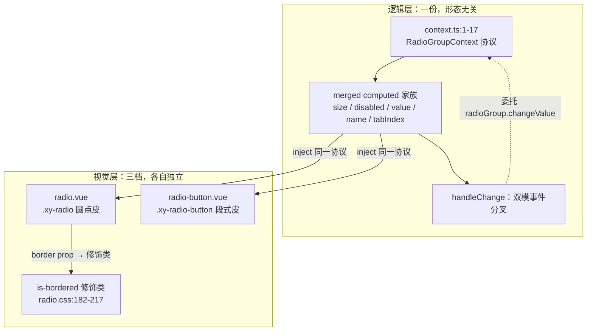
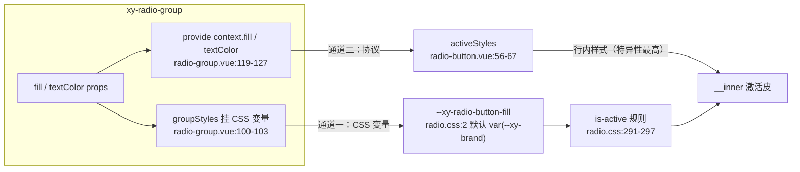

# 6-05 · Radio：三形态一个 context

> 本篇源码坐标（均为当前工作区实态）：
> - `packages/components/radio/src/radio.vue`（圆点形态，108 行）
> - `packages/components/radio/src/radio-button.vue`（按钮形态，107 行）
> - `packages/components/radio/src/context.ts`（协议定义，17 行）
> - `packages/components/radio/src/radio-group.vue`（provide 端，171 行）与 `radio.ts` / `radio-button.ts` / `radio-group.ts` 三个类型文件
> - 样式：`packages/theme/src/components/radio.css`（343 行，三形态视觉分档全在这一个文件里）
> - 测试：`packages/components/radio/__tests__/radio.spec.ts`（391 行）
> - 类型夹具：`tests/types/fixtures/radio.ts`（52 行）；文档示例：`apps/docs/examples/radio/`

上一篇 6-04 拆完 Cascader 的级联面板，卷六回到"老朋友做深做透"的节奏。Radio 这个样本，4-09《group 复合模式》已经用掉了一次：那一篇站在 **radio-group 的 provide 端**，讲协议怎么定义、级联怎么合并、事件怎么收口。本篇换个站位——站到 **radio 自己**这一边，回答一个 4-09 只点了一句的问题：

**button 形态的视觉特化如何不碰逻辑？**

radio 家族对使用者暴露三种长相：圆点单选框、带边框的卡片式单选、以及一整排拼在一起的段式按钮（`xy-radio-button`）。这三种形态共享同一套 `RadioGroupContext` 协议、同一组 merged computed、同一份 `handleChange` 事件链——但在样式层是三段完全独立的视觉实现。逻辑层一个字都不为形态分叉而改，视觉层一寸都不与逻辑纠缠，这条边界是怎么画出来的？本篇把它拆到行级。

## 一、考据先行：三形态的精确边界

动手之前先把"三形态"这个词考据清楚，因为直觉容易给出错误答案。翻实码可以确认，radio 家族的三形态**不是三个平行的组件**，它们的载体分属两类：

| 形态 | 视觉 | 载体 | 类型层 | 样式层 |
| --- | --- | --- | --- | --- |
| 圆点 radio | 圆圈 + 内点 + 旁侧文字 | `radio.vue` | `RadioProps` | `radio.css:47-180`（`.xy-radio`） |
| bordered 卡片 | 圆点形态外包一层边框卡片 | 仍是 `radio.vue`，`border` prop | `RadioProps.border` | `radio.css:182-217`（`.is-bordered` 修饰类） |
| button 段式 | 拼缝相连的整块按钮 | 独立 SFC `radio-button.vue` | `RadioButtonProps` | `radio.css:219-343`（`.xy-radio-button`） |

关键事实有两条。**第一，bordered 不是独立组件**——它是 `radio.vue` 上的一个 prop（`radio.ts:14` 的 `border?: boolean`）映射成的一个修饰类（`radio.vue:57` 的 `props.border ? "is-bordered" : ""`），DOM 结构与圆点形态完全相同，只是样式层加了一层卡片皮。**第二，radio-button 是独立 SFC 文件，但它的 script 与 `radio.vue` 几乎逐行同构**——107 行对 108 行，`handleChange` 十六行逐字符相同，computed 链只差三个成员。两种载体选择（同组件修饰类 vs 独立文件复制逻辑）在本库里各用了一次，这本身就是第一处值得解剖的设计决策，第四节正面回答。

先看形态分叉的全景图——逻辑层是一份，视觉层分三档：



注意图里那条 `border prop → 修饰类` 的边：bordered 形态在逻辑上只是 `radioClasses` 数组多拼一个字符串，在视觉上是 `radio.css` 里独立的三十六行。形态分叉的全部成本被压缩在这两个位置，其余所有代码对形态无知。

## 二、radio.vue 全文展开：双模消费端的三段式

4-09 引过 `radio.vue` 的 26-49（inject 双模）、66-81（事件链）、84-108（模板）三段，重点在"双模"本身。本篇全文展开，补上 4-09 没拆的部分：props 装配、类名族、`hasLabel` 与模板的层级设计。双模机制（`currentValue` 分水岭、`inputId` 三元、`tabIndex` roving tabindex）已经讲透的只回指不重复。

### 2.1 装配段：props、事件签名与注入

```vue
<!-- packages/components/radio/src/radio.vue:8-49 -->
const props = withDefaults(defineProps<RadioProps>(), {
  id: undefined,
  modelValue: undefined,
  label: undefined,
  disabled: false,
  size: undefined,
  name: undefined,
  border: false
});

const emit = defineEmits<{
  "update:modelValue": [value: RadioProps["value"]];
  change: [value: RadioProps["value"]];
}>();

const slots = useSlots();
const ns = useNamespace("radio");
const { size: globalSize } = useConfig();
const formItem = inject(formItemKey, null);
const form = inject(formKey, null);
const radioGroup = inject(radioGroupContextKey, null);

const focus = ref(false);

const mergedSize = computed(() => props.size ?? radioGroup?.size.value ?? form?.props.size ?? globalSize.value);
const mergedDisabled = computed(() => Boolean(props.disabled || radioGroup?.disabled.value || formItem?.disabled.value));
const currentValue = computed(() => radioGroup?.modelValue.value ?? props.modelValue);
const checked = computed(() => currentValue.value === props.value);
const currentName = computed(() => props.name ?? radioGroup?.name.value);
const inputId = computed(() => props.id ?? (!radioGroup ? formItem?.inputId : undefined));
const hasLabel = computed(() => Boolean(slots.default) || props.label !== undefined);
const tabIndex = computed(() => {
  if (mergedDisabled.value) {
    return -1;
  }

  if (radioGroup && !checked.value) {
    return -1;
  }

  return 0;
});
```

`withDefaults`（8-16 行）里所有参与级联的字段——`id`、`modelValue`、`label`、`size`、`name`——全部显式声明为 `undefined`，与 4-09 分析 group 端时发现的套路完全一致：**参与合并的字段必须让"未传"可区分**，默认值会污染级联链。唯一给了默认值的两个是 `disabled: false` 和 `border: false`——前者是"布尔合并链的起点"（OR 合并里 `false` 是幺元，不遮蔽任何上层），后者是纯视觉开关、不参与级联，给 `false` 是安全的。一个 defaults 块里哪些字段能带默认值、哪些必须留空，判据就是"它在不在一条 `??`/`||` 合并链上"。

`focus`（第 30 行）是全文唯一的本地 ref，也是唯一一个"组件自己拥有的瞬时状态"——原生 input 聚焦时置真，失焦置假（模板 96-97 行），只服务于 `is-focus` 类。选中态、禁用态、尺寸全都走派生计算，唯独焦点是 DOM 事件驱动的瞬态，没有理由也不适合做成 computed。

`hasLabel`（第 38 行）是 4-09 没提的一个 computed：`Boolean(slots.default) || props.label !== undefined`。它决定模板里文字 span 渲不渲染，判据是"有默认插槽内容或有 label prop"。注意两者的优先级——插槽内容永远盖过 `label`（模板 103-105 行的 `<slot>{{ props.label }}</slot>` fallback 结构），这是 4-04 讲过的"插槽优先于 prop"惯例在最小组件上的体现。

### 2.2 类名族与事件链：两层类、一次分叉

```vue
<!-- packages/components/radio/src/radio.vue:51-81 -->
const radioClasses = computed(() => [
  ns.base.value,
  `${ns.base.value}--${mergedSize.value}`,
  checked.value ? "is-checked" : "",
  mergedDisabled.value ? "is-disabled" : "",
  focus.value ? "is-focus" : "",
  props.border ? "is-bordered" : ""
]);

const inputClasses = computed(() => [
  `${ns.base.value}__input`,
  checked.value ? "is-checked" : "",
  mergedDisabled.value ? "is-disabled" : ""
]);

async function handleChange() {
  if (mergedDisabled.value || checked.value) {
    return;
  }

  if (radioGroup) {
    await radioGroup.changeValue(props.value);
    emit("change", props.value);
    return;
  }

  emit("update:modelValue", props.value);
  await nextTick();
  emit("change", props.value);
  await formItem?.validate("change");
}
```

`radioClasses`（51-58 行）六个成员，前两个是身份（基类 + 尺寸修饰），后四个是状态（选中、禁用、聚焦、边框）。这正是 BEM 修饰体系里"块 + 修饰符"的标准装配。值得多看一眼的是 `inputClasses`（60-64 行）：它把 `is-checked` / `is-disabled` 又往 `__input` 这个内层 span 上挂了一份。翻遍 `radio.css`，根上的状态类是所有视觉规则的主锚点（比如 152 行 `.xy-radio.is-checked .xy-radio__inner`），而 `__input` 上的状态类只有一个消费点——`radio.css:172` 的防御性选择器 `.xy-radio__input.is-disabled + .xy-radio__label`。换句话说，`inputClasses` 的 `is-checked` 目前是**零消费的防御性冗余**。这不是浪费：类名挂两层意味着样式规则可以从任意一层锚定，将来若 DOM 结构调整（比如 label span 移出 input span），选择器不用改 JS——"状态类宁多勿缺"是样式层和逻辑层解耦的常见保险，代价只是几个字节的 class 字符串。

`handleChange`（66-81 行）是 4-09 第 4.1 节的主角：受管分支 `await radioGroup.changeValue(props.value)` 后补发自己的 `change`、刻意不发 `update:modelValue`；自治分支则按 `update:modelValue → nextTick → change → 校验` 的顺序走完整链。本篇不再展开语义，只留一个形态视角的伏笔：这段函数将在 `radio-button.vue` 里**逐字符重现**——它是"逻辑层一份"的最硬证据。

### 2.3 模板段：label 包裹、原生 input、双 span 皮

```vue
<!-- packages/components/radio/src/radio.vue:84-108 -->
<template>
  <label :class="radioClasses">
    <span :class="inputClasses">
      <input
        :id="inputId"
        class="xy-radio__original"
        type="radio"
        :name="currentName"
        :checked="checked"
        :value="props.value"
        :disabled="mergedDisabled"
        :tabindex="tabIndex"
        @focus="focus = true"
        @blur="focus = false"
        @change="handleChange"
      />
      <span class="xy-radio__inner" />
    </span>
    <span v-if="hasLabel" class="xy-radio__label">
      <slot>
        {{ props.label }}
      </slot>
    </span>
  </label>
</template>
```

模板是标准的三层结构：最外层 `<label>` 包裹一切（原生 label 的包裹式关联让点击文字也能切换选项，不需要任何 JS 转发）；中间 `__input` span 装着原生 input 和自定义皮的圆点 `__inner`；右侧 `__label` span 放文字。原生 input 的 `:checked`、`:disabled`、`:tabindex`、`:name` 全部绑定到 script 里的 merged computed 上——4-09 的结论在这里复述一遍：**模板对"自己在哪种模式"保持无知，双模的所有复杂度都被消化在 script 里**。

还有一个不起眼的细节：第 89 行的 `class="xy-radio__original"` 是**硬编码字符串**而不是 `ns` 拼接。全文件唯一一处不走 `useNamespace` 的类名，说明 `__original` 是一个跨形态固定、绝不变异的钩子——它在 `radio-button.vue:90` 以 `xy-radio-button__original` 的名字再次出现。下一节会看到，这个钩子连同它的样式定义（`radio.css:90-96` 与 `225-231`），是整个 a11y 方案的支点。

## 三、原生 input 的隐藏与 a11y 代偿

现在回答第一个设计权衡：**自定义皮画得再花，底层始终是一个原生 `<input type="radio">`——把它藏起来的方式，决定了无障碍能力剩下多少。**

实码里的答案（`radio.css:90-96`，`radio-button` 版本 225-231 行逐字相同）：

```css
/* packages/theme/src/components/radio.css:90-96 */
.xy-radio__original {
  position: absolute;
  inset: 0;
  margin: 0;
  opacity: 0;
  cursor: inherit;
}
```

四个属性，每一个都有替代方案，每一个替代方案都会砍掉一种能力：

- **`display: none`？** 元素彻底退出渲染树，不可聚焦、键盘方向键失效、`change` 事件无从谈起，表单序列化也会丢掉它。等于自己从零实现一遍 radio 的键盘语义——成本极高收益为零。
- **`visibility: hidden` / `width: 0`？** 同样脱离可交互区域，焦点环和点击热区都没了。
- **`opacity: 0` + `position: absolute; inset: 0`？** 视觉上消失，但**仍然在布局与可交互体系里**：可以聚焦、可以响应方向键与空格、可以把 `change` 事件发出来、参与表单提交。圆点形态里它铺满 18px 的 `__input` 盒子（70-78 行），按钮形态里直接铺满整个按钮（父级 `label` 是 `position: relative`，见 219-223 行）。

这就是"隐藏原生控件"的标准姿势：**藏的是皮，留的是骨**。但皮藏掉之后，原生控件的三个视觉反馈就没了着落——悬停态、聚焦环、选中态——必须由自定义皮逐一代偿。看 `radio.css` 怎么接：

```css
/* packages/theme/src/components/radio.css:142-150 */
.xy-radio:hover .xy-radio__inner,
.xy-radio.is-focus .xy-radio__inner {
  border-color: color-mix(in srgb, var(--xy-brand) 24%, var(--xy-border));
  background: color-mix(in srgb, var(--xy-brand-soft) 28%, var(--xy-bg-floating));
}

.xy-radio__original:focus-visible + .xy-radio__inner {
  box-shadow: 0 0 0 3px color-mix(in srgb, var(--xy-brand) 10%, transparent);
}
```

第一段用 `is-focus` 类（script 里 `focus` ref 驱动）画聚焦时的边框与底色；第二段是整个方案里最精妙的一行：`:focus-visible` 伪类挂在**被藏起来的原生 input** 上，用相邻兄弟选择器 `+` 把焦点环**桥**回自定义皮 `__inner`。为什么一定要用 `:focus-visible` 而不是 `.is-focus` 类？因为两者语义不同——`is-focus` 在鼠标点击时也会亮（原生 input 聚焦了），而 `:focus-visible` 只在**键盘导航**时命中。键盘用户 Tab 进来能看到 3px 的聚焦环，鼠标用户点击则不会被一个突兀的环打扰——"键盘有环、鼠标无环"正是焦点可访问性的教科书要求，一行选择器就守住了。

顺手补齐另外两态的代偿：选中态 152-164 行（`.is-checked .xy-radio__inner` 换边框、上底色、`::after` 内点从 `scale(0)` 放大到 `scale(1)`，112-123 行的过渡动画让选中有一帧弹性），禁用态 166-180 行（`cursor: not-allowed`、透明度 0.6、底色沉下去）。四态俱全，原生控件被藏掉的所有反馈都在皮上有了对应物。

这个方案的代账本要如实记：**皮必须自己维护四态**，而且每一态都是"原生控件本来免费送、自定义之后自己画"的成本。好处则是双份的——视觉完全受设计令牌控制（所有颜色走 `--xy-brand` 系语义变量，双主题自动跟随），同时键盘语义、屏幕阅读器语义（原生 radio 的 role、状态播报）一分钱没花。`label` 包裹式关联 + `inputId` 的组内让渡（4-09 讲过的三元）补完最后一块：点击文字切换、form-item 的 for 关联，都建立在"原生 input 真的还在那里"这个事实上。

## 四、radio-button.vue：换皮不换骨

终于到本篇的核心问题。先看答案的实物——`radio-button.vue` 的 script 全文，我会把与 `radio.vue` 的异同标注在解读里：

```vue
<!-- packages/components/radio/src/radio-button.vue:8-67 -->
const props = withDefaults(defineProps<RadioButtonProps>(), {
  modelValue: undefined,
  label: undefined,
  disabled: false,
  size: undefined,
  name: undefined
});

const emit = defineEmits<{
  "update:modelValue": [value: RadioButtonProps["value"]];
  change: [value: RadioButtonProps["value"]];
}>();

const slots = useSlots();
const ns = useNamespace("radio");
const { size: globalSize } = useConfig();
const formItem = inject(formItemKey, null);
const form = inject(formKey, null);
const radioGroup = inject(radioGroupContextKey, null);

const focus = ref(false);

const mergedSize = computed(() => props.size ?? radioGroup?.size.value ?? form?.props.size ?? globalSize.value);
const mergedDisabled = computed(() => Boolean(props.disabled || radioGroup?.disabled.value || formItem?.disabled.value));
const currentValue = computed(() => radioGroup?.modelValue.value ?? props.modelValue);
const checked = computed(() => currentValue.value === props.value);
const currentName = computed(() => props.name ?? radioGroup?.name.value);
const hasLabel = computed(() => Boolean(slots.default) || props.label !== undefined);
const tabIndex = computed(() => {
  if (mergedDisabled.value) {
    return -1;
  }

  if (radioGroup && !checked.value) {
    return -1;
  }

  return 0;
});

const buttonClasses = computed(() => [
  `${ns.base.value}-button`,
  `${ns.base.value}-button--${mergedSize.value}`,
  checked.value ? "is-active" : "",
  mergedDisabled.value ? "is-disabled" : "",
  focus.value ? "is-focus" : ""
]);

const activeStyles = computed(() => {
  if (!checked.value) {
    return undefined;
  }

  return {
    backgroundColor: radioGroup?.fill.value,
    borderColor: radioGroup?.fill.value,
    color: radioGroup?.textColor.value,
    boxShadow: radioGroup?.fill.value ? `-1px 0 0 0 ${radioGroup.fill.value}` : undefined
  };
});
```

逐项对照 `radio.vue`：`mergedSize`、`mergedDisabled`、`currentValue`、`checked`、`currentName`、`hasLabel`、`tabIndex` 七个 computed **逐字符相同**；inject 的三个 key（formItem、form、radioGroup）相同；`focus` ref 相同。差异精确地只有四处：

1. **没有 `border` / `inputId`**。`RadioButtonProps`（`radio-button.ts:4-11`）根本没有 `border` 字段——按钮形态天然有边框，border 修饰类对它无意义；`inputId` 的缺席更有意思，圆点形态需要它来做 form-item 的 for 关联，按钮形态的文字就是按钮皮本身，没有独立文字 span，for 关联的需求随之消失。
2. **类名族整体换前缀**：`xy-radio-button`、`xy-radio-button--{size}`，且选中类从 `is-checked` 换成了 **`is-active`**——同为"选中"，两个形态在样式层用了不同的状态词，为的是给两段 CSS 各自独立的语义空间，互不误伤。
3. **多了 `activeStyles`**——激活色的行内样式兜底，下小节单独拆。
4. `handleChange` 在 69-84 行逐字符重现（仅 `RadioProps["value"]` 换成 `RadioButtonProps["value"]`）。

这就是"换皮不换骨"的实态：**骨（逻辑）是复制品级的相同，皮（类名族 + 模板结构 + activeStyles）是彻底的独立**。模板差异也印证这一点——`radio-button.vue:87-107`：

```vue
<!-- packages/components/radio/src/radio-button.vue:69-107 -->
async function handleChange() {
  if (mergedDisabled.value || checked.value) {
    return;
  }

  if (radioGroup) {
    await radioGroup.changeValue(props.value);
    emit("change", props.value);
    return;
  }

  emit("update:modelValue", props.value);
  await nextTick();
  emit("change", props.value);
  await formItem?.validate("change");
}
</script>

<template>
  <label :class="buttonClasses">
    <input
      class="xy-radio-button__original"
      type="radio"
      :name="currentName"
      :checked="checked"
      :value="props.value"
      :disabled="mergedDisabled"
      :tabindex="tabIndex"
      @focus="focus = true"
      @blur="focus = false"
      @change="handleChange"
    />
    <span class="xy-radio-button__inner" :style="activeStyles">
      <slot v-if="hasLabel">
        {{ props.label }}
      </slot>
    </span>
  </label>
</template>
```

模板少了一整层：圆点形态是 `label > span(__input) > input + span(__inner)` + 旁侧 `__label` 文字，按钮形态砍成 `label > input + span(__inner)` 两层——没有圆点、没有独立文字区，`__inner` 直接包住内容当整块皮。原生 input 从"铺在 18px 圆点上"变成"铺满整个按钮"。

### 4.1 activeStyles：激活色的双通道兜底

`activeStyles`（56-67 行）是 button 形态唯一新增的逻辑，值得逐行拆。它只在选中时返回一个行内样式对象：背景色与边框色取 `radioGroup?.fill.value`，文字色取 `radioGroup?.textColor.value`，外加一条 `-1px 0 0 0` 的阴影——先按下不表，第五节和拼缝一起看。

注意数据来源：`fill` 和 `textColor` **不在 `RadioButtonProps` 里**，它们是 `radio-group.ts:32-33` 的 group 级 prop。也就是说按钮形态的激活色**只能从组级配置**，单个 `xy-radio-button` 自己没有配色的权利——`fill`/`textColor` 是"一排按钮共享一个激活色"的组语义，协议把它放在 group 层是天经地义的边界划分（4-09 说过：协议只搬运子项渲染所需的最小状态集，而这里的 `fill` 是视觉状态、`textColor` 是视觉状态，经由 `RadioGroupContext.fill/textColor` 两个 `Ref` 成员下发——它们确实在协议里，因为子项要拿来算行内样式）。

但故事没这么简单——同一个 `fill` 实际上有**两条通道**同时在工作：



通道一是纯 CSS 的：`radio-group.vue:100-103` 的 `groupStyles` 把两个 prop 转成自定义属性挂在组根上，`radio.css:291-297` 的 `is-active` 规则消费 `var(--xy-radio-button-fill)`。通道二走 JS：`provide` 的协议里带 `fill`/`textColor`，子项算出行内样式。两通道的分工由**特异性**天然裁决——CSS 变量通道提供默认值（`radio.css:2` 里 `--xy-radio-button-fill: var(--xy-brand)`，不传 fill 时浅底 brand 字的激活态全靠它），行内样式通道在 fill 显式传入时覆盖（Vue 对值为 `undefined` 的样式键不输出，所以 `activeStyles` 未选中或未传 fill 时对 DOM 零干扰）。

这里有个精读才发现的考据点，4-09 的叙述值得修正一处细节：`radio-group.vue:102` 同样把 `textColor` 挂成了 `--xy-radio-button-text-color`（默认值见 `radio.css:3`），但翻遍 `radio.css` 全文 343 行，**没有任何一行消费 `var(--xy-radio-button-text-color)`**——这条 CSS 变量通道只铺了管道、没通水。`textColor` 实际上是单通道生效（仅行内样式），与 `fill` 的真双通道不同。管道先铺好、水以后再通，是预留；但如果按"两条通道都在用"来理解 `textColor`，就会误判它的生效路径。

顺着这条管道还能看到一个事实上的使用契约：`fill` 与 `textColor` 必须**成对传**。推演一下单传 `fill` 的场景——`activeStyles` 的 `color` 键取到 `undefined` 不输出，落回 CSS 规则 `radio.css:294` 的 `color: var(--xy-radio-button-fill)`，而这个变量已被 `groupStyles` 覆盖为同一个 `fill` 值：**实底 fill 上叠同色文字，不可读**。测试与文档示例全部成对传值（`radio.spec.ts:172-173`、`209-210`，`apps/docs/examples/radio/button.vue:41-42`），说明作者们默契地遵守了这个契约，但契约本身只活在惯例里——这是本库 radio 家族留给我们的一条"类型管不到的约定"，若要收紧，方向是把 fill 单传在开发期警告掉。

### 4.2 独立文件复制逻辑，还是抽 composable 共享？

现在正面回答核心问题的架构层：为什么 button 形态选择"独立 SFC + 逻辑复制"，而不是别的方案？把可选路线摆全：

**方案 A：单组件 + variant prop。** 在 `radio.vue` 里加一个 `variant: "dot" | "button"`，模板与类名族按 prop 分叉。缺点立现：模板出现 `v-if` 分支，类名族出现三元拼接，两种 DOM 结构（三层 vs 两层）挤在一个文件里，`__input` 盒子与按钮皮互相拉扯；更要命的是类型层——`border` 只对 dot 有意义、`fill` 只对 button 有意义，variant 一加，props 接口就得做"条件类型"，`RadioProps` 与 `RadioButtonProps` 合成一个带判别字段的大接口，使用方的类型提示全面劣化。

**方案 B：抽 `useRadio` composable。** 逻辑真正单源，两个 SFC 各写模板。看起来最优雅，但细算账就不划算了：共享部分是七个 computed 加一个函数，而两个形态的 computed 家族本就高度同构——抽出去之后，每个 computed 的返回类型、每个 `radioGroup?.` 可选链都要在 composable 里重新表达一遍泛型与可空性；换来的收益是"改一处两形态生效"，可这个收益的真实频率极低——radio 的逻辑层自协议定型后极少变动，变的全是视觉（本篇拆的 343 行 CSS 就是证据）。为低频变化付出一层间接性、把两个自包含文件变成三个互相依赖的文件，是负收益。

**方案 C（本库实态）：独立 SFC，逻辑复制。** `radio-button.vue` 与 `radio.vue` 两个自包含文件，script 同构、模板与类名族彻底分家。复制的代价由两个机制兜住：其一，复制面是**机械同构**的——`handleChange` 逐字符相同、computed 链只差三个成员，review 时 diff 即可核对，不需要理解；其二，同构性被测试锚死——`radio.spec.ts:289-309` 的用例专门把两种形态放进同一个 form size 级联链里断言（`xy-radio--lg` 与 `xy-radio-button--lg` 必须同时出现），谁改了哪边的合并链，测试当场报错。

EP 的选择提供了旁证：Element Plus 的 `el-radio-button` 同样是独立的 `radio-button.vue` 文件，同样复制了一份子项逻辑而没有抽共享 composable。两个互不抄袭的主流实现做出同一个选择，说明在"两形态、逻辑低频变"的约束下，复制就是均衡解。本库与 EP 的差异在于复制的**干净度**——EP 的 radio 早年 `label` 既是选中值又是文案（后来补 `value` prop 分离），本库第一版就 `value` / `label` / 默认插槽三者分离（`radio.ts:7-9`），让复制出去的逻辑不含历史包袱；EP 的 `fill`/`text-color` 只走 CSS 变量通道，本库是 CSS 变量 + 协议 + 行内样式兜底的双通道（4.1 节），激活色的优先级语义更明确。

**结论：形态特化不碰逻辑的真正含义，不是"逻辑共享"，而是"逻辑相同且被锁定相同"。** 共享靠抽象（间接层、可空性表达成本），锁定靠同构 + 测试（直白、可 diff）。radio 家族选了后者。

## 五、radio.css：三段式视觉分档

逻辑层的故事讲完了，现在下到样式层看"皮"怎么分档。`radio.css` 全文 343 行，结构天然分三段：1-45 行 group 容器，47-217 行圆点形态（含 bordered），219-343 行按钮形态。逐段看分档点。

### 5.1 容器段：形态连容器都要感知

```css
/* packages/theme/src/components/radio.css:1-20 */
.xy-radio-group {
  --xy-radio-button-fill: var(--xy-brand);
  --xy-radio-button-text-color: var(--xy-bg-container);
  display: inline-flex;
  align-items: flex-start;
  flex-wrap: wrap;
  gap: 12px 20px;
  width: fit-content;
  max-width: 100%;
}

.xy-radio-group--vertical {
  flex-direction: column;
  gap: 12px;
}

.xy-radio-group--button {
  gap: 0;
  flex-wrap: nowrap;
}
```

第 2-3 行是激活色的默认锚点（4.1 节的双通道起点），17-20 行是容器的形态感知：组内只要出现了 button 形态，`gap` 立刻归零、换行禁止——段式按钮靠 `margin-left: -1px` 拼缝相连（269-271 行），`gap` 一非零拼缝就断裂。谁决定追加这个 `--button` 修饰类？`radio-group.vue:67-94` 的 `isButtonGroup`：`type === "button"` 时直接判定，否则对默认插槽做一次 BFS，穿透 `Fragment` 找 `XyRadioButton` 类型的 vnode。4-09 讲过这个 BFS"只探测类型、不收集实例"，本篇补充它在形态体系里的角色：**形态是子项的属性，但形态的布局后果溢出到了容器**——拼缝、gap、换行都是容器级的，于是容器必须嗅探形态。这是三形态体系里唯一的"跨层感知"，其余一切分叉都被关在各自的层里。

### 5.2 圆点形态：一个皮的两档

主形态的核心机制第三节已经拆过（90-96 藏 input、112-123 内点动画、142-180 四态代偿），这里看第二档——bordered。同一个 DOM、同一个组件，`is-bordered` 修饰类叠上去之后：

```css
/* packages/theme/src/components/radio.css:182-217 */
.xy-radio.is-bordered {
  min-height: 40px;
  padding: 0 14px 0 12px;
  border: 1px solid color-mix(in srgb, var(--xy-border-subtle) 88%, var(--xy-border));
  border-radius: var(--xy-radius-md);
  background: color-mix(in srgb, var(--xy-bg-floating) 97%, var(--xy-bg-subtle));
  transition:
    border-color var(--xy-transition-duration-fast) var(--xy-transition-timing),
    background-color var(--xy-transition-duration-fast) var(--xy-transition-timing),
    box-shadow var(--xy-transition-duration-fast) var(--xy-transition-timing);
}

.xy-radio.is-bordered:hover:not(.is-disabled) {
  border-color: color-mix(in srgb, var(--xy-brand) 18%, var(--xy-border));
  background: color-mix(in srgb, var(--xy-brand-soft) 22%, var(--xy-bg-floating));
}

.xy-radio--sm.is-bordered {
  min-height: 34px;
  padding: 0 12px 0 10px;
}

.xy-radio--lg.is-bordered {
  min-height: 46px;
  padding: 0 16px 0 14px;
}

.xy-radio.is-bordered.is-checked {
  border-color: color-mix(in srgb, var(--xy-brand) 18%, var(--xy-border-subtle));
  background: color-mix(in srgb, var(--xy-brand-soft) 46%, var(--xy-bg-floating));
  box-shadow: inset 0 0 0 1px color-mix(in srgb, var(--xy-brand) 8%, transparent);
}

.xy-radio.is-bordered.is-disabled {
  background: color-mix(in srgb, var(--xy-bg-sunken) 92%, var(--xy-bg-subtle));
}
```

bordered 的实现哲学是**修饰类叠加，不重写基础规则**：基础段的 `.xy-radio__inner` 圆点、`::after` 内点原封不动，bordered 只在根上补边框、内边距、最小高度和一套"hover/checked/disabled × bordered"的组合态。注意 194 行的 `:hover:not(.is-disabled)`——修饰类一旦引入新交互面（整块卡片可点），状态组合就爆炸出"bordered 且 disabled 不该有 hover 反馈"这类细颗粒规则，这是修饰类路线的真实成本：组合态的数量随修饰符数量相乘。文档示例 `apps/docs/examples/radio/bordered.vue` 把 `border` 用在 form 场景里（11 行的 help 文案直接点明"border 适合更强调点击区域的设置面板"），对应 `radio.spec.ts:42-58` 的用例断言。

尺寸档在两个形态上的映射方式不同但尺度统一：圆点形态改 `__input` 盒子的 16/18/20px 与字号（80-88、62-68 行），bordered 改 `min-height` 的 34/40/46px（199-207 行），按钮形态改 `min-height` 的同款 34/40/46px（273-283 行）。**形态可以长得完全不一样，尺度档必须一致**——这是三形态能混排进同一个 form 而不破功的底层保证，也是 289-309 行那个测试用例在视觉层的对应物。

### 5.3 按钮形态：拼缝是主角

```css
/* packages/theme/src/components/radio.css:233-297 */
.xy-radio-button__inner {
  position: relative;
  display: inline-flex;
  align-items: center;
  justify-content: center;
  min-height: 40px;
  padding: 0 16px;
  border: 1px solid color-mix(in srgb, var(--xy-border-subtle) 88%, var(--xy-border));
  background: color-mix(in srgb, var(--xy-bg-floating) 97%, var(--xy-bg-subtle));
  color: var(--xy-text-secondary);
  font-size: var(--xy-font-size-md);
  line-height: 1;
  cursor: pointer;
  user-select: none;
  transition:
    color var(--xy-transition-duration-fast) var(--xy-transition-timing),
    border-color var(--xy-transition-duration-fast) var(--xy-transition-timing),
    background-color var(--xy-transition-duration-fast) var(--xy-transition-timing),
    box-shadow var(--xy-transition-duration-fast) var(--xy-transition-timing);
  text-align: center;
}

.xy-radio-button:first-child .xy-radio-button__inner {
  border-top-left-radius: var(--xy-radius-md);
  border-bottom-left-radius: var(--xy-radius-md);
}

.xy-radio-button:last-child .xy-radio-button__inner {
  border-top-right-radius: var(--xy-radius-md);
  border-bottom-right-radius: var(--xy-radius-md);
}

.xy-radio-button:first-child:last-child .xy-radio-button__inner {
  border-radius: var(--xy-radius-md);
}

.xy-radio-button:not(:first-child) .xy-radio-button__inner {
  margin-left: -1px;
}

.xy-radio-button--sm .xy-radio-button__inner {
  min-height: 34px;
  padding: 0 13px;
  font-size: var(--xy-font-size-sm);
}

.xy-radio-button--lg .xy-radio-button__inner {
  min-height: 46px;
  padding: 0 18px;
  font-size: var(--xy-font-size-lg);
}

.xy-radio-button:hover .xy-radio-button__inner {
  color: var(--xy-brand);
  border-color: color-mix(in srgb, var(--xy-brand) 16%, var(--xy-border));
  background: color-mix(in srgb, var(--xy-brand-soft) 24%, var(--xy-bg-raised));
}

.xy-radio-button.is-active .xy-radio-button__inner {
  background: color-mix(in srgb, var(--xy-brand-soft) 58%, var(--xy-bg-raised));
  border-color: color-mix(in srgb, var(--xy-radio-button-fill) 18%, var(--xy-border-subtle));
  color: var(--xy-radio-button-fill);
  z-index: 1;
  box-shadow: inset 0 0 0 1px color-mix(in srgb, var(--xy-radio-button-fill) 8%, transparent);
}
```

段式按钮的全部性格都在 255-271 行这组选择器里：圆角只给首尾（`:first-child` / `:last-child`，中间项直角对接），唯一儿子独享全圆角（265-267 行处理单选项成组的退化情况），相邻项 `margin-left: -1px` 让两条 1px 边框折叠成一条。拼缝成立的前提是容器 `gap: 0`——回看 5.1 节的 `--button` 修饰类，两处是咬合的。

再看 `is-active` 规则（291-297 行）与 `radio-button.vue:65` 那条 `-1px 0 0 0` 阴影的合谋：激活项 `z-index: 1` 抬到兄弟之上，配合负 margin，激活块的实底会盖住左侧邻居折叠进来的边框——这时行内样式的 `boxShadow: -1px 0 0 0 fill` 向左补一条 1px 的 fill 色，把被边框折叠吃掉的视觉缝填成激活色，激活块左缘才是干净的一条实线。这一招 EP 在 `el-radio-button` 的选中态里同样保留（`box-shadow: -1px 0 0 0 var(--el-radio-button-checked-bg-color)`），是段式按钮的标准补缝术；本库的差异是把它做成了**条件表达式**——`radio-button.vue:65` 只在 `fill` 显式传入时输出阴影，走 CSS 变量默认激活色的场景（`radio.css:291-297` 的浅底规则）不需要补缝，因为浅底不实盖邻居。

`fill` 未传时的默认激活态也在这段里看得完整：292 行背景是 `brand-soft` 调浅的浮起色（不是实底），294 行文字色是 `var(--xy-radio-button-fill)`（默认 `--xy-brand`）——浅底 brand 字，克制的一档；传了 `fill` 之后行内样式接管，切换成实底 fill + textColor 的一档。**同一个 `is-active` 类，两条配色档位**，由特异性和 `undefined` 不输出的规则自动切换，JS 端没有一行 if 在判断"用户传没传 fill"。剩余的焦点桥（326-329 行，`:focus-visible + __inner`，与圆点形态同款）和禁用态（331-343 行，含"激活且禁用"的组合态降档 339-343）把四态补齐，button 形态的样式段就此闭环。

至此可以把"CSS 类切换 vs 独立组件文件"的裁决说全了：**这个决策的最终执行地在样式层。** 逻辑层选了独立文件复制（4.2 节），样式层就顺势用完全独立的类名族（`xy-radio-button` 前缀、`is-active` 状态词）划界——两段 CSS 之间零共享选择器，唯一的咬合点是 `--xy-radio-button-fill` 这条 CSS 变量（容器挂、成员消费）和 `--button` 容器修饰类（容器自挂）。反过来，bordered 形态逻辑零分叉，样式层就用修饰类叠加。**逻辑差多少，皮就分多开；逻辑同多少，皮就叠多紧**——形态分叉的边界，在两个层里画了同一条线。

## 六、形态差异的测试锁定

三形态的"逻辑相同"不能靠自觉维持，测试要当契约用。`radio.spec.ts` 里聚焦形态差异的三组用例：

```typescript
// packages/components/radio/__tests__/radio.spec.ts:164-200
it("支持 radio-button 按钮化单选和自定义激活色", async () => {
  const value = ref<string | number | boolean>("day");

  const wrapper = mount(() =>
    h(
      XyRadioGroup,
      {
        modelValue: value.value,
        fill: "#0f766e",
        textColor: "#f8fafc",
        "onUpdate:modelValue": (nextValue) => {
          value.value = nextValue;
        }
      },
      {
        default: () => [
          h(XyRadioButton, { value: "day" }, () => "按天"),
          h(XyRadioButton, { value: "week" }, () => "按周"),
          h(XyRadioButton, { value: "month", disabled: true }, () => "按月")
        ]
      }
    )
  );

  const buttons = wrapper.findAll(".xy-radio-button");
  await buttons[1].get('input[type="radio"]').setValue(true);
  await nextTick();

  expect(value.value).toBe("week");
  expect(buttons[1].classes()).toContain("is-active");
  expect(buttons[1].get(".xy-radio-button__inner").attributes("style")).toContain(
    "background-color: rgb(15, 118, 110)"
  );

  await buttons[2].trigger("click");
  expect(value.value).toBe("week");
});
```

这个用例把 button 形态的四件事一次锁死：事件链走通（`value.value === "week"`，协议的 `changeValue` 生效）、选中类是 `is-active` 而非 `is-checked`（形态状态词的分界）、**行内样式真的生效**（`background-color: rgb(15, 118, 110)` 正是 `#0f766e` 的 RGB 展开——通道二的行内样式被直接断言，而不是只断言类名）、禁用项点击被吞（198-199 行点 disabled 项后值纹丝不动）。最后一条和圆点形态的 `radio.spec.ts:42-58`（disabled + border 用例）互为镜像——同一套 `handleChange` 的门槛判断，两个形态各验一遍，这正是"复制逻辑需要双份测试"的诚实之处：复制省下的抽象成本，有一半以测试翻倍的形式还了回去。

第二组锁 `options + type="button"` 的配置化渲染（`radio.spec.ts:202-235`）：断言容器类 `xy-radio-group--button`（容器嗅探生效）、批量渲染出三个 `.xy-radio-button`、`description` 文案在按钮形态里可见（`radio.css:299-324` 专门为按钮形态写了 option 描述的行内排版——描述文字在段式按钮里变成紧贴标签的小号注释，`white-space: nowrap`、`font-variant-numeric: tabular-nums`）。第三组是 4-09 之后新增的 size 级联用例（289-332 行）：`xy-form size="lg"` 穿过 group 同时落到 `xy-radio--lg` 与 `xy-radio-button--lg`——**同一个用例里两种形态同台**，这就是对"两份复制逻辑必须同构"的运行时断言；第二个用例（311-331 行）再验显式 size 对 form size 的覆盖次序，与 4-09 第 3.2 节"form 兜底放 group 层"的修复互为印证。

类型层同样有形态分档的档案。`tests/types/fixtures/radio.ts`（4-09 引过，本篇回指）里三个对象各管一形态：`radioProps`（5-13 行）带 `border: true`、`radioGroupProps`（17-33 行）带 `type: "button"` 与 `fill`/`textColor`、`radioButtonProps`（37-43 行）**没有 border 字段**——`@ts-expect-error` 想加也加不上。形态的能力差异在类型层就写死了：button 形态要配色去组上配（`fill` 在 `RadioGroupProps`），圆点形态要卡片去自身开（`border` 在 `RadioProps`）。夹具尾部的 `invalidGroupProps`（47-52 行）用 `direction: "grid"` 验证 `RadioGroupDirection` 字面量联合的拒绝能力，守住 group 侧类型边界。

出口装配上，`packages/components/radio/index.ts:26-35` 把三个入口全部挂出：`XyRadioGroup`、`XyRadioButton` 独立导出，`XyRadio` 上再挂 `Group` / `Button` 两个静态属性——三种形态在安装树上也是"一份主入口 + 两个挂件"，与"一个 context、三张皮"的结构严格对仗。

## 七、收束

把本篇的答案压缩回三句话：

1. **三形态不是三份实现，而是一份逻辑 + 两类载体 + 三段皮。** bordered 是同组件的修饰类，button 是独立 SFC 的复制逻辑；逻辑层（协议、computed 链、handleChange）在形态维度零分叉。
2. **button 形态的视觉特化不碰逻辑，靠的是"复制 + 锁定"而非"抽象 + 共享"。** script 逐字符同构、由 size 级联双形态用例锁定；视觉特化全部住在类名族、模板结构与 56-67 行的 `activeStyles` 里，且激活色走 CSS 变量（默认档）与行内样式（显式档）双通道，切换靠特异性而不是 if。
3. **藏骨留皮是有代账的。** `opacity: 0` 保住了键盘、读屏与表单语义，代价是四态视觉全靠 CSS 代偿，其中键盘焦点环必须用 `:focus-visible` 桥回自定义皮——"键盘有环、鼠标无环"这条 a11y 铁律，一行选择器守住。

三个权衡的档案：**修饰类 vs 独立文件**（bordered 选修饰类、button 选独立文件，判据是逻辑是否分叉）；**复制 vs composable**（逻辑低频变 + 机械同构时，复制是均衡解，EP 同款选择为旁证）；**藏 input 的 a11y 代偿**（原生语义免费，视觉四态自己画）。另有一处如实记录的瑕疵：`--xy-radio-button-text-color` 只铺未通，`fill` 单传会得到不可读的激活态——契约活在惯例里，类型与运行时都没有拦。

下一篇 6-06《Checkbox：min/max 约束》还是这个家族的近亲：同一套 group 协议搬到多选场景后，值从单值变成受控数组，`changeValue` 从"替换"变成"聚合"，协议里多出一个 radio 家族不存在的成员——`limitDisabled`（组满则未选项禁用，min/max 的裁决语义）。4-09 末尾我们预告过它，届时把"单选互斥靠原生、多选约束靠 JS"这条分界线拆开看。
