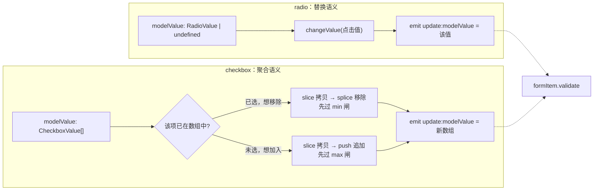
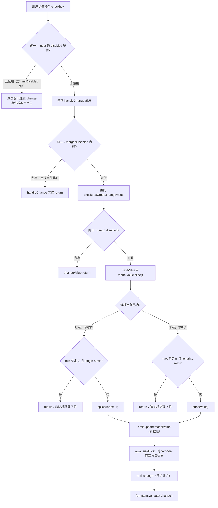
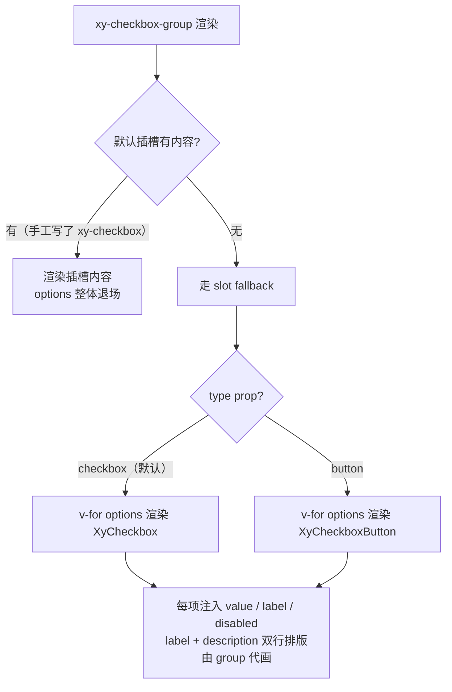

# 6-06 · Checkbox：min/max 约束与 options 配置化

> 本篇源码坐标（均为当前工作区实态）：
> - `packages/components/checkbox/src/checkbox.vue`（151 行）、`checkbox.ts`（23 行）
> - `packages/components/checkbox/src/checkbox-group.vue`（131 行）、`checkbox-group.ts`（31 行）、`context.ts`（20 行）
> - 对照组：`packages/components/checkbox/src/checkbox-button.vue`（127 行）
> - 样式：`packages/theme/src/components/checkbox.css`（316 行）
> - 测试：`packages/components/checkbox/__tests__/checkbox.spec.ts`（379 行）
> - 类型夹具：`tests/types/fixtures/checkbox.ts`（66 行）；文档示例：`apps/docs/examples/checkbox/`（8 个）

上一篇 6-05 拆完 Radio 的"三形态一个 context"，卷六继续在表单控件里做深。Checkbox 和 Radio 是仓库里血缘最近的两个家族：同一套 group 复合模式（4-09 用的主样本之一就是 checkbox-group 的协议）、同一套级联链路（4-08 与 4-09 都引过它的 size/disabled 链）、连文件布局都几乎逐一同构。但多选场景给这套近亲结构塞进了三个 radio 家族完全不存在的问题，本篇的核心问题就是它们——

**受控数组值怎么聚合？min/max 约束在哪一层裁决？options 配置化与 slot 声明怎么共存？**

外加一个常被混为一谈的附题：indeterminate 半选态到底是谁的。4-09 讲 group 协议时对这三件事都只点到为止，本篇把 checkbox 系自身拆到行级。

## 一、考据先行：从单值到数组，协议多了什么

动手拆实现之前，先把"多选"这个词在协议层造成的增量考据清楚。把 radio 与 checkbox 两个 context 摆在一起：

```ts
// packages/components/checkbox/src/context.ts:6-16
export interface CheckboxGroupContext {
  modelValue: Ref<CheckboxGroupValue>;
  disabled: Ref<boolean>;
  size: ComputedRef<ComponentSize>;
  name: ComputedRef<string>;
  fill: Ref<string | undefined>;
  textColor: Ref<string | undefined>;
  min: Ref<number | undefined>;
  max: Ref<number | undefined>;
  changeValue: (value: CheckboxValue) => Promise<void>;
}
```

对照 radio 侧的 `RadioGroupContext`（`packages/components/radio/src/context.ts:6-16`）：字段名一一对应，差异只有两处类型与两个成员——`modelValue` 从 `Ref<RadioValue | undefined>` 变成 `Ref<CheckboxGroupValue>`（数组），协议里多了 `min`/`max` 两个 `Ref<number | undefined>`。

数组值的类型定义在 `checkbox-group.ts:7`：`export type CheckboxGroupValue = CheckboxValue[]`，而 `CheckboxValue` 是 `string | number | boolean`（`checkbox.ts:3`）——注意是标量联合的数组，不是嵌套结构，这决定了后面所有聚合逻辑只需要 `findIndex` + `push`/`splice` 两种操作。

真正决定性的差异在 `changeValue` 的语义。radio 的实现（`radio-group.vue:105-117`）是**替换**：点击哪项就把 `modelValue` 替换成哪项的值，互斥由原生 radio 的行为兜底，JS 侧甚至不解释"为什么换"。checkbox 的实现是**聚合**：先复制当前数组，再按该项是否已选决定移除还是追加。两段代码摆在一起看：

```ts
// packages/components/radio/src/radio-group.vue:105-117 —— 替换语义
async function changeValue(value: RadioValue) {
  if (props.disabled || props.modelValue === value) {
    return;
  }

  emit("update:modelValue", value);
  await nextTick();
  emit("change", value);

  if (props.validateEvent) {
    await formItem?.validate("change");
  }
}
```

radio 的 `changeValue` 除了入口一道"组禁用或值未变"的守卫，剩下的就是原样转发——没有分支、没有数组手术，互斥交给原生 radio 的 DOM 行为兜底。checkbox 的 `changeValue`（下文第三节全文展开）则是一个有分支、有守卫、有数组手术的裁决器。**单选互斥靠原生控件 + 替换转发，多选约束靠 JS 聚合 + 数量裁决**——这条分界线是 checkbox 家族一切复杂性的根源，`min`/`max` 之所以必须进协议，正是因为"数组长度"这个新的状态维度只有 group 层看得见全局。

值模型的全景对照如下：



注意图里两个分支都先过一道"数量闸"再动数组——这正是 min/max 的落点，第三节正面拆。

## 二、checkbox.vue 全文展开：双模消费端的数组视角

4-09 引过 `checkbox.vue` 的几个切片：55 行的 mergedSize（四级 size 链的落点）、100-119 的 handleChange（两级事件接力）。本篇把 script 段从 `actualValue` 到 `tabIndex` 全文展开，补上 4-09 没拆的 `isChecked`、`limitDisabled` 与 `trueValue`/`falseValue`。

### 2.1 值三兄弟：actualValue、trueValue、falseValue

```vue
<!-- packages/components/checkbox/src/checkbox.vue:41-58 -->
const actualValue = computed<CheckboxValue>(() => {
  if (props.value !== undefined) {
    return props.value;
  }

  if (props.label !== undefined) {
    return props.label;
  }

  return true;
});

const trueValue = computed<CheckboxValue>(() => props.trueValue ?? true);
const falseValue = computed<CheckboxValue>(() => props.falseValue ?? false);
const mergedSize = computed(() => props.size ?? checkboxGroup?.size.value ?? form?.props.size ?? globalSize.value);
const currentName = computed(() => props.name ?? checkboxGroup?.name.value);
const inputId = computed(() => props.id ?? (!checkboxGroup ? formItem?.inputId : undefined));
const hasLabel = computed(() => Boolean(slots.default) || props.label !== undefined);
```

`actualValue`（41-51）是 value/label 双轨制：显式 `value` 优先，其次把 `label` 当值用（这是为迁移老用法留的兼容轨，EP 在 dev 分支已经对"label act as value"挂了 `useDeprecated`，本库还没走这一步），最后兜底布尔 `true`。组内模式下它就是"我在数组里的身份"——`includes` 和 `push`/`splice` 都拿它当查找键。

`trueValue`/`falseValue`（53-54）只服务自治模式，但这两行是 4-08 考据 `??` 与 `||` 语义差异的绝佳标本。这里用的是空值合并 `??`：只在 `null`/`undefined` 时回落。假设用户传 `falseValue: 0`（用数字表达开关态），`0 ?? false` 求值结果是 `0`—— falsy 但非空值，守住了；如果当年写的是 `||`，`0 || false` 会直接回落成 `false`，用户传的 `0` 被吞掉，"数字 0"与"布尔 false"两种状态坍缩成一种。**对允许 falsy 合法值的配置项，`??` 不是风格偏好，是正确性要求。**

不过这里有一个如实记录的类型错位：`CheckboxProps` 里两个 prop 的类型是 `trueValue?: string | number`（`checkbox.ts:15-16`），而运行时兜底却是布尔字面量 `true`/`false`（53-54 行）。也就是说类型层不允许你传 `trueValue: true`（boolean 不在联合里），运行时兜底却恰好是 `true`。实测影响很小——兜底值根本不会经由 prop 传入——但类型面与运行时面对"默认态"的解释并不一致，这算本篇考据出的第一处瑕疵档案。

### 2.2 isChecked 与 limitDisabled：数组成员判定 + 禁用面谓词

```vue
<!-- packages/components/checkbox/src/checkbox.vue:59-82 -->
const isChecked = computed(() => {
  if (checkboxGroup) {
    return checkboxGroup.modelValue.value.includes(actualValue.value);
  }

  if (props.modelValue !== undefined) {
    return props.modelValue === trueValue.value;
  }

  return props.checked;
});
const limitDisabled = computed(() => {
  if (!checkboxGroup) {
    return false;
  }

  if (isChecked.value) {
    return checkboxGroup.min.value !== undefined && checkboxGroup.modelValue.value.length <= checkboxGroup.min.value;
  }

  return checkboxGroup.max.value !== undefined && checkboxGroup.modelValue.value.length >= checkboxGroup.max.value;
});
const mergedDisabled = computed(() => Boolean(props.disabled || checkboxGroup?.disabled.value || limitDisabled.value || formItem?.disabled.value));
const tabIndex = computed(() => (mergedDisabled.value ? -1 : props.tabindex ?? 0));
```

`isChecked`（59-69）是双模分水岭的又一次标准演出：组内走 `includes`（"我是不是数组成员"），自治走与 `trueValue` 的全等比较，最后兜底 `checked` prop（非受控的一次性初值）。4-04 讲受控/非受控双模时的结论在这里依然成立：`props.checked` 是非受控轨，`modelValue` 是受控轨，受管模式下干脆连自己的值都不持有——真值永远在 group 的数组里。

`limitDisabled`（70-80）是本篇的主角之一，值得逐行读。它只在受管模式生效（71-73 行自治直接 `false`——单个 checkbox 没有"约束"可言），然后以**自身的选中态**为分派条件：

- **已选项看 min**（75-77 行）：`min` 有定义且组内长度 `<= min` 时，这个已选项被禁用——再取消它，长度就要跌破下限；
- **未选项看 max**（79 行）：`max` 有定义且组内长度 `>= max` 时，这个未选项被禁用——再勾上它，长度就要突破上限。

这个谓词的方向值得咀嚼：它禁用的**不是"被约束的选项"，而是"会破坏约束的那一步操作"**。禁用面永远是单向的——min 锁已选、max 锁未选，两组人马互不重叠。一个 `min=1, max=2`、已选 1 项的组里：被锁的是那 1 个已选项；勾上第 2 项之后锁面立即翻转成"2 个已选项（若 min=2）+ 其余未选项（max=2）"。禁用面是**随数组长度实时流动的**，这是它和静态 `disabled` prop 在心智模型上的本质区别。

`mergedDisabled`（81 行）把 `limitDisabled` 并进四元或链：自身 prop → group 注入 → 约束禁用 → formItem 注入。这里再次印证 4-09 的那条分类法——**布尔合并无序、`??` 回落有序**：size 是有序 `??` 链（55 行，顺序错就是 4-08 记录过的遮蔽事故），disabled 是无序或链（四个来源谁先谁后无所谓，因为这是无副作用的布尔合并）。顺带补一个 4-09 之后的实态细节：55 行子项链里的 `form?.props.size` 段，在受管模式下是**被遮蔽的死段**——group 层修复（`checkbox-group.vue:38-40` 的注释）后，注入的 `size` 恒回落到 `globalSize` 非空，永远轮不到子项再兜 form；但自治模式下这一段是活段。一段代码在两种模式下分别扮演死代码和活代码，这正是"必须在 group 层插 form 兜底"修复留下的形状——修复没有删除子项的 form 段，因为自治模式还需要它。

`tabIndex`（82 行）跟着 `mergedDisabled` 走：禁用即 `-1`，被 min/max 锁住的项同时被移出 Tab 序——鼠标不可点、键盘也不可达，两条输入通道对约束的服从是一致的。

### 2.3 handleChange：两级接力与载荷的不对称

```vue
<!-- packages/components/checkbox/src/checkbox.vue:100-119 -->
async function handleChange() {
  if (mergedDisabled.value) {
    return;
  }

  if (checkboxGroup) {
    await checkboxGroup.changeValue(actualValue.value);
    emit("change", actualValue.value);
    return;
  }

  const nextValue = isChecked.value ? falseValue.value : trueValue.value;
  emit("update:modelValue", nextValue);
  await nextTick();
  emit("change", nextValue);

  if (props.validateEvent) {
    await formItem?.validate("change");
  }
}
```

结构上与 radio 的 `handleChange` 同构（4-09 拆过），但有一个 radio 没有的细节值得点名：**同名 `change` 事件在两级上的载荷不对称**。组内分支（105-108 行）子项自己 emit 的 `change` 载荷是单值 `actualValue`——"我这一项被点了"；group 层的 `change` 载荷是整个数组——"组现在的样子"。监听 `xy-checkbox` 的 `change` 拿到的是一项的值，监听 `xy-checkbox-group` 的 `change` 拿到的是全组数组，两个事件同名不同物。这是双模组件的老问题（自治模式的 `change` 载荷又是 `trueValue`/`falseValue` 域的值），使用侧必须自知身处哪一层。

还有一处分层纪律：组内分支不触发 `formItem?.validate`——校验由 group 统一发起（`checkbox-group.vue:80-82`），一次变更只校验一次；自治分支才自己调（116-118 行）。组内那次点击虽然经过了子项的 `handleChange`，但"组的变更"这个语义归 group 所有，校验跟着语义走，不跟着 DOM 事件走。

## 三、min/max 约束：三道闸的防御纵深

现在把镜头推到 group 层。`checkbox-group.vue` 的 `changeValue` 与 `provide` 段全文如下：

```vue
<!-- packages/components/checkbox/src/checkbox-group.vue:55-95 -->
async function changeValue(value: CheckboxValue) {
  if (props.disabled) {
    return;
  }

  const nextValue = props.modelValue.slice();
  const index = nextValue.findIndex((item) => item === value);
  const checked = index > -1;

  if (checked) {
    if (props.min !== undefined && nextValue.length <= props.min) {
      return;
    }
    nextValue.splice(index, 1);
  } else {
    if (props.max !== undefined && nextValue.length >= props.max) {
      return;
    }
    nextValue.push(value);
  }

  emit("update:modelValue", nextValue);
  await nextTick();
  emit("change", nextValue);

  if (props.validateEvent) {
    await formItem?.validate("change");
  }
}

provide(checkboxGroupContextKey, {
  modelValue: toRef(props, "modelValue"),
  disabled: toRef(props, "disabled"),
  size: mergedSize,
  name: groupName,
  fill: toRef(props, "fill"),
  textColor: toRef(props, "textColor"),
  min: toRef(props, "min"),
  max: toRef(props, "max"),
  changeValue
});
```

先看数组手术本身。60 行 `props.modelValue.slice()` 是整个函数的地基：**先拷贝，后手术，emit 出去的是新数组**。这是 Vue 单向数据流的教科书守则——props 是只读契约，直接 push/splice 到 `props.modelValue` 上属于变更父组件数据，Vue 甚至会在开发态告警；而拷贝之后再改动、把新引用 emit 出去，v-model 的父组件接管后整条链路都是不可变更新。`findIndex` 用全等匹配（61 行），`CheckboxValue` 是标量联合，全等语义没有歧义。

然后是 min/max 闸。注意它们的判定对象是**拷贝出来的 `nextValue.length`**，也就是"当前选中数"：

- 移除分支（64-68 行）：`min !== undefined && length <= min` 时 `return`——当前已经踩在下限上，再删就破了；
- 追加分支（70-73 行）：`max !== undefined && length >= max` 时 `return`——当前已经顶到上限，再加就破了。

### 3.1 判定流全景：一次点击要过几道闸

把子项与 group 两层串起来，一次用户点击从发生到落地（或被吞）要过三道闸：



三道闸的性质并不相同，这正是本节要论证的设计权衡——**min/max 采用了"三道闸防御纵深"，而不是单点裁决**：

- **闸一是浏览器语义**。`limitDisabled` 并入 `mergedDisabled` 后落到 `:disabled`（`checkbox.vue:132`），而被 min/max 锁住的项同时被 `tabIndex = -1` 移出 Tab 序。真实用户交互在闸一就被物理拦截——disabled 控件既不响应点击也不派发 change。
- **闸二是子项的事件门槛**。`handleChange` 开头检查 `mergedDisabled`，拦的是不经过浏览器交互路径的合成事件（测试里 `setValue` 直接派发 change 就是典型）。
- **闸三是 group 的裁决闸**。`checkboxGroupContextKey` 是公开的注入键，任何组内代码都能拿到 `changeValue` 直接调用；而且 min/max 是运行时 prop，理论上存在"子项判定与 group 判定之间 props 变更"的窗口。闸三保证数组手术前的最后一刻仍以 group 层看到的最新状态为准。

代价也要如实记录：**同一个 min/max 谓词在仓库里写了两遍**——`checkbox.vue:70-80` 的 `limitDisabled`（按项：决定哪些项该禁用）与 `checkbox-group.vue:64-73`（按次：决定这一次操作放不放行）。两者是同一谓词的两个投影——禁用面是"空间视角"（对每个选项静态求值），裁决闸是"时间视角"（对每次变更动态拦截）——但形式上是两段独立代码，改公式必须人肉同步两处。6-05 在 radio-button 的复制逻辑上讨论过"复制税"，这里又收了一笔：这两段没法合并（一个住在子项的渲染决策里，一个住在 group 的方法里），只能靠测试锁死同构，`checkbox.spec.ts:165-200` 的 min/max 用例正是这个同步契约的执行者（第六节展开）。

### 3.2 与 Element Plus 对照：同向谓词，不同闸位

min/max 这套语义不是本库发明，EP 的 `el-checkbox-group` 早就提供了同名 prop。把 EP dev 分支的实码拉出来对读，差异比想象的大。EP 的禁用谓词住在独立的 composable 里：

```ts
// element-plus: packages/components/checkbox/src/composables/use-checkbox-disabled.ts（节选）
const isLimitDisabled = computed(() => {
  const max = checkboxGroup?.max?.value
  const min = checkboxGroup?.min?.value
  return (
    (!isUndefined(max) && model.value.length >= max && !isChecked.value) ||
    (!isUndefined(min) && model.value.length <= min && isChecked.value)
  )
})
```

真值表与本库 `limitDisabled` 完全同向：max 顶满禁未选、min 踩底禁已选。表达风格不同——EP 写成扁平布尔一行流，本库按 `isChecked` 分支早退，自上而下读出来就是"选中的怕减破 min、没选的怕加破 max"的自然语言顺序——两种写法没有高下，本库的分支写法对 code review 更友好一点。真正分道扬镳的是**数组手术与超限闸的位置**。EP 的 input 上挂的是原生 `v-model="model"`，`model` 的 getter 直通 `checkboxGroup.modelValue.value`：

```ts
// element-plus: packages/components/checkbox/src/composables/use-checkbox-model.ts（节选）
const model = computed({
  get() {
    return isGroup.value
      ? checkboxGroup?.modelValue?.value
      : !isControlled.value
        ? selfModel.value
        : props.modelValue
  },
  set(val: unknown) {
    if (isGroup.value && isArray(val)) {
      isLimitExceeded.value =
        checkboxGroup?.max?.value !== undefined &&
        val.length > checkboxGroup?.max.value &&
        val.length > model.value.length
      isLimitExceeded.value === false && checkboxGroup?.changeEvent?.(val)
    } else {
      emit(UPDATE_MODEL_EVENT, val)
      selfModel.value = val
    }
  },
})
```

也就是说 EP 把数组聚合的活儿交给了 Vue 的 `v-model` 指令：`vModelCheckbox` 的 change 处理器（vuejs/core `packages/runtime-dom/src/directives/vModel.ts`）在数组模式下执行 `assign(modelValue.concat(elementValue))` 或 `[...modelValue]` 后 `splice`——同样是不可变拷贝——然后调用 assigner 进入上面的 `model.set`。EP 的超限闸设在 **setter 时点**：数组已经拼好了，set 时发现"长度超过 max 且在增长"就置 `isLimitExceeded`，拒绝转交 `changeEvent`。

对照之下有两条实质差异，值得作为移植参考记档：

1. **闸位与时点**：EP 是"先手术后拦截"（setter 时点），且**事件级闸只看 max**——min 侧只有 UI 禁用面，没有事件级守卫；本库是"先裁决后手术"（`changeValue` 先判后改），min/max 双侧都有事件级闸。EP 的方案依赖 Vue 指令的既有行为，代码量小；本库的方案把聚合所有权收在 group 自己手里，两侧约束的强度对齐。
2. **谁来动数组**：EP 的手术者是 Vue 内置指令（`vModelCheckbox`），本库是手写的 `slice` + `findIndex` + `push`/`splice`。手写多十几行，换来的是不依赖指令的行为细节（比如指令对 `Set`、`looseIndexOf` 的处理路径），并且 `changeValue` 作为协议成员可以暴露给任何注入方复用——代价是上一节说的谓词双写。

还有一层 UX 细节两家一致，顺带记档：min/max 是**变迁守卫，不是状态断言**。初始 `modelValue` 给了 5 项而 `max=2`，或程序直接赋值绕过 UI，库都不会纠正、不告警——但守卫天然自愈：超限的存量挡不住用户往回取消（移除分支只看 min），欠收的存量也挡不住往里补（追加分支只看 max）。约束只管"下一刀"，不审计"存量"，这是两个库共同的选择，也意味着表单层的"至少选 N 项"这类**状态断言**仍然该交给 form 校验规则（`checkbox.spec.ts:202-254` 的表单用例演示的正是这个分工：min/max 管交互可达性，validator 管最终状态）。

## 四、options 配置化：fallback 渲染的边界

group 的另一半主角是 options。先看数据形状（`checkbox-group.ts:10-15`）：

```ts
// packages/components/checkbox/src/checkbox-group.ts:10-31
export interface CheckboxOption {
  label: string;
  value: CheckboxValue;
  disabled?: boolean;
  description?: string;
}

export interface CheckboxGroupProps {
  modelValue?: CheckboxGroupValue;
  options?: CheckboxOption[];
  type?: "checkbox" | "button";
  disabled?: boolean;
  size?: ComponentSize;
  name?: string;
  direction?: CheckboxGroupDirection;
  validateEvent?: boolean;
  ariaLabel?: string;
  fill?: string;
  textColor?: string;
  min?: number;
  max?: number;
}
```

`CheckboxOption` 四个字段：`label`（必填字符串）、`value`、`disabled`、`description`。比 radio 的 option 多出来的描述文案 `description`，是配置化渲染里唯一"富排版"的字段。渲染端全文如下：

```vue
<!-- packages/components/checkbox/src/checkbox-group.vue:98-131 -->
<template>
  <div
    :class="groupClasses"
    :style="groupStyles"
    role="group"
    :aria-label="props.ariaLabel ?? 'checkbox-group'"
  >
    <slot>
      <component
        :is="optionComponent"
        v-for="option in props.options"
        :key="String(option.value)"
        :value="option.value"
        :label="option.label"
        :disabled="option.disabled"
      >
        <span
          :class="[
            `${ns.base.value}-group__option`,
            option.description ? 'has-description' : ''
          ]"
        >
          <span :class="`${ns.base.value}-group__option-label`">{{ option.label }}</span>
          <span
            v-if="option.description"
            :class="`${ns.base.value}-group__option-description`"
          >
            {{ option.description }}
          </span>
        </span>
      </component>
    </slot>
  </div>
</template>
```

这段模板的骨架 4-09 只点过一句"options fallback"，本篇拆开三个关键机制。

**第一，slot fallback 的互斥语义。** `<slot>` 的默认内容就是整个 options 渲染——Vue 的插槽机制决定了：调用方一旦提供默认插槽，fallback 整体退场，`options` 数据一个字都不再看。所以 options 与 slot 不是"叠加"关系而是"二选一"：要么全数据驱动（传 `options`），要么全手工声明（写子组件），没有"options 为主、个别项插槽覆写"的中间态。这是本篇的第二处设计权衡，第五节展开。

**第二，`optionComponent` 的二态切换。** 模板里渲染的是动态组件，而 `optionComponent` 是个三行 computed（`checkbox-group.vue:42`）：`props.type === "button" ? CheckboxButton : Checkbox`。配置化渲染顺带把"形态切换"也配置化了——`type="button"` 时同一份 options 数据渲染成按钮组（`fill`/`textColor` 两个配色 prop 也只在这个形态下被 `checkbox-button.vue:76-87` 的 `activeStyles` 消费；圆点形态下它们是静默的 no-op）。`:key="String(option.value)"` 的 String 化是因为 `CheckboxValue` 含 boolean，直接拿布尔做 key 虽然能跑但不规范，统一字符串化省心。

**第三，label 与 description 的排版由 group 代画。** fallback 给每个子组件传了 `:label="option.label"` 同时又塞了默认插槽（113-127 行的 span 结构）——slot 内容优先于 label prop 渲染，这里传 label 更多是保险（子项的 `hasLabel` 判定两条路都通）。description 的视觉约定住在 CSS：`has-description` 类（117 行按需拼接）把选项容器从水平 flex 翻成竖排（`checkbox.css:28-33`），描述文字用 `--xy-text-muted` 加小号字号（`checkbox.css:41-45`）。这套排版是 group 层的"标准化渲染"，也是 fallback 模式的能力上限——它只能画这一种长相。

容器本身是 `role="group"` + `aria-label` 默认 `"checkbox-group"`（102-103 行），与 radio 的 `role="radiogroup"` 不同——checkbox 每一项自带原生语义，组不需要 radiogroup 那样的强语义包裹，一个中性的 group 足够。

渲染决策流：



这里有一处与 radio 家族的不对称，如实记档：radio 的 fallback 里包了一层 `<slot name="option" :option="option" :checked="…" :disabled="…" :type="…">`（`radio-group.vue:146-152`）——调用方可以逐项接管 option 的渲染还能拿到选中态作用域数据；checkbox 的 fallback（105-129 行）没有这层作用域插槽，想要别的排版只能整体放弃 options 改手写。同一家族、同一模式，配置化能力不对齐，是本篇考据出的第二处瑕疵档案——不算 bug（checkbox 的场景里 label+description 覆盖面更高），但属于"模式复制时丢了半件行李"。

## 五、indeterminate：三态的属主裁决

半选态是 checkbox 独有的第三种视觉状态。先给结论：**本库里 indeterminate 与 min/max 在源码上零耦合**——min/max 的 UI 表达走的是 disabled 面（第三节），indeterminate 是一个独立的、完全由调用方驱动的 prop。任务直觉里"到达上限后未选项的禁用"与"半选态"容易并成一回事，实码定论是两套机制、两个属主。

### 5.1 属主权衡：prop 驱动，不派生

`indeterminate` prop 在组件里的全部消费就三处：`spanKls` 拼出 `is-indeterminate` 类（`checkbox.vue:96`）、透传给原生 input 的 DOM property（134 行 `:indeterminate="props.indeterminate"`）、以及驱动 `aria-checked="mixed"`（137 行）。组件自己**从不计算**这个 prop——哪个 checkbox 该是半选，全看调用方给什么。

为什么不让组件自动派生？看官方示例的标准场景就明白了：

```vue
<!-- apps/docs/examples/checkbox/indeterminate.vue -->
<script setup lang="ts">
import { computed, ref } from "vue";

const allCities = ["上海", "北京", "广州"];
const checkedCities = ref<string[]>(["上海"]);

const checkAll = computed({
  get: () => checkedCities.value.length === allCities.length,
  set: (value: boolean) => {
    checkedCities.value = value ? [...allCities] : [];
  }
});

const isIndeterminate = computed(
  () =>
    checkedCities.value.length > 0 && checkedCities.value.length < allCities.length
);
</script>

<template>
  <div class="xy-doc-stack">
    <xy-checkbox v-model="checkAll" :indeterminate="isIndeterminate" border>
      全选城市
    </xy-checkbox>

    <xy-checkbox-group v-model="checkedCities">
      <xy-checkbox v-for="city in allCities" :key="city" :value="city">
        {{ city }}
      </xy-checkbox>
    </xy-checkbox-group>

    <xy-text size="sm">当前选择：{{ checkedCities.join("，") || "未选择" }}</xy-text>
  </div>
</template>
```

注意结构：**"全选"根本不在 group 里**——22 行的全选框是一个自治的 `xy-checkbox`（自己 `v-model="checkAll"`），group 只包了三个城市项。全选框的选中态与半选态都从"组外视角"派生：可写 computed（7-12 行）的 getter 判"是否全选"、setter 决定全选/清空，`isIndeterminate`（14-17 行）判"选了一部分"。

假如让组件自动派生半选态，全选框只有两条路：要么作为成员加入 group——那"全选"自己也会进 `modelValue` 数组，污染数据；要么组件发明一套"主从 checkbox"协议——group 得知道谁是主、主的值不进数组、派生规则还得兼容 min/max 之类的复杂度。两条路都是为省调用方三行 computed 而引入一套新协议，得不偿失。**prop 驱动的属主裁决让组件保持"哑"，把"全选"这个业务语义完整留给调用方组合**——EP 同款选择（`el-checkbox` 的 `indeterminate` 也是纯 prop，官方 demo 同样手写 computed），这是两家在"组件智能化边界"上的共识。顺带一提，示例里的可写 computed 是这个场景的惯用范式：getter/setter 分别承担"读状态"与"发指令"，比 watch 手动同步干净得多。

DOM 侧还有一个容易忽略的细节：`:indeterminate` 传给原生 input 走的是 **DOM property 而非 HTML attribute**——`indeterminate` 是 `HTMLInputElement` 的实例属性，HTML 规范里根本没有对应 attribute，Vue 的 patchProp 会因 `key in el` 命中而走 property 赋值。无障碍侧则用 `aria-checked="mixed"` 表达三态（137 行），它只在 `props.indeterminate` 为真时输出 `'mixed'`，与组的选中比例无关——再次强调属主在调用方。

### 5.2 CSS：对勾与横杠共用一个盒子的双伪元素

三态的视觉实现是 `checkbox.css` 里最精致的一段，全文引用：

```css
/* packages/theme/src/components/checkbox.css:112-176 */
.xy-checkbox__inner::after {
  content: "";
  position: absolute;
  top: 45%;
  left: 50%;
  width: 4px;
  height: 8px;
  border: solid var(--xy-bg-container);
  border-width: 0 2px 2px 0;
  transform: translate(-50%, -58%) rotate(45deg) scale(0);
  transition: transform var(--xy-transition-duration-fast) var(--xy-transition-timing);
}

.xy-checkbox__inner::before {
  content: "";
  position: absolute;
  top: 50%;
  left: 50%;
  width: 8px;
  height: 2px;
  background: var(--xy-bg-container);
  transform: translate(-50%, -50%) scaleX(0);
  transition: transform var(--xy-transition-duration-fast) var(--xy-transition-timing);
}
```

（接 154-176 行的状态类）

```css
.xy-checkbox__input.is-checked .xy-checkbox__inner {
  border-color: var(--xy-brand);
  background: color-mix(in srgb, var(--xy-brand) 76%, var(--xy-bg-floating));
  box-shadow: inset 0 0 0 1px color-mix(in srgb, var(--xy-brand) 10%, transparent);
}

.xy-checkbox__input.is-checked .xy-checkbox__inner::after {
  transform: translate(-50%, -58%) rotate(45deg) scale(1);
}

.xy-checkbox__input.is-indeterminate .xy-checkbox__inner {
  border-color: var(--xy-brand);
  background: color-mix(in srgb, var(--xy-brand-soft) 50%, var(--xy-bg-floating));
}

.xy-checkbox__input.is-indeterminate .xy-checkbox__inner::before {
  transform: translate(-50%, -50%) scaleX(1);
  background: var(--xy-brand);
}

.xy-checkbox__input.is-indeterminate .xy-checkbox__inner::after {
  transform: translate(-50%, -58%) rotate(45deg) scale(0);
}
```

结构是"一个盒子、两根伪元素、默认全收起"：`::after` 是对勾（4×8 的 L 形边框旋转 45 度，默认 `scale(0)`，112-123 行），`::before` 是横杠（8×2 的实心条，默认 `scaleX(0)`，125-135 行）。选中态只放对勾（`is-checked` → `::after` scale(1)），半选态只放横杠（`is-indeterminate` → `::before` scaleX(1)），互不叠加。最讲究的是 174-176 行：半选态**显式把 `::after` 压回 `scale(0)`**——如果没有这一条，一个同时挂了 `is-checked` 和 `is-indeterminate` 的 DOM（调用方状态出错的场景）会出现对勾横杠叠影。CSS 层面把状态互斥做成了"后者覆盖前者"，即便类名组合非法，视觉也不会崩。底色也有分档：选中是品牌色 76% 混白，半选是品牌软色 50% 混白——半选明显更"轻"，符合它"部分完成"的语义。

至于 min/max 锁住的项，视觉上与普通禁用完全共用一套（`checkbox.css:182-191`：根节点 `opacity: 0.6`、`cursor: not-allowed`、内芯转 sunken 底色）——**约束禁用不发明新视觉**，这是本篇第三处权衡的落点：复用 disabled 的既有视觉语言，用户不需要学习"第三种灰"；代价是样式层无法区分"这个项被禁是因为约束"还是"天生禁用"，可访问性信息也只有 `disabled` 一个语义。以 checkbox 这种高频小控件而言，克制是正确的一侧。

## 六、测试与类型档案：同步契约的执行者

min/max 的行为锁在 `checkbox.spec.ts:165-200`：

```ts
// packages/components/checkbox/__tests__/checkbox.spec.ts:165-200
it("支持 min / max 限制", async () => {
  const values = ref<Array<string | number | boolean>>(["api"]);

  const wrapper = mount(XyCheckboxGroup, {
    props: {
      modelValue: values.value,
      min: 1,
      max: 2,
      options: [
        { label: "API", value: "api" },
        { label: "OAuth", value: "oauth" },
        { label: "SDK", value: "sdk" }
      ],
      "onUpdate:modelValue": (nextValue: Array<string | number | boolean>) => {
        values.value = nextValue;
      }
    }
  });

  const checkboxes = wrapper.findAll(".xy-checkbox");
  await checkboxes[0].get('input[type="checkbox"]').setValue(false);
  await nextTick();
  expect(values.value).toEqual(["api"]);

  await checkboxes[1].get('input[type="checkbox"]').setValue(true);
  await nextTick();
  expect(values.value).toEqual(["api", "oauth"]);
  await wrapper.setProps({
    modelValue: values.value
  });
  await nextTick();

  await checkboxes[2].get('input[type="checkbox"]').setValue(true);
  await nextTick();
  expect(values.value).toEqual(["api", "oauth"]);
});
```

这个用例精确覆盖了第三节判流图的三个关键节点。**第一段（185-187 行）**：`values=["api"]`、`min=1`，尝试取消唯一的已选项——注意此刻 "api" 这一项已经被 `limitDisabled` 打上了 `disabled` 属性（禁用面谓词先行），`setValue` 派发的 change 在闸二 `handleChange` 的 `mergedDisabled` 处被吞，`values` 纹丝不动。这一行测试同时在验证两道闸：闸一在真实浏览器里生效、闸二在测试环境里生效，而闸三在 `changeValue` 里候命——三道闸少任何一道，这个断言都可能以另一种方式失败。**第二段（189-195 行）**：勾上第 2 项放行（未选项此刻不被 max 锁，长度 1 < 2），然后 `setProps` 把父组件的值同步回去——这正是手写受控测试的必需动作，也顺带演示了 min=1 场景的"换选"路径：先勾新的（放行），长度变 2 后旧项的 min 锁自动解除，再取消旧的（此时才放行）。**第三段（197-199 行）**：长度顶到 `max=2`，勾第 3 项被拦，`values` 仍是 `["api", "oauth"]`——max 闸与禁用面（"sdk" 项此刻应带 disabled）共同收口。

options 配置化的行为锁在同文件 129-163（4-09 引过，回指）：`type="button"` 下 options 渲染出 3 个 `.xy-checkbox-button`、首项 `is-checked`、`description` 数据进 DOM、`disabled: true` 的 Legacy 项点击被吞。这两组用例合起来正好是本篇两大主题的镜像：一组锁"值怎么约束"，一组锁"项怎么渲染"。

类型侧，`tests/types/fixtures/checkbox.ts:32-48` 给 `CheckboxGroupProps` 铺了一条全字段记录，`min: 1`、`max: 3` 在列（44-45 行），`direction: "grid"` 的 `@ts-expect-error`（61-66 行）守住字面量联合边界。夹具里 `trueValue: 1`（21 行）合法也侧面印证了第二节的 `??` 讨论——数字 0/1 这类 falsy 值正是 `??` 链要保护的对象。

文档示例侧，`apps/docs/examples/checkbox/limit.vue` 是 min/max 的用户面：

```vue
<!-- apps/docs/examples/checkbox/limit.vue -->
<script setup lang="ts">
import { ref } from "vue";

const scopes = ref<Array<string | number | boolean>>(["read"]);
</script>

<template>
  <div class="xy-doc-stack">
    <xy-checkbox-group v-model="scopes" :min="1" :max="2">
      <xy-checkbox value="read">查看</xy-checkbox>
      <xy-checkbox value="edit">编辑</xy-checkbox>
      <xy-checkbox value="export">导出</xy-checkbox>
      <xy-checkbox value="delete">删除</xy-checkbox>
    </xy-checkbox-group>

    <xy-text size="sm">
      至少保留 1 项，最多选择 2 项。当前：{{ scopes.join("，") }}
    </xy-text>
  </div>
</template>
```

示例选择手工插槽而非 `options` 传参——四个权限项各配图标或后续富内容时插槽更从容，而 `group.vue` 示例演示的是 options 竖排 + description 的配置化路径。两个示例并排，正好把第四节"二选一"的使用边界摆在了文档用户眼前。

## 七、收束

把本篇的答案压缩回三句话：

1. **多选的本质是"数组值的聚合协议 + 数量维度的裁决权"。** `changeValue` 从 radio 的替换转发器变成"拷贝 → 分支 → min/max 裁决 → push/splice → emit 新数组"的裁决器，`min`/`max` 作为协议成员下发，因为只有 group 看得见数组长度这个全局量。
2. **min/max 用三道闸做防御纵深：浏览器语义（disabled 属性 + tabindex -1）→ 子项事件门槛（mergedDisabled）→ group 裁决闸（changeValue 先判后改）。** 禁用面（按项）与裁决闸（按次）是同一谓词的两个投影，双写必须人肉同步，由 165-200 的用例锁死；约束是变迁守卫而非状态断言，最终状态交给 form 校验。
3. **options 与 slot 是 fallback 语义下的二选一，indeterminate 的属主是调用方。** 配置化渲染换排版自由度，插槽声明换布局控制权；半选态 prop 驱动、绝不派生，"全选"作为业务语义留在组外组合。

权衡档案汇总：**indeterminate 属主**（prop 驱动 vs 自动派生，选择前者的理由是组合安全）；**min/max 禁用策略**（三道闸纵深 + 复用 disabled 视觉 vs 单点裁决 + 新视觉态）；**options 配置化 vs slot 声明**（数据驱动省样板 vs 插槽换自由，fallback 互斥没有中间态）；外加与 EP 的两条对照档案（谓词同向但闸位不同——EP 先手术后拦截且事件闸只看 max，本库先裁决后手术双侧对齐；数组手术的所有权一个交给 Vue 指令、一个收在 group）。

如实记录的三处瑕疵：`trueValue`/`falseValue` 类型声明（`string | number`）与运行时兜底（布尔 `true`/`false`）错位；checkbox 的 options fallback 缺了 radio 家族的 `option` 作用域插槽，配置化能力不对齐；min/max 不审计存量状态，非法初值静默通过（靠变迁守卫自愈 + 表单校验兜底）。

下一篇 6-07《Switch：最小受控范本》，我们从"最复杂"切到"最简单"：Switch 只有开合两态、没有 group、没有数组、没有约束——正因如此，它是观察"受控组件最少需要哪些零件"的最佳标本。checkbox 家族里那些为多选而生的复杂度，到时候会以"减法清单"的方式重新被看见。

---

*源码行号均核对自当前工作区实态；EP 对照代码取自 element-plus dev 分支 `packages/components/checkbox/src/composables/`，Vue 指令行为取自 vuejs/core v3.5.13 `packages/runtime-dom/src/directives/vModel.ts`。*
