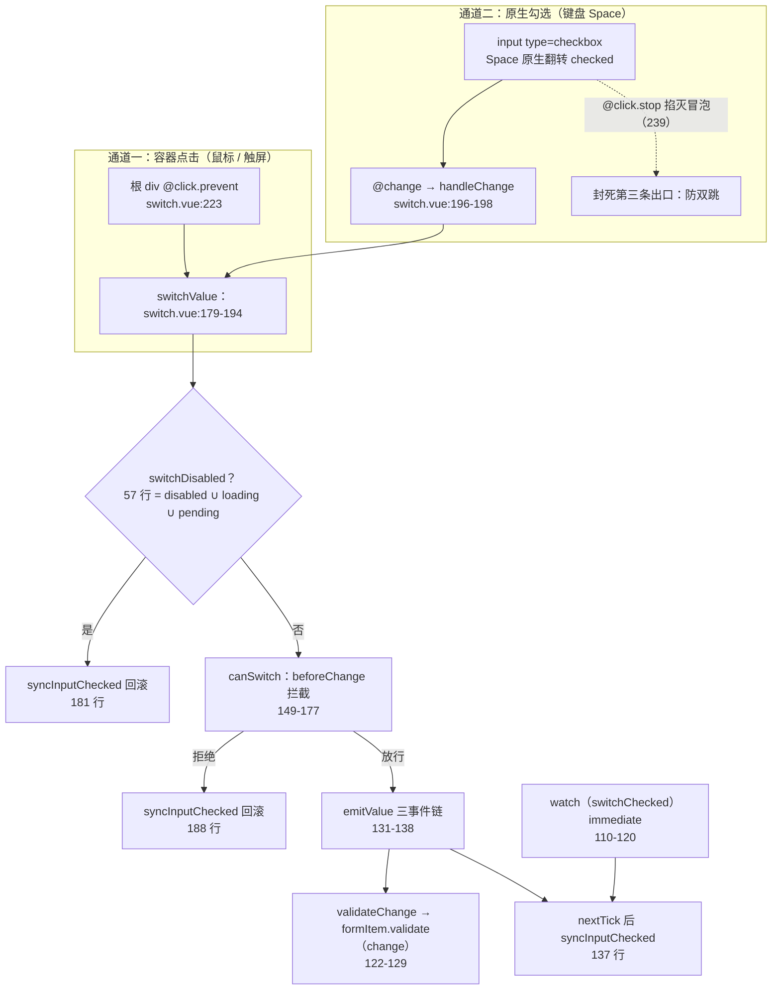
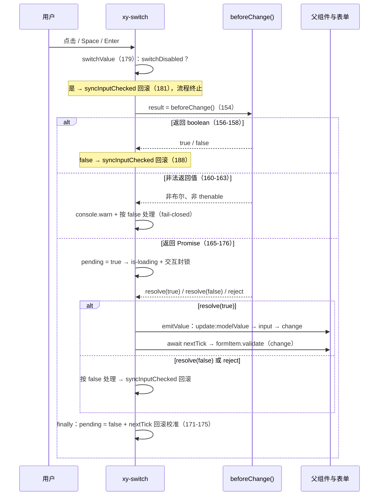

# 6-07 · Switch：最小受控范本

> 本篇源码坐标（均为当前工作区实态）：
> - `packages/components/switch/src/switch.vue`（314 行，逻辑与模板一体）
> - `packages/components/switch/src/switch.ts`（33 行，类型层）
> - 样式：`packages/theme/src/components/switch.css`（174 行，三档尺寸与全部视觉状态）
> - 测试：`packages/components/switch/__tests__/switch.spec.ts`（220 行，10 个用例，本机实跑全绿）
> - 类型夹具：`tests/types/fixtures/switch.ts`（35 行）；文档示例：`apps/docs/examples/switch/`（6 个）
> - 对照：Element Plus dev 分支 `packages/components/switch/src/switch.vue`（2026-09 摘录实码）

上一篇 6-06《Checkbox：min/max 约束》把 group 协议的多选形态拆完，本篇回到"单体最小"的一端。Switch 这个样本，4-04《受控/非受控双模的现状与考古》已经引用过它的四处代码：读路径一行的比较语义（`switch.vue:56`）、写路径的三事件链（`switch.vue:131-138`）、勾选态的硬同步（`switch.vue:104-108`）、以及返回 Promise 的异步拦截（`switch.vue:149-177`）。但那篇里它只是"纯受控 + 副作用 emit 链"这个机制判断的证物，一笔带过；本篇把这份 314 行的源码全文展开，正面回答分卷大纲给它定的核心问题——**双模 props 的最简正确实现**。

"最小受控范本"这六个字值得先考据清楚，因为它不是修辞。表单控件里比 switch 行数少的不是没有——Radio 圆点形态 108 行——但 radio 的完整契约要靠 radio-group 补齐；Input 有 598 行（6-02 实测），是工程化的上限样本。Switch 的特殊性在于：**它是"完整受控契约"的最小载体**——v-model、自定义值域、异步写前拦截、表单校验接入、a11y 三件套（role / aria / 键盘）、尺寸分档，表单控件该有的管道几乎都接了，而总共只有 314 行。4-04 在几百行上下文里抽象出的那条机制链，在这里每一环都能用肉眼盯完。

先给"双模 props"定个本篇口径：大纲说的是受控/非受控双模。Switch 给出的答案有点反直觉——**它的"最简正确"是只实现受控半边，而且不装作实现了另一半**。`modelValue` 有默认值 `false`（`switch.vue:15`），组件内部三个 `shallowRef`（`inputRef` / `isFocused` / `pending`，51-53 行）没有一个是值状态；不绑 `v-model` 时点击开关，事件被喊进空气，视图永远停在未选中。对照 EP：dev 分支的 switch 近期甚至长出了一个 `isControlled` 启发式（初始按 `modelValue !== false` 判定、`modelValue` 一旦变化即置 true，未受控时 `actualValue` 恒回落 `false`）——即便 EP，switch 的"非受控半边"也只是个占位符。两边殊途同归：开关这种二值控件，非受控用法没有真实需求，与其伪装双模，不如把受控模做到没有死角。这就是"最简正确"的第一层含义。

## 一、考据先行：双通道分发的全景图

动手之前先画全景。Switch 有个容易被忽略的结构事实：**同一个"切换"动作有两条入口通道**，最后汇流到同一个函数 `switchValue`（`switch.vue:179-194`）：

- **通道一（容器点击）**：鼠标或触屏点在开关本体的任何位置（轨道、拇指、两侧文字标签），落在根 `div` 的 `@click.prevent="switchValue"`（`switch.vue:223`）上；
- **通道二（原生勾选）**：键盘 Space 按在隐藏的原生 `<input type="checkbox">` 上，浏览器先把 `checked` 翻转、再派发 `change`，走到 `@change="handleChange"`（`switch.vue:240`），`handleChange` 只是 `switchValue` 的异步转发（196-198 行）。



这张图里藏着本篇要拆的全部线索：两条通道为什么要在 `switchValue` 汇流、`switchDisabled` 为什么把三个不相干的状态收进一个计算属性、`syncInputChecked` 为什么要在这么多地方出现（图里四处，代码里五个调用点，第三节对账）、以及 `beforeChange` 拦截为什么值得单独一节。下面按代码顺序逐段展开。

## 二、类型层与装配段：值域参数化的 props

先看类型层。`packages/components/switch/src/switch.ts` 全文 33 行，第一行就是本篇主角之一：

```ts
// packages/components/switch/src/switch.ts
import type Switch from "./switch.vue";
import type { ComponentSize } from "xiaoye-primitives";

export type SwitchValue = boolean | string | number;
export type SwitchValueChangeHandler = (value: SwitchValue) => void;
export type SwitchFocusHandler = (event: FocusEvent) => void;

export interface SwitchProps {
  modelValue?: SwitchValue;
  disabled?: boolean;
  loading?: boolean;
  size?: ComponentSize;
  width?: string | number;
  inlinePrompt?: boolean;
  inactiveActionIcon?: string;
  activeActionIcon?: string;
  activeIcon?: string;
  inactiveIcon?: string;
  activeText?: string;
  inactiveText?: string;
  activeValue?: SwitchValue;
  inactiveValue?: SwitchValue;
  name?: string;
  validateEvent?: boolean;
  beforeChange?: () => Promise<boolean> | boolean;
  id?: string;
  tabindex?: string | number;
  ariaLabel?: string;
}

export type SwitchInstance = InstanceType<typeof Switch>;

export const DEFAULT_LOADING_ICON = "mdi:loading";
```

`SwitchValue = boolean | string | number`（第 4 行）是理解"双模 props"的第二把钥匙。`modelValue`、`activeValue`、`inactiveValue` 三者同型，意味着开关的**值域是参数化的**：业务可以把开关接在 `boolean` 上，也可以接在 `"auto" | "manual"` 这样的字符串枚举上——文档示例 `apps/docs/examples/switch/text.vue:4-17` 就是活例，`v-model="mode"` 直接绑一个 `"auto" | "manual"` 的 ref，`active-value="auto"`、`inactive-value="manual"`。类型层不限制三者必须一致（`SwitchProps` 无法表达 `modelValue` 与 `activeValue` 同型的约束，TS 的接口做不到跨属性泛型绑定而不引入泛型参数），这层契约由运行时的比较语义兜底，第四节展开。

装配段的关键在默认值表：

```ts
// packages/components/switch/src/switch.vue:14-43
const props = withDefaults(defineProps<SwitchProps>(), {
  modelValue: false,
  disabled: false,
  loading: false,
  size: undefined,
  width: undefined,
  inlinePrompt: false,
  inactiveActionIcon: "",
  activeActionIcon: "",
  activeIcon: "",
  inactiveIcon: "",
  activeText: "",
  inactiveText: "",
  activeValue: true,
  inactiveValue: false,
  name: undefined,
  validateEvent: true,
  beforeChange: undefined,
  id: undefined,
  tabindex: undefined,
  ariaLabel: undefined
});

const emit = defineEmits<{
  "update:modelValue": [value: SwitchValue];
  change: [value: SwitchValue];
  input: [value: SwitchValue];
  focus: [event: FocusEvent];
  blur: [event: FocusEvent];
}>();
```

两个默认值是刻意设计的：`activeValue: true` / `inactiveValue: false`（27-28 行）——布尔是值域的默认落点，业务不传时 `switchChecked` 的比较退化为 `modelValue === true`，一切按最朴素的开关工作。事件签名五个（37-43 行），其中 `update:modelValue` / `input` / `change` 三者载荷完全相同，这是 4-04 说的"副作用 emit 链"的类型面：三个事件不是三个语义，是同一次写入向三类消费者（v-model、@input 习惯者、@change 习惯者）广播三次。

接下来是 computed 家族，这是装配段真正的重心：

```ts
// packages/components/switch/src/switch.vue:45-84
const attrs = useAttrs();
const slots = useSlots();
const formItem = inject(formItemKey, null);
const ns = useNamespace("switch");
const { size: globalSize } = useConfig();

const inputRef = shallowRef<HTMLInputElement | null>(null);
const isFocused = shallowRef(false);
const pending = shallowRef(false);

const mergedSize = computed(() => props.size ?? globalSize.value);
const switchChecked = computed(() => props.modelValue === props.activeValue);
const switchDisabled = computed(() => props.disabled || props.loading || pending.value);
const inputId = computed(() => props.id ?? formItem?.inputId);
const messageId = computed(() => (formItem?.message.value ? formItem.messageId : undefined));
const validateState = computed(() => formItem?.validateState.value ?? "idle");

const hasInactiveLabel = computed(
  () =>
    !props.inlinePrompt &&
    (Boolean(slots.inactive) || Boolean(props.inactiveIcon) || Boolean(props.inactiveText))
);
const hasActiveLabel = computed(
  () =>
    !props.inlinePrompt &&
    (Boolean(slots.active) || Boolean(props.activeIcon) || Boolean(props.activeText))
);

const switchKls = computed(() => [
  ns.base.value,
  `${ns.base.value}--${mergedSize.value}`,
  switchChecked.value ? "is-checked" : "",
  switchDisabled.value ? "is-disabled" : "",
  props.loading || pending.value ? "is-loading" : "",
  isFocused.value ? "is-focus" : "",
  props.inlinePrompt ? "is-inline-prompt" : "",
  validateState.value === "error" ? "is-error" : "",
  validateState.value === "success" ? "is-success" : "",
  attrs.class
]);
```

逐行点名几个值得停的位置。**56 行**是全组件的读路径，一行：`props.modelValue === props.activeValue`。注意是"只认 `activeValue`"的比较——如果业务的 `modelValue` 既不等于 `activeValue` 也不等于 `inactiveValue`（比如接口返回了 `null`），开关显示为**未选中**而不是报错；这与 EP 形成一组对照：EP 的 switch 在 setup 阶段有一段自愈逻辑，检测到 `modelValue` 不在 `activeValue/inactiveValue` 集合内时，直接连发三个事件把值强行重置为 `inactiveValue`。本库不做自愈——组件从不写 `modelValue`，只读。代价是非法值静默显示为未选中（连警告都没有），收益是受控纪律的绝对纯粹：**父组件的数据只能由父组件改**。这一笔权衡记入第八节。

**57 行**是本篇挖出的第一处"协议与实现的落差"：`formItemKey` 注入的 `FormItemContext` 协议（`packages/components/form/src/context.ts:51-61`）里明明有 `disabled: Ref<boolean>` 成员（context.ts:57，form-item 用于下发表单级禁用），但 `switchDisabled` 只收了 `props.disabled || props.loading || pending.value` 三个来源——**表单级禁用（`<xy-form disabled>`）对 xy-switch 无效**。6-02 拆过 Input 的 disabled 三级转发，radio 的 group 层也消费了 form 禁用；switch 没接这根管。文档 `apps/docs/components/switch.md` 的 API 表没有声明这个缺口，属于"协议在、消费缺席"的如实记录——不是 bug，但是边界。

**62-71 行**的 `hasInactiveLabel` / `hasActiveLabel` 决定两侧文字标签是否渲染：条件是"非 inlinePrompt 且（有插槽或有图标或有文字）"。`inlinePrompt` 把文案挪进轨道内部，两侧标签整体退场——模板层的分叉在装配段就预算好了。**73-84 行**的 `switchKls` 拼了十个成员，其中 78 行值得注意：`props.loading || pending.value` 才给 `is-loading`，而 77 行的 `is-disabled` 用的是 `switchDisabled`（含 pending）——所以**异步拦截等待期间，开关同时挂着 `is-disabled` 和 `is-loading` 两个类**：交互封锁与进行中提示并行不悖，这是 loading/pending 视觉语义的分工（locked but working）。

装配段最后两块是样式桥：

```ts
// packages/components/switch/src/switch.vue:86-102
const containerStyle = computed<StyleValue>(() => [attrs.style as StyleValue]);

const coreStyle = computed<Record<string, string>>(() => {
  if (props.width === undefined || props.width === null || props.width === "") {
    return {};
  }

  return {
    [ns.cssVarBlock("width")]:
      typeof props.width === "number" ? `${props.width}px` : String(props.width)
  };
});

const nativeAttrs = computed<Record<string, unknown>>(() => {
  const { class: _class, style: _style, ...rest } = attrs;
  return rest;
});
```

`coreStyle`（88-97 行）把 `width` prop 写成 **CSS 变量**而不是行内宽度——`ns.cssVarBlock("width")` 产出 `--xy-switch-width`，落在 `.xy-switch__core` 元素上。为什么写在 core 而不是根元素？因为尺寸档位类把同名变量定义在根元素上（第六节），CSS 自定义属性的就近原则让内联值稳定覆盖档位值，`size` 与 `width` 由此正交：`size="sm"` + `width=56` 会得到 sm 档的高度、拇指与内边距，配上自定义宽度——测试 `switch.spec.ts:71` 断言 core 元素的 `attributes("style")` 含 `--xy-switch-width: 56px`，把这条通道钉死。`nativeAttrs`（99-102 行）配合顶部的 `defineOptions({ inheritAttrs: false })`（2-4 行）做透传分流：`class`/`style` 留给根容器，其余全部落到原生 `<input>` 上——6-02 的 Input 用白名单裁剪透传，switch 走另一个极端：除 class/style 外全透传，把"业务想塞给原生 input 的任何属性"（`data-*`、`autofocus`、自定义 `aria-*`）原样送达。

## 三、读写闭环：五个 syncInputChecked 调用点

现在进入本组件最精妙的部分。表面上看，受控组件的"读"就是 `switchChecked` 这一个 computed；但 switch 还有一个**第二读模**：原生 `<input>` 的 `checked` 属性。它不是 Vue 绑定的——模板里根本找不到 `:checked`——而是由一个手写函数强制同步：

```ts
// packages/components/switch/src/switch.vue:104-138
function syncInputChecked() {
  if (inputRef.value) {
    inputRef.value.checked = switchChecked.value;
  }
}

watch(
  switchChecked,
  () => {
    nextTick(() => {
      syncInputChecked();
    });
  },
  {
    immediate: true
  }
);

async function validateChange() {
  if (!props.validateEvent) {
    return;
  }

  await nextTick();
  await formItem?.validate("change");
}

async function emitValue(value: SwitchValue) {
  emit("update:modelValue", value);
  emit("input", value);
  emit("change", value);
  await validateChange();
  await nextTick();
  syncInputChecked();
}
```

为什么不用 `:checked="switchChecked"` 一把绑死？因为原生 checkbox 的 `checked` 是一个**用户可写的渲染缓存**：键盘 Space 一按，浏览器先翻转它、后派发 `change`。如果它是 Vue 绑定，考虑异步拦截的场景——用户点击，DOM 勾选被浏览器乐观翻转，`beforeChange` 的 Promise 还在飞行，此时 `switchChecked` 没变，Vue 拿着"同值"的 vnode 不做任何 patch，**DOM 就永远卡在那个被乐观翻转的状态上**。手写同步是唯一能随时强制对账的通道。这与 6-02 的 `displayValue` 完全同构：input 的显示缓存管"组合期与 formatter 的偏差"，switch 的 `input.checked` 管"浏览器乐观翻转的偏差"——原生控件一参与，就多出一份需要人力对账的状态。

于是 `syncInputChecked` 在源码里出现了 **5 个调用点**，每一个都对应一种状态失配的来源：

| # | 调用点 | 失配来源 | 方向 |
| --- | --- | --- | --- |
| 1 | `watch` immediate + 派生，110-120 行 | 父组件回写 `modelValue` | 模型 → DOM（正常投影） |
| 2 | `emitValue` 尾部，137 行 | emit 链落地后的兜底对账 | 模型 → DOM |
| 3 | `canSwitch` 的 `finally`，173-175 行 | 拦截 Promise 结算后 | 浏览器乐观翻转 → 回滚 |
| 4 | `switchValue` 禁用早退，181 行 | 禁用态下点击 | 浏览器乐观翻转 → 回滚 |
| 5 | `switchValue` 拦截拒绝早退，188 行 | `beforeChange` 返回 false | 浏览器乐观翻转 → 回滚 |

注意方向列：调用点 1、2 是"模型投影"，3、4、5 全是"回滚"。watch 只在**模型变化**时触发，而浏览器的乐观翻转发生在**模型未变**的时刻——这正是 watch 覆盖不了、必须手写的根因。五个调用点围出一个闭环：**DOM 的 `checked` 永远收敛到 `switchChecked`，无论扰动来自父组件、浏览器还是异步的时序缝隙。**"最小受控范本"的"范本"二字，一半落在这里。

`emitValue`（131-138 行）是写路径的主体，三个 emit 的次序有讲究：`update:modelValue` → `input` → `change`。v-model 消费者最先拿到值，`change` 压轴——它的语义是"一次已确认的切换完成"，所以校验放在它之后。对照 EP 的 `handleChange`（dev 分支实码）：`emit(UPDATE_MODEL_EVENT, val)` → `emit(CHANGE_EVENT, val)` → `emit(INPUT_EVENT, val)`——**同样的三件事，`input` 与 `change` 的次序相反**。事件次序是公共契约，对侦听器顺序敏感的业务能感知到这个差异；两个库谁都没错，但移植时要心里有数。

`validateChange`（122-129 行）在调 `formItem?.validate("change")` 之前先 `await nextTick()`，原因和 6-02 一样朴素：校验器读的是父组件的 model，必须等 `update:modelValue` 的监听器把新值写回 reactive 状态之后，校验拿到的才是新值——提前一拍就是拿旧值校验。`formItem` 为 null（不在表单内）时整个函数是空转，`?.` 把表单外场景的成本压到零。

## 四、beforeChange 拦截协议：等待语义的实码定论

本篇的重头戏。类型层的签名只有一行——`switch.ts:25` 的 `beforeChange?: () => Promise<boolean> | boolean`——但运行时协议的全部细节都藏在实现里：

```ts
// packages/components/switch/src/switch.vue:140-198
function isPromiseLike(value: unknown): value is Promise<boolean> {
  return Boolean(
    value &&
      typeof value === "object" &&
      "then" in value &&
      typeof (value as Promise<boolean>).then === "function"
  );
}

async function canSwitch() {
  if (!props.beforeChange) {
    return true;
  }

  const result = props.beforeChange();

  if (typeof result === "boolean") {
    return result;
  }

  if (!isPromiseLike(result)) {
    console.warn("[XySwitch] beforeChange 必须返回 boolean 或 Promise<boolean>。");
    return false;
  }

  pending.value = true;

  try {
    return await result;
  } catch {
    return false;
  } finally {
    pending.value = false;
    nextTick(() => {
      syncInputChecked();
    });
  }
}

async function switchValue() {
  if (switchDisabled.value) {
    syncInputChecked();
    return;
  }

  const allowed = await canSwitch();

  if (!allowed) {
    syncInputChecked();
    return;
  }

  const value = switchChecked.value ? props.inactiveValue : props.activeValue;
  await emitValue(value);
}

async function handleChange() {
  await switchValue();
}
```

这段 59 行把拦截协议裁成了四条语义裁决，逐条定论：

**裁决一：返回 boolean，同步裁决。** 156-158 行，`typeof result === "boolean"` 直接短路——最常见的"二次确认"场景零开销。

**裁决二：非法返回值，fail-closed。** 160-163 行，既不是布尔也不是 thenable，`console.warn` 之后**按 false 处理**。注意这里的选择：非法输入被解释为"拦截"，而不是"放行"或"抛异常"。警告内容把期望签名原样写进控制台，开发期能立刻定位；运行期视图树不受任何冲击。对照 EP：同样的非法返回，EP 的实码是 `throwError`（开发构建直接抛异常）加 Promise reject 时 `debugWarn`——EP 把"参数非法"当开发期错误处理，本库把"参数非法"当运行期拦截处理。两种姿态各有拥趸，本库的理由是组件库的运行时不能因为业务参数把用户的页面崩掉，警告 + fail-closed 是"不信任输入但不惩罚调用者"的中道。

**裁决三：thenable，等待并内部化 pending。** 165 行 `pending.value = true` 是全协议的点睛之笔。`pending` 是组件内部状态（53 行声明），一挂三处：`switchDisabled`（57 行，交互封锁）、`switchKls` 的 `is-loading`（78 行，视觉标记）、模板的旋转图标（278-283 行，`v-if="props.loading || pending"` 渲染 `DEFAULT_LOADING_ICON` 旋转）。也就是说，**业务在 `beforeChange` 里发请求的整段飞行时间，开关自动进入"转圈 + 锁死"状态，不需要业务做任何事**。对照 EP 的实码与官方文档：EP 没有内部 pending，异步等待期间组件毫无视觉反馈，官方文档的 before-change 示例要求用户自己在钩子里开关 `loading` ref 再绑回 prop。本库把这份样板代码内部化了——文档示例 `apps/docs/examples/switch/loading.vue:7-16` 虽然仍保留了手动开关 `loading` 的写法，但按当前实码，即便删掉 `:loading` 绑定，等待封锁也依然成立（pending 已覆盖），示例的 `loading` 属于冗余但无害的显式声明。

**裁决四：reject 等于拦截，不是异常。** 169-170 行 `catch { return false }`——Promise 被 reject 时静默按"不允许切换"处理。这与文档的口径一致（`apps/docs/components/switch.md:106`："before-change 返回 false，或返回的 Promise reject 时，不会切换状态"）。业务可以在钩子里 `reject(new Error("余额不足"))` 来表达"否决"，组件不吞错误信息也不冒泡——错误 narrative 的展示权完全交给业务自己（比如配一个 message 服务）。最后 `finally` 里 173-175 行的 `nextTick(() => syncInputChecked())` 是裁决三、四共同的收尾：无论结算结果如何，先把可能被浏览器乐观翻转的 DOM 拉回来。

把整条拦截时序画成图：



时序图里有一个不显眼但关键的事实：**从用户点击到 `pending = true` 之间不存在重入窗口**。`switchValue` 是 async 函数，但第一个 `await` 之前的部分——禁用检查（180 行）到 `canSwitch` 里的 `pending.value = true`（165 行）——全部同步执行完毕；JS 单线程保证了第二次点击要么发生在同步段之前（排队），要么发生在 pending 置位之后（被 57 行的 `switchDisabled` 拦下）。等待期间原生 input 也被 `:disabled="switchDisabled"`（237 行）真实禁用，Space 键按不出来——交互封锁是 DOM 级的，不只是逻辑级的。

## 五、模板与 a11y：双语义叠加的原生 input

模板 314 行里逻辑最密的是开头 23 行：

```vue
<!-- packages/components/switch/src/switch.vue:222-244 -->
<template>
  <div :class="switchKls" :style="containerStyle" @click.prevent="switchValue">
    <input
      :id="inputId"
      ref="inputRef"
      class="xy-switch__input"
      v-bind="nativeAttrs"
      type="checkbox"
      role="switch"
      :aria-checked="switchChecked"
      :aria-disabled="switchDisabled"
      :aria-invalid="validateState === 'error'"
      :aria-label="props.ariaLabel"
      :aria-describedby="messageId"
      :name="props.name"
      :disabled="switchDisabled"
      :tabindex="props.tabindex"
      @click.stop
      @change="handleChange"
      @keydown.enter.prevent="switchValue"
      @focus="handleFocus"
      @blur="handleBlur"
    />
```

这 23 行是本库 a11y 实码定论的浓缩，拆成四组。

**第一组：role 与 type 的双语义叠加。** `type="checkbox"` 保留原生语义——Space 键的切换行为、表单提交时的勾选值、浏览器无障碍树的基础节点，全部免费；`role="switch"` 在其上覆盖语义声明——读屏播报"开关"而不是"复选框"。这不是本库独创，EP 的 input 同样是 `type="checkbox" role="switch"` 的组合。但叠加有一个 a11y 语义的缝隙要补：WAI-ARIA 的 switch 模式期望 Space 与 Enter 都能切换，而原生 checkbox 只响应 Space（Enter 在 checkbox 上默认无动作，只可能在表单里触发隐式提交）——所以 241 行显式补了 `@keydown.enter.prevent="switchValue"`，`.prevent` 顺手把"Enter 提交表单"的默认行为也掐掉。对照 EP 的实码：EP 是 `@keydown.enter="switchValue"`，**没有 `.prevent`**——在带提交按钮的表单里，EP 的开关上按 Enter 会同时触发切换与潜在的表单隐式提交。本库在这里多了一道防御。

**第二组：`aria-checked` 与 `checked` 的分工——本篇的第二处核心权衡。** 231 行的 `aria-checked` 是 Vue 绑定，随 `switchChecked` 实时渲染，读屏从这条路拿状态；而 DOM 的 `checked` 属性走的是第三节的五点对账机制。为什么两份状态要两套纪律？因为它们的**可写方**不同：`aria-checked` 是纯输出，用户没有任何通道改它，读屏听到的永远等于模型——它是"真相"的投影；`checked` 是双向的，浏览器会写、JS 会写，它是随时可能被扰动的缓存。把无障碍状态放在投影层、把交互状态放在缓存层，读屏用户拿到的正确性就不依赖对账机制能否及时跑完——哪怕异步拦截飞行了三秒，`aria-checked` 也从未说过谎。另外本库没有用 EP 的 `:true-value` / `:false-value` 旁路（EP 把它们挂在 input 上，让原生表单提交携带 `activeValue/inactiveValue`），本库的 input 不绑 checked 也不绑 value 映射，值语义全部收归组件 JS——代价是原生表单直提场景拿不到自定义值，收益是少一条需要与 `switchChecked` 保持一致的隐式通道。模板 236 行的 `:name` 之外，本库没有给 input 更多表单语义绑定，值语义全部收归组件 JS 自己管。

**第三组：状态告知的其余三件。** `aria-disabled`（232 行）与 `:disabled`（237 行）同时存在——原生 disabled 已经隐含禁用播报，这层显式绑定属于冗余但无害的防御（若未来禁用改为纯视觉实现，aria 层不丢）；`aria-invalid`（233 行）接 `validateState === "error"`，与 81 行的 `is-error` 类同源；`aria-describedby="messageId"`（235 行）把 form-item 的错误消息节点与开关关联——读屏聚焦开关时会把校验错误一并播报，`messageId` 只在 `formItem.message` 非空时返回（59 行），空态不挂悬空引用。`tabindex`（238 行）暴露成 prop 是因为 237 行的原生 disabled 会把 input 移出 Tab 序，业务需要"禁用但可达"时可以自行兜底。

**第四组：双通道的防双跳封条。** 239 行 input 上的 `@click.stop` 与 223 行根容器上的 `@click.prevent` 是一对。设想没有 `.stop`：自动化测试或辅助技术合成一次对 input 的点击，浏览器翻转勾选、派发 `change`（通道二），click 同时冒泡到根 div（通道一）——`switchValue` 跑两遍，值翻过去又翻回来，净效果为零。`.stop` 把原生通道的 click 冒泡掐灭，每条通道各留一个出口（容器 click / input change），多余出口封死。至于根容器的 `.prevent`，对纯 div 的点击而言更像防御性姿态——真实防线在 `.stop`，`.prevent` 保证将来任何人往开关里塞进可交互子元素时，默认行为也不会穿帮。

模板的后半段是三段式视觉结构：

```vue
<!-- packages/components/switch/src/switch.vue:259-299 -->
    <span class="xy-switch__core" :style="coreStyle">
      <span v-if="props.inlinePrompt" class="xy-switch__inner">
        <span class="xy-switch__inner-wrapper">
          <template v-if="switchChecked">
            <slot name="active">
              <XyIcon v-if="props.activeIcon" :icon="props.activeIcon" :size="12" />
              <span v-else-if="props.activeText">{{ props.activeText }}</span>
            </slot>
          </template>
          <template v-else>
            <slot name="inactive">
              <XyIcon v-if="props.inactiveIcon" :icon="props.inactiveIcon" :size="12" />
              <span v-else-if="props.inactiveText">{{ props.inactiveText }}</span>
            </slot>
          </template>
        </span>
      </span>

      <span class="xy-switch__action">
        <XyIcon
          v-if="props.loading || pending"
          :icon="DEFAULT_LOADING_ICON"
          :size="12"
          spin
        />
        <template v-else-if="switchChecked">
          <slot name="active-action">
            <XyIcon v-if="props.activeActionIcon" :icon="props.activeActionIcon" :size="12" />
          </slot>
        </template>
        <template v-else>
          <slot name="inactive-action">
            <XyIcon
              v-if="props.inactiveActionIcon"
              :icon="props.inactiveActionIcon"
              :size="12"
            />
          </slot>
        </template>
      </span>
    </span>
```

轨道（`__core`）内部分两层：`inlinePrompt` 时的文案层（`__inner`，随选中态左右换内容的插槽 active / inactive）与绝对定位的拇指（`__action`）。拇指层的渲染优先级读作一条三级瀑布：**loading/pending 的旋转图标 > 选中态的 active-action 插槽 > 未选中态的 inactive-action 插槽**——278-283 行的 `v-if` 把加载图标放在最前，意味着等待期间拇指内容被无条件的 spinner 覆盖，与 `is-loading` 的语义严格一致。外侧文字标签（246-257 与 301-312 行，本文未全文抄录）另有一处 a11y 细节：两侧文字分别绑了 `:aria-hidden="switchChecked"`（253 行）与 `:aria-hidden="!switchChecked"`（308 行）——读屏只听得见"当前激活侧"的文字，未激活侧对辅助技术静音，避免"已启用 已停用"连读的噪音。

最后补上命令式出口（210-219 行）：`defineExpose({ focus, checked: exposedChecked })`——`focus` 直通原生 input（表单自动聚焦场景用），`checked` 是把 `switchChecked` 包了一层显式 `ComputedRef` 类型再抛出（214 行），测试 `switch.spec.ts:203-219` 用 `attachTo: document.body` 验证 `document.activeElement` 真的落在了 input 上。

## 六、switch.css：三档尺寸的"呼吸量"数学

样式层 174 行管三件事：状态皮、双主题、尺寸三档。先看根块与隐藏 input：

```css
/* packages/theme/src/components/switch.css:1-35 */
.xy-switch {
  --xy-switch-width: 40px;
  --xy-switch-height: 20px;
  --xy-switch-action-size: 16px;
  --xy-switch-padding: 4px;
  --xy-switch-on-color: var(--xy-brand);
  --xy-switch-off-color: color-mix(
    in srgb,
    var(--xy-border-strong) 36%,
    var(--xy-bg-subtle)
  );
  position: relative;
  display: inline-flex;
  align-items: center;
  gap: 10px;
  min-height: 32px;
  font-size: var(--xy-font-size-md);
  line-height: 1;
  vertical-align: middle;
  cursor: pointer;
}

.xy-switch__input {
  position: absolute;
  width: 0;
  height: 0;
  margin: 0;
  opacity: 0;
}

.xy-switch__input:focus-visible ~ .xy-switch__core {
  outline: 2px solid color-mix(in srgb, var(--xy-switch-on-color) 42%, var(--xy-bg-container));
  outline-offset: 2px;
  box-shadow: 0 0 0 3px color-mix(in srgb, var(--xy-brand) 10%, transparent);
}
```

23-29 行的隐藏方式值得与 6-05 的 radio 对读：`opacity: 0` + 零尺寸 + 绝对定位，而不是 `display: none`——**保住可聚焦性**，键盘 Tab 依然能落在 input 上，这是 6-05 说的"藏骨留皮"。31-35 行是代价的偿付：原生焦点环随 input 一起隐了，`:focus-visible` 兄弟选择器把环移植到 `__core` 上，一行选择器守住"键盘有环、鼠标无环"的铁律（mouse 点击不触发 `:focus-visible`，Tab 导航触发）。

真正有数学含量的是尺寸三档。先把三档的变量值摆开：

| 档位 | width | height | action-size | padding | translateX = w − a − 2 | 垂直呼吸 = (h − 2 − a) / 2 |
| --- | --- | --- | --- | --- | --- | --- |
| sm（151-158 行） | 30 | 16 | 12 | 2 | 16px | 1px |
| md（默认，2-5 行） | 40 | 20 | 16 | 4 | 22px | 1px |
| lg（164-170 行） | 50 | 24 | 20 | 6 | 28px | 1px |

这张表暴露了设计的真实意图：**三档不锁宽高比，锁的是两条不变量。** 宽高比分别是 1.875、2.0、2.083——根本不是同一个比例；恒定的是"垂直呼吸"（拇指上下各留 1px，即 `action-size = height − 4`，其中 2px 是上下边框、2px 是呼吸）与"水平行程补偿"（`translateX = width − action-size − 2`，2px 恰是左右两个 1px 边框）。选档时真正被调的是"呼吸量"：sm 的 padding 缩到 2、lg 放到 6，与高度每档 +4 同步。这条数学落在选中态的位移上：

```css
/* packages/theme/src/components/switch.css:118-126 */
.xy-switch.is-checked .xy-switch__action {
  transform: translateX(calc(var(--xy-switch-width) - var(--xy-switch-action-size) - 2px));
  color: var(--xy-switch-on-color);
  background: color-mix(in srgb, var(--xy-bg-floating) 97%, var(--xy-bg-subtle));
}

.xy-switch.is-checked .xy-switch__inner {
  padding: 0 var(--xy-switch-padding) 0 calc(var(--xy-switch-action-size) + 2px);
}
```

（位移一行在 119 行。）它不是写死的数字，是**从变量现算的 calc**：拇指滑到右侧时距右内缘恰好 1px（1px 边框 + 0 内边距），与未选中态的 `left: 1px`（89 行）左右对称——三档全部成立，因为对称性来自代数而非几何。内层文案的 padding 同样左右互换（69 行未选、125 行选中），`transition: padding`（71 行）让文字随拇指反向滑动。

于是本篇的第三处核心权衡浮出水面：**尺寸档用"档位类"还是"CSS 变量"？** 纯档位类方案（三档三套像素值直接写死在选择器里）实现最省，但用户想改宽度只能 `!important`；纯变量方案（只暴露变量、不给档位）最灵活，但每个使用点都要自己配五个变量。switch.css 走的是中间派——**档位类只负责给变量重新赋值，所有派生样式只消费变量**：

```css
/* packages/theme/src/components/switch.css:151-174 */
.xy-switch--sm {
  --xy-switch-width: 30px;
  --xy-switch-height: 16px;
  --xy-switch-action-size: 12px;
  --xy-switch-padding: 2px;
  min-height: 24px;
  font-size: var(--xy-font-size-sm);
}

.xy-switch--sm .xy-switch__inner-wrapper {
  font-size: 10px;
}

.xy-switch--lg {
  --xy-switch-width: 50px;
  --xy-switch-height: 24px;
  --xy-switch-action-size: 20px;
  --xy-switch-padding: 6px;
  min-height: 40px;
}

.xy-switch--lg .xy-switch__inner-wrapper {
  font-size: 13px;
}
```

两个 `--lg`/`--sm` 专属的 `font-size` 是仅有的例外（档位直接定值，因为字号没有参与任何 calc 派生）。这个中间派的兑现承诺是：**用户改任何一个变量，所有派生几何自动重算**。第二节讲过 `width` prop 把 `--xy-switch-width` 写在 `__core` 元素内联（`switch.vue:88-97`）——内联作用域比根类更近，优先级稳定压过档位值，且不改 `--xy-switch-height/action-size`，于是"sm 档 + 自定义宽"是自然成立的组合，拇指位移由 119 行的 calc 现算，精确落位。宽高比不锁、不变量锁死、派生全走 calc——这就是"尺寸三档的宽高比数学"的完整答案。

顺带兑现两笔旧账。其一，3-06《字重十二档》第 559 行的档案表引用过 `switch.css:42` 的 500 字重档——今天这一行写的是 `font-weight: var(--xy-font-weight-medium);`，当时的 `font-weight: 500` 已收编进语义变量层，行号未变、值已换壳。其二，off 色不是写死的灰：7-11 行用 `color-mix` 把 `--xy-border-strong` 按 36% 混进 `--xy-bg-subtle`，on 色直接接 `--xy-brand`——双主题切换时开关的两态色随主题令牌自动换血，`is-error` / `is-success`（143-149 行）的校验态描边同理。

## 七、测试与夹具：十个用例和一个 mock 契约

220 行测试文件、10 个用例，本机实跑全绿。结构上正好对应前六节：基础 v-model（7-24）、渲染兜底（26-35）、自定义值域（37-58）、inlinePrompt 与 width 通道（60-73）、loading 与图标（75-93）、disabled（95-107）、beforeChange boolean（109-130）、beforeChange Promise（132-150）、表单校验（152-201）、expose（203-219）。两个最有信息量的用例全文抄录：

```ts
// packages/components/switch/__tests__/switch.spec.ts:109-150
  it("支持 beforeChange 返回 boolean", async () => {
    const allow = ref(false);
    const value = ref(true);

    const wrapper = mount(() =>
      h(XySwitch, {
        modelValue: value.value,
        beforeChange: () => allow.value,
        "onUpdate:modelValue": (nextValue: boolean | string | number) => {
          value.value = nextValue as boolean;
        }
      })
    );

    await wrapper.get(".xy-switch__core").trigger("click");
    expect(value.value).toBe(true);

    allow.value = true;
    await wrapper.get(".xy-switch__core").trigger("click");
    await nextTick();
    expect(value.value).toBe(false);
  });

  it("支持 beforeChange 返回 Promise", async () => {
    const value = ref(false);

    const wrapper = mount(() =>
      h(XySwitch, {
        modelValue: value.value,
        beforeChange: () => Promise.resolve(true),
        "onUpdate:modelValue": (nextValue: boolean | string | number) => {
          value.value = nextValue as boolean;
        }
      })
    );

    await wrapper.get(".xy-switch__core").trigger("click");
    await Promise.resolve();
    await nextTick();

    expect(value.value).toBe(true);
  });
```

第一个用例的断言节奏就是第四节协议的测试化：`allow` 初始为 false，点击后 `value` 纹丝不动（拦截生效、回滚闭环），翻转 `allow` 后再点才切到 false。第二个用例里 `await Promise.resolve()` 值得念一句：`canSwitch` 的飞行只跨一个 microtask，测试用一次空转的 microtask 对齐时序，再 `nextTick` 等 DOM 收口——异步协议的测试写法与协议本身的等待结构一一对应。表单校验用例（152-201 行）则把 `formItem.validate("change")` 的完整链路跑通：先主动 `validate` 制造错误态"请开启开关"，点击开关后断言错误文案消失——`validateChange` 的 `await nextTick()` 拿新值校验，在这里被端到端验证。

还有一个只有翻测试设施才能发现的契约。75-93 行的用例断言 `[data-icon="mdi:loading"]` 存在，但翻遍 `XyIcon` 源码（`packages/components/icon/src/icon.vue`）也找不到 `data-icon` 这个属性——它只渲染 class 与内部 Iconify 组件。答案在根目录的测试设施里：

```ts
// vitest.setup.ts:1-20
import { defineComponent, h } from "vue";
import { vi } from "vitest";

// 全局 mock @iconify/vue，解决 mdi.ts 使用 addCollection 的问题
vi.mock("@iconify/vue", () => ({
  Icon: defineComponent({
    name: "MockIconifyIcon",
    inheritAttrs: false,
    props: {
      icon: {
        type: String,
        required: true
      }
    },
    setup(props, { attrs }) {
      return () => h("svg", { ...attrs, "data-icon": props.icon });
    }
  }),
  addCollection: vi.fn()
}));
```

`data-icon` 是 **mock 组件渲染出来的测试专用属性**：真实 DOM 里不存在，测试里是稳定选择器。这是个"契约只活在测试环境"的活标本——测试断言的是 mock 的行为加上 XyIcon 的透传链路，不是线上 DOM。它仍然有效（图标的 `icon` prop 确实穿过 XyIcon 到达 Iconify 组件），但要明白断言的边界在哪里。本仓库为 mock @iconify/vue（离线 `addCollection`）而设的这层全局替身，意外成了所有组件图标测试的事实契约。

类型夹具 `tests/types/fixtures/switch.ts`（35 行）收尾：`switchProps`（5-26 行）把全部 20 个 prop 各配一值，`beforeChange: () => true` 验证同步布尔签名、`width: 48` 验证 number 形态、`tabindex: 0` 验证 `string | number`；尾部的 `invalidValue`（30-35 行）用 `@ts-expect-error` 断言 `modelValue: { enabled: true }` 这种对象值必须被 `SwitchValue` 拒绝——`boolean | string | number` 的字面联合在类型层挡住了第一类非法值，剩下的（非法字符串等值域错误）交给第三节的比较语义静默处理。

## 八、收束

把本篇答案压回三句话：

1. **双模 props 的最简正确实现是"只做受控模，且不装作有另一半"。** 组件内部三个 `shallowRef` 没有一个是值状态，读路径一行比较（56 行），值域由 `activeValue/inactiveValue` 参数化；非法 `modelValue` 静默显示未选中、组件从不偷写——对照 EP 的 setup 自愈连发三事件，本库把受控纪律执行到了"父组件的数据只能父组件改"的极致。
2. **原生 input 是一份需要人工对账的渲染缓存。** 不绑 `:checked`、手写 `syncInputChecked`，五个调用点围出闭环：watch 管模型投影，禁用早退、拦截拒绝、finally 兜底管浏览器乐观翻转的回滚。这是 6-02"displayValue 显示缓存"论断在二值控件上的同构再现。
3. **beforeChange 拦截协议的定论是四条裁决：同步布尔直接裁、非法返回 fail-closed、thenable 内部化 pending、reject 即拦截。** 等待语义由组件自己承担（pending 一挂三处：封锁、类名、spinner），业务零样板——对照 EP 要求用户手动开关 `loading`，这是两个库在"拦截协议"上最实质的分野。

权衡档案三份：**拦截协议的返回类型**（类型面收窄 `Promise<boolean> | boolean`、运行时鸭子放宽 `isPromiseLike`、非法值警告 + 按拦截处理 vs EP 的 throwError）；**aria-checked vs checked**（无障碍态放纯投影、交互态放可对账缓存，role="switch" + type="checkbox" 双语义叠加，Enter 显式补键并 `.prevent` 防表单隐式提交，EP 无 prevent 为旁证）；**尺寸档的档位类 vs CSS 变量**（中间派"档位类只改变量"，派生全走 calc，width prop 以内联变量参与同一套体系，宽高比不锁、锁 1px 垂直呼吸与 2px 行程补偿两条不变量）。另有两处如实记录的边界：`switchDisabled` 未消费 form 协议里的 `disabled` 成员（表单级禁用对本组件无效，`form/src/context.ts:57` 在、消费缺席）；`data-icon` 断言依赖 vitest 全局 mock，是测试环境专属契约。

下一篇 6-08《InputTag：复合输入态》，主角从"一个值"跳到"一串值"：标签流与文本输入共用一个框，回车、退格、粘贴、失焦各自产生什么写入语义，`tag` 组件如何被内嵌复用——6-02 的受控管道与 5-21 的 Tag 状态类型将在同一个组件里会师。而本篇留下的键盘协议（Space 原生、Enter 显式）与 expose 纪律，也会在 6-10《Rate：评分与可达性》的键盘统一模型里再次返场。

