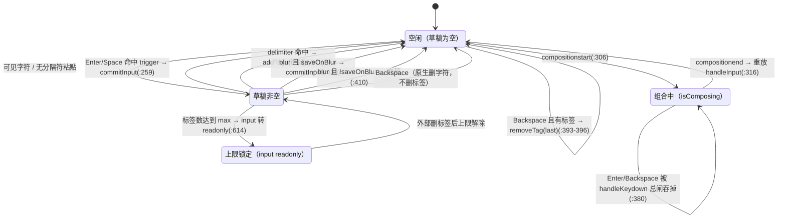
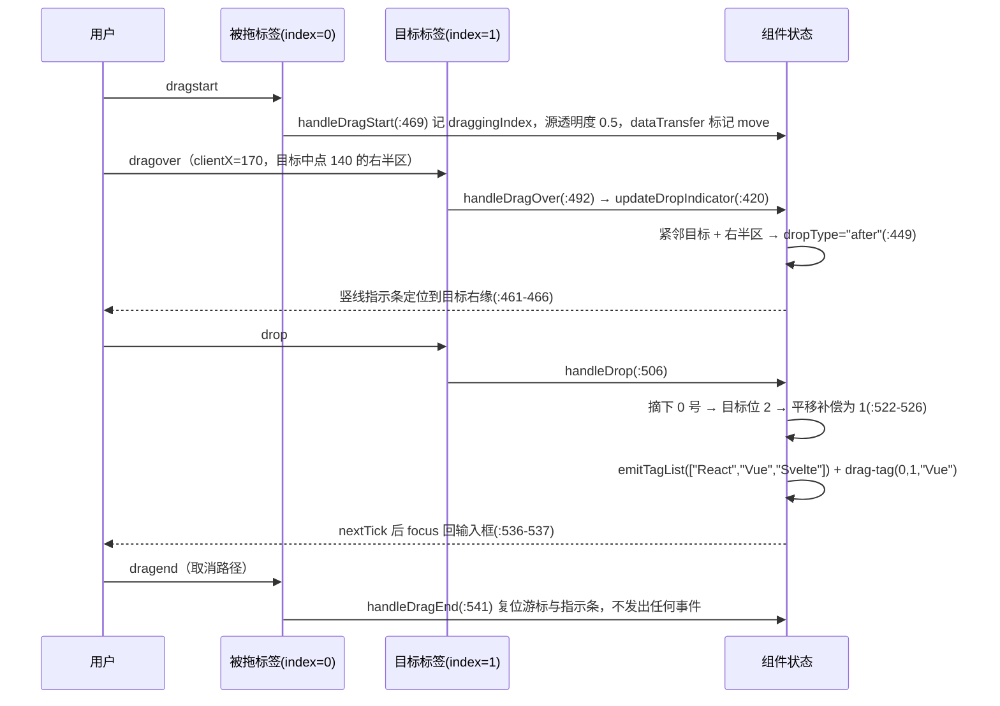

# 6-08 · InputTag：复合输入态

> 核心问题：**标签流 + 文本输入的状态机**。InputTag 的全部复杂度，都藏在"一组已提交的标签数组"与"一个永远处于草稿态的文本输入"这两个状态之间的迁移规则里——Enter 何时落标签、Backspace 何时删标签、粘贴何时拆分、输入法组合期何时静默、拖拽何时才真正换序。

前一篇 6-02 讲 Input 时留了一个尾巴：全库 72 个组件里，只有 `input.vue` 和 `input-tag.vue` 两个文件的源码出现了 `composition` 关键字。本篇就把 `input-tag.vue` 这半边展开讲透。它表面上是个"input 和 tag 的拼盘"，实际上是一个不折不扣的**双值状态机**：`modelValue` 是对外承诺的标签流，`inputValue` 是组件私有的草稿值，两者之间没有自动同步——所有交互行为（键位、IME、粘贴、拖拽、失焦）本质上都是定义在这对状态上的迁移函数。这个组件的源码体量（658 行，含 42 个 props/emits 声明之外的全部逻辑行）在本库表单组件里排得进前五，值得逐段拆开。

## 8.1 双值状态：标签流与草稿值的分工

先把状态清单一次性摊开。`packages/components/input-tag/src/input-tag.vue:65-94`：

```ts
const inputRef = shallowRef<HTMLInputElement | null>(null);
const wrapperRef = ref<HTMLDivElement | null>(null);
const innerRef = ref<HTMLDivElement | null>(null);
const dropIndicatorRef = ref<HTMLSpanElement | null>(null);
const isFocused = ref(false);
const hovering = ref(false);
const isComposing = ref(false);
const inputValue = ref("");
const showDropIndicator = ref(false);

let draggingIndex: number | undefined;
let dropIndex: number | undefined;
let dropType: "before" | "after" | undefined;
let draggingElement: HTMLElement | null = null;

const mergedSize = computed(() => props.size ?? globalSize.value);
const currentTags = computed(() => props.modelValue ?? []);
const inputId = computed(() => props.id ?? formItem?.inputId);
const messageId = computed(() => (formItem?.message.value ? formItem.messageId : undefined));
const validateState = computed(() => formItem?.validateState.value ?? "idle");
const inputDisabled = computed(() => props.disabled);
const hasPrefix = computed(() => Boolean(slots.prefix));
const hasSuffix = computed(() => Boolean(slots.suffix));
const hasTags = computed(() => currentTags.value.length > 0);
const hasInputValue = computed(() => inputValue.value.trim().length > 0);
const canEdit = computed(() => !props.disabled && !props.readonly);
const tagDraggable = computed(() => props.draggable && canEdit.value);
const inputLimitReached = computed(
  () => props.max !== undefined && currentTags.value.length >= props.max
);
```

这 30 行里能读出这套状态机的三个设计决定。

**其一，`currentTags`（`:81`）是只读投影，不是副本。** 它就是 `props.modelValue ?? []` 的 computed 包装，组件内部从不持有标签数组的独立拷贝——所有修改都走"算出 nextTags → `emitTagList` 发事件 → 等父组件把新数组喂回来"的单向流。这意味着 input-tag 是彻底的受控组件：父组件不接 `update:modelValue`，界面上的标签流就不会动。这是本库在 4-04 篇讨论过的受控/非受控光谱上，站得最靠受控一端的形态之一。

**其二，`inputValue`（`:72`）是组件私有的，外部写不进来，也读不出去。** `InputTagProps`（`src/input-tag.ts:24-50`）里没有 draft/value 的 prop，`defineEmits`（`input-tag.vue:43-53`）里也没有对应的输出事件，只有 `input` 这个"通知性"事件。草稿值完全活在组件内部。

**其三，外部 `modelValue` 变更时，草稿值不重置。** 这是理解这个组件最反直觉、也最关键的一条边界。全组件对 `props.modelValue` 的唯一一个 watch 在 `input-tag.vue:555-560`：

```ts
watch(
  () => props.modelValue,
  (value) => {
    clearStaleValidation(value);
  }
);
```

watch 回调里只做了一件事：清掉过期的表单错误态。它**不碰 `inputValue`**。也就是说，用户正在输入"React"敲到一半，父组件因为某种原因把 `modelValue` 整个重置成 `["Vue"]`，输入框里的"React"会原样留着——草稿是用户的领地，数组是表单的领地，互不越界。这个决定直接推导出后面 8.2 节的整个键位状态机：既然草稿不随数组重置，那"提交"就必须是显式动作（Enter/Space/失焦），而不能隐式发生。

顺带注意 `let draggingIndex` 等四个拖拽游标（`:75-78`）声明成了模块级的普通变量而非 ref——它们是拖拽过程的一次性书签，不参与渲染（指示条的显隐由 `showDropIndicator` 这个 ref 承担），用普通变量避免了无谓的响应式开销。

### 归一化出口：emitTagList

所有写路径最终汇入同一个出口。`input-tag.vue:164-186`：

```ts
function normalizeTags(tags: string[]) {
  const normalized = tags
    .map((tag) => tag.trim())
    .filter(Boolean);

  if (props.max === undefined) {
    return normalized;
  }

  return normalized.slice(0, props.max);
}

function emitTagList(nextTags: string[], options?: { emitChange?: boolean }) {
  const normalized = normalizeTags(nextTags);
  const payload = normalized.length ? normalized : undefined;

  clearStaleValidation(payload);
  emit("update:modelValue", payload);

  if (options?.emitChange) {
    emit("change", payload);
  }
}
```

三道归一化在这里完成：**trim 去空白**、**filter 剔空串**、**max 截断**。第四道最容易漏看：`const payload = normalized.length ? normalized : undefined;`——空数组会被归一成 `undefined`。这不是随手写的，`InputTagValue` 的类型就是 `string[] | undefined`（`input-tag.ts:7`），配套测试 `__tests__/input-tag.spec.ts:92` 明确断言删光最后一个标签后发出的是 `[undefined]`。语义上，"一个标签都没有"和"组件还没被赋值"应当是同一种状态，这样表单的 `required` 规则才能把"清空了"识别为"非法"而不是"合法的空数组"。这个约定和 6-02 篇 Input 的空串归一化一脉相承，是本库表单体系的一贯口径。

`emitChange` 开关则是另一处语义细分：`update:modelValue` 每次写路径都发，`change` 只在"用户主动造成变化"的路径上发（提交、删除、拖拽、清空），而粘贴拆分中途的、以及拖拽取消之类不产生变化的路径不发。这保证了 `change` 对应 Vue 官方对 change 的直觉定义——值的变化有用户行为背书。

### syncInputValue：声明式绑定的对账函数

还有一个反复出现的小函数值得单独说。`input-tag.vue:200-204`：

```ts
function syncInputValue() {
  if (inputRef.value && inputRef.value.value !== inputValue.value) {
    inputRef.value.value = inputValue.value;
  }
}
```

为什么明明模板里写了 `:value="inputValue"`（`:609`）还要手动回写 DOM？因为 Vue 的 diff 只比较**前后两次 vnode** 的 value prop：当某段代码把草稿改写成的值恰好等于上一次渲染的值时，diff 认为"没变"，跳过写回，而真实 DOM 里还留着用户敲出来的旧文本——"声明式的值"和"DOM 的值"出现了落差。最典型的场景是上限分支：用户敲了一串字符，`handleInput` 发现 `inputLimitReached`，把 `inputValue` 清成 `""`；如果上一次渲染的 value 本来就是 `""`（比如刚提交完），diff 不会写 DOM，输入框就卡着那串"不该存在"的文本。所以本库的规矩是：**每一条"代码改草稿"的出口，后面都跟一个 `nextTick(syncInputValue)`**——`addTags`（`:245-248`）、`commitInput`（`:263-267`）、`clearAll`（`:300-303`）、`handleBlur` 的弃稿分支（`:410-413`）、`handleInput` 的上限分支（`:324-328`），五处无一例外。这是受控 input 的经典暗坑，本库选择用一个人工对账函数把它显式化，而不是指望框架兜底。

> **权衡一：双值状态 vs 单一草稿。** 另一种设计是把"待输入文本"也塞进单一数据源（比如 modelValue 支持混入字符串、或者拆成 v-model:v-model-text 两个双向绑定）。本库没有这么做，理由藏在上面的三段代码里：① 标签流需要归一化（trim/filter/截断/undefined 归一），草稿值必须保留用户敲进去的原始字符，两者对"合法值"的定义不同，混在一个数据源里每次都要判别；② 提交语义要求草稿的生死独立于数组——`saveOnBlur: false` 时失焦弃稿（`handleBlur:410-413`），数组纹丝不动，这在单一数据源里很难表达；③ max 截断只该作用于数组，不该反过来吞掉用户正在输入的草稿。代价是组件要自己维护两态的一致性（`syncInputValue` 就是代价的具象化），以及"外部重置不重置草稿"这类边界要靠约定而不是类型来保证。

## 8.2 键位状态机：Enter、Backspace 与触发键

有了双值状态，键位处理就可以严格地表述成状态迁移。入口是 `handleKeydown`（`input-tag.vue:379-397`）：

```ts
async function handleKeydown(event: KeyboardEvent) {
  if (!canEdit.value || isComposing.value) {
    return;
  }

  const trigger = getKeyTrigger(event);

  if (trigger && trigger === props.trigger) {
    event.preventDefault();
    event.stopPropagation();
    await commitInput();
    return;
  }

  if (event.key === "Backspace" && !inputValue.value && currentTags.value.length) {
    event.preventDefault();
    await removeTag(currentTags.value.length - 1);
  }
}
```

第一行的总闸拦下两种情况：不可编辑（disabled/readonly），以及**组合期**。第二行之后才是状态机本体。触发键的识别函数在 `:188-198`：

```ts
function getKeyTrigger(event: KeyboardEvent): InputTagTrigger | "" {
  if (event.key === "Enter" || event.code === "Enter" || event.code === "NumpadEnter") {
    return "Enter";
  }

  if (event.key === " " || event.key === "Spacebar" || event.code === "Space") {
    return "Space";
  }

  return "";
}
```

这里用的是 `key`/`code` **双通道**识别：Enter 同时认 `event.key === "Enter"` 和 `event.code === "Enter" | "NumpadEnter"`（数字小键盘的回车 key 也是 "Enter"，但历史上某些环境 code 才是可靠的），Space 认三种历史拼写（`" "`、旧 IE 的 `"Spacebar"`、`code === "Space"`）。宽识别的意义在于：提交键是组件最不能失灵的一个键，识别函数宁可冗余也不留死角。而识别出来的值只有两个可能——类型层直接锁死：`export type InputTagTrigger = "Enter" | "Space";`（`input-tag.ts:5`），`withDefaults` 里 `trigger: "Enter"`（`input-tag.vue:18`）。类型夹具 `tests/types/fixtures/input-tag.ts:36-41` 还专门用 `@ts-expect-error` 断言 `trigger: "Tab"` 编译不过：

```ts
const invalidTrigger: InputTagProps = {
  // @ts-expect-error invalid trigger should be rejected
  trigger: "Tab"
};

void invalidTrigger;
```

整个键位状态机画出来是这样：



注意两条容易误读的迁移。**第一条：Backspace 只在"空闲"（草稿为空）时删标签。** `:393` 的条件是 `!inputValue.value && currentTags.value.length`——草稿里有字符时，Backspace 归原生输入框管（删字符），组件不 `preventDefault`；只有草稿空了还在按 Backspace，才认定用户在表达"删标签"，删的是**末尾**那个（`currentTags.value.length - 1`）。这是所有 tag 输入组件的通行交互契约（Element Plus、Arco、Ant Design 皆同），本库的特别之处是它和组合期总闸共用同一个入口：组合期里按 Backspace 是在删拼音字母，`:380` 的总闸保证了这种 Backspace 永远走不进"删标签"分支——两个守卫叠在一起，交互才算闭环。

**第二条：commit 之后落回"空闲"而不是"草稿非空"。** `commitInput`（`:259-271`）提交后把草稿清空（经由 `addTags` 的 `inputValue.value = remainder`，remainder 为空串），输入框回到等待下一个标签的状态。`commitInput` 还有一个容易被忽略的分支——上限已满时不抛错、不静默提交，而是**把草稿直接清掉**：

```ts
async function commitInput() {
  const value = inputValue.value.trim();

  if (!value || inputLimitReached.value) {
    inputValue.value = inputLimitReached.value ? "" : inputValue.value.trim();
    nextTick(() => {
      syncInputValue();
    });
    return;
  }

  await addTags(value, "");
}
```

上限已满时草稿被吞掉，看起来粗暴，但它配合的是 `:614` 的 `:readonly="props.readonly || inputLimitReached"`——达到上限后输入框整个转只读，正常路径下用户根本敲不进字符，`commitInput` 的这个分支只是防御纵深里的最后一层（8.7 节展开）。

### 失焦与清空：两条收尾路径

状态机还有两条离开"草稿"态的边值得单独看实现。失焦路径（`input-tag.vue:404-418`）：

```ts
async function handleBlur(event: FocusEvent) {
  isFocused.value = false;

  if (props.saveOnBlur) {
    await commitInput();
  } else {
    inputValue.value = "";
    nextTick(() => {
      syncInputValue();
    });
  }

  emit("blur", event);
  await triggerBlurValidation();
}
```

注意执行顺序：`isFocused` 先翻假、**草稿先落定**（提交或弃稿），然后才 `emit("blur")`——blur 事件的订阅者拿到的组件状态已经是收尾之后的终态，不会观察到"半提交"的中间态。清空路径（`:290-304`）则是唯一一条不走 `emitTagList` 的写路径：

```ts
async function clearAll() {
  if (!canEdit.value) {
    return;
  }

  inputValue.value = "";
  emit("update:modelValue", undefined);
  emit("change", undefined);
  emit("clear");
  await triggerChangeValidation();
  nextTick(() => {
    syncInputValue();
    focus();
  });
}
```

清空直接发 `undefined`（跳过 normalizeTags，因为结果无歧义），多发出一个专属的 `clear` 事件让业务方区分"删光"与"清空按钮"，最后 `syncInputValue` 对账加 `focus()` 把焦点还回输入框——清空按钮上还有一行 `@mousedown.prevent`（`:650`），防止点击按钮的 mousedown 先把焦点从 input 上抢走导致清空钮随失焦消失。一个小交互的完整闭环，四处代码各管一段。

把全部键位与事件列成一张总表，方便对照测试：

| 输入动作 | 生效条件 | 组件行为 | 发出事件 | 测试锚点 |
| --- | --- | --- | --- | --- |
| Enter / NumpadEnter | `trigger: "Enter"`（默认）且非组合期 | `commitInput` 提交草稿 | `update:modelValue` / `change` / `add-tag` / `input` | spec `:7-22` |
| Space | `trigger: "Space"` 且非组合期 | 同上 | 同上 | spec `:24-38` |
| 其他可打印键 | 非 max 满 | 进入草稿（`handleInput`） | `input` | — |
| 逗号等 delimiter | `delimiter` 配置且非组合期 | 拆分并批量入列 | `update:modelValue` / `change` / `add-tag` / `input` | spec `:40-56` |
| Backspace | 草稿为空且有标签 | 删末尾标签 | `update:modelValue` / `change` / `remove-tag` | spec `:75-94` |
| Backspace | 草稿非空 | 原生删字符，组件不干预 | `input` | — |
| 任意键 | 组合期（`isComposing`）或不可编辑 | 总闸直接 return | 无 | — |
| 粘贴 | `delimiter` 已配置且未达上限 | 合成未来值后拆分 | 同 delimiter 路径 | — |
| 粘贴 | 无 `delimiter` | 不拦截，走原生粘贴 | `input` | — |
| 点击标签关闭钮 | `canEdit` | `removeTag(index)` | 同 Backspace 删标签 | spec `:276-295` |
| 拖拽 drop | `draggable` 且指示条有效 | 换序 | `update:modelValue` / `change` / `drag-tag` | spec `:96-148` |
| 点击清空钮 | `clearable` 且 hover/focus | `clearAll` | `update:modelValue` / `change` / `clear` | spec `:257-274` |
| 失焦 | `saveOnBlur: true`（默认） | 提交草稿 | 同提交路径 | spec `:297-310` |
| 失焦 | `saveOnBlur: false` | 弃稿 | 无写路径事件 | — |

> **权衡二：粘贴拆分策略。** 粘贴是这个状态机里最微妙的一条迁移，本库的做法有三层讲究。第一，**无 `delimiter` 就完全不拦截**（`handlePaste:354` 的入口闸）：粘贴"Vue"这种无分隔符文本应该就是普通输入，任何"聪明"的拦截都只会制造惊吓。第二，**先合成未来值再决定拦不拦**：`handlePaste` 用 `selectionStart/selectionEnd`（`:365-366`）把剪贴板文本拼进当前草稿算出 `nextValue`（`:367`），再跑一次 `splitByDelimiter`——如果拆不出任何完整片段（比如往"React"中间粘贴"Vue"，没有分隔符命中），就 `return` 且**不** `preventDefault`，让原生粘贴照常发生。`preventDefault`（`:374`）发生在确认要拆分之后，时机卡得非常精确：拦晚了会双写，拦早了会误伤。第三，**尾段保留**：`splitByDelimiter` 用 `parts.pop()` 把最后一段拿回草稿（`:226`），"Vue,React"拆出一个"Vue"后输入框里留着"React"，而不是把未完成的内容也吞进标签流——"以分隔符结尾才算提交完成"的直觉被精确保留，测试 `:58-73` 专门钉住了这条（`input.element.value` 断言为 `"React"`）。

## 8.3 IME 守卫：组合期的静默（对照 6-02）

6-02 篇已经考据过：全库只有 input 与 input-tag 两处有 composition 处理，且 EP 把这套逻辑抽成了公共 hook。本篇展开 input-tag 这半边的实现细节。三件套分布在 `input-tag.vue:71`（状态）、`:306-317`（处理器对）、`:626-627`（模板挂接）：

```ts
function handleCompositionStart() {
  isComposing.value = true;
}

function handleCompositionEnd(event: CompositionEvent) {
  if (!isComposing.value) {
    return;
  }

  isComposing.value = false;
  handleInput(event as unknown as Event);
}
```

对照 input.vue 的同款（`packages/components/input/src/input.vue:89`、`:301-309`）：

```ts
function handleInput(event: Event) {
  const target = event.target as NativeInputElement;
  const rawValue = target.value;

  if (isComposing.value) {
    displayValue.value = rawValue;
    emit("input", rawValue);
    return;
  }

  if (props.modelModifiers.lazy) {
```

两份实现是明确的同构复制——input.vue 侧的处理器对（`packages/components/input/src/input.vue:395-406`）与 input-tag 侧逐行同构：

```ts
function handleCompositionStart() {
  isComposing.value = true;
}

function handleCompositionEnd(event: CompositionEvent) {
  if (!isComposing.value) {
    return;
  }

  isComposing.value = false;
  handleInput(event as unknown as Event);
}
```

**组合期不阻断草稿同步与 input 事件，只阻断提交语义**。`handleInput`（input-tag 侧 `:319-351`）在 `isComposing` 为真时先同步草稿（`:331`）、发出 `input` 事件（`:333-336`）然后 return——delimiter 拆分被跳过；input.vue 侧同位置跳过的是 formatter 和 modelModifiers。两处连"组合期仍发 input"这个口味都一致，和 EP 的 `useComposition`（组合期短路、什么事件都不发）构成两种流派。

input-tag 侧真正的差异点在 `handleCompositionEnd` 的**重放**：组合结束时把 `CompositionEvent` 伪装成 `Event` 重新喂给 `handleInput`（`:316`）。这一步是 IME 与 delimiter 协作的关键——用中文输入法敲"Vue,"，逗号在组合期内打出、组合结束才定稿，重放让 delimiter 拆分在组合结束后立刻补跑，"Vue"当场落成标签。但重放**只补 delimiter，不补提交键**：`handleCompositionEnd` 不会替用户按 Enter，组合期里的那次 Enter（选词确认）已经被 `:380` 的总闸吞掉，用户需要再按一次 Enter 才真正提交。这不是缺陷而是必须的——组合期的 Enter 语义是"确认候选词"，如果组件把它当提交键处理，中文用户每敲一个词就会凭空多出一个标签。

> **权衡三：IME 与提交键的冲突。** 提交键（Enter/Space）和 IME 的确认键是物理上同一个键，冲突只能靠"状态期"来裁决。本库的裁决方式是不信任 `event.isComposing` 的浏览器时序，而是组件自己记账：`compositionstart` 记账开启、`compositionend` 记账关闭，`handleKeydown` 入口统一读账。好处是裁决点唯一（`:380` 一行），坏处也直白——这段逻辑在 input.vue 和 input-tag.vue 各复制了一份（6-02 篇已把"上提到 `xiaoye-primitives/src/composables`"列为现成改进项）。EP 的解法可以作为参照：其 input-tag 的 composable 直接消费共享的 `useComposition({ afterComposition: handleInput })`，keydown 首行同样是 `if (isComposing.value) return`，此外还补了一个本库没有的边角——针对 Android 空格键组合时序的 keyup 特判（`isAndroid()` 检查）。移动端 Space 触发提交在 Android 上有时序陷阱，EP 踩过并修了，本库还没踩到这一步。

## 8.4 分隔符解析器与批量录入

delimiter 是把"文本输入"升级成"批量录入"的开关，解析逻辑集中在 `splitByDelimiter`（`input-tag.vue:206-232`）：

```ts
function splitByDelimiter(value: string) {
  if (!props.delimiter) {
    return {
      tags: [] as string[],
      remainder: value
    };
  }

  const parts =
    typeof props.delimiter === "string"
      ? value.split(props.delimiter)
      : value.split(props.delimiter);

  if (parts.length <= 1) {
    return {
      tags: [] as string[],
      remainder: value
    };
  }

  const remainder = parts.pop()?.trim() ?? "";

  return {
    tags: parts.map((part) => part.trim()).filter(Boolean),
    remainder
  };
}
```

返回值是一个二元组：`tags`（拆出的完整片段，已 trim、已剔空）和 `remainder`（尾段，回到草稿）。`parts.length <= 1` 意味着一次分隔符都没命中，整个原值留在草稿里。`parts.pop()` 取尾段的写法让"分隔符结尾"和"分隔符中间"行为一致：`"Vue,React,"` 拆出 `["Vue","React"]`、尾段空串；`"Vue,React"` 拆出 `["Vue"]`、尾段 `"React"`。

消费端有两条路径。**键入路径**在 `handleInput` 里（`:338-344`）：非组合期的每次输入都跑一遍拆分，命中就 `addTags(delimitedTags, remainder)`。**粘贴路径**是独立的 `handlePaste`（`:353-377`）：

```ts
async function handlePaste(event: ClipboardEvent) {
  if (!props.delimiter || !canEdit.value || inputLimitReached.value) {
    return;
  }

  const pastedText = event.clipboardData?.getData("text");

  if (!pastedText) {
    return;
  }

  const input = event.target as HTMLInputElement;
  const start = input.selectionStart ?? input.value.length;
  const end = input.selectionEnd ?? input.value.length;
  const nextValue = `${input.value.slice(0, start)}${pastedText}${input.value.slice(end)}`;
  const { tags: delimitedTags, remainder } = splitByDelimiter(nextValue);

  if (!delimitedTags.length) {
    return;
  }

  event.preventDefault();
  await addTags(delimitedTags, remainder);
  emit("input", remainder);
}
```

这里能看到权衡二里说的"先合成未来值"：粘贴不是简单地对剪贴板文本做拆分，而是把它按光标位置拼进现有草稿后再拆——往 `"10.0.0"` 后面粘贴 `.1,192.168.0.1`，拆出来的是 `["10.0.0.1", "192.168.0.1"]` 而不是丢掉光标前的半截。`add-tag` 事件拿到的载荷也顺理成章是数组（`addTags` 内 `:255`）。

说到 `addTags`（`:234-257`），它是所有"入列"动作的唯一通道，值得整段读：

```ts
async function addTags(rawTags: string | string[], remainder = "") {
  if (!canEdit.value) {
    return;
  }

  const incoming = Array.isArray(rawTags) ? rawTags : [rawTags];
  const normalizedIncoming = normalizeTags(incoming);
  const nextTags = normalizeTags([...currentTags.value, ...incoming]);
  const addedCount = Math.max(0, nextTags.length - currentTags.value.length);
  const addedTags = normalizedIncoming.slice(0, addedCount);

  inputValue.value = remainder;
  nextTick(() => {
    syncInputValue();
  });

  if (nextTags.length === currentTags.value.length) {
    return;
  }

  emitTagList(nextTags, { emitChange: true });
  emit("add-tag", Array.isArray(rawTags) ? addedTags : addedTags[0] ?? rawTags.trim());
  await triggerChangeValidation();
}
```

亮点在 `addedCount`/`addedTags`（`:242-243`）：先按"合并 + 截断后的总长减去原长"算出**实际新增数量**，再从归一化后的入参里切出这些项。当 max 截断发生时（已有 4 个标签、max 为 5、粘贴进来 3 个），`add-tag` 发出的是实际入列的那 1 个，而不是用户粘贴的 3 个——事件载荷忠实于结果，而不是忠实于意图。配合文档示例 `apps/docs/examples/input-tag/delimiter.vue`（`delimiter=","`、`:max="5"`、`tag-status="success"` 的白名单场景）食用更清楚：超额部分静默丢弃，事件里不会出现谎报。

> **考据插叙：这里埋着一处"看起来有意义、实际是死代码"的分支。** `:214-217` 的三元表达式，string 分支和 regex 分支调用的**是完全同一个表达式** `value.split(props.delimiter)`。写它的人显然打算让 string 与 RegExp 走不同解析路径（比如 string 精确匹配、regex 按正则语义），但 JS 的 `String.prototype.split` 对两者本来就都是"全局切分"，两分支从未有过差异。这不是 bug（行为正确），是叙事残留——读者看到 `typeof` 检查会以为存在正则特判，实际没有。类型层把 `delimiter` 声明为 `string | RegExp`（`input-tag.ts:29`），运行时却完全一视同仁。

## 8.5 拖拽排序：手写 HTML5 DnD 的完整闭环

`draggable` 打开后，每个标签进入 HTML5 原生拖拽协议。这套实现是手写的完整闭环：四个拖拽事件（dragstart/dragover/drop/dragend）+ 一个几何计算函数 + 一根绝对定位的竖线指示条。核心的落点判定在 `updateDropIndicator`（`input-tag.vue:420-467`），关键段是中点与半区逻辑：

```ts
  const rect = targetElement.getBoundingClientRect();
  const innerRect = innerRef.value.getBoundingClientRect();
  const midpoint = rect.left + rect.width / 2;
  const isImmediateNext = draggingIndex + 1 === targetIndex;
  const isImmediatePrev = draggingIndex - 1 === targetIndex;

  dropIndex = targetIndex;
  if (isImmediateNext) {
    dropType = clientX > midpoint ? "after" : undefined;
  } else if (isImmediatePrev) {
    dropType = clientX < midpoint ? "before" : undefined;
  } else {
    dropType = clientX <= midpoint ? "before" : "after";
  }
```

对**不相邻**的目标，光标在左半区就是插到它前面（before）、右半区就是后面（after）；对**紧邻**的目标，"无效半区"被显式置为 `undefined`——把 0 号拖到 1 号的左半区（意图是插到 1 号前面，等价于原地不动），指示条不显示，drop 也不触发任何事件。这是对"无操作拖拽"的静默消解：用户把标签拖了个寂寞时，不应该有 `change` 事件、不应该有表单校验、不应该有 `drag-tag` 通知。测试 `__tests__/input-tag.spec.ts:150-202` 用 `clientX: 110`（目标 `left: 100, right: 180`，中点 140 的左半区）精确钉住了这条，`:204-255` 钉住了"拖完直接 dragend 取消"同样无事件。

真正的换序发生在 `handleDrop`（`:506-539`），这里的索引平移补偿是最容易写错的一段：

```ts
  const reordered = currentTags.value.slice();
  const [dragged] = reordered.splice(draggingIndex, 1);

  if (dragged !== undefined) {
    let targetPosition = dropType === "before" ? dropIndex : dropIndex + 1;

    if (draggingIndex < targetPosition) {
      targetPosition -= 1;
    }

    if (targetPosition === draggingIndex) {
      return;
    }

    reordered.splice(targetPosition, 0, dragged);
    emitTagList(reordered, { emitChange: true });
    emit("drag-tag", draggingIndex, targetPosition, dragged);
    await triggerChangeValidation();
    await nextTick();
    focus();
  }
```

逻辑分四步：先把被拖项从副本里摘下来；再把"before 目标 / after 目标"翻译成插入位（`dropIndex` 或 `dropIndex + 1`）；然后做**平移补偿**——如果被拖项原位置在插入位左边，摘除它之后数组整体左移一格，插入位要减一（`:524-526`）；最后插入并发出 `drag-tag(原位, 新位, 值)`。测试 `:96-148` 的基准场景（拖 0 号到 1 号右半区）：`dropType: "after"` → 目标位 2 → 补偿成 1 → `["React","Vue","Svelte"]`，`drag-tag` 载荷 `(0, 1, "Vue")`，与实现严丝合缝。

把整个拖拽闭环画成时序图：



两处工程细节值得一提。**其一，指示条是独立的绝对定位元素**（模板 `:636-640`，样式 `input-tag.css:80-88`），`left: -9999px` 藏在视口外，显示时用 `getBoundingClientRect` 相对 `innerRef` 计算坐标、高度贴合目标标签——不依赖任何浮层库，成本极低。**其二，drop 成功后主动 `focus()` 把焦点还给输入框**（`:536-537`）：HTML5 拖拽会吃掉焦点，这一行保证了"拖完接着打字"的连续性，是键盘可达性视角下很体面的一笔。

## 8.6 与 Tag 的关系：窄绑定 + 宽透传

5-21 篇考据过 check-card 经 `TagProps` 复用 Tag 的路径（`check-card.ts:18` 声明 `props?: TagProps`，`check-card.vue:136-141` 的 `resolveTagProps` + `:215` 的 `v-bind` 整包下发）。input-tag 是另一种复用形态——**窄绑定 + 宽透传**。看模板里渲染标签流的核心段（`input-tag.vue:584-633`，顺带把原生 input 的完整挂接收进来）：

```vue
<XyTag
  v-for="(tag, index) in currentTags"
  :key="`${tag}-${index}`"
  class="xy-input-tag__tag"
  :size="mergedSize"
  :status="props.tagStatus"
  :round="props.tagRound"
  :closable="canEdit"
  :draggable="tagDraggable"
  @close="removeTag(index)"
  @dragstart="handleDragStart($event, index)"
  @dragover="handleDragOver($event, index)"
  @drop.stop="handleDrop"
  @dragend="handleDragEnd"
>
  <slot name="tag" :value="tag" :index="index">
    {{ tag }}
  </slot>
</XyTag>

<div class="xy-input-tag__input-wrap">
  <input
    :id="inputId"
    ref="inputRef"
    v-bind="nativeAttrs"
    :value="inputValue"
    class="xy-input-tag__input"
    type="text"
    :name="props.name"
    :disabled="inputDisabled"
    :readonly="props.readonly || inputLimitReached"
    :tabindex="props.tabindex"
    :minlength="props.minlength"
    :maxlength="props.maxlength"
    :placeholder="placeholderText"
    :autocomplete="props.autocomplete"
    :autofocus="props.autofocus"
    :aria-label="props.ariaLabel"
    :aria-describedby="messageId"
    :aria-invalid="validateState === 'error'"
    :inputmode="props.inputmode"
    :style="inputElementStyle"
    @compositionstart="handleCompositionStart"
    @compositionend="handleCompositionEnd"
    @focus="handleFocus"
    @blur="handleBlur"
    @input="handleInput"
    @keydown="handleKeydown"
    @paste="handlePaste"
  />
</div>
```

input-tag **没有**导入 `TagProps` 类型。它从 `XyTag` 只窄绑定四个视觉 prop（`size/status/round/closable`，映射到自己的 `tagStatus/tagRound` 等带前缀的 props），其余的拖拽能力全部走 **attrs 透传**。原因在 tag.vue 的实现里：`TagProps`（`tag/src/tag.vue:10-17`）只有 `status/type/size/round/closable/icon` 六个成员，**没有 `draggable` prop**，emits 也只声明了 `close`（`:30-32`）。所以 `:draggable="tagDraggable"` 和四个 drag 事件监听会落入 `$attrs`，经 tag.vue 默认的 `inheritAttrs` 落到根元素 `<span>` 上——`draggable` 是原生枚举属性，`@dragstart` 等未声明事件也自然挂成原生监听。input-tag 是**有意**利用了这层透传机制。

两种复用路径的分工由此清晰：check-card 下发的是**视觉配置**（tag 的外观属性包），所以走 `TagProps` 类型整包；input-tag 需要的是**行为挂载**（拖拽事件协议），这本来就超出了 TagProps 的语义范围，窄绑定视觉、透传行为反而是更诚实的组合。代价是这层耦合不可见——读 tag.vue 的 props 列表永远不会知道它支持 draggable，答案只存在于消费方。另外两个细节：`:key` 用 `` `${tag}-${index}` ``（`:586`），因为标签数组允许重复值，纯值做 key 会撞车；`:closable="canEdit"`（`:591`）把"能否关闭"与"能否编辑"绑死，readonly/disabled 状态下关闭钮整个消失，测试 `:284-294` 分别断言了两种状态下的 `.xy-tag__close` 不存在。

## 8.7 表单联动与上限的三重防御

表单集成是标准的 formItem 注入模式（`:61` inject，`:82-84` 派生 `inputId/messageId/validateState`），校验触发分 change/blur 两路（`:146-162`），与文档示例 `apps/docs/examples/input-tag/form.vue` 里 `keywords` 走 change、`members` 走 blur 的双规则演示一一对应，测试 `:312-350`、`:352-394` 各钉一条。有意思的是 `clearStaleValidation`（`:136-144`）的一个契约瑕疵：

```ts
function clearStaleValidation(nextTags: string[] | undefined) {
  if (!nextTags?.length) {
    return;
  }

  if (formItem?.validateState.value === "error") {
    formItem.clearValidate();
  }
}
```

函数签名要求传入"标签数组"，守卫却是 `nextTags?.length`——它的真实意图是"只要有输入进展就清错误"，与数组无关。于是 `handleInput` 里出现了这样一处别扭的调用（`:346-348`）：

```ts
  if (value.trim()) {
    clearStaleValidation(currentTags.value.length ? currentTags.value : [value.trim()]);
  }
```

还没有任何标签时，为了绕过"空数组早退"的守卫，调用方**伪造了一个只含当前草稿的数组**塞进去。功能正确，但契约错位：一个以 `nextTags` 命名的参数接受了一个语义上根本不是"下一组标签"的值。把函数改成 `clearStaleValidation(hasProgress: boolean)` 之类无参判定的形态，这处别扭就不存在了。这是个小到不值得单独发版的瑕疵，但它是"守卫条件与函数名义职责脱节"的活样本。

上限（`max`）则是一套教科书式的**三重防御**：

1. **UI 层**：`:614` 的 `:readonly="props.readonly || inputLimitReached"`，达到上限后输入框整个转只读，用户物理上敲不进新字符（placeholder 也随 `placeholderText:103-105` 的逻辑保持隐藏）；
2. **输入层**：`handleInput` 的上限分支（`:322-329`）——万一有程序化赋值绕过只读，事件里直接清空草稿并回写 DOM；
3. **提交层**：`commitInput` 的上限分支（`:262-268`）兜住最后一手；`handlePaste` 的入口闸（`:354`）则在上限已满时直接放行原生粘贴（文本留在草稿里，随后会被 1、2 两层处理）。

加上 `addTags` 内 `:250-252` 的"长度无变化就早退"，以及 `normalizeTags` 的 `slice(0, max)` 截断，max 的执行点实际上有五处。这种冗余不是失误——上限是用户可感知的硬约束，任何一层失守都会产生"提交了第 6 个标签"这类不可逆的坏状态，防御纵深在这里是合理的。

## 8.8 EP 对照：晚两年半的同题作文

Element Plus 的 `<el-input-tag>` 直到 **v2.9.0**（2024 年 11 月）才进入正式 API，比本库的 input-tag 晚了不止一个发布周期——本库在动手时没有 EP 可抄，这个组件是同题独立作文。把两边 API 摆在一起：

| 能力 | Element Plus（截至 2.13.x 文档） | XyInputTag（当前工作区） |
| --- | --- | --- |
| 组件登场 | 2.9.0 新增 | manifest 既有成员（`component-manifest.json:277-282`） |
| 触发键 | `trigger`：Enter / Space，默认 Enter | 同型（`InputTagTrigger = "Enter" \| "Space"`，`input-tag.ts:5`） |
| 上限 | `max` | 同型，且空数组归一为 `undefined` 发出（EP 发空数组语义的 `string[]`） |
| 失焦保存 | `save-on-blur`（2.9.7 才补） | 首版即有（`input-tag.vue:34`） |
| 分隔符 | `delimiter`：string/regex（2.9.9 才补） | 首版即有，同为 `string \| RegExp`（`input-tag.ts:29`） |
| 拖拽 | `draggable` + `drag-tag` 事件（事件 2.11.3 才补） | `draggable` + `drag-tag` 首版即为一等事件（`:49`） |
| 标签外观 | `tag-type` / `tag-effect`（沿用旧 `type` 词汇） | `tagStatus`（`ComponentStatus`）+ `tagRound`，对齐 5-21 篇的语义状态体系 |
| 折叠展示 | `collapse-tags` / `collapse-tags-tooltip`（2.11.0） | 无——设计取向是全部铺开换行（CSS `flex-wrap`） |
| 标签配置包 | 无 `tag-props`（文档确认不存在） | 也无，但走窄绑定 + 透传（8.6 节），与 check-card 的 TagProps 路径并存 |
| 清空图标 | `clear-icon`（2.11.0，组件对象） | `clearIcon` 字符串（默认 `mdi:close-circle`，`input-tag.ts:54`） |
| 对外方法 | expose `focus` / `blur` | expose `input` / `focus` / `blur` / `clear`（`:562-567`） |
| IME | 官方文档只字未提；源码消费共享 `useComposition({ afterComposition: handleInput })`，keydown 首行 `isComposing` 短路，另有 Android keyup 特判 | 源码内联同构守卫（`:71`/`:306-317`/`:380`/`:626-627`），无移动端特判 |

三个差异点值得展开。**其一，值语义。** EP 的 v-model 是 `string[]`，本库是 `string[] | undefined` 且空数组归一为 `undefined`——这让 `required` 规则天然覆盖"用户删光了标签"，是本库表单体系口径的延续。**其二，IME 的工程化程度。** EP 把组合守卫做进了共享 hook 还处理了 Android 时序，本库是双份内联复制且无移动端特判——6-02 篇"守卫该不该上提到 primitives"的论断，在 input-tag 身上得到的证据比 input 身上更重（EP 的 input-tag 恰好证明：这类守卫是可跨组件共享的，连 input-tag 也该分一杯羹）。**其三，演进节奏。** EP 的 save-on-blur、delimiter、drag-tag 都是组件发布后按用户反馈逐步补的（2.9.7 → 2.9.9 → 2.11.3 三个时间点），本库这些能力在第一版 API 里就齐了——不是本库更有远见，而是本库晚起跑，站在了这些交互已被社区验证过的时点上。API 设计的"一步到位"，很多时候只是起跑线不同。

## 8.9 样式：一条输入带是怎么铺开的

`packages/theme/src/components/input-tag.css` 的核心是三层 flex 的嵌套。外壳与内层：

```css
.xy-input-tag__wrapper {
  position: relative;
  display: inline-flex;
  align-items: stretch;
  width: 100%;
  min-width: 0;
  border: 1px solid var(--xy-border);
  border-radius: var(--xy-radius-md);
  background: var(--xy-bg-raised);
  transition:
    border-color var(--xy-transition-duration-fast) var(--xy-transition-timing),
    box-shadow var(--xy-transition-duration-fast) var(--xy-transition-timing),
    background-color var(--xy-transition-duration-fast) var(--xy-transition-timing);
  cursor: text;
}

.xy-input-tag__inner {
  display: flex;
  align-items: center;
  align-content: center;
  flex: 1;
  flex-wrap: wrap;
  gap: 6px;
  min-width: 0;
  padding: 6px 12px;
}
```

`wrapper` 的 `cursor: text` 让整个容器表现得像一块输入区（模板 `:574` 的 `@click="focus"` 兜底，点到哪都能聚焦到 input）；`inner` 的 `flex-wrap: wrap` 是"标签多时换行"的全部实现——标签流和输入框作为 flex 子项自然换行，不需要任何测量逻辑。输入区自己的弹性定义是这套布局的点睛之笔：

```css
.xy-input-tag__input-wrap {
  flex: 1 0 96px;
  min-width: 72px;
}

.xy-input-tag__input {
  width: 100%;
  min-width: 0;
  border: 0;
  outline: 0;
  background: transparent;
  color: var(--xy-text-primary);
  font: inherit;
  line-height: inherit;
  padding: 0;
}
```

`flex: 1 0 96px` 的三个值分别说：尽量占满剩余空间（grow 1）、**绝不收缩到基准宽度以下**（shrink 0，基准 96px）、`min-width: 72px` 双保险。组合效果：标签不多时输入区吃满一整行；标签铺满一行后，输入区退到行尾保留至少 72px 的可点击宽度，再挤不下就整体换行——输入框永远存在、永远可点，这是 tag 输入组件布局的及格线，本库用两行 CSS 过了线。input 本体的样式（去边框、透明背景、`font: inherit`）是标准的"隐形 input"手法，焦点环、错误态、禁用态全部上移到 wrapper 层（`:22-30` 的 hover/focus、`:133-154` 的三态），`is-focus` 的 `box-shadow` 用 `color-mix` 调 16% 透明度的品牌色，与全库焦点语言一致。

尺寸档 `--sm/md/lg`（`:156-181`）只动三个旋钮：wrapper 的 `min-height`、inner 的 padding 和 gap。顺带复核 6-02 篇报过的"无用地层"，先看它所在的状态类生成器（`input-tag.vue:107-118`，注意 `:107` 行首多出的两个空格是源码原样）：

```ts
  const containerKls = computed(() => [
  ns.base.value,
  `${ns.base.value}--${mergedSize.value}`,
  validateState.value === "error" ? "is-error" : "",
  validateState.value === "success" ? "is-success" : "",
  inputDisabled.value ? "is-disabled" : "",
  isFocused.value ? "is-focus" : "",
  tagDraggable.value ? "is-draggable" : "",
  hasPrefix.value ? "has-prefix" : "",
  showSuffix.value ? "has-suffix" : "",
  attrs.class
]);
```

其中的 `has-prefix`/`has-suffix`（`:115-116`）在本 CSS 中依旧没有任何选择器消费，前后缀的样式实际挂在 `.xy-input-tag__prefix/__suffix` 内容元素上——input 与 input-tag 同款复制，地层依旧。

## 8.10 测试与类型夹具

`__tests__/input-tag.spec.ts` 共 412 行、14 个用例，覆盖密度在表单组件里属第一梯队。用例分布本身就是一份交互规格书：键位 2 条（Enter/Space）、delimiter 2 条（拆分/尾段保留）、上限与 Backspace 1 条、拖拽 3 条（成功/无效半区/取消）、清空与状态 3 条（clearable/readonly+disabled/saveOnBlur）、表单联动 2 条、暴露方法 1 条。最见功力的是拖拽三连——用 `Object.defineProperty` 伪造 `getBoundingClientRect`、用假 `dataTransfer` 对象驱动四个拖拽事件，把几何判定逻辑测到了行级精度：

```ts
await firstTag.trigger("dragstart", { dataTransfer });
await secondTag.trigger("dragover", { clientX: 170, dataTransfer });
await secondTag.trigger("drop", { dataTransfer });
await firstTag.trigger("dragend");
await nextTick();

expect(wrapper.emitted("update:modelValue")?.[0]).toEqual([["React", "Vue", "Svelte"]]);
expect(wrapper.emitted("drag-tag")?.[0]).toEqual([0, 1, "Vue"]);
```

`clientX: 170` 与伪造矩形（`left: 100, right: 180`，中点 140）的相对关系，正是 8.5 节"紧邻目标右半区 → after"的数值化。类型夹具 `tests/types/fixtures/input-tag.ts` 全文 41 行，前半段把 24 个 props 的合法取值全部实例化一遍（包括 `inputStyle` 这类 `StyleValue` 对象），后半段用 `@ts-expect-error` 锁死 `trigger: "Tab"` 的非法取值——通过 `pnpm typecheck:types` 参与 CI，props 面一旦收窄或放宽，夹具会立刻报警。

## 结语：状态机是复合输入组件的第一性

回头看，input-tag 的 658 行里没有一行"魔法"：双值状态、五个同步出口、一个键位总闸、一个分隔符解析器、一套手写拖拽协议、三层上限防御。它给的启示是——**复合输入组件的复杂度不在任何一个单点上，而在状态之间的迁移规则总量上**。双值状态把"用户正在打的字"与"系统承认的值"分开，才有了清晰的事务边界；事务边界清楚了，Enter/Backspace/IME/粘贴/拖拽才能各自表述成一条条的迁移边，测试也才能一条边一条边地钉。反过来说，如果一开始把草稿和数组混成一个数据源，这十二种交互行为的每一条都会变得难以定义——8.1 节权衡一的结论，值得在所有"输入 + 已选列表"形态的组件（mention、@提醒、多值搜索框）里复用。

下一篇 **6-09《InputNumber：精度与边界》**，我们看另一个"文本输入的变体"：当输入的不再是字符串而是数字，状态机的核心矛盾就从"何时提交"变成"如何表示"——浮点精度陷阱、步进边界、max/min 与小数位的博弈。那里还埋着 6-02 篇留下的另一根线头：input-number 是全库唯一一个高频遭遇 IME 却**完全没有组合守卫**的输入组件，中文输入法下键入数字同样要经过组合期，它靠什么兜住？下一篇拆开看。

---

**附：本篇引用清单**

- `packages/components/input-tag/src/input-tag.vue`（658 行全量精读；重点 `:65-94`、`:107-118`、`:136-144`、`:164-204`、`:206-232`、`:234-288`、`:290-304`、`:306-317`、`:319-351`、`:353-377`、`:379-397`、`:404-418`、`:420-467`、`:506-539`、`:555-560`、`:584-633`、`:626-627`、`:636-654`）
- `packages/components/input-tag/src/input-tag.ts`（`:5`、`:7`、`:24-50`、`:29`、`:54`）
- `packages/theme/src/components/input-tag.css`（`:6-30`、`:32-41`、`:80-105`、`:133-154`、`:156-181`）
- `packages/components/input-tag/__tests__/input-tag.spec.ts`（14 用例全读；重点 `:7-22`、`:40-73`、`:75-94`、`:96-148`、`:150-255`、`:257-310`、`:396-411`）
- `packages/components/input/src/input.vue`（`:89`、`:301-309`、`:395-406`）
- `packages/components/tag/src/tag.vue`（`:10-17`、`:30-32`）
- `packages/components/check-card/src/check-card.ts`（`:18`）；`check-card.vue`（`:136-141`、`:215`）
- `tests/types/fixtures/input-tag.ts`（41 行全量）
- `apps/docs/examples/input-tag/`（basic / delimiter / draggable / form 四例）
- `packages/components/component-manifest.json:277-282`

**EP 对照来源**：[Element Plus 官方文档 · input-tag](https://element-plus.org/zh-CN/component/input-tag.html)、[element-plus/element-plus · use-input-tag.ts](https://github.com/element-plus/element-plus/blob/dev/packages/components/input-tag/src/composables/use-input-tag.ts)
