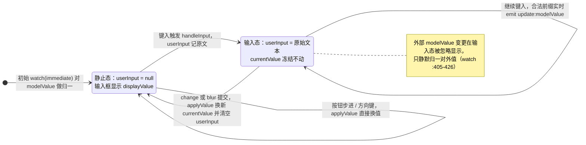
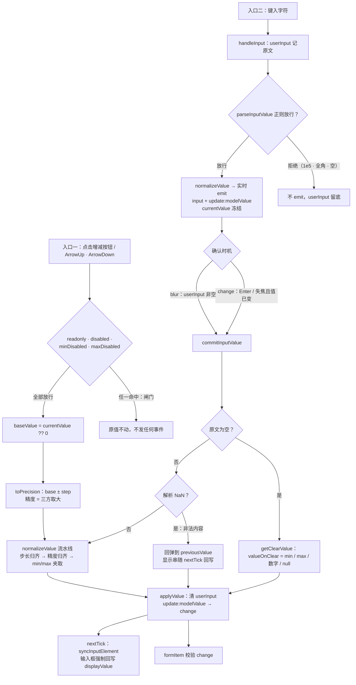

# 6-09 · InputNumber：精度与边界

> 核心问题：**步进、小数位与超界回弹** —— 一个数值组件的全部尊严，都藏在"连点十次 0.1 步进，还能不能稳稳得到 1.0"这种问题上。

开篇先校准口径。本篇主角是 `packages/components/input-number/src/input-number.vue`，当前工作区实测 **519 行**；类型层 `packages/components/input-number/src/input-number.ts` 41 行；主题样式 `packages/theme/src/components/input-number.css` 124 行；单测 `packages/components/input-number/__tests__/input-number.spec.ts` 311 行，12 个用例本人在写作前实跑了一遍，全部通过。还有一处必须先声明：**precision 修复段（`input-number.vue:135-161`）目前是工作区未提交的改动**，`git diff` 里还看得见修复前的签名——本篇所有行号以修复后的实态为准，这既是整篇的地基，也是"AI 协作研发"这个专栏母题的一次现场取证：修复战役的一行改动、一条注释、三个回归测试，此刻还躺在工作区里没进提交历史。

InputNumber 是 6-02《Input》之后第一个把"字符串输入"换成"数值语义"的组件，也是表单组件里少数几个**状态机复杂度超过交互复杂度**的样本。按钮增减、键盘方向键、手输、清空、失焦、表单校验——六条入口全部汇进同一条归一流水线，而这条流水线上任何一个环节的精度处理出错，产出的脏数据都会顺着 `v-model` 流进业务模型。本篇就沿三条线拆：步进怎么算、小数位怎么定、超界了怎么弹回来。

## 一、先立骨架：值的三槽模型

读 InputNumber 的第一步不是看 props，而是看清它有**三个值槽**。这是理解后面一切行为的钥匙：

- `userInput`——用户正在敲的**原始字符串**，只要非空，输入框就显示它；
- `currentValue`——组件内部认账的**归一后的数值**，按钮步进、边界判断全看它；
- `modelValue`——对外暴露的 `v-model`，大部分时候跟随 `currentValue`，但在输入过程中会"领先"于它。

四个核心状态位加边界派生值，都在 script 的开头这一段：

```ts
// packages/components/input-number/src/input-number.vue:18-71
const props = withDefaults(defineProps<InputNumberProps>(), {
  id: undefined,
  modelValue: null,
  min: Number.MIN_SAFE_INTEGER,
  max: Number.MAX_SAFE_INTEGER,
  step: 1,
  stepStrictly: false,
  precision: undefined,
  size: undefined,
  disabled: false,
  readonly: false,
  controls: true,
  controlsPosition: "",
  valueOnClear: null,
  placeholder: "",
  name: undefined,
  validateEvent: true,
  ariaLabel: undefined,
  inputmode: undefined,
  align: "center",
  disabledScientific: false
});

const emit = defineEmits<{
  "update:modelValue": [value: number | null];
  input: [value: number | null];
  change: [value: number | null, oldValue: number | null];
  focus: [event: FocusEvent];
  blur: [event: FocusEvent];
}>();

const attrs = useAttrs();
const formItem = inject(formItemKey, null);
const ns = useNamespace("input-number");
const nsInput = useNamespace("input");
const { size: globalSize } = useConfig();

const inputRef = shallowRef<HTMLInputElement | null>(null);
const isFocused = ref(false);
const userInput = ref<string | null>(null);
const currentValue = ref<number | null>(null);

const mergedSize = computed(() => props.size ?? globalSize.value);
const inputId = computed(() => props.id ?? formItem?.inputId);
const messageId = computed(() => (formItem?.message.value ? formItem.messageId : undefined));
const validateState = computed(() => formItem?.validateState.value ?? "idle");
const controlsAtRight = computed(() => props.controls && props.controlsPosition === "right");
const inputDisabled = computed(() => props.disabled);
const minDisabled = computed(
  () => typeof currentValue.value === "number" && currentValue.value <= props.min
);
const maxDisabled = computed(
  () => typeof currentValue.value === "number" && currentValue.value >= props.max
);
```

这段实码里有几个值得驻足的默认值。`min` / `max` 直接取 `Number.MIN_SAFE_INTEGER` / `Number.MAX_SAFE_INTEGER`，而不是正负 `Infinity`——这是有意为之：后面会看到 `aria-valuemax` 只在 `Number.isFinite(props.max)` 时才输出（`:505-506`），±Infinity 是不有限的，用它兜底会让无障碍属性永远缺失；选 `±MAX_SAFE_INTEGER` 则两全——既等价于"不设限"，又保住了 ARIA 输出。`modelValue: null` 把"空"确立为合法初值，整个组件因此要一路拖着 `number | null` 联合类型走，`isSameValue`（`:120-122`）的三等号比较也顺理成章——`null === null` 为真，null 与 0 严格分家，这正是 4-04 讲受控骨架时说的"空值语义不漂移"。

`minDisabled` / `maxDisabled` 这对派生值值得单独点名：它们**只看 `currentValue`，不看 `userInput`**。用户在输入框里手敲了一个越界值还没失焦确认时，步进按钮的禁用态并不会跟着手输值走。这不是疏忽，后面第五节会回来解释这个选择与 Element Plus 的分歧。

三个值槽的流转关系，一张状态图说清：



这套三槽模型与 EP 的 `data.currentValue` + `data.userInput` 双槽结构同源，本库多出的第三"槽"其实是 `modelValue` 与 `currentValue` 的**允许分叉**：输入态下父组件的 `v-model` 已经拿到了实时归一值，而组件内部认账的 `currentValue` 要等确认才更新。分叉是刻意设计的缓冲区，代价是必须想清楚每一处消费到底该读哪个槽——第五节的步进基值之争就是从这里长出来的。

## 二、步进引擎：显式精度合成与"没有连发"的定论

先回答任务书里的问题：**步进按钮没有长按连发**。模板里两个控制按钮（`:450-482`）只绑了 `@click`，整个源文件没有任何 interval / timer / pointer 事件做按住重复；键盘方向键则相反——按住 `ArrowUp` 会触发浏览器原生的 keydown 自动重复，每一条重复的 keydown 都走一遍 `increase()`，也就是说**键盘天然连发、按钮刻意单发**。EP 同样没有按钮连发，这不是偷懒：连发意味着一次按住触发 N 次 `change` 事件和 N 次表单校验，在没有做"校验合并"的前提下，单发是更稳的默认。

增减的实现是对称的一对，把它们连起来读：

```ts
// packages/components/input-number/src/input-number.vue:295-333
function increase() {
  if (props.readonly || inputDisabled.value || maxDisabled.value) {
    return;
  }

  const baseValue = currentValue.value ?? 0;
  const precision = Math.max(
    getPrecision(baseValue),
    getPrecision(props.step),
    props.precision ?? 0
  );
  const nextValue = normalizeValue(toPrecision(baseValue + props.step, precision));

  applyValue(nextValue, {
    emitInput: true,
    emitChange: true
  });
  void triggerChangeValidation();
}

function decrease() {
  if (props.readonly || inputDisabled.value || minDisabled.value) {
    return;
  }

  const baseValue = currentValue.value ?? 0;
  const precision = Math.max(
    getPrecision(baseValue),
    getPrecision(props.step),
    props.precision ?? 0
  );
  const nextValue = normalizeValue(toPrecision(baseValue - props.step, precision));

  applyValue(nextValue, {
    emitInput: true,
    emitChange: true
  });
  void triggerChangeValidation();
}
```

三个细节。第一，**守卫三连**：`readonly` / `disabled` / 边界禁用各自独立判断，与按钮上的 `:class="{ 'is-disabled': minDisabled }"` 和 `tabindex` 收编（`:453-455`、`:471-473`）构成双重防御——CSS 禁用只是表象，函数第一行的早退才是语义闸门，这也让 `defineExpose` 暴露出去的 `increase()` / `decrease()` 方法（`:439-445`）在禁用态下同样安全，外部命令式调用无法绕过边界。

第二，**基值是 `currentValue.value ?? 0`，不是输入框里显示的东西**。用户手敲了一个未提交的值就点按钮时，那个手输值会被丢弃——`applyValue` 会把 `userInput` 置空、用 `currentValue + step` 的结果覆盖显示。对照 EP：它的 `increase()` 用的是 `Number(displayValue.value) || 0`，以"屏幕上显示的值"为基。两种选择各有立场：本库的方案保证步进序列永远从**已归一**的值出发，不会把手输的中间态带进算术；EP 的方案更符合"所见即所步"的直觉。这是本篇第一个明确的分歧点，第八节还会汇成对照表。

第三，**步进时的精度合成是显式的三方取大**：当前值的小数位、step 的小数位、显式声明的 `precision`，谁宽取谁。`1.3 + 0.5` 两个操作数都是一位小数，精度取 1，`1.8` 原样保住；`0 + 0.1` 则是 0 位与 1 位取大，同样一位。这个三方取大正是 `step=0.1` 连点十次能落账 1.0 的第一道保险——但真正的英雄是第三节要拆的 `toPrecision`，它的缺省精度在 2026-09-16 那场修复战役里换过一次心脏。

键盘侧还有两个小章节值得一并交代。`handleKeydown`（`:361-376`）拦 `ArrowUp` / `ArrowDown` 映射到 `increase` / `decrease`，同时承担 `disabledScientific` 的按键封锁：开启后按 `e` / `E` 直接 `preventDefault`，科学计数法的入口被掐死在键盘层。而 `inputmode` 的自动推导（`:498-501`）——`props.precision` 有值或 `step` 含小数点时给 `decimal`（带小数点的数字键盘），否则 `numeric`（纯数字键盘）——让移动端键盘跟配置联动。顺带一提这行推导里 `props.precision ||` 的写法：`precision` 为 0 时会被当 falsy 落进 `numeric` 分支，恰好整数精度本来就该用纯数字键盘，属于"巧合正确"，但严格讲应该用 `!== undefined` 判空。

## 三、2026-09-16 修复战役：精度缺省值从 0 换成 step 推导

现在进入本篇的核心段落。先看修复后的全貌，包括那条写在函数头上、信息密度极高的注释：

```ts
// packages/components/input-number/src/input-number.vue:100-161
const displayValue = computed(() => {
  if (userInput.value !== null) {
    return userInput.value;
  }

  if (currentValue.value === null) {
    return "";
  }

  if (props.precision !== undefined) {
    return currentValue.value.toFixed(props.precision);
  }

  return String(currentValue.value);
});

function isNumber(value: unknown): value is number {
  return typeof value === "number" && !Number.isNaN(value) && Number.isFinite(value);
}

function isSameValue(a: number | null, b: number | null) {
  return a === b;
}

function getPrecision(value: number | null | undefined) {
  if (!isNumber(value)) {
    return 0;
  }

  const valueString = value.toString();
  const dotPosition = valueString.indexOf(".");

  return dotPosition === -1 ? 0 : valueString.length - dotPosition - 1;
}

// 未显式声明 precision 时按 step 的小数位数推导，
// 避免 step=0.5 + stepStrictly 输入 1.3 被缺省 Math.round 归齐成 2（应得 1.5）
function toPrecision(value: number, precision = props.precision ?? getPrecision(props.step)) {
  if (precision === 0) {
    return Math.round(value);
  }

  let stringified = String(value);
  const pointPosition = stringified.indexOf(".");

  if (pointPosition === -1) {
    return value;
  }

  const digits = stringified.replace(".", "").split("");
  const guard = digits[pointPosition + precision];

  if (!guard) {
    return value;
  }

  if (stringified.charAt(stringified.length - 1) === "5") {
    stringified = `${stringified.slice(0, Math.max(0, stringified.length - 1))}6`;
  }

  return Number.parseFloat(Number(stringified).toFixed(precision));
}
```

修复是什么？`git diff` 里留了案底：修复前的签名是——

```ts
// 修复前（工作区 diff 的删除行）
function toPrecision(value: number, precision = props.precision ?? 0) {
```

修复后是 `props.precision ?? getPrecision(props.step)`。一字之差，行为差在哪？要把 `toPrecision` 的调用图摊开看。全文检索这个函数，你会发现**缺省精度真正生效的调用点只有一个**：`normalizeStep`（`:163-171`，下一节全文引用）里 `Math.round(...)` 之后的外层调用——`toPrecision(value / step, getPrecision(step))` 是内层显式传参，外层 `toPrecision(... * step)` 不传精度；而 `increase` / `decrease`（`:306`、`:326`）和 `normalizeValue`（`:181`、`:183-187`）全都显式传了精度。所以修复的"地震面"精确收窄在 step-strictly 归一这一条路上，但这条路上的损失是毁灭性的，用注释里的案例逐步推演：

**修复前**，`step=0.5`、`stepStrictly`、用户手输 `1.3` 后失焦确认：

1. `normalizeStep(1.3)`：内层 `toPrecision(1.3 / 0.5, 1)` → `1.3/0.5 = 2.5999999999999996`，一位精度归一为 `2.6`；
2. `Math.round(2.6)` → `3`，乘回 `0.5` → `1.5`——到这一步都是对的；
3. 外层 `toPrecision(1.5)` **不传精度**，落入修复前的缺省 `?? 0` → 走 `Math.round(1.5)` → **2**。

`1.3` 被归齐成了 `2`，正确的步长倍数 `1.5` 在最后一厘米处被 `Math.round` 拦腰砍掉。**修复后**，缺省精度变成 `getPrecision(0.5) = 1`，第三步变成 `toPrecision(1.5, 1)`：字符串 `"1.5"` 只有一位小数，守卫位缺失（这个"守卫位"机制下一节细讲），原样返回 `1.5`。三个回归测试里失败重灾区 `input-number.spec.ts:104-122` 锁的就是这条链路：输入 `1.3`，断言 emit 出来的是 `1.5` 而不是 `2`。

这里有一个诚实推演后必须说清的边界：考据口径里"step=0.1 时步进到整数丢失小数"的描述，在**现有代码形态**下无法复现——因为 `increase` / `decrease` 是显式传精度的，步进路径从始至终免疫这个 bug。修复真正改变行为的只有 step-strictly 的外层归一，外加一个理论上的兜底意义：缺省精度是所有未来调用点的默认值，把它从"硬编码 0"改成"从 step 推导"，等于把"默认四舍五入到整数"这个危险默认值从源头拆除。这正是防御性默认值的要义——**错误的默认值不一定会立刻咬人，但它会在你意想不到的新调用点等着你**。

**权衡一（精度默认值策略）**：本库选择以 `step` 为精度锚，EP 的同位置逻辑则是一个 `numPrecision` 计算属性，缺省取 `Math.max(getPrecision(props.modelValue), stepPrecision)`，并且在显式 `precision` 小于 step 小数位时发一条开发警告。逐字对照（抓取自 element-plus dev 分支）：

```ts
// element-plus dev 分支 packages/components/input-number/src/input-number.vue
const numPrecision = computed(() => {
  const stepPrecision = getPrecision(props.step)
  if (!isUndefined(props.precision)) {
    if (stepPrecision > props.precision) {
      debugWarn(
        'InputNumber',
        'precision should not be less than the decimal places of step'
      )
    }
    return props.precision
  } else {
    return Math.max(getPrecision(props.modelValue), stepPrecision)
  }
})
```

两种锚定策略的差异是真实的：EP 以"当前值 + step 的最大小数位"为锚，显示保真度高——当前值 `1.234` 时计算属性给出 3 位精度，一切运算保留 3 位；但锚点**随值漂移**，同一个组件在值变化的过程中精度语义也在变。本库以 step 为锚，语义稳定——"步进档位的分辨率就是这套数值世界的最小刻度"，用户配置 `step=0.5` 就等于声明了这个世界只有半步精度；代价是当前值自带更多小数位时（手输 `1.234` 而不配 `precision`），`normalizeValue` 的兜底分支要再叠一层三方取大（`:183-187`）来补 EP 那种保真度。顺带一提，本库没有做 EP 那条 "precision 不应小于 step 小数位" 的开发警告——这是一处可以直接抄的作业，配置了 `precision=1` + `step=0.05` 的用户在两家的行为会出现分叉。

还有一处同源异构：`normalizeStep` 里内层调用本库写的是 `toPrecision(value / props.step, getPrecision(props.step))`，显式锁 step 精度；EP 写的是 `toPrecision(newVal / step)` 不传第二参，隐式吃 `numPrecision`（含 modelValue 精度）。多数场景两者殊途同归，但 EP 的隐式锚点同样随值漂移。从这段对照能看出血缘：本库的 `toPrecision` 连同它的守卫位和尾数补丁，与 EP 的实现**逐行同构**——这不算巧合，下一节正面讲它。

## 四、浮点误差：toFixed 家族的补丁美学

`0.1 + 0.2 !== 0.3` 是每个前端的地狱门口。数值组件的算术全部发生在 `baseValue ± props.step` 这一行，二进制浮点注定在这里制造 `0.7999999999999999` 这类尾巴。通用的解法有三档：上 decimal.js 之类的任意精度库（bundle 换精度）；把小数放大成整数运算再缩回（字符串整数运算，`0.1 → 1 / 10`）；或者**承认浮点、在出口处修剪**。本库选了第三档——不做字符串大数运算，不做定点缩放，而是给 `toFixed` 打两个补丁，让"修剪"本身变得可靠。

第一个补丁是**守卫位早退**（guard digit）。`toPrecision` 把数值转成字符串后，取小数点后第 `precision + 1` 位看一眼（`:150-153`）：如果这一位根本不存在，说明值的小数位不超过目标精度，**直接原样返回，不碰 `toFixed`**。这个早退的意义比看上去大——`toFixed` 并非无损操作，`(1.005).toFixed(2)` 在 JavaScript 里得到 `"1.00"` 而不是 `"1.01"`，因为 1.005 的二进制表示实际是 1.00499...。能不进修罗场就不进，是整个方案的第一原则。

第二个补丁是**尾数 5 换 6**（`:156-158`）：当字符串以 `5` 结尾时，把尾数改成 `6` 再做 `toFixed`。动机与守卫位同源——`toFixed` 的舍入行为取决于二进制表示，尾部是 5 的十进制数在二进制里可能略小（该进位却被舍去）也可能略大（正常进位），把 5 强制改成 6 之后，无论二进制表示略偏哪个方向，结果都**必然进位**。`1.005 → "1.006" → toFixed(2) → "1.01"`，教科书上该进位的场景从此稳定进位。这不是本库的发明——EP 的 `toPrecision` 里躺着一模一样的两段补丁，一字不差；这是社区在 `toFixed` 的坑里趟了十年之后沉淀下来的民间验方，两家共同继承了它。

第三层防护在步进入口：`increase` / `decrease` 的三方取大精度合成，保证算术结果的尾巴一定会被修剪到"当前值与 step 中更宽的那个小数位"。写了个专门的测试把这条链钉死：

```ts
// packages/components/input-number/__tests__/input-number.spec.ts:70-122
it("未声明 precision 时增减按 step 精度保留小数", async () => {
  const wrapper = mount(XyInputNumber, {
    props: {
      modelValue: 1.3,
      step: 0.5
    }
  });

  await wrapper.get(".xy-input-number__increase").trigger("click");

  expect(wrapper.emitted("update:modelValue")?.[0]).toEqual([1.8]);
  expect((wrapper.get("input").element as HTMLInputElement).value).toBe("1.8");
});

it("step 为 0.1 时连续增减十次稳定落账 1.0", async () => {
  const wrapper = mount(XyInputNumber, {
    props: {
      modelValue: 0,
      step: 0.1
    }
  });

  const increase = wrapper.get(".xy-input-number__increase");

  for (let index = 0; index < 10; index += 1) {
    await increase.trigger("click");
  }

  const finalValue = wrapper.emitted("update:modelValue")?.at(-1)?.[0] as number;

  expect(finalValue.toFixed(1)).toBe("1.0");
  expect((wrapper.get("input").element as HTMLInputElement).value).toBe("1");
});

it("stepStrictly 且未声明 precision 时输入值按 step 精度归齐", async () => {
  const wrapper = mount(XyInputNumber, {
    props: {
      modelValue: 0,
      step: 0.5,
      stepStrictly: true
    }
  });

  const input = wrapper.get("input");

  await input.setValue("1.3");
  await input.trigger("change");
  await nextTick();

  expect(wrapper.emitted("update:modelValue")?.at(-1)).toEqual([1.5]);
  await wrapper.setProps({ modelValue: 1.5 });
  expect((input.element as HTMLInputElement).value).toBe("1.5");
});
```

第二个用例值得逐帧看：`0.1` 的十次累加，内部值一路是 `0.1`、`0.2`、`0.30000000000000004`、`0.4`……每次都在算术后被精度合成修剪回一位小数，最终 `1.0` 稳定落账；注意断言的最后半句——输入框显示的是 `"1"` 而非 `"1.0"`，因为没配 `precision` 时 `displayValue` 走 `String()` 原样输出（`:113`），`toFixed` 只在显式声明精度时接管显示。**内部值与显示串是两套口径**：内部值永远是被修剪过的合法数值，显示串只在配置了 `precision` 时才强制补零。这是"精度归一"与"显示格式化"的分工，混为一谈的组件会出现"显示 1.0 但实际存了 1.0000000001"的灵异事件。

方案的边界也要摆上台面。其一，`precision === 0` 分支直接 `Math.round`，而 `Math.round` 对负半值向正无穷取整（`Math.round(-1.5)` 得 `-1`）——整数模式下 `-1.5` 这类值的行为与"四舍五入"的直觉有偏移，EP 同样如此，属于共同的行业默契而非本库独有。其二，这套方案防的是"步进与归一产生的尾巴"，防不了用户主动输入的 17 位长尾：手输 `0.30000000000000004` 且未配 `precision` 时，`getPrecision` 会老老实实给出 17，归一后原样保留。其三，没有 EP `ensurePrecision` 那道 `±MAX_SAFE_INTEGER` 的停步护栏（EP 在越界前打警告并拒绝再步进），本库的 clamp 发生在算术**之后**——`currentValue` 逼近 2 的 53 次方时 `baseValue + step` 已经先丢了精度。好在缺省 `min` / `max` 就是 `±MAX_SAFE_INTEGER`，实际业务里很难摸到这堵墙，但这是一个值得抄回的防护。

## 五、归一流水线与超界回弹

把精度讲透之后，所有入口的值最终都要过同一条流水线 `normalizeValue`。连同它的上游 `normalizeStep`、入口解析 `parseInputValue`、清空策略 `getClearValue`，一起读：

```ts
// packages/components/input-number/src/input-number.vue:163-228
function normalizeStep(value: number) {
  if (!props.stepStrictly) {
    return value;
  }

  return toPrecision(
    Math.round(toPrecision(value / props.step, getPrecision(props.step))) * props.step
  );
}

function normalizeValue(value: number | null) {
  if (value === null) {
    return null;
  }

  let nextValue = normalizeStep(value);

  if (props.precision !== undefined) {
    nextValue = toPrecision(nextValue, props.precision);
  } else {
    nextValue = toPrecision(
      nextValue,
      Math.max(getPrecision(nextValue), getPrecision(props.step), getPrecision(props.modelValue))
    );
  }

  if (nextValue > props.max) {
    nextValue = props.max;
  }

  if (nextValue < props.min) {
    nextValue = props.min;
  }

  return nextValue;
}

function parseInputValue(value: string) {
  const trimmed = value.trim();

  if (trimmed === "") {
    return null;
  }

  if (!/^[+-]?(\d+(\.\d*)?|\.\d+)$/.test(trimmed)) {
    return Number.NaN;
  }

  return Number(trimmed);
}

function getClearValue() {
  if (props.valueOnClear === "min") {
    return props.min;
  }

  if (props.valueOnClear === "max") {
    return props.max;
  }

  if (typeof props.valueOnClear === "number") {
    return props.valueOnClear;
  }

  return null;
}
```

流水线的顺序是精心排过的：**步长归齐 → 精度归齐 → 边界夹取**。这个次序与 EP 的 `verifyValue` 完全同构（EP 也是 stepStrictly 归一、再 precision 归一、再 clamp），也共享同一个理论瑕疵：夹取发生在精度归一之后，如果 `max` 本身的小数位超过 `precision`（比如 `precision=2` 而 `max=0.333`），夹到边界的值 `0.333` 不会被再归一——模型里存 0.333，输入框却按 `displayValue` 的 `toFixed(2)` 显示 `0.33`，出现内外口径差。两家同病，属于"知道了但值得记在账上"的边界。

`parseInputValue` 的正则 `/^[+-]?(\d+(\.\d*)?|\.\d+)$/` 是这条流水线的**安检门**：只放行纯十进制字面量，科学计数法（`1e5`）、`Infinity`、十六进制、全角数字全部拦下返回 `NaN`。注意它把"拒绝"设计成返回 `NaN` 而不是抛错——调用方 `commitInputValue`（`:280-293`）对 `NaN` 的处理是**回退到上一个合法值**，这正是"超界回弹"语义的一部分。`disabledScientific` 则在键盘层挡 `e` / `E`（`:362-365`），两层防御一个管键入一个管粘贴，配合得天衣无缝：就算 `e` 被放进来（未开 disabledScientific），`1e5` 也过不了正则这道门。

现在把**回弹**的三种形态画成完整的数据流图——这是本篇的主图：



回弹的三种形态在图里已经齐了，逐个说。**形态一：越界夹取。**任何经过 `normalizeValue` 的值，超过 `max` 压到 `max`、低于 `min` 抬到 `min`，方向键在边界上的连续步进被 `minDisabled` / `maxDisabled` 提前拦截，`test:22-45` 用 `min=0 max=4 step=2` 的配置验证了第二次 `increase` 无声无息。**形态二：非法回退。**手输 `abc` 或粘贴 `1e5` 后确认，解析出 `NaN`，`commitInputValue` 放弃解析结果、回退 `previousValue`，输入框在 `nextTick` 里被 `syncInputElement` 强制回写合法显示串——用户看到的就是"敲了个不合法的东西，失焦时它弹回去了"。**形态三：清空策略。**空串走 `getClearValue`，`valueOnClear` 支持 `min` / `max` / 固定数字 / `null` 四档，`spec:148-164` 验证了 `valueOnClear="min"` 时清空回写最小值 2 且带出 `change` 事件对。

**权衡二（回弹时机）**：确认信号有两条——原生 `change` 事件（Enter 或失焦且值变化时触发）和 `handleBlur` 里的兜底提交（`:383-395`，`userInput` 非空才提交）。关键在 `userInput` 这个脏标记：`applyValue` 提交时第一行就把它置空（`:252`），所以 change 先触发过的 blur 不会再提交一次，**双通道靠脏标记互斥，不会双发**。输入过程中则走"实时合法前缀"策略——每敲一个字符 `handleInput` 都尝试解析，合法就实时 `emit("update:modelValue")` 让父级联动，非法就只留底不发。这套设计与 EP 的 `handleInput → setCurrentValue(newVal, false)` 同构：输入态实时同步 `update:modelValue` 但不触发 `change`，`change` 留给确认动作。为什么不干脆等 blur？因为"输入一半就点搜索"的交互太常见了，实时前缀让父组件的联动（比如输入数量实时刷新合计）不需要等失焦；为什么不每键入都发 `change`？因为 `change` 挂着表单校验，半截输入就触发校验会让错误提示闪烁——两个事件各管一段节奏，是这套双轨制的全部意义。

## 六、IME 守卫缺口：6-02 埋的问题在这里引爆

6-02 考据过一个全库事实：**IME 组合期守卫只有 `input` 和 `input-tag` 两家持有**，当时留了一句话"这个缺口在别的组件身上是潜在债务"。InputNumber 就是这笔债务的第一个债务人——它的输入框是手搓的原生 `<input>`，整个文件没有出现 `compositionstart` / `isComposing` 的任何踪影。对照组的实码在 `packages/components/input/src/input.vue:89`（`isComposing` 状态位）、`:302-309`（`handleInput` 组合期早退：只透传 `input` 原文、拦下 `emitModelValue` 的受控归一）、`:395-405`（compositionstart / compositionend 处理对，end 时补一次完整 handleInput）。

这个缺口在 InputNumber 身上有两个具体引爆点。**引爆点一：方向键劫持。**中文输入法组词时，`ArrowUp` / `ArrowDown` 是候选词导航键——但 `handleKeydown`（`:361-376`）不区分组合期，照单全收地 `preventDefault` 并执行 `increase()` / `decrease()`。用户拼音敲到一半想翻候选词，结果数值在背后悄悄步进、表单校验跟着触发、候选词导航同时被掐死。**引爆点二：组合期实时 emit。**`handleInput`（`:335-355`）没有组合期早退，中文输入法（尤其全角模式或数字候选上屏）的每个组合中间态都会原样进入解析：全角 `５` 过不了正则尚且安全，但候选上屏产生的半角中间串（如 `3.`——恰好匹配 `\d+(\.\d*)?`）会被 `Number("3.")` 解析成 3 并实时 `emit("update:modelValue", 3)`，父级在组合期就收到了中间值。

修复的形状其实已经写在 6-02 里了：抄 `input.vue` 的三件套，`handleKeydown` 与 `handleInput` 前置 `isComposing` 检查，`compositionend` 再补一次完整处理。有意思的是 EP 的处境——它同样不在 input-number 里写组合逻辑，但它**嵌套 `el-input`**，组合守卫是 input 组件自带的基础设施，input-number 白拿。这就引出了架构层的一笔总账：**嵌套组件的代价是层层透传与体积，收益是基础设施的自动继承**；本库手搓原生 input 换来了轻与直，代价是每一层防御工事都要自己砌，而 IME 这道墙目前还没砌上。这是全篇最值得记进待办的一条。

## 七、样式层：让位的 padding 与克制的 color-mix

样式层 `packages/theme/src/components/input-number.css` 一共 124 行，核心是按钮与输入框的空间协议：

```css
/* packages/theme/src/components/input-number.css:43-67 */
.xy-input-number__increase,
.xy-input-number__decrease {
  position: absolute;
  top: 1px;
  bottom: 1px;
  z-index: 1;
  display: inline-flex;
  align-items: center;
  justify-content: center;
  width: var(--xy-input-number-control-size);
  border: 0;
  background: color-mix(in srgb, var(--xy-bg-subtle) 68%, var(--xy-bg-floating));
  color: var(--xy-text-secondary);
  cursor: pointer;
  transition:
    color var(--xy-transition-duration-fast) var(--xy-transition-timing),
    background-color var(--xy-transition-duration-fast) var(--xy-transition-timing),
    box-shadow var(--xy-transition-duration-fast) var(--xy-transition-timing);
}

.xy-input-number__increase:hover,
.xy-input-number__decrease:hover {
  color: var(--xy-brand);
  background: color-mix(in srgb, var(--xy-brand-soft) 34%, var(--xy-bg-floating));
}
```

按钮绝对定位贴边（`top: 1px; bottom: 1px` 的 1px 让位给边框），宽度吃 `--xy-input-number-control-size` 变量——这个变量在根节点定 40px、sm 档 36px、lg 档 46px（`:1-16`），是"组件级 CSS 变量 + 尺寸档覆盖"的标准打法。输入框的让位在 `:22-25`：非无边框、右置两种形态下，`padding-left/right` 用 `calc(var(--xy-input-number-control-size) + 8px)` 精确腾出按钮空间——宽度与留白同源一个变量，改一处两个地方联动，这是 CSS 变量协议比硬编码强的地方。`controls-position="right"` 时两个按钮对半劈成上下叠放（`:83-110`），高度 `calc(50% - 1px)` 配一套圆角重排。消费的令牌全部来自语义层（`--xy-bg-subtle`、`--xy-bg-floating`、`--xy-brand-soft`、`--xy-border-subtle`、`--xy-radius-md`、`--xy-transition-*`），没有碰任何基元层或废弃层命名，符合 3-01 定下的三层消费纪律。`color-mix` 的两个配比也值得留意：常态底色是 `bg-subtle 68%` 兑 `bg-floating`，hover 是 `brand-soft 34%` 兑底——都是低强度掺兑而不是整色替换，亮暗双主题下都不需要单独调色。

## 八、外部值回流与 props 响应：两个 watch 的收口

受控组件的最后一环是"外部变了怎么办"。InputNumber 用两个 watch 收口：

```ts
// packages/components/input-number/src/input-number.vue:405-437
watch(
  () => props.modelValue,
  (value) => {
    const normalizedValue = normalizeValue(isNumber(value) ? value : null);

    if (userInput.value === null) {
      currentValue.value = normalizedValue;
      nextTick(() => {
        syncInputElement();
      });
    }

    clearStaleValidation(normalizedValue);

    if (!isSameValue(value ?? null, normalizedValue)) {
      emit("update:modelValue", normalizedValue);
    }
  },
  {
    immediate: true
  }
);

watch(
  () => [props.min, props.max, props.step, props.stepStrictly, props.precision] as const,
  () => {
    const normalizedValue = normalizeValue(currentValue.value);

    if (!isSameValue(currentValue.value, normalizedValue)) {
      applyValue(normalizedValue);
    }
  }
);
```

第一个 watch 是**外部值回流清洗**：父组件塞进来的 `modelValue` 哪怕越界、哪怕不符合 step-strictly，都会被静默归一后再吐回 `update:modelValue`——外部脏值活不过一个 tick。`immediate: true` 保证挂载即清洗，初始 props 里的脏值同样无处遁形。而输入态分支（`userInput` 非空时跳过 `currentValue` 更新）让"用户正在打字时父级回写"不会打断输入——回写只影响对外值，不抢屏幕。`clearStaleValidation`（`:236-244`）顺手做了一件事：值合法化时清掉表单里残留的错误态，`spec:224-265` 验证了"change 校验失败 → 输入合法值 → 错误消失"的完整闭环。

第二个 watch 是**约束变更的重归一**：`min` / `max` / `step` / `stepStrictly` / `precision` 任何一个变化，都拿 `normalizeValue` 重新过一遍当前值。典型场景是运行时把 `max` 从 100 调到 50——当前值 80 被即时夹到 50，不需要等用户再碰组件。注意这里走 `applyValue` 但没传 `emitChange`：程序性修正只同步 `v-model`，不虚构一个用户没做过的 `change` 事件——事件语义的洁癖，与 4-04 讲的"副作用 emit 链"一脉相承。

## 九、与 Element Plus 的逐项对照

把全篇散落的分歧汇成一张表（EP 侧引自我在写作时抓取的 dev 分支实码，非凭印象）：

| 维度 | xy-input-number | el-input-number |
| --- | --- | --- |
| 内部输入消费 | 手搓原生 `<input>`，复用 `xy-input` 类名与 wrapper 结构（`:484-516`） | 嵌套 `el-input` 组件 |
| input 的 type | `text` + 自研正则解析 | `formatter` 存在时 `text`，否则原生 `type="number"` |
| 精度缺省锚 | `props.precision ?? getPrecision(props.step)`，锚在 step | `numPrecision = max(getPrecision(modelValue), stepPrecision)`，锚随值漂移，另配越界 dev 警告 |
| step-strictly 内层 | 显式传 `getPrecision(step)` | 隐式吃 `numPrecision` |
| 步进基值 | `currentValue ?? 0`（已归一值） | `Number(displayValue) \|\| 0`（屏幕显示值） |
| 大数防护 | 无停步护栏，clamp 在算术后 | `ensurePrecision` 在 `±MAX_SAFE_INTEGER` 停步并警告 |
| IME 组合守卫 | 无（缺口） | 无自有逻辑，但嵌套 `el-input` 白拿其内置守卫 |
| 无障碍 | 显式 `role="spinbutton"` + `aria-valuemin/max/now`（`:492-507`） | 依赖 `type="number"` 的隐式语义 |
| 长按连发 | 无（键盘走原生 keydown 重复） | 无 |

两处最值得展开。**type 之争**：EP 用原生 `type="number"`，能白得移动端数字键盘和浏览器级校验，代价是原生控件的怪癖全要吞下——`e` 能敲进去（所以 EP 也需要 `disabledScientific` 的 keydown 拦截）、非法输入时浏览器把 value 静默清成空串、原生 spinner 与自定义按钮打架要 CSS 处理。本库 `type="text"` 等于放弃原生红利、接管全部解析责任，换来行为的完全确定性——正则说不合法才不合法。这是"借用平台"与"接管平台"的经典分野。**嵌套之争**：EP 的嵌套白拿 IME 守卫、插槽体系（prefix/suffix）、validate-event 联动，但付出组件体积与透传链；本库的手搓换来 519 行的自足闭环，代价是第六节那道没砌的墙。

## 十、测试、夹具与遗留缺口

类型层夹具 `tests/types/fixtures/input-number.ts` 把 props 面完整钉了一遍，还用 `@ts-expect-error` 锁住 `align` 的字面量联合边界：

```ts
// tests/types/fixtures/input-number.ts:1-31
import type { InputNumberProps } from "xiaoye-components";

const props: InputNumberProps = {
  modelValue: 12,
  min: 0,
  max: 99,
  step: 0.5,
  stepStrictly: false,
  precision: 1,
  size: "md",
  controls: true,
  controlsPosition: "right",
  valueOnClear: "min",
  placeholder: "请输入数量",
  name: "amount",
  validateEvent: true,
  ariaLabel: "数量输入框",
  inputmode: "decimal",
  align: "right",
  disabledScientific: true
};

void props;

const invalidProps: InputNumberProps = {
  // @ts-expect-error align should be limited to left/center/right
  align: "justify"
};

void invalidProps;
```

文档示例侧，`apps/docs/examples/input-number/` 六个文件与源码能力一一对应：`precision.vue` 演示 `step=0.05 + precision=2 + step-strictly + min=0 max=1` 的"比例字段全家桶"，`clear-scientific.vue` 演示清空策略与科学计数法封锁，`methods.vue` 演示 expose 出来的命令式 API 与 `increase-icon` / `decrease-icon` 插槽换图标。文档页的"键盘与行为约定"小节把 ArrowUp/Down 步进、step-strictly 确认时校正、value-on-clear 回写、disabled-scientific 拦 `e` 四条行为契约写成了明文——这类"行为即文档"的小节，比参数表更能防误用。

最后把本篇盘出的遗留缺口集中记账，按风险排序：**IME 守卫缺失**（最高优，中文输入法下方向键劫持与组合期中间值 emit 都可复现）；**precision 与 step 冲突无警告**（可直接抄 EP 的 `debugWarn`）；**大数无停步护栏**（clamp 在算术后，理论上界附近先丢精度再夹取）；**clamp 后不再过精度**导致的内外口径差（与 EP 同病）；**手输未提交时点步进按钮会丢弃手输内容**（与 EP 的 displayValue 基值策略相悖，算行为取舍而非 bug，但值得在文档里写明）。每一条都有明确的修复形状，哪天发起"第二轮修复战役"，这份清单就是作战地图。

## 下一篇预告

步进、小数位、回弹，InputNumber 把"数值的尊严"守到了最后一厘米；但数值组件的边界处理只是可达性的第一幕。下一篇 6-10《Rate：评分与可达性》会换一个更小、却更容易做错的样本：评分组件的半星精度与 `allow-half` 的双向键盘语义、只读态的星级展示如何对屏幕阅读器说话、以及 hover 预选与键盘焦点两套"当前值"如何不打架——正好接上本篇 `role="spinbutton"` 留下的无障碍线索。我们 6-10 见。
