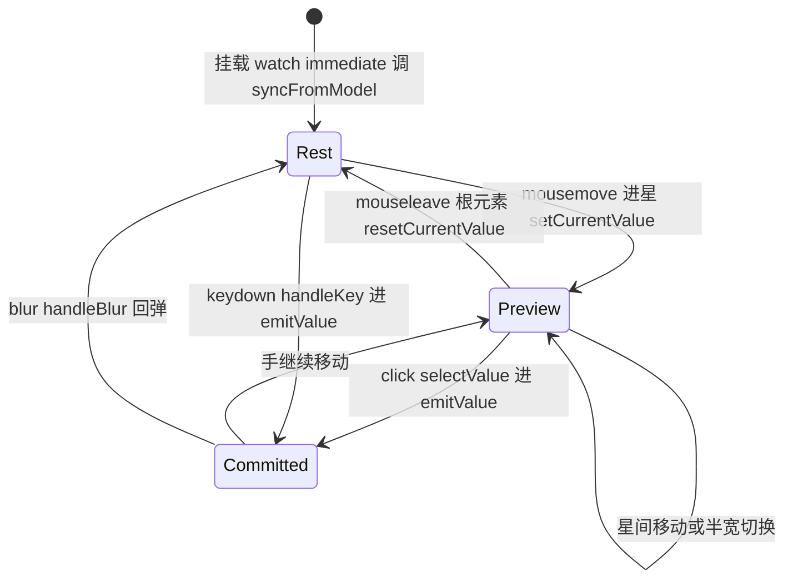
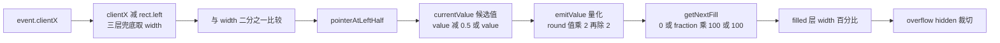
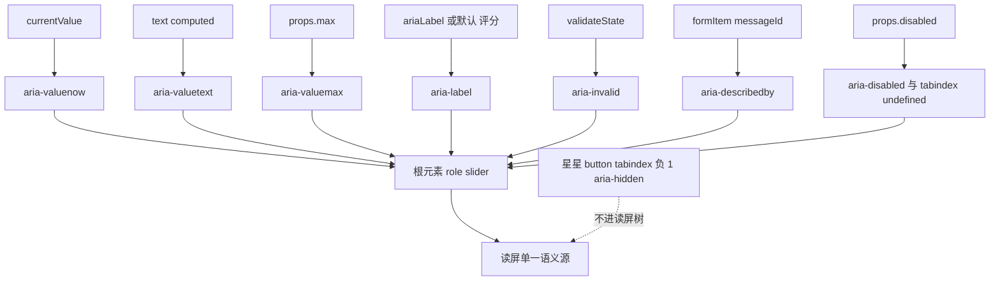

# 6-10 · Rate：评分与可达性

> 本篇源码坐标（均为当前工作区实态）：
> - `packages/components/rate/src/rate.vue`（单文件组件全文 399 行：脚本 339 行 + 模板 60 行）
> - `packages/components/rate/src/rate.ts`（类型与默认常量，41 行）
> - 样式：`packages/theme/src/components/rate.css`（全文 109 行）
> - 测试：`packages/components/rate/__tests__/rate.spec.ts`（175 行，8 个用例）
> - 类型夹具：`tests/types/fixtures/rate.ts`（37 行）；文档示例：`apps/docs/examples/rate/`（5 个）
> - 出口：`packages/components/rate/index.ts`（`XyRate` + 6 个类型导出）

上一篇 6-09《InputNumber：精度与边界》拆完"步进与超界回弹"，卷六的轨迹其实一直在绕同一个母题打转：**用户往组件里塞一个值，组件在"现在正在发生的输入"与"已经确认的值"之间怎么摆姿势**。6-07《Switch：最小受控范本》给过这个母题的最简解——单值、单轨、开关两态，外部真相是唯一的真相。本篇的 Rate 是这个母题的第一个"变体卷"：评分场景天生多出一条输入通道——鼠标在星星之间划过时，用户并没有做出选择，但组件必须**立刻**把"如果我现在点下去会是什么"演出来看。这就是 hover 预览态。于是核心问题浮出水面：

**hover 预览态与键盘操作，怎么共享同一个值模型？**

鼠标是两轨的（移动=预览，点击=提交），键盘是单轨的（每一次按键都该是提交）——两条节奏完全不同的通道，最终必须汇入同一份显示、同一组事件、同一条校验链。Rate 是全库少数同时吃下两条通道的组件，它的答案值得拆到行级。顺带地，本篇还会回答一个可达性选型问题：评分的键盘模型该是 `radiogroup` 还是 `slider`？实码有定论。

## 一、考据先行：状态面盘点与"双值变体"

先看类型层全文。Rate 组件的 `rate.ts` 只有 41 行，但把 props 分成了清晰的四组：

```ts
// packages/components/rate/src/rate.ts:1-40
import type Rate from "./rate.vue";
import type { ComponentSize } from "xiaoye-primitives";

export type RateColorMap = string[] | Record<number, string>;
export type RateIconMap = string[] | Record<number, string>;
export type RateValueChangeHandler = (value: number) => void;
export type RateFocusHandler = (event: FocusEvent) => void;

export interface RateProps {
  modelValue?: number | null;
  id?: string;
  lowThreshold?: number;
  highThreshold?: number;
  max?: number;
  colors?: RateColorMap;
  voidColor?: string;
  disabledVoidColor?: string;
  icons?: RateIconMap;
  voidIcon?: string;
  disabledVoidIcon?: string;
  disabled?: boolean;
  allowHalf?: boolean;
  showText?: boolean;
  showScore?: boolean;
  textColor?: string;
  texts?: string[];
  scoreTemplate?: string;
  size?: ComponentSize;
  clearable?: boolean;
  ariaLabel?: string;
  validateEvent?: boolean;
}

export type RateInstance = InstanceType<typeof Rate>;

export const DEFAULT_RATE_TEXTS = ["极差", "失望", "一般", "满意", "惊喜"];
export const DEFAULT_RATE_COLORS = ["#94a3b8", "#f59e0b", "#f97316"];
export const DEFAULT_RATE_ICONS = ["mdi:star", "mdi:star", "mdi:star"];
export const DEFAULT_RATE_VOID_ICON = "mdi:star-outline";
export const DEFAULT_RATE_DISABLED_VOID_ICON = "mdi:star-outline";
```

四组各司其职：**值与域**（`modelValue`、`max`、`allowHalf`、`clearable`）；**视觉映射**（`lowThreshold`/`highThreshold` 两道阈值切三段，`colors`/`icons` 给"激活侧"配色配图标，`voidColor`/`voidIcon`/`disabledVoidIcon` 给"空态侧"，`texts`/`scoreTemplate` 给文案）；**形态**（`disabled`、`size`、`showText`/`showScore`）；**a11y 与表单**（`ariaLabel`、`id`、`validateEvent`）。注意 `modelValue?: number | null`——类型层就承认了"外部可能传来 null"这个事实，这不是宽容，是把收编 null 的责任提前写进了契约（第二节 `clampValue` 见分晓）。

再看交互状态面。`rate.vue:58-62` 五行声明了组件全部的本地状态：

```ts
// packages/components/rate/src/rate.vue:58-62
const rootRef = shallowRef<HTMLElement | null>(null);
const currentValue = ref(0);
const hoverIndex = ref(-1);
const pointerAtLeftHalf = ref(false);
const isFocused = ref(false);
```

五个名字，一个根元素引用，四个状态。对照 6-07《Switch》的考据表可以做一份精确的"变体检定"：Switch 的本地状态只有"外部真相是否到达"这一件事，`currentValue` 纯粹是 `props.modelValue` 的代理，单值单轨；Rate 则多出三个正交维度——**预览中的值是多少**（`currentValue` 兼职）、**指针悬在哪颗星上**（`hoverIndex`）、**指针是否在半星判定线的左侧**（`pointerAtLeftHalf`），外加一个纯视觉瞬态 `isFocused`。rate 是 6-07 那个"最小受控范本"的**受控+预览双值变体**：它有一个外部真相（`modelValue`），一个交互真相（`currentValue`），两者在大多数时刻相等、在指针进入组件后的大多数时刻**故意不相等**。

这里有一个精读才能抓到的命名考据，值得先钉死：**实码里不存在叫 `hoverValue` 的变量**。直觉上"hover 预览值"应该是一个独立的 ref，但 `rate.vue` 的选择是让 `currentValue` 一人分饰两角——它既是"已提交的值"又是"预演中的值"，预演的痕迹由 `hoverIndex`（悬停标记，服务于 `is-hover` 类）和 `pointerAtLeftHalf`（半星判定记忆，服务于点击提交）两个旁路记录。这个归属决策是本篇第一个设计权衡，第二节正面裁决。先记住结论的前半句：**显示层的所有计算（填充分比、颜色、文案、aria-valuenow）只看 `currentValue` 一处**——这正是"预览免费"的来源。

## 二、hover 预览的双轨模型：一张状态机

把 `rate.vue` 脚本段的状态与函数全读完后，双轨模型可以画成一张严格对应实码的状态机（每个转移旁的函数名都能在源码里找到）：



三个状态、七条转移，全部函数只有一个不变量：**`currentValue` 是唯一显示源，`emitValue` 是唯一提交口，`syncFromModel` 是唯一回弹口**。看代码。先看状态面全景（本地状态之上的整个派生 computed 家族）：

```vue
<!-- packages/components/rate/src/rate.vue:58-120 -->
const rootRef = shallowRef<HTMLElement | null>(null);
const currentValue = ref(0);
const hoverIndex = ref(-1);
const pointerAtLeftHalf = ref(false);
const isFocused = ref(false);

const mergedSize = computed(() => props.size ?? globalSize.value);
const inputId = computed(() => props.id ?? formItem?.inputId);
const messageId = computed(() => (formItem?.message.value ? formItem.messageId : undefined));
const validateState = computed(() => formItem?.validateState.value ?? "idle");
const normalizedModelValue = computed(() => clampValue(props.modelValue));

const rootKls = computed(() => [
  ns.base.value,
  `${ns.base.value}--${mergedSize.value}`,
  ns.is("disabled", props.disabled),
  ns.is("focused", isFocused.value),
  attrs.class
]);

const nativeAttrs = computed<Record<string, unknown>>(() => {
  const rest = { ...attrs };
  delete rest.class;
  delete rest.style;
  return rest;
});

const colorMap = computed<Record<number, ThresholdValue<string>>>(() =>
  normalizeThresholdMap(props.colors, DEFAULT_RATE_COLORS, props.lowThreshold, props.highThreshold, props.max)
);

const iconMap = computed<Record<number, ThresholdValue<string>>>(() =>
  normalizeThresholdMap(props.icons, DEFAULT_RATE_ICONS, props.lowThreshold, props.highThreshold, props.max)
);

const activeColor = computed(() => getValueFromMap(currentValue.value, colorMap.value) ?? "");
const activeIcon = computed(
  () => getValueFromMap(currentValue.value, iconMap.value) ?? DEFAULT_RATE_ICONS[2]
);
const voidIcon = computed(() =>
  props.disabled ? props.disabledVoidIcon || DEFAULT_RATE_DISABLED_VOID_ICON : props.voidIcon || DEFAULT_RATE_VOID_ICON
);

const rootStyle = computed(() => ({
  [ns.cssVarBlock("fill-color")]: activeColor.value || undefined,
  [ns.cssVarBlock("void-color")]:
    props.disabled && props.disabledVoidColor ? props.disabledVoidColor : props.voidColor || undefined,
  [ns.cssVarBlock("disabled-void-color")]: props.disabledVoidColor || undefined
}));

const text = computed(() => {
  if (props.showScore) {
    const displayValue = props.disabled ? normalizedModelValue.value : currentValue.value;
    return props.scoreTemplate.replace(/\{\s*value\s*\}/g, String(displayValue));
  }

  if (props.showText) {
    const textIndex = Math.ceil(currentValue.value) - 1;
    return textIndex >= 0 ? props.texts[textIndex] ?? "" : "";
  }

  return "";
});
```

逐段过。`normalizedModelValue`（68 行）是外部真相的"净化视图"：`clampValue` 把 `null`、`NaN`、`Infinity` 全部收编为 0，再夹进 `[0, max]`——`RateProps.modelValue` 类型里那个 `| null` 在这里被兑现。`inputId`/`messageId`/`validateState`（65-67 行）是 4-08 讲过的 form-item context 三件套在 rate 上的消费点，第五节的 `aria-describedby` 与 `aria-invalid` 都吃它们。

`text`（108-120 行）是双轨模型**在文案层的暴露点**，也是"预览免费"的最好证据：`showScore` 分支里，禁用态显示 `normalizedModelValue`（只读均分不该被任何残留预览污染——`apps/docs/examples/rate/custom.vue:14-15` 的"只读均分 {value}"正是这个分支的用法），可交互态显示 `currentValue`（指针划过第 4 颗星，"满意度 {value}"实时变 4）；`showText` 分支用 `Math.ceil(currentValue) - 1` 把值取整后索引文案数组——3.5 星报"满意"（第 4 档），这是评分语义的惯例：文案描述的是"用户已经够到的档位"。一个 computed 里藏着两种真值观，而它的下游（`aria-valuetext`、`__text` span）对此一无所知。

### 2.1 纯函数层：值域与阈值

三个工具函数全是纯函数，`rate.vue:122-174`：

```ts
// packages/components/rate/src/rate.vue:122-174
function clampValue(value: number | null | undefined) {
  if (typeof value !== "number" || Number.isNaN(value) || !Number.isFinite(value)) {
    return 0;
  }

  return Math.min(props.max, Math.max(0, value));
}

function normalizeThresholdMap<T>(
  value: T[] | Record<number, T>,
  fallback: readonly T[],
  lowThreshold: number,
  highThreshold: number,
  max: number
) {
  if (Array.isArray(value)) {
    const [low = fallback[0], medium = fallback[1], high = fallback[2]] = value;

    return {
      [lowThreshold]: low,
      [highThreshold]: {
        value: medium,
        excluded: true
      },
      [max]: high
    } satisfies Record<number, ThresholdValue<T>>;
  }

  return value as Record<number, ThresholdValue<T>>;
}

function getValueFromMap<T>(value: number, map: Record<number, ThresholdValue<T>>) {
  const matchedKeys = Object.keys(map)
    .map(Number)
    .filter((key) => {
      const matched = map[key];

      if (typeof matched === "object" && matched !== null && "value" in matched) {
        return matched.excluded ? value < key : value <= key;
      }

      return value <= key;
    })
    .sort((a, b) => a - b);

  const matchedValue = map[matchedKeys[0]];

  if (typeof matchedValue === "object" && matchedValue !== null && "value" in matchedValue) {
    return matchedValue.value;
  }

  return matchedValue;
}
```

`clampValue` 不解释。有意思的是 `normalizeThresholdMap` + `getValueFromMap` 这对组合：`colors`/`icons` 接受两种形态——数组 `[灰, 黄, 橙]`（用户只关心低中高三档）或对象 `{ 2: 灰, 4: 黄, 5: 橙 }`（用户自己定义刻度）。数组形态被编译成一个阈值字典：`{ [lowThreshold]: 灰, [highThreshold]: { value: 黄, excluded: true }, [max]: 橙 }`。默认档位下的字典是 `{ 2: "#94a3b8", 4: { value: "#f59e0b", excluded: true }, 5: "#f97316" }`——**`excluded: true` 让中档的边界落在"够到 4 之前"**：3.5 星是黄，4 星整是橙。这个 excluded 语义在测试里被精确断言（`rate.spec.ts:110-117`，本篇第六节），也是 6-05《Radio》说过的"类型管不到的约定"的反面：这里的约定全部被编码成了运行时结构，`ThresholdValue<T>`（`rate.vue:19` 本地类型）让"普通档"与"排他档"共用一个字典。

`getValueFromMap` 的匹配算法是"全部满足条件的键取最小"：值 3.5 在默认字典里命中键 4（3.5 < 4，excluded）与键 5（3.5 ≤ 5），取最小键 4 → 黄。边界情形——值 0：命中 2（0 ≤ 2）、4（0 < 4）、5（0 ≤ 5），取 2 → 灰。**0 分也有激活色**，这让"第 0 颗星"在预览中也有确定性颜色，为空态图标层和 filled 层的叠加提供了恒定前提。

### 2.2 提交管线 emitValue：两条通道的唯一汇合点

```ts
// packages/components/rate/src/rate.vue:176-223
function syncFromModel() {
  currentValue.value = normalizedModelValue.value;
  pointerAtLeftHalf.value = currentValue.value % 1 !== 0;
}

function getNextFill(item: number) {
  const whole = Math.floor(currentValue.value);

  if (item <= whole) {
    return 100;
  }

  const fraction = currentValue.value - whole;

  if (item === whole + 1 && (props.allowHalf || props.disabled) && fraction > 0) {
    return fraction * 100;
  }

  return 0;
}

function emitValue(value: number) {
  let nextValue = clampValue(value);

  if (props.allowHalf) {
    nextValue = Math.round(nextValue * 2) / 2;
  } else {
    nextValue = Math.round(nextValue);
  }

  if (props.clearable && nextValue === normalizedModelValue.value) {
    nextValue = 0;
  }

  currentValue.value = nextValue;
  pointerAtLeftHalf.value = nextValue % 1 !== 0;
  hoverIndex.value = -1;

  emit("update:modelValue", nextValue);

  if (nextValue !== normalizedModelValue.value) {
    emit("change", nextValue);
  }

  if (props.validateEvent) {
    void nextTick(() => formItem?.validate("change"));
  }
}
```

`syncFromModel`（176-179 行）三行，是回弹口的全部：`currentValue` 归位外部真相，`pointerAtLeftHalf` 按小数余数复原（模型值 3.5 → 左半标记为真，这样下一次点击第 4 颗星会正确提交 4 而不是丢失半星记忆）。`getNextFill`（181-195 行）先按下不表，它是第三节半星的主角。

`emitValue`（197-223 行）是全组件的咽喉，五步管线，每一步都有讲究：

1. **clamp**——键盘步进可能越界（max 上再右移），先夹回 `[0, max]`；
2. **量化**——`allowHalf` 时 `Math.round(value * 2) / 2` 收敛到 0.5 粒度，否则收整到整数。注意量化的对象是"这一步的原始值"，越界回弹发生在量化之前，量化在收口处保证最后一位小数干净；
3. **clearable 判等**——与 `normalizedModelValue` 比较，**不是与 `currentValue`**。这个基准选择有实质后果：预览中 `currentValue` 早已被 `setCurrentValue` 改写，如果跟它比，"预览态下点击当前预览值"永远清空，clearable 就从"再次点击同一颗星清空"退化成"点击任何已预览的星都清空"。跟外部真相比，语义才成立；
4. **本地先行**——`currentValue.value = nextValue` 写在 `emit` **之前**。这是乐观更新：父组件若不回写 `modelValue`（忘记绑 `v-model` 或异步父组件），UI 也已经诚实地走到了用户点击的位置，与 4-04《受控-非受控双模》的"本地 `currentValue` 分水岭"一脉相承。同时清掉 `pointerAtLeftHalf` 与 `hoverIndex`——提交即退出预览；
5. **事件与校验**——`update:modelValue` 无条件发，`change` 只在值真的变了才发（与净化后的外部真相比较，避免父组件回环时重复触发校验），`validateEvent` 放行时 `nextTick` 后触发 form-item 的 `change` 校验——先让 DOM 收敛，再让校验逻辑读最新的值。

第五步里那个"值没变就不发 change"的判断还顺手挡住了一种循环：clearable 清空时若模型值本来就是 0，`nextValue` 量化后仍是 0，`update:modelValue` 会发（父组件收到的还是 0，无感），但 `change` 不发，form 校验也不被无谓地抖动一次。

### 2.3 预览三入口与回弹两保险

预览态的写入有且只有三个入口，`rate.vue:225-264`：

```ts
// packages/components/rate/src/rate.vue:225-264
function setCurrentValue(value: number, event?: MouseEvent) {
  if (props.disabled) {
    return;
  }

  let nextValue = value;

  if (props.allowHalf && event) {
    const currentTarget = event.currentTarget as HTMLElement | null;
    const rect = currentTarget?.getBoundingClientRect();
    const width = rect?.width || currentTarget?.clientWidth || 16;
    const left = rect?.left ?? 0;
    const offset = event.clientX - left;

    pointerAtLeftHalf.value = offset <= width / 2;
    nextValue = pointerAtLeftHalf.value ? value - 0.5 : value;
  } else {
    pointerAtLeftHalf.value = false;
  }

  currentValue.value = clampValue(nextValue);
  hoverIndex.value = value;
}

function resetCurrentValue() {
  if (props.disabled) {
    return;
  }

  syncFromModel();
  hoverIndex.value = -1;
}

function selectValue(value: number) {
  if (props.disabled) {
    return;
  }

  emitValue(props.allowHalf && pointerAtLeftHalf.value ? value - 0.5 : value);
}
```

`setCurrentValue` 是 mousemove 入口（第三节的半星几何判定在 232-243 行，这里先看双轨分工）：`currentValue` 被改写为预览值，`hoverIndex` 记下悬停星，`pointerAtLeftHalf` 记下半星侧。注意三个函数开头的同一行 `if (props.disabled) return`——禁用守卫在四个交互函数（含 `handleKey`）里重复了四次而不是抽一个高阶函数，这是"守卫贴着入口"的写法：每个入口的早退路径一眼可见，代价是四次重复，收益是审查任何单个函数时不需要理解包装层。

`resetCurrentValue` 是回弹入口：`syncFromModel()` 归位 + 清悬停标记。它绑定在**根元素**的 `@mouseleave` 上（模板 361 行）——这个绑定位置是预览体验的隐形支柱：星星之间的缝隙移动、跨星划过都不触发回弹，只有指针离开整个评分区（含文案区）才回弹。若绑在每个星上，跨星移动的瞬间会先回弹到模型值再预览到新值，中间闪一帧旧值。

`selectValue` 是点击入口，一行核心逻辑：把"点击的那颗星"减去半星记忆得到最终值，交给 `emitValue`。注意它自己不 clamp、不量化——那是提交管线的事，入口只负责"翻译鼠标意图"。

回弹的第二道保险在 blur。`rate.vue:303-312`：

```ts
// packages/components/rate/src/rate.vue:303-312
function handleBlur(event: FocusEvent) {
  isFocused.value = false;
  hoverIndex.value = -1;
  syncFromModel();
  emit("blur", event);

  if (props.validateEvent) {
    void nextTick(() => formItem?.validate("blur"));
  }
}
```

键盘用户 Tab 走时，`syncFromModel` 把 `currentValue` 弹回 `normalizedModelValue`。这一行是"受控的诚实"：如果父组件接收了 `update:modelValue` 并回写，两边相等，无事发生；如果父组件**没有**回写（表单里做了拦截、或只是忘了绑），预览残留会被弹回外部真相——**本地交互值永远服从外部真相，回弹是常态而不是异常**。这正是 6-07《Switch》确立的受控纪律在双值变体上的延伸：Switch 的 `currentValue` 代理外部真相，Rate 的 `currentValue` 在预览期暂时离开、在失去焦点时归队。

### 2.4 权衡一：预览态放在哪里？

现在裁决第一处设计权衡。候选方案三个：

**方案 A：独立 `hoverValue` ref。** 预览值与提交值物理分离，`displayValue = hoverValue ?? currentValue` 一个 computed 收口，回弹只需 `hoverValue = null`。理论最干净，但代价立刻显形：`getNextFill`、`activeColor`、`activeIcon`、`text`、`aria-valuenow`、`is-active` 类全部要从"看 currentValue"改成"看 displayValue"——六个消费点逐一改写，且今后每加一个视觉派生都要记得选对数据源。预览不再是免费的。

**方案 B：previewValue computed 派生。** 保存 `hoverIndex` 与 `pointerAtLeftHalf`，用 computed 合成预览值，`currentValue` 保持纯提交值。同样要改六个消费点，还引入了"computed 合成值与实际提交值可能不一致"的新对账面。

**方案 C（本库实态）：`currentValue` 双职 + `hoverIndex` 标记 + 回弹函数兜底。** 显示层六个消费点**零改动**——它们本来就只看 `currentValue`；预览的全部成本被压缩到两处：`setCurrentValue` 的写入、`resetCurrentValue`/`handleBlur` 的回弹。风险是"忘了回弹就泄漏预览"，防御是回弹点被枚举穷尽——mouseleave、blur 两个物理出口各挂一道（`resetCurrentValue`、`handleBlur` 都调 `syncFromModel`），提交路径自带清场（`emitValue` 里 `hoverIndex.value = -1`）。

EP 的选择提供了旁证：element-plus dev 分支的 `rate.vue` 同样是 `currentValue` 承担预览与提交双职（`setCurrentValue` 写它、`resetCurrentValue` 用 `clamp(props.modelValue)` 弹回），同样用 `hoverIndex` 做悬停标记。两个独立实现收敛到同一结构，说明在"显示派生点多、预览生命周期短"的组件里，**双职 + 回弹**比**分离 + 汇聚**的总成本低。真正的纪律不在数据结构，在回弹点的穷举——这也是为什么状态机图里回弹边比预览边更值得审查。

## 三、半星：从指针几何到宽度裁切

半星是 hover 预览的最难变体：判定线不再在星与星之间，而在一颗星的内部。本节沿数据流走一遍：指针几何 → 值 → 像素。

先看渲染层的结构。每个星是恒定双层的，`rate.vue:363-397`：

```vue
<!-- packages/components/rate/src/rate.vue:363-397 -->
<button
  v-for="item in props.max"
  :key="item"
  class="xy-rate__item"
  :class="[
    ns.is('active', item <= currentValue),
    ns.is('hover', hoverIndex === item),
    ns.is('current', item === Math.ceil(currentValue || 1))
  ]"
  type="button"
  :disabled="props.disabled"
  tabindex="-1"
  :aria-hidden="true"
  @mousemove="setCurrentValue(item, $event)"
  @click="selectValue(item)"
>
  <span class="xy-rate__icon-layer xy-rate__icon-layer--void" aria-hidden="true">
    <XyIcon :icon="voidIcon" />
  </span>
  <span
    class="xy-rate__icon-layer xy-rate__icon-layer--filled"
    :style="{ width: `${getNextFill(item)}%` }"
    aria-hidden="true"
  >
    <XyIcon :icon="activeIcon" />
  </span>
</button>
```

每个 `xy-rate__item` 永远渲染两个层：void 层整幅空态图标，filled 层整幅激活图标但宽度由 `getNextFill(item)%` 控制。`getNextFill`（回看 181-195 行）把三种情形统一成一个百分比模型：**已满的星 100**（`item <= Math.floor(currentValue)`），**当前值的"半颗"星 fraction×100**（`item === whole + 1` 且有小数、且 `allowHalf || disabled`），**其余 0**。3.5 分 = 第 1-3 颗 100%，第 4 颗 50%，第 5 颗 0%。注意条件里的 `|| props.disabled`——**禁用态保留小数填充**（3.5 的均分要显示半星），但交互被禁用；而可交互态若没开 `allowHalf`，`fraction` 永远是 0（`emitValue` 量化收整了），半星层退化为纯整数填充。`Math.ceil(currentValue || 1)` 的 `|| 1` 兜底让 0 分时 `is-current` 落在第 1 颗星——它是键盘焦点环的锚点，第四节揭晓。

CSS 层的裁切实现，`rate.css:64-88`：

```css
/* packages/theme/src/components/rate.css:64-88 */
.xy-rate__icon-layer {
  position: absolute;
  inset: 0;
  display: inline-flex;
  align-items: center;
  justify-content: center;
  overflow: hidden;
  line-height: 1;
  pointer-events: none;
}

.xy-rate__icon-layer .xy-icon,
.xy-rate__icon-layer .xy-icon svg {
  width: var(--xy-rate-icon-size);
  height: var(--xy-rate-icon-size);
}

.xy-rate__icon-layer--void {
  color: var(--xy-rate-void-color);
}

.xy-rate__icon-layer--filled {
  justify-content: flex-start;
  color: var(--xy-rate-fill-color);
}
```

四个属性咬合成裁切机：两层都 `position: absolute; inset: 0` 叠在同一盒子里（`__item` 是 33-49 行的 `position: relative` 定位上下文）；层内图标被强制为恒定尺寸（75-79 行）——**图标不随层的宽度收缩**；filled 层 `justify-content: flex-start` 让图标从左缘起画（void 层仍居中，但因为两层同尺寸同位置，视觉上完全重合）；层的 `overflow: hidden` 把超出宽度部分裁掉。于是"filled 层宽 50%"精确等于"图标左半可见"。`pointer-events: none`（72 行）把两个层从命中测试里摘除——鼠标事件全部落在 button 本体上，`setCurrentValue` 的 `getBoundingClientRect` 才能拿到稳定的几何。

到这里可以把半星的三条技术路线摆上桌了，这是本篇第二处设计权衡：

| 路线 | 做法 | 成本 | 代表 |
| --- | --- | --- | --- |
| 恒定双层 + 宽度裁切 | 每星永远渲染 void + filled 两层，filled 按百分比裁切 | DOM 节点翻倍（2n 个层）；渲染路径单一 | **本库实态** |
| 条件叠加 decimal 层 | 整星用 `is-active` 类切换单图标，半星时才 v-show 出第三层 | 三种渲染形态（无/半/满），逻辑分支多 | EP dev 分支 `rate.vue` |
| clip-path / 计算偏移 | 单图标 + `clip-path: inset(0 50% 0 0)` 或背景偏移 | DOM 最省；clip-path 与 color-mix 等老浏览器兼容面差 | 少数轻量实现 |

EP 的做法值得展开一句，因为它恰好是路线二的活标本：EP 的每个 item 内用 `v-show` 切换"激活图标/空图标"，开 `allowHalf` 且需要半星时再叠一个 `el-rate__decimal` 层——而它的宽度策略是**交互中固定 50%**（`decimalStyle` 在悬停期间返回 `width: '50%'`，仅禁用态按 `modelValue` 的小数部分返回 `valueDecimal`%）。也就是说 EP 在"悬停预览半星"时恒定显示半宽、在"只读展示 3.7 分"时按小数裁切——两条分支。本库的 `getNextFill` 把两件事合成了一条公式：预览也好、提交也好、只读也好，都回到"fraction×100"这一个数据源，**渲染路径不分叉**。代价是恒定双层的 DOM 翻倍，收益是 0%、50%、100% 与任意小数走同一条通道——对 SSR 快照、对测试断言（第六节会看到测试直接断言宽度行为）、对未来扩展（四分之一星只需改 `emitValue` 的量化粒度，渲染层零改动）都更便宜。

再回看指针几何。`setCurrentValue` 的 232-243 行（上节已引）用 `event.clientX - rect.left` 与 `width / 2` 比较，`rect` 来自 `event.currentTarget` 的 `getBoundingClientRect`，宽度取值带三层兜底 `rect?.width || clientWidth || 16`。EP 同一判定用的是 `event.offsetX`——相对目标元素内边缘的偏移。本库弃 `offsetX` 的原因藏在测试里：`rate.spec.ts:63-68` 用 `Object.defineProperty(secondItem.element, "getBoundingClientRect", ...)` 造了几何——jsdom 里 `getBoundingClientRect` 恒为全零矩形，**mock `getBoundingClientRect` 是可测试的，而 `offsetX` 在合成事件里几乎无法伪造**（jsdom 不根据 clientX 计算 offsetX）。几何口径选 `clientX - rect.left`，等于把"判定逻辑"与"几何来源"解耦：测试只需提供假的 rect，判定分支照常走通（`clientX: 5`、宽 20 → 5 ≤ 10 → 左半 → 点击提交 1.5）。这是"可测性反推实现细节"的一个标准案例。

值到像素的整条流水线收拢成一张图：



## 四、键盘可达：role="slider" 的选型与代偿

现在到本篇核心问题的键盘半边。先看根元素的 a11y 装配全文，`rate.vue:341-362`：

```vue
<!-- packages/components/rate/src/rate.vue:341-362 -->
<template>
  <div
    :id="inputId"
    ref="rootRef"
    :class="rootKls"
    :style="[rootStyle, attrs.style]"
    role="slider"
    :tabindex="props.disabled ? undefined : 0"
    :aria-label="props.ariaLabel ?? '评分'"
    :aria-valuenow="currentValue"
    aria-valuemin="0"
    :aria-valuemax="props.max"
    :aria-valuetext="text || undefined"
    :aria-disabled="props.disabled"
    :aria-invalid="validateState === 'error' ? 'true' : undefined"
    :aria-describedby="messageId"
    v-bind="nativeAttrs"
    @keydown="handleKey"
    @focus="handleFocus"
    @blur="handleBlur"
    @mouseleave="resetCurrentValue"
  >
```

直觉的答案是 `role="radiogroup"`：五颗星看着就是五个选项。但实码定论是 `role="slider"`。这是本篇第三处设计权衡，四条论据：

1. **值语义**。评分的 DOM 表达是"0 到 max 上的一个数值"，不是"n 选一"。`allowHalf` 之后值域连续化（0.5 粒度），3.5 分不属于任何一颗星——radiogroup 的每个 radio 只能表达"选中/未选中"，无法表达"半选中"，`aria-valuenow="3.5"` 这种数值播报 radiogroup 也给不了。
2. **键位语义**。slider 的 WAI-ARIA 模式原生就是方向键增减，与本库实现严格同构；radiogroup 要么逐项 Tab（roving tabindex），要么自己解释方向键，反而是把 slider 的语义手工重演一遍。
3. **文案联动**。`aria-valuetext` 绑定 `text` computed——分数模板"满意度 {value}"或档位文案直接进读屏播报，这是 slider 角色的专属能力（radio 的播报只有"选中/未选中 + label"）。
4. **表单语义**。`aria-invalid` 与 `aria-describedby="messageId"` 把 4-08 的校验链接进读屏：校验失败读屏报"无效"，错误消息通过 id 关联播报。这套联动在 slider 模式下是标准配置。

EP 做了完全相同的选择（根元素 `role="slider"`、`aria-valuenow`/`aria-valuemin`/`aria-valuemax`/`aria-valuetext` 一应俱全、方向键四向步进、`allowHalf` 步长 0.5）——两个互不抄袭的实现收敛到同一角色与同一键位，这条选型基本是业界共识。差异在默认标签：EP 的 `ariaLabel` 兜底是英文 `'rating'`，本库兜底 `'评分'`（349 行）——对一个默认文案全中文的库，这是合理本土化。

键盘事件处理，`rate.vue:266-296`：

```ts
// packages/components/rate/src/rate.vue:266-296
function handleKey(event: KeyboardEvent) {
  if (props.disabled) {
    return;
  }

  const step = props.allowHalf ? 0.5 : 1;
  let nextValue = currentValue.value;

  switch (event.key) {
    case "ArrowRight":
    case "ArrowUp":
      nextValue += step;
      break;
    case "ArrowLeft":
    case "ArrowDown":
      nextValue -= step;
      break;
    default:
      return;
  }

  nextValue = clampValue(nextValue);

  if (nextValue === currentValue.value) {
    return;
  }

  event.preventDefault();
  event.stopPropagation();
  emitValue(nextValue);
}
```

这段只有 31 行，但它回答了本篇标题里"统一模型"的键盘半边：**键盘没有预览轨，每次按键直发提交**。`handleKey` 不经过 `setCurrentValue`、不设 `hoverIndex`——方向键的每一步都直接进 `emitValue` 管线，量化、clearable、乐观更新、事件、校验一次走完。于是两条通道的关系可以精确表述为：**鼠标是"预览轨 + 提交轨"，键盘是"直连提交轨"，但两条通道共享同一个显示源（`currentValue`）、同一个提交口（`emitValue`）、同一套校验（`validateEvent`）**。键盘用户的"预览"就是提交本身——每按一次右键，值 +1（或 +0.5），`currentValue` 即时刷新，星星、颜色、文案、`aria-valuenow` 同步前进，错了按左键退回来就是。这正是 slider 交互心智：连续步进、即时反馈、到头即止（`clampValue` + `nextValue === currentValue` 双重边界，到 max 后再按右键 `preventDefault` 都不会被调用，方向键的默认行为——比如页面滚动——原样放行）。

`preventDefault` 与 `stopPropagation` 的顺序也有讲究：先确认值真的会变（289 行的等值守卫）才拦截默认行为与冒泡。若在等值守卫之前就 preventDefault，max 边界上的方向键会吞掉页面滚动却什么都不做——"拦截"必须与"效果"捆绑。

还有一个容易忽略的键位事实：**Home/End 没有实现**。WAI-ARIA 的 slider 模式推荐 Home/End 跳到最小/最大值，本库与 EP 都只实现了四个方向键。对 max=5 的评分场景这是可接受的裁剪（方向键五步到头），但若 `max` 被配成 10+，纯键盘用户从 0 到 10 要按二十次（半星模式）。这是实码的已知边界，不是叙述误差——记录在案。

### 4.1 星星的双重身份：真实的 button，读屏里的隐形人

模板 363-378 行（上节已引）里，每颗星是一个真实的 `<button type="button" :disabled>`——真实的按钮带来真实的点击热区、原生的禁用语义、光标与 hover 的浏览器默认行为；但同一批按钮上挂着 `tabindex="-1"` 与 `aria-hidden="true"`——**它们不进 Tab 链，也不进无障碍树**。不这么做的后果推演一遍：五个 button 会以"按钮"身份全部进入读屏树，读屏用户听到的是"按钮 按钮 按钮 按钮 按钮"——而它们的父容器已经以 slider 身份携带了完整的值语义，五颗星重复播报的只是视觉装饰。`aria-hidden` 是"装饰性内容不进读屏树"的标准处理。

这与 6-05《Radio》的 a11y 方案构成一组精确的镜像：radio **藏原生控件留语义**（`opacity: 0` 的原生 input 承载全部键盘与读屏语义，自定义皮只管视觉）；rate **藏自定义控件免语义**（真实 button 只当点击热区与视觉载体，读屏语义全部上收到根元素的 slider 角色）。两案方向相反、原理相同：**语义只在一处存在，视觉与语义各自选最合适的宿主**。

键盘焦点环也随之而来。`rate.css:57-62`：

```css
/* packages/theme/src/components/rate.css:57-62 */
.xy-rate.is-focused .xy-rate__item.is-current {
  outline: 2px solid color-mix(in srgb, var(--xy-brand) 42%, var(--xy-bg-container));
  outline-offset: 3px;
  border-radius: var(--xy-radius-sm);
  box-shadow: 0 0 0 3px color-mix(in srgb, var(--xy-brand) 10%, transparent);
}
```

6-05 里 radio 的键盘焦点环靠 `:focus-visible + .xy-radio__inner` 的相邻兄弟选择器桥回自定义皮——但那个桥在 rate 上搭不起来：焦点落在**根容器**上，星星是它的子元素而非兄弟，相邻选择器够不着；而且就算够得着，"焦点在容器"要翻译成"哪颗星该亮环"，答案是**当前值所在的星**而不是"所有星"。所以实码用 JS 代偿：`isFocused` ref（`handleFocus`/`handleBlur` 驱动，298-301 与 303-312 行）× `is-current` 类（模板 370 行，`item === Math.ceil(currentValue || 1)`）的乘积锁定焦点环位置——键盘用户每按一次方向键，环就跳到新值所在的星上，这正是"值在哪、环在哪"的视觉转译。0 分时 `|| 1` 兜底让环锚在第 1 颗星上，给键盘用户一个"从这里开始"的落点。鼠标用户不触发这个环吗？触发——鼠标点击后容器也聚焦（button 的 tabindex=-1 让点击焦点落在根上），`is-current` 恰好也是刚点的那颗星，环亮着但不突兀；对比 6-05 "键盘有环、鼠标无环"的严格二分，rate 的环对两种用户都有意义（键盘=导航位置，鼠标=最后点击），只是语义不同。

a11y 信息管道收拢成第二张全景图：



## 五、rate.css 逐段：三色变量通道与反馈代偿

逻辑层讲完，下到样式层。`rate.css` 全文 109 行，分四段：根与尺寸（1-31）、星与反馈（33-62）、双层裁切（64-88，第三节已拆）、禁用与文案（90-108）。

```css
/* packages/theme/src/components/rate.css:1-31 */
.xy-rate {
  --xy-rate-icon-size: 22px;
  --xy-rate-gap: 6px;
  --xy-rate-fill-color: var(--xy-warning);
  --xy-rate-void-color: color-mix(
    in srgb,
    var(--xy-text-secondary) 38%,
    var(--xy-bg-subtle)
  );
  --xy-rate-disabled-void-color: color-mix(
    in srgb,
    var(--xy-border-subtle) 84%,
    var(--xy-bg-subtle)
  );
  display: inline-flex;
  align-items: center;
  gap: var(--xy-rate-gap);
  vertical-align: middle;
  color: var(--xy-text-primary);
  outline: none;
}

.xy-rate--sm {
  --xy-rate-icon-size: 18px;
  --xy-rate-gap: 4px;
}

.xy-rate--lg {
  --xy-rate-icon-size: 26px;
  --xy-rate-gap: 8px;
}
```

根上的三条 CSS 变量就是逻辑层 `rootStyle`（`rate.vue:101-106`）的三个输出通道：`fill-color` 默认 `var(--xy-warning)`（琥珀色是评分的行业直觉，也是 3-02 色板里 warning 角色的本职），`void-color` 用 `color-mix` 把次级文字色往底色里兑——空态星要"看得出形状但退后"，disabled 的空态星更灰一档。逻辑层通过行内样式覆盖这三条变量（值为 `undefined` 时不输出，走 CSS 默认），**JS 与 CSS 的接口被压缩到三个自定义属性**——activeColor 随 `currentValue` 实时变化（预览中划过阈值，颜色档位跟着跳），void 色只随 props 变化。3-01 讲的"组件样式只消费语义层与刻度层"在这里有一个组件级范例：`--xy-warning`、`--xy-text-secondary`、`--xy-bg-subtle` 全是语义令牌，双主题自动跟随。尺寸档复用同款变量覆盖模式：`--xy-rate-icon-size` 18/22/26px、gap 4/6/8px，所有下游（星盒、层内图标、裁切）自动缩放。

```css
/* packages/theme/src/components/rate.css:33-62 */
.xy-rate__item {
  position: relative;
  display: inline-flex;
  align-items: center;
  justify-content: center;
  width: var(--xy-rate-icon-size);
  height: var(--xy-rate-icon-size);
  padding: 0;
  border: 0;
  background: transparent;
  color: inherit;
  cursor: pointer;
  border-radius: var(--xy-radius-sm);
  transition:
    transform var(--xy-transition-duration-fast) var(--xy-transition-timing),
    background-color var(--xy-transition-duration-fast) var(--xy-transition-timing);
}

.xy-rate__item:hover,
.xy-rate__item.is-hover {
  transform: translateY(-1px) scale(1.04);
  background: color-mix(in srgb, var(--xy-warning-soft) 28%, transparent);
}

.xy-rate.is-focused .xy-rate__item.is-current {
  outline: 2px solid color-mix(in srgb, var(--xy-brand) 42%, var(--xy-bg-container));
  outline-offset: 3px;
  border-radius: var(--xy-radius-sm);
  box-shadow: 0 0 0 3px color-mix(in srgb, var(--xy-brand) 10%, transparent);
}
```

51-52 行的选择器写了两路：`__item:hover` 伪类与 `.is-hover` 类。这是悬停反馈的**双保险**：正常鼠标流里两者同时命中（悬停哪颗星，`hoverIndex` 就是它）；分叉发生在键盘流——方向键步进时 `hoverIndex` 保持 -1、物理指针也不在星上，两路都不亮，悬停反馈让位给 57-62 行的焦点环；以及未来的程序化路径——`defineExpose`（332-338 行）暴露了 `setCurrentValue`/`resetCurrentValue`，外部调用时 `hoverIndex` 会亮而物理 hover 不会。两路选择器的语义是"物理悬停"与"逻辑悬停"，重合但不等价。另注意 `is-disabled` 段（90-97 行）里的 `transform: none`——它专治 disabled button 上仍会命中的 `:hover` 伪类（原生 disabled 挡事件，不挡伪类），禁用星的悬停不能还往上跳。

```css
/* packages/theme/src/components/rate.css:90-108 */
.xy-rate.is-disabled {
  color: var(--xy-text-secondary);
}

.xy-rate.is-disabled .xy-rate__item {
  cursor: not-allowed;
  transform: none;
}

.xy-rate.is-disabled .xy-rate__icon-layer--void {
  color: var(--xy-rate-disabled-void-color);
}

.xy-rate__text {
  margin-left: var(--xy-space-2);
  font-size: var(--xy-font-size-md);
  color: var(--xy-text-secondary);
  white-space: nowrap;
}
```

禁用三连：根降色、星禁光标与位移、void 层换 disabled-void 色（对应 `rootStyle` 的第三条通道）。`__text` 的 `white-space: nowrap` 保证"综合得分 3.5"这类模板文案不换行——评分是单行内联控件，文案抖动比截断更伤。

## 六、测试与夹具锁定

8 个用例把状态机的关键转移一一锁死。先看两个最硬的：

```ts
// packages/components/rate/__tests__/rate.spec.ts:50-91
it("支持半星预览和提交", async () => {
  const value = ref(0);
  const wrapper = mount({
    components: { XyRate },
    setup() {
      return {
        value
      };
    },
    template: `<xy-rate v-model="value" allow-half />`
  });

  const secondItem = wrapper.findAll(".xy-rate__item")[1];
  Object.defineProperty(secondItem.element, "getBoundingClientRect", {
    value: () => ({
      width: 20,
      left: 0
    })
  });

  await secondItem.trigger("mousemove", {
    clientX: 5
  });
  await secondItem.trigger("click");

  expect(value.value).toBe(1.5);
});

it("支持键盘增减", async () => {
  const wrapper = mount(XyRate, {
    props: {
      modelValue: 2
    }
  });

  await wrapper.trigger("keydown", {
    key: "ArrowRight"
  });

  expect(wrapper.emitted("update:modelValue")?.[0]).toEqual([3]);
  expect(wrapper.emitted("change")?.[0]).toEqual([3]);
});
```

半星用例的断言是 1.5——第二颗星（index 1 → `item = 2`）左半 → 2 - 0.5，覆盖了状态机里"mousemove 判半 → click 提交"整条链，几何 mock 的必要性第三节已拆。键盘用例在**非受控挂载**（只传 `modelValue: 2` 不监听更新）下断言 `update:modelValue` 与 `change` 双事件同发且同为 3——这精确检验了 `emitValue` 第 5 步的语义：`update:modelValue` 无条件发、`change` 因 3 ≠ 2 而发；同时"非受控挂载"顺便验证了乐观更新（组件内部 `currentValue` 已走到 3，不依赖父组件回写）。

```ts
// packages/components/rate/__tests__/rate.spec.ts:93-130
it("支持文本、分数模板和颜色变量", () => {
  const textWrapper = mount(XyRate, {
    props: {
      modelValue: 4,
      showText: true,
      texts: ["1", "2", "3", "4", "5"]
    }
  });

  expect(textWrapper.get(".xy-rate__text").text()).toBe("4");

  const scoreWrapper = mount(XyRate, {
    props: {
      modelValue: 3.5,
      allowHalf: true,
      showScore: true,
      scoreTemplate: "{value} 分",
      colors: ["#94a3b8", "#fbbf24", "#f97316"]
    }
  });

  expect(scoreWrapper.get(".xy-rate__text").text()).toBe("3.5 分");
  expect(
    (scoreWrapper.element as HTMLElement).style.getPropertyValue("--xy-rate-fill-color")
  ).toBe("#fbbf24");
});

it("禁用时不响应交互", async () => {
  const wrapper = mount(XyRate, {
    props: {
      modelValue: 2,
      disabled: true
    }
  });

  await wrapper.findAll(".xy-rate__item")[3]?.trigger("click");
  expect(wrapper.emitted("update:modelValue")).toBeUndefined();
});
```

第一个用例是第二节 `excluded` 语义的运行时锁定：3.5 在默认阈值下命中键 4（excluded）→ 中档色 `#fbbf24`——断言对象不是类名而是 `--xy-rate-fill-color` 的**行内样式值**，等于把"JS→CSS 变量"这条通道本身测了。第二个用例锁禁用守卫：四个交互函数开头的 `if (props.disabled) return` 至少在 click 通道被验证（键盘与 mousemove 通道由同构守卫覆盖）。其余用例各守一段：`max: 7` 锁渲染数量（7-15 行），点击选中锁基本事件（17-32），clearable 锁"点击当前值星 → 清 0"（34-48，且以 `value=4` 的外部真相为判等基准），form 用例（132-174）锁 `inputId` 让渡（label 的 `for` 与 rate 的 `id` 相等）与 change 触发校验的完整链——与 `apps/docs/examples/rate/form.vue` 的 `min: 1` 规则一一对应。

类型夹具把 props 的两种形态都钉在编译期，`tests/types/fixtures/rate.ts:1-37` 全文：

```ts
// tests/types/fixtures/rate.ts:1-37
import type { RateProps } from "xiaoye-components";

const props: RateProps = {
  modelValue: 3.5,
  lowThreshold: 2,
  highThreshold: 4,
  max: 5,
  colors: {
    2: "#94a3b8",
    4: "#f59e0b",
    5: "#16a34a"
  },
  voidColor: "#e5e7eb",
  disabledVoidColor: "#cbd5e1",
  icons: ["mdi:star", "mdi:star", "mdi:star", "mdi:star", "mdi:star"],
  voidIcon: "mdi:star-outline",
  disabledVoidIcon: "mdi:star-off-outline",
  allowHalf: true,
  showText: true,
  texts: ["极差", "较差", "一般", "满意", "惊喜"],
  textColor: "#334155",
  scoreTemplate: "{value} 分",
  size: "lg",
  clearable: true,
  ariaLabel: "满意度评分",
  validateEvent: true
};

void props;

const invalidProps: RateProps = {
  // @ts-expect-error max should be a number
  max: "5"
};

void invalidProps;
```

夹具刻意用了**对象形态的 `colors`**（运行时测试用数组形态，夹具补对象形态）——两种 `RateColorMap` 形态都有编译期存在感；`@ts-expect-error` 反向锚定 `max` 的类型。出口装配上，`packages/components/rate/index.ts` 以 `withInstall(Rate, "xy-rate")` 挂出 `XyRate`，并把 `RateProps`/`RateInstance` 与两个事件处理器类型（`RateValueChangeHandler`/`RateFocusHandler`）一并导出——注意这两个 handler 类型在 `rate.vue` 里零消费，纯粹是给使用方的事件回调签名的公共约定，类型层比运行时多服务了一层。

## 七、收束

把本篇的答案压缩回三句话：

1. **统一模型是"一个显示源、一个提交口、一个回弹口"。** `currentValue` 双职（提交值+预演值），显示层六个消费点零分叉；`emitValue` 五步管线（clamp→量化→clearable→乐观更新→事件校验）是鼠标点击与键盘方向键的唯一汇合点；`syncFromModel` 被 mouseleave 与 blur 两个物理出口穷举调用。预览不是独立状态，而是一次有借有还的改写。
2. **半星 = 恒定双层 + 宽度裁切。** 鼠标几何（`clientX - rect.left` 对半宽）产出半星记忆，`emitValue` 的 `round(x*2)/2` 量化收口，`getNextFill` 把 0/半/满/任意小数统一成百分比，`overflow: hidden` 的 filled 层裁出像素——渲染路径不分叉，EP 的"整星切换 + 条件 decimal 层"是另一条便宜的路线，代价是三种渲染形态的分支账。
3. **可达性选了 slider 而不是 radiogroup。** 评分是 0..max 上的数值而非 n 选一，半星让它连续化；`role="slider"` + 四方向键 + `aria-valuenow`/`aria-valuetext` 给读屏完整的值语义，星星 button 用 `tabindex="-1"` + `aria-hidden="true"` 退出读屏树只留点击热区；焦点环用 `isFocused × is-current` 的 JS 代偿锁定"值在哪、环在哪"——与 6-05 radio 的 `:focus-visible` 相邻桥是一对方向相反的镜像。已知边界：Home/End 未实现，max 很大时纯键盘用户步进偏长。

三处权衡的档案：**预览态归属**（独立 hoverValue vs 双职+回弹，实码与 EP 同选后者，纪律在回弹点穷举）；**半星方案**（恒定双层裁切 vs 条件叠加 vs clip-path，实码选路径单一性，EP 选 DOM 省法）；**键盘模型**（slider vs radiogroup，实码用值语义与 `aria-valuetext` 联动定案）。另如实记录两处实码的微妙点：`clearable` 的判等基准是外部真相而非预览值（跟错了基准，语义即崩）；键盘流没有预览轨是设计而非缺失——键盘的预览就是提交本身。

下一篇 6-11《Slider：拖拽几何》把本篇借来的角色还回去：rate 只是"扮演"slider，真正的 slider 要自己解 pointer 事件的拖拽几何——拇指位置到值的映射、step 吸附的取整方向、拖拽中预览与松手提交的节奏。rate 的"双值变体"经验在那里会升级成"拖拽态也是预览态"的完整版本，6-10 埋的回弹纪律正好接上。
