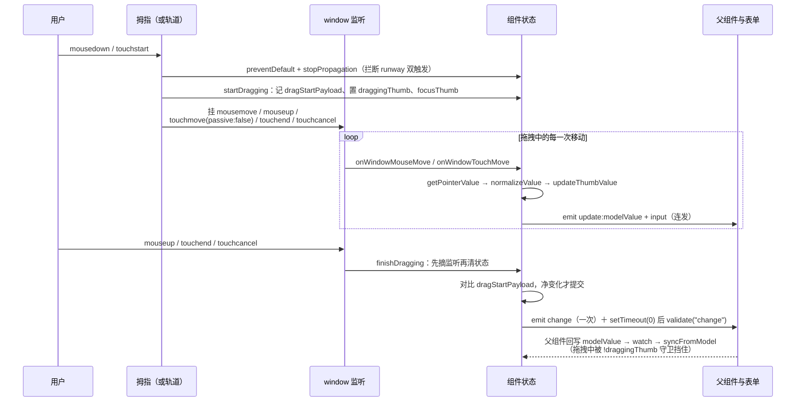
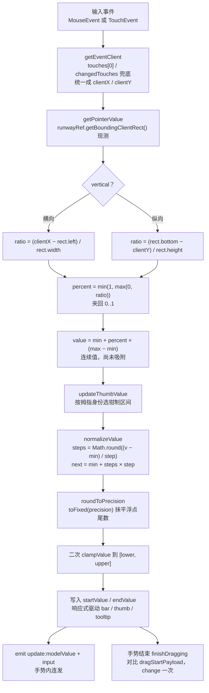

# 6-11 · Slider：拖拽几何与 step 吸附

> 滑块是表单家族里唯一一个"交互即几何"的组件：用户按住的那颗圆点，每移动一像素都要完成一次"屏幕坐标 → 轨道比例 → 连续值 → 离散步长"的四段换算，任何一段出错，看到的拖把和真实值就对不上。本篇围绕 `XySlider`（678 行）拆两条主线：**拖拽几何**——`getEventClient` 的双轨坐标统一、`getPointerValue` 的轨道现测与比例换算、vertical 模式的镜像分支；**step 吸附**——`normalizeValue` 锚定 min 的取整语义、`precision` 推导与 `roundToPrecision` 对 0.1 步进浮点尾数的清理，以及"尾部 max 不可达"这个如实的实码边界。中途正面回答一个事件选型问题：本篇标题里说"pointer 事件"，但实码给的是 mouse+touch 双轨——splitter（5-19）没换 pointer，carousel（5-12）换了，slider 站哪边，实码有定论。range 双滑块的防穿越钳制与交换保险、input 连发而 change 一次的事件节奏、以及 6-10 里 rate 借走的 `role="slider"` 这次连本带利地还回来的键盘模型，都在后半篇逐段拆解。所有代码摘自当前工作区实态，行号逐一核对过；下一篇 6-12 进 DatePicker 的日历面板状态机。

## 引子：交互即几何，取值即离散

先给体量一个直观感受：

```text
$ wc -l packages/components/slider/src/* packages/components/slider/__tests__/*.spec.ts \
        packages/theme/src/components/slider.css tests/types/fixtures/slider.ts
     678 slider.vue
      36 slider.ts
     240 slider.spec.ts
     216 slider.css
      27 slider.ts（类型夹具）
```

678 行的 `slider.vue` 配 240 行测试，单看比例不算惊人，但测试的"密度"高得反常：几乎每个用例都在 mock `getBoundingClientRect`（`slider.spec.ts:6-20` 的 `mockRunwayRect`）——因为 jsdom 没有排版引擎，任何矩形读数都是 0，而 slider 的整条换算管线恰好建立在矩形之上。这个测试形态本身就是本篇第一条论据：**slider 的全部风险集中在几何换算上**，矩形一 mock、`clientX` 一给，值就应当精确落位，落错一位就是 bug。

按 4-03 立下的"类型层—视图层—逻辑层"解剖框架看，slider 的类型层很薄但分量极重（`packages/components/slider/src/slider.ts:1-36` 全文）：

```ts
// packages/components/slider/src/slider.ts:1-36（全文）
import type Slider from "./slider.vue";
import type { ComponentSize } from "xiaoye-primitives";

export type SliderValue = number | [number, number];
export type SliderPlacement = "top" | "bottom" | "left" | "right";
export type SliderValueChangeHandler = (value: SliderValue) => void;
export type SliderFocusHandler = (event: FocusEvent) => void;

export interface SliderProps {
  modelValue?: SliderValue;
  id?: string;
  min?: number;
  max?: number;
  step?: number;
  showInput?: boolean;
  showInputControls?: boolean;
  size?: ComponentSize;
  inputSize?: ComponentSize;
  showStops?: boolean;
  showTooltip?: boolean;
  formatTooltip?: (value: number) => number | string;
  disabled?: boolean;
  range?: boolean;
  vertical?: boolean;
  height?: string;
  rangeStartLabel?: string;
  rangeEndLabel?: string;
  formatValueText?: (value: number) => string;
  tooltipClass?: string;
  placement?: SliderPlacement;
  validateEvent?: boolean;
  persistent?: boolean;
  ariaLabel?: string;
}

export type SliderInstance = InstanceType<typeof Slider>;
```

第一行类型就是受控语义的全部声明：`SliderValue = number | [number, number]`（`slider.ts:4`）。单值模式 `modelValue` 是一个数，`range` 模式是一个二元数组——**数组不是语法糖，是受控契约**：父组件拿到的是"区间"这个原子概念，组件内部则把它拆成 `startValue` / `endValue` 两个 ref 分别驱动两颗拇指（`slider.vue:59-60` 初始化为 `props.min` / `props.max`）。Props 面里有三组值得注意的分工：`min/max/step` 是值域参数（喂给吸附管线）；`showInput/showStops/showTooltip` 是三个可选显示件（输入框、刻度点、气泡）；`rangeStartLabel/rangeEndLabel/formatValueText` 是纯 a11y 文案（后文第七节会看到它们全部落在 aria 属性上）。事件五个：`update:modelValue` / `input` / `change` / `focus` / `blur`——其中前三个的分工节奏是本篇第六节的主角。

还有一个容易漏看的入口声明：`slider.vue:2-4` 的 `defineOptions({ inheritAttrs: false })`。因为根节点上要挂 `role="group"`（range 模式）、`id`（表单关联）和一大堆自有类名，透传属性不能整包撒上去，于是 `slider.vue:85-90` 的 `nativeAttrs` 把 `class` / `style` 从 attrs 里剔除后单独 `v-bind`，`class` 与 `style` 则被 `rootKls`（`slider.vue:74-83`）和根节点 `:style="attrs.style"`（`slider.vue:555`）手动接管——与 5-05 Text、6-02 Input 是同一套"attrs 拆包"纪律。

下面进入正题。本篇先按数据流方向走：事件进来（第一节事件选型）→ 几何换算（第二节）→ 吸附离散化（第三节）→ 值写回与 range 约束（第四、五节）→ 键盘与 a11y（第六节）→ 样式收口（第七节）。

## 一、事件选型：mouse+touch 双轨，而不是 pointer events

先做一次诚实的纠偏。本篇立项时把核心问题写作"pointer 事件与 step 吸附的计算"，但精读实码后必须先把话说正：**`slider.vue` 全文没有 `pointerdown`，没有 `setPointerCapture`，事件选型是 mousedown/touchstart 起步、window 上挂 mousemove/mouseup/touchmove/touchend 的 mouse+touch 双轨**——与 5-19 splitter 是同一套选型。这不是叙述偷懒，而是一次真实的技术路线现场：同一座组件库里，carousel（5-12）用了 pointer events（`carousel.vue:1188` 的 `@pointerdown` 配 `dragPointerId` 追踪与 `pointercancel` 处理，`carousel.vue:967-1000`），splitter 和 slider 用双轨。同一个仓库两种拖拽事件体系并存，正好把"选型"从纸面辩论变成实码对照。

先看实码全貌。拖拽监听的挂与拆收在同一对函数里（`packages/components/slider/src/slider.vue:424-453`）：

```ts
// packages/components/slider/src/slider.vue:424-453
function removeDragListeners() {
  window.removeEventListener("mousemove", onWindowMouseMove);
  window.removeEventListener("mouseup", onWindowMouseUp);
  window.removeEventListener("touchmove", onWindowTouchMove);
  window.removeEventListener("touchend", onWindowTouchEnd);
  window.removeEventListener("touchcancel", onWindowTouchEnd);
}

function finishDragging() {
  if (!draggingThumb.value) {
    return;
  }

  const previous = clonePayload(dragStartPayload.value);
  draggingThumb.value = null;
  removeDragListeners();
  emitCommittedValue(previous);
}

function startDragging(thumb: ThumbName) {
  dragStartPayload.value = clonePayload(getCurrentPayload());
  draggingThumb.value = thumb;
  focusThumb(thumb);
  removeDragListeners();
  window.addEventListener("mousemove", onWindowMouseMove);
  window.addEventListener("mouseup", onWindowMouseUp);
  window.addEventListener("touchmove", onWindowTouchMove, { passive: false });
  window.addEventListener("touchend", onWindowTouchEnd);
  window.addEventListener("touchcancel", onWindowTouchEnd);
}
```

三个入口汇入 `startDragging`：拇指上的 `handleThumbPointerDown`（`slider.vue:455-463`，`event.preventDefault() + event.stopPropagation()` 后起步）、轨道上的 `handleRunwayPointerDown`（`slider.vue:465-477`，先跳值再起步）。函数体第一行 `removeDragListeners()` 是**重入守卫**：拖拽中再次 mousedown（多键鼠标、触摸与鼠标并发）会先把旧监听摘干净再挂新监听，配对纪律与 5-19 splitter 的 `cleanupListeners` 同款。`focusThumb(thumb)`（`slider.vue:350-352`）把焦点推进被拖的拇指——点击后键盘立刻可用，这是把"鼠标入口"焊接到"键盘入口"的一行。

EP 对照是这次选型的关键证词。EP dev 分支的 `use-slide.ts` 里，事件签名是 `onSliderDown(event: MouseEvent | TouchEvent)`，全文检索不到 pointer 事件名；拖拽监听在 slider-button 侧挂的是 `mousemove / touchmove / mouseup / touchend / contextmenu`（其中 `touchstart` 显式 `{ passive: false }`）。**EP 的 slider 也是 mouse+touch 双轨加 window 监听**——所以本库的选择又一次与 EP 同构，5-19 那句"两个几乎同期的实现独立收敛到同一答案"的判断，在 slider 上第三次成立。而且有一个本库比 EP 多出的细节：`touchcancel`。EP 只听 `touchend`，本库把 `touchcancel` 也接到了 `onWindowTouchEnd`（`slider.vue:429` 与 `:452` 两处）——电话打断、系统手势接管时浏览器会发 cancel 而不是 end，不接的话 `draggingThumb` 永远停在"拖拽中"，监听器悬空、`change` 永远不来。多听一个事件换状态机无悬挂，这是双轨方案里容易被漏掉的一块拼图。

**权衡一：slider 为什么不学 carousel 换 pointer events？** 三条实打实的理由。**理由一：交互形态不同，丢事件的代价不同。** carousel 是"滑动切换"——拖动只累积偏移，松手才消费阈值，pointer capture 的核心卖点（指针划出元素仍持续收事件）对它接近刚需；slider 是"拖住不放"——拖拽起点在拇指上、监听挂 window，鼠标按住时浏览器保证 window 收到连续 mousemove，丢事件风险天然低。**理由二：对齐 EP 先例与同库近亲。** slider 与 splitter、input-number 上下箭头这些"按下-移动-松开"形态的组件共享同一套双轨骨架，选型一致意味着维护心智一致；换成 pointer events 收益只是删掉 `getEventClient` 的十几行分支（`slider.vue:288-301`），代价是同一仓库出现第三套拖拽心智。**理由三：测试形态绑定。** 双轨方案下，测试派发 `MouseEvent("mousemove")` 到 window 就能驱动全链路（`slider.spec.ts:84-85`）；这套测试与实现互相锁定，换事件体系等于重写全部交互用例。当然要说清双轨的真实代价：`getEventClient` 里 `event.touches[0] ?? event.changedTouches[0]` 的兜底（touchend 时 `touches` 已空，坐标要改从 `changedTouches` 取——`slider.vue:290`）、touchmove 必须显式 `{ passive: false }` 才能 `preventDefault` 掉页面滚动（`slider.vue:450`），以及 mouse/touch 两套事件对象在 TypeScript 里要用 `MouseEvent | TouchEvent` 联合手工收窄。这些都是可以数出来的行数，本库选择把它们花掉，换取与 EP 和 splitter 的选型一致。结论与 5-19 一脉相承：**可以换，但没换的理由在本组件的交互形态下依然成立**。

一次完整手势的事件生命周期，画成时序图：



## 二、拖拽几何：clientX 到值的三步换算

事件选型定下来之后，坐标系统一与几何换算就是纯计算题了。先看坐标统一器（`packages/components/slider/src/slider.vue:288-318`）：

```ts
// packages/components/slider/src/slider.vue:288-318
function getEventClient(event: MouseEvent | TouchEvent) {
  if ("touches" in event) {
    const touch = event.touches[0] ?? event.changedTouches[0];
    return {
      x: touch?.clientX ?? 0,
      y: touch?.clientY ?? 0
    };
  }

  return {
    x: event.clientX,
    y: event.clientY
  };
}

function getPointerValue(event: MouseEvent | TouchEvent) {
  const runway = runwayRef.value;

  if (!runway) {
    return props.min;
  }

  const rect = runway.getBoundingClientRect();
  const point = getEventClient(event);
  const ratio = props.vertical
    ? (rect.bottom - point.y) / rect.height
    : (point.x - rect.left) / rect.width;
  const percent = Math.min(1, Math.max(0, ratio));

  return props.min + percent * (props.max - props.min);
}
```

`getPointerValue` 是整条管线的几何核心，四步可以背下来：**现测、取比、夹取、换算**。第一，`runway.getBoundingClientRect()` ——注意测的是 `runwayRef`（轨道），不是根节点：根节点还装着 tooltip 的预留 padding（`slider.css:26-29` 给横向带气泡的形态加了 `padding-top: 28px`）和右侧输入框，轨道之外的任何留白都会污染比例，测轨道才是测"值的坐标系"。第二，比例计算带一个 vertical 镜像：横向是 `(clientX − left) / width`，从左往右递增；纵向是 `(bottom − clientY) / height`，**从下往上递增**——滑块的视觉直觉是"向上 = 增大"，几何上必须用 `rect.bottom` 做原点而不是 `rect.top`，这一行反转就是 vertical 模式的全部秘密。第三，`Math.min(1, Math.max(0, ratio))` 把越界指针夹回 `[0, 1]`：拖拽中指针可以滑出轨道（window 监听的意义就在于此），钳制保证"出界不停留在出界值"。第四，`min + percent × (max − min)` 把比例映射回值域——到这一步得到的是**连续值**，尚未吸附，它还要过第三节的 `normalizeValue` 才能落账。

这条管线画成流程图：



**权衡二：几何现测还是缓存？** 5-13 拆 Affix 时把这个问题立过案：Affix 是彻底的"现测哲学"——不信初始 offsetTop、不信 scrollTop 推算，每次滚动都 `getBoundingClientRect` 读实时矩形，买到的免疫性是"布局怎么变都不出错"。slider 在这条光谱上站得比 EP 更靠现测一端：本库 `getPointerValue` **每一次移动都全量现测矩形**，没有任何缓存层。EP 则是"半缓存混合式"——`resetSize()` 在手势开始时把 `sliderSize`（轨道尺寸）缓存进 `initData`，点击定位时每个事件现测 `left` / `bottom` 偏移。差异的后果推演一遍：拖拽中途窗口被缩放、轨道被 flex 挤压、页面发生缩放，本库下一帧的 mousemove 立刻用新矩形换算，值连续不跳变；EP 缓存的是尺寸分母，窗口变化后要等下一次 `resetSize`（下个手势开始时）才修正，期间比例会偏。反过来，本库每帧一次强制同步布局读取的代价，被"mousemove 本来就是低频用户输入"这个事实摊薄——拖拽事件频率远低于 scroll，5-13 里 scroll 高频场景的节流焦虑（Anchor 的 rAF 合帧）在 slider 上不存在。测试也吃到了现测的红利：jsdom 里 mock 一次 `getBoundingClientRect`，整个换算链就能精确驱动，不需要模拟任何缓存失效时机。对 678 行的通用组件来说，现测依旧是更稳的默认值——本库在此处的选择甚至比 EP 更彻底。

测试侧的镜像基建值得单独一看（`packages/components/slider/__tests__/slider.spec.ts:6-20`）：

```ts
// packages/components/slider/__tests__/slider.spec.ts:6-20
function mockRunwayRect(wrapper: ReturnType<typeof mount>, rect: Partial<DOMRect>) {
  const runway = wrapper.get(".xy-slider__runway").element as HTMLElement;
  vi.spyOn(runway, "getBoundingClientRect").mockReturnValue({
    x: 0,
    y: 0,
    width: 200,
    height: 24,
    top: 0,
    left: 0,
    bottom: 24,
    right: 200,
    toJSON: () => ({}),
    ...rect
  } as DOMRect);
}
```

200px 宽的标准矩形是全部用例的"算术坐标系"：`clientX: 100` 必须换算出 50，`clientX: 130` 配 `step: 10` 必须吸附到 70——几何断言的全部可信度来自这个 mock 的确定性。垂直用例把矩形换成 `{ height: 200, bottom: 200, top: 0 }`，`clientY: 100` 换算出 50（`slider.spec.ts:165-173`），正好把 `(bottom − y) / height` 的纵向公式也钉死了。基础点击用例则验证"点哪儿值到哪儿"（`slider.spec.ts:23-43`）：

```ts
// packages/components/slider/__tests__/slider.spec.ts:23-43
it("支持基础渲染和点击轨道更新", async () => {
  const value = ref(0);
  const wrapper = mount({
    components: { XySlider },
    setup() {
      return { value };
    },
    template: `<xy-slider v-model="value" />`
  });

  mockRunwayRect(wrapper, { width: 200, left: 0 });

  await wrapper.get(".xy-slider__runway").trigger("mousedown", {
    clientX: 100
  });

  window.dispatchEvent(new MouseEvent("mouseup", { clientX: 100 }));
  await nextTick();

  expect(value.value).toBe(50);
});
```

注意这条用例的派发路径：mousedown 派在轨道上、mouseup 派在 **window** 上——测试的事件走向本身就是"监听挂在 window"这一实现的镜像，与 5-19 splitter 的测试形态完全同构。实现若换成 pointer capture，这批用例就得整体重写，这是"理由三"的实锤。

## 三、step 吸附：normalizeValue 的锚定语义与浮点卫生

连续值落账前，最后一道工序是吸附。先看吸附三件套的全文——precision 推导、取整器与归一化（`packages/components/slider/src/slider.vue:146-205`）：

```ts
// packages/components/slider/src/slider.vue:146-205
function isNumber(value: unknown): value is number {
  return typeof value === "number" && Number.isFinite(value) && !Number.isNaN(value);
}

function roundToPrecision(value: number) {
  return Number.parseFloat(value.toFixed(precision.value));
}

function clampValue(value: number, lower = props.min, upper = props.max) {
  return Math.min(upper, Math.max(lower, value));
}

function getPercent(value: number) {
  if (props.max === props.min) {
    return 0;
  }

  return ((value - props.min) / (props.max - props.min)) * 100;
}

function getTooltipContent(value: number) {
  const formatted = props.formatTooltip?.(value) ?? value;
  return String(formatted);
}

function getValueText(value: number) {
  return props.formatValueText?.(value) ?? String(value);
}

function getCurrentPayload(): SliderValue {
  return props.range ? [startValue.value, endValue.value] : startValue.value;
}

function clonePayload(value: SliderValue): SliderValue {
  return Array.isArray(value) ? [value[0], value[1]] : value;
}

function isSamePayload(a: SliderValue, b: SliderValue) {
  if (Array.isArray(a) && Array.isArray(b)) {
    return a[0] === b[0] && a[1] === b[1];
  }

  return !Array.isArray(a) && !Array.isArray(b) && a === b;
}

function normalizeValue(value: number, lower = props.min, upper = props.max) {
  if (props.max <= props.min) {
    return props.min;
  }

  const clamped = clampValue(value, lower, upper);

  if (props.step <= 0) {
    return roundToPrecision(clamped);
  }

  const steps = Math.round((clamped - props.min) / props.step);
  const next = props.min + steps * props.step;
  return clampValue(roundToPrecision(next), lower, upper);
}
```

吸附公式就一行：`steps = Math.round((clamped − min) / step)`，再 `min + steps × step`。三个语义点值得逐个钉死。

**第一，锚定在 min 而不是 0。** 直觉写法是 `Math.round(v / step) * step`，但那只在 `min === 0` 时正确。取 `min = 1000, step = 7`：点击到 1010，锚 0 的算法给出 `round(1010/7)*7 = 1015`（不是 7 的倍数对齐 min，而是对齐数轴原点，1015 − 1000 = 15，不是 step 的整数倍）；锚 min 的算法给出 `1000 + round(10/7)*7 = 1007`——刻度均匀分布在 `[min, max]` 上，与 `showStops` 渲染出的刻度点（同样从 `min + step` 起步，`slider.vue:129`）严格重合。**吸附锚点必须与刻度生成锚点是同一个**，否则刻度点全是"摆设"——视觉上的断点和实际落值永远错位。这也是本篇把 `stopList` 与 `normalizeValue` 放在同一个锚定语义下讲的原因。

**第二，浮点卫生是三道工序。** 考据清单里点过名的问题：`step: 0.1` 时，`0.1 + 0.2 = 0.30000000000000004` 这类 IEEE 754 尾数会顺着计算链漏进 UI。本库的防线分三层：`precision` computed（`slider.vue:92-98`）从 `[min, max, step]` 三个值的小数位数取最大，`step: 0.1` 推出精度 1；`roundToPrecision`（`slider.vue:150-152`）用 `Number.parseFloat(value.toFixed(precision))` 把任何中间结果折回精度位；`stopList` 的迭代游标每走一步都过一次 `roundToPrecision`（`slider.vue:140`）——因为 `cursor += step` 是**累加**，误差会逐步累积，逐次清理才能保证第 N 个刻度不漂移。对照 6-09 InputNumber 的 `toPrecision`：那边是"缺省精度锚定 step 的小数位"（2026-09 那场修复战役的主角），这边是"锚定 min/max/step 三者小数位的最大值"——同一个"用十进制精度反杀二进制尾数"的思路，锚点选择不同：input-number 的精度只需要描述**步进**，slider 的精度还要描述**值域端点**（`min: 0.05` 这种本身带小数的下界也会参与产出）。这套公式与 EP 的 `precision` computed 逐字同构（EP 同样对 `[min, max, step]` 求小数位取大），`toFixed` + `parseFloat` 的组合也一致——两代实现又一次收敛。

**第三，吸附发生在值域空间。** EP 的 `setPosition` 选了另一条路：先把百分比位置对步宽百分比取整（`steps = Math.round(newPosition / valueBetween)`），再折回值域 `value = min + steps × step`——**在百分比空间吸附，再换算回值**。两法在 `(max − min)` 整除 `step` 时完全等价，分叉出现在**尾部余段**：`max − min` 不是 step 整数倍时（`min: 0, max: 10, step: 3`），EP 在余段中点设了阈值，位置越过余段中点直接吸附到 `max`——尾部最大值永远可达；本库的 `Math.round((10 − 0)/3) = 3`，产出 9，再被 `clampValue` 放行——**max 只能通过 `Home`/`End` 之外的方式到达吗？不能，连 `End` 键都到不了**。`moveByKeyboard` 的 `End` 分支给的是 `upper = props.max`（`slider.vue:408`），但 `next = 10` 依然要过 `normalizeValue`：`Math.round(10/3) = 3`，落回 9。也就是说 `(max − min) % step ≠ 0` 时，拖拽、键盘、输入框三条通道**全都**到不了声明的最大值——这是如实的实码边界，与 6-10 记录 rate "Home/End 未实现"同一种记录法。取一个具体场景：音量条 `min: 0, max: 100, step: 30`，`End` 键和拖到最右都只能到 90，100 永远不可达。它是缺陷还是语义？从"刻度均匀、值必须是 step 的整数倍偏移"的自洽视角看是**一致的**（100 本来就不在刻度网上）；从"用户声明了 max 却到不了"的视角看是**反直觉的**。EP 用余段阈值选了后者。记录在案，改不改属于产品裁决，但读到这里的你应当知道这个边界长什么样、为什么。

吸附的测试用例把锚定语义钉得很具体（`packages/components/slider/__tests__/slider.spec.ts:110-137`）：

```ts
// packages/components/slider/__tests__/slider.spec.ts:110-137
it("支持步长断点和步长吸附", async () => {
  const value = ref(20);
  const wrapper = mount({
    components: { XySlider },
    setup() {
      return { value };
    },
    template: `
      <xy-slider
        v-model="value"
        show-stops
        :step="10"
      />
    `
  });

  mockRunwayRect(wrapper, { width: 200, left: 0 });

  expect(wrapper.findAll(".xy-slider__stop").length).toBeGreaterThan(0);

  await wrapper.get(".xy-slider__runway").trigger("mousedown", {
    clientX: 130
  });
  window.dispatchEvent(new MouseEvent("mouseup", { clientX: 130 }));
  await nextTick();

  expect(value.value).toBe(70);
});
```

`clientX: 130` → 比例 0.65 → 连续值 65 → `Math.round(65/10) = 7` → 70。四舍五入而不是截断（`Math.floor` 会给 60），用户点到 65 就该得 70——"就近吸附"是滑块的行业直觉。同一条用例顺带断言了刻度点渲染数量大于 0，把 `showStops` 与吸附绑在同一个场景里验证——正是锚定语义的自洽性测试。

**权衡三：吸附空间的选型。** 值域空间吸附（本库）的推导链短、语义直白，`normalizeValue` 同时服务拖拽、键盘、输入框三个入口——一处公式三处受益；代价是尾部余段的 max 不可达。百分比空间吸附（EP）能把余段阈值自然地表达出来，代价是推导链上多一层"步宽百分比"的中间量，且吸附逻辑与 `setPosition` 的百分比入参绑定，键盘路径要单独维护一套"键位 → 值"的计算，无法与拖拽共用同一入口。本库三入口共用一个 `normalizeValue` 的架构收益在维护侧看得最清：要改吸附行为（比如补上余段阈值），只动一个函数。

## 四、range 双滑块：防穿越的钳制与交换保险

range 模式把"一个值"的问题升级成"两个值的秩序"问题。秩序的第一层是**谁响应这次交互**——`getNearestThumb`（`packages/components/slider/src/slider.vue:320-329`）：

```ts
// packages/components/slider/src/slider.vue:320-329
function getNearestThumb(value: number): ThumbName {
  if (!props.range) {
    return "start";
  }

  const startDistance = Math.abs(value - startValue.value);
  const endDistance = Math.abs(value - endValue.value);

  return startDistance <= endDistance ? "start" : "end";
}
```

点击轨道，最近的拇指响应——`<=` 让平局归 start，与 EP 的"距离更近者优先"（EP 在 use-slide 里用 `Math.abs(minValue − targetValue) < Math.abs(maxValue − targetValue)` 挑按钮）语义一致。第二层秩序是**两个拇指不能穿过去**——`updateThumbValue` 的按拇指钳制（`packages/components/slider/src/slider.vue:265-286`）：

```ts
// packages/components/slider/src/slider.vue:265-286
function updateThumbValue(thumb: ThumbName, value: number, emitUpdate = true) {
  if (props.disabled) {
    return false;
  }

  const previous = clonePayload(getCurrentPayload());

  if (thumb === "start") {
    startValue.value = normalizeValue(value, props.min, props.range ? endValue.value : props.max);
  } else {
    endValue.value = normalizeValue(value, startValue.value, props.max);
  }

  const next = getCurrentPayload();
  const changed = !isSamePayload(previous, next);

  if (changed && emitUpdate) {
    emitUpdatedValue();
  }

  return changed;
}
```

关键在 `normalizeValue` 的第二、三参：start 拇指的钳制上界是**另一颗拇指的当前值**（`props.range ? endValue.value : props.max`），end 拇指的下界是 start 拇指的当前值。也就是说 start 拖到 60 而对面在 50 时，start 的值会被钳到 50——**两颗拇指可以贴合，但不能交叉**。这层钳制发生在吸附管线内部，是"结构性"的：不存在穿越态，后续一切派生（填充条、aria、事件载荷）都无需处理乱序。

但这还不是全部保险。模型侧还有一道交换逻辑（`packages/components/slider/src/slider.vue:207-230`）：

```ts
// packages/components/slider/src/slider.vue:207-230
function normalizeRangeValue(value: SliderValue) {
  const values = Array.isArray(value) ? value : [props.min, props.min];
  let nextStart = normalizeValue(isNumber(values[0]) ? values[0] : props.min);
  let nextEnd = normalizeValue(isNumber(values[1]) ? values[1] : nextStart);

  if (nextStart > nextEnd) {
    [nextStart, nextEnd] = [nextEnd, nextStart];
  }

  return [nextStart, nextEnd] as [number, number];
}

function syncFromModel() {
  if (props.range) {
    const [nextStart, nextEnd] = normalizeRangeValue(props.modelValue);
    startValue.value = nextStart;
    endValue.value = nextEnd;
    return;
  }

  const nextValue = Array.isArray(props.modelValue) ? props.modelValue[0] : props.modelValue;
  startValue.value = normalizeValue(isNumber(nextValue) ? nextValue : props.min);
  endValue.value = props.max;
}
```

`normalizeRangeValue` 是外部 `modelValue` 进入组件的第一站：数组则逐项吸附归一，**乱序则交换**（`[nextStart, nextEnd] = [nextEnd, nextStart]`）；传错类型（非数组、非数值）则兜底到 `[min, min]` / 从 nextStart 顺延。`syncFromModel` 是它的唯一调用者之一（watch 驱动），单值模式同时把 `endValue` 归位到 `props.max`——单值模式没有渲染 end 拇指（模板 `v-if="props.range"`），但 `endValue` 仍参与 `barStyle` / `stopList` 的 min/max 运算，归位到 max 后那些通用公式无需分支。

为什么内部钳制了还要模型侧交换？因为钳制只覆盖"组件发起的更新"，管不住"父组件塞进来的数据"：`v-model` 绑定 `[80, 20]` 这种手滑乱序、异步接口回填的乱序区间，都从 `syncFromModel` 进来。**内部钳制管交互，模型交换管数据**，两道闸各守一个入口，交换逻辑本身永远不会在正常交互流里触发——它是给脏数据的清道夫，不是交互的一部分。最后一层防御在视觉派生上（`packages/components/slider/src/slider.vue:100-115`）：

```ts
// packages/components/slider/src/slider.vue:100-115
const barStyle = computed(() => {
  const minPosition = Math.min(getPercent(startValue.value), getPercent(endValue.value));
  const maxPosition = Math.max(getPercent(startValue.value), getPercent(endValue.value));

  if (props.vertical) {
    return {
      bottom: `${minPosition}%`,
      height: `${props.range ? maxPosition - minPosition : maxPosition}%`
    };
  }

  return {
    left: props.range ? `${minPosition}%` : "0%",
    width: `${props.range ? maxPosition - minPosition : maxPosition}%`
  };
});
```

填充条按 `min/max` 排序后取区间——哪怕前面两道闸都失效（比如单值模式意外收到数组、或未来新增的某个入口绕过钳制），填充条依然画在正确的区间上。range 测试把两颗拇指的秩序钉死（`packages/components/slider/__tests__/slider.spec.ts:45-66`）：

```ts
// packages/components/slider/__tests__/slider.spec.ts:45-66
it("支持范围选择并渲染双按钮", async () => {
  const value = ref<[number, number]>([20, 80]);
  const wrapper = mount({
    components: { XySlider },
    setup() {
      return { value };
    },
    template: `<xy-slider v-model="value" range />`
  });

  mockRunwayRect(wrapper, { width: 200, left: 0 });

  expect(wrapper.findAll(".xy-slider__thumb-wrapper")).toHaveLength(2);

  await wrapper.get(".xy-slider__runway").trigger("mousedown", {
    clientX: 60
  });
  window.dispatchEvent(new MouseEvent("mouseup", { clientX: 60 }));
  await nextTick();

  expect(value.value).toEqual([30, 80]);
});
```

点击 `clientX: 60`（连续值 30），`getNearestThumb` 判给 start（距离 10 对 50），start 的钳制上界是 end 的 80，30 落账——数组首项动、尾项不动，受控契约精确成立。

**权衡四：防穿越钳制还是允许穿越加排序收口？** EP 选的是后者：`setPosition` 只钳制全局 0-100%，没有任何"不许越过对面拇指"的逻辑，两颗拇指可以交叉换位，最终靠 `minValue` / `maxValue` 两个 computed（`Math.min(firstValue, secondValue)` / `Math.max(...)`）在**发射时**把数组排好序。两种语义各有拥趸：EP 的"允许穿越"拖拽更顺滑——想把区间整体左移时，用户可以把左拇指一路拖过右拇指，松手后角色互换，不用松手重来；代价是"左拇指"这个视觉实体的语义在穿越后会漂移（视觉上左边那颗变成了 max），aria 的 `aria-valuemin`/`aria-valuemax` 动态绑定也得跟着值走。本库的"防穿越"语义可预测性更强：start 永远 ≤ end，aria 属性（`slider.vue:583` start 拇指的 `aria-valuemax` 动态绑 `endValue`、`:627` end 拇指的 `aria-valuemin` 动态绑 `startValue`）的语义恒定；代价是"区间整体平移"要多一步操作（先拖右拇指、再拖左拇指）。本库选择了可预测性——与表单组件"值语义优先于手感"的整体倾向一致，且 `normalizeRangeValue` 的交换保险保证了即便未来放开钳制，模型侧也不会漏出乱序数组。range 语义还剩一件小事没有做：EP 的 `min-range`/`max-range`（两拇指最小/最大间距约束）本库没有对应 prop——"间距约束"这类业务规则目前要靠消费侧自己校验，这是 API 面的已知留白，与"无 marks"一起在第七节收口时记录。

## 五、事件节奏：input 连发、change 一次、校验延后

拖拽换算每帧都在改值，事件如果照单全发，父组件和表单校验会被淹死。本库把五个事件拆成三种节奏（`packages/components/slider/src/slider.vue:238-263`）：

```ts
// packages/components/slider/src/slider.vue:238-263
function emitUpdatedValue() {
  const payload = clonePayload(getCurrentPayload());
  clearStaleValidation();
  emit("update:modelValue", payload);
  emit("input", payload);
}

function emitCommittedValue(previous: SliderValue) {
  const payload = clonePayload(getCurrentPayload());
  const changed = !isSamePayload(payload, previous);

  if (changed) {
    emit("change", payload);
  }

  if (props.validateEvent && changed) {
    if (validateTimer !== null) {
      window.clearTimeout(validateTimer);
    }

    validateTimer = window.setTimeout(() => {
      validateTimer = null;
      void formItem?.validate("change");
    }, 0);
  }
}
```

`update:modelValue` 与 `input` 在**每一次**值变化的同一同步链里成对发出（`emitUpdatedValue`，由 `updateThumbValue` 在拖拽中逐帧调用）——v-model 的回写与实时联动（比如滑块拖动时旁边的数值标签）依赖这条高频通道。`change` 则由 `emitCommittedValue` 守门：入参 `previous` 是**比较基准**，净变化非零才发。基准从哪来？回看第一节的 `startDragging`：`dragStartPayload.value = clonePayload(getCurrentPayload())` 在手势开始时拍下快照，`finishDragging` 拿它当 `previous` ——**一次手势最多一次 change**。键盘路径的基准是按键前的当前载荷（`moveByKeyboard` 里 `const previous = clonePayload(getCurrentPayload())`，`slider.vue:380`），每按一次键一次 change——键盘没有"手势"概念，每次步进就是一次提交，这与 6-10 rate 的"键盘是直连提交轨"完全同款。输入框路径的基准是 `props.modelValue` 的当前快照（`slider.vue:483-485` 的 `handleInputChange`）：input-number 的 `update:modelValue` → `change` 在同一同步链里先后发出（6-09 拆过它的三连发），父组件的回写要等下一次渲染冲刷，所以 change 到达时 props 还停在旧值、判等成立——这条中继**依赖 Vue 的 props 刷新时序**，属于"恰好稳"的实现，若未来 input-number 把 change 挪进异步 tick，这条链就会静默断掉，值得留个心眼。

`change` 之后的表单校验不是同步触发的：`setTimeout(0)` 把 `formItem.validate("change")` 推到宏任务队尾（`slider.vue:258-261`）。延迟的理由是让位给渲染——校验器读的是父组件的 model，而父组件此刻可能还没消费完 `update:modelValue` 的回写；先让本次更新的渲染冲刷跑完，校验拿到的才是新值。`validateTimer` 的防抖桶（先清后设）与 `onBeforeUnmount` 里的清理（`slider.vue:536-539`）把这条定时器的生命周期管到闭合——4-08 校验链在 slider 上的接入点就这一处，但时序细节一点不少。

还有一个反向的守卫：外部回写在拖拽中是**进不来**的（`packages/components/slider/src/slider.vue:522-533`）：

```ts
// packages/components/slider/src/slider.vue:522-533
watch(
  () => [props.modelValue, props.min, props.max, props.range, props.step],
  () => {
    if (!draggingThumb.value) {
      syncFromModel();
    }
  },
  {
    deep: true,
    immediate: true
  }
);
```

watch 的依赖数组把值域四参数一并纳入——`min/max/step` 运行时变化、`range` 开关切换都会触发重同步，`deep: true` 照顾数组载荷、`immediate: true` 让挂载即初始化。真正的关键在 `!draggingThumb.value` 守卫：拖拽进行中，父组件因 `update:modelValue` 回写（或任何异步 echo）触发的新 props **不会**回灌本地状态——拖把不会因为父组件的处理延迟而倒退或抖动。6-10 立过受控纪律："本地交互值永远服从外部真相，回弹是常态"；slider 把这条纪律做成了**分时的**：非拖拽期服从外部真相（外部写什么显示什么），拖拽期本地值暂时接管（外部回写被挡在门外），松手后守卫解除、外部真相恢复最高优先级。这与 EP 的做法形成对照——EP 拖拽中同样不回灌（`firstValue`/`secondValue` 只由拖拽管线写），但它是"本地值是唯一真源、props 只是初值"的松受控；本库是"props 平时最高优先、拖拽期临时让位"的紧受控，纪律性更强，也更需要那个守卫。

顺带记录一处 `dragStartPayload` 的时序微妙点。轨道点击路径（`handleRunwayPointerDown`）的执行顺序是**先跳值、后起步**：`updateThumbValue(thumb, nextValue, true)` 先把值从旧位置跳到点击处并发出 `update:modelValue`/`input`，然后 `startDragging` 才拍 `dragStartPayload`——快照拍下的已是**跳值之后**的载荷。于是纯点击轨道（点击后不拖动）的净变化为零，`finishDragging` 的判等成立，**change 不发**。也就是说：点击轨道跳值，input 有、change 无；只有拖出净位移才有 change。EP 的轨道点击路径（`onSliderClick`）是显式 `emitChange()` 的——那边点击轨道会发 change，这边不会。这是实码的如实行为，消费者若把表单校验挂在 change 上（`trigger: "change"`），纯点击轨道不会触发校验，拖拽与输入框才会；是否算问题留给产品裁决，专栏负责把它钉在案上。与之相对，拇指起步路径（`handleThumbPointerDown`）**只起步、不跳值**——按住拇指拖动时值从当前位置连续出发，这也是 `stopPropagation` 的第二重意义：拇指的 mousedown 若冒泡到轨道，`handleRunwayPointerDown` 会把值跳到拇指中心附近（可能差半个拇指宽）再起步，值会平白抖一下。事件对象上的 `preventDefault` 则拦掉了原生文本选中与触摸滚动，让 678 行的拖拽在手势层面是干净的。

## 六、键盘与 a11y：rate 借走的角色，这次连本带利还上

6-10 的结论是 rate 选了 `role="slider"` 来扮演滑块；本篇主角回来了，它的键盘模型是完整版（`packages/components/slider/src/slider.vue:375-422`）：

```ts
// packages/components/slider/src/slider.vue:375-422
function moveByKeyboard(thumb: ThumbName, event: KeyboardEvent) {
  if (props.disabled) {
    return;
  }

  const previous = clonePayload(getCurrentPayload());
  const lower = thumb === "end" ? startValue.value : props.min;
  const upper = thumb === "start" && props.range ? endValue.value : props.max;
  const current = thumb === "start" ? startValue.value : endValue.value;

  let next = current;

  const step = props.step;

  switch (event.key) {
    case "ArrowLeft":
    case "ArrowDown":
      next = current - step;
      break;
    case "ArrowRight":
    case "ArrowUp":
      next = current + step;
      break;
    case "PageDown":
      next = current - step * 4;
      break;
    case "PageUp":
      next = current + step * 4;
      break;
    case "Home":
      next = lower;
      break;
    case "End":
      next = upper;
      break;
    default:
      return;
  }

  event.preventDefault();
  event.stopPropagation();

  const changed = updateThumbValue(thumb, next, true);

  if (changed) {
    emitCommittedValue(previous);
  }
}
```

六组键位全部落地：四向箭头 ±1 步、PageUp/PageDown ±4 步（`props.step * 4` 的硬编码倍数，文档 `apps/docs/components/slider.md:38` 明写"按 4 个步长跳变"）、Home/End 跳到下界/上界。注意 6-10 的已知边界在这里补齐了：rate 没实现 Home/End（"max 很大时纯键盘用户步进偏长"），slider 实现了——同一个 `role="slider"`，完整版与裁剪版各安其位，rate 的裁剪在评分场景可接受（max 通常 5-10），slider 的完整在任意值域下是必需。keyboard 的钳制区间同样按拇指身份取（`lower`/`upper` 两行），end 拇指的下界是 start 拇指、start 拇指（range 模式）的上界是 end 拇指——**键盘与鼠标共用同一套防穿越约束**，没有第二套边界逻辑。`updateThumbValue` 内部过 `normalizeValue`，键盘步进同样被吸附管线接管（所以第三节的"尾部 max 不可达"对 `End` 键同样生效）。`preventDefault + stopPropagation` 只在命中键位后调用——未识别的按键走 `default: return`，方向键之外的键盘行为（比如父容器的快捷键）不被误伤，这个细节与 6-10 rate 的"到头即止时 preventDefault 都不调用、页面滚动原样放行"是同一层克制。

a11y 装配的完整形态在模板上（`packages/components/slider/src/slider.vue:569-612`，以 start 拇指为例）：

```html
<!-- packages/components/slider/src/slider.vue:569-612 -->
<div
  v-if="props.range"
  ref="endThumbRef"
  class="xy-slider__thumb-wrapper"
  :class="[
    ns.is('dragging', draggingThumb === 'end'),
    ns.is('focused', focusedThumb === 'end'),
    ns.is('hover', hoveredThumb === 'end')
  ]"
  :style="getThumbStyle('end')"
  role="slider"
  :tabindex="props.disabled ? undefined : 0"
  :aria-label="props.rangeEndLabel"
  :aria-valuemin="startValue"
  :aria-valuemax="props.max"
  :aria-valuenow="endValue"
  :aria-valuetext="getValueText(endValue)"
  :aria-orientation="props.vertical ? 'vertical' : 'horizontal'"
  :aria-disabled="props.disabled"
  :aria-invalid="validateState === 'error' ? 'true' : undefined"
  :aria-describedby="messageId"
  @mouseenter="handleThumbHover('end', true)"
  @mouseleave="handleThumbHover('end', false)"
  @focus="handleThumbFocus('end', $event)"
  @blur="handleThumbBlur('end', $event)"
  @mousedown="handleThumbPointerDown('end', $event)"
  @touchstart="handleThumbPointerDown('end', $event)"
  @keydown="moveByKeyboard('end', $event)"
>
  <transition name="xy-fade">
    <div
      v-if="props.showTooltip && (props.persistent || isTooltipVisible('end'))"
      v-show="isTooltipVisible('end')"
      class="xy-slider__tooltip"
      :class="[
        `xy-slider__tooltip--${props.placement}`,
        props.tooltipClass
      ]"
    >
      {{ getTooltipContent(endValue) }}
    </div>
  </transition>
  <div class="xy-slider__thumb" />
</div>
```

与 6-10 rate 的对照可以列成三行账。**其一，role 挂载点不同。** rate 把 `role="slider"` 挂在根容器（星星按钮 `tabindex="-1"` + `aria-hidden` 退出读屏树，语义上收）；slider 把 `role="slider"` 挂在每颗拇指的 wrapper 上（range 模式根节点是 `role="group"`，`slider.vue:556`）——评分只有一个隐含的"拇指"（当前值），滑块有真实的两颗，语义必须下放到拇指级，读屏用户才能分别听到"起始值 20 / 结束值 80"。**其二，aria 边界是动态的。** start 拇指的 `aria-valuemax` 绑的是 `endValue` 而非 `props.max`（`slider.vue:583`），end 拇指的 `aria-valuemin` 绑的是 `startValue`（`:627`）——第四节的防穿越约束同步进读屏：读屏用户按方向键时，播报的合法边界就是拇指真正会被钳住的位置。**其三，表单语义链完整同款。** `aria-invalid`（校验错误态）与 `aria-describedby`（错误消息 id 关联）把 4-08 的校验链接进读屏，`aria-orientation` 随 vertical 翻转，`aria-disabled` 随禁用翻转——rate 那套装配逐项对应，两代实现共享同一份 a11y 清单。

tooltip 的实现也值得停一步：它不是浮层体系（4-05/4-06）的 `xy-tooltip` 组件，而是一段**自绘的 CSS 定位气泡**——`transition name="xy-fade"`（转场定义在 `tooltip.css:107-117`）包着 `v-if + v-show` 双开关：`persistent` 为真时气泡常驻 DOM（只靠 `v-show` 切换可见性），为假时失焦即卸载。`isTooltipVisible`（`slider.vue:331-337`）的可见条件是拖拽、悬停、聚焦三态任一——纯 CSS 类切换没有定位计算，拖拽时气泡跟随的是同一个 `left/bottom` 百分比，与拇指共用同一套几何派生。EP 用 el-tooltip 浮层组件（带 popper 定位、层级治理），本库用"拇指内嵌兄弟节点 + 四方向 modifier 类"（`slider.css:169-191`）——零浮层成本换一个受限于拇指定位的气泡，这是滑块场景下的合理裁剪：气泡永远只相对拇指定位，不需要 flip 与防溢出。

刻度点（`stopList`）是第三个与 EP 收敛的点（`packages/components/slider/src/slider.vue:121-144`）：

```ts
// packages/components/slider/src/slider.vue:121-144
const stopList = computed(() => {
  if (!props.showStops || props.step <= 0) {
    return [];
  }

  const result: number[] = [];
  const minSelected = Math.min(startValue.value, endValue.value);
  const maxSelected = Math.max(startValue.value, endValue.value);
  let cursor = roundToPrecision(props.min + props.step);

  while (cursor < props.max) {
    const hidden = props.range
      ? cursor > minSelected && cursor < maxSelected
      : cursor <= startValue.value;

    if (!hidden) {
      result.push(getPercent(cursor));
    }

    cursor = roundToPrecision(cursor + props.step);
  }

  return result;
});
```

语义与 EP 的 `use-stops.ts` 逐条对得上：单值模式隐藏"当前值及以下"的刻度（被填充条盖住的点不渲染），range 模式隐藏"严格落在两值之间"的刻度——**两库都选择把被选中区间覆盖的刻度点从 DOM 里剔除**，而不是渲染后变色。差异在生成空间：EP 用百分比直接迭代（`(index + 1) × stepWidth`，乘法无累积误差），本库在值空间累加游标（`cursor += step`）——累加有 IEEE 754 误差累积，所以每一次迭代都要过 `roundToPrecision`（`:140`），这正是第二节浮点卫生的第三个消费点。`step <= 0` 的守卫（`:122`）防死循环，`cursor < props.max` 的严格小于让 max 恰好在刻度网上时也不重复渲染端点。还需要如实记录一处 API 留白：**本库没有 EP 的 `marks` prop**——EP 允许在任意值位挂带文案的标记点（`step: 'mark'` 时吸附目标换成最近标记），本库只有等距的 `showStops`，非等距标记场景当前要消费侧自己画。`step: 'mark'` 这类"吸附目标可替换"的设计（EP 的 `setPosition` 里为它单开了一个 reduce 最近标记分支）是本库吸附管线未覆盖的能力面，属于已知边界。

## 七、样式与文档收口

样式层的核心段把几何派生可视化（`packages/theme/src/components/slider.css:53-105`）：

```css
/* packages/theme/src/components/slider.css:53-105 */
.xy-slider__runway {
  position: relative;
  flex: 1;
  min-width: 160px;
  height: var(--xy-slider-track-size);
  border-radius: var(--xy-radius-pill);
  background: var(--xy-slider-runway-color);
  box-shadow: inset 0 0 0 1px color-mix(in srgb, var(--xy-border-subtle) 72%, transparent);
  cursor: pointer;
}

.xy-slider__runway.is-disabled {
  cursor: not-allowed;
  opacity: 0.7;
}

.xy-slider.is-vertical .xy-slider__runway {
  width: var(--xy-slider-track-size);
  height: 100%;
  min-width: 0;
  min-height: 180px;
}

.xy-slider__bar {
  position: absolute;
  top: 0;
  left: 0;
  height: 100%;
  border-radius: inherit;
  background: color-mix(in srgb, var(--xy-slider-fill-color) 82%, var(--xy-bg-raised));
}

.xy-slider.is-vertical .xy-slider__bar {
  top: auto;
  bottom: 0;
  width: 100%;
  height: auto;
  background: color-mix(in srgb, var(--xy-slider-fill-color) 82%, var(--xy-bg-raised));
}

.xy-slider__thumb-wrapper {
  position: absolute;
  top: 50%;
  z-index: 1;
  display: inline-flex;
  align-items: center;
  justify-content: center;
  width: var(--xy-slider-size);
  height: var(--xy-slider-size);
  transform: translate(-50%, -50%);
  cursor: grab;
  outline: none;
}
```

三段样式各回答一个几何问题。`__runway` 是坐标系本体：`position: relative` 让内部绝对定位元素（bar、thumb、stop）以轨道为参照——**CSS 的定位参照与 JS 的测量参照是同一个元素**，这是 `getPointerValue` 测 `runwayRef` 而不是根节点的样式侧镜像。`__bar` 的绝对定位从 `left: 0` 起步、由 `barStyle` 的行内样式接管 `left/width`（vertical 时 CSS 的 `top: auto; bottom: 0` 与行内 `bottom/height` 配合）——行内样式永远赢，CSS 只给非 range 单值模式兜底。`__thumb-wrapper` 是热区与视觉的分离设计：wrapper 撑到 32px（`--xy-slider-size`）作为点击热区，内部 `__thumb` 视觉圆点只有 18px（`--xy-slider-thumb-size`，`slider.css:121-134`），`translate(-50%, -50%)` 让 wrapper 的中心——而不是左上角——落在 `left: N%` 的定位点上，与 `getPercent` 产出的"值点"严格对齐；`cursor: grab` / `.is-dragging` 时 `grabbing`（`:113-115`）的手势暗示、`.is-focused` 的 3px 品牌色光环（`:117-119`）都在 wrapper 层完成。尺寸三档（sm/lg 覆盖两个 CSS 变量，`:31-39`）与 3-05 的刻度层消费纪律一致：组件只吃语义变量与刻度变量，`--xy-slider-*` 私有变量的默认值再指向 `--xy-brand`、`--xy-border-subtle` 等语义层。还有一个排版小细节：横向带气泡的形态给根加了 `padding-top: 28px`（`:26-29`）——气泡定位在拇指上方 10px（`--tooltip--top` 的 `bottom: calc(100% + 10px)`），这个 padding 是给气泡预留的呼吸空间，同时解释了为什么几何测量必须锚定 runway 而不是根节点。

文档与夹具侧是标准收口。四个示例恰好覆盖四个能力面（`apps/docs/examples/slider/`）：basic 的 `v-model` 数值绑定（`basic.vue:22`）、range 的 `ref<[number, number]>([18, 72])` 数组受控（`range.vue:4`）加"区间：18 - 72"的实时回显、input-stops 的 `show-input show-stops :step="10"` 三件套联动（`input-stops.vue:9`）、form 的校验规则 `min: 60, trigger: "change"`（`form.vue:9`）——与第五节的 change 节奏对应：示例把"change 触发校验"写成了消费者可直接照抄的约定，这也反过来要求拖拽与输入框两条通道的 change 必须可靠。类型夹具把两态 props 钉进编译期（`tests/types/fixtures/slider.ts:1-27` 全文）：

```ts
// tests/types/fixtures/slider.ts:1-27（全文）
import type { SliderProps } from "xiaoye-components";

const singleProps: SliderProps = {
  modelValue: 40,
  showInput: true,
  showStops: true,
  formatTooltip: (value) => `${value}%`
};

void singleProps;

const rangeProps: SliderProps = {
  modelValue: [20, 80],
  range: true,
  rangeStartLabel: "最低值",
  rangeEndLabel: "最高值",
  placement: "right"
};

void rangeProps;

const invalidProps: SliderProps = {
  // @ts-expect-error invalid placement should be rejected
  placement: "center"
};

void invalidProps;
```

单值 `40` 与数组 `[20, 80]` 都能通过 `SliderProps` 的 `modelValue` 校验——`SliderValue` 联合类型在 props 面上完整存在感；`@ts-expect-error` 反向锚定 `placement` 的四值联合。装配面上，`packages/components/component-manifest.json:301-307` 的条目（`installExports: ["XySlider"]`、`installChecks` 校验 `xy-slider`、`styleImports: ["slider"]`）驱动四处一致性，`packages/theme/index.css:42` 聚合样式，`packages/components/slider/index.ts`（22 行）以 `withInstall(Slider, "xy-slider")` 挂出 `XySlider` 并导出六个类型——与 4-04 的清单驱动纪律完全一致，无需手工同步任何第二处。

## 收束

把本篇的答案压缩回三句话：

1. **拖拽几何是一条四步管线：统一坐标、现测轨道、取比夹取、映射值域。** `getEventClient` 把 mouse/touch 双轨事件统一成 `clientX/clientY`，`getPointerValue` 每帧现测 `runway.getBoundingClientRect()` 并按 vertical 镜像取比（纵向以 `rect.bottom` 为原点），`Math.min/max` 夹回 `[0,1]` 后线性映射回值域——测试用 200px 矩形 mock 把每一步的算术钉死。选型上 slider 与 splitter 同守 mouse+touch 双轨、与 EP 同构，carousel 的 pointer events 是全库的第三种姿势；本库比 EP 多听一个 `touchcancel`，比 EP 更彻底地现测（EP 半缓存混合式）。
2. **step 吸附是"锚定 min 的就近取整 + 三道浮点卫生"。** `Math.round((v − min) / step)` 的锚点与 `stopList` 刻度生成的锚点是同一个 min，刻度与落值才能重合；`precision` 从 `[min, max, step]` 小数位取大、`roundToPrecision` 逐点清理，0.1 步进的尾数进不了 UI。如实边界：`(max − min) % step ≠ 0` 时尾部 max 不可达（`End` 键也在内），EP 的余段中点阈值方案在值域空间吸附下没有对应物。
3. **range 的秩序是三道闸 + 分时受控。** `getNearestThumb` 就近响应、`updateThumbValue` 按拇指钳制防穿越（对比 EP 的允许穿越 + 发射排序）、`normalizeRangeValue` 给外部乱序数据做交换保险、`barStyle` 用 min/max 做视觉兜底；事件节奏上 input 连发、change 按手势净变化一次、校验 `setTimeout(0)` 延后，拖拽中外部回写被 `!draggingThumb` 守卫挡住——6-10 的受控纪律在 slider 上升级成了分时版本。纯轨道点击只发 input 不发 change（`dragStartPayload` 在跳值后拍快照）与"无 marks prop"是两处如实记录的实码边界。

四处权衡的档案：**事件选型**（pointer events vs mouse+touch 双轨，实码选双轨，理由是交互形态、EP 与 splitter 先例、测试绑定，carousel 是全库的 pointer 先例）；**几何策略**（每帧现测 vs 手势初缓存，实码全现测，比 EP 的半缓存更彻底，吃到 5-13 现测哲学与 jsdom 测试友好双重红利）；**吸附空间**（值域锚 min vs 百分比空间加余段阈值，实码选值域、三入口共用一个 `normalizeValue`，代价是尾部 max 不可达）；**range 秩序**（防穿越钳制 vs 允许穿越加排序收口，实码选可预测性，EP选手感）。

使用守则收成三条：

- **值域参数要让 `(max − min)` 与 `step` 整除**，否则尾部最大值（含 `End` 键）到不了声明值；确需非整除值域又必须可达 max 的场景，当前版本要靠消费侧把 `step` 调整为可整除值。
- **表单校验挂 `change` 时注意 change 的触发面**：拖拽松手、键盘步进、输入框提交会触发，纯点击轨道不会；需要"点击即校验"就监听 `input` 或用 `show-input` 走输入框通道。
- **`rangeStartLabel` / `rangeEndLabel` / `formatValueText` 不是装饰文案**，它们直接进读屏播报（`aria-label` / `aria-valuetext`），中文产品里务必本地化；`persistent` 默认保持气泡常驻 DOM，对 SEO 无影响但对低端机的常驻节点有成本，气泡数量敏感的场景可显式关掉。

下一篇预告：6-12《DatePicker：日历面板状态机》。滑块解决的是"一维连续值的离散化"，日期选择器解决的是"二维网格上的时间状态机"——年月切换的状态转移、禁用日期的谓词边界、范围选择的区间悬停预览、以及 `date-picker` 在浮层体系里的开合治理，全都要装进一个面板状态机里。从"拖出来的值"到"选出来的日期"，表单家族的下一站讲的是状态的另一维：时间。

---

*本篇代码引用核对于当前工作区实态：`packages/components/slider/src/slider.vue`（678 行）、`src/slider.ts`（36 行）、`packages/components/slider/index.ts`（22 行）、`packages/components/slider/__tests__/slider.spec.ts`（240 行）、`packages/theme/src/components/slider.css`（216 行）、`tests/types/fixtures/slider.ts`（27 行）、`apps/docs/examples/slider/` 四例、`apps/docs/components/slider.md`（87 行）、`packages/components/component-manifest.json:301-307`、`packages/theme/index.css:42`。EP 侧事实核对自 element-plus dev 分支 slider 源码（`use-slide.ts` / `use-slider-button.ts` / `use-stops.ts`），事件选型、吸附公式、range 排序语义、刻度过滤语义均为实码引用；carousel 的 pointer events 事实核对自 `packages/components/carousel/src/carousel.vue:967-1000, 1188`。*
