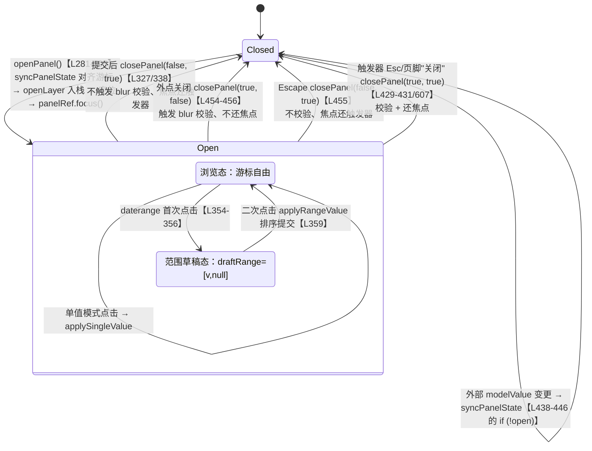
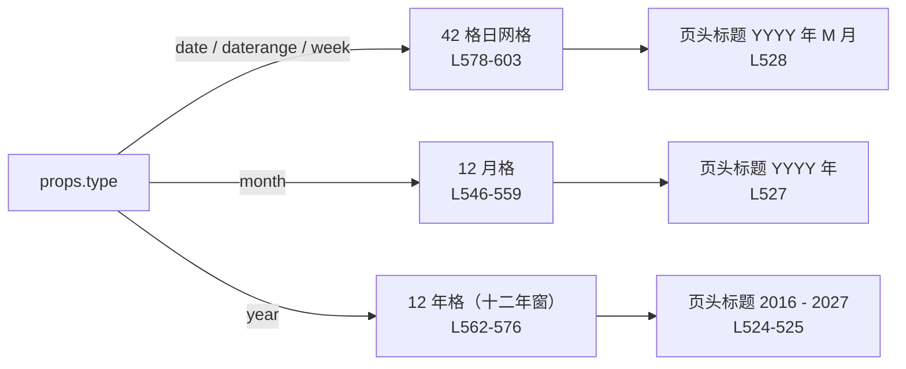

# 6-12 · DatePicker：日历面板状态机

> 本篇是「表单组件」章节的第六篇，研究对象是 `date-picker`——全基础层唯一在运行时消费 dayjs 的组件，也是"输入框 + 浮层 + 日历面板"三段式编排里状态最多的一台机器。它的难点不在浮层（4-05/4-06 拆过的七件套，本篇只借三件，接线姿势与 6-04 cascader 同款），而在两件事：**dayjs 的封装边界**——哪些算术直接交给 dayjs、哪些自写工具函数、dayjs 类型有没有泄漏出组件边界；以及**面板状态机**——页游标、选中值、范围草稿三态如何分离又如何汇合。所有路径与行号均在当前工作区逐一核对，周算法等关键结论附带 node 实测数据。

## 一、文件全景与消费矩阵：单文件 613 行，七件套借三件

先给文件清单。`packages/components/date-picker/` 下只有四件东西：`src/date-picker.vue`（613 行，视图层与逻辑层全内联）、`src/date-picker.ts`（39 行，纯类型）、`index.ts`（22 行，装配出口）、`__tests__/date-picker.spec.ts`（144 行，8 个用例）。样式在 `packages/theme/src/components/date-picker.css`（337 行），`packages/theme/index.css:48` 挂载。manifest 登记在 `packages/components/component-manifest.json:309-315`——`installExports` 只有 `XyDatePicker`，`installChecks` 断言 `xy-date-picker` 标签名。类型夹具 `tests/types/fixtures/date-picker.ts`（26 行）参与 `pnpm typecheck:types`。

先看源码头部（`packages/components/date-picker/src/date-picker.vue:1-58`）——导入段是"dayjs 封装边界"的第一条实码证据：

```vue
<script setup lang="ts">
import dayjs from "dayjs";
import customParseFormat from "dayjs/plugin/customParseFormat";
import { computed, inject, nextTick, ref, watch } from "vue";
import {
  useConfig,
  useDismissibleLayer,
  useFloatingPanel,
  useNamespace,
  useOverlayStack
} from "xiaoye-primitives";
import XyIcon from "../../icon";
import { formItemKey, formKey } from "../../form/src/context";
import type {
  DatePickerProps,
  DatePickerShortcut,
  DatePickerType,
  DatePickerValue
} from "./date-picker";

interface CalendarCell {
  key: string;
  label: number;
  date: Date;
  inCurrentMonth: boolean;
  disabled: boolean;
}

dayjs.extend(customParseFormat);

const props = withDefaults(defineProps<DatePickerProps>(), {
  modelValue: null,
  type: "date",
  placeholder: "请选择日期",
  disabled: false,
  clearable: false,
  size: undefined,
  min: undefined,
  max: undefined,
  format: undefined,
  valueFormat: undefined,
  shortcuts: () => [],
  disabledDate: undefined,
  teleported: true,
  popperClass: "",
  popperStyle: undefined,
  appendTo: "body",
  placement: "bottom-start"
});

const emit = defineEmits<{
  "update:modelValue": [value: DatePickerValue];
  change: [value: DatePickerValue];
  clear: [];
  visibleChange: [value: boolean];
  focus: [];
  blur: [];
}>();
```

三个事实值得钉死：

**其一，dayjs 是全基础层的"独苗"运行时依赖。** 用 `rg "import dayjs" packages/components` 扫全库，命中只有本文件的 `date-picker.vue:2`（默认导出）与 `countdown/src/utils.ts:1`（仅 `import type { Dayjs }`，纯类型）。增强层 `packages/pro-components` 零命中。也就是说：整个基础组件库的"日期算术"只活在这一个 613 行文件里，`packages/xiaoye-primitives/src/utils/` 下只有 `dom`、`types`、`vue` 三个目录——基础设施层刻意不建共享日期工具模块。对比同仓库的 `scheduler`（数据展示组），它走的是另一条路：完全不用 dayjs，用原生 Date 自写周起止（`packages/components/scheduler/src/scheduler.ts:224-234` 的 `startOfWeek/endOfWeek`，`scheduler.vue:67` 的 `weekStart: 1` 默认周一起步）。同一 monorepo，两个日期组件，两种日期依赖策略——这不是失序，而是两条边界各自成立：scheduler 的网格算术轻（只需周偏移），自写可控；date-picker 的算术重（月周日起止、粒度比较、格式化解析），自写必然失控，于是整包押注 dayjs。

**其二，插件只挂一个。** `date-picker.vue:29` 的 `dayjs.extend(customParseFormat)` 是全文件唯一的插件调用。dayjs 生态里和日历面板天然相关的插件至少还有 `weekOfYear`（周数）、`isoWeek`（ISO 周）、`localeData`（本地化表头），本库一个都没挂——周数算法选择自写（第二节展开），代价与收益都在那里算清。

**其三，浮层七件套只借三件。** 4-06 的清单是：`useFloatingVisibility`（三态状态机）、`useOverlayStack`（全局栈与 z 序）、`useOverlayDialog`（模态遮罩）、`useFocusTrap`（焦点陷阱）、`useFloatingPanel`（定位管道）、`useDismissibleLayer`（关闭裁决）、`useListNavigation`（键盘导航）。date-picker 的消费面是 `useOverlayStack`、`useFloatingPanel`、`useDismissibleLayer` 三件（`date-picker.vue:5-11`），与 6-04 的 cascader 完全同款：没有 hover 触发与延迟开合（不用 `useFloatingVisibility` 的三态，`open` 就是一个单布尔，`date-picker.vue:71`），没有模态遮罩诉求，面板内没有键盘网格导航（也就没有 `useListNavigation`——这是欠账不是取舍，后面细说）。把 6-03/6-04 的消费矩阵接着画下去：

| 组件 | Stack | Panel | Dismissible | Visibility | ListNavigation | FocusTrap | OverlayDialog |
| --- | --- | --- | --- | --- | --- | --- | --- |
| auto-complete（6-03） | 是 | 是 | 是 | 否 | 是 | 否 | 否 |
| cascader（6-04） | 是 | 是 | 是 | 否 | 否 | 否 | 否 |
| **date-picker（本篇）** | 是 | 是 | 是 | 否 | 否 | 否 | 否 |

七件套在三个表单浮层组件上稳定收敛为"三件套 + 键盘件按需"的形态。单布尔显隐面前，三态状态机是过度设计——这条 6-03 的判断在 date-picker 上第三次得到验证。

EP 对照先立一块背景板：Element Plus 2.x 的 date-picker 是仓库里文件数最多的组件之一，`date-picker`、`date-picker-common`、面板层 `panel-date`/`panel-date-range`、表格层 `basic-date-table`/`basic-month-table`/`basic-year-table` 拆成十余个文件，面板内部自带 date/month/year 三层钻取视图状态机。本库把这一切压进单文件 613 行，压掉的第一样东西就是钻取视图（第三节）。单文件不是偷懒——它是"type 决定唯一视图"这个扁平协议的物理形态；但也必须承认，613 行的单文件已经站在"再长就该拆"的门槛上，EP 的多文件拆分在可维护性上的理由是真实的。

## 二、dayjs 封装边界：内部世界 dayjs，对外契约字符串

把边界问题拆成三个子问题：**哪些算术直接用 dayjs？哪些自写？dayjs 有没有泄漏出组件边界？**

自写工具函数的完整清单在 `date-picker.vue:162-229` 与 `date-picker.vue:231-279`，一共九个：`getDefaultFormat`（按 type 给默认格式）、`parseByFormat`（严格解析）、`formatByPattern`（按 pattern 输出）、`normalizeModelValue`（外部值 → 内部二元组）、`resolveAnchorDate`（游标锚点）、`isDateDisabled`（禁用判定）、`isSameValue`（粒度感知判等）、`isInRange`（范围命中）、`adaptValueByType`（选择值按 type 归一）。先看第一组——格式化协议的核心四件（`date-picker.vue:162-229`）：

```ts
function getDefaultFormat(type: DatePickerType) {
  switch (type) {
    case "month":
      return "YYYY-MM";
    case "year":
      return "YYYY";
    case "week":
      return "YYYY-[W]WW";
    default:
      return "YYYY-MM-DD";
  }
}

function parseByFormat(value: string | null | undefined, format: string) {
  if (!value) {
    return null;
  }

  if (format === "YYYY-[W]WW") {
    const match = value.match(/^(\d{4})-W(\d{2})$/);

    if (!match) {
      return null;
    }

    const year = Number(match[1]);
    const week = Number(match[2]);
    const first = dayjs(`${year}-01-01`).startOf("year");
    return first.add(week - 1, "week").startOf("week");
  }

  const parsed = dayjs(value, format, true);
  return parsed.isValid() ? parsed.startOf("day") : null;
}

function formatByPattern(value: dayjs.Dayjs, format: string) {
  if (format === "YYYY-[W]WW") {
    const start = dayjs(`${value.year()}-01-01`).startOf("week");
    const week = `${value.startOf("week").diff(start, "week") + 1}`.padStart(2, "0");
    return `${value.format("YYYY")}-W${week}`;
  }

  return value.format(format);
}

function normalizeModelValue(value: DatePickerValue, type: DatePickerType, format: string) {
  if (type === "daterange") {
    if (!Array.isArray(value)) {
      return [null, null] as [dayjs.Dayjs | null, dayjs.Dayjs | null];
    }

    return [parseByFormat(value[0], format), parseByFormat(value[1], format)] as [
      dayjs.Dayjs | null,
      dayjs.Dayjs | null
    ];
  }

  if (Array.isArray(value)) {
    return [null, null] as [dayjs.Dayjs | null, dayjs.Dayjs | null];
  }

  return [parseByFormat(value, format), null] as [dayjs.Dayjs | null, dayjs.Dayjs | null];
}

function resolveAnchorDate(value: DatePickerValue, type: DatePickerType, format: string) {
  const normalized = Array.isArray(value) ? value[0] : value;
  return parseByFormat(normalized, format ?? getDefaultFormat(type)) ?? today;
}
```

**直接用 dayjs 的部分**：构造与严格解析（`dayjs(value, format, true)`，第三参 `true` 依赖 `customParseFormat` 插件，实测 `dayjs("2026/03/22","YYYY-MM-DD",true).isValid()` 为 `false`——斜杠混写会被拒）；起止截断（`startOf("month"/"week"/"day"/"year")`）；游标步进（`add(step, "month"/"year")`）；粒度比较（`isSame(right, "day"/"month"/"year")`、`isBefore/isAfter`）；模板渲染（`value.format(pattern)`）。**自写的部分**：上面四个函数加后文五个判定函数，全部文件内私有，无一处抽到 primitives。**不泄漏的部分**：类型层看 `date-picker.ts:5-39`——

```ts
export type DatePickerType = "date" | "daterange" | "month" | "year" | "week";
export type DatePickerValue = string | [string, string] | null;
export type DatePickerValueChangeHandler = (value: DatePickerValue) => void;
export type DatePickerVisibleChangeHandler = (value: boolean) => void;

export interface DatePickerShortcut {
  label: string;
  value: DatePickerValue | (() => DatePickerValue);
}

export interface DatePickerProps {
  modelValue?: DatePickerValue;
  type?: DatePickerType;
  placeholder?: string | string[];
  disabled?: boolean;
  clearable?: boolean;
  size?: ComponentSize;
  min?: string;
  max?: string;
  format?: string;
  valueFormat?: string;
  shortcuts?: DatePickerShortcut[];
  disabledDate?: (date: Date) => boolean;
  separator?: string;
  prefixIcon?: string;
  suffixIcon?: string;
  clearIcon?: string;
  editable?: boolean;
  teleported?: boolean;
  popperClass?: string;
  popperStyle?: StyleValue;
  appendTo?: string | HTMLElement;
  placement?: Placement;
  modelModifiers?: { lazy?: boolean };
}
```

`DatePickerValue` 是 `string | [string, string] | null`——组件的对外世界全是**格式化字符串**，`dayjs.Dayjs` 类型一次都没出现在公共 API 里（`index.ts:12-19` 导出的六个类型同样零 dayjs）。唯一的"日期对象出口"是 `disabledDate: (date: Date) => boolean` 回调，实码给的是 `value.toDate()`（`date-picker.vue:240`）——原生 Date，不是 dayjs 实例。这条边界选择有明确的收益账：modelValue 可直接进 JSON、进表单、进后端，不携带 dayjs 的序列化语义；未来想把 dayjs 换成 date-fns 或 temporal，公共契约一行不改，重写面收敛在单文件内部。EP 的 value-format 协议与本库同构（EP 同样约定 value-format 决定对外字符串、format 只管显示），这是业界收敛过的共识方案，本库照走正路。

**周协议是"自写 vs 插件"权衡的样本。** `YYYY-[W]WW` 里 `WW` 不是 dayjs 核心令牌（核心只有 `W` 吗？不，连 `W` 都没有——周数需要 `weekOfYear` 或 `isoWeek` 插件）。本库的解法是绕开 dayjs 的令牌系统：解析侧用正则 `^(\d{4})-W(\d{2})$` 手抠年周两个数字（`date-picker.vue:181-191`），格式化侧用"该日期所在周的周日"与"元旦所在周的周日"做周差加一（`date-picker.vue:198-202`）。锚定周日而非 ISO 周一，与月视图的周起始（第三节）保持同一套约定。代价在边界处显形——用 node 实测（dayjs 1.11.20，默认 locale）：

```text
parse  "2026-W01"  →  2025-12-28（周日，2026-01-01 是周四，所在周的周日落在上一年）
format 2025-12-28  →  "2025-W53"
```

即 `parse(format(x))` 对 week 类型不是恒等：`2026-W01` 解析出的日期再格式化回字符串，得到的是 `2025-W53`。元旦落在周四的年份（2026 恰是），W01 的起始周日本身就属于上一年，而格式化侧用日期自身的年份做锚。这不是实现笔误，而是"自写简化周算法 + 不挂 isoWeek"的必然副产品——ISO 8601 的周归属规则（含 53 周年、第一周定义）恰恰是那两个插件存在的理由。写进专栏不是建议改掉（一周容错在周度统计场景几乎无感），而是把"自写工具函数"这条边界选择的账算到小数点后：**省两个插件依赖，换一条非恒等的往返协议**。对照组是月/年/日类型：`parse → format` 严格恒等，因为那些算术 dayjs 核心全覆盖，自写只发生在"周"这一个 dayjs 的知识盲区。

## 三、面板状态机：游标、选中、草稿三态分离

现在进本篇的主菜。先摆状态变量（`date-picker.vue:71-73` 与 `date-picker.vue:96-100`）：

```vue
const open = ref(false);
const selectedValue = ref<DatePickerValue>(props.modelValue);
const draftRange = ref<[dayjs.Dayjs | null, dayjs.Dayjs | null]>([null, null]);
```

```ts
const selectedDates = computed(() => normalizeModelValue(selectedValue.value, props.type, modelFormat.value));
const currentPanelDate = ref(resolveAnchorDate(props.modelValue, props.type, modelFormat.value));
const focusedDate = ref(resolveAnchorDate(props.modelValue, props.type, modelFormat.value));
const minDate = computed(() => parseByFormat(props.min, modelFormat.value));
const maxDate = computed(() => parseByFormat(props.max, modelFormat.value));
const yearPanelStart = computed(() => Math.floor(currentPanelDate.value.year() / 12) * 12);
```

职责划分：`selectedValue` 是**选中值**（对外真相的内部镜像，存原始字符串）；`currentPanelDate` 是**页游标**（面板当前翻到哪年哪月，与选中无关，用户可以翻到 2030 年而一个值都没选）；`draftRange` 是**范围草稿**（daterange 二段点击的暂存区，第一段落格后悬而未决）；`selectedDates` 是选中值的 dayjs 化投影（computed，只读）；`yearPanelStart` 是年视图的十二年窗口起点（`Math.floor(year / 12) * 12`，2026 落在 2016-2027 窗）。这套"游标与选中分离"是日历组件的经典架构——EP 的 `panel-date` 内部同样是 `date`（游标）与选中值的分离——本库的实现定论是把分离推到三个变量，并且写死两条同步规则。

**状态机全图**（实码路径标注）：



读这张图的关键是**四条关闭路径的参数对照**。`closePanel(shouldValidate, restoreFocus)`（`date-picker.vue:297-316`）的两个布尔把"关面板"这一个动作拆成四种语义组合：

| 关闭触发 | shouldValidate | restoreFocus | 实码位置 |
| --- | --- | --- | --- |
| 提交值后自动关 | false | true | `applySingleValue`/`applyRangeValue`/`applyShortcut` 里 `closePanel(false, true)` |
| 点击面板外 | true | false | `useDismissibleLayer` 的 `onDismiss`：`closePanel(reason === "outside", reason === "escape")` |
| 面板内按 Escape | false | true | 同上，`reason === "escape"` |
| 触发器上 Esc / 页脚"关闭"钮 | true | true | `handleTriggerKeydown` L429-431 与页脚按钮 L607 |

这是 4-06 关闭语义（"由谁关闭决定焦点去哪、要不要触发校验"）在日期场景的完整落地：**成功路径不校验**（值刚提交，马上还有 change 校验，blur 校验会重复打扰）；**被外点打断要校验**（用户可能选了一半跑掉，表单需要知道）；**Escape 是纯取消**（不校验，但把焦点还给触发器，键盘流不断）。注意 `useDismissibleLayer` 的接线（`date-picker.vue:448-457`）：`enabled: open` 让裁判只在面板开着时上班，`isTopMost: () => isTopMost()` 接全局浮层栈——4-05 考据过的 `shallowRef` 栈容器（`use-overlay-stack.ts:13-16` 注释：深层 ref 会把 entry 代理化并自动解包 zIndex，导致 `getTopEntry` 读到 undefined）在这里被无感消费。

**游标/选中分离的同步规则**，一条在开面板时、一条在外部值变更时。先看开关面板与同步函数（`date-picker.vue:272-316`）：

```ts
function syncPanelState() {
  const [start, end] = selectedDates.value;
  const anchor = start ?? today;

  currentPanelDate.value = anchor;
  focusedDate.value = anchor;
  draftRange.value = [start, end];
}

async function openPanel() {
  if (mergedDisabled.value || open.value) {
    return;
  }

  open.value = true;
  emit("visibleChange", true);
  emit("focus");
  syncPanelState();
  openLayer();
  await nextTick();
  await updatePosition();
  startAutoUpdate();
  panelRef.value?.focus();
}

async function closePanel(shouldValidate = false, restoreFocus = false) {
  if (!open.value) {
    return;
  }

  open.value = false;
  emit("visibleChange", false);
  emit("blur");
  stopAutoUpdate();
  closeLayer();

  if (restoreFocus) {
    await nextTick();
    triggerRef.value?.focus();
  }

  if (shouldValidate) {
    await formItem?.validate("blur");
  }
}
```

`syncPanelState`（L272-279）在 `openPanel` 里被调：每次开面板，游标对齐到"选中值锚点（首个选中日期，无选中则今天）"，草稿对齐到当前选中范围。规则一：**游标是易失状态，开面板即重置**——用户上一次翻到 2030 年的浏览位置不保留，下次打开回到选中处。规则二在 watch 里（`date-picker.vue:438-446`）：

```ts
watch(
  () => props.modelValue,
  (value) => {
    selectedValue.value = value;
    if (!open.value) {
      syncPanelState();
    }
  }
);
```

外部值变更永远同步 `selectedValue`（选中值是对外真相的镜像，必须跟），但**只在面板关闭时才回拉游标**——`if (!open.value)` 这一行是分离架构的守护条款：面板开着时，另一个组件（比如联动筛选器）改了 modelValue，选中值默默更新，但用户正在翻的 2030 年游标不被抢劫。这条权衡的另一面是：面板开着时外部把值改成另一个月，面板页不会跟着翻——用户看到的选中高亮可能不在当前页。本库选择了"保游标稳定"而不是"保所见即选中"，在表单联动场景里前者更符合直觉（游标被抢是日历组件最著名的体验事故，EP 在面板开启时同样不回拉页游标）。

**权衡档案一（游标/选中分离）**：三态变量 + 两条同步规则（开面板重置游标、关闭态才跟随外部值）vs 把三者合一的"选中即游标"方案。合一方案的代价是具体的：选中 3 月 22 日后想看 3 月 1 日那页，点一下 3 月 1 日值就变了——浏览动作与选择动作无法区分。分离方案多养两个 ref，换来"翻页是浏览、点格才是选择"的干净语义。实码定论：分离，且守护条款收在 watch 的一个 if 里。

## 四、42 格月视图与 type 路由：静态视图的扁平协议

任务规格假设本库有"年→月→日的视图层级切换与 view 状态"——**实态不符，先纠正**：`date-picker.vue` 里不存在任何 drill-down（钻取）视图状态。`type` 是视图的唯一路由器，五种 type 五个静态视图：`month` 渲染 12 个月格（L546-559），`year` 渲染 12 个年格（L562-576），`date`/`daterange`/`week` 共享 42 格日网格（L578-603）。视图间不互相钻取：`type="date"` 的面板永远看不到月视图，`type="month"` 的面板也永远下不到日格。EP 的 date panel 则是完整的三层钻取（面板头部的年/月可点、逐级下潜），两家的分野在产品语义：EP 一个组件吃下所有粒度切换，本库一个 type 一个组件实例，粒度切换由业务代码换 `type` 完成。扁平协议的收益是状态机骤减（没有 view 栈、没有钻取动画），代价是"选 2026 年 3 月 22 日"这类跨粒度操作必须切成 `type="date"`。这是 613 行压得住单文件的真正原因——不是代码写得好，是需求面砍得狠。

42 格的生成在 `calendarCells`（`date-picker.vue:122-160`，连同月格年格一起贴）：

```ts
const calendarCells = computed<CalendarCell[]>(() => {
  const monthStart = currentPanelDate.value.startOf("month");
  const gridStart = monthStart.startOf("week");

  return Array.from({ length: 42 }, (_, index) => {
    const date = gridStart.add(index, "day");
    return {
      key: date.format("YYYY-MM-DD"),
      label: date.date(),
      date: date.toDate(),
      inCurrentMonth: date.month() === monthStart.month(),
      disabled: isDateDisabled(date)
    };
  });
});

const monthCells = computed(() =>
  monthLabels.map((label, index) => {
    const value = currentPanelDate.value.month(index).startOf("month");
    return {
      key: value.format("YYYY-MM"),
      label,
      value,
      disabled: isDateDisabled(value)
    };
  })
);

const yearCells = computed(() =>
  Array.from({ length: 12 }, (_, index) => {
    const value = currentPanelDate.value.year(yearPanelStart.value + index).startOf("year");
    return {
      key: `${value.year()}`,
      label: `${value.year()} 年`,
      value,
      disabled: isDateDisabled(value)
    };
  })
);
```

三个考据点。**其一，42 格定死**。`Array.from({ length: 42 })` 固定 6 行 × 7 列：任何月份最多跨 6 个周行（月初第一天是周六、月有 31 天、月尾溢出到下一月第六行），35 格方案在部分月份只铺 5 行、铺不下时仍要扩行，行数抖动会带来面板高度跳变。42 格的代价是固定多出一行"纯下月格"（如 28 天且首日为周日的二月），实码用 `is-outside` class（`date-picker.css:305-307`，灰化弱显）消化，EP 的 date-table 同样是 6 行固定——这条业界无分歧。

**其二，周起始不联动 locale——实测定论。** `monthStart.startOf("week")` 的"一周从哪天开始"由 dayjs 的 locale 决定；本库全仓库无 `dayjs.locale()` 调用（`rg` 验证零命中），dayjs 默认 locale 是 `en`，周日起步（实测 `dayjs("2026-09-23").startOf("week")` → `2026-09-20 Sun`）。而表头 `weekdays = ["日", "一", "二", "三", "四", "五", "六"]` 是硬编码中文（`date-picker.vue:60-61`），恰好从"日"开头——**硬编码表头与 dayjs 默认 locale 的周起始碰巧对齐**，组件才看起来"像本地化过的"。真把 dayjs 切到 `zh-cn`（周一起步），表头不会动、格子会整体错位一格。对照组就是同仓库的 `scheduler`：它把 `weekStart` 做成 prop（0-6 可配，默认周一开始，`scheduler.ts:224-234` 手写 `startOfWeek`），自写算术反而把"周起始"变成了显式可配置项。date-picker 的"周日起步"是 dayjs 默认 locale 的隐式产物，不是设计决策——这是 dayjs 边界权衡里最值得记的一笔：**把算术外包给库，库的默认值就成了你的设计**。

**其三，格子携带 Date 而非 Dayjs**。`CalendarCell.date: Date`（`date.toDate()`），模板侧每次比较又包回 `dayjs(cell.date)`（L590-598）：

```vue
          <template v-else>
            <div class="xy-date-picker__weekdays">
              <span v-for="weekday in weekdays" :key="weekday">{{ weekday }}</span>
            </div>
            <div class="xy-date-picker__grid">
              <button
                v-for="cell in calendarCells"
                :key="cell.key"
                type="button"
                class="xy-date-picker__cell"
                :class="[
                  cell.inCurrentMonth ? '' : 'is-outside',
                  isSameValue(dayjs(cell.date), selectedDates[0]) || isSameValue(dayjs(cell.date), selectedDates[1])
                    ? 'is-selected'
                    : '',
                  isInRange(dayjs(cell.date)) ? 'is-in-range' : '',
                  dayjs(cell.date).isSame(today, 'day') ? 'is-today' : ''
                ]"
                :disabled="cell.disabled"
                @mouseenter="focusedDate = dayjs(cell.date)"
                @click="handleDateSelect(dayjs(cell.date))"
              >
                {{ props.type === 'week' ? dayjs(cell.date).startOf('week').date() : cell.label }}
              </button>
            </div>
          </template>
```

42 格 × 每格 3-4 次 `dayjs()` 包装 + `isSameValue`/`isInRange` 判定，每次游标移动或选中变更整表重算。这个量级（几百次对象包装）在真实设备上无感，但结构上"Date 出、Dayjs 进"的往返包装是纯开销——若 cell 直接携带 Dayjs，模板侧可省一半包装。保留 Date 的理由大概是序列化友好与 `key` 稳定（`key: date.format("YYYY-MM-DD")` 已由 computed 提前算好）。这是单文件方案下无伤大雅的局部税，记入实态。

**type 路由图**：



页头步进 `movePanel`（`date-picker.vue:407-415`）是 type 感知的：年视图一步跨十二年（游标 `add(step * 12, "year")`，窗口整体平移），月视图一步跨一年，日视图一步跨一月。同一个"‹ ›"按钮，三种步长——游标协议对视图粒度的适配收在了一个函数里。

## 五、范围选择：二段点击、草稿暂存与排序交换

daterange 的选择流是状态机的 Drafting 子态。实码在 `handleDateSelect` 与 `applyRangeValue`（`date-picker.vue:342-373`）：

```ts
async function handleDateSelect(value: dayjs.Dayjs) {
  if (isDateDisabled(value)) {
    return;
  }

  if (!rangeMode.value) {
    await applySingleValue(adaptValueByType(value));
    return;
  }

  const [start, end] = draftRange.value;

  if (!start || (start && end)) {
    draftRange.value = [value.startOf("day"), null];
    return;
  }

  await applyRangeValue(start.startOf("day"), value.startOf("day"));
}

function adaptValueByType(value: dayjs.Dayjs) {
  switch (props.type) {
    case "month":
      return value.startOf("month");
    case "year":
      return value.startOf("year");
    case "week":
      return value.startOf("week");
    default:
      return value.startOf("day");
  }
}
```

```ts
async function applyRangeValue(start: dayjs.Dayjs, end: dayjs.Dayjs) {
  const sorted = start.isBefore(end) ? [start, end] : [end, start];
  emitValue([
    formatByPattern(sorted[0], modelFormat.value),
    formatByPattern(sorted[1], modelFormat.value)
  ]);
  draftRange.value = [sorted[0], sorted[1]];
  await closePanel(false, true);
  await formItem?.validate("change");
}
```

三条规则读下来。**规则一，二段点击**：草稿空（或已有完整草稿）时，点击落入"暂存起点"——`draftRange = [value, null]`，面板不关，等待第二段；草稿只有起点时，本次点击是终点，进入提交。**规则二，排序交换**：`applyRangeValue` 第一行 `start.isBefore(end) ? [start, end] : [end, start]`——先点月末再点月初也合法，提交时自动换序成升序对输出。用户侧"从右往左框选"的成本为零，复杂度被交换一行吸收。**规则三，type 归一**：`adaptValueByType` 把点击值截断到对应粒度（month → 月初、year → 年初、week → 周日、date → 当日零点），保证输出字符串永远是粒度对齐的。

**如实记录一个实态缺口：悬停预览没有接上。** `draftRange = [v, null]` 期间，范围高亮由 `isInRange` 决定（`date-picker.vue:260-270`）：

```ts
function isInRange(value: dayjs.Dayjs) {
  const [start, end] = rangeMode.value ? draftRange.value : [selectedDates.value[0], selectedDates.value[1]];

  if (!start || !end) {
    return false;
  }

  const min = start.isBefore(end) ? start : end;
  const max = start.isBefore(end) ? end : start;
  return (value.isAfter(min, "day") || value.isSame(min, "day")) && (value.isBefore(max, "day") || value.isSame(max, "day"));
}
```

草稿只有起点时 `end` 为 null，直接 `return false`——鼠标在第二格上游走时没有任何预览高亮。而 `focusedDate` 在 `@mouseenter` 里被赋值（L597），全文件搜索却**从未被读取**（L97 定义、L277 重置、L597 写入，仅此三处）——它是一个只写不读的悬置状态，本该作为"预览终点"喂给 `isInRange`，实际接线从未完成。EP 的 range 面板在草稿期用 hover 终点做完整的区间预演，这一层体验本库欠着。配套的 CSS 倒是齐的：`is-in-range` 的样式（`date-picker.css:296-298`）在草稿闭合后正常工作，`is-focused` 的样式（`date-picker.css:300-303`）同样从未被模板挂上——两个死钩子，等着未来的键盘导航和悬停预览来接。

**快捷项是"透传写值"协议**（`date-picker.vue:386-405`）：

```ts
async function applyShortcut(shortcut: DatePickerShortcut) {
  const resolved = typeof shortcut.value === "function" ? shortcut.value() : shortcut.value;

  if (rangeMode.value) {
    if (Array.isArray(resolved)) {
      emitValue(resolved);
      await closePanel(false, true);
      await formItem?.validate("change");
    }
    return;
  }

  if (Array.isArray(resolved)) {
    return;
  }

  emitValue(resolved);
  await closePanel(false, true);
  await formItem?.validate("change");
}
```

`shortcut.value` 支持静态值或惰性函数（`() => DatePickerValue`，函数形态在调用时刻求值——"最近 7 天"这类相对时间必须惰性），但**不做任何格式归一**：字符串直接 `emitValue` 出门，不经过 `parseByFormat` 校验、不经过 `formatByPattern` 重排。快捷项给什么字符串，modelValue 就是什么字符串。type 错配有守卫（单值模式下数组、范围模式下字符串都静默忽略），但格式错配没有守卫——调用方给个 `"2026/3/22"`，模型里就存 `2026/3/22`，展示层 `normalizeModelValue` 严格解析失败后回退 placeholder，出现"值在模型、面无显示"的静默错位。这是把格式责任完全推给调用方的极简协议，与 `valueFormat` 的严格解析形成一条不对称的接缝：**外部进来的 modelValue 会被严格解析校验，快捷项写进去的值不会**。

**权衡档案二（范围草稿的归属）**：独立 `draftRange` vs 直接写 `selectedValue` 半成品。后者省一个 ref，但半成品范围会污染对外事件流（第一段点击就要么发事件要么撒谎）——EP 的 range 面板同样内养草稿态（其 `minDate/maxDate` 草稿变量名与本库撞车纯属日期域词汇贫乏）。实码定论：草稿独立，提交时一次 `emitValue` 走 `update:modelValue` + `change` 双事件（`date-picker.vue:318-322` 的 `emitValue` 是唯一出口，清空走 L375-384 的 `clearValue` 额外补 `clear` 事件）。

## 六、格式化协议：双轨 format 与解析容错

格式化是三处权衡的最后一处。**双轨**在 `date-picker.vue:93-94`：

```ts
const rangeMode = computed(() => props.type === "daterange");
const displayFormat = computed(() => props.format ?? getDefaultFormat(props.type));
const modelFormat = computed(() => props.valueFormat ?? getDefaultFormat(props.type));
```

`format` 管触发器显示（`displayLabel` 里 `formatByPattern(first, displayFormat.value)`，L107/L114），`valueFormat` 管 modelValue 的进出解析与输出（L95/98/99/213/325/334）。两轨默认都回落到 type 的标准格式（`getDefaultFormat`，L162-173）。文档页（`apps/docs/components/date-picker.md` 的 format 与 value-format 小节）把典型用法写得很清楚：`format="YYYY/MM/DD"` + `value-format="YYYY-MM-DD"` → 显示斜杠、输出横杠。**解析容错**是双轨的暗面：所有外部进来的值都过 `parseByFormat` 的严格模式（`dayjs(value, format, true)`），解析失败静默返回 null——modelValue 传了格式不符的字符串，不会抛错、不会降级宽松解析，而是当它不存在：展示回 placeholder、游标回退到 `today`（`resolveAnchorDate` 的 `?? today`，L228）。容错方向是"宁可不显示，不猜用户意图"，与一些库的宽松解析（`new Date("2026/3/22")` 也能吃）相反。严格模式的代价是调用方必须保证 valueFormat 一致性——`tests/types/fixtures/date-picker.ts:20-25` 的 `@ts-expect-error modelValue: 123` 在类型层锚定了"只能是字符串或字符串对"的第一道闸，但字符串内部格式（`2026/3/22` vs `2026-03-22`）类型层管不到，运行时的严格解析就是最后一道闸。

```ts
import type { DatePickerProps } from "xiaoye-components";

const props: DatePickerProps = {
  modelValue: "2026-03-22",
  clearable: true,
  type: "date"
};

void props;

const rangeProps: DatePickerProps = {
  modelValue: ["2026-03-22", "2026-03-28"],
  type: "daterange",
  shortcuts: [{ label: "最近 7 天", value: ["2026-03-22", "2026-03-28"] }],
  disabledDate: (date) => date.getDay() === 0
};

void rangeProps;

const invalidProps: DatePickerProps = {
  // @ts-expect-error invalid date type
  modelValue: 123
};

void invalidProps;
```

夹具顺带示范了 `disabledDate` 回调形态——注意回调拿到的是原生 `Date`（不是 dayjs），`date.getDay() === 0` 禁掉所有周日。`min`/`max` 协议在 `isDateDisabled`（`date-picker.vue:231-241`）：

```ts
function isDateDisabled(value: dayjs.Dayjs) {
  if (minDate.value && value.endOf("day").isBefore(minDate.value.startOf("day"))) {
    return true;
  }

  if (maxDate.value && value.startOf("day").isAfter(maxDate.value.endOf("day"))) {
    return true;
  }

  return props.disabledDate?.(value.toDate()) ?? false;
}
```

min/max 用天级宽松比较（`endOf("day").isBefore(minDate.startOf("day"))`）保证边界日可选，`disabledDate` 最后裁决。月格/年格复用同一个函数有个语义边界：month 视图传进来的是月初那天，"3 月 1 日被禁"会导致整个 3 月格被禁——哪怕 3 月 5 日起其实可选。日视图无此问题，月/年视图的粗粒度禁用是按代表日一刀切，调用方写 `disabledDate` 时要意识到这一点。测试用例对禁用链路的选择是绕开内部断言、走渲染断言（`__tests__/date-picker.spec.ts:7-50`）：

```ts
  it("支持打开面板并选择日期", async () => {
    const wrapper = mount(XyDatePicker, {
      attachTo: document.body
    });

    await wrapper.find(".xy-date-picker__trigger").trigger("click");

    const cells = [...document.body.querySelectorAll(".xy-date-picker__cell")].filter(
      (element) => !element.classList.contains("is-outside") && !element.hasAttribute("disabled")
    );

    (cells[0] as HTMLButtonElement | undefined)?.click();
    await nextTick();

    expect(wrapper.emitted("update:modelValue")?.[0]?.[0]).toMatch(/^\d{4}-\d{2}-\d{2}$/);
    expect(wrapper.emitted("change")?.[0]?.[0]).toMatch(/^\d{4}-\d{2}-\d{2}$/);
  });
```

```ts
  it("空范围值时保持 placeholder 且不展示清空按钮", () => {
    const wrapper = mount(XyDatePicker, {
      props: {
        type: "daterange",
        modelValue: ["", ""],
        clearable: true,
        placeholder: "请选择日期范围"
      }
    });

    expect(wrapper.find(".xy-date-picker__selection").text()).toBe("请选择日期范围");
    expect(wrapper.find(".xy-date-picker__selection").classes()).toContain("is-placeholder");
    expect(wrapper.find(".xy-date-picker__clear").exists()).toBe(false);
  });
```

第一个用例值得多看一眼：teleport 后的日历格要用 `document.body.querySelectorAll` 全局捞（`attachTo: document.body` + 面板 teleport 到 body），并用 `is-outside` 与 `disabled` 双过滤圈定本月的可点格；断言用 `/^\d{4}-\d{2}-\d{2}$/` 正则锚定输出格式——测试没有写死具体日期，"今天"是哪个日期对测试无所谓，格式对就行。这正是"对外契约是字符串"的边界红利：断言字符串格式比断言 Date 对象稳定得多。范围空值的用例（`["", ""]`）则验证 `hasDisplayValue`（L117-120）的判定——范围模式要求起止**都**非空才算有值，`parseByFormat("")` 返回 null 后双 null，placeholder 回归、清空按钮消失。与 6-04 cascader 的空态语义对照着读很有意思：cascader 的空是"没选中任何节点"，date-picker 范围模式的空是"选了一半也算没选"。

## 七、样式与浮层接线：变量三级回落与 cell 态矩阵

面板样式（`packages/theme/src/components/date-picker.css:149-187`）有一段本库少见的**变量三级回落协议**：

```css
.xy-date-picker__panel {
  --xy-date-picker-panel-bg-resolved: var(
    --xy-date-picker-panel-bg,
    var(
      --xy-popper-bg,
      var(--xy-dialog-bg, color-mix(in srgb, var(--xy-bg-floating) 98%, var(--xy-bg-subtle)))
    )
  );
  --xy-date-picker-panel-border-resolved: var(
    --xy-date-picker-panel-border,
    var(
      --xy-popper-border-color,
      color-mix(in srgb, var(--xy-border-subtle) 88%, var(--xy-border))
    )
  );
  --xy-date-picker-panel-shadow-resolved: var(
    --xy-date-picker-panel-shadow,
    var(
      --xy-popper-shadow,
      0 0 0 1px color-mix(in srgb, var(--xy-bg-floating) 8%, transparent),
      0 2px 8px color-mix(in srgb, var(--xy-text-heading) 7%, transparent)
    )
  );
  --xy-date-picker-panel-section-background: color-mix(
    in srgb,
    var(--xy-date-picker-panel-bg-resolved) 96%,
    var(--xy-bg-subtle)
  );
  position: absolute;
  width: 308px;
  border: 1px solid var(--xy-date-picker-panel-border-resolved);
  border-radius: var(--xy-radius-lg);
  background: var(--xy-date-picker-panel-bg-resolved);
  box-shadow: var(--xy-date-picker-panel-shadow-resolved);
  padding: 10px;
  outline: none;
  overflow: visible;
  isolation: isolate;
}
```

`-resolved` 变量把覆盖权分了三层：组件专属层（`--xy-date-picker-panel-bg`，给 date-picker 定制皮肤）、浮层通用层（`--xy-popper-bg`，给所有 popper 类面板统一定制）、兜底计算值。消费面在文档示例 `apps/docs/examples/date-picker/popper-class.vue`——通过 `popper-class` 挂一个自定义 class，只重定义组件专属层变量即可换肤，不用碰组件代码。308px 固定宽（L178）对应 7 列 × 36px 最小格高 + 6 间隙 + 20 内边距的算式，月视图 3 列、年视图 3 列的栅格（`date-picker.css:259-262` 的 `grid-template-columns: repeat(3, 1fr)`）复用同一面板壳。

日期格的态矩阵是 CSS 段的重头（`date-picker.css:271-317`）：

```css
.xy-date-picker__cell {
  border: 1px solid transparent;
  min-height: 36px;
  border-radius: var(--xy-radius-md);
  background: transparent;
  color: var(--xy-text-primary);
  transition:
    border-color var(--xy-transition-duration-fast) var(--xy-transition-timing),
    background-color var(--xy-transition-duration-fast) var(--xy-transition-timing),
    color var(--xy-transition-duration-fast) var(--xy-transition-timing),
    box-shadow var(--xy-transition-duration-fast) var(--xy-transition-timing);
}

.xy-date-picker__cell:hover:not(.is-disabled):not(.is-selected) {
  border-color: color-mix(in srgb, var(--xy-brand) 12%, var(--xy-date-picker-panel-border-resolved));
  background: color-mix(in srgb, var(--xy-bg-subtle) 70%, var(--xy-date-picker-panel-bg-resolved));
}

.xy-date-picker__cell.is-selected {
  background: color-mix(in srgb, var(--xy-brand-soft) 84%, var(--xy-date-picker-panel-bg-resolved));
  color: var(--xy-brand);
  border-color: color-mix(in srgb, var(--xy-brand) 18%, var(--xy-date-picker-panel-border-resolved));
  font-weight: var(--xy-font-weight-semibold);
}

.xy-date-picker__cell.is-in-range:not(.is-selected) {
  background: color-mix(in srgb, var(--xy-brand-soft) 74%, var(--xy-date-picker-panel-bg-resolved));
}

.xy-date-picker__cell.is-focused {
  border-color: color-mix(in srgb, var(--xy-brand) 18%, var(--xy-date-picker-panel-border-resolved));
  box-shadow: 0 0 0 3px color-mix(in srgb, var(--xy-brand) 10%, transparent);
}

.xy-date-picker__cell.is-outside {
  color: var(--xy-text-muted);
}

.xy-date-picker__cell.is-disabled {
  opacity: 0.4;
  cursor: not-allowed;
}

.xy-date-picker__cell.is-today:not(.is-selected) {
  background: color-mix(in srgb, var(--xy-bg-subtle) 70%, var(--xy-date-picker-panel-bg-resolved));
  color: var(--xy-text-heading);
}
```

六个态的优先级由选择器交叠自然形成：`is-selected` 压过一切（`hover` 与 `is-today` 都用 `:not(.is-selected)` 显式让位）；`is-in-range` 只染背景不描边，与 `is-selected` 的"背景 + 品牌字色 + 描边 + 加粗"拉开一个视觉层级；`is-outside` 只降字色、`is-disabled` 只降透明度，两者可叠加（跨月的禁用格）。全部颜色经 `color-mix` 与面板背景变量混算——3-03 双主题协议的老纪律：组件样式只消费语义层与刻度层令牌，不写死色值，`data-theme` 切换时整面板自动换装。

可达性接线做在触发器上（`date-picker.vue:470-505`）：`role="combobox"` + `aria-expanded` + `aria-controls`（指向面板 `id`，L475-476），`aria-describedby` 接 formItem 的错误消息 id（L477），面板本身 `role="dialog"` + `tabindex="-1"`（L516-517），开面板即聚焦面板（L294 的 `panelRef.value?.focus()`）。但**面板不是焦点陷阱**（未用 4-07 的 `useFocusTrap`），Tab 会在 42+ 个格子按钮间游走并能走出面板；键盘也没有方向键网格导航——4-05 的"焦点治理"与 6-03 的"键盘导航"在 date-picker 上都只做了入口侧（触发器 Enter/Space/ArrowDown 开、Esc 关，L417-436）。这是与 auto-complete 的第二个消费分野：auto-complete 的浮层是菜单语义（必须全键盘），date-picker 的面板是网格语义（键盘网格导航要一套独立的 roving tabindex 方案，本库未做，实态欠账）。

## 八、收束

把本篇的答案压缩回三句话：

1. **dayjs 边界是"整包押注、单文件收口、契约不出境"。** 基础层唯一运行时消费者（`countdown` 只借类型、`scheduler` 自写 Date 算术），插件只挂 `customParseFormat`，九个自写工具函数全部文件内私有；对外契约是 `string | [string, string] | null` 与原生 `Date` 回调，`dayjs.Dayjs` 零泄漏——换日期库的重写面锁死在 613 行之内。代价有两笔：周协议非恒等往返（`2026-W01` ↔ `2025-W53`，node 实测），以及"库默认值当设计"的周日起步（硬编码中文表头碰巧对齐，locale 不联动）。
2. **面板状态机是"三态分离 + 两条同步规则 + 四种关闭语义"。** `selectedValue`（选中）/`currentPanelDate`（游标）/`draftRange`（草稿）各管一事；开面板重置游标、关闭态才跟随外部值（watch 里的 `if (!open.value)` 守护条款）；`closePanel(shouldValidate, restoreFocus)` 两个布尔把提交/外点/Escape/手动关闭四种收尾的"校验与否、焦点还否"穷举干净。
3. **视图是 type 路由的静态扁平协议，没有钻取。** 五 type 五视图、42 格定死、`movePanel` 的 type 感知步长；与 EP 的三层钻取面板分道——砍掉 view 栈换单文件可控，代价是跨粒度操作必须换 `type`。

权衡档案三则：**dayjs 依赖边界**（共享 date 工具层 vs 单文件私有，实码选后者——消费面只有一个组件时，抽象层是负债）；**游标/选中分离**（三态分离 + 守护条款 vs 合一，实码选分离）；**格式化协议**（严格解析静默容错 vs 宽松猜测，实码选严格，与 shortcuts 的透传写值构成一条有意的接缝不对称）。

如实记录本篇叙述与源码核对中发现的实态不符点与悬置态：① 任务规格假设存在"年→月→日视图层级切换与 view 状态"——实码无钻取视图，type 是唯一视图路由，本文按实态展开；② `focusedDate`（L97/L277/L597）只写不读，悬停预览未接线，daterange 草稿期无区间预演；③ `separator`/`prefixIcon`/`suffixIcon`/`clearIcon`/`editable`/`modelModifiers` 六个 props 在 `date-picker.ts:28-32,38` 声明却零消费（图标硬编码 `mdi:close-circle`/`mdi:chevron-down`，L499/502）；④ CSS 的 `is-focused` 态（`date-picker.css:300-303`）无模板挂载点，是留给键盘导航的死钩；⑤ `today` 是 setup 期常量（L74），组件跨午夜存活时"今天"按钮与今日高亮会滞后一天；⑥ 月/年视图的禁用判定按代表日（月初/年初）一刀切，粗粒度下 `disabledDate` 语义偏紧。

下一篇 **6-13《TimePicker：时间面板》**把日期维度换成时间维度：同为"触发器 + 浮层 + 面板"三段式与同款浮层三件套，time-picker 的面板却不再是网格，而是时分秒三列滚动列表——格子从二维坐标变成三个一维刻度的笛卡尔积，草稿态从"二段点击"变成"三段联动"（改小时要保住分秒），格式化协议也从 `YYYY-MM-DD` 换成 `HH:mm:ss` 的 `format.includes("ss")` 特性侦测。date-picker 本篇埋的两处死钩（`focusedDate` 悬停预览、键盘网格导航）在时间列上会不会复活，6-13 见分晓。

---

*本篇代码引用核对于当前工作区实态：`packages/components/date-picker/src/date-picker.vue`（613 行，L2-3 / L29 / L31-49 / L51-58 / L60-61 / L62-67 / L71-76 / L78-90 / L92-100 / L102-120 / L122-160 / L162-173 / L175-195 / L197-205 / L207-224 / L226-229 / L231-241 / L243-258 / L260-270 / L272-279 / L281-295 / L297-316 / L318-322 / L324-340 / L342-373 / L375-384 / L386-405 / L407-415 / L417-436 / L438-446 / L448-457 / L470-505 / L507-544 / L546-576 / L578-608 / L590-598 / L599-601）、`src/date-picker.ts`（39 行，L5-13 / L15-39）、`index.ts`（22 行，L12-21）、`__tests__/date-picker.spec.ts`（144 行，L7-23 / L25-36 / L38-50 / L52-65 / L67-78 / L80-104 / L106-119 / L122-144）、`packages/theme/src/components/date-picker.css`（337 行，L149-187 / L252-262 / L271-317 / L296-303 / L305-317 / L319-321）、`tests/types/fixtures/date-picker.ts`（26 行全文）、`packages/components/component-manifest.json:309-315`、`packages/theme/index.css:48`、`packages/xiaoye-primitives/src/composables/use-floating-panel.ts`（161 行，L14-25 / L45-77）、`use-overlay-stack.ts`（99 行，L13-16）、`use-dismissible-layer.ts`（82 行，L4-11 / L55-64）、`packages/components/countdown/src/utils.ts:1`、`packages/components/scheduler/src/scheduler.ts:224-234`、`scheduler.vue:67`、`apps/docs/examples/date-picker/`（basic / limit / range / modes / shortcuts / popper-class / form 七例）、`apps/docs/components/date-picker.md`（format 与 value-format 小节）。EP 侧事实（date-picker 多文件拆分与 basic-date-table 等三表、面板内 date/month/year 钻取、value-format 协议、range 面板 hover 预演）以 element-plus 2.x 源码为参照核对；dayjs 行为（默认 locale `en` 周日起步、`customParseFormat` 严格解析拒收斜杠混写、`2026-W01` ↔ `2025-W53` 往返不对称）以仓库 node_modules 内 dayjs 1.11.20 实测。本篇叙述与源码不符点自查：任务规格假设存在 date-table/panel 类独立面板文件与年→月→日钻取视图——当前工作区实态为单文件实现、type 静态路由视图，文中已按实态展开；另 `focusedDate` 只写不读、六 props 声明未消费、`is-focused` 死钩均已如实记录。*
