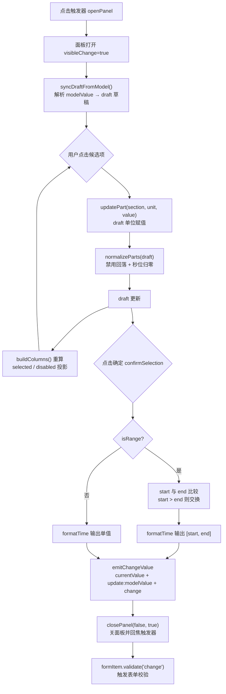
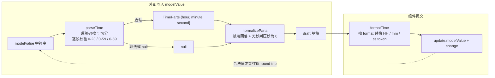

# 6-13 · TimePicker：时间面板

> 核心问题：列表滚动选择与格式约束

上一篇 6-12 我们拆了 DatePicker 的日历面板，按惯例预告过"时间选择器会回头讲"。这一篇轮到 TimePicker。动手精读源码之前，我先带着一个预设的疑问进去：时间面板到底是滚轮（spinner）、scroll-snap 网格，还是 JS 监听 scroll 事件的吸附列表？因为这是市面上时间选择器的三种主流做法，而一个组件库选哪一档，几乎决定了它的测试策略、键盘可达性和移动端手感。

读完 `packages/components/time-picker/src/time-picker.vue`（687 行）之后，结论比预想更干脆，也更值得写：**三档都不占，本库自成一档**。

先把这个实码定论摆在这里，全篇都围绕它展开：

- 时间面板是三列**可滚动的点击列表**——每一列是一个 `max-height: 208px; overflow: auto` 的按钮网格（`packages/theme/src/components/time-picker.css:240-248`），选中靠**点击**，滚动只是溢出容纳的副产品；
- 源码中**不存在** scroll 事件监听、不存在 `scrollTo`/`scrollTop` 操作、不存在 `scroll-snap` CSS。在整个 `packages/components/time-picker/` 目录里 `rg scroll` 零命中；
- 每列的候选项是**全量枚举**：小时 24 项、分钟 60 项、秒 60 项（`time-picker.vue:330`、`time-picker.vue:339`、`time-picker.vue:351`），没有 step 间隔——步长枚举是下一篇 6-14 TimeSelect 的能力；
- 面板不与 6-15 的 select 共享浮层，也**没有**消费 select 的任何代码；它与 6-12 DatePicker 共享的是 primitives 层的"编排底座"（浮层、层级栈、外点关闭），而不是面板代码。

也就是说，专栏标题里"列表滚动选择"四个字，落到这份源码上要修正为：**列表 + 滚动容器 + 点击选择**。滚动负责"装得下 60 项"，点击负责"选得准"。这个分工正是全篇第一个设计权衡，我们慢慢展开。

---

## 6.13.1 面板结构：三列列表，列数由 format 决定

先看面板长什么样。单值模式下，面板是一个 `role="dialog"` 的浮层，内部是 2~3 个"列"（hour / minute / 可选的 second），每列一个标题加一个滚动列表；范围模式则把两组列并排成两个 section。列是否出现，由一个极简的判定决定：

```ts
// packages/components/time-picker/src/time-picker.vue:80-83
const showSeconds = computed(() => props.format.includes("ss"));
const mergedColumnsStyle = computed(() => ({
  gridTemplateColumns: showSeconds.value ? "repeat(3, minmax(0, 1fr))" : "repeat(2, minmax(0, 1fr))"
}));
```

格式约束的第一层含义就在这两行：**`format` 字符串里是否含 `"ss"`，直接决定秒列是否渲染**。`format="HH:mm"` 时面板是两列，输出值也自然没有秒位——测试里有一条专门的断言锁死这个行为：

```ts
// packages/components/time-picker/__tests__/time-picker.spec.ts:82-103
it("支持 HH:mm 格式", async () => {
  const wrapper = mountTimePicker(XyTimePicker, {
    attachTo: document.body,
    props: {
      format: "HH:mm"
    }
  });

  await wrapper.get(".xy-time-picker__trigger").trigger("click");
  expect(document.body.querySelectorAll('[data-time-unit="second"]').length).toBe(0);

  (queryLast<HTMLButtonElement>(
    '[data-time-section="single"][data-time-unit="hour"][data-time-value="08"]'
  ))?.click();
  (queryLast<HTMLButtonElement>(
    '[data-time-section="single"][data-time-unit="minute"][data-time-value="45"]'
  ))?.click();
  queryLast<HTMLButtonElement>(".xy-time-picker__action--primary")?.click();
  await nextTick();

  expect(wrapper.emitted("update:modelValue")?.[0]).toEqual(["08:45"]);
});
```

注意第 91 行的断言方式：它不数 DOM 里的类名，而是数 `data-time-unit="second"` 的选择器个数。这是本库时间面板给测试留的"抓手"——每个候选项按钮都挂了三枚 data 属性（`data-time-section` / `data-time-unit` / `data-time-value`，见 `time-picker.vue:629-631`），测试因此可以精确到"单值模式的 09 时"这样的粒度去点击。后面 6.13.8 讲 EP 对比时你会看到，这个抓手反过来也解释了为什么本库放弃滚轮方案。

props 的默认值编排也值得整段读一遍，它把"输入 + 浮层"两套关注点的默认值压在了一处：

```ts
// packages/components/time-picker/src/time-picker.vue:25-44
const props = withDefaults(defineProps<TimePickerProps>(), {
  modelValue: null,
  placeholder: "请选择时间",
  startPlaceholder: "开始时间",
  endPlaceholder: "结束时间",
  disabled: false,
  clearable: false,
  size: undefined,
  format: "HH:mm:ss",
  isRange: false,
  validateEvent: true,
  teleported: true,
  appendTo: "body",
  placement: "bottom-start",
  popperClass: "",
  popperStyle: undefined,
  disabledHours: undefined,
  disabledMinutes: undefined,
  disabledSeconds: undefined
});
```

类型契约在 `time-picker.ts` 里只有 30 行，但有两个签名值得圈出来：值的类型是 `string | [string, string] | null`（`time-picker.ts:5`），而不是 `Date` 或 dayjs 对象；三个禁用函数是 `() => number[]`、`(hour) => number[]`、`(hour, minute) => number[]` 的**级联签名**（`time-picker.ts:26-28`）——禁分钟要知道小时，禁秒要知道小时和分钟。级联签名是第二层格式约束：它能约束到哪一级，取决于那一级的列是否存在。

---

## 6.13.2 与 6-12 的真实关系：共享底座，不共享面板

任务清单里有一个问题：date-picker 和 time-picker 是否共享底层？时间面板组件有没有被复用？逐行核对后，答案是否定的，而且是"三层否定"：

1. **代码层不共享**。`date-picker.vue` 的 import 列表（`packages/components/date-picker/src/date-picker.vue:2-14`）里没有任何来自 `../../time-picker` 的引用；反过来 time-picker 也没有 import date-picker。date-picker 内部甚至没有嵌时间面板——它不做 DateTimePicker 组合。
2. **面板实现层不共享**。date-picker 走 dayjs（`date-picker.vue:2-3` 引入 `dayjs` 与 `customParseFormat` 插件），time-picker 则完全手写解析与格式化，零第三方依赖。
3. **共享发生在 primitives 编排层**。两个组件的"输入 + 浮层"编排是同一套底座的两次实例化：`useFloatingPanel`（floating-ui 定位 + 箭头 + 自动重算）、`useOverlayStack`（zIndex 层级栈）、`useDismissibleLayer`（Escape / 外点关闭）、`useNamespace`、`useConfig` 全局尺寸、`formItemKey` 注入表单链路。对照 `date-picker.vue:76-90` 与 `time-picker.vue:66-77`，连 `offset: 8`、`zIndex` 的传参都一字不差。

所以上一篇说的"与 6-12 共享的输入 + 浮层编排——抽共享段对照"，准确的理解是：**共享的是编排模式（composition pattern），不是面板代码**。两个 `.vue` 文件各写各的 trigger、各写各的 panel，但 trigger 的键盘行为、面板的开合生命周期、层级栈的进出顺序完全同构。这也解释了为什么本库没有抽出 `useTimePanel` 之类的抽象——两个面板的交互模型差异太大（日历是二维网格 + 月份翻页，时间是三列枚举 + 草稿确认），强行抽公共面板只会得到一个参数化的怪物。共享下沉到 primitives，组件层保持直白，这是本仓库反复出现的选择。

既然底座下沉了，就值得多看一眼底座本身。`useOverlayStack` 里有一段源码注释，直接说明了为什么层级栈容器必须用 `shallowRef`：深层 ref 会把栈里的每个 entry 代理化并自动解包其内部的 `zIndex` ref，导致 `getTopEntry` 比较时读到 `undefined`；而栈的更新本来就走 `notifyStackChange` 整体重赋值来触发响应，深层响应式从未被依赖（`packages/xiaoye-primitives/src/composables/use-overlay-stack.ts:13-19`）。这段注释是理解本库浮层体系的钥匙——time-picker 调 `openLayer()` 时拿到的 `zIndex`（`time-picker.vue:66`）会直接喂给 `useFloatingPanel` 的定位样式，多面板叠开时"谁在最上面"由栈顶比较决定，`useDismissibleLayer` 的 `isTopMost` 回调再据此决定 Escape 和外点该不该关掉自己。组件层一行代码不用写，就继承了正确的多层浮层语义。

顺带把 6-15 的关系也钉死：time-picker **不消费** select 或其浮层。它的面板是自己 `teleport` + `useFloatingPanel` 搭的（`time-picker.vue:596-610`），甚至没有复用 select 的键盘导航组合式 `useListNavigation`——那个组合式是 time-select 在用（`packages/components/time-select/src/time-select.vue:221`）。三个时间系组件，三种面板，共享的只有 primitives。

---

## 6.13.3 列的生成：24/60 全量枚举

候选列的生成集中在 `buildColumns` 一个函数里，它是"全量枚举 + 三态标注"的最小实现，值得整段精读：

```ts
// packages/components/time-picker/src/time-picker.vue:320-363
function buildColumns(section: SectionKey) {
  const draft = getSectionDraft(section);
  const columns: Array<{
    key: UnitKey;
    label: string;
    values: Array<{ value: number; selected: boolean; disabled: boolean }>;
  }> = [
    {
      key: "hour",
      label: "时",
      values: Array.from({ length: 24 }, (_, value) => ({
        value,
        selected: draft.hour === value,
        disabled: isHourDisabled(value)
      }))
    },
    {
      key: "minute",
      label: "分",
      values: Array.from({ length: 60 }, (_, value) => ({
        value,
        selected: draft.minute === value,
        disabled: isHourDisabled(draft.hour) || isMinuteDisabled(draft.hour, value)
      }))
    }
  ];

  if (showSeconds.value) {
    columns.push({
      key: "second",
      label: "秒",
      values: Array.from({ length: 60 }, (_, value) => ({
        value,
        selected: draft.second === value,
        disabled:
          isHourDisabled(draft.hour) ||
          isMinuteDisabled(draft.hour, draft.minute) ||
          isSecondDisabled(draft.hour, draft.minute, value)
      }))
    });
  }

  return columns;
}
```

三个细节：

**第一，全量枚举，不做 step 间隔。** 小时列固定 `length: 24`，分秒列固定 `length: 60`。想"只给整点和半点"？这个组件做不到，那是 TimeSelect 的领地（`time-select.ts:42` 的 `DEFAULT_STEP = "00:30"`，配合 `time-select.vue:144` 的 `buildOptions` 按 `current += stepMinutes` 步进生成）。这是本库在两个组件之间划的职责线：TimePicker 管"任意时分的精确选择"，TimeSelect 管"离散时间点的枚举选择"。文档页把这条边界写得很直白（`apps/docs/components/time-picker.md:82`）：TimePicker 不支持 `min / max` 范围约束，需要边界用 TimeSelect 的 `min-time / max-time`。

**第二，disabled 是级联染色的。** 看分钟列的 disabled：`isHourDisabled(draft.hour) || isMinuteDisabled(draft.hour, value)`——如果当前草稿的小时被禁，整列分钟全部变灰；秒列再多染一层分钟。级联函数签名在这里兑现成 UI 语义：**禁用不是孤立的格子，而是随上游选择收缩的可行域**。上游一变，`buildColumns` 整体重算，下游列的灰度自动跟上。

**第三，selected 是对 draft 的纯投影。** `draft.hour === value` 是全等比较，不涉及任何中间状态。列本身无状态，状态全部收敛在 draft（草稿）上。这让"列"变成了 `draft` 的纯函数：`buildColumns(section) = f(getSectionDraft(section), props)`。下面会看到，draft 正是整个交互的核心。

模板侧的渲染把列铺成按钮网格，两个 section 的写法几乎镜像（start 段 `time-picker.vue:612-639`，end/single 段 `time-picker.vue:641-668`）。以 start 段为例：

```html
<!-- packages/components/time-picker/src/time-picker.vue:614-635（节选） -->
<div class="xy-time-picker__columns" :style="mergedColumnsStyle">
  <div
    v-for="column in startColumns"
    :key="`start-${column.key}`"
    class="xy-time-picker__column"
  >
    <span class="xy-time-picker__column-label">{{ column.label }}</span>
    <div class="xy-time-picker__column-list">
      <button
        v-for="item in column.values"
        :key="`start-${column.key}-${item.value}`"
        type="button"
        class="xy-time-picker__option"
        :class="item.selected ? 'is-selected' : ''"
        :disabled="item.disabled"
        :data-time-section="'start'"
        :data-time-unit="column.key"
        :data-time-value="pad(item.value)"
        @click="updatePart('start', column.key, item.value)"
      >
        {{ pad(item.value) }}
      </button>
    </div>
  </div>
</div>
```

每个候选项是货真价实的 `<button type="button">`——原生焦点序、原生 disabled 语义、原生 `:disabled` 样式钩子（CSS 里 `time-picker.css:284-288` 直接吃这个伪类）。对比某些库用 `div + click` 手搓列表，这里的可达性是白捡的。

---

## 6.13.4 选择数据流：draft 草稿 → confirm 两段式提交

现在把整条数据流走通。TimePicker 的交互不是"点一下就回写"，而是**草稿制**：面板打开时从 `modelValue` 解析出草稿，点击只改草稿，按"确定"才把草稿格式化成字符串提交。先上图，再看代码：



逐段看代码。草稿的写入入口只有一个——`updatePart`，三行：

```ts
// packages/components/time-picker/src/time-picker.vue:463-467
function updatePart(section: SectionKey, unit: UnitKey, value: number) {
  const draft = cloneParts(getSectionDraft(section));
  draft[unit] = value;
  setSectionDraft(section, normalizeParts(draft));
}
```

注意它不是直接赋值，而是赋完立刻过一遍 `normalizeParts`。这个函数是整个面板的"约束阀门"，连同它上游的默认值推导一起，是本篇最值得抄走的一段：

```ts
// packages/components/time-picker/src/time-picker.vue:257-318
function getFirstAvailableTime() {
  for (let hour = 0; hour < 24; hour += 1) {
    if (isHourDisabled(hour)) {
      continue;
    }

    for (let minute = 0; minute < 60; minute += 1) {
      if (isMinuteDisabled(hour, minute)) {
        continue;
      }

      if (!showSeconds.value) {
        return {
          hour,
          minute,
          second: 0
        };
      }

      for (let second = 0; second < 60; second += 1) {
        if (isSecondDisabled(hour, minute, second)) {
          continue;
        }

        return {
          hour,
          minute,
          second
        };
      }
    }
  }

  return null;
}

function normalizeParts(parts: TimeParts | null) {
  const candidate = parts ? cloneParts(parts) : cloneParts(defaultTime.value);

  if (isTimeDisabled(candidate)) {
    return cloneParts(getFirstAvailableTime() ?? defaultTime.value);
  }

  if (!showSeconds.value) {
    candidate.second = 0;
  }

  return candidate;
}

function syncDraftFromModel() {
  if (props.isRange) {
    const value = Array.isArray(currentValue.value) ? currentValue.value : null;
    const start = normalizeParts(parseTime(value?.[0] ?? null));
    const end = normalizeParts(parseTime(value?.[1] ?? null));
    draftRangeStart.value = start;
    draftRangeEnd.value = compareParts(start, end) <= 0 ? end : start;
    return;
  }

  draftSingle.value = normalizeParts(parseTime(typeof currentValue.value === "string" ? currentValue.value : null));
}
```

`normalizeParts` 做两件事，恰好对应两个约束维度：

1. **禁用域回落**：如果草稿落进了禁用区（用户可能通过外部 `v-model` 塞进来一个被 `disabled-hours` 覆盖的时间，或者上游禁用函数动态变了），不报错、不保留，直接回落到 `getFirstAvailableTime()`——从 00:00:00 起按小时、分钟、秒三层 for 循环找第一个合法点（`time-picker.vue:257-291`）。找不到就退回 `defaultTime`，而 `defaultTime` 本身就是 `getFirstAvailableTime()` 的结果兜底 `{0,0,0}`（`time-picker.vue:85`）。
2. **格式域裁剪**：`format="HH:mm"` 时秒列不存在，草稿里的秒必须被压成 0。这个"压"不是显示层的把戏，而是发生在 draft 上——保证确认时的 `formatTime` 输出永远和列的粒度一致。

`syncDraftFromModel` 还藏着范围模式的一条静默约束：`draftRangeEnd.value = compareParts(start, end) <= 0 ? end : start`（`time-picker.vue:313`）——如果外部传入的范围是倒的，草稿直接取 `start` 兜底，不允许"结束早于开始"的草稿存在。确认时还有第二道保险，`confirmSelection` 里再交换一次：

```ts
// packages/components/time-picker/src/time-picker.vue:408-434
async function emitChangeValue(nextValue: TimePickerValue) {
  currentValue.value = nextValue;
  clearStaleValidation();
  emit("update:modelValue", nextValue);
  emit("change", nextValue);
  await closePanel(false, true);

  if (props.validateEvent) {
    await formItem?.validate("change");
  }
}

async function confirmSelection() {
  if (props.isRange) {
    let start = cloneParts(draftRangeStart.value);
    let end = cloneParts(draftRangeEnd.value);

    if (compareParts(start, end) > 0) {
      [start, end] = [end, start];
    }

    await emitChangeValue([formatTime(start), formatTime(end)]);
    return;
  }

  await emitChangeValue(formatTime(draftSingle.value));
}
```

这里有一个值得停下来的设计权衡（本篇第三处）：**为什么要点"确定"，而不是即选即回写？** 对比 6-14 的 TimeSelect 就一目了然——time-select 的 `selectOption` 是点选项直接 `emit("update:modelValue")` 并关面板（`time-select.vue:294-306`），一列、单维度、无组合约束，即选即写最顺手。而 TimePicker 的值是三个维度的**组合**（时 × 分 × 秒），任何一个维度单独看都没有"选完了"的语义：你点了 09 时，还需要 30 分 15 秒；范围模式下还要等两端都齐，且要做 start/end 排序。草稿 + 确认把"组合是否完整"的判断权交给用户，把"组合是否合法"的判断权留给组件（normalizeParts + 交换排序）。代价是多一次点击和 footer 三个按钮的 UI 成本（`time-picker.vue:671-681` 的"现在 / 关闭 / 确定"），收益是**中途状态可撤销**——不点确定，`modelValue` 纹丝不动。

`closePanel(false, true)` 的两个参数也有讲究：第一个是"是否触发 blur 校验"，第二个是"是否回焦触发器"（`time-picker.vue:387-406`）。确定路径用 `(false, true)`——change 校验马上会跑，blur 校验不必再跑一遍，但焦点必须还给触发器，否则键盘用户的焦点会丢在 body 上。这是浮层组件最容易漏的一块，本库用参数把两条关闭路径（确认关闭 / Escape 关闭走 `(true, true)`）的校验语义显式区分开了。

关闭路径的另一端在 `useDismissibleLayer` 的注册处，`time-picker.vue` 的收尾十几行把整个面板的"被动关闭"全部托管了出去：

```ts
// packages/components/time-picker/src/time-picker.vue:519-528
useDismissibleLayer({
  enabled: open,
  refs: [triggerRef, panelRef],
  closeOnEscape: true,
  closeOnOutside: true,
  isTopMost: () => isTopMost(),
  onDismiss: async (reason) => {
    await closePanel(reason === "outside", reason === "escape");
  }
});
```

组合式内部同时监听 `mousedown`、`touchstart`、`keydown` 三类 document 级事件（`packages/xiaoye-primitives/src/composables/use-dismissible-layer.ts:61-63`），命中时机上做了两道闸：`enabled` 跟随 `open`（面板没开就不响应），`isTopMost` 保证多层浮层叠开时只有栈顶那一层会关闭。`onDismiss` 的分流映射正好与 `closePanel` 的参数位对齐——外点关闭走 `(true, false)`：要触发 blur 校验（用户点别处等于放弃编辑），但不回焦；Escape 关闭走 `(false, true)`：不触发 blur 校验（Escape 不算失焦交互），但焦点要还给触发器。两条被动路径的语义差异被压缩在一行三元表达式里，读起来却需要把 `closePanel` 的签名和调用方对照着看——这是本库源码里少数"密度高于直白"的地方。

还有一条"现在"按钮的旁路：`selectNow`（`time-picker.vue:449-461`）取当前时刻过一遍 `normalizeParts` 后**直接走 `emitChangeValue` 提交**，绕过草稿确认。理由是"现在"这个值天然合法（除非当前时刻恰好被禁用——回落逻辑会兜住），不需要草稿阶段。测试里用 `vi.setSystemTime(new Date("2026-03-24T14:25:36"))` 把这条旁路钉死（`time-picker.spec.ts:226-245`）。

---

## 6.13.5 格式约束的另一面：format 管显示，parse 管往返

上一篇讲 DatePicker 时提过它的 format/valueFormat 双轨。TimePicker 的格式故事更"薄"，但也更值得警惕：**format 只负责两件事——决定秒列是否存在、决定输出字符串的 token 替换；而解析（把 modelValue 还原成 时分秒）走的是另一条硬编码路径**。两段代码对照着读：

```ts
// packages/components/time-picker/src/time-picker.vue:169-205
function formatTime(parts: TimeParts) {
  return props.format
    .replace(/HH/g, pad(parts.hour))
    .replace(/mm/g, pad(parts.minute))
    .replace(/ss/g, pad(parts.second));
}

function parseTime(value?: string | null) {
  if (!value) {
    return null;
  }

  const [hourText, minuteText, secondText = "0"] = value.split(":");
  const hour = Number(hourText);
  const minute = Number(minuteText);
  const second = Number(secondText);

  if (
    !Number.isInteger(hour) ||
    !Number.isInteger(minute) ||
    !Number.isInteger(second) ||
    hour < 0 ||
    hour > 23 ||
    minute < 0 ||
    minute > 59 ||
    second < 0 ||
    second > 59
  ) {
    return null;
  }

  return {
    hour,
    minute,
    second
  };
}
```

`formatTime` 支持 `HH` / `mm` / `ss` 三个 token，其余字符原样保留——所以 `format: "HH 时 mm 分"` 这类中文格式在**输出**上是可行的。但 `parseTime` 无情地按 `":"` 切分，并且**逐段校验数值域**（0-23 / 0-59 / 0-59，任一越界整串作废返回 null）。用流程图把这条不对称的往返画出来：



这条不对称带来三个实际后果，都是使用层面必须知道的：

1. **能 round-trip 的 format 实际上只有 `"HH:mm"`、`"HH:mm:ss"` 这类冒号分隔的合法子集**。`format: "HH时mm分"` 能正常显示和提交，但重新打开面板时 `parseTime` 解析不出时分，草稿回落到默认值——显示与草稿脱节。
2. **解析是容错到"作废"而不是"夹取"**：`"25:70:80"` 不会变成 `"23:59:59"`，而是整个返回 null，草稿走默认时间。宁可丢信息，不猜用户意图。
3. **`null` 值在链路上有统一出口**：parse 返回 null → normalizeParts 用 `defaultTime`（第一个可用时间）兜底 → 面板打开时永远有合法草稿。这就是"清空后重新打开面板，草稿是第一个非禁用时间而不是 00:00:00"的原因——`defaultTime` 在 `time-picker.vue:85` 被定义为 `getFirstAvailableTime() ?? { hour: 0, minute: 0, second: 0 }`。

对比一下 date-picker 的做法更能看出取舍：date-picker 用 dayjs 的 `customParseFormat` 按 format 严格往返（`date-picker.vue:2-3`），format 真正是"解析与格式化的合同"；time-picker 的 format 只是"列裁剪开关 + 输出模板"，解析合同硬编码为 `HH:mm[:ss]`。对一个值为字符串、且 95% 场景就是 `HH:mm:ss` 的组件来说，这是把 dayjs 依赖整个省掉的合理交换——但如果你需要自定义分隔符的时间值在面板里正确回显，这份源码会告诉你：不行，要么改成冒号分隔，要么等组件升级解析层。

---

## 6.13.6 样式段：208px 的滚动容器，克制到没有吸附

时间面板的核心样式只有一小段，却是全篇的物理基础——"滚动"二字全部由这 9 行 CSS 承担：

```css
/* packages/theme/src/components/time-picker.css:240-288 */
.xy-time-picker__column-list {
  display: grid;
  gap: 6px;
  max-height: 208px;
  overflow: auto;
  padding: 4px;
  border-radius: var(--xy-radius-md);
  background: color-mix(in srgb, var(--xy-bg-floating) 88%, var(--xy-time-picker-panel-section-background));
}

.xy-time-picker__option {
  border: 1px solid transparent;
  min-height: 32px;
  border-radius: var(--xy-radius-md);
  background: transparent;
  color: var(--xy-text-primary);
  transition:
    border-color var(--xy-transition-duration-fast) var(--xy-transition-timing),
    background-color var(--xy-transition-duration-fast) var(--xy-transition-timing),
    color var(--xy-transition-duration-fast) var(--xy-transition-timing),
    box-shadow var(--xy-transition-duration-fast) var(--xy-transition-timing);
}

.xy-time-picker__option:hover:not(:disabled),
.xy-time-picker__option.is-active {
  background: color-mix(in srgb, var(--xy-bg-subtle) 76%, var(--xy-time-picker-panel-bg-resolved));
  border-color: color-mix(
    in srgb,
    var(--xy-brand) 14%,
    var(--xy-time-picker-panel-border-resolved)
  );
}

.xy-time-picker__option.is-selected {
  color: var(--xy-brand);
  background: color-mix(in srgb, var(--xy-brand-soft) 84%, var(--xy-time-picker-panel-bg-resolved));
  border-color: color-mix(
    in srgb,
    var(--xy-brand) 18%,
    var(--xy-time-picker-panel-border-resolved)
  );
  font-weight: var(--xy-font-weight-semibold);
}

.xy-time-picker__option:disabled {
  color: var(--xy-text-muted);
  opacity: 0.48;
  cursor: not-allowed;
}
```

做几笔算术：每个选项 `min-height: 32px` 加 `gap: 6px`，一行净占 38px；`max-height: 208px` 意味着**小时列 24 项恰好装下 5 行半**，分钟和秒列 60 项必然滚动——这正是滚动容器存在的唯一理由。同时注意这段 CSS 里**没有** `scroll-snap-type`，选项上也没有 `scroll-snap-align`。滚动停在哪里就停在哪里，没有吸附。

面板本体的样式是本库典型的"主题变量三级回落"写法，也值得留档：

```css
/* packages/theme/src/components/time-picker.css:155-197（节选） */
.xy-time-picker__panel {
  --xy-time-picker-panel-bg-resolved: var(
    --xy-time-picker-panel-bg,
    var(
      --xy-popper-bg,
      var(--xy-dialog-bg, color-mix(in srgb, var(--xy-bg-floating) 98%, var(--xy-bg-subtle)))
    )
  );
  --xy-time-picker-panel-border-resolved: var(
    --xy-time-picker-panel-border,
    var(
      --xy-popper-border-color,
      color-mix(in srgb, var(--xy-border-subtle) 88%, var(--xy-border))
    )
  );
  position: absolute;
  width: 320px;
  border: 1px solid var(--xy-time-picker-panel-border-resolved);
  border-radius: var(--xy-radius-lg);
  background: var(--xy-time-picker-panel-bg-resolved);
  box-shadow: var(--xy-time-picker-panel-shadow-resolved);
  padding: 12px;
  outline: none;
  overflow: visible;
  isolation: isolate;
}

.xy-time-picker__panel.is-range {
  width: 520px;
}
```

组件私有变量（`--xy-time-picker-panel-bg`）→ 浮层公共变量（`--xy-popper-bg`）→ 兜底 color-mix，三级回落让面板既能被 `popper-class` 整体换肤，又不至于和 select、date-picker 的浮层长得不像一家人。文档页专门把这件事写成约定（`apps/docs/components/time-picker.md:9-12`）：想收口面板外观，优先 `popper-class` / `popper-style`，不要 deep 到内部类名。`is-range` 时面板从 320px 撑到 520px，`body` 网格切成两列（`time-picker.css:199-206`），两个 section 各自独立滚动。

再看选项的三态样式，它全部落在语义层令牌上：hover 用 `--xy-bg-subtle` 与面板底色做 76% 混合，选中态用 `--xy-brand-soft` 混底色并加粗字重，禁用态只用 `--xy-text-muted` 加 0.48 透明度（`time-picker.css:263-288`）。没有任何一处硬编码色值，全部通过 `color-mix(in srgb, ...)` 从语义令牌现调——亮暗主题切换时三态自动跟随，组件 CSS 里不存在"暗色补丁"。这也呼应了仓库的设计令牌约定：组件样式只消费语义层与刻度层，基元层永远不出现在组件代码里。值得留意的是禁用态的视觉强度刻意压得很低（0.48 透明度而非删除线或红色），因为禁用小时可能多达一整列，红色禁用会把面板染成告警色——禁用在这里表达的是"不可行"，不是"危险"。

---

## 6.13.7 EP 对比：time-spinner 的滚动吸附 vs 本库的点击列表

对齐 Element Plus 的实现来收束这个核心问题。EP 的 TimePicker 时间列是经典的三档之③——**JS scroll 监听 + 吸附**（`element-plus` 仓库 `packages/components/time-picker/src/time-picker-com/basic.ts`，核心逻辑在 `src/composables/use-time-picker.ts`）：

- 每列是一个固定项高（32px）的可滚动列表，候选项同样是 24/60/60 全量枚举；
- 列容器监听 `scroll` 事件，用 `scrollTop / itemHeight` 换算出当前落点对应的时间值，滚动过程中**选中值实时跟随滚动位置变化**；
- 滚动停止后通过 `scrollTo`/直接赋值 `scrollTop` 把列表吸附到整项边界，消除半行误差；
- 由于选中值随滚动漂移，EP 需要一个"滚动结束才稳定"的机制，配合 DateTimePicker 嵌入日期面板时还要处理时间列与日期联动的 `needTimeRefresh`。

两种路线放在一起，差异立刻从实现细节上升到交互哲学：

| 维度 | EP time-spinner | 本库时间面板 |
| --- | --- | --- |
| 选择原语 | 滚动即选择（scrollTop 推算） | 点击 `<button>` 选择 |
| 提交模型 | 面板内实时更新选中 | 草稿 + 确认两段式 |
| 滚动角色 | 交互本体（scroll 事件驱动状态） | 溢出容纳（纯 CSS `overflow: auto`） |
| JS 依赖 | scroll 监听 + scrollTo 吸附 | 零滚动相关 JS |
| 测试抓手 | 需模拟 scroll 事件与项高几何 | `data-time-*` 选择器 + 原生 click |
| 键盘路径 | 滚动/方向键驱动列 | Tab 焦点序 + 原生 button 语义 |

EP 路线的收益是移动端/触控板的连续选择手感，以及"滚动到哪里选哪里"的低学习成本；代价是 scroll 事件在自动化测试里出了名地难模拟（jsdom 没有真实布局，scrollTop 推算全靠 mock 几何），且滚动中途值是脏状态，需要吸附与确认逻辑兜底。本库路线把"滚动"降级为纯 CSS 行为，交互收敛为点击，于是：状态只有 draft 一个源（6.13.4 的数据流里没有任何 scroll 分支）；测试可以纯 click 驱动（`time-picker.spec.ts:38-49` 里连续三次 `click()` 就完成了时/分/秒选择）；可达性白捡原生按钮语义。代价则是在 60 项的分钟列里精确定位到 `47` 分时，滚动 + 点击需要两次操作——这是本库愿意付的成本，因为它把"精确到秒的组合选择"场景预设给了带确认按钮的表单环境，而非滚动浏览场景。

---

## 6.13.8 测试如何给这套交互上锁

最后看测试侧怎么消费上面的设计。整个 spec（`packages/components/time-picker/__tests__/time-picker.spec.ts`，293 行）13 条用例，覆盖主线全部走"打开面板 → data 属性定位 → 点击 → 确定"的物理路径，比如开篇的第一条：

```ts
// packages/components/time-picker/__tests__/time-picker.spec.ts:33-54
it("支持打开面板并选择单个时间", async () => {
  const wrapper = mountTimePicker(XyTimePicker, {
    attachTo: document.body
  });

  await wrapper.get(".xy-time-picker__trigger").trigger("click");

  (queryLast<HTMLButtonElement>(
    '[data-time-section="single"][data-time-unit="hour"][data-time-value="09"]'
  ))?.click();
  (queryLast<HTMLButtonElement>(
    '[data-time-section="single"][data-time-unit="minute"][data-time-value="30"]'
  ))?.click();
  (queryLast<HTMLButtonElement>(
    '[data-time-section="single"][data-time-unit="second"][data-time-value="15"]'
  ))?.click();
  queryLast<HTMLButtonElement>(".xy-time-picker__action--primary")?.click();
  await nextTick();

  expect(wrapper.emitted("update:modelValue")?.[0]).toEqual(["09:30:15"]);
  expect(wrapper.emitted("change")?.[0]).toEqual(["09:30:15"]);
});
```

`queryLast`（`time-picker.spec.ts:6-10`）取 body 上最后一个匹配节点，是为了在 teleport 到 body 的多实例环境下精准命中当前面板——这本身就依赖"面板 teleport 到 body"的默认行为（`appendTo: "body"`，`time-picker.vue:37`）。禁用域有专门用例：23 个小时被禁、只留 `23` 时，断言 `disabledHour?.disabled === true`（`time-picker.spec.ts:205-224`）；范围模式断言输出 `["09:15", "18:40"]` 的元组（`time-picker.spec.ts:131`）；表单集成用例验证 `formItem` 注入的 `inputId` 复用与校验链路（`time-picker.spec.ts:247-291`）。

类型侧的夹具 `tests/types/fixtures/time-picker.ts` 全文 26 行，三段式压测：合法单值（含 `disabledHours`）、合法范围、以及一条 `@ts-expect-error` 反向锁——`modelValue: 123` 必须报类型错误，防止值类型被悄悄放宽：

```ts
// tests/types/fixtures/time-picker.ts:1-26
import type { TimePickerProps } from "xiaoye-components";

const singleProps: TimePickerProps = {
  modelValue: "09:30:15",
  clearable: true,
  format: "HH:mm:ss",
  disabledHours: () => [0, 1, 2]
};

void singleProps;

const rangeProps: TimePickerProps = {
  modelValue: ["09:00", "18:00"],
  isRange: true,
  format: "HH:mm"
};

void rangeProps;

const invalidProps: TimePickerProps = {
  // @ts-expect-error invalid model value type
  modelValue: 123
};

void invalidProps;
```

对照 6.13.4 的数据流图再看这组测试，你会发现每条边都有对应用例：打开与草稿初始化（56-65 行）、点击与 normalize（33-54、205-224）、format 裁剪列（82-103）、范围排序（105-132）、旁路提交（226-245）、表单校验链（247-291）、类型契约（fixtures）。交互模型简单到只有一个 draft 源，测试才可能这么齐整——这是"点击列表 + 草稿制"路线在测试维度交出的红利。

---

## 6.13.9 权衡清单

收束本篇的四处关键取舍：

1. **点击列表 vs 滚轮 spinner（6.13.1 / 6.13.7）**：放弃 scroll 驱动，滚动降级为 CSS 溢出容纳。换来单一状态源、可测试性、白捡的原生按钮可达性；付出精确定位多一次操作的代价。
2. **草稿 + 确认 vs 即选即写（6.13.4）**：三维组合值（时×分×秒、范围两端）没有天然的"选完了"信号，草稿制把完整性判断交给用户、合法性判断留给组件（normalizeParts + 确认时交换排序）；TimeSelect 单维离散值则不需要草稿。同一仓库里两种提交模型并存，恰好划清了两个组件的职责边界。
3. **24/60 全量枚举 + 禁用函数 vs step 枚举 + min/max（6.13.3）**：全量枚举让"可行域"可以用级联的 `disabled-hours/minutes/seconds` 任意雕刻，代价是 144 项 DOM 与全量循环回落；离散序列（TimeSelect 的 `buildOptions`，`time-select.vue:144-190`）DOM 极小但表达力受限。本库把两种时间观拆成两个组件，而不是给一个组件加 `step` 属性。
4. **format 管显示、parse 硬编码管解析（6.13.5）**：省掉 dayjs 依赖，把 format 弱化为"列裁剪开关 + 输出模板"；代价是自定义分隔符的值无法 round-trip 回草稿。这个不对称是刻意为之的简化，但使用者必须知道。

另有一条隐性权衡藏在 6.13.2：与 DatePicker 不共享面板代码、只共享 primitives 底座——避免参数化怪物抽象，代价是两个 .vue 里有约百行结构相似的开合/焦点/层级样板。仓库的选择是：样板可以复制，错误的抽象不能复制。

---

## 下一篇预告

下一篇 **6-14《TimeSelect：select 的特化》**，我们看这个家族里的另一极：`buildOptions` 如何用 `step` 把一天切成离散时间点，`useListNavigation` 如何给列表补上 TimePicker 没有的键盘导航，以及它为什么敢"即选即写"、敢用 `role="listbox"` 而不是 `dialog`——select 的影子在哪里，特化又特化在哪里。
