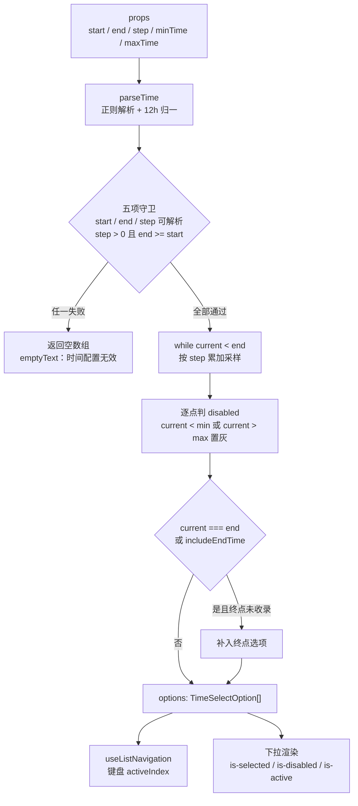
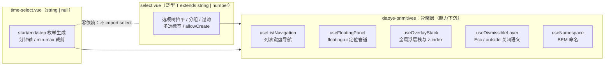

# 6-14 · TimeSelect：select 的特化

> 本篇源码坐标（均为当前工作区实态）：
> - `packages/components/time-select/src/time-select.vue`（单文件组件全文 523 行：脚本 433 行 + 模板 90 行）
> - `packages/components/time-select/src/time-select.ts`（类型与默认常量，47 行）
> - 样式：`packages/theme/src/components/time-select.css`（全文 267 行）
> - 测试：`packages/components/time-select/__tests__/time-select.spec.ts`（227 行，8 个用例）
> - 类型夹具：`tests/types/fixtures/time-select.ts`（33 行）；文档示例：`apps/docs/examples/time-select/`（6 个）
> - 出口：`packages/components/time-select/index.ts`（`XyTimeSelect` + 5 个类型导出）

上一篇 6-13《TimePicker：时间面板》拆的是"自由输入"这条时间交互路线：时分秒三列滚轮、格式约束、`disabledHours` 这类谓词式禁用回调。本篇换到另一条路线——同样是要用户给一个时间，`xy-time-select` 不给你输入框，而是先按 `start`/`end`/`step` 三个 prop 把一天切片，生成一串离散的时间点，再塞进一个下拉里让你挑。预约时段、营业窗口、配送时间这些场景里，业务能接受的时间本来就是枚举，自由输入反而制造了校验负担。

于是本篇的核心问题浮出水面：

**用枚举生成替代自由输入，换到了什么，又丢掉了什么？**

这个问题有两个层面。产品层面，枚举把"输入"降级为"选择"，值域从连续的 1440 分钟坍缩成采样网格，出错概率趋近于零，代价是用户永远选不到 19:07 这种网格外的时刻。实现层面则是本篇标题的那个词——"select 的特化"：time-select 长着一张 select 的脸，那它到底是**组合**了 select，**复制**了 select，还是别的什么姿势？这个问题的答案藏在 import 列表里，实码有定论，而且和 Element Plus 的做法恰好相反。先给结论：**交互语义上它是 select 的特化，实现路径上它是 select 的平行兄弟，两者共同踩在同一层"骨架下沉"的 primitives 上**。本篇把这个定论拆到行级。

## 一、考据先行：47 行类型层里的"域"

先看类型层全文。`time-select.ts` 只有 47 行，是全库最短的类型文件之一，但 props 的分组方式已经把组件的"域"划清了：

```ts
// packages/components/time-select/src/time-select.ts:1-47
import type TimeSelect from "./time-select.vue";
import type { Placement } from "@floating-ui/dom";
import type { ComponentSize } from "xiaoye-primitives";
import type { StyleValue } from "vue";

export type TimeSelectValueChangeHandler = (value: string | null) => void;
export type TimeSelectVisibleChangeHandler = (value: boolean) => void;

export interface TimeSelectProps {
  modelValue?: string | null;
  placeholder?: string;
  disabled?: boolean;
  clearable?: boolean;
  size?: ComponentSize;
  start?: string;
  end?: string;
  step?: string;
  minTime?: string;
  maxTime?: string;
  includeEndTime?: boolean;
  format?: string;
  validateEvent?: boolean;
  teleported?: boolean;
  appendTo?: string | HTMLElement;
  placement?: Placement;
  popperClass?: string;
  popperStyle?: StyleValue;
}

export interface TimeSelectOption {
  value: string;
  label: string;
  disabled: boolean;
  totalMinutes: number;
}

export type TimeSelectInstance = InstanceType<typeof TimeSelect>;

export const DEFAULT_PLACEHOLDER = "请选择时间";
export const DEFAULT_START = "09:00";
export const DEFAULT_END = "18:00";
export const DEFAULT_STEP = "00:30";
export const DEFAULT_FORMAT = "HH:mm";
export const DEFAULT_CLEAR_ICON = "mdi:close-circle";
export const DEFAULT_PREFIX_ICON = "mdi:clock-outline";
export const DEFAULT_SUFFIX_ICON = "mdi:chevron-down";
```

props 分三组。**值与形态**：`modelValue`、`placeholder`、`disabled`、`clearable`、`size`——和 6-15 要拆的 select 高度同构。**枚举生成**：`start`/`end`/`step` 采样三件套，加 `minTime`/`maxTime` 裁剪两件套，加 `includeEndTime` 边界开关和 `format` 格式——这八项是 time-select 独有的"数据域"。**浮层协议**：`teleported`、`appendTo`、`placement`、`popperClass`、`popperStyle`——与 select、tooltip 等浮层家族共用同一套命名（对照 4-05/4-06 两篇的浮层体系）。

两个细节值得钉死。第一，`modelValue?: string | null`——值是字符串，不是 `Date`、不是分钟数、不是泛型 `T`。select 是泛型组件（`select.vue:1` 的 `generic="T extends string | number"`），time-select 把泛型收掉了，值域固定为"格式化后的时间字符串或 null"。这是特化的第一处代价，第四节正面裁决。第二，`TimeSelectOption` 里躺着一个 `totalMinutes: number`——每个选项除了给人看的 `value`/`label`，还自带一个"自 0 点起的分钟坐标"。这个坐标是整个组件内部运算的通货：选中态比较、键盘定位、禁用判定全部走它，不走字符串。为什么？因为 `format` 会改变字符串的形态，但改变不了分钟的位置——这是"时间语义"在数据模型里留下的唯一锚点。

再和 6-13 的 time-picker 对照一眼 props 面，能看清两条路线的分工本质。time-picker 的禁用是三个**谓词回调**（`disabledHours?: () => number[]`、`disabledMinutes?: (hour: number) => number[]`、`disabledSeconds?: (hour: number, minute: number) => number[]`，见 `packages/components/time-picker/src/time-picker.ts:26-28`），调用方拿到"任意时刻"的判断权；time-select 的禁用只有 `minTime`/`maxTime` 两个**字符串边界**。自由输入的世界里禁用是谓词（域连续，只能逐点判）；枚举的世界里禁用是裁剪（域离散，画两条边界线就够）。顺带回答任务考据里的一个疑问：**time-select 没有 disabledTime prop**——那是 time-picker 家的 API，枚举世界用不上。

## 二、枚举生成器：从字符串到分钟轴

枚举生成的全流程是一条三段流水线：解析（字符串 → 分钟数）、采样（分钟轴 → 网格点）、格式化（网格点 → 展示字符串）。先看全景：



### 2.1 parseTime：38 行手写解析器

第一步是把 `"09:30"`、`"9:30 PM"` 这类字符串归一成分钟数。实码没有引入 dayjs——这是本篇第一个值得停留的选型：

```ts
// packages/components/time-select/src/time-select.vue:83-120
function parseTime(value?: string | null) {
  if (!value) {
    return null;
  }

  const normalized = value.trim();
  const match = normalized.match(/^(\d{1,2}):(\d{2})(?:\s*([AaPp][Mm]))?$/);

  if (!match) {
    return null;
  }

  let hour = Number(match[1]);
  const minute = Number(match[2]);
  const meridiem = match[3]?.toLowerCase();

  if (Number.isNaN(hour) || Number.isNaN(minute) || minute < 0 || minute > 59) {
    return null;
  }

  if (meridiem) {
    if (hour < 1 || hour > 12) {
      return null;
    }

    if (meridiem === "pm" && hour !== 12) {
      hour += 12;
    }

    if (meridiem === "am" && hour === 12) {
      hour = 0;
    }
  } else if (hour < 0 || hour > 23) {
    return null;
  }

  return hour * 60 + minute;
}
```

六段逻辑，每段都在收窄值域：正则先筛掉一切不合形态的输入（分钟必须是两位数字，所以 `"9:3"` 进不来）；`Number.isNaN` 兜住 `Number()` 的边界；无上下午标记时小时被压进 `[0, 23]`；有标记时压进 `[1, 12]`，再做 12h → 24h 的两条特判——`"12:00 pm"` 保持 720 分钟（正午不是 1440），`"12:00 am"` 归零（午夜不是 720）。归一的输出单位是"自 0 点起的分钟数"。

为什么不用 dayjs？对照 6-12《DatePicker》可以给出干净的答案。DatePicker 封装 dayjs，是因为日历面板天然要回答"这个月有几天、周几从哪开始"这类**日历语义**问题，日期库的舍入、时区、月份边界都得用上。而 time-select 的枚举生成只回答一个问题：`a + n * step` 落在 `[start, end)` 的哪些格点上。这是纯整数算术，一天就是一个 `[0, 1440)` 的整数域，引入日期库反而要先把 `"09:30"` 包成 dayjs 对象、再取 `hour() * 60 + minute()`——绕一圈回到分钟数，还背上了一个"这是哪一天"的伪语义。**枚举世界里没有日期，只有刻度**。手写 38 行，换掉了整个依赖的方向。

还有一个隐蔽的域约束值得点出：parseTime 的正则不认秒。所以 `step="00:00:30"` 这类输入会被整个判为非法，组件退回空列表。枚举域的最小粒度是分钟——这也反过来解释了为什么 time-select 不需要秒级 UI：秒在自由输入场景才有意义，枚举切片切不到那个精度。

### 2.2 formatTime：六个 token 的迷你格式化器

第二步的反向操作是把分钟数格式化回字符串：

```ts
// packages/components/time-select/src/time-select.vue:122-142
function formatTime(totalMinutes: number, pattern: string) {
  const minutes = Math.max(0, Math.min(totalMinutes, 23 * 60 + 59));
  const hour24 = Math.floor(minutes / 60);
  const minute = minutes % 60;
  const hour12 = hour24 % 12 || 12;
  const tokens: Record<string, string> = {
    HH: `${hour24}`.padStart(2, "0"),
    H: `${hour24}`,
    hh: `${hour12}`.padStart(2, "0"),
    h: `${hour12}`,
    mm: `${minute}`.padStart(2, "0"),
    A: hour24 < 12 ? "AM" : "PM",
    a: hour24 < 12 ? "am" : "pm"
  };

  return pattern.replace(/HH|H|hh|h|mm|A|a/g, (token) => tokens[token] ?? token);
}

function toValue(totalMinutes: number) {
  return formatTime(totalMinutes, props.format);
}
```

第一行就是一个防御：分钟数被钳进 `[0, 1439]`。枚举采样理论上不会越界（parseTime 已经把端点压在域内），但 `toValue` 同时被 `displayLabel` 复用去渲染**外部传入的 `modelValue`**，外部值不经过守卫，所以钳位必须放在格式化器入口。`hour24 % 12 || 12` 是 12 小时制的经典写法——0 点和 12 点都映射到 12，`||` 一石二鸟。支持的 token 只有 `HH/H/hh/h/mm/A/a` 六个，没有秒、没有时区、没有转义序列。和 time-picker 复用 dayjs `format` 的全量 token 面相比，这是"够用即停"的典型：枚举值是组件自己生成的，组件永远知道该用什么格式渲染它。

### 2.3 buildOptions：采样循环与四处边界

流水线的主舞台，也是全组件边界最密集的 48 行：

```ts
// packages/components/time-select/src/time-select.vue:144-191（末行摘自 193 行）
function buildOptions() {
  const startMinutes = parseTime(props.start);
  const endMinutes = parseTime(props.end);
  const stepMinutes = parseTime(props.step);
  const minMinutes = parseTime(props.minTime);
  const maxMinutes = parseTime(props.maxTime);

  if (
    startMinutes === null ||
    endMinutes === null ||
    stepMinutes === null ||
    stepMinutes <= 0 ||
    endMinutes < startMinutes
  ) {
    return [] as TimeSelectOption[];
  }

  const options: TimeSelectOption[] = [];
  let current = startMinutes;

  while (current < endMinutes) {
    options.push({
      value: toValue(current),
      label: toValue(current),
      disabled:
        (minMinutes !== null && current < minMinutes) || (maxMinutes !== null && current > maxMinutes),
      totalMinutes: current
    });
    current += stepMinutes;
  }

  if (props.includeEndTime || current === endMinutes) {
    const alreadyIncluded = options[options.length - 1]?.totalMinutes === endMinutes;

    if (!alreadyIncluded) {
      options.push({
        value: toValue(endMinutes),
        label: toValue(endMinutes),
        disabled:
          (minMinutes !== null && endMinutes < minMinutes) ||
          (maxMinutes !== null && endMinutes > maxMinutes),
        totalMinutes: endMinutes
      });
    }
  }

  return options;
}

const options = computed(() => buildOptions());
```

守卫五连评掉所有非法配置：任一端点解析失败、`step <= 0`（`"00:00"` 的 step 会被 parseTime 合法地解析成 0，所以必须显式拦）、`end < start`。守卫通过后进入采样循环，`while (current < endMinutes)` 是**严格小于**——循环体只产出网格上的采样点，终点是否入选由循环后的补丁块决定。禁用判定是**闭区间**语义：`current < minMinutes` 或 `current > maxMinutes` 才置灰，等于边界的时刻可用（`minTime="08:30"` 时 08:30 本身可选）。

补丁块藏着本组件最反直觉的一处语义，值得单独拆。循环退出时 `current` 有两种状态：**恰好等于 end**（step 整除区间）或**越过 end**（不整除）。`if (props.includeEndTime || current === endMinutes)` 的意思是——**step 整除时，终点默认就在选项里**（`09:00 - 18:00`、`00:30` 步长的默认配置，18:00 无需任何开关就存在）；`includeEndTime` 真正管的是**不整除**的场景：`08:00 - 12:00`、`00:45` 步长采样出 `08:00…11:45` 六个点后，补上 12:00 这个网格外的"截止时刻"。`alreadyIncluded` 判断防的是整除场景下的重复推入。所以 `includeEndTime` 的准确读法不是"包含结束时间"，而是"**把结束时间拉回选项列表，即使它不在采样网格上**"。文档示例 `apps/docs/examples/time-select/format.vue` 用的正是这个场景（`step="00:45"` + `include-end-time`），而测试 `time-select.spec.ts:61-91` 的用例用的是整除场景（`08:00→09:00`、`00:30`），两者恰好各覆盖一半语义。

还有两个隐性边界没有 if 分支，靠算术自然成立。其一，`start === end` 时守卫放行（只有 `<` 判非法）、循环不执行、补丁块推入唯一一项——**起止相同得到单选项**，不需要特判。其二，`minTime`/`maxTime` 只置灰不删点，被裁掉的时段仍以禁用态出现在列表里。这也是一个权衡：删点可以让下拉更短，但时间轴的"空间感"就断了——用户看不到"08:00 到 08:30 之间被禁止了"，只能看到选项莫名少了一截；置灰保留了刻度的连续性，代价是极端配置下列表可能大面积灰化（文档示例 `range.vue` 里开始/结束互相约束时，两个下拉各自灰掉半壁，反而成了最好的可视化）。

配置非法时空列表也有出口。`time-select.vue:203-219` 的 `emptyText` 区分两种空：

```ts
// packages/components/time-select/src/time-select.vue:203-219
const emptyText = computed(() => {
  const startMinutes = parseTime(props.start);
  const endMinutes = parseTime(props.end);
  const stepMinutes = parseTime(props.step);

  if (
    startMinutes === null ||
    endMinutes === null ||
    stepMinutes === null ||
    stepMinutes <= 0 ||
    endMinutes < startMinutes
  ) {
    return "时间配置无效";
  }

  return "暂无可选时间";
});
```

守卫条件与 `buildOptions` 逐字相同，重复了一遍——这不是偷懒，是**错误可诊断性**的刻意为之：`buildOptions` 的空数组是数据结论（没有合法格点），`emptyText` 把"为什么空"翻译给用户看。"暂无可选时间"留给一个理论上存在的场景（配置合法但全被 min/max 裁掉的极端情况其实仍会显示禁用点，所以这条文案主要是兜底），而"时间配置无效"是给开发者的报错信号——枚举生成器的输入是声明式字符串，拼错了没有编译器拦你，下拉面板就是唯一的运行时错误面板。

至此可以正面裁决**权衡一：枚举 vs 自由输入**。枚举换到的是三样东西：值域受控（不可能选到 23:61 或 19:07，校验在生成端就完成了）、交互零成本（点选替代键入，移动端尤其友好）、声明式配置（`start`/`end`/`step` 三个字符串就是全部业务规则）。丢掉的也是三样：网格外的时刻（19:07 永远选不到，粒度被 step 锁死）、秒级精度（域里根本没有秒）、以及"配置即运行时契约"的脆弱性（字符串写错不报错，只收获一个空下拉——本节的 emptyText 就是为这个脆弱性付的保险费）。产品分工因此清晰：预约、营业窗口这类"业务本来就枚举"的场景用 time-select；打卡、排班这类"用户真的有任意时刻要表达"的场景用 time-picker。文档页 `apps/docs/components/time-select.md:9` 的导语把这条分工线写得直白："当你需要自由输入时分秒时用 `xy-time-picker`"。

## 三、实码定论："特化"的三种姿势与本库的选择

现在回答标题的问题。time-select 长着 select 的交互脸——trigger + 下拉 + 选项列表 + 键盘导航 + 清空按钮。业界对这种"特化"有三种实现姿势：**组合**（外层组件模板里渲染内层组件，Element Plus 的做法）、**复制**（把 select 源码抄一份改数据源）、**下沉**（把两者的共同骨架抽到基础设施层，各自平行实现）。本库选了第三种，证据直接写在 import 列表里：

```ts
// packages/components/time-select/src/time-select.vue:4-14
import {
  useConfig,
  useDismissibleLayer,
  useFloatingPanel,
  useListNavigation,
  useNamespace,
  useOverlayStack
} from "xiaoye-primitives";
import XyIcon from "../../icon";
import { formKey, formItemKey } from "../../form/src/context";
import { setPathValue } from "../../form/src/utils";
```

整个文件没有任何一行 `import ... from "../../select"`。再看 select 那边，`select.vue:4-11` 的 import 列表与上面第一段**逐字相同**——同一组六个 primitives 组合式函数。两组件的关系画出来是这样的：



所以实码定论是：**不是组合，不是复制，是"骨架下沉 + 平行实现"**。select 和 time-select 是兄弟，不是父子；它们共享的不是代码文本，而是被抽成 composables 的**能力**——键盘导航、浮层定位、浮层栈、关闭语义、命名空间。差异被压缩到各自的"数据域"里：select 的数据域是选项树（`allOptions` 拍平分组、`groupedOptions` 过滤、`createdOption` 允许创建，见 `select.vue:120-260`），time-select 的数据域是分钟轴（`buildOptions` 一段）。

这个姿势和 Element Plus 恰好是两极。EP 的 `time-select` 把 `el-select` 直接写进模板当根节点，选项由 computed 生成后交给 `el-option` 渲染——外层组件只剩枚举生成逻辑，其余一切（clearable、popper、键盘、过滤）都是组合白得的。两种姿势的账本摊开对比，就是本篇**权衡二：特化方式的选择**：

- **EP 组合式**：复用粒度是"组件实例"。白得的是 el-select 的全部交互面——包括 filterable（搜索枚举时间点）、loading 态、插槽定制选项；付出的是三层代价：交互面被动的全盘继承（time-select 无辜地长出了"可创建条目"这类语义怪兽的接口面）、样式耦合（要改 time-select 的下拉就得穿透 el-select 的类名体系）、以及一层组件实例的渲染开销。
- **本库下沉式**：复用粒度是"函数"。白得的是六个 composable 的行为一致性（select 和 time-select 的开关浮层、键盘循环、Esc 语义逐行为一致，因为代码就是同一份）；付出的是模板与脚本骨架的一次性重写——`time-select.vue` 的 433 行脚本里，浮层管理、键盘分发、表单接线约 200 行与 select 平行同构，每个新的"类 select"组件都要再写一遍这份骨架。

选择下沉式的深层动机藏在第五卷到第六卷的组件谱系里：本库的类 select 面孔远不止两张——auto-complete、cascader、tree-select、date-picker 的面板……如果走组合路线，每张面孔都要携带一个完整 select 实例及其全部 props 透传；走下沉路线，每张面孔只 import 六个函数。**组合让特化组件绑定 select 的实现，下沉让特化组件只绑定 select 的契约**。代价同样真实：本篇读到的 selectOption、closeDropdown 若有 bug，修复不会自动传导（不像组合式改一处 el-select 即全体生效），一致性靠 primitives 的单元测试和 4-04 篇讲过的"受控双模"约定来维持。

下沉的另一处收获在选中态定位的语义里。对比两个组件的 `syncActiveIndex`——select 用 `optionSelected(item)`（值 Set 查询，`select.vue:347-358`），time-select 用的是：

```ts
// packages/components/time-select/src/time-select.vue:226-237
function syncActiveIndex() {
  const index = options.value.findIndex(
    (option) => option.totalMinutes === selectedMinutes.value && !option.disabled
  );

  if (index >= 0) {
    navigation.setActiveIndex(index);
    return;
  }

  navigation.activateFirst();
}
```

定位的比较基准是 `totalMinutes`（分钟数）而不是 `value`（字符串）。原因在第一节埋过：`format` 改变字符串形态。用户外部传入 `modelValue="09:00"`、组件配置 `format="hh:mm A"` 时，选项列表里的字符串是 `"09:00 AM"`——按 value 等值比较永远失配，按分钟坐标 540 一击命中。**时间语义就是靠这个字段在特化组件里"活"下来的**：如果当初走 EP 的组合路线，选项比较只能走 el-select 的 value 等值，这个 format 无关的定位逻辑反而没地方写。这是"丢失时间语义"风险的一个精巧反例——下沉姿势不是丢掉语义，而是给语义留了一块自留地。

当然也确实丢了东西，而且丢得坦然：time-select 没有 `searchable`。EP 组合式白得的 filterable，在枚举场景价值存疑——默认 `09:00-18:00`、`00:30` 步长只有 19 个选项，键盘上下键几秒就能走完；但极端配置（`00:05` 步长铺满全天 288 项）时搜索确有价值。本库的裁决是：为 1% 的极端配置引入搜索输入框（trigger 要从 button 变 input、键盘焦点模型要分叉、过滤态与禁用态要叠加），不如让极端配置退回 time-picker。枚举的适用域本来就是"短列表"，列表长到需要搜索时，枚举本身已经选错了。

## 四、值语义：字符串即值，格式即契约

枚举生成器产出选项，选择行为则定义值的生命周期。先看选择与清空的完整实码：

```ts
// packages/components/time-select/src/time-select.vue:294-325
async function selectOption(option: TimeSelectOption) {
  if (option.disabled) {
    return;
  }

  selectedValue.value = option.value;
  syncFormModel(option.value);
  formItem?.clearValidate();
  emit("update:modelValue", option.value);
  await nextTick();
  emit("change", option.value);
  await closeDropdown(false, true);

  if (props.validateEvent) {
    await formItem?.validate("change");
  }
}

async function clearValue(event: MouseEvent) {
  event.preventDefault();
  event.stopPropagation();
  selectedValue.value = null;
  syncFormModel(null);
  emit("update:modelValue", null);
  await nextTick();
  emit("change", null);
  emit("clear");

  if (props.validateEvent) {
    await formItem?.validate("change");
  }
}
```

两段的事件时序是严格的四拍：**写本地镜像 → 回写表单模型 → 发 update:modelValue → nextTick 后发 change**。`change` 的延后一拍是全库受控组件的统一约定（对照 6-02《Input》）：给父组件的 v-model 处理器留出在"值已生效"的世界里执行副作用的时间窗。`syncFormModel`（`time-select.vue:239-245`）用 `setPathValue` 直接把值写进 `form.props.model` 的对应路径——这是 4-08 篇拆过的表单联动协议，time-select 作为消费方照章办事；`clearValidate` 在写入前调用，把上一次校验的错误态先擦掉再触发新一轮 validate，避免"错误消息闪一下才消失"的视觉抖动。清空路径多一个 `clear` 事件、且 `change(null)` 与 `clear` 并发发出——消费方想监听"人为清空"这个语义就用 `clear`，想统一走值变更管线就用 `change`。

值的**类型**才是这一节的主角。`modelValue` 是字符串，而且**它的形态由 `format` 决定**：默认 `HH:mm` 时值是 `"09:30"`，配置 `format="hh:mm A"` 后选择 9 点半回传的就是 `"09:00 AM"`——测试 `time-select.spec.ts:90` 明确断言了这一点。这就是**权衡三：字符串即值**。它意味着 `format` 不是纯显示层配置，而是值契约的一部分：调用方改 format，等于改了组件对外的数据协议。这个设计的得与失都源于同一处——

- **得**：往返零损耗。`v-model` 绑定的字符串直接进数据库、直接拼进文案、直接作为 `disabled` 不可选的 label 展示，调用方永远不需要在 `Date` 与字符串之间搬运格式。对比 EP：el-time-select 的值恒为 `HH:mm` 字符串，format 只影响面板展示——本库把这两者合一了，换来了"展示即存储"的直观，也把 12 小时制值（`"09:00 AM"`）合法化了。
- **失**：机器可读性。拿 `"09:00 AM"` 做时间运算的调用方得自己再解析一遍（本组件提供了 `parseTime` 但没有导出）；两个 time-select 之间做区间比较（示例 `range.vue` 的开始/结束联动）比较的其实是同格式字符串的字典序——在 `HH:mm` 下恰好与时间序一致，在 12 小时制下字典序依然成立（`"09:00 AM" < "10:00 AM"`），这是 format 面被严格限定在六个 token 之外的隐性收益，但依赖它终究是脆弱的。

显示层对这种"格式失配"还有一个精巧的兜底。`displayLabel`（`time-select.vue:196-202`）的实现是 `toValue(parseTime(selectedValue))`——先解析成分钟，再按当前 format 重新格式化。于是外部传入 `"09:00"`、format 为 12 小时制时，trigger 上显示的是 `"09:00 AM"`：**解析-重格式化让任意可解析的外部值都被"翻译"进当前格式语言**，而 `modelValue` 本体保持原样不动，直到用户下一次点选。值的真相与显示的真相在这里正式分家，选中态高亮靠分钟坐标（模板 `time-select.vue:505` 的 `option.totalMinutes === selectedMinutes`），显示靠重格式化，两者互不踩脚。

## 五、骨架复用：浮层、键盘与关闭语义

第三节说"骨架下沉"，这一节看下沉后的骨架在本组件里的用法。开关浮层的一段与 select 几乎逐行同构：

```ts
// packages/components/time-select/src/time-select.vue:247-283
async function openDropdown() {
  if (props.disabled || open.value) {
    return;
  }

  open.value = true;
  emit("visibleChange", true);
  emit("focus");
  openLayer();
  syncActiveIndex();

  await nextTick();
  await updatePosition();
  startAutoUpdate();
}

async function closeDropdown(shouldValidate = false, restoreFocus = false) {
  if (!open.value) {
    return;
  }

  open.value = false;
  emit("visibleChange", false);
  emit("blur");
  stopAutoUpdate();
  closeLayer();
  navigation.setActiveIndex(-1);

  if (restoreFocus) {
    await nextTick();
    triggerRef.value?.focus();
  }

  if (shouldValidate && props.validateEvent) {
    await formItem?.validate("blur");
  }
}
```

开面板的次序是"状态先行，定位殿后"：先翻开 `open`、上浮层栈（`openLayer` 拿到全局 z-index 并压栈，4-05 篇的三态状态机在此落地），`syncActiveIndex` 把键盘焦点对准当前选中项（选中项被禁用时退回第一可用项——这正是上一节 `syncActiveIndex` 里 `!option.disabled` 条件的用武之地），然后等 DOM 挂载再 `updatePosition` + `startAutoUpdate` 持续追踪。与 select 有一处小差异：select 打开后要多做一步 `focusSearchInput()`（`select.vue:383`），time-select 没有 search 输入框，焦点从头到尾钉在 trigger 上——键盘模型因此更简单。

键盘分发是骨架复用的重头，59 行的 switch 全文如下：

```ts
// packages/components/time-select/src/time-select.vue:327-385
async function handleKeydown(event: KeyboardEvent) {
  if (props.disabled) {
    return;
  }

  switch (event.key) {
    case "ArrowDown":
      event.preventDefault();
      if (!open.value) {
        await openDropdown();
      } else {
        navigation.moveNext();
      }
      break;
    case "ArrowUp":
      event.preventDefault();
      if (!open.value) {
        await openDropdown();
      } else {
        navigation.movePrev();
      }
      break;
    case "Home":
      event.preventDefault();
      if (!open.value) {
        await openDropdown();
      }
      navigation.activateFirst();
      break;
    case "End":
      event.preventDefault();
      if (!open.value) {
        await openDropdown();
      }
      navigation.activateLast();
      break;
    case "Enter":
    case " ":
      event.preventDefault();
      if (!open.value) {
        await openDropdown();
        break;
      }

      if (activeOption.value) {
        await selectOption(activeOption.value);
      }
      break;
    case "Escape":
      event.preventDefault();
      await closeDropdown(true, true);
      break;
    case "Tab":
      await closeDropdown(true);
      break;
    default:
      break;
  }
}
```

纯粹的移动键（上下/Home/End）只调 `navigation.*`，纯粹的语义键（Esc/Tab）只调 `closeDropdown`，复合键（方向键、Enter 在关闭态）负责"先开面板"。真正的键盘智慧在 `useListNavigation` 内部——骨架层的那 80 行：

```ts
// packages/xiaoye-primitives/src/composables/use-list-navigation.ts:18-49
  function findEnabledIndex(startIndex: number, step: 1 | -1) {
    const currentItems = items();
    const total = currentItems.length;

    if (!total) {
      return -1;
    }

    let index = startIndex;

    for (let count = 0; count < total; count += 1) {
      if (options.loop) {
        if (index < 0) {
          index = total - 1;
        } else if (index >= total) {
          index = 0;
        }
      }

      if (index < 0 || index >= total) {
        return -1;
      }

      if (!currentItems[index]?.disabled) {
        return index;
      }

      index += step;
    }

    return -1;
  }
```

`loop: true` 让方向键在列表两端环绕（首项按上键跳到末项），for 循环以 `total` 为上界保证**跳过整段连续禁用区**时最多扫描一圈必然停机。这个"跳过禁用"的能力在 time-select 里被 min/max 裁剪放到了最大：开始/结束联动场景（示例 `range.vue`）里，开始时间下拉的后半段整段禁用，键盘 Down 键会一路穿过灰色选项直达第一个可用格点——视觉上的"大面积灰化"没有变成键盘的沼泽。这正是第二节"置灰不删点"那个权衡的键盘侧配平：删点让键盘轻松但丢掉空间感，置灰保留空间感但把跳转成本转给了 `findEnabledIndex` 的循环。

关闭语义由 `useDismissibleLayer`（`time-select.vue:416-425`）接管，onDismiss 回调按 reason 分流：`outside` 关闭走 `closeDropdown(true, false)`（触发 blur 校验、不回焦——用户点别处去了，焦点本就该跟过去）；`escape` 走 `closeDropdown(true, true)`（触发 blur 校验并回焦 trigger——Esc 是"取消我的浏览"而非"离开这个控件"）。Tab 单独在 handleKeydown 里走 `closeDropdown(true)` 不回焦，焦点自然移交下一个 tab 位。三种关闭路径三种焦点归宿，全部对齐 4-06 篇定下的关闭语义协议。

无障碍树的接线在模板里一次成型：

```html
<!-- packages/components/time-select/src/time-select.vue:445-457 -->
    <div
      ref="triggerRef"
      class="xy-time-select__trigger"
      role="combobox"
      :tabindex="props.disabled ? -1 : 0"
      :aria-expanded="open"
      :aria-controls="listboxId"
      :aria-activedescendant="open && navigation.activeIndex.value >= 0 ? `${listboxId}-${navigation.activeIndex.value}` : undefined"
      :aria-describedby="formItem?.message.value ? formItem.messageId : undefined"
      :aria-invalid="formItem?.validateState.value === 'error'"
      @click="toggleDropdown"
      @keydown="handleKeydown"
    >
```

combobox + listbox + `aria-activedescendant` 的三件套（对照 4-10 篇 select 的同款模型）：trigger 持有焦点，下拉里的每个选项渲染为 `role="option"` 且以 `listboxId-${index}` 注册 id，键盘 active 项通过 `aria-activedescendant` 广播给读屏器——焦点不必真的移进下拉，6-13 篇 time-picker 那种"焦点在三个滚轮之间搬家"的复杂度在这里完全不存在。选项按钮还叠了 `:disabled="option.disabled"` 原生禁用（模板 `time-select.vue:510`），置灰语义对鼠标与辅助技术同时成立。

最后看一个容易漏掉的反应式细节。`time-select.vue:403-414` 有一个七元 watch：

```ts
// packages/components/time-select/src/time-select.vue:403-414
watch(
  () => [props.start, props.end, props.step, props.minTime, props.maxTime, props.includeEndTime, props.format],
  async () => {
    if (!open.value) {
      return;
    }

    syncActiveIndex();
    await nextTick();
    await updatePosition();
  }
);
```

枚举配置是响应式的——面板开着的时候改 `minTime`，选项列表即时重算（`options` 本来就是 computed），键盘 active 重新定位、浮层尺寸重新测量。`if (!open.value)` 的短路说明作者考虑过成本：关闭态下重算 active 索引毫无意义（`activeIndex` 已是 -1），定位更新也只会浪费一次 floating-ui 计算。这个 watch 让"开始/结束联动"的示例在运行时改约束成为可能，而不只是初始化时生效。

## 六、样式、测试与文档：特化的外围防线

样式层 `packages/theme/src/components/time-select.css` 有一个值得单独指出的结构——下拉面板的三级变量回退链：

```css
/* packages/theme/src/components/time-select.css:147-161 */
.xy-time-select__dropdown {
  --xy-time-select-dropdown-bg-resolved: var(
    --xy-time-select-dropdown-bg,
    var(
      --xy-popper-bg,
      var(--xy-dialog-bg, color-mix(in srgb, var(--xy-bg-floating) 98%, var(--xy-bg-subtle)))
    )
  );
  --xy-time-select-dropdown-border-resolved: var(
    --xy-time-select-dropdown-border,
    var(
      --xy-popper-border-color,
      color-mix(in srgb, var(--xy-border-subtle) 88%, var(--xy-border))
    )
  );
```

四层回退：组件私有变量（`--xy-time-select-dropdown-bg`）→ 浮层家族公共变量（`--xy-popper-bg`）→ 弹窗级变量（`--xy-dialog-bg`）→ 令牌兜底。组件自己不拍板颜色，只搭好"谁可以覆盖我"的插销座。这与文档页 `apps/docs/components/time-select.md` 的"实例级样式收口"指南互为表里：后台项目想统一收口时间下拉的观感，正确路径是在上层定义 `--xy-popper-bg` 一类家族变量一次生效全家，而不是 deep 穿组件类名。`is-error` 态只有一条规则（`.xy-time-select.is-error .xy-time-select__trigger { border-color: var(--xy-danger); }`，`time-select.css:264-266`）——错误视觉全部委托表单体系的状态类，组件自己不持有校验逻辑。

测试 227 行 8 个用例，覆盖面恰好沿着本篇的叙述线铺开：打开与选择（`spec.ts:28-46`，断言首个选项值就是 `DEFAULT_START` 生成的 `"09:00"`）、枚举与裁剪联合用例、浮层容器与定位、teleport 开关、清空、非法值、expose 与表单校验。最浓缩的是枚举三件套 + format 的联合断言：

```ts
// packages/components/time-select/__tests__/time-select.spec.ts:61-91
  it("支持 minTime/maxTime、includeEndTime 和 format", async () => {
    const wrapper = mountTimeSelect(XyTimeSelect, {
      attachTo: document.body,
      props: {
        start: "08:00",
        end: "09:00",
        step: "00:30",
        minTime: "08:30",
        maxTime: "09:00",
        includeEndTime: true,
        format: "hh:mm A"
      }
    });

    await wrapper.find(".xy-time-select__trigger").trigger("click");

    const options = [...document.body.querySelectorAll(".xy-time-select__option")] as HTMLButtonElement[];

    expect(options.map((option) => option.textContent?.trim())).toEqual([
      "08:00 AM",
      "08:30 AM",
      "09:00 AM"
    ]);
    expect(options[0]?.disabled).toBe(true);
    expect(options[2]?.disabled).toBe(false);

    options[2]?.click();
    await nextTick();

    expect(wrapper.emitted("update:modelValue")?.[0]).toEqual(["09:00 AM"]);
  });
```

九行断言同时钉死了四件事：12h 格式渲染（`"08:00 AM"`）、min 边界的闭区间禁用（08:00 灰、08:30 可用——等于边界不禁）、max 边界同语义（09:00 可选）、以及**值跟随 format**（`update:modelValue` 收到 `"09:00 AM"` 而非 `"09:00"`）。一个用例当四篇文档用。非法值的防御也有专测（`spec.ts:150-162`）：`modelValue="invalid"` 时 trigger 显示 placeholder、无清空按钮——`hasSelectedValue` 靠 `parseTime` 的返回值而非字符串真值判断，垃圾输入被天然解释为"未选择"。

类型夹具 `tests/types/fixtures/time-select.ts` 33 行，正面断言一遍合法 props 形态，再用两条 `@ts-expect-error` 钉死 `modelValue: 930`（数字不是字符串）与 `includeEndTime: "true"`（字符串不是布尔）两条红线。文档示例 6 个（basic / range / format / form / controlled / methods），其中 `range.vue` 是枚举裁剪的产品级示范：

```vue
<!-- apps/docs/examples/time-select/range.vue:11-34 -->
  <div class="xy-doc-stack">
    <div style="width: 420px; max-width: 100%">
      <xy-form :model="model" label-width="88px">
        <xy-form-item label="开始时间">
          <xy-time-select
            v-model="model.startAt"
            clearable
            end="21:00"
            step="00:30"
            :max-time="model.endAt ?? undefined"
          />
        </xy-form-item>
        <xy-form-item label="结束时间">
          <xy-time-select
            v-model="model.endAt"
            clearable
            start="09:00"
            end="22:00"
            step="00:30"
            include-end-time
            :min-time="model.startAt ?? undefined"
          />
        </xy-form-item>
      </xy-form>
    </div>
```

开始项的 `max-time` 绑结束项的当前值、结束项的 `min-time` 绑开始项的当前值——两个枚举域互相裁剪，响应式 watch（第五节那个七元 watch）保证运行时改值即时生效。业务上"结束不能早于开始"这条校验规则，被枚举生成器在 UI 层直接消灭了：用户根本选不出非法组合。这是枚举路线最漂亮的一次亮相——**最好的校验是让非法值不存在**。

## 七、收束：枚举的边界，特化的边界

拆完 523 行，把本篇的三个定论钉在结尾：

1. **枚举生成是一条"字符串 → 分钟轴 → 字符串"的纯算术流水线**。parseTime 手写 38 行替代 dayjs，因为枚举世界只有刻度没有日期；`while (current < end)` 采样加补丁块收尾，`includeEndTime` 的真实语义是"把网格外的终点拉回列表"；非法配置收获的不是报错而是双文案空态——声明式 API 的运行时保险。
2. **"select 的特化"是语义特化，不是代码特化**。与 EP 的组合式（el-select 写进模板）相反，本库走"骨架下沉 + 平行实现"：六个 primitives composables 是两个组件共享的全部，select 的选项树与 time-select 的分钟轴互不越界；`totalMinutes` 字段让时间语义在特化组件里保留了一块自留地，代价是骨架的平行重写。
3. **字符串即值，格式即契约**。`format` 同时决定显示与回传形态，选中态靠分钟坐标、显示靠解析-重格式化双轨并行；枚举的适用域是"业务本来就可枚举的短列表"，列表长到需要搜索，就该回 time-picker。

下一篇 6-15《Select：泛型浮层受控组件》，我们回到这张"脸"的原型本身：`generic="T extends string | number"` 的泛型链路怎么从 props 一路穿到 emit，选项树如何拍平成 `FlatSelectOption`，还有那个被大纲称为"巨型键盘 switch"的 400 行键盘分发——4-10 篇从类型视角看过的样本，这次拆它作为组件的全部血肉。枚举与自由、特化与原型，两张面孔将在那里合流。
