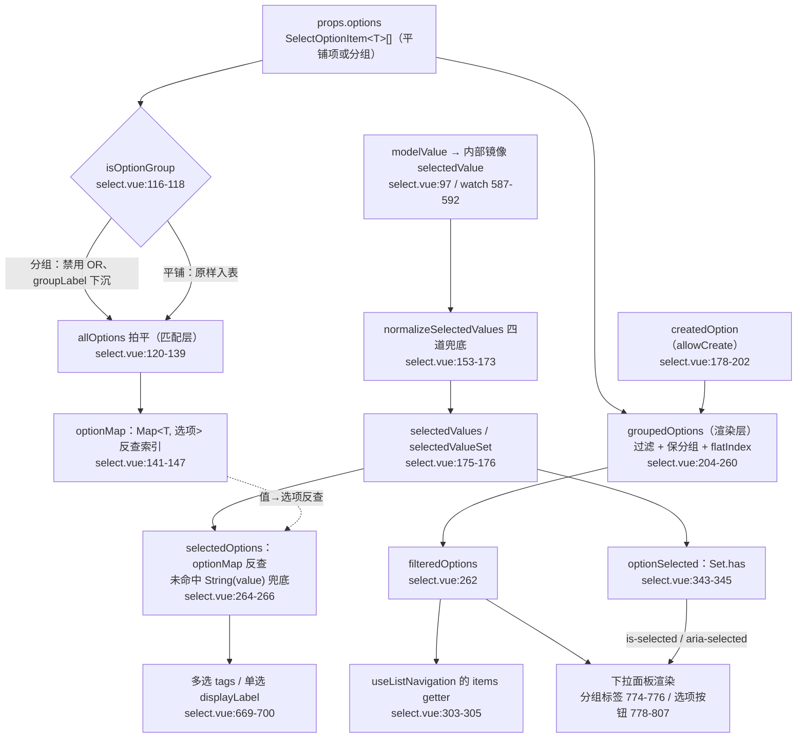
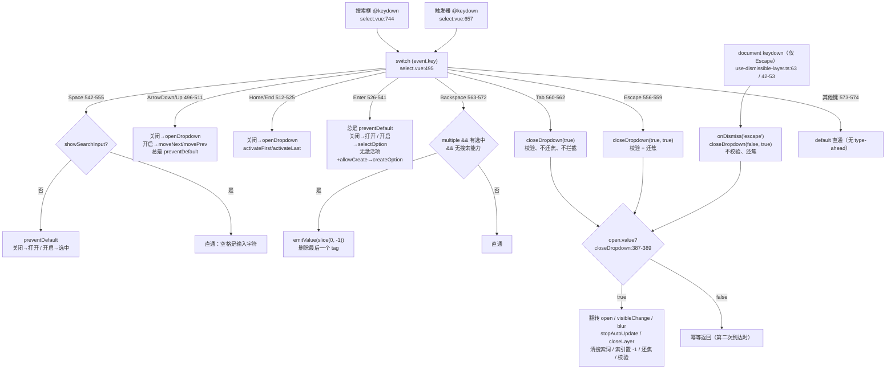
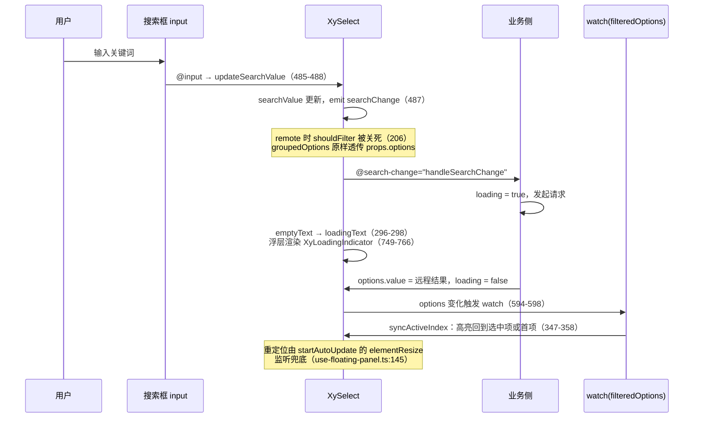

# 6-15 · Select：泛型浮层受控组件

> 本篇是「表单组件」章节的第十五篇，研究对象是 `select`——全仓库表单控件的"选项类"坐标原点。它的泛型链路，4-10 已经以它为标本讲透了：`generic="T"` 如何贯穿 props、事件、插槽与实例四条链路（4-10 引过 `select.vue:1-32/64-82/116-147/178-202/204-262/264-268/418-450/620-625/778-807` 与 `select.ts:5-27/29-68`、类型夹具全文）。本篇做另一件事：把同一份源码里**泛型之外的全部工程编排**展开——一份 `options` 数组如何两次投影成"匹配层"与"渲染层"；多选 tags 区的折叠算法；那个 87 行、九类按键的**巨型键盘 switch**；过滤（searchable）与远程（remote）为什么必须互斥；清空按钮与下拉箭头的双图标互换；以及下拉面板"不用"滚动条组件的样式克制。所有路径与行号均在当前工作区逐一核对（`select.vue` 实态 825 行、`select.ts` 72 行、`select.css` 343 行、测试 537 行 22 用例）；两张核心 mermaid 图，一张选项数据流，一张键盘路由。

---

## 一、拍平的选项模型：一份 options 数组撑起整台机器

### 1.1 与 el-option 注册模式的分野，产品角度再论证一遍

4-10 从泛型的角度下过结论：本库的选项是 `select` 内联渲染的 `<button role="option">`，与 EP 的 `el-option` 子组件注册模式是"相反的内联渲染"。本篇从产品与数据的角度把这笔账重新算一遍，因为它直接决定了后面所有管线的形状。

EP 2.x 的经典用法是结构化的：`<el-select>` 里写 `<el-option label value>`、分组用 `<el-option-group>`，选项集合靠子组件 mount/unmount 时向父级注册（provide/inject 协议）动态累积。这套模型的表达力很强——每个选项是一个真实的组件实例，可以塞任意内容、挂独立事件、按选项粒度做 class 定制；代价也真实存在：**选项集合成了运行时累积的状态**，动态增删选项的注册时序、嵌套结构的收集顺序都是潜在出错面，而"选项的值"在类型上始终是宽泛的。

本库的答案是把选项降回**纯数据**：`options: SelectOptionItem<T>[]` 一个 prop（`select.ts:31`），分组不是组件嵌套而是数据嵌套（`SelectOptionGroup` 就是 `{ label, options, disabled? }`，`select.ts:5-9`）。类型协议 4-10 已逐个讲过（原始形态 `SelectOption`、入口联合 `SelectOptionItem`、渲染形态 `FlatSelectOption`、值形态 `SelectValue`、出口形态 `SelectOptionSlotProps` 五种命名），这里只回指一句：**数据的归数据，渲染的归渲染**。中后台场景里九成的下拉需求就是"label + value + 禁用 + 分组 + 描述"，拍平模型让这九成需求一行数据写完——文档示例 `apps/docs/examples/select/basic.vue:8-12` 的三个状态选项、`search.vue:5-9` 的三个带描述的角色选项都是这个形状；剩下的一成深度定制，由 `option` 作用域插槽（`select.vue:796-806`，4-10 引过渲染段）承接，将来更复杂的树形选择交给 6-16 的 `tree-select`。

更隐蔽的收益在**测试与泛型**两侧。测试直接 `mount(XySelect, { props: { options: [...] } })`（`select.spec.ts:72-92`，4-10 引过），不需要先渲染 32 个子组件再断言收集结果；泛型侧，4-10 的定论是"选项渲染从头到尾在同一个组件作用域里，`T` 不需要跨组件边界再校订一次"——注册模式下每个 `el-option` 都是一次类型断点。

**权衡一（拍平模型 vs 注册模式）：** 拍平把"选项集合"从运行时累积状态变成 props 的纯投影——无注册时序、无收集协议、`T` 单向贯穿，代价是放弃选项粒度的组件级定制（不能在单个选项上挂任意结构，只能走插槽的内容替换）。本库的判断是：选项级定制的长尾需求由插槽覆盖，注册协议的维护成本则每次都要付，所以选拍平。这与 5-04《Breadcrumb》的注册模式正好构成光谱两端——面包屑的子项天然是声明式结构，注册是唯一自然解；select 的子项天然是数据，注册是负资产。**模式跟着数据形状走，不跟着组件家族走。**

### 1.2 一份数据，两次投影

拍平不是拍一次，是拍两次，两次的目的地不同。先看管线起点（`select.vue:116-147`——4-10 从泛型变形的角度引过同一段，这里换数据流的视角复述）：

```ts
function isOptionGroup(option: SelectOptionItem<T>): option is SelectOptionGroup<T> {
  return Array.isArray((option as SelectOptionGroup<T>).options);
}

const allOptions = computed(() => {
  const flattened: Array<Omit<FlatSelectOption<T>, "flatIndex">> = [];

  props.options.forEach((item) => {
    if (isOptionGroup(item)) {
      item.options.forEach((option) => {
        flattened.push({
          ...option,
          disabled: Boolean(item.disabled) || Boolean(option.disabled),
          groupLabel: item.label
        });
      });
      return;
    }

    flattened.push(item);
  });

  return flattened;
});

const optionMap = computed(() => {
  const map = new Map<T, Omit<FlatSelectOption<T>, "flatIndex">>();
  allOptions.value.forEach((option) => {
    map.set(option.value, option);
  });
  return map;
});
```

第一次投影：`allOptions` + `optionMap`，服务**匹配**。组级 `disabled` 与选项级 `disabled` 做或运算下沉到每一项，`groupLabel` 同步下沉——从此匹配层看不见"分组"这个概念，只有一张平表；`optionMap` 把 `value → option` 的反查做成 `Map<T, ...>`，`string | number` 约束在这里兑现成键类型（4-10 讲过这是四件事的最小公共能力集之一）。注意类型上的细节：两张表的元素都是 `Omit<FlatSelectOption<T>, "flatIndex">`——**匹配层没有渲染序号**，`flatIndex` 只属于渲染层。

第二次投影：`groupedOptions` + `filteredOptions`（`select.vue:204-262`，4-10 引过全段，本篇第五节只摘它头部那行互斥开关），服务**渲染**。它在 props.options 上重新遍历（而不是复用 allOptions），把分组结构**保留**下来（组标签要单独渲染成 `xy-select__group-label`，`select.vue:774-776`），同时给每个可见选项发一个单调递增的 `flatIndex`——键盘导航与 `aria-activedescendant` 都认这个序号。

为什么明知 allOptions 已经拍平过，渲染层还要重新走一遍？因为两次投影的**形状契约不同**：匹配层要"无分组的平表 + O(1) 反查"，渲染层要"保分组结构 + 稳定渲染序号"。如果渲染层复用 allOptions，分组标签就丢了；如果匹配层直接用 filteredOptions，过滤会把"值还在 options 里但被关键词滤掉"的选项从反查表里删掉——已选中值的回显会莫名变成 `String(value)` 兜底。**两次投影是一次刻意的冗余，用一遍遍历的成本换两条管线互不污染。**

完整的选项数据流收进第一张主图：



这张图里两条支路的交汇点值得划重点：**渲染层决定"能看到什么"，匹配层决定"算得对不对"**。点击选项走渲染层（`selectOption` 拿到的是 `FlatSelectOption<T>`，4-10 引过 424-450 的载荷车间）；回显选中态走匹配层（`optionSelected` 用 `Set.has`，与渲染序号无关）。两条路只在 `flatIndex` 上握手——导航激活态（`is-active`）需要它，选中态不需要。

---

## 二、值的匹配与宽容：normalizeSelectedValues 的四道兜底

泛型保证了 `modelValue` 的**类型**正确，但运行时它还有一整层**语义**要校订：`null`、`undefined`、空字符串、误传的数组、options 还没异步到达的悬空值……这些都不是类型错误，却直接决定触发器显示什么、clear 按钮在不在。管这件事的是 `normalizeSelectedValues`（`select.vue:149-176`）：

```ts
function isEmptySingleValue(value: T | null | undefined) {
  return value == null || (value === "" && !optionMap.value.has(value as T));
}

function normalizeSelectedValues(value: T | T[] | null | undefined): T[] {
  if (props.multiple) {
    return Array.isArray(value) ? value : value == null ? [] : [value];
  }

  if (Array.isArray(value)) {
    const [firstValue] = value;

    if (firstValue === undefined || isEmptySingleValue(firstValue as T | null | undefined)) {
      return [];
    }

    return [firstValue];
  }

  if (isEmptySingleValue(value)) {
    return [];
  }

  return [value as T];
}

const selectedValues = computed<T[]>(() => normalizeSelectedValues(selectedValue.value));
const selectedValueSet = computed(() => new Set(selectedValues.value));
```

四道兜底逐条对账：

1. **多选的标量纠偏**：`multiple` 下传了裸值而不是数组，包成 `[value]`；`null`/`undefined` 归一为 `[]`——下游 `selectedOptions.map` 永远不用判空。测试 `select.spec.ts:440-467`（`modelValue: undefined` 时 tags 显示 placeholder、选择后 emit `[["admin"]]`）与 469-481（显式 `null` 同样兜底）把这条钉死。
2. **单选的数组纠偏**：反方向误传数组时取首项，且首项为 `undefined` 或空值时归 `[]`。
3. **空串的语义仲裁**：`isEmptySingleValue` 是全段最讲究的一行——`value === ""` **不一定**是空，取决于选项表里有没有 `value: ""` 的选项。有，它是一个合法的选中值；没有，它按未选择处理。这个仲裁直接传导到 UI：测试 `select.spec.ts:150-167` 锁定"`modelValue: ""` 且无对应选项 → clear 按钮不存在、显示 placeholder"；169-186 锁定"存在 `value: ""` 的选项 → clear 按钮存在、显示『未分类』"。空串是不是空，**由数据说了算，不由类型说了算**。
4. **悬空值放行**：值不在 `optionMap` 里（options 异步未到、或外部塞了选项外的值）不报错也不丢弃，保留在 `selectedValues` 里——回显由 `selectedOptions` 的 `String(value)` 兜底（`select.vue:264-266`，4-10 引过第四段变形），等 options 到位后 `optionMap` 重算，回显自动升级成完整 label。

匹配查询的消费端极薄（`select.vue:343-345`）：

```ts
function optionSelected(option: Pick<FlatSelectOption<T>, "value">) {
  return selectedValueSet.value.has(option.value);
}
```

参数类型是 `Pick<FlatSelectOption<T>, "value">` 而不是完整选项——只要有个 `value` 就能查，`createOption` 手工构造的对象（4-10 讲过的 `keyword as T` 断言口）因此能无摩擦地参与选中判断。

**权衡二（宽容归一化 vs 严格受控）：** 这套兜底让 select 成了"受控但不苛刻"的控件——v-model 传什么形状都能消化，UI 不崩、placeholder 能兜住。代价是**输入形状的错误被静默吸收**：单选误传数组只是悄悄取首项，没有 console 警告。本库的选择是用类型层拦截形状错误（夹具 `tests/types/fixtures/select.ts:31-37` 的 `@ts-expect-error` 锁 `modelValue` 错型，4-10 引过全文），运行时层只管语义兜底——**两层的职责以"编译期能查的不留给运行时"为界**。

### 2.1 回显高亮：syncActiveIndex 与 auto-complete 的第一个分岔

选中态还有一个隐性消费方：键盘。下拉打开时高亮停在哪？`syncActiveIndex`（`select.vue:347-358`）：

```ts
function syncActiveIndex() {
  const selectedIndex = filteredOptions.value.findIndex(
    (item) => optionSelected(item) && !item.disabled
  );

  if (selectedIndex >= 0) {
    navigation.setActiveIndex(selectedIndex);
    return;
  }

  navigation.activateFirst();
}
```

优先激活**第一个已选中且未禁用**的选项，找不到才落到首项——这是原生 `<select>` 的肌肉记忆：重新打开下拉，光标停在你上次选的项上，而不是列表顶上。对照 6-03 的 auto-complete：它的 `syncActiveIndex` 永远 `activateFirst`，因为输入建议没有"当前选中项"的语义。同一个函数名、同一个 composable，激活策略跟着控件的语义走。`setActiveIndex` 内部还有禁用项卫兵（落在禁用项上直接不动），第四节展开导航引擎时再引。

---

## 三、多选 tags 区：折叠算法与冒泡隔离

### 3.1 collapsedTagCount：一个 `?? 1` 撑起的折叠语义

多选的触发器是一排 tag，全量渲染会撑爆触发器，于是有折叠。算法在两个 computed 里（`select.vue:270-293`）：

```ts
const collapsedTagCount = computed(() => {
  if (!props.multiple) {
    return 0;
  }

  if (!props.collapseTags) {
    return 0;
  }

  const limit = props.maxTagCount ?? 1;
  return Math.max(0, selectedOptions.value.length - limit);
});

const visibleTags = computed(() => {
  if (!props.multiple) {
    return [];
  }

  if (!props.collapseTags) {
    return selectedOptions.value;
  }

  return selectedOptions.value.slice(0, props.maxTagCount ?? 1);
});
```

三条规则：`collapseTags` 不开就全量渲染；开了但没传 `maxTagCount`，默认只显示 1 个；折叠数 = 总数 − 显示数，下限 0。`Math.max(0, ...)` 防的是 `maxTagCount` 传得比已选数还大时出现负数折叠徽标。与 EP 的参数对照几乎是同款语义——`el-select` 的 `collapse-tags` + `max-collapse-tags`（默认同样为 1），本库只是把名字收短成 `maxTagCount`。

渲染段（`select.vue:669-693`）：

```vue
      <template v-if="props.multiple">
        <div
          class="xy-select__tags"
          :class="selectedOptions.length ? 'is-selected' : 'is-placeholder'"
        >
          <template v-if="selectedOptions.length">
            <span v-for="option in visibleTags" :key="`${option.value}`" class="xy-select__tag">
              <span>{{ option.label }}</span>
              <button
                v-if="!selectDisabled"
                type="button"
                class="xy-select__tag-remove"
                aria-label="remove"
                @click="removeTag(option, $event)"
              >
                <XyIcon :icon="props.clearIcon" :size="12" />
              </button>
            </span>
            <span v-if="collapsedTagCount" class="xy-select__tag is-collapsed">
              +{{ collapsedTagCount }}
            </span>
          </template>
          <span v-else>{{ props.placeholder }}</span>
        </div>
      </template>
```

四个细节。其一，`:key` 用 `${option.value}`——同一屏里值不会重复（Set 语义保证），key 稳定且与 flatIndex 解耦；对照 4-10 引过的选项按钮 `:key="${option.value}-${option.flatIndex}"`——那里要拼 flatIndex，因为 `allowCreate` 的创建项可能与已有选项同值（值相同但序号不同是两个 DOM 节点）。同一份数据在两个渲染点用了两种 key 策略，各自匹配所在集合的唯一性契约。其二，tag 里的删除叉复用 `props.clearIcon` 但 `:size="12"`，触发器右侧的清除叉是 `:size="16"`（`select.vue:710`）——5-01 引过这处"同一份数据两种密度"。其三，tag 的删除按钮有 `v-if="!selectDisabled"`——禁用态连"看起来可删"的暗示都不给；而外层 clear 按钮的显隐由数据条件决定（第六节）。其四，placeholder 与 tags 互斥渲染，`is-selected`/`is-placeholder` 的类名切换直接驱动 CSS 里的文字颜色（`select.css:78-80`）。

### 3.2 removeTag：stopPropagation 是内嵌结构的生存条件

tag 嵌在 trigger 内部，trigger 整体监听 `@click="toggleDropdown"`（`select.vue:656`）——点删除叉如果不拦冒泡，就会"删了一个 tag 顺手把下拉开/关了一遍"。`removeTag` 的第一件事就是掐断冒泡（`select.vue:472-483`）：

```ts
async function removeTag(option: Pick<FlatSelectOption<T>, "value">, event: MouseEvent) {
  event.preventDefault();
  event.stopPropagation();

  if (!props.multiple || selectDisabled.value) {
    return;
  }

  const nextValues = selectedValues.value.filter((value) => value !== option.value);
  await emitValue(nextValues);
  await formItem?.validate("change");
}
```

`filter` 重建数组而不是 `splice` 原数组——`selectedValues` 是 computed 的投影，`emitValue` 的载荷必须是一个**新**数组，Vue 的响应式与"props 单向数据流"都依赖这个不可变习惯。删除后只触发 `validate("change")` 不触发 blur 校验：删 tag 不是失焦，校验触发器与值的语义严格对齐（6-03 第七节的校验矩阵在这里同构成立）。`emitValue` 本体（`select.vue:418-422`）4-10 引过：先同步写内部镜像，再双发 `update:modelValue` + `change`。

文档示例 `apps/docs/examples/select/multiple-create.vue:12-21` 把多选 + 折叠 + 可创建组合在一起：

```vue
  <xy-select
    v-model="value"
    multiple
    allow-create
    collapse-tags
    :max-tag-count="1"
    searchable
    clearable
    :options="options"
  />
```

六个开关同时打开依然各行其是——折叠管显示密度、allowCreate 管选项来源、searchable 管过滤、clearable 管清空，互不越权。这就是拍平模型的红利：所有能力都是数据流上的独立阀门。

---

## 四、巨型键盘 switch：一张完整的键位路由表

### 4.1 全文与键位表

现在到本篇的主角。`handleKeydown`（`select.vue:490-576`，87 行，9 个 case 分支加一个 default）是全组件最长的函数，也是"下拉类控件键盘可达性"的全部实现。先上全文：

```ts
async function handleKeydown(event: KeyboardEvent) {
  if (selectDisabled.value) {
    return;
  }

  switch (event.key) {
    case "ArrowDown":
      event.preventDefault();
      if (!open.value) {
        await openDropdown();
      } else {
        navigation.moveNext();
      }
      break;
    case "ArrowUp":
      event.preventDefault();
      if (!open.value) {
        await openDropdown();
      } else {
        navigation.movePrev();
      }
      break;
    case "Home":
      event.preventDefault();
      if (!open.value) {
        await openDropdown();
      }
      navigation.activateFirst();
      break;
    case "End":
      event.preventDefault();
      if (!open.value) {
        await openDropdown();
      }
      navigation.activateLast();
      break;
    case "Enter":
      event.preventDefault();
      if (!open.value) {
        await openDropdown();
        break;
      }

      if (activeOption.value) {
        await selectOption(activeOption.value);
        break;
      }

      if (props.allowCreate) {
        await createOption();
      }
      break;
    case " ":
      if (!showSearchInput.value) {
        event.preventDefault();

        if (!open.value) {
          await openDropdown();
          break;
        }

        if (activeOption.value) {
          await selectOption(activeOption.value);
        }
      }
      break;
    case "Escape":
      event.preventDefault();
      await closeDropdown(true, true);
      break;
    case "Tab":
      await closeDropdown(true);
      break;
    case "Backspace":
      if (
        props.multiple &&
        !searchValue.value &&
        selectedValues.value.length &&
        !showSearchInput.value
      ) {
        await emitValue(selectedValues.value.slice(0, -1));
      }
      break;
    default:
      break;
  }
}
```

整理成键位路由表（行号均为当前实态）：

| 按键 | 行号 | 浮层关闭时 | 浮层开启时 | preventDefault | 备注 |
| --- | --- | --- | --- | --- | --- |
| ArrowDown | 496-503 | 打开浮层（`syncActiveIndex` 顺手激活选中项或首项） | `navigation.moveNext()` | 总是 | 方向键在关闭态是"打开"，WAI-ARIA combobox 惯例 |
| ArrowUp | 504-511 | 打开浮层 | `navigation.movePrev()` | 总是 | 同上 |
| Home | 512-518 | 打开浮层后激活首项 | 激活首项 | 总是 | select 独有，auto-complete 未接（6-03 记录为可补键位） |
| End | 519-525 | 打开浮层后激活末项 | 激活末项 | 总是 | 同上 |
| Enter | 526-541 | 打开浮层 | 有激活项→`selectOption`；无激活项且 `allowCreate`→`createOption` | 总是 | 无条件拦截，见 4.3 |
| Space | 542-555 | 打开浮层 | 选中激活项 | 仅无搜索框时 | `showSearchInput` 时把空格还给输入 |
| Escape | 556-559 | （无动作但已拦截） | `closeDropdown(true, true)` 校验 + 还焦 | 总是 | 双通道汇入幂等关闭，见 4.4 |
| Tab | 560-562 | — | `closeDropdown(true)` 校验，不还焦 | **否** | 焦点移动是可达性底线，永不拦截 |
| Backspace | 563-572 | 多选且无搜索能力时删除最后一个 tag | 同左（浮层开着但焦点在 trigger 时） | 否 | 四重守卫，见 4.5 |
| 其他键 | 573-574 | 直通 | 直通 | 否 | **没有 type-ahead**，见 4.6 |

### 4.2 事件源拓扑：一个 handler，两个挂点，一条 document 通道

`handleKeydown` 挂了两处：触发器上（`select.vue:657` 的 `@keydown`）与下拉面板内的搜索框上（`744` 的 `@keydown`）。搜索框在 teleport 的浮层里（720-723），它的键盘事件**不会**冒泡经过 trigger——所以两个挂点是并列的事件源，不是嵌套关系。这带来一个关键性质：**无论焦点在触发器还是搜索框，键位语义完全一致**。焦点在搜索框里按 ArrowDown 一样是 moveNext，按 Escape 一样是关闭——用户不需要知道焦点此刻在哪个元素上。

外部还有第三条通道：`useDismissibleLayer` 在 document 上监听 keydown（`use-dismissible-layer.ts:63` 注册，42-53 的 Escape 裁决 6-03 引过原文），仅认 Escape。三条通道的完整路由如下：



Escape 的双通道与 auto-complete 同构（6-03 第四节画过同款拓扑），幂等卫兵兜底的机制也一致：事件先在 target 元素被组件 handler 消费（`closeDropdown(true, true)`，校验发生），再冒到 document 被 dismiss 通道消费（`closeDropdown(false, true)`）——第二次因 `open.value` 已翻转而空转。select 与 auto-complete 唯一的差别是 dismiss 映射式的参数位：`closeDropdown(reason === "outside", reason === "escape")`（`select.vue:615-617`）——outside 关闭不校验不还焦，escape 关闭不校验但还焦，两套善后语义与 6-03 的表格逐行对得上。

### 4.3 Enter 的主权：无条件没收，与 auto-complete 的条件拦截

同一次按键路由，6-03 在 auto-complete 里记录过相反的判决：auto-complete 的 Enter 在"浮层没开或没有激活项"时**不拦截**，把表单提交权还给浏览器；select 的 Enter 是无条件 `preventDefault`（527 行在一切分支判断之前），关闭态按 Enter 是打开浮层而不是提交表单。

这不是不一致，是数据流决定的主权划分（6-03 的原话是"同一颗键，在两个组件里的主权划分完全跟着数据流走"）：auto-complete 的宿主是输入框，用户可能正在填一个搜索词然后想提交表单；select 的触发器没有文本语义，Enter 在它身上不存在"输入完成"的解读，必然属于组件。代价也要诚实记：**把 select 放进 xy-form 里，焦点在 select 上时按 Enter 永远不会提交表单**——这是原生 `<select>` 也有的行为（原生 select 上 Enter 同样不提交），键盘用户 Tab 一下就能绕开，可接受。

Enter 的三分支优先级也值得看：打开 > 选中激活项 > 创建。第三分支只在"浮层开着、没有激活项、allowCreate 开着"时触发 `createOption`（`select.vue:452-461`）——注意激活项通常**已经**包含创建项（`createdOption` 被追加进 `groupedOptions`，`select.vue:247-257`，持有自己的 flatIndex），所以高亮着"创建 xxx"回车走的是 `selectOption`；`createOption` 是"没有激活项"这个空窗期的兜底，两条路最终汇入同一个 `selectOption`。

### 4.4 Space 的语义分裂与 Backspace 的四重守卫

Space 分支的卫兵 `if (!showSearchInput.value)`（543）是键位表里最精巧的一处：组件没有搜索框时，空格是"打开/选中"键（原生 select 的习惯，`preventDefault` 防页面滚动）；组件有搜索框时，空格必须是可输入字符——整个分支被跳过，preventDefault 都不做，字符直通搜索框。一个卫兵同时完成"键位启用"与"字符放行"的语义切换，不开第二个 case。

Backspace 的四重守卫（564-569）逐项拆：`props.multiple`（单选无 tag 可删）、`!searchValue.value`（搜索词非空时不删——不过见下面的诚实记录）、`selectedValues.value.length`（有值可删）、`!showSearchInput.value`（**有搜索能力的组件整体放弃这个键位**）。最后一条最反直觉：搜索框在浮层里，焦点开了浮层就移交搜索框（`focusSearchInput`，`select.vue:360-367`），trigger 上收到 Backspace 的场景本就只剩"浮层关着"；即便如此，实现还是把"多选 + 有搜索框 + 焦点在 trigger"这个组合下的 Backspace 删 tag 明确禁掉了——语义上的理由是：一旦组件带搜索框，Backspace 的身份首先是编辑键，"删 tag"的隐式行为容易和输入习惯打架（EP 在 filterable 模式下的 backspace 删 tag 是另一个取舍，两家的账各自记得清楚）。诚实记录一条冗余：`!searchValue.value` 在 `!showSearchInput.value` 成立时恒为真——没有搜索框的组件 `searchValue` 永远是空串（`updateSearchValue` 只接在浮层内搜索框的 `@input` 上，`743`），这条卫兵是防未来演进的冗余防线，不是 bug。

### 4.5 导航引擎：switch 之下的环形扫描

switch 里所有导航调用都委托给 `useListNavigation`（`select.vue:303-305` 以 `() => filteredOptions.value` 的 getter 传入，`loop: true`）。composable 的前半段 6-03 引过（环形扫描的 `findEnabledIndex`），这里补后半段——五个动作与一个卫兵（`use-list-navigation.ts:51-95`）：

```ts
  function setActiveIndex(index: number) {
    if (index < 0 || index >= items().length) {
      activeIndex.value = -1;
      return;
    }

    if (items()[index]?.disabled) {
      return;
    }

    activeIndex.value = index;
  }

  function clearActiveIndex() {
    activeIndex.value = -1;
  }

  function activateFirst() {
    activeIndex.value = findEnabledIndex(0, 1);
  }

  function activateLast() {
    activeIndex.value = findEnabledIndex(items().length - 1, -1);
  }

  function moveNext() {
    activeIndex.value = findEnabledIndex(activeIndex.value + 1, 1);
  }

  function movePrev() {
    activeIndex.value = findEnabledIndex(activeIndex.value - 1, -1);
  }

  return {
    activeIndex,
    activeItem,
    findEnabledIndex,
    setActiveIndex,
    clearActiveIndex,
    activateFirst,
    activateLast,
    moveNext,
    movePrev
  };
```

`setActiveIndex` 的禁用卫兵是鼠标与键盘的汇合点：选项上的 `@mouseenter="navigation.setActiveIndex(option.flatIndex)"`（`select.vue:793`）让悬停即激活，卫兵保证鼠标划过禁用项时高亮不动。这也解释了键位表里 Home/End 的一个细节——它们调用的 `activateFirst/activateLast` 走 `findEnabledIndex` 扫描，**永远落在最近的可选项上**，禁用项在首尾时高亮会自动让位。

测试对键盘链路的锁定（`select.spec.ts:94-112`）：

```ts
  it("支持键盘选择高亮项", async () => {
    const wrapper = mountSelect(XySelect, {
      attachTo: document.body,
      props: {
        options: [
          { label: "管理员", value: "admin" },
          { label: "成员", value: "member" }
        ]
      }
    });

    const trigger = wrapper.find(".xy-select__trigger");

    await trigger.trigger("keydown", { key: "ArrowDown" });
    await trigger.trigger("keydown", { key: "ArrowDown" });
    await trigger.trigger("keydown", { key: "Enter" });

    expect(wrapper.emitted("update:modelValue")?.[0]).toEqual(["member"]);
  });
```

这个用例锁的其实不止"键盘能选"：第一次 ArrowDown 在关闭态，走的是 `openDropdown`——而 `openDropdown` 里的 `syncActiveIndex`（378）已把高亮放到第 0 项；第二次 ArrowDown 才 `moveNext` 到第 1 项；Enter 选中 member。**如果"打开即激活首项"这条链断了，两次 ArrowDown 后高亮仍在 -1，moveNext 会落在第 0 项，断言会得到 `["admin"]`**——用例名叫"键盘选择高亮项"，实际锁的是"打开即回显高亮"的完整时序。另一个键盘用例在 483-512：可搜索模式下在搜索框上派发 Escape，断言浮层消失且 `blur` 事件发出——锁的是"搜索框挂点的 Escape 通道"与 `closeDropdown` 里 `emit("blur")`（393）的联动。

### 4.6 权衡：87 行 switch 的组织方式

**权衡三（巨型 switch vs 拆分编排）：** 这 87 行有三种可选组织。其一是**拆成 per-key 方法**（`onArrowDown`/`onEnter`/……）：每个函数更短，但"关闭态先开浮层"这个共享前缀要在每个函数里重复，`await` 的时序关系被打散到十几个方法里，读键位表要在文件里反复跳转。其二是**表驱动**（`{ ArrowDown: handler, ... }` 映射）：查询优雅，但 Enter 的三分支优先级、Space 的条件拦截这类"分支内多态"用映射表达会非常别扭，而且键位序列的阅读性反而下降。其三是现状——**一个线性 switch**：从头读到尾就是完整的路由规则，每个 case 是一个独立路由终点，`break` 是终点分隔符；键位表（4.1 的表格）与代码可以逐行互证。本库选了第三种。

组织上还有一层对照：EP 2.x 的 `el-select` 把包括键盘在内的全部交互逻辑聚合在一个数百行的 `useSelect` 组合函数里，键位处理与状态管理、浮层联动交织；本库没有抽 `useSelect`，逻辑全部内联在 SFC 的 script setup 里（`select.ts` 只放类型与常量，是 4-03"三件套"的"类型层独立、逻辑层内联"形态），键位以 87 行 switch 平铺。两种组织的真实取舍：EP 的抽层让 el-select 的八个 composable 各管一摊但相互引用复杂；本库的内联让单文件可整段阅读，代价是 select.vue 承载了 825 行。与 auto-complete 的同构也顺带记录：ArrowDown/ArrowUp/Enter/Escape/Tab 五个分支在两个组件里几乎逐行相同——这是"复制式同构"维持的隐性键盘协议一致性，代价是没有沉淀成 `useComboboxKeyboard` 之类的共享 composable。**如果要挑一处可工程化方向，"关闭态开浮层 + 开启态导航 + Escape 双参数 + Tab 善后"这组骨架是现成的抽象候选**；但抽象前要先回答 Home/End/Space/Backspace 这四个 select 独有分支如何参数化——在第二个消费方出现之前，本库的态度是先让重复活下来。

最后诚实记录两个能力边界：其一，**没有 type-ahead**——原生 `<select>` 按字母跳到首字母匹配项的能力，本库没有实现，字符键在 switch 的 default 分支直通（573-574），过滤只认搜索框；对长列表 + 不开搜索的场景，键盘用户只能靠方向键走全表。其二，**键盘测试只覆盖三键**——22 个用例里键盘相关的只有 ArrowDown/Enter（94-112）与 Escape（483-512），Home/End/Space/Backspace 四个分支零覆盖。实现与测试的密度差，是这份键位表未来最容易腐化的地方。

---

## 五、过滤与远程：一对互斥的数据权

### 5.1 三个 prop，一个搜索框

过滤能力由三个 prop 共同描述：`searchable`（本地过滤）、`remote`（远程搜索）、`allowCreate`（可创建）。它们共享同一个入口判定（`select.vue:112`）：

```ts
const showSearchInput = computed(() => props.searchable || props.remote || props.allowCreate);
```

任一为真，下拉面板顶部渲染搜索框（`select.vue:737-746`）：

```vue
          <div v-if="showSearchInput" class="xy-select__search">
            <input
              ref="searchInputRef"
              :value="searchValue"
              type="text"
              :placeholder="props.searchPlaceholder"
              @input="updateSearchValue(($event.target as HTMLInputElement).value)"
              @keydown="handleKeydown"
            />
          </div>
```

`:value` + `@input` 而不是 `v-model`，因为输入事件要顺路派发 `searchChange`（`select.vue:485-488`）：

```ts
function updateSearchValue(value: string) {
  searchValue.value = value;
  emit("searchChange", value);
}
```

`searchChange` 是 remote 模式的**唯一**取数信号——组件不发请求、不 debounce、不取消旧请求（6-03 对 auto-complete 的定论在此逐字适用：竞态防线划在组件外，业务侧十行序号守卫自证）。文档示例 `apps/docs/examples/select/remote.vue:5-15` 就是全部业务侧代码：

```ts
const value = ref<string | null>(null);
const options = ref<SelectOption<string>[]>([{ label: "初始化选项", value: "initial" }]);
const loading = ref(false);

function handleSearchChange(keyword: string) {
  loading.value = true;
  window.setTimeout(() => {
    options.value = keyword ? [{ label: `远程结果：${keyword}`, value: keyword }] : [];
    loading.value = false;
  }, 300);
}
```

（`remote.vue:32-40` 的模板侧把 `remote searchable clearable :loading :options @search-change` 一并接上。）示例同样**没做竞态保护**——与 6-03 引的 auto-complete 远程示例同款，两个 300ms 定时器按发起顺序结束所以恰好正确；耗时倒挂时旧结果覆盖新结果，防线在业务侧（请求序号或 AbortController），组件不假装替你解决。

### 5.2 互斥开关：shouldFilter 的三个条件

过滤的执行点在 `groupedOptions` 头部（`select.vue:204-208`，4-10 引过全段，这里只摘开关）：

```ts
const groupedOptions = computed<SelectRenderGroup<T>[]>(() => {
  const keyword = searchValue.value.trim().toLowerCase();
  const shouldFilter = !props.remote && showSearchInput.value && keyword.length > 0;
  let runningIndex = 0;
  const groups: SelectRenderGroup<T>[] = [];
```

`shouldFilter = !props.remote && showSearchInput && keyword.length > 0`——三个条件缺一不可，而 `!props.remote` 是其中最重的一个：**remote 一开，本地过滤权整体让渡**。为什么是互斥而不是叠加？因为远程返回的结果可能不是本地 `label.includes(keyword)` 的子集：远端可以做拼音匹配、语义匹配、多字段匹配，返回"匹配 'zs' 的张三"——本地再跑一遍 `includes("zs")` 会把这个合法结果误杀。双重裁剪不是性能问题，是**语义正确性**问题，所以互斥是协议必需，不是实现偷懒。这与 6-03 引的 auto-complete `filteredOptions`（95-107 行 `if (props.remote) return props.options`）是同一条判定的两种写法：auto-complete 在 computed 里提前 return，select 用布尔开关渗进过滤表达式——形态不同，边界相同。

对照 EP：`el-select` 的远程协议是 `remote` + `remote-method(query)` 回调——组件持有回调，取数动作活在组件的生命周期里，EP 还得内置 loading 透传与回调时序管理；本库的 `remote + searchChange + 受控 options` 把取数彻底留在业务侧（6-03 第六节已把这套对照的竞态账算过，select 完全复用，不再重复）。**权衡四（过滤权与远程权的协议归属）：** 回调协议（EP）把"何时取数"的复杂度吸进组件、把"取数正确性"变成组件的隐式责任；受控协议（本库）把两者都显式推给业务，换来组件零请求状态与可测试性（`select.spec.ts` 里远程行为只用"searchChange 派发 + options 透传"就能验证，不需要 mock 任何网络层）。

搜索能力的第三张面孔是 `allowCreate`：`createdOption`（178-202，4-10 引过并重点记账了 `keyword as T` 那处断言）在"关键词非空 + 非 loading + 未命中已有选项"时生成一个 `created: true` 的选项追加到渲染层末尾。注意它**没有** remote 守卫——远程模式下未命中的关键词照样给创建项；但有 loading 守卫（185）：加载中不创建，防止拿残缺的选项表做"未命中"判断。选中后的提示文案由模板里的 `option.created ? \`${props.createText} "${option.label}"\` : option.label`（802-804）给出，`createText` 默认"创建"（`select.vue:48`），CSS 给创建项首行加粗（`select.css:315-317`）。

### 5.3 空态文案与 loading 的优先级

过滤与远程还有一个共同的下游：面板空了显示什么。`emptyText`（`select.vue:295-301`）：

```ts
const emptyText = computed(() => {
  if (props.loading) {
    return props.loadingText;
  }

  return showSearchInput.value && searchValue.value.trim() ? props.noMatchText : props.noDataText;
});
```

优先级：loading 压倒一切 → 有搜索能力且有关键词时是"没有匹配项"（`noMatchText`，默认"没有匹配项"）→ 否则"暂无选项"（`noDataText`）。渲染侧的 loading 分支（`select.vue:749-766`）直接复用全局 loading 的视觉链：

```vue
            <div
              v-if="props.loading"
              class="xy-select__loading"
              :style="
                resolvedLoading.background ? { background: resolvedLoading.background } : undefined
              "
            >
              <slot name="loading">
                <XyLoadingIndicator
                  :text="resolvedLoading.text"
                  :spinner="resolvedLoading.spinner"
                  :svg="resolvedLoading.svg"
                  :svg-view-box="resolvedLoading.svgViewBox"
                  layout="inline"
                  size="sm"
                />
              </slot>
            </div>
```

`resolvedLoading`（104-111）经 `resolveLoadingVisualConfig` 接到 `useConfig` 的全局 loading 配置——`hasLoadingTextProp`（100-103）用 vnode props 探测用户是否显式传了 `loading-text`，这是 4-08 全局配置链的又一次落地；`select.spec.ts:21-44` 用 ConfigProvider 包裹锁定这条链（全局文案与自定义 SVG path 都要透传到浮层）。空态渲染只剩五行（`select.vue:811-815`），`empty` 插槽可整体替换。

远程搜索的完整时序收进第三张图：



最后这张图尾部藏着一个与 auto-complete 的实现差异：auto-complete 的 `watch(filteredOptions)` 里做了 `updatePosition`（6-03 引过 299-307 行），select 的同名 watch（594-598，全文见 4.4 之后第六节的 watch 组）**只重算高亮、不重定位**。不是遗漏——浮层开启期间 `startAutoUpdate` 持续生效，floating-ui 的 `autoUpdate` 默认带 elementResize 监听（`use-floating-panel.ts:145`），选项列表增高/缩短会触发自动重定位。auto-complete 的那次显式调用是双保险，select 省略它是信任了 autoUpdate 的默认面——两个组件对同一个第三方能力的信任度不同，行为却殊途同归。

顺带记录一处命名分裂：本库 select 用 `searchable`，tree-select 用 `filterable`（4-10 引过 `TreeSelectProps` 里的 `filterable?: boolean`），auto-complete 则两者都没有（永远可输入）。EP 全家统一叫 `filterable`。同一仓库内"过滤"一词的 prop 名不统一，是本库术语账上真实的一笔——6-16 讲 tree-select 时会正面撞上它。

---

## 六、清空与关闭：双图标互换与三条关闭路径

### 6.1 clearValue：清空不能顺手开关浮层

清空按钮嵌在 trigger 的 actions 区，与 tag 删除叉同款的冒泡纪律（`select.vue:463-470`）：

```ts
async function clearValue(event: MouseEvent) {
  event.preventDefault();
  event.stopPropagation();

  await emitValue(props.multiple ? [] : null);
  emit("clear");
  await formItem?.validate("change");
}
```

`stopPropagation` 拦的是 trigger 的 `@click="toggleDropdown"`——不清空则已，清空不能把浮层顺手开/关一遍。载荷遵循 `T | T[] | null` 联合：多选清成 `[]`，单选清成 `null`（4-10 引过 emitValue 的双发链）。按钮的显隐在模板（`select.vue:702-717`）：

```vue
      <span class="xy-select__actions" :class="{ 'has-clear': props.clearable && selectedValues.length && !selectDisabled }">
        <button
          v-if="props.clearable && selectedValues.length && !selectDisabled"
          type="button"
          class="xy-select__clear"
          aria-label="clear"
          @click="clearValue"
        >
          <XyIcon :icon="props.clearIcon" :size="16" />
        </button>
        <span class="xy-select__caret">
          <slot name="suffix">
            <XyIcon class="xy-select__icon" :icon="props.suffixIcon" :size="16" />
          </slot>
        </span>
      </span>
```

`selectedValues.length` 是第二节的归一化结果——`modelValue: ""` 且选项表无空值选项时长度为 0，clear 按钮不渲染（测试 150-167 锁定）。这就是"空串语义仲裁"传导到 UI 的最后一米：**清空按钮的存在性由 normalizeSelectedValues 说了算，不由原始 modelValue 说了算**。

视觉上 clear 与 caret 是**同一位置的互斥双图标**——clear 默认隐形，hover/focus-within 时浮现、caret 让位；浮层打开时 caret 旋转 180°。这套交互全部在 CSS 里完成（`select.css:143-177`）：

```css
.xy-select__clear:hover {
  color: var(--xy-text-secondary);
}

.xy-select__caret {
  position: absolute;
  inset: 0;
  display: inline-flex;
  align-items: center;
  justify-content: center;
  width: 16px;
  height: 100%;
  line-height: 1;
  color: var(--xy-text-secondary);
  opacity: 1;
  transition:
    transform var(--xy-transition-duration-fast) var(--xy-transition-timing),
    opacity var(--xy-transition-duration-fast) var(--xy-transition-timing);
}

.xy-select.is-open .xy-select__caret {
  transform: rotate(180deg);
}

.xy-select:not(.is-disabled):hover .xy-select__actions.has-clear .xy-select__clear,
.xy-select:not(.is-disabled):focus-within .xy-select__actions.has-clear .xy-select__clear {
  opacity: 1;
  pointer-events: auto;
}

.xy-select:not(.is-disabled):hover .xy-select__actions.has-clear .xy-select__caret,
.xy-select:not(.is-disabled):focus-within .xy-select__actions.has-clear .xy-select__caret {
  opacity: 0;
  pointer-events: none;
}
```

三个选择器各司其职：clear 按钮本体默认 `opacity: 0; pointer-events: none`（`select.css:128-141`），没有 `has-clear` 类或不在 hover/focus-within 时连点击面都没有；`is-open` 只转 caret 不动 clear——打开浮层与可清空是两个正交状态；`:not(.is-disabled)` 前缀把禁用态的交互整体冻结。用 CSS 而不是 Vue 状态做图标互换，好处是 hover 这种纯视觉状态不进组件状态机——Vue 里没有"是否悬停"的 ref，状态机保持干净。

### 6.2 关闭路径的善后矩阵与两个 watch

`closeDropdown(shouldValidate, restoreFocus)`（`select.vue:386-407`）与 auto-complete 的镜像函数同构（6-03 引过全文，select 版本只多两行：396 清空 `searchValue`、397 把导航索引置 -1）。四条关闭路径的善后参数：

| 关闭路径 | 调用点 | shouldValidate | restoreFocus |
| --- | --- | --- | --- |
| Escape（组件通道） | `handleKeydown:558` → `closeDropdown(true, true)` | 是 | 是 |
| Escape（document 裁决通道） | `useDismissibleLayer onDismiss` → `closeDropdown(false, true)`（615-617） | 否 | 是 |
| 外部点击 | `onDismiss` reason 为 `"outside"` → `closeDropdown(false, false)` | 否 | 否 |
| Tab / 实例 `blur()` | `handleKeydown:561` / `select.vue:582-585` → `closeDropdown(true)` | 是 | 否（焦点自然移走） |

`useDismissibleLayer` 的完整接线与三个 watch 排在同一片代码里（`select.vue:587-618`）：

```ts
watch(
  () => props.modelValue,
  (value) => {
    selectedValue.value = value;
  }
);

watch(filteredOptions, () => {
  if (open.value) {
    syncActiveIndex();
  }
});

watch(open, async (value) => {
  if (!value) {
    return;
  }

  await nextTick();
  await updatePosition();
});

useDismissibleLayer({
  enabled: open,
  refs: [triggerRef, dropdownRef],
  closeOnEscape: true,
  closeOnOutside: true,
  isTopMost: () => isTopMost(),
  onDismiss: async (reason) => {
    await closeDropdown(reason === "outside", reason === "escape");
  }
});
```

三个 watch 三种职责。第一个是**受控镜像**：外部 v-model 变化单向同步进 `selectedValue`（4-04 的受控双模在这里只值四行）；注意它不做 `normalizeSelectedValues`——归一化放在 `selectedValues` 的 computed 侧，写入路径保持原始值，读取路径统一校订，避免"镜像里存的是加工值、外部传的是原始值"的对称性破坏。第二个是**导航保鲜**：options/搜索词变化导致过滤结果变化时，高亮跟着 `syncActiveIndex` 重算——回到选中项或首项。第三个 watch(open) 有一次**刻意的冗余**：`openDropdown` 内部已经 `await nextTick(); await updatePosition()`（380-381），watch(open) 又做一遍（605-606）——同一时序的两道保险，成本是一次重复的定位计算。诚实记录：两道保险目前没有注释说明谁是主谁是从，删掉任何一个行为都正确，留着它的理由大概只有防御未来的开合路径绕过 `openDropdown`。

`refs: [triggerRef, dropdownRef]` 这行还藏着外部点击裁决的边界：点 trigger 自身不算"外部"（否则 toggleDropdown 与 dismiss 会打架），点浮层内也不算——包括点搜索框、点选项。`enabled: open` 让 document 级监听只在浮层开启时干活（`use-dismissible-layer.ts:17-19` 的卫兵），关闭态零开销。

---

## 七、样式：选项态与"不用"滚动条的克制

### 7.1 274px 与原生 overflow：5-18 考据的正面回应

5-18 拆滚动条时记了一笔"select 的下拉面板选择了不用"：全库的浮层内容区几乎都被 scrollbar 组件接管，唯独 select 的下拉内容区是裸的 `max-height + overflow-y: auto`（`select.css:240-260`）：

```css
.xy-select__content {
  max-height: 274px;
  overflow-y: auto;
  overflow-x: hidden;
}

.xy-select__search input {
  width: 100%;
  min-height: 34px;
  border: 1px solid var(--xy-select-dropdown-border-resolved);
  border-radius: var(--xy-radius-md);
  padding: 0 12px;
  color: var(--xy-text-primary);
  background: color-mix(in srgb, var(--xy-bg-container) 95%, var(--xy-select-dropdown-bg-resolved));
}

.xy-select__search input:focus-visible {
  outline: 2px solid color-mix(in srgb, var(--xy-brand) 58%, var(--xy-mix-light));
  outline-offset: 2px;
  box-shadow: 0 0 0 1px color-mix(in srgb, var(--xy-brand) 16%, transparent);
}
```

274px 是个精确的算术：单选项 `min-height: 34px` × 8 行 + 内容区上下留白——"八条半选项"是下拉列表的经典可见高度（原生 select 的 size 习惯也是这个量级）。浮层容器本身 `overflow: visible`（`select.css:217`）——箭头（`xy-popper__arrow`）要溢出面板渲染，滚动权完全交给内容区；外层只管定位与层叠（`z-index: var(--xy-z-dropdown)`，216 行）。这层封装度判断的完整论证在 5-18 第七节，本篇补的是它的动机侧：**select 的下拉是"短生命周期、内容形状由数据决定"的浮层，浏览器原生的 overflow 滚动在这个体量下没有体验债**；对比 table 那种"表体吸顶 + 横竖双向滚动 + 虚拟化"的体量才需要 scrollbar 组件。封装度跟着体量走，又一次"不跟家族跟需求"。

搜索框的 `background` 里那个 `var(--xy-select-dropdown-bg-resolved)` 是浮层三层 fallback 变量链的末端（`select.css:180-201` 定义了 `--xy-select-dropdown-{bg,border,shadow}-resolved` 三级回退：组件级 → `--xy-popper-*` 家族级 → 主题兜底），6-03 第八节以 auto-complete 的同款结构讲过机制，select 是这个协议的另一个标准消费者——`popper-class.vue` 示例覆盖的正是组件级那一档。

### 7.2 选项态：四种状态，一套 color-mix 纪律

选项按钮的完整状态样式（`select.css:289-327`）：

```css
.xy-select__option {
  display: flex;
  flex-direction: column;
  align-items: flex-start;
  gap: 4px;
  width: 100%;
  min-height: 34px;
  border: 0;
  background: transparent;
  color: var(--xy-text-primary);
  border-radius: var(--xy-radius-md);
  padding: 8px 10px;
  cursor: pointer;
  text-align: left;
}

.xy-select__option:hover,
.xy-select__option.is-active {
  background: color-mix(in srgb, var(--xy-bg-subtle) 82%, var(--xy-select-dropdown-bg-resolved));
}

.xy-select__option.is-selected {
  background: color-mix(in srgb, var(--xy-brand-soft) 84%, var(--xy-select-dropdown-bg-resolved));
  color: var(--xy-brand);
}

.xy-select__option.is-created span:first-child {
  font-weight: var(--xy-font-weight-semibold);
}

.xy-select__option small {
  color: var(--xy-text-secondary);
}

.xy-select__option.is-disabled,
.xy-select.is-disabled .xy-select__trigger {
  cursor: not-allowed;
  opacity: 0.55;
}
```

四个状态类的语义与模板 784-789 的类名数组一一对应：`is-disabled`（半透明 + not-allowed 光标）、`is-selected`（brand-soft 底 + brand 字色，来自匹配层的 `Set.has`）、`is-active`（键盘/悬停高亮，来自 `flatIndex` 比对）、`is-created`（首行加粗）。hover 与 is-active 共用同一条混色——**鼠标悬停与键盘高亮在视觉上不可区分**，这是刻意的：4.2 节说过两个事件源共享键位语义，视觉层同样不允许"鼠标态"与"键盘态"分家，用户切输入设备时高亮是连续的。所有混色走 `color-mix(in srgb, ... 82%/84%)`——激活底色是 subtle 叠在浮层底色上的"半透明叠加"而非独立色值，换主题（3-03 的 data-theme 协议）时这些状态色自动跟随，不存在亮色主题一套暗色主题另一套的手工维护。

最后看触发器本体与尺寸三档（`select.css:6-42`）：边框用 `color-mix(in srgb, var(--xy-border-subtle) 88%, var(--xy-border))` 调出比普通边框更轻的一档（11 行）；`is-open` 与 `:focus-visible` 共用一条 brand 描边 + 1px 光晕（22-27）；sm/md/lg 三档只有 `min-height` 与水平内边距两个变量（29-42），尺寸完全由 `mergedSize` 的三级降级链驱动（`props.size ?? form?.props.size ?? globalSize.value`，`select.vue:89`）——测试 515-536 锁定 form 级联：`xy-form size="lg"` 下发到未显式设置的 select，显式 `size="sm"` 不被覆盖。校验错误态只有一行 `border-color: var(--xy-danger)`（341-343），配合模板 635 的 `is-error` 类与 653-655 的 `aria-invalid`/`aria-describedby`——错误视觉与无障碍播报同源（4-08 的表单联动链收口于此）。

---

## 八、测试与类型保障的对账

### 8.1 22 个用例的分布

`select.spec.ts` 实态 537 行、22 个用例（`rg "  it\(" | wc -l` = 22），分布如下：

| 块 | 用例 | 覆盖面 |
| --- | --- | --- |
| 21-44 | ConfigProvider.loading 透传 + aria-busy | 全局配置链（4-08） |
| 46-70 | 触发器风格与基础类名 | 渲染冒烟 |
| 72-92 | 选择并发出 change（4-10 引过） | 值通道 |
| 94-112 | 键盘选择高亮项 | 键盘（锁"打开即激活首项"） |
| 114-148 | 搜索无匹配文案 + 清空 | 过滤 + 清空 |
| 150-186 | 空串语义两例 | 归一化仲裁 |
| 188-216 | 分组 + 组禁用透传 | 拍平的禁用 OR |
| 218-257 | header/footer/loading/empty/option 插槽 | 七插槽 |
| 259-285 | 前缀图标 + expose 四方法 | 实例接口 |
| 287-438 | teleport/appendTo/dropdownMin/MaxWidth/fitInputWidth/箭头/placement/offset/popperClass/popperStyle | 浮层参数矩阵（7 例） |
| 440-481 | 多选 undefined/null 兜底两例 | 归一化 |
| 483-512 | 可搜索模式 Escape 关闭 | 键盘 + 关闭 |
| 515-536 | form size 级联 | 表单联动 |

覆盖面最密的是浮层参数（7 个用例逐个锁 CSS 产物），最疏的是键盘（2 例三键）——4.6 节的结论在这里有了数字注脚。过滤侧的用例（114-148）锁了 `noMatchText` 文案与清空事件的联动，但"过滤后 flatIndex 重排、高亮跟随"这条链没有专门用例。

### 8.2 夹具、死导出与一笔术语账

类型侧 4-10 引过夹具全文（59 行，三正例两反例），本篇只回指它的 `multiProps`（51-59 行：`collapseTags: true` + `maxTagCount: 1` 与第三节折叠算法的类型面呼应）。运行时常量侧则有一处值得诚实记录的死代码：`select.ts:70-72` 三个图标常量里，`DEFAULT_CLEAR_ICON` 与 `DEFAULT_SUFFIX_ICON` 被 `select.vue:16` 导入消费（5-01 引过 mdi 消费段），而 `DEFAULT_LOADING_ICON`（`select.ts:72`）**全仓库无一处导入**——同名常量在 auto-complete（`auto-complete.ts:51`）、button、switch 里都有真实消费，唯独 select 的这行是摆设（select 的 loading 视觉走 `XyLoadingIndicator`，不需要图标常量）。三行常量里的一行是历史对称性的遗迹，删除无风险，记录备查。

---

## 收束：一台机器的三层账本

select 的全部工程编排，可以收拢成三笔账。

**第一笔，数据账：一份数据两次投影。** 匹配层（allOptions/optionMap）无序号、保悬空值；渲染层（groupedOptions/filteredOptions）保分组、发序号。中间隔着一道 `normalizeSelectedValues` 的四道兜底——受控但不苛刻，空串是不是空由选项表仲裁。拍平模型让这一切成为纯 computed 的链式投影，没有任何注册时序。

**第二笔，键盘账：一个 switch 九类键。** 方向键关闭态即打开、Home/End 直通导航引擎、Enter 无条件没收（auto-complete 条件没收）、Space 按搜索能力分裂语义、Backspace 四重守卫、Tab 永不拦截、Escape 双通道汇入幂等关闭。87 行线性的可读性换掉了抽层的复杂度，代价是 select 独有分支尚未沉淀为共享 composable，以及 Home/End/Space/Backspace 的测试空白。

**第三笔，边界账：三个"不做"。** 不做本地过滤与远程搜索的叠加（语义正确性所迫，`!props.remote` 一票否决）；不做 type-ahead（过滤只认搜索框，字符键直通）；不在组件里管竞态（remote + searchChange + 受控 options，防线外移）。三个"不做"与三个"做"（图标互换交给 CSS、274px 交给原生 overflow、loading 视觉复用全局链）一起，构成这个组件的封装度判断——**做的每一件都因为数据流需要，不做的每一件都因为边界之外**。

下一篇 **6-16《TreeSelect：树与多选映射》**，我们从 `packages/components/tree-select/` 出发，看三件事：树形数据如何在没有 `generic` 的组件里被拍平与回显（4-10 留下的"非泛型孪生兄弟"伏笔该收了）；多选的选中值如何与树节点做双向映射（勾选父子联动）；以及它为什么叫 `filterable` 而 select 叫 `searchable`——同一家族里的术语分裂，正好从这里开始清算。

---

*本篇代码引用核对于当前工作区实态：`packages/components/select/src/select.vue`（825 行）、`src/select.ts`（72 行）、`packages/components/select/__tests__/select.spec.ts`（537 行 22 用例）、`packages/theme/src/components/select.css`（343 行）、`packages/xiaoye-primitives/src/composables/use-list-navigation.ts`（95 行）、`src/composables/use-dismissible-layer.ts`（82 行）、`src/composables/use-floating-panel.ts`（startAutoUpdate 段 126-146）、`tests/types/fixtures/select.ts`（59 行）、`apps/docs/examples/select/`（11 例）。EP 侧事实口径为 EP 2.x 公开文档与源码（el-option 注册模式、remote-method 回调协议、collapse-tags/max-collapse-tags 参数、useSelect 聚合组织）。*
