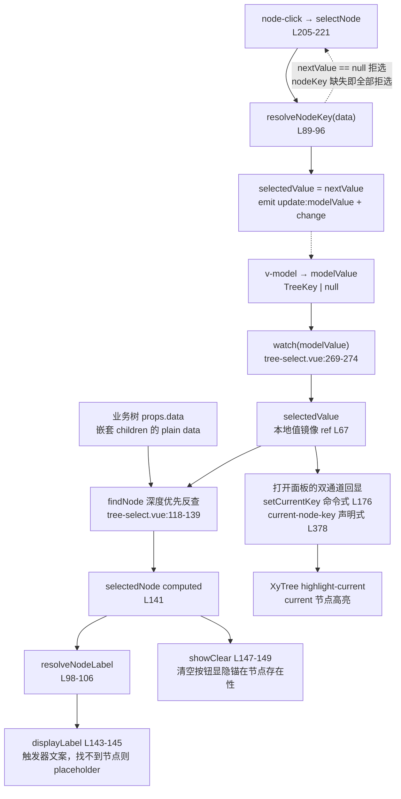
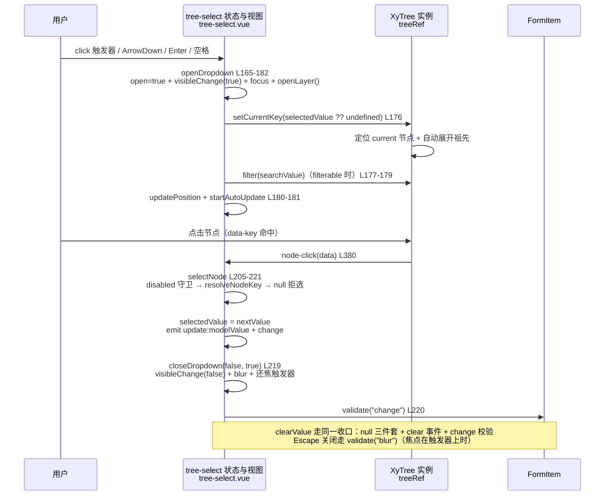

# 6-16 · TreeSelect：树与多选映射

> 本篇源码坐标（均为当前工作区实态）：
> - 主文件：`packages/components/tree-select/src/tree-select.vue`（386 行）、`packages/components/tree-select/src/tree-select.ts`（34 行——4-10 引过 L8-34 的泛型对照段，本篇全文展开）
> - 出口：`packages/components/tree-select/index.ts`（18 行，仅导出 `XyTreeSelect` 与三个类型）
> - 样式：`packages/theme/src/components/tree-select.css`（171 行）
> - 测试与类型：`packages/components/tree-select/__tests__/tree-select.spec.ts`（176 行）、`tests/types/fixtures/tree-select.ts`（20 行）
> - 示例：`apps/docs/examples/tree-select/`（basic / filterable / form / popper-class 四例）
> - 消费对象：`packages/components/tree/`——`TreeInstance`、`TreeOptionProps`、`LoadFunction`、`FilterNodeMethodFunction` 全部来自 tree 的类型面

分卷大纲给 6-16 的核心问题只有一句话：**树形数据到扁平值的桥接**。树数据是嵌套的（children 套 children），组件的值必须是扁平的（一个标量，或一组标量）。"桥接"要同时打通两个方向：往下，用户在树上点了一个节点，组件要把这个节点折叠成一个能塞进 `v-model` 的值；往上，业务库里存着一个值，组件要能反查出树上那个节点，把文案回显到触发器、把高亮画到树上。6-04 的 cascader 做的是同一件事的"路径版"，本篇做的是"节点版"。

然后先给一个可能出乎 6-15 预告的结论：**标题里的"多选"两个字，实码给出的答案是——不存在。** `selectedValue` 是 `ref<string | number | null>`（`tree-select.vue:67`），`modelValue` 的类型是 `TreeKey | null`（`tree-select.ts:12`），面板里的 `xy-tree` 用的是 `highlight-current` + `@node-click` 的"当前节点"语义（`tree-select.vue:377-380`）——不是 `show-checkbox` 的勾选语义。tree 里那一整套勾选体系（`checkStrictly`、`checkDescendants`、`CheckedInfo`、`halfCheckedKeys`、`getCheckedKeys(leafOnly)`）全部留在 8 卷的领地，tree-select 一概没有接。6-15 结尾预告本篇要讲"多选的选中值如何与树节点做双向映射（勾选父子联动）"，这行预告写在了实现之前；实码定论是单值映射，本篇就按实态讲，并且把"为什么砍掉多选"本身当作本篇最重要的设计权衡之一。

还有一个先亮出来的发现：`nodeKey` 在类型上是可选的（`nodeKey?: string`，`tree-select.ts:14`），运行时却是**硬前提**——没有它，不仅任何节点都选不了，连打开面板都会抛异常。第三节展开。

## 一、34 行的类型层：单值契约与三条旧路

`packages/components/tree-select/src/` 下只有两个文件：`tree-select.vue`（386 行）和 `tree-select.ts`（34 行）。类型层全文如下，它定义了这个组件对外承诺的一切：

```ts
// packages/components/tree-select/src/tree-select.ts（34 行全文）
import type TreeSelect from "./tree-select.vue";
import type { StyleValue } from "vue";
import type { Placement } from "@floating-ui/dom";
import type { ComponentSize } from "xiaoye-primitives";
import type { TreeData, TreeKey, TreeOptionProps } from "../../tree";
import type { FilterNodeMethodFunction, LoadFunction } from "../../tree/src/tree.type";

export type TreeSelectValueChangeHandler = (value: TreeKey | null) => void;
export type TreeSelectVisibleChangeHandler = (value: boolean) => void;

export interface TreeSelectProps {
  modelValue?: TreeKey | null;
  data?: TreeData;
  nodeKey?: string;
  props?: TreeOptionProps;
  placeholder?: string;
  disabled?: boolean;
  clearable?: boolean;
  filterable?: boolean;
  filterNodeMethod?: FilterNodeMethodFunction;
  lazy?: boolean;
  load?: LoadFunction;
  size?: ComponentSize;
  emptyText?: string;
  searchPlaceholder?: string;
  teleported?: boolean;
  appendTo?: string | HTMLElement;
  placement?: Placement;
  offset?: number;
  popperClass?: string;
  popperStyle?: StyleValue;
}

export type TreeSelectInstance = InstanceType<typeof TreeSelect>;
```

最要紧的是第 12 行：`modelValue?: TreeKey | null`。`TreeKey = string | number`（`tree.type.ts:14`），来自 tree 的类型面——注意它**不是** `TreeSelectValue` 这种自定义别名，而是直接复用 tree 的键类型。这一个类型选择同时说清了两件事：值的唯一事实源是 `nodeKey` 指向的节点字段，值的类型域被钉死在标量上。

**【权衡一：值模型选型——单值、值数组，还是路径数组？】** 同一个仓库里，层级选择器有三种值模型并存：cascader 的 `CascaderValue = CascaderKey[] | null`（路径数组，6-04 权衡一），select 的泛型 `T`（4-10，值类型参数化），tree-select 的 `TreeKey | null`（单标量）。三者的分野不在技术难度，在**业务语义**：值是"从根到叶的一条路径"（省/市/区）选路径数组；值是"一堆平等的东西"（多个标签）选值数组加泛型；值是"树上的一个节点"（挂在哪个部门、归属哪个菜单）选单标量。EP 的 `el-tree-select` 走了第四条路：同一个组件里 `multiple` 开关切换单/多值，`show-checkbox` + `check-strictly` 再叠加勾选联动语义——表达力最强，代价是值模型本身成了配置项，业务方必须先想清楚"我传的到底是什么形状"。本库把三种形状拆给三个组件，每种形状在自己的组件里只有一种答案，消费侧不需要读文档确认"这次 emit 的是数组还是标量"。代价同样真实：想要"树形多选"就得换组件或者等 8 卷的 tree 直接暴露勾选协议，tree-select 自己给不了。

类型测试夹具把这个契约钉死在编译期（`tests/types/fixtures/tree-select.ts`，20 行全文）：

```ts
// tests/types/fixtures/tree-select.ts（全文 20 行）
import type { TreeSelectProps } from "xiaoye-components";

const props: TreeSelectProps = {
  modelValue: 1,
  data: [{ id: 1, label: "控制台" }],
  nodeKey: "id",
  filterable: true,
  clearable: true
};

void props;

const invalidProps: TreeSelectProps = {
  // @ts-expect-error modelValue should be tree key
  modelValue: [],
  data: [{ id: 1, label: "控制台" }],
  nodeKey: "id"
};

void invalidProps;
```

第 14 行的 `@ts-expect-error modelValue should be tree key` 就是在声明：传一个 `[]` 是类型错误。`pnpm typecheck:types` 跑全量夹具时，这条错误必须如约出现——与 6-04 夹具里拒绝裸标量的方向正好相反，两条夹具一正一反，把"tree-select 单值、cascader 路径数组"的分野钉成了编译期事实。

第三条旧路是 4-10 留下的伏笔：select 用 `generic="T"` 让值类型参数化，tree-select 的第一行却是普通的 `<script setup lang="ts">`——没有泛型。为什么它能不泛型？因为树节点值的复杂度被 `nodeKey` + `TreeKey` 协议吸收掉了：不管业务数据里 id 是什么形状，`resolveNodeKey` 只认 `string | number`，"选中值永远是标量"成了组件契约的一部分，于是实例类型可以直接写 `InstanceType<typeof TreeSelect>`（`tree-select.ts:34`）。4-10 的结论在这里复验：同一个仓库里，`InstanceType` 的可用性完全取决于组件是否用了 `generic` 属性。

## 二、值的另一端：findNode 深度优先反查与"节点语义"回显

现在进入桥接的另一半：**从值回到节点**。组件挂载时 `modelValue` 里可能已经躺着一个历史值，触发器必须显示那个节点的名字而不是裸的 `1`。这件事由一组字段解析器加一个深度优先反查函数完成（`tree-select.vue:85-163`）：

```ts
// packages/components/tree-select/src/tree-select.vue:85-163
function getChildrenField() {
  return props.props.children ?? "children";
}

function resolveNodeKey(data: TreeNodeData) {
  if (!props.nodeKey) {
    return null;
  }

  const value = data?.[props.nodeKey];
  return typeof value === "string" || typeof value === "number" ? value : null;
}

function resolveNodeLabel(data: TreeNodeData) {
  const labelProp = props.props.label ?? "label";

  if (typeof labelProp === "function") {
    return `${labelProp(data, null as never) ?? ""}`;
  }

  return `${data?.[labelProp] ?? ""}`;
}

function resolveNodeDisabled(data: TreeNodeData) {
  const disabledProp = props.props.disabled ?? "disabled";

  if (typeof disabledProp === "function") {
    return Boolean(disabledProp(data, null as never));
  }

  return Boolean(data?.[disabledProp]);
}

function findNode(data: TreeNodeData[], key: string | number | null): TreeNodeData | null {
  if (key == null) {
    return null;
  }

  const childrenField = getChildrenField();

  for (const item of data) {
    if (resolveNodeKey(item) === key) {
      return item;
    }

    const children = Array.isArray(item?.[childrenField]) ? (item[childrenField] as TreeNodeData[]) : [];
    const childNode = findNode(children, key);

    if (childNode) {
      return childNode;
    }
  }

  return null;
}

const selectedNode = computed(() => findNode(props.data, selectedValue.value));

const displayLabel = computed(() => {
  return selectedNode.value ? resolveNodeLabel(selectedNode.value) : props.placeholder;
});

const showClear = computed(
  () => props.clearable && selectedNode.value !== null && !mergedDisabled.value
);

const dropdownStyle = computed<StyleValue>(() => [floatingStyle.value, props.popperStyle]);

function defaultFilterNodeMethod(value: FilterValue, data: TreeNodeData) {
  if (!value) {
    return true;
  }

  return resolveNodeLabel(data).toLowerCase().includes(`${value}`.trim().toLowerCase());
}

const resolvedFilterMethod = computed(
  () => props.filterNodeMethod ?? ((value: FilterValue, data: TreeNodeData) => defaultFilterNodeMethod(value, data))
);
```

`findNode`（L118-139）值得逐行读。输入是一个键，输出是数据树上的节点对象。它的策略是**对原始数据树做深度优先扫描**：遍历当前层数组，`resolveNodeKey(item) === key` 命中即返回；未命中则递归进 children。三个细节。其一，入口守卫是 `key == null`（L119）——宽松相等同时拦下 `null` 和 `undefined`，但**不拦空字符串**，这是有意的，后面看测试就知道。其二，children 的容错在 L130 一行做完：`Array.isArray(item?.[childrenField])` 不成立就当空数组，业务数据里某个节点忘了写 children、写成了 `null`，扫描不会崩。其三，命中比较走 `===` 严格相等——`resolveNodeKey` 返回的键类型已经被 L95 收窄到 `string | number`，数字 `1` 和字符串 `"1"` 在这里就是两个不同的键。

`selectedNode`（L141）是整条回显链的枢纽：`findNode(props.data, selectedValue.value)`，每次依赖变化全树重扫。这里藏着一个值得驻足的选择——**为什么不查 tree 内部的节点索引？** tree 的 `TreeStore` 里明明有一张 `nodesMap` 哈希表（`tree-store.ts:17`，类型定义在 `tree.type.ts:42-44` 的 `TreeStoreNodesMap`），键查节点 O(1)。tree-select 选择无视它，自己对 `props.data` 做 O(N) 扫描，理由在架构而不在性能：`nodesMap` 里存的是 `Node` 类实例，是 tree 的**内部表示**，薄壳组件一旦伸手去拿，就把"数据形状"和"节点实例"两套表示焊死在一起了——`nodeKey` 变更、`data` 替换、懒加载补层，任何一个动作都会让索引与数据出现时间差，而数据树扫描永远反映的是 `props.data` 的**此刻实态**。深树的 O(N) 听着吓人，常见规模（几百到几千节点）下一次扫描就是零点几毫秒，何况 `selectedNode` 是 computed，只在值或数据变化时重算。

**【权衡二：回显靠"数据树扫描"，还是靠"节点索引"？】** EP 的 `el-tree-select` 组合了 el-select 与 el-tree，回显委托给 el-select 的选中集合：单选场景它内部持有选中 option 的快照来渲染触发器文案；懒加载 + 多选场景，节点数据还没加载进来就要回显，EP 专门提供了 `cache-options`（缓存已选中的 options）与 `cache-data`（预置回显数据）两个属性来补这个洞——回显数据的生命周期成了业务方要操心的事。本库的方案反过来：回显永远是 `findNode(props.data, value)` 的纯函数，数据没到就显示 placeholder，数据到了自动补全（computed 随 `props.data` 失效重算），没有缓存态、没有同步问题，代价是"数据树里没有的值回显不出来"——懒加载场景下给 `modelValue` 预置一个未加载层的键，触发器只能显示占位文案。两条路线本质上是 6-04 权衡二"逐层 find vs parent 指针"的姊妹篇：**都拒绝为回显维护第二份表示**。

`resolveNodeLabel`（L98-106）里有一处类型层的谎言：L102 的 `labelProp(data, null as never)`。`TreeOptionProps.label` 的函数签名是 `(data: TreeNodeData, node: Node) => string`（`tree.type.ts:48`），第二个参数要的是 tree 内部的 `Node` 实例——但 tree-select 手里只有 plain data，它根本没有 Node。于是把 `null` 断言成 `never` 塞进去，骗过编译器。运行时这是安全的（自定义 label 函数拿到的 `node` 是 `null`，只要业务函数不碰它的方法就不炸），但它是 tree 类型协议与 tree-select 数据视角之间的一道明缝：**TreeOptionProps 这个协议对象被两个视角的组件共享，而它的函数签名偏向了实例视角**。同一段代码在 tree 里调用时 `node` 是真节点，在 tree-select 里调用时是 `null`——同一个 `props.props` 配置，跨组件搬家时行为可能悄悄变化。这是消费型组合要付的隐性税，文档里没有任何一行提醒。

回显链的末端是 `displayLabel`（L143-145）：`selectedNode ? resolveNodeLabel(...) : props.placeholder`。注意它只显示**一个节点的 label**——不是 cascader 那种 `"工作台 / 账单中心"` 的路径拼接。这就是"节点语义"回显的直白表达：值指向哪个节点，就显示哪个节点的名字， ancestors 是谁与值无关。`showClear`（L147-149）的条件是 `clearable && selectedNode.value !== null && !mergedDisabled.value`——清空按钮的显隐锚在"能不能找到节点"上，而不是"值是否非空"上，这个区别马上会被测试利用到极致。

## 三、多选去哪了：current 语义 vs check 语义（实码定论）

提交方向（节点 → 值）的全部逻辑在四段函数里（`tree-select.vue:165-232`）：

```ts
// packages/components/tree-select/src/tree-select.vue:165-232
async function openDropdown() {
  if (mergedDisabled.value || open.value) {
    return;
  }

  open.value = true;
  emit("visibleChange", true);
  emit("focus");
  openLayer();

  await nextTick();
  treeRef.value?.setCurrentKey(selectedValue.value ?? undefined);
  if (props.filterable) {
    treeRef.value?.filter(searchValue.value);
  }
  await updatePosition();
  startAutoUpdate();
}

async function closeDropdown(shouldValidate = false, restoreFocus = false) {
  if (!open.value) {
    return;
  }

  open.value = false;
  emit("visibleChange", false);
  emit("blur");
  stopAutoUpdate();
  closeLayer();

  if (restoreFocus) {
    await nextTick();
    triggerRef.value?.focus();
  }

  if (shouldValidate) {
    await formItem?.validate("blur");
  }
}

async function selectNode(data: TreeNodeData) {
  if (resolveNodeDisabled(data)) {
    return;
  }

  const nextValue = resolveNodeKey(data);

  if (nextValue == null) {
    return;
  }

  selectedValue.value = nextValue;
  emit("update:modelValue", nextValue);
  emit("change", nextValue);
  await closeDropdown(false, true);
  await formItem?.validate("change");
}

async function clearValue(event: MouseEvent) {
  event.preventDefault();
  event.stopPropagation();

  selectedValue.value = null;
  emit("update:modelValue", null);
  emit("change", null);
  emit("clear");
  await formItem?.validate("change");
}
```

`selectNode`（L205-221）是"树折叠成值"的全部：三道守卫、一次赋值、两个 emit、一个收口。第一道守卫 `resolveNodeDisabled(data)`（L206）——禁用节点点了没反应。第二道守卫 `nextValue == null`（L212）是本组件**最锋利的边界**：`resolveNodeKey` 在 `!props.nodeKey` 时恒返回 `null`（L90-92），所以只要没配 `nodeKey`，点任何节点都走到 `return`——组件视觉上完全正常（树能展开、能搜索、能懒加载），但永远选不出值。更狠的是打开面板这一步：`openDropdown` L176 调 `treeRef.value?.setCurrentKey(...)`，而 tree 的 `setCurrentKey` 入口处有 `requireNodeKey("setCurrentKey")` 守卫（`tree.vue:457-458`，定义在 L138-142）：

```ts
// packages/components/tree/src/tree.vue:75-87（同款守卫还有 setCurrentKey 的入口 requireNodeKey）
if (!props.nodeKey) {
  if (props.currentNodeKey !== undefined && props.currentNodeKey !== null) {
    throw new Error("[Tree] nodeKey is required when using currentNodeKey");
  }

  if ((props.defaultExpandedKeys?.length ?? 0) > 0) {
    throw new Error("[Tree] nodeKey is required when using defaultExpandedKeys");
  }

  if ((props.defaultCheckedKeys?.length ?? 0) > 0) {
    throw new Error("[Tree] nodeKey is required when using defaultCheckedKeys");
  }
}
```

`requireNodeKey` 不看参数值，只看 `props.nodeKey` 是否存在——没有 `nodeKey` 的 tree-select，**每次打开面板都会抛出 `[Tree] nodeKey is required in setCurrentKey`**：`open.value = true` 已经同步执行（面板能渲染出来），但 `setCurrentKey` 的异常把这个 async 函数的 Promise 打断，`updatePosition` 和 `startAutoUpdate` 永远不执行，浮层躺在 body 里的原始位置上。类型签名说 `nodeKey?` 可选，运行时说"没有我你什么都做不了"——这是全库少见的"类型宽、运行时严"的实态，测试里六条用例无一例外全部传了 `nodeKey: "id"`，等于默认大家都会配。文档侧没有标注这层约束，属于一处真实的使用陷阱。

`selectNode` 还有一个语义决定值得和 6-04 对照：**它不判叶子**。`@node-click` 对任何节点触发（`tree-select.vue:380`），父节点、子节点、叶子节点点上去都会选中并关面板——"选中的是树上的一个节点"，这个节点有没有下文无关紧要。cascader 只有叶子点击才 emit（浏览分支不提交），因为路径值要求走完一条完整路径；EP 的 el-tree-select 在 `show-checkbox` 模式下默认 `check-strictly: false`，父子勾选联动，常配"仅叶子入值"的业务约定。三种层级选择器在这一条上分出了三种默认值：**tree-select 全节点可选，cascader 仅叶子，EP 勾选集默认父子联动**。同一个"层级选择"名词下面，值的语义根本不同。

`clearValue`（L223-232）的前两行 `preventDefault` + `stopPropagation` 不是礼节：清空按钮渲染在触发器 `div` 内部（模板 L332-339），click 事件会冒泡到触发器的 `@click="openDropdown"`——不拦住冒泡，点清空的瞬间面板先被打开。值归零三件套（`update:modelValue: null` + `change: null` + `clear`）之后同样走 `formItem?.validate("change")` 收口，与 4-08 的表单联动协议对齐。

现在把"多选去哪了"正面回答掉。**【权衡三：多选走勾选集语义，还是干脆不做？】** tree 侧的多选基础设施一应俱全：`checkStrictly`（`tree.ts:23`，父子是否联动）、`showCheckbox`（`tree.ts:34`）、`CheckedInfo`（checkedKeys / halfCheckedKeys，`tree.type.ts:94-99`）、`TreeExposes.getCheckedKeys(leafOnly?)`（`tree.type.ts:114`）。tree-select 只要接上 `show-checkbox`、监听 `check` 事件、把 `checkedKeys` 映射进 `modelValue: TreeKey[]`，多选就成立了——工作量约三十行。它没有接，真正的阻力在**值的回显侧**：多选值是一组键，回显要渲染一组 tag、处理溢出折叠、处理"键有但节点未加载"的缓存问题（EP 专门为此造了 `cache-options`/`cache-data`），还要回答"半选父节点算不算值"这种语义争议。这些问题单选一个都没有——单值的回显是一个 `findNode` 加一行文案。所以这里的产品判断是：**单选树选择器的复杂度下限极低，多选树选择器的复杂度下限极高，中间不存在平滑过渡带**；与其做一个"半成品多选"，不如把多选留给 8 卷的 tree 暴露勾选协议后由后续组件（或 pro 层）以完整形态实现。代价是当前业务里有"部门多选"这类诉求时，本库给不出开箱组件——这是一个明确的、被记录的功能边界，而非疏忽。

整条"值 ↔ 节点"的双向映射收进一张图，这就是本篇的核心问题"树形数据到扁平值的桥接"的完整形状：



上半圈是**值 → 节点**（回显：findNode → 文案/高亮/清空态），下半圈是**节点 → 值**（提交：node-click → resolveNodeKey → emit），中间由 `selectedValue` 这个本地镜像衔接，`watch(modelValue)` 保证外部受控写入随时覆盖本地。注意 L176 与 L378 构成**双通道**：打开面板时既命令式调 `setCurrentKey`（能触发 tree 内部的"定位 + 自动展开祖先"逻辑），又声明式绑了 `:current-node-key`（tree 内部 watch 会同步 `TreeStore.currentNodeKey`）。双保险不是冗余——`setCurrentKey` 负责带动画/滚动定位的那次"显式设置"，声明式绑定负责 modelValue 外部变更后的"持续同步"。tree 侧的 current 高亮最终落在 `node.ts:171-172` 的键比对上：`this.key === this.store.currentNodeKey`。

## 四、浮层接线与 provide/inject 的边界：teleport 搬不走的东西

浮层是 4-05/4-06 体系的标准消费样本。tree-select 的 import 清单（L4-10）：`useConfig`、`useDismissibleLayer`、`useFloatingPanel`、`useNamespace`、`useOverlayStack`——浮层七件套照旧只借三件（stack / panel / dismissible），比 6-04 的 cascader 多借的只有与浮层无关的 `useConfig`。开合、定位、关闭的接线与 cascader 几乎逐行同构，不再展开；有差异的是两处，都在下拉模板段（`tree-select.vue:346-385`）：

```html
<!-- packages/components/tree-select/src/tree-select.vue:346-385 -->
    <teleport :to="props.appendTo" :disabled="!props.teleported">
      <transition name="xy-fade">
        <div
          v-if="open"
          ref="dropdownRef"
          :class="['xy-tree-select__dropdown', props.popperClass]"
          :style="dropdownStyle"
          :data-placement="actualPlacement"
        >
          <span ref="dropdownArrowRef" class="xy-popper__arrow" :style="arrowStyle" />

          <div v-if="props.filterable" class="xy-tree-select__search">
            <xy-input
              :model-value="searchValue"
              size="sm"
              clearable
              :placeholder="props.searchPlaceholder"
              :validate-event="false"
              @update:model-value="filter(String($event ?? ''))"
            />
          </div>

          <xy-tree
            ref="treeRef"
            class="xy-tree-select__tree"
            :data="props.data"
            :node-key="props.nodeKey"
            :props="props.props"
            :empty-text="props.emptyText"
            :lazy="props.lazy"
            :load="props.load"
            :highlight-current="true"
            :current-node-key="selectedValue ?? undefined"
            :filter-node-method="resolvedFilterMethod"
            @node-click="selectNode"
          />
        </div>
      </transition>
    </teleport>
```

第一处差异是**宽度策略**：`useFloatingPanel` 的选项里挂了 `matchTriggerWidth: true`（L81），浮层宽度由 floating-ui 的 `size` 中间件直接对齐触发器——对照 cascader 的自算三常量算式（列数 × 180 + gap + padding），树形面板没有"列"的概念，对齐触发器宽度就是全部需求，通用选项够用。这是同一家族里"通用管道够用时绝不自管"的又一个样本。

第二处差异藏在 L363：**`:validate-event="false"`**。这五个字符打的补丁，牵出 provide/inject 与 teleport 的关系边界。搜索框是 `xy-input`，而 `xy-input` 内部会 `inject(formItemKey)`，在 change/blur 时调 `formItem?.validate(...)`（`input.vue:340-342` 的 handleChange、L368-370 的 handleBlur，均以 `props.validateEvent` 为闸）。关键在于：Vue 的 provide/inject 按**组件树**解析，与 DOM 无关——这段搜索框虽然被 teleport 到了 body，但它的组件实例仍然挂在 tree-select → form-item → form 的实例链下面，inject 照样解析到外层 FormItem。不关掉 validate-event，用户在搜索框里每敲一个字、每失一次焦，都会触发外层表单项的校验——而搜索词和表单值毫无关系。`:validate-event="false"` 就是把这个"借道继承来的校验链路"剪断的剪子。teleport 搬得走 DOM，搬不走组件实例的注入关系——这个边界全库只有 tree-select 用实际代码画了出来。

过滤的完整链路是三层接力：搜索框 `@update:model-value="filter(String($event ?? ''))"` 调实例方法 `filter`（L264-267）→ 写 `searchValue` 并直接调 `treeRef.value?.filter(value)` → `watch(searchValue)`（L276-284）在 filterable 时**再次**调 `tree.filter`，随后 `nextTick` + `updatePosition`（过滤后树的高度变了，浮层要重定位）。同一次击键 `tree.filter` 实际跑了两次——一次命令式的即时反馈，一次声明式管道的重放；`tree-store.ts:68-94` 的过滤实现是幂等的（重算每棵子树的 `visible`），重复调用只是同帧多做一遍全树标记，功能无碍，属于可以优化掉的冗余。tree 的过滤语义有两点值得一记（`tree-store.ts:68-94`）：

```ts
// packages/components/tree/src/model/tree-store.ts:68-94
  filter(value: FilterValue): void {
    const traverse = (node: TreeStore | Node) => {
      const childNodes = node instanceof TreeStore ? node.root.childNodes : node.childNodes;

      childNodes.forEach((child) => {
        child.visible = !value
          ? true
          : Boolean(this.filterNodeMethod?.call(child, value, child.data as TreeNodeData, child));
        traverse(child);
      });

      if (!(node instanceof TreeStore) && !node.visible && childNodes.length > 0) {
        node.visible = childNodes.some((child) => child.visible);
      }

      if (!value) {
        return;
      }

      if (!(node instanceof TreeStore) && node.visible && !node.isLeaf) {
        if (!this.lazy || node.loaded) {
          node.expand();
        }
      }
    };

    traverse(this);
  }
```

三个规则：空值全显（L73-75 的 `!value ? true : ...`）；**父链保留**（L79-81，自身不可见但孩子有可见的，父节点保持可见——搜索命中的叶子永远带着它的祖先链）；命中即展开（L87-90，可见的非叶节点自动 `expand()`，懒加载节点要等 `loaded`）。tree-select 的默认过滤函数 `defaultFilterNodeMethod`（L153-159）只做一件事：`resolveNodeLabel(data).toLowerCase().includes(value.trim().toLowerCase())`——对 label 的大小写不敏感包含匹配，且它用 `resolveNodeLabel` 而不是裸取 `data.label`，自定义 label 函数在过滤时同样生效。业务方传入的 `filterNodeMethod`（类型来自 `tree.type.ts:71-75`，签名里带 `node`）会在 tree 内部拿到完整 Node，比 tree-select 自己那半份视角多一层信息——`resolvedFilterMethod`（L161-163）只在业务没传时兜底，传了就整个让路。

还有两个次序细节。其一，`openDropdown` 在 `filterable` 时会重放上一次的搜索词（L177-179 用 `searchValue.value` 再 filter 一次）——`searchValue` 在关闭时**不清空**，重开面板保留上次过滤结果。这是偏好问题不是 bug，但测试没有钉住这个行为，改它不会有红灯。其二，Escape 有两条关闭路径：触发器上的 `handleTriggerKeydown`（L246-248，`closeDropdown(true, true)`——触发 blur 校验 + 还焦）和 `useDismissibleLayer` 的全局 Escape 监听（L292-294，`closeDropdown(false, true)`——不校验 + 还焦）。焦点在触发器上时两条都会走到，`closeDropdown` 开头的 `if (!open.value) return` 让先到者赢、后到者空转——先到的是触发器的事件（target 阶段先于 document 冒泡阶段），所以**焦点在触发器上按 Escape 会触发 blur 校验，焦点在树里按 Escape 不会**。同类浮层组件里最细微的语义差，值得知道它存在。

一次完整交互的时序收进一张图：



顺带一提 `emit("focus")` / `emit("blur")` 的语义（L172、L192）：它们不是原生 DOM focus/blur 的转发，而是**面板开合的别名**——打开即 focus、关闭即 blur。触发器真实获得焦点（Tab 进来）并不会 emit `focus`。这与 EP 的 el-select 系（focus/blur 锚在输入框 DOM 事件上）不同，业务方想监听"真实焦点"要另想办法。这是"组件事件语义自定义为先"的又一个样本：事件名沿用了习惯词，载荷语义按组件自己的状态机定义。

## 五、样式与测试：171 行 CSS、去 body 找浮层、空字符串的双态

样式层 171 行，最值得看的是清空按钮与箭头的**同位互换**（`tree-select.css:95-119`）：

```css
/* packages/theme/src/components/tree-select.css:95-119 */
.xy-tree-select__icon {
  position: absolute;
  inset: 0;
  opacity: 1;
  transition:
    transform var(--xy-transition-duration-fast) var(--xy-transition-timing),
    opacity var(--xy-transition-duration-fast) var(--xy-transition-timing),
    color var(--xy-transition-duration-fast) var(--xy-transition-timing);
}

.xy-tree-select.is-open .xy-tree-select__icon {
  transform: rotate(180deg);
}

.xy-tree-select:not(.is-disabled):hover .xy-tree-select__actions.has-clear .xy-tree-select__clear,
.xy-tree-select:not(.is-disabled):focus-within .xy-tree-select__actions.has-clear .xy-tree-select__clear {
  opacity: 1;
  pointer-events: auto;
}

.xy-tree-select:not(.is-disabled):hover .xy-tree-select__actions.has-clear .xy-tree-select__icon,
.xy-tree-select:not(.is-disabled):focus-within .xy-tree-select__actions.has-clear .xy-tree-select__icon {
  opacity: 0;
  pointer-events: none;
}
```

`.xy-tree-select__actions` 是一个 16px 宽的相对定位容器（L56-63），clear 按钮和 chevron 图标都 `position: absolute; inset: 0` 叠在同一个格子里，靠 opacity 与 pointer-events 此消彼长：hover/focus-within 时 clear 浮现、箭头隐去；平时反之。开合时箭头 `rotate(180deg)` 转向。一个格子两个状态图标，零布局抖动——这是 6-02 input 清空按钮同一手法的姊妹实现。触发器本体（L5-20）的 `min-height: 40px` 配合 size 修饰类（`xy-tree-select--lg/sm`，由 `mergedSize` 拼出）做尺寸级联；`is-error` 类由模板 L313 按 `formItem?.validateState.value === 'error'` 挂上——校验错误态直通样式，6-17/6-18 的 Form 校验编排将大量复用这条通路。

浮层皮肤延续 cascader 的三层变量回退（`tree-select.css:121-156`）：`--xy-tree-select-dropdown-bg` → `--xy-popper-bg` → `--xy-dialog-bg` → 语义令牌兜底，边框与阴影同构。文档示例 `popper-class.vue`（59 行）专门演示了怎么用第一层钩子换肤：给浮层加个 class，覆盖三个 `--xy-tree-select-dropdown-*` 变量即可，不碰组件。树面板本体只有五行约束（L165-171）：`max-height: 280px; overflow: auto;`——树的滚动交给这个容器，浮层自身 `overflow: hidden` 配合圆角。

测试（176 行）六条用例，两组最见功力。第一组是浮层断言纪律的样本（`tree-select.spec.ts:23-65`）：

```ts
// packages/components/tree-select/__tests__/tree-select.spec.ts:23-65
  it("支持基础选择和受控回显", async () => {
    const wrapper = mount(XyTreeSelect, {
      props: {
        modelValue: null,
        data: options,
        nodeKey: "id"
      },
      attachTo: document.body
    });

    await wrapper.get(".xy-tree-select__trigger").trigger("click");
    await document.body.querySelector('[data-key="2"] .xy-tree__node-content')?.dispatchEvent(
      new MouseEvent("click", { bubbles: true })
    );

    expect(wrapper.emitted("update:modelValue")?.[0]?.[0]).toBe(2);
  });

  it("支持过滤和清空", async () => {
    const wrapper = mount(XyTreeSelect, {
      props: {
        modelValue: 2,
        data: options,
        nodeKey: "id",
        filterable: true,
        clearable: true
      },
      attachTo: document.body
    });

    expect(wrapper.find(".xy-tree-select__label").text()).toContain("配置中心");

    await wrapper.get(".xy-tree-select__trigger").trigger("click");
    const searchInput = document.body.querySelector(".xy-tree-select__search input") as HTMLInputElement;
    searchInput.value = "账单";
    searchInput.dispatchEvent(new Event("input", { bubbles: true }));
    await wrapper.vm.$nextTick();

    expect(document.body.textContent).toContain("账单中心");

    await wrapper.get(".xy-tree-select__clear").trigger("click");
    expect(wrapper.emitted("update:modelValue")?.at(-1)?.[0]).toBeNull();
  });
```

两个断言点值得读出声：其一，点树节点不是 `wrapper.find`，而是去 `document.body` 上按 `[data-key="2"] .xy-tree__node-content` 查 DOM 再派发原生 MouseEvent——浮层被 teleport 到 body 了，所有浮层内交互都必须去 body 找，这是 4-05 之后全库浮层测试的统一纪律（与 6-04 的懒加载测试同一姿势）；`data-key` 是 tree 渲染节点时落下的锚点。其二，回显断言 `wrapper.find(".xy-tree-select__label").text()).toContain("配置中心")` 钉住了"值 2 → findNode → label 文案"这条回显链，`update:modelValue` 载荷 `toBe(2)` 钉住了"节点 → 标量值"的提交链——双向桥接各有一条测试看门。

第二组是空字符串的双态用例（`tree-select.spec.ts:67-104`）：

```ts
// packages/components/tree-select/__tests__/tree-select.spec.ts:67-104
  it("空字符串且无对应节点时保持 placeholder 且不展示清空按钮", () => {
    const wrapper = mount(XyTreeSelect, {
      props: {
        modelValue: "",
        data: options,
        nodeKey: "id",
        clearable: true,
        placeholder: "全部节点"
      },
      attachTo: document.body
    });

    expect(wrapper.find(".xy-tree-select__label").text()).toBe("全部节点");
    expect(wrapper.find(".xy-tree-select__label").classes()).toContain("is-placeholder");
    expect(wrapper.find(".xy-tree-select__clear").exists()).toBe(false);
  });

  it("空字符串且存在对应节点时仍按有效值处理", () => {
    const wrapper = mount(XyTreeSelect, {
      props: {
        modelValue: "",
        data: [
          {
            id: "",
            label: "未分类"
          },
          ...options
        ],
        nodeKey: "id",
        clearable: true
      },
      attachTo: document.body
    });

    expect(wrapper.find(".xy-tree-select__label").text()).toBe("未分类");
    expect(wrapper.find(".xy-tree-select__label").classes()).not.toContain("is-placeholder");
    expect(wrapper.find(".xy-tree-select__clear").exists()).toBe(true);
  });
```

这对用例精确锁死了"空值判定锚在节点存在性"的设计：`modelValue: ""` 时，如果数据树里没有任何节点 `id === ""`，`findNode` 返回 `null`（`key == null` 不拦空字符串，但扫不到匹配项），`displayLabel` 落到 placeholder、`showClear` 为 false——空字符串表现得像"没选"；如果业务数据里真有一个 `id: ""` 的"未分类"节点，`"" === ""` 严格相等命中，同一个值立刻变成合法选中态，有 label、有清空按钮。**"什么算空"不是组件拍板的，是数据树拍板的。** 这比 `value === null ? placeholder : value` 的朴素写法多了一层语义：业务里"未分类"这类空键节点是真实存在的实体，组件不能替业务把它当空值吃掉。代价是心智负担——同一个 `""` 在不同数据下行为不同，好在测试把两种形态都钉死了，行为是契约不是巧合。

表单级联用例（L154-176）验证 `xy-form size="lg"` 下发到未显式设置 size 的 tree-select（`.xy-tree-select--lg`）、显式 `size="sm"` 不被覆盖——4-08/4-09 的 mergedSize 链又一次复验。四条文档示例（basic / filterable / form / popper-class）中，form 示例（31 行全文）最短地展示了本组件的正确打开方式：

```vue
<!-- apps/docs/examples/tree-select/form.vue（全文 31 行） -->
<script setup lang="ts">
import { reactive } from "vue";

const form = reactive({
  menuId: null as number | null
});

const rules = {
  menuId: [{ required: true, message: "请选择菜单", trigger: "change" }]
};

const data = [
  {
    id: 1,
    label: "工作台",
    children: [{ id: 11, label: "账单中心" }]
  },
  {
    id: 2,
    label: "配置中心"
  }
];
</script>

<template>
  <xy-form :model="form" :rules="rules" label-width="96px">
    <xy-form-item label="菜单" prop="menuId">
      <xy-tree-select v-model="form.menuId" :data="data" node-key="id" filterable />
    </xy-form-item>
  </xy-form>
</template>
```

注意 `node-key="id"` 一次不落——示例作者显然知道它不是可省略项。

## 六、三角分工的定稿：cascader 自绘、tree-select 消费、EP 的组合面

最后收拢三组关系，给"层级选择"这个家族定稿。

**第一组：cascader 与 tree-select（6-04 第七节立下的分界碑，本篇验收）。** 6-04 留了四条线：选什么（节点 vs 路径）、数据形态（绑定 Node 体系 vs plain data）、回显语义（末级 label vs 路径拼接）、交互密度（树的全交互 vs 逐列点下去）。本篇可以追加第五条：**泛型轴**——select 泛型化、tree-select 非泛型（4-10 的三角关系）；以及第六条：**宽度策略**——cascader 自算列宽算式，tree-select 用 `matchTriggerWidth` 通用选项。分界碑验收合格，两边都没有越界。

**第二组：tree 与 tree-select——消费，实码定论。** "内部消费 tree 组件还是自建节点树？"答案是明确的消费：386 行里触发器与浮层接线约两百行，树的面板能力（展开、懒加载、过滤、空态、current 高亮）全部来自 `<xy-tree>`，tree-select 对树内核的干预只有四个 props 透传（data/node-key/props/lazy/load）加三个控制面调用（`setCurrentKey`、`filter`、`@node-click`）。**【权衡四：组合 tree，还是自建节点树？】** 自建一棵"选择器专用的轻量树"可以砍掉拖拽、勾选、渲染函数这些选择器用不到的能力，换取包体与心智的瘦身；但它要重新实现展开状态、懒加载时序、过滤遍历——tree 的 `TreeStore`/`Node` 模型正是这些复杂度的沉淀，复制一遍就是两份 bug 面。本库选择组合，理由与代价都清晰：理由是树内核的全能力免费获得（今天的选择器明天要加"仅叶子可选"，一行 `props` 透传的事）；代价是**薄壳与内核的类型协议必须双向让步**——`TreeOptionProps` 的函数签名偏向实例视角（第二节 `null as never` 那道缝），`nodeKey` 的运行时强制从内核泄漏到壳上（第三节那个打开即抛）。EP 的 `el-tree-select` 同样是组合形态（官方文档自述"基于了 el-select 和 el-tree"），但它不是薄壳：el-select 承接触发器、tag、受控协议，el-tree 填充下拉面板，中间还有一层 props 映射与值转换——`multiple` 时把勾选键集转成值数组、`show-checkbox` 时接管节点点击的勾选语义、懒加载回显靠 `cache-options`/`cache-data` 补数据。同样是组合，**EP 的组合面厚（有一层值转换适配层），本库的组合面薄（树是树，选择器是壳，值转换压缩到 30 行以内）**。厚组合买表达力，薄组合买可预测性，这条线与本库一贯的减法一致。

**第三组：术语分裂的清算——filterable vs searchable。** 6-15 结尾埋的第三个伏笔在这里兑现：select 用 `searchable`（`select.ts:35`），tree-select 用 `filterable`（`tree-select.ts:19`），同一家族两个词。分裂其实有出处：select 的 `searchable` 描述的是"触发器上出现输入框"这个 UI 行为（远程搜索、allowCreate 都挂在它上面）；tree-select 的 `filterable` 直接继承 tree 的 `filter-node-method` 协议（`tree.type.ts:71-75`），语义是"调用 tree 的过滤管道"。一个是 UI 开关，一个是协议转发，用了两个词反而是诚实的——但诚实不等于无成本：业务方从 select 挪到 tree-select 时，肌肉记忆会先敲 `searchable`，然后得到一个被忽略的属性。术语统一化（都叫 filterable 或都叫 searchable）是全库值得记入待办的一致性债，本篇记账，不越权清偿。

## 收拢：五条结论

1. **单值 TreeKey 是实码定论**：标题问"多选映射"，代码答"单值映射"——`modelValue: TreeKey | null`，current 语义，勾选体系（checkStrictly/CheckedInfo/halfCheckedKeys）全部留在 tree 没被接出。多选不做不是疏忽而是判断：单选回显一个 findNode 就够，多选回显要 tag 集、缓存、半选语义，复杂度没有过渡带。
2. **回显是数据树上的纯函数**：`findNode` 深度优先扫描 `props.data`，不用 tree 内部的 `nodesMap` 索引——永远反映数据此刻实态，没有缓存同步问题；代价是懒加载下未加载层的值只能显示 placeholder，以及 `resolveNodeLabel` 里 `null as never` 那道类型协议的明缝。
3. **nodeKey 类型可选、运行时硬前提**：没配 nodeKey，`resolveNodeKey` 恒 null（一切节点拒选），打开面板还会吃到 tree 的 `requireNodeKey` 抛错、浮层定位循环不启动——全库少见的"类型宽、运行时严"陷阱，六条测试全部默认传 nodeKey 等于绕开了它。
4. **teleport 搬不走 provide/inject**：搜索框被 teleport 到 body，组件实例链上仍解析到 FormItem，`:validate-event="false"` 是必打的补丁；同一次击键 `tree.filter` 跑两遍（命令式 + watch 重放）是可优化冗余，Escape 的校验语义取决于焦点位置是隐藏细节。
5. **组合而非自建，薄壳而非厚适配**：树面板能力全部来自 `<xy-tree>` 消费，值转换压缩在 30 行内；对照 EP el-tree-select 的厚组合面（值转换层 + cache-options/cache-data），本库买的是可预测性，付的是类型协议双向让步与功能边界（无多选）。

下一篇预告：6-17《Form：校验编排》。本篇里 `formItem?.validate("change")` 出现了三次、`:validate-event="false"` 剪断过一次链路——被调用的这一侧只有一行，提供这一侧的 Form 将展开完整的一卷：async-validator 集成、rules 到 trigger 的生命周期编排、validate 状态如何在 FormItem 与组件的 `is-error` 类之间建立通路。4-08 立下的表单联动协议，在那篇里接受总装检验。

---

*本篇代码引用核对于当前工作区实态：`packages/components/tree-select/src/tree-select.vue`（386 行，L4-10 / L19-44 / L46-53 / L61-68 / L70-83 / L85-116 / L118-163 / L165-182 / L184-203 / L205-221 / L223-232 / L234-253 / L264-267 / L269-303 / L306-344 / L346-385）、`src/tree-select.ts`（34 行全文）、`index.ts`（18 行）、`packages/theme/src/components/tree-select.css`（171 行，L56-63 / L95-119 / L121-156 / L165-171）、`packages/components/tree-select/__tests__/tree-select.spec.ts`（176 行，L23-65 / L67-104 / L154-176）、`tests/types/fixtures/tree-select.ts`（20 行全文）、`apps/docs/examples/tree-select/form.vue`（31 行全文）、`popper-class.vue`（59 行）。消费面：`packages/components/tree/src/tree.type.ts`（L14 / L42-44 / L46-53 / L71-75 / L94-99 / L114）、`tree.ts`（L23 / L34 / treeEmits L230-233）、`tree.vue`（L75-87 / L138-142 / L457-458）、`model/tree-store.ts`（L17 / L68-94）、`model/node.ts`（L171-172）、`instance.ts`（TreeInstance）；`packages/components/input/src/input.vue`（L340-342 / L368-370）；`packages/components/select/src/select.ts`（L35）；manifest 条目 `packages/components/component-manifest.json:341-347`、`packages/theme/index.css:66`。浮层组合式 `use-floating-panel.ts`（161 行）、`use-dismissible-layer.ts`（82 行）、`use-overlay-stack.ts`（99 行）引自本专栏 4-05、4-06。EP 侧事实（el-tree-select 基于 el-select 与 el-tree 组合、multiple/show-checkbox/check-strictly 值模型、懒加载回显的 cache-options 与 cache-data）以 element-plus 2.x 官方文档与源码为参照核对。本篇叙述与源码不符点自查：任务考据假设"value 数组→勾选状态"的多选映射与 check-strictly 父子关联——当前工作区实态为 `TreeKey | null` 单值、current 语义，tree-select 未消费 showCheckbox/checkStrictly，文中已按实态定论并将差异展开为权衡一/权衡三；6-15 预告的"勾选父子联动"同样与实态不符，文中已显式修正。*
