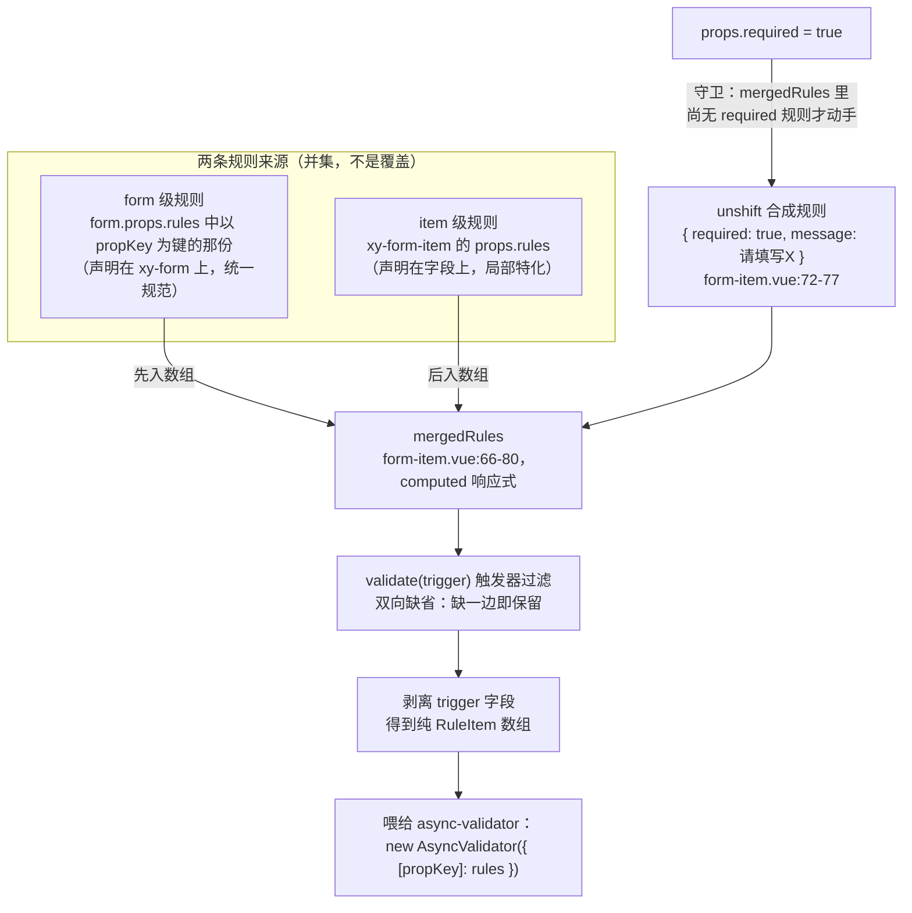

# 6-17 · Form：校验编排

> 本篇是表单协议系列的第二篇。4-08《表单联动与全局配置链》讲的是机制层——provide/inject 用什么管道、四层配置按什么顺序传；本篇下沉到语义层，回答另一个问题：**当你点下"提交"，从 `formRef.validate()` 到 input 上亮起 `is-error`，中间发生了一次怎样的编排？** 顺着这条线，我们会拆开 form.vue 的并行 Promise 编排、form-item 的 async-validator 执行体、两级规则的合并策略、`validateOnRuleChange` 的 watch 守卫，以及 2026-09-16 那次 `size: undefined` 修复的完整上下文。form-item 的消息渲染与 aria 关联留给下一篇 6-18，本篇讲到 `validateMessage` 这个 ref 为止。

## 一、编排者与执行者：form 只做三件事

先立一个贯穿全篇的判断：**form 是编排者，form-item 是执行者，async-validator 是被调用的引擎。** 三层各管一段，互不越界——form 不碰规则内容，form-item 不碰别的字段，async-validator 不碰 Vue。

form.vue 全文 133 行（当前工作区实态），script 段做了三件结构性的事：注册字段（`addField`/`removeField`）、编排校验（`validate`/`validateField`）、下发环境（`provide(formKey)`）。4-08 引过 9-20 的 props 默认值与 provide 端，本篇从 25-63 的注册与寻址开始，这一段是编排的物质基础：

```ts
// packages/components/form/src/form.vue:25-63
function normalizeProps(prop?: FormProp | FormProp[]) {
  if (!prop) {
    return fields;
  }

  let normalized: string[];

  if (typeof prop === "string") {
    normalized = [normalizeFormProp(prop)];
  } else if (prop.every((item) => typeof item === "string")) {
    const pathSegments = prop as string[];
    const normalizedPath = normalizeFormProp(pathSegments);

    if (normalizedPath && fields.some((field) => field.propKey === normalizedPath)) {
      normalized = [normalizedPath];
    } else {
      normalized = pathSegments.map((item) => normalizeFormProp(item));
    }
  } else {
    normalized = (prop as FormProp[]).map((item) => normalizeFormProp(item));
  }

  const targets = normalized.filter(Boolean);
  return fields.filter((field) => field.propKey && targets.includes(field.propKey));
}

function addField(field: FormFieldContext) {
  if (!fields.includes(field)) {
    fields.push(field);
  }
}

function removeField(field: FormFieldContext) {
  const index = fields.indexOf(field);

  if (index >= 0) {
    fields.splice(index, 1);
  }
}
```

三个细节值得停一停。

**其一，注册表不是响应式的。** `fields: FormFieldContext[]`（form.vue:23）是一个普通数组，不用 `ref` 也不用 `reactive`。它只在命令式方法（validate/resetFields）里被同步读取，从不参与模板渲染——包一层响应式只会让每次增删字段都触发一次无意义的依赖收集。这是"注册表"在 Vue 组件里的惯用形态：**要渲染的才响应，只被命令式遍历的保持素**。EP 的 form 也是同样的选择（一个普通 `fields` 数组，form.vue:72-83 的 `addField` 同样是 `includes` 守卫后 push）。

**其二，无 prop 的 form-item 也进注册表。** form-item 挂载时无条件 `form?.addField(fieldContext)`（form-item.vue:174-177），哪怕它没绑 `prop`——此时 `fieldContext.propKey` 是空串。这不为错：这些字段会在 `validate()` 里以"空转"的方式参与 Promise.all（见下节），`normalizeProps` 的过滤条件 `field.propKey && ...`（form.vue:48）则保证它们永远不会被单字段方法点名。注册宽、寻址严，两道闸各管一头。

**其三，`addField`/`removeField` 双双幂等。** 重复 add 有 `includes` 守卫，重复 remove 有 `indexOf >= 0` 守卫。在一个 StrictMode 式"同一个组件可能挂载两次"的世界里（以及 future 的 HMR 抖动里），注册表的幂等性是免费保险。

### 1.1 validate：一条 Promise.all 收束所有字段

编排的全部逻辑浓缩在 65-83 这两段里，连同 85-91 的重置与清场一起引用：

```ts
// packages/components/form/src/form.vue:65-91
async function validate() {
  const results = await Promise.all(fields.map((field) => field.validate()));
  const valid = results.every(Boolean);

  if (!valid && props.scrollToError) {
    fields.find((field, index) => !results[index])?.element?.scrollIntoView({
      behavior: "smooth",
      block: "center"
    });
  }

  return valid;
}

async function validateField(prop?: FormProp | FormProp[], trigger?: FormTrigger) {
  const targets = normalizeProps(prop);
  const results = await Promise.all(targets.map((field) => field.validate(trigger)));
  return results.every(Boolean);
}

function resetFields(prop?: FormProp | FormProp[]) {
  normalizeProps(prop).forEach((field) => field.resetField());
}

function clearValidate(prop?: FormProp | FormProp[]) {
  normalizeProps(prop).forEach((field) => field.clearValidate());
}
```

`validate()` 与 `validateField()` 是**同一条收束管道的两个入口**：都是 `Promise.all` 摊开并发、`every(Boolean)` 归约为一个布尔。差别只有两点——目标集合（全部字段 vs `normalizeProps` 筛过的子集）和 trigger（`validate()` 传 `undefined` 即全量规则，`validateField` 可以代发 `"blur"`/`"change"` 模拟触发）。这个设计让"全量校验"和"单字段校验"共享同一套语义，而不是两套各自演化的 API。

这里出现了本篇第一个设计权衡。

**权衡一：Promise.all 并行，还是串行逐个 await？** 先看 EP 的答案——`doValidateField`（EP dev 分支 `form.vue:176-199`）：

```ts
// element-plus packages/components/form/src/form.vue:176-199（dev 分支）
const doValidateField = async (
  props: Arrayable<FormItemProp> = []
): Promise<boolean> => {
  if (!isValidatable.value) return false

  const fields = obtainValidateFields(props)
  if (fields.length === 0) return true

  let validationErrors: ValidateFieldsError = {}
  for (const field of fields) {
    try {
      await field.validate('')
      if (field.validateState === 'error' && !field.error) field.resetField()
    } catch (fields) {
      validationErrors = {
        ...validationErrors,
        ...(fields as ValidateFieldsError),
      }
    }
  }

  if (Object.keys(validationErrors).length === 0) return true
  return Promise.reject(validationErrors)
}
```

EP 是一个货真价实的 `for...of` + `await` **串行循环**：逐个字段等它跑完，把失败字段的错误对象（按 prop 名分组的 `{ fieldName: errors[] }`）合并进 `validationErrors`，最后有错就 `Promise.reject` 整个错误集合。xiaoye 选了另一头——`Promise.all` 并行。这个分岔不是谁对谁错，是两个前提差异的自然结果：

- **聚合需求的强弱。** EP 的校验失败要向调用方交付一份结构化的 `invalidFields`（哪个字段、哪些错误），串行 reduce 合并对象写得简单直接；xiaoye 的 `validate()` 只返回一个 `boolean`，错误本身留在各自 form-item 的 `validateMessage` 里（UI 侧），编排层没有任何聚合负担——并行的最大成本在 xiaoye 这里根本不存在。
- **首错误的定位方式。** 并行时所有字段同时跑、同时 settle，首个失败字段的定位靠 `fields.find((field, index) => !results[index])`（form.vue:70）——这依赖 `Promise.all` 的保序性质：结果数组的顺序与输入数组严格一致，`index` 可以反查注册表。EP 因为串行循环里同步感知每个字段的成败，天然拿到第一个失败者。

并行的代价同样要诚实记录：**本库不支持跨字段联动校验**（"结束时间必须晚于开始时间"这类规则）。每字段的 `AsyncValidator` 实例互相独立（form-item.vue:112，每字段每轮新建），编排层没有"字段间二次仲裁"的阶段。这类需求目前只能靠自定义 validator 闭包去读整个 model——协议上有出路（`RuleItem.validator` 是 async-validator 的原生能力），但库里没有一等公民支持，EP 原生同样没有，两家打平。

串行还有一层历史包袱值得点破：EP 的 `validate` 需要兼容回调风格（`callback?: FormValidateCallback`），`for...of` 里逐字段 `try/catch` 是把"逐字段副作用"（每个失败字段都要 `catch` 进集合、要触发 form 的 `validate` 事件）写得最直白的形态。xiaoye 没有回调 API，也就没有引入串行的理由。**并发策略从来不是孤立的性能选择，是 API 契约的下游。**

## 二、validate 生命周期：从按钮到 is-error 的完整时序

把上一节的编排和下一节的执行连起来，一次完整校验的生命周期长这样：

```mermaid
sequenceDiagram
    autonumber
    participant U as 用户
    participant F as form.vue（编排者）
    participant I as form-item.vue（执行者）
    participant A as async-validator（引擎）

    U->>F: 提交按钮调用 formRef.validate()
    loop 对注册表每个字段并发发出（Promise.all）
        F->>I: field.validate() —— trigger 为 undefined
        I->>I: mergedRules 按触发器过滤（92-98）
        I->>I: 剥离 trigger 字段，得纯 RuleItem（100-103）
        I->>I: validateState = "validating"（111）
        I->>A: new AsyncValidator({ [propKey]: rules })（112-114）
        I->>A: await validate({ [propKey]: getPathValue(...) })（117-119）
        alt 校验通过
            A-->>I: resolve
            I->>I: validateState = "success"、message 置空（120-121）
            I-->>F: true
        else 校验失败
            A-->>I: reject，形参为 { errors, fields }
            I->>I: validateState = "error"、message = errors[0].message（124-126）
            I-->>F: false
        end
    end
    F->>F: results.every(Boolean)（67）
    opt 校验失败且 scrollToError
        F->>F: find 首个失败字段并 scrollIntoView（69-74）
    end
    F-->>U: Promise&lt;boolean&gt; —— 永远 resolve，不 reject
```

这张图上有三个值得展开的段落。第一个是执行者本体——form-item 的 `validate` 全量源码（43 行），它是全库与 async-validator 唯一的正面对话：

```ts
// packages/components/form/src/form-item.vue:87-129
async function validate(trigger?: FormTrigger) {
  if (!form || !props.prop || !propKey.value) {
    return true;
  }

  const filtered = mergedRules.value.filter((rule) => {
    if (!trigger || !rule.trigger) {
      return true;
    }

    return Array.isArray(rule.trigger) ? rule.trigger.includes(trigger) : rule.trigger === trigger;
  });

  const normalizedRules = filtered.map((rule) => {
    const { trigger: _trigger, ...validatorRule } = rule;
    return validatorRule;
  });

  if (!normalizedRules.length) {
    validateState.value = "idle";
    validateMessage.value = "";
    return true;
  }

  validateState.value = "validating";
  const validator = new AsyncValidator({
    [propKey.value]: normalizedRules
  });

  try {
    await validator.validate({
      [propKey.value]: getPathValue(form.props.model, props.prop)
    });
    validateState.value = "success";
    validateMessage.value = "";
    return true;
  } catch (error) {
    const first = (error as { errors?: Array<{ message?: string }> }).errors?.[0];
    validateState.value = "error";
    validateMessage.value = first?.message ?? "校验失败";
    return false;
  }
}
```

**第二个段落是四态的归属。** 4-08 考据过 `ValidateState` 四态（`"idle" | "validating" | "success" | "error"`，context.ts:7），本篇补上它们的生命周期归属：四个状态全部住在 form-item 的 `validateState` ref（form-item.vue:41），form 侧**一个状态都没有**——没有 loading、没有错误集合、没有"第几个字段失败了"。编排者无状态，意味着 `validate()` 可重入、不持有上一次校验的任何残余；也意味着一个诚实的边界：**如果调用方在并发场景连发两次 `validate()`，没有竞态防护**——两次校验各自写 `validateState`，UI 最终停在最后 settle 的那个结果上。EP 同样如此（它还额外给错误态加了一层 `validateStateDebounced` 100ms 防抖来压制闪烁，ep-form-item.vue:100——那是消息显示侧的事，留给 6-18）。

**第三个段落是两个早退分支的语义差。** 进函数第一道闸（88-90）：没有 prop 的字段直接 `return true`，**不碰任何状态**——它根本不在校验体系里，连 `idle` 都不该被惊动。第二道闸（105-109）：有 prop 但过滤后零规则，先复位 `idle` 再 `return true`——"没有规则可跑"要主动清掉上一轮残留的错误态。同样是 `true`，一个静默、一个清场，语义上是两种不同的"通过"。对比 EP：它的 `validateEnabled`（规则数为零）分支直接 `callback?.(false); return false`（ep-form-item.vue:311-313）——**无规则的字段返回 false**。但这个 false 不会拖垮表单：EP 的串行循环只把 `catch` 到的错误计入集合，字段级 false 被静默吞掉。两种取法殊途同归，xiaoye 的 true 更符合"空集全称真"的数学直觉（`every` 对空数组恒真），EP 的 false 更符合"没校验过就是没通过"的直觉——契约文档里必须二选一说清，xiaoye 选了前者。

### 2.1 boolean 契约：把校验失败降格为普通返回值

`FormInstance` 的类型面（context.ts:44-49）写着 `validate: () => Promise<boolean>`——这个签名背后是一个明确的 API 权衡：**校验失败不是异常，是普通返回值。** `validate()` 永远 resolve，调用方可以放心 `await` 而不包 try/catch。文档示例 basic.vue:24-28 就是这个契约的标准消费姿势：

```ts
// apps/docs/examples/form/basic.vue:24-28
async function submitFormValidation() {
  const isValid = await formRef.value?.validate();
  validationFeedback.value = isValid ? "✅ 表单校验通过" : "⚠️ 表单校验未通过";
}
```

EP 站在另一边。它的 `validateField` 在无回调时走 `shouldThrow` 路径，校验失败 `Promise.reject(invalidFields)`（ep-form.vue:228）；form-item 层的 `validate` 同样是 `hasCallback ? false : Promise.reject(fields)`（ep-form-item.vue:332）。reject 语义换来了 `invalidFields` 的结构化错误（哪个字段、哪些消息），代价是家喻户晓的坑：**调用方忘写 `.catch` 就是一个 unhandled promise rejection**——EP 官方示例里到处是 `validate().catch(() => {})` 的防御性尾巴，它自己的 rules watch 都得写 `validate().catch(NOOP)`（ep-form.vue:243）。xiaoye 放弃结构化错误（错误只活在 UI 的 `validateMessage` 里，编程侧只有 boolean），换来 API 的"不设防安全"。对于以 AI 协作为目标、希望示例代码零陷阱的组件库，这个取舍是划算的——后文第五节还会看到它带来的第二笔红利。

## 三、触发器过滤：一张规则表服务三种调用姿势

执行者拿到 trigger 后做的第一件事是过滤（92-98），第二件事是"清洗"（100-103）：

```ts
// packages/components/form/src/form-item.vue:92-103
  const filtered = mergedRules.value.filter((rule) => {
    if (!trigger || !rule.trigger) {
      return true;
    }

    return Array.isArray(rule.trigger) ? rule.trigger.includes(trigger) : rule.trigger === trigger;
  });

  const normalizedRules = filtered.map((rule) => {
    const { trigger: _trigger, ...validatorRule } = rule;
    return validatorRule;
  });
```

过滤规则是一个**双向缺省的对称结构**：调用方没传 trigger（全量 `validate()`），所有规则都跑；规则没写 `trigger`，它在任何触发下都跑。只有"两边都给了且不相等"才淘汰。这使得一张规则表可以同时服务三种调用姿势——全量提交（trigger 为 undefined）、blur 触发、change 触发——而不需要为每种姿势各存一份规则。

清洗这一步（`const { trigger: _trigger, ...validatorRule } = rule`）是类型面与运行时面的分界线。回看 context.ts:9-14：

```ts
// packages/components/form/src/context.ts:6-14
export type FormTrigger = "blur" | "change";
export type ValidateState = "idle" | "validating" | "success" | "error";

export interface XyFormRule extends RuleItem {
  required?: boolean;
  trigger?: FormTrigger | FormTrigger[];
}

export type FormRules = Record<string, XyFormRule[]>;
```

`XyFormRule` 是本库对 async-validator 的**唯一类型扩展**：在原生 `RuleItem` 上加了一个 `trigger`（以及显式重申 `required` 的可选性）。但 async-validator 根本不认识 `trigger` 字段——把它喂进描述符，引擎要么报错要么产生未定义行为（4.x 会因未知属性告警）。所以清洗这一步必须在进引擎前把 `trigger` 剥掉，让类型系统的私货止步于类型系统。类型夹具 form.ts:3-6 钉住了这个扩展的类型面（`trigger: "blur"`、`trigger: ["change"]` 都合法），form.ts:10-17 则用 `@ts-expect-error` 钉死了 `"submit"` 这种越界字符串不能通过——**协议的可扩展字段必须是封闭联合，不能退化成 string**。

触发器的真实来源在控件侧。4-08 引过 input.spec.ts:168-205：input 捕获原生 `blur` 后调用 `formItemContext.validate("blur")`，`validate-event="false"` 的控件则直接断掉这次调用。从 form 侧看这件事：**全量 `validate()` 传 undefined，控件事件传具体 trigger，而 `validateField(prop, trigger)` 的第二参数让编排者可以代发一次"假触发"**——`form.spec.ts:40` 的 `formRef.validateField("name")` 就是纯 API 驱动的校验，不经过任何 DOM 事件。三个入口，一张过滤网。

## 四、rules 合并：form 级在前，item 级在后，required 走第三条路

执行者的"弹药"来自 `mergedRules`（form-item.vue:66-85）：

```ts
// packages/components/form/src/form-item.vue:62-85
const initialValue = ref(
  props.prop && form ? cloneValue(getPathValue(form.props.model, props.prop) as never) : undefined
);

const mergedRules = computed<XyFormRule[]>(() => {
  const rules = [
    ...(propKey.value && form?.props.rules?.[propKey.value] ? form.props.rules[propKey.value] : []),
    ...props.rules
  ];

  if (props.required && !rules.some((rule) => rule.required)) {
    rules.unshift({
      required: true,
      message: props.label ? `请填写${props.label}` : "请填写必填项"
    });
  }

  return rules;
});

const isRequired = computed(
  () => props.required || mergedRules.value.some((rule) => rule.required)
);
```

结构一目了然：**form 级规则（`form.props.rules[propKey]`）在前，item 级规则（`props.rules`）在后，`props.required` 视情况在最前 unshift 一条合成规则**。画成图：



### 4.1 权衡二：合并顺序——"统一规范优先"还是"局部特化优先"

这是本篇第二个设计权衡，也是与 EP 最有趣的一处分歧。看 EP 的 `normalizedRules`（ep-form-item.vue:191-227）：

```ts
// element-plus packages/components/form/src/form-item.vue:191-227（dev 分支）
const normalizedRules = computed(() => {
  const { required } = props

  const rules: FormItemRule[] = []

  if (props.rules) {
    rules.push(...ensureArray(props.rules))
  }

  const formRules = formContext?.rules
  if (formRules && props.prop) {
    const _rules = getProp<Arrayable<FormItemRule> | undefined>(
      formRules,
      props.prop
    ).value
    if (_rules) {
      rules.push(...ensureArray(_rules))
    }
  }

  if (required !== undefined) {
    const requiredRules = rules
      .map((rule, i) => [rule, i] as const)
      .filter(([rule]) => 'required' in rule)

    if (requiredRules.length > 0) {
      for (const [rule, i] of requiredRules) {
        if (rule.required === required) continue
        rules[i] = { ...rule, required }
      }
    } else {
      rules.push({ required })
    }
  }

  return rules
})
```

顺序正好相反：**EP 是 item 级在前、form 级在后追加**。合并的数学结果一样（并集、两条来源都生效），但顺序决定一件事——**async-validator 报错数组的顺序，进而决定"同字段多规则同时失败时，用户先看到哪条消息"**。两家的实现都取 `errors[0]` 当展示消息（xiaoye form-item.vue:124-126，EP ep-form-item.vue:275-277），而 errors 的顺序遵循描述符的声明顺序。于是：

- xiaoye 的语义是"**统一规范优先**"：form 上声明的规则先报。适合"整张表单的错误口径以表单层为准"的治理思路——item 级的特化规则只是补充。
- EP 的语义是"**局部特化优先**"：字段自己声明的规则先报。适合"字段最了解自己"的思路。

还有一层效应容易被忽视：async-validator 的多个规则是**全部执行**的（没有 `first: true` 选项时），同一字段可能同时产出多条错误，但两家的 UI 都只显示第一条。所以顺序还决定"哪些错误永远没机会露脸"。

必须同时澄清一个高频误解：**合并是并集追加，不是覆盖。** form 级写了 `name` 的规则、item 级又写了 `name` 的规则，两条**同时生效**——不存在"item 级覆盖 form 级"。想要覆盖语义，只能拆字段（换 prop 键）或用 `clearValidate` 清场。把这一点写进文档比任何实现细节都重要，因为"我以为我覆盖了"是规则合并 bug 的第一大来源。

### 4.2 required 的第三条路：兜底 unshift 对改写 patch

`props.required` 这条路，两家的处理哲学完全不同。xiaoye 是**兜底**：仅当该字段尚无任何 required 规则时（`!rules.some((rule) => rule.required)`），才在最前面插入一条带中文消息的合成规则（72-77）——已有的 required 规则一条都不动。EP 是**改写**：`required !== undefined` 时遍历所有带 `required` 键的规则，把值强制改写为 `props.required`，一条没有才 push `{ required }`（ep-form-item.vue:211-224）。

差异落到实处是两件事。其一，EP 支持 `required: false` **压制**上级规则——字段级显式声明"我不要必填"，能把 form 级的 required 改写掉；xiaoye 的 `required` 经 `withDefaults` 后恒为布尔（form-item.vue:31-37 默认 false），只在 true 时动作，**没有压制能力**。其二，xiaoye 的合成规则自带中文兜底消息（`请填写${props.label}`，75 行），EP 的 `push({ required })` 不带消息，错误文案会落到 async-validator 内置的英文默认串上（或由 `errors[0]?.message ?? \`${props.prop} is required\`` 兜住，ep-form-item.vue:276）。一个中文库在中文兜底上比国际库更用心，这处细节值得记下。

顺带一提 `isRequired`（82-84）的派生链：它同时读 `props.required` 和 `mergedRules`——所以 form 级规则里写了 required，item 的星号也会亮（模板里 `xy-form-item__required`，form-item.vue:204）。星号跟随的是**最终生效的规则集合**，不是 prop 直通——这是"required 三条来源（prop 直给、item 规则、form 规则）在 UI 侧归一"的关键实现。

## 五、validateOnRuleChange：一个 watch 的两道守卫

规则是响应式的，规则变了要不要重跑校验？form.vue:93-119 给出答案，连同 provide 与 expose 一起引用：

```ts
// packages/components/form/src/form.vue:93-119
watch(
  () => props.rules,
  async () => {
    if (!props.validateOnRuleChange || fields.length === 0) {
      return;
    }

    await validateField();
  },
  {
    deep: true
  }
);

provide(formKey, {
  props,
  addField,
  removeField,
  resetFields
});

defineExpose({
  validate,
  validateField,
  resetFields,
  clearValidate
});
```

这个 watch 有两道守卫、一个 deep，还有一处与 EP 的微妙差异。

**守卫一**是 `validateOnRuleChange` 开关——默认 true（form.vue:19），用户主动关闭即免打扰。**守卫二**是 `fields.length === 0`：注册表为空时连 `await` 都不发起。EP 没有这道守卫，但它有等价的兜底——`obtainValidateFields` 空集时返回 `[]`，`doValidateField` 对空数组返回 true（ep-form.vue:181-182）。殊途同归，xiaoye 的版本让"没有字段"在编排层就被短路，代价模型更小。**deep: true** 负责捕捉 reactive 规则对象的深层修改，引用变化（整表替换）则由 watch 的引用监听天然覆盖——两种写法各有一条测试用例钉住（form.spec.ts:52-84 与 86-118，下一节展开）。

与 EP 的差异有两处。**其一，flush 时机**：EP 的 watch 带 `flush: 'post'`（ep-form.vue:246），让校验跑在 DOM 更新之后；xiaoye 用默认的 `pre`。对本场景无实质影响——校验是异步的，`validateState` 的写入总在某个未来的微任务里，DOM 时机差被异步性抹平。**其二，错误处理**：EP 的回调体是 `validate().catch(NOOP)`——那个 `.catch(NOOP)` 不是装饰品，是 reject 契约的必然产物（不 catch 就 unhandled rejection）；xiaoye 的回调体敢直接 `await validateField()` 裸奔，**正因为 boolean 契约保证了它永远 resolve**。第二节埋的种子在这里发芽：一个 API 语义的选择（resolve vs reject），沿着整条调用链一路免除掉所有调用点的防御性代码。

`provide(formKey, { props, ... })` 4-08 讲过——下发整个 `props` 响应式对象而非散值，下游读 `form.props.rules` 天然响应式，`mergedRules` 的 computed 正是这条链的下游消费者。`defineExpose` 四方法与 `FormInstance` 类型（context.ts:44-49）一一对应，文档示例 methods.vue:4-8 的本地类型标注也按这个面来写。

## 六、单字段寻址：normalizeProps 的三种输入与路径两端

回看第一节引用的 `normalizeProps`（form.vue:25-49），它的输入是 `FormProp`（utils.ts:1：`string | string[]`），三种分支对应三种寻址姿势：

1. **字符串**：直接归一化成 propKey（`"profile.name"` 保持原样）。
2. **全字符串数组**：先整体拼成路径试试——`fields.some((field) => field.propKey === normalizedPath)`（form.vue:38）探测注册表里有没有"整个数组拼成一条路径"的字段；命中则当整体路径用，未命中则退化为逐段归一（每个元素各自当一条 prop 寻址）。
3. **混合数组**：逐段归一，一段一条 prop。

分支 2 的"先试整体、再退化逐段"是一个小而聪明的启发式：`validateField(['profile', 'name'])` 既可以理解为"校验 profile.name 这一个嵌套字段"，也可以理解为"分别校验 profile 和 name 两个字段"。探测注册表让**实际存在的那个解释获胜**——注册表里躺着 `propKey === "profile.name"` 的字段，就按前者；没有，就按后者。歧义消解不靠文档靠实况。

路径的另一端是取值与写回。utils.ts 的两个函数分别给"喂值校验"与"重置写回"兜底：

```ts
// packages/components/form/src/utils.ts:26-62
export function getPathValue(source: Record<string, unknown>, prop?: FormProp) {
  const segments = toPathSegments(prop);

  if (!segments.length) {
    return undefined;
  }

  return segments.reduce<unknown>((current, key) => {
    if (current == null || typeof current !== "object") {
      return undefined;
    }

    return (current as Record<string, unknown>)[key];
  }, source);
}

export function setPathValue(source: Record<string, unknown>, prop: FormProp, value: unknown) {
  const segments = toPathSegments(prop);

  if (!segments.length) {
    return;
  }

  let current: Record<string, unknown> = source;

  segments.slice(0, -1).forEach((key) => {
    const nextValue = current[key];

    if (nextValue == null || typeof nextValue !== "object") {
      current[key] = {};
    }

    current = current[key] as Record<string, unknown>;
  });

  current[segments[segments.length - 1] as string] = value;
}
```

`getPathValue` 用 `reduce` 逐段下沉，中途遇到 `null` 或原始值就地返回 `undefined`——注意这个 `undefined` 会被照常喂给 async-validator（form-item.vue:118），而 required 规则对 `undefined` 照样报错，所以"model 中途断链"不会静默通过，会以正常校验失败的面目出现。`setPathValue` 则是 `resetField` 的写回通道（form-item.vue:141）：逐段走，中间层不是对象就**建一个空壳**补上（54-56），最后一段赋值。取值宽容、写回修复，两个函数合起来让 `"profile.name"` 这种嵌套 prop 在全生命周期（取值校验、初始值快照、重置写回）都有确定性。

嵌套字段的用户侧写法在文档示例 nested.vue:13-15 与 36-38 有完整示范：`rules` 键写 `"profile.name"` 字符串、`:prop="['profile', 'name']"` 写数组，两者经 `normalizeFormProp`（utils.ts:3-9，数组 `join(".")`）归一成同一个 propKey。类型夹具 form.ts:21-23 用 `const nestedProp: FormProp = ["profile", "name"]` 钉住这一等价性的类型面。

### 6.1 一处诚实记录：propKey 是 setup 期快照

先把注册与下线的完整时序摆出来——fieldContext 的构造、对下的 formItemKey provide、对上的 addField/removeField：

```ts
// packages/components/form/src/form-item.vue:145-181
const fieldContext: FormFieldContext = {
  prop: props.prop as string | undefined,
  propKey: propKey.value,
  element: rootRef.value,
  validate,
  clearValidate,
  resetField
};

provide(formItemKey, {
  prop: props.prop,
  inputId,
  messageId,
  message: displayMessage,
  validateState,
  disabled: computed(() => Boolean(form?.props.disabled)),
  required: computed(() => {
    if (props.required) {
      return true;
    }
    if (props.rules?.some((rule) => rule.required)) {
      return true;
    }
    return false;
  }),
  validate,
  clearValidate
});

onMounted(() => {
  fieldContext.element = rootRef.value;
  form?.addField(fieldContext);
});

onBeforeUnmount(() => {
  form?.removeField(fieldContext);
});
```

这段里 `fieldContext`（145-152）在 setup 执行期一次性捕获 `prop: props.prop` 与 `propKey: propKey.value`——**都是快照，不是响应式引用**。如果运行期动态修改 form-item 的 `prop`，注册表里的键不会跟着变：`validate()` 依旧能跑（它读的是活体 `propKey.value`），但 `validateField("新prop")` 点不到它、`form.props.rules` 的键也对不上。`element` 字段同样是先写 null 再由 `onMounted` 补齐（175 行）——4-08 讲过模板 ref 在 setup 执行期还是 null，只能等 mounted；而 mounted 正是字段进注册表的唯一时机（176 行），所以"注册序 = mounted 序"的链条成立，第八节 scrollToError 的 find 依赖的就是它。EP 的 dev 分支已经处理了 prop 动态变更的场景——`removeField(field, oldPropString)` 支持活体字段换 prop 时清理旧的 initialValue 缓存（ep-form.vue:85-99）。这是 xiaoye 编排层目前真实存在的边界，记录备查；修法也现成：把 fieldContext 的两个字段改成 getter 或在 watch prop 时同步注册表。

## 七、resetFields 与 clearValidate：回滚与清场的分野

两个"善后"动作的执行体在 form-item 侧（form-item.vue:131-143），配合初始值快照与深拷贝一起看：

```ts
// packages/components/form/src/form-item.vue:48-60
function cloneValue<T>(value: T): T {
  if (value === undefined || value === null || typeof value !== "object") {
    return value;
  }

  const rawValue = toRaw(value);

  if (typeof globalThis.structuredClone === "function") {
    return globalThis.structuredClone(rawValue);
  }

  return JSON.parse(JSON.stringify(rawValue)) as T;
}

// packages/components/form/src/form-item.vue:131-143
function clearValidate() {
  validateState.value = "idle";
  validateMessage.value = "";
}

function resetField() {
  if (!form || !props.prop) {
    return;
  }

  setPathValue(form.props.model, props.prop, cloneValue(initialValue.value));
  clearValidate();
}
```

两个动作的分野要说准：**`resetFields` 是数据回滚 + 状态清场，`clearValidate` 是纯状态清场。** 前者动 model（写回 `initialValue` 的深拷贝），后者只把四态拨回 `idle`。测试用例 form.spec.ts:45-49 钉住了这个差别——先让字段校验失败（消息进 DOM），再 `resetFields(["name"])`，断言 `model.name` 回到 `""`：**数据被写回了**，这是 clearValidate 不会做的事。

三个实现细节值得展开：

- **`initialValue` 的时机**。它在 setup 期就快照（62-64）——比 mounted 还早，取的是 form-item 初始化那一刻 model 的值。语义是"字段被挂上表单时的样子"，而不是"第一次校验失败前的样子"。
- **`cloneValue` 的三层防备**（48-60）：`toRaw` 脱掉响应式代理壳（否则 `structuredClone` 会因 Proxy 抛错）；有 `structuredClone` 用原生的（能处理 Date/Map/Set）；没有则 JSON 序列化降级（函数/undefined 字段会丢——对表单值模型是可接受的折衷）。
- **写回用的是 `setPathValue`**：嵌套字段的中间层丢失时会被重建（上节），重置不会因断链而失效。

对照 EP 的重置体系，能看到一个架构级分歧：**EP 的初始值住在 form 侧**——`addField` 时把字段当前值 `cloneDeep` 进 form 的 `initialValues` Map（ep-form.vue:77-82），字段卸载不清缓存，`resetFields` 还会把已卸载字段的值回填进 model（ep-form.vue:140-146）。xiaoye 的 `initialValue` 活在 form-item 实例里，**字段卸载即失忆**——动态表单里"移除字段后 reset 恢复它曾有的值"这个需求，xiaoye 不支持。另一处：EP 的 `resetField` 前后有一对 `isResettingField` 标志（ep-form-item.vue:105、349、356），防止写回值的过程触发校验；xiaoye 完全不需要这个守卫——**因为 xiaoye 没有"model 变化自动触发校验"的链路**，校验永远是显式调用（控件事件或 API），写回 model 根本不会进校验管道。守卫的有无，是两条架构路线（EP 有隐式校验源，xiaoye 全显式）的忠实倒影。

## 八、scroll-to-error：一次 find 与一次 DOM 查询的分野

`validate()` 里那四行滚动逻辑（form.vue:69-74）藏着本篇最后一个与 EP 的正面对比：

```ts
// packages/components/form/src/form.vue:69-74
  if (!valid && props.scrollToError) {
    fields.find((field, index) => !results[index])?.element?.scrollIntoView({
      behavior: "smooth",
      block: "center"
    });
  }
```

这个 `find` 的正确性建立在两个前提上。前提一：**`Promise.all` 保序**——`results[index]` 与 `fields[index]` 严格对齐，这不是经验而是 Promise 规范（结果数组顺序与输入可迭代对象的顺序一致，与完成先后无关）。前提二：**注册序约等于文档序**——字段按 mounted 顺序进注册表，而同步渲染下 mounted 顺序就是文档顺序。于是 `find` 找到的是"文档中第一个失败的字段"。

EP 不信这两个前提。它的 `validateField` 里有一段注释直说原因（ep-form.vue:220-221）："form-item may be dynamically rendered based on the judgment conditions, and the order in invalidFields is uncertain."——**动态渲染的字段让错误对象的顺序不可信，所以它直接查 DOM**：`formRef.value.querySelector('.el-form-item.is-error')`，取文档里第一个实际带错误 class 的元素 `scrollIntoView`（ep-form.vue:222-225）。这是更防御的姿态：无论字段怎么 v-if、注册序怎么乱，DOM 永远是最终真相。

xiaoye 的实现有一个真实的薄弱点：**v-if 动态增删字段的场景下，"注册序第一个失败字段"未必是"文档序第一个错误元素"**（比如条件渲染打乱了 mounted 顺序，或列表型字段部分卸载）。此外参数面上，xiaoye 把 `behavior: "smooth", block: "center"` 写死，EP 则透传 `scrollIntoViewOptions` prop（ep-form.vue:46、224）——用户可换成 `behavior: "instant"`。两处都是小改进空间，文档页文档未承诺更多，不算违约，但值得写进 backlog。

## 九、async-validator 集成边界：一处 import、一个类型、一次映射

本篇第三个设计权衡落在依赖治理上：**async-validator 这头引擎，以多大的表面积进入这个组件库？** 答案是"最小到近乎隐形"，从三个切面看。

**切面一：依赖声明与构建外置。** 运行时依赖声明在聚合包层——`packages/components/package.json:61` 的 `"async-validator": "^4.2.5"`（dependencies，非 peer；form 组件目录下没有独立 package.json，依赖随聚合包走）。构建侧，`scripts/config/library-build.ts:15-33` 的 `libraryExternal` 数组把它列入外置清单（22 行）——打包产物不内联引擎代码，运行时由宿主装配。这与 EP 的做法一致（EP 同样把 async-validator 放 dependencies、同样 external 化，版本区间同为 `^4.2.5`，lockfile 里两家共用 4.2.5 一个版本）。`^` 区间意味着小版本跟随上游，而 async-validator 4.x 的核心 API（默认导出类 + `RuleItem` 类型）多年稳定，这个"跟随"的风险收益比是健康的。

**切面二：import 点与类型面的唯一性。** 全仓库对 async-validator 的 import 引用只有两处（`rg "async-validator"` 的命中里，package.json 与 library-build.ts 是声明，真正写进代码的只有这两行）：运行时的 `import AsyncValidator from "async-validator"`（form-item.vue:2），类型面的 `import type { RuleItem } from "async-validator"`（context.ts:2）。类型出口收敛为 `XyFormRule extends RuleItem`（context.ts:9-12），经 `form/index.ts:9` 对外导出——**库的用户永远只见 `XyFormRule`，不见 async-validator**。这层封装的价值在替换自由：哪天换自研校验引擎，只需保持 `RuleItem` 协议的语义兼容，用户侧零改动；反例是很多组件库把第三方类型直接透传到公共 API（EP 的 `FormItemRule` 就 alias 自 async-validator 的 `RuleItem`，替换成本随之转嫁给用户）。

**切面三：描述符构建与错误映射的最小化。** 引擎调用只构建一个单键对象：

```ts
// packages/components/form/src/form-item.vue:111-119
  validateState.value = "validating";
  const validator = new AsyncValidator({
    [propKey.value]: normalizedRules
  });

  try {
    await validator.validate({
      [propKey.value]: getPathValue(form.props.model, props.prop)
    });
```

两个决定值得展开。其一，**把"整个 model 的校验"缩小为"单键对象的校验"**——描述符只有 `{ [propKey]: rules }`，数据只有 `{ [propKey]: 值 }`。async-validator 的多键能力（一次校验多个字段、`firstFields` 选项控制同键错误聚合）在本库完全用不上：每个字段自建实例、自带单键描述符，N 个字段 N 个引擎实例并发。实例本身轻量（构建只是保存描述符），这个"每轮新建、不池化"的开销可忽略，换来的是字段间零共享状态。EP 的 `doValidate` 同样是单键描述符（ep-form-item.vue:288-291），但它传了 `{ firstFields: true }` 选项（293 行）——该选项影响多键场景下的 reject 时机，EP 的字段级调用同样是单键，所以这个选项实际是防御性冗余；xiaoye 干脆不传选项，引擎调用面更干净。

其二，**错误映射是"一取一弃"**。async-validator 校验失败时 reject 的对象形如 `{ errors: ErrorList, fields: Record<string, ErrorList> }`——`errors` 是扁平错误数组，`fields` 是按字段名分组的映射。xiaoye 只取 `errors[0].message`（form-item.vue:124-126），`fields` 结构直接丢弃——单键场景下字段名是已知的，分组映射没有信息增量；多条错误也只取第一条，因为 UI 只显示一条消息。EP 则把完整的 `{ errors, fields }` 一路透传到 form 的回调（`invalidFields`），用户能拿到全部错误。映射的详略再次回到 boolean 契约：**错误只服务 UI 时，取最小面；错误要服务编程时，才值得传全家桶。**

还有一个从映射漏出来的边角要诚实记录：如果某条规则没写 `message`，async-validator 会用它内置的英文模板（如 `%s is required`）填充 `errors[0].message`，这段英文会直接出现在中文 UI 上。xiaoye 的兜底 `"校验失败"`（126 行）只在 `errors` 数组为空的极端情况下才生效。实践中规避方式是规则必写 message（文档示例全部如此），但库层面没有强制——这是一个已知毛边。

## 十、测试与实证：三条用例钉住的编排面

校验编排的测试落在 `form.spec.ts`（120 行，3 用例）。4-08 引过 35-49 与 52-118 的片段，本篇展开它们各自钉住了编排面的哪一环。

**第一条用例（7-50）钉"单字段校验 + 重置回滚"**。4-08 引过的 35-49 段是它的断言区，本篇完整摆出来：

```ts
// packages/components/form/__tests__/form.spec.ts:35-49
    const formRef = wrapper.findComponent(XyForm).vm as unknown as {
      validateField: (prop?: string | string[]) => Promise<boolean>;
      resetFields: (prop?: string | string[]) => void;
    };

    const invalid = await formRef.validateField("name");

    expect(invalid).toBe(false);
    expect(wrapper.text()).toContain("请输入名称");

    model.name = "Xiaoye";
    await nextTick();
    formRef.resetFields(["name"]);

    expect(model.name).toBe("");
  });
```

这 15 行同时验证了四个环节：`validateField` 的寻址（字符串 prop，normalizeProps 的分支一）、trigger 过滤（用例规则写 `trigger: "blur"` 而 `validateField` 不传 trigger，双向缺省让全规则生效）、async-validator 的失败路径（`invalid` 为 `false`，boolean 契约的运行时验证）、`resetField` 的 `setPathValue` 写回（改值到 "Xiaoye" 后重置回 `""`，第七节"数据回滚"的实证）。

**第二、三条用例（52-84 与 86-118）钉"规则变化的两种形态"**。第二条（reactive 对象深层修改）的完整文本：

```ts
// packages/components/form/__tests__/form.spec.ts:52-84
  it("rules 为 reactive 对象时深层修改会自动触发重新校验", async () => {
    const model = reactive({ name: "" });
    const rules = reactive<Record<string, Array<{ required: boolean; message: string }>>>({});

    const wrapper = mount({
      components: {
        XyForm,
        XyFormItem,
        XyInput
      },
      setup() {
        return {
          model,
          rules
        };
      },
      template: `
        <xy-form :model="model" :rules="rules">
          <xy-form-item label="名称" prop="name">
            <xy-input v-model="model.name" />
          </xy-form-item>
        </xy-form>
      `
    });

    expect(wrapper.text()).not.toContain("请输入名称");

    rules.name = [{ required: true, message: "请输入名称" }];
    await flushPromises();
    await nextTick();

    expect(wrapper.text()).toContain("请输入名称");
  });
```

关键在 `await flushPromises()` 这一行：watch 回调是 async 的（内部 `await validateField()`），断言前必须把微任务队列清干净——这是"watch 触发的校验是异步管线"的直接测试学证据。第三条用例（86-118）把 `rules` 换成 `ref` 包裹、整体替换 `.value`，验证引用监听那条路——两条合起来把 deep watch 的两种触发源都钉住了。

控件侧的联动时序在 4-08 已引过 input.spec.ts:168-205（blur 触发校验、`validate-event="false"` 断链），本篇从 form 侧补一句：那两条输入在 form 侧的对应物是"trigger 参数的真实来源"——`validate()` 的 undefined 与控件事件的 `"blur"` 在第三节那张过滤网里汇合。2026-09-16 size 修复的锁定用例则在 input.spec.ts:208-230（`xy-form size=lg` 下发到未显式设置的 input），下一节展开。

**测试缺口清单**（诚实记录）：`validate()` 全量并行与 `every(Boolean)` 收束没有 form 侧用例；`scrollToError` 的 find 与 scrollIntoView 完全无测试（DOM 滚动难断言是借口，`scrollIntoView` 可 mock）；`validateField` 的第二参数 trigger 无用例；`fields.length === 0` 守卫无用例；第六节的 prop 动态变更边界无用例。五处空白里，前两处建议优先补——它们是编排层独有的语义，控件测试覆盖不到。

## 十一、2026-09-16 修复展开：size: undefined 为什么是编排的一部分

最后回到 4-08 埋的那个线头。先交代实态：这次修复目前**只存在于工作区**——`git status` 显示 form.vue 是未提交的修改（最近一次提交 dc9ca28，2026-09-14，该文件里 `size` 仍是 `"md"`），工作区实态即修复后形态。diff 只有一处实质变化：

```diff
--- a/packages/components/form/src/form.vue
+++ b/packages/components/form/src/form.vue
@@ -10,7 +10,9 @@ const props = withDefaults(defineProps<FormProps>(), {
   rules: () => ({}),
   labelWidth: "112px",
   labelPosition: "left",
-  size: "md",
+  // 不能给恒定默认值（如 "md"），否则会永久遮蔽 config-provider 的全局 size；
+  // 保持 undefined 让未设置时回落到全局链路。
+  size: undefined,
   inline: false,
   disabled: false,
   scrollToError: false,
```

（当前文件对应 form.vue:9-20，注释在 13-15。）4-08 已给出结论句——"props 默认值不是无害的语法糖：对需要穿透的配置项，默认值是一堵墙"——本篇补上它在**校验编排语境**下的意义：这条修复真正的受影响方不是渲染，而是**响应式链路的下游**。修复前，`size: "md"` 让 `form?.props.size` 永远非空，控件侧 `?? config.size ?? 'md'` 式的空值合并链在 form 这一跳提前断掉——同理，任何依赖"form.props.X 是否被用户设置"做分支的编排逻辑都会被恒定默认值污染。修复后 `undefined` 放行，"用户没设置"这个信息完整传到链尾。锁定它的测试就是 input.spec.ts:208-230：`size="lg"` 的 form 下，未显式设置的 input 拿到 `xy-input--lg`，显式 `size="sm"` 的 input 不被覆盖（227-228 两条断言）。

把它放进"校验编排"这一篇，是因为它揭示的原则恰好统摄全篇：**编排层的每一跳，都该问一句"这一跳有没有抹掉调用方没说的东西"**——props 默认值会抹、规则合并的覆盖语义会抹、错误映射的一取一弃也会抹。form.vue 那五行注释，是全库对这条原则最直白的一次自我表达。

## 收束：一台编排机器的三笔账

form 的校验编排，可以收拢成三笔账。

**第一笔，编排账：无状态编排者。** `validate`/`validateField` 共享同一条 `Promise.all + every(Boolean)` 管道，全量与单字段只差目标集合与 trigger；form 侧不存任何校验状态，四态全部住在 form-item。并行的底气来自"错误不需要聚合"——boolean 契约把失败降格为普通返回值，顺带免掉了全链路的 `.catch` 防御。代价是跨字段联动校验没有一等公民支持。

**第二笔，合并账：并集追加 + 第三条路。** form 级与 item 级规则同时生效，顺序（form 先、item 后）决定多错同报时谁先露脸——"统一规范优先"是本库的治理取向，与 EP 的"局部特化优先"互为镜像；`props.required` 是兜底式的第三条路，与 EP 的改写式 patch 分属两种哲学。合并不是覆盖，这句话值一段加粗。

**第三笔，边界账：三个"最小"。** 依赖面最小（一处运行时 import、一处类型 import、构建外置、用户不见 async-validator）；引擎调用面最小（单键描述符、单键数据、无选项、每轮新实例）；错误映射面最小（只取 `errors[0].message`，`fields` 分组结构弃之不用）。三个"最小"共同指向同一个封装判断：**校验引擎是这个库的实现细节，不是它的公共 API。** 边界之外仍有真实欠账：prop 动态变更的快照失真、scrollToError 的注册序假设、无 message 规则的英文文案泄漏——三处都已记录在案，非阻断，但迟早要还。

下一篇 **6-18《FormItem：消息与 aria 链路》**，我们换一个视角——从"校验怎么跑"转向"结果怎么呈现"：`validateMessage` 这个 ref 如何变成 `xy-form-item__message` 那个 `<p>`，`inputId`/`messageId` 这对随机 id 如何被控件消费成 `aria-describedby` 与 `for` 的关联，`help` 与错误消息的优先级合并（`displayMessage`，form-item.vue:85），以及 EP 那层 `validateStateDebounced` 防抖所防的闪烁，本库为什么暂时选择不防。校验的生命周期到此闭环，可及性的故事才刚开场。

---

*本篇代码引用核对于当前工作区实态：`packages/components/form/src/form.vue`（133 行，size 修复为未提交工作区改动）、`src/form-item.vue`（214 行）、`src/context.ts`（64 行）、`src/utils.ts`（62 行）、`packages/components/form/index.ts`（14 行）、`packages/components/form/__tests__/form.spec.ts`（120 行 3 用例）、`tests/types/fixtures/form.ts`（23 行）、`apps/docs/examples/form/`（basic/inline/methods/nested 四例）、`packages/components/input/__tests__/input.spec.ts`（168-205、208-230）、`packages/components/package.json`（61 行）、`scripts/config/library-build.ts`（15-33）。EP 侧事实口径为 element-plus dev 分支源码（form.vue 301 行、form-item.vue 462 行）及 pnpm-lock 中 async-validator@4.2.5 的共享版本。*
