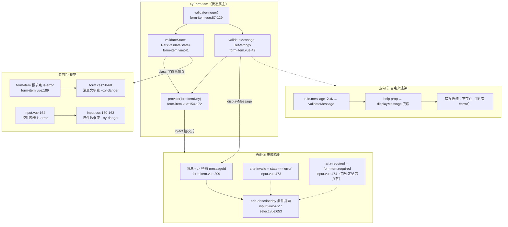
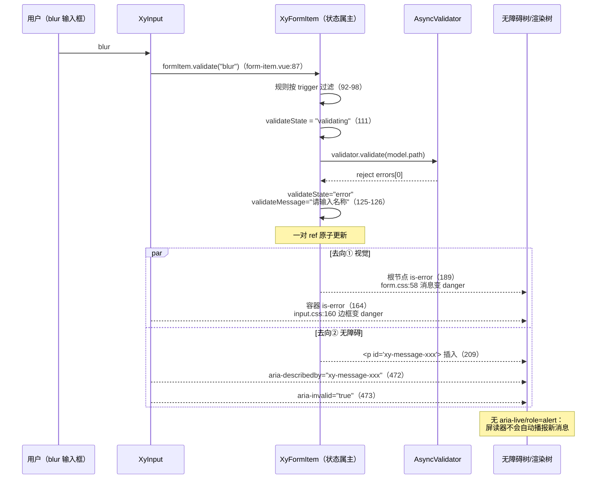
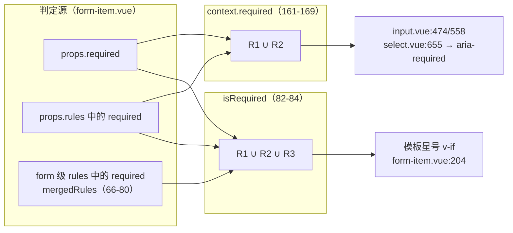

# 6-18 · FormItem：消息与 aria 链路

> **核心问题：错误态如何同时作用于样式与无障碍树。**
> 6-17 拆完了 form 层的编排——字段注册表、`Promise.all` 聚合校验、`scrollToError` 的落点；4-08 则顺着四层配置链讲清了"form-item 的错误态是怎么传进 input 的"这个通用机制。但那条线里一直悬着三个没展开的问题：校验失败之后，`validateState` 和 `validateMessage` 这对状态到底流向了哪里？消息节点 `<p>` 的 id 是怎么和控件的无障碍属性接上头的？以及那个星号亮而 `aria-required` 为 `false` 的已知不一致，根源究竟在哪。本篇把 `form-item.vue` 全文摊开，逐条实码定论错误消息的三条去向——视觉、无障碍、自定义渲染——并顺手把消费矩阵里几处不齐的地方记录在案。下一篇 6-19《Upload：文件队列》会看到另一类"控件消费 formItemContext"的形态：upload 把这个 id 交给一个隐藏的 file input。

---

## 一、先看全景：一个错误态，三条去向

`XyFormItem` 是整个表单体系里唯一同时持有"校验结果"和"消息文本"的节点。校验动作可以由 form 层发起（`validateField` 遍历注册表），也可以由控件层发起（blur/change 时调 `formItem.validate(trigger)`），但无论谁触发，状态的落点都是 form-item 内部的两个 ref：

```ts
const validateState = ref<ValidateState>("idle");
const validateMessage = ref("");
```

（`packages/components/form/src/form-item.vue:41-42`）

从这对 ref 出发，错误态分三路离场，各自的载体完全不同：

- **第一路·视觉**：`validateState === "error"` 被翻译成 `is-error` 类字符串，一路挂在 form-item 根节点（`form-item.vue:189`），一路由控件侧自行拼进自己的容器 class（`input.vue:164`）——两处 CSS 各管各的视觉落点。
- **第二路·无障碍**：消息 `<p>` 持有一个注册 id（`messageId`），控件侧在渲染原生输入元素时把 `aria-describedby` 条件式指向它，同时 `aria-invalid`、`aria-required` 由同一份 context 驱动。
- **第三路·自定义渲染**：这一条的实码结论是"当前不存在"——form-item 没有错误插槽，自定义只能停留在文本层（rule 的 `message` 字段与 `help` prop），渲染结构不可定制。这是与 Element Plus 的一个明确差异，后面专节对比。



这张图是本篇的骨架。下面按代码顺序把每一环拆开。

## 二、状态属主与 id 工厂：setup 的前半段

先读 `form-item.vue` 脚本区的完整前半段（第 1-85 行），所有后续讨论的地基都在这里：

```ts
<script setup lang="ts">
import AsyncValidator from "async-validator";
import {
  computed,
  inject,
  onBeforeUnmount,
  onMounted,
  provide,
  ref,
  toRaw
} from "vue";
import { useNamespace } from "xiaoye-primitives";
import type {
  FormFieldContext,
  FormTrigger,
  ValidateState,
  XyFormRule
} from "./context";
import { formItemKey, formKey } from "./context";
import type { FormProp } from "./utils";
import { getPathValue, normalizeFormProp, setPathValue } from "./utils";

export interface FormItemProps {
  label?: string;
  prop?: FormProp;
  rules?: XyFormRule[];
  required?: boolean;
  help?: string;
}

const props = withDefaults(defineProps<FormItemProps>(), {
  label: "",
  prop: "",
  rules: () => [],
  required: false,
  help: ""
});

const form = inject(formKey, null);
const ns = useNamespace("form-item");
const validateState = ref<ValidateState>("idle");
const validateMessage = ref("");
const rootRef = ref<HTMLElement | null>(null);
const inputId = `xy-field-${Math.random().toString(36).slice(2, 10)}`;
const messageId = `xy-message-${Math.random().toString(36).slice(2, 10)}`;
const propKey = computed(() => normalizeFormProp(props.prop));

function cloneValue<T>(value: T): T {
  if (value === undefined || value === null || typeof value !== "object") {
    return value;
  }

  const rawValue = toRaw(value);

  if (typeof globalThis.structuredClone === "function") {
    return globalThis.structuredClone(rawValue);
  }

  return JSON.parse(JSON.stringify(rawValue)) as T;
}

const initialValue = ref(
  props.prop && form ? cloneValue(getPathValue(form.props.model, props.prop) as never) : undefined
);

const mergedRules = computed<XyFormRule[]>(() => {
  const rules = [
    ...(propKey.value && form?.props.rules?.[propKey.value] ? form.props.rules[propKey.value] : []),
    ...props.rules
  ];

  if (props.required && !rules.some((rule) => rule.required)) {
    rules.unshift({
      required: true,
      message: props.label ? `请填写${props.label}` : "请填写必填项"
    });
  }

  return rules;
});

const isRequired = computed(
  () => props.required || mergedRules.value.some((rule) => rule.required)
);
const displayMessage = computed(() => validateMessage.value || props.help || "");
</script>
```

（`packages/components/form/src/form-item.vue:1-85`）

这段代码里有三个值得停下来的人物。

**第一个是状态属主本身。** `validateState` 的类型来自 `context.ts:7`：

```ts
export type FormTrigger = "blur" | "change";
export type ValidateState = "idle" | "validating" | "success" | "error";
```

（`packages/components/form/src/context.ts:6-7`）

四态状态机：`idle → validating → success/error`，`clearValidate` 把它拉回 `idle`。注意它是一个 plain `ref` 而不是 computed——没有任何输入能自动推导出它，只有 `validate()` 和 `clearValidate()` 两个动作能写它。这个"只能被动作写、不能被推导"的性质，决定了它必须住在 form-item 而不是别处（本节末尾的权衡一细说）。

**第二个是 id 工厂。** 第 44-45 行：

```ts
const inputId = `xy-field-${Math.random().toString(36).slice(2, 10)}`;
const messageId = `xy-message-${Math.random().toString(36).slice(2, 10)}`;
```

这是整条 aria 链路的起点，也是本库与 Element Plus 分道扬镳的地方。两个 id 都是 setup 执行期的常量字符串，用 `Math.random` 而不是 Vue 的 `useId()`——在纯客户端渲染下这没问题，但在 SSR 水合场景下服务端与客户端会生成不同的值，label 与控件的关联会在水合瞬间错位。当前这套组件库不主打 SSR，所以这是一个被明确接受的边界，而不是疏忽；但它值得被记录，因为一旦未来要支持 Nuxt 集成，这里就是第一批要换 `useId()` 的位置。4-08 考据里提到的"控件 id 从哪来"在这里可以定论：**仓库里没有 `useInputId` 之类的工具函数**（全库搜索 `useInputId`/`use-input-id` 无结果），id 的生成被内联在 form-item 的 setup 里，控件侧只做"显式 prop 优先、formItem 下发兜底"的读取。

**第三个是 `isRequired`——口径差的埋伏点。** 第 82-84 行：

```ts
const isRequired = computed(
  () => props.required || mergedRules.value.some((rule) => rule.required)
);
```

它的判定源是 `mergedRules`，而 `mergedRules`（第 66-80 行）的组成是"form 级 rules 在前 + 自身 rules 在后 + `required` 快捷属性注入的必填规则插队首"。也就是说，**模板星号（第 204 行 `v-if="isRequired"`）看得见 form 级 rules**——只要 `form` 的 `rules.name` 里有一条 `required: true`，哪怕 form-item 自身什么都没写，星号也会亮。而第四节会看到，provide 给控件的 `required` 却只看自身 props——**同一个"必填"语义，两套判定源**。星号亮而 `aria-required="false"` 的不一致，根源就在这两处 computed 读了不同的东西。第八节展开。

还有一处小节读：`displayMessage`（第 85 行）`validateMessage.value || props.help || ""`。优先级是"校验消息 > help prop > 空"。这个合并写法把两种语义不同的话——瞬时错误、常驻帮助——塞进了同一个计算属性，最终由同一个 `<p>` 渲染、共用同一个 id。它在视觉上省了一个节点，在无障碍语义上却把"描述"（describedby 的本职）与"错误状态"混在了一起，第七节回到这一点。

## 三、validate()：状态机的写入端

校验函数全文（第 87-134 行，含 `clearValidate`）：

```ts
async function validate(trigger?: FormTrigger) {
  if (!form || !props.prop || !propKey.value) {
    return true;
  }

  const filtered = mergedRules.value.filter((rule) => {
    if (!trigger || !rule.trigger) {
      return true;
    }

    return Array.isArray(rule.trigger) ? rule.trigger.includes(trigger) : rule.trigger === trigger;
  });

  const normalizedRules = filtered.map((rule) => {
    const { trigger: _trigger, ...validatorRule } = rule;
    return validatorRule;
  });

  if (!normalizedRules.length) {
    validateState.value = "idle";
    validateMessage.value = "";
    return true;
  }

  validateState.value = "validating";
  const validator = new AsyncValidator({
    [propKey.value]: normalizedRules
  });

  try {
    await validator.validate({
      [propKey.value]: getPathValue(form.props.model, props.prop)
    });
    validateState.value = "success";
    validateMessage.value = "";
    return true;
  } catch (error) {
    const first = (error as { errors?: Array<{ message?: string }> }).errors?.[0];
    validateState.value = "error";
    validateMessage.value = first?.message ?? "校验失败";
    return false;
  }
}

function clearValidate() {
  validateState.value = "idle";
  validateMessage.value = "";
}
```

（`packages/components/form/src/form-item.vue:87-134`）

逐段看消息的诞生过程。

**触发过滤**（92-98 行）：`trigger` 缺省时放行全部规则——这对应 form 层 `validateField()` 不带 trigger 的调用；控件层传 `"blur"` 或 `"change"` 时，只跑声明了匹配 trigger 的规则，没写 trigger 的规则依然全触发（表单提交场景的兜底）。

**空规则回 idle**（105-109 行）：一个容易被忽略的细节——如果过滤后一条规则都不剩，状态不是保持原样，而是**主动回落到 `idle` 并清空消息**。这意味着"改了 rules 让某字段暂时无规则可跑"时，旧错误会自动消失，不需要调用方手动 `clearValidate`。这也解释了 form 层 `validateOnRuleChange` 场景下的行为自洽。

**成功与失败**（116-128 行）：成功时 `success` + 清空消息；失败时取 `errors[0]`——async-validator 对同字段多条规则逐条执行，错误列表按序产出，这里只展示第一条，语义是"form 级规则的错误优先展示"（form 级在前，见 `mergedRules` 的拼接顺序）。`first?.message ?? "校验失败"` 给了无 message 规则一个兜底文案。

**状态迁移与消息是原子写的**：四个写入点（105-106、111、120-121、125-126）都是成对更新 state 和 message，不存在"状态变了但消息残留"的中间态。这是三条去向能共用一对 ref 的前提——下游无论读哪个，都不会读到半更新的快照。

校验的触发端在控件侧。以 select 为例（`select.vue:405、443、449、469、482`），blur 后调 `formItem?.validate("blur")`，选中值变化后调 `formItem?.validate("change")`。form-item 的 `validate` 同时出现在两个交付物里：provide 给控件的 context（第 170 行）和注册给 form 的 `fieldContext`（第 149 行）——同一个函数引用，两个消费者，触发源不同但写入端唯一。

## 四、provide 的清单与 form 注册表

```ts
function resetField() {
  if (!form || !props.prop) {
    return;
  }

  setPathValue(form.props.model, props.prop, cloneValue(initialValue.value));
  clearValidate();
}

const fieldContext: FormFieldContext = {
  prop: props.prop as string | undefined,
  propKey: propKey.value,
  element: rootRef.value,
  validate,
  clearValidate,
  resetField
};

provide(formItemKey, {
  prop: props.prop,
  inputId,
  messageId,
  message: displayMessage,
  validateState,
  disabled: computed(() => Boolean(form?.props.disabled)),
  required: computed(() => {
    if (props.required) {
      return true;
    }
    if (props.rules?.some((rule) => rule.required)) {
      return true;
    }
    return false;
  }),
  validate,
  clearValidate
});

onMounted(() => {
  fieldContext.element = rootRef.value;
  form?.addField(fieldContext);
});

onBeforeUnmount(() => {
  form?.removeField(fieldContext);
});
```

（`packages/components/form/src/form-item.vue:136-181`）

对上，`fieldContext` 在 mounted 时补齐 DOM 引用后进 form 注册表（setup 执行期模板 ref 还是 null，只能等 mounted）——这是 6-17 讲过的注册流程，不再重复。对下，`provide(formItemKey)` 交付的清单里，与本篇直接相关的是三组：

1. **身份组**：`inputId`、`messageId`、`prop`。前两个是 aria 链路的两个端点，注意它们是**字符串常量**而非 ref——id 一生不变，控件侧可以放心地绑定而无需响应式追踪。
2. **状态组**：`message`（就是 `displayMessage` 的引用）、`validateState`、`required`、`disabled`。全部是 ref/computed，控件侧用 `.value` 拉取。
3. **动作组**：`validate`、`clearValidate`。

关键的口径差在第 161-169 行的 `required`：

```ts
required: computed(() => {
  if (props.required) {
    return true;
  }
  if (props.rules?.some((rule) => rule.required)) {
    return true;
  }
  return false;
}),
```

判定源只有 `props.required` 和 `props.rules`——**form 级 rules 不在视野内**。对照第二节的 `isRequired`（第 82-84 行）读的是 `mergedRules`（含 form 级），两份"必填"判定从这一刻起分家：星号看 `isRequired`，控件拿到的 `required` 只看自身。第八节专门展开这个已知不一致的全链路后果。

另一个值得注意的细节：`disabled` 转发（第 160 行）和 `required` 都被包成 computed 再交付，而 `inputId`/`messageId` 是裸字符串。控件的消费方式也与此对应——布尔状态用 `.value` 订阅，id 直接读。

## 五、template：星号、label 关联与消息节点

```html
<template>
  <div
    ref="rootRef"
    :class="[
      ns.base.value,
      validateState === 'error' ? 'is-error' : '',
      validateState === 'success' ? 'is-success' : '',
      form?.props.inline ? 'is-inline' : '',
      form?.props.disabled ? 'is-disabled' : ''
    ]"
  >
    <label
      v-if="props.label"
      class="xy-form-item__label"
      :for="inputId"
      :style="{
        width:
          !form?.props.inline && form?.props.labelWidth ? `${form.props.labelWidth}` : undefined
      }"
    >
      <span v-if="isRequired" class="xy-form-item__required">*</span>
      {{ props.label }}
    </label>
    <div class="xy-form-item__content">
      <slot />
      <p v-if="displayMessage" :id="messageId" class="xy-form-item__message">
        {{ displayMessage }}
      </p>
    </div>
  </div>
</template>
```

（`packages/components/form/src/form-item.vue:184-214`）

模板里三处结构值得逐一标注。

**label 的 for/id 关联链。** 第 198 行 `:for="inputId"` 指向 form-item 自己生成的 `xy-field-xxx`。这个 for 能否真正关联到控件，取决于 slot 里有没有元素真的持有这个 id——**form-item 不做任何注入**，它只是把 id 放进 context，控件"愿意领"才关联得上。下一节的消费矩阵会看到：input 领了（绑到原生 `<input>`）、time-picker 领了（绑到 `role="combobox"` 的 trigger div）、tree-select 没领（trigger div 没有 id 绑定，此时 label 的 for 指向一个不存在的元素，关联落空）。这是"推模式"方案的固有代价，第六节权衡二细说。

**星号。** 第 204 行 `<span v-if="isRequired" class="xy-form-item__required">*</span>`。视觉上它是红色的（`form.css:41-44`），但它**没有任何 aria 标注**——既不是 `<abbr title="required">`，也没有 `aria-hidden`。对屏读用户来说，这个星号要么被读成 "star"/"星号"（取决于标点朗读设置），要么被吞掉。换句话说，本库在"必填"这个语义上的无障碍表达**完全依赖控件侧的 `aria-required`**——而第四节刚说过，`aria-required` 的判定源还不含 form 级 rules。视觉通道与语义通道各自漏了一块，拼起来才是完整的不一致。

**消息节点。** 第 209-211 行：

```html
<p v-if="displayMessage" :id="messageId" class="xy-form-item__message">
  {{ displayMessage }}
</p>
```

三个属性，三个结论：

1. `v-if="displayMessage"`——消息节点**按需存在**。空态下 DOM 里没有这个 `<p>`，所以控件侧的 `aria-describedby` 必须条件绑定（指向不存在元素的 describedby 是无效引用，部分屏读器会警告）。
2. `:id="messageId"`——这就是"错误消息 id 的注册机制"的定论：**没有注册机制**。id 不是由消息节点动态生成再上报，而是 form-item 在 setup 时先造好、provide 下去、消息节点被动地挂上它。生成的时机早于消费，方向是"先有 id 后有节点"。
3. **没有 `role="alert"`、没有 `aria-live`**。这个 `<p>` 在 DOM 里的插入与移除是静默的——屏读用户在校验失败时不会收到任何自动播报，只有重新聚焦控件、靠 `aria-describedby` 主动读出消息内容才能感知错误。对比 Element Plus 用 `role="alert"`（动态插入会触发播报），这是本库 aria 链路上最明显的一个缺口。第九节的不一致清单里记录在案。

## 六、去向①：视觉——两级 is-error，两处 CSS

视觉链路的第一级在 form-item 自身，第二级在控件容器。先看 form-item 级的 CSS 全貌：

```css
.xy-form-item {
  display: flex;
  align-items: flex-start;
  gap: 16px;
}

.xy-form.is-inline .xy-form-item,
.xy-form--inline .xy-form-item {
  flex: 0 0 auto;
  min-width: min(100%, 280px);
}

.xy-form--top .xy-form-item {
  flex-direction: column;
  gap: 8px;
}

.xy-form-item__label {
  flex: 0 0 auto;
  display: inline-flex;
  align-items: center;
  color: var(--xy-text-muted);
  min-height: 40px;
  font-weight: var(--xy-font-weight-520);
}

.xy-form-item__required {
  color: var(--xy-danger);
  margin-right: 4px;
}

.xy-form-item__content {
  flex: 1;
  min-width: 0;
}

.xy-form-item__message {
  margin: 8px 0 0;
  font-size: var(--xy-font-size-sm);
  color: var(--xy-text-muted);
  line-height: 1.5;
}

.xy-form-item.is-error .xy-form-item__message {
  color: var(--xy-danger);
}

.xy-form-item.is-success .xy-form-item__message {
  color: var(--xy-success);
}

.xy-form-item.is-disabled {
  opacity: 0.72;
}
```

（`packages/theme/src/components/form.css:15-68`）

is-error 段（58-60 行）只做了一件事：把消息文字从 `--xy-text-muted` 染成 `--xy-danger`。注意这条规则的作用域是 `.xy-form-item.is-error .xy-form-item__message`——**消息节点永远渲染在 form-item 容器内**，所以 form-item 级的 is-error 就足以覆盖消息的全部视觉。

第二级在控件容器。input 侧把同一个状态翻译成自己的 class（`input.vue:161-174` 的 `containerKls`）：

```ts
const containerKls = computed(() => [
  isTextarea.value ? nsTextarea.base.value : nsInput.base.value,
  `${(isTextarea.value ? nsTextarea : nsInput).base.value}--${mergedSize.value}`,
  validateState.value === "error" ? "is-error" : "",
  validateState.value === "success" ? "is-success" : "",
  inputDisabled.value ? "is-disabled" : "",
  isFocused.value ? "is-focus" : "",
  inputExceed.value ? "is-exceed" : "",
  hasPrefix.value ? "has-prefix" : "",
  suffixVisible.value ? "has-suffix" : "",
  hasPrepend.value ? "has-prepend" : "",
  hasAppend.value ? "has-append" : "",
  attrs.class
]);
```

（`packages/components/input/src/input.vue:161-174`）

然后 CSS 接手边框：

```css
.xy-input.is-error .xy-input__wrapper,
.xy-textarea.is-error .xy-textarea__wrapper {
  border-color: var(--xy-danger);
}

.xy-input.is-success .xy-input__wrapper,
.xy-textarea.is-success .xy-textarea__wrapper {
  border-color: var(--xy-success);
}
```

（`packages/theme/src/components/input.css:160-168`）

**为什么控件要自己拼一遍 is-error，而不是 form-item 把 class 打到控件的 DOM 上？** 这是本篇的第一处设计权衡：

> **权衡一·状态分发的属主与形态。** `validateState` 的属主只能是 form-item——它封装了"什么时候跑校验、跑哪些规则、结果如何"的全部知识，控件既不该也不需要知道。但属主定了之后，"分发"有两条路：form-item 直接修改控件根元素的 class（命令式 DOM 操作），或者控件主动 inject 状态、自己拼 class（拉模式）。本库选了后者，理由有三：一，form-item 拿到的 `slot` 内容是 VNode 树，往里注 class 需要克隆 VNode 并透传 props，成本高且脆弱；二，命令式改 DOM 会绕过 Vue 的渲染管线，与控件的受控渲染打架；三，拉模式让控件保持"无 form-item 也能独立工作"——`formItem?.validateState.value ?? "idle"` 的 `??` 兜底（`input.vue:103`）意味着控件单独使用时状态恒为 idle，行为完整。代价是 class 字符串 `is-error` 成了一条**跨组件的口头协议**——form-item 写、控件读、CSS 消费，三方靠字面量对齐，改名字就是破坏性变更。这条协议在 4-08 已经点过名，本篇看到的是它在 CSS 层的落点。

视觉与无障碍在这里分岔：同一个 `validateState === "error"` 判断，在 input.vue 里被消费了两次——第 164 行拼 class（视觉），第 473 行绑 `aria-invalid`（无障碍）。一条状态，两个出口，互不依赖。

## 七、去向②：无障碍树——id 下发与控件消费矩阵

这是本篇的核心一节。控件侧的消费代码，以 input 为例分两段看。先是 setup 的接线：

```ts
const attrs = useAttrs();
const slots = useSlots();
const formItem = inject(formItemKey, null);
const form = inject(formKey, null);
const nsInput = useNamespace("input");
const nsTextarea = useNamespace("textarea");
const { size: globalSize } = useConfig();

const inputRef = shallowRef<HTMLInputElement | null>(null);
const textareaRef = shallowRef<HTMLTextAreaElement | null>(null);
const wrapperRef = ref<HTMLDivElement | null>(null);
const isFocused = ref(false);
const hovering = ref(false);
const passwordVisible = ref(false);
const isComposing = ref(false);
const textareaCalcStyle = ref<CSSProperties>({});
const displayValue = ref("");

const mergedSize = computed(() => props.size ?? form?.props.size ?? globalSize.value);
const isTextarea = computed(() => props.type === "textarea");
const inputDisabled = computed(() => props.disabled || (formItem?.disabled.value ?? false));
const hasPrefix = computed(() => Boolean(slots.prefix) || Boolean(props.prefixIcon));
const hasSuffix = computed(() => Boolean(slots.suffix) || Boolean(props.suffixIcon));
const hasPrepend = computed(() => Boolean(slots.prepend));
const hasAppend = computed(() => Boolean(slots.append));
const hasValue = computed(() => displayValue.value.length > 0);
const inputId = computed(() => props.id ?? formItem?.inputId);
const messageId = computed(() => (formItem?.message.value ? formItem.messageId : undefined));
const validateState = computed(() => formItem?.validateState.value ?? "idle");
const nativeValue = computed(() => (props.modelValue == null ? "" : String(props.modelValue)));
```

（`packages/components/input/src/input.vue:75-104`）

第 101-103 行是消费端的三行核心，逐行读：

- `inputId = props.id ?? formItem?.inputId`：**显式 prop 永远赢**。用户自己传了 id，form-item 的生成值让位——label 的 for 依然指向 form-item 的 id，此时若用户没把控件 id 同步给 form-item，关联会断；这是推模式的第二个代价（EP 用注册制解决的正是这个场景）。
- `messageId = formItem?.message.value ? formItem.messageId : undefined`：**条件绑定**。只有消息非空时才输出 describedby——因为消息 `<p>` 是 `v-if` 按需渲染的，空引用必须防。注意判断的是 `message.value`（displayMessage，含 help 兜底），不是 `validateMessage`：当字段显示 help 时，describedby 同样指向那个 `<p>`，语义是"这个输入框的补充说明"——help 与错误共用一条 describedby 通道。
- `validateState = formItem?.validateState.value ?? "idle"`：独立控件兜底 idle。

然后是模板里的落地（input 元素的关键属性段）：

```html
<input
  :id="inputId"
  ref="inputRef"
  class="xy-input__inner"
  v-bind="nativeAttrs"
  :value="displayValue"
  :name="props.name"
  :minlength="props.minlength"
  :maxlength="props.maxlength"
  :type="currentInputType"
  :disabled="inputDisabled"
  :readonly="props.readonly"
  :autocomplete="props.autocomplete"
  :tabindex="props.tabindex"
  :aria-label="props.ariaLabel"
  :aria-describedby="messageId"
  :aria-invalid="validateState === 'error'"
  :aria-required="formItem?.required.value"
  :placeholder="props.placeholder"
  :style="inputElementStyle"
  :form="props.form"
  :autofocus="props.autofocus"
  :role="props.containerRole"
  :inputmode="props.inputmode"
  @compositionstart="handleCompositionStart"
  @compositionend="handleCompositionEnd"
  @input="handleInput"
  @change="handleChange"
  @focus="handleFocus"
  @blur="handleBlur"
/>
```

（`packages/components/input/src/input.vue:457-487`；textarea 分支在第 542-565 行有一模一样的四件套——`:id`（543）、`:aria-describedby`（556）、`:aria-invalid`（557）、`:aria-required`（558））

至此，"错误态如何同时作用于样式与无障碍树"的无障碍半边可以画出完整时序：



时序图末尾的 Note 是刻意标注的缺口，先按下，第八节对比 EP 时收回来。

### 控件消费矩阵（全库盘点）

把 form-item 下发的四样东西——`inputId`、`messageId`（describedby）、`validateState`（is-error/aria-invalid）、`required`（aria-required）——在各控件的落点盘一遍（全部行号为当前工作区实态）：

| 控件 | 领 inputId | describedby 指向消息 | aria-invalid | aria-required |
|---|---|---|---|---|
| input（input+textarea） | 101→458/543 | 472/556 | 473/557 | 474/558 |
| select | — | 653 | 654 | 655 |
| input-number | 61→487 | 503 | 504 | — |
| time-picker | 534（combobox trigger） | 541 | 542 | — |
| tree-select | **未领** | 323 | 324 | — |
| rate | 65→343 | 356 | 355 | — |
| switch | 58 | 235 | 233 | — |
| auto-complete | 341 | — | — | — |
| checkbox（非 group） | 57→126 | — | — | — |
| radio（非 group） | 37→88 | — | — | — |
| upload | 63→415/455 | — | — | — |

三行加粗的例外值得单独说：

1. **tree-select 没领 inputId**（`tree-select.vue:317-326` 的 trigger div 只有 describedby/invalid，没有 `:id`）——form-item 的 label `:for` 指向的 id 悬空，label 与控件的程序化关联落空。用户点击 label 不会聚焦控件。
2. **checkbox/radio 系不绑任何消息 aria**：`checkbox.vue:57` `props.id ?? (!checkboxGroup ? formItem?.inputId : undefined)` 在 group 场景下连 id 都不领，`checkbox-group.vue:103` 只给 `aria-label="checkbox-group"`。错误消息对它们只能靠视觉通道。
3. **upload 的领法独一份**：它把 inputId 转手塞给 `upload-content` 的**隐藏 file input**（`upload.vue:415/455` → `upload-content.vue:343` `:id="props.inputId"`）——label 关联的是那个视觉上不可见的上传 input。这也是下一篇 6-19 的引子：upload 的文件队列与消息链路如何衔接，届时展开。

**aria-required 的消费也不齐**：只有 input（474/558）和 select（655）绑了，switch/rate/time-picker/tree-select/input-number 都没有，尽管 formItemContext 明确交付了 `required` 字段（`context.ts:58`）。这不是 context 的缺陷，是消费端未覆盖——下一节会看到，input 和 select 恰好是两个把 `aria-required` 做对的控件，而它们读到的值本身还有口径问题。

**还有一个写法层面的不一致**：`rate.vue:355` 是 `:aria-invalid="validateState === 'error' ? 'true' : undefined"`（非错误时属性完全省略），而 `input.vue:473` 是 `:aria-invalid="validateState === 'error'"`（非错误时 Vue 会渲染出 `aria-invalid="false"`——aria 属性不是 boolean attribute，`false` 不会被移除）。两者对屏读器语义等价（`aria-invalid="false"` 与缺省同义），但产物 DOM 不同，风格上也没对齐。记录在第九节清单。

## 八、去向③与 EP 对比：插槽、注册制与 role="alert"

### 第三条去向的实码定论：没有错误插槽

form-item 的模板（第五节全文）里只有一个默认 `<slot />`，没有 `name="error"`。自定义消息的合法途径只剩文本层两种：rule 的 `message` 字段（进 `validateMessage`）和 `help` prop（`displayMessage` 兜底）。想要"图标 + 文字 + 跳转链接"的错误形态，当前做不到——除非整个 form-item 不用，自己在外面拼。这是第三条去向的定论：**自定义渲染通道缺失，自定义文本通道健全**。

Element Plus 对应位置怎么做的？以 element-plus dev 分支 `packages/components/form/src/form-item.vue` 为参照（行内引用其源码，不标行号），错误消息渲染结构是：

```html
<transition-group :name="`${ns.namespace.value}-zoom-in-top`">
  <slot v-if="shouldShowError" name="error" :error="validateMessage">
    <div :class="validateClasses" role="alert">
      {{ validateMessage }}
    </div>
  </slot>
</transition-group>
```

三个差异点：其一，EP 有作用域插槽 `#error`，插槽入参是 `error` 消息文本，默认渲染内容可被整个替换；其二，默认渲染的 div 带 `role="alert"`——元素动态插入 DOM 时屏读器会主动播报其内容，"校验失败→自动念出错误"这条体验 EP 有、本库没有；其三，`shouldShowError` 是三条件与——`validateStateDebounced === 'error'`（状态经 100ms 防抖）、组件级 `showMessage`、form 级 `showMessage`——EP 把"要不要显示错误"做成了双层开关，本库的等价物只有 `v-if="displayMessage"` 一个条件。

### 注册制 vs 推模式

id 关联机制上，EP 与本库是两个方向的镜像：

| | 本库（推模式） | Element Plus（注册制） |
|---|---|---|
| id 由谁生成 | form-item setup 时生成 `xy-field-xxx` | 控件自己生成（或用户显式传入） |
| 流动方向 | form-item → context → 控件领取 | 控件挂载时调 `addInputId(id)` 上报，卸载 `removeInputId` |
| label 的 for | 恒为 `:for="inputId"` | `props.for ?? (inputIds.length === 1 ? inputIds[0] : undefined)` |
| 多控件场景 | 只有一个控件能领到 id（领了才关联） | 多个 input 上报后 label 不关联，label 元素退化为 `div` + `role="group"` + `aria-labelledby` |
| 用户显式传 id | form-item 不知道，for 仍指向生成 id，可能断链 | `labelFor` 优先 `props.for`，注册表让位 |

EP 的 `labelFor` 策略值得多看一眼：只有**恰好一个**注册输入时才自动关联，两个以上（比如一个 form-item 里塞两个输入框的组合控件）就放弃 for 关联，改用 `role="group"` + `aria-labelledby` 把 label 读成组标题——这是对"label for 只能指向一个元素"这一 HTML 约束的诚实妥协。本库的推模式没有这个自适应能力，但它换来了极简的消费协议：控件一行 `props.id ?? formItem?.inputId` 就完成接线，不需要挂载/卸载两个生命周期钩子的上报仪式。**对于一个 72 个组件、多数控件单输入的库，推模式的复杂度预算是花在刀刃上的；代价是本节开头盘点的那几处"没领 id"的场景会静默断链**，而 EP 的注册制下"没上报"同样静默——两种方案都没有对"控件忘了接线"做任何告警，这是共同的盲区。

> **权衡二·aria 方案选型。** 推模式与注册制的取舍本质是"谁来保证 id 的唯一性与可达性"。本库选择 form-item 集中造 id：唯一性天然保证（每个实例 setup 一次），控件侧零仪式成本，但它假设"一个 form-item 对应一个主输入元素"——radio/checkbox group、多输入组合控件在这个假设下只能选择不领 id（`checkbox.vue:57` 的 `!checkboxGroup` 条件就是这个假设破裂处的补丁）。EP 的注册制把假设换成协议：控件显式声明"我是可关联输入"，form-item 动态决定 for 关联还是分组语义，表达力更强，成本是每个表单控件都要挂 `useFormItemInputId` 的生命周期。没有绝对优劣，只有与组件库规模和控件形态分布的匹配度——本库 19 个表单组件里，双输入以上的组合控件占比很低，推模式是够用且更便宜的选择。

### role="alert" 缺口的修复路径

回到时序图末尾的缺口。本库消息 `<p>` 无 role、无 aria-live，校验失败对屏读用户是静默的。修复其实只要一行——`<p :id="messageId" role="alert" ...>`（动态插入的 alert 会自动播报）。为什么不加？因为消息节点同时承载 help——help 是常驻内容，挂 `role="alert"` 意味着"每次插入 help 文案也播报"，在表单初始化时会产生噪音。正解是拆节点：错误消息与 help 分开渲染，前者 `role="alert"`，后者保持普通 describedby 目标。这牵动 `displayMessage` 的合并逻辑与两个 id 的设计，属于有明确方案但未排期的改造。记录于此，供后续考据。

## 九、星号与 aria-required：一个已知不一致的全链路展开

4-08 考据时记下的那条"form 级 rules 的 required 不进 required 上下文"，本篇把它的完整因果链摆出来。

三个判定源，三个消费者：



当 required 只声明在 form 级 rules 时（`<xy-form :rules="{ name: [{ required: true, ... }] }">`，form-item 只写 `prop` 不写 `required`）：

- 星号：`isRequired` 为真，**亮**；
- `aria-required`：context.required 为假，input 渲染 `aria-required="false"`——**语义上否认必填**。

视觉与语义在同一个字段上给出相反答案。而且这个不一致还会被第六节的消费矩阵放大：即使修好了 context.required 的口径，switch/rate/time-picker/tree-select/input-number 也不消费它——**必填语义的无障碍表达目前只在 input 和 select 两个控件上端到端成立**。

> **权衡三·星号与 aria-required 的口径。** 为什么会有两套判定？星号的判定源是 `mergedRules`，因为星号要回答的问题是"这个字段会不会被必填规则拦下"——它是校验行为的预告，必须与校验的实际执行范围一致；context.required 的判定源是自身 props，因为它在 2026-09 之前的版本里可能只是"form-item 显式声明了 required"的回声，form 级 rules 是后来才接入 mergedRules 的能力，provide 的清单没有跟着重算。修复方向没有悬念：让 context.required 直接引用 `isRequired`（一行改动），让 aria-required 的消费矩阵补齐——真正的问题是要不要顺手把"星号本身对屏读器隐藏（`aria-hidden="true"`）"也做掉，因为理想状态下星号应该纯粹是视觉冗余，语义完全由 aria-required 承担；现在星号未被隐藏，修口径反而会制造"星号念一遍、aria-required 再念一遍"的重复播报。口径修复与星号降噪应该作为同一批改动落地。

## 十、测试与类型夹具：链路的守护面

form 的单测（`packages/components/form/__tests__/form.spec.ts`，全文 119 行、三个用例）没有直接断言 aria 属性，但两个用例守护了消息文本的产出与消失路径。第一个用例覆盖"form 层触发 → 消息出现 → reset"：

```ts
it("rules 为 reactive 对象时深层修改会自动触发重新校验", async () => {
  const model = reactive({ name: "" });
  const rules = reactive<Record<string, Array<{ required: boolean; message: string }>>>({});

  const wrapper = mount({
    components: {
      XyForm,
      XyFormItem,
      XyInput
    },
    setup() {
      return {
        model,
        rules
      };
    },
    template: `
      <xy-form :model="model" :rules="rules">
        <xy-form-item label="名称" prop="name">
          <xy-input v-model="model.name" />
        </xy-form-item>
      </xy-form>
    `
  });

  expect(wrapper.text()).not.toContain("请输入名称");

  rules.name = [{ required: true, message: "请输入名称" }];
  await flushPromises();
  await nextTick();

  expect(wrapper.text()).toContain("请输入名称");
});
```

（`packages/components/form/__tests__/form.spec.ts:52-84`；第 86-118 行是它的孪生用例，覆盖普通对象整体替换触发。第一个用例 7-50 行则覆盖 `validateField` 返回 false → `wrapper.text()` 含消息 → `resetFields` 复位。）

值得注意的守护盲区：三个用例全部断言 `wrapper.text()`——**消息文本**的存在性，没有断言 `is-error` class、`aria-describedby`、`aria-invalid` 中的任何一个。也就是说，三条去向里只有"文本产物"有测试守护，视觉类与 aria 类的回归只能靠人工巡检（`pnpm audit:visual` 覆盖视觉，但 aria 链路连巡检都没有）。如果要补，最划算的断言是：`wrapper.find("input").attributes("aria-describedby")` 与 `wrapper.find(".xy-form-item__message").attributes("id")` 相等——一行测试同时锚住 id 下发与条件绑定两端。这是本篇给出的一个待办。

类型层的守护在夹具里：

```ts
import type { FormProp, FormRules } from "xiaoye-components";

const rules: FormRules = {
  name: [{ required: true, message: "请输入名称", trigger: "blur" }],
  role: [{ required: true, trigger: ["change"] }]
};

void rules;

const invalidRules: FormRules = {
  name: [
    {
      // @ts-expect-error unsupported trigger should fail
      trigger: "submit"
    }
  ]
};

void invalidRules;

const nestedProp: FormProp = ["profile", "name"];

void nestedProp;
```

（`tests/types/fixtures/form.ts:1-23`）

夹具锁死了两个与本篇相关的类型契约：`trigger` 只接受 `"blur" | "change"`（`FormTrigger`，`context.ts:6`），非法值 `"submit"` 必须 type error——这正是 `validate()` 里 trigger 过滤（92-98 行）的类型前提；嵌套 prop 走 `["profile", "name"]` 数组形式，经 `normalizeFormProp`（`utils.ts:3-9`）拼成 `"profile.name"` 成为 `mergedRules` 与 AsyncValidator 的 key。消息的 key 链路：`prop` 数组 → `propKey` 字符串 → `mergedRules` 的取值键 → AsyncValidator 的 schema 键，四个位置共用同一个 `normalizeFormProp` 产物，类型夹具保证了入口不歪。

## 十一、文档示例：用户看到的链路

文档示例（`apps/docs/examples/form/basic.vue`）的模板段展示了链路的"标准接线姿势"：

```html
<template>
  <!-- 表单基础用法：展示数据绑定、校验规则、校验结果反馈 -->
  <div class="xy-doc-stack">
    <xy-form ref="formRef" :model="memberForm" :rules="rules">
      <xy-form-item label="成员名称" prop="name">
        <xy-input v-model="memberForm.name" placeholder="请输入成员名称" />
      </xy-form-item>
      <xy-form-item label="角色" prop="role">
        <xy-select
          v-model="memberForm.role"
          :options="[
            { label: '管理员', value: 'admin' },
            { label: '成员', value: 'member' },
            { label: '访客', value: 'guest' }
          ]"
        />
      </xy-form-item>
    </xy-form>

    <xy-space wrap>
      <xy-button type="primary" @click="submitFormValidation">提交并校验</xy-button>
      <xy-tag :status="validationFeedback.includes('通过') ? 'success' : 'warning'">{{ validationFeedback }}</xy-tag>
    </xy-space>
  </div>
</template>
```

（`apps/docs/examples/form/basic.vue:31-55`）

这个示例恰好落在消费矩阵里消费最齐的两行：input 和 select——全库只有这两个控件绑定了 `aria-required`，接线层面无可挑剔。但再看 rules 的挂法：两个字段的 `required` 都声明在 **form 级** `rules` 里，form-item 自身既没写 `required` 也没写 rules。于是第九节那张口径图在此现实复现：星号看 `isRequired`（含 form 级 rules），**亮**；`aria-required` 读 context.required（不含 form 级 rules），**是 `false`**。官方示例的第一屏就是一个"视觉宣称必填、语义否认必填"的表单——示例文档无意间成了口径差的最佳现场演示，用户照抄这段代码就能得到一个屏读器不认为必填、但眼睛看着必填的表单。文档 `form.md:93` 的属性表里 `help` 被描述为"帮助或占位提示文案"，未提它与错误消息共用节点及 describedby 的语义合并——文档侧的叙述与实态的差距也记入清单。

## 十二、不一致清单：本篇新发现与遗留

全篇实码核对后，把叙述与源码的出入、源码自身的不一致统一归档：

1. **星号 vs aria-required 口径差**（4-08 记录，本篇展开）：`isRequired`（form-item.vue:82-84，含 form 级 rules）与 context.required（161-169，不含）判定源分裂。
2. **aria-required 消费矩阵不齐**：仅 input（474/558）、select（655）绑定；switch/rate/time-picker/tree-select/input-number 未消费 context.required。
3. **消息节点无 role="alert"/aria-live**（form-item.vue:209）：动态出现不播报；EP 有 role="alert"。
4. **help 与错误共用节点与 id**（form-item.vue:85、209）：describedby 目标语义混一，这也是 role="alert" 不能直接加的原因。
5. **tree-select 未领 inputId**（tree-select.vue:317-326）：label 的 for 悬空。
6. **checkbox/radio 系无消息 aria**（checkbox.vue:57、radio.vue:37、checkbox-group.vue:103、radio-group.vue:135-136）：错误只能视觉感知。
7. **aria-invalid 写法不一**：input.vue:473 渲染 `aria-invalid="false"`，rate.vue:355 省略属性——语义等价，产物不同。
8. **`Math.random` 生成 id**（form-item.vue:44-45）：非 `useId()`，SSR 水合不安全（当前非目标，记录为边界）。
9. **无 error 插槽**：自定义渲染通道缺失（EP 有 `#error` 作用域插槽）。
10. **测试守护盲区**：form.spec.ts 三个用例只断言消息文本，未锚定 is-error/aria 链路。

这些不一致中，1、2、4 是同一批语义问题的三个切面，适合一次性修；3、7、8 是低成本独立项；5、6 属于控件侧覆盖问题，适合随各控件的迭代补齐。

## 结语

回到标题的问题："错误态如何同时作用于样式与无障碍树？"完整答案是：**它先在一处诞生——form-item 的 validate() 把 AsyncValidator 的结果原子地写进 `validateState` 和 `validateMessage` 这对 ref；然后分两路各走各的桥**——视觉这路走 class 字符串协议（form-item 与控件各自拼 `is-error`，CSS 双层落点：消息染色、边框染色），无障碍这路走 id 下发协议（`xy-field-xxx` 关联 label，`xy-message-xxx` 承接 describedby，`aria-invalid` 随状态翻转）。两条桥都不是自动铺的：控件必须主动 inject、主动领 id、主动拼 class——本库的推模式把接线成本压缩到消费端三行代码，代价是接线遗漏时静默断链，而消费矩阵盘点出的 tree-select 悬空、checkbox/radio 缺位、aria-required 不齐，正是这些断链的存档。EP 用注册制、role="alert"、#error 插槽在这三处给出了更完整的形态；本库的差距是明确的，修复路径也是明确的——口径统一、节点拆分、消费矩阵补齐，三件事各有归属。消息与 aria 链路的价值恰恰在于：**它把"错误"从一个视觉事件升格为一个对所有用户可感知的事件，而这条升级路线上的每一步，都写在你现在读的这二百行代码里。**

下一篇 6-19《Upload：文件队列》，我们去表单体系的最外圈——upload 已经在消费矩阵里亮过相：它是唯一把 inputId 转交给隐藏 file input 的控件（upload.vue:415/455）。届时看文件队列的状态机（pending/uploading/success/error）、`limit` 与 `on-exceed` 的边界语义、手动重试如何替换 raw file，以及文件项的视觉与 aria 如何承接本篇铺好的 form-item 消息链路。
