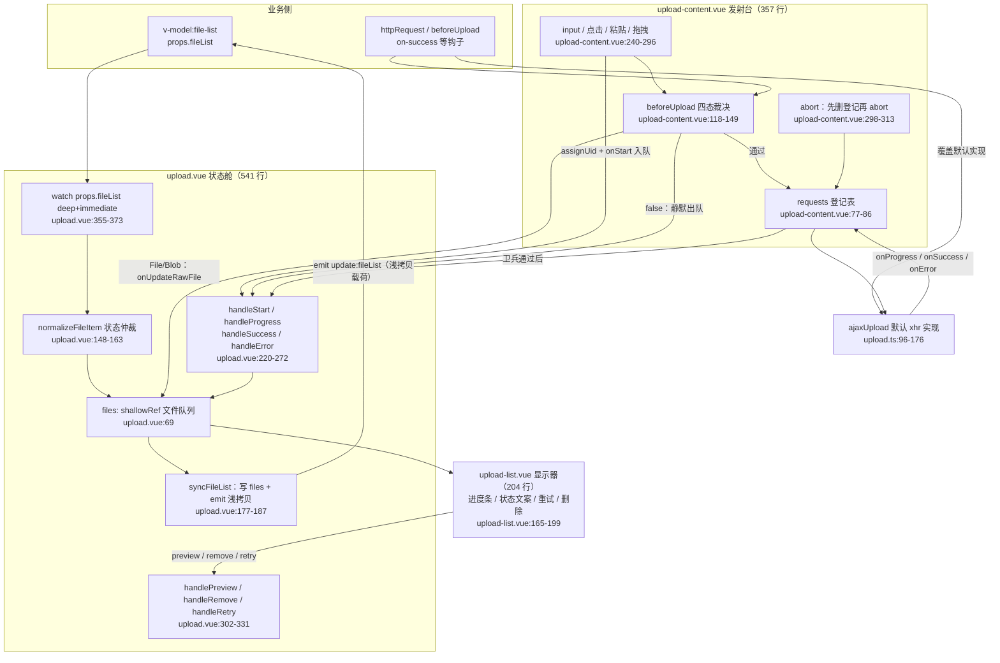
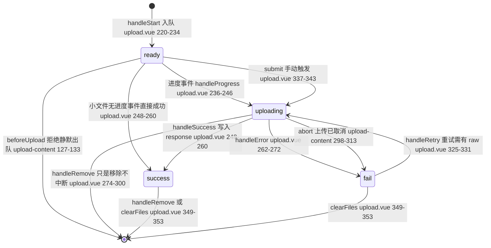
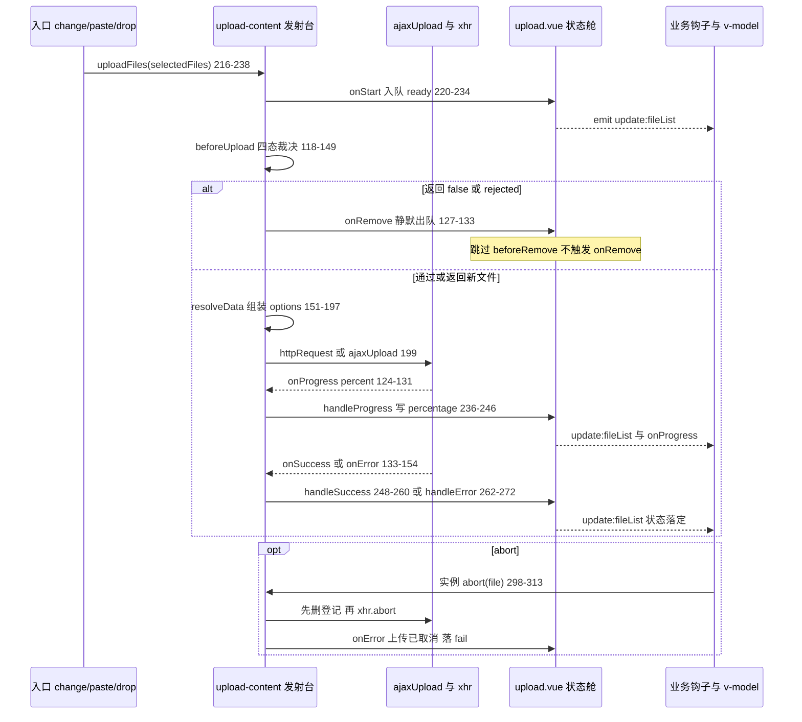

# 6-19 · Upload：文件队列

> 本篇是「表单组件」章节的第十九篇，研究对象是 `upload`——表单家族里唯一一个真正在网络上传输字节的组件，也因此是全仓库协议面最宽的一个：它要同时定义"文件长什么样"（`UploadFileItem`）、"请求长什么样"（`UploadRequestOptions`）、"进度长什么样"（`UploadProgressEvent`）与"中断长什么样"（`abort` 语义）。本篇围绕核心问题展开：**自定义请求与进度回调的协议设计**——默认的 XMLHttpRequest 封装（`ajaxUpload`）与用户覆盖的 `http-request` 之间靠什么契约握手；一次 progress 事件如何从 `xhr.upload` 一路走到进度条的 `width`；`abort` 如何让 xhr 与 Promise 两种请求风格共用一个中断协议。沿途收进三笔工程账：完全受控的文件队列（对照 EP 的内部队列）、`before-upload` 的四态裁决协议，以及 Object URL 的精确回收。所有路径与行号均在当前工作区逐一核对（`upload.vue` 实态 541 行、`upload-content.vue` 357 行、`upload-list.vue` 204 行、`upload.ts` 176 行、`upload.css` 401 行、测试 573 行 15 用例、类型夹具 34 行、文档示例 15 个）；三张核心 mermaid 图，一张三件套数据流，一张文件状态机，一张上传时序。

---

## 一、三件套与队列的归属：状态上缴、执行下放

### 1.1 四个文件，三种角色

`upload` 的目录比家族平均水平多一层：`index.ts` 之外，`src/` 下有四个文件，加上 `packages/theme/src/components/upload.css`（401 行）与 573 行的测试。分工是一张标准的"状态舱—发射台—显示器"三件套（4-03 的三件套范式在这里长出了第四块：协议与默认实现独立成 `upload.ts`）：

| 文件 | 行数 | 职责 |
| --- | --- | --- |
| `src/upload.vue` | 541 | 状态舱：持有文件队列、状态机回调、预览弹层、对 `props.fileList` 的受控同步 |
| `src/upload-content.vue` | 357 | 发射台：input/点击/粘贴/拖拽四个入口、`beforeUpload` 裁决、请求发起与登记、`abort` |
| `src/upload-list.vue` | 204 | 显示器：text/picture/picture-card 三种列表形态、进度条、重试与删除按钮 |
| `src/upload.ts` | 176 | 协议层：全部类型、`genFileId`、默认请求实现 `ajaxUpload` |

关键的架构决定是**队列住在哪**。答案在 `upload.vue:69`：

```ts
const files = shallowRef<UploadFileItem[]>([]);
```

文件队列只此一份，住在状态舱里；发射台 `upload-content.vue` 手里**没有**任何文件状态，它对队列的全部触达都是通过回调完成的。看它的 props 声明（`upload-content.vue:20-53`）——除了 `fileList: UploadFileItem[]`（只读地用于 limit 计数）之外，全是六个状态回调的注入（引文为回调段 `43-53` 行）：

```ts
  onStart: (file: UploadRawFile) => Awaitable<void>;
  onProgress: (event: UploadProgressEvent, file: UploadRawFile) => Awaitable<void>;
  onSuccess: (response: unknown, file: UploadRawFile) => Awaitable<void>;
  onError: (error: Error, file: UploadRawFile) => Awaitable<void>;
  onRemove: (
    file: UploadRawFile | UploadFileItem,
    options?: { skipBeforeRemove?: boolean; emitRemove?: boolean }
  ) => Awaitable<void>;
  onUpdateRawFile: (uid: string, rawFile: UploadRawFile) => Awaitable<void>;
  onExceed: (files: File[], fileList: UploadFileItem[]) => void;
```

这是 5-16"provide 侧下发、子组件上报"的回调版：**状态上缴、执行下放**。发射台只负责"把文件推进网络"，每一步状态迁移都以回调通知状态舱；状态舱是唯一有资格写 `files` 的地方。好处在第五节的 abort 协议里会看到：因为中断也要写状态（进 fail），所以中断逻辑同样落在发射台，但它通过 `onError` 回调把状态变化交还给状态舱——写路径仍然只有一条。

三件套加上业务侧的完整数据流收进第一张主图：



### 1.2 权衡一：完全受控的文件队列 vs EP 的内部队列

**权衡一（受控文件列表 vs 内部队列）：** EP 2.x 的 `el-upload` 把真实队列放在组件内部的 `uploadFiles` ref 里，`file-list` prop 只作为初始列表灌进去，业务想"受控"得自己监听事件再手工回写——受控是可选的、半途的。本库的选择是把 `props.fileList` 作为**唯一数据源声明**（`upload.vue:20-21` 默认 `() => []`），内部 `files` 只是它的规范化投影，双向通道由两段代码维护。上行（内部 → 外部）是 `syncFileList`（`upload.vue:177-187`）；下行（外部 → 内部）是一个 `deep: true, immediate: true` 的 watch（`upload.vue:355-373`，第八节 Block H 里全文引出）。

上行通道有个容易忽略的细节：emit 的载荷不是 `files.value` 本身，而是浅拷贝（`upload.vue:169-171`）：

```ts
function getDisplayFiles() {
  return files.value.map((file) => ({ ...file }));
}
```

`syncFileList` 里 `files.value = nextFiles` 先行、`emit("update:fileList", displayFiles)` 随后，父组件 v-model 写回的是一份浅拷贝，父列表变化再触发下行 watch 重新规范化——一个受控组件必备的"回环"就此闭合，且回环只走一圈就停（watch 触发后只写 `files.value`，不再 emit）。浅拷贝的用意与 6-02 的 Input 受控镜像同源：**不让外部拿到内部对象的引用**，业务改 `files.value[0].percentage` 之类的心思从根上被隔离。

受控队列的回报在文档示例里看得最直白（`apps/docs/examples/upload/single-replace.vue:13-15`）：

```ts
function handleChange(nextFiles: UploadFileItem[]) {
  files.value = nextFiles.length ? [nextFiles[nextFiles.length - 1] as UploadFileItem] : [];
}
```

"单文件场景只保留最后一次选择"——头像、封面、主合同替换——业务在 `update:fileList` 的出口处裁一刀就完成了，组件内部零改动。这在 EP 的内部队列模型里要先拿到内部队列、再想办法让组件吞回去，繁琐得多。代价也要记账：deep watch 对大列表的性能负担（每次内部更新都要重新 normalize 一遍全表，包括给每项重建对象与预览 URL 协商）；以及第七节会讲的"回环会两次写 `files.value`"的固有冗余。本库的判断与 4-04 的受控双模一脉相承：**表单家族的列表值一律走受控协议，代价用规范化的幂等性来消化**。

---

## 二、文件状态机：四个状态与一条仲裁规则

### 2.1 normalizeFileItem：每个文件入场前的身份核验

状态机的类型定义只有一行（`upload.ts:4`）：`"ready" | "uploading" | "success" | "fail"`。四个状态的语义仲裁全部收敛在 `normalizeFileItem`（`upload.vue:148-163`）：

```ts
function normalizeFileItem(file: UploadFileItem): UploadFileItem {
  const normalized: UploadFileItem = {
    ...file,
    uid: file.uid || genFileId(),
    status: file.status ?? (file.raw ? "ready" : "success"),
    percentage: file.percentage ?? (file.status === "success" ? 100 : 0)
  };

  const previewUrl = ensurePreviewUrl(normalized);

  if (previewUrl) {
    normalized.url = previewUrl;
  }

  return normalized;
}
```

两行默认值是这个函数的全部灵魂。第一行：没有 `status` 的文件，**有 `raw` 判 ready，无 `raw` 判 success**——业务直接传 `[{ uid, name, size, url }]` 做编辑态回显（`apps/docs/examples/upload/list.vue:5-16` 的两份预设文件）时，它们天然落在 success：不显示"待上传"、不显示进度条（`upload-list.vue:56-58` 的 `shouldShowStatus` 对 success 返回 false）、没有重试按钮。"来自远端的既有文件"与"等待上行的本地文件"用 `raw` 的有无来区分，一条判据省掉一整个 `source: "remote" | "local"` 字段。第二行：percentage 的默认值跟着 status 的**显式值**走——显式声明了 success 的回显项直接 100，否则 0。注意两行的判据不同（一个看 `raw`，一个看 `status`），这保证 `{ uid, name, status: "success", url }` 这种"显式成功的远端项"与 `{ uid, name }` 这种"隐式回显项"都能落到正确的档位。

`genFileId`（`upload.ts:89-94`）值得顺带一笔：uid 是**字符串** `xy-upload-${Date.now()}-${uploadSeed}`，模块级种子递增；EP 的 uid 是数字。字符串 uid 在业务里可以直接当 DOM key 与后端幂等键用，这是小选择，但选了就写进了协议（`UploadFileItem.uid: string`，`upload.ts:13`）。

### 2.2 状态机全景

四个状态的迁移路径收进第二张主图（迁移标注的行号均为当前实态）：



这张图上有三条不显眼但重要的边。**其一，ready → success 直达**：极小的文件可能一帧之内完成传输，`xhr.upload` 的 progress 事件一次都没来得及发，`load` 事件直接到达——`handleSuccess` 不管当前状态是什么，直接写 success + 100%。也就是说 uploading 不是必经之途，进度条可能从未出现过，组件不假装"至少闪一下进度"（假上传通道除外，第四节）。**其二，fail → uploading 的重试边**只认 `file.raw` 存在的文件：远端回显的 fail 项没有 raw，`handleRetry` 直接 return（`upload.vue:325-331`），列表渲染层同样用 `file.status === 'fail' && file.raw && !props.disabled` 双条件隐藏重试按钮（`upload-list.vue:184-190`）——数据条件与渲染条件严格同源，测试 `upload.spec.ts:432-447` 专门锁了这个用例。**其三，没有 canceled 状态**：中断（abort）落点是 fail，错误文案"上传已取消"——状态机保持四态，"取消"只是 fail 的一种成因。这与 4-05 浮层三态、6-12 日历状态机的取向一致：状态数能少则少，成因信息放在载荷与文案里，不进状态机。

### 2.3 四个 handle：状态舱侧的迁移执行器

四个迁移执行器都在状态舱里，全文如下（`upload.vue:220-272`）：

```ts
async function handleStart(rawFile: UploadRawFile) {
  const nextFile = normalizeFileItem({
    uid: rawFile.uid,
    name: rawFile.name,
    size: rawFile.size,
    type: rawFile.type,
    status: "ready",
    percentage: 0,
    raw: rawFile
  });

  const nextFiles = files.value.concat(nextFile);
  const displayFiles = await syncFileList(nextFiles);
  emitChangeEvent(nextFile, displayFiles);
}

async function handleProgress(event: UploadProgressEvent, rawFile: UploadRawFile) {
  const nextFiles = await updateFile(rawFile.uid, {
    status: "uploading",
    percentage: event.percent
  });
  const file = findFile(rawFile);

  if (file && nextFiles) {
    props.onProgress?.(event, file, nextFiles);
  }
}

async function handleSuccess(response: unknown, rawFile: UploadRawFile) {
  const nextFiles = await updateFile(rawFile.uid, {
    status: "success",
    percentage: 100,
    response
  });
  const file = findFile(rawFile);

  if (file && nextFiles) {
    props.onSuccess?.(response, file, nextFiles);
    emitChangeEvent(file, nextFiles);
  }
}

async function handleError(error: Error, rawFile: UploadRawFile) {
  const nextFiles = await updateFile(rawFile.uid, {
    status: "fail"
  });
  const file = findFile(rawFile);

  if (file && nextFiles) {
    props.onError?.(error, file, nextFiles);
    emitChangeEvent(file, nextFiles);
  }
}
```

对称的四段：先 `updateFile` 写状态（找不到 uid 时自然空转——文件已被移除的在途请求结果"无处落地"），再 `findFile` 拿更新后的对象，找到了才调业务钩子。注意 `onChange` 的语义边界：`handleStart`、`handleSuccess`、`handleError` 三个入口都会 `emitChangeEvent`，唯独 `handleProgress` **不发 change 只发 onProgress**——进度是高频噪声，把它排除出 change 通道是协议的一部分（EP 的 `change` 事件同样只在 add/success/fail 时触发，两家的账一致）。还有一处与家族其他成员不同的取timing：`syncFileList` 的 `validate` 参数只在 `handleRemove`（`upload.vue:295`）与 `clearFiles`（`upload.vue:352`）传 true——**加入文件不触发表单校验，移除才触发**。理由是 ready 态不是终态：加文件即校验会拿一个"上传中"的列表去判必填，为时过早；而移除让列表变短，必填校验恰好此刻才有意义。4-08 的表单联动协议里 upload 是唯一"校验时机后置到移除"的成员，读代码时不要当成遗漏。

---

## 三、before-upload：四态返回值与静默出队

### 3.1 一段裁决，四种出口

上传协议的第一道闸门在发射台。`upload()` 的前半段（`upload-content.vue:118-149`）：

```ts
  if (props.beforeUpload) {
    let beforeUploadResult: boolean | void | null | undefined | File | Blob;

    try {
      beforeUploadResult = await props.beforeUpload(rawFile);
    } catch {
      beforeUploadResult = false;
    }

    if (beforeUploadResult === false) {
      await props.onRemove(rawFile, {
        skipBeforeRemove: true,
        emitRemove: false
      });
      return;
    }

    if (beforeUploadResult instanceof Blob) {
      const nextFile =
        beforeUploadResult instanceof File
          ? beforeUploadResult
          : new File([beforeUploadResult], rawFile.name, {
              type: beforeUploadResult.type || rawFile.type
            });

      nextRawFile = Object.assign(nextFile, {
        uid: rawFile.uid
      }) as UploadRawFile;

      await props.onUpdateRawFile(rawFile.uid, nextRawFile);
    }
  }
```

类型签名（`upload.ts:72-74`）已经把协议写明白了：`Awaitable<boolean | void | null | undefined | File | Blob>`。四种出口逐条对账：

1. **`false` → 静默出队**。文件已经在队列里（`uploadFiles` 的循环里 `onStart` 先于 `upload` 执行，第二节说过），拦截的落点是把它移除。`UploadRemoveOptions` 的两个旗标（`upload.ts:41-44`）在这里同时亮起：`skipBeforeRemove: true` 跳过业务注册的 `beforeRemove`，`emitRemove: false` 不触发 `onRemove`——**拦截不是删除**，业务没有表达过"用户删了文件"的意图，删除链路的钩子一个都不该响。这两个旗标是这个协议最讲究的部分：`onRemove` 是复用的通道，但语义由旗标隔离。
2. **rejected Promise → 归 false**。`catch` 把一切异常折叠成拦截，异步校验（查重、鉴权、查库）抛错与显式拒绝同罪。文档页的行为约定（`apps/docs/components/upload.md:116`）与之一致。
3. **File/Blob → 替换上传对象**。压缩、转码、重命名的场景：`beforeUpload` 返回一个新文件，发射台用 `Object.assign(nextFile, { uid: rawFile.uid })` 把**原 uid 钉在新文件上**，再经 `onUpdateRawFile` 回调状态舱同步列表条目（名字、大小、类型、raw 引用，`upload.vue:206-213`）。Blob 不是 File 的分支现场造一个 File（沿用原名与类型），保证下游 FormData 里塞的永远是 File。测试 `upload.spec.ts:449-478` 锁定"返回新文件后列表条目的 name 与 raw 同步替换"。
4. **其余（true/void/null/undefined）→ 放行**。`=== false` 的严格等值让"宽容返回"成为可能：异步函数忘了 return、校验函数只写副作用不返回值，都不误伤。

### 3.2 权衡二：四态协议的回报与陷阱

**权衡二（四态返回值 vs 简单 boolean）：** 最朴素的协议是 `beforeUpload: (file) => boolean`，够用但表达不了"替换文件"，压缩场景只能改协议加第二个钩子。EP 2.x 的 `before-upload` 是这套四态语义的定型者（false/Promise reject 阻断、返回 File/Blob 替换，社区惯例由此而来），本库照单全收——这不是偷懒，是**生态兼容的刻意选择**：从 EP 迁移过来的业务代码，`beforeUpload` 一行不改就能继续跑。回报讲完了，陷阱也要诚实记：第 4 类出口靠的是 `=== false` 的 truthiness 反向判断，意味着 `beforeUpload` 返回 `0`、`""` 这些 falsy 非布尔值**会放行**（只有布尔 false 才拦）。类型层已经把返回值约束成四态联合，`0` 和 `""` 传不进来（类型夹具 `tests/types/fixtures/upload.ts` 的正例 18-19 行锁的就是 `file.size < 2_000_000` 与 `() => true` 两个合法形态），运行时的宽容只是类型协议被绕过时的兜底。文档示例 `apps/docs/examples/upload/before-upload.vue:8-12` 是标准用法：

```ts
function beforeUpload(file: UploadRawFile) {
  const allowed = file.size <= 1024 * 1024;
  message.value = allowed ? `${file.name} 通过校验。` : `${file.name} 超出 1 MB 限制。`;
  return allowed;
}
```

---

## 四、请求协议：UploadRequestOptions 与 ajaxUpload

### 4.1 协议契约：一个 options 包，三个回调

自定义请求与默认请求的握手契约是 `UploadRequestOptions`（`upload.ts:28-39`）加 `UploadRequestHandler`（`upload.ts:46-48`）：

```ts
export interface UploadRequestOptions {
  action: string;
  method: string;
  data: Record<string, unknown>;
  filename: string;
  file: UploadRawFile;
  headers: Record<string, string | number | boolean | null | undefined>;
  withCredentials: boolean;
  onProgress: (event: UploadProgressEvent) => void;
  onSuccess: (response: unknown) => void;
  onError: (error: Error) => void;
}

export interface UploadRemoveOptions {
  skipBeforeRemove?: boolean;
  emitRemove?: boolean;
}

export type UploadRequestHandler = (
  options: UploadRequestOptions
) => XMLHttpRequest | Promise<unknown> | void;
```

这份契约的设计要点是**回调与返回值的分工**：`onProgress/onSuccess/onError` 三个回调是"结果汇报通道"，返回值是"中断句柄"。自定义请求可以只调回调不返回（fire-and-forget，返回 void），也可以只返回 Promise 让组件代接（`.then(onSuccess)`），也可以像 xhr 一样返回句柄靠事件驱动。三种风格都能工作，组件侧的裁决在 `upload-content.vue:199-213`：

```ts
  const request = (props.httpRequest ?? ajaxUpload)(requestOptions);

  if (request instanceof XMLHttpRequest || request instanceof Promise) {
    requests.value[nextRawFile.uid] = {
      rawFile: nextRawFile,
      request,
      canceled: false
    };
  }

  if (request instanceof Promise) {
    request.then(requestOptions.onSuccess).catch((error: unknown) => {
      requestOptions.onError(error instanceof Error ? error : new Error("上传失败"));
    });
  }
```

`httpRequest ?? ajaxUpload` 一行完成默认与覆盖的切换；返回值按三种形态分流登记。这里藏着一个协议级的精妙处——**双通道去重**。看官方示例 `apps/docs/examples/upload/custom-request.vue:12-29`：

```ts
function customRequest(options: UploadRequestOptions) {
  return new Promise((resolve) => {
    window.setTimeout(() => {
      options.onProgress({
        lengthComputable: true,
        loaded: options.file.size,
        total: options.file.size,
        percent: 100
      } as ProgressEvent & { percent: number });
      const response = {
        action: options.action,
        fileName: options.file.name
      };
      options.onSuccess(response);
      resolve(response);
    }, 300);
  });
}
```

这个 handler **既手动调了 `options.onSuccess`，又返回了 Promise**——如果两条通道都入账，文件会被写两次 success、业务钩子响两次。实际不会：`onSuccess` 回调的闭包（`upload-content.vue:177-186`）第一件事是查登记表 `requests.value[uid]`，找到就 `delete` 再调 `props.onSuccess`；Promise 的 `.then(onSuccess)` 随后到达时登记项已删，卫兵 `!requestRecord` 直接拒收。**登记表不只是中断用的花名册，还是结果回调的幂等去重器**——delete-before-call 的次序是承重墙。`onProgress`/`onError` 的闭包同构（`168-176`、`187-196`），卫兵三处一致。

### 4.2 ajaxUpload：默认实现的全部

默认请求实现 81 行（`upload.ts:96-176`）：

```ts
export function ajaxUpload(options: UploadRequestOptions) {
  if (!options.action || options.action === "#") {
    return new Promise((resolve) => {
      window.setTimeout(() => {
        options.onProgress({
          lengthComputable: true,
          loaded: options.file.size,
          total: options.file.size,
          percent: 100
        } as UploadProgressEvent);
        options.onSuccess({ ok: true });
        resolve({ ok: true });
      }, 0);
    });
  }

  const xhr = new XMLHttpRequest();
  xhr.open(options.method.toUpperCase(), options.action, true);
  xhr.withCredentials = options.withCredentials;

  Object.entries(options.headers).forEach(([key, value]) => {
    if (value === undefined || value === null) {
      return;
    }

    xhr.setRequestHeader(key, String(value));
  });

  xhr.upload.addEventListener("progress", (event) => {
    const percent = event.total ? (event.loaded / event.total) * 100 : 0;
    options.onProgress(
      Object.assign(event, {
        percent
      }) as UploadProgressEvent
    );
  });

  xhr.addEventListener("error", () => {
    options.onError(new Error("上传失败"));
  });

  xhr.addEventListener("abort", () => {
    options.onError(new Error("上传已取消"));
  });

  xhr.addEventListener("load", () => {
    if (xhr.status >= 200 && xhr.status < 300) {
      const responseText = xhr.responseText;

      try {
        options.onSuccess(responseText ? JSON.parse(responseText) : responseText);
      } catch {
        options.onSuccess(responseText);
      }
      return;
    }

    options.onError(new Error(`上传失败（${xhr.status}）`));
  });

  const formData = new FormData();

  Object.entries(options.data).forEach(([key, value]) => {
    if (value === undefined || value === null) {
      return;
    }

    if (Array.isArray(value)) {
      value.forEach((item) => {
        formData.append(key, item instanceof Blob ? item : String(item));
      });
      return;
    }

    formData.append(key, value instanceof Blob ? value : String(value));
  });

  formData.append(options.filename, options.file);
  xhr.send(formData);
  return xhr;
}
```

**权衡三（action="#" 的假上传通道）：** 开头六行是最容易被当成 demo 垃圾、实际上是最重的默认值决策——`action` 的默认值是 `"#"`（`upload.vue:22`），而 `ajaxUpload` 对空值与 `"#"` 一律走 setTimeout 的模拟通道：一个宏任务后直报 100% 进度 + `{ ok: true }` 成功。回报是文档体验：文档站 15 个示例大半没有后端，选完文件即见 success，`pnpm dev` 零配置可跑；playground 联调也先跑通交互再接接口。代价同样真实：**生产环境忘了配 action 不会报错，只会静默假成功**——没有任何 console 警告（对比 EP：action 是 `el-upload` 的必填 prop，缺省在类型与运行时校验层就会被拦下；本库为了演示体验把它放宽成了默认 `"#"`，护栏让位给了开箱即用）。本库把这个风险留给了类型层之外的行为约定，诚实说是**省了一道护栏**；缓解手段是文档页"何时不使用"与示例 tip 反复强调接 `http-request` 的时机。真请求路径上值得记的细节：headers 与 data 都跳过 null/undefined（业务用条件展开塞可选字段时不必自己过滤）；data 支持数组逐项 append 与 Blob 直塞（163-170）；文件字段**最后** append（173 行）——部分后端网关对 multipart 字段顺序敏感，文件垫底是最稳的排法。

### 4.3 进度回调链：从 xhr.upload 到进度条 width

进度是本篇核心协议，整条链路值得逐站走一遍。第一站在 `ajaxUpload` 内部（上面 124-131 行）：监听的是 `xhr.upload` 的 progress——XMLHttpRequestUpload 对象，**上传方向**的事件源；percent 的算式带除零守卫（`event.total ? ... : 0`，total 为 0 的场景如 unknown-length 流）；随后 `Object.assign(event, { percent })`——直接在**原生 ProgressEvent 上挂一个 percent 字段**再整体 cast 成 `UploadProgressEvent`。这个"猴子补丁"式做法与 EP 的 ajax 同款（EP 同样在原生事件上挂 percent），类型定义 `UploadProgressEvent extends ProgressEvent { percent: number }`（`upload.ts:24-26`）只是对既成事实的类型追认。第二站在发射台：`onProgress` 闭包查登记表卫兵，通过后 `void props.onProgress(event, nextRawFile)`。第三站在状态舱：`handleProgress`（第二节引过）把 `event.percent` 写进 `percentage` 并置 uploading。第四站在列表：`upload-list.vue:169-179`：

```html
          <div class="xy-upload-list__details">
            <span>{{ formatSize(file.size) }}</span>
            <span v-if="shouldShowStatus(file.status)">{{ getStatusText(file.status) }}</span>
            <span v-if="file.status === 'uploading'">{{ Math.round(file.percentage ?? 0) }}%</span>
          </div>
          <div v-if="file.status === 'uploading'" class="xy-upload-list__progress">
            <span
              class="xy-upload-list__progress-bar"
              :style="{ width: `${file.percentage ?? 0}%` }"
            />
          </div>
```

文字百分比取整、进度条 width 精确到小数，都从同一个 `file.percentage` 投影——**进度条是受控队列的纯渲染，没有任何独立的进度状态**。业务钩子 `onProgress` 在第三站分叉出去（`upload.vue:244`），拿到的是 `(event, file, files)` 三元组：原始进度事件、当前文件（更新后的对象）、全量列表快照。整条链的时序收进第三张图：



**权衡四（xhr 封装 vs fetch）：** 2026 年给上传组件选传输层，为什么还是 XMLHttpRequest？三个协议理由。**其一，上传方向的进度事件只有 xhr 有**：`xhr.upload.onprogress` 是浏览器对上传字节流的唯一进度通报；fetch 的进度能力只覆盖下载方向（`response.body` 是 ReadableStream），上传方向的进度要靠 duplex stream 手动分块计数，且 Safari 的支持成熟得晚——做上传组件，fetch 要么放弃进度，要么自己造进度。**其二，中断**：`xhr.abort()` 是原生语义，中断句柄（xhr 实例）天然就是请求对象本身，与 `UploadRequestHandler` 的返回值契约严丝合缝；fetch 的对应物是 AbortController，信号要先塞进 options、控制器要在组件侧持有，协议要多传一个对象。**其三，withCredentials 与 FormData** 都是 xhr 的一行配置。fetch 的优势（Promise 化、Response 解析、Service Worker 拦截）对"发一个 FormData"这件事没有增益。EP 2.x 的默认实现同样是 XMLHttpRequest 封装（同样返回 xhr 供 abort、同样在原生 progress 事件上挂 percent），两家在这一层罕见地一致——因为约束是浏览器给的，不是框架给的。自定义请求要接 fetch（比如签名直传 SDK 内部是 fetch）完全合法：返回 Promise，走 `.then` 通道，只是**上传进度没有了**，组件不假装补一个。

---

## 五、中断协议：登记表、canceled 旗标与 delete-before-abort

### 5.1 abort 的次序是承重墙

中断的完整实现只有 16 行（`upload-content.vue:298-319`）：

```ts
function abort(file?: UploadFileItem) {
  const entries = Object.entries(requests.value).filter(([uid]) =>
    file ? file.uid === uid : true
  );

  entries.forEach(([uid, requestRecord]) => {
    requestRecord.canceled = true;
    delete requests.value[uid];

    if (requestRecord.request instanceof XMLHttpRequest) {
      requestRecord.request.abort();
    }

    void props.onError(new Error("上传已取消"), requestRecord.rawFile);
  });
}

defineExpose({
  abort,
  upload,
  handleClick
});
```

逐行拆解这份协议。**登记的过滤**：无参调用中断全部（`filter` 的 `: true` 分支），传文件只中断该 uid——组件实例上的 `abort(file?)` 是用户中断单个与全部的唯一入口（`upload.vue:345-347` 透传，`defineExpose` 暴露，`upload.vue:389-395`），`clearFiles` 与组件卸载（`onBeforeUnmount`，`upload.vue:384-387`）都在内部先无参 `abort()`。**次序**：`canceled = true` → `delete 登记项` → `xhr.abort()` → 手动 `onError`。把 delete 放在 abort **之前**是刻意的：`xhr.abort()` 会同步触发 ajaxUpload 里注册的 `abort` 事件监听（`upload.ts:137-139`），那个监听会调 `options.onError`——如果登记项还在，中断会被报两次（手动一次、事件一次）；delete 先行，事件回调撞上空登记表被卫兵拒收，`onError`（→ fail 态）只入账一次。次序反过来就是双重失败状态的 bug，这四行的排列不是随手的。

**Promise 请求的中断是账面中断**：`requestRecord.request instanceof XMLHttpRequest` 不成立，abort 只做三件事——标 canceled、删登记、报"上传已取消"。底层的传输**没有停**（fetch/第三方 SDK 继续跑完，带宽照花），组件只是拒收它之后的一切回调：`.then(onSuccess)` 迟到时登记已空，成功不会回写。测试 `upload.spec.ts:480-520` 用一个永不 resolve 的 Promise 精确锁定了这个语义：

```ts
  it("Promise 风格请求 abort 后不会再回写成功状态", async () => {
    const abortPending = {} as {
      resolve: (value: unknown) => void;
    };
    const onError = vi.fn();
    const wrapper = mount(XyUpload, {
      props: {
        fileList: [],
        onError,
        httpRequest: () =>
          new Promise((resolve) => {
            abortPending.resolve = resolve;
          })
      }
    });

    const input = wrapper.find('input[type="file"]');
    const file = new File(["hello"], "avatar.png", { type: "image/png" });

    Object.defineProperty(input.element, "files", {
      configurable: true,
      value: [file]
    });

    await input.trigger("change");
    await nextTick();

    const latestFiles = wrapper.emitted("update:fileList")?.at(-1)?.[0] as UploadFileItem[] | undefined;
    const targetFile = latestFiles?.[0];
    expect(targetFile).toBeTruthy();

    (wrapper.vm as unknown as { abort: (file?: UploadFileItem) => void }).abort(targetFile);
    await flushPromises();
    abortPending.resolve({ ok: true });

    await flushPromises();

    const finalFiles = wrapper.emitted("update:fileList")?.at(-1)?.[0] as UploadFileItem[] | undefined;
    expect(onError).toHaveBeenCalled();
    expect(finalFiles?.[0]?.status).toBe("fail");
  });
```

注意断言的后半段：abort 之后才 `resolve`，最终状态仍是 fail——**迟到 30 秒的成功不能复活一个已取消的文件**，这是账面中断协议的底线。还有两个诚实记录。其一，返回 void 的自定义请求**不可中断**：没有登记项，abort 找不到它，中断责任完全落在 handler 自己头上（比如自己持有 AbortController）——`UploadRequestHandler` 的 void 分支是个逃生舱，也是协议的盲区。其二，`canceled` 旗标在当前实现里近乎冗余：它总与 delete 在同一个同步块里完成，事后回调一律先撞 `!requestRecord`；这面旗更像面向未来的留白（若将来支持"软中断"——只标记不删登记、等传输自然结束再清理——它才真正上岗）。其三，**删除在途文件不会中断请求**：`handleRemove`（`upload.vue:274-300`）不调 abort，文件出队后传输继续飞，结果回来时 `updateFile` 找不到 uid 空转、业务钩子因 `findFile` 为 null 被抑制（第二节讲过）——行为正确但带宽浪费，且文件出队后 limit 计数变小，业务可以在旧传输在途时继续加新文件。要不要"删除即中断"，协议目前的选择是不替业务决定。

### 5.2 中断的另一面：clearFiles 与卸载

`clearFiles` 与卸载的清理链（`upload.vue:337-395`，含 submit、abort 透传、下行 watch 全文）：

```ts
async function submit() {
  const readyFiles = files.value.filter((file) => file.status === "ready" && file.raw);

  for (const file of readyFiles) {
    await uploadRef.value?.upload(file.raw as UploadRawFile);
  }
}

function abort(file?: UploadFileItem) {
  uploadRef.value?.abort(file);
}

async function clearFiles() {
  abort();
  files.value.forEach(revokePreviewUrl);
  await syncFileList([], true);
}

watch(
  () => getSourceFileList(),
  (value) => {
    const nextFiles = normalizeFileList(value);
    const nextIds = new Set(nextFiles.map((file) => file.uid));

    files.value.forEach((file) => {
      if (!nextIds.has(file.uid)) {
        revokePreviewUrl(file);
      }
    });

    files.value = nextFiles;
  },
  {
    deep: true,
    immediate: true
  }
);

watch(previewImageUrl, async (value) => {
  if (!value) {
    return;
  }

  await nextTick();
  previewShellRef.value?.focus();
});

onBeforeUnmount(() => {
  abort();
  files.value.forEach(revokePreviewUrl);
});

defineExpose({
  submit,
  abort,
  clearFiles,
  handleStart,
  handleRemove
});
```

`submit()` 的实现顺便看清了并发模型（第六节展开）：for-await 逐个 `upload`，await 的只是每个文件的前置阶段（beforeUpload 裁决 + data 解析），请求一旦发出就不再等待——**upload 没有并发闸门**。下行 watch 里还藏着一处细节：`nextIds` 之外的所有旧文件先 `revokePreviewUrl` 再整体替换——外部移除文件与内部移除走的是同一条 URL 回收路，这件事第七节展开。`defineExpose` 把 `handleStart/handleRemove` 这两个内部 handler 也抬到了实例上（文档页 API 表 `apps/docs/components/upload.md:179-187` 如实列出）——这是给"程序化构造文件入队"（比如从剪贴板、从拖拽到页面其他区域、从远端拉 Blob）留的后门，`paste` 覆盖不到的场景可以用 `handleStart` 手动入队。

---

## 六、入口矩阵与 limit：四个入口、一个闸门

### 6.1 四个入口共用一条流水线

文件进入队列的入口有四个：input change（点击）、粘贴、拖拽、以及实例 `handleStart`。前三个最终都汇进同一条流水线（`upload-content.vue:240-296`）：

```ts
async function handleInputChange(event: Event) {
  const target = event.target as HTMLInputElement;
  const selectedFiles = target.files ? Array.from(target.files) : [];
  await uploadFiles(selectedFiles);
  target.value = "";
}

async function handlePaste(event: ClipboardEvent) {
  if (!props.paste || props.disabled) {
    return;
  }

  const files = Array.from(event.clipboardData?.files ?? []);

  if (!files.length) {
    return;
  }

  event.preventDefault();
  await uploadFiles(files);
}

function handleClick() {
  if (props.disabled) {
    return;
  }

  if (inputRef.value) {
    inputRef.value.value = "";
    inputRef.value.click();
  }
}

function handleKeydown() {
  handleClick();
}

function handleDragOver() {
  if (!props.drag || props.disabled) {
    return;
  }

  isDragOver.value = true;
}

function handleDragLeave() {
  isDragOver.value = false;
}

async function handleDrop(event: DragEvent) {
  if (!props.drag || props.disabled) {
    return;
  }

  isDragOver.value = false;
  await uploadFiles(Array.from(event.dataTransfer?.files ?? []));
}
```

四个细节。**其一，input value 的三重清空**：`handleClick` 在打开选择器前清（268 行，防"选同名文件不触发 change"的经典浏览器行为）、`handleInputChange` 在处理完后清（244 行）、`upload()` 开头还清一次（112-114 行，覆盖 submit/重试路径）。三重防线有明显的冗余，但都在无害区间——`uploadFiles` 第一行就把 `selectedFiles` 展开成数组了，后续清空不影响处理。**其二，paste 的条件性 preventDefault**：只有真的从剪贴板拿到了文件才 `preventDefault`（258 行），纯文本粘贴不受影响——上传区有 `tabindex` 与 `role="button"`（模板 324-327 行），键盘用户 Enter/Space 打开选择器（330-331 行 `.self.enter/.space` 修饰），粘贴监听就挂在这个可聚焦容器上。**其三，拖拽的视觉态与数据态分离**：`isDragOver` 只驱动 `is-drag-over` 类（`upload.css:66-70` 的 brand 描边高亮），drop 才动数据；`dragover.prevent` 必须挂（模板 335 行），否则浏览器会接管文件拖放直接打开文件。**其四，drop 只认 `dataTransfer.files`**（295 行）——文件夹拖入时 `files` 是空的，不做 `webkitGetAsEntry` 的目录遍历；目录上传只有 `directory` 一条路（模板 351-352 行给 input 挂 `webkitdirectory`，测试 306-318 锁定属性）。这是能力边界，不是遗漏：拖目录进文件树解析是另一个量级的工程，EP 的处理同样只取 `files`。

### 6.2 limit：数量闸门，不是并发闸门

`uploadFiles` 的头部（`upload-content.vue:216-238`）：

```ts
async function uploadFiles(selectedFiles: File[]) {
  if (!selectedFiles.length) {
    return;
  }

  const files = [...selectedFiles];

  if (props.limit !== undefined && props.fileList.length + files.length > props.limit) {
    props.onExceed(files, props.fileList);
    return;
  }

  const normalizedFiles = props.multiple ? files : files.slice(0, 1);

  for (const file of normalizedFiles) {
    const rawFile = assignUid(file);
    await props.onStart(rawFile);

    if (props.autoUpload) {
      await upload(rawFile);
    }
  }
}
```

limit 的判据是 `props.fileList.length + files.length > props.limit`——现有队列加上本批全部，**超限整批拒绝**（只调 `onExceed`，一个都不进），不做"能塞几个塞几个"的部分接收。文档示例 `apps/docs/examples/upload/exceed.vue:8-12` 用超限文件名拼提示：

```ts
function handleExceed(exceededFiles: File[]) {
  exceedMessage.value = exceededFiles.length
    ? `超出的文件：${exceededFiles.map((file) => file.name).join("、")}`
    : "已达到数量上限。";
}
```

单选模式（`multiple` 为 false）在 limit 之前先 `slice(0, 1)` 截断。for-await 循环里 `await onStart` 与 `await upload` 把**前置阶段**（入队、beforeUpload 裁决、data 解析）串成了流水线，但 `upload()` 返回的时刻只是请求发起，网络层并不等待——十个文件的多选，十个 xhr 几乎同时起飞。也就是说：**upload 有数量上限（limit），没有并发上限**。这是诚实记录的能力边界：批量传大图想限三个并发，得自己在 `httpRequest` 里排队（组件不假装提供）。EP 的 limit 同样只是数量闸门、同样无并发控制，两家的账一致——并发闸门做进组件里反而会限制签名直传这类"请求本身很便宜"的场景，留给业务排队是更诚实的边界。`assignUid`（`upload-content.vue:97-101`）在入队前给每个 File 钉上 uid——`Object.assign(file, { uid: genFileId() })`，直接改写 File 对象本体，同一份 File 引用在后续 `beforeUpload`、`UploadRequestOptions.file` 里全程带着身份。

---

## 七、Object URL 生命周期与预览弹层

### 7.1 ensurePreviewUrl：一张 Map 管回收

图片回显依赖 `URL.createObjectURL`，而它是有泄漏代价的资源——本库给这件事建了一本账（`upload.vue:68` 的 `generatedObjectUrls: Map<string, { url: string; raw?: UploadRawFile }>`），全部读写逻辑 45 行（`upload.vue:102-146`）：

```ts
function ensurePreviewUrl(file: UploadFileItem) {
  const existed = generatedObjectUrls.get(file.uid);

  if (file.url) {
    if (existed) {
      revokePreviewUrl(file);
    }

    return file.url;
  }

  if (!file.raw || !isImageFile(file)) {
    if (existed) {
      revokePreviewUrl(file);
    }

    return file.url;
  }

  if (existed?.raw === file.raw) {
    return existed.url;
  }

  if (existed) {
    revokePreviewUrl(file);
  }

  const previewUrl = URL.createObjectURL(file.raw);
  generatedObjectUrls.set(file.uid, {
    url: previewUrl,
    raw: file.raw
  });
  return previewUrl;
}

function revokePreviewUrl(file: UploadFileItem) {
  const previewRecord = generatedObjectUrls.get(file.uid);

  if (!previewRecord) {
    return;
  }

  URL.revokeObjectURL(previewRecord.url);
  generatedObjectUrls.delete(file.uid);
}
```

五段判定覆盖五种局面：有远程 `url`（用 url，顺手回收可能存在的本地 URL——**远端地址接管后本地资源立刻释放**）；非图片或无 raw（不需要本地 URL，回收）；同 uid 同 raw（Map 命中且 `existed?.raw === file.raw`，直接复用——**受控回环反复 normalize 不会重复 createObjectURL**，第一节讲的回环冗余就是在这里被幂等性消化掉的）；同 uid 换 raw（回收旧的再建新的）；无记录（新建）。`isImageFile`（`upload.vue:91-100`）的判定先看 MIME 再看扩展名与 data URL 前缀。回收时机共四个：`handleRemove`（292 行）、`clearFiles`（351 行）、下行 watch 里发现外部移除的文件（361-365 行，第五节引过）、`onBeforeUnmount`（386 行）。四个出口全部汇入同一本 Map。测试 `upload.spec.ts:522-572` 用 mock 计数锁死了精确性：同 uid 先换 raw 再换远程 url，断言 `createObjectURL` 恰好两次、`revokeObjectURL` 恰好两次——一次不多发，一次不少收。

### 7.2 预览弹层：teleport、Escape 与焦点归还

点击文件名或缩略图走 `handlePreview`（`upload.vue:302-311`）：先发业务钩子 `onPreview`，再解析预览地址——`previewFile` 自定义解析器优先（签名直传场景先换签名 URL），兜底 `file.url`；弹层只在"文件是图片或业务提供了 previewFile"时打开。弹层本体 teleport 到 body（模板 510-539 行），`role="dialog"` + `aria-modal`，Escape 关闭（318-323 行），打开后 `watch(previewImageUrl)` 在 `nextTick` 里把焦点交还给弹层壳（第五节 Block H 的第二个 watch）——键盘可达性三件套齐了。`upload-list` 侧还有一个防碎图细节：`failedImageUrls`（`upload-list.vue:32`）记录加载失败的 uid-url 对，`@error` 后回落到文件名首字占位（60-73 行）——url 换了记录自动失效（61 行的比对是 `failedImageUrls[file.uid] !== file.url`），不给死图留位。

---

## 八、样式与测试对账

### 8.1 样式：状态类驱动的三层皮肤

upload.css 401 行，消费全是语义层与刻度层令牌。三个核心段。触发区的拖拽悬停态（`upload.css:66-70`）：

```css
.xy-upload__content.is-drag-over .xy-upload__trigger {
  border-color: var(--xy-brand);
  background: color-mix(in srgb, var(--xy-brand-soft) 52%, var(--xy-bg-floating));
  box-shadow: 0 0 0 1px color-mix(in srgb, var(--xy-brand) 10%, transparent) inset;
}
```

文件项的上传中与失败态（`upload.css:137-145`）：

```css
.xy-upload-list__item.is-uploading {
  border-color: color-mix(in srgb, var(--xy-brand) 18%, var(--xy-border-subtle));
  background: color-mix(in srgb, var(--xy-brand-soft) 28%, var(--xy-bg-floating));
}

.xy-upload-list__item.is-fail {
  border-color: color-mix(in srgb, var(--xy-danger) 20%, var(--xy-border-subtle));
  background: color-mix(in srgb, var(--xy-danger-soft) 28%, var(--xy-bg-floating));
}
```

进度条本体（`upload.css:205-219`）：6px 高的 pill 轨道 + brand 混色填充，宽度由内联 style 驱动（第六节引过渲染端）。状态类名与状态机的映射关系是 `is-${file.status}`（`upload-list.vue:83`、`145`）——状态机加一个状态，CSS 自动获得挂点，这是"状态值即类名"的红利。表单校验错误态只有一行（`upload.css:399-401`）：`is-error` 时触发区描边转 `--xy-danger`，`is-error` 来自 `formItem?.validateState`（`upload.vue:83`），校验消息通过 `formItem?.inputId` 关联到隐藏 input（模板 415/455 行）——4-08 表单联动链在 upload 的落地一共就这两处。模板侧顺带记录一处真实的维护负担：`upload-content` 在 picture-card 分支（模板 413-448 行）与普通分支（452-488 行）各渲染一次，**26 行 props（415-440 与 455-480）逐字重复**——picture-card 要把触发器嵌进卡片列表的 `append` 槽（顺序：列表在前、入口在后），普通分支是入口在前、列表在后。语义上不可合并（DOM 顺序不同），但两份 props 的漂移风险真实存在，改 upload-content 的 props 接口时要记得两处同步。

### 8.2 测试与夹具：15 个用例的分布与两个空白

`upload.spec.ts` 573 行 15 个用例，分布如下：

| 行号 | 用例 | 覆盖面 |
| --- | --- | --- |
| 17-44 | fileList 双向绑定 + 上传成功 | 受控通道（Promise 请求） |
| 46-80 | 手动上传、重试、submit | 状态机 ready/fail→success |
| 82-129 | beforeUpload 拦截 + limit + remove | 拦截协议 + 闸门 |
| 131-166 | picture / picture-card 形态 | 列表渲染冒烟 |
| 168-195 | 预览弹层 + Escape | 预览链 |
| 197-218 | picture-card 遮罩图标 | 可达性（aria-label） |
| 220-264 | onPreview/onChange/onRemove/beforeRemove | 钩子矩阵（含 beforeRemove 拦截） |
| 266-304 | showFileList + trigger/tip/file 插槽 | 插槽 |
| 306-336 | directory + 粘贴上传 | 入口矩阵 |
| 338-362 | previewFile 自定义预览 | 预览扩展点 |
| 364-430 | clearFiles 与卸载中止在途请求 | 中断 + 生命周期 |
| 432-447 | 无 raw 的 fail 不显示重试 | 状态-渲染同源 |
| 449-478 | beforeUpload 返回新文件替换条目 | 替换协议 |
| 480-520 | Promise abort 后不回写成功 | 账面中断 |
| 522-572 | 同 uid 换 raw/url 的 URL 回收计数 | Object URL 账本 |

中断链的覆盖（364-430 + 480-520 两个用例）是这份测试里最见功力的部分：用一个外部可控的 pending Promise 模拟在途请求，clearFiles 之后才 resolve，断言最终列表是空的、成功不会落地。类型夹具 `tests/types/fixtures/upload.ts`（34 行）锁协议面：正例覆盖 `beforeUpload` 返回布尔、`previewFile` 返回 Promise、`httpRequest` 返回 Promise；反例用 `@ts-expect-error` 拦下非法 `listType`（29-33 行）：

```ts
const props: UploadProps = {
  fileList: files,
  multiple: true,
  directory: true,
  paste: true,
  autoUpload: false,
  limit: 2,
  beforeUpload: (file) => file.size < 2_000_000,
  beforeRemove: () => true,
  onPreview: (file) => file.name,
  previewFile: async (file) => file.url,
  onChange: (_file, nextFiles) => nextFiles.length,
  httpRequest: () => Promise.resolve({ ok: true }),
  listType: "picture"
};

void props;

const invalidProps: UploadProps = {
  // @ts-expect-error invalid list type
  listType: "gallery"
};

void invalidProps;
```

两个诚实的测试空白，恰好都在本篇的核心议题上。**其一，`ajaxUpload` 的 xhr 分支零覆盖**：15 个用例全部用 `httpRequest` 的 Promise 顶替请求，没有一行真的 stub XMLHttpRequest 去走 `send(formData)`、`load`、`progress` 的原生路径——默认实现 81 行是全组件最核心的代码，却活在测试盲区里（`vi.stubGlobal("URL", ...)` 只 stub 了 URL，xhr 原样放行且从未被触发）。**其二，进度回调链无专门用例**：没有任何测试驱动过 `onProgress`，`handleProgress` → percentage → 进度条这条链（4.3 节四站）目前零验证。假上传通道（action="#"）因为不走 xhr 倒是隐式覆盖了 onSuccess 的落账，但真 xhr 的 2xx/非 2xx 分流、JSON 解析兜底、进度除零守卫，都还没有断言。要补的话，jsdom 环境里 mock 一个带事件触发能力的 XMLHttpRequest 即可，工作量不大——这份账记在这里，留给下一个版本。

---

## 收束：一份协议的三笔账

upload 的全部工程编排，可以收拢成三笔账。

**第一笔，状态账：一个队列、四个状态、一条仲裁。** 队列完全受控（`props.fileList` 唯一数据源，浅拷贝 emit + deep watch 回环），EP 的内部队列模型在这里被换成了 4-04 的受控双模；状态机四个态没有 canceled，"取消"是 fail 的成因不是新状态；normalizeFileItem 用 `raw` 的有无仲裁"本地待传"与"远端回显"，一条判据替代一个来源字段。

**第二笔，协议账：一个 options 包、三个回调、三种返回形态。** `UploadRequestOptions` 把 xhr 与自定义请求拉到同一张桌子上握手；登记表兼任中断花名册与结果回调的幂等去重器（delete-before-call/delete-before-abort 两处次序都是承重墙）；Promise 请求的中断是账面中断——迟到的成功不能复活已取消的文件。进度链四站（xhr.upload → 卫兵 → handleProgress → 进度条 width）没有一站在组件里私藏状态，全部落在受控队列的 `percentage` 字段上。

**第三笔，边界账：三个不做。** 不做并发闸门（limit 只管数量，排队留给业务）；不做拖拽目录解析（directory 只走 input 的 webkitdirectory）；不替业务决定"删除是否中断"（handleRemove 不碰在途请求）。加上 action="#" 的假上传默认值，这些边界共同构成组件的封装度判断——**传输层的复杂性通过协议外移，组件只忠实记账**。

下一篇 **6-20《Editor：富文本桥接》**，我们从 `packages/components/editor/` 出发，看表单家族最后一个"重家伙"如何与第三方富文本引擎（Quill 系）做双向桥接：v-model 的 HTML 字符串与编辑器内部文档模型如何互转且不打架；工具栏配置、图片粘贴上传（正好回头消费本篇的 `httpRequest` 协议）如何透传；以及受控输入的"光标保护"——外部值回写时如何避免把用户的选区冲掉。富文本是把"受控输入"做到极限的地方，6-02 的功课在那里要全部用上。

---

*本篇代码引用核对于当前工作区实态：`packages/components/upload/src/upload.vue`（541 行）、`src/upload-content.vue`（357 行）、`src/upload-list.vue`（204 行）、`src/upload.ts`（176 行）、`packages/components/upload/__tests__/upload.spec.ts`（573 行 15 用例）、`packages/theme/src/components/upload.css`（401 行）、`tests/types/fixtures/upload.ts`（34 行）、`apps/docs/examples/upload/`（15 例）、`apps/docs/components/upload.md`（196 行）。EP 侧事实口径为 EP 2.x 公开文档与源码（el-upload 内部 uploadFiles 队列与 file-list 初始值语义、before-upload 四态语义、默认 ajax 的 XMLHttpRequest 封装与 percent 挂载、limit 整批拒绝、钩子事件化）。*
