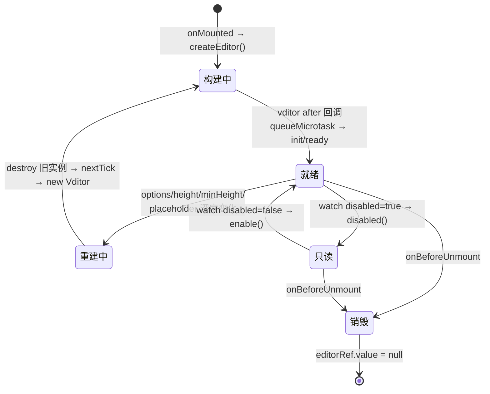
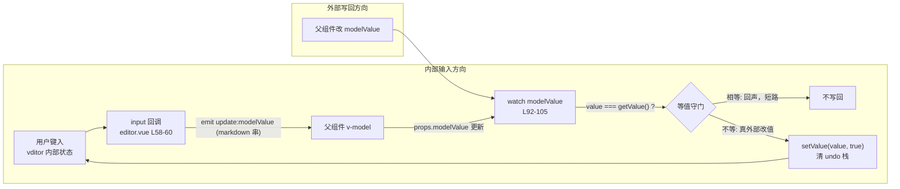
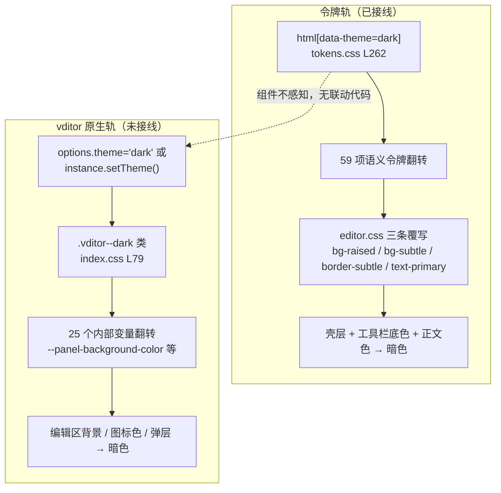

# 6-20 · Editor：富文本桥接

表单卷走到最后一篇，主角是 `xy-editor`——整个 `packages/components` 里身份最特殊的一个受控组件。前面十九篇里，无论是 `input` 的原生输入框还是 `tree-select` 的级联浮层，交互内核都长在库里自己手上；而 editor 的输入、光标、撤销栈、Markdown 解析，全部外包给了一个 285KB 的第三方引擎 vditor。组件本体的全部源码只有 155 行 Vue 加 26 行 TypeScript，它存在的意义不是"实现一个编辑器"，而是**把一个自成体系的第三方世界翻译成本库的受控协议**——这就是标题里"桥接"两个字的分量。

这篇要回答两个问题：其一，v-model 怎么在一个自己管理内部状态的引擎上成立——外部写回会不会打断用户输入、内部输入会不会反向触发回写，这就是 6-02 拆 formatter 管道时点过名的"回声环"问题在重依赖场景下的变体；其二，vditor 自带一套主题体系（`theme: "classic" | "dark"` 加一组内部 CSS 变量），本库自带另一套（3-03 的 `data-theme` 协议加 `--xy` 语义令牌），两套主题语言怎么在一个 22 行的 CSS 文件里完成对接。

先把实码范围钉死：`packages/components/editor/` 共三个文件——`index.ts`（22 行安装入口）、`src/editor.ts`（26 行类型层）、`src/editor.vue`（155 行视图与逻辑层）；样式在 `packages/theme/src/components/editor.css`（22 行）；单测 `__tests__/editor.spec.ts`（79 行，2 个用例，本篇动笔前实跑通过）；类型夹具 `tests/types/fixtures/editor.ts`（18 行）。所有行号均以当前工作区实态核对。

## 一、依赖治理实码定论：直接依赖、同步引入、不懒加载

第一个要钉死的事实是 vditor 以什么身份进包。打开 `packages/components/package.json`，L44-L50 是 peerDependencies，只有 `vue`（必需）和 `vue-router`（可选）两项；L53-L67 的 dependencies 列表里，`"vditor": "^3.11.2"` 挂在 L65，与 `echarts`、`video.js`、`howler` 这几个"重引擎邻居"并列。结论很干净：**vditor 是运行时直接依赖，不是 peerDependency，也没有走懒加载**——`src/editor.vue` 的 L3-L4 是两条同步 import：

```ts
import Vditor from "vditor";
import "vditor/dist/index.css";
```

三个子问题逐一过。

**为什么不做成 peer？** peer 的语义是"宿主自己装，我只声明兼容范围"，适合 vue 这种宿主必然持有的运行时；而 vditor 是纯实现细节，宿主应用既不需要感知它的存在，也不该有"自己另装一个版本"的合理场景。peer 化只会把版本兼容的皮球踢给用户，换不来任何解耦收益。同目录下的 `echarts`、`video.js` 也是同一判断——重引擎全部直接依赖，只有 `vue`/`vue-router` 这一对外部协议进 peer。git 历史里 `dc9ca28 fix(build): 基础设施依赖治理与产物断链修复` 这条提交印证过这一层治理是刻意的。

**为什么不动态 import 懒加载？** `new Vditor(...)` 之前确实需要一个异步边界，`await import("vditor")` 再构造实例在工程上完全可行，还能让"页面里没用编辑器"的用户省下这 285KB。但库层懒加载有一串连锁代价：构造时序从 `onMounted` 同步完成变成"加载完成后再完成"，`after` 就绪回调、`init`/`ready` 事件的派发都要多一档异步状态要管理；加载失败的兜底（网络异常、重试、loading 态）成了组件必须回答的问题；而收益端却是存疑的——本库的构建产物按组件分路径（`xiaoye-components/es/editor` 独立入口，2-02 的 ES-only 体系），不用 editor 的用户在按路径引出或 tree-shaking 时根本不会把 vditor 拖进自己的 bundle。"同步引入 + 分路径产物"用零额外复杂度拿到了懒加载九成的收益，剩下的那一成（同一路径内 vditor 与组件的分离）属于过度设计。这是本篇的第一处取舍：**懒加载的代价在库层被低估、收益在产物层被预支，同步 import 是更便宜的答案**。

不过"不用 editor 就不付 vditor 的成本"只对 bundle 成立，对运行时不完全成立：vditor 有一个容易被忽略的隐性网络面，它的类型定义里写着（`node_modules/vditor/dist/types/index.d.ts` L777）：

```ts
/** 配置自建 CDN 地址。默认值: 'https://unpkg.com/vditor@${VDITOR_VERSION}' */
cdn?: string;
```

代码高亮、mermaid、katex 这类预览期副资源，vditor 默认从 unpkg CDN 运行时拉取。桥接层没有中和这个默认值——内网部署必须通过 `options.cdn` 自己改写。这是本文第四节"防腐边界"里要记账的一条真实泄漏。

**依赖面的最后一笔账是 CSS**。`import "vditor/dist/index.css"` 写在 SFC 里，由构建管线抽取；而本库自己的覆写走 `packages/theme/index.css` 的 L71（`@import "./src/components/editor.css";`）进总样式出口。两条样式链路一外一内，互不掺和——这个分层在第六节谈主题时还会回来。

## 二、生命周期三拍：构建、重建、销毁

editor.vue 的运行时骨架是三段 watch 加两个生命周期钩子。先把脚本区一分为二完整过一遍——上半段是 props、根样式与 `createOptions` 工厂（`src/editor.vue` L1-L69，末行 `</script>` 为闭合补记）：

```ts
<script setup lang="ts">
import { computed, nextTick, onBeforeUnmount, onMounted, ref, watch } from "vue";
import Vditor from "vditor";
import "vditor/dist/index.css";
import { useNamespace } from "xiaoye-primitives";
import type { EditorProps } from "./editor";

defineOptions({
  name: "XyEditor"
});

const props = withDefaults(defineProps<EditorProps>(), {
  modelValue: "",
  options: () => ({}),
  placeholder: "",
  height: "auto",
  minHeight: 360,
  disabled: false
});

const emit = defineEmits(["update:modelValue", "init", "ready", "focus", "blur"]);

const ns = useNamespace("editor");
const rootRef = ref<HTMLDivElement | null>(null);
const editorRef = ref<Vditor | null>(null);
const cacheId = `xy-editor-${Math.random().toString(36).slice(2, 10)}`;

const rootStyle = computed(() => ({
  minHeight: typeof props.minHeight === "number" ? `${props.minHeight}px` : props.minHeight,
  height: typeof props.height === "number" ? `${props.height}px` : props.height
}));

function createOptions() {
  return {
    cache: {
      enable: false,
      id: cacheId
    },
    minHeight: typeof props.minHeight === "number" ? props.minHeight : Number(props.minHeight) || 360,
    height: props.height,
    placeholder: props.placeholder,
    value: props.modelValue,
    after: () => {
      queueMicrotask(() => {
        if (props.disabled) {
          editorRef.value?.disabled();
        }
        if (props.modelValue && editorRef.value?.getValue() !== props.modelValue) {
          editorRef.value?.setValue(props.modelValue, true);
        }
        if (editorRef.value) {
          const editor = editorRef.value;
          emit("init", editor);
          emit("ready", editor);
        }
      });
    },
    input: (value: string) => {
      emit("update:modelValue", value);
    },
    focus: () => {
      emit("focus");
    },
    blur: (value: string) => {
      emit("blur", value);
    },
    ...props.options
  };
}
</script>
```

下半段是实例工厂、三个方法包装与 modelValue 守门（`src/editor.vue` L71-L105）：

```ts
function createEditor() {
  if (!rootRef.value) {
    return;
  }

  editorRef.value?.destroy();
  editorRef.value = new Vditor(rootRef.value, createOptions());
}

function getValue() {
  return editorRef.value?.getValue() ?? "";
}

function setValue(value: string, clearStack = false) {
  editorRef.value?.setValue(value, clearStack);
}

function focus() {
  editorRef.value?.focus();
}

watch(
  () => props.modelValue,
  (value) => {
    if (!editorRef.value) {
      return;
    }

    if (value === editorRef.value.getValue()) {
      return;
    }

    editorRef.value.setValue(value, true);
  }
);
```

`createEditor` 是唯一的实例工厂：先 `destroy()` 旧实例（首次挂载时是 `null?.destroy()` 的空操作），再 `new Vditor(rootRef.value, createOptions())`。工厂的调用点有三处——`onMounted`（L134-L136）挂载构建；`watch([options, height, minHeight, placeholder], { deep: true })`（L123-L132）在配置变化时 `await nextTick()` 后整体重建；`onBeforeUnmount`（L138-L141）销毁并置空。整条生命周期画出来是这样：



重建路径值得单独拎出来看（L123-L132）：

```ts
watch(
  () => [props.options, props.height, props.minHeight, props.placeholder] as const,
  async () => {
    await nextTick();
    createEditor();
  },
  {
    deep: true
  }
);
```

`deep: true` 意味着不止换整个 options 对象会触发，嵌套改一个 `options.counter.enable = true` 也会；而触发后的动作不是"diff 出变化的选项热更新"，是**整实例销毁重建**——焦点丢失、撤销栈清空、滚动位置归零，全都是重建的伴生代价。文档（`apps/docs/components/editor.md` L51）把这个行为写进了使用约定："当 `options`、高度、最小高度或占位文案变化时，组件会重建实例"。这是一处粗粒度换确定性的设计：vditor 的 `IOptions` 是一个数百键的配置面（工具栏数组、上传钩子、hint、preview、math、mermaid……），任何键的热更新语义都不由库控制，与其维护一张"哪些键能热更"的清单然后被上游版本打脸，不如把"配置是静态的"做成硬约定，变化即重建。代价是连 `placeholder` 这种看起来无害的字符串变化也会重建整棵编辑器 DOM——粗糙，但边界清晰可预期。

挂载、卸载、expose 面与模板收尾在文件尾部一气呵成（`src/editor.vue` L134-L155）：

```ts
onMounted(() => {
  createEditor();
});

onBeforeUnmount(() => {
  editorRef.value?.destroy();
  editorRef.value = null;
});

defineExpose({
  editor: editorRef,
  getValue,
  setValue,
  focus
});
</script>

<template>
  <div :class="ns.base.value" :style="rootStyle">
    <div ref="rootRef" class="xy-editor__surface" />
  </div>
</template>
```

`onBeforeUnmount` 里 `destroy()` 之后紧跟 `editorRef.value = null`，让暴露出去的 `editor` 句柄在卸载后确定性地变成 null——卸载后误用句柄会得到空引用而不是对已销毁实例的悬空调用。

**就绪时序**是生命周期里最精细的一段，就是上面引文 L43-L57 的 `after` 回调。vditor 的 `after` 是"编辑器异步渲染完成后"的回调（类型定义 L787-L788 的原话），即引擎自己宣布就绪的时刻。桥接层在这个回调里做了四件事，且全部包进 `queueMicrotask` 再执行：补应用 `disabled` 初值（构造参数没有禁用态入口，vditor 的 `disabled()` 是实例方法，只能就绪后调用）；补同步 `modelValue` 初值——虽然 `createOptions` 已经把 `value: props.modelValue` 传给了构造器（L42），这里仍以 `getValue() !== modelValue` 为条件再校一次，防的是引擎侧对初值的任何加工（如空白规范化）造成外部模型与内部状态悄悄分叉，注意条件里有 `props.modelValue &&` 的真值守卫，空串初值不会触发无意义的 `setValue("")`；然后才 `emit("init")` 与 `emit("ready")`，两个事件载荷一致，都是去掉 null 的实例（`editor.ts` L8 的 `EditorInstanceHandler` 类型把这件事写进了签名）。`queueMicrotask` 的作用是让这四件事整体推迟到 vditor 自己的微任务队列清空之后，避免在引擎尚未完成的内部初始化上叠操作。

一个顺手的观察：组件入口 `index.ts` 把 `XyEditor` 挂上 `withInstall`，manifest 里的 `installChecks` 是 `[{ "kind": "component", "name": "xy-editor" }]`（`component-manifest.json` L625）——单 component kind 的普通条目，4-01 考据时引的是 L619-L627，当前实态是 L620-L627（manifest 追加组件后整体下移了一行，4-01 的行号是写作时点的快照）。

## 三、受控桥接：双向数据流与防回环守门

现在进入本篇的第一个核心。把 editor 的 v-model 拆成两条方向相反的数据流，完整的拓扑是：



内部方向上，用户每敲一个字符，vditor 完成自己的编辑状态更新后调用 `input` 回调，桥接层原样把 markdown 串 emit 出去（L58-L60）：

```ts
    input: (value: string) => {
      emit("update:modelValue", value);
    },
    focus: () => {
      emit("focus");
    },
    blur: (value: string) => {
      emit("blur", value);
    },
```

父组件的 v-model 回写触发 L92-L105 的 `watch(modelValue)`。这里的守门只有一道：`value === editorRef.value.getValue()` 相等就 return。回环之所以必须在这里掐断，是因为 vditor 与 `input` 原生输入框有本质区别——`<input>` 的 DOM value 与 Vue 视图天然同步，而 vditor 持有一套自己的内部编辑状态，`setValue` 对它是一次"外部干预"：光标会被重置，第二个参数 `clearStack` 传 true 还会清空撤销栈。假如没有等值守门，每个键的输入都会走完"emit → 父回写 → watch → setValue(清栈)"一圈，光标被拽回开头、Ctrl+Z 失忆，编辑器当场不可用。

这道守门和 6-02 拆 formatter 管道时对比过的 EP 补丁值得一组对照。6-02 的结论是"不构造环，而不是在环上打补丁"——`input.vue` 的写路径只做 emit 和显示缓存更新，读路径只把模型投喂给显示，两个方向在架构上就没有回边，所以不需要任何 `value === nativeInputValue.value` 式的短路。editor 拿不到这份红利：vditor 的内部状态不归 Vue 管，"模型值"与"引擎值"是两个必须显式对账的存储，emit 之后父组件必然回写、watch 必然触发，回边在拓扑上先于桥接层存在。所以 editor 的正确姿势不是消灭环，而是**在环上放一个只对回声开门的闸**——等值短路正是"这次 watch 是我自己的 emit 弹回来的"的判定。受控桥接的通用结论在这里可以补全成两句话：自持状态的受控组件防回环，要么拓扑上不画回边（input 路线），要么在回边上做等值识别（editor 路线）；两条路线的分水岭是"内部状态的权威副本在谁手里"。

等值守门能可靠工作的前提是串的可比性，这里有一个隐而未宣的好运气：markdown 是比 HTML 规范化得多的序列化格式。同一份文档，vditor 的 `input` 回调串与 `getValue()` 串来自同一套 lute 序列化管线，纯输入场景下逐字符相等；如果是 HTML 内核的编辑器（下一节 EP 对照里会展开），属性顺序、空白、自闭合写法的抖动都可能让"语义相同"的两个串不相等，守门就会失效。选 vditor 而非 wangeditor 的理由清单里，这一条很少被写进文档，但它在受控桥接的账本上是实打实的加分项。

不等值分支的动作是 `setValue(value, true)`（L103）——全量重写并清撤销栈。这个选择的语义是"外部写回 = 内容的主权易手"：既然值不是我 emit 出去的那份，就当作父组件的权威覆盖（表单回填、模板填充、草稿恢复），历史撤销栈随旧内容一起作废，避免撤销链上混着两份来源不明的内容。`methods.vue` 示例（`apps/docs/examples/editor/methods.vue` L16-L18）里手动填模板的写法与之同构：`editorRef.value?.setValue(nextValue, true); content.value = nextValue;`——expose 的 `setValue` 签名（`editor.ts` L24）原样保留了 vditor 的 `clearStack` 参数，把这个语义直接交给调用方。代价也如实记账：若父组件在用户输入中途做了防抖回写且值恰有细微差异（比如服务端规范化），光标仍会跳——但等值守门已把这类发生频率压到"真正外部改值"的量级，剩余场景属于语义正确的行为。

还有一处藏在 `createOptions` 开头的受控防御（L34-L38）：

```ts
    cache: {
      enable: false,
      id: cacheId,
    },
```

vditor 默认开启 localStorage 内容缓存（类型定义 L730-L731 注释：`/** 是否使用 localStorage 进行缓存。默认值: true */`，启用时 id 必填），行为是刷新页面后自动恢复上次编辑内容。这对受控组件是毒药：模型值是父组件的唯一权威，而缓存会让引擎在父组件不知情时"复活"一份陈旧内容——父组件把 model 重置为空串，编辑器却从 localStorage 里把上次的草稿顶回来，v-model 的契约直接破产。所以桥接层的默认是 `enable: false`，把"内容持久化"这个决策完整上交给持有模型的一方。有意思的细节是 L26 的 `const cacheId = \`xy-editor-${Math.random().toString(36).slice(2, 10)}\``——缓存已禁用，这个随机 id 实际上是死配置；它的价值是防御性余量：由于 L67 的 `...props.options` 在默认值之后展开（下一节细说），用户可以用自己的 options 覆写把缓存重新打开，届时一个随实例唯一、无碰撞之虞的 id 已经备好。禁用时传 id 是给"将来可能启用"留的保险丝。

`focus` 与 `blur` 两个回调的翻译还有一处类型层的不对称（L61-L66）：vditor 的 `focus?(value: string)` 与 `blur?(value: string)` 签名同形（类型定义 L794、L797），但桥接层把 focus 翻译成无参的 `EditorFocusHandler = () => void`（`editor.ts` L9），blur 却保留载荷 `EditorBlurHandler = (value: string) => void`（L10）。失焦时携带"最终值"便于做失焦校验/自动保存，聚焦时没有这个需求——不是疏漏，是按消费场景裁剪过的翻译，但文档的 Events 表并没有解释这层差别。

## 四、防腐边界：翻译与透传的分界线

桥接层的第二组设计决策是：vditor 的哪些概念被翻译成库内协议，哪些原样放行。先把两边清单列齐。

被**翻译**的（vditor 概念 → 库协议）：

| vditor 概念 | 库协议 | 实码位置 |
| --- | --- | --- |
| `options.value` + `getValue()/setValue()` | `modelValue` + `update:modelValue` | editor.vue L42、L58-60、L92-105 |
| `after()` 就绪回调 | `init` / `ready` 双事件 | editor.vue L43-57 |
| `disabled()` / `enable()` 实例方法 | `disabled` prop + watch | editor.vue L107-121 |
| `options.minHeight/height/placeholder` | 同名 props + rootStyle | editor.vue L28-31、L39-42 |
| `input/focus/blur` 回调 | 同名事件 | editor.vue L58-66 |
| `getValue/setValue/focus` 实例方法 | defineExpose 三个方法 | editor.vue L143-148 |

被**透传**的只有一条通道，但它是整条链路上最宽的——`createOptions` 返回对象末尾的 `...props.options`（第二节 L1-L69 引文的 L67），位置在所有库默认值之后。

展开顺序决定了权力边界：库默认先声明，用户 options 后声明，**同键覆盖**。这意味着用户不仅能传 `toolbar`、`upload`、`cdn` 这类库没碰的配置，还能覆盖库刚设的 `cache`、甚至覆盖 `input` 回调——代价是 v-model 桥接会被静默拆掉（用户的 `input` 覆盖了库的 `input`，`update:modelValue` 再也不发）。桥接层选择不做合并保护：拦得住的越界背后是拦不住的误解，把"options 是 vditor 原生配置面的直通车"作为契约写进文档（editor.md L61：`options` 说明就是"透传给 Vditor 的配置项"），比发明一套层间合并规则更诚实。

类型层的防腐比值层更有看头，先把 26 行的 `src/editor.ts` 全文引齐：

```ts
import type Vditor from "vditor";

export interface EditorOptions {
  [key: string]: unknown;
}

export type EditorModelValueChangeHandler = (value: string) => void;
export type EditorInstanceHandler = (editor: NonNullable<EditorInstance["editor"]>) => void;
export type EditorFocusHandler = () => void;
export type EditorBlurHandler = (value: string) => void;

export interface EditorProps {
  modelValue?: string;
  options?: EditorOptions;
  placeholder?: string;
  height?: string | number;
  minHeight?: string | number;
  disabled?: boolean;
}

export interface EditorInstance {
  editor: Vditor | null;
  getValue: () => string;
  setValue: (value: string, clearStack?: boolean) => void;
  focus: () => void;
}
```

props 里的 `options?: EditorOptions` 用的是一个**索引签名空壳**（L3-L5），而不是 re-export vditor 的 `IOptions`。全库对 vditor 类型的引用只剩 L1 的一句 `import type Vditor from "vditor"`，且仅用于 `EditorInstance["editor"]` 这个实例句柄的类型位（L21-L26）。效果是：不用实例句柄的用户全程不需要 import 任何 vditor 类型，"用了什么引擎"这个事实被压到类型面最小暴露。代价同样直白——`[key: string]: unknown` 让 options 内部失去全部补全与检查，`toolbar` 拼错成 `toolbars` 编译器一声不吭，要到运行时才发现工具栏没生效。这是本篇的第二处取舍：**防腐边界的宽窄，本质是在"上游演进自由度"与"下游类型安全"之间定价**。逐项包装 `IOptions` 的几百个键（再想想 toolbar 数组每一项的字面量联合类型）意味着每升一个 vditor 版本都要同步维护一遍包装层，跑步机一旦上去就下不来；空壳索引签名把上游演进完全隔离在 `EditorOptions` 这一个名字背后，类型安全的损失由"高级用户本来就该对着 vditor 文档写 options"的定位来兜底。四个事件 handler 类型（L7-L10）也遵循同一原则——载荷只用 `string` 与实例句柄这两个跨边界的最小词汇，不引入任何 vditor 内部类型。

expose 面是透传的第二处：`defineExpose({ editor, getValue, setValue, focus })`（L143-L148）里的 `editor` 就是原始 Vditor 实例的 ref。类型上 `EditorInstance.editor: Vditor | null` 意味着一旦有人用这个句柄，防腐层对他即告失效——但这是显式失效：`EditorInstanceHandler` 签名里 `NonNullable<EditorInstance["editor"]>` 把"拿到的一定是引擎实例"亮在类型上，用不用、用多少，是调用方的显式决定而非库的隐性泄漏。`methods.vue` / `exposes.vue` 两个示例都只消费三个方法包装，演示的就是"常规业务停在包装层"的姿势。

防腐清单还该记上两笔**没做**的边界。其一，editor 不参与表单上下文：`editor.vue` 的 import 清单（L2-L6）里只有 `useNamespace`，没有 `inject(formItemKey/formKey)`——对照组 `input.vue` 的 L77-L78 是 `const formItem = inject(formItemKey, null); const form = inject(formKey, null);`。也就是说 4-08 讲的"disabled 从 form → form-item → 控件逐级转发"的级联，editor 不在其中，`:disabled` 是一个必须逐实例手写的独立 prop；表单卷的收官成员反而是表单联动体系之外的散客，文档没有明说，用的时候容易想当然。其二，`useNamespace` 的能力面（`packages/xiaoye-primitives/src/composables/use-namespace.ts` 只有 `base/is/cssVarBlock` 三件套，没有 element 助手），所以模板里内层节点是硬编码字符串——`editor.vue` L153：`<div ref="rootRef" class="xy-editor__surface" />`——BEM 元素名不走生成器，主题 CSS 里 `.xy-editor .vditor-*` 的选择器同样是手写的，命名一致性靠约定而非代码保证。

## 五、双主题：vditor 原生轨与 data-theme 令牌轨

第二个核心来了。先摆清两套主题语言各自的词汇。

**vditor 原生轨**：`IOptions.theme?: "classic" | "dark"`（类型定义 L769，默认 classic），实例上有 `setTheme(theme, contentTheme?, codeTheme?, ...)` 方法；CSS 侧的实现收敛在一个类名上——`node_modules/vditor/dist/index.css` L58 起，`.vditor` 根上定义了二十多个内部变量，L79 起的 `.vditor--dark` 块整体翻转这组变量。把两段节选到一起看：

```css
.vditor {
  --border-color: #d1d5da;
  --second-color: rgba(88, 96, 105, 0.36);
  --panel-background-color: #fff;
  --panel-shadow: 0 1px 2px rgba(0, 0, 0, 0.2);
  --toolbar-background-color: #f6f8fa;
  --toolbar-icon-color: #586069;
  --toolbar-icon-hover-color: #4285f4;
  --toolbar-height: 35px;
  --toolbar-divider-margin-top: 8px;
  --textarea-background-color: #fafbfc;
  --textarea-text-color: #24292e;
  /* ……另有 resize / count / heading / blockquote / ir 等十余项，至 L78 */
}

.vditor--dark {
  --border-color: #141414;
  --second-color: rgba(185, 185, 185, 0.36);
  --panel-background-color: #24292e;
  --panel-shadow: 0 1px 2px rgba(255, 255, 255, 0.2);
  --toolbar-background-color: #1d2125;
  --toolbar-icon-color: #b9b9b9;
  --toolbar-icon-hover-color: #fff;
  --textarea-background-color: #2f363d;
  --textarea-text-color: #d1d5da;
  /* ……同形翻转至编辑器全部内面 */
}
```

这是一套和 3-03 的 `data-theme` 协议同构的自定义属性方案：变量锚定在根节点，主题类一次性覆写全部变量值。

**本库令牌轨**：3-03 定义的协议——`[data-theme="dark"]` 在 `tokens.css` L262 起覆写 59 项语义令牌；组件样式只消费语义层。editor 的消费点在 `packages/theme/src/components/editor.css`，全文 22 行：

```css
.xy-editor {
  position: relative;
  width: 100%;
  border: 1px solid var(--xy-border-subtle);
  border-radius: var(--xy-radius-md);
  overflow: hidden;
  background: var(--xy-bg-raised);
}

.xy-editor .vditor {
  border: 0;
  min-height: inherit;
}

.xy-editor .vditor-toolbar {
  border-color: var(--xy-border-subtle);
  background: var(--xy-bg-subtle);
}

.xy-editor .vditor-content {
  color: var(--xy-text-primary);
}
```

两轨的对接现状，一句话概括是：**桥接只发生在上面这 22 行里，且只有三条覆写**。`.xy-editor` 壳层（边框、圆角、背景）与 `.vditor-toolbar`（工具栏底色）、`.vditor-content`（正文颜色）消费语义令牌，亮暗翻转由 `data-theme` 协议自动完成。editor.css 用到的四个令牌在 `tokens.css` 里的亮暗取值直接对照如下：

```css
/* 亮色（:root 区段） */
--xy-text-primary: var(--xy-gray-950);          /* L95  / 暗色 L265: #e8ecf0 */
--xy-bg-subtle: var(--xy-gray-25);              /* L104 / 暗色 L274: #131435 */
--xy-bg-raised: #ffffff;                        /* L108 / 暗色 L278: #1e2049 */
--xy-border-subtle: var(--xy-gray-100);         /* L115 / 暗色 L285: rgba(255, 255, 255, 0.06) */
```

编辑器的暗色壳层没有一行主题分支代码，全靠这四组变量在 `[data-theme="dark"]` 下的值替换（tokens.css L262 起）自然翻转。组件 TS 层零主题代码：`EditorProps` 里没有 theme 字段，`createOptions` 从不给 vditor 传 `theme`，vditor 始终跑在 classic 主题上——原生 dark 轨（`.vditor--dark`）在桥接层根本没接线。

于是暗色页面里的 editor 是一个"壳暗芯亮"的混合体：外框、工具栏底、正文字色随协议翻暗；而 vditor 内部变量锚定的那部分——编辑区背景（`#fafbfc`）、工具栏图标色（`#586069`）、hint 弹层、计数条——保持 classic 亮色值。`.xy-editor` 的 `background: var(--xy-bg-raised)` 盖在壳上，`.vditor` 自身的面板背景仍从 `--panel-background-color: #fff` 取值。这就是"双主题适配"在当前实码下的真实完成度：**部分适配，适配面恰好是三条语义令牌覆写所及之处**。文档站的暗色预览之所以过得去，靠的是壳层与工具栏这两块视觉占比最大的面先翻了暗。

这不是"做完了"的适配，但把它当作半成品去批判断章取义之前，要看清它作为**取舍**的合理性——这是本篇的第三处权衡。假设桥接层要做"theme 联动"，最直觉的方案是给 EditorProps 加 `theme: "classic" | "dark"` prop，透传给 vditor 并在变化时调 `setTheme`。问题有三层：其一，这个 theme 与 `data-theme` 是两个独立状态源，谁来同步？宿主必须维护一份"页面主题 → 编辑器主题"的映射，协议在库外裂成两份；而 3-03 的核心卖点恰是"主题单点收敛"——html 上一个属性管全部 72 个组件，editor 若需要额外同步，就成了这套承诺的例外。其二，局部暗色子树（3-03 反复演示的 `<div data-theme="dark">` 场景）对 vditor 原生轨是陌生的：`.vditor--dark` 类不存在"跟着祖先容器的 data-theme 走"的级联语义，除非宿主手动加 class，而这是桥接层承诺过要替用户挡掉的事。其三，vditor 的 dark 变量值是 GitHub Dark 系配色（`#24292e`、`#1d2125`），与本库 Stripe 蓝本的暗色锚点（`#1e2049` 系）色温不同，直接接线会造成"编辑器内部一套暗色、周边组件另一套暗色"的微差割裂——令牌轨反而能保证 editor 的暗色与其他 71 个组件出自同一份锚点。三条理由合起来，令牌覆写是"协议内"的路线，原生轨联动是"协议外"的路线，当前实码选了前者并停在了最小覆写。



顺带交代两条样式链路的分工：vditor 的 42KB 官方样式由 SFC 里的 `import "vditor/dist/index.css"` 走产物链路，本库的 22 行覆写走 `packages/theme/index.css` L71 的总出口。依赖顺序上，官方样式先于覆写加载，三条覆写的选择器特异性（`.xy-editor .vditor-toolbar` 两级）压过官方单类选择器，无需 `!important`——覆写边界由此定死：**只在类级锚点（`.vditor`、`.vditor-toolbar`、`.vditor-content`）上落针，不碰 vditor 内部变量，不碰任何更深的选择器**。若将来要把适配补全，最优雅的路径其实已经由 vditor 自己铺好了：它的全部内部变量都锚定在 `.vditor` 根作用域，桥接层完全可以做一次"变量级防腐"——在 `.xy-editor .vditor` 块里把 `--panel-background-color: var(--xy-bg-raised)`、`--textarea-background-color: var(--xy-bg-raised)`、`--toolbar-icon-color: var(--xy-text-secondary)` 这组内部变量重锚到 `--xy` 令牌上，一行不碰 `.vditor--dark`，暗色适配自动随 `data-theme` 翻转，色温还与全库锚点严格同源。这条补全路径的工程量是 editor.css 里再加约十个变量行，而且完全兼容现有三条覆写——示意大概长这样（令牌名均为 tokens.css 实名）：

```css
/* 补全路径示意：变量级防腐，不碰 .vditor--dark */
.xy-editor .vditor {
  --panel-background-color: var(--xy-bg-raised);
  --textarea-background-color: var(--xy-bg-raised);
  --textarea-text-color: var(--xy-text-primary);
  --toolbar-background-color: var(--xy-bg-subtle);
  --toolbar-icon-color: var(--xy-text-secondary);
  --toolbar-icon-hover-color: var(--xy-text-primary);
  --border-color: var(--xy-border-subtle);
  --heading-border-color: var(--xy-border-subtle);
  --count-background-color: var(--xy-bg-subtle);
}
```

之所以现在还没写，更可能是"视觉巡检未判定为必须"而非"做不到"（`pnpm audit:visual` 的双主题基线机制就是这层判断的执法者）。

## 六、测试：把 285KB 的引擎 mock 成 79 行

editor.spec.ts 全文 79 行，2 个用例，vitest 实跑 11ms。它的全部内容是围绕一件事建立的：**用替身替换 vditor 模块，让测试只打桥接层**。

```ts
import { mount } from "@vue/test-utils";
import { nextTick } from "vue";
import { describe, expect, it, vi } from "vitest";
import { XyEditor } from "@xiaoye/components";

const editorMock = vi.hoisted(() => ({
  setValue: vi.fn(),
  destroy: vi.fn(),
  disabled: vi.fn(),
  enable: vi.fn(),
  focus: vi.fn(),
  getValue: vi.fn(() => "初始值"),
  constructor: vi.fn(function MockVditor(
    _element: HTMLElement,
    options: Record<string, unknown> & {
      after?: () => void;
    }
  ) {
    options.after?.();
    return {
      setValue: editorMock.setValue,
      destroy: editorMock.destroy,
      disabled: editorMock.disabled,
      enable: editorMock.enable,
      focus: editorMock.focus,
      getValue: editorMock.getValue
    };
  })
}));

vi.mock("vditor", () => ({
  default: editorMock.constructor
}));

describe("XyEditor", () => {
  it("挂载时初始化实例并派发 init / ready", async () => {
    const wrapper = mount(XyEditor, {
      props: {
        modelValue: "文档内容"
      }
    });

    await nextTick();
    await Promise.resolve();

    expect(editorMock.constructor).toHaveBeenCalledTimes(1);
    expect(wrapper.emitted("init")).toHaveLength(1);
    expect(wrapper.emitted("ready")).toHaveLength(1);
  });
```

四个设计点，每个都对应桥接层的一处时序。

第一，`vi.hoisted` 包住 mock 对象，解决的是 vitest 的 `vi.mock` 工厂被提升到所有 const 声明之前的经典问题——mock 工厂里要引用的替身方法必须自己也被提升。第二，替身构造器是 `vi.fn(function MockVditor(...))`，既是可断言调用次数的 spy（第一个用例的 `toHaveBeenCalledTimes(1)`），又保留构造器语义在 `new` 时返回方法集。第三，也是最关键的时序压缩：构造器里同步调用 `options.after?.()`——真实 vditor 的 after 是渲染管线末端的异步回调，替身把它压成同步，于是"挂载 → after → queueMicrotask → init/ready"整条链在两个 await（`nextTick()` 加一次微任务）之内全部落地，用例不需要等任何真实渲染。第四，`getValue` 默认返回 `"初始值"`，这是为第二个用例的守门测试预埋的桩。

第二个用例（L51-L79）同时覆盖受控同步、禁用切换与卸载销毁三段：

```ts
  it("modelValue 和 disabled 变化会同步到实例，卸载时销毁实例", async () => {
    const wrapper = mount(XyEditor, {
      props: {
        modelValue: "旧值",
        disabled: false
      }
    });

    editorMock.getValue.mockReturnValueOnce("其他值");

    await wrapper.setProps({
      modelValue: "新值",
      disabled: true
    });

    expect(editorMock.setValue).toHaveBeenCalledWith("新值", true);
    expect(editorMock.disabled).toHaveBeenCalled();

    await wrapper.setProps({
      disabled: false
    });

    expect(editorMock.enable).toHaveBeenCalled();

    wrapper.unmount();

    expect(editorMock.destroy).toHaveBeenCalled();
  });
});
```

这一行是全文件最精细的安排：`editorMock.getValue.mockReturnValueOnce("其他值")`。`setProps({ modelValue: "新值" })` 之后，watch 会拿 `"新值"` 与 `getValue()` 比较——替身默认返回的 `"初始值"` 与 `"新值"` 本就不等，守门照样放行，为什么还要 `mockReturnValueOnce`？回看守门代码就明白了：测试要钉死的是"不等才 setValue"这个比较语义本身，`mockReturnValueOnce` 显式构造出"模型说新值、引擎说别的"的对账场景，让断言 `toHaveBeenCalledWith("新值", true)` 验证的正是**比较分支的负向行为**而非碰巧的不相等。顺带，`"新值", true` 这两个实参同时钉死了外部写回必须清栈的契约。后面 disabled/enable/destroy 三段则是纯 spy 断言，验证 prop→实例方法的翻译逐一兑现。

测试策略的边界也要如实画出来：替身方案意味着光标行为、撤销栈、markdown 序列化、真实 `setValue` 的时序这些"引擎侧"语义全部在测试视野之外——它们是 vditor 自己的测试责任。桥接测试能且只能保证一件事：**库里写的每一行翻译代码（prop→方法、回调→事件、守门逻辑、销毁顺序）都被断言覆盖**。79 行替身换来 11ms 的用例时长与零 jsdom 渲染不确定性，这笔交换在"重依赖桥接组件"上几乎是唯一合理解。mock 的一个未覆盖缺口也值得点名：`options` 深度变化触发重建的分支（L123-L132 的 watch）没有专门用例——`constructor` 的调用计数其实可以顺手断言重建，现版本的两个用例都没做到。

## 七、manifest、夹具与文档面

外围三件套快速过账。安装入口 `packages/components/editor/index.ts` 全文 22 行，是把上一节那套防腐类型抬向包根的搬运工——它先在自己这里显式导出六个类型，再经 `packages/components/exports.ts` L28 的 `export * from "./editor"` 接进聚合出口——四个 handler 类型与两个主接口显式导出，`withInstall` 挂上 `xy-editor` 标签名（4-02 的幂等安装协议照常生效）：

```ts
import Editor from "./src/editor.vue";
import type {
  EditorBlurHandler,
  EditorFocusHandler,
  EditorInstance,
  EditorInstanceHandler,
  EditorModelValueChangeHandler,
  EditorProps
} from "./src/editor";
import { withInstall } from "xiaoye-primitives";

export type {
  EditorBlurHandler,
  EditorFocusHandler,
  EditorInstance,
  EditorInstanceHandler,
  EditorModelValueChangeHandler,
  EditorProps
};

export const XyEditor = withInstall(Editor, "xy-editor");
export default XyEditor;
```

`component-manifest.json` L620-L627 的条目：

```json
  {
    "name": "editor",
    "docsGroup": "form",
    "docsText": "Editor 编辑器",
    "installExports": ["XyEditor"],
    "installChecks": [{ "kind": "component", "name": "xy-editor" }],
    "styleImports": ["editor"]
  },
```

单 component kind、form 组、`styleImports: ["editor"]` 把 editor.css 挂进聚合样式——六处一致性里 editor 该占的位一个不少，4-01 已考据过其"无任何特殊 kind"的普通性，这里不赘述。类型夹具 `tests/types/fixtures/editor.ts` 全文 18 行：

```ts
import type { EditorInstance, EditorProps } from "xiaoye-components";
import { XyEditor } from "xiaoye-components";

const props: EditorProps = {
  modelValue: "# 标题",
  placeholder: "请输入 Markdown",
  minHeight: 320,
  disabled: false
};

declare const instance: EditorInstance;

instance.getValue();
instance.setValue("## 更新内容");
instance.focus();

void props;
void XyEditor;
```

夹具的覆盖面是"主 Props + 实例方法"两条公开契约，`EditorInstance["editor"]` 句柄与四个 handler 类型没进夹具——它们要么依赖 vditor 类型可用，要么是事件侧（`pnpm typecheck:types` 的断言粒度到值与主类型为止）。文档面 `apps/docs/components/editor.md` 的 `:::demo` 块引用了六个示例（`editor/basic`、`editor/disabled`、`editor/methods`、`editor/announcement-workbench`、`editor/overlay-workflow`、`editor/overlay-form-publisher`，覆盖基础 v-model、禁用态与 options 下发、实例方法、公告编辑页与两个覆盖层组合场景），API 表与实码逐一相符；"使用约定"一节（L50-L53）的四条，恰好就是本文第二、三节拆过的四组行为契约：

```md
- `xy-editor` 对外统一暴露 Markdown 字符串，不扩展额外数据协议。
- `options` 会透传给 `Vditor`；当 `options`、高度、最小高度或占位文案变化时，组件会重建实例。
- `disabled` 是当前公开的只读入口，适合审批查看、模板回看和系统生成内容复核。
- 外部要主动写入内容时，优先用 `v-model`；需要显式触发焦点或覆盖内容时再使用 expose。
```

顺带发现一个清单外事实：`apps/docs/examples/editor/exposes.vue` 写了一整套"expose 类型自描述"的示例（L4-L8 手写了一个不含 editor 句柄的 `EditorExpose` 类型），但 editor.md 的 demo 块一个都没引用它——一个孤儿示例文件，内容与 methods.vue 高度重叠，推测是收敛文档时的遗留。

## 八、EP 对照：wangeditor 桥接的异与同

Element Plus 的核心包至今没有官方富文本组件，生态里的事实标准是 wangeditor v5 配 `@wangeditor/editor-for-vue`。拿它的桥接方式与本文对照，同与异都很有信息量。

相同骨架：wangeditor 的 Vue3 包装同样是"内部持实例 ref + watch modelValue + 等值比较守门 + input 类回调 emit"的结构——watch 里比较新值与 `editor.getHtml()`，相等即跳过写回，这和 editor.vue L99 的 `value === editorRef.value.getValue()` 是同一道闸，两个生态在"自持状态引擎的受控回环"上收敛到了同一个答案，本文第三节的结论由此获得了跨实现的双重验证。

三个相异点更值得记。**其一，比较串的规范化质量不同**：wangeditor 的内容模型是 HTML，`getHtml()` 的输出对属性顺序、空标签、空白字符敏感，"用户敲的"与"父组件存回的"极易出现语义相同、字面不同的情况，守门的等值判断会失效并引发写回跳动——wangeditor 官方文档为此专门提醒 v-model 场景注意光标问题，社区里"外部改值后光标跳到开头"是其高频 issue 类型；vditor 的 markdown 串来自单一序列化管线，等值判断天然可靠。**其二，就绪模型不同**：wangeditor 实例由 `v-model` 式的 ref 双向绑定创建（模板 ref 即实例），就绪靠 `onCreated` 回调，没有 vditor `after` 这种"异步渲染管线完成"的显式界碑，桥接层要自己约定"何时才可信"；editor 的 `init/ready` 双事件是把引擎的就绪时序显式翻译成库协议的产物。**其三，样式与主题的介入深度不同**：wangeditor 的样式体系边界清晰（官方 CSS 独立、主题靠 CSS 变量、深度定制有官方文档背书），而本篇第五节展示了 vditor 主题的介入成本——原生 dark 轨与库协议不同源，桥接宁可三条覆写也不接原生轨。两相对照可以说：EP 生态把富文本当"外挂配件"（装不装、怎么装都是用户的事），本库把它当"需要翻译的移民"（进来就必须讲库的受控协议、主题协议），差异的根源不是工程品味，而是"组件库要不要为自己的全部 72 个组件的协议一致性负责"这个定位问题。

## 收官与预告

把全篇的账目合上：editor 用 155 行 Vue + 26 行 TS + 22 行 CSS，完成了四件事——同步直接依赖（不用 editor 不付 bundle 成本）的重引擎接入；以"等值守门 + 清栈写回"成立的 v-model 桥接；以"空壳 options 直通车 + 最小实例句柄"定界的防腐层；以三条语义令牌覆写实现的协议内主题适配。三处权衡（同步 import 对懒加载、空壳索引签名对全量包装、令牌覆写对原生 dark 轨）共享同一个决策底色：**桥接层的每一分"更完整"，都要用对上游的长期负债来付**，于是它处处选择"够用的最小边界 + 显式透传的逃生门"。这也是表单卷十九个组件里最特殊的一员留给全库的范式——当某个组件注定"内核不在我手"，库的价值不在于假装内核是自己的，而在于把翻译工作做到调用方察觉不到内核的存在。

表单卷至此收官。下一篇 7-01《Alert：语义化反馈容器》，第七卷反馈与浮层的开篇——从输入的世界切换到反馈的世界，第一个要回答的问题是：一个提示框的 success/warning/error 语义色，如何从语义令牌体系里派生而不是各写一套。我们下篇见。
