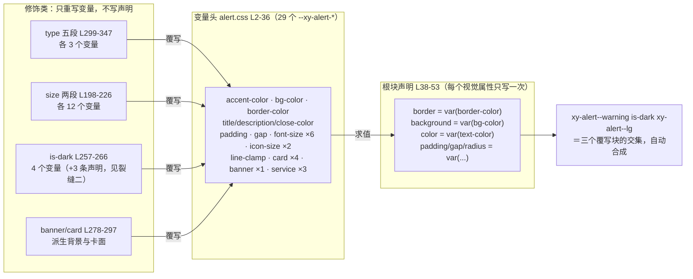
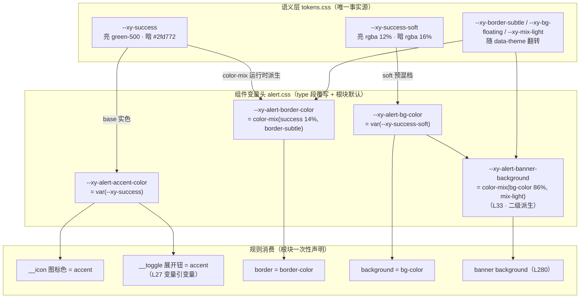

# 7-01 · Alert：语义色派生

## 核心问题：组件变量头的标准写法

反馈篇开篇的 `Alert`，是全库少有的"样式比逻辑更值得写"的组件。它的视图层 486 行、测试 585 行、类型层 120 行，都算不上特别；但 `packages/theme/src/components/alert.css` 一份 398 行的样式文件里，藏着整个组件库处理"组件级样式"的标准范式——**组件变量头**：在组件根选择器块内，把该组件用到的所有 `--xy-alert-*` 私有变量一次性立案（29 个），根块只做一次声明消费，此后 type 五态、effect 两态、size 三档、variant 三形，所有修饰类都只重写变量、不写第二条视觉声明。

这个范式在前面几篇里已经多次露过侧脸：3-05 讲圆角算术时引过 `alert.css:281` 的 `calc()` 加法，讲网格越界时考据过 alert 的 17px；3-06 讲字重转正时引过 `alert.css L83-88` 的 semibold 标题；3-04 讲 Stripe 蓝本时引过 `alert.css L299-327` 的三线消费模式。但它们都是把 alert 当"例子"取一段就走。这一篇要把整份文件连起来读，回答一个此前没有正面回答的问题：**当设计令牌的三层架构（基元/语义/刻度）落到一个具体组件头上时，中间还缺一层什么？**

答案是：缺一层"组件私有变量"。语义令牌 `--xy-success` 是全库共享的，它不知道 alert 的边框要 14% 浓度、背景要多浅、暗色实心时掺多少灰；刻度令牌 `--xy-font-size-md` 是全库通用的，它不知道 alert 的标题在 sm 变体要降档、lg 变体的标题加描述场景要 17px。这些"组件自己的决定"需要一个住址——变量头就是这层决定的住址。上一篇 3-06 讲的是"私人档转正"：组件里实测出来的字重值，如何走完"写死 → 沉淀 → 转正 → 全库替换"四步进刻度层。本篇是那个叙事的**组件侧样本**：转正流水线管的是"够格进全局的值"，而变量头管的是"永远不该进全局的值"——alert 的 17px 就是留守派代表，它有名字（`--xy-alert-title-with-description-font-size`），但名字永远挂在 alert 门下。

先立一个实码事实修正大纲的口径：系列大纲与本篇任务书里说"type 四态"，实码是**五态**——`packages/components/alert/src/alert.ts:3` 的 `alertTypes = ["primary", "success", "info", "warning", "error"]`；真正两态的是 effect（`alert.ts:4`，`["light", "dark"]`）。这个差别不是咬文嚼字：五态意味着变量头要准备五套语义色派生，effect 两态意味着还有一套暗色反转，下面逐层展开。

## 一、修饰类矩阵：四个正交维度在根元素上会师

变量头之所以必要，先看消费端有多复杂。`packages/components/alert/src/alert.vue:110-119` 是根元素的类名装配现场：

```ts
// packages/components/alert/src/alert.vue L110-119
const rootClasses = computed(() => [
  ns.base.value,
  `${ns.base.value}--${props.type}`,
  `${ns.base.value}--${mergedSize.value}`,
  `${ns.base.value}--${props.variant}`,
  ns.is(props.effect, true),
  ns.is("center", props.center),
  ns.is("paused", paused.value),
  ns.is("text-close", Boolean(props.closeText))
]);
```

八个类名里，`ns.is` 来自 `packages/xiaoye-primitives/src/composables/use-namespace.ts:8` 的 `const is = (state: string, active?: boolean) => (active ? \`is-${state}\` : "")`——5-01 讲 Icon 的 spin 动画时引过同一行。`ns.is(props.effect, true)` 的第二个参数恒为 `true`，所以根元素永远带 `is-light` 或 `is-dark` 之一，effect 不是"缺省不渲染"而是"二选一必渲染"。

把这八个类名按维度归拢，得到一张 5×3×3×2 起步的正交矩阵：type 五态（`xy-alert--primary/success/info/warning/error`）、size 三档（`--sm/--md/--lg`）、variant 三形（`--default/banner/card`）、effect 两态（`is-light/is-dark`），再叠加 center/paused/text-close 三个布尔态。如果每种视觉组合都用"完整样式规则"表达，理论上要写 90 组以上互相覆盖的 CSS；而 alert.css 的实际结构是——**根块写一次消费声明，修饰类只重写变量**。五个 type 段各 3 行变量，两个 size 段各 12 行变量，is-dark 段 4 行变量，banner/card 段各 2~3 行声明。矩阵的所有格子都是"变量求值"自动得出的，不是"规则覆盖"打出来的。

五态 type 的枚举与语义，见 `packages/components/alert/src/alert.ts:3-13`：

```ts
// packages/components/alert/src/alert.ts L3-13
export const alertTypes = ["primary", "success", "info", "warning", "error"] as const;
export const alertEffects = ["light", "dark"] as const;
export const alertVariants = ["default", "banner", "card"] as const;
export const alertOverflowStrategies = ["drop-oldest", "drop-newest"] as const;
export const alertCloseReasons = ["manual", "auto", "close-all", "overflow"] as const;

export type AlertType = (typeof alertTypes)[number];
export type AlertEffect = (typeof alertEffects)[number];
export type AlertVariant = (typeof alertVariants)[number];
export type AlertOverflowStrategy = (typeof alertOverflowStrategies)[number];
export type AlertCloseReason = (typeof alertCloseReasons)[number];
```

五个 `as const` 数组 + 同名类型，是 4-03 讲过的"标准组件解剖"里类型层的标准开局。值得留意的是词表翻译：这里叫 `error`，而全库通用状态契约 `ComponentStatus`（5-21 的主角）用的是 `danger`——一会儿读色板段会看到，CSS 变量头同样要翻译一次：`--xy-alert--error` 的 accent 指向的是 `--xy-danger`。`error` 与 `danger` 两个词表并存，是仓库内已知的"翻译成本"（类型夹具 `tests/types/fixtures/alert.ts:116-119` 专门用 `@ts-expect-error` 断言 `type: "danger"` 必须报错，把这条边界钉死在类型层）。

五态映射成类名后，测试先把类名契约钉死。`packages/components/alert/__tests__/alert.spec.ts:27-44`：

```ts
// packages/components/alert/__tests__/alert.spec.ts L27-44
it.each([
  ["primary", "mdi:information-outline"],
  ["success", "mdi:check-circle-outline"],
  ["info", "mdi:information-outline"],
  ["warning", "mdi:alert-circle-outline"],
  ["error", "mdi:close-circle-outline"]
] as const)("支持 %s 类型并映射默认图标", (type, icon) => {
  const wrapper = mount(XyAlert, {
    props: {
      title: "状态提示",
      type,
      showIcon: true
    }
  });

  expect(wrapper.get(".xy-alert").classes()).toContain(`xy-alert--${type}`);
  expect(wrapper.find(`[data-icon="${icon}"]`).exists()).toBe(true);
});
```

这张 it.each 表还顺带交代了五态与 mdi 图标的映射：primary 和 info 共用 `mdi:information-outline`（`alert.ts:74-80` 的 `ALERT_TYPE_ICON_MAP`，5-01 从图标纪律角度引过同一段）。类名是 CSS 变量头的开关，图标是变量头的受益者之一——切换 type 时图标色跟着 accent 变量走，组件 TS 一行不改。

## 二、变量头解剖：29 个私有变量的一次性立案

现在进入本篇的主现场。`packages/theme/src/components/alert.css:1-53`，根块前半段就是变量头，后半段是全文件唯一一组"视觉声明"：

```css
/* packages/theme/src/components/alert.css L1-53 */
.xy-alert {
  --xy-alert-padding: 10px 16px;
  --xy-alert-border-radius: var(--xy-radius-md);
  --xy-alert-gap: 12px;
  --xy-alert-content-gap: 4px;
  --xy-alert-actions-gap: 12px;
  --xy-alert-title-font-size: var(--xy-font-size-md);
  --xy-alert-title-with-description-font-size: var(--xy-font-size-lg);
  --xy-alert-description-font-size: 13px;
  --xy-alert-icon-size: 16px;
  --xy-alert-icon-large-size: 28px;
  --xy-alert-close-font-size: var(--xy-font-size-md);
  --xy-alert-close-customed-font-size: 13px;
  --xy-alert-toggle-font-size: var(--xy-font-size-sm);
  --xy-alert-line-clamp: 2;
  --xy-alert-text-color: var(--xy-text-primary);
  --xy-alert-title-color: var(--xy-text-heading);
  --xy-alert-accent-color: var(--xy-info);
  --xy-alert-bg-color: color-mix(in srgb, var(--xy-info) 10%, var(--xy-bg-floating));
  --xy-alert-border-color: color-mix(
    in srgb,
    var(--xy-info) 14%,
    var(--xy-border-subtle)
  );
  --xy-alert-description-color: var(--xy-text-muted);
  --xy-alert-close-color: var(--xy-text-muted);
  --xy-alert-toggle-color: var(--xy-alert-accent-color);
  --xy-alert-card-border-color: color-mix(in srgb, var(--xy-border-subtle) 84%, var(--xy-border));
  --xy-alert-card-background: color-mix(in srgb, var(--xy-bg-floating) 99%, var(--xy-bg-subtle));
  --xy-alert-card-shadow:
    0 0 0 1px color-mix(in srgb, var(--xy-bg-floating) 10%, transparent),
    0 1px 4px color-mix(in srgb, var(--xy-text-heading) 4%, transparent);
  --xy-alert-banner-background: color-mix(in srgb, var(--xy-alert-bg-color) 86%, var(--xy-mix-light));
  --xy-alert-service-top: 16px;
  --xy-alert-service-max-width: 960px;
  --xy-alert-service-z-index: 2100;

  position: relative;
  display: flex;
  align-items: flex-start;
  gap: var(--xy-alert-gap);
  width: 100%;
  padding: var(--xy-alert-padding);
  box-sizing: border-box;
  border: 1px solid var(--xy-alert-border-color);
  border-radius: var(--xy-alert-border-radius);
  background: var(--xy-alert-bg-color);
  color: var(--xy-alert-text-color);
  overflow: hidden;
  box-shadow:
    0 0 0 1px color-mix(in srgb, var(--xy-bg-floating) 10%, transparent),
    0 1px 4px color-mix(in srgb, var(--xy-text-heading) 4%, transparent);
}
```

L2-36 共 29 个 `--xy-alert-*` 变量，按职能可以分成七组，每组对应变量头的一条书写纪律：

**排版组（6 个）**：`title-font-size`、`title-with-description-font-size`、`description-font-size`、`close-font-size`、`close-customed-font-size`、`toggle-font-size`。纪律一：**能指向刻度档的，默认值一律 `var(--xy-font-size-*)`**——L7 指向 md、L8 指向 lg、L12 指向 md、L14 指向 sm；只有两个 13px（L9、L13）以字面量留守，它们在 3-05 第九节的债务清单里（"alert.css L9/L13 的 13px——值已有档，等一次回补绑定"），属于"值已有档但没接上"的待收编债，而不是"无档可依"的设计决定。

**图标组（2 个）**：`icon-size: 16px`、`icon-large-size: 28px`。这两个值在字号刻度上没有对应档（16px 恰好等于 lg，但语义不是"字号"而是"图标盒"），所以立案为组件私有字面量。它们的消费方式是本库的一个独特设计——alert.vue:99-101 把变量名拼成 `var()` 字符串直接传进 XyIcon 的 size prop，5-01 称之为"尺寸优先交 CSS 变量"的纪律样本，下文第七节回指。

**间距组（4 个）**：`padding`、`gap`、`content-gap`、`actions-gap`。3-05 讲过：`padding: 10px 16px` 是 shorthand 复合值，机械收编脚本"保守跳过"，所以以字面量住在变量头里；`content-gap: 4px` 与 `--xy-space-1` 逐字相等却同样未引用——变量头保留了"组件自己命名间距"的权利，代价是这些值暂时绕开了刻度治理。

**圆角（1 个）**：`border-radius: var(--xy-radius-md)`——3-05 引过 `alert.css:3`，称它为"组件级变量默认指向全局档"的二次封装样本。这一行是整个变量头范式的一句话版：**组件变量是刻度层的本地化代理，默认直连，特殊处覆写**。

**文字色组（4 个）**：`text-color`、`title-color`、`description-color`、`close-color`，全部指向语义文本令牌（`--xy-text-primary/heading/muted`）。注意 light 态下**没有任何一个文字色指向语义状态色**——alert 的标题是标题色、描述是 muted，语义色只出现在 accent 与边框上。这是与 Element Plus 的第一个分野，第四节展开。

**色派生组（4 个）**：`accent-color`、`bg-color`、`border-color`、`toggle-color`。这是变量头的灵魂，第三节的全部剧情。先看一条藏在 L27 的内部引用：`--xy-alert-toggle-color: var(--xy-alert-accent-color)`——**组件变量引用组件变量**。toggle（"展开详情"按钮）不直接消费 `--xy-warning` 这类语义色，而是消费 accent 变量；于是 type 切换时 toggle 颜色自动跟随，无需任何额外规则。

**变体与服务组（8 个）**：card 四件（L28-32）、banner 一件（L33）、service 三件（L34-36）。L33 的 `--xy-alert-banner-background` 是全文件最精巧的一行：它的原料是 `var(--xy-alert-bg-color)`——**又一个组件变量**。这意味着 banner 背景是 alert 背景的**二级派生**：语义色 → 10% 混背景 → banner 再 86% 混亮。三级链条上任何一级变化，下游自动联动。

根块 L38-53 是声明区。十三个声明里，`gap`、`padding`、`border`、`border-radius`、`background`、`color` 六个是变量消费位，每个都只做一件事——`var()` 取变量；其余（`position`、`display`、`overflow`、`box-shadow` 等）是布局骨架，不属于任何修饰维度的管辖。此后全文件 398 行，所有规则都在回答同一个问题："这个场景下，变量该是多少？"

这就是组件变量头的标准写法，可以总结成四条：

1. **声明唯一**：每个视觉属性在根块只写一次消费声明，修饰类禁止重写声明（重写声明会引发层叠竞速，第五节有一个真实案例）；
2. **默认直连**：变量默认值指向语义层/刻度层令牌，组件不另起炉灶；
3. **覆写下沉**：type/size/effect/variant 的差异只体现为变量覆写，且覆写块内不出现视觉声明；
4. **内部引用**：组件变量之间允许相互引用（toggle-color→accent-color、banner-background→bg-color），把"联动关系"写进值里。

四条纪律合起来，就是这张"一次声明、四处覆写"的结构图——alert 的全部视觉形态都在这张图里流转：



## 三、语义色派生链：从 --xy-success 到一条 14% 的边框

变量头里最有信息量的是色派生组。先看源头——`packages/xiaoye-primitives/src/theme/tokens.css` 语义层的状态色六件套：

```css
/* packages/xiaoye-primitives/src/theme/tokens.css L120-156（语义层亮色段选抄） */
  /* ---- 品牌色 ---- */
  --xy-brand: var(--xy-purple-600);
  --xy-brand-hover: var(--xy-purple-700);
  --xy-brand-active: var(--xy-purple-900);
  --xy-brand-soft: rgba(83, 58, 253, 0.07);
  --xy-brand-soft-hover: rgba(83, 58, 253, 0.12);
  --xy-brand-border: var(--xy-purple-300);
  --xy-brand-contrast: #ffffff;

  /* ---- 状态色：{base, hover, active, soft, soft-hover, text} 六件套 ---- */
  --xy-success: var(--xy-green-500);
  --xy-success-hover: var(--xy-green-600);
  --xy-success-active: var(--xy-green-700);
  --xy-success-soft: rgba(21, 190, 83, 0.12);
  --xy-success-soft-hover: rgba(21, 190, 83, 0.2);
  --xy-success-text: var(--xy-green-600);

  --xy-warning: var(--xy-amber-500);
  --xy-warning-hover: var(--xy-amber-600);
  --xy-warning-active: var(--xy-amber-700);
  --xy-warning-soft: rgba(155, 104, 41, 0.12);
  --xy-warning-soft-hover: rgba(155, 104, 41, 0.2);
  --xy-warning-text: var(--xy-amber-700);

  --xy-danger: var(--xy-red-500);
  --xy-danger-hover: var(--xy-red-600);
  --xy-danger-active: var(--xy-red-700);
  --xy-danger-soft: rgba(234, 34, 97, 0.12);
  --xy-danger-soft-hover: rgba(234, 34, 97, 0.2);
  --xy-danger-text: var(--xy-red-600);

  --xy-info: var(--xy-blue-500);
  --xy-info-hover: var(--xy-blue-600);
  --xy-info-active: var(--xy-blue-700);
  --xy-info-soft: rgba(43, 145, 223, 0.12);
  --xy-info-soft-hover: rgba(43, 145, 223, 0.2);
  --xy-info-text: var(--xy-blue-600);
```

每个状态色是一套六件套：base 实色、hover/active 深浅档、soft 透明底、soft-hover、text 深色文字档。语义层在暗色主题（`tokens.css L291-324`）为同一批名字重新锚值——看暗色段的实码：

```css
/* packages/xiaoye-primitives/src/theme/tokens.css L291-324（暗色段选抄） */
  --xy-brand: var(--xy-purple-500);
  --xy-brand-soft: rgba(102, 94, 253, 0.15);
  --xy-success: #2fd772;
  --xy-success-soft: rgba(21, 190, 83, 0.16);
  --xy-warning: var(--xy-amber-400);
  --xy-warning-soft: rgba(212, 160, 74, 0.16);
  --xy-danger: var(--xy-red-400);
  --xy-danger-soft: rgba(234, 34, 97, 0.16);
  --xy-info: var(--xy-blue-400);
  --xy-info-soft: rgba(91, 168, 217, 0.16);
```

`--xy-success` 换成 `#2fd772`、`--xy-success-soft` 的 alpha 从 0.12 提到 0.16（L303）——**名字不变，值随主题翻转**。这就是派生链的地基：alert 只认名字，从不关心名字背后的值是绿色 500 还是 `#2fd772`。

派生链的全貌如下：



链条的"施工段"在色板消费段。`packages/theme/src/components/alert.css:299-347` 五个 type 段全文：

```css
/* packages/theme/src/components/alert.css L299-347 */
.xy-alert--primary {
  --xy-alert-accent-color: var(--xy-brand);
  --xy-alert-bg-color: var(--xy-brand-soft);
  --xy-alert-border-color: color-mix(
    in srgb,
    var(--xy-brand) 14%,
    var(--xy-border-subtle)
  );
}

.xy-alert--success {
  --xy-alert-accent-color: var(--xy-success);
  --xy-alert-bg-color: var(--xy-success-soft);
  --xy-alert-border-color: color-mix(
    in srgb,
    var(--xy-success) 14%,
    var(--xy-border-subtle)
  );
}

.xy-alert--info {
  --xy-alert-accent-color: var(--xy-info);
  --xy-alert-bg-color: color-mix(in srgb, var(--xy-info) 10%, var(--xy-bg-floating));
  --xy-alert-border-color: color-mix(
    in srgb,
    var(--xy-info) 14%,
    var(--xy-border-subtle)
  );
}

.xy-alert--warning {
  --xy-alert-accent-color: var(--xy-warning);
  --xy-alert-bg-color: var(--xy-warning-soft);
  --xy-alert-border-color: color-mix(
    in srgb,
    var(--xy-warning) 16%,
    var(--xy-border-subtle)
  );
}

.xy-alert--error {
  --xy-alert-accent-color: var(--xy-danger);
  --xy-alert-bg-color: var(--xy-danger-soft);
  --xy-alert-border-color: color-mix(
    in srgb,
    var(--xy-danger) 14%,
    var(--xy-border-subtle)
  );
}
```

注意 error 段的第一行：类名是 `error`，accent 指向的却是 `--xy-danger`——`error` 类名配 `danger` 变量，几个字节的错位就是两套词表（组件枚举词表 vs 全库状态契约词表）之间的距离。

五段并排，每段重写同三个变量，结构完全一致——3-04 称之为**三线消费模式**并引过其中前三段（L299-327）：accent 线用 base 实色（图标、toggle、"展开详情"按钮的颜色）、底色线用 soft 透明档（背景）、边框线用 base 的 14% 掺 `--xy-border-subtle`（`color-mix` 运行时派生）。三根线全部来自同一条状态色链，五态之间零手工调色。两个例外细节都值得记下：

**例外一：info 段的底色不用 `--xy-info-soft`。** L321 是 `color-mix(in srgb, var(--xy-info) 10%, var(--xy-bg-floating))`，与根块 L19 的默认值逐字相同。也就是说 `--info` 段对根块的覆写量其实是**零**——它存在的意义是自文档化：五段并排，读者一眼看全五色映射，不必去根块翻"默认值恰好是 info"这个隐式知识。而 10% 混 `bg-floating` 与 `--xy-info-soft`（12% alpha 的 rgba）的差异在于混法：soft 是预混好的绝对值，color-mix 是相对当前背景的**环境派生**——同样的 10%，亮色下混进白、暗色下混进 `#1a1c40`（`tokens.css:280`），底色自动带着主题的"底色味"。这是第二组设计权衡：**color-mix 派生 vs 预混值**。派生赢在双主题联动与"换锚点全局生效"（改一处 `--xy-info`，五态、边框、banner 全部重算），代价是运行时计算与浏览器兼容线（color-mix 需要 Chrome 111+/Safari 16.2+）；预混值（soft 令牌、EP 的 light-9 色阶）赢在零运行时成本与完全可控的视觉锚定，代价是每个主题要各自锚一套、换浓度要重新生成。

**例外二：warning 的边框是 16%，其余四态都是 14%。** L334 与 L303/L313/L323/L343 并排一比就现形。2% 的差值没有任何注释解释，但从色相能读出动机的方向：amber（黄）在浅底上的明度天然偏高，14% 的黄混灰线比同浓度的红绿蓝更"隐形"，加浓 2% 把五态边框的视觉权重拉平。这是三线模式里唯一的逐态手调——公式的完整性让位于眼睛的正确性。

## 四、EP 对照：三线 vs 一线，环境派生 vs 构建时预混

Element Plus 的 `el-alert` 是这套三线模式最好的对照组。EP 的类型色不在组件样式里派生，而是绑到全局预混色阶（`theme-chalk/src/alert.scss`，dev 分支实码）：

```scss
/* element-plus theme-chalk/src/alert.scss（节录，dev 分支） */
  @each $type in (primary, success, info, warning, error) {
    @include m($type) {
      @include css-var-from-global(
        ('alert', 'bg-color'),
        ('color', $type, 'light-9')
      );
      &.is-light {
        background-color: getCssVar('alert', 'bg-color');
        color: getCssVar('color', $type);
        .#{$namespace}-alert__description {
          color: getCssVar('color', $type);
        }
      }
      &.is-dark {
        background-color: getCssVar('color', $type);
        color: getCssVar('color', 'white');
      }
    }
  }
```

三个结构性差异：

| 维度 | Element Plus `el-alert` | 本库 `XyAlert` |
| --- | --- | --- |
| 背景色来源 | `--el-color-{type}-light-9`：SCSS `mix()` **构建时预混**的色阶变量 | `--xy-{type}-soft` 预混语义令牌 + `color-mix` **运行时环境派生** |
| 边框 | 无 border 声明，一线（底色）成态 | 三线：accent + soft 底 + 14% 混边框 |
| light 态文字 | 标题与描述都吃类型主色（`color: getCssVar('color', $type)`） | 文字全走中性语义（heading/muted），语义色只出现在 accent 与边框 |
| 暗色适配 | dark CSS 变量表整体替换 `light-9` 的值 | `data-theme` 翻转锚点，color-mix 自动重算 |
| 组件变量生成 | `set-component-css-var('alert', $alert)` 从 SCSS 变量表生成 | 手写 29 个变量头 |
| 关闭按钮定位 | 绝对定位 `top: 12px; right: 16px` | 相同（`alert.css:150-151`），两个库的巧合一致 |

最值得展开的是 light 态文字。EP 让整块 alert 的文字都染类型主色——`success` 的标题、描述全是绿的，信息密度高的场景里整段绿字偏"吵"；本库把语义色压缩到 accent 与边框两条线上，文字保持排版层级的中性色（`--xy-text-heading`/`muted`），**语义由"色相"表达降级为"点缀"表达**。这与 5-01 讲 Icon 时"颜色不进 API、语义色由拥有语义的容器统一给"的立场一脉相承：alert 是那个容器，但容器不需要把自己全身染透。

预混 vs 派生的差异在暗色下最直观。EP 的 `light-9` 阶在暗色主题里由暗色变量文件重新生成（白底混 90% 换成暗底混 90%），组件代码不动——这其实也是"变量换值"方案，只是预混发生在**构建时**，每个主题的色阶表都要离线算好；本库的 `color-mix(in srgb, var(--xy-success) 14%, var(--xy-border-subtle))` 发生在**运行时**，`data-theme` 一换，两个锚点变量同时翻转，混色结果自动重算。EP 的方案不需要浏览器支持 `color-mix()`，本库的方案不需要为每个主题维护预混表——拿浏览器兼容线换主题维护成本，这笔账在 2026 年的浏览器环境下已经不难算。

## 五、尺寸变体：变量头的复写与 17px 的留守

size 维度是变量头范式最工整的展示。`packages/theme/src/components/alert.css:198-226` 两个变体段全文：

```css
/* packages/theme/src/components/alert.css L198-226 */
.xy-alert--sm {
  --xy-alert-padding: 8px 12px;
  --xy-alert-gap: 10px;
  --xy-alert-content-gap: 3px;
  --xy-alert-actions-gap: 10px;
  --xy-alert-title-font-size: var(--xy-font-size-sm);
  --xy-alert-title-with-description-font-size: var(--xy-font-size-md);
  --xy-alert-description-font-size: var(--xy-font-size-sm);
  --xy-alert-icon-size: 14px;
  --xy-alert-icon-large-size: 22px;
  --xy-alert-close-font-size: var(--xy-font-size-sm);
  --xy-alert-close-customed-font-size: var(--xy-font-size-sm);
  --xy-alert-toggle-font-size: 11px;
}

.xy-alert--lg {
  --xy-alert-padding: 14px 20px;
  --xy-alert-gap: 14px;
  --xy-alert-content-gap: 6px;
  --xy-alert-actions-gap: 14px;
  --xy-alert-title-font-size: var(--xy-font-size-lg);
  --xy-alert-title-with-description-font-size: 17px;
  --xy-alert-description-font-size: var(--xy-font-size-md);
  --xy-alert-icon-size: 18px;
  --xy-alert-icon-large-size: 32px;
  --xy-alert-close-font-size: var(--xy-font-size-lg);
  --xy-alert-close-customed-font-size: var(--xy-font-size-md);
  --xy-alert-toggle-font-size: 13px;
}
```

两段各 12 行变量，没有一个视觉声明。对比根块默认值能读出档位翻译的规律：md 的 `title-font-size` 指向 `--xy-font-size-md`，sm 降一档指向 sm，lg 升一档指向 lg——**字号档位随组件尺寸整体平移**。注意 `--md` 不需要独立变体段：根块的默认值就是 md 档，这是变量头范式的又一个隐性收益——**默认态即一个变体**，少写一段。

现在看本篇的主角之一：L219 的 `17px`。3-05 第五节专门考据过它：lg 变体"标题+描述同屏"时，标题从 16px 提到 17px——lg 的描述是 14px，标题若也 16px，两级字号绝对差只有 2px，在 alert 这种单行高度敏感的组件里层级差会被行距稀释；17px 把差值拉到 3px，跨过人眼稳定区分两级文字的经验阈值。3-05 给它的定性是"字号层的半档插值"——**有理，但越界的方式是组件级变量字面量，而不是全局刻度档**。

把 3-06 的"转正流水线"放进来对照，17px 的留守就有了完整的判据。3-06 的四步是"组件里试 → 高频则沉淀 → 稳定则转正 → 转正即替换"，转正的前提是**复用面**：按钮的 560 字重被 8 处以上引用、有跨组件的既成事实，才值得进刻度层。而 17px 只在"alert 标题+描述"这一个场景成立——notification 的标题走 650 字重走的是自己的实测，banner 的圆角走 calc 合成，没有任何第二个组件说"我也要 17px"。把它转正为 `--xy-font-size-17` 会污染九档字号刻度的语义（17 在字号谱系里没有独立身份，它是"16 与 14 在特定行距下的层级插值"），留在变量头里则把越界的影响半径锁死在 alert 内部。**转正的判据不是值本身的对错，而是复用面的大小**——这就是本篇作为 3-06 组件侧样本的结论：流水线负责"该转正的"，变量头负责"该留守的"，前者进 `tokens.css`，后者进 `alert.css` 的 L219，各得其所。

variant 维度同样以变量为主，但有两处例外声明。`packages/theme/src/components/alert.css:274-297`：

```css
/* packages/theme/src/components/alert.css L274-297 */
.xy-alert--default {
  border-color: var(--xy-alert-border-color);
}

.xy-alert--banner {
  align-items: center;
  background: var(--xy-alert-banner-background);
  border-radius: calc(var(--xy-alert-border-radius) + var(--xy-radius-sm));
}

.xy-alert--banner .xy-alert__main {
  flex-direction: column;
  justify-content: center;
}

.xy-alert--banner .xy-alert__icon.is-big {
  align-self: center;
}

.xy-alert--card {
  border: 1px solid var(--xy-alert-card-border-color);
  background: var(--xy-alert-card-background);
  box-shadow: var(--xy-alert-card-shadow);
}
```

`L281` 的圆角算术 3-05 引过：banner 用 `calc(var(--xy-alert-border-radius) + var(--xy-radius-sm))` 把 md(4px)+sm(3px) 合成 7px——banner 是横贯页面的大件，4px 的"控件圆角"压不住，但系统不为它增设新档，以**档位加法**合成，且合成关系随基础档联动。而 banner 的背景消费的是 L33 那个二级派生变量（`bg-color` 86% 混 `--xy-mix-light`），意思是"比同 type 的 default 再亮一档、更像条幅"——`--xy-mix-light` 在暗色下翻转为 `var(--xy-bg-container)`（`tokens.css:344`），这条"亮一档"在暗色下自动变成"贴底色一档"，同一行代码双主题成立。

## 六、effect 暗色反转：变量重写的正确姿势，与一次真实的层叠竞速

effect 是变量头范式的高光时刻，也是一次反面教材的现场。`packages/theme/src/components/alert.css:251-272`：

```css
/* packages/theme/src/components/alert.css L251-272 */
.xy-alert.is-light {
  box-shadow:
    0 0 0 1px color-mix(in srgb, var(--xy-bg-floating) 10%, transparent),
    0 1px 4px color-mix(in srgb, var(--xy-text-heading) 4%, transparent);
}

.xy-alert.is-dark {
  --xy-alert-title-color: color-mix(in srgb, var(--xy-bg-floating) 96%, var(--xy-mix-light));
  --xy-alert-description-color: color-mix(in srgb, var(--xy-bg-floating) 84%, var(--xy-mix-light));
  --xy-alert-close-color: color-mix(in srgb, var(--xy-bg-floating) 82%, var(--xy-mix-light));
  --xy-alert-toggle-color: color-mix(in srgb, var(--xy-bg-floating) 96%, var(--xy-mix-light));

  border-color: transparent;
  background: color-mix(in srgb, var(--xy-text-heading) 84%, var(--xy-alert-accent-color));
  color: color-mix(in srgb, var(--xy-bg-floating) 96%, var(--xy-mix-light));
}

.xy-alert.is-paused {
  box-shadow:
    inset 0 0 0 1px color-mix(in srgb, currentColor 14%, var(--xy-mix-light)),
    0 0 0 3px color-mix(in srgb, currentColor 8%, transparent);
}
```

is-dark 段分两截。前四行是标准姿势：**只重写变量**——标题、描述、关闭钮、toggle 四个文字色全部换成"反差方向"的混色。这四行的妙处在于锚点选择：`--xy-bg-floating` 亮主题下是 `#ffffff`（`tokens.css:110`）、暗主题下是 `#1a1c40`（L280）；`--xy-mix-light` 亮主题下是 `#ffffff`（L254）、暗主题下是 `var(--xy-bg-container)`（L344）。两个锚点同时翻转，于是这行 `color-mix` 在亮主题里混出"白"（深底白字），在暗主题里混出"深浮层色"（亮底深字）——**dark effect 在本库里不是固定的深色块，而是"与当前主题反差的效果块"**（EP 的 `is-dark` 是固定深底白字，不随主题反转）。消费端（`L84` 的 `color: var(--xy-alert-title-color)` 等）一行不改，主题切换、effect 切换全部由变量求值消化——这就是变量头的复利。

后三行则是本篇要标出的**反面教材**：`border-color: transparent` 和 `background: color-mix(...)` 是直接声明，不是变量覆写。声明一旦离开根块，就进入层叠竞速赛场。静态层叠分析一下（这是 CSS 特异度规则的确定性推论，非浏览器实测）：

- `.xy-alert.is-dark`（特异度 0,2,0）的 `background` 在 **L264**；
- `.xy-alert--banner`（0,2,0）的 `background` 在 **L280**、`.xy-alert--card`（0,2,0）的 `background` 在 **L295**——同特异度、源码更靠后，**banner/card 段胜出**；
- `.xy-alert--default`（0,2,0）的 `border-color` 在 **L275**，同样排在 L263 之后——**default 段胜出**。

结论：`effect="dark"` 的深色实心背景与透明边框，只在 variant 为"没有背景/边框声明的组合"时完全成立。dark+banner 会得到 banner 浅底（`--xy-alert-banner-background` 基于浅色 bg 派生）配 is-dark 的浅色文字；dark+card 得到 card 浅底配浅色文字；dark+default 背景是深色实心（default 段没写 background），但边框被 L275 拉回 `var(--xy-alert-border-color)` 的 14% 淡线而非全透明。测试对这条边界保持沉默——`alert.spec.ts:557-570` 的 dark 用例选的是 banner（只断言三个类名存在），恰好避开了这条组合缝。

修复方向也恰恰印证范式本身：如果 is-dark 不写 `border-color: transparent` 声明，而是覆写变量 `--xy-alert-border-color: transparent`，则 default 段的 `border-color: var(--xy-alert-border-color)` 会把这个透明值"接"过去，竞速消失，五种 variant 全部收敛；背景同理，可以用一个 `--xy-alert-solid-background` 之类的变量由根块唯一消费。**变量头范式的边界条件恰恰是它的纪律本身：覆写一旦变成声明，矩阵就漏气了。**这一条作为本篇"发现的问题"留档。

is-paused 段则示范了派生链的第三种原料：`currentColor`。暂停态的呼吸环用 `color-mix(in srgb, currentColor 14%, ...)`——currentColor 继承自根块的 `color`（is-dark 下是亮色、light 下是中性色），等于**免费继承了 effect 与 type 的组合结果**，alert.vue 的 `paused` 状态（`alert.vue:117` 的 `ns.is("paused", paused.value)`）只需要一个类名。从 `--xy-warning` 到一圈暂停光环，四段派生全部自动完成。

## 七、消费端回指：mdi 图标段与 JS 写变量

变量头的消费端在模板里，5-01 已从图标纪律角度精读过，这里按本篇视角回指三处。

其一，**图标尺寸是变量不是数字**。`packages/components/alert/src/alert.vue:99-101`：

```ts
// packages/components/alert/src/alert.vue L99-101
const iconSize = computed(() =>
  `var(${hasDescription.value ? "--xy-alert-icon-large-size" : "--xy-alert-icon-size"})`
);
```

一个 `var(...)` 字符串被直接传进 XyIcon 的 `size` prop，借 5-01 讲过的"`pixelSize` 对 string 原样直通"机制落到内联 style。组件 TS 层不知道图标多大，只知道"该用哪个变量名"——28px/22px 的具体值与 sm/lg 的缩放全部由变量头决定。把模板段也放进来看全貌，`packages/components/alert/src/alert.vue:389-412`：

```vue
<!-- packages/components/alert/src/alert.vue L389-412 -->
<template>
  <transition name="xy-alert-fade">
    <div
      v-show="visible"
      ref="rootRef"
      :class="rootClasses"
      role="alert"
      @mouseenter="handleMouseEnter"
      @mouseleave="handleMouseLeave"
      @focusin="handleFocusIn"
      @focusout="handleFocusOut"
    >
      <span
        v-if="props.showIcon"
        :class="[
          `${ns.base.value}__icon`,
          ns.is('big', hasDescription)
        ]"
        aria-hidden="true"
      >
        <slot name="icon">
          <XyIcon :icon="iconName" :size="iconSize" />
        </slot>
      </span>
```

根元素上 `:class="rootClasses"`（第一节那张矩阵）与图标上的 `ns.is('big', hasDescription)` 一一对应着 CSS 侧的变量覆写块与 `is-big` 规则（`alert.css:63-65` 只调 `align-self`，尺寸变化全靠 iconSize 换变量）。`alert.vue:16` 的 `import XyIcon`、`alert.vue:82` 的 `iconName` computed（消费 `alert.ts:74-82` 的 `ALERT_TYPE_ICON_MAP` 常量表）、`alert.vue:401-412` 的图标 span 模板共同构成 5-01 引过的 mdi 消费段；`alert.vue:481` 的关闭叉更彻底——`size="var(--xy-alert-close-font-size)"`，连"哪个变量"都是静态的。图标在本组件里没有出现过一次像素值。

其二，**JS 只写变量，不写样式**。`packages/components/alert/src/alert.vue:107-109`：

```ts
// packages/components/alert/src/alert.vue L107-109
const descriptionStyle = computed(() => ({
  "--xy-alert-line-clamp": String(normalizedLineClamp.value)
}));
```

`lineClamp` prop 的值以内联 style 写成 `--xy-alert-line-clamp`，消费端在 `alert.css:104-109` 的 `.is-collapsed` 里（`-webkit-line-clamp: var(--xy-alert-line-clamp)`）。变量头 L15 给了默认值 2 作 CSS 侧兜底，JS 侧则把归一化后的值（`normalizedLineClamp`，非有限或非正时回落 2）恒定写进内联变量——注意"恒写"包括默认值本身，`descriptionStyle` 没有做"值等于默认就不写"的优化，这是一个可接受的取舍：多写一个内联变量换来逻辑零分支。折叠行数这个"运行时才知道的值"，通过变量通道交付给 CSS，而不是拼一段 `-webkit-line-clamp: 3` 的内联样式——通道统一，样式层永远拥有解释权（比如未来给 clamp 加过渡或换实现，只需改 CSS）。

其三，模板主体（`alert.vue:414-456`）的 title/description/actions 结构里，`with-description` 修饰类是变量头的最后一个开关：`alert.css:90-92` 用它切换 `--xy-alert-title-with-description-font-size`，配合 `alert.vue:99-101` 的图标大档判断，"有没有描述"这一件事同时驱动字号与图标两个变量组——hasDescription 这个 computed 在 TS 层算一次，在 CSS 层被两个变量分别消费。

## 八、测试与夹具：变量头契约的两个方向

CSS 变量头本身跑不进 vitest，但它的契约有两侧可以被钉死。运行时侧看行为开关与变量的配合，`packages/components/alert/__tests__/alert.spec.ts:466-486`：

```ts
// packages/components/alert/__tests__/alert.spec.ts L466-486
it("支持自定义 lineClamp 与折叠文案", async () => {
  const wrapper = mount(XyAlert, {
    props: {
      title: "自定义折叠",
      description: "这里是一段很长的描述文本，用来验证 Alert 在可折叠模式下的展开与收起行为。",
      collapsible: true,
      lineClamp: 3,
      expandText: "查看更多",
      collapseText: "收起说明"
    }
  });

  expect(wrapper.get(".xy-alert__toggle").text()).toContain("查看更多");
  expect(wrapper.get(".xy-alert__description").attributes("style")).toContain(
    "--xy-alert-line-clamp: 3;"
  );

  await wrapper.get(".xy-alert__toggle").trigger("click");

  expect(wrapper.get(".xy-alert__toggle").text()).toContain("收起说明");
});
```

L479-481 的断言精确到内联 style 字符串里的 `--xy-alert-line-clamp: 3;`——测的不是视觉效果，而是"JS 写变量"这条通道本身没有断。同文件 L46-58 验证 `is-big`/`with-description` 类名随 description 出现（变量头的两个开关被同时扳动）；size/variant 与 ConfigProvider 的下发链也有实码可看，`packages/components/alert/__tests__/alert.spec.ts:533-555`：

```ts
// packages/components/alert/__tests__/alert.spec.ts L533-555
it("支持 size 与 variant 类名，并跟随 ConfigProvider 尺寸", () => {
  const wrapper = mount(XyAlert, {
    props: {
      title: "布局态",
      size: "lg",
      variant: "card"
    }
  });

  expect(wrapper.get(".xy-alert").classes()).toContain("xy-alert--lg");
  expect(wrapper.get(".xy-alert").classes()).toContain("xy-alert--card");

  const providerWrapper = mount(XyConfigProvider, {
    props: {
      size: "sm"
    },
    slots: {
      default: () => h(XyAlert, { title: "全局尺寸" })
    }
  });

  expect(providerWrapper.find(".xy-alert").classes()).toContain("xy-alert--sm");
});
```

`xy-alert--sm` 来自 `useConfig` 的全局 size，变量头的复写跟着类名走；再往后 L557-570 验证 `is-center`/`is-dark`/`xy-alert--banner` 类名组合。585 行 spec 里没有一条断言计算样式——类名齐、变量通道通，视觉正确性由 `pnpm audit:visual` 的双主题像素巡检兜底（3-05 收编史里"截图门禁"同一思路），运行时测试与视觉巡检分工明确。

类型侧的夹具 `tests/types/fixtures/alert.ts`（241 行）是五态与 effect 词表的类型锁。正向段（L17-21）把 `"warning"`、`"dark"`、`"banner"`、`"overflow"`、`"drop-oldest"` 逐个赋给对应类型；负向段用连续 16 个 `@ts-expect-error` 把非法值钉死——`type: "danger"`（L116-119，`error` 与 `danger` 词表边界的类型证据）、`effect: "plain"`（L123-126，EP 用户迁移时最容易踩的坑：EP 有 `plain`，本库只有 light/dark）、`variant: "solid"`（L130-133）等。夹具随 `pnpm typecheck:types` 全量参与检查，枚举数组扩档（比如未来给 alertTypes 加 `neutral`）时，所有消费方会在这里与根入口导出一起被重新校验。

顺带记一笔 AI 协作痕迹：`alert.spec.ts:572-584` 有一段"默认 alert 面板保持克制但仍可正常显示内容"用例，断言与开篇 L13-25 的默认渲染用例高度重叠（类名 + 标题文本），是子代理并行产出测试时"同一契约再保险"的又一次出现——5-21 在 Tag 里见过同款三连冗余。无害，但值得留档。

## 九、边界与债务：变量头的三条裂缝

范式归范式，这份 398 行文件里还有三处值得留档的裂缝，全部给出行号实态。

**裂缝一：service 三变量悬空。** 变量头 L34-36 立案了 `--xy-alert-service-top/max-width/z-index`，消费端在 `alert.css:349-357` 的 `.xy-alert-service` 块（`top: var(--xy-alert-service-top, 16px)` 等三处）。问题在于继承树：`.xy-alert-service` 是服务容器的根类（`alert-service-container.vue` 模板的 `ns.base.value + "-service"`，外层还有 `xy-alert-service-host`），它是 `.xy-alert` 元素的**父级**——CSS 自定义属性沿 DOM 向下继承，父节点读不到子选择器块里定义的值。也就是说 L34-36 的三行对真正消费它们的 `.xy-alert-service` **永远不可见**，实际生效的是三处 fallback（16px/960px/2100px）。定义位置必须与消费位置在同一棵继承树上——这是变量头写法的隐含前提，而这三行恰好踩在了前提之外。修复方向：把三行挪进 `.xy-alert-service` 块（fallback 即可删除），或挪到一个两者共同祖先的选择器上。

**裂缝二：is-dark 的声明竞速。** 第六节已展开：`border-color: transparent`（L263）与 `background`（L264）以声明形态出场，被更靠后的 `--default`（L275）、`--banner`（L280）、`--card`（L294-295）以同特异度声明覆盖，effect×variant 组合矩阵中 dark 的完整深色外观实际只在 default 背景上成立，且其透明边框被 default 段拉回淡线。类型夹具允许 `effect` 与 `variant` 任意组合（两者是独立 prop），这条组合缝没有测试也没有注释把守。改为变量覆写即可根治——范式给的反噬。

**裂缝三：13px 的待收编。** 变量头 L9（description-font-size）与 L13（close-customed-font-size）的 13px 字面量，在 3-05 第九节的存量债清单里挂了号："值已有档（`--xy-font-size-sm` 即 13px，`tokens.css:202`），等一次回补绑定"。它们不缺档，只缺一次机械替换；对比之下 L219 的 17px 是"无档可依且不该有档"的留守，L210 的 11px 是同样无档的插值（等字号刻度下一次扩档决策），L225 的 13px 则与 L9/L13 同案。变量头把"哪些字面量是设计决定、哪些是收编遗漏"分得清清楚楚——这正是给它立案的价值。

## 十、总账

把本篇拆过的账目合到一张表：

| 账目 | 数值 | 出处 |
| --- | --- | --- |
| 组件私有变量头 | 29 个 `--xy-alert-*` | `alert.css:2-36` |
| type 五态 × 每态覆写 | 3 个变量（accent/bg/border） | `alert.css:299-347` |
| size 两变体 × 每档覆写 | 12 个变量 | `alert.css:198-226` |
| effect 暗色覆写 | 4 个变量 + 3 条声明（竞速源） | `alert.css:257-266` |
| 变量引变量（内部联动） | 2 处（toggle→accent、banner→bg） | `alert.css:27,33` |
| 语义色派生浓度 | 14% ×4，16% ×1（warning） | `alert.css:303-344` |
| 留守字面量 | 17px（层级插值）、13px ×2（待收编） | `alert.css:219,9,13` |
| 测试 / 夹具 | 585 行 spec / 241 行夹具 | `alert.spec.ts` / `fixtures/alert.ts` |

三组权衡收束成三句话：**变量头 vs 内联**——四个正交维度的组合矩阵里，"声明一次、覆写 N 次"的结构让 90 组组合收敛为 398 行 CSS，代价是读样式前要先读完一张变量表；**派生 vs 预混**——`color-mix` 运行时环境派生让五态三线在双主题下零维护，EP 的构建时 light-9 预混换来的则是兼容线以下的确定性；**转正 vs 留守**——17px 证明组件变量头是刻度层的泄压阀，不是所有实测值都该进 `tokens.css`，判据是复用面而非值的对错。

最后记下一个诚实的事实：这套范式并不完美，is-dark 的声明竞速与 service 变量的悬空说明，"覆写只写变量"的纪律目前还靠约定而不是机制守护。但它已经足够把 3-04 的三线模式、3-05 的圆角算术与 17px、3-06 的转正叙事全部接住——一份组件样式文件，同时是三篇前文的答案。

下一篇进入 7-02《Message：命令式消息治理》——同样是语义色的消费者，Message 却要回答另一个维度的问题：当提示不再住在页面的文档流里，而是由 `XyMessage.success(...)` 这样的函数调用凭空创造时，`method.ts` 那 672 行的实现里每一段在防什么？4-11 讲过 message 治理术的骨架，下一篇下到实现里逐段拆。我们到时候接着拆。
