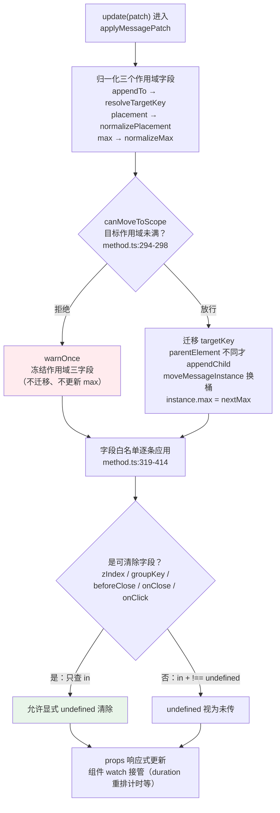
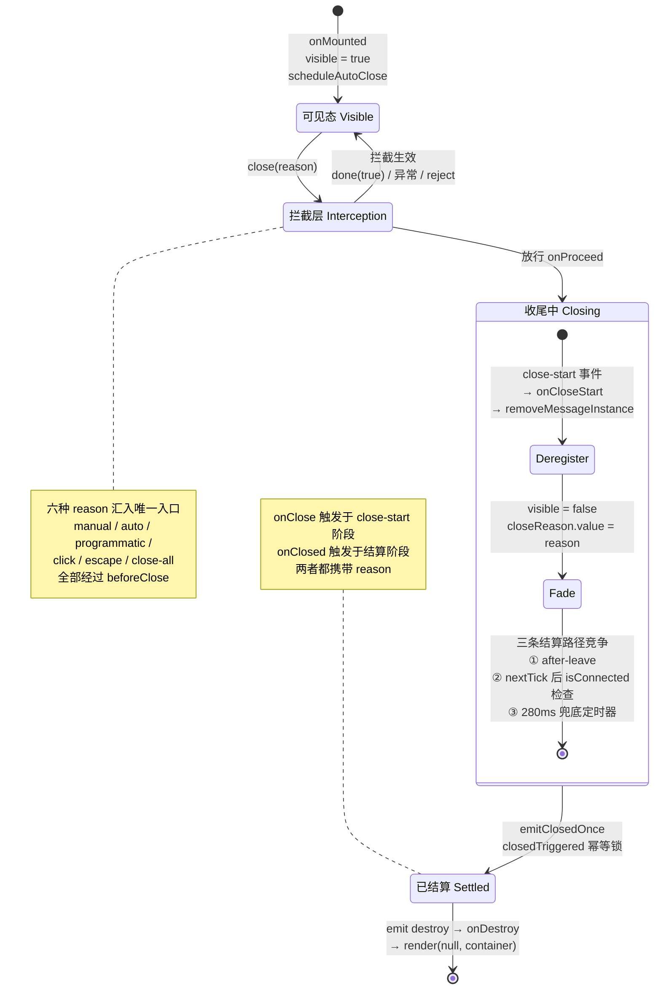

# 7-02 · Message：命令式消息治理

## 从"治理策略"到"代码考古"

4-11 用三个翻车现场开题，讲的是 message 的**治理策略全景**：重复消息怎么合并、消息轰炸怎么限流、页面隐藏时计时怎么暂停。那篇的视角是"服务怎么不把页面搞砸"，代码是为论证策略服务的。

这一篇换个身份：拿着 `packages/components/message/src/method.ts` 从第一行读到第六百七十二行，逐段追问同一个问题——**这 672 行里，每一段在防什么？** 正常路径（参数合法、上限未满、关闭顺利）从来不需要防御性代码；一行防御代码背后必有一个具体的线上事故。读完你会发现，这 672 行没有一行是"正常路径的装饰"，每一段都是某次翻车的事后补墙。

与 4-11 的分工先说清楚：4-11 已全文引用过的段落（normalizeOptions 的三步骨架、grouping 合并分支、max 守卫五行、createMessage 全貌、beforeClose 实现、closeAll 的浅拷贝遍历），本篇只回指不重复；本篇新增四个 4-11 没有展开的角度——**六个 close reason 的完整状态转移**、**WeakMap seed 的取号系统**、**beforeClose 的拦截协议**、**applyMessagePatch 的字段白名单**。另外本篇做两处考据订正：4-11 有两句叙述与源码实态有出入，第六、七节会点名。

先给整份文件的布防图。method.ts 的 672 行可以切成十五段，每段有明确的防御对象：

| 行号区间 | 函数/常量 | 正常职责 | 防御对象 |
| --- | --- | --- | --- |
| 50-55 | `seed` / `targetSeed` / `targetKeyMap` / `hasOwn` | 取号与工具 | id 撞号、DOM 元素被 GC 后悬空引用 |
| 57-65 | `isMessagePrimitive` | 参数形态判定 | 对象误判为内容、内容误判为配置 |
| 67-83 | `nextMessageId` / `resolveTargetKey` | 发号 | 容器重复登记、noop 占用真实 id 空间 |
| 85-111 | `normalizeAppendTo` | 解析挂载点 | SSR 环境、非法选择器、选择器未命中 |
| 113-127 | `normalizePlacement` | 校验位置 | 枚举外的脏值 |
| 129-135 | `normalizeMax` | 归一上限 | NaN / 负数 / 小数 / null 与 0 的语义混淆 |
| 137-161 | `resolveMessageConfig` | 配置仲裁 | 多个 ConfigProvider 并存时的错绑 |
| 163-256 | `normalizeOptions` | 选项归一 | 全局配置污染调用参数 |
| 258-264 | `createNoopHandler` | 空壳句柄 | 调用方对"消息没显示"毫无感知时炸 TypeError |
| 266-283 | `countScopedMessages` / `canMoveToScope` | 上限计数 | 自身占位导致的计数偏差 |
| 285-414 | `applyMessagePatch` | 更新协议 | patch 里的脏键、显式 undefined、迁移超限 |
| 416-471 | `createMessage` | 创建实例 | 挂载失败、业务伪造服务层钩子 |
| 473-519 | `normalizeCloseFilter` / `matchesFilter` | 过滤归一 | 过滤维度不一致、target 反解失败 |
| 521-535 | `bindMessageContext` | 上下文绑定 | withContext 丢方法 |
| 537-672 | `message` 主入口与批量出口 | 服务门面 | SSR 调用、超限丢弃、遍历中修改集合 |

---

## 一、取号系统：两枚计数器与一张 WeakMap（method.ts:50-111）

文件头部的三十行看起来只是"工具函数"，实际是一套完整的取号系统。4-11 在讲 targetKey 时点过 WeakMap 的存在（`method.ts:72-83`），这里把整段展开，因为 seed、targetSeed、WeakMap 三者的分工才是重点：

```ts
let seed = 1;
let targetSeed = 0;

const targetKeyMap = new WeakMap<HTMLElement, string>();
const hasOwn = (target: object, key: PropertyKey) =>
  Object.prototype.hasOwnProperty.call(target, key);

function isMessagePrimitive(value: MessageParams | undefined) {
  return (
    value === undefined ||
    typeof value === "string" ||
    typeof value === "number" ||
    isVNode(value) ||
    typeof value === "function"
  );
}

function nextMessageId() {
  seed += 1;
  return `xy-message-${seed}`;
}

function resolveTargetKey(target: HTMLElement) {
  const cached = targetKeyMap.get(target);

  if (cached) {
    return cached;
  }

  targetSeed += 1;
  const key = `xy-message-target-${targetSeed}`;
  targetKeyMap.set(target, key);
  return key;
}

function normalizeAppendTo(appendTo: MessageOptions["appendTo"], scope = "XyMessage") {
  if (typeof document === "undefined") {
    return null;
  }

  if (!appendTo) {
    return document.body;
  }

  if (typeof appendTo !== "string") {
    return appendTo;
  }

  try {
    const target = document.querySelector<HTMLElement>(appendTo);

    if (target) {
      return target;
    }
  } catch {
    warnOnce(scope, `appendTo 选择器无效：${appendTo}，已回退到 document.body。`);
    return document.body;
  }

  warnOnce(scope, `未找到 appendTo 对应节点：${appendTo}，已回退到 document.body。`);
  return document.body;
}
```

（`packages/components/message/src/method.ts:50-111`）

**第一枚计数器 `seed` 给消息发号，第二枚 `targetSeed` 给容器发号，两者刻意不相通。** 消息 id（`xy-message-N`）是高频发放的：每条真实消息一个、每条被 max 拒掉的消息也要占一个号（后文第四节）。容器 key（`xy-message-target-N`）是低频发放的：一个页面同时存在的挂载容器通常不过个位数。共用一枚计数器不会有正确性问题，但会让"id 序号差 ≈ 消息数"这种朴素的日志对账失效——超限丢弃占掉的号会让 id 序列出现空洞，运维盯日志时能从空洞密度反推"有多少消息被静默吞掉"，前提是容器 key 不来掺水。

**WeakMap 的用途有三层。** 其一，**幂等登记**：`resolveTargetKey` 先查缓存再发号，同一个 `appendTo` 容器无论被解析多少次（normalizeOptions 每次调用都会走一遍，applyMessagePatch 迁移时还要再走），拿到的都是同一个 key——否则"同容器"这个概念在注册表里根本立不起来。其二，**可序列化的字符串键**：注册表过滤（`instance.ts:130-134` 的 `instance.targetKey === targetKey`）、快照（`MessageSnapshotEntry.targetKey`）、测试断言、日志输出，全都需要一个能比较、能打印的值；直接拿 HTMLElement 做键，`JSON.stringify` 出来只剩 `"div"`， getState 的快照就成了废纸。其三，**GC 绑定**：WeakMap 以 DOM 元素为键，容器节点从文档移除后映射自动回收，不会像 `Map<HTMLElement, string>` 那样把整棵 DOM 树钉死在内存里。一张 WeakMap 同时解决"键要稳定、要可读、要可回收"三个互相拉扯的需求，这是它防的第一类事故：**长生命周期页面里的内存泄漏**。

`isMessagePrimitive`（57-65 行）把 `function` 划入"原始形态"值得单独一提：渲染函数 `() => h(...)` 和配置对象 `{ message: ... }` 在 JS 里都是对象，但语义上天差地别——前者是**内容**，后者是**配置**。判定顺序把 `isVNode` 和 `typeof value === "function"` 放在对象分支之前，防的就是"业务传了个渲染函数，却被当成空配置对象解析"的事故。这个函数是 4-11 讲过的 `XyMessage("保存成功")` 与 `XyMessage({ message: "保存成功" })` 等价性的裁决者。

`normalizeAppendTo`（85-111 行）是三重回退：SSR 环境返回 `null`（主入口据此返回 noop）；字符串选择器 `querySelector` 抛异常（非法选择器语法）被 catch 后回退 `document.body`；选择器合法但查不到节点也回退 body。三重回退共用一个哲学：**消息服务宁可挂在错误的位置，也不能缺席**。挂错位置是体验问题，缺席是静默失败——两害相权，前者可修复、后者不可感知。注意 `catch` 块里用的是 `warnOnce` 而非每次告警：轮询场景下每 3 秒传一次坏选择器，console 会被刷成瀑布，`warnOnce` 把事故的噪音压到最低。

---

## 二、配置仲裁的防爆边界（method.ts:129-161）

4-11 引用过 `resolveMessageConfig` 全文并讲了"多数派失效保护"（多个 ConfigProvider 并存时回退默认配置并告警），本篇不重复。这一节补讲它上面的 `normalizeMax`，以及紧随其后的 `normalizeOptions` 前半段——这段代码在归一化入口处垒了两道防爆墙：

```ts
function normalizeMax(value: number | undefined | null) {
  if (value === undefined || value === null || !Number.isFinite(value)) {
    return null;
  }

  return Math.max(0, Math.trunc(value));
}

function resolveMessageConfig(context?: AppContext | null) {
  if (context) {
    const providedConfig = context.provides?.[configProviderKey as symbol] as
      | ProviderLikeConfig
      | undefined;
    const scopedMessageConfig = providedConfig?.message?.value;

    if (scopedMessageConfig !== undefined) {
      return scopedMessageConfig;
    }
  }

  const globalMessageConfigCount = getGlobalMessageConfigCount();

  if (globalMessageConfigCount <= 1) {
    return getGlobalMessageConfig().value ?? {};
  }

  warnOnce(
    "XyMessage",
    "检测到多个 ConfigProvider.message 同时存在。请改用 $message、XyMessage.withContext(appContext) 或 XyMessage(options, appContext) 来显式指定上下文。当前调用已回退到默认配置。"
  );

  return {};
}
```

（`packages/components/message/src/method.ts:129-161`）

`normalizeMax` 的九行里藏着一个类型层没写出来的语义约定：**`null` 不是"没有上限"，而是"上限这个概念未被声明"**。`undefined / null / NaN / Infinity` 全部归一为 `null`（不设限），合法数值经 `Math.max(0, Math.trunc(value))` 收敛——负数托底到 0，小数截断。为什么要截断小数？`max: 2.5` 若直接参与 `countScopedMessages(...) >= normalized.max` 比较，2.5 与 3 的边界会让"第 3 条能不能进"变成浮点巧合。而 `max: 0` 与 `max: null` 的区别是这个函数最重要的产出：前者是显式声明"这个作用域禁言"，后者是"从未讨论过上限"。两者在主入口的判定路径完全不同（`null` 短路跳过计数，`0` 走计数判定恒为超限），混用任何一种归一方式（比如把 0 归一为 null）都会让"禁言"变成"不设限"，防御方向恰好反转。

`normalizeOptions` 的前半段（163-195 行）把 SSR 守卫放在函数第一行——注意主入口 537-541 行**也**有一个 SSR 守卫，同一件事防了两遍。这不是冗余：主入口的守卫保护"整个服务"，normalizeOptions 的守卫保护"函数自身"，因为 normalizeOptions 未来可能被 patch 路径或测试直接调用，一旦有人在 SSR 里误触它，`document.querySelector` 会在归一化内部就炸掉，而不是等到挂载阶段留下一条难查的堆栈。防御性代码有个朴素的分层原则：**守卫跟着它保护的操作走，而不是跟着调用链走**。

后半段的 hasOwn 逐字段继承（197-253 行，13 个字段同构重复）4-11 已经完整论证过——"把'没写'和'写了默认值'严格区分开"的配置链防污染堤坝——此处只补一个本篇视角的观察：这 57 行重复代码在方法学上叫"以密度换安全性"。它可以把 13 个字段抽成一个 `for...in` 循环加类型映射，代码量缩到三分之一，但循环版本丢掉了 TypeScript 对每个字段类型的独立检查（`typeof globalMessageConfig.duration === "number"` 的守卫写在循环里就退化成字符串索引访问）。手写 13 遍的代价买来的是：任何一个字段的类型守卫写错，tsc 在这一行单独报错，而不是整个继承机制静默失效。

---

## 三、noop handler：被拒绝的调用也要有 API（method.ts:258-283、537-579）

4-11 讲过 max 满时"静默丢弃返回 noop handler"的结论，但没有展开 noop 本身的两处设计。先看完整的 noop 与它的两个协作函数：

```ts
function createNoopHandler(id = `xy-message-noop-${Date.now()}`): MessageHandler {
  return {
    id,
    close() {},
    update() {}
  };
}

function countScopedMessages(placement: MessagePlacement, targetKey: string, excludeId?: string) {
  return getScopedPlacementInstances(placement, targetKey).filter(
    (instance) => instance.id !== excludeId
  ).length;
}

function canMoveToScope(
  instance: MessageContext,
  nextPlacement: MessagePlacement,
  nextTargetKey: string,
  nextMax: number | null
) {
  if (nextMax === null) {
    return true;
  }

  return countScopedMessages(nextPlacement, nextTargetKey, instance.id) < nextMax;
}
```

（`packages/components/message/src/method.ts:258-283`）

**权衡一：消息被拒绝时，服务应该做什么？** 可选答案有三种。抛错——最"诚实"，但把治理失败转嫁成业务异常：一个轮询页面的消息上限被触发，不应该让整个请求回调链崩掉。排队——看起来温柔，实则引入新事故：排队消息弹出时业务的闭包上下文可能已经过期（用户早切走了，那条"操作成功"弹出来反而误导），而且队列本身需要上限、需要清空时机，治理复杂度原地翻倍。本库选第三种：**静默丢弃，但返回一个完整的 API**。`createNoopHandler` 的 `close()` 和 `update()` 都是空函数，调用方拿到的句柄与真实句柄结构完全一致（`MessageHandler` 接口三件套，`message.ts:132-136`），`const h = XyMessage({...}); h.update({...}); h.close()` 在任何情况下都是合法调用。消息没显示是"治理的代价"，句柄可用是"API 的承诺"——两件事被切开了。

noop 的 id 策略是细节里的细节。默认 id 是 `xy-message-noop-${Date.now()}`——这个命名空间只服务于**环境性失败**（SSR 调用、normalizeOptions 返回 null），时间戳保证不会与任何真实消息撞号，`noop-` 前缀让日志一眼可辨"这次调用根本没有服务在跑"。而超限路径传入的是 `nextMessageId()`（主入口 573 行），从真实消息的 seed 里**占号**——被丢弃的消息与真实消息共用同一个 id 空间，id 序列的空洞就是超限发生的痕迹。两种 id 策略的分野是可观测性设计：环境失败要"一眼假"，治理丢弃要"可对账"。

再看顺序。主入口的三道闸门（4-11 已画过流程图，此处回指）：SSR 守卫 → grouping 合并 → max 计数。**合并闸门排在计数闸门之前**，这个顺序是刻意的泄压阀设计：合并不新增 DOM，所以它不应该受 max 约束——想象 200 条重复的"导入失败"撞上 `max: 5`，如果计数先行，第 6 条起的重复消息全部被丢弃返回 noop，合并机制整个失效，徽标计数永远停在 5。合并先行让"200 条重复"坍缩成 1 条带 `repeatNum: 200` 徽标的聚合消息，max 只约束**真正新增的视觉噪音**。顺序颠倒一次，治理语义全变。

`canMoveToScope`（272-283 行）是 max 守卫在 update 路径的镜像，它的 `excludeId` 参数防的是一个微妙的计数偏差：消息从 top 迁移到 top-right 时，它自己还在 top 的桶里（注册表除名发生在 `moveMessageInstance` 内部，见第九节），如果不把自己排除，"目标位置已有 N 条、上限 N"的判定会把自己也数进去，导致明明有名额的迁移被拒。`countScopedMessages(nextPlacement, nextTargetKey, instance.id)` 的第三个参数就是为此而设——**计数时排除自我，是"迁移"语义区别于"新建"的关键一步**。

---

## 四、applyMessagePatch：92 行白名单的字段协议（method.ts:285-414）

这是本篇的核心新角度。`applyMessagePatch` 共 130 行，占 method.ts 的近五分之一，是六个 close reason 之外整份文件最长的函数。4-11 提到过它的行号但没有解剖。它的入口先处理三个"作用域字段"：

```ts
function applyMessagePatch(instance: MessageContext, patch: MessageUpdateOptions) {
  const nextTarget = "appendTo" in patch ? normalizeAppendTo(patch.appendTo) : null;
  const nextTargetKey = nextTarget ? resolveTargetKey(nextTarget) : instance.targetKey;
  const nextPlacement =
    "placement" in patch && patch.placement !== undefined
      ? normalizePlacement(patch.placement)
      : (instance.props.placement ?? MESSAGE_DEFAULT_PLACEMENT);
  const nextMax = "max" in patch ? normalizeMax(patch.max) : instance.max;

  if (!canMoveToScope(instance, nextPlacement, nextTargetKey, nextMax)) {
    warnOnce(
      "XyMessage",
      `消息 ${instance.id} 更新后的目标位置已达到上限，已忽略本次 placement / appendTo 变更。`
    );
  } else {
    if (nextTarget) {
      instance.targetKey = nextTargetKey;
      instance.props.targetKey = nextTargetKey;

      const element = instance.vm.proxy?.$el as HTMLElement | undefined;

      if (element && element.parentElement !== nextTarget) {
        nextTarget.appendChild(element);
      }
    }

    if (nextPlacement !== (instance.props.placement ?? MESSAGE_DEFAULT_PLACEMENT)) {
      moveMessageInstance(instance, nextPlacement);
      instance.props.placement = nextPlacement;
    }

    instance.max = nextMax;
  }

  if ("message" in patch && patch.message !== undefined) {
    instance.props.message = patch.message;
  }
```

（`packages/components/message/src/method.ts:285-321`）

作用域段有三个防御点。**其一，"先算后判"**：appendTo、placement、max 三个值先归一化成 `nextTarget / nextPlacement / nextMax`，再交给 `canMoveToScope` 一次性裁决——而不是边改边判。若 appendTo 迁移成功后 placement 归一化才发现超限，实例就会卡在"DOM 已搬家、注册表没跟上"的撕裂状态。先算后判保证了守卫裁决是原子的：要么三个作用域字段一起迁移，要么一起不动。**其二，部分应用语义**：守卫拒绝时只 warnOnce 并冻结作用域迁移，函数**继续往下走**——message、type、duration 等内容字段照常应用。一次 update 携带十个字段，其中 placement 超限，结果不是整个 patch 被拒，而是"位置不动、内容照更"。这避免了"一次超限迁移把文案更新也一并吞掉"的连带伤害，代价是调用方必须理解"update 是尽力而为的部分提交，不是事务"。**其三，DOM 迁移幂等**：`element.parentElement !== nextTarget` 的判断防的是重复 appendChild——把一个已挂载节点 appendChild 到相同父节点，会触发节点在 DOM 里的"移除再插入"，表现为消息闪一下、CSS transition 重放。这个单行判断挡住的是视觉层的确定性 bug。

真正值得驻足的是后面 92 行的字段白名单：

```ts
  if ("render" in patch) {
    instance.props.render = patch.render;
  }

  if ("customClass" in patch && patch.customClass !== undefined) {
    instance.props.customClass = patch.customClass;
  }

  if ("dangerouslyUseHTMLString" in patch && patch.dangerouslyUseHTMLString !== undefined) {
    instance.props.dangerouslyUseHTMLString = patch.dangerouslyUseHTMLString;
  }

  if ("duration" in patch && patch.duration !== undefined) {
    instance.props.duration = patch.duration;
  }

  if ("icon" in patch && patch.icon !== undefined) {
    instance.props.icon = patch.icon;
  }

  if ("offset" in patch && patch.offset !== undefined) {
    instance.props.offset = patch.offset;
  }

  if ("plain" in patch && patch.plain !== undefined) {
    instance.props.plain = patch.plain;
  }

  if ("repeatNum" in patch && patch.repeatNum !== undefined) {
    instance.props.repeatNum = patch.repeatNum;
  }

  if ("showClose" in patch && patch.showClose !== undefined) {
    instance.props.showClose = patch.showClose;
  }

  if ("showIcon" in patch && patch.showIcon !== undefined) {
    instance.props.showIcon = patch.showIcon;
  }

  if ("type" in patch && patch.type !== undefined) {
    instance.props.type = patch.type;
  }

  if ("zIndex" in patch) {
    instance.props.zIndex = patch.zIndex;
  }

  if ("groupKey" in patch) {
    instance.props.groupKey = patch.groupKey;
  }

  if ("beforeClose" in patch) {
    instance.props.beforeClose = patch.beforeClose;
  }

  if ("onClose" in patch) {
    instance.props.onClose = patch.onClose;
  }

  if ("onClick" in patch) {
    instance.props.onClick = patch.onClick;
  }

  if ("closeOnClick" in patch && patch.closeOnClick !== undefined) {
    instance.props.closeOnClick = patch.closeOnClick;
  }

  if ("closeOnPressEscape" in patch && patch.closeOnPressEscape !== undefined) {
    instance.props.closeOnPressEscape = patch.closeOnPressEscape;
  }

  if ("pauseOnHover" in patch && patch.pauseOnHover !== undefined) {
    instance.props.pauseOnHover = patch.pauseOnHover;
  }

  if ("pauseOnFocus" in patch && patch.pauseOnFocus !== undefined) {
    instance.props.pauseOnFocus = patch.pauseOnFocus;
  }

  if ("pauseOnPageHidden" in patch && patch.pauseOnPageHidden !== undefined) {
    instance.props.pauseOnPageHidden = patch.pauseOnPageHidden;
  }

  if ("transition" in patch && patch.transition !== undefined) {
    instance.props.transition = patch.transition;
  }

  if ("resetOnRepeat" in patch && patch.resetOnRepeat !== undefined) {
    instance.props.resetOnRepeat = patch.resetOnRepeat;
  }
}
```

（`packages/components/message/src/method.ts:323-414`）

**权衡二：字段白名单还是 `Object.assign(instance.props, patch)`？** 一行 assign 能替换这 92 行，为什么不用？三重理由。

第一，**patch 里混着不能进 props 的键**。`MessageUpdateOptions` 的类型是 `Partial<MessageOptions> & Partial<Pick<MessageProps, "repeatNum">>`（`message.ts:129-130`），而 `MessageOptions` 在 MessageProps 之外扩展了 `appendTo / grouping / max` 三个服务层字段——它们不是组件 props（`appendTo` 尤其特殊：props 版的 `targetKey` 才是组件感知的字段，`appendTo` 是 string 或 HTMLElement，直接塞给 vm.props 要么成为无效 attr，要么把 DOM 元素对象泄漏进渲染上下文）。白名单天然把这三个键挡在 props 之外，由头部的作用域段特判处理。

第二，**`targetKey` 是最危险的键**。`MessageProps` 里恰好声明了 `targetKey?: string`（`message.ts:99`），一条 assign 语句会把 patch 里的 `targetKey` 直接写进 `vm.props`，绕过 `resolveTargetKey` 的 WeakMap 登记——注册表里 `instance.targetKey` 与组件 props 的 `targetKey` 从此脱钩，作用域计数、grouping 匹配、堆叠偏移全部失准。白名单里**根本没有 targetKey 这一项**：它只能经由 `appendTo` 归一化后由服务层写入（300-302 行同时更新 `instance.targetKey` 与 `instance.props.targetKey`），类型上的巧合声明被协议层封死了。这是"白名单比黑名单可靠"的教科书案例：黑名单要枚举所有危险键，白名单只放行已审计的键。

第三，**`"in"` 与 `!== undefined` 的双闸门不是套模板，而是两类字段的协议分野**。细看这 92 行，绝大多数字段是 `"x" in patch && patch.x !== undefined` 双条件——显式传了这个键**且**值有效才更新，显式传 `undefined` 被视为"没传"。但有五个字段只查 `"in"` 不查 undefined：`zIndex`（367-369 行）、`groupKey`（371-373 行）、`beforeClose`（375-377 行）、`onClose`（379-381 行）、`onClick`（383-385 行）。这五个是**可清除字段**：`handle.update({ zIndex: undefined })` 的语义是"撤销我之前指定的层级，回到自动分配"；`handle.update({ onClose: undefined })` 是解绑回调。它们恰好是一切"可撤销引用"——层级、分组标识、三个生命周期回调。不可清除的字段（duration、type、showClose……）传 undefined 没有合理语义（"把 duration 更新为 undefined"只会让组件回退到 prop 默认值 3000，静默改变存活策略），所以被双闸门拦下。**92 行的重复不是懒惰的展开，而是一张按"可清除性"分成两区的字段协议表。**

patch 的整体管线画出来是这样的：



组件侧对 patch 的响应由 watch 接管：`duration` 变更触发 `scheduleAutoClose` 重排（`message.vue:397-404`），`message / render` 变更触发 `nextTick` 后重测高度（415-420 行），`pauseOnPageHidden` 变更动态挂卸 visibilitychange 监听（422-437 行）。服务层改 props，组件层自适应，两层靠 Vue 的响应式契约衔接——这也是白名单敢做"部分应用"的底气：**任何一个字段的更新都不会产生需要服务层收尾的副作用**。

update 迁移路径的完整行为有一组专门的测试钉死：

```ts
  it("update 迁移 placement 时会遵守 max 约束", async () => {
    XyMessage({
      message: "顶部唯一消息",
      duration: 0,
      placement: "top-right",
      max: 1
    });
    const handle = XyMessage({
      message: "底部消息",
      duration: 0,
      placement: "bottom-right"
    });

    await flushMessage();

    handle.update({
      placement: "top-right",
      max: 1
    });

    await flushMessage();

    const texts = getMessages().map((message) => message.textContent ?? "");

    expect(texts.some((text) => text.includes("顶部唯一消息"))).toBe(true);
    expect(texts.some((text) => text.includes("底部消息"))).toBe(true);
    expect(
      getMessages()
        .find((message) => message.textContent?.includes("底部消息"))
        ?.classList.contains("is-bottom")
    ).toBe(true);
  });
```

（`packages/components/message/__tests__/message.spec.ts:259-290`）

注意断言的不是"迁移被拒"这件事本身，而是**迁移被拒之后原消息完好无损**——"底部消息"还在 bottom-right、还带着 `is-bottom`。这正是部分应用语义的测试化表达：守卫拒绝作用域迁移，但 update 调用本身无副作用泄漏。

---

## 五、createMessage：伪 props 注入协议（method.ts:416-471）

`createMessage` 4-11 已全文引用并讲了它"服务层与组件层缝合点"的定位。本篇只截它最容易被忽略的 24 行——props 注入与挂载防御：

```ts
  const props: MessageCreateProps = {
    ...options,
    id,
    onCloseStart: () => {
      removeMessageInstance(instance);
    },
    onDestroy: () => {
      render(null, container);
    }
  };
  const vnode = createVNode(
    MessageConstructor,
    props as MessageCreateProps & Record<string, unknown>
  );
  vnode.appContext = context || message._context;
  render(vnode, container);

  const element = container.firstElementChild;

  if (!element) {
    throw new Error("XyMessage 挂载失败：未生成可用的消息节点。");
  }

  options.appendTo.appendChild(element);
```

（`packages/components/message/src/method.ts:424-447`）

`onCloseStart` 和 `onDestroy` 是两个**业务永远传不进来的 props**。看类型层：`MessageProps`（`message.ts:81-110`）没有这两个字段，`MessageOptions = Omit<MessageProps, "id" | "repeatNum" | "targetKey">` 也不会有，它们只存在于 `MessageCreateProps`（`method.ts:38-42`）这个文件内部类型里。看运行时：注入写在 `{...options}` 之后，即使业务绕过类型检查强行塞入同名字段，也会被覆盖。这条"伪 props"信道的作用是让服务层在两个业务碰不到的时刻拿到回调——**关闭一开始**（`emit("close-start")` 时 Vue 的 emit 约定会自动调用 props 上的 `onCloseStart`，组件根本不需要显式调用它）就把实例从注册表除名，**组件销毁**（`emit("destroy")`）时 `render(null, container)` 清空容器。业务侧的 `onClose / onClosed`（`message.ts:89-90`）是公开的生命周期钩子，与服务层这两条私有信道在命名约定上分道而行：`close-start / destroy` 是服务层的钩子名，`onCloseStart / onDestroy` 是它们的 props 化形态。借 Vue 的事件命名约定开旁路，类型层再封死入口——这是"内部协议不污染公开 API"的实现范本。

441-445 行的 `throw` 是整份文件唯一的主动抛错。一个全是"回退、告警、静默丢弃"的防御体系里，为什么这里寸步不让？因为挂载失败意味着**内部不变量已破坏**（createVNode + render 之后容器里必然有根元素，没有说明 Vue 渲染管线本身出了问题），后续所有防御都建立在"element 存在"之上，此时回退只会把错误推迟到更难排查的位置。防御性编程的分寸感就在这：**可恢复的失败回退，不可恢复的不变量破坏抛错**。

handler 与实例的装配（449-471 行，4-11 引过）里还有一个reason 的默认值细节：`close(reason = "programmatic")`——handler.close 不带参调用时死因登记为 `programmatic`，与组件层 `close(reason: MessageCloseReason = "programmatic")`（`message.vue:282`）的默认值完全一致。六种 reason 里的 `programmatic` 就是给"业务只知道要关、不关心死因语义"这条最常见路径准备的兜底枚举。

---

## 六、六个 close reason 的完整状态转移（message.ts:12-19、message.vue）

4-11 列举过六种死因的枚举定义（`message.ts:12-19`），但没有追踪每一种从触发到结算的完整路径。这是本篇的状态机补课。先看枚举与它的常量邻居：

```ts
export const messageTypes = ["primary", "success", "info", "warning", "error"] as const;
export const messagePlacements = [
  "top",
  "top-left",
  "top-right",
  "bottom",
  "bottom-left",
  "bottom-right"
] as const;
export const messageCloseReasons = [
  "manual",
  "auto",
  "programmatic",
  "click",
  "escape",
  "close-all"
] as const;

export const MESSAGE_DEFAULT_PLACEMENT = "top";
export const MESSAGE_DEFAULT_TRANSITION = "xy-message-fade";
export const MESSAGE_GROUP_SPACING = 16;
```

（`packages/components/message/src/message.ts:3-23`）

六个 reason 的确切触发点，逐一核对如下：

- **manual**：关闭按钮的 `@click.stop="close('manual')"`（`message.vue:498`）。`.stop` 修饰符防的是事件冒泡——根元素上挂着 `handleRootClick`（292-301 行），若不阻断，点关闭按钮会先触发 `onClick` 回调（死因 `click`），再触发关闭（死因 `manual`），一次点击两份回调。
- **auto**：定时器到期 `close("auto")`（`message.vue:229-233`），以及一个隐蔽的第二入口——暂停恢复时剩余时间归零，`scheduleAutoClose(0)` 走到 `nextDelay === 0` 分支立即关闭（222-224 行）。
- **programmatic**：`handler.close()` 的默认值（`method.ts:452`）。
- **click**：`closeOnClick` 开启时根元素点击（`message.vue:298-300`）。
- **escape**：document 级 keydown 监听（`message.vue:303-307`）。
- **close-all**：批量关闭统一登记（`method.ts:612`）。

六个入口汇入同一个函数 `close(reason)`（282-290 行），经 `beforeClose` 拦截层后进入 `performClose`（262-280 行），然后走三条结算路径之一。完整状态转移：



这张图上有三个 4-11 之后值得补充的观察。

**第一，close-start 的注册表除名发生在动画开始之前。** `performClose` 先 `emit("close-start")`（268 行），服务层注入的 `onCloseStart` 同步执行 `removeMessageInstance`（`method.ts:427-429`），此时 `<Transition>` 还没开始播出场动画。这意味着后续消息的堆叠偏移立刻重算——用户连续关掉 top 区第二条消息时，第三条**在动画播放期间**就平滑上移，而不是等 300ms 动画结束后跳一下。注册表除名（逻辑死亡）与 DOM 卸载（视觉死亡）分属两个时刻，是 4-11 "两次死亡"论述的几何学后果。

**第二，三条结算路径的竞争由一个布尔锁收口。** `closedTriggered`（`message.vue:78`）+ `emitClosedOnce` 的先查后置（176-184 行）保证 `closed` 回调无论被哪条路径触发都只执行一次。三条路径是真正的竞争者：正常路径走 `<Transition>` 的 `after-leave`（450-455 行）；容器被整体摘除时走 `nextTick` 后的 `isConnected` 检查（274-279 行）；transition 实现异常时走 280ms 的 `scheduleDestroyFallback`（191-206 行）。三者可能几乎同时满足，没有幂等锁，业务会收到两三次 `onClosed`——对一个以"关闭后清理"为职责的回调来说，重复执行就是重复清理，轻则日志翻倍重则二次释放。

**第三，考据订正其一：beforeClose 的拦截面覆盖全部六种 reason，包括 auto。** 4-11 的表述是"自动关闭（duration 到期）时，'何时死'是组件的预算，业务只该旁观；而手动/程序化关闭时，业务可能有'关闭前再确认'的诉求，beforeClose 就是给这条路径留的否决权"，并归结为"两套钩子、两种归属，互不越界"。但源码上 `close(reason)` 是唯一入口（282-290 行），`invokeMessageBeforeClose` 无条件执行——**auto 到期同样要过拦截层**，业务在 `beforeClose` 里 `done(true)` 可以拦下一条即将自动关闭的消息（比如表单尚未保存时的"未保存提醒"恰恰不该自动消失）。更准确的表述是：beforeClose 对六种 reason **全部拥有否决权**，"旁观"只属于 `onClosed`——那个钩子不可取消、只在结算后触发。拦截协议的完整语义见下一节。

模板侧的收尾与徽标（447-473 行）也在状态转移图里各就各位：

```vue
<template>
  <Transition
    :name="props.transition"
    @after-leave="
      () => {
        emitClosedOnce(closeReason);
        emitDestroyOnce();
      }
    "
  >
    <div
      v-show="visible"
      :id="props.id"
      ref="messageRef"
      :class="rootClasses"
      :style="customStyle"
      role="alert"
      tabindex="0"
      @click="handleRootClick"
      @mouseenter="handleMouseEnter"
      @mouseleave="handleMouseLeave"
      @focusin="handleFocusIn"
      @focusout="handleFocusOut"
    >
      <span v-if="props.repeatNum > 1" class="xy-message__badge">
        {{ props.repeatNum }}
      </span>
```

（`packages/components/message/src/message.vue:447-473`）

`v-show` 而非 `v-if` 是这套状态机的隐藏前提：出场动画要求元素先离场再卸载，`v-if` 会在 visible 置 false 的瞬间直接移除 DOM，三条结算路径里的两条（isConnected 检查、280ms 兜底）会立刻误判"已卸载"而跳过动画。`after-leave` 之所以能作为正常路径的结算点，前提就是元素仍在文档中、只是 display: none。

---

## 七、拦截协议：beforeClose 的权力交接（message.ts:219-255）

4-11 引用过 `invokeMessageBeforeClose` 全文并讲了 `finished` 幂等锁。本篇换个读法：把它当一份**协议文档**逐条读，重点在 4-11 没展开的失效语义。先看协议的核心 26 行：

```ts
  let finished = false;
  const done: MessageDoneFn = (cancel) => {
    if (finished) {
      return;
    }

    finished = true;

    if (cancel) {
      return;
    }

    onProceed();
  };

  try {
    const result = beforeClose(done, context);

    if (result && typeof (result as Promise<void>).catch === "function") {
      void (result as Promise<void>).catch(() => {
        finished = true;
      });
    }
  } catch {
    finished = true;
  }
```

（`packages/components/message/src/message.ts:229-254`）

这份协议有四个条款。**条款一：权力完全交接。** `beforeClose` 一旦声明，关闭的控制权就整体移交——业务不调 `done`，消息永远不关，没有任何超时强制放行的机制。这不是疏忽：强制放行等于"业务确认逻辑可以被绕过"，与拦截语义自相矛盾。协议要求业务显式归还权力，`done` 就是归还动作。测试 `message.spec.ts:91-106` 钉死了这条契约：

```ts
  it("支持 beforeClose 拦截程序化关闭", async () => {
    const beforeClose = vi.fn((done: (cancel?: boolean) => void) => done(true));
    const handle = XyMessage({
      message: "待拦截消息",
      duration: 0,
      beforeClose
    });

    await flushMessage();

    handle.close();
    await flushMessage();

    expect(beforeClose).toHaveBeenCalledTimes(1);
    expect(getMessages()).toHaveLength(1);
  });
```

（`packages/components/message/__tests__/message.spec.ts:91-106`）

`done(true)` 取消后消息仍在，且 `beforeClose` 只被调用一次——第二次 `handle.close()` 会重新走一遍协议（重新调用 beforeClose），拦截是每次关闭独立裁决的。

**条款二：done 的幂等锁。** `finished` 标志让 `done` 只认第一次调用，`done(); done(true);` 的组合里第二次调用被静默忽略——协议不会因为业务在异步回调里"反悔"而出现先关闭再取消的时序悖论。

**条款三与条款四，是本篇的考据订正其二：同步异常与 Promise reject 的语义是"冻结"，不是 4-11 所说的"放行"。** 4-11 的原话是"同步抛异常也按'拦截失效即放行关闭'处理"。但看源码：`catch { finished = true; }`（252-254 行）只是把 finished 置位，**没有调用 `onProceed()`**——同步抛异常的结局是消息留在原地，关闭被搁置。Promise 分支同理：`result.catch(() => { finished = true; })`（247-251 行）在 reject 时置位 finished、不调用 onProceed，reject 的语义同样是取消关闭。所以两种"失效"路径的共同语义是**未结算的冻结**：协议既不放行也不算数，等待业务下一次显式 `close()` 重新走一遍裁决。这个设计在语义上是自洽的——异常和 reject 都代表"业务确认逻辑自身出了问题"，在确认逻辑健康之前放行关闭，等于让一个不可信的守卫做出生杀决定；冻结则把决定权留在业务手里。代价同样真实：业务若在 beforeClose 里无条件 throw，消息就永久关不掉（除非后续 close 时异常不再发生）。4-11 的"放行"叙述与源码相反，读源码时要以本节的逐条核对为准。

协议的最后一层是 `MessageActionContext.close(nextReason)`（`message.ts:47`，实现于 `message.vue:149-151`）：拦截者拿到 context 后可以调用 `context.close("manual")` 用**不同的 reason** 重新发起关闭——比如拦截 escape 关闭、弹确认框后以 programmatic 关闭。reason 的语义在拦截协议里是可改写的，这为死因审计留了一个受控的改道口。

---

## 八、批量出口与快照投影（method.ts:473-519、581-667）

closeAll 与 getState 的主体逻辑 4-11 讲过（浅拷贝遍历、过滤维度、测试不再查 DOM）。本篇补讲它前面两个没被引用过的归一化函数——它们决定"过滤条件怎么从用户输入变成注册表可比对的键"：

```ts
function normalizeCloseFilter(filter?: MessageType | MessageCloseFilter): MessageCloseFilter {
  if (typeof filter === "string") {
    return {
      type: filter
    };
  }

  return filter ?? {};
}

function resolveTargetKeyFromFilter(filter: MessageCloseFilter) {
  if (filter.targetKey) {
    return filter.targetKey;
  }

  if (!("target" in filter) || !filter.target) {
    return undefined;
  }

  const target = normalizeAppendTo(filter.target);

  return target ? resolveTargetKey(target) : undefined;
}

function matchesFilter(
  instance: MessageContext,
  filter: MessageCloseFilter,
  targetKey: string | undefined
) {
  if (filter.type && instance.props.type !== filter.type) {
    return false;
  }

  if (filter.placement && instance.props.placement !== filter.placement) {
    return false;
  }

  if (targetKey && instance.targetKey !== targetKey) {
    return false;
  }

  if (filter.groupKey !== undefined && instance.props.groupKey !== filter.groupKey) {
    return false;
  }

  return true;
}
```

（`packages/components/message/src/method.ts:473-519`）

`normalizeCloseFilter` 让 `closeAll("error")` 与 `closeAll({ type: "error" })` 等价。`resolveTargetKeyFromFilter` 有个值得玩味的边界：`closeAll({ target: "#never-mounted" })` 传入一个从未挂过消息的容器选择器，`normalizeAppendTo` 解析出元素后 `resolveTargetKey` 会**新发一个 key**——这个 key 与任何活实例的 targetKey 都不同，matchesFilter 的第三道闸门把所有实例拦下，结果为空集。新发号而不是报错，让"对不存在的容器清场"成为一次无害的空操作，与 noop handler 的哲学一脉相承：**过滤条件查无此人时，返回空结果而不是异常**。

matchesFilter 的四道闸门全部是"有条件才比"：`filter.type &&` 的短路保证未声明的维度不参与过滤，四维（type / placement / targetKey / groupKey）之间是 AND 关系。注意 `groupKey` 的判定用 `!== undefined` 而其余用真值判定——因为 groupKey 的合法值包含空字符串吗？看 `getMatchingGroupInstance`（`instance.ts:143`）对空字符串 groupKey 的处理是"视为未声明"，而 matchesFilter 里 `filter.groupKey !== undefined` 意味着**显式传空字符串会参与过滤且永远匹配不上**（活实例的 groupKey 不会是空字符串，grouping 匹配时不接受空 key）。这是一个不完美的对称：closeAll 侧把空字符串当有效过滤值，grouping 侧把它当未声明。实际影响趋近于零（没人用空字符串当组名），但读源码时值得知道这处不对称的存在。

批量出口的主体（581-616 行）——typed 快捷方式与 closeAll——值得完整看一遍 typed 层的防御：

```ts
messageTypes.forEach((type) => {
  message[type] = (options?: MessageParams, context?: AppContext | null) => {
    if (isMessagePrimitive(options)) {
      return message(
        {
          message: options as MessageOptions["message"],
          type
        },
        context
      );
    }

    const nextOptions = (options ?? {}) as MessageOptions;

    return message(
      {
        ...nextOptions,
        type
      },
      context
    );
  };
});

message.closeAll = (filter?: MessageType | MessageCloseFilter) => {
  const normalizedFilter = normalizeCloseFilter(filter);
  const targetKey = resolveTargetKeyFromFilter(normalizedFilter);

  Object.values(placementInstances).forEach((instances) => {
    [...instances].forEach((instance) => {
      if (matchesFilter(instance, normalizedFilter, targetKey)) {
        instance.handler.close("close-all");
      }
    });
  });
};
```

（`packages/components/message/src/method.ts:581-616`）

typed 层有一个隐蔽的类型修复：`XyMessage.error({ type: "success" })` 这种自相矛盾的调用，展开顺序是 `{...nextOptions, type}`——**函数名的 type 放在 spread 之后**，字面量的 type 永远赢。函数名是调用者意图更强的表达（都点名 `.error` 了），对象里误写的 type 被视为笔误。一行顺序差，防住"语义与类型打架"。

closeAll 的 `[...instances]` 浅拷贝 4-11 论证过（onCloseStart 会在遍历中 splice 原数组，不拷贝会跳元素）。本篇补充一个对照：`getState`（624-667 行）遍历的是 `getMessageSnapshot()` 的投影而非注册表本身——快照是纯数据投影，天然免疫"遍历中修改集合"，所以它的过滤循环不需要拷贝。同一个文件里，**会改集合的遍历拷贝、只读的遍历投影**，两种防御各按其需。getState 的过滤维度（637-655 行）与 matchesFilter 逐条对齐（type / placement / targetKey / groupKey 四维 AND），这不是巧合而是刻意维持的契约：能用 closeAll 过滤掉的集合，必须能用 getState 精确观察，否则"关闭了什么"与"看到了什么"会对不上账。

`bindMessageContext`（521-535 行）是 withContext 的实现：闭包住 appContext 重建一个 message 函数、逐个挂上 typed 方法，`closeAll / closeAllByPlacement / getState` 直接共享主服务的引用（批量操作与上下文无关，注册表是全局的），只有 `message(options)` 与五个 typed 方法需要绑定。`bound._context = appContext` 让绑定结果可以继续链式 withContext——上下文可以覆盖但不会丢失。

---

## 九、注册表与组件侧的配合防线（instance.ts、message.vue:354-386）

method.ts 的防御不是孤军，注册表（instance.ts）与组件（message.vue）各有一段配合防线。先看注册表侧的除名与搬家：

```ts
export function removeMessageInstance(instance: MessageContext) {
  const placement = instance.props.placement;

  if (!placement) {
    return;
  }

  const instances = placementInstances[placement];

  if (!instances) {
    return;
  }

  const index = instances.indexOf(instance);

  if (index !== -1) {
    instances.splice(index, 1);
  }
}
```

（`packages/components/message/src/instance.ts:84-102`）

三重空值防御（无 placement、无桶、找不到实例）对应三种"除名时实例已不在册"的情形：patch 迁移导致 props.placement 与注册桶不一致的瞬间、closeAll 与单条关闭竞争时实例已被移除、重复触发 onCloseStart。每一层 `return` 都是无害空操作——**除名是幂等的，谁先到谁生效，后到的静默退出**。

搬家的对称实现：

```ts
export function moveMessageInstance(instance: MessageContext, nextPlacement: MessagePlacement) {
  const previousPlacement = instance.props.placement;

  if (previousPlacement === nextPlacement) {
    return;
  }

  if (previousPlacement) {
    removeMessageInstance(instance);
  }

  getOrCreatePlacementInstances(nextPlacement).push(instance);
}

export function getScopedPlacementInstances(placement: MessagePlacement, targetKey: string) {
  const instances = placementInstances[placement] ?? [];

  return instances.filter((instance) => instance.targetKey === targetKey);
}
```

（`packages/components/message/src/instance.ts:116-134`）

`moveMessageInstance` 的先判等、再除名、后入桶，与 applyMessagePatch 的"先算后判"呼应：patch 层裁决通过后，注册表的搬家是原子的两步（除名 + 入桶），中间不存在实例同时在两个桶或两个桶都不在的状态——至少对**读取方**不可见，因为 `shallowReactive` 桶数组的两次变更会被 Vue 批量调度。

组件侧最后一段配合防线在挂载与卸载的对称性上：

```ts
onMounted(() => {
  runtimeZIndex.value = props.zIndex ?? next();
  syncHeight();

  if (typeof ResizeObserver !== "undefined" && messageRef.value) {
    resizeObserver = new ResizeObserver(() => {
      syncHeight();
    });
    resizeObserver.observe(messageRef.value);
  }

  if (typeof document !== "undefined") {
    document.addEventListener("keydown", handleKeydown);

    if (props.pauseOnPageHidden) {
      document.addEventListener("visibilitychange", handleVisibilityChange);
    }
  }

  visible.value = true;
  scheduleAutoClose();
});

onBeforeUnmount(() => {
  clearTimer();
  clearDestroyTimer();
  resizeObserver?.disconnect();

  if (typeof document !== "undefined") {
    document.removeEventListener("keydown", handleKeydown);
    document.removeEventListener("visibilitychange", handleVisibilityChange);
  }
});
```

（`packages/components/message/src/message.vue:354-386`）

四个防御点。**其一，Escape 监听挂 document 而非消息根元素**——消息虽然 `tabindex="0"`（464 行）可聚焦，但用户按 Escape 时焦点极可能不在消息上（比如刚点完触发按钮），挂根元素会让 Escape 关闭时灵时不灵；挂 document 则所有实例共享一个监听器，代价是每条消息都会收到全局键盘事件，靠 `closeOnPressEscape` 与可见态（close 里的 `!visible.value` 早退）双重过滤。**其二，ResizeObserver 存在性检查**（358 行）——旧环境无此 API 时高度同步退化为仅挂载时一次 `syncHeight`，功能降级而非崩溃。**其三，监听器挂载的条件化**：只有 `pauseOnPageHidden` 为真的实例才挂 visibilitychange，且该 prop 支持 watch 动态挂卸（422-437 行，4-11 讲过关闭时顺手清 pauseReasons 防计时器永久卡死）。**其四，卸载对称**：keydown、visibilitychange、ResizeObserver、两个计时器在 onBeforeUnmount 一一对销，全局监听器是命令式组件最容易泄漏的资源——每条消息都往 document 上挂 keydown，若不拆除，十条消息就是十个永生的监听器。这条对称线防的就是"消息已死、监听器还在"。

最后回指一处 4-11 已详述的 CSS 修复：徽标底色的 currentColor 陷阱（`packages/theme/src/components/message.css:82-102`，修复注释在 93-97 行）——"currentColor 会解析为自身 color 导致白底白字"，改用 `--xy-text-heading` 做底色、`--xy-bg-floating` 做字色，双主题对比度均大于 13:1。它是"防御性代码不只在 TS 里"的注脚：一枚徽标的取色也埋着一次线上翻车。

---

## 十、EP 对照：handler 协议的两种宽度

4-11 做过实例池管理的 EP 对比（EP 的 `instances` 数组 vs 本库的 `placementInstances` 分桶注册表）。本篇换到**handler 协议**这个维度再对一次，它恰好能同时验证本篇的三个权衡。

Element Plus 的 message 返回值类型是：

```ts
export type MessageHandler = {
  // instead of onclose, the returned handler can be used to close the message
  close: () => void;
};
```

内部实现就是一行 `close: () => vm.component!.exposed!.visible.value = false`。对照本库的 `MessageHandler`（`message.ts:132-136`）：

```ts
export interface MessageHandler {
  id: string;
  close(reason?: MessageCloseReason): void;
  update(patch: MessageUpdateOptions): void;
}
```

差异有三层。**第一层，close 的语义密度**：EP 的 close 不接受 reason，`onClose` 回调拿到的事件对象里没有"为什么关"；本库的六种 reason 让 `onClose` 成为可审计的死因登记处——同一条消息被用户手动关和被批量清场关，业务可以分别埋点。**第二层，update 的有无**：EP 的消息一旦弹出，内容与配置不可变（grouping 的 repeatNum 递增是服务内部直接改 props，业务没有入口）；本库把 update 做成带白名单、带 max 守卫、带部分应用语义的正式协议，本篇第四节解剖的 130 行，在 EP 里没有对应物。**第三层，拒绝语义**：EP 的 message 没有 max 配置（notification 才有），不存在"调用被拒"的路径，自然也不需要 noop handler；本库因为有上限治理，才必须回答"被拒的调用返回什么"——noop 的 API 一致性是 max 机制的下游必需品，而不是独立的炫技。

拦截协议上，EP 生态里最接近的是 dialog 的 `before-close`，但 EP 文档明确它**仅在用户通过关闭图标或遮罩关闭时触发**——程序化调用 `dialogRef.close()` 会绕过拦截。本库的 beforeClose 对六种 reason 全量拦截（第七节的订正正是这个事实），拦截面比 EP 宽得多；宽拦截面的代价是 auto 到期也受业务裁决（本篇第七节分析过），这是"拦截是权限还是义务"的取舍：本库把它定义成权限，且自动关闭也需要这份权限。

三个维度对完，回头看 method.ts 的 672 行会发现一个规律：**EP 用"能力少"换"防御少"，本库用"防御厚"换"能力多"**。EP 的 message 是一个"弹出即终点"的通知原语；本库的 message 是一个可 update、可审计、可限流、可多容器部署的**消息会话**。每多一项能力，就要在 method.ts 里多一段防线：update 带来白名单，max 带来 noop，多容器带来 targetKey 与 WeakMap，审计带来六种 reason。672 行的防御密度，是能力清单长度的直接函数——这大概是"命令式服务"这类无根组件比普通组件难写一个数量级的根本原因：它没有模板层帮它兜底，每一行都要自己防。

---

## 收束：六段防线，一个原则

把本篇的考古结果压回一句话：method.ts 的每一段防御，都在把一种"意外的输入"翻译成"确定的输出"——

- 非法选择器 → 回退 body；SSR 调用 → noop；超限调用 → noop 占号（**意外环境 → 确定的降级**）；
- patch 的脏键 → 白名单拦截；显式 undefined → 可清除协议；迁移超限 → 部分应用（**意外 patch → 确定的子集应用**）；
- beforeClose 异常 / reject → 冻结待决；done 幂等；重复结算 → 单次回调（**意外时序 → 确定的单次语义**）；
- 遍历中除名 → 快照拷贝；容器 GC → WeakMap；重复 appendChild → 父节点比对（**意外副作用 → 确定的幂等**）。

以及两处对 4-11 的订正，重申一遍以便引用：其一，beforeClose 拦截面覆盖全部六种 close reason（含 auto），"两种归属互不越界"的表述不精确；其二，beforeClose 同步抛异常与 Promise reject 的语义是冻结（关闭被搁置），不是放行。

下一篇是同卷第三篇 **7-03《Notification：双形态并存》**。预告一个已经浮出水面的对照：message 对"满了"的回答是静默丢弃加 noop，而 notification 把这个问题升级成了一份显式策略枚举——`overflowStrategy: "drop-oldest" | "drop-newest"`（`packages/components/notification/src/notification.ts:29-30`），还配了 message 没有的独立 close reason：`overflow`。同样是上限治理，一个组件选择沉默，另一个选择把决策权写成 API——为什么通知比消息更需要显式的溢出策略？组件式用法与 service 式命令式调用如何并存而互不打架？7-03 拆解。
