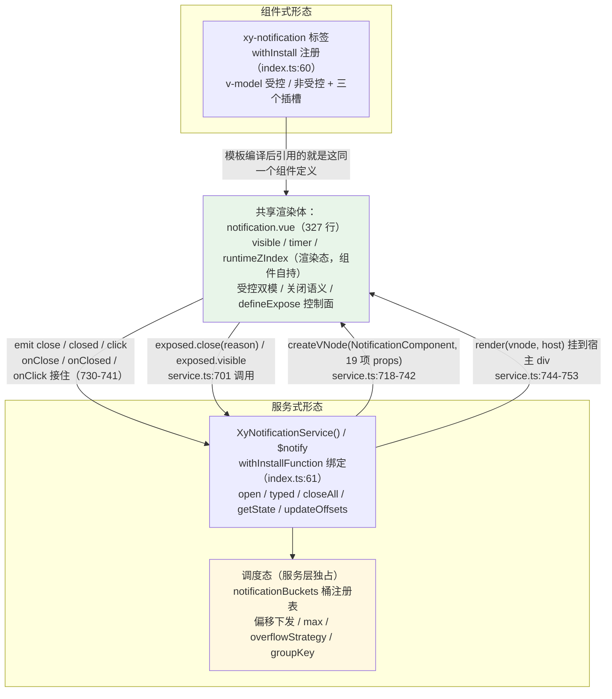
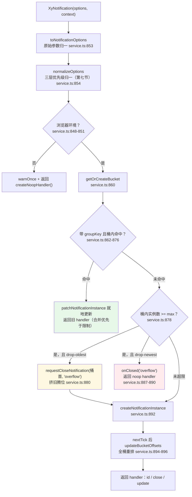

# 7-03 · Notification：双形态并存

> 前置：7-02《Message：命令式消息治理》。与 4-11、4-12 的分工：4-11 以 message 为解剖台讲命令式服务的通用机制（选项归一、targetKey 作用域、grouping 合并、max 上限），4-12 抽过 notification 的分桶并发对照段；本篇回到 notification 自身，回答标题里的核心问题——**组件式 `<xy-notification>` 与服务式 `XyNotification()`，如何共享实现？**

4-01 考据过一张表：全仓库 72 个组件里，`installChecks` 出现"真·跨 kind"的只有两条——`loading`（directive + globalProperty）和 `notification`（component + globalProperty）。看一眼这条唯一的反馈类双形态条目（`packages/components/component-manifest.json:383-393`）：

```json
{
  "name": "notification",
  "docsGroup": "feedback",
  "docsText": "Notification 通知",
  "installExports": ["XyNotification", "XyNotificationService"],
  "installChecks": [
    { "kind": "component", "name": "xy-notification" },
    { "kind": "globalProperty", "name": "$notify" }
  ],
  "styleImports": ["notification"]
}
```

双 kind 意味着同一份源码要同时伺候两个主人：模板里写 `<xy-notification v-model="show">` 的组件式用户，和任意业务模块里直接调 `XyNotificationService.success(...)` 的服务式用户。装入口在 `packages/components/notification/index.ts:60-61`，一行一个形态：

```ts
export const XyNotification = withInstall(Notification, "xy-notification");
export const XyNotificationService = withInstallFunction(notification, "$notify");
```

问题随之而来：这两个形态是两套实现吗？如果是，样式、交互、无障碍语义迟早漂移成两个组件；如果不是，共享面画在哪里、分界线又画在哪里？notification 用 1568 行源码（`notification.vue` 327 行 + `service.ts` 1008 行，外加 217 行的 `notification.ts` 契约层）给出了一份答案：**服务式没有自己的渲染体——它 createVNode 挂载的就是组件式那个 SFC；共享的是渲染体与契约层，分界的是状态**。本篇逐层拆开这份答案。

---

## 一、契约先行：双形态在类型层就已经共享

打开 `packages/components/notification/src/notification.ts`（217 行），先看到的不是任何一形态的代码，而是两个形态共同签署的契约。四个常量数组构成整个组件的"词汇表"：

```ts
export const notificationTypes = [
  "primary",
  "success",
  "info",
  "warning",
  "error"
] as const;
export const notificationPositions = [
  "top-right",
  "top-left",
  "bottom-right",
  "bottom-left"
] as const;
export const notificationCloseReasons = [
  "manual",
  "auto",
  "escape",
  "programmatic"
] as const;
export const notificationServiceCloseReasons = [
  ...notificationCloseReasons,
  "close-all",
  "overflow"
] as const;
export const notificationOverflowStrategies = [
  "drop-oldest",
  "drop-newest"
] as const;

export const NOTIFICATION_DEFAULT_POSITION = "top-right";
export const NOTIFICATION_DEFAULT_DURATION = 4500;
export const NOTIFICATION_DEFAULT_OFFSET = 0;
export const NOTIFICATION_DEFAULT_Z_INDEX = 2000;
export const NOTIFICATION_GAP = 16;
```

（`packages/components/notification/src/notification.ts:4-37`）

两个细节值得先钉住。其一，`notificationServiceCloseReasons`（`notification.ts:23-27`）是组件原因集的**扩展**而非并列：服务层多了 `close-all` 和 `overflow` 两个"只可能由服务发起"的关闭原因，组件层的四值保持封闭。这条类型层的包含关系，在第五节会兑现成一条三层原因链。其二，`NOTIFICATION_GAP = 16` 同时是堆叠间距和默认边距，与 `notification.css:180-188` 里服务宿主的 `left/right: 16px` 形成数值对称——首条通知的 `top` 恰好也是 16px，四角视觉与堆叠节奏共用一个基数。

props 契约的共享更直接。组件式的 `NotificationProps`（`notification.ts:71-84`）定义了 11 个字段；服务式的选项直接从它派生：

```ts
export interface NotificationServiceOptions
  extends Omit<NotificationProps, "modelValue" | "timerKey"> {
  appendTo?: string | HTMLElement;
  offset?: number;
  position?: NotificationPosition;
  onClick?: () => void;
  onClosed?: (reason: NotificationServiceCloseReason) => void;
  groupKey?: string;
  max?: number;
  overflowStrategy?: NotificationOverflowStrategy;
}
```

（`packages/components/notification/src/notification.ts:86-96`）

`Omit<NotificationProps, "modelValue" | "timerKey">` 这一行就是双形态共享在类型层的宣言：服务选项**继承**组件 props 的全部内容字段（title/message/type/duration/showClose/customClass/icon/closeIcon/dangerouslyUseHTMLString/zIndex），只剔除两个"服务不可能用"的字段——`modelValue` 是受控开关，服务式永远非受控；`timerKey` 是服务层自己的遥控通道（第三节细说），不该让调用方碰。剔除之后服务选项再追加 8 个调度字段：挂载目标、偏移、位置、事件回调、合并身份、上限与溢出策略。

共享面的最后一层是默认值。`notificationServiceDefaults`（`notification.ts:193-217`）用 `satisfies NotificationServiceOptionsNormalized` 把归一化后的完整形状钉死，其中 `duration: NOTIFICATION_DEFAULT_DURATION`、`position: NOTIFICATION_DEFAULT_POSITION` 与组件式 `withDefaults`（`notification.vue:39-52`）里的默认值同源——`duration: 4500` 在两个形态里是同一个常量。**契约层（notification.ts）不含一行运行时逻辑，它是双形态的公共词典**：组件读它拿类型和图标映射，服务读它拿默认值和词汇表，谁也不私藏一份。

---

## 二、组件式形态：一个为服务化预留了接口的 SFC

先看组件式这一侧。`packages/components/notification/src/notification.vue` 的 script 前 80 行定义了它的全部对上面孔：

```ts
const props = withDefaults(defineProps<NotificationProps>(), {
  modelValue: undefined,
  title: "",
  message: "",
  type: "",
  duration: 4500,
  showClose: true,
  customClass: "",
  icon: "",
  closeIcon: NOTIFICATION_CLOSE_ICON,
  dangerouslyUseHTMLString: false,
  zIndex: undefined,
  timerKey: 0
});

const emit = defineEmits<{
  "update:modelValue": [value: boolean];
  close: [reason: NotificationCloseReason];
  closed: [reason: NotificationCloseReason];
  click: [event: MouseEvent];
}>();

const slots = defineSlots<{
  title?: () => unknown;
  default?: () => unknown;
  actions?: () => unknown;
}>();

const instance = getCurrentInstance();
const ns = useNamespace("notification");
const { next } = useZIndex();
const pendingReason = ref<NotificationCloseReason>("programmatic");
const runtimeZIndex = ref<number>(0);
const closingRequested = ref(false);
let timer: number | null = null;

const isControlled = computed(
  () =>
    props.modelValue !== undefined ||
    Object.prototype.hasOwnProperty.call(instance?.vnode.props ?? {}, "modelValue")
);
const visible = ref(isControlled.value ? Boolean(props.modelValue) : true);
```

（`packages/components/notification/src/notification.vue:39-80`）

这里藏着两个"组件式用户几乎不会注意到、服务式却天天在用"的接口预留。

**预留一：props 里的 `timerKey` 与 `zIndex`。** 文档示例的聚光灯从不落在它们身上，但它们是双形态共享的两个焊点——`timerKey` 是服务层重置计时的遥控通道，`zIndex` 是服务层下发确定层级的入口。组件自己只在 `onMounted` 时兜底：`runtimeZIndex.value = props.zIndex ?? next()`（`notification.vue:245-246`）。这个 `next()` 来自 `useZIndex`（`notification.vue:69`）——4-05 引过的那个模块级 seed 计数器原语（基值 2000），它的全库消费方只有 message 和 notification 两处，都是"消息型"不入栈浮层。也就是说：**纯组件式通知的层级走全局 useZIndex 计数器（与 message 共享 seed），服务式通知的层级由服务层在挂载前算好塞进 props**（`service.ts:728` 的 `normalized.zIndex ?? nextNotificationZIndex()`）——服务层自带一套独立种子（`service.ts:103, 246-249`，同样 2000 基值）。为什么不让服务也调 `useZIndex().next()`？因为服务的 zIndex 必须在 `createVNode` 的 props 里就给确定值，不能等组件 mount；两套种子各管各的域，互不阻塞。

**预留二：`defineExpose`。** 看组件 script 的收尾：

```ts
  watch(
    () => props.duration,
    () => {
      if (visible.value) {
        startTimer();
      }
    }
  );

  watch(
    () => props.timerKey,
    () => {
      if (visible.value) {
        startTimer();
      }
    }
  );

  watch(
    () => props.zIndex,
    (value) => {
      if (value === undefined) {
        return;
      }

      runtimeZIndex.value = value;
    }
  );

  onMounted(() => {
    runtimeZIndex.value = props.zIndex ?? next();

    if (typeof document !== "undefined") {
      document.addEventListener("keydown", handleKeydown);
    }
  });

  onBeforeUnmount(() => {
    clearTimer();

    if (typeof document !== "undefined") {
      document.removeEventListener("keydown", handleKeydown);
    }
  });

  defineExpose({
    close,
    visible
  });
```

（`packages/components/notification/src/notification.vue:216-264`）

`defineExpose({ close, visible })`（`notification.vue:261-264`）对组件式用户是模板 ref 的常规出口；对服务式，它是**控制面**——第五节会看到 `service.ts:701` 的 `instance.vm.exposed?.close(...)` 每一条服务通知都在走这条路。三个 watch 则是服务层的三个遥控频道：`duration` 变了重启计时（216-223）、`timerKey` 自增重启计时（225-232，服务层 patch duration 时的显式信号）、`zIndex` 下发同步到 `runtimeZIndex`（234-243）。还有第四个 watch 盯 `visible`（194-214），它是关闭语义的时间差制造者，马上说到。

关闭语义是组件式形态的核心段落：

```ts
function startTimer() {
  clearTimer();

  if (!visible.value || props.duration <= 0 || typeof window === "undefined") {
    return;
  }

  timer = window.setTimeout(() => {
    close("auto");
  }, props.duration);
}

function close(reason: NotificationCloseReason = "programmatic") {
  if (!visible.value || closingRequested.value) {
    return;
  }

  pendingReason.value = reason;
  closingRequested.value = true;
  emit("close", reason);

  if (isControlled.value) {
    emit("update:modelValue", false);
    return;
  }

  visible.value = false;
}
```

（`packages/components/notification/src/notification.vue:133-160`）

`close` 的设计有三个要点。第一，`closingRequested` 防重入：定时器、Esc、关闭按钮、`handle.close()` 可能同时扣动扳机，第二次调用直接被闸掉。第二，`emit("close")` 与 `emit("closed")` 之间隔着一整段时间——`close` 只发"关闭请求"，"关闭完成"由 `watch(visible)`（`notification.vue:194-214`）在 `visible` 翻 false 且旧值确为 true 之后补发。这正是 4-11 总结过的"逻辑死亡与视觉死亡分离"：模板根节点是 `<Transition name="xy-notification-fade"><div v-show="visible">`（`notification.vue:269-271`），注意是 `v-show` 而非 `v-if`——leave 动画播放期间 DOM 一直活着，`closed` 等到动画收尾才响。服务层全靠这个时间差安排"收尸"的时机。第三，受控/非受控在这里分岔：受控模式只 `emit("update:modelValue", false)` 把决定权交还父组件（测试 `notification.spec.ts:68-77` 钉死），非受控才自己翻 `visible`（`notification.spec.ts:79-91`）。服务式从不传 `modelValue`，所以**每一条服务通知都走非受控分支，组件自管生死，服务层只通过 `exposed.close()` 按下同一个按钮**。

模板（`notification.vue:268-327`）里有几处值得停顿的细节。根节点挂 `role="alert"`（274 行），hover 暂停直接写在模板上：`@mouseenter="clearTimer" @mouseleave="handleMouseLeave"`（275-276 行）——注意 `handleMouseLeave` 调的是 `startTimer()`，**hover 恢复是"从头重计"而不是"剩余时间续命"**，与 message 页面隐藏恢复时的剩余时间记账（4-11 的 `pauseReasons` 方案）是两种计时语义。对本篇第二节要展开的定位来说这是合理的：通知是长寿命存在，hover 一次就把 4500ms 重新走一遍，用户不会在意。Escape 关闭挂在 `document` 级 keydown（248-250 行）——每条活着的通知各挂一个监听，按一次 Esc 所有通知一起以 `"escape"` 原因关闭（`notification.spec.ts:144-155`）。消息内容是一条四级优先级链：默认插槽 > `RenderVNode`（渲染函数/VNode，`notification.vue:22-33` 的内置包裹组件）> `v-html`（`dangerouslyUseHTMLString` 显式开启，模板顶部因此挂着 `eslint-disable vue/no-v-html`）> 纯文本（298-307 行）；此外还有 `title` 与 `actions` 两个插槽（287-291、311-313 行），`notification.spec.ts:157-173, 227-254` 验证了插槽优先级与"三插槽共存互不覆盖"。

---

## 三、服务式形态：createVNode 复用同款渲染体

现在回答本篇的核心问题。先给双形态共享架构的全景图：



绿色块是共享面，黄色块是分界面。服务式的入口 `openNotification`（`service.ts:847-899`）做完归一与调度判定后，把"渲染"这件事完整地交还给组件式那个 SFC——看实例创建的正文：

```ts
function createNotificationInstance(
  normalized: NotificationServiceOptionsNormalized,
  context?: AppContext | null
) {
  const id = nextNotificationId();
  const host = document.createElement("div");
  const instance = {} as NotificationContext;

  const bucket = getOrCreateBucket(normalized.position, normalized.targetKey, normalized.appendTo);
  const previous = bucket.instances.at(-1);
  const currentOffset = previous
    ? previous.currentOffset + getHostHeight(previous) + NOTIFICATION_GAP
    : normalized.offset + NOTIFICATION_GAP;

  const vnode = createVNode(NotificationComponent, {
    title: normalized.title,
    message: normalized.message,
    type: normalized.type,
    duration: normalized.duration,
    showClose: normalized.showClose,
    customClass: normalized.customClass,
    icon: normalized.icon,
    closeIcon: normalized.closeIcon,
    dangerouslyUseHTMLString: normalized.dangerouslyUseHTMLString,
    zIndex: normalized.zIndex ?? nextNotificationZIndex(),
    timerKey: normalized.timerKey,
    onClick: (event: MouseEvent) => {
      void event;
      instance.onClick?.();
    },
    onClose: (reason: NotificationCloseReason) => {
      if (instance.status === "active") {
        detachNotificationInstance(instance, reason);
      }
    },
    onClosed: (reason: NotificationCloseReason) => {
      finalizeNotificationInstance(instance, reason);
    }
  });
  vnode.appContext = context ?? notification._context;
  render(vnode, host);

  const vm = vnode.component;

  if (!vm) {
    throw new Error("XyNotification 挂载失败：未生成可用的通知实例。");
  }

  host.className = "xy-notification-service-host";
  normalized.appendTo.appendChild(host);
```

（`packages/components/notification/src/service.ts:704-753`）

`createVNode(NotificationComponent, ...)`——`NotificationComponent` 就是 `import NotificationComponent from "./notification.vue"`（`service.ts:9`）。服务式渲染的通知，其模板、计时器、受控逻辑、`role="alert"`、hover 暂停、Esc 监听，全部来自第二节解剖的那个 SFC。**双形态共享的不是"代码风格"，是渲染体本身**。props 清单（719-729 行）是契约层 `NotificationProps` 的逐项落地，外加三个事件接头（730-741 行）——组件 `emit` 的 `click/close/closed` 在这里被服务层以 `onClick/onClose/onClosed` 接住。注意 props 里没有 `modelValue`：服务式永远非受控。

三处工程细节值得点破。

**其一，`appContext` 桥（743 行）。** `vnode.appContext = context ?? notification._context`——游离渲染树里的 `<xy-icon>` 之类的全局组件要能解析，靠的就是 4-02 讲过的那个 install 时捕获的 `app._context`（`withInstallFunction` 在 `packages/xiaoye-primitives/src/utils/vue/with-install.ts:39` 把它存进 `_context`）。`withContext(appContext)` 与调用的第二参数（`service.ts:743` 的 `context`）都比这个兜底优先。

**其二，`instance` 的"先空后填"时序（710 与 767-786 行）。** `const instance = {} as NotificationContext` 先以空对象站位置——因为 `onClose/onClosed` 回调在 `createVNode` 那一刻就闭包引用了它；真正的 18 个字段在 handler 就绪后 `Object.assign` 一次性填入。事件回调最早可能触发的时机（组件 mount 后的用户交互、定时器到点）远晚于这段同步代码，闭包读到的永远是完整的 instance。而 handler 本身也在填入清单里（773 行），形成 instance → handler → instance 的环形引用，由同一个对象的原子化赋值化解。

**其三，状态分界。** 服务上下文 `NotificationContext`（`service.ts:64-86`）的字段清单就是"调度态"的完整边界：`bucketKey/position/targetKey`（桶归属）、`baseOffset/currentOffset`（偏移）、`max/overflowStrategy`（上限策略）、`groupKey`（合并身份）、`status`（active/closing/closed 生命周期）、`closeReason`（服务层原因记账）——全部是服务层独占的调度状态；而 `visible/timer/runtimeZIndex/closingRequested` 这些渲染态留在组件里，服务层只通过 props 下行（含 `timerKey/zIndex` 两个遥控通道）与 events + exposed 上行通信。

下行通道的极致用法是更新：`handle.update(patch)` 走 `patchNotificationInstance`（`service.ts:521-624`），对内容类字段的更新方式是**直接改 `instance.props.title = patch.title` 这样的裸赋值**（552-595 行）。这依赖一个 Vue 的事实机制：实例的 props 对象是 shallowReactive 的，拿到 `vm.props` 直接赋值，走的就是框架自己的 props 更新路径，组件无感重渲染。为什么不重建 VNode？重建意味着 `render(null)` 销毁旧实例再建新的——实例身份丢失、DOM 闪烁、`groupKey` 复用无从谈起，连计时器的连续性都要靠运气。直改 props 保住身份，计时器的重置改为显式协议：patch `duration` 且调用方要求重置时（`service.ts:584-590`），`timerKey` 自增一拍，组件里的 watch（`notification.vue:225-232`）收到信号重启计时。**遥控通道、裸赋值、显式协议，三者合起来让"同一条通知"成为可变对象，而不是"销毁重造"的赝品**。同族 message 的 `applyMessagePatch` 是同款手法（4-11），这是服务家族的公共约定。

---

## 四、分桶并发：targetKey:position 二元注册表

4-12 抽过 notification 的对照段：dialog 是"单例 + 队列"，loading 是"全屏单例 + 分组复用"，message 是"placement 分桶 + 实例自算偏移"，而 notification 选择了第三种调度的完整形态——**分桶并发**。它的注册表长这样：

```ts
interface NotificationContext {
  id: string;
  host: HTMLDivElement;
  vnode: VNode;
  vm: ComponentInternalInstance & {
    exposed: NotificationExposed | null;
    props: NotificationRuntimeProps;
  };
  props: NotificationRuntimeProps;
  handler: NotificationHandler;
  bucketKey: string;
  position: NotificationPosition;
  targetKey: string;
  groupKey?: string;
  baseOffset: number;
  currentOffset: number;
  max: number | null;
  overflowStrategy: NotificationServiceOptionsNormalized["overflowStrategy"];
  closeReason: NotificationServiceCloseReason;
  onClosed?: NotificationServiceOptionsNormalized["onClosed"];
  onClick?: NotificationServiceOptionsNormalized["onClick"];
  status: "active" | "closing" | "closed";
}

interface NotificationBucket {
  key: string;
  targetKey: string;
  target: HTMLElement;
  position: NotificationPosition;
  instances: NotificationContext[];
}

const notificationBuckets = new Map<string, NotificationBucket>();
const targetKeyMap = new WeakMap<HTMLElement, string>();
```

（`packages/components/notification/src/service.ts:64-97`）

桶的键是二元组 `targetKey:position`（`getBucketKey`，`service.ts:346-348`）：挂载目标 × 屏幕角落。`targetKey` 由 `WeakMap<HTMLElement, string>`（97 行）给每个挂载 DOM 发放稳定身份（142-153 行）——同一容器元素无论被引用多少次都拿到同一个 key，`WeakMap` 保证容器被页面移除后身份自然回收。桶的创建与回收很克制：`getOrCreateBucket`（350-369 行）懒创建，`cleanupBucket`（371-377 行）在桶空时随手删掉 Map 条目——**桶只是账本页，不是常驻结构**。

堆叠的全部计算收在服务层。先算高度与定位，再全桶重排：

```ts
function getHostHeight(instance: NotificationContext) {
  return (
    instance.host.getBoundingClientRect().height ||
    instance.host.firstElementChild?.getBoundingClientRect().height ||
    0
  );
}

function applyHostStyle(instance: NotificationContext) {
  instance.host.className = [
    "xy-notification-service-host",
    `xy-notification-service-host--${instance.position}`
  ].join(" ");
  instance.host.style.top = instance.position.startsWith("top")
    ? `${instance.currentOffset}px`
    : "";
  instance.host.style.bottom = instance.position.startsWith("bottom")
    ? `${instance.currentOffset}px`
    : "";
  instance.host.style.zIndex = String(instance.props.zIndex ?? "");
}

function updateBucketOffsets(bucketKey: string, startingOffset?: number) {
  const bucket = notificationBuckets.get(bucketKey);

  if (!bucket || bucket.instances.length === 0) {
    cleanupBucket(bucketKey);
    return;
  }

  let currentOffset = startingOffset ?? bucket.instances[0]!.baseOffset + NOTIFICATION_GAP;

  bucket.instances.forEach((instance) => {
    instance.currentOffset = currentOffset;
    applyHostStyle(instance);
    currentOffset += getHostHeight(instance) + NOTIFICATION_GAP;
  });
}
```

（`packages/components/notification/src/service.ts:379-416`）

这段是"偏移计算权上收服务层"的实码。新实例入桶时从桶尾取 `previous`，起点 = `previous.currentOffset + previous 高度 + 16`；空桶起点 = `offset + 16`（`service.ts:713-716`）——与 `updateBucketOffsets` 的默认起点 `instances[0].baseOffset + NOTIFICATION_GAP`（409 行）完全一致，首条通知的 `top` 因此恰好 16px，与 CSS 的 `right: 16px` 对称。每个实例的宿主是 `position: fixed` 的空壳 div（`notification.css:171-178`），偏移直接写入 `top/bottom`；通知本体（`xy-notification`）在壳内恢复 `pointer-events: auto`（`notification.css:35`），壳自身 `pointer-events: none`（174 行）不挡页面点击——**定位壳与交互体分离，堆叠调度因此完全不必打扰组件**。四个角落各自成桶：`--top-right` 等定位类（`service.ts:388-391` 拼出，`notification.css:180-188` 落地），测试 `service.spec.ts:58-96` 钉死"四角独立堆叠、同桶垂直递增"，`98-120` 钉死"不同 appendTo 各自成桶"。

这里有一组值得写进权衡笔记的对照。**权衡一：偏移计算权该给谁？** message 的答案是给组件——`message.vue:108-112` 在组件内用 computed 读响应式注册表（`placementInstances`，`shallowReactive` 的 `Record<Placement, Context[]>`，`message/src/instance.ts:38`）算自己的 offset，注册表只提供邻居查询。notification 的答案是给服务层——`updateBucketOffsets` 统一计算、`applyHostStyle` 命令式写入 style，组件是"给什么偏移就用什么"的傻子。4-11 的解读是通知体积大、层级复杂，计算权上收让组件保持傻子；本篇补一个连带红利：**因为组件不读注册表，注册表就从"渲染依赖"降级为"纯调度账本"**——notification 的 `notificationBuckets` 是普通 `Map`，不需要 `shallowReactive`，省掉整套依赖追踪。message 的注册表必须响应式，因为它的偏移是渲染派生值；notification 的偏移是命令式下发的权威值。**计算权的位置决定了注册表需要什么级别的响应性**——这是比"哪种更好"更有用的判断。

**权衡二：桶键为什么带 targetKey？** message 的注册表按 placement 一维分桶，targetKey 作为实例属性参与 max 记账（4-11 的"二维作用域"）；notification 干脆把两个维度都编进桶键。差别在堆叠语义：message 只有一个真实挂载点（body），不同 targetKey 的消息在同一个角落的偏移是"拼接"出来的；notification 的宿主可以任意（`appendTo: string | HTMLElement`），不同容器里的通知物理上不可见彼此，堆叠偏移天然按容器隔离——**桶键带上 targetKey 不是设计品味，是"多容器挂载"这个能力直接要求的账本结构**。

关闭时的回填也值得一看（`service.ts:652-682` 的 `detachNotificationInstance`）：实例从桶里 `splice` 后，若关的是桶首（`index === 0`），`nextOffset` 取被关实例的 `currentOffset`——后续通知从被关者的位置起整体"上移"补位；关中间实例则从桶首全量重排。重排延到 `nextTick` 之后（675-677 行），留一拍给 DOM 稳定。宿主壳的过渡（`notification.css:175-177`）让 `top/bottom` 的跳变平滑化——补位不是瞬移。还有一个容易漏看的方向细节：`bottom` 桶的堆叠是"新通知往上长"（`currentOffset` 沿桶序递增，bottom 越大离底边越远），`top` 桶是"新通知往下长"，两个方向都是**新通知向远离边缘的方向生长、旧通知贴边不动**；对应的入场动画方向也在 CSS 里按宿主类翻转（207-212 行，`translateY(16px)` 与 `-16px`）——服务宿主的类名挂在壳上，Transition 却在组件内部，CSS 用后代选择器跨层完成了方向注入。组件式单独使用 `<xy-notification>` 时没有宿主类，走默认的从上滑入。

---

## 五、overflowStrategy：满了之后的两种体面

服务入口 `openNotification`（`service.ts:847-899`）是全篇调度逻辑的汇合点，先看它按调用顺序画出的岔路：



绿色是合并、红色是丢新、黄色是挤旧——三条岔路与 message 的入站流程（4-11 的全景图）骨架同构，岔路的答案完全不同。本节聚焦黄色的溢出策略，先看全貌：

```ts
function openNotification(options?: NotificationParams, context?: AppContext | null) {
  if (typeof document === "undefined") {
    warnOnce("XyNotification", "XyNotification 仅支持在浏览器环境中使用。");
    return createNoopHandler();
  }

  const rawOptions = toNotificationOptions(options);
  const normalized = normalizeOptions(rawOptions, context);

  if (!normalized) {
    return createNoopHandler();
  }

  const bucket = getOrCreateBucket(normalized.position, normalized.targetKey, normalized.appendTo);

  if (normalized.groupKey) {
    const grouped = findGroupInstance(bucket, normalized.groupKey);

    if (grouped) {
      const normalizedPatch: NotificationUpdateOptions = {
        ...normalized,
        max: normalized.max ?? undefined
      };

      patchNotificationInstance(grouped, normalizedPatch, {
        resetTimer: hasOwn(rawOptions, "duration")
      });
      return grouped.handler;
    }
  }

  if (normalized.max !== null && bucket.instances.length >= normalized.max) {
    if (normalized.overflowStrategy === "drop-oldest" && bucket.instances.length > 0) {
      requestCloseNotification(bucket.instances[0]!, "overflow");
    } else {
      normalized.onClosed?.("overflow");
      return createNoopHandler(nextNotificationId());
    }
  }

  if (normalized.max !== null && bucket.instances.length >= normalized.max) {
    normalized.onClosed?.("overflow");
    return createNoopHandler(nextNotificationId());
  }

  const instance = createNotificationInstance(normalized, context);

  void nextTick().then(() => {
    updateBucketOffsets(instance.bucketKey);
  });

  return instance.handler;
}
```

（`packages/components/notification/src/service.ts:847-899`）

**第一层是次序设计：合并优先于限制。** `groupKey` 复用判定（862-876 行）排在 max 检查**之前**——重复通知不占新名额，`findGroupInstance`（793-795 行）在桶内做 groupKey 精确匹配，命中就 patch 更新、按需重置计时（`resetTimer` 只在本次显式传了 `duration` 时为真，872 行的 `hasOwn(rawOptions, "duration")`），返回旧 handler。测试 `service.spec.ts:152-185` 钉死三件事：两次调用拿到同一个 handler（`second toBe first`）、内容与类型就地更新、计时从 patch 时刻重新起算。groupKey 的作用域是桶而非全局——跨桶不复用（`service.spec.ts:272-289`）。

**第二层是双闸溢出判定。** 第一闸（878-885 行）：桶满且策略为 `drop-oldest` 时，`requestCloseNotification(bucket.instances[0], "overflow")` 挤掉最老的通知腾位置——注意 `detachNotificationInstance`（652-682 行）是**同步**把旧实例 splice 出桶的，所以挤旧完成后名额立即空出，新通知照常入场。策略为 `drop-newest`（或桶空的边缘情形）时走 else：对新通知回调 `onClosed("overflow")`，返回一个拿到真实 id 的 noop handler——**调用方持有的句柄不炸、可安全调 close/update，只是什么都不做**，与 message 超限的静默丢弃（`message/src/method.ts:569-574`）是同一种"体面拒绝"的家族语法。第二闸（887-890 行）是同样条件的复读：正常路径永远到不了这里（挤旧已同步腾位），它是"挤旧失败也不越限"的防御兜底——**宁可丢新，不破坏 max 的上限承诺**。两道闸拼起来，`max: 0` 也就自然读出"禁言"语义：空桶长度 0 >= 0 恒真，一切通知在第一闸被拒。

**第三层是原因链的三层归一**，这是溢出策略最精巧的部分。组件层的 `NotificationCloseReason` 四值封闭（`notification.ts:17-22`）；服务层扩展出 `close-all/overflow`（23-27 行）。当 `drop-oldest` 挤掉旧通知时，`requestCloseNotification`（692-702 行）做了一次"降维翻译"：

```ts
function detachNotificationInstance(
  instance: NotificationContext,
  reason: NotificationServiceCloseReason
) {
  if (instance.status === "closed") {
    return;
  }

  instance.closeReason = reason;

  const bucket = notificationBuckets.get(instance.bucketKey);

  if (!bucket) {
    instance.status = "closing";
    return;
  }

  const index = bucket.instances.indexOf(instance);

  if (index !== -1) {
    bucket.instances.splice(index, 1);
    const nextOffset = index === 0 ? instance.currentOffset : undefined;

    void nextTick().then(() => {
      updateBucketOffsets(instance.bucketKey, nextOffset);
    });
  }

  instance.status = "closing";
  cleanupBucket(instance.bucketKey);
}

function toComponentCloseReason(reason: NotificationServiceCloseReason) {
  if (notificationCloseReasons.includes(reason as NotificationCloseReason)) {
    return reason as NotificationCloseReason;
  }

  return "programmatic";
}

function requestCloseNotification(
  instance: NotificationContext,
  reason: NotificationServiceCloseReason
) {
  if (instance.status !== "active") {
    return;
  }

  detachNotificationInstance(instance, reason);
  instance.vm.exposed?.close(toComponentCloseReason(reason));
}
```

（`packages/components/notification/src/service.ts:652-702`）

注意 701 行的调用链：服务层先在自己的账本上记下原始原因（660 行 `instance.closeReason = "overflow"`），然后给组件的是**降维后的** `"programmatic"`——组件的四值事件系统不需要知道"被挤掉"和"被批量关"的差别，对它来说都是非交互关闭。而最终交给调用方的 `onClosed` 回调拿的是服务层记账的原始值：`finalizeNotificationInstance`（626-650 行）里 `const finalReason = instance.closeReason ?? reason`（635 行）。**组件 emit 的原因与服务层回调的原因是两条线：对内四值封闭，对外语义全量**。测试 `service.spec.ts:380-429` 用一个用例钉死了四种原因都能在 `onClosed` 里收到——manual、auto、close-all、overflow。

**权衡三：默认策略为什么是 drop-oldest？** `notificationServiceDefaults.overflowStrategy` 落在 `"drop-oldest"`（`notification.ts:214`）。拆开看：不配 max 时策略完全隐身（`max: null` 不进判定），所以这个默认只对"主动配了 max"的调用方生效；而会去配 max 的业务，大概率是轮询进度、持续任务状态这类"最新事实最重要"的场景——旧通知本来就是过时信息，挤掉它正是调用方想要的。`drop-newest` 是留给"每条都有存在价值"场景的保守选项。这与 4-11 的结论严格对表：message 把策略复杂度留给 notification（自己保持静默丢弃的极简），notification 再把"丢谁"的选择权交还调用方——**按组件定位分配复杂度，再把剩余的自由度下放给用户**，两层判断各归其位。文档示例 `apps/docs/examples/notification/max-overflow.vue` 用一个策略切换开关把两种溢出的差异做成了可亲手验证的演示。

**EP 对比时间。** Element Plus 的 notification 有 `max`（默认 0 不限制），超限时新通知直接不渲染——没有策略可配，也没有任何回调告诉调用方"你的通知被丢了"，连 handler 都拿不到；EP 的 message 则连 `max` 都没有（4-11 已考）。本库把这件事做成了三级能力：`max` 一等公民并接进 `ConfigProvider.notification` 全局配置；溢出行为可配（`drop-oldest` / `drop-newest`）；丢失事件通过 `onClosed("overflow")` 显式交付。另一点同构与增量的对照：EP 的服务式同样 createVNode 复用 notification 的 SFC——"双形态共享渲染体"不是本库的发明；本库的增量在**组件形态的契约完整度**：受控/非受控双模、close reason 的四值语义、`defineExpose` 控制面、`timerKey` 遥控通道，让"同款 SFC"真正能同时伺候组件式与服务式两个主人，而不是服务的一条内部尾巴。

---

## 六、handle.update 与跨桶迁移：可变实例的完整能力面

`NotificationHandler` 的契约只有三个成员（`notification.ts:123-127`）：`id`、`close`、`update`。`update` 的实现 `patchNotificationInstance`（`service.ts:521-624`）是全文件最长的函数，能力面分四组：内容字段直改 props（title/message/type/showClose/customClass/icon/closeIcon/dangerouslyUseHTMLString）；计时与层级（duration 归一写入 + 可选 `timerKey` 自增重置、zIndex 写入 + 立即 `applyHostStyle`）；调度态（offset 更新 `baseOffset`、max/overflowStrategy/onClosed/onClick 换绑）；以及最复杂的**位置迁移**。

迁移的核心是"换桶搬家"：

```ts
function reassignNotificationScope(
  instance: NotificationContext,
  nextTarget: HTMLElement,
  nextTargetKey: string,
  nextPosition: NotificationPosition
) {
  const previousBucketKey = instance.bucketKey;
  const previousBucket = notificationBuckets.get(previousBucketKey);

  if (previousBucket) {
    const index = previousBucket.instances.indexOf(instance);

    if (index !== -1) {
      previousBucket.instances.splice(index, 1);
    }
  }

  if (instance.host.parentElement !== nextTarget) {
    nextTarget.appendChild(instance.host);
  }

  const nextBucket = getOrCreateBucket(nextPosition, nextTargetKey, nextTarget);
  nextBucket.instances.push(instance);

  instance.bucketKey = nextBucket.key;
  instance.position = nextPosition;
  instance.targetKey = nextTargetKey;

  if (previousBucketKey !== nextBucket.key) {
    void nextTick().then(() => {
      updateBucketOffsets(previousBucketKey);
      updateBucketOffsets(nextBucket.key);
    });
  } else {
    void nextTick().then(() => {
      updateBucketOffsets(nextBucket.key);
    });
  }

  cleanupBucket(previousBucketKey);
}
```

（`packages/components/notification/src/service.ts:479-519`）

patch 一个 `position: "bottom-right"`，实例就要从旧桶 splice、宿主 DOM `appendChild` 物理搬家、进新桶队尾、新旧两桶各自 `nextTick` 重排——**迁移的是调度归属，渲染体纹丝不动**（组件实例、计时器、`visible` 全程连续）。迁移不是无条件的：`canMoveToScope`（466-477 行）先查目标桶按"排除自己"的口径计数是否已满，满了就 `warnOnce` 告警并忽略本次 position/appendTo 变更，**但保留其余字段的更新**——测试 `service.spec.ts:344-378` 钉死了这个部分成功语义：标题照常更新，位置原地不动。测试 `service.spec.ts:187-214` 则验证了内容、类型、关闭按钮与位置类名的联动更新。

还有一处类型层的小巧思值得驻足：868 行 `max: normalized.max ?? undefined`。`NotificationUpdateOptions.max` 继承自 `NotificationServiceOptions` 的 `max?: number`，不收 `null`；而归一后的 `normalized.max` 是 `number | null`。`?? undefined` 把 null 折叠成 undefined，纯属**类型适配而非语义转换**（两条路径的运行时结果一致）。同款写法出现在 message 的合并路径（`message/src/method.ts:556-560`）——这是服务家族合并"配置向最新调用看齐"语义时的惯用手法。合并语义本身要读准：groupKey 复用时，新调用的配置全面覆盖旧实例，没传的字段落回默认——复用不是"保留原配置的增量 patch"，而是"以最新调用为准的全量刷新"。

---

## 七、配置链：ConfigProvider.notification 的三层归一

服务式没有 setup 上下文，`inject` 用不了，它怎么读到 `ConfigProvider` 的 `notification` 全局配置？答案是绕开 `inject` 的使用限制，直接读注入系统的数据结构：

```ts
function resolveNotificationConfig(context?: AppContext | null) {
  if (context) {
    const providedConfig = context.provides?.[configProviderKey as symbol] as
      | ProviderLikeConfig
      | undefined;
    const scopedNotificationConfig = providedConfig?.notification?.value;

    if (scopedNotificationConfig !== undefined) {
      return scopedNotificationConfig;
    }
  }

  const globalNotificationConfigCount = getGlobalNotificationConfigCount();

  if (globalNotificationConfigCount <= 1) {
    return getGlobalNotificationConfig().value ?? {};
  }

  warnOnce(
    "XyNotification",
    "检测到多个 ConfigProvider.notification 同时存在。请改用 $notify、XyNotificationService.withContext(appContext) 或 XyNotificationService(options, appContext) 来显式指定上下文。当前调用已回退到默认配置。"
  );

  return {};
}
```

（`packages/components/notification/src/service.ts:251-275`）

三级优先：`appContext.provides` 里的符号键注入（scoped，需要调用方显式传上下文）> 全局单例 `getGlobalNotificationConfig()`（ConfigProvider 挂载时注册）> 多个 Provider 并存且无上下文时告警回退空配置——**配置来源不明确时宁可回到默认值，也不静默选边**。测试 `service.spec.ts:704-744` 钉死了告警与回退，`498-549` 钉死了单 Provider 下的继承与显式覆盖，`608-665` 钉死了多 app 场景各自的 `$notify` 继承各自的配置（两个 app 的 `$notify` 引用不相等——`withInstallFunction` 每次 install 都造一个绑定了当期 `_context` 的分身）。

归一环节把这些来源合成一份：`normalizeOptions`（277-344 行）对每个可继承字段做 `hasOwn` 三层判定——**键存在就听调用方的（哪怕显式传 undefined，交给归一函数兜底），键不存在才听全局，全局没有才落默认**。`withContext(appContext)`（901-921、1004-1005 行）则是显式指路的 API 形态：`bindNotificationContext` 复制一套服务 API 并把 appContext 焊死在每个入口（typed 快捷方法也逐个绑，907-912 行），返回的"分身"与 `$notify` 的生成方式同构——理解了 `withInstallFunction` 就理解了 `withContext`，反之亦然。

---

## 八、一眼对表：message（7-02）与 notification 的机制差异矩阵

7-02 与 4-11 已经从 message 的视角看过这组对照，本篇补齐 notification 侧的全貌后，可以给出完整矩阵：

| 维度 | message（7-02 / 4-11） | notification（本篇） |
| --- | --- | --- |
| 对外形态 | 纯 globalProperty（`$message`） | component + globalProperty 双 kind（manifest 383-393） |
| 渲染体共享 | SFC 仅服务内部复用 | 同款 SFC 双形态对外并存，组件式有完整独立契约 |
| 注册表 | `Record<Placement, Context[]>`，shallowReactive | `Map<targetKey:position, Bucket>`，普通 Map |
| 偏移计算 | 组件内 computed 读注册表自算（`message.vue:108-112`） | 服务层统一下发（`updateBucketOffsets`，401-416） |
| 重复治理 | `grouping` 开关 + 两级匹配 + `repeatNum` 徽标 | `groupKey` 恒开启精确匹配，无徽标，直接换内容 |
| 超限治理 | 静默丢弃（`method.ts:569-574`） | `overflowStrategy` 双策略 + `onClosed("overflow")` |
| 关闭原因集 | 组件/服务同一套四值 | 组件四值封闭，服务层扩展 `close-all/overflow`，双层归一 |
| 页面隐藏 | `pauseOnPageHidden` + 剩余时间记账 | 无——`timerKey` 遥控重置计时（`notification.vue:225-232`） |

矩阵读下来，三条"差异背后的差异"值得提炼。**其一，形态数量跟着产品语义走**：message 是纯瞬时反馈，不值得占一个组件标签位；notification 每条都有存在价值，业务需要在页面里常驻、受控地渲染一条"通知"，双形态是需求不是炫技。**其二，账本结构跟着能力走**：多容器挂载（appendTo）逼出了二元桶键与命令式偏移；message 单挂载点，一维注册表加响应式派生就够。**其三，治理强度跟着寿命走**：短寿命的 message 合并靠文案匹配加徽标计数，长寿命的 notification 合并靠 groupKey 身份直接换内容；短寿命的超限丢了就丢了，长寿命的丢失需要 `onClosed("overflow")` 交代。三条规律合起来就是 4-11 那句话的展开版：**暂停机制（以及形态、账本、治理）不是"越多越好"的技术竞赛，而是跟着组件的存在语义走的**。

样式层是这份差异矩阵的一个安静注脚。`packages/theme/src/components/notification.css` 228 行里，1-169 行是组件本体——两个形态完全共用（渲染体同一份，样式自然同一份）；171-192 行的 `.xy-notification-service-host` 才是服务式专属（fixed 定位壳、贴边 16px、移动端通栏折叠 214-228 行）；194-212 行的过渡动画名义上属于组件，方向却由服务宿主的类名跨层决定。**样式文件以"选择器归属"划出了与代码架构同构的边界**——共享段与专属段一眼可辨。

---

## 收束与预告

把本篇压缩成三句话：

- **双形态共享**：服务式 `createVNode` 挂载的就是组件式那个 SFC（`service.ts:718-744`），共享面是渲染体 + 契约层（`notification.ts` 的类型、常量与默认值），分界面是状态——渲染态（visible/timer/zIndex）组件自持，调度态（桶/偏移/max/策略/原因记账）服务独占，props 下行（`timerKey/zIndex` 遥控）与 events + exposed 上行（`service.ts:701` 控制面）是仅有的两条通道。
- **分桶并发**：`targetKey:position` 二元桶键的多容器账本，偏移计算权上收服务层（401-416），注册表因此降级为不需要响应性的纯调度账本；桶首关闭同步 splice、`nextTick` 全桶回填。
- **溢出策略**：合并优先于限制（groupKey 判定在 max 之前），双闸判定宁可丢新不越限（878-890），原因链三层归一——组件四值封闭、服务层记账全量、`onClosed` 交付原始语义（684-690 + 635）。

测试矩阵为这套架构做了双向公证：`notification.spec.ts` 17 个用例守组件契约（受控双模、hover 暂停、Esc、插槽优先级），`service.spec.ts` 23 个用例守调度行为（分桶、复用、迁移守卫、四种关闭原因、多 Provider 告警），类型夹具 `tests/types/fixtures/notification.ts` 用 217 行、9 处 `@ts-expect-error` 反向锁死了词汇表的边界（非法 type/position/overflowStrategy/appendTo 全部拒绝编译）。

下一篇进入 7-04《Backtop：滚动目标解析》。notification 的一切复杂性都长在"多条通知如何共存"上，而 Backtop 是反方向的样本——一个看似只有几十行逻辑的组件，真正的问题只有一个：**"滚动容器"到底是谁**？window、documentElement、可滚动的父级、还是用户显式指定的 target？判定错一步，回到顶部就滚错了地方；再加上"滚动多少距离才出现"的可见性阈值，这个小组件把 5-13《Affix》的几何计算题目换了一种问法。我们在下一篇见。
