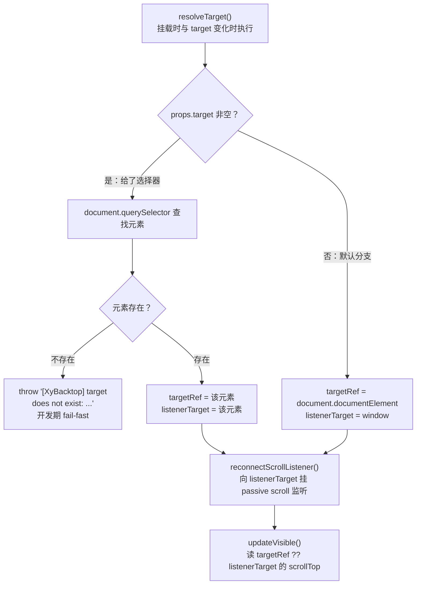
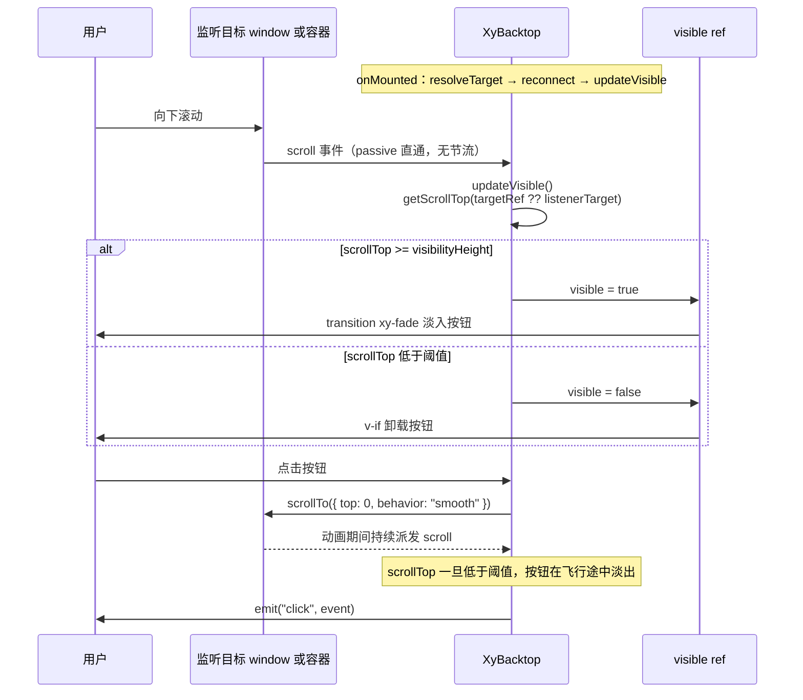

# 7-04 · Backtop：滚动目标解析

> 右下角那颗"回到顶部"按钮，大概是整个组件库里最不起眼的存在：滚过一段距离就浮出来，点一下就滚回去。但把它当样本拆开，会发现它压着两个滚动感知组件绕不开的公共问题——**滚动容器到底是谁**（按钮不参与文档流，它的滚动上下文只能靠"解析"得出），以及**可见性阈值怎么判定**（一个 `>=` 号背后是监听对象的选点、读取对象的选点与事件管道的取舍）。5-13 讲 Affix 时曾从同族视角引过 Backtop 的对照段（`backtop.vue:52-97`），本篇把 `XyBacktop` 全文展开：类型层 12 行、视图层 180 行的极简解剖，`resolveTarget` 的双 ref 分工与默认目标选点，`target` prop 与 Affix 的"同名不同义"反转（5-13 考据的 backtop 侧），手写解绑器的监听挂载时机，原生 `behavior: "smooth"` 与两级兜底的回顶实现，以及测试、类型夹具与文档示例的收口。所有代码摘自当前工作区实态，路径与行号逐一核对过；下一篇 7-05 将进入同属反馈组的 Collapse，讲手风琴模式的多开与互斥。

## 一、180 行的极简样本：三层拆解

Backtop 在本库的标准三件套里是最小的一档。类型层 `backtop.ts` 全文只有 12 行：

```ts
// packages/components/backtop/src/backtop.ts（全文 12 行）
import type Backtop from "./backtop.vue";

export type BacktopClickHandler = (event: MouseEvent) => void;

export interface BacktopProps {
  visibilityHeight?: number;
  target?: string;
  right?: number;
  bottom?: number;
}

export type BacktopInstance = InstanceType<typeof Backtop>;
```

四个 props、一个事件载荷别名、一个实例类型，没有插槽类型、没有内部状态枚举——与 4-03 定下的"类型层薄、逻辑层厚"的分工一致。安装入口 `index.ts` 也短得可以全文引用：

```ts
// packages/components/backtop/index.ts（全文 8 行）
import Backtop from "./src/backtop.vue";
import type { BacktopClickHandler, BacktopInstance, BacktopProps } from "./src/backtop";
import { withInstall } from "xiaoye-primitives";

export type { BacktopClickHandler, BacktopInstance, BacktopProps };

export const XyBacktop = withInstall(Backtop, "xy-backtop");
export default XyBacktop;
```

它通过 `packages/components/exports.ts:7` 的 `export * from "./backtop"` 汇入聚合入口，再由 manifest 驱动安装断言。在 `component-manifest.json` 里，backtop 条目占 `394-401` 行——4-01 曾以 `375-431` 这段 feedback 组连续节选讲过 installChecks 的三种 kind，backtop 正是其中最普通的 `{ "kind": "component", "name": "xy-backtop" }` 单检查条目（`component-manifest.json:399`），没有 message/notification/loading 那些多口子的复杂性。样式经 `packages/theme/index.css:21` 的 `@import "./src/components/backtop.css"` 挂入主题包，文档页是 `apps/docs/components/backtop.md`，示例只有一个 `modes.vue`（212 行）——这些外围零碎各司其职，真正值得逐行读的是那个 180 行的 `backtop.vue`。

`backtop.vue` 的骨架分四段：状态与派生（1-34）、读取与判定（36-59）、目标解析与监听（61-97）、回顶与生命周期（99-160），最后是 18 行模板。先看状态与派生段：

```ts
// packages/components/backtop/src/backtop.vue:1-34
import { computed, onBeforeUnmount, onMounted, ref, shallowRef, watch } from "vue";
import { useNamespace } from "xiaoye-primitives";
import XyIcon from "../../icon";
import type { BacktopProps } from "./backtop";

type ScrollContainer = HTMLElement | Window;

defineOptions({
  name: "XyBacktop"
});

const props = withDefaults(defineProps<BacktopProps>(), {
  visibilityHeight: 200,
  target: "",
  right: 40,
  bottom: 40
});

const emit = defineEmits<{
  click: [event: MouseEvent];
}>();

const ns = useNamespace("backtop");
const visible = ref(false);
const targetRef = shallowRef<HTMLElement | null>(null);
const listenerTarget = shallowRef<ScrollContainer | null>(null);

let removeScrollListener: (() => void) | null = null;

const backtopStyle = computed(() => ({
  right: `${props.right}px`,
  bottom: `${props.bottom}px`
}));
```

值得停留的是第 7 行和第 26-27 行。`type ScrollContainer = HTMLElement | Window` 这个别名与 `affix.vue:17` 一字不差——滚动家族共享同一套类型词汇，这不是巧合而是刻意的同构。而状态槽位有**两个** ref：`targetRef`（shallowRef 的 HTMLElement）与 `listenerTarget`（shallowRef 的 HTMLElement 或 Window）。为什么读滚动位置的对象和挂滚动监听的对象要分成两个槽位？这是本篇第一道主菜，第二节展开。第 29 行的 `removeScrollListener` 是一个闭包变量而非 ref——它存的是"解绑函数"，组件内部的纯命令式物件，放进响应式系统只会白付依赖追踪的成本，与 5-13 分析 Affix 时"几何数据进 ref、命令式句柄留普通变量"的分界完全同款。

`backtopStyle` 只消费 `right` / `bottom` 两个纯几何参数，模板里以行内样式落在 fixed 定位的按钮上。注意这里没有 `visibilityHeight` 什么事——阈值不参与样式，它只驱动 `visible` 这一个布尔。

## 二、滚动目标解析：一个 prop，三个角色

`resolveTarget` 是整个组件的枢轴，全文 16 行：

```ts
// packages/components/backtop/src/backtop.vue:61-76
function resolveTarget() {
  if (props.target) {
    const element = document.querySelector<HTMLElement>(props.target);

    if (!element) {
      throw new Error(`[XyBacktop] target does not exist: ${props.target}`);
    }

    targetRef.value = element;
    listenerTarget.value = element;
    return;
  }

  targetRef.value = document.documentElement;
  listenerTarget.value = window;
}
```

两个分支，一次赋值对。把决策流画出来是这样：



分支内部藏着三个角色合一的设计：**给了 `target` 时，这个选择器解析出的元素同时承担"监听对象"（scroll 事件挂在它身上）、"读取对象"（scrollTop 从它身上取）与"回滚对象"（点击后把它滚回 0）**。而默认分支里，三个角色没有合并到同一个对象上，而是拆成"读 documentElement、听 window"——`targetRef` 与 `listenerTarget` 两个槽位的存在意义正在这里。

**为什么默认分支必须拆？** 因为视口滚动的 scroll 事件与 scrollTop 的存放位置不是同一个对象。整页滚动时，scroll 事件的目标是 Document（并冒泡到 Window）；`document.documentElement` 这个元素自己**收不到**自己所在视口的 scroll 事件。反过来，Window 身上没有 `scrollTop` 属性可读（它的是 `scrollY`/`pageYOffset`），而标准的读取点是 scrollingElement——本库直接读 `document.documentElement.scrollTop`。于是"听"与"读"天然落在两个对象上：监听必须挂 window（或 document，等价），读取必须落在 documentElement。如果图省事把两个 ref 合一，无论合成哪个都有一半功能失效——监听挂 documentElement 则事件永远不来，读 window.scrollTop 则永远是 undefined。这对双 ref 不是防御式冗余，而是浏览器滚动模型本身的形状。

对照 EP（Element Plus 2.x）的同位实现能看清这是一个通用结论而非本库独有：EP 的 `use-backtop.ts` 里同样是两个变量——`el`（读取对象，默认 `document.documentElement`）与 `container`（监听对象，默认 `document`），默认分支与本库同构；差别只在监听点的选择，EP 订阅 `document` 上的 scroll，本库订阅 `window` 上的 scroll，两者都合法（事件在 document 触发、冒泡到 window），本库选 window 是更常规的订阅点，也与 `ScrollContainer = HTMLElement | Window` 的类型口径自洽——类型里没有 Document，监听点就不该出现 Document。

**默认分支为什么不做祖先探测？** 这是 backtop 与 affix 在家族内最根本的分工差异。affix 的根元素活在文档流里，"谁在带它滚"由页面结构决定，所以它必须从 `rootRef.parentElement` 出发向上爬，用 `isScrollable` 逐层验明正身（`affix.vue:114-139`）：

```ts
// packages/components/affix/src/affix.vue:114-139
function isScrollable(element: HTMLElement) {
  const { overflow, overflowX, overflowY } = window.getComputedStyle(element);
  const allowsScroll = /(auto|scroll|overlay)/.test(`${overflow}${overflowX}${overflowY}`);
  const hasScrollableArea =
    element.scrollHeight > element.clientHeight || element.scrollWidth > element.clientWidth;

  return allowsScroll && hasScrollableArea;
}

function getScrollContainer(element: HTMLElement | null) {
  let current = element?.parentElement ?? null;

  while (current) {
    if (current === document.body || current === document.documentElement) {
      return window;
    }

    if (isScrollable(current)) {
      return current;
    }

    current = current.parentElement;
  }

  return window;
}
```

backtop 完全不需要这套探测：按钮 `position: fixed` 常驻视口，不在任何滚动容器的文档流里，它的 DOM 位置对"用户想滚哪儿"零信息量。它的监听对象只有两个可能的来源——用户显式给的选择器，或者文档级默认。一句话概括家族内的分工：**affix 的监听对象由"元素在哪儿"决定（探测），backtop 的监听对象由"用户想滚哪儿"决定（显式或默认）**。顺带一个考据结论：任务考据里问的"与 scrollbar（5-18）是否共享 getScrollContainer 之类的探测工具"——实态是**不存在共享工具**，全库检索 `getScrollContainer` 只在 `affix.vue:123` 出现这一处，`xiaoye-primitives` 里没有任何滚动探测 util；scrollbar 是全自绘方案（滚动对象就是自己的 wrap），anchor 的监听对象走 `props.container`（`anchor.ts:11`，`AnchorContainer = string | HTMLElement | Window | null`，`anchor.vue:74-87` 的 `resolveContainer` 默认回退 window）。affix 的探测函数是组件私有实现，如果未来出现第二个需要探测的消费方，`isScrollable + getScrollContainer` 值得上提为 primitives 共享工具；眼下单一使用点，上提反而是过早抽象。

**权衡一：`target` 的语义归属。** 5-13 已给过结论——Affix 的 `target` 是固定边界容器（约束固钉在哪个容器内活动），监听对象靠探测另得；Backtop 的 `target` 是监听目标，本篇补全 backtop 侧的三个细节。其一，语义反转在源码里的实锤就是 `resolveTarget` 的两处赋值：target 分支的 `listenerTarget.value = element`（`backtop.vue:70`）与默认分支的 `listenerTarget.value = window`（`backtop.vue:75`）——选择器元素直接上岗当监听者，不存在任何中间探测；affix 的同位代码是 `targetRef.value = nextTarget`（`affix.vue:161`），只设边界、不动监听。其二，backtop 的 target 模式下三个角色（监听/读取/回滚）合一，意味着用户给的选择器元素必须真的可滚——给了个不可滚的 div，按钮永远不会出现，也没有任何报错；这是显式契约换默认便利的代价，文档行为约定里写明"`target` 只决定监听哪个滚动容器，以及点击后回滚哪个容器"（`apps/docs/components/backtop.md:48`）。其三，解析失败的处理是**抛错而非降级**：`[XyBacktop] target does not exist: .missing-target`，开发期 fail-fast，宁可挂掉也不静默失效——与 affix 的 `[XyAffix] target does not exist: ...`（`affix.vue:158`）同一策略、同构措辞。同名 prop、两种语义、一种 fail-fast 哲学，这个家族的 API 纪律就是这样靠对照立起来的。

## 三、监听挂载：手写解绑器、passive 与"不节流"的底气

目标解析完，监听挂载走 `reconnectScrollListener`（`backtop.vue:78-97`），配一个三行的断开函数（`backtop.vue:56-59`）：

```ts
// packages/components/backtop/src/backtop.vue:56-59
function disconnectScrollListener() {
  removeScrollListener?.();
  removeScrollListener = null;
}

// packages/components/backtop/src/backtop.vue:78-97
function reconnectScrollListener() {
  disconnectScrollListener();

  if (!listenerTarget.value) {
    return;
  }

  const target = listenerTarget.value;
  const handler = () => {
    updateVisible();
  };

  target.addEventListener("scroll", handler, {
    passive: true
  });

  removeScrollListener = () => {
    target.removeEventListener("scroll", handler);
  };
}
```

这就是 5-13 说过的"探测 + 手写绑定 + 返回解绑器"模式：先无条件断旧（`disconnectScrollListener` 幂等，`removeScrollListener` 为 null 时安全跳过），再往新目标挂 `{ passive: true }` 的 scroll 监听，解绑函数存进闭包变量。`passive: true` 的意义 5-13 已论证过一次——声明"绝不 preventDefault"，让浏览器敢于不等监听器跑完就合成滚动帧；backtop 的 handler 只读一个标量写一个布尔，是全库最轻的 scroll 回调，passive 在这里没有任何代价。

挂载时机有三个入口，加上卸载出口，合在一起看（`backtop.vue:99-160` 的生命周期段先提前引用后半部分）：

```ts
// packages/components/backtop/src/backtop.vue:132-160
watch(
  () => props.target,
  () => {
    if (typeof window === "undefined") {
      return;
    }

    resolveTarget();
    reconnectScrollListener();
    updateVisible();
  }
);

watch(
  () => props.visibilityHeight,
  () => {
    updateVisible();
  }
);

onMounted(() => {
  resolveTarget();
  reconnectScrollListener();
  updateVisible();
});

onBeforeUnmount(() => {
  disconnectScrollListener();
});
```

`onMounted` 里的三连调用是初始化的标准序：先解析目标、再挂监听、最后同步一次可见性（初始 scrollTop 低于阈值则按钮不渲染）。`target` 变化的 watch 重复同一套三连——全量重连，不做 diff；选择器字符串变了，最安全的就是解绑旧的、解析新的、重挂、重判，四步走完状态必然与 DOM 一致。这条 watch 里的 `typeof window === "undefined"` 是 SSR 守卫：服务端没有 `document`，`resolveTarget` 里的 `document.querySelector` 会直接炸，守卫让 target 变化在服务端静默跳过（`onMounted` 本来就不会在服务端执行，无须守卫）。`visibilityHeight` 变化的 watch 只重判可见性——阈值是纯判定参数，不涉及监听拓扑。卸载出口 `onBeforeUnmount` 只做一件事：断监听。没有 ResizeObserver（affix 有三个观察对象）、没有 resize 监听、没有 keep-alive 的 activated 补偿——backtop 的可见性判定只依赖一个标量，标量只在滚动时变化，滚动事件本身就是唯一的更新源。

**权衡二：不加节流。** 同族的另外两位都做了节流：affix 虽然也是裸 passive 监听，但回调里要做完整的几何测量（两个 `getBoundingClientRect`）；anchor 用 `scrollTicking` 开关配 rAF 节流（`anchor.vue:306-343`，5-13/5-14 两引）；EP 的 backtop 则用 VueUse 的 `useThrottleFn(handleScroll, 300)` 把回调节流到 300ms。本库的 backtop 什么都不加，scroll 事件来一次就跑一次 `updateVisible`。底气在回调的成本结构：一次属性读（`.scrollTop`）+ 一次布尔写（`visible.value = ...`），没有任何布局触发点（不碰 `getBoundingClientRect`、不碰 `getComputedStyle`）；而 Vue 的响应式系统自带"同值短路"——`visible.value` 被赋成相同值时不触发副作用，不重渲染。也就是说这个回调的天花板成本就是"读一个整数、可能写一个布尔"，给它加节流省下的微秒级计算，远抵不上 300ms 延迟带来的判定滞后（阈值附近滚得快时，按钮的出现/消失会明显迟钝）。**节流是给贵回调准备的；轻回调加节流，是用体验换不值得省的成本。** 这也解释了 EP 为什么需要那个 300——EP 的回调结构同样轻，节流更多是 VueUse 组合式惯性；本库不引依赖、裸写监听，也就没有被惯性裹挟。

把整条运行时管道连起来，是这个组件的全部动态行为：



这张图里藏着一个容易漏看的细节：平滑回顶是一个持续几十帧的滚动过程，期间 scroll 事件照常派发、`updateVisible` 照常执行——所以点击回顶后，**按钮不是等动画结束才消失，而是 scrollTop 跌破阈值的当下就在飞行途中淡出**。这是"无节流 + 单一更新源"架构白送的行为：不需要任何收尾代码去主动隐藏按钮，判定管道自己会把它处理掉。

最后记录一个精读时的发现：`getScrollTop` 的三级兜底（`backtop.vue:45-49`）在 backtop 的当前调用图里，**window 分支实际不可达**。`updateVisible` 的实参是 `targetRef.value ?? listenerTarget.value`——`resolveTarget` 之后，target 模式下它是元素，默认模式下它是 `document.documentElement`，两者都是 HTMLElement，永远走元素分支；window 分支只有在 `targetRef` 为 null 且 `listenerTarget` 是 window 时才可能触达，而 `updateVisible` 的全部三个调用点（两处 watch、onMounted）里，前两者要么在 `resolveTarget` 之后、要么 refs 仍为 null（null 实参在 `getScrollTop:41-43` 直接短路返回 0）。这个三级兜底是原样复制自 affix 的同名函数（`affix.vue:141-151`）——affix 的实参是探测所得的 `scrollContainer.value`，可能是 window，三级兜底在那是活的；复制到 backtop 后成了防御性冗余。5-13 把两段描述为"高度同构"，同构属实；但严格说"三级兜底"在 backtop 内只有两级会走到。这类家族复制留下的痕迹不影响正确性，却是读懂"代码从哪来"的一手证据。

## 四、可见性阈值：一个 `>=` 号的全部语义

判定本体只有一行（`backtop.vue:52-54`）：

```ts
// packages/components/backtop/src/backtop.vue:36-59
function isElementContainer(value: ScrollContainer | null): value is HTMLElement {
  return typeof HTMLElement !== "undefined" && value instanceof HTMLElement;
}

function getScrollTop(container: ScrollContainer | null) {
  if (!container) {
    return 0;
  }

  if (isElementContainer(container)) {
    return container.scrollTop;
  }

  return window.pageYOffset || document.documentElement.scrollTop || document.body.scrollTop || 0;
}

function updateVisible() {
  visible.value = getScrollTop(targetRef.value ?? listenerTarget.value) >= props.visibilityHeight;
}

function disconnectScrollListener() {
  removeScrollListener?.();
  removeScrollListener = null;
}
```

`getScrollTop` 的双分支值得再咬一口。元素分支直接返回 `container.scrollTop`，没有类型体操；`isElementContainer` 的 instanceof 判定前先查 `typeof HTMLElement !== "undefined"`——又是 SSR 守卫，服务端没有 HTMLElement 构造器，instanceof 直接求值会抛 ReferenceError。window 分支的三级兜底 `pageYOffset || documentElement.scrollTop || body.scrollTop || 0` 是上古兼容写法的活化石：`pageYOffset` 覆盖现代视口滚动，`documentElement.scrollTop` 兜标准模式，`body.scrollTop` 兜早已远去的怪异模式——如上节所析，这串兜底在 backtop 里是复制遗产，但它无害且与 affix 保持逐字一致，同构的价值在这里压过了精简的收益。

`>=` 这个比较符本身有两个语义后果。第一，**阈值是含边的**：scrollTop 恰好等于 `visibilityHeight` 的那一刻按钮就出现，不是"滚过之后"。第二，**阈值 0 退化为常显**：`scrollTop >= 0` 恒真，按钮从挂载起就显示——这不是边缘 bug 而是被测试钉死的规定行为（`backtop.spec.ts:48-58` 的第二个用例"visibilityHeight 为 0 时初始直接显示"）。此外判定的更新时机完全被动：只有 scroll 事件和 `visibilityHeight` watch 会触发重判，**内容高度变化不会**——页面初始只有一屏、异步数据灌进来变长之后，若用户还没滚动，scroll 事件没来过，`updateVisible` 也只在 onMounted 跑过一次（那时 scrollTop 为 0），按钮保持隐藏直到第一次滚动。对回顶按钮这个场景这是可接受的取舍：按钮出现晚一拍无伤大雅，而为"内容高度"再挂一个 ResizeObserver 就违反了它 180 行的体量预算。affix 付得起这个成本（几何关系确实会因内容变化而失效），backtop 付不起也不必付。

阈值判定与渲染之间还隔着一个选择：模板用的是 `v-if` 而不是 `v-show`。隐藏态下按钮**不存在于 DOM**——零节点、零样式计算，代价是出现/消失要走完整的挂载/卸载流程。对一个生命周期里大部分时间不可见的悬浮按钮，v-if 是更诚实的开销模型；而出现与消失的柔和过渡交给 `<transition name="xy-fade">`（第六节细看这套借来的过渡）。

## 五、回顶动作：原生 smooth 与两级兜底

点击按钮后的行为在 `scrollToTop`（`backtop.vue:99-125`）与 `handleClick`（127-130）：

```ts
// packages/components/backtop/src/backtop.vue:99-130
function scrollToTop() {
  if (listenerTarget.value === window) {
    if (typeof window.scrollTo === "function") {
      window.scrollTo({
        top: 0,
        behavior: "smooth"
      });
      return;
    }

    document.documentElement.scrollTop = 0;
    return;
  }

  if (isElementContainer(targetRef.value)) {
    if (typeof targetRef.value.scrollTo === "function") {
      targetRef.value.scrollTo({
        top: 0,
        behavior: "smooth"
      });
      return;
    }

    targetRef.value.scrollTop = 0;
    return;
  }
}

function handleClick(event: MouseEvent) {
  scrollToTop();
  emit("click", event);
}
```

回答本篇开头的问题：**平滑滚动用的是原生 `scrollTo({ top: 0, behavior: "smooth" })`，不是自写动画。** 每个分支都先探 `typeof scrollTo === "function"` 再走原生路径，探不到则降级为直接赋值 `scrollTop = 0` 的瞬时跳变。这里的探测不是针对 IE——`window.scrollTo` 作为函数在所有浏览器都存在——真正吃这条兜底的是**非浏览器宿主**：jsdom 里 `window.scrollTo` 存在但"未实现"，直接调用会往控制台抛 Not implemented 错误；测试第 4 个用例因此用 `vi.spyOn(window, "scrollTo").mockImplementation(() => {})` 拦截（`backtop.spec.ts:95`），而元素分支的兜底让 target 模式在缺 scrollTo 的环境里依然能把位置归零。原生路径之外只剩赋值，也就是说兜底放弃的是"平滑"，保住的是"回顶"这个结果语义。

**权衡三：原生 smooth，还是自写动画？** 家族里的对照组是 anchor 的 `animateScrollTo`（`anchor.vue:179-219`）——手写 rAF 循环加三次缓出：

```ts
// packages/components/anchor/src/anchor.vue:179-219
function animateScrollTo(
  container: ScrollContainer,
  from: number,
  to: number,
  duration: number,
  onDone?: () => void
) {
  if (clearAnimate) {
    clearAnimate();
  }

  if (duration <= 0 || Math.abs(to - from) < 1) {
    setScrollTop(container, to);
    isScrolling = false;
    currentTargetHref = "";
    clearAnimate = null;
    onDone?.();
    return;
  }

  const startTime = performance.now();
  let frameId = 0;

  const step = (timestamp: number) => {
    const elapsed = timestamp - startTime;
    const progress = Math.min(elapsed / duration, 1);
    const eased = 1 - Math.pow(1 - progress, 3);
    const nextValue = from + (to - from) * eased;

    setScrollTop(container, nextValue);

    if (progress < 1) {
      frameId = window.requestAnimationFrame(step);
      return;
    }

    isScrolling = false;
    currentTargetHref = "";
    clearAnimate = null;
    onDone?.();
  };

  frameId = window.requestAnimationFrame(step);
```

anchor 为什么不能也用原生 smooth？因为它要的是**可控**：可配的 `duration`、动画完成回调（解锁后补一次高亮判定）、动画打断管理（`clearAnimate` 与 `isScrolling` 竞态开关，5-14 第三节的主戏）。原生 `behavior: "smooth"` 的时长由浏览器定、无完成回调、不可编程打断——对锚点导航这些全是硬伤。backtop 的需求清单恰好相反：目的地固定是 0、不需要回调（第三节已析，按钮隐藏由滚动判定管道自愈）、不需要打断（用户再点一次还是去 0，重复调用无副作用）。需求交集为空集时，20 行自写动画的全部成本都买不到任何东西，而原生路径白拿三个好处：动画由浏览器实现，帧调度与用户手势中断（动画中再拨滚轮，浏览器会让位给用户）都是引擎级行为；零主线程逐帧开销；零竞态面。**动画方案的选择不取决于"想要多顺滑"，而取决于"动画结束后还有多少事要做"——有事要做才值得自写。** 两相对照，`handleClick` 的顺序也顺理成章：先 `scrollToTop()` 启动滚动，再 `emit("click", event)` 通知外界——行为先行、通知殿后，事件的载荷是模板里 `@click.stop` 捕获的原生 MouseEvent（经 `BacktopClickHandler` 类型透传），监听方拿到 click 时滚动已在路上。

## 六、模板与样式：button 语义、44px 与借来的 xy-fade

模板全文 18 行（`backtop.vue:163-180`）：

```html
<!-- packages/components/backtop/src/backtop.vue:163-180 -->
<template>
  <transition name="xy-fade">
    <button
      v-if="visible"
      type="button"
      :class="ns.base.value"
      :style="backtopStyle"
      aria-label="回到顶部"
      @click.stop="handleClick"
    >
      <slot>
        <span :class="`${ns.base.value}__icon`">
          <XyIcon icon="mdi:chevron-up" :size="20" />
        </span>
      </slot>
    </button>
  </transition>
</template>
```

六个细节：`<transition name="xy-fade">` 包着 `v-if`，出现与消失都走过渡；根元素是 `<button type="button">` 而不是 div；`aria-label="回到顶部"` 补上按钮没有文本内容的语义空缺（默认插槽只有图标）；`@click.stop` 切断事件冒泡（fixed 悬浮按钮压在页面内容上方，冒泡出去容易误触发宿主层级的点击逻辑）；默认插槽以 `XyIcon` 的 `mdi:chevron-up` 兜底，自定义内容整体替换图标 span；`backtopStyle` 行内样式落 fixed 定位的坐标。样式实现 `backtop.css` 全文 47 行：

```css
/* packages/theme/src/components/backtop.css（全文 47 行） */
.xy-backtop {
  position: fixed;
  z-index: var(--xy-z-tooltip);
  display: inline-flex;
  align-items: center;
  justify-content: center;
  min-width: 44px;
  height: 44px;
  padding: 0 14px;
  border-radius: var(--xy-radius-pill);
  border: 1px solid color-mix(in srgb, var(--xy-border-subtle) 84%, var(--xy-border));
  background: color-mix(in srgb, var(--xy-bg-floating) 98%, var(--xy-bg-subtle));
  color: var(--xy-text-primary);
  box-shadow:
    0 0 0 1px color-mix(in srgb, var(--xy-bg-floating) 18%, transparent),
    0 2px 8px color-mix(in srgb, var(--xy-text-heading) 6%, transparent);
  cursor: pointer;
  transition:
    border-color var(--xy-transition-duration-fast) var(--xy-transition-timing),
    background-color var(--xy-transition-duration-fast) var(--xy-transition-timing),
    color var(--xy-transition-duration-fast) var(--xy-transition-timing),
    box-shadow var(--xy-transition-duration-fast) var(--xy-transition-timing),
    transform var(--xy-transition-duration-fast) var(--xy-transition-timing);
}

.xy-backtop:hover {
  background: color-mix(in srgb, var(--xy-brand-soft) 52%, var(--xy-bg-floating));
  color: var(--xy-brand);
  border-color: color-mix(in srgb, var(--xy-brand) 14%, var(--xy-border-subtle));
  box-shadow:
    0 0 0 1px color-mix(in srgb, var(--xy-brand) 10%, transparent),
    0 2px 8px color-mix(in srgb, var(--xy-text-heading) 6%, transparent);
  transform: translateY(-1px);
}

.xy-backtop:focus-visible {
  outline: 2px solid color-mix(in srgb, var(--xy-brand) 42%, var(--xy-bg-container));
  outline-offset: 2px;
  box-shadow: 0 0 0 3px color-mix(in srgb, var(--xy-brand) 10%, transparent);
}

.xy-backtop__icon {
  display: inline-flex;
  align-items: center;
  justify-content: center;
  line-height: 0;
}
```

按 3-01/3-02 的令牌纪律逐项过：全部取值来自语义层与刻度层——浮层背景 `--xy-bg-floating`、层级 `--xy-z-tooltip`（与 tooltip/popover 同层，这是"浮层家族"的位次约定，fixed 悬浮按钮理应与轻浮层同高而不是霸占 dialog 的 z-index 档位）、胶囊圆角 `--xy-radius-pill`、过渡时长与缓动走 `--xy-transition-*` 刻度；`color-mix` 做品牌色混入（3-03 讲过的双主题反转技巧的消费端形态），暗色主题下同一份 CSS 自动成立，文件里没有任何 `.dark` 覆写。两个尺寸数字有意为之：`min-width: 44px` + `height: 44px` 把触达区域顶在 44px 线上——移动端无障碍指南公认的最低触控尺寸，回顶按钮是全页面最常被"盲摸"的控件，这 44px 不是审美是底线。`focus-visible` 的双环 outline（外环 2px + 偏移 2px）配合 button 元素，键盘 Tab 到按钮时焦点环完整可见。hover 的 `translateY(-1px)` 上浮是仅有的动效，transition 列表里预留了 transform 一档。

那个过渡名值得单独立一条考据：`xy-fade` **不属于** backtop——它定义在浮层家族的样式文件里（`packages/theme/src/components/tooltip.css:107-118`）：

```css
/* packages/theme/src/components/tooltip.css:107-118（xy-fade 过渡类） */
.xy-fade-enter-active,
.xy-fade-leave-active {
  transition:
    opacity var(--xy-transition-duration-fast) var(--xy-transition-timing),
    transform var(--xy-transition-duration-fast) var(--xy-transition-timing);
}

.xy-fade-enter-from,
.xy-fade-leave-to {
  opacity: 0;
  transform: translateY(4px);
}
```

透明度加 4px 上移的入场，快时长刻度——本是 popper 系浮层的进出场语言。backtop 直接复用这个名字，等于宣告"我借用浮层的进出场视觉"：它 z-index 挂 `--xy-z-tooltip`、定位在视口、行为是"条件性浮现"，视觉语义上就是个轻浮层，共用同一套 fade 是把家族视觉收敛到一处而不是每组件自带一套动画。CSS 里没有 JS 过渡钩子——fade 全靠 class 切换，与 7-06 要讲的 CollapseTransition（height 过渡必须 JS 参与）形成同卷内的镜像案例。

EP 对比在这节收束最合适，这也是两个实现分歧最大的一层。对照 EP 2.x 的 backtop 模板与 `use-backtop.ts`：EP 的触发器是一个 **div**（`<div v-if="visible" :style="..." :class="ns.b()" @click="handleClick">` 内包 `<el-icon><caret-top/></el-icon>`），过渡名 `el-fade-in-linear`，click 直接挂在 div 上——div 不是可聚焦元素，键盘用户 Tab 不到它，屏幕阅读器也不会把它当按钮播报，触控之外的可达性基本归零；本库的 button + aria-label + focus-visible 三件套把这张欠条一次付清（5-18 给 scrollbar 补 a11y 透传时说过"自绘方案要给语义交税"，backtop 这里反而是本库单方面领先的一役）。事件管道上，EP 用 `useEventListener(container, 'scroll', handleScrollThrottled)` 挂监听、`useThrottleFn` 节流 300ms、监听生命周期外包给 VueUse 的副作用作用域统一回收；本库裸写 `addEventListener` + 手写解绑器（5-13 权衡二的家族决策：不引依赖，多 20 行换零外部耦合），且如第三节所析对轻回调拒绝节流。回顶动作两边一致——都是原生 `scrollTo({ top: 0, behavior: "smooth" })`，默认值也一致（`visibilityHeight: 200`、`right: 40`、`bottom: 40`，EP 与本库逐一相同），连 fail-fast 的抛错都只差措辞：EP 是 `target is not existed`，本库是 `target does not exist`。API 表面可近乎无痛互迁，分歧集中在语义层（button/div）、监听层（window/document、无节流/300ms）与管道归属（手写/VueUse）——每一处都是一次自主决策而非默认继承。

## 七、测试与类型夹具：把语义钉进断言

五个用例（`packages/components/backtop/__tests__/backtop.spec.ts`，121 行）把前六节的关键语义逐条钉死。先是测试基建——jsdom 里模拟视口滚动的标准手法：

```ts
// packages/components/backtop/__tests__/backtop.spec.ts:8-20
async function setWindowScrollTop(top: number) {
  Object.defineProperty(window, "pageYOffset", {
    configurable: true,
    value: top
  });
  Object.defineProperty(document.documentElement, "scrollTop", {
    configurable: true,
    value: top
  });

  window.dispatchEvent(new Event("scroll"));
  await nextTick();
}
```

`pageYOffset` 在真实浏览器是 getter-only 属性，jsdom 里用 `Object.defineProperty` 加 `configurable: true` 才能覆写；两个位置都写是因为组件读 `documentElement.scrollTop`、监听挂 window——**写哪个、听哪个，测试对源码的读取路径做了精确到对象的模拟**。然后派发一个手工 scroll 事件、`nextTick` 等响应式落定。前两个用例钉可见性与样式：

```ts
// packages/components/backtop/__tests__/backtop.spec.ts:28-58
it("超过阈值后显示并应用 right / bottom 样式", async () => {
  const wrapper = mount(XyBacktop, {
    attachTo: document.body,
    props: {
      visibilityHeight: 200,
      right: 100,
      bottom: 120
    }
  });

  expect(wrapper.find(".xy-backtop").exists()).toBe(false);

  await setWindowScrollTop(260);

  const button = wrapper.get(".xy-backtop");
  expect(button.attributes("style")).toContain("right: 100px;");
  expect(button.attributes("style")).toContain("bottom: 120px;");
  expect(button.find(".xy-icon").exists()).toBe(true);
});

it("visibilityHeight 为 0 时初始直接显示", async () => {
  const wrapper = mount(XyBacktop, {
    props: {
      visibilityHeight: 0
    }
  });

  await nextTick();

  expect(wrapper.find(".xy-backtop").exists()).toBe(true);
});
```

第一个用例先断言初始不可见（阈值未到、v-if 卸载），滚过 200 后按钮出现、行内样式带上 right/bottom、默认图标在位；`attachTo: document.body` 让模板真正挂进文档，querySelector 类逻辑才有舞台。第二个用例把 `>=` 的 0 阈值常显语义钉死。核心的 target 模式用例覆盖了监听、回滚、插槽、事件四件事：

```ts
// packages/components/backtop/__tests__/backtop.spec.ts:60-92
it("支持 target 容器滚动、点击回顶和自定义插槽", async () => {
  document.body.innerHTML = `<div class="scroll-target"></div>`;
  const target = document.querySelector(".scroll-target") as HTMLDivElement;
  target.scrollTo = vi.fn() as typeof target.scrollTo;

  const wrapper = mount(XyBacktop, {
    attachTo: document.body,
    props: {
      target: ".scroll-target",
      visibilityHeight: 120
    },
    slots: {
      default: "<span class='custom-slot'>TOP</span>"
    }
  });

  expect(wrapper.find(".xy-backtop").exists()).toBe(false);

  target.scrollTop = 160;
  target.dispatchEvent(new Event("scroll"));
  await nextTick();

  expect(wrapper.find(".xy-backtop").exists()).toBe(true);
  expect(wrapper.find(".custom-slot").exists()).toBe(true);

  await wrapper.get(".xy-backtop").trigger("click");

  expect(target.scrollTo).toHaveBeenCalledWith({
    top: 0,
    behavior: "smooth"
  });
  expect(wrapper.emitted("click")).toHaveLength(1);
});
```

注意它验证的就是第二节的"三角色合一"：监听挂在 `.scroll-target` 上（元素自身的 scroll 事件直接命中监听），读取同一元素（`scrollTop = 160 >= 120` 触发显示），点击后回滚同一元素（`target.scrollTo` 收到 `{ top: 0, behavior: "smooth" }` 的精确参数断言），外加默认插槽替换与 `click` 事件各一次。默认分支与 fail-fast 各一个用例收尾：

```ts
// packages/components/backtop/__tests__/backtop.spec.ts:94-120
it("未传 target 时点击会调用 window.scrollTo", async () => {
  const scrollToSpy = vi.spyOn(window, "scrollTo").mockImplementation(() => {});

  const wrapper = mount(XyBacktop, {
    props: {
      visibilityHeight: 0
    }
  });

  await nextTick();
  await wrapper.get(".xy-backtop").trigger("click");

  expect(scrollToSpy).toHaveBeenCalledWith({
    top: 0,
    behavior: "smooth"
  });
});

it("target 不存在时直接抛错", () => {
  expect(() =>
    mount(XyBacktop, {
      props: {
        target: ".missing-target"
      }
    })
  ).toThrow("[XyBacktop] target does not exist: .missing-target");
});
```

第 4 个用例把"默认分支监听 window、回滚 window"与"原生 smooth 参数"一起钉住（`vi.spyOn` 拦截后断言调用参数，顺带屏蔽 jsdom 的 Not implemented 噪音）；第 5 个用例断言抛错消息全文匹配——fail-fast 不是"会抛"就算，抛的**内容**也是 API 的一部分。类型侧的夹具 `tests/types/fixtures/backtop.ts` 全文 35 行，一组合法赋值加三处 `@ts-expect-error`：

```ts
// tests/types/fixtures/backtop.ts（全文 35 行）
import type { BacktopInstance, BacktopProps } from "xiaoye-components";

const backtopProps: BacktopProps = {
  visibilityHeight: 180,
  target: ".drawer-body",
  right: 24,
  bottom: 32
};

void backtopProps;

const backtopRef = null as BacktopInstance | null;

void backtopRef;

const invalidVisibilityHeight: BacktopProps = {
  // @ts-expect-error visibilityHeight should be a number
  visibilityHeight: "200"
};

void invalidVisibilityHeight;

const invalidTarget: BacktopProps = {
  // @ts-expect-error target should be a string
  target: document.body
};

void invalidTarget;

const invalidRight: BacktopProps = {
  // @ts-expect-error right should be a number
  right: "24px"
};

void invalidRight;
```

合法样例里 `target: ".drawer-body"` 这个选择器名本身就是语义注解——target 给的是"抽屉体"这类局部滚动容器的选择器，呼应文档"抽屉、侧栏、规则面板等局部滚动区域"的使用场景。三处反例把类型边界钉死：`visibilityHeight` 必须是 number（`"200"` 不行）、**target 必须是 string 而非 Element**（`document.body` 不行——EP 的 target 同样只收 string，这个限制两边一致；想传元素请用 anchor 的 `container`，家族内各组件的口径差异在类型层就写明）、`right` 必须是 number 而非带单位字符串（right/bottom 只支持 px 数值，要别的单位得自己包一层）。这些负向断言随 `pnpm typecheck:types` 全量参与编译，类型回归与运行时回归同权重。

## 八、文档示例：一页只允许一颗按钮

示例 `apps/docs/examples/backtop/modes.vue`（212 行）要解决一个文档站特有的问题：backtop 的按钮是 fixed 定位，**两个实例会叠在同一视口角落**——而文档页自己的演示区里可能同时想展示"整页"与"容器"两种模式。示例的解法是模式切换、单实例挂载：`mode` ref 控制 `v-if` 分支，同一时刻只挂一个 `xy-backtop`（`modes.vue:47` 与 `102-110`）。容器模式的演示段：

```html
<!-- apps/docs/examples/backtop/modes.vue:88-110（节选） -->
<div class="demo-backtop-modes__target-panel">
  <article
    v-for="item in 12"
    :key="`target-${item}`"
    class="demo-backtop-modes__target-block"
  >
    <strong class="demo-backtop-modes__target-block-title">规则项 {{ item }}</strong>
    <p class="demo-backtop-modes__target-block-description">
      这是局部滚动容器场景。点击回顶按钮后，只会把这个面板滚回顶部。
    </p>
  </article>
</div>

<xy-backtop
  target=".demo-backtop-modes__target-panel"
  :visibility-height="120"
  :right="72"
  :bottom="128"
  @click="handleClick"
>
  <span class="demo-backtop-modes__slot">TOP</span>
</xy-backtop>
```

选择器指向的面板有明确的可滚保证（`modes.vue:181-191`：`height: 280px; overflow: auto;`——12 个规则项撑出溢出，选择器元素真的可滚，兑现第二节的显式契约）；`visibility-height` 降到 120（面板总滚动距离不过几百像素，200 的页面级阈值在容器里可能永远达不到——**阈值是随滚动上下文缩放的参数**，这正是这个示例想教的事）；`right: 72` / `bottom: 128` 把按钮挪离默认角落，避免与文档站自身的悬浮元素打架；`TOP` 插槽演示自定义内容，`@click` 计数器证明事件链路。整页模式则用默认参数原样演示。一个 212 行的示例把 API 表之外的三条隐性知识——单实例约束、容器可滚前提、阈值随上下文取值——全部演了出来，这与 2-07 定下的"demo 三件套"标准一致。

## 结语

回到本篇的核心问题——**滚动容器的判定与可见性阈值**。Backtop 的答案是两个"不"：不探测（监听对象要么显式给出、要么退到文档级的 window + documentElement 双 ref 分工，因为视口滚动的"听"与"读"本就是两个对象）、不节流（单标量读加同值短路布尔写的回调，轻到不值得为它引入时间维度）。而 180 行的体量预算反过来决定了其余一切：v-if 的零常驻、原生 smooth 的零动画代码、无 ResizeObserver 的被动判定。与同族对照，affix 的"探测"与 backtop 的"显式/默认"是同一问题的两种合法解，分界线在于组件与滚动上下文的关系——在流内者探测，在流外者询问。`target` 的同名不同义是这套家族 API 最需要文档盯防的暗礁，5-13 与本篇各守一侧，把反转钉成了双份考据。

下一篇 7-05《Collapse：手风琴模式》，进入反馈组里交互密度最高的折叠面板：多个 `xy-collapse-item` 如何向父容器注册、`modelValue` 的多开数组与 `accordion` 的互斥收口怎么在同一套状态机里共存，以及手风琴模式下"点开一个新的"背后的旧值置换时序——4-09 讲过的 group 复合模式将在那里迎来它的正戏。
