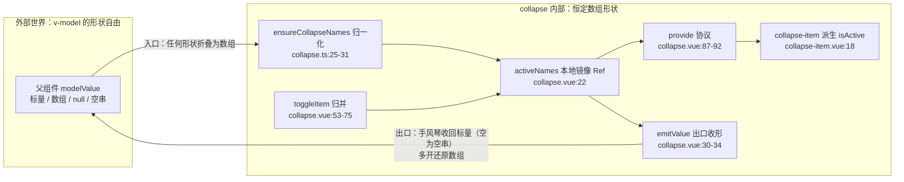
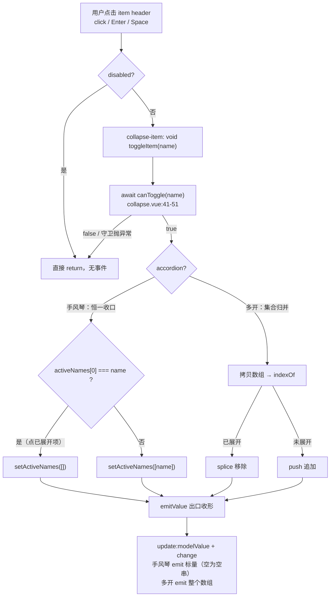
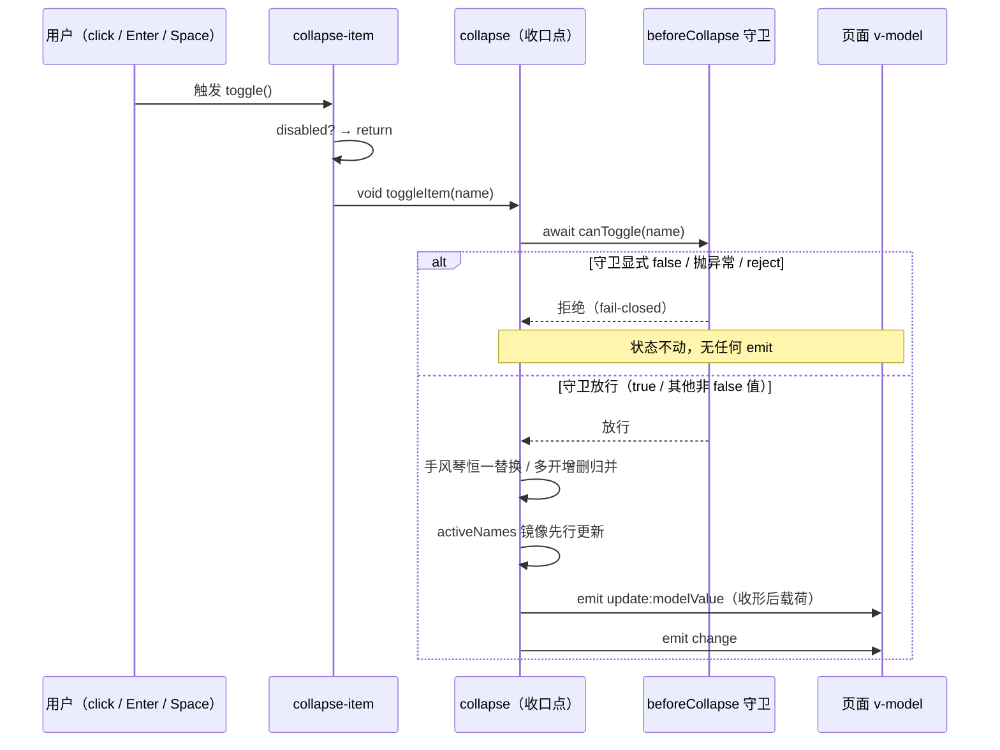

# 7-05 · Collapse：手风琴模式

> 本篇源码坐标（均为当前工作区实态）：
> - `packages/components/collapse/src/collapse.vue`（状态收口点，105 行）
> - `packages/components/collapse/src/context.ts`（协议定义，18 行）
> - `packages/components/collapse/src/collapse.ts`（类型层与形状归一化，31 行）
> - `packages/components/collapse/src/collapse-item.vue`（inject 消费端与 aria 链路，93 行）
> - `packages/components/collapse/src/collapse-item.ts`（item 类型层，15 行）
> - 样式与测试：`packages/theme/src/components/collapse.css`（133 行）、`packages/components/collapse/__tests__/collapse.spec.ts`（185 行）
> - 类型夹具：`tests/types/fixtures/collapse.ts`（37 行）；文档示例：`apps/docs/examples/collapse/`（basic / accordion / guarded 三例）

上一篇 7-04 拆了 Backtop 的滚动目标解析，从这一篇起我们进入反馈与浮层卷的容器类组件。本篇主角 Collapse 的核心问题在大纲里只有八个字：**多开与互斥的状态收口**。拆开说，它由三个更锋利的问题组成：

1. `v-model` 的形状怎么定？多开模式天然是数组，手风琴模式天然是单值——一个组件同时服务两种形状，对外 API 是两个模型还是一个模型的两种写法？
2. 互斥裁决发生在哪一层？如果互斥靠"每个 item 展开前看一眼兄弟"，N 个 item 就有 N 份互斥逻辑，任何一个写歪了手风琴就漏风；
3. 展开这个动作可能被拒绝（禁用、守卫、异步确认），被拒绝时的状态回滚靠什么保证？

Collapse 的答案是：**对外保留"标量或数组"的形状自由，对内把一切形状折叠成一个恒定的数组 ref，互斥与归并全部收口在父组件的一个 `toggleItem` 里，子组件只做派生与上报**。这正是 4-09 group 复合模式在"无 group 名义"场景下的又一次落地——collapse-item 甚至比 radio 更纯，它是全仓库 provide 协议模式里最干净的一个样本。本篇把这条收口链拆到实现层，展开动画本身（`collapse-transition` 的 max-height hook）按大纲约定留给下一篇 7-06，这里只回指不展开。

## 一、先定位：比 group 更"纯"的 provide 协议样本

4-09 我们把"父管子"的实现谱系分成三种：注册模式（子项 onMounted 报到）、父渲染子（timeline 遍历 vnode 代渲染）、provide 协议（父立规矩、子对号入座）。当时radio-group 是第三种的代表，但它还带着两个"非纯"因素——模板里有 options fallback 渲染，协议里下发了 7 个字段。现在把 collapse 放进同一张对照表，会发现它把第三种推到了极致：

| 维度 | radio-group（4-09） | collapse（本篇） |
| --- | --- | --- |
| 子项来源 | 插槽手写 + options fallback 两路 | 仅插槽一路，`<slot />` 原样透传 |
| 父模板 | `role="radiogroup"` + 30 余行 fallback 渲染 | 5 行：一个 div 包一个 slot |
| 协议字段 | 7 个状态 + `changeValue` | 3 个状态 + `toggleItem` |
| 属性级联 | size/disabled/name/fill/textColor 五条链 | 仅 `expandIconPosition` 一条 |
| 子项名单 | 父不感知 | 父不感知 |

collapse 父组件的模板全文只有这几行：

```vue
<!-- packages/components/collapse/src/collapse.vue:100-104 -->
<template>
  <div :class="rootClasses">
    <slot />
  </div>
</template>
```

没有遍历、没有注册表、没有 fallback——collapse 对"自己有几个 item、item 是谁"一无所知，它只广播状态和裁决入口。对照注册模式的代表 EP form（`addField`/`removeField`），能再次看清那条分界线：**需要集合操作（遍历、批量校验、reset）的父子关系才值得注册；只需要"广播 + 回调"的父子关系，provide 协议就够了**。Collapse 的 isActive 判定是每个 item 独立的 `includes` 派生，父组件从头到尾不需要一份 item 名单。

顺带从 `packages/components/component-manifest.json:403-411` 的清单条目确认一下它的公开面：`installExports` 只有 `XyCollapse` 与 `XyCollapseItem` 两个名字，样式走 `styleImports: ["collapse"]` 单文件注入——公开面与实现复杂度完全成比例，这是"小组件小表面"的典型。

## 二、形状先行：类型层就写好的收口合同

收口模式的第一块拼图照例不是逻辑而是协议。`packages/components/collapse/src/context.ts` 全文如下：

```typescript
// packages/components/collapse/src/context.ts:1-18
import type { ComputedRef, InjectionKey, Ref } from "vue";

export type CollapseActiveName = string | number;
export type CollapseModelValue = CollapseActiveName | CollapseActiveName[];
export type CollapseExpandIconPosition = "left" | "right";
export type CollapseBeforeCollapse = (
  name: CollapseActiveName
) => boolean | Promise<boolean>;

export interface CollapseContext {
  activeNames: Ref<CollapseActiveName[]>;
  accordion: ComputedRef<boolean>;
  expandIconPosition: ComputedRef<CollapseExpandIconPosition>;
  toggleItem: (name: CollapseActiveName) => Promise<void>;
}

export const collapseContextKey: InjectionKey<CollapseContext> = Symbol("xiaoye-collapse");
```

这 18 行里藏着本篇的题眼，就在第 4 与第 11 行的**形状对比**上：

- 第 4 行，`CollapseModelValue = CollapseActiveName | CollapseActiveName[]`——对外模型是**联合形状**，标量和数组都合法；
- 第 11 行，`activeNames: Ref<CollapseActiveName[]>`——注入协议里只有**恒定数组形状**。

两个形状差就是"收口"的全部含义：不稳定的东西留在边界外，协议内部只流通稳定形状。collapse-item 的 `isActive` 之所以能写成一行 `includes`（后面第 6 节），前提就是它从协议里读到的永远是数组——如果 provide 的是原始 `props.modelValue` 的 `toRef`，item 就得先写一个"标量走全等、数组走 includes"的形状分支，N 个 item 重复 N 份。形状归一化只做一次，受益的是所有下游派生。

协议其余三个成员也各有讲究。`accordion` 与 `expandIconPosition` 是 `ComputedRef` 而非 `Ref`：它们是 props 的只读投影，子组件只能消费不能写——和 4-09 radio-group 里 `size: ComputedRef` 的用意一致，**类型签名在声明"这是裁决完的最终值"**。`toggleItem` 返回 `Promise<void>`：它内部要 `await` 异步守卫（第 5 节），方法签名如实暴露了"这次切换可能晚一点生效、也可能不生效"的事实。至于 `CollapseBeforeCollapse` 返回 `boolean | Promise<boolean>`，把"同步拦截"与"异步确认（比如弹窗）"统一进一个签名，调用端一律 `await`，两种形态不分叉。

再看类型层与形状归一化函数（`packages/components/collapse/src/collapse.ts`）：

```typescript
// packages/components/collapse/src/collapse.ts:1-31
import type Collapse from "./collapse.vue";
import type {
  CollapseActiveName,
  CollapseBeforeCollapse,
  CollapseExpandIconPosition,
  CollapseModelValue
} from "./context";

export type {
  CollapseActiveName,
  CollapseBeforeCollapse,
  CollapseExpandIconPosition,
  CollapseModelValue
};

export interface CollapseProps {
  modelValue?: CollapseModelValue;
  accordion?: boolean;
  expandIconPosition?: CollapseExpandIconPosition;
  beforeCollapse?: CollapseBeforeCollapse;
}

export type CollapseInstance = InstanceType<typeof Collapse>;

export function ensureCollapseNames(value: CollapseModelValue | undefined) {
  if (value == null || value === "") {
    return [] as CollapseActiveName[];
  }

  return Array.isArray(value) ? [...value] : [value];
}
```

`ensureCollapseNames` 是"入口收形"的全部实现，三条规则对应三种输入：`null`/`undefined`/空字符串归零（空数组）；数组浅拷贝原样收下；标量包成单元素数组。两个细节值得驻留：

**第一，数组为什么要浅拷贝？** `props.modelValue` 是父组件的数据，如果直接把引用存进内部 ref，后续父组件外部变异这个数组（或者内部归并时不小心 splice）会跨过 v-model 契约互相污染。复制一份，内部世界就与外部世界在引用层面断开，同步只经由"emit 写回 + watch 读回"这条明路。

**第二，`""` 为什么要单独归零？** 这是给手风琴模式的空状态留的往返通道——下一节会看到，手风琴收口时对外 emit 的空值就是 `""`，它必须能被入口无损还原成 `[]`，否则"收起最后一项"这个动作在受控场景下会死循环（emit `""` → 父回写 `""` → 入口解析失败）。入出口的形状约定是一对咬合的齿轮，看懂出口才能看懂入口。

## 三、状态收口：一个镜像 ref 承接两种形状

`collapse.vue` 是全篇主角，105 行。先把 script 全文贴出来：

```vue
<!-- packages/components/collapse/src/collapse.vue:1-98 -->
<script setup lang="ts">
import { computed, provide, ref, watch } from "vue";
import { useNamespace } from "xiaoye-primitives";
import { collapseContextKey } from "./context";
import { ensureCollapseNames } from "./collapse";
import type { CollapseActiveName, CollapseModelValue } from "./context";
import type { CollapseProps } from "./collapse";

const props = withDefaults(defineProps<CollapseProps>(), {
  modelValue: () => [],
  accordion: false,
  expandIconPosition: "right",
  beforeCollapse: undefined
});

const emit = defineEmits<{
  "update:modelValue": [value: CollapseModelValue];
  change: [value: CollapseModelValue];
}>();

const ns = useNamespace("collapse");
const activeNames = ref<CollapseActiveName[]>(ensureCollapseNames(props.modelValue));
const accordion = computed(() => props.accordion);
const expandIconPosition = computed(() => props.expandIconPosition);
const rootClasses = computed(() => [
  ns.base.value,
  `${ns.base.value}--icon-${props.expandIconPosition}`
]);

function emitValue(names: CollapseActiveName[]) {
  const value = props.accordion ? (names[0] ?? "") : names;
  emit("update:modelValue", value);
  emit("change", value);
}

function setActiveNames(names: CollapseActiveName[]) {
  activeNames.value = names;
  emitValue(names);
}

async function canToggle(name: CollapseActiveName) {
  if (!props.beforeCollapse) {
    return true;
  }

  try {
    return (await props.beforeCollapse(name)) !== false;
  } catch {
    return false;
  }
}

async function toggleItem(name: CollapseActiveName) {
  const allowed = await canToggle(name);

  if (!allowed) {
    return;
  }

  if (props.accordion) {
    setActiveNames(activeNames.value[0] === name ? [] : [name]);
    return;
  }

  const nextNames = [...activeNames.value];
  const index = nextNames.indexOf(name);

  if (index >= 0) {
    nextNames.splice(index, 1);
  } else {
    nextNames.push(name);
  }

  setActiveNames(nextNames);
}

watch(
  () => props.modelValue,
  (value) => {
    activeNames.value = ensureCollapseNames(value);
  },
  {
    deep: true
  }
);

provide(collapseContextKey, {
  activeNames,
  accordion,
  expandIconPosition,
  toggleItem
});

defineExpose({
  activeNames,
  setActiveNames
});
</script>
```

全篇的枢纽是第 22 行：

```typescript
const activeNames = ref<CollapseActiveName[]>(ensureCollapseNames(props.modelValue));
```

`activeNames` 不是 `toRef(props, "modelValue")`，而是**本地镜像 ref**：初始值经 `ensureCollapseNames` 归一化，此后与 props 的 `modelValue` 通过第 77-85 行的 `deep` watch 双向对齐。对照 4-09，radio-group 的 `modelValue` 是直接 `toRef(props, "modelValue")` 透传的，为什么 collapse 必须镜像？两个原因，一个来自协议下游，一个来自归并操作本身：

**原因一，形状折叠必须发生在传给子组件之前。** 协议承诺了 `Ref<CollapseActiveName[]>`，这个承诺要求"标量→数组"的转换只能做一次且提前做。如果 provide 的是 props 直通引用，标量值传到 item 手里就是 `string | number`，`includes` 根本不存在——镜像 ref 是协议类型的物理载体。

**原因二，toggle 是"读-改-写"的归并，需要一个稳定的读写对象。** 多开分支要 `indexOf`、`splice`、`push`，手风琴分支要比较 `activeNames.value[0]`——这些操作都假设"当前展开集合"是一个可复制的数组。镜像 ref 让归并逻辑建立在确定的形状上，而不是每次都先做一遍形状判断。

镜像的同步方向是两条：**内部 → 外部**走 `setActiveNames`（写镜像后 emit），**外部 → 内部**走 deep watch（props 回写后重新归一）。deep 的必要性在于父组件可能不走整体赋值而是直接变异：`activeNames.value.push("x")` 这种非受控写法不换引用，非 deep 的 watch 根本不会触发。deep watch 是"允许父组件用任何方式改模型"的包容性代价——4-04 讲受控/非受控双模时提过的那条规则在这里落了地：**镜像让受控与非受控统一成一种实现**。父组件回写，watch 对齐；父组件不回写（只监听 `update:modelValue` 做埋点），镜像自持，组件以非受控姿态继续工作。两条路径不需要任何 if 分支。

状态更新后的对外广播只有一处，第 30-34 行的 `emitValue`：

```typescript
function emitValue(names: CollapseActiveName[]) {
  const value = props.accordion ? (names[0] ?? "") : names;
  emit("update:modelValue", value);
  emit("change", value);
}
```

这就是"出口收形"：内部永远是数组，emit 时按模式决定对外形状——多开模式把数组原样交出；手风琴模式取 `names[0]`，空集时给 `""`。测试 `collapse.spec.ts:56` 断言手风琴模式 emit 的载荷是 `["second"]`（emitted 包裹后的形态，实际载荷是标量 `"second"`），`collapse.spec.ts:31` 断言多开模式载荷是数组 `["base"]`——两种形状各自被钉死。与 4-09 radio-group 的收口纪律（先 emit、`await nextTick`、再 emit change、最后触发校验）相比，这里的收口链明显更短：两个事件连续同步发出，没有 nextTick 间隔，也没有 form 校验联动。这不是疏漏而是场景差异——collapse 不在 form 校验体系里，`change` 的载荷是直传值而非让监听者回头读 props，监听者不存在"读到未落定旧值"的风险，五步纪律里与 nextTick 相关的两步自然省去。**收口纪律的长度跟着副作用清单走，不是越隆重越好。**

最后看 provide（第 87-92 行）与 expose（第 94-97 行）这对"对内广播、对外开窗"：

```typescript
provide(collapseContextKey, {
  activeNames,
  accordion,
  expandIconPosition,
  toggleItem
});

defineExpose({
  activeNames,
  setActiveNames
});
```

对内下发的四个成员就是 `CollapseContext` 的逐字实现；对外则开了两个命令式口子——`activeNames` 让宿主能读内部真实状态，`setActiveNames` 让宿主能程序化地展开/收起（测试 `collapse.spec.ts:153-155` 通过 `wrapper.vm` 调用并断言 emit）。注意 `setActiveNames` 与交互路径的 `toggleItem` 之间有一条隐蔽的分界线：它**不经过 `canToggle` 守卫**。这个选择的利弊在第 5 节与权衡三里展开。

把整条状态链画成一张图，"入折叠、出展开"的形状协商一目了然：



## 四、toggleItem：互斥与多开的双分支裁决

现在聚焦核心问题：互斥到底怎么"收口"。`toggleItem`（第 53-75 行，守卫已在上文）的两条分支如下：

```typescript
// packages/components/collapse/src/collapse.vue:60-74
if (props.accordion) {
  setActiveNames(activeNames.value[0] === name ? [] : [name]);
  return;
}

const nextNames = [...activeNames.value];
const index = nextNames.indexOf(name);

if (index >= 0) {
  nextNames.splice(index, 1);
} else {
  nextNames.push(name);
}

setActiveNames(nextNames);
```

**手风琴分支是一行三元，互斥不需要"关掉别人"。** 这是最容易被低估的一行。直觉写法是"点开新项时把其他项从数组里移除"——遍历、过滤、保持顺序，一串动作。但 `activeNames` 是内部恒定数组的镜像，而手风琴模式又承诺了"数组长度恒为 1"（从入口到出口，`ensureCollapseNames` 保证单值变单元素数组，`toggleItem` 的互斥分支保证集合要么等于 `[name]` 要么等于 `[]`），于是互斥根本不需要显式的移除动作：**直接整体替换成新的一元数组，旧项自然消失**。收口的彻底程度决定了互斥的实现成本——形状收得越死，逻辑越短。点已展开项时 `activeNames.value[0] === name` 成立，替换为 `[]`，即"再点一次收起自己"，这也是手风琴的标准交互语义。

**多开分支是标准的不可变归并。** `[...activeNames.value]` 复制、`indexOf` 定位、按命中与否 `splice` 或 `push`、整体写回——与 4-09 checkbox-group 的 `changeValue`（`checkbox-group.vue:55-95` 的 slice/findIndex/splice/push 四步）逐行同构。这不是巧合：**单选与手风琴、多选与多开，是同一个"集合归并"问题的两种约束强度**。约束最强时（恒一元），归并退化成整体替换；约束放松到"任意子集"，归并退化成增删。两个组件库在两处分别选了正确的复杂度，说明这确实是问题结构决定的写法，而不是作者偏好。

值得单独拎出来的一个语义边界：**accordion 是"写时互斥"，不是"读时校验"**。如果宿主在手风琴模式下直接传入数组 `["a", "b"]`，`ensureCollapseNames` 会原样收下（浅拷贝不截断），两个 item 会同时呈 `is-active`——直到下一次点击，互斥分支整体替换后回到恒一。也就是说，输入形状不校验、输出行为保互斥。这延续了 4-09 讲 checkbox min/max 时的那条裁决原则（变更合法性在收口点判），但更进一步：连"非法输入"也不在入口拒绝，而是信任下一次交互自愈。代价是手风琴模式下首帧可能出现"视觉双开"，收益是入口零防御成本。测试 `collapse.spec.ts:34-57` 锁的是常规用法（标量进、标量出），这个数组进手风琴的边界目前没有测试钉住，属于可辩护的未定义地带——文档页 `apps/docs/components/collapse.md` 的 props 表写的是"手风琴模式下可传单值"，把数组用法排除在承诺之外，算是文档与实现的一致性兜底。

两条分支的完整裁决流（含禁用与守卫）如下：



这张图里还有一个此前没解释的环节——item 端的 `void collapse?.toggleItem(itemName.value)`（`collapse-item.vue:39`）。`toggleItem` 是 async 函数，item 不 await 它，而是 `void` 显式吞掉 Promise：切换的最终生效时刻由父组件的守卫时长决定，item 不需要在异步链上等结果。副作用是"点击后到状态变化前"存在一个窗口（异步守卫期间），UI 在窗口里保持旧态——对同步守卫这个窗口不存在，对异步守卫（比如弹窗确认）这个窗口恰是等待反馈的时间。

## 五、beforeCollapse：异步守卫与 fail-closed

守卫函数 `canToggle`（第 41-51 行）全文只有 10 行，却做了三个严肃的决定：

```typescript
// packages/components/collapse/src/collapse.vue:41-51
async function canToggle(name: CollapseActiveName) {
  if (!props.beforeCollapse) {
    return true;
  }

  try {
    return (await props.beforeCollapse(name)) !== false;
  } catch {
    return false;
  }
}
```

**决定一，无守卫时零开销直通。** 守卫没配置就 `return true`，连 try/catch 都不进——绝大多数用法不付任何成本。

**决定二，`!== false` 而非真值判断。** 守卫返回 `undefined`、`null`、`0`、空串时都放行，只有显式 `false` 才拦截。这是"宽进严出"的签名约定：`CollapseBeforeCollapse` 的返回类型是 `boolean | Promise<boolean>`，但运行时对"手滑写了 `return name !== 'advanced'` 之外的松散写法"保持宽容。语义上这等价于"守卫只在明确说不时生效"，与 `disabled` prop（显式传 true 才禁用）的保守口径一致。

**决定三，异常即拒绝（fail-closed）。** `catch` 里 `return false`——守卫函数抛错（网络请求失败、代码 bug、Promise reject）时，切换被拒绝而不是放行。这个默认值得写进每一次 code review：如果这里写 `return true`，一个"展开前查权限"的异步守卫在接口 500 时会静默放行，把本该锁住的内容展开给用户看；`return false` 则把故障导向更安全的方向。代价是"守卫抛错 = 点击无响应且无提示"——守卫作者有责任在自己的实现里处理错误并给出用户反馈，组件层的 catch 只保证不误放行，不负责替业务报错。`guarded.vue:6-12` 的示例给了标准姿势：守卫内自己做条件分支返回布尔，不把异常抛给组件层。

```vue
<!-- apps/docs/examples/collapse/guarded.vue:1-13 -->
<script setup lang="ts">
import { ref } from "vue";

const allowAdvanced = ref(false);

async function beforeCollapse(name: string | number) {
  if (name !== "advanced") {
    return true;
  }

  return allowAdvanced.value;
}
</script>
```

测试对守卫的双形态各钉了一个用例：`collapse.spec.ts:59-80` 用同步守卫 `() => false` 断言"没有任何 emit"；`collapse.spec.ts:82-103` 用 `Promise.resolve(true)` 断言异步放行后 emit 出 `["async"]`——注意断言前只 `await Promise.resolve()` 一个微任务，因为组件层恰好也只 `await` 了一次，测试与实现守着同一个时钟。

时序上把守卫窗口画出来：



最后补上第 3 节埋的那条伏笔：`expose` 的 `setActiveNames` 绕过守卫。这不是漏洞而是通道分层——`toggleItem` 是**交互通道**，模拟的是"用户请求展开"，守卫是这条通道的闸门；`setActiveNames` 是**命令式通道**，表达的是"程序已做出决定"（比如从 URL query 恢复展开态、联动另一个组件展开某项），对已决定的事再过一遍交互闸门反而语义混乱。测试 `collapse.spec.ts:128-156` 的 expose 用例在 `expandIconPosition: "left"` 场景下调 `setActiveNames(["second"])` 并断言 emit，等于把"命令式通道直通广播"钉成了契约。

## 六、collapse-item：派生、随机名与 aria 链路

协议的另一端是 `collapse-item.vue`，93 行，script 与 template 全文如下：

```vue
<!-- packages/components/collapse/src/collapse-item.vue:1-93 -->
<script setup lang="ts">
import { computed, inject } from "vue";
import { useNamespace } from "xiaoye-primitives";
import XyCollapseTransition from "../../collapse-transition";
import { collapseContextKey } from "./context";
import type { CollapseItemProps } from "./collapse-item";

const props = withDefaults(defineProps<CollapseItemProps>(), {
  title: "",
  name: undefined,
  disabled: false
});

const ns = useNamespace("collapse");
const collapse = inject(collapseContextKey, null);
const generatedName = `xy-collapse-item-${Math.random().toString(36).slice(2, 10)}`;
const itemName = computed(() => props.name ?? generatedName);
const isActive = computed(() => collapse?.activeNames.value.includes(itemName.value) ?? false);
const iconPosition = computed(() => collapse?.expandIconPosition.value ?? "right");
const headerId = `${generatedName}-header`;
const contentId = `${generatedName}-content`;
const rootClasses = computed(() => [
  `${ns.base.value}__item`,
  isActive.value ? "is-active" : "",
  props.disabled ? "is-disabled" : ""
]);
const headerClasses = computed(() => [
  `${ns.base.value}__header`,
  `${ns.base.value}__header--${iconPosition.value}`,
  isActive.value ? "is-active" : "",
  props.disabled ? "is-disabled" : ""
]);

function toggle() {
  if (props.disabled) {
    return;
  }

  void collapse?.toggleItem(itemName.value);
}

function handleKeydown(event: KeyboardEvent) {
  if (event.key !== "Enter" && event.key !== " ") {
    return;
  }

  event.preventDefault();
  toggle();
}

defineExpose({
  isActive
});
</script>

<template>
  <section :class="rootClasses">
    <header
      :id="headerId"
      :class="headerClasses"
      role="button"
      :tabindex="props.disabled ? -1 : 0"
      :aria-expanded="isActive"
      :aria-controls="contentId"
      :aria-disabled="props.disabled ? 'true' : undefined"
      @click="toggle"
      @keydown="handleKeydown"
    >
      <span class="xy-collapse__title">
        <slot name="title" :is-active="isActive">
          {{ props.title }}
        </slot>
      </span>
      <span class="xy-collapse__icon" aria-hidden="true" />
    </header>

    <xy-collapse-transition>
      <div
        v-show="isActive"
        :id="contentId"
        :class="['xy-collapse__wrap', isActive ? 'is-active' : '']"
        role="region"
        :aria-hidden="!isActive"
        :aria-labelledby="headerId"
      >
        <div class="xy-collapse__content">
          <slot />
        </div>
      </div>
    </xy-collapse-transition>
  </section>
</template>
```

**`isActive` 是全组件唯一的状态，且是纯派生。** 第 18 行 `collapse?.activeNames.value.includes(itemName.value) ?? false`：受管时读协议镜像做 `includes`；inject 失败（item 脱离 collapse 单独渲染）时恒 `false`——item 自己不维护任何"展开与否"的 ref。这与 4-09 radio 的 `checked`（`radioGroup?.modelValue.value ?? props.modelValue` 再做全等）同构但更极端：radio 自治时还能自己管值，collapse-item 没有"自治形态"，**离开 collapse 的 item 是一个永远收起的空壳**。双模在这个组件上被有意砍掉了一半，换来的是 item 逻辑薄到只剩派生与转发。

**随机名与 id 的解耦是个易漏的细节。** 第 16 行 `generatedName` 是实例级随机串，第 17 行对外语义名 `itemName = props.name ?? generatedName`——业务用 `name` 做模型标识，第 20-21 行的 `headerId`/`contentId` 却由**随机串**派生而不是业务 name。为什么？业务侧的 `name` 不承诺页面内唯一（两个 collapse 里完全可能各有一个 `name="base"`），而 DOM id 必须全局唯一；`aria-labelledby`/`aria-controls` 指向错 id 比没有 id 更糟（读屏器会把别的面板的标题读成本面板的）。随机串把 id 的唯一性从"使用者纪律"下沉到"组件实现"，模型的命名自由与 DOM 的唯一性约束就此互不牵连。这与 4-09 radio-group 的 `fallbackName`（防原生 name 跨组互串）是同一防御哲学的两副面孔：一个防 DOM 分组串扰，一个防 ARIA 关联串扰。

**aria 链路是一对完整的 button/region 关联。** header 上 `role="button"` + `aria-expanded`（第 63 行）+ `aria-controls`；内容区 `role="region"` + `aria-labelledby`（回指 headerId）+ `aria-hidden`（第 83 行）。这套组合正是 WAI-ARIA APG 的 Accordion 图式（disclosure button + region）。第 62 行 `tabindex` 在禁用时为 `-1`、正常时为 `0`，配合第 42-49 行的键盘处理：Enter 和 Space 触发切换并 `preventDefault`（防止页面滚动），其余按键放行——header 是非交互元素模拟按钮，原生 button 自带的键盘行为需要这三行手动补齐。禁用态则有三重表达：`is-disabled` 类（视觉）、`tabindex=-1`（键盘不可达）、`aria-disabled="true"`（读屏器宣告），点击与键盘两条路径最终都汇入 `toggle()`，在第 35-37 行被同一个 `if` 拦截——四条通道对应四类用户的同一种"不可用"。

内容区的显隐用 `v-show` 而非 `v-if`：展开内容始终在 DOM 里，只切 `display`，外层包了 `<xy-collapse-transition>`（`collapse-item.vue:77`）做 max-height 过渡——为什么 height 过渡必须 JS hook 参与（读 `scrollHeight` 再写 `maxHeight`）、这套 hook 的七种状态怎么排布，是 7-06 的正题，这里只留一句：**item 的职责边界到"切换 is-active 类与显隐"为止，动画协议整体外包**。

## 七、样式层：一张 133 行的样式单

`packages/theme/src/components/collapse.css` 全文 133 行，把最关键的三段贴出来。先看 header（第 14-60 行的主体）：

```css
/* packages/theme/src/components/collapse.css:14-41 */
.xy-collapse__header {
  display: flex;
  align-items: center;
  justify-content: space-between;
  gap: 10px;
  width: 100%;
  min-height: 48px;
  padding: 0 16px;
  border-bottom: 1px solid var(--xy-border-subtle);
  background: var(--xy-bg-raised);
  color: var(--xy-text-primary);
  cursor: pointer;
  outline: none;
  font-size: var(--xy-font-size-md);
  font-weight: var(--xy-font-weight-460);
  line-height: 1.5;
  transition:
    border-bottom-color var(--xy-transition-duration-normal) cubic-bezier(0.22, 1, 0.36, 1),
    color var(--xy-transition-duration-fast) cubic-bezier(0.22, 1, 0.36, 1),
    background-color var(--xy-transition-duration-fast) cubic-bezier(0.22, 1, 0.36, 1),
    box-shadow var(--xy-transition-duration-fast) cubic-bezier(0.22, 1, 0.36, 1);
}

.xy-collapse__header.is-active {
  border-bottom-color: transparent;
  color: var(--xy-text-heading);
  background: color-mix(in srgb, var(--xy-brand-soft) 52%, var(--xy-bg-raised));
}
```

第 28 行的 `font-weight: var(--xy-font-weight-460)` 正是 3-06 字重扩档战争里清点过的消费点之一——460 这个"半档"字重被选中作为折叠面板标题的默认重量，比正文重、比标准 500 轻，让标题在列表语境里"可扫读但不喧哗"。`is-active` 态做了一件很省的事情：把 header 的 `border-bottom` 染成 `transparent`（配合内容区自己画边框），展开时标题与内容之间在视觉上"融为一体"，收起时恢复分割线——一个边框色翻转完成"面板打开"的空间隐喻，没有任何 DOM 变化。

再看图标（第 69-93 行），这是全文件最讨巧的一段：

```css
/* packages/theme/src/components/collapse.css:79-93 */
.xy-collapse__icon::before {
  content: "";
  display: block;
  inline-size: 6px;
  block-size: 6px;
  border-top: 1.25px solid currentColor;
  border-right: 1.25px solid currentColor;
  transform: rotate(45deg);
  transform-origin: center;
  translate: 1px 1px;
}

.xy-collapse__item.is-active .xy-collapse__icon {
  transform: rotate(90deg);
}
```

箭头不是图标字体也不是 SVG，而是 6px 方块的 `border-top + border-right` 转 45 度拼出来的 V 形；展开时整体 `rotate(90deg)` 让 V 形从"朝下"变为"朝右"。整个"图标"的绘制与翻转都是 CSS，`collapse-item.vue:74` 里那个 `<span class="xy-collapse__icon" aria-hidden="true" />` 是空节点——`aria-hidden` 是必须的，装饰性旋转箭头对读屏器是噪音，展开状态已由 `aria-expanded` 承载。图标位置切换（`expand-icon-position`）也只有三行 CSS：`.xy-collapse--icon-left .xy-collapse__header` 用 `flex-direction: row-reverse` 把图标换到左边（第 8-12 行）——又一次"视觉下沉 CSS、逻辑收口 JS"：iconPosition 经协议下发只为拼类名，翻转本身是纯样式决策。

最后是内容区与收尾细节（第 100-133 行）：

```css
/* packages/theme/src/components/collapse.css:100-133 */
.xy-collapse__wrap {
  overflow: hidden;
  border-bottom: 1px solid transparent;
  background: color-mix(in srgb, var(--xy-bg-subtle) 36%, var(--xy-bg-raised));
  transition: border-bottom-color var(--xy-transition-duration-fast) cubic-bezier(0.22, 1, 0.36, 1);
  will-change: max-height;
}

.xy-collapse__item.is-active .xy-collapse__wrap {
  border-bottom-color: var(--xy-border-subtle);
}

.xy-collapse__content {
  min-height: 0;
  overflow: hidden;
  padding: 0 16px 18px;
  font-size: 13px;
  color: var(--xy-text-muted);
  line-height: 1.72;
  opacity: 0;
  transform: translateY(-6px);
  transition:
    opacity var(--xy-transition-duration-fast) cubic-bezier(0.22, 1, 0.36, 1),
    transform var(--xy-transition-duration-normal) cubic-bezier(0.22, 1, 0.36, 1);
}

.xy-collapse__wrap.is-active .xy-collapse__content {
  opacity: 1;
  transform: translateY(0);
}

.xy-collapse__item:last-child {
  margin-bottom: -1px;
}
```

两层过场在这里分工：`.xy-collapse__wrap` 承担高度变化（`overflow: hidden` + `will-change: max-height`，第 105 行的 `will-change` 就是给 7-06 的 JS hook 预留的合成层提示），`.xy-collapse__content` 承担内容进场（`opacity` 0→1 配 `translateY(-6px)`→0 的下落感）。`.xy-collapse__item:last-child { margin-bottom: -1px }` 是容器 `overflow: hidden` 下的经典 -1px 边框修正：根容器裁剪加上最后一项的 `border-bottom` 会在底部留出双线，负边距把它顶回去。这张样式单全程只消费语义层与刻度层令牌（`--xy-border-subtle`、`--xy-bg-raised`、`--xy-brand-soft`、`--xy-transition-duration-*`），双主题切换零额外代码——3-01 讲的三层令牌架构在反馈卷组件上的标准落地。

## 八、测试与类型夹具如何钉死收口

收口类设计最怕回归：某天有人"顺手"在手风琴分支里 push 而不是替换，或者把 `catch` 改成 `return true`，互斥与 fail-closed 就双双失守。`collapse.spec.ts` 的 7 个用例把契约逐条钉住，最核心的两段值得整段贴出。先是手风琴用例：

```typescript
// packages/components/collapse/__tests__/collapse.spec.ts:34-57
it("支持 accordion 模式", async () => {
  const wrapper = mount(XyCollapse, {
    props: {
      accordion: true,
      modelValue: "first"
    },
    slots: {
      default: `
        <xy-collapse-item name="first" title="一">内容一</xy-collapse-item>
        <xy-collapse-item name="second" title="二">内容二</xy-collapse-item>
      `
    },
    global: {
      components: {
        XyCollapseItem
      }
    }
  });

  const headers = wrapper.findAll(".xy-collapse__header");
  await headers[1]?.trigger("click");

  expect(wrapper.emitted("update:modelValue")?.[0]).toEqual(["second"]);
});
```

这个用例同时锁了三件事：`modelValue` 传**标量** `"first"` 合法（联合形状的承诺）；点击第二个 header 后 emit 的载荷是**标量** `"second"`（出口收形）；两次事件（`update:modelValue` 与 `change`）签名同源。对照第一个用例 `collapse.spec.ts:31` 断言多开模式 emit `[["base"]]`（emitted 包裹后的数组载荷），两种形状各有一枚钉子。守卫双形态的用例（第 59-80 行的同步拒绝、第 82-103 行的异步放行）在第 5 节已拆，不赘述。

类型夹具 `tests/types/fixtures/collapse.ts` 全文 37 行，把形状联合的另一面（类型面）钉死：

```typescript
// tests/types/fixtures/collapse.ts:1-37
import type {
  CollapseActiveName,
  CollapseBeforeCollapse,
  CollapseExpandIconPosition,
  CollapseItemProps,
  CollapseModelValue,
  CollapseProps
} from "xiaoye-components";

const singleName: CollapseActiveName = "intro";
const multipleNames: CollapseModelValue = ["intro", 2];
const iconPosition: CollapseExpandIconPosition = "left";
const beforeCollapse: CollapseBeforeCollapse = async (_name) => true;

const collapseProps: CollapseProps = {
  modelValue: multipleNames,
  accordion: false,
  expandIconPosition: iconPosition,
  beforeCollapse
};

const collapseItemProps: CollapseItemProps = {
  title: "基础说明",
  name: singleName,
  disabled: false
};

void collapseProps;
void collapseItemProps;

const invalidCollapseProps: CollapseProps = {
  // @ts-expect-error invalid expand icon position
  expandIconPosition: "top"
};

void invalidCollapseProps;
```

第 11 行 `const multipleNames: CollapseModelValue = ["intro", 2]` 一行同时验证两件事：数组形状合法、元素联合 `string | number` 混排合法；第 31-34 行的 `@ts-expect-error` 断言 `"top"` 必须被 `CollapseExpandIconPosition` 字面量联合拒绝——非法位置在编译期就无路可走。这份夹具随 `pnpm typecheck:types` 全量参与 CI（AGENTS.md 的夹具规则），运行时的收口契约与编译期的形状契约由两套测试分别把守。示例侧，`apps/docs/examples/collapse/accordion.vue:4` 用 `ref<string | number>("base")` 展示手风琴的标量 v-model，`accordion.vue:21` 的 `accordion expand-icon-position="left"` 演示两属性联用，`basic.vue:21-33` 则用数组 v-model 演示多开——文档示例刻意让两种形状各出现一次，与夹具互为镜像。

## 九、设计权衡

### 权衡一：本地镜像 ref vs props 直通

把 `activeNames` 换成 `toRef(props, "modelValue")` 能省掉镜像与 deep watch，但两个成本立刻回弹：协议的 `Ref<CollapseActiveName[]>` 类型无法成立（props 可能是标量），item 端的 `includes` 派生全部要加形状分支；toggle 的归并失去稳定读写对象，每次都要"先归一再操作"。镜像方案的代价是双份状态与同步纪律（漏写 watch 就是失真 bug），收益是协议形状恒定 + 归并逻辑零形状判断。本库在"形状不稳定的模型 + 子组件需要派生"的场景里一律选镜像（collapse、4-12 dialog 队列同理），在"形状稳定且无归并"的场景里直通（radio-group）——**镜像与否是形状问题，不是风格问题**。

### 权衡二：role="button" + region vs role="tab" + tabpanel

EP 主线的 collapse-item 头部沿用 `role="tab"`、内容区 `role="tabpanel"`，把手风琴嫁接到标签页语义上（配套的键盘方向键循环也在 tab 语境里）。本库选了 WAI-ARIA APG Accordion 图式的 `role="button"` + `aria-expanded` + `role="region"` + `aria-labelledby`。两边各有一笔账：tab 语义自带方向键导航与 tablist 容器声明，但"手风琴"与"视图切换"在语义上是两种交互（APG 明确区分了 Accordion 与 Tabs 模式）；button + region 语义精准、实现轻，但键盘行为要自己补（第 6 节那三行 Enter/Space 处理就是补的代价）。本库选语义准确、自付键盘成本，这与库里"键盘行为手动补齐"的整体口径（tabs、menu 同款思路）一致。

### 权衡三：守卫 fail-closed 与命令式通道绕过守卫

`catch → return false` 与 `setActiveNames` 不过守卫是同一条原则的两面：**守卫治理的是"用户意图"，不治理"程序决定"**。fail-closed 保证异常时用户拿不到内容（安全默认），绕过守卫保证程序化恢复（URL 回填、跨组件联动）不被交互闸门误拦。两处都选了"保守的那半边"：对不可控异常保守（拒绝），对受控调用开放（直通）。风险在于组合：宿主若依赖守卫做权限控制，就必须知道命令式通道是"权限之外的口子"——这也是文档页 Exposes 表里把 `setActiveNames` 描述为"主动写入"而非"切换"的措辞用意。

### 权衡四：手风琴空值用 `""` 的往返咬合

手风琴收口 emit 空状态时给的是 `""` 而非 `null`/`undefined`/`[]`，这是形状联合里最小惊讶的选择：`CollapseModelValue` 的单值分支是 `string | number`，`""` 是其中"明确的空"，且 `ensureCollapseNames` 对 `""` 的归零规则（`value === ""` → `[]`）与出口严格咬合——emit `""` → 父组件回写 `""` → watch 归一 `[]`，往返无损。若 emit `undefined` 则 v-model 侧会出现"清空模型"与"未传 prop"的歧义；若 emit `[]` 则手风琴的对外承诺（单值）被自己的空态打破。一枚空值是入出口形状协议的咬合齿，动哪一边都会崩。

## 十、EP 对比：同一份手风琴的两版答卷

以 Element Plus 主线的 collapse（`useCollapse` + `ElCollapseItem`）为参照，骨架同源（provide/inject、父不感知 item 名单、accordion 三元互斥），四点差异可观察：

1. **互斥写法几乎逐行同构，差异只在空值。** EP 的 accordion 分支是 `setActiveNames([activeNames.value[0] === name ? '' : name])`，本库是 `setActiveNames(activeNames.value[0] === name ? [] : [name])`——同一颗三元，EP 的互斥替换发生在 `castArray` 之前（空值 `''` 由后续归一化吸收），本库的 `[]` 直达内部数组再由出口收形。殊途同归，本库的收形时刻更靠边界（emit 时才决定形状），EP 的形状转换更早介入。
2. **形状归一化的位置。** EP 用 `castArray`/`ensureArray` 把 `modelValue` 折叠进内部数组，与本库 `ensureCollapseNames` 同路（含数组浅拷贝防污染）；差别是 EP 的 `activeNames` watch 是浅层整体赋值，本库用 `deep: true` 包容父组件的原地变异（`push` 不换引用也能同步）。deep 是更宽的包容面，也是更高的遍历成本，在面板数量级的数组上可以忽略。
3. **守卫能力。** EP 没有内建的切换前守卫，"展开前确认"要业务侧监听 `change` 后再手动收回（状态会先闪一下）；本库 `beforeCollapse` 是协议级能力，同步/异步统一、fail-closed，拦截发生在状态变化之前——这是本库相对 EP 最大的一次 API 增量，也是"守卫类 prop"在库内（form 校验、4-05 浮层关闭语义）的又一次复用。
4. **aria 图式。** EP 的 tab/tabpanel 嫁接与本库的 button/region 之辨已在权衡二展开：EP 的选择换来开箱的方向键循环，本库的选择换来语义精准与更小的实现面。对读屏器用户，两边都能宣告"可展开/已展开"，差异主要在键盘流。

一句话总结：EP 给出"手风琴语义的最小实现"，本库在同一骨架上把**形状协议显式化（联合类型 + 双向收形）、守卫前移（状态变化前拦截）、ARIA 图式对齐 APG**，多付的是镜像同步与键盘自补的成本。

## 十一、收束

把全篇压回最初的问题——多开与互斥的状态收口：

1. **形状是协议。** 对外 `CollapseModelValue` 保留标量/数组联合自由，对内 `Ref<CollapseActiveName[]>` 恒定数组；入口 `ensureCollapseNames` 折叠、出口 `emitValue` 收形，一对齿轮咬合（含 `""` 空值的往返）。
2. **收口点是唯一的。** 互斥（恒一替换）、多开（集合归并）、守卫（fail-closed）全部住在父组件的 `toggleItem`/`canToggle` 里，item 只派生 `isActive`、只转发意图（`void toggleItem`），无第二份裁决逻辑。
3. **镜像是形状问题的解。** 本地镜像 ref + deep watch 让"受控/非受控"统一为一种实现，让协议形状在传给子组件之前就已稳定。
4. **语义与实现分工。** 随机串管 DOM id 唯一性、业务 name 管模型标识；CSS 管视觉翻转（460 字重、旋转箭头、边框融合），JS 管状态收口；动画协议整体外包给 `collapse-transition`。

而这最后一笔正是下一篇的入口：第 6 节我们看到 `<xy-collapse-transition>` 包着 `v-show` 的内容区，`collapse.css:105` 那行 `will-change: max-height` 也在等它——**height 是一个不能直接过渡的属性，为什么 max-height 过渡必须由 JS hook 读一次 `scrollHeight` 才能成立，`beforeEnter`/`enter`/`leave` 七个钩子各自守着哪条时序边界**，就是 7-06 要拆的问题。

**下一篇预告：7-06《CollapseTransition：过渡 hook》。**
