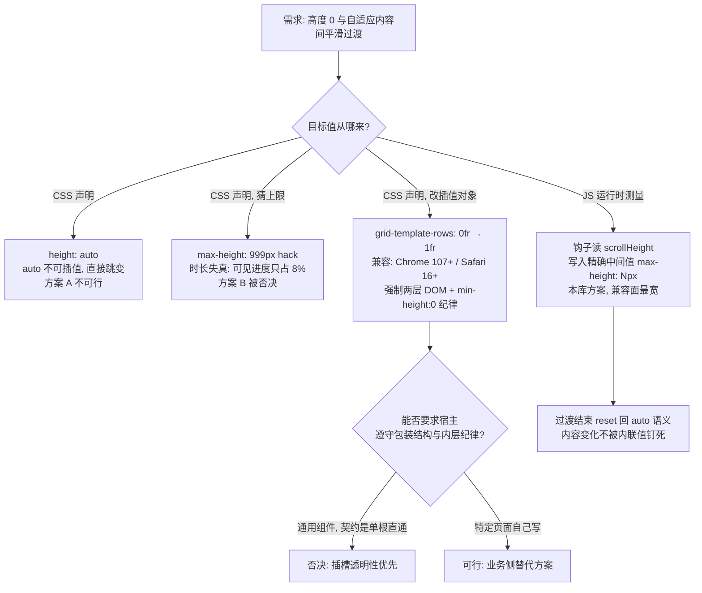
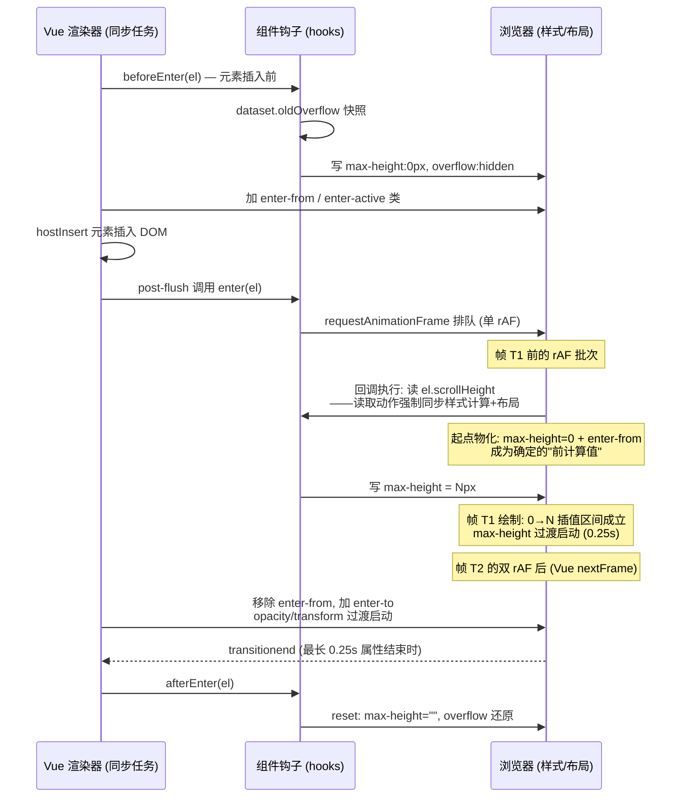

# 7-06 · CollapseTransition：height 过渡为何必须 JS 参与

7-05 收尾时留了两处伏笔：一处是 `collapse-item.vue:77` 那个包着 `v-show` 内容区的 `<xy-collapse-transition>`，另一处是 `collapse.css:105` 那行 `will-change: max-height`——一个纯 CSS 声明，却指向一个 CSS 自己完成不了的动画。这一篇就把这两处伏笔一并收掉：**height（以及它的代理属性 max-height）是少数几个"CSS 无法单方面平滑过渡"的属性，为什么补上这一环的必须是 JS 钩子，`scrollHeight` 的读取时机为什么卡在一帧之差，八个钩子各自守着哪条时序边界**。答案全部住在 `packages/components/collapse-transition/src/collapse-transition.vue` 这 73 行里——它与 space（42 行）、divider（59 行）同处全库最小组件梯队，却承担着 collapse、descriptions、tree 三个组件家族的展开动画协议。

## 一、先定位：73 行 SFC 与它的三个内部客户

先看全文。整个组件只有一个模板、一个工具函数、一个钩子对象：

```vue
<!-- packages/components/collapse-transition/src/collapse-transition.vue -->
<template>
  <transition :name="`${ns.base.value}`" v-on="hooks">
    <slot />
  </transition>
</template>

<script setup lang="ts">
import { useNamespace } from "xiaoye-primitives";
import type { RendererElement } from "vue";

defineOptions({
  name: "XyCollapseTransition"
});

const ns = useNamespace("collapse-transition");

function reset(el: RendererElement & { dataset: DOMStringMap }) {
  el.style.maxHeight = "";
  el.style.overflow = el.dataset.oldOverflow ?? "";
}

const hooks = {
  beforeEnter(el: RendererElement & { dataset: DOMStringMap }) {
    el.dataset.oldOverflow = el.style.overflow;
    if (el.style.maxHeight) {
      el.dataset.oldMaxHeight = el.style.maxHeight;
    }

    el.style.maxHeight = "0px";
    el.style.overflow = "hidden";
  },

  enter(el: RendererElement & { dataset: DOMStringMap }) {
    requestAnimationFrame(() => {
      if (el.dataset.oldMaxHeight) {
        el.style.maxHeight = el.dataset.oldMaxHeight;
      } else if (el.scrollHeight > 0) {
        el.style.maxHeight = `${el.scrollHeight}px`;
      } else {
        el.style.maxHeight = "0px";
      }
    });
  },

  afterEnter(el: RendererElement & { dataset: DOMStringMap }) {
    reset(el);
  },

  enterCancelled(el: RendererElement & { dataset: DOMStringMap }) {
    reset(el);
  },

  beforeLeave(el: RendererElement & { dataset: DOMStringMap }) {
    el.dataset.oldOverflow = el.style.overflow;
    el.style.maxHeight = `${el.scrollHeight}px`;
    el.style.overflow = "hidden";
  },

  leave(el: RendererElement & { dataset: DOMStringMap }) {
    requestAnimationFrame(() => {
      el.style.maxHeight = "0px";
    });
  },

  afterLeave(el: RendererElement & { dataset: DOMStringMap }) {
    reset(el);
  },

  leaveCancelled(el: RendererElement & { dataset: DOMStringMap }) {
    reset(el);
  }
};
</script>
```

入口与安装是标准三件套里的最简形态：

```ts
// packages/components/collapse-transition/index.ts
import CollapseTransition from "./src/collapse-transition.vue";
import { withInstall } from "xiaoye-primitives";

export const XyCollapseTransition = withInstall(CollapseTransition, "xy-collapse-transition");
export default XyCollapseTransition;
```

谁在消费它？用 `rg 'CollapseTransition|collapse-transition' packages/components --files-with-matches` 扫一遍，真正的内部消费方有三家：

| 消费方 | 触发源 | 用法位置 |
| --- | --- | --- |
| `collapse/collapse-item.vue` | `v-show="isActive"` | 导入 `:4`，包裹 `:77-90` |
| `descriptions/descriptions.vue` | `v-show="!collapsed"` | 导入 `:5`，包裹 `:132-173` |
| `tree/tree-node.vue` | `v-if="!renderAfterExpand \|\| childNodeRendered"` | 包裹 `:65-85`，导入 `:102` |

collapse-item 的用法最典型，值得整段读一遍——注意它包的是 `v-show` 而不是 `v-if`：

```vue
<!-- packages/components/collapse/src/collapse-item.vue:56-92 -->
<template>
  <section :class="rootClasses">
    <header
      :id="headerId"
      :class="headerClasses"
      role="button"
      :tabindex="props.disabled ? -1 : 0"
      :aria-expanded="isActive"
      :aria-controls="contentId"
      :aria-disabled="props.disabled ? 'true' : undefined"
      @click="toggle"
      @keydown="handleKeydown"
    >
      <span class="xy-collapse__title">
        <slot name="title" :is-active="isActive">
          {{ props.title }}
        </slot>
      </span>
      <span class="xy-collapse__icon" aria-hidden="true" />
    </header>

    <xy-collapse-transition>
      <div
        v-show="isActive"
        :id="contentId"
        :class="['xy-collapse__wrap', isActive ? 'is-active' : '']"
        role="region"
        :aria-hidden="!isActive"
        :aria-labelledby="headerId"
      >
        <div class="xy-collapse__content">
          <slot />
        </div>
      </div>
    </xy-collapse-transition>
  </section>
</template>
```

tree-node 则是 `v-if` 路线（`tree-node.vue:67`），descriptions 与 collapse 同为 `v-show`。**两种触发源走的是同一组钩子**——这是这个组件"插槽透明"的直接收益：它不关心显隐由谁驱动，`<transition>` 会替它把 v-if 的卸载路径和 v-show 的指令桥接统一成 beforeEnter/enter/leave 三个入口。这一点第四节看 Vue 源码时会再确认。

另有一个考据要当众纠偏：任务预设里猜测 menu、transfer 也可能内部消费 collapse-transition。实际核对下来，**menu 不消费它**——`sub-menu.vue:20` 导入的是自家私有的 `menu-collapse-transition.vue`（全文 5 行，`<transition name="xy-menu-collapse">` 纯 CSS 路线，第六节详拆）；**transfer 完全没有任何 Transition 消费**。真正把展开动画外包出去的，就是上表三家。

类型侧，collapse-transition 是 4-03 考据过的九个"类型内联变体"之一（`column/4-03-标准组件解剖-类型层-视图层-逻辑层三件套.md:249`：73 个目录里 9 个例外含 `collapse-transition`）——它没有 props、没有 instance 方法，`src/` 下不存在 `collapse-transition.ts` 类型层，类型夹具因此只有三行：

```ts
// tests/types/fixtures/collapse-transition.ts
import { XyCollapseTransition } from "xiaoye-components";

void XyCollapseTransition;
```

编译期只断言"值导出存在"这一件事。manifest 侧的条目则钉死了样式入口的一致性：

```json
// packages/components/component-manifest.json:511-518
{
  "name": "collapse-transition",
  "docsGroup": "feedback",
  "docsText": "Collapse Transition 折叠过渡",
  "installExports": ["XyCollapseTransition"],
  "installChecks": [{ "kind": "component", "name": "xy-collapse-transition" }],
  "styleImports": ["collapse-transition"]
}
```

`component-manifest.json:517` 的 `styleImports` 保证 `packages/theme/src/components/collapse-transition.css` 被聚合进主题包，`exports.ts:19` 的 `export * from "./collapse-transition"` 把值导出挂上包根。73 行 SFC、5 行入口、3 行夹具——外壳已经薄到不能再薄，全部重量都压在一个问题上：这八个钩子为什么非存在不可。

## 二、为什么 CSS 单方面做不到：height:auto 的插值死结

CSS transition 的触发条件可以压成一句话：**计算值从一个确定值变成另一个确定值**。`opacity: 0 → 1`、`transform: translateY(-4px) → 0` 都是数与数之间的插值，浏览器拿两张关键帧就能补间。而 height 的日常形态恰恰卡在这个定义之外：

```css
/* 方案 A：想要的效果，但插值不成立 */
.panel {
  height: 0;
  transition: height 0.25s;
}
.panel.open {
  height: auto; /* auto 不是数值，0 → auto 无补间，直接跳变 */
}
```

`auto` 的语义是"由布局决定"——它不是一个可插值的坐标点，浏览器在切到 `auto` 的那一帧没有任何插值区间可用，过渡瞬间失效。工程上最常见的补丁是 max-height 大值 hack：

```css
/* 方案 B：max-height 大值 hack——能跑，但时长失真 */
.panel {
  max-height: 0;
  overflow: hidden;
  transition: max-height 0.25s;
}
.panel.open {
  max-height: 999px; /* 猜一个上限 */
}
```

它的失真是数学性的：假设内容真实高度 80px，`0 → 999px` 的插值区间里只有前 80/999 ≈ 8% 的进度落在"肉眼可见的展开"上。若配线性缓动，展开在约 20ms 内瞬间完成、随后 230ms 毫无动静；换成 easeOut 类曲线，前段更快，可见部分被进一步压进最初几毫秒。反向收起更糟：时间轴的绝大部分在从 999px 走向 80px，这段路程里元素看起来纹丝不动，收起动作被莫名其妙地推迟。**缓动曲线救不了它，因为两个区间共用同一条曲线**。上限猜小了又会截断内容——而"内容到底多高"恰恰依赖字体加载、视口宽度、换行策略，静态声明永远猜不准。

第三条路是不猜高度，改让"份额"本身参与插值：

```css
/* 方案 C：grid-template-rows 0fr → 1fr（2022 年起的现代方案） */
.wrap {
  display: grid;
  grid-template-rows: 0fr;
  transition: grid-template-rows 0.25s;
}
.wrap.open {
  grid-template-rows: 1fr; /* fr 是可插值单位，无需知道像素值 */
}
.wrap > .inner {
  min-height: 0; /* 不写这行，内容撑破 0fr 轨道，缩不掉 */
  overflow: hidden;
}
```

`1fr` 里的 fr 是可插值单位，浏览器不需要知道内容像素高就能补间。这条路近年确实成了纯 CSS 折叠的标杆答案，但它有一条结构性代价：**强制两层 DOM**，且内层必须自觉遵守 `min-height: 0; overflow: hidden` 纪律——忘了 `min-height: 0` 就是"展开正常、收不起来"的经典坑。collapse-transition 的契约是"包住插槽的任意单根元素"（`<slot />` 直通，不注入包装节点），它无法要求每一个宿主都重排自己的 DOM 层级去满足 grid 纪律。三条路线的取舍用一张图收拢：



于是只剩一条路：**在过渡的起点帧，由 JS 读一次真实内容高度，把"auto"翻译成一个确定的像素值写进内联样式**。这个值就是 `el.scrollHeight`——元素的完整内容高度（含 padding、不含 border 与 margin），在 `overflow: hidden` 的约束下依然返回未被裁剪的内容总高。这就是"height 过渡必须 JS 参与"的完整论证：不是 JS 想抢 CSS 的活，而是插值所需要的那个确定目标值，只有运行时的布局引擎知道，而读到它的唯一入口是 JS。

顺带把未来的第四条路记在这里：CSS 工作组已经在用 `interpolate-size: allow-keywords` 与 `calc-size()` 给 `auto` 补上插值能力（Chrome 129 起可用），届时机智队可以退场——但在组件库需要覆盖的兼容面里，它还不能作为依赖项。

## 三、八个钩子的分工：一份"快照—起点—终点—复位"合同

回到源码。八个钩子按 enter 侧与 leave 侧各分四个，职责可以概括成一张合同：**进入前快照现场、强压起点；进入帧读测量值、写入终点；结束（或被打断）后复位现场**。

**`beforeEnter`（`collapse-transition.vue:23-31`）——快照与强压起点。** 它在元素插入 DOM 之前同步执行。先往 `dataset` 写两枚快照：`oldOverflow` 记录宿主原有的 overflow（可能是 `visible`，也可能是宿主自己声明的任何值），`oldMaxHeight` 仅在宿主已带内联 `max-height` 时记录——注意这是**内联样式**才触发，class 里的 max-height 不会进 `el.style.maxHeight`，所以这个分支只对"宿主亲手写了内联约束"的场景生效，本仓库当前没有任何组件制造这种场景，它是从 EP 血统继承的防御性分支（EP 对应缓存的是 `elExistsHeight`，第九节对比）。然后两笔强压：`max-height: 0px` 是动画起点，`overflow: hidden` 是动画期间的裁剪保证——没有后者，0 高的元素内容会满屏溢出。

**`enter`（`:33-43`）——下一帧读测量值、写终点。** 整个组件的心脏只有这十行：

```ts
enter(el: RendererElement & { dataset: DOMStringMap }) {
  requestAnimationFrame(() => {
    if (el.dataset.oldMaxHeight) {
      el.style.maxHeight = el.dataset.oldMaxHeight;
    } else if (el.scrollHeight > 0) {
      el.style.maxHeight = `${el.scrollHeight}px`;
    } else {
      el.style.maxHeight = "0px";
    }
  });
}
```

三个分支各管一件事：宿主自带内联 `max-height` 时恢复宿主的约束（终点是宿主意图而非内容全高）；`scrollHeight > 0` 时把测量值写成终点——`0 → N px`，插值区间与真实高度严丝合缝，方案 B 的时长失真到此根除；内容高度为零（空插槽、纯注释节点）时守住 `0px`，避免写入无意义的负差值。**为什么包一层 `requestAnimationFrame`**：enter 钩子与 beforeEnter 在同一个同步任务里执行（Vue 把它排在插入后的 post-flush 队列，见第四节），如果不延迟，`0` 和 `scrollHeight` 两次写入会合并进新元素的首次样式计算——浏览器只算出终点、从未算出起点，插值区间为零，动画直接跳变。rAF 把终点写入推迟到下一帧，起点才有可能被物化。`scrollHeight > 0` 的判断顺手兜住了 jsdom 与零内容两种极端。这层时机设计是本篇第二个权衡，第四节逐帧展开。

**`afterEnter` / `enterCancelled`（`:45-51`）——复位。** 两个入口汇入同一个 `reset`（`:17-20`）：`maxHeight = ""` 清掉内联值，元素回归 `height: auto` 语义；`overflow` 从 dataset 快照还原。清空这一笔是整个设计的点睛之处：过渡结束后内容还会变（图片加载、文字换行、窗口拉伸），如果留着 `max-height: 437px` 这枚过期内联值，后续的内容增长会被钉死在 437px——**过渡值只属于过渡期间，过渡结束必须把盒子还给布局引擎**。`enterCancelled` 处理的是"展开动画演到一半被打断"（比如 enter 途中宿主又切回隐藏，Vue 会以 cancelled 标记调 enter 侧取消钩子），同样复位，现场不留残渣。

**`beforeLeave`（`:53-57`）——把 auto 折算成确定起点。** 离场方向的问题与进场镜像相反：元素此刻处于 `height: auto` 的展开态，`auto → 0` 又是那个不可插值的死结。beforeLeave 在元素还完全可见的时刻读 `scrollHeight`，把 auto 折算成确定的 `max-height: Npx`——这是离场动画的起点。同时快照 `oldOverflow`、压上 `overflow: hidden`。妙处在于时机：此时内容仍按全高布局，`scrollHeight` 的读数是准确的。

**`leave`（`:59-63`）——下一帧压到零。** 与 enter 对称的 rAF 包裹，把 `max-height: 0px` 的写入推迟一帧，让起点先被物化。第五节会对比 EP 在这里的选择——EP 不包 rAF、同步写零，两家都对，但理由不同。

**`afterLeave` / `leaveCancelled`（`:65-71`）——复位。** 与 enter 侧完全同构，同样汇入 `reset`。

把这套合同在脑内跑一遍会发现它的对称性：enter 侧与 leave 侧各是一枚"快照 → 起点 →（下一帧）终点 → 复位"的四拍节拍器，两组共享一个 `reset` 与同一份 dataset 快照协议。8 个钩子（7-05 结尾预告时写的是"七个"，实际源码是 enter 侧 4 个 + leave 侧 4 个，这里一并修正）没有一个在讲动画怎么演——**动画的"怎么演"全在 CSS 里，钩子只负责把 CSS 缺的两个确定值喂进去**。

## 四、一帧一帧：enter 的完整时序与那个 rAF 的位置

钩子之间的调用顺序不由组件决定，由 Vue 的过渡运行时决定。把本仓库锁定的 Vue 3.5.30（`node_modules/.pnpm/@vue+runtime-dom@3.5.30`）里相关的几段实现摆出来。先是挂载路径——`beforeEnter` 同步于插入之前，`enter` 被排进 post-flush：

```js
// @vue/runtime-core@3.5.30 runtime-core.esm-bundler.js:5666-5676（节选）
const needCallTransitionHooks = needTransition(parentSuspense, transition);
if (needCallTransitionHooks) {
  transition.beforeEnter(el);          // 同步：元素插入之前
}
hostInsert(el, container, anchor);     // 插入 DOM
if ((vnodeHook = props && props.onVnodeMounted) || needCallTransitionHooks || dirs) {
  queuePostRenderEffect(() => {
    vnodeHook && invokeVNodeHook(vnodeHook, parentComponent, vnode);
    needCallTransitionHooks && transition.enter(el);   // post-flush：同一任务内稍后
    dirs && invokeDirectiveHook(vnode, null, parentComponent, "mounted");
  }, parentSuspense);
}

// runtime-dom.esm-bundler.js:280-283 —— Vue 自己的"下一帧"是双 rAF
function nextFrame(cb) {
  requestAnimationFrame(() => {
    requestAnimationFrame(cb);
  });
}

// runtime-dom.esm-bundler.js:367-370 —— 强制同步布局的工具
function forceReflow(el) {
  const targetDocument = el ? el.ownerDocument : document;
  return targetDocument.body.offsetHeight;
}
```

再看 v-show 的桥——collapse-item 用的正是这条路径，显隐翻转发生时指令直接调过渡钩子：

```js
// @vue/runtime-dom@3.5.30 runtime-dom.esm-bundler.js:404-417（vShow.updated 节选）
updated(el, { value, oldValue }, { transition }) {
  if (!value === !oldValue) return;
  if (transition) {
    if (value) {
      transition.beforeEnter(el);   // 先压起点（此时 display 仍为 none）
      setDisplay(el, true);         // 恢复显示
      transition.enter(el);         // 再触发进场
    } else {
      transition.leave(el, () => {
        setDisplay(el, false);      // 动画演完才真正 display: none
      });
    }
  } else {
    setDisplay(el, value);
  }
}
```

这里能看清 v-show 与 v-if 的殊途同归：v-if 路径由挂载/卸载管线调 `beforeEnter`/`enter`（卸载后置）；v-show 路径由 `vShow.updated` 在一次 patch 内连调三钩，且 `display: none` 的真正生效被推迟到 leave 的 done 回调——这保证了 beforeLeave 读 `scrollHeight` 时元素仍在全高布局中，读数准确。这也回应了第一节的观察：组件根本不需要关心触发源。

现在把 enter 侧从点击到复位逐帧排开。图中"T"是渲染帧序号，rAF 回调都在绘制之前执行：



这张图里藏着本篇最关键的时序细节，也是"scrollHeight 读取时机"这笔权衡的正面答案。**读 `scrollHeight` 这个动作本身就是一次强制同步布局**：rAF 回调里元素还没有被绘制过，浏览器尚未为新元素计算过样式；此刻读取 scrollHeight，引擎被迫先把"max-height: 0px + enter-from 类"这一整套样式计算并布局出来，把起点物化成确定的"前计算值"；紧接着的写入 `max-height: Npx` 产生第二次样式变化，插值区间这才成立。**一次读取，两份收益**——既拿到了目标像素值，又替浏览器制造了可插值的起点。这就是"单 rAF 就够"的原因：起点物化并不依赖浏览器自己完成绘制，强制 reflow 在 rAF 回调内部就能提前做到。

顺带能观察到一个一帧的错拍：max-height 的过渡在 T1 就启动（组件钩子里的单 rAF），而 opacity/transform 要等 Vue 双 rAF 翻类之后的 T2 才启动。人眼对 16ms 的错拍不敏感，三家消费组件也无人抱怨过——但这个细节恰好证明了两侧的分工：**JS 钩子管的属性（max-height）提前于 CSS 类管的属性（opacity/transform）一帧启动，两条管线在同一份 enter-active 声明里并行而互不阻塞**。

## 五、leave 侧与双保险：EP 为什么敢同步写零

离场方向的钩子调用顺序由 runtime-core 的 `leave()` 编排（`runtime-core.esm-bundler.js:1566` 起）：先 `callHook(onBeforeLeave, [el])`，再经 runtime-dom 的 onLeave 包装器调用户 leave 钩子。包装器的内部顺序值得整段引用：

```js
// @vue/runtime-dom@3.5.30 runtime-dom.esm-bundler.js:212-233（onLeave 包装器节选）
onLeave(el, done) {
  el._isLeaving = true;
  const resolve = () => finishLeave(el, done);
  addTransitionClass(el, leaveFromClass);
  if (!el._enterCancelled) {
    forceReflow(el);                       // ← 强制同步布局，物化 beforeLeave 写入的起点
    addTransitionClass(el, leaveActiveClass);
  } else {
    addTransitionClass(el, leaveActiveClass);
    forceReflow(el);
  }
  nextFrame(() => {
    if (!el._isLeaving) return;
    removeTransitionClass(el, leaveFromClass);
    addTransitionClass(el, leaveToClass);
    if (!hasExplicitCallback(onLeave)) {
      whenTransitionEnds(el, type, leaveDuration, resolve);
    }
  });
  callHook(onLeave, [el, resolve]);        // 用户 leave 钩子在 forceReflow 之后同步执行
}
```

顺序是：用户 beforeLeave 写入 `max-height: scrollHeight`（起点）→ Vue 加 leave-from 类 → **`forceReflow` 把起点物化** → 用户 leave 被调用（此刻写终点零是安全的）→ 下一帧翻 leave-to。看清这个顺序就会明白 EP 的离场钩子为什么敢同步写零——它笃信 Vue 会在调它之前先做一次强制布局。本库的 `leave`（`collapse-transition.vue:59-63`）仍然包了一层 rAF：

```ts
leave(el: RendererElement & { dataset: DOMStringMap }) {
  requestAnimationFrame(() => {
    el.style.maxHeight = "0px";
  });
}
```

这不是因为同步写法不成立，而是一笔**防御性对称**：enter 侧已经依赖 rAF 延迟，leave 侧保持同一节拍，组件对 Vue 包装器内部"先 reflow 再回调"的顺序不再敏感——哪天 Vue 调整了包装器实现（这段代码在 Vue 2 到 3 之间已经动过多次），这个组件的行为不变。代价是终点写入又晚了一帧，离场动画从 T2 才开始压零，肉眼同样无感。两版写法都是对的，差异在"信任边界画在哪"：EP 信任运行时的内部顺序，本库信任自己的 rAF。

打断与取消则由另外三个入口兜底。enter 演到一半宿主翻回隐藏时，Vue 以 cancelled 标记调 `onEnterCancelled`（runtime-dom `:235`），组件的 `enterCancelled` 汇入 reset；离场被打断同理走 `leaveCancelled`（runtime-dom `:243`）。三个复位入口（afterEnter、afterLeave 加上两个 cancelled）共享 `reset` 的一个隐含纪律：**无论过渡怎么结束，元素的内外联样式必须回到从未过渡过的状态**——`max-height` 清空、`overflow` 还原，宿主业务样式零污染。

## 六、样式层：三属性分频与两条动画路线

JS 喂进去的是 max-height 的两端，"怎么演"则由主题包的 13 行样式单声明：

```css
/* packages/theme/src/components/collapse-transition.css（全文） */
.xy-collapse-transition-enter-active,
.xy-collapse-transition-leave-active {
  transition:
    max-height var(--xy-transition-duration-normal) cubic-bezier(0.22, 1, 0.36, 1),
    opacity var(--xy-transition-duration-fast) var(--xy-transition-timing),
    transform var(--xy-transition-duration-normal) cubic-bezier(0.22, 1, 0.36, 1);
}

.xy-collapse-transition-enter-from,
.xy-collapse-transition-leave-to {
  opacity: 0;
  transform: translateY(-4px);
}
```

三属性分频是这份声明的骨架：max-height 走 `--xy-transition-duration-normal`（0.25s，`tokens.css:247`）配 `cubic-bezier(0.22, 1, 0.36, 1)`——这正是 easeOutQuint 的标准控制点，快出缓停，展开动作前段干脆、末端轻放；opacity 走 fast 档（0.15s）配 `--xy-transition-timing`（标准 cubic-bezier(0.4, 0, 0.2, 1)，`tokens.css:249`）；transform 与 max-height 同速，把 enter-from 的 `translateY(-4px)` 收回原位，给展开加一个 4px 的"落座感"。opacity 与 transform 的两端都是声明在类里的确定值，**它们不需要 JS**——同一个过渡里，三分之二的属性是纯 CSS，只有 height 家族那一支必须请 JS 出面，这是"必须 JS 参与"最精确的边界：不是整个过渡需要 JS，而是插值对象缺确定值的那一支需要。

enter-from 与 leave-to 共用一条规则（`opacity: 0; transform: translateY(-4px)`），进离场的视觉对称性由此成立。而 `will-change: max-height` 那行伏笔所在的 `collapse.css:100-124`，值得整段对照着读：

```css
/* packages/theme/src/components/collapse.css:100-124（节选） */
.xy-collapse__wrap {
  overflow: hidden;
  border-bottom: 1px solid transparent;
  background: color-mix(in srgb, var(--xy-bg-subtle) 36%, var(--xy-bg-raised));
  transition: border-bottom-color var(--xy-transition-duration-fast) cubic-bezier(0.22, 1, 0.36, 1);
  will-change: max-height;
}

.xy-collapse__item.is-active .xy-collapse__wrap {
  border-bottom-color: var(--xy-border-subtle);
}

.xy-collapse__content {
  min-height: 0;
  overflow: hidden;
  padding: 0 16px 18px;
  font-size: 13px;
  color: var(--xy-text-muted);
  line-height: 1.72;
  opacity: 0;
  transform: translateY(-6px);
  transition:
    opacity var(--xy-transition-duration-fast) cubic-bezier(0.22, 1, 0.36, 1),
    transform var(--xy-transition-duration-normal) cubic-bezier(0.22, 1, 0.36, 1);
}

.xy-collapse__wrap.is-active .xy-collapse__content {
  opacity: 1;
  transform: translateY(0);
}
```

对照 7-05 的叙述口径，这里要修正一个容易误读的点：`.xy-collapse__wrap` 自身**没有**任何 max-height 过渡声明（它的 transition 只有 border-bottom-color），这行 `will-change: max-height` 的"动画者"并不在 collapse.css 里——是 collapse-transition 的钩子在过渡期间往 wrap 元素上写的**内联** max-height。will-change 在这里更多是一枚"此元素是高度动画目标"的意图声明；严格说，will-change 对 max-height 这类触发布局的属性并无合成器加速可言（能上合成层的只有 opacity/transform），它的实际收益有限，更像留给维护者的路标——真正吃到合成器红利的是声明在 `.xy-collapse__content` 上的 opacity/transform。这套双层结构本身倒是设计得很清楚：wrap 层（被钩子操纵的高度裁剪层）与 content 层（自带 opacity/transform 过渡与 padding 的内容层）分离，**padding 不落在被测量的元素上**——钩子读 scrollHeight、写 max-height 时完全不用处理 padding 跳变，这与 EP 的做法构成一条鲜明契约差异（第九节展开）。

库内还活着第二条展开动画路线，就是第一节提到的 menu 自家过渡：

```css
/* packages/theme/src/components/menu.css:512-525 */
.xy-menu-collapse-enter-active,
.xy-menu-collapse-leave-active {
  transition:
    opacity var(--xy-transition-duration-fast) var(--xy-transition-timing),
    transform var(--xy-transition-duration-fast) var(--xy-transition-timing);
  transform-origin: top;
}

.xy-menu-collapse-enter-from,
.xy-menu-collapse-leave-to {
  opacity: 0;
  transform: scaleY(0.96);
}
```

```vue
<!-- packages/components/menu/src/menu-collapse-transition.vue（全文） -->
<template>
  <transition name="xy-menu-collapse">
    <slot />
  </transition>
</template>
```

两条路线的差异一眼见底：collapse 家族选了**真实高度动画**——布局高度逐帧变化，跟随元素在下方的兄弟内容真实位移，代价是每帧布局计算（reflow），且必须 JS 参与喂值；menu 的折叠子菜单选了**视觉近似**——`scaleY(0.96)` 加透明度，零 JS、零 reflow、全合成器路径，代价是内容在过渡期间被轻微缩放（文字有可感知的纵向压缩），且下方的兄弟内容没有真实位移感。同一个仓库里两条路线并存不是分裂，而是按交互分量分层：collapse 的手风琴是核心交互，展开内容是主角，值得付 reflow 的成本；menu 的子菜单切换高频且内容密集，视觉近似即可。加上第二节的 grid-template-rows 与未来的 `interpolate-size`，展开动画在 2026 年的选型表上其实有四行，本库在不同组件里各取所需。

## 七、测试与类型：为什么 jsdom 不测动画

测试全文 47 行，两个用例：

```ts
// packages/components/collapse-transition/__tests__/collapse-transition.spec.ts（全文）
import { mount } from "@vue/test-utils";
import { describe, expect, it } from "vitest";
import { defineComponent, nextTick, ref } from "vue";
import { XyCollapseTransition } from "../index";

describe("XyCollapseTransition", () => {
  it("渲染过渡容器并透传默认插槽", () => {
    const wrapper = mount(XyCollapseTransition, {
      slots: {
        default: '<div class="collapse-body">折叠内容</div>'
      }
    });

    expect(wrapper.html()).toContain("transition-stub");
    expect(wrapper.get(".collapse-body").text()).toBe("折叠内容");
    expect(wrapper.get("transition-stub").attributes("name")).toBe("xy-collapse-transition");
  });

  it("支持包裹条件渲染内容", async () => {
    const Demo = defineComponent({
      components: {
        XyCollapseTransition
      },
      setup() {
        const open = ref(true);

        return {
          open
        };
      },
      template: `
        <xy-collapse-transition>
          <div v-if="open" class="toggle-body">可切换内容</div>
        </xy-collapse-transition>
      `
    });

    const wrapper = mount(Demo);

    expect(wrapper.find(".toggle-body").exists()).toBe(true);

    wrapper.vm.open = false;
    await nextTick();

    expect(wrapper.find(".toggle-body").exists()).toBe(false);
  });
});
```

第一个用例钉的是**转场名契约**：`@vue/test-utils` 默认把 `<transition>` 换成 transition-stub，`:16` 断言透传到 stub 上的 name 属性是 `xy-collapse-transition`——这个名字由模板 `:2` 的 `${ns.base.value}` 生成，而 `use-namespace.ts:5-6` 里 `base = ${namespace}-${block}`，namespace 稳定为 `xy`，于是组件名、转场名、CSS 类前缀、manifest 的 `installChecks:516` 四者被同一个字符串串死。哪天有人改了 block 名，这条断言与主题包里两条 CSS 选择器会同时失配——契约不会静默断裂。

第二个用例走 v-if 翻转的正反路径，确认插槽内容随条件消失。用例刻意**没有**断言任何钩子行为，这是有意的留白：jsdom 没有布局引擎，`scrollHeight` 恒为 0，`requestAnimationFrame` 的帧节奏与真实渲染管线无关——在 jsdom 里跑 `enter` 钩子，走到的永远是 `maxHeight = "0px"` 那个兜底分支，测出来的"时序"全是假的。动画正确性的验收权交给了 `pnpm audit:visual` 的双主题视觉巡检与真实浏览器，单测只守结构与契约。这个分工和 5-12 carousel 对定时器的处理是同一哲学：**运行时行为不可测的部分，用契约测试锁边界，用视觉巡检验结果**。

类型夹具只有三行值导入断言（第一节已引用），无 Props 可验、无 Instance 方法可调——`defineOptions` 只给了名字，`withInstall` 只给了安装能力，组件对外的全部 API 就是一个插槽。文档侧 `apps/docs/components/collapse-transition.md:33-35` 的三条使用说明（自身不维护展开状态、max-height 自动计算、外边距内移）把唯一的使用纪律写在了文档里，`basic.vue:13-20` 与 `panel.vue:21-32` 两个示例分别演示 v-if 显隐与卡片内容折叠——外壳 API 越小，纪律越要写得清楚。

## 八、设计权衡

### 权衡一：JS 钩子 + max-height vs grid-template-rows: 0fr → 1fr

这是本篇的主轴。grid 路线在 2022 年后已是纯 CSS 折叠的正解：`0fr → 1fr` 可插值、无需测量、零 JS、性能上同样只是布局动画。但通用过渡组件选 JS 路线有两条硬理由。其一是**兼容面**：grid-template-rows 动画需要 Chrome 107（2022.10）/ Safari 16（2022.09）/ Firefox 66，而 max-height + 钩子的组合在过渡组件诞生的年代就全绿——组件库的基线浏览器集必须宽于文档站的个人博客。其二是**插槽契约**：grid 路线强制"grid 容器 + min-height:0 内层"两层结构，而 collapse-transition 的承诺是单根直通、不注入节点；三个内部客户里 tree-node 的子节点容器、descriptions 的 body 都是现成单根，看似都能改，但通用组件无法向未来每一个宿主强制执行内层纪律——`min-height: 0` 漏写就是"收不起来"的静默故障，这类故障在业务侧极难归因。值得补一笔的是 v-show 交互：即便选了 grid 路线，Vue 的 Transition 钩子仍在参与（显隐翻转的时机由 vShow 桥驱动），所谓"纯 CSS 方案"省掉的只是 scrollHeight 那一次读取。**grid 路线适合业务页面自己掌控结构时使用，组件库面向不可知宿主时，JS 喂值仍是更稳的默认解**。

### 权衡二：scrollHeight 的读取时机——单 rAF + 强制 reflow 是最小充分解

围绕"什么时候读、在哪里读"有三个候选位。读得最早（beforeEnter 里同步读）：元素尚未插入或 display 仍为 none（v-show 翻转场景），读数不可靠；读得最晚（afterEnter）：动画早已错过目标值，荒谬。真正的窗口就是 enter 钩子里、rAF 回调内的那一拍：rAF 保证两次写入不被合并进同一次样式计算，而 `scrollHeight` 读取本身强制同步布局，把 beforeEnter 压下的起点物化成"前计算值"——**读值的动作恰好就是物化起点的动作**，一次 DOM 访问完成两份工作，不需要额外的 `getComputedStyle` 或手动 reflow。对比 EP：enter 钩子同样 rAF 包裹、同样读 scrollHeight，结构同源；差异在 EP 多读了 `el.style.height` 做缓存（`elExistsHeight`），本库用 `dataset.oldMaxHeight` 承担同职。另一个被刻意保留的细节是单 rAF 而非 Vue 式双 rAF（第四节时序图）：双 rAF 更保守，但会让 max-height 的过渡晚一帧启动，且起点物化已由强制 reflow 保证，多等一帧纯属浪费——**时机的下限由"两次写入必须落在两次样式计算之间"决定，单 rAF 恰好踩在这条下限上**。

### 权衡三：独立组件 vs composable vs 纯 CSS 类

这个功能有三种封装形态。做成 composable（`useCollapseTransition()` 返回钩子对象）：钩子必须挂在 `<transition v-on="...">` 上，意味着宿主仍要手写模板、自己拼转场名、自己引 CSS 类——省掉的代码不足十行，暴露的出错面却是一整圈；做成纯 CSS 类（附赠一个 `.xy-collapse` 工具类）：回到方案 B 的时长失真，直接不可行；做成组件：转场名（`:2` 由 ns 生成）、八个钩子、13 行主题 CSS 三者在一个 SFC 里闭环，宿主一行 `<xy-collapse-transition>` 完成接入，内部三家客户与业务示例（`basic.vue:13`、`panel.vue:21`）零成本复用。第二个儿子的存在价值还有一个更硬的论据：**动画协议需要一处收敛点**。collapse、descriptions、tree 三家的展开时长、缓动曲线、4px 落座位移今天完全一致，正因为在同一个文件里；若三家各自为政，下一次动效改版就是三次独立手术。组件形态是这套协议的物理载体——73 行买断一个跨组件的一致性，是全库性价比最高的一笔交易。

### 权衡四：padding 责任——钩子代扛 vs 文档约定

过渡元素上若有 padding，`max-height: 0` 时内容缩没了 padding 还在，动画终点会"差一截"，这是 max-height 过渡的经典坑。EP 的解法是把 padding 卷进协议：beforeEnter 把 `paddingTop/Bottom` 快照后清零，enter 时还原（第九节源码可见），钩子替宿主扛下跳变。本库的解法是**结构性回避**：被测量的元素（slot 根 / `.xy-collapse__wrap`）不带 padding，padding 移交给内层容器（`collapse.css:115` 的 content 层 `padding: 0 16px 18px`），文档使用说明同步约定"外边距建议移到内部容器"（`apps/docs/components/collapse-transition.md:35`）。两笔账：EP 的钩子更"重"（快照/清零/还原各多两笔），但宿主无纪律要求；本库的钩子更"薄"（73 行里有相当篇幅省给了清晰），但纪律靠文档传递，宿主违规时表现为动画起止跳一截而非崩溃。本库选薄钩子 + 明文档，与整个仓库"外壳 API 极小、使用纪律显式化"的口径一致；这条契约的脆弱点也已暴露在文档措辞里——它是约定，不是强约束。

## 九、EP 对比：同一血统的两版答卷

collapse-transition 是全库里与 EP 血统最近的一枚组件——把 EP 的同名组件（element-plus dev 分支实态）节选摆出来，同构处一目了然：

```ts
// element-plus/packages/components/collapse-transition/src/collapse-transition.vue（dev 分支节选）
<template>
  <transition :name="ns.b()" v-on="on">
    <slot />
  </transition>
</template>

const reset = (el: RendererElement) => {
  el.style.maxHeight = ''
  el.style.overflow = el.dataset.oldOverflow
  el.style.paddingTop = el.dataset.oldPaddingTop
  el.style.paddingBottom = el.dataset.oldPaddingBottom
}

const on = {
  beforeEnter(el: RendererElement) {
    if (!el.dataset) el.dataset = {}
    el.dataset.oldPaddingTop = el.style.paddingTop
    el.dataset.oldPaddingBottom = el.style.paddingBottom
    if (el.style.height) el.dataset.elExistsHeight = el.style.height
    el.style.maxHeight = 0
    el.style.paddingTop = 0
    el.style.paddingBottom = 0
  },

  enter(el: RendererElement) {
    requestAnimationFrame(() => {
      el.dataset.oldOverflow = el.style.overflow
      if (el.dataset.elExistsHeight) {
        el.style.maxHeight = el.dataset.elExistsHeight
      } else if (el.scrollHeight !== 0) {
        el.style.maxHeight = `${el.scrollHeight}px`
      } else {
        el.style.maxHeight = 0
      }
      el.style.paddingTop = el.dataset.oldPaddingTop
      el.style.paddingBottom = el.dataset.oldPaddingBottom
      el.style.overflow = 'hidden'
    })
  },

  beforeLeave(el: RendererElement) {
    if (!el.dataset) el.dataset = {}
    el.dataset.oldPaddingTop = el.style.paddingTop
    el.dataset.oldPaddingBottom = el.style.paddingBottom
    el.dataset.oldOverflow = el.style.overflow
    el.style.maxHeight = `${el.scrollHeight}px`
    el.style.overflow = 'hidden'
  },

  leave(el: RendererElement) {
    if (el.scrollHeight !== 0) {
      el.style.maxHeight = 0
      el.style.paddingTop = 0
      el.style.paddingBottom = 0
    }
  },
  // afterEnter / enterCancelled / afterLeave / leaveCancelled 略——均汇入 reset
}
```

EP 的样式侧同样由转场名类承接（`theme-chalk/src/common/transition.scss` 实态）：

```css
/* element-plus theme-chalk common/transition.scss（节选） */
.el-collapse-transition-leave-active,
.el-collapse-transition-enter-active {
  transition:
    var(--el-transition-duration) max-height ease-in-out,
    var(--el-transition-duration) padding-top ease-in-out,
    var(--el-transition-duration) padding-bottom ease-in-out;
}

.collapse-transition {  /* 另一枚独立工具类，走 height 直过渡 */
  transition:
    var(--el-transition-duration) height ease-in-out,
    var(--el-transition-duration) padding-top ease-in-out,
    var(--el-transition-duration) padding-bottom ease-in-out;
}
```

骨架层面的同源无需讳言：`<transition :name="ns.b()" v-on="on">` 的模板句式、`reset()` 的清 max-height + 还 overflow、dataset 快照协议、enter 里的 rAF + `scrollHeight` 测量、三个零内容兜底分支，本库逐项承袭，本篇第三节的钩子合同在 EP 上逐条成立。差异集中在五处，每处都是一个可辨的取舍：

1. **缓存对象不同。** EP 缓存 `elExistsHeight`（宿主写了内联 `height` 时跳过测量），本库缓存 `oldMaxHeight`（内联 `max-height` 时恢复宿主约束）。语义有别：EP 的分支是"宿主已知高度就别再量"，本库的分支是"宿主的 max-height 意图优先于内容全高"——后者保留了"宿主故意限高"的表达能力。
2. **padding 协议。** EP 快照并清零 `paddingTop/Bottom`、enter 时还原（对应权衡四），active 类里连 padding 的过渡也一并声明；本库完全不碰 padding，靠内层容器结构与文档约定回避跳变。EP 重钩子轻纪律，本库轻钩子重纪律。
3. **leave 的写零时机。** EP 同步写零（安全网是 Vue 包装器先行的 `forceReflow`，第五节已证），本库 rAF 包裹与 enter 侧对称。行为等价，信任边界不同。
4. **过渡属性分频。** EP 的 active 类是 max-height + padding 的单速 `ease-in-out`；本库是 max-height（0.25s easeOutQuint）+ opacity（0.15s）+ transform（0.25s）三属性分频，外加 enter-from 的 `translateY(-4px)` 落座位移。EP 的展开是纯"高度让位"，本库多了一层透明度与位移的情绪表达。
5. **防御密度。** EP 的 `if (!el.dataset) el.dataset = {}` 是远古浏览器遗存，本库直接删去；EP 的 `maxHeight = 0` 用数字赋值，本库统一字符串 `"0px"`——两处都是现代化清理，不影响行为。

一句话总结：EP 给出的是"经过全库浮层与菜单淬炼的通用过渡器"，本库在同一血统上做的是**减法重构**——去掉 padding 协议（移交给结构约定）、去掉远古防御、把单速缓动换成三属性分频，同时把血统证据（rAF、dataset、scrollHeight 的三分支）原样保留。读这一对实现，基本能看懂"从参照物到自己"的重构该保留什么、该改掉什么。

## 十、收束

把全篇压回最初的问题——height 过渡为什么必须 JS 参与：

1. **插值死结是数学的。** CSS transition 只能在两个确定计算值之间补间，`height: auto` 与"内容决定的高度"不在其中；max-height 大值 hack 输在时长失真，且失真无法用缓动修复。
2. **JS 的贡献恰好是一行读、一行写。** `beforeLeave`/`beforeEnter` 强压起点，rAF 下一帧读 `scrollHeight` 写终点；读值动作强制同步布局，顺手物化了起点——一次 DOM 访问，两份时序收益。
3. **动画的"怎么演"仍全在 CSS。** 三属性分频（max-height 0.25s easeOutQuint / opacity 0.15s / transform 0.25s + 4px 落座）声明在主题包，钩子只喂值不表演；过渡结束 `reset` 清空内联值，把盒子还给布局引擎，内容变化永不被过期内联值钉死。
4. **独立组件是动画协议的物理载体。** 三个内部客户加业务示例共享同一份时长、缓动与落座手感；menu 的 `scaleY(0.96)` 路线与之并存，按交互分量分层取用。

这 73 行也把"最小组件"的天花板往上顶了一格：divider 证明一个组件可以小到只有样式与插槽，collapse-transition 证明一个组件可以小到只剩八个钩子、却仍然需要一篇专栏来讲清它的时序。组件的体积与理解成本从来不成正比，**成正比的是它与渲染管线咬合的深度**。

顺着咬合深度的光谱往下走，下一篇的组件站在光谱另一端：Empty（空状态）将是全库最接近"无逻辑"的组件——没有状态、没有钩子、没有 provide，连交互都没有，但它恰好是检验组件规范纯度的最好样本：当逻辑被抽干之后，一个组件还剩下什么必须做对。**下一篇预告：7-07《Empty：无逻辑组件的规范》。**
