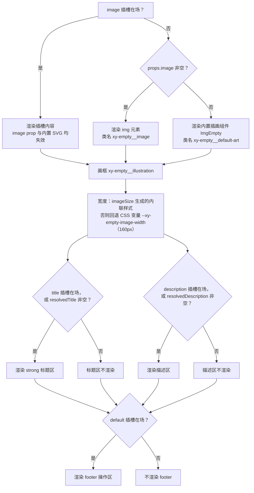
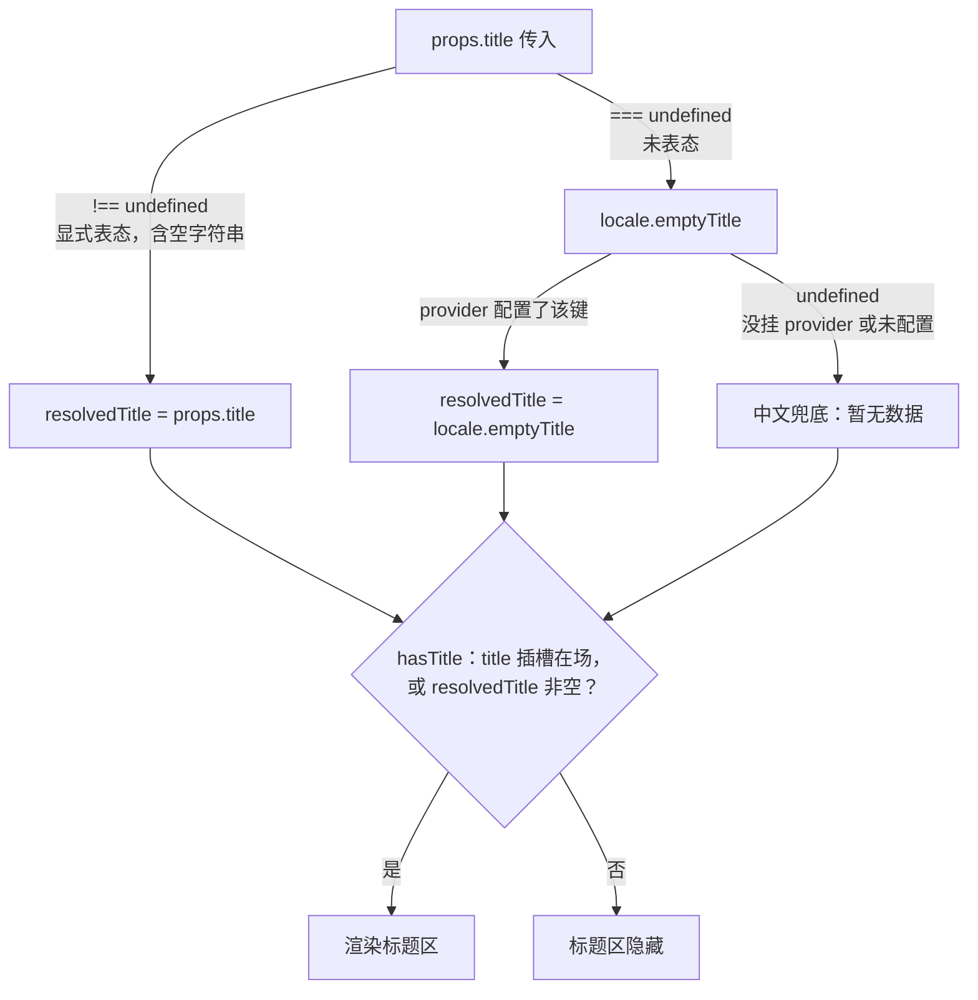
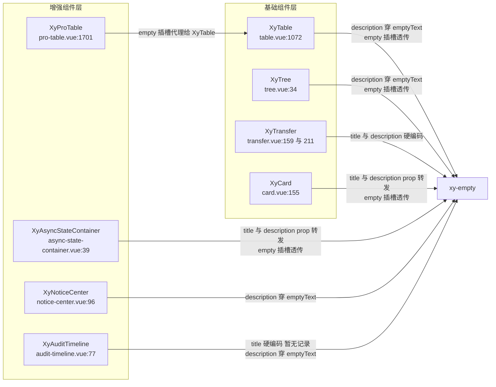

# 7-07 · Empty：无逻辑组件的规范

> 本篇是第 7 卷"反馈与浮层"的第七篇。核心问题：**纯展示组件的 API 纪律**。`xy-empty` 是全库最接近"零逻辑"的组件：83 行 SFC（`packages/components/empty/src/empty.vue`），没有 `ref` 可写状态，没有 `defineEmits`，没有暴露任何实例方法，没有一条 `watch`——但它是全库下游消费次数最多的组件之一：`XyTable`、`XyTree`、`XyTransfer`、`XyCard`、`XyNoticeCenter`、`XyAuditTimeline`、`XyAsyncStateContainer` 八处下游都把空态渲染委托给它。正因为被这么多人依赖，它的 5 个 props、4 个插槽、8 个 CSS 变量、两层文案回退，每一处都是"发布即契约"。本篇逐行拆解：83 行源码全文、image 的尺寸协商（画框而非画）、locale 三层默认文案链（6-01 引过的 `empty.vue:28-41` 消费段在此展开）、`empty.css` 全文的令牌消费、八处消费实证的三种接入模式，以及与 7-10 `result` 的分工边界。所有代码摘自当前工作区实态，行号逐一核对过。

---

## 一、83 行的"零逻辑"样本

先把 `empty.vue` 全文放在这里。后面所有讨论都建立在这 83 行之上：

```vue
<!-- packages/components/empty/src/empty.vue（全文，共 83 行） -->
<script setup lang="ts">
import { computed } from "vue";
import { useConfig, useNamespace } from "xiaoye-primitives";
import ImgEmpty from "./img-empty.vue";

export interface EmptyProps {
  title?: string;
  description?: string;
  image?: string;
  imageAlt?: string;
  imageSize?: number | string;
}

const props = withDefaults(defineProps<EmptyProps>(), {
  title: undefined,
  description: undefined,
  image: "",
  imageAlt: "",
  imageSize: ""
});
const slots = defineSlots<{
  image?: () => unknown;
  title?: () => unknown;
  description?: () => unknown;
  default?: () => unknown;
}>();

const ns = useNamespace("empty");
const { locale } = useConfig();
const resolvedTitle = computed(() => {
  if (props.title !== undefined) {
    return props.title;
  }
  return locale.value.emptyTitle ?? "暂无数据";
});
const resolvedDescription = computed(() => {
  if (props.description !== undefined) {
    return props.description;
  }
  return locale.value.emptyDescription ?? "这里还没有可展示的内容";
});
const hasTitle = computed(() => Boolean(slots.title) || resolvedTitle.value !== "");
const hasDescription = computed(
  () => Boolean(slots.description) || resolvedDescription.value !== ""
);
const imageStyle = computed(() =>
  props.imageSize !== undefined && props.imageSize !== ""
    ? {
        width: typeof props.imageSize === "number" ? `${props.imageSize}px` : props.imageSize
      }
    : undefined
);
</script>

<template>
  <div :class="ns.base.value">
    <div class="xy-empty__illustration" :style="imageStyle">
      <slot name="image">
        
        
      </slot>
    </div>
    <strong v-if="hasTitle" class="xy-empty__title">
      <slot name="title">
        {{ resolvedTitle }}
      </slot>
    </strong>
    <div v-if="hasDescription" class="xy-empty__description">
      <slot name="description">
        <p>{{ resolvedDescription }}</p>
      </slot>
    </div>
    <div v-if="slots.default" class="xy-empty__footer">
      <slot />
    </div>
  </div>
</template>
```

先校准"零逻辑"这个词的准确含义。empty 不是没有 JS——它有 25 行 `<script setup>`，五个 `computed`。它"零"的是三样东西：**没有可变状态**（没有一个 `ref` 被写入，所有 `computed` 都是 props + slots 到视图的纯映射）、**没有对外行为**（`defineEmits` 零条，实例方法零个）、**没有副作用**（没有 `watch`、没有定时器、没有 DOM 测量）。输入定了，输出就定了，渲染是纯函数。这是"无逻辑组件"的工程定义，而不是"代码量少"的修辞。

类型层有一个 4-03 篇考据过的细节：全库 64/73 的组件把 Props 接口放在独立的 `src/<name>.ts` 类型层文件里，九个例外（`collapse-transition`、`config-provider`、`empty`、`form`、`icon`、`popover`、`space`、`tag` 和 `shared`）把类型内联在 SFC 中——empty 是其中之一。`export interface EmptyProps` 直接写在 `<script setup>` 里（`empty.vue:6-12`），Vue 编译器对纯类型导出网开一面，编译产物会把它剥离，运行时零成本；而 `empty/index.ts` 再把它 re-export 出去：

```ts
// packages/components/empty/index.ts（全文，共 8 行）
import Empty from "./src/empty.vue";
import type { EmptyProps } from "./src/empty.vue";
import { withInstall } from "xiaoye-primitives";

export type { EmptyProps };

export const XyEmpty = withInstall(Empty, "xy-empty");
export default XyEmpty;
```

入口只有两件事：`withInstall(Empty, "xy-empty")` 显式注册 kebab-case 标签名（4-02 篇讲过的安装器体系），加上 `EmptyProps` 这一个主类型导出。没有任何多余的类型被抬到包根——这本身就是无逻辑组件纪律的一部分：它没有状态枚举、没有事件载荷、没有插槽入参类型，所以也没有东西需要从根入口"降级"。

组件在 manifest 里的登记位于 `packages/components/component-manifest.json:414-419`：`docsGroup: "feedback"`、`installExports: ["XyEmpty"]`、`installChecks` 断言 `xy-empty` 标签可被解析、`styleImports: ["empty"]` 挂接 `empty.css`。一份 JSON 管六处一致性，empty 也不例外。

整个组件的渲染决策可以用一张图说完：



注意图的右侧：每个分支最终都收敛到一个"渲染 / 不渲染"的布尔门，而不是"渲染成什么样"的参数选择。无逻辑组件的模板里只有 `v-if` 和插槽分发，没有复杂度可以藏身。

## 二、四个插槽：默认插槽与"自定义空态"

empty 的插槽面是 1 + 3：一个默认插槽（footer 操作区）加三个命名插槽（`image` / `title` / `description`，类型声明在 `empty.vue:21-26`）。这四段正好对应空态的信息层级——**插画（是什么样子）→ 标题（发生了什么）→ 描述（为什么）→ 操作（下一步做什么）**。文档页 `apps/docs/components/empty.md` 把这条链概括为"信息兜底 + 下一步动作"，这与 5-10 篇讲 Card 时提炼的插槽约定同构：每个"标准布局区"都配一个整槽让位入口，且**有内容才渲染**。

"有内容才渲染"在 empty 里有两个不同强度的实现。标题区和描述区用的是组合判断（`empty.vue:42-45`）：

```ts
// packages/components/empty/src/empty.vue L42-45
const hasTitle = computed(() => Boolean(slots.title) || resolvedTitle.value !== "");
const hasDescription = computed(
  () => Boolean(slots.description) || resolvedDescription.value !== ""
);
```

插槽在场即渲染——哪怕插槽内容是空的，这给了调用方完全的信任；prop 路径则要求非空字符串。而 footer 更干脆（`empty.vue:78`）：`v-if="slots.default"`，默认插槽不存在就不渲染容器，连"操作区的外框"都不出现。这和 Card 的 footer 逻辑（5-10 篇分析过 `card.vue` 的同款模式）是同一条约定在两个组件里的重放：**空容器是有视觉成本的，没有内容就不要画出容器**。

默认插槽的典型用法是给空态挂操作按钮，文档示例 `apps/docs/examples/empty/action.vue` 全文只有 8 行：

```vue
<!-- apps/docs/examples/empty/action.vue -->
<template>
  <xy-empty title="暂无工单" description="可以先创建第一条工单">
    <xy-space wrap>
      <xy-button type="primary">立即创建</xy-button>
      <xy-button plain>查看模板</xy-button>
    </xy-space>
  </xy-empty>
</template>
```

"暂无工单"是兜底信息，"立即创建"是下一步动作——两段信息分属两个内容通道（prop 管文案，插槽管组件），互不越界。这是无逻辑组件最重要的分工纪律：**prop 只承载"字符串能表达的东西"，凡是需要组件组合的内容，一律走插槽**。empty 没有提供 `actionText`、`actionType` 这类"按钮速记 prop"，因为一旦开了这个口子，`actionIcon`、`secondaryAction` 就会接踵而至，5 个 props 的收敛面就守不住了。

三个命名插槽的完整用法见 `apps/docs/examples/empty/custom-media.vue`，它同时演示了插槽替换和 CSS 变量覆写：

```vue
<!-- apps/docs/examples/empty/custom-media.vue -->
<script setup lang="ts">
const illustration = `data:image/svg+xml;utf8,${encodeURIComponent(`
  <svg xmlns="http://www.w3.org/2000/svg" width="160" height="96" viewBox="0 0 160 96" fill="none">
    <rect x="18" y="16" width="124" height="64" rx="18" fill="#E2E8F0" />
    <rect x="36" y="34" width="72" height="10" rx="5" fill="#94A3B8" />
    <rect x="36" y="52" width="48" height="10" rx="5" fill="#CBD5E1" />
    <circle cx="116" cy="48" r="12" fill="#2563EB" />
  </svg>
`)}`;
</script>

<template>
  <xy-empty
    :image="illustration"
    image-alt="排期任务空状态插画"
    style="
      --xy-empty-image-width: 176px;
      --xy-empty-footer-margin-top: 12px;
    "
  >
    <template #title>
      <strong>暂无排期任务</strong>
    </template>

    <template #description>
      <div class="xy-doc-stack">
        <span>你可以先创建第一个排期，或者从模板快速导入。</span>
        <xy-tag status="primary">支持自定义 image / image-alt / title / description</xy-tag>
      </div>
    </template>

    <xy-space wrap>
      <xy-button type="primary">新建任务</xy-button>
      <xy-button plain>导入模板</xy-button>
    </xy-space>
  </xy-empty>
</template>
```

这个示例里藏着一个很能说明问题的选择：示例想微调尺寸和间距时，没有去找任何 prop，而是直接覆写 `--xy-empty-image-width` 和 `--xy-empty-footer-margin-top` 两个组件级 CSS 变量。**配置面的另一半在 CSS 里**——prop 收敛掉的可配置性，由样式层公开的变量契约接住。第八节的纪律清单会把这个选择正式化。

## 三、image 的尺寸协商：谁说了算

`imageSize` 是 empty 五个 props 里唯一带类型联合的（`number | string`），也是唯一一个"计算后产出样式"的 prop。它的解析逻辑在 `empty.vue:46-52`：

```ts
// packages/components/empty/src/empty.vue L46-52
const imageStyle = computed(() =>
  props.imageSize !== undefined && props.imageSize !== ""
    ? {
        width: typeof props.imageSize === "number" ? `${props.imageSize}px` : props.imageSize
      }
    : undefined
);
```

三个分支值得逐一读：`undefined`（未传）和 `""`（默认值）都返回 `undefined`，即**不产出内联样式**，宽度交给 CSS 变量的默认值；数字统一补 `px` 单位；字符串原样透传——所以 `"12rem"`、`"50%"`、`"min(300px, 40vw)"` 都是合法输入。测试把这个协商钉得很死（`packages/components/empty/__tests__/empty.spec.ts:78-103`）：

```ts
// packages/components/empty/__tests__/empty.spec.ts L78-103
it("支持 imageAlt 和 imageSize", () => {
  const wrapper = mount(XyEmpty, {
    props: {
      image: "/empty.png",
      imageAlt: "空状态插画",
      imageSize: 120
    }
  });

  const image = wrapper.find(".xy-empty__image");
  expect(image.attributes("src")).toBe("/empty.png");
  expect(image.attributes("alt")).toBe("空状态插画");

  const illustration = wrapper.find(".xy-empty__illustration");
  expect(illustration.attributes("style")).toContain("width: 120px");
});

it("imageSize 支持字符串", () => {
  const wrapper = mount(XyEmpty, {
    props: {
      imageSize: "12rem"
    }
  });

  expect(wrapper.find(".xy-empty__illustration").attributes("style")).toContain("width: 12rem");
});
```

第一个用例里有一行最容易看漏的断言：`imageSize: 120` 生成的 `width: 120px` 挂在 `.xy-empty__illustration` 上，而不是 `.xy-empty__image` 上。也就是说，**imageSize 协商的是"画框"的宽度，不是"画"的宽度**。真正的图片和内置 SVG 都是 `width: 100%`（`empty.css:50-55`），在画框内自适应缩放。这个"画框"设计是第五节的主角，这里先记下结论：empty 对图片区域的理解不是一张图，而是一块被装裱起来的展示区。

对照 Element Plus 的同名组件：EP 的 `el-empty` 只有 `image`、`image-size`、`description` 三个 props，其中 `imageSize` **只收 `number` 类型**且直接设在内置插画 `` 的 width 上。本库有两处刻意的偏离：一是类型放宽为 `number | string`，让响应式场景（容器查询、百分比、rem）不必绕道 style 属性；二是作用对象从"图"改成"画框"，让自定义图片和内置 SVG 获得同样的装裱处理。偏离的代价是"imageSize"的语义与 EP 不再逐字对齐——迁移者要重新理解一次——收益是尺寸协商只有一个权威入口（画框），不会出现"prop 设了 200 但画框 padding 又吃掉 36px"的隐式数学。

image 渲染的优先级链条也在这张协商图里：image 插槽 > image prop > 内置 SVG。测试用例 6 钉住了最高优先级（`empty.spec.ts:64-76`）：插槽在场时，即使 `image: "/empty.png"` 也断言 `.xy-empty__image` 不存在。内置插画 `ImgEmpty` 是一个 22 行的纯模板组件（`packages/components/empty/src/img-empty.vue`）：

```vue
<!-- packages/components/empty/src/img-empty.vue（全文，共 22 行） -->
<template>
  <svg
    viewBox="0 0 160 120"
    fill="none"
    xmlns="http://www.w3.org/2000/svg"
    aria-hidden="true"
    class="xy-empty__default-art"
  >
    <rect x="18" y="24" width="124" height="72" rx="24" fill="#F8FAFC" />
    <rect x="34" y="42" width="68" height="10" rx="5" fill="#CBD5E1" />
    <rect x="34" y="60" width="48" height="10" rx="5" fill="#E2E8F0" />
    <rect x="108" y="38" width="20" height="20" rx="10" fill="#BFDBFE" />
    <path
      d="M113 74C113 69.5817 116.582 66 121 66H126C130.418 66 134 69.5817 134 74V75C134 79.4183 130.418 83 126 83H121C116.582 83 113 79.4183 113 75V74Z"
      fill="#DBEAFE"
    />
    <path
      d="M54 18C54 13.5817 57.5817 10 62 10H98C102.418 10 106 13.5817 106 18V20C106 24.4183 102.418 28 98 28H62C57.5817 28 54 24.4183 54 20V18Z"
      fill="#EFF6FF"
    />
  </svg>
</template>
```

三张圆角矩形卡片加一枚蓝色圆形徽章，viewBox 固定 160×120，与画框默认宽 160px 的比例咬合。它没有 script、没有 props、没有类名派生——连"无逻辑"都做到了极致。但注意它的填充色：`#F8FAFC`、`#CBD5E1`、`#E2E8F0`、`#BFDBFE`、`#DBEAFE`、`#EFF6FF`，全部是硬编码 hex。这不是疏忽，第七节权衡四会专门讨论它。

## 四、locale 默认文案链：三层兜底

6-01 篇讲 ConfigProvider 时引用过 `empty/src/empty.vue:28-41` 的 useConfig 消费段，把它列为全库仅有的两处 locale 文案消费之一（另一处是 popconfirm），并给出"文案三段式：props → locale → 中文兜底"的定性。本篇把这个配置链完整展开。先看消费端已经引过的 41 行（`empty.vue:28-41`），再看供给端的两站：

```ts
// packages/xiaoye-primitives/src/composables/use-config.ts L28-49（消费端注入）
export function useConfig<
  DialogConfig = unknown,
  LoadingConfig = unknown,
  MessageConfig = unknown,
  NotificationConfig = unknown
>(): ConfigContext<DialogConfig, LoadingConfig, MessageConfig, NotificationConfig> {
  const injectedConfig = inject(configProviderKey, null);

  if (injectedConfig) {
    return injectedConfig as ConfigContext<
      DialogConfig,
      LoadingConfig,
      MessageConfig,
      NotificationConfig
    >;
  }

  return {
    namespace: computed(() => DEFAULT_NAMESPACE),
    size: computed(() => DEFAULT_SIZE),
    zIndex: computed(() => DEFAULT_Z_INDEX),
    locale: computed(() => ({} as Locale)),
    dialog: computed(() => ({}) as DialogConfig),
    loading: computed(() => ({}) as LoadingConfig),
    message: computed(() => ({}) as MessageConfig),
    notification: computed(() => ({}) as NotificationConfig)
  };
}
```

```ts
// packages/components/config-provider/src/config-provider.vue L21-34（供给端 provide）
const props = withDefaults(defineProps<ConfigProviderProps>(), {
  namespace: "xy",
  locale: () => ({}),
  zIndex: 2000,
  size: "md",
  dialog: () => ({}),
  loading: () => ({}),
  message: () => ({}),
  notification: () => ({})
});

const globalConfigId = `xy-config-provider-${Math.random().toString(36).slice(2, 10)}`;

provide(configProviderKey, createConfigProviderContext(props));
```

locale 键的**窄接口**定义在共享层（`packages/xiaoye-primitives/src/composables/shared-context.ts:8-13`）：`Locale` 只有四个键——`emptyTitle`、`emptyDescription`、`popconfirmConfirmButtonText`、`popconfirmCancelButtonText`。而 config-provider 的 props 层是宽类型 `Record<string, string>`（`packages/components/config-provider/src/context.ts:19、30`），经 `createConfigProviderContext` 的 `locale: computed(() => options.locale ?? {})`（同文件 46 行）下发。6-01 篇把这套设计概括为"宽进严出"：业务方想塞什么键都行，组件消费端只按窄接口取值。

把三段式串起来，empty 的标题解析完整链路如下（description 同构）：



这条链有三个设计决策值得拆开。

**决策一：`??` 而不是 falsy 判断。** `locale.value.emptyTitle ?? "暂无数据"`（`empty.vue:34`）只在 `null`/`undefined` 时回退。如果写成 `||`，业务方在 locale 表里配空字符串想表达"不要默认标题"就会被静默吞掉。配合 `resolvedTitle !== ""` 的显式隐藏语义（`empty.vue:42`），空字符串在 prop 路径上是"我要隐藏"的哨兵，在 locale 路径上是"我确实要空白"的合法值——两个路径对 `""` 的处理不同，靠的正是 `??` 的精确回退边界。

**决策二：组件自带中文兜底，而不是强制要求 provider。** 注意 `use-config.ts:49` 的兜底值是 `computed(() => ({} as Locale))`——`{} as Locale` 是一个刻意的类型让步：`Locale` 四个键全部可选，空对象在类型上合法，运行时访问 `emptyTitle` 得到 `undefined`，随后 `??` 接住。效果是：**一个 `xy-empty` 不挂在任何 ConfigProvider 下也能渲染出完整空态**。测试第一条用例（`empty.spec.ts:10-16`）就是在无 provider 环境下断言默认插画加"暂无数据"/"这里还没有可展示的内容"。locale 是增强项而不是依赖项，这是空态组件的可用性底线——你不会希望"忘了包 provider"的时候页面空白得连空态都不剩。

**决策三：显式空串隐藏 vs 未传回退，是两个不同的 API 语义。** `withDefaults` 的默认值表（`empty.vue:14-20`）里藏着一个双哨兵设计：`title: undefined`、`description: undefined` 是"未表态，走回退链"；`image: ""`、`imageAlt: ""`、`imageSize: ""` 是"无自定义内容"。于是对 title/description 而言，`""` 不再是"没内容"而是"我明确要你消失"——`withDefaults` 无法区分"没传"和"传了 undefined"，但空字符串可以。测试用例 4 和 5 把这两个哨兵分别钉住（`empty.spec.ts:42-51`、`53-62`）：

```ts
// packages/components/empty/__tests__/empty.spec.ts L42-62
it("title 传空字符串时隐藏标题区", () => {
  const wrapper = mount(XyEmpty, {
    props: {
      title: ""
    }
  });

  expect(wrapper.find(".xy-empty__title").exists()).toBe(false);
  expect(wrapper.find(".xy-empty__description").exists()).toBe(true);
});

it("description 传空字符串时隐藏描述区", () => {
  const wrapper = mount(XyEmpty, {
    props: {
      description: ""
    }
  });

  expect(wrapper.find(".xy-empty__description").exists()).toBe(false);
  expect(wrapper.text()).not.toContain("这里还没有可展示的内容");
});
```

locale 回退链本身也有测试，用例 3（`empty.spec.ts:25-40`）挂了一个真实 `XyConfigProvider`，断言 `emptyTitle: "暂无项目"`、`emptyDescription: "还没有内容"` 生效。文档页 `apps/docs/components/empty.md` 把这条链写进了 API 表：`title` 的默认值栏直接标注"未传时回退到 `locale.emptyTitle` 或 `'暂无数据'`，显式传 `''` 时隐藏标题区"——三层语义全部写进契约，不靠读源码反推。

## 五、empty.css：令牌消费与"画框"设计

样式全文 86 行，是理解"无逻辑组件仍有完整规范"的另一半证据：

```css
/* packages/theme/src/components/empty.css（全文，共 86 行） */
.xy-empty {
  --xy-empty-padding: 32px 16px;
  --xy-empty-gap: var(--xy-space-3);
  --xy-empty-image-width: 160px;
  --xy-empty-title-color: var(--xy-text-heading);
  --xy-empty-description-color: var(--xy-text-muted);
  --xy-empty-footer-margin-top: var(--xy-space-3);
  --xy-empty-illustration-background: color-mix(
    in srgb,
    var(--xy-bg-subtle) 72%,
    var(--xy-bg-container)
  );
  --xy-empty-illustration-border-color: color-mix(
    in srgb,
    var(--xy-border-subtle) 88%,
    var(--xy-border)
  );

  display: flex;
  flex-direction: column;
  align-items: center;
  gap: var(--xy-empty-gap);
  max-width: 440px;
  margin: 0 auto;
  padding: var(--xy-empty-padding);
  box-sizing: border-box;
  text-align: center;
  color: var(--xy-empty-description-color);
}

.xy-empty__illustration {
  display: flex;
  align-items: center;
  justify-content: center;
  width: var(--xy-empty-image-width);
  max-width: 100%;
  padding: 18px;
  border: 1px solid var(--xy-empty-illustration-border-color);
  border-radius: calc(var(--xy-radius-lg) + var(--xy-radius-sm));
  background: var(--xy-empty-illustration-background);
  box-shadow: inset 0 0 0 1px color-mix(in srgb, var(--xy-bg-floating) 12%, transparent);
}

.xy-empty__default-art {
  display: block;
  width: 100%;
  height: auto;
}

.xy-empty__image {
  display: block;
  width: 100%;
  height: auto;
  object-fit: contain;
}

.xy-empty__title {
  color: var(--xy-empty-title-color);
}

.xy-empty__title p,
.xy-empty__description p {
  margin: 0;
}

.xy-empty__title p {
  font-size: var(--xy-font-size-lg);
  font-weight: var(--xy-font-weight-semibold);
  line-height: 1.35;
  letter-spacing: -0.01em;
}

.xy-empty__description {
  color: var(--xy-empty-description-color);
  font-size: var(--xy-font-size-md);
  line-height: 1.6;
  max-width: 32ch;
}

.xy-empty__footer {
  display: inline-flex;
  justify-content: center;
  align-items: center;
  gap: var(--xy-space-2);
  margin-top: var(--xy-empty-footer-margin-top);
}
```

这份 CSS 的结构是全库组件样式的标准范式：**组件级变量声明（默认值引用语义令牌）+ 布局消费变量**。8 个 `--xy-empty-*` 变量（`empty.css:2-17`）全部定义在 `.xy-empty` 根选择器上，子元素只消费不定义——于是调用方在任意祖先节点覆写一个变量就能定制整棵子树（第二节的 custom-media 示例正是这么做的）。变量默认值全部落在语义层与刻度层令牌上：`--xy-space-3`（12px）、`--xy-text-heading`、`--xy-text-muted`、`--xy-font-size-lg/md`、`--xy-font-weight-semibold`、`--xy-radius-lg/sm`、`--xy-space-2`，这些令牌都定义在 `packages/xiaoye-primitives/src/theme/tokens.css`（语义色板在 94-115 行、字号 203-204 行、字重 214 行、圆角 230-232 行、间距 238-239 行）——暗色主题下这些变量整体反转，empty 不需要写一行 `@media` 或 `[data-theme]` 覆写就自动适配双主题。这就是 3-01 篇讲的"组件样式只消费语义层与刻度层"纪律的完整兑现。

两处 `color-mix`（`empty.css:8-17`）值得一提：画框背景是 `--xy-bg-subtle` 72% 混 `--xy-bg-container`，边框色是 `--xy-border-subtle` 88% 混 `--xy-border`。为什么不直接用现成令牌？因为插画区的对比度需要落在两个既有令牌**之间**——比面板底色略深、比边框色略浅，制造一层"若隐若现的装裱"。`color-mix` 让这种中间态也保持令牌可追溯：主题一换，混色结果跟着换，不存在硬编码中间色。

"画框"本体在 `empty.css:31-42`：`padding: 18px` 的留白、1px 边框、`calc(var(--xy-radius-lg) + var(--xy-radius-sm))` 的圆角（6px + 3px = 9px，一档主圆角加一档微调圆角，比直接写 9px 多出令牌语义）、内阴影再压一层浮起感。内置 SVG 和自定义图片都是 `width: 100%` 被动填满。这个设计的收益在暗色主题下最明显：`#F8FAFC` 的浅色插画直接放在 `#161839` 的暗色容器上会刺眼，但它被包在一块带背景、带边框的画框里，画框的色值全部跟随主题——**画是资产，框是皮肤**，对比度由框来承载。

排版细节也有两处"克制"：根元素 `max-width: 440px; margin: 0 auto`（`empty.css:23-24`）让空态在宽容器里自动居中而不拉满；描述区 `max-width: 32ch`（`empty.css:77`）以"0"字形宽度为标尺限制行宽，长文案会被折行而不是横贯画布。无逻辑组件没有 JS 去做测量和断行，所有"阅读舒适度"都是纯 CSS 达成的——这也反过来解释了为什么它不需要逻辑。

## 六、消费实证：八处下游的三种接入模式

`rg 'xy-empty|XyEmpty' packages` 的命中清单里，真正的消费方有八个。按接入方式可以归成三类，这张拓扑图先给出全景：



**模式一：只喂 description。** 数据型容器最常见的形态——空态的"发生了什么"由容器自己说，empty 负责版式与插画。`XyTable` 的兜底渲染点在 `packages/components/table/src/table.vue:1069-1074`：

```vue
<!-- packages/components/table/src/table.vue L1069-1074 -->
        <div v-else-if="!props.loading" class="xy-table__empty" :class="{ 'is-overview': props.overview }">
          <slot name="empty">
            <xy-empty :description="props.emptyText" />
          </slot>
        </div>
```

三个信号同时在场：`v-else-if="!props.loading"` 说明**空态的时机判定（loading 优先）是容器的职责**；`<slot name="empty">` 给了调用方整体替换权；默认兜底只穿了 `emptyText` 一个 prop。`XyTree` 是同构实现（`tree.vue:32-35`，`isEmpty` 由 `visibleNodes.length === 0` 派生，见 117 行），`XyNoticeCenter` 也是（`notice-center.vue:96`）。

**模式二：title + description 双 prop 转发。** 状态语义更丰富的容器会把两个文案通道都开放。`XyCard` 在 loading / empty 双状态里把 empty 五件套（`empty`、`emptyTitle`、`emptyDescription`，5-10 篇引过）转发下来（`packages/components/card/src/card.vue:152-157`）：

```vue
<!-- packages/components/card/src/card.vue L152-157 -->
      <template v-else-if="props.empty">
        <slot name="empty">
          <div class="xy-card__state xy-card__empty">
            <XyEmpty :title="props.emptyTitle" :description="props.emptyDescription" />
          </div>
        </slot>
      </template>
```

增强层的状态容器 `XyAsyncStateContainer` 是同一个模式的升级版：loading / error / empty 三态互斥排列，empty 分支同样以插槽兜底（`packages/pro-components/async-state-container/src/async-state-container.vue:25-42`）：

```vue
<!-- packages/pro-components/async-state-container/src/async-state-container.vue L25-42 -->
    <slot v-if="props.loading" name="loading">
      <div class="xy-async-state-container__state is-loading">
        <strong>{{ props.loadingText }}</strong>
      </div>
    </slot>
    <slot v-else-if="props.error" name="error" :error="props.error">
      <div class="xy-async-state-container__state is-error">
        <strong>加载失败</strong>
        <xy-text type="danger">{{ props.error }}</xy-text>
        <xy-button type="primary" plain @click="emit('retry')">重新加载</xy-button>
      </div>
    </slot>
    <slot v-else-if="props.empty" name="empty">
      <div class="xy-async-state-container__state is-empty">
        <xy-empty :title="props.emptyTitle" :description="props.emptyDescription" />
      </div>
    </slot>
    <slot v-else />
```

注意这个增强组件自己的 props 默认值（`async-state-container.vue:13-14`）：`emptyTitle: "暂无数据"`、`emptyDescription: "当前条件下没有可展示的内容。"`——它**没有**走 locale 链，而是自己再兜了一层默认值。于是从 async-state-container 到 xy-empty 的链路是四层：组件默认值 → 调用方 prop → xy-empty 的 locale → 中文兜底。这是"空态"语义在增强层的又一次转述，也是值得警惕的样板：每多一层转发，文案追查就多一站。

**模式三：硬编码业务文案。** `XyTransfer` 的两个列表各挂一枚空态，文案直接写死（`packages/components/transfer/src/transfer.vue:159`、`211`）：

```vue
<!-- packages/components/transfer/src/transfer.vue L159 -->
        <xy-empty v-else title="暂无条目" description="左侧列表没有可展示内容" />
```

`XyAuditTimeline` 同理（`audit-timeline.vue:77-81`）：`title="暂无记录"` 硬编码，`description` 穿 `emptyText`。这类接入把 empty 当"带默认文案的版式组件"用——title 是业务语义，没有开放成 prop 的必要。

还有一条特殊的链：`XyProTable`（`packages/pro-components/pro-table/src/pro-table.vue:1700-1701`）自己**不渲染** empty，只把调用方的 `empty` 插槽代理给内层 `XyTable` 的 `#empty`，真正的兜底渲染点仍是 `table.vue:1072`。增强层不改写基础层的默认空态，只做插槽透传——层级之间的克制。

八处消费，没有一处需要 empty 提供事件、方法或状态。反过来，empty 的所有扩展需求都被三个通道消化：文案走 prop（模式二）、版式走插槽（模式三的兜底替换）、尺寸与间距走 CSS 变量。**下游的多样性没有反推出一个新增 prop**——这是第五节清单最好的实证。

## 七、四个设计权衡

### 权衡一：props 收敛 vs 可配置面

empty 只有 5 个 props，而且全部是**渲染参数**（渲染成什么样），没有一个是**行为参数**（什么时候渲染）。对照它的下游就能看出这不是"功能少"，而是职责切分：什么时候是空态，由 `XyTable` 的 `v-else-if="!props.loading"`（table.vue:1070）、`XyCard` 的 `props.empty`（card.vue:152）、`XyAsyncStateContainer` 的三态互斥（async-state-container.vue:25-42）各自判定——**状态判定的责任上移，empty 保持纯函数**。

每多一个 prop 都是永久债务：假设给 empty 加 `size`，马上要回答 size 影响什么（插画？字号？间距？）、与 CSS 变量谁优先、与容器的尺寸体系如何对齐；加 `padding`、`level`、`variant` 同理。而现实中这几个诉求全部被 CSS 变量接住了——`--xy-empty-padding`、`--xy-empty-image-width`、`--xy-empty-gap` 八个变量就是 empty 的"第二配置面"，它们比 prop 便宜（不用过 Vue 的响应式系统）、比 prop 灵活（选择器任意嵌套、主题层可批量调）、也比 prop 稳定（不会进 TypeScript 的公开 API 面）。文档页把 8 个变量全部列表公布（`apps/docs/components/empty.md` 的 "Empty CSS Variables" 表），**收敛的是 prop 面，不收敛可配置性**——这是无逻辑组件最重要的平衡术。EP 对比：EP 的 `el-empty` 用 3 个 props 加 `--el-empty-*` 少量变量走的是同一条路，但它的 `imageSize` 只收 number，且 EP 没有把 empty 的间距、标题颜色做成组件级变量——本库把变量契约公开得更彻底，代价是这 8 个变量名也成了契约，改名即破坏。

### 权衡二：locale 默认文案链的位置

默认文案可以放在三个位置：主题包的 locale 表里、组件常量里、或者不提供默认（强制调用方传）。empty 选了第三种和第二种之间：**组件内中文兜底 + locale 可覆盖**。这个选择的容错性最好——没有 provider 时空态依然完整（第四节决策二）——但代价是默认文案散落在组件源码里（`"暂无数据"` 在 empty.vue:34，也在 async-state-container.vue:13 各出现一次），想做集中式 i18n 抽取时，组件常量是扫描的起点。另一侧的对照是 EP：EP 的空态默认描述走 `useLocale()` 的 `t('el.empty.description')` 函数式翻译，语言包集中、切换语言即刻生效，但组件必须在语言包齐全的前提下才显示合理文案，本库的四键窄接口（`shared-context.ts:8-13`）没有翻译函数、没有命名空间嵌套，是"配置表"而不是"i18n 框架"。规模小的时候这是简化，语言多了以后四键会膨胀成键表——Locale 接口的每次扩键都是共享层的破坏性变更候选，这是本库 locale 设计明码标价的成长成本。

### 权衡三：与 result 的边界——自由空态 vs 预设结果

empty 和 result（7-10 篇的主角）长得很像：都是图标/插画 + 标题 + 描述 + 操作区的竖排结构。但两者的源码形态立刻分出了岔路。result 的 `<script setup>` 有 88 行（`packages/components/result/src/result.vue:1-88`），从独立的 `result.ts` 引入三张映射表（12-17 行：`RESULT_ICON_NAME_MAP`、`RESULT_STATUS_ICON_MAP`、`RESULT_STATUS_TONE_MAP`），`status` prop 驱动图标、色调、`is-{tone}` 类名和 `--{status}` 修饰类的整套派生（81-87 行的 `rootClasses`），还带 `size` 全局回退（50 行）与 `sub-title` 遗留插槽的兼容分支（75-77 行）。empty 的全部逻辑是两个文案解析加一个样式对象。

语义边界可以一句话说清：**empty 回答"数据不在"，result 回答"流程结束"**。前者是数据侧状态——对象还在、页面还在，只是当前查询没有内容，所以它给下一步动作（默认插槽 footer 的存在感）；后者是行为侧终态——操作已经发生（提交成功、审批驳回、网络失败），所以它用 status 枚举陈述结论，操作区叫 `extra`（附加动作）而不是 footer（下一步）。消费侧的选择印证了边界：`XyAsyncStateContainer` 的空数据分支用的是 `xy-empty`（async-state-container.vue:39）而非 `xy-result`——请求成功但结果为空，是数据侧语义；而 error 分支自己画了"加载失败 + 重新加载"，因为"失败"是流程结论，本该是 result 的领地（这里受限于三态容器的轻量定位没有引入 result，是边界的一个灰区）。

规则上：给用户的页面级"操作结果反馈"用 result（status 驱动的预设组合），给列表、表格、面板的"无内容占位"用 empty（自由内容组合）。一个收口成枚举，一个开放成插槽——两种 API 形态对应两种确定性需求。

### 权衡四：内置插画是资产还是皮肤

`img-empty.vue` 的六个填充色是硬编码 hex，不随主题变。对照 EP：EP 的内置插画 ImgEmpty 把每段填充色都声明成 `--el-empty-fill-color-*` 变量挂在主题上，SVG 引用变量，暗色主题整体换肤。本库反着选——**插画是品牌资产，不是主题皮肤**。理由有三：插画的表达力依赖一组精心挑选的色阶关系（`#F8FAFC` 到 `#DBEAFE` 的蓝灰渐层），变量化等于把这段设计权威交还给每个主题；空态插画在双主题下都置于画框内（第五节），画框的背景/边框由令牌驱动，已经解决了对比度问题；自定义 `image` 的调用方本来就传任意图片，资产不会"跟主题走"是更普遍的默认预期。代价同样真实：如果未来某主题需要"暗色调插画"，唯一的路是整体替换 `image`，内置 SVG 没有暗色变体。这是一个把一致性押在"框"上、把个性留给"画"的选择——无逻辑组件连自己的审美都是收敛的。

## 八、无逻辑组件的 API 纪律（清单）

把前七节收敛成五条可复用的纪律。它们不是 empty 的特殊设计，而是"纯展示组件"这个类别的通用规范：

1. **props 收敛到渲染参数。** 全部 props 回答"渲染成什么样"，不回答"什么时候渲染"（状态判定归容器）与"渲染完做什么"（无事件、无方法）。empty 的 5 个 props 里没有任何行为参数。
2. **不引入状态。** 没有 ref 写入、没有 emits、没有 watch、没有实例方法暴露。逻辑只剩"props + slots → 视图"的纯映射 computed。这保证了它永远可以被任意容器安全嵌套——不会有隐藏的时序耦合。
3. **每个渲染分支都有显式关闭语义。** 空字符串隐藏标题/描述区（双哨兵设计）、`v-if="slots.default"` 控制容器有无、插槽优先级高于 prop 高于内置默认。调用方对"显示什么、不显示什么"永远有明确的手柄，而不是靠碰运气覆盖默认值。
4. **样式全部走令牌 + 组件级 CSS 变量。** 变量默认值引用语义层/刻度层令牌（双主题自动成立），变量本身公开成文档契约。prop 收敛掉的配置面由 CSS 变量接住。
5. **测试钉渲染契约，而非行为。** empty.spec.ts 的 9 个用例没有一条测交互——因为无交互可测。9 条用例分成三组：默认渲染什么（用例 1、2）、回退链怎么走（用例 3 locale、用例 4/5 空串隐藏）、插槽与尺寸协商（用例 6、7、8、9）。`enableAutoUnmount(afterEach)`（`empty.spec.ts:7`）保证挂载清理。渲染契约测试的价值在于**防回归**：83 行里任何一处 `v-if` 条件被"顺手优化"，测试立刻报警。

类型纪律是第五条半：`EmptyProps` 内联导出 + `index.ts` 只导出组件值与主类型，类型夹具 `tests/types/fixtures/empty.ts`（48 行）用正反例钉住类型面——正向覆盖数字尺寸与字符串尺寸两种联合分支（4-10 行、14-18 行），四个插槽全覆盖（20-34 行），反向用 `@ts-expect-error` 钉住 `imageAlt: 1` 与 `imageSize: true` 的类型错误（36-48 行）：

```ts
// tests/types/fixtures/empty.ts L36-48
const invalidImageAlt: EmptyProps = {
  // @ts-expect-error imageAlt should be a string
  imageAlt: 1
};

void invalidImageAlt;

const invalidImageSize: EmptyProps = {
  // @ts-expect-error imageSize should be a string or number
  imageSize: true
};

void invalidImageSize;
```

`imageSize: true` 这条反例尤其重要——它保证第三节那个 `typeof` 分支的联合类型不会被"顺手"放宽成 `any`。无逻辑组件的 API 面小，每一条类型边都值得用夹具守着。

## 九、小结与预告

empty 证明了"无逻辑"不等于"无设计"。83 行 SFC 里有双哨兵的 prop 语义、三层兜底的文案链、插槽与 prop 与 CSS 变量的三通道扩展面；86 行 CSS 里有画框式的插画装裱、令牌化的双主题适配；115 行测试钉死全部渲染契约；八处下游消费没有一处逼它加过一个新 prop。**无逻辑组件的规范，本质上是一套"把复杂性留给谁"的分配方案**：状态判定留给容器、内容组合留给插槽、视觉定制留给 CSS 变量、文案回退留给 locale 链——empty 自己只保留一件事：把空态画得得体，并且永远画得出来。

下一篇 7-08《Loading：指令与服务双注册》将走向另一个极端：同样是反馈类组件，Loading 不再是纯展示——它要以指令（`v-loading`）和服务（函数式调用）两种形态注册进 Vue 的组件体系，4-11/4-12 篇铺陈过的命令式服务治理将在它身上完成合流。从"零逻辑"到"双注册"，第 7 卷的两极即将会师。
